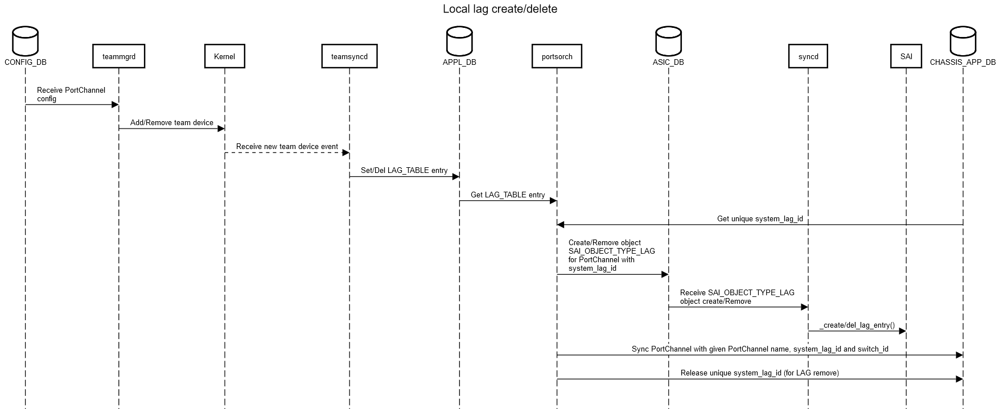

# LAG on Distributed VOQ System
# High Level Design Document
### Rev 1.0

# Table of Contents
  * [List of Tables](#list-of-tables)

  * [Revision](#revision)

  * [About this Manual](#about-this-manual)

  * [Scope](#scope)

  * [Definitions/Abbreviation](#definitionsabbreviation)
 
  * [1 Requirements and Restrictions](#1-requirements-and-restrictions)
  * [2 Design Constraints and Proposal](#2-design-constraints-and-proposal)
    * [2.1 Alignment with Distributed VOQ SONiC Architecture](#21-alignment-with-distributed-voq-sonic-architecture)
    * [2.2 LAG Requirements for VOQ SAI](#22-lag-requirements-for-voq-sai)
    * [2.3 High Level Proposal](#23-high-level-proposal)
  * [3 Design Details](#3-design-details)
    * [3.1 Configuration](#31-configuration)
    * [3.2 Modules Design](#32-modules-design)
    * [3.3 System LAG ID management](#33-system-lag-id-management)
  * [4 Databases](#4-databases)
    * [4.1 CONFIG_DB](#41-config_db) 
    * [4.2 APPL_DB](#42-appl_db) 
    * [4.3 CHASSIS_APP_DB](#43-chassis_app_db)
  * [5 SAI](#5-sai)
  * [6 Flows](#6-flows)
    * [6.1 Local LAG Create](#61-local-lag-create) 
    * [6.2 Local LAG Member Add](#62-local-lag-member-add) 
    * [6.3 Remote LAG Create](#63-remote-lag-create)
    * [6.3 Remote LAG Member Add](#64-remote-lag-member-add)
  * [7 Example Configurations](#7-example-configurations)
  * [8 Example Show Commands](#8-example-show-commands)


###### Revision

| Rev |     Date    |       Author                                                                              | Change Description                |
|:---:|:-----------:|:-----------------------------------------------------------------------------------------:|-----------------------------------|
| 1.0 |             |     Srikanth Keesara, Vedavinayagam Ganesan, Sureshkannan Duraisamy (Nokia's Sonic Team)  | Initial version                   |

# About this Manual
This document describes changes needed for the correct operation of LAG in a distributed VOQ system.
# Scope
The audience for this document is expected to be familiar with the architecture that SONiC has adopted to support a distributed VOQ system. As such the scope of this document is limited to discussing how LAG works within the context of that architecture. 

# 1 Requirements and Restrictions
Link Aggregation Group with port members spanning more than one ASIC will not be supported. All other LAG related capabilities are expected to be supported on par with how SONiC supports LAG on a single asic system. Specifically the following are expected to be supported.
*  Forwarding of traffic ingressing on one asic and egressing on anther ASIC via a LAG. Egress LAG member port selection must be on par with how it would happen if the ingress and egress ports were on the same asic.
*  Use of LACP
*  Dynamic creation/deletion of LAG.
*  Dynamic changes to LAG membership configuration

# 2 Design Constraints and Proposal
The design must satisfy both of the following constraints

## 2.1 Alignment with Distributed VOQ SONiC Architecture
Each ASIC within the system is under the control of its own set of instances of the SONiC Network Stack components (syncd, swss, bgp, lldp, teamd, database). The architecture allows for information produced for/by one ASIC to be shared with the other asics via the use of a centralized database CHASSIS_APP_DB. This mechanism is currently used to exchange Neighbor information across different asics within a VOQ system.

## 2.2 LAG Requirements for VOQ SAI
The following rules apply with regard to programming LAG information via SAI on a distributed VOQ system
*  Every LAG needs to be created in SAI of all of the asics in the system. This is irrespective of which asic the member ports of a LAG "belong" to.
*  The active member port list for each LAG should be the same in the SAI instance of every asic. 
*  Any update to the member port list of any LAG must be propagated to all of the SAI instances.
*  The changes made to SAI for VOQ support allow the member port list for a LAG to be specified as a list of system ports
*  SAI allows the application layer to specify a "LAG_ID" (SAI_LAG_ATTR_SYSTEM_PORT_AGGREGATE_ID) as part of LAG creation. For a given LAG - the same value must be used on all the SAI instances.

## 2.3 High Level Proposal
The high level proposal is described here. The details are in the sections that follow. Each asic SONiC instance is responsible for LAG and LAG member ports that belong to that asic. Among other things this includes processing the configuration and keeping the application database updated with each LAG and its active member port list.
*  The LAG configuration for an asic is limited to those LAGs which have its own network ports as members.
*  Two new tables are defined and are a part of the Centralized Database CHASSIS_APP_DB. They are - "System LAG Table" and "System LAG Membership Table"
*  The "System LAG Table" has an attribute called the "system_lag_id". This attribute will be automatically generated (mechanism is described further down in this document).
*  The SONiC network stack instance associated with an asic updates the entries in these tables for LAG and LAG Members that are controlled by that asic.
*  All of the asic SONiC instances subscribe to these two tables and receive updates for remote LAG and LAG membership changes. These updates are programmed into the asic via the SAI APIs.
Please note that the only per asic SONiC components that are aware of a remote LAG are SWSS and SYNCD. Other components (like teamd for example) are only aware of local LAG.

## 3 Design Details

### 3.1 Configuration

* The **LAG configuration** in VOQ chassis is same as is done in non-VOQ chassis system. No changes are required. LAG expected to be configured on local ports only. No requirement to make system port specific LAG configuration. 
* The name of the LAG in the PORTCHANNEL table should be unique within the entire VOQ System. User must make sure that name of PortChannel is unique across the chassis system and must start with "PortChannel".
* Also no changes are required for **LAG Member** configuration and **LAG Interface** configurations. PORTCHANNEL_MEMBER table and PORTCHANNEL_INTERFACE table are used in the same way how they are used in non-chassis system.

### 3.2 Modules Design

#### teamd: teamsyncd

* teamsyncd will act as if its single asic sonic system and on local ports LAG management. So, there is no changes required in teamsyncd. 

#### orchagent: portsorch
**Local LAG**: portsorch obtains a system wide unique system_lag_id from centralized database CHASSIS_APP_DB. portsorch sends this system_lag_id in SAI_LAG_ATTR_SYSTEM_PORT_AGGREGATE_ID attribute to SAI while creating LAG in SAI. After creating local LAG, the PortChannel with switch_id and system_lag_id is written to the SYSTEM_LAG_TABLE in centralized database CHASSIS_APP_DB. The lag members of the local LAG use local port ids. Any member addition/removal members to a local LAG is written to the SYSTEM_LAG_MEMBER_TABLE in centralized database CHASSIS_DB. For lag members, the PortChannel name and system port alias of the local port members are used as the key. 

**Remote LAG**: To create LAG corresponding to a LAG on another asic, the system_lag_id will be from corresponding entry in the SYSTEM_LAG_TABLE from CHASSIS_APP_DB. The Lag members for a remote LAG will be specified using the OID of the corresponding system port objects.

Changes in orchagent/portsorch include: 
 * Port structure enhancement to store the system lag info such as system lag name (alias), system lag id and switch_id.
 * Getting a chassis wide unique system_lag_id from centralized databse using lua script that can do atomic allocation/deallocation of system_lag_id globally
 * Subscribing to SYSTEM_LAG_TABLE and SYSTEM_LAG_MEMBER_TABLE from CHASSIS_APP_DB 
 * Enhancements to lag and lag member processing tasks to process the entries from above mentioned tables in addition to processing LAG_TABLE and LAG_MEMBER_TABLE from local APP_DB. Same APIs are used for processing both local and remote LAGs with minor modifications
 * Lag creation enhancements to send SAI_LAG_ATTR_SYSTEM_PORT_AGGREGATE_ID attribute 
 * Writing local LAG and LAG members to centralized database CHASSIS_APP_DB.

### 3.3 System LAG ID management

redis-server running on supervisor module is responsible for allocation of a unique system_lag_id for for each LAG and also keeps track of allocated values. This is done in an  **atomic fashion** for all sonic instance. Boundaries of the system lag id will be loaded from platform specific init upon chassis-app-db in the supervisor node. This configuration will be specificed under /device/<vendor>/<sku>/chassis-sai.conf.

for example

```
SYSTEM_LAG_ID_START=1
SYSTEM_LAG_ID_END=100
```

Below are abstract API's for managing unique system lag id. All these api's will be run under redis-server as lua extention to obtain unique id allocation.

```
lag_id_add(<key>, <id=current-id>) 
{
  // if current-id != 0
      {
           check key exist and current-id = found-id, return found-id.
           check if current-id is free and allocate current id and return it.
      }
  // check key exist and return found-id.
  // else allocate unique id within the range. 
  // return -1 if all id's already used up. 
}

lag_id_delete(<key>)
{
  // free id and return non-zero if freed.
  // return 0 if key not found
}

lag_id_get(<key>)
{
  // return -1 if key not exists. 
  // else return found-id.
}

```

#### Restart scenario's:

##### Restart of FSI or single Sonic Instance 

When sonic instance gets restarted and orchagent comes up with warmboot mode, it will try readd existing system_lag_id using lag_id_add and passing previously allocated id. If this id is free or matches with existing key, same id will be allocated and used. 

##### Restart SSI or global redis server

For initial implementation, restart of SSI or global redis server **without warmboot**, all sonic instances will be exit as well. This is inline with current pizza box implementation. When we support database with graceful restart, these unique lag-id can be readded from Orchagent.

## 4 Databases

### 4.1 CONFIG_DB

#### PortChannel Table

The **existing** PORTCHANNEL table is used as is

```
PORTCHANNEL:{{portchannel name}}
    "admin_status": {{admin_status}}
    "mtu": {{MTU}}
    "minimum_links": {{minimum_links}}
    .
    .
    .
```
**Schema:**

```
; Defines schema for PORTCHANNEL table attributes
key                 = PORTCHANNEL|portchannel name  ; logical 802.3ad LAG name.
; field             = value
admin_status        = "down" / "up"                 ; Admin status
mtu                 = 1*4DIGIT                      ; MTU for this object
minimum_links       = 1*2DIGIT                      ; Minimum number of links for the LAG to be made available
.
.
.
```
They key to the table is the alias of the LAG. Since this is used to refer LAGs across the chassis system, this name is unique across the chassis. The alias must be an acceptable string for teamd device creation in the kernel and must start with **PortChannel**. 

### 4.2 APPL_DB

#### LAG Table

The **existing** LAG_TABLE is used as is.

```
LAG_TABLE:{{portchannel name}}
    "admin_status": {{admin_status}}
    "mtu": {{MTU}}
    .
    .
    .
```
**Schema:**

```
; Defines schema for LAG_TABLE table attributes
key                 = LAG_TABLE:portchannel name  ; logical 802.3ad LAG name.
; field             = value
admin_status        = "down" / "up"               ; Admin status
mtu                 = 1*4DIGIT                    ; MTU for this object
.
.
.
```

Entries in this table are from local APPL_DB. These entries are for local LAGs only. These entries are populated by **teamsynd**. 

### 4.3 CHASSIS_APP_DB

#### System LAG Table
This is a new table added to allow synchronization of local PortChannel entries to the centralized database. This table contains entries added by each of the asics of the chassis system.

```
SYSTEM_LAG_TABLE:{{system lag name}}
    "system_lag_id": {{index_number}}
    "switch_id": {{index_number}}
```

**Schema:**

```
; Defines schema for SYSTEM_LAG_TABLE table attributes
key                 = SYSTEM_LAG_TABLE|system lag name   ; System LAG name
; field             = value
system_lag_id       = 1*10DIGIT                          ; LAG id.
switch_id           = 1*4DIGIT                           ; Switch id
```
{{system lag name}} is unique name across sonic instance of the chassis. {{system lag name}} is dervied out of local port channel name, slot and asic like PortChannel<P>_Slot<N>_Asic<X>.

#### System LAG Member Table
This is a new table added to sync local PortChannel Members to centralized database so facilitate remote asics to add/remove remote members to/from LAGs. This table contains entries synced by different asics of the chassis system.

```
SYSTEM_LAG_MEMBER_TABLE:{{system lag name}}|{{system port name}}
    {}
```

**Schema:**

```
; Defines schema for SYSTEM_LAG_MEMBER_TABLE table attributes
key                 = SYSTEM_LAG_MEMBER_TABLE|system lag name|System port name
; field             = value
```
The System port name used in the key is the system port alias of the member of the LAG and system lag name is the PortChannel name used to create LAGs locally.

#### System LAG ID Start
This a simple variable that is initialized during system start by supervisor card upon chassis_app_db init. This holds the starting number of the system_lag_id pool
```
SYSTEM_LAG_ID_START
```
**Schema:**

```
; Defines schema for SYSTEM_LAG_ID_START variable
key                       = ""
; field                   = value
SYSTEM_LAG_ID_START       = 1*10DIGIT                                       ; Start of the system_lag_id pool
```
#### System LAG ID End
This a simple variable that is initialized during system start by supervisor card. This holds the ending (last) number of the system_lag_id pool
```
SYSTEM_LAG_ID_END
```
**Schema:**

```
; Defines schema for SYSTEM_LAG_ID_END variable
key                       = ""
; field                   = value
SYSTEM_LAG_ID_END       = 1*10DIGIT                                       ; End of the system_lag_id pool
```

#### System LAG ID Table
This is a new table added for storing system_lag_id that are allocated and currently in use in whole chassis.

```
SYSTEM_LAG_ID_TABLE:{{system lag name}}
    "system_lag_id": {{index_number}}
```

**Schema:**

```
; Defines schema for SYSTEM_LAG_ID_TABLE table attributes
key                 = SYSTEM_LAG_ID_TABLE|{{system lag name}}   ; System lag name
; field             = value
system_lag_id       = 1*10DIGIT                                 ; system_lag_id used by system lag 
```

#### System LAG ID SET
A SET used to store all the allocated system_lag_id as set data structure.

```
SYSTEM_LAG_ID_SET: {
    <allocated system_lag_id 1>,
    <allocated system_lag_id 2>,
    .
    .
    .
}
```
**Schema:**

```
; Defines schema for SYSTEM_LAG_ID_SET
key                 = SYSTEM_LAG_ID_SET   ; System set key
; values
""                  = 1*10DIGIT           ; One or ore of system_lag_id values 
```

The system_lag_id allocation/deallocation works by accessing centralized database using a lua scipt that uses system lag id start (SYSTEM_LAG_ID_START), system lag id end (SYSTEM_LAG_ID_END), list of port channels with their system_lag_id-s (SYSTEM_LAG_ID_USAGE) and set of used system lag id (SYSTEM_LAG_ID) are used. When ADD is requested while creating LAG, an available system_lag id is allocated form the pool of system_lag_ids bound between SYSTEM_LAG_ID_START and SYSTEM_LAG_ID_END. When DEL is requested, while removing LAG, the given system LAG released into the pool.

## 5 SAI
Shown below is the new attribute of SAI_OBJECT_TYPE_LAG object that is used for LAG in VOQ chassis systems

###### Table 5.1 LAG object SAI attributes related to VOQ system
| LAG component                                                         | SAI attribute                               |
|-----------------------------------------------------------------------|---------------------------------------------|
| LAG System port ID                                                    | SAI_LAG_ATTR_SYSTEM_PORT_AGGREGATE_ID       |

## 6 Flows
### 6.1 Local LAG Create

### 6.2 Local LAG Member Add

### 6.3 Remote LAG Create

### 6.4 Remote LAG Member Add


## 7 Example Configurations

### CONFIG_DB

#### Slot 1 Asic 0
```
 "DEVICE_METADATA": {
    "localhost": {
	   "switch_type": "voq",
	   "switch_id": "0",
	   "max_cores": "48"
	}
},

"PORTCHANNEL": {
    "PortChannel1": {
        "admin_status": "up",
        "mtu": "9100",
    }
},

"PORTCHANNEL_MEMBER": {
    "PortChannel1|Ethernet1": {},
    "PortChannel1|Ethernet2": {}
},

"SYSTEM_PORT": {
   "Slot1|Asic0|Ethernet1": {
       "system_port_id": "1",
       "switch_id": "0",
       "core_index": "0",
       "core_port_index": "1",
       "speed": "400000"
    },
    "Slot1|Asic0|Ethernet2": {
        "system_port_id": "2",
        "switch_id": "0",
        "core_index": "0",
        "core_port_index": "2",
        "speed": "400000"
    },
   "Slot2|Asic0|Ethernet1": {
       "system_port_id": "65",
       "switch_id": "6",
       "core_index": "0",
       "core_port_index": "1",
       "speed": "400000"
    },
    "Slot2|Asic0|Ethernet2": {
        "system_port_id": "66",
        "switch_id": "6",
        "core_index": "0",
        "core_port_index": "2",
        "speed": "400000"
    }
}

```

#### Slot 2 Asic 0
```
"DEVICE_METADATA": {
    "localhost": {
	   "switch_type": "voq",
	   "switch_id": "6",
	   "max_cores": "48"
	}
},

"PORTCHANNEL": {
    "PortChannel2": {
        "admin_status": "up",
        "mtu": "9100",
    }
},

"PORTCHANNEL_MEMBER": {
    "PortChannel2|Ethernet1": {},
    "PortChannel2|Ethernet2": {}
},

"SYSTEM_PORT": {
   "Slot1|Asic0|Ethernet1": {
       "system_port_id": "1",
       "switch_id": "0",
       "core_index": "0",
       "core_port_index": "1",
       "speed": "400000"
    },
    "Slot1|Asic0|Ethernet2": {
        "system_port_id": "2",
        "switch_id": "0",
        "core_index": "0",
        "core_port_index": "2",
        "speed": "400000"
    },
   "Slot2|Asic0|Ethernet1": {
       "system_port_id": "65",
       "switch_id": "6",
       "core_index": "0",
       "core_port_index": "1",
       "speed": "400000"
    },
    "Slot2|Asic0|Ethernet2": {
        "system_port_id": "66",
        "switch_id": "6",
        "core_index": "0",
        "core_port_index": "2",
        "speed": "400000"
    }
}

```

### APPL_DB

#### Slot 1 Asic 0
```
"LAG_TABLE": {
    "PortChannel1": {
        "admin_status": "up",
        "mtu": "9100",
        "oper_status": "up",
    }
},

"LAG_MEMBER_TABLE": {
    "PortChannel1:Ethernet1": {
        "status": "enabled"
    },
    "PortChannel1:Ethernet2": {
        "status": "enabled"
    }
}

```

#### Slot 2 Asic0
```
"LAG_TABLE": {
    "PortChannel2": {
        "admin_status": "up",
        "mtu": "9100",
        "oper_status": "up",
    }
},

"LAG_MEMBER_TABLE": {
    "PortChannel2:Ethernet1": {
        "status": "enabled"
    },
    "PortChannel2:Ethernet2": {
        "status": "enabled"
    }
}

```

### CHASSIS_APP_DB

```
"SYSTEM_LAG_TABLE": {
    "PortChannel1": {
        "swith_id": "0",
        "system_lag_id": "1"
    },
    "PortChannel2": {
        "swith_id": "6",
        "system_lag_id": "2"
    },
},

"SYSTEM_LAG_MEMBER_TABLE": {
    "PortChannel1|Slot1|Asic0|Ethernet1": {},
    "PortChannel1|Slot1|Asic0|Ethernet2": {},
    "PortChannel2|Slot2|Asic0|Ethernet1": {},
    "PortChannel2|Slot2|Asic0|Ethernet2": {}
}

```

## 8 Example Show Commands

```
admin@sonic:~$ show interfaces portchannel system
Flags: A - active, I - inactive, Up - up, Dw - Down, N/A - not available,
       S - selected, D - deselected, * - not synced, L - local switch
  No.  Switch ID    LAG Name      Protocol   Ports
-----  ----------   -----------   ---------- --------------
    1  0(L}         PortChannel1  SystemLAG  Slot1|Asic0|Ethernet1(S)  Slot1|Asic0|Ethernet2(S)
    2  6            PortChannel2  SystemLAG  Slot2|Asic0|Ethernet1(S)  Slot2|Asic0|Ethernet2(S)
```
