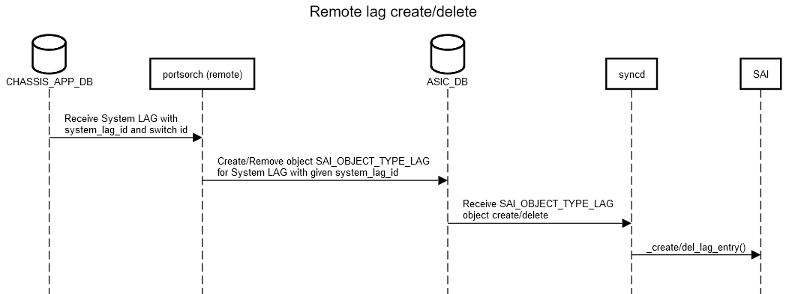

# LAG on Distributed VOQ System
# High Level Design Document
### Rev 1.0

# Table of Contents
  * [List of Tables](#list-of-tables)

  * [Revision](#revision)

  * [About this Manual](#about-this-manual)

  * [Scope](#scope)

  * [Definitions/Abbreviation](#definitionsabbreviation)
 
  * [1 Requirements and Restrictions](#1-requirements-and-restrictions)
  * [2 Design Constraints and Proposal](#2-design-constraints-and-proposal)
    * [2.1 Alignment with Distributed VOQ SONiC Architecture](#21-alignment-with-distributed-voq-sonic-architecture)
    * [2.2 LAG Requirements for VOQ SAI](#22-lag-requirements-for-voq-sai)
    * [2.3 High Level Proposal](#23-high-level-proposal)
  * [3 Design Details](#3-design-details)
    * [3.1 Configuration](#31-configuration)
    * [3.2 Modules Design](#32-modules-design)
  * [4 Databases](#4-databases)
    * [4.1 CONFIG_DB](#41-config_db) 
    * [4.2 APPL_DB](#42-appl_db) 
    * [4.3 STATE_DB](#43-state_db) 
    * [4.4 CHASSIS_APP_DB](#44-chassis_app_db)
  * [5 SAI](#5-sai)
  * [6 Flows](#6-flows)
    * [6.1 Local LAG Create](#61-local-lag-create) 
    * [6.2 Local LAG Member Add](#62-local-lag-member-add) 
    * [6.3 Remote LAG Create](#63-remote-lag-create)
    * [6.3 Remote LAG Member Add](#64-remote-lag-member-add)
  * [7 Example Configurations](#7-example-configurations)
  * [8 Example Show Commands](#8-example-show-commands)


###### Revision

| Rev |     Date    |       Author                                                                              | Change Description                |
|:---:|:-----------:|:-----------------------------------------------------------------------------------------:|-----------------------------------|
| 1.0 |             |     Srikanth Keesara, Vedavinayagam Ganesan, Sureshkannan Duraisamy (Nokia's Sonic Team)  | Initial version                   |

# About this Manual
This document describes changes needed for the correct operation of LAG in a distributed VOQ system.
# Scope
The audience for this document is expected to be familiar with the architecture that SONiC has adopted to support a distributed VOQ system. As such the scope of this document is limited to discussing how LAG works within the context of that architecture. 

# 1 Requirements and Restrictions
Link Aggregation Group with port members spanning more than one ASIC will not be supported. All other LAG related capabilities are expected to be supported on par with how SONiC supports LAG on a single asic system. Specifically the following are expected to be supported.
*  Forwarding of traffic ingressing on one asic and egressing on anther ASIC via a LAG. Egress LAG member port selection must be on par with how it would happen if the ingress and egress ports were on the same asic.
*  Use of LACP
*  Dynamic creation/deletion of LAG.
*  Dynamic changes to LAG membership configuration

# 2 Design Constraints and Proposal
The design must satisfy both of the following constraints

## 2.1 Alignment with Distributed VOQ SONiC Architecture
Each ASIC within the system is under the control of its own set of instances of the SONiC Network Stack components (syncd, swss, bgp, lldp, teamd, database). The architecture allows for information produced for/by one ASIC to be shared with the other asics via the use of a centralized database CHASSIS_APP_DB. This mechanism is currently used to exchange Neighbor information across different asics within a VOQ system.

## 2.2 LAG Requirements for VOQ SAI
The following rules apply with regard to programming LAG information via SAI on a distributed VOQ system
*  Every LAG needs to be created in SAI of all of the asics in the system. This is irrespective of which asic the member ports of a LAG "belong" to.
*  The active member port list for each LAG should be the same in the SAI instance of every asic. 
*  LAG members can be added and deleted at runtime. Any update to the member port list of any LAG must be propagated to all of the SAI instances.
*  The changes made to SAI for VOQ support allow the member port list for a LAG to be specified as a list of system ports
*  SAI allows the application layer to specify a "LAG_ID" (SAI_LAG_ATTR_SYSTEM_PORT_AGGREGATE_ID) as part of LAG creation. For a given LAG - the same value must be used on all the SAI instances.

## 2.3 High Level Proposal
The high level proposal is described here. The details are in the sections that follow. Each asic SONiC instance is responsible for LAG and LAG member ports that belong to that asic. Among other things this includes processing the configuration and keeping the application database updated with each LAG and its active member port list.
*  The LAG configuration for an asic is limited to those LAGs which have its own network ports as members.
*  Two new tables are defined and are a part of the Centralized Database CHASSIS_APP_DB. They are - "System LAG Table" and "System LAG Membership Table"
*  The "System LAG Table" has an attribute called the "system_lag_id".
*  The SONiC network stack instance associated with an asic updates the entries in these tables for LAG and LAG Members that are controlled by that asic.
*  All of the asic SONiC instances subscribe to these two tables and receive updates for remote LAG and LAG membership changes. These updates are programmed into the asic via the SAI APIs.
Please note that the only per asic SONiC components that are aware of a remote LAG are SWSS and SYNCD. Other components (like teamd for example) are only aware of local LAG.

## 3 Design Details

### 3.1 Configuration

* A new configuration attribute called the "system_lag_id" is added to the PORTCHANNEL table. This attribute is required only for a Distributed VOQ System and must have a unique value for each LAG in the system. No other **LAG configuration** changes are required.
* Also no changes are required for **LAG Member** configuration and **LAG Interface** configurations. PORTCHANNEL_MEMBER table and PORTCHANNEL_INTERFACE table are used in the same way how they are used in non-chassis system.

### 3.2 Modules Design

#### teamd: teammgrd

teammgrd, while receving PortChannel configuration, validates the given system_lag_ld for whether it is already used or not. The STATE_DB LAG_TABLE entry is used for this validation. The same STATE_DB LAG_TABLE entry used for recording LAG state is used to record system_lag_id after a LAG id is created with it. If the given system_lag_id is found to be used already, team device will not be created.

Changes in teamd/teammgrd include:
 * Retrieving "system_lag_id" from CONFIG_DB PortChannel configuration
 * Accessing STATE_DB LAG_TABLE to check availability

#### teamd: teamsyncd

teamsyncd in teamd docker sends "system_lag_id" as additional information to orchagent. The configuration of PortChannel results in creation of team device in the kernel. Upon detection of this device, teamsyncd retrieves the "system_lag_id" corresponding to the team device from CONFIG_DB PORTCHANNEL table. This system_lag_id along with other PortChannel information are sent to APPL_DB LAB_TABLE

Changes in teamd/teamsyncd include:
 * Connection to CONFIG_DB to get system_lag_id of local LAG
 * Enhancements to the process to send lag to APPL_DB to include system_lag_id

#### orchagent: portsorch
**Local LAG**: portsorch sends the system_lag_id in SAI_LAG_ATTR_SYSTEM_PORT_AGGREGATE_ID attribute to SAI while creating LAG in SAI. This system_lag_id is the user supplied system_lag_id in the PortChannel entry from APPL_DB LAG_TABLE entry. After creating local LAG, the PortChannel with switch_id and system_lag_id is synced to SYSTEM_LAG_TABLE in centralized database CHASSIS_APP_DB. The lag members of the local LAG use local port ids. Any member addition/removal members to a local LAG is synced to SYSTEM_LAG_MEMBER_TABLE in centralized database CHASSIS_DB. While syncing lag members, the PortChannel name and system port alias of the local port members are used as the key. 

**Remote LAG**: To create LAG corresponding to the remote LAG, the system_lag_id will be from corresponding entry from SYSTEM_LAG_TABLE from CHASSIS_APP_DB. The Lag members for a remote LAG will be specified using the OID of the corresponding system port objects.

Changes in orchagent/portsorch include: 
 * Port structure enhancement to store the system lag info such as system lag name (alias), system lag id and switch_id.
 * Subscribing to SYSTEM_LAG_TABLE and SYSTEM_LAG_MEMBER_TABLE from CHASSIS_APP_DB 
 * Enhancements to lag and lag member processing tasks to process the entries from above mentioned tables in addition to processing LAG_TABLE and LAG_MEMBER_TABLE from local APP_DB. Same APIs are used for processing both local and remote LAGs with minor modifications
 * Vaidation for availability of givem system_lag_id and alerting if the given system_lag_id is already used.
 * Lag creation enhancements to send SAI_LAG_ATTR_SYSTEM_PORT_AGGREGATE_ID attribute 
 * Syncing local LAG and LAG members to centralized database CHASSIS_APP_DB.
 * Creating entry in LAG_TABLE in STATE_DB for remote LAGs with system_lag_id and update LAG_TABLE entry with system_lag_id for local LAGs.

## 4 Databases

### 4.1 CONFIG_DB

#### PortChannel Table

The **existing** PORTCHANNEL table is enhanced to include additional attribute **system_lag_id**

```
PORTCHANNEL:{{portchannel name}}
    "admin_status": {{admin_status}}
    "mtu": {{MTU}}
    "minimum_links": {{minimum_links}}
    .
    .
    .
    "system_lag_id": {{index_number}}
```
**Schema:**

```
; Defines schema for PORTCHANNEL table attributes
key                 = PORTCHANNEL|portchannel name  ; logical 802.3ad LAG name.
; field             = value
admin_status        = "down" / "up"                 ; Admin status
mtu                 = 1*4DIGIT                      ; MTU for this object
minimum_links       = 1*2DIGIT                      ; Minimum number of links for the LAG to be made available
.
.
.
system_lag_id       = 1*2DIGIT                      ; LAG id. This is unique across the chassis system
```
**system_lag_id** is new attribute added to the PORTCHANNEL table entry. Other attributes are existing attributes. Presented here for reference purpose.

They key to the table is the alias of the LAG. Since this is used to refer LAGs across the chassis system, this name is unique across the chassis. The alias must be an acceptable string for teamd device creation in the kernel and must start with **PortChannel**. 

### 4.2 APPL_DB

#### LAG Table

The **existing** LAG_TABLE is enhanced to have two additional attributes for **system_lag_id**.

```
LAG_TABLE:{{portchannel name}}
    "admin_status": {{admin_status}}
    "mtu": {{MTU}}
    .
    .
    .
    "system_lag_id": {{index_number}}
```
**Schema:**

```
; Defines schema for LAG_TABLE table attributes
key                 = LAG_TABLE:portchannel name  ; logical 802.3ad LAG name.
; field             = value
admin_status        = "down" / "up"               ; Admin status
mtu                 = 1*4DIGIT                    ; MTU for this object
.
.
.
system_lag_id       = 1*2DIGIT                    ; LAG id. This is unique across the chassis system
```

Entries in this table are from local APPL_DB. These entries are for local LAGs only. These entries are populated by **teamsynd**. The attribute **system_lag_id** is a new attribute. Other attributes are existing attributes presented here for reference purpose only.

### 4.3 STATE_DB

#### LAG Table

The **existing** LAG_TABLE is enhanced to have an additional attribute for **system_lag_id**.

```
LAG_TABLE:{{portchannel name}}
    "state": "ok"
    "system_lag_id": {{index_number}}
```

**Schema:**

```
; Defines schema for LAG_TABLE table attributes
key                 = LAG_TABLE|portchannel name  ; logical 802.3ad LAG name.
; field             = value
state               = "ok"                        ; State of the LAG
system_lag_id       = 1*2DIGIT                    ; LAG id. This is unique across the chassis system
```

Entries in this table are from local STATE_DB. These entries are for local LAGs and remote LAGs. **teamsyncd** creates entry for local LAGs and **portsorch** creates entry for remote LAGs. The attribute **system_lag_id** is a new attribute and is updated by **portsorch** for both local LAGs and remote LAGs. The other attribute "state" is an existing attribute presented here for reference purpose only.

### 4.4 CHASSIS_APP_DB

#### System LAG Table
This is a new table added to allow synchronization of local PortChannel entries to the centralized database. This table contains entries added by each of the asics of the chassis system.

```
SYSTEM_LAG_TABLE:{{system lag name}}
    "system_lag_id": {{index_number}}
    "switch_id": {{index_number}}
```

**Schema:**

```
; Defines schema for SYSTEM_LAG_TABLE table attributes
key                 = SYSTEM_LAG_TABLE|system lag name   ; System LAG name
; field             = value
system_lag_id       = 1*10DIGIT                          ; LAG id.
switch_id           = 1*4DIGIT                           ; Switch id
```
The the system lag name in the key is unique across chassis system. This is the name of the PortChannel locally created. 

#### System LAG Member Table
This is a new table added to sync local PortChannel Members to centralized database so facilitate remote asics to add/remove remote members to/from LAGs. This table contains entries synced by different asics of the chassis system.

```
SYSTEM_LAG_MEMBER_TABLE:{{system lag name}}|{{system port name}}
    {}
```

**Schema:**

```
; Defines schema for SYSTEM_LAG_MEMBER_TABLE table attributes
key                 = SYSTEM_LAG_MEMBER_TABLE|system lag name|System port name
; field             = value

```
The System port name used in the key is the system port alias of the member of the LAG and system lag name is the PortChannel name used to create LAGs locally.

## 5 SAI
Shown below is the new attribute of SAI_OBJECT_TYPE_LAG object that is used for LAG in VOQ chassis systems

###### Table 5.1 LAG object SAI attributes related to VOQ system
| LAG component                                                         | SAI attribute                               |
|-----------------------------------------------------------------------|---------------------------------------------|
| LAG System port ID                                                    | SAI_LAG_ATTR_SYSTEM_PORT_AGGREGATE_ID       |

## 6 Flows
### 6.1 Local LAG Create

### 6.2 Local LAG Member Add

### 6.3 Remote LAG Create

### 6.4 Remote LAG Member Add


## 7 Example Configurations

### CONFIG_DB

#### Slot 1 Asic 0
```
 "DEVICE_METADATA": {
    "localhost": {
	   "switch_type": "voq",
	   "switch_id": "0",
	   "max_cores": "48"
	}
},

"PORTCHANNEL": {
    "PortChannel1": {
        "admin_status": "up",
        "mtu": "9100",
	"system_lag_id": "1"
    }
},

"PORTCHANNEL_MEMBER": {
    "PortChannel1|Ethernet1": {},
    "PortChannel1|Ethernet2": {}
},

"SYSTEM_PORT": {
   "Slot1|Asic0|Ethernet1": {
       "system_port_id": "1",
       "switch_id": "0",
       "core_index": "0",
       "core_port_index": "1",
       "speed": "400000"
    },
    "Slot1|Asic0|Ethernet2": {
        "system_port_id": "2",
        "switch_id": "0",
        "core_index": "0",
        "core_port_index": "2",
        "speed": "400000"
    },
   "Slot2|Asic0|Ethernet1": {
       "system_port_id": "65",
       "switch_id": "6",
       "core_index": "0",
       "core_port_index": "1",
       "speed": "400000"
    },
    "Slot2|Asic0|Ethernet2": {
        "system_port_id": "66",
        "switch_id": "6",
        "core_index": "0",
        "core_port_index": "2",
        "speed": "400000"
    }
}

```

#### Slot 2 Asic 0
```
"DEVICE_METADATA": {
    "localhost": {
	   "switch_type": "voq",
	   "switch_id": "6",
	   "max_cores": "48"
	}
},

"PORTCHANNEL": {
    "PortChannel2": {
        "admin_status": "up",
        "mtu": "9100",
	"system_lag_id": "2"
    }
},

"PORTCHANNEL_MEMBER": {
    "PortChannel2|Ethernet1": {},
    "PortChannel2|Ethernet2": {}
},

"SYSTEM_PORT": {
   "Slot1|Asic0|Ethernet1": {
       "system_port_id": "1",
       "switch_id": "0",
       "core_index": "0",
       "core_port_index": "1",
       "speed": "400000"
    },
    "Slot1|Asic0|Ethernet2": {
        "system_port_id": "2",
        "switch_id": "0",
        "core_index": "0",
        "core_port_index": "2",
        "speed": "400000"
    },
   "Slot2|Asic0|Ethernet1": {
       "system_port_id": "65",
       "switch_id": "6",
       "core_index": "0",
       "core_port_index": "1",
       "speed": "400000"
    },
    "Slot2|Asic0|Ethernet2": {
        "system_port_id": "66",
        "switch_id": "6",
        "core_index": "0",
        "core_port_index": "2",
        "speed": "400000"
    }
}

```

### APPL_DB

#### Slot 1 Asic 0
```
"LAG_TABLE": {
    "PortChannel1": {
        "admin_status": "up",
        "mtu": "9100",
        "oper_status": "up",
	"system_lag_id": "1"
    }
},

"LAG_MEMBER_TABLE": {
    "PortChannel1:Ethernet1": {
        "status": "enabled"
    },
    "PortChannel1:Ethernet2": {
        "status": "enabled"
    }
}

```

#### Slot 2 Asic0
```
"LAG_TABLE": {
    "PortChannel2": {
        "admin_status": "up",
        "mtu": "9100",
        "oper_status": "up",
	"system_lag_id": "2"
    }
},

"LAG_MEMBER_TABLE": {
    "PortChannel2:Ethernet1": {
        "status": "enabled"
    },
    "PortChannel2:Ethernet2": {
        "status": "enabled"
    }
}

```

### STATE_DB

#### Slot 1 Asic 0
```
"LAG_TABLE": {
    "PortChannel1": {
        "state": "ok",
        "system_lag_id": "1"
    },
    "PortChannel2": {
        "state": "ok",
        "system_lag_id": "2"
    }
}
```

#### Slot 2 Asic0
```
"LAG_TABLE": {
    "PortChannel1": {
        "state": "ok",
        "system_lag_id": "1"
    },
    "PortChannel2": {
        "state": "ok",
        "system_lag_id": "2"
    }
}
```

### CHASSIS_APP_DB

```
"SYSTEM_LAG_TABLE": {
    "PortChannel1": {
        "swith_id": "0",
        "system_lag_id": "1"
    },
    "PortChannel2": {
        "swith_id": "6",
        "system_lag_id": "2"
    },
},

"SYSTEM_LAG_MEMBER_TABLE": {
    "PortChannel1|Slot1|Asic0|Ethernet1": {},
    "PortChannel1|Slot1|Asic0|Ethernet2": {},
    "PortChannel2|Slot2|Asic0|Ethernet1": {},
    "PortChannel2|Slot2|Asic0|Ethernet2": {}
}

```

## 8 Example Show Commands

```
admin@sonic:~$ show interfaces portchannel system
Flags: A - active, I - inactive, Up - up, Dw - Down, N/A - not available,
       S - selected, D - deselected, * - not synced, L - local switch
  No.  Switch ID    LAG Name      Protocol   Ports
-----  ----------   -----------   ---------- --------------
    1  0(L}         PortChannel1  SystemLAG  Slot1|Asic0|Ethernet1(S)  Slot1|Asic0|Ethernet2(S)
    2  6            PortChannel2  SystemLAG  Slot2|Asic0|Ethernet1(S)  Slot2|Asic0|Ethernet2(S)
```
