# VOQ SONiC
# High Level Design Document
### Rev 1.0

# Table of Contents
  * [List of Tables](#list-of-tables)

  * [Revision](#revision)

  * [About this Manual](#about-this-manual)

  * [Scope](#scope)

  * [Definitions/Abbreviation](#definitionsabbreviation)
 
  * [Reference Architecture](#reference-architecture)
  
  * [1 Requirements Overview](#1-requirements-overview)
    * [1.1 Functional requirements](#11-functional-requirements)
    * [1.2 Platform requirements](#12-platform-requirements)
    * [1.3 Configuration requirements](#13-configuration-requirements)
    * [1.4 Orchagent requirements](#14-orchagent-requirements)
    * [1.5 Host IP Connectivity requirements](#15-host-ip-connectivity-requirements)
    * [1.6 CLI requirements](#16-cli-requirements)
    * [1.7 Scalability requirements](#17-scalability-requirements)
    * [1.8 Warm Restart requirements ](#18-warm-restart-requirements)
  * [2 Modules Design](#2-modules-design)
    * [2.1 Configuration Flow Options for System Ports](#21-configuration-flow-options-for-system-ports)
      * [2.1.1 Option-1 System Port Configuration on Control Card](#211-option-1-system-port-configuration-on-control-card)
      * [2.1.2 Option-2 System Port Configuration within each SONiC Instance](#212-option-2-system-port-configuration-within-each-sonic-instance)
    * [2.2 Config DB](#22-config-db)
      * [2.2.1 DEVICE_METADATA](#221-device_metadata)
      * [2.2.2 System Port Table](#222-system-port-table)
      * [2.2.3 ConfigDB Schemas](#223-configdb-schemas)
    * [2.3 VOQ DB](#23-voq-db)
      * [2.3.1 VOQ System Data](#231-voq-system-data)
      * [2.3.2 System Port Table](#232-system-port-table)
      * [2.3.3 Voq Neighbor table](#233-voq-neighbor-table)
      * [2.3.4 System Port interface table](#234-system-port-interface-table)
      * [2.3.5 VOQ DB Schemas](#235-voq-db-schemas)
    * [2.4 App DB](#24-app-db)
      * [2.4.1 VOQ System Data](#241-voq-system-data)
      * [2.4.2 System Port Table](#242-system-port-table)
      * [2.4.3 Neigh table](#243-neigh-table)
      * [2.4.4 Interface table](#244-interface-table)
      * [2.4.5 APP DB Schemas](#245-app-db-schemas)
    * [2.5 Orchestration agent](#25-orchestration-agent)
    * [2.6 Design Options for Host IP connectivity](#26-design-options-for-host-ip-connectivity)
	  * [2.6.1 Option1 - Kernel Neighbor table matches SAI and ASIC](#261-option1-kernel-neighbor-table-matches-sai-and-asic)
	    * [2.6.1.1 Routing Protocol Peering between SONiC Instances](#2611-routing-protocol-peering-between-sonic-instances)
	    * [2.6.1.2 SONiC Host IP Connectivity via Network Ports of other asics](#2612-sonic-host-ip-connectivity-via-network-ports-of-other-asics)
	  * [2.6.2 Option2 - Kernel Neighbor table differs from SAI and ASIC](#262-option2-kernel-neighbor-table-differs-from-sai-and-asic)
	    * [2.6.2.1 Routing Protocol Peering between SONiC Instances](#2621-routing-protocol-peering-between-sonic-instances)
	    * [2.6.2.2 SONiC Host IP Connectivity via Network Ports of other asics](#2622-sonic-host-ip-connectivity-via-network-ports-of-other-asics)
	    * [2.6.2.3 Kernel Routing Table Footprint](#2623-kernel-routing-table-footprint)
	  * [2.6.3 Comparing Options](#263-comparing-options)
    * [2.7 SAI](#27-sai)
	* [2.8 CLI](#28-cli)
	* [2.9 VOQ Monitoring and Telemetry](#29-voq-monitoring-and-telemetry)
  * [3 Flows](#3-flows)
	* [3.1 Voq Switch Creation and System Port Configurations](#31-voq-switch-creation-and-system-port-configurations)
	* [3.2 Voq System Port Orchestration](#32-voq-system-port-orchestration)
	* [3.3 Voq System Port Router Interface Creation](#33-voq-system-port-router-interface-creation)
	* [3.4 Voq Neighbor Creation](#34-voq-neighbor-creation)
	* [3.5 Voq Database sync](#35-voq-database-sync)
  * [4 Example configuration](#4-example-configuration)
  * [5 References](#5-references)

###### Revision
| Rev |     Date    |       Author                                                                       | Change Description                |
|:---:|:-----------:|:----------------------------------------------------------------------------------:|-----------------------------------|
| 1.0 | 06/29/2020  | Sureshkannan Duraisamy, Srikanth Keesara, Vedavinayagam Ganesan (Nokia Sonic Team) | Initial public version            |
|     |             |                                                                                    |                                   |

# About this Manual
A Distributed VOQ System consists of one or more VOQ-SAI capable switches interconnected via their Fabric Links. In such a system a single pass through the SAI pipeline requires that the packet first pass through an ingress switch followed by an egress switch. The ingress and egress switch could be two different devices. It may also pass through a Fabric switch between the ingress and the egress. Certain SAI objects and and some of their attribute values are required to be consistently programmed on both the ingress and egress switches to ensure correct packet forwarding. The VOQ-SAI specification standardized the SAI objects, attributes, the APIs and the procedures required for a VOQ system. This includes - System Port, Routing Interface on System Port, Neighbor on System Port, Encap index assigned to a Neighbor on a System port. They are collectively referred to as VOQ-SAI attributes in this document.

This document is the design specification for supporting SONiC on a Distributed VOQ System. A key design goal is to leverage previous work on multi-asic SONiC which allows each asic to be controlled independently by a separate instance of the "SONiC Network Stack" (comprising bgp, swss, syncd, lldp, teamd etc ..). Currently multi-asic in SONiC assumes that the connection between the different ASICs in the system is via Network ports. This design extends the multi-asic model to support connection via fabric ports..

# Scope
This specification is foussed primarily on IPv4/IPv6 unicast routing over Ethernet. No attempt is made in this specification to discuss how features like L2/L3 Multicast, Routing/Bridging over tunnels etc... might work with SONiC across a Distributed VOQ System. The expectation is that such features could be implemented in subsequent phases and would require additional work in SONiC and possibly additional SAI enhancements. But that is outside the scope of this document.

Primary motivation for this work is to support SONiC on modular chassis systems using VOQ-SAI capable hardware. But this spec does not preclude support for other form factors - for example a fixed configuration system with two VOQ-SAI asics connected back-to-back using their fabric ports. This document also does not specifically cover how shared peripheral components (Fans, Power Supply, System LED etc ..) are managed on a modular chassis supporting SONiC. It is expected that the topic will be covered in a separate design document.

# Definitions/Abbreviation
###### Table 1: Abbreviations
| Term                     | Description                    |
|--------------------------|--------------------------------|
| VOQ                      | Virtual Output Queue           |

# Reference Architecture
 The figure below shows the reference architecture for a Distributed VOQ system. Each asic in the system is controlled by a separate instance of the SONiC network stack. Additionally there is a new "VOQ System Database". This database has the VOQ-SAI infromation (System Port, Routing Interface on System Port, Neighbor with Encap Index) that needs to be programmed via the SAI of each ASIC in the system. For the Phase-1 implementation, it is assumed that the System Port information (for the entire VOQ system) is available in this database prior to any of the SONiC instances doing a "switch create". This constraint of the System Ports having to be statically known in advance is intended to accommodate initial limitations in SAI implementations that might require the complete system port list to be provided at switch creation time.  This restriction does not apply to routing interfaces and neighbors which are allowed to be dynamic. This database allows each SONiC instance to discover the relevant "Remote VOQ-SAI information" it needs from other asics. Additional details are described in the sections that follow.

The figures below show the components of this architecture on a modular chassis with separate line cards, each with multiple Forwarding asics, control card and multiple Switch Fabric asics. The terms Line Card and Control Card are architectural and not necessarily separate phyiscal elements of a Distributed VOQ system (though a modular chassis typically implements them as separate physical elements). For example it is possible that the entire VOQ system consists of a single card. Where applicable it is assumed that Control Card and Line Card components can exist on the same card (or fixed configuration device).

 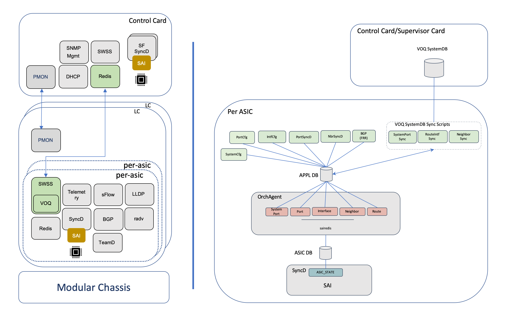

Each LC above is a Single SONiC Linux System. Each LC may have one or more asics. Each asic is controlled by a separate instance of the SONiC Network Stack (lldpd, bgp, swss, syncd, redis, teamd, ..). No changes are proposed to any of the shared (by all the asics on the line card) SONiC components on the card. 

The Control Card is its own separate SONiC Linux System. It does not run any of the SONiC Network protocol components (lldp, bgp, teamd ...). But it has an SWSS and SYNCD instance for control of the Switch Fabric asics.

# 1 Requirements Overview
## 1.1 Functional Requirements

The VOQ feature implementation shall support the following
1.  Distributed VOQ System.
2.  IPv4 and IPv6 unicast routing across any ports in the system
3.  Each switch in the system is controlled by a separate "asic instance" of SONiC.
4.  Host IP reachability to/from the interface IP addresses of any SONiC instance in the system using any network port in the system.
5.  Host IP reachability between the SONiC instances in the system over the datapath.
6.  Routing protocol peering between SONiC instances over the datapath.
7.  Static provisioning of System Ports in the VOQ System Database.
8.  Dynamic discovery of Routing Interfaces and Neighbors on other asics via the VOQ System Database.
9. Automatic determination of Switch_Id for each asic.

## 1.2 Platform requirements
Every ASIC in the system needs be assigned a unique Switch_ID. Each ASIC consumes as many consecutive switch_id values as it has cores. So the next valid switch_id assignment should skip ahead by a number equal to th number of cores in the asic. Vendor supplied platform specific components are aware of details (line card number, asic number with in the line card, number of cores for the asic etc...) which allow them to automatically calculate the Switch_ID for each asic. For this reason it is proposed the PMON should populate the Switch_ID for an asic into the APPL_DB.

## 1.3 Configuration requirements
Phase-1 of the Distributed VOQ System should support static configuration of the following
1. Connection parameters for the Central VOQ System Database (IP address, Port)
2. All the system ports in the entire system. The configuration of each system port should specify - system_port_id, switch_id, cored_index, core_port_index and speed.
3. Maximum number of cores in the system.

## 1.4 Orchagent requirements
### Switch Creation
 - Should create the switch with the correct values for max_cores and switch_id
 - Should create the switch with complete list of system port for all the system ports during initialization

### PortsOrch:
 - Should be SystemPorts aware
 - Should initialize system ports list and create host interfaces for system ports

### IntfsOrch:
- Should create/delete/update router interfaces against local-asic ports
- Should create/delete/update remote-asic router interfaces on the local switch

### NeighOrch:
 - Should be aware of Neighbors on other asics
 - Should be able to create/delete/update "remote-asic" Neighbors on the local switch.
 - Should be able to create/delete/update next hops for "remote-asic" neighbors on the local switch.

### VOQ DB sync
 - Should export local-asic router interface information into the "VOQ System Database"
 - Should import remote-asic router interface information from the "VOQ System Database"
 - Should export local-asic Neighbor information into the "VOQ System Database"
 - Should import remote-asic Neighbor information from the "VOQ System Database"

### Switch Fabric Orchestration
 - Should initialize and create switch for fabric (switch type = FABRIC)
 - Should discover Fabric ports, Fabric port neighbor and Fabric port reachability
 - Should monitor Fabric port state, statistics, errors etc

## 1.5 Host IP Connectivity requirements
In a "non-VOQ" Distributed SONiC System (and VOQ SONiC systems with a single VOQ asic) all network communication to/from asic namespace on the SONiC host is supported by creating host interfaces (in the asic namespace) for each of the network ports of the asic. This includes - 
1.  Packets that are trapped to the host asic namespace because of an exception (unresolved ARP for example)
2.  Packets that are sent to the host asic namespace because the destination address on the packet is an interface address for SONiC on the asic and
3.  All packets sent from the host asic namespace and out via the network ports of the asic.

In a Distributed VOQ System, the requirement for network communication for the asic namespace remains the same. But there are some important differences.
1.  Packets that are trapped to the host asic namespace because of an exception - These are only received on network ports of the local asic
2.  Packets that are sent to the host asic namespace because the destination address on the packet is an interface address for SONiC on the asic. These could be
    - Received on a network port of the local asic OR
    - Received on a network port of another asic in the system and sent to the local asic over the fabric interfaces OR
    - Received on the CPU port of another asic in the system and sent to the local asic over the fabric interfaces
3.  Packet sent from host asic namespace could be either
    - Sent out via a network port of the local asic OR
    - Sent over the fabric interfaces to another asic and out via a network port of that asic OR
    - Sent over the fabric interfaces to another asic and out via the CPU port of that asic (to asic namespace of the other asic)

The figure below shows the cpu-to-cpu packet flows that needs to be supported
 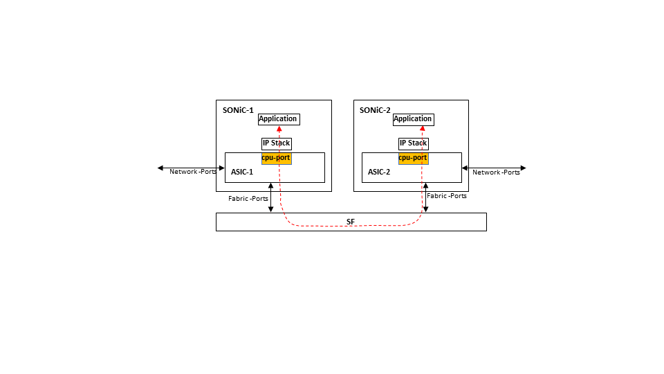

The figure below shows the cpu-to-network-port packet flows that need to be supported
 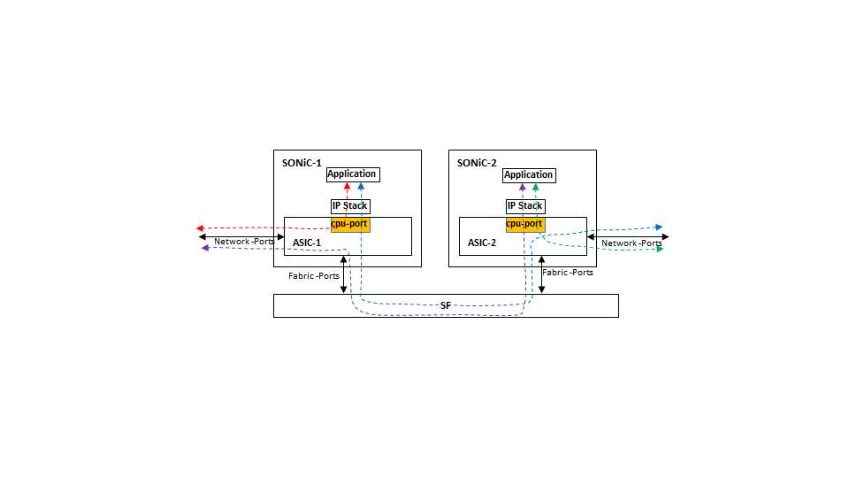

## 1.6 CLI requirements
User should be able to display/retrieve the following VOQ information
- system-port id for the system ports
- Switch-id
- max-cores
- Neighbor Encap index

## 1.7 Scalability requirements

###### Table 2: VOQ scalability
| VOQ component            | Expected value              |
|--------------------------|-----------------------------|
| VOQ Switches             | 128                         |
| System Ports             | 4K                          |
| VOQ Neighbors            | 16k                         |

The initial scaling should at least support the requirements of a "large" modular chassis deploying ports based routing interfaces. Virtual interfaces (VLAN based routing interfaces) and directly attached hosts are still supported, but achieving higher scaling for those deployments is not a goal of the initial implementation.

## 1.8 Warm Restart requirements
At this time warm restart capability is not factored into the design. This shall be revisited as a Phase #2 enhancement

# 2 Modules Design
## 2.1 Configuration Flow Options for System Ports
This section discusses a couple of options for the flow of system ports configuration information prior to it being populated in the APPL_DB of a sonic instance. The sections that follow are written assuming Option-1 has been chosen. But Option-2 is also a viable choice. We should decide if we are comfortable going with Option-1 or want to switch to Option-2.
### 2.1.1 Option-1 System Port Configuration on Control Card
The system ports are configured on the Control Card. This information is them populated in the "System Port Table" in the "VOQ System Database". On each sonic instance - the "System Port Syncd" daemon subscribes to this information and recevies it. It then populates the "System Port Table" in the APPL_DB of the local sonic instance.

 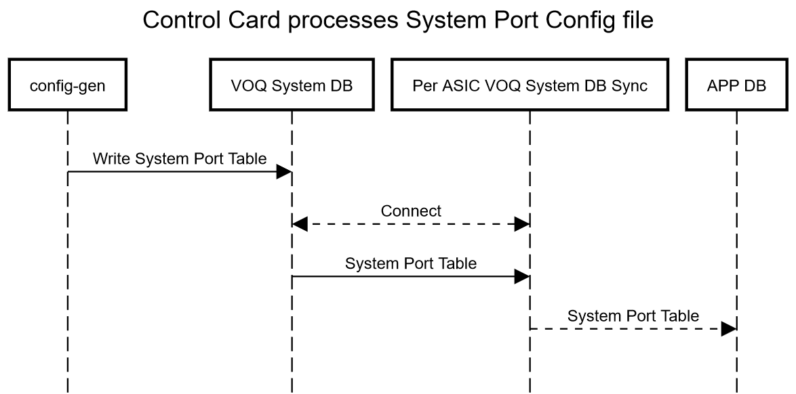

### 2.1.2 Option-2 System Port Configuration within each SONiC Instance
The configuration of each sonic instance (in its config_db.json file) contains the configuration of all the system ports. This is processed by sonic-configgen and populated into the "System Port Table" in the local CONFIG_DB. A new daemon called "System Port Config Manager" reads the information from CONFIG_DB and populates the "System Port Table" in the APPL_DB of the local sonic instance.

 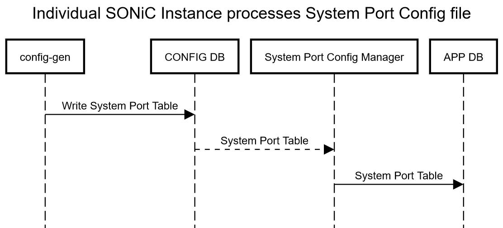

## 2.2 Config DB

### 2.2.1 DEVICE_METADATA
 The **existing** DEVICE_METADATA table is enhanced to add new entry to have VOQ related parameters
 
```
DEVICE_METADATA|{"voq_db"}
    "switch_type": {{switch_type}}
    "server_ip": {{ip_address}}
    "server_port": {app port}
```
### 2.2.2 System Port Table
A **new** table for system port configuration

```
SYSTEM_PORT:{{system_port_name = PORT.port_name}}
    "system_port_id": {{index_number}}
    "switch_id": {{index_number}}
    "core_index": {{index_number}}
    "core_port_index": {{index_number}}
    "speed": {{index_number}}
```

### 2.2.3 ConfigDB Schemas
**Existing** schema for DEVICE_METADATA in configuration DB
```
key                                   = DEVICE_METADATA|"voq_db"      ; 
; field                               = value
switch_type                           = "npu" | "fabric"
server_ip                             = IP                   
server_port                           = 1*5DIGIT            ; Port number between 0 and 65535 
```

```
; Defines schema for VOQ System Port table attributes
key                                   = SYSTEM_PORT:system_port_name ; VOQ system port name
; field                               = value
system_port_id                        = 1*5DIGIT                ; 1 to 32768
switch_id                             = 1*4DIGIT                ; 0 to 1023 attached switch id
core_index                            = 1*4DIGIT                ; 1 to 2048 switch core id
core_port_index                       = 1*3DIGIT                ; 1 t0 256 port index in a core
speed                                 = 1*7DIGIT                ; port line speed in Mbps
```

No changes in the schema of other CONFIG_DB tables. The name of the ports used as key in the PORT table is unique across chassis. For router interface and address configurations for the system ports, the existing INTERFACE table in CONFIG_DB is used.

Please refer to the [schema](https://github.com/Azure/sonic-swss/blob/master/doc/swss-schema.md) document for details on value annotations. 

## 2.3 VOQ DB
This is a **new** database which resides in global redis server accessible by all devices. This database is similar to Config DB. The VoqDBSyncd in all the devices will sync their local NEIGH_TABLE and INTF_TABLE to global VOQ_DB. The VoqDbSyncd also populates the NEIGH_TABLE and INTF_TABLE of all devices with remote information.

### 2.3.1 VOQ System Data
A table for VOQ system parameters. This will be populated by a control card or other system level management mechanism.
```
VOQ_SYSTEM_DATA_TABLE:{{"voq_system"}}
    "max_cores": {{index_number}}
    "my_switch_id": {{index_number}}
```

### 2.3.2 System Port Table
A table for system port information. This is populated by configuration processing of the control card
```
SYSTEM_PORT:{{system_port_name = PORT.port_name}}
    "system_port_id": {{index_number}}
    "switch_id": {{index_number}}
    "core_index": {{index_number}}
    "core_port_index": {{index_number}}
    "speed": {{index_number}}
```

### 2.3.3 Voq Neighbor table
A table for neighbors learned or statically configured on system ports. The schema is same as the schema of "NEIGH" table in config DB with additional attribute for "encap_index"
```
NEIGH:{{system_port_name}}:{{ip_address}} 
    "neigh": {{mac_address}}
    "encap_index"" {{encap_index}}"
    "vrf": {{vrf_id}} (OPTIONAL)
```

### 2.3.4 System Port interface table
A table for interfaces of system ports.The schema is same as the schema of "INTERFACE" table in config DB with additional attribute for "rif_id"
```
INTERFACE:{{system_port_name}}
    "rif_id": {{router inteface id}}
```
OR

```
INTERFACE:{{system_port_name}}:{{ip_address}}
    "rif_id": {{router inteface id}}
```
    
### 2.3.5 VOQ DB Schemas

```
; Defines schema for VOQ System data attributes
key                                   = VOQ_SYSTEM_DATA:"voq_system" ; VOQ system data
; field                               = value
max_cores                             = 1*4DIGIT                ; 1 to 1024
my_switch_id                          = 1*4DIGIT                ; 0 to 1023
```

```
; Defines schema for VOQ System Port table attributes
key                                   = SYSTEM_PORT:system_port_name ; VOQ system port name
; field                               = value
system_port_id                        = 1*5DIGIT                ; 1 to 32768
switch_id                             = 1*4DIGIT                ; 0 to 1023 attached switch id
core_index                            = 1*4DIGIT                ; 1 to 2048 switch core id
core_port_index                       = 1*3DIGIT                ; 1 t0 256 port index in a core
speed                                 = 1*7DIGIT                ; port line speed in Mbps
```

```
; Defines schema for VOQ Neighbor table attributes
key                                   = NEIGH:system_port_name:ip_address ; VOQ IP neighbor
; field                               = value
neigh                                 = 12HEXDIG                                       ; mac address of the neighbor
encap_index                           = 1*4DIGIT                                       ; Encapsulation index of the remote neighbor.
vrf                                   = name                                           ; VRF name

```

```
; Defines schema for interfaces for VOQ System ports
key                                   = INTERFACE:system_port_name:ip_address ; VOQ System port interface
; field                               = value
rif_id                                = 16HEXDIG                               ; The RIF id of the interface created

```

## 2.4 APP DB
Two **new tables** would be introduced to specify VOQ system info and VOQ system ports config. The **existing** INTF_TABLE and NEIGH_TABLE are used for interface of the system ports and neighbors on the system ports.

### 2.4.1 VOQ System Data
**New** table for VOQ system parameters. This will be populated by a supervisor card or other system level management mechanism.
```
VOQ_SYSTEM_DATA_TABLE:{{"voq_system"}}
    "max_cores": {{index_number}}
    "my_switch_id": {{index_number}}
```

### 2.4.2 System Port Table
**New** table for system port information. This is populated by VoqDbSyncd (see below)
```
SYSTEM_PORT_TABLE:{{system_port_name = PORT.port_name}}
    "system_port_id": {{index_number}}
    "switch_id": {{index_number}}
    "core_index": {{index_number}}
    "core_port_index": {{index_number}}
    "speed": {{index_number}}
```

### 2.4.3 Neigh table
The **existing** NEIGH_TABLE is enhanced to have values related to neighbors learned or statically configured on system ports. This is populated by VoqDbSyncd (see below). The schema is same as the existing APP DB NEIGH_TABLE. A **new** field "encap_index" is added to the **existing** NEIGH_TABLE
```
NEIGH_TABLE:{{system_port_name}}:{{ip_address}} 
    "neigh": {{mac_address}}
    "family": {{ip family}}
    "encap_index"" {{encap_index}}"
    "vrf": {{vrf_id}} (OPTIONAL)
```

### 2.4.4 Interface table
**Existing** interface table with entries for interface configuration of system ports. A **new** field for router interface id is added for VOQ system port interfaces
```
INTF_TABLE:{{system_port_name}}
    "rif_id": {{router inteface id}}
```
OR

```
INTF_TABLE:{{system_port_name}}:{{ip_address}}
    "rif_id": {{router inteface id}}
```
    
### 2.4.5 APP DB Schemas

```
; Defines schema for VOQ System data attributes
key                                   = VOQ_SYSTEM_DATA_TABLE:"voq_system" ; VOQ system data
; field                               = value
max_cores                             = 1*4DIGIT                ; 1 to 1024
my_switch_id                          = 1*4DIGIT                ; 0 to 1023
```

```
; Defines schema for VOQ System Port table attributes
key                                   = SYSTEM_PORT_TABLE:system_port_name ; VOQ system port name
; field                               = value
system_port_id                        = 1*5DIGIT                ; 1 to 32768
switch_id                             = 1*4DIGIT                ; 0 to 1023 attached switch id
core_index                            = 1*4DIGIT                ; 1 to 2048 switch core id
core_port_index                       = 1*3DIGIT                ; 1 t0 256 port index in a core
speed                                 = 1*7DIGIT                ; port line speed in Mbps
```

```
; Defines schema for VOQ Neighbor table attributes
key                                   = NEIGH_TABLE:system_port_name:ip_address ; VOQ IP neighbor
; field                               = value
neigh                                 = 12HEXDIG                                       ; mac address of the neighbor
family                                = "IPv4/IPv6"                                    ; IP address family
encap_index                           = 1*4DIGIT                                       ; Encapsulation index of the remote neighbor.
vrf                                   = name                                           ; VRF name

```
**"encap_index"** is a new field added to existing NEIGH_TABLE schema in App DB

```
; Defines schema for interfaces for VOQ System ports
key                                   = INTF_TABLE:system_port_name:ip_address ; VOQ System port interface
; field                               = value
rif_id                                = 16HEXDIG                               ; The RIF id of the interface created

```
**"rif_id"** is a new field added to existing INTF_TABLE in App DB

## 2.5 Orchestration agent
### VOQ Switch Creation
Prior to switch creation - OrchAgent determines whether or not it is a VOQ Switch by checking if VOQ specific information is present in the APP DB. It could do this by checking for the presence of my_switch_id (or max_cores or connection information for VOQ System DB) in the VOQ System Information. If it is not a VOQ Switch - switch creation goes ahead as it does currently. VOQ Switch creation requires additional information - max_cores, my_switch_id and system port list (see previous srctions for table names). It waits until this information is available from the APP DB before going ahead with switch creation. 
### Portsorch
This is made aware of voq system port. During PortOrch initialization, portsorch makes a list of all the system ports created during switch creation (above). After "PortInitDone" for all the local ports, portsorch adds system ports to ports list and creats host interfaces for all the system ports.
### Intfsorch
The router interface creation for system ports is driven by configuration in "INTERFACE" table ConfigDB. The router interface creation and ip address assignments are done as needed in the similar fashion as how they are done for local ports. No changes in IntfsOrh for voq systems.
### NeighOrch
The NeighOrch is made aware of system port. While creating neighbor entry, for the voq neighbors, the encap_index attribute is sent in addition to other attributes sent for local neighbors. The neighbor entry creation and next hop creation use system ports for remote neighbors and local ports for local neighbors. 
## VoqDbSyncd
This is a **new** subsystem. This is used for exchanging voq information between a sonic instance and the VOQ System Database. 
VoqDbSyncd does the following:
 * Reads from VOQ_DB's SYSTEM_PORT table remote entries from central redis sever and updates local redis's APP DB's SYSTEM_PORT_TABLE table and net device state (up/down) in the kernel.
 * Reads APP DB's NEIGH_TABLE entries which has encap index from local redis and updates central redis server in VOQ_DB's NEIGH table
 * Reads APP DB's INTF_TABLE entries which has rif id from local redis and updates the central redis server in VOQ_DB's INTERFACE table
 * Reads from VOQ_DB's NEIGH table remote entries from central redis server or from the static configuration and updates local redis's APP DB's NEIGH_TABLE table and neighbor records in the kernel.
 * Reads from VOQ_DB's INTERFACE table remote entries from central redis server or from the static configuration and updates local redis' APP_DB's INTF_TABLE table

## Fabric Ports Orchestration
Fabric port orchestration includes  - discovering all fabric ports, fabric port neighbors and fabric port reachability. This applies to both switch types (NPU and FABRIC). Also Fabric ports should be monitored for - state changes, statistics, errors etc. Phase-1 implementation will not support deleting/creating fabric ports dynamically.
To be specified - The APP DB schema used for fabric ports.

## 2.6 Design Options for Host IP connectivity
IP communication support is required between
- SONiC instances over the Fabric Links. This is required to support routing protocol peering between the SONiC instances.
- A SONiC instance and IP hosts in the network reachable via ports on another asic in the system.

A couple of design options for supporting these packet flows are discussed below followed by a comparison of these options. Both the options are identical in terms of the SAI and datapath programming. They also prescribe the use of an IP interface attached to the cpu-port of the of each asic. The differences are in what is programmed into the kernel tables and the changes in SWSS required to support them.

### 2.6.1 Option1 - Kernel Neighbor table matches SAI and ASIC
This option proposes that a host interface should be created against each System Port from another asic. This could be a Network port or the cpu port. The Linux IP stack uses this interface to exchange packets, program Neighbor, Routes etc. Additional details of the proposed design are described below.

*Note: There is no need to assign an IP address to the host interface if it is for a sytem port on another asic. Source IP for packets sent out using host interfaces for another asic could be a loopback IP address of the local asic.*

SONiC programs all entries that appear in its routing table and neighbor table into the Linux Kernel. The Neighbor records are programmed against the host interface for the corresponding port (or vlan or port channel). In a Distributed VOQ system - the neighbor could be on a local network port or a system port (could be either network/cpu port) of another asic.

In order to achieve a simple design and minimize the changes to SONiC code it is proposed that - the Neighbor record for a neighbor on the SystemPort from another asic should be created against the host interface of that System Port. Also a host route for the neighbor IP should be created with the next-hop as the Host Interface (instead of an IP address). Additional Routes can then be created with the Neighbor IP as the next-hop. This design ensures that the forwarding information programmed into the Linux kernel is consistent with how it is programmed into the asic via SAI.

#### 2.6.1.1 Routing Protocol Peering between SONiC Instances
The routing information for cpu-port interfaces (CPU-system-port, RIF, cpu-neighbor-ip/mac, cpu-neighbor-host-route) from all the asics is programmed into the SAI. Equivalent information (cpu-port-host-interface, cpu-neighbor-ip/mac, host-route) is created in the kernel. The kernel IP stack is then able to fully resolve resolve next-hop (host interface and mac) information for the cpu-port IP addresses every asics. A packet can be injected into the local asic instructing it to send the packet the cpu-port of another asic. Address lokups are SKIPPED in the asic. This enables IP reachabilty between the SONiC instances allowing BGP protocol peering to happen. The tables below show how the Interface, Neighbor and Route tables would be in such an implementation. Please note that equivalent entries would also be created in the asic via the SAI interface.
 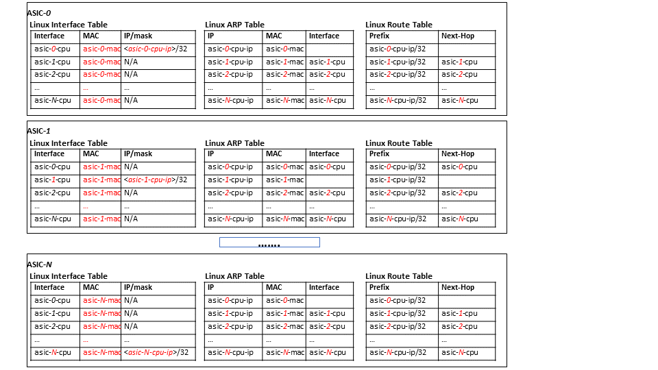

The figure below shows cpu-port net devices and packet flows for a four asic system.
 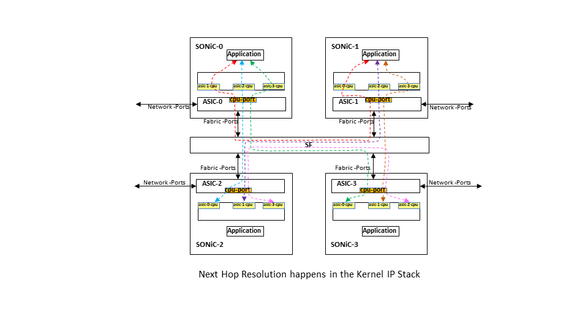

### 2.6.1.2 SONiC Host IP Connectivity via Network Ports of other asics
The VOQ System Database allows the routing information for all the neighbors (system-port, rif, neighbor-ip, neighbor-mac, meighbor-encap-index) to be available to all the SONiC instances. This results in the creation of the following in the Linux tables and equivalent entries in asic via the SAI interface.
- System Port creation corresponding to every Network port
- Host Interface corresponding to that every system-port
- Routing interface on the System Port
- Neighbor on the Routing interface

Please note that the the IP address associated with the routing interface is only needed on the asic instance to which the system port is local. Other asics only need the routing interface and the neighbors reachable via that interface. The figure below show this for an an example two asic system in which each asic has two ports, each port has one neighbor and the routing table has one prefix that uses that neighbor as the next-hop. This model can be can be extended for any number of asics, ports and neighbors.

 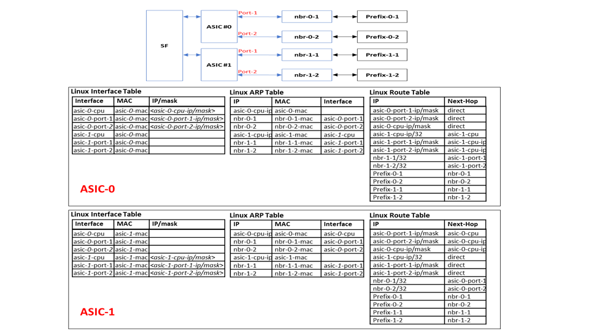

The figure below shows the system port net devices and host packet flows for the network ports for the 2-asic system above.
 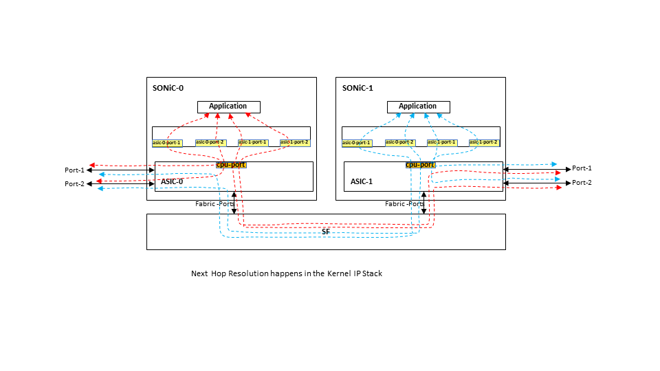

### 2.6.2 Option2 - kernel-neighbor-table-differs-from-sai-and-asic
This option proposes that SONiC instance should create host interfaces ONLY for the its own system ports (ports that "belong" to its asic). This includes that creation of a vlan based host interface for a vlan attached to its own cpu port. It should NOT create host interfaces for system ports that belong to another asic. The following rules are observed in terms of the kernel neighbor tables
1.  Neighbor on a local system-port:
      No changes from existing behavior. It is created on the host interface of that system port
2.  Neighbor on another asic system-port:
      Neighbor record is created on the net device representing local-cpu-port interface. The MAC address for the neighbor is set equal to that interface mac address.
      Additionally a host route for the neighbor is created with the next-hop specified as local-cpu-port

As a result of this choice, the neighbor records in the kernel will be pointing to a different interface (local-cpu-port and mac) compared to what is programmed via the SAI into the asic (actual system port on another asic and actual neighbor MAC address). In order to ensure this behavior -
1.  Neighsyncd should be modified to ignore kernel notifications for neighbors on system ports that are from another SONiC instance.
2.  APPL_DB entries for these neighbors are created by whichever entity is pulling the neighbor information from VOQ System DB (instead of being created by neighsyncd in response to kernel neighbor notifications)

Any additional routes programmed into the kernel will use these neighbor IP addresses as Next-Hop. This part is the same as current sonic model.

#### 2.6.2.1 Routing Protocol Peering between SONiC Instances
The routing information for cpu-port interfaces (CPU-system-port, RIF, cpu-neighbor-ip/mac, cpu-neighbor-host-route) from all the asics is programmed into the SAI. Equivalent information (cpu-port-host-interface, cpu-neighbor-ip/mac, host-route) is created in the kernel. There is one important difference in hte kernel entries - the interface and mac used for the CPU neighbor is local-asic-cpu-port and local-asic-mac. For injected packets, the kernel resolves next-hop information to be the local-cpu-port and mac. This allows the local asic to perform address lookups on injected packets and resolve the next-hop to be the cpu-system-port of the destination SONiC instance. The enables IP reachabilty between the SONiC instances allowing BGP protocol peering to happen. The tables below show how the Interface, Neighbor and Route tables would be in such an implementation. Please note the differences in the neighbor entries in the Kernel Vs SAI.
 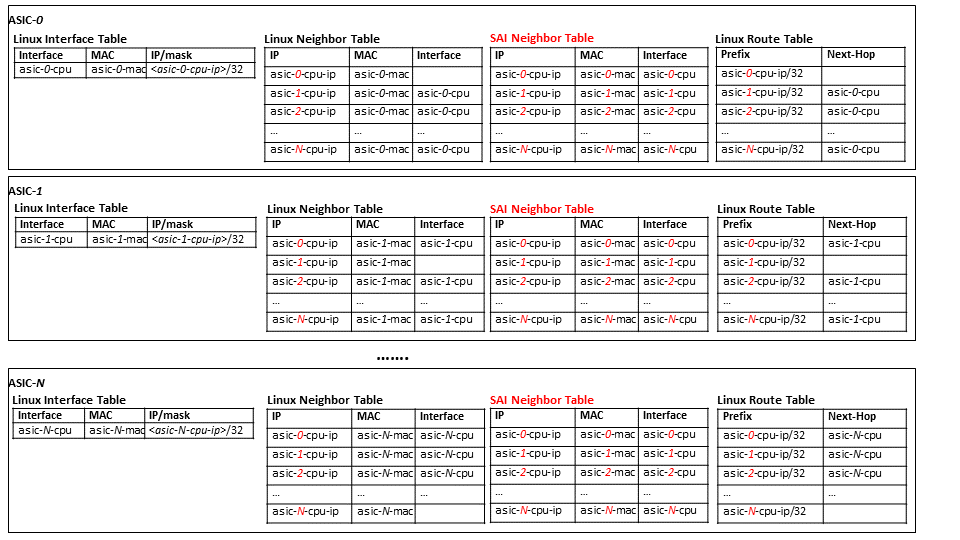

The figure below shows cpu-port net devices and packet flows for a four asic system.
 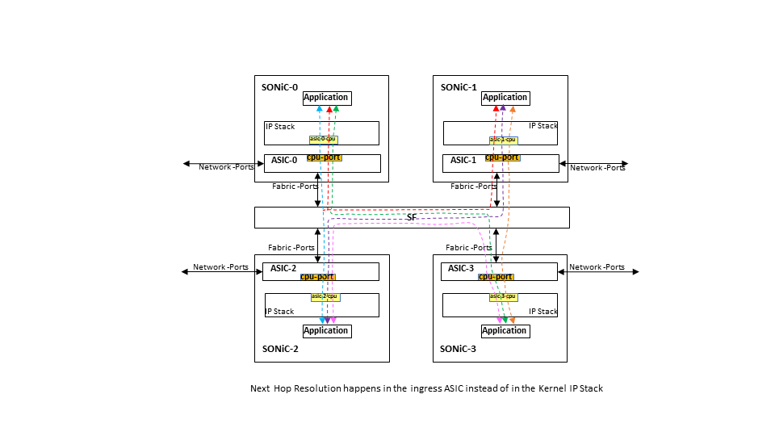

### 2.6.2.2 SONiC Host IP Connectivity via Network Ports of other asics
The VOQ System Database allows the routing information for all the neighbors (system-port, rif, neighbor-ip, neighbor-mac, meighbor-encap-index) to be available to all the SONiC instances. This results in the creation of the following in the Linux tables and equivalent entries in asic via the SAI interface. Note the difference in the neighbor recrods in the Kernel Vs SAI.

- System Port creation corresponding to every Network port
- Routing interface on the System Port
- Neighbor on the Routing interface. *NOTE - the interface and MAC information in the SAI and the kernel are different for a neighbor.*

The figure below shows an example two asic system in which each asic has two ports, each port has one neighbor and the routing table has one prefix that uses that neighbor as the next-hop. This model can be extended for any number of asics, ports and neighbors.

 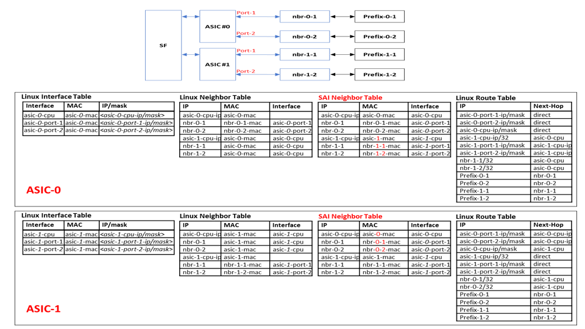

The figure below shows the system port net devices and host packet flows for the network ports for the 2-asic system above.
 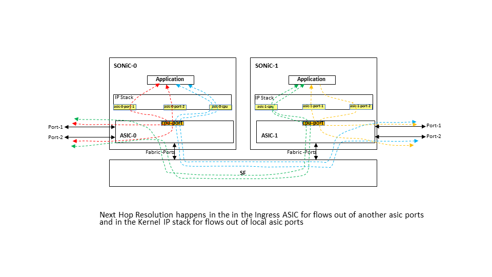


### 2.6.2.3 Kernel Routing Table Footprint
The use of the Datappath to route host packet flows for ports on other asics raises the question of whether we need the full routing table in the Kernel. The answer (pending a bit more investigation) seems to be that the kernel does NOT need all the routes. In fact seems logical to conclude that the only routes that are needed in the kernel are the direct routes for the interfaces configured on the local SONiC instance. All other routes can be eliminated from the kernel and replaced with the simple default route that points to the local cpu-port-interface as the Next-Hop. This would ensure that all host packet flows (outside of directly attached hosts) could be routed by the datapath. The advantages of this are kind of obvious
1.  Much smaller in the kernel footprint for SONiC(very few routes in kernel)
2.  Much greater fate sharing between terminated and forwarded packet flows.

### 2.6.3 Comparing Options
The table below compares the two options discussed above. 

 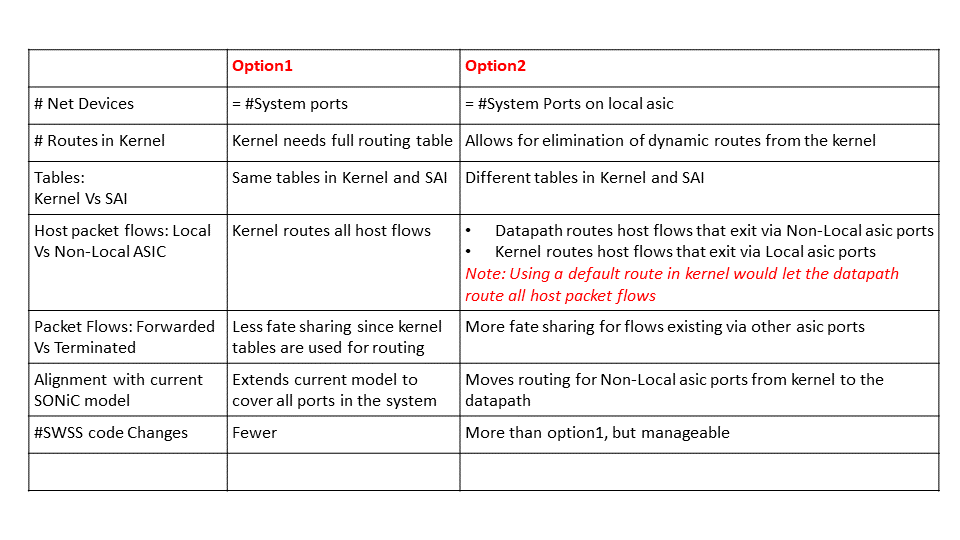

## 2.7 SAI
Shown below tables represent main SAI attributes which shall be used for VOQ related objects.

###### Table 3.1 Swith SAI attributes related to VOQ system
| Switch component                                                      | SAI attribute                               |
|-----------------------------------------------------------------------|---------------------------------------------|
| Switch type                                                           | SAI_SWITCH_ATTR_TYPE                        |
| Switch id                                                             | SAI_SWITCH_ATTR_SWITCH_ID                   |
| Maximum number of cores in the chassis                                | SAI_SWITCH_ATTR_MAX_SYSTEM_CORES            |
| List of system port configuration for all system ports in the chassis | SAI_SWITCH_ATTR_SYSTEM_PORT_CONFIG_LIST     |

The system port configuration has the parameters listed below.

###### Table 3.2: System Port SAI attributes
| VOQ System Port component | SAI attribute                                         |
|---------------------------|-------------------------------------------------------|
| Sysem port id             | SAI_VOQ_SYSTEM_PORT_ATTR_PORT_ID                      |
| Attached switch id        | SAI_VOQ_SYSTEM_PORT_ATTR_ATTACHED_SWITCH_ID           |
| Core index                | SAI_VOQ_SYSTEM_PORT_ATTR_ATTACHED_CORE_INDEX          |
| Core port index           | SAI_VOQ_SYSTEM_PORT_ATTR_ATTACHED_CORE_PORT_INDEX     |
| Port line speed           | SAI_VOQ_SYSTEM_PORT_ATTR_OPER_SPEED                   |
| Number of VOQs            | SAI_VOQ_SYSTEM_PORT_ATTR_NUM_VOQ                      |

###### Table 3.3: Neighbor Entry SAI attributes (Existing table). Entry key {{ip_address}, {rif_id of system_port}, {switch_id}}
| Neibhbor component                             | SAI attribute                                         |
|------------------------------------------------|-------------------------------------------------------|
| Destination MAC                                | SAI_NEIGHBOR_ENTRY_ATTR_DST_MAC_ADDRESS               |
| Encapsulation index for remote neighbors       | SAI_NEIGHBOR_ENTRY_ATTR_ENCAP_INDEX                   |
| Impose encapsulation index if remote neighbor  | SAI_NEIGHBOR_ENTRY_ATTR_ENCAP_IMPOSE_INDEX            |

## 2.8 CLI

TO BE COMPLETED.

## 2.9 VOQ Monitoring and Telemetry
In a distributed VOQ System, queue and buffer utilization statistics for a port are collected separately on all the asics in the system. There may be a need to aggregate these statistics in order to have a view of the statistics against a port. This section will be updated once the scope of such requirements is clear.

# 3 Flows
## 3.1 VoQ Switch Creation and System Port Configurations
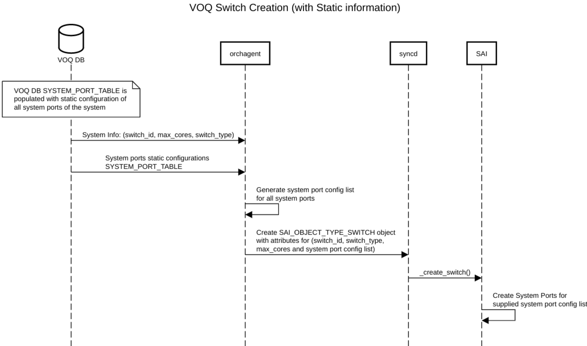

## 3.2 VOQ System Port Orchestration
- PortsOrch is made aware of the sytem ports. It initializes the system port list, adds system ports list and creates host interfaces for all remote system ports

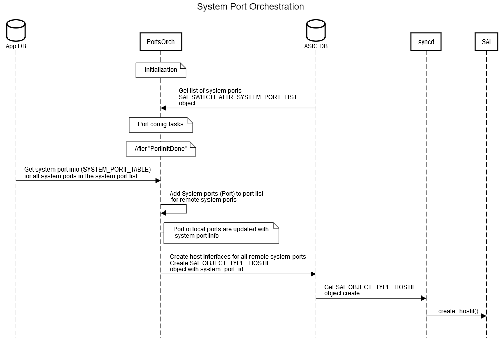

## 3.3 VOQ System Port Router Interface Creation
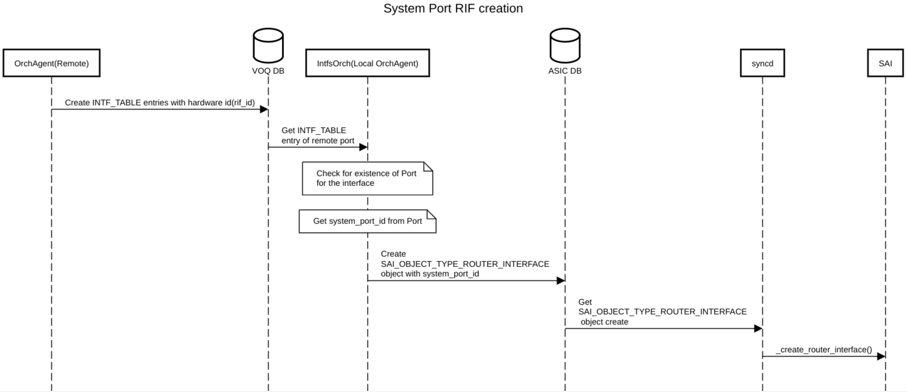

## 3.4 VOQ Neighbor Creation
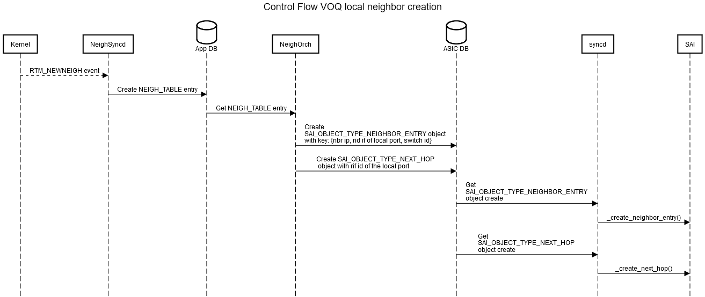


## 3.5 VOQ Database sync
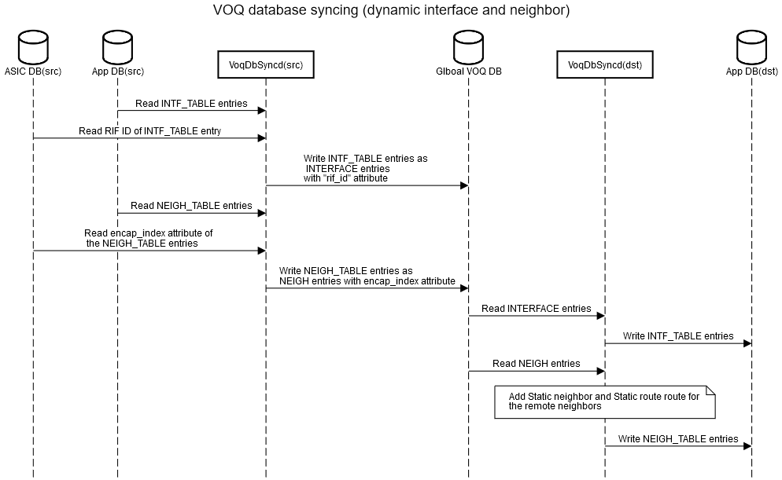

# 4 Example configuration
### Port Configurations in Config DB

#### Config DB Objects:

##### In ASIC #0

```
 {
     "PORT": {
         "Ethernet1": {
            "admin_status": "up",
            "alias": "ethernet0/1",
            "index": "1",
            "lanes": "8,9,10,11,12,13,14,15",
            "mtu": "1500",
            "speed": "400000"
        },
        "Ethernet2": {
            "admin_status": "up",
            "alias": "ethernet0/2",
            "index": "2",
            "lanes": "0,1,2,3,4,5,6,7",
            "mtu": "1500",
            "speed": "400000"
        },
        "Ethernet3": {
            "admin_status": "up",
            "alias": "ethernet0/3",
            "index": "3",
            "lanes": "24,25,26,27,28,29,30,31",
            "mtu": "1500",
            "speed": "400000"
        }
     }
 }
```

##### In ASIC #1

```
 {
     "PORT": {
         "Ethernet128": {
            "admin_status": "up",
            "alias": "ethernet1/1",
            "index": "1",
            "lanes": "8,9,10,11,12,13,14,15",
            "mtu": "1500",
            "speed": "400000"
        },
        "Ethernet129": {
            "admin_status": "up",
            "alias": "ethernet1/2",
            "index": "2",
            "lanes": "0,1,2,3,4,5,6,7",
            "mtu": "1500",
            "speed": "400000"
        },
        "Ethernet139": {
            "admin_status": "up",
            "alias": "ethernet1/3",
            "index": "3",
            "lanes": "24,25,26,27,28,29,30,31",
            "mtu": "1500",
            "speed": "400000"
        }
     }
 }
```

### VOQ System Port info in APP DB

#### APP DB Objects:

##### In ASIC #0 and ASIC# 1

```
 {
     "SYSTEM_PORT_TABLE": {
         "Ethernet1": {
             "system_port_id": "1",
             "switch_id": "0",
             "core_index": "0",
             "core_port_index": "1",
             "speed": "400000"
         },
         "Ethernet2": {
             "system_port_id": "2",
             "switch_id": "0",
             "core_index": "0",
             "core_port_index": "2",
             "speed": "400000"
         },
         "Ethernet3": {
             "system_port_id": "3",
             "switch_id": "0",
             "core_index": "0",
             "core_port_index": "3",
             "speed": "400000"
         },
         "Ethernet128": {
             "system_port_id": "128",
             "switch_id": "2",
             "core_index": "0",
             "core_port_index": "1",
             "speed": "400000"
         },
         "Ethernet129": {
             "system_port_id": "2",
             "switch_id": "2",
             "core_index": "0",
             "core_port_index": "2",
             "speed": "400000"
         },
         "Ethernet130": {
             "system_port_id": "3",
             "switch_id": "2",
             "core_index": "0",
             "core_port_index": "3",
             "speed": "400000"
         }
     }
 }
```

### Interface Configurations in Config DB

Interface configurations are required in Config DB for routed ports

#### Config DB objects:

##### In ASIC# 0

```
{
   "INTERFACE": {
      "Ethernet1": {},
      "Ethernet2": {},
      "Ethernet3": {},
      "Ethernet1"|"10.0.0.1/16": {},
      "Ethernet2"|"20.0.0.1/16": {},
      "Ethernet3"|"30.0.0.1/16": {}
   }
}
```

##### In ASIC# 1

```
{
   "INTERFACE": {
      "Ethernet128": {},
      "Ethernet129": {},
      "Ethernet130": {},
      "Ethernet128"|"10.1.0.1/16": {},
      "Ethernet129"|"20.1.0.1/16": {},
      "Ethernet130"|"30.1.0.1/16": {}
   }
}
```
### Interface infomation for local and remote system ports in APP DB
IP address configuration for remote system ports are done in local config DB as shown above

The interface information for remote system ports are populated by VoqDbSyncd

#### APP DB Objects:

##### In ASIC #0

```
{
   "INTF_TABLE": {
      "Ethernet1": {},
      "Ethernet2": {},
      "Ethernet3": {},
      "Ethernet1":"10.0.0.1/24": {},
      "Ethernet2":"20.0.0.1/24": {},
      "Ethernet3":"30.0.0.1/24": {},
      "Ethernet128": {},
      "Ethernet129": {},
      "Ethernet130": {}
   }
}
```
##### In ASIC #1

```
{
   "INTF_TABLE": {
      "Ethernet1": {},
      "Ethernet2": {},
      "Ethernet3": {},
       Ethernet128": {},
      "Ethernet129": {},
      "Ethernet130": {},
      "Ethernet128":"10.1.0.1/24": {},
      "Ethernet129":"20.1.0.1/24": {},
      "Ethernet130":"30.1.0.1/24": {}
   }
}
```

### Static Neighbor configuration in Config DB
This is optional. 

#### Config DB objects:
Static neighbors are configured on local ports

##### On ASIC #0

```
{
   "NEIGH": {
      "Ethernet1:10.0.0.2": {
         "neigh": "02:06:0a:00:00:01",
         "vrf": "1"
      }
    }
}
```
##### On ASIC #1

```
{
   "NEIGH": {
      "Ethernet128:10.1.0.2": {
         "neigh": "02:06:1a:00:00:01",
         "vrf": "1"
      }
    }
}
```
### Neighbor information in APP DB

#### APP DB Objects:
The NEIGH_TABLE has entries for locally learned neighbors on local ports

The NEIGH_TABLE also has entries for neighbors learned/configured on remote system ports (populated by VoqDbSyncd)

##### On ASIC #0
```
{
  "NEIGH_TABLE": {
      "Ethernet1:10.0.0.2": {
         "neigh": "02:06:0a:00:00:01",
         "family", "IPv4",
         "vrf": "1"
      },
      "Ethernet2:20.0.0.2": {
         "neigh": "02:06:0b:00:00:01",
         "family", "IPv4",
         "vrf": "1"
      },
      "Ethernet128:10.1.0.1": {
         "neigh": "02:16:0a:00:00:01",
         "family": "IPv4",
         "encap_index": "4097",
         "vrf": "1",
      }
  }
}
```

##### On ASIC #1
```
{
  "NEIGH_TABLE": {
      "Ethernet1:10.0.0.2": {
         "neigh": "02:06:0a:00:00:01",
         "family": "IPv4"
         "encap_index": "4096",
         "vrf": "1"
      },
      "Ethernet128:10.1.0.2": {
         "neigh": "02:16:0a:00:00:01",
         "vrf": "1"
      },
      "Ethernet129:20.1.0.2": {
         "neigh": "0b2:16:0b:00:00:01",
         "vrf": "1"
      }
    }
}
```

# 5 References
To be completed
