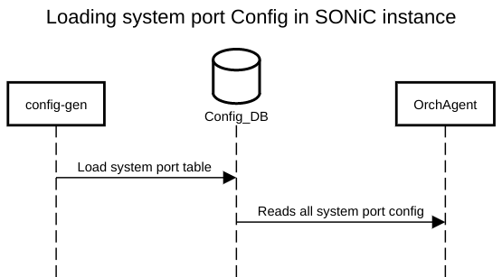
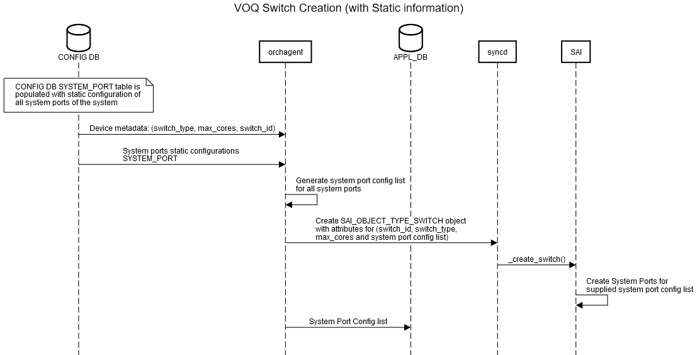
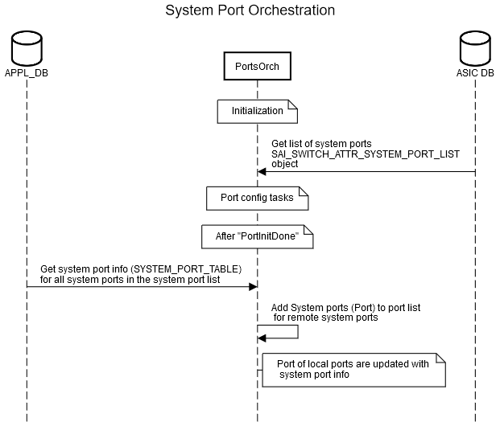
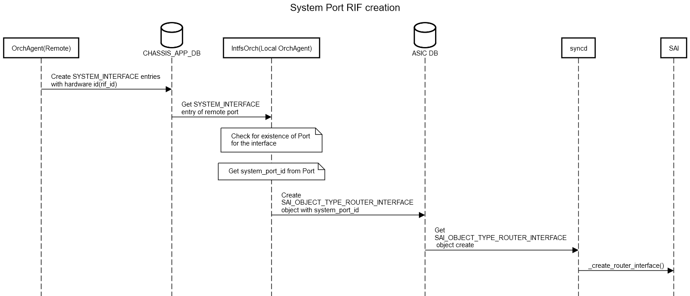
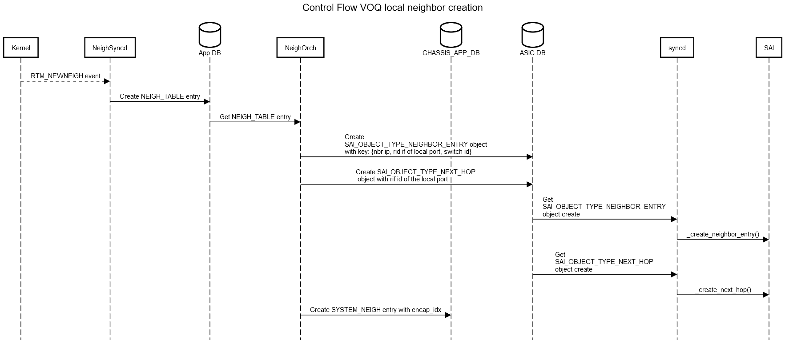
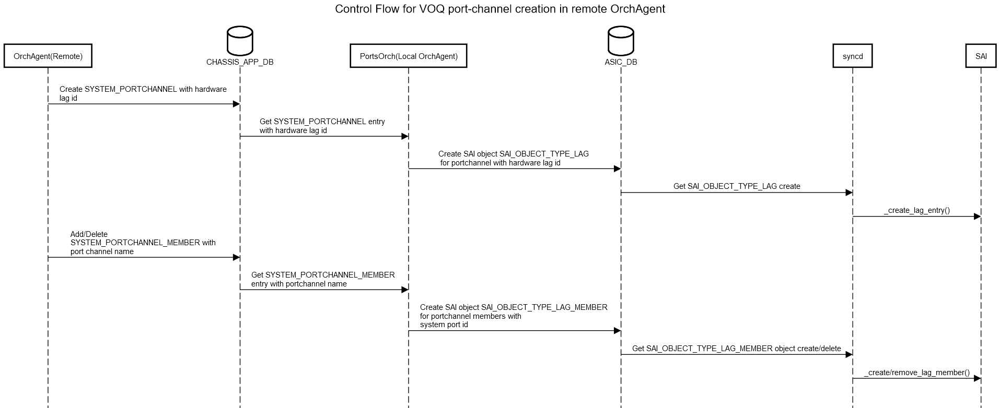

# VOQ SONiC
# High Level Design Document
### Rev 1.0

# Table of Contents
  * [List of Tables](#list-of-tables)

  * [Revision](#revision)

  * [About this Manual](#about-this-manual)

  * [Scope](#scope)

  * [1 Requirements Overview](#1-requirements-overview)
    * [1.1 Functional requirements](#11-functional-requirements)
    * [1.2 Platform requirements](#12-platform-requirements)
    * [1.3 Configuration requirements](#13-configuration-requirements)
    * [1.4 Orchagent requirements](#14-orchagent-requirements)
    * [1.5 Host IP Connectivity requirements](#15-host-ip-connectivity-requirements)
    * [1.6 CLI requirements](#16-cli-requirements)
    * [1.7 Scalability requirements](#17-scalability-requirements)
    * [1.8 Warm Restart requirements ](#18-warm-restart-requirements)
  * [2 Modules Design](#2-modules-design)
    * [2.1 System Port Configuration on Sonic Instance](#21-system-port-configuration-on-sonic-instance)
    * [2.2 Config DB](#22-config-db)
      * [2.2.1 DEVICE_METADATA](#221-device_metadata)
      * [2.2.2 System Port Table](#222-system-port-table)
      * [2.2.3 ConfigDB Schemas](#223-configdb-schemas)
    * [2.3 VOQ DB](#23-voq-db)
      * [2.3.1 System Port interface table](#231-system-port-interface-table)
      * [2.3.2 Voq Neighbor table](#232-voq-neighbor-table)
      * [2.3.3 System PortChannel table](#233-system-portchannel-table)
      * [2.3.4 System PortChannel Member table](#234-system-portchannel-member-table)
      * [2.3.5 VOQ DB Schemas](#235-voq-db-schemas)
    * [2.5 Orchestration agent](#25-orchestration-agent)
    * [2.6 Design Options for Host IP connectivity](#26-design-options-for-host-ip-connectivity)
	  * [2.6.1 Inband Recycle Port Option](#261-inband-recycle-port-option)
	    * [2.6.1.1 Routing Protocol Peering between SONiC Instances](#2611-routing-protocol-peering-between-sonic-instances)
	    * [2.6.1.2 SONiC Host IP Connectivity via Network Ports of other asics](#2612-sonic-host-ip-connectivity-via-network-ports-of-other-asics)
	  * [2.6.2 Inband VLAN Option](#262-inband-vlan-option)
	    * [2.6.2.1 Routing Protocol Peering between SONiC Instances](#2621-routing-protocol-peering-between-sonic-instances)
	    * [2.6.2.2 SONiC Host IP Connectivity via Network Ports of other asics](#2622-sonic-host-ip-connectivity-via-network-ports-of-other-asics)
	  * [2.6.3 Comparing Options](#263-comparing-options)
	  * [2.6.4 Kernel Routing Table Footprint](#264-kernel-routing-table-footprint)
	  * [2.6.5 Configuration Options for Inband](#265-configuration-options-for-inband)
    * [2.7 SAI](#27-sai)
	* [2.8 CLI](#28-cli)
	* [2.9 VOQ Monitoring and Telemetry](#29-voq-monitoring-and-telemetry)
  * [3 Flows](#3-flows)
	* [3.1 Voq Switch Creation and System Port Configurations](#31-voq-switch-creation-and-system-port-configurations)
	* [3.2 Voq System Port Orchestration](#32-voq-system-port-orchestration)
	* [3.3 Voq System Port Router Interface Creation](#33-voq-system-port-router-interface-creation)
	* [3.4 Voq Neighbor Creation](#34-voq-neighbor-creation)
	* [3.5 Voq Database sync](#35-voq-database-sync)
  * [4 Example configuration](#4-example-configuration)
  * [5 References](#5-references)

###### Revision
| Rev |     Date    |       Author                                                                       | Change Description                |
|:---:|:-----------:|:----------------------------------------------------------------------------------:|-----------------------------------|
| 1.0 | 06/29/2020  | Sureshkannan Duraisamy, Srikanth Keesara, Vedavinayagam Ganesan (Nokia Sonic Team) | Initial public version            |
|     |             |                                                                                    |                                   |

# About this Manual
This document describes the design details for supporting SONiC on a Distributed VOQ System. It aligns with the SONiC Distributed VOQ-Architecture and should be read in conjunction with that document. It also adopts the SONiC Multi-ASIC architecture is adopted - which allows each asic within an FSI to be controlled independently by a separate instance of the "SONiC Network Stack" (comprising bgp, swss, syncd, lldp, teamd etc ..).

# Scope
This specification is foussed primarily on IPv4/IPv6 unicast routing over Ethernet. No attempt is made in this specification to discuss how features like L2/L3 Multicast, Routing/Bridging over tunnels etc... might work with SONiC across a Distributed VOQ System. The expectation is that such features could be implemented in subsequent phases and would require additional work in SONiC and possibly additional SAI enhancements. But that is outside the scope of this document.

# 1 Requirements Overview
## 1.1 Functional Requirements

The VOQ feature implementation shall support the following
1.  Distributed VOQ System.
2.  IPv4 and IPv6 unicast routing across any ports in the system
3.  Each switch in the system is controlled by a separate "asic instance" of SONiC.
4.  Host IP reachability to/from the interface IP addresses of any SONiC instance in the system using any network port in the system.
5.  Host IP reachability between the SONiC instances in the system over the datapath.
6.  Routing protocol peering between SONiC instances over the datapath.
7.  Static provisioning of System Ports in the VOQ System Database.
8.  Dynamic discovery of Routing Interfaces and Neighbors on other asics via the VOQ System Database.
9.  Automatic determination of Switch_Id for each asic (optional).

## 1.2 Platform requirements
Every ASIC in the system needs be assigned a unique Switch_ID. Each ASIC consumes as many consecutive switch_id values as it has cores. So the next valid switch_id assignment should skip ahead by a number equal to the number of cores in the asic. This can be done via an additional configuration attribute. Another option is atuomatic determination of sWwitch_ID. Vendor supplied platform specific components are aware of details (line card number, asic number with in the line card, number of cores for the asic etc...) which allow them to automatically calculate the Switch_ID for each asic. For this reason it is proposed that the PMON could populate the Switch_ID for an asic into the APPL_DB.

## 1.3 Configuration requirements
Phase-1 of the Distributed VOQ System should support static configuration of the following
1. Connection parameters for the Central VOQ System Database (IP address, Port)
2. All the system ports in the entire system. The configuration of each system port should specify - system_port_id, switch_id, cored_index, core_port_index and speed.
3. Maximum number of cores in the system.
4. Switch_ID for each asic

## 1.4 Orchagent requirements
### Switch Creation
 - Should create the switch with the correct values for max_cores and switch_id
 - Should create the switch with complete list of system port for all the system ports during initialization

### PortsOrch:
 - Should be SystemPorts aware
 - Should initialize system ports list and create host interfaces for system ports

### IntfsOrch:
- Should create/delete/update router interfaces against local-asic ports
- Should create/delete/update remote-asic router interfaces on the local switch

### NeighOrch:
 - Should be aware of Neighbors on other asics
 - Should be able to create/delete/update "remote-asic" Neighbors on the local switch.
 - Should be able to create/delete/update next hops for "remote-asic" neighbors on the local switch.

### VOQ DB sync
 - Should export local-asic router interface information into the "VOQ System Database"
 - Should import remote-asic router interface information from the "VOQ System Database"
 - Should export local-asic Neighbor information into the "VOQ System Database"
 - Should import remote-asic Neighbor information from the "VOQ System Database"

### Switch Fabric Orchestration
 - Should initialize and create switch for fabric (switch type = FABRIC)
 - Should discover Fabric ports, Fabric port neighbor and Fabric port reachability
 - Should monitor Fabric port state, statistics, errors etc

## 1.5 Host IP Connectivity requirements
In a "non-VOQ" Distributed SONiC System (and VOQ SONiC systems with a single VOQ asic) all network communication to/from asic namespace on the SONiC host is supported by creating host interfaces (in the asic namespace) for each of the network ports of the asic. This includes - 
1.  Packets that are trapped to the host asic namespace because of an exception (unresolved ARP for example)
2.  Packets that are sent to the host asic namespace because the destination address on the packet is an interface address for SONiC on the asic and
3.  All packets sent from the host asic namespace and out via the network ports of the asic.

In a Distributed VOQ System, the requirement for network communication for the asic namespace remains the same. But there are some important differences.
1.  Packets that are trapped to the host asic namespace because of an exception - These are only received on network ports of the local asic
2.  Packets that are sent to the host asic namespace because the destination address on the packet is an interface address for SONiC on the asic. These could be
    - Received on a network port of the local asic OR
    - Received on a network port of another asic in the system and sent to the local asic over the fabric interfaces OR
    - Received on the CPU port of another asic in the system and sent to the local asic over the fabric interfaces
3.  Packet sent from host asic namespace could be either
    - Sent out via a network port of the local asic OR
    - Sent over the fabric interfaces to another asic and out via a network port of that asic OR
    - Sent over the fabric interfaces to another asic and out via the CPU port of that asic (to asic namespace of the other asic)

The figure below shows the cpu-to-cpu packet flows that needs to be supported
 

The figure below shows the cpu-to-network-port packet flows that need to be supported
 

## 1.6 CLI requirements
User should be able to display/retrieve the following VOQ information
- system-port id for the system ports
- Switch-id
- max-cores
- Neighbor Encap index

## 1.7 Scalability requirements

###### Table 2: VOQ scalability
| VOQ component            | Expected value              |
|--------------------------|-----------------------------|
| VOQ Switches             | 128                         |
| System Ports             | 4K                          |
| VOQ Neighbors            | 16k                         |

The initial scaling should at least support the requirements of a "large" modular chassis deploying ports based routing interfaces. Virtual interfaces (VLAN based routing interfaces) and directly attached hosts are still supported, but achieving higher scaling for those deployments is not a goal of the initial implementation.

## 1.8 Warm Restart requirements
At this time warm restart capability is not factored into the design. This shall be revisited as a Phase #2 enhancement

# 2 Modules Design
### 2.1 System Port Configuration on Sonic Instance
The system ports are configured on the Line Card. This information is then populated in the "System Port Table" in the "Config DB". On each sonic instance - the "OrchAgent" daemon subscribes to this information and recevies it. 

 

## 2.2 Config DB

### 2.2.1 DEVICE_METADATA
 The **existing** DEVICE_METADATA table is enhanced to add new entry to have VOQ related parameters
 
```
DEVICE_METADATA: {
   "voqsystem": {
    "switch_type": {{switch_type}}
    "switch_id": {{switch_id}}
    "max_cores" : {{max_cores}}
   }
}
```

VOQ_DB will be specified using database_config.json.j2 and it will generated in control card and linecard differently. Control card will be the server and line card will be running clients only. DBConnectors will use this config to connect correct VOQ_DB.

sonic-buildimage/dockers/docker-database/database_config.json.j2

```
    "INSTANCES": {
        "redis":{
            "hostname" : "{{HOST_IP}}",
            "port" : 6379,
            "unix_socket_path" : "/var/run/redis{{NAMESPACE_ID}}/redis.sock",
            "persistence_for_warm_boot" : "yes"
        },

        "voq-redis":{
            "hostname" : "{{HOST_IP}}",
            "port" : 6379,
            "unix_socket_path" : "/var/run/redis{{NAMESPACE_ID}}/redis.sock",
            "persistence_for_warm_boot" : "no",

            "run_server": "no"

        }

    },
    "DATABASES" : {
        "APPL_DB" : {
            "id" : 0,
            "separator": ":",
            "instance" : "redis"
        },
        ...
        "VOQ_DB" : {
            "id" : 8,
            "separator": ":",
            "instance" : "voq-redis"
        },
```
        

### 2.2.2 System Port Table
A **new** table for system port configuration

```
SYSTEM_PORT:{{system_port_name = PORT.port_name}}
    "system_port_id": {{index_number}}
    "switch_id": {{index_number}}
    "core_index": {{index_number}}
    "core_port_index": {{index_number}}
    "speed": {{index_number}}
```

OR

```
SYSTEM_PORT:{{system_port_name}}
    "system_port_id": {{index_number}}
    "switch_id": {{index_number}}
    "core_index": {{index_number}}
    "core_port_index": {{index_number}}
    "speed": {{index_number}}
    "local_port" : {{local_port}} <!-- name of the local port -->
```
### 2.2.3 ConfigDB Schemas
**Existing** schema for DEVICE_METADATA in configuration DB
```
key                                   = DEVICE_METADATA|"voq_db"      ; 
; field                               = value
switch_type                           = "npu" | "fabric"
switch_id                             = 1*4DIGIT            ; number between 0 and 1023
max_cores                             = 1*4DIGIT            ; max cores 1 and 1024

```

```
; Defines schema for VOQ System Port table attributes
key                                   = SYSTEM_PORT:system_port_name ; VOQ system port name
; field                               = value
system_port_id                        = 1*5DIGIT                ; 1 to 32768
switch_id                             = 1*4DIGIT                ; 0 to 1023 attached switch id
core_index                            = 1*4DIGIT                ; 1 to 2048 switch core id
core_port_index                       = 1*3DIGIT                ; 1 t0 256 port index in a core
speed                                 = 1*7DIGIT                ; port line speed in Mbps
```

No changes in the schema of other CONFIG_DB tables. The name of the system ports used as key in the SYSTEM_PORT table is unique across chassis. The system_port_name can be same as the PORT table name as long as the PORT table name is unique across the chassis or it can be any character string which does not include ":". If a system port is used as inband interface, the name of that system port must be a name that will be accepted by kernel for netdevice name.

For router interface and address configurations for the system ports, the existing INTERFACE table in CONFIG_DB is used.

Please refer to the [schema](https://github.com/Azure/sonic-swss/blob/master/doc/swss-schema.md) document for details on value annotations. 

## 2.3 VOQ DB
This is a **new** database which resides in global redis server accessible by all sonic instances. This database is modeled as Application DB. The OrchAgent in all the sonic instances will write their local NEIGH to global VOQ_DB with hardware identifier's. The OrchAgent also reads the NEIGH, SYSTEM_PORTCHANNEL, PORTCHANNEL_MEMBER tables of all sonic instances with hardware information such as hardware index.

### 2.3.1 System Port interface table
A table for interfaces of system ports.The schema is same as the schema of "INTERFACE" table in config.
```
SYSTEM_INTERFACE:{{system_interface_name}} 
    {}
```
The system_interface_name is same as the name of the system_port or system_portchannel

### 2.3.2 System Neighbor table
A table for neighbors learned or statically configured on system ports. The schema is same as the schema of "NEIGH" table in config DB with additional attribute for "encap_index".
```
SYSTEM_NEIGH:{{system_port_name}}:{{ip_address}} 
    "neigh": {{mac_address}}
    "encap_index": {{encap_index}}
```

### 2.3.3 System PortChannel Table
A table for system portchannel information. This is populated by OrchAgent.
```
SYSTEM_PORTCHANNEL:{{system_portchannel_name = PORTCHANNEL.portchannel_name}}
    "lag_id": {{index_number}}
    "switch_id": {{index_number}}
```
    
### 2.3.4 System PortChannel Member Table
A table SYSTEM_PORTCHANNEL_MEMBER for members of portchannel in the whole system. This is populated by OrchAgent.
Table schema is same as **existing** PORTCHANNEL_MEMBER table. 

### 2.3.5 VOQ DB Schemas

```
; Defines schema for interfaces for VOQ System ports
key                                   = SYSTEM_INTERFACE:system_port_name:ip_address ; VOQ System port interface
; field                               = value

```

```
; Defines schema for VOQ Neighbor table attributes
key                                   = SYSTEM_NEIGH:system_port_name:ip_address ; VOQ IP neighbor
; field                               = value
neigh                                 = 12HEXDIG                                       ; mac address of the neighbor
encap_index                           = 1*4DIGIT                                       ; Encapsulation index of the remote neighbor.

```

```
; Defines schema for VOQ PORTCHANNEL table attributes
key                                   = SYSTEM_PORTCHANNEL:system_port_name ; VOQ port channel neighbor
; field                               = value
lag_id                                = 1*4DIGIT                            ; lag id
switch_id                             = 1*4DIGIT                            ; switch id

```

## 2.5 Orchestration agent
### VOQ Switch Creation
Prior to switch creation - OrchAgent determines whether or not it is a VOQ Switch by checking if VOQ specific information is present in the APP DB. It could do this by checking for the presence of my_switch_id (or max_cores or connection information for VOQ System DB) in the VOQ System Information. If it is not a VOQ Switch - switch creation goes ahead as it does currently. VOQ Switch creation requires additional information - max_cores, my_switch_id and system port list (see previous srctions for table names). It waits until this information is available from the APP DB before going ahead with switch creation. 
### Portsorch
This is made aware of voq system port. During PortOrch initialization, portsorch makes a list of all the system ports created during switch creation (above). After "PortInitDone" for all the local ports, portsorch adds system ports to ports list and creats host interfaces for all the system ports. PortOrch PortChannel processing is made aware of system port channels. 
### Intfsorch
The router interface creation for system ports is driven by configuration in "INTERFACE" table ConfigDB. The router interface creation and ip address assignments are done as needed in the similar fashion as how they are done for local ports. No changes in IntfsOrh for voq systems.
### NeighOrch
The NeighOrch is made aware of system port. While creating neighbor entry, for the voq neighbors, the encap_index attribute is sent in addition to other attributes sent for local neighbors. The neighbor entry creation and next hop creation use system ports for remote neighbors and local ports for local neighbors. 
## Fabric Ports Orchestration
Fabric port orchestration includes  - discovering all fabric ports, fabric port neighbors and fabric port reachability. This applies to both switch types (NPU and FABRIC). Also Fabric ports should be monitored for - state changes, statistics, errors etc. Phase-1 implementation will not support deleting/creating fabric ports dynamically.
To be specified - The APP DB schema used for fabric ports.

## 2.6 Design Options for Host IP connectivity
IP communication support is required between
- SONiC instances over the Fabric Links. This is required to support routing protocol peering between the SONiC instances.
- A SONiC instance and IP hosts in the network reachable via ports on another asic in the system.

There are two options for supporting these requirements. The proposed configuration model allows the user to select between the two options. The first option (Inband Recycle Port Option) requires the asic to support a special "RECYLE" port (described below). The second option (Inbnad VLAN Option) uses SAI Host interface of type VLAN. Both of the options are described below along with a comparison between the two options. It is recommended that the Inband Recycle Port Option be used if the asic is capable of supporting it and the Inband VLAN Option be used if the asic does not support a "RECYCLE" port.

### 2.6.1 Inband Recycle Port Option
This option proposes that the "recycle" port be used for host IP packets flows that cross an asic boundary. Recycle port is a special port for which the Egress of the port is looped back to the Ingress. It can be used like any other port for forwarding operations (Routing, ACL, Mirror, Queues, Buffers etc..). This option proposes that a SONiC instance should create host interfaces ONLY for the its own system ports (ports that "belong" to its asic). This includes host interfaces for the network ports on the local asic and also the Recycle port.

The following rules are observed in terms of the kernel neighbor tables
1.  Neighbor on a local system-port:
      No changes from existing behavior. It is created on the host interface of that system port
2.  Neighbor on another asic system-port:
      Neighbor record is created on the host interface representing the Recycle port. The MAC address for the neighbor is set equal to that interface mac address.
      Additionally a host route for the neighbor is created with the next-hop specified as the Recycle port

As a result of this choice, the neighbor records in the kernel will be pointing to a different interface ( recycle port) and local-asic mac compared to what is programmed via the SAI into the asic (actual system port on another asic and actual neighbor MAC address). In order to ensure this behavior -
1.  Neighsyncd should be modified to ignore kernel notifications for neighbors on the Recycle port that are from another SONiC instance.

Any additional routes programmed into the kernel will use these neighbor IP addresses as Next-Hop. This part is the same as current sonic model.

#### 2.6.1.1 Routing Protocol Peering between SONiC Instances
The routing information for Recycle port interfaces (Recycle-system-port, RIF, Recycle-neighbor-ip/mac, Recycle-neighbor-host-route) from all the asics is programmed into the SAI. Equivalent information (Recycle-port-host-interface, Recycle-neighbor-ip/mac, host-route) is created in the kernel. There is one important difference in the kernel entries - the interface and mac used for the Recycle port neighbors from the other asics is the local-asic Recycle port and local asic-mac. For injected packets, the kernel resolves next-hop information to be the local Recycle port and local asic-mac. The local asic perform address lookups on injected packets and resolve the next-hop to be the Recycle-system-port of the destination SONiC instance. On the destination asic the packets loop around to the Recycle port ingress. They are then subject host packet trap rules and get trapped to the CPU. This enables routed IP reachabilty between the SONiC instances allowing BGP protocol peering to happen. The tables below show how the Interface, Neighbor and Route tables would be in such an implementation (rcy represents Recycle port). Please note the differences in the neighbor entries in the Kernel Vs SAI.

 

The figure below shows the packet flows between a pair of SONiC instances using the recycle port.
 

### 2.6.1.2 SONiC Host IP Connectivity via Network Ports of other asics
The VOQ System Database allows the routing information for all the neighbors (system-port, rif, neighbor-ip, neighbor-mac, meighbor-encap-index) to be available to all the SONiC instances. This results in the creation of the following in the Linux tables and equivalent entries in asic via the SAI interface. Note the difference in the neighbor entries in the Kernel Vs SAI.

- System Port creation corresponding to every Network port
- Routing interface on the System Port
- Neighbor on the Routing interface. *NOTE - the interface and MAC information in the SAI and the kernel are different for a neighbor.*

Show below are the tables for an example two asic system. Note the difference in the Kernel Vs SAI tables.

 

The figure below shows the packet flows using the recycle port for host packet flows for the 2-asic system above
 

### 2.6.2 Inband VLAN Option
*Note: The information in this section is sourced orignally from the Kathik and Eswaran both from documents posted/presented and verbal comments during the review 07/24/2020. It may not have the required details (need for vlan flooding support, MAC learning, static MAC records etc). It is expected to be completed following additonal reviews*

This is a variation of the Option described above. In this option a special "inband" VLAN is used for cross ASIC host IP connectivity. This inband vlan has as its members the CPU system port of all the asics in the distributed VOQ system. An IP interface is created on this inband vlan and each asic asic is assigned a unique IP address within the prefix of this interface. The following packet flows are proposed.
1.  The SONiC instances are directly connected neighbors on the "inband" vlan. This allows IP connectivity between them.
2.  For host connectivity via the network ports of another ASIC, the IP stack of the other ASIC is utilized as a software router between the inband VLAN and its network ports.
3.  The kernel and the SAI neighbor records are manipulated to achieve this software routing for host packs flows (see examples below for details)

In the example below VLAN-4094 is used as the "inband" vlan.

The figure below shows vlan (special) being offloaded to hardware and Linecard CPU Software routing for any CPU inbound and outbound packets for remote system ports. 
 

#### 2.6.2.1 Routing Protocol Peering between SONiC Instances
The figure below shows inband vlan tables in the kernel and SAI for the four asic system example. Note the difference in Kernel for SAI neighbor records for the inband vlan.
 

The figure below shows inband vlan net devices and packet flows for the four asic system example
 

### 2.6.2.2 SONiC Host IP Connectivity via Network Ports of other asics
Show below are the tables for the example two asic system which we considered with the other options. Note the difference in the Kernel Vs SAI Neighbor tables for the inband vlan.

 

The figure below shows the inband vlan net device and host packet flows for the network ports for the 2-asic system above.
 

### 2.6.3 Comparing Options
The table below compares the Inband Recycle Port and Inband VLAN options discussed above. 

 

### 2.6.4 Kernel Routing Table Footprint
The use of the Datapath to route host packet flows for ports on other asics raises the question of whether we need the full routing table in the Kernel. The answer (pending a bit more investigation) seems to be that the kernel does NOT need all the routes. In fact seems logical to conclude that the only routes that are needed in the kernel are the direct routes for the interfaces configured on the local SONiC instance. All other routes can be eliminated from the kernel and replaced with the simple default route that points to the local cpu-port-interface as the Next-Hop. This would ensure that all host packet flows (outside of directly attached hosts) could be routed by the datapath. The advantages of this are kind of obvious
1.  Much smaller in the kernel footprint for SONiC(very few routes in kernel)
2.  Much greater fate sharing between terminated and forwarded packet flows.
Note: This is just an observation of what might be possible in terms of reducing kernel routing table footprint. It is not a recommendation to change the implementation.

### 2.6.5 Configuration Options for Inband
```
// VOQ inband interface config in CONFIG DB
{
   “VOQ_INBAND_INTERFACE”: {
       “<inband_interface_name>”: {
            “inband_type”: “port”|”vlan”,
            “vlan_id”: “<vlan id>”,
            “vlan_members”: [
               “<cpu system port 1 name>”,
               “<cpu system port 2 name>”,
               .
               .
               .
            ]
       },
       “<inband_interface_name>|<ip address/mask>”: {} 
     }
 }

```
"inband_interface_name" is the name of the inband system port or inband vlan or any other existing front panel port dedicated for cpu communication. "vlan_id" and "vlan_members" are applicable only when "inband_type" is "vlan".

## 2.7 SAI
Shown below tables represent main SAI attributes which shall be used for VOQ related objects.

###### Table 3.1 Swith SAI attributes related to VOQ system
| Switch component                                                      | SAI attribute                               |
|-----------------------------------------------------------------------|---------------------------------------------|
| Switch type                                                           | SAI_SWITCH_ATTR_TYPE                        |
| Switch id                                                             | SAI_SWITCH_ATTR_SWITCH_ID                   |
| Maximum number of cores in the chassis                                | SAI_SWITCH_ATTR_MAX_SYSTEM_CORES            |
| List of system port configuration for all system ports in the chassis | SAI_SWITCH_ATTR_SYSTEM_PORT_CONFIG_LIST     |

The system port configuration has the parameters listed below.

###### Table 3.2: System Port SAI attributes
| VOQ System Port component | SAI attribute                                         |
|---------------------------|-------------------------------------------------------|
| Sysem port id             | SAI_VOQ_SYSTEM_PORT_ATTR_PORT_ID                      |
| Attached switch id        | SAI_VOQ_SYSTEM_PORT_ATTR_ATTACHED_SWITCH_ID           |
| Core index                | SAI_VOQ_SYSTEM_PORT_ATTR_ATTACHED_CORE_INDEX          |
| Core port index           | SAI_VOQ_SYSTEM_PORT_ATTR_ATTACHED_CORE_PORT_INDEX     |
| Port line speed           | SAI_VOQ_SYSTEM_PORT_ATTR_OPER_SPEED                   |
| Number of VOQs            | SAI_VOQ_SYSTEM_PORT_ATTR_NUM_VOQ                      |

###### Table 3.3: Neighbor Entry SAI attributes (Existing table). Entry key {{ip_address}, {rif_id of system_port}, {switch_id}}
| Neibhbor component                             | SAI attribute                                         |
|------------------------------------------------|-------------------------------------------------------|
| Destination MAC                                | SAI_NEIGHBOR_ENTRY_ATTR_DST_MAC_ADDRESS               |
| Encapsulation index for remote neighbors       | SAI_NEIGHBOR_ENTRY_ATTR_ENCAP_INDEX                   |
| Impose encapsulation index if remote neighbor  | SAI_NEIGHBOR_ENTRY_ATTR_ENCAP_IMPOSE_INDEX            |

## 2.8 CLI

TO BE COMPLETED.

## 2.9 VOQ Monitoring and Telemetry
In a distributed VOQ System, queue and buffer utilization statistics for a port are collected separately on all the asics in the system. There may be a need to aggregate these statistics in order to have a view of the statistics against a port. This section will be updated once the scope of such requirements is clear.

# 3 Flows
## 3.1 VoQ Switch Creation and System Port Configurations


## 3.2 VOQ System Port Orchestration
- PortsOrch is made aware of the sytem ports. It initializes the system port list, adds system ports list and creates host interfaces for all remote system ports



## 3.3 VOQ System Port Router Interface Creation


## 3.4 VOQ Neighbor Creation



## 3.5 VOQ PortChannel Creation 


# 4 Example configuration

Example coniguration for voq inband interface type "port" is presented

#### Config DB Objects:

##### In ASIC #0

```
 {
     "DEVICE_METADATA": {
        "voqsystem": {
	   "switch_id": "0",
	   "max_cores": "48"
	}
     },
     "INTERFACE": {
         "Ethernet1": {},
         "Ethernet2": {},
         "Ethernet3": {},
         "Ethernet1"|"10.0.0.1/16": {},
         "Ethernet2"|"20.0.0.1/16": {},
         "Ethernet3"|"30.0.0.1/16": {}
     },
     "VOQ_INBAND_INTERFACE": {
        "Inband0": {
	   "inband_type": "port",
	},
	"Inband0|3.3.3.1/32": {}
     }
     "PORT": {
         "Ethernet1": {
            "admin_status": "up",
            "alias": "Ethernet1",
            "index": "1",
            "lanes": "8,9,10,11,12,13,14,15",
            "mtu": "1500",
            "speed": "400000"
        },
        "Ethernet2": {
            "admin_status": "up",
            "alias": "Ethernet2",
            "index": "2",
            "lanes": "0,1,2,3,4,5,6,7",
            "mtu": "1500",
            "speed": "400000"
        },
        "Ethernet3": {
            "admin_status": "up",
            "alias": "Ethernet3",
            "index": "3",
            "lanes": "24,25,26,27,28,29,30,31",
            "mtu": "1500",
            "speed": "400000"
        },
	.
	.
	.
     },
     "SYSTEM_PORT": {
         "Slot1|Asic0|Ethernet1": {
             "system_port_id": "1",
             "switch_id": "0",
             "core_index": "0",
             "core_port_index": "1",
             "speed": "400000"
         },
         "Slot1|Asic0|Ethernet2": {
             "system_port_id": "2",
             "switch_id": "0",
             "core_index": "0",
             "core_port_index": "2",
             "speed": "400000"
         },
         "Slot1|Asic0|Ethernet3": {
             "system_port_id": "3",
             "switch_id": "0",
             "core_index": "0",
             "core_port_index": "3",
             "speed": "400000"
         },
	 "Inband0": {
             "system_port_id": "63",
             "switch_id": "0",
             "core_index": "1",
             "core_port_index": "6",
             "speed": "400000"
         },
	 .
	 .
	 .
         "Slot1|Asic1|Ethernet1": {
             "system_port_id": "65",
             "switch_id": "2",
             "core_index": "0",
             "core_port_index": "1",
             "speed": "400000"
         },
         "Slot1|Asic1|Ethernet2": {
             "system_port_id": "66",
             "switch_id": "2",
             "core_index": "0",
             "core_port_index": "2",
             "speed": "400000"
         },
         "Slot1|Asic1|Ethernet3": {
             "system_port_id": "67",
             "switch_id": "2",
             "core_index": "0",
             "core_port_index": "3",
             "speed": "400000"
         },
	 "Inband1": {
             "system_port_id": "77",
             "switch_id": "2",
             "core_index": "1",
             "core_port_index": "6",
             "speed": "400000"
         }
     }
 }
```

##### In ASIC #1

```
 {
     "DEVICE_METADATA": {
        "voqsystem": {
	   "switch_id": "2",
	   "max_cores": "48"
	}
     },
      "INTERFACE": {
         "Ethernet1": {},
         "Ethernet2": {},
         "Ethernet3": {},
         "Ethernet1"|"10.1.0.1/16": {},
         "Ethernet2"|"20.1.0.1/16": {},
         "Ethernet3"|"30.1.0.1/16": {}
     },
     "VOQ_INBAND_INTERFACE": {
        "Inband1": {
	   "inband_type": "port",
	},
	"Inband1|3.3.3.2/32": {}
     },
     "PORT": {
         "Ethernet1": {
            "admin_status": "up",
            "alias": "Ethernet1",
            "index": "1",
            "lanes": "8,9,10,11,12,13,14,15",
            "mtu": "1500",
            "speed": "400000"
        },
        "Ethernet2": {
            "admin_status": "up",
            "alias": "Ethernet2",
            "index": "2",
            "lanes": "0,1,2,3,4,5,6,7",
            "mtu": "1500",
            "speed": "400000"
        },
        "Ethernet3": {
            "admin_status": "up",
            "alias": "Ethernet3",
            "index": "3",
            "lanes": "24,25,26,27,28,29,30,31",
            "mtu": "1500",
            "speed": "400000"
        },
	.
	.
	.
     },
     "SYSTEM_PORT": {
         "Slot1|Asic0|Ethernet1": {
             "system_port_id": "1",
             "switch_id": "0",
             "core_index": "0",
             "core_port_index": "1",
             "speed": "400000"
         },
         "Slot1|Asic0|Ethernet2": {
             "system_port_id": "2",
             "switch_id": "0",
             "core_index": "0",
             "core_port_index": "2",
             "speed": "400000"
         },
         "Slot1|Asic0|Ethernet3": {
             "system_port_id": "3",
             "switch_id": "0",
             "core_index": "0",
             "core_port_index": "3",
             "speed": "400000"
         },
	 "Inband0": {
             "system_port_id": "63",
             "switch_id": "0",
             "core_index": "1",
             "core_port_index": "6",
             "speed": "400000"
         },
	 .
	 .
	 .
         "Slot1|Asic1|Ethernet1": {
             "system_port_id": "65",
             "switch_id": "2",
             "core_index": "0",
             "core_port_index": "1",
             "speed": "400000"
         },
         "Slot1|Asic1|Ethernet2": {
             "system_port_id": "66",
             "switch_id": "2",
             "core_index": "0",
             "core_port_index": "2",
             "speed": "400000"
         },
         "Slot1|Asic1|Ethernet3": {
             "system_port_id": "67",
             "switch_id": "2",
             "core_index": "0",
             "core_port_index": "3",
             "speed": "400000"
         },
	 "Inband1": {
             "system_port_id": "77",
             "switch_id": "2",
             "core_index": "1",
             "core_port_index": "6",
             "speed": "400000"
         }
     }
 }
```

#### VOQ DB Objects:

```
{
   "SYSTEM_INTERFACE": {
      "Slot1|Asic0|Ethernet1": {},
      "Slot1|Asic0|Ethernet2": {},
      "Slot1|Asic0|Ethernet3": {},
      "Slot1|Asic1|Ethernet1": {},
      "Slot1|Asic1|Ethernet2": {},
      "Slot1|Asic1|Ethernet3": {}
   },
   "SYSTEM_NEIGH": {
      "Slot1|Asic0|Ethernet1:10.0.0.2": {
         "neigh": "02:01:00:00:00:01",
	 "encap_index": "8193",
      },
      "Slot1|Asic0|Ethernet2:20.0.0.2": {
         "neigh": "02:01:00:00:00:02",
	 "encap_index": "8194",
      },
      "Inband0:3.3.3.1": {
         "neigh": "02:01:00:00:00:00",
	 "encap_index": "8195",
      },
      "Slot1|Asic1|Ethernet1:10.1.0.2": {
         "neigh": "02:01:01:00:00:01",
	 "encap_index": "8193",
      },
       "Slot1|Asic1|Ethernet2:20.1.0.2": {
         "neigh": "02:01:01:00:00:02",
	 "encap_index": "8194",
      },
      "Inband1:3.3.3.2": {
         "neigh": "02:01:01:00:00:00",
	 "encap_index": "8195",
      }
   }
}
```

# 5 References
To be completed
