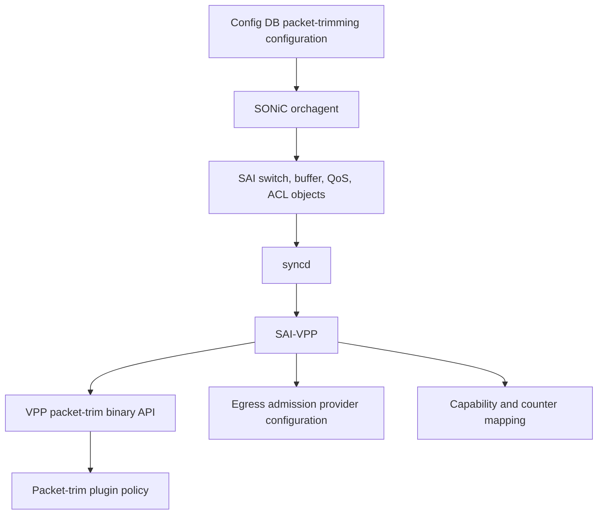
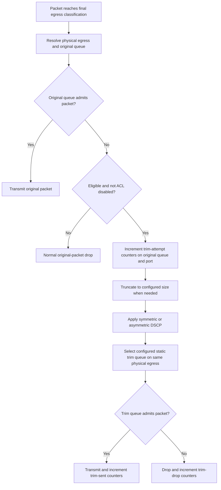

# SONiC-VPP Packet Trimming HLD

## Table of Contents

1. [Revisions](#1-revisions)
2. [Scope](#2-scope)
3. [Definitions](#3-definitions)
4. [Background](#4-background)
5. [Requirements](#5-requirements)
6. [Architecture](#6-architecture)
7. [High-Level Design](#7-high-level-design)
8. [SAI API Mapping](#8-sai-api-mapping)
9. [Configuration and Management](#9-configuration-and-management)
10. [Warmboot and Fastboot](#10-warmboot-and-fastboot)
11. [Memory and Performance](#11-memory-and-performance)
12. [Error Handling](#12-error-handling)
13. [Limitations and Future Work](#13-limitations-and-future-work)
14. [Testing](#14-testing)
15. [Open Items](#15-open-items)
16. [References](#16-references)

## 1. Revisions

| Rev | Date | Author(s) | Changes |
|---|---|---|---|
| v0.1 | 2026-07-23 | Aaron Bernardino | Initial SONiC-VPP packet-trimming design |
| v0.2 | 2026-07-23 | Aaron Bernardino | Corrected current-state analysis: SAI-VPP already advertises trimming capability; clarified that advertisement must be *reduced* to match the datapath; identified KVM egress backend and refined counter and enablement details |
| v0.3 | 2026-07-23 | Aaron Bernardino | Feasibility spike (Gate 0) on the live `vms-kvm-vpp-t1-lag` testbed: confirmed VPP has no egress QoS / queue-admission substrate, so the test's blocking scheduler is a dataplane no-op and trimming cannot occur. Corrected the KVM egress backend to DPDK virtio + LCP TAP. Scoped this increment to **capability truthfulness** (VPP advertises trimming as *not* supported); retained the datapath design as the target architecture and a tracked prerequisite (future work) |
| v0.4 | 2026-07-25 | Aaron Bernardino | Gate 0 resolved **positively**: instead of deferring the datapath, this increment supplies the missing admission substrate in software. The `sonic_ext` plugin gains a generic per-`{port, queue}` software admission shim (a token bucket driven by the SONiC scheduler rate and buffer-profile capacity) on the `interface-output` arc, plus a trim action node (truncate → DSCP rewrite → static trim-queue retry → counters), validated end to end on standalone VPP. Reframed the datapath from *tracked prerequisite* to *delivered design*; SAI-VPP raises the advertised capability to `SWITCH_TRIMMING_CAPABLE=true` once the translation is wired and validated. Corrected the header-checksum (§7.4) and one-shot guard (§7.6, now an `interface-output-arc-end` bypass) descriptions to match the implementation |
| v0.5 | 2026-07-30 | Aaron Bernardino | Root-caused and fixed a multi-segment (jumbo) trim defect on the KVM/DPDK backend: truncation cleared the VLIB chain flag but left the backing `rte_mbuf` `->next`/`nb_segs` stale, so the virtio PMD re-appended the freed tail (5000→256 egressed as 1208 = 256 + 952). Fix clears `VLIB_BUFFER_EXT_HDR_VALID` on the severed segment (§7.4). Validated end to end on `vms-kvm-vpp-t1-lag`: `test_packet_size_after_trimming` passes for single-segment (400→256) and jumbo/multi-segment (5000→4084, 3000→256). Bumped `VPP_VERSION` suffix for the plugin content change |
| v0.6 | 2026-07-30 | Aaron Bernardino | Made the `sonic-mgmt` suite self-sufficient and enabled it on VPP. Test helpers now create the `queue{1,3}_{uplink,downlink}_lossy_profile` BUFFER_PROFILEs when absent (they ship only in real SN5640/7060X6 QoS templates) and clear test-created `BUFFER_QUEUE` trim-queue refs in teardown so post-test YANG validation stays clean — the three in-scope cases pass with zero setup/teardown errors and no manual `redis-cli` (§14.2). Implemented the `conditional_mark` enablement (§14.3): exempted `asic_type == 'vpp'` from the hwsku skip and added `asic_type in ['vpp']` skips for the deferred asymmetric module and symmetric cases (ACL, SRv6, counters ×2, mirror, reload/reboot, stability/port-admin toggles). Validated the rule against the plugin's own decision logic with the DUT's real facts across VPP / real-SKU / non-listed-SKU / `vs` |

## 2. Scope

This document describes how SONiC-VPP relates to the existing
[SONiC Packet Trimming](../packet_trimming/packet-trimming-design.md) design,
and defines the dataplane architecture implementing it on VPP.

**Increment scope (this change).** A Gate 0 feasibility spike on the live VPP
KVM testbed (see [4. Background](#4-background)) established that the VPP
dataplane has no native egress QoS / queue-admission model, so a blocking SONiC
scheduler cannot by itself produce the admission failure that packet trimming
hangs off. Rather than defer the datapath, this increment **supplies the missing
substrate in software**: the `sonic_ext` VPP plugin gains a generic
per-`{egress port, queue}` software admission shim — a token bucket sized from
the SONiC scheduler rate and buffer-profile capacity, installed on the
`interface-output` feature arc — plus a trim action node that truncates the
rejected copy, rewrites its DSCP, and retries it on the configured static trim
queue. SAI-VPP translates the existing packet-trimming SAI attributes onto that
datapath and, for the symmetric core that is complete and validated end to end,
advertises the capability truthfully as **supported**
(`SWITCH_TRIMMING_CAPABLE=true`), at which point the `sonic-mgmt` symmetric suite
runs.

The capability stays honest by narrowing *what* is advertised rather than gating
the switch capability off: SAI-VPP advertises only the enum values the datapath
honors (`DSCP_VALUE` DSCP resolution, `STATIC` queue resolution), so orchagent
never programs the asymmetric `FROM_TC` or `DYNAMIC` modes VPP does not implement.
Cases that exercise unimplemented behavior are deferred in `sonic-mgmt` through
conditional_mark skips keyed on `asic_type == vpp`. The shared `sonic-sairedis`
virtual-switch base over-advertises every trim enum today; that enum
over-advertisement is corrected on VPP (see
[7.12](#712-capability-advertisement)).

The target design covers:

- Translating the existing packet-trimming SAI attributes into VPP state.
- Detecting a failed admission to a trim-eligible egress queue.
- Truncating eligible IPv4 and IPv6 packets and remapping their DSCP.
- Sending the shortened packet through a configured static trim queue.
- Supporting symmetric `DSCP_VALUE` and asymmetric `FROM_TC` modes.
- Supporting per-buffer-profile eligibility and ACL `DISABLE_TRIM`.
- Reporting switch, port, and queue packet-trimming counters.
- Preserving the selected physical egress member for LAG traffic.
- Rebuilding packet-trimming state after configuration replay.

This document is a VPP platform adaptation. It does not redefine the existing
SONiC CLI, Config DB schema, YANG model, orchestration, or SAI contract.

The design does not support dynamic trim-queue resolution. That mode requires the
complete DSCP-to-TC-to-queue pipeline to select the trim queue after DSCP
remapping and is left for future work. The shared `sonic-sairedis` virtual-switch
base currently advertises the dynamic mode as supported; VPP advertises only the
`STATIC` mode it honors and omits `DYNAMIC` from the enum (see
[7.12](#712-capability-advertisement)).

## 3. Definitions

| Term | Meaning |
|---|---|
| Admission failure | A packet cannot be accepted by its selected egress queue because the queue has reached its configured capacity |
| Original queue | The egress queue selected for the unmodified packet |
| Trim queue | The egress queue selected for the shortened packet |
| Trim attempt | An eligible original packet reaches the packet-trimming path after original-queue admission fails |
| Trimmed packet | A packet processed by the trim path, whether or not its original length exceeded the configured trim size |
| Admission provider | The VPP component that enforces queue capacity and hands rejected buffers to packet-trimming policy |
| DSCP | Differentiated Services Code Point |
| TC | Traffic Class |
| LAG | Link Aggregation Group, represented by a VPP BondEthernet interface |
| SAI-VPP | The `sonic-sairedis` virtual switch implementation that translates SAI objects to VPP |
| VPP plugin | The SONiC-local VPP packet-trimming plugin and binary API |

## 4. Background

Packet trimming lets a receiver learn about congestion sooner than it would
after a complete packet drop and retransmission timeout. When admission to a
trim-eligible lossy queue fails, the switch:

1. Keeps at most the configured number of bytes.
2. Assigns a configured DSCP, or resolves DSCP from a configured trim TC.
3. Tries to transmit the shortened packet through a high-priority trim queue.

SONiC already provides the platform-independent control-plane implementation:

```text
CLI / Config DB
    |
    v
switchorch + bufferorch + qosorch + aclorch
    |
    v
SAI switch / buffer profile / QoS / ACL objects
    |
    v
syncd
    |
    v
platform SAI
```

The current SAI-VPP state is important to state precisely, because it is not a
blank slate:

- The shared `sonic-sairedis` virtual-switch base already advertises full
  packet-trimming capability. It reports the switch, buffer-profile, and stats
  enum capabilities (DSCP `DSCP_VALUE`/`FROM_TC`, queue `STATIC`/`DYNAMIC`,
  buffer action `DROP`/`DROP_AND_TRIM`, and the switch/port/queue trim stats),
  and `SwitchVpp::queryAttributeCapability` reports every attribute as
  create/set/get implemented.
- As a result, `sonic-swss` already computes `isSwitchTrimmingSupported() == true`
  and publishes `SWITCH_CAPABILITY|switch:SWITCH_TRIMMING_CAPABLE=true` on VPP.
  The configuration path is fully functional today: switch, buffer-profile, QoS,
  and ACL objects are accepted and stored as virtual object state.
- What is missing is entirely below SAI: VPP performs no trimming, and the trim
  statistics read back as zero because the base returns no values for them.

VPP also has no native equivalent of
`SAI_BUFFER_PROFILE_PACKET_ADMISSION_FAIL_ACTION_DROP_AND_TRIM`.

Because capability is already advertised while the datapath does nothing, VPP
currently reports support it does not provide. A Gate 0 feasibility spike on the
live `vms-kvm-vpp-t1-lag` testbed confirmed *why* the datapath does nothing and
established the near-term direction:

- **Forwarding path (measured).** Front-panel transit egresses through
  `BondEthernetXXX` (mode `xor`, load-balance `l34-inner`) onto member
  interfaces that are **DPDK virtio** ports (`Red Hat Virtio`, one TX queue,
  4096 descriptors). SONiC `EthernetX` ports are VPP **Linux Control Plane
  (LCP) TAP** interfaces paired to those members. (An AF_PACKET
  `host-interface` backend exists in `vpp_init.sh` only for veth-based ports;
  this testbed presents virtio PCI, so it takes the DPDK path.)
- **No QoS / admission substrate (measured).** The running VPP graph has no
  policer (the CLI is not even compiled in), no scheduler, shaper, HQoS, or
  per-queue admission node, no per-queue buffer accounting, and no
  congestion/tail-drop counter in the transit path. There is no native
  equivalent of `SAI_BUFFER_PROFILE_PACKET_ADMISSION_FAIL_ACTION_DROP_AND_TRIM`.
- **The SONiC scheduler is a dataplane no-op.** SAI-VPP stores the
  `SAI_SCHEDULER_GROUP` / `SAI_QUEUE` object model so orchagent is satisfied,
  but programs no VPP rate/shaper. The packet-trimming test creates congestion
  by binding a `PIR=1` blocking scheduler to a queue; on VPP that scheduler
  changes no dataplane state, so the "blocked" queue keeps forwarding at line
  rate. Without congestion there is no admission failure, so a trim action
  would never fire.

Consequently, real trimming on VPP first requires an egress per-queue admission
model that honors the SONiC scheduler rate, so that a blocked queue can actually
reach a *cannot-admit* state. Rather than treat that as a separate prerequisite,
this design **provides it in software**: a generic per-`{port, queue}`
token-bucket admission shim on the `interface-output` arc (see
[7.1](#71-admission-provider)), sized from the SONiC scheduler rate and
buffer-profile capacity, so the test's `PIR=1` blocking scheduler drains the
bucket and yields a real, recoverable admission failure. The trim action node
([7.4](#74-truncation-and-header-handling)–[7.6](#76-static-trim-queue-and-retry))
hangs off that failure. Because the shim is generic — it carries no
packet-trimming SAI policy or test constants — it is the minimal substrate
needed and keeps the SONiC-specific logic in SAI-VPP and the plugin control path.

The SAI-VPP translation that drives this datapath is completed and validated for
the symmetric core, so the platform advertises packet trimming as *supported*
(`SWITCH_TRIMMING_CAPABLE=true`). To keep the advertisement honest, VPP corrects
the base's enum over-advertisement — narrowing the advertised trim enum values to
the modes the datapath honors (`DSCP_VALUE`, `STATIC`) so orchagent never
programs an unimplemented mode — rather than gating the switch capability off
(see [7.12](#712-capability-advertisement)).

## 5. Requirements

### 5.1 Functional Requirements

| ID | Requirement |
|---|---|
| REQ-1 | VPP must trim only after admission to the original queue fails |
| REQ-2 | Trimming eligibility must follow the buffer profile attached to the original queue |
| REQ-3 | `DROP` must retain normal drop behavior; `DROP_AND_TRIM` must invoke trim policy |
| REQ-4 | The trim size must be runtime configurable |
| REQ-5 | Symmetric mode must write the configured DSCP value |
| REQ-6 | Asymmetric mode must resolve DSCP from the configured trim TC and the selected egress port's TC-to-DSCP map |
| REQ-7 | The initial implementation must transmit through the configured static trim queue |
| REQ-8 | ACL `DISABLE_TRIM` must suppress trimming for matching packets |
| REQ-9 | A packet must enter the trim path no more than once |
| REQ-10 | Trim attempts, successful trim transmissions, and trim-queue drops must be counted at the required SAI scopes |
| REQ-11 | LAG traffic must remain associated with the physical member selected before original-queue admission |
| REQ-12 | Runtime updates must not leave SAI object state and VPP policy state divergent |

### 5.2 Non-Functional Requirements

- No per-packet heap allocation is allowed in the dataplane path.
- Packet trimming must be inactive when no eligible buffer profile is bound.
- Existing forwarding behavior must remain unchanged while the feature is
  disabled.
- The admission integration point must be generic and must not contain SONiC
  SAI policy.
- The design must not depend on scheduler names, a particular configured rate,
  or constants from the packet-trimming test suite.
- Capability advertisement must reflect only functionality that is initialized
  and usable at runtime.

### 5.3 Non-Goals

- Changes to the generic packet-trimming Config DB schema or CLI.
- A new SONiC application extension.
- Full hardware-MMU emulation in VPP.
- Dynamic trim-queue resolution in the initial implementation.
- Recalculation of IP or transport length and checksum fields after truncation.
- Replacing VPP's existing forwarding, LAG hashing, QoS, or ACL architecture.

## 6. Architecture

> **Scope note.** Sections [6](#6-architecture)–[9](#9-behavioral-details)
> describe the delivered datapath: a software egress admission shim plus the trim
> action node in the `sonic_ext` plugin, driven by SAI-VPP. The datapath is
> validated on standalone VPP; the SAI-VPP translation that programs it from live
> SONiC configuration is completed and validated end to end before the capability
> is advertised as supported (see [7.12](#712-capability-advertisement)). Genuine
> remaining limitations and future work are in
> [13](#13-limitations-and-future-work).

### 6.1 Control-Plane Flow



SAI-VPP owns object relationships and translates the platform-independent SAI
contract into compact VPP policy:

- Global trim size, DSCP mode/value, TC value, and static trim queue.
- Effective eligibility for each `{egress port, original queue}` pair.
- TC-to-DSCP maps associated with egress ports.
- ACL rules that set trim-disable metadata.
- Queue rate and capacity inputs required by the admission provider.

### 6.2 Dataplane Flow



### 6.3 Component Responsibilities

| Component | Responsibility |
|---|---|
| VPP admission integration | Software per-`{port, queue}` token-bucket admission shim on the `interface-output` arc that turns a rate-limited (blocked) queue into a recoverable admission failure; generic, carrying no packet-trimming SAI policy |
| VPP packet-trim plugin | Eligibility lookup, truncation, DSCP rewrite, static trim-queue retry with one-shot `interface-output-arc-end` re-injection, counters, binary API, and debug CLI |
| SAI-VPP | Translate the packet-trimming SAI attributes and object relationships onto the plugin (global policy, per-queue eligibility from the buffer profile, scheduler rate/capacity, TC-to-DSCP map) and advertise the capability truthfully — narrowing the advertised trim enum values to the modes the datapath honors (`DSCP_VALUE`, `STATIC`) so `SWITCH_TRIMMING_CAPABLE=true` is honest for the symmetric core. Sourcing trim counters through `getStatsExt` is deferred ([7.11](#711-counters)) |
| sonic-swss | No VPP-specific change expected; the generic packet-trimming orchestration and capability publication already function on VPP |
| sonic-mgmt | No suite code change: the `skip_if_packet_trimming_not_supported` capability fixture gates the suite on `SWITCH_TRIMMING_CAPABLE` (`true` on VPP, so it runs), and conditional_mark skips the out-of-scope cases on `asic_type == vpp` ([14.3](#143-enablement-gating)) |

## 7. High-Level Design

### 7.1 Admission Provider

Packet trimming needs a point where an egress packet can be *recoverably*
rejected — rejected while VPP still owns the buffer, so the trim action can run
instead of the packet being freed. VPP has no such point natively, so the plugin
provides one as a software admission shim.

**`sonic-ext-trim-admission`** is a feature node on the `interface-output` arc,
enabled per egress `sw_if_index` whenever that port has at least one
trim-eligible queue. For each packet it resolves the egress `{port, queue}` — the
queue from the packet DSCP via the SAI-pushed DSCP-to-queue table — and runs that
queue's software token bucket:

| Result | Meaning | Action |
|---|---|---|
| Non-eligible / unconfigured queue | not policed | pass straight through the arc (normal traffic is never perturbed) |
| Eligible queue, bucket admits | within rate | continue the arc (normal egress) |
| Eligible queue, bucket rejects | recoverable admission failure | divert to the trim action node ([7.4](#74-truncation-and-header-handling)) |

The token bucket is driven by generic rate/capacity inputs only, supplied by
SAI-VPP from the queue's scheduler and buffer profile. A queue with no effective
rate limit (a scheduler `PIR` of `0`, SONiC's "unlimited") keeps the bucket
permanently full, so its traffic is always admitted and normal forwarding is
never perturbed. A queue whose scheduler imposes a nonzero `PIR` — the mechanism
SONiC's blocking scheduler (`PIR=1`) uses to hold a data-plane queue closed —
empties the bucket, so every eligible packet on that queue hits a real admission
failure and is trimmed. The shim recognizes no packet-trimming scheduler names or
test constants; it is pure rate/capacity accounting, so it never carries SONiC
SAI policy and never perturbs a queue that is not trim-eligible.

Because the shim is a normal feature-arc node, no VPP core change is required for
the KVM DPDK-virtio backend. Backends that cannot be policed on the
`interface-output` arc (for example the AF_PACKET `host-interface` path) would
reuse the same generic node at their own pre-transmit point.

### 7.2 Packet-Trim Policy State

The VPP plugin maintains:

- One global packet-trimming configuration.
- One eligibility record per effective egress-port/original-queue binding.
- One TC-to-DSCP map reference per egress port for asymmetric mode.
- Switch, port, and queue counters.

The global configuration contains:

| Field | Meaning |
|---|---|
| `trim_size` | Maximum number of bytes retained |
| `dscp_mode` | Direct configured value or `FROM_TC` |
| `dscp_value` | Symmetric DSCP value |
| `trim_tc` | TC used for asymmetric egress-map lookup |
| `queue_mode` | Static in the initial implementation |
| `trim_queue` | Queue index used for the shortened packet |

An eligibility record is active only when the queue's effective buffer profile
uses `DROP_AND_TRIM`.

### 7.3 Original-Queue Admission Failure

On a recoverable admission failure, the admission node has resolved:

- The buffer index.
- The final physical egress `sw_if_index` (`VLIB_TX`).
- The original queue index (stamped into the buffer for the trim node).
- That the queue is trim-eligible.

The plugin diverts the packet to the trim action node only when the global
configuration is valid and the original queue is trim-eligible; otherwise the
packet stays on the normal arc (admitted) or follows the existing drop path.
Re-entry is prevented **structurally** rather than with a per-buffer flag: the
trimmed copy is re-injected at `interface-output-arc-end`, past the admission
feature, so it can never re-enter admission and be trimmed twice (see
[7.6](#76-static-trim-queue-and-retry)). This avoids depending on `opaque2` being
cleared on buffer recycle, which VPP does not guarantee.

ACL-driven trim suppression (`SAI_ACL_ENTRY_ATTR_ACTION_PACKET_TRIM_DISABLE`,
[7.9](#79-acl-disable-trim)) sets a per-buffer flag that this decision also
honors when that path is enabled.

### 7.4 Truncation and Header Handling

When a packet is longer than `trim_size`, VPP shortens the buffer chain to at
most `trim_size` bytes, freeing any tail buffers in a chained packet. When a
packet is shorter than or equal to `trim_size`, it is sent at its original
length. In both cases the packet is processed by the trim path and receives the
configured DSCP behavior.

**Multi-segment (jumbo) buffers.** On the KVM/DPDK backend, jumbo frames arrive
scatter-gathered into a chain of VLIB buffers, each backed by a DPDK `rte_mbuf`
(the `interface-output` arc runs with `VLIB_BUFFER_EXT_HDR_VALID` set on RX
buffers). Truncating the chain clears the VLIB `VLIB_BUFFER_NEXT_PRESENT` flag
and frees the tail buffers, but that alone does **not** update the backing
`rte_mbuf`: it still carries the RX-time `nb_segs` and a `->next` pointer to the
now-freed tail segment. `dpdk_validate_rte_mbuf()` only rebuilds the mbuf header
(via `rte_pktmbuf_reset()`, which sets `next = NULL` and `nb_segs = 1`) when
`EXT_HDR_VALID` is clear, and the virtio PMD TX path walks `mb->next` until NULL
rather than trusting `nb_segs`. Without intervention the freed tail therefore
rides onto the wire — a 5000-byte frame trimmed to 256 was observed egressing as
256 + 952 = 1208 bytes. The trim path fixes this by clearing
`VLIB_BUFFER_EXT_HDR_VALID` on the severed segment, forcing the mbuf header to be
rebuilt cleanly so only the retained bytes are transmitted. This case is covered
end to end by `test_packet_size_after_trimming` (jumbo 5000 → 4084 and, with a
larger default packet, 3000 → 256).

The trim path deliberately preserves the original L3/L4 length fields as the
congestion signal — it does **not** recalculate:

- IPv4 total length (the header still reports the pre-trim length).
- IPv6 payload length.
- TCP or UDP length and checksum fields.

The one field that *is* updated is the **IPv4 header checksum**, and only because
the DSCP rewrite ([7.5](#75-dscp-resolution)) changes the ToS byte: the checksum
is recomputed over the 20-byte header so the header stays valid after the DSCP
change, while the (deliberately unmodified) total-length field is unaffected. The
IPv4 header checksum covers only the header, so leaving the truncated payload out
does not invalidate it; IPv6 carries no header checksum. This matches the
existing SONiC packet-trimming validation contract, which inspects the preserved
length fields together with the rewritten DSCP.

### 7.5 DSCP Resolution

For IPv4, VPP rewrites the six DSCP bits in the Type of Service field while
preserving ECN bits. For IPv6, VPP rewrites the DSCP portion of Traffic Class
while preserving ECN bits.

| Mode | Resolution |
|---|---|
| `DSCP_VALUE` | Use the global configured `dscp_value` |
| `FROM_TC` | Use `trim_tc` to look up DSCP in the TC-to-DSCP map attached to the selected egress port |

If asymmetric mode has no usable egress map entry, the trim operation fails,
the packet is dropped, and a configuration/runtime error counter is incremented.
SAI-VPP should reject configurations that are invalid at programming time.

### 7.6 Static Trim Queue and Retry

The initial implementation uses
`SAI_PACKET_TRIM_QUEUE_RESOLUTION_MODE_STATIC`.

The trim action node:

1. Rewrites the DSCP of the copy ([7.5](#75-dscp-resolution)) and truncates it
   ([7.4](#74-truncation-and-header-handling)).
2. Steers the copy to the configured static `trim_queue` on the **same** physical
   egress interface (`VLIB_TX` is unchanged) and runs that queue's token bucket.
3. If the trim queue admits, transmits the copy by enqueuing it directly to
   `interface-output-arc-end` — the node the `interface-output` feature arc
   terminates at — so it goes straight to the port TX, *past* the admission
   feature. If the trim queue rejects (it is itself congested), the copy is
   dropped.

Enqueuing the transmitted copy to the arc end is what makes the one-shot
guarantee **structural**: a trimmed copy never re-enters the admission feature,
so it can never be trimmed a second time and no per-buffer "already trimmed" flag
is needed. This is deliberately more robust than a buffer flag, because VPP does
not zero `opaque2` on buffer recycle, so a flag could survive into an unrelated
future packet and wrongly suppress its trimming.

### 7.7 Physical Ports and LAGs

For a physical-port egress, the trim retry uses the same physical interface.

For a LAG egress, VPP bond selection occurs before queue admission. The
admission provider records the selected physical member. The trim retry uses
that member directly instead of re-entering bond hashing, which:

- Keeps original-queue and trim-queue counters on one physical port.
- Avoids moving a congestion notification to a different LAG member.
- Prevents a second flow-hash decision from changing packet ordering.

The logical LAG identity remains available for diagnostics, but SAI port and
queue trim counters are attributed to the physical member and its queues.

### 7.8 Buffer Profile and Queue Relationships

SAI-VPP tracks the object chain from a queue to its attached buffer profile.
Whenever the queue binding or
`SAI_BUFFER_PROFILE_ATTR_PACKET_ADMISSION_FAIL_ACTION` changes, SAI-VPP
recomputes and programs effective eligibility.

Because sonic-vpp creates front-panel ports dynamically as orchagent brings the
switch up — not at switch-create time — SAI-VPP enumerates the ports to program
from the live SAI port-object store on each recompute, rather than from a port
list captured at initialization. A recompute therefore always covers every
front-panel port that currently exists, including ports created after the first
trim-relevant attribute was observed, and a late buffer-profile binding is picked
up by the next recompute rather than being missed.

The update sequence is:

1. Validate the referenced SAI objects.
2. Program the new VPP eligibility.
3. Update stored SAI object state only after VPP accepts the change.

Removing or replacing a buffer profile first disables affected eligibility,
then removes the VPP policy state.

### 7.9 ACL Disable Trim

SAI-VPP extends the existing VPP ACL translation for
`SAI_ACL_ENTRY_ATTR_ACTION_PACKET_TRIM_DISABLE`.

A matching ACL rule sets a per-buffer `trim_disabled` flag. The flag is metadata
only and does not change the packet action by itself. If original-queue admission
later fails, trim policy observes the flag and follows normal drop behavior.

ACL rule create, update, and remove operations program VPP before stored SAI
state is committed.

### 7.10 Scheduler and Capacity Inputs

The admission provider requires a controllable rate and queue capacity for the
KVM dataplane.

SAI-VPP translates the subset of scheduler and buffer configuration required by
the selected provider:

- The effective egress scheduling rate attached to a queue.
- The effective queue capacity derived from its buffer profile.
- Queue-to-port and queue-index relationships.

This translation is generic but binarized to the two states the supported
topology exercises: a queue whose scheduler imposes no rate limit (`PIR=0`,
SONiC's "unlimited") is mapped to an always-admitting bucket, and a queue whose
scheduler imposes any nonzero `PIR` — the form SONiC's
`SCHEDULER_BLOCK_DATA_PLANE` profile uses to close a data-plane queue — is mapped
to a bucket that cannot admit, producing the recoverable admission failure that
drives trim. Modeling a proportional sub-line-rate `PIR` (a partial rate limit
rather than open/closed) is future work; the KVM testbed only ever drives a
data-plane queue as unlimited or closed.

Full SAI scheduler hierarchy, shared-buffer accounting across ports, headroom,
and hardware-specific threshold behavior remain outside this design.

### 7.11 Counters

The VPP plugin maintains packet-trim counters in the dataplane and exposes them
through the binary API (`sonic_ext_trim_counters_get`). The **target** design
maps them onto the existing SAI statistics and serves them from `getStatsExt`,
kept at three scopes so the SAI switch, port, and queue stat IDs can all be
sourced:

| Event | Counter attribution |
|---|---|
| Eligible original-queue admission failure | `TRIM_PACKETS` on the original queue and physical egress port |
| Trim packet transmitted | `TX_TRIM_PACKETS` on the switch, physical egress port, and trim queue |
| Trim-queue admission failure | `DROPPED_TRIM_PACKETS` on the switch, physical egress port, and trim queue |

Counter reads must be monotonic and safe while workers update them, and a clear
operation resets only the requested scope and statistics.

The exact queue-index attribution must match the `sonic-mgmt` counter
assertions: the suite verifies that the switch-level trim-sent counter equals the
sum of the per-port counters and that each port's counter is consistent with its
per-queue counters, and the feature-toggle test reads the queue-level
`trimpacket` counter on the *trim* queue index (`UC` + configured trim queue).
The plugin's per-`{port, queue}` counter model is defined to satisfy those
cross-checks directly.

**Delivered scope (initial enablement).** The plugin maintains the counters and
serves them over the binary API, but SAI-VPP does **not** yet source them through
`getStatsExt` — `SwitchVpp::getStatsExt` still delegates trim stat IDs to the
shared virtual-switch base, which returns zero. SAI stat sourcing is deferred
(see [13.1](#131-integration-status)), and the `sonic-mgmt` trim-counter cases
are skipped on `vpp` via conditional_mark until it lands. Raising the base's
zero-valued trim stats to real plugin values is future work, not part of this
enablement.

### 7.12 Capability Advertisement

Packet-trimming capability on VPP must track the datapath: `sonic-swss` must be
told which trim modes VPP can actually satisfy so orchagent never programs one it
cannot. The shared virtual-switch base advertises packet trimming on VPP:

- `SwitchStateBase::queryAttrEnumValuesCapability` returns the DSCP modes
  (`DSCP_VALUE`, `FROM_TC`), the queue modes (`STATIC`, `DYNAMIC`), and the
  buffer-profile action modes (`DROP`, `DROP_AND_TRIM`).
- `SwitchStateBase::queryStatsCapability` lists the switch, port, and queue trim
  stats as supported.
- `SwitchVpp::queryAttributeCapability` reports every switch trim attribute as
  create/set/get implemented.

Together these make `sonic-swss` publish `SWITCH_TRIMMING_CAPABLE=true`. The
initial enablement **keeps** trimming advertised as supported — the symmetric
datapath is wired and validated ([13.1](#131-integration-status)) — but narrows
the advertised *enum values* to exactly what the software admission shim honors:

| Seam | Delivered behavior |
|---|---|
| `SwitchVpp::queryAttributeCapability` | Inherits the base: the six `SAI_SWITCH_ATTR_PACKET_TRIM_*` attributes (size, DSCP mode, DSCP value, TC value, queue mode, queue index) stay create/set/get implemented, so `sonic-swss`'s `isSwitchTrimmingSupported()` follows the `set` capability and `SWITCH_TRIMMING_CAPABLE` is `true` |
| `SwitchVpp::queryAttrEnumValuesCapability` | Overrides the base to advertise a single value per trim enum — `DSCP_VALUE` for `SAI_SWITCH_ATTR_PACKET_TRIM_DSCP_RESOLUTION_MODE` and `STATIC` for `SAI_SWITCH_ATTR_PACKET_TRIM_QUEUE_RESOLUTION_MODE` — so orchagent never programs the asymmetric `FROM_TC` or `DYNAMIC` modes VPP does not implement. `DROP`/`DROP_AND_TRIM` buffer-profile actions are left to the base metadata |

Because the capability stays `true`, the symmetric `packet_trimming` PTF suite
runs on sonic-vpp. Cases that exercise unimplemented behavior — asymmetric
per-port DSCP (`FROM_TC`), `DYNAMIC` queue resolution, ACL disable-trim, trim
counters, port mirroring with trim, and reload/reboot persistence — are deferred
in `sonic-mgmt` through conditional_mark skips keyed on `asic_type == vpp`
([14.3](#143-enablement-gating)), rather than by gating the switch capability to
`false`. This keeps the supported symmetric core enabled while excluding the
out-of-scope cases from the run.

The enum-advertisement decision is factored into a small pure predicate
(`SwitchVpp::getTrimEnumValuesCapability`) that the override calls, so it is
covered directly by a SAI-VPP unit test ([14.1](#141-unit-and-component-tests)).

### 7.13 Update and Remove Ordering

For create or set operations:

1. Validate SAI input and object references.
2. Build the complete replacement VPP policy.
3. Apply it to VPP.
4. Commit the SAI virtual object state.

For remove operations:

1. Disable or detach dependent VPP policy.
2. Remove the VPP object or mapping.
3. Remove the SAI virtual object state.

If VPP programming fails, the SAI operation fails and the previous stored state
is retained.

## 8. SAI API Mapping

### 8.1 Switch Attributes

| SAI attribute | VPP mapping |
|---|---|
| `SAI_SWITCH_ATTR_PACKET_TRIM_SIZE` | Global `trim_size` |
| `SAI_SWITCH_ATTR_PACKET_TRIM_DSCP_RESOLUTION_MODE` | Global DSCP mode |
| `SAI_SWITCH_ATTR_PACKET_TRIM_DSCP_VALUE` | Symmetric DSCP value |
| `SAI_SWITCH_ATTR_PACKET_TRIM_TC_VALUE` | Asymmetric trim TC |
| `SAI_SWITCH_ATTR_PACKET_TRIM_QUEUE_RESOLUTION_MODE` | Accept `STATIC`; reject `DYNAMIC` with `SAI_STATUS_NOT_SUPPORTED` and omit it from the advertised enum |
| `SAI_SWITCH_ATTR_PACKET_TRIM_QUEUE_INDEX` | Global static trim queue |

### 8.2 Buffer Profile and ACL

| SAI attribute/action | VPP mapping |
|---|---|
| `SAI_BUFFER_PROFILE_ATTR_PACKET_ADMISSION_FAIL_ACTION=DROP` | Disable trim eligibility for queues using the profile |
| `SAI_BUFFER_PROFILE_ATTR_PACKET_ADMISSION_FAIL_ACTION=DROP_AND_TRIM` | Enable trim eligibility for queues using the profile |
| `SAI_ACL_ENTRY_ATTR_ACTION_PACKET_TRIM_DISABLE` | Set per-buffer trim-disable metadata for matching packets |

### 8.3 Statistics

The implementation maps the existing switch, port, and queue trim statistics,
including:

- `SAI_SWITCH_STAT_DROPPED_TRIM_PACKETS`
- `SAI_SWITCH_STAT_TX_TRIM_PACKETS`
- `SAI_PORT_STAT_TRIM_PACKETS`
- `SAI_PORT_STAT_DROPPED_TRIM_PACKETS`
- `SAI_PORT_STAT_TX_TRIM_PACKETS`
- `SAI_QUEUE_STAT_TRIM_PACKETS`
- `SAI_QUEUE_STAT_DROPPED_TRIM_PACKETS`
- `SAI_QUEUE_STAT_TX_TRIM_PACKETS`

No SAI API change is required.

## 9. Configuration and Management

This design introduces no new CLI, Config DB, APP DB, State DB, YANG, REST, or
gNMI schema. SONiC-VPP uses the configuration and capability fields defined by
the generic packet-trimming HLD.

The VPP plugin adds diagnostic commands for:

- Current global trim configuration.
- Effective eligible egress queues.
- Port TC-to-DSCP map resolution.
- Admission-provider status.
- Switch, port, and queue trim counters.

These commands are for serviceability and do not replace the standard SONiC CLI.

## 10. Warmboot and Fastboot

Packet-trimming policy is rebuilt from normal SONiC configuration replay.

- Global configuration, object relationships, QoS maps, ACL rules, and queue
  eligibility are reprogrammed through SAI.
- Transient queue occupancy and per-buffer metadata are not restored.
- Trim counters follow the existing SAI-VPP counter persistence behavior.
- A packet in the trim retry path during restart may be dropped.

The feature adds no sleeps, file I/O, or CPU-heavy processing to the boot
critical path when unused. Initialization creates only the plugin state and
capability check. Fastboot behavior is otherwise unchanged.

## 11. Memory and Performance

Persistent state is proportional to configured ports, queues, buffer-profile
bindings, and QoS maps:

```text
O(number of ports * queues per port + configured maps + ACL policy)
```

The per-buffer trim metadata (the resolved original queue, and the ACL
trim-disable flag when that path is used) reuses existing VPP buffer opaque
space; the one-shot guarantee is structural (arc-end re-injection), not a stored
flag. The dataplane performs no heap allocation.

When trimming is disabled or no eligible profile is bound, the additional
dataplane cost is one predictable eligibility check at the admission-failure
path. Packets admitted to their original queue do not enter packet mutation.

The software admission shim, if required for the KVM backend, must use bounded
queues and worker-local state. It must not introduce unbounded buffering or a
global lock in the packet path.

## 12. Error Handling

| Error case | Handling |
|---|---|
| Invalid trim size, DSCP, TC, or queue index | Return `SAI_STATUS_INVALID_PARAMETER`; do not update VPP or stored SAI state |
| Unsupported dynamic queue mode | Return `SAI_STATUS_NOT_SUPPORTED` |
| Referenced queue, port, buffer profile, or QoS map is missing | Return an appropriate SAI object/reference failure |
| VPP plugin or admission provider is unavailable | Keep trimming capability false and reject trimming configuration |
| VPP binary API update fails | Return failure and retain previous SAI object state |
| Asymmetric DSCP cannot be resolved at runtime | Drop the trim packet and increment a diagnostic error counter |
| Egress metadata is missing at admission failure | Use the normal drop path; do not guess an interface or queue |
| Trim queue rejects the packet | Drop once, increment trim-drop counters, and do not retry |
| Counter read fails | Return the SAI failure; do not return a success-shaped zero |

## 13. Limitations and Future Work

### 13.1 Integration status

The datapath in [6](#6-architecture)–[9](#9-behavioral-details) — the software
admission shim, the trim action node, the binary API, and the debug CLI — is
implemented in the `sonic_ext` plugin and validated on standalone VPP
(happy-path trim plus the recycled-buffer regression that confirms the arc-end
bypass one-shot guarantee).

The SAI-VPP translation that drives it from live SONiC configuration is
implemented and validated at the datapath-programming layer on the `t1-lag`
testbed dev VM, confirmed by reading VPP's own plugin state (`show sonic-ext
trim`) after pushing configuration through CONFIG_DB:

1. **Per-`{port, queue}` eligibility** is programmed from
   `SAI_BUFFER_PROFILE_ATTR_PACKET_ADMISSION_FAIL_ACTION` and the
   queue↔buffer-profile binding. **Validated:** with `egress_lossy_profile` set
   to `DROP_AND_TRIM`, VPP reports the lossy queues (`0,1,2,5,6`) eligible and
   the lossless queues (`3,4,7`) bypassed on every front-panel port.
2. **Scheduler rate and buffer-profile capacity** map onto the admission shim's
   token bucket — unlimited when the queue has no rate limit, closed when a
   blocking scheduler holds it ([7.10](#710-scheduler-and-capacity-inputs)).
   **Validated:** unlimited eligible queues report an always-admitting bucket in
   VPP; the closed-queue branch is the one the `packet_trimming` suite's blocking
   scheduler drives to force the trim.
3. **The global trim policy and DSCP-to-queue table** are pushed and confirmed in
   VPP. **Validated:** `show sonic-ext trim` reports `size=256, dscp=48
   (symmetric), queue=6`.

The remaining integration work, tracked by the feature story, is:

4. Source the switch/port/queue trim counters through `getStatsExt`
   ([7.11](#711-counters)) instead of returning the base's zero values, and
   enable the deferred `sonic-mgmt` trim-counter cases.
5. Extend the datapath to the deferred modes — asymmetric per-port DSCP
   (`FROM_TC`), `DYNAMIC` queue resolution, ACL disable-trim, port mirroring with
   trim, and reload/reboot persistence — and remove the corresponding
   conditional_mark skips ([14.3](#143-enablement-gating)).

Capability is advertised as supported (`SWITCH_TRIMMING_CAPABLE=true`) and the
symmetric `packet_trimming` suite is enabled now that its end-to-end PTF cases
pass on the `t1-lag` testbed; the out-of-scope cases above remain skipped on
`vpp` until each is implemented and validated.

### 13.2 Design limitations

- Dynamic trim-queue resolution is not supported in the initial implementation;
  only `STATIC` queue resolution is advertised and honored.
- The admission shim models only the token-bucket behavior needed to produce a
  recoverable admission failure; it is not full hardware-MMU or multi-level HQoS
  emulation.
- SAI-VPP programs eligibility to the admission shim only for queue indices below
  the plugin's `SONIC_EXT_TRIM_MAX_QUEUES` (8). sonic-vpp creates additional
  per-port unicast/multicast queue objects at indices ≥ 8; these are never
  trim-eligible in the supported configuration — the trim queue and every
  eligible lossy queue are below the cap — so they are intentionally not pushed
  to the shim, which also avoids per-queue programming errors for out-of-range
  indices.
- Eligibility is recomputed on each trim-relevant attribute change rather than
  cached at initialization ([7.8](#78-buffer-profile-and-queue-relationships)),
  so a binding that lands after an earlier recompute (for example while buffer
  configuration is still replaying on a cold boot) is picked up by the next
  trim-relevant update rather than being missed.
- The IPv4 header checksum is updated after the DSCP rewrite, but IP and
  transport **length** fields are deliberately not recalculated after truncation
  (the original length is the congestion signal —
  [7.4](#74-truncation-and-header-handling)).
- The admission shim uses one token bucket per `{port, queue}` updated on the
  egress worker; multi-worker per-queue bucket sharding is future work and is not
  required by the single-worker KVM topology.
- The global trim policy and the DSCP-to-queue table are switch-wide; per-port
  QoS-map variation is not modeled in the initial implementation, which matches
  the uniform testbed configuration.
- The first implementation targets the DPDK virtio egress backend used by the
  supported VPP KVM topology. Additional backends (for example the AF_PACKET
  `host-interface` path used for veth ports) may reuse the same generic admission
  node at their own pre-transmit point.
- Advanced interactions such as mirroring and SRv6 are enabled in sonic-mgmt only
  after their focused validation passes.

Future work includes dynamic queue resolution, per-worker bucket sharding,
per-port QoS-map fidelity, broader software QoS scheduling, and upstreaming any
generic VPP admission-failure integration through FD.io.

## 14. Testing

### 14.1 Unit and Component Tests

**Target coverage.** The full trim design is intended to be covered by VPP
framework tests and SAI-VPP unit tests:

- VPP dataplane: IPv4/IPv6 TCP/UDP packets; packets larger than, equal to, and
  smaller than the trim size; symmetric and asymmetric DSCP resolution; ECN
  preservation; ineligible buffer profiles; ACL trim disable; original-queue and
  trim-queue admission failure; one-shot retry behavior; physical and LAG-member
  egress attribution; chained-buffer truncation; counter read and clear behavior.
- SAI-VPP: capability query results; switch attribute validation and update
  ordering; buffer-profile-to-queue relationship changes; QoS map create,
  replace, and remove; ACL action create, update, and remove; VPP failure
  rollback; switch, port, and queue statistic mapping.

**Delivered in this enablement.** The datapath itself was validated on standalone
VPP and on the `t1-lag` dev VM by reading the plugin state directly (`show
sonic-ext trim`, [13.1](#131-integration-status)); no automated VPP framework
tests are added for `sonic_ext` yet. The SAI-VPP unit tests
(`unittest/vslib/TestSwitchVpp.cpp`, built under `USE_VPP`) cover the pure
decision logic that gates the enablement:

- `getTrimEnumValuesCapability` — the trim enum-values advertisement
  ([7.12](#712-capability-advertisement)): `DSCP_VALUE` for the DSCP mode,
  `STATIC` for the queue mode, and no match for unrelated attributes or object
  types.
- `isTrimDataplaneAttr` — the set/create attribute classification that triggers a
  per-queue trim re-resolve, including the port QoS-map bindings and QoS-map
  edits.
- `getLagMemberEgressDisableAction` — pre-existing LAG-member egress logic.

The remaining target coverage (VPP framework tests, counter/rollback/QoS-map SAI
tests) is future work tracked with the deferred datapath modes
([13.1](#131-integration-status)).

### 14.2 System Tests

The packet-trimming suite is enabled on the VPP `t1-lag` KVM topology in
stages:

1. Configuration and capability tests.
2. Symmetric packet size and DSCP tests.
3. Asymmetric `FROM_TC` tests.
4. Feature and port-state toggles.
5. ACL disable trim.
6. Switch, port, and queue counters.
7. Trim-queue congestion.
8. Reload and reboot persistence.
9. Mirror and SRv6 interactions.

Regression coverage includes normal forwarding, LAG hashing and failover, QoS
mapping, ACL actions, and existing VPP plugin tests.

**Validation status (2026-07-30).** Stages 1–2 are validated end to end on the
live `vms-kvm-vpp-t1-lag` testbed with the delivered `sonic_ext` datapath and the
SAI-VPP capability raised to `true`:

| Test | Result |
|---|---|
| `test_trimming_configuration` | pass |
| `test_packet_size_after_trimming` (single-segment 400→256) | pass |
| `test_packet_size_after_trimming` (jumbo/multi-segment 5000→4084, 3000→256) | pass |
| `test_dscp_remapping_after_trimming` (trimmed and small-untrimmed) | pass |

The jumbo case exercised the multi-segment DPDK mbuf fix in
[7.4](#74-truncation-and-header-handling). Stages 3–9 (asymmetric `FROM_TC`,
counters, ACL disable-trim, reload/reboot persistence, mirror, SRv6) remain
out of scope for this increment and are tracked as future work in
[13.1](#131-integration-status).

**Test-layer self-sufficiency (2026-07-30).** The suite now runs unattended on
VPP with no manual `redis-cli` preparation. Two `sonic-mgmt` gaps surfaced on the
minimal `Force10-S6000` config and were closed in the test helpers:

- The per-block-queue `queue{1,3}_{uplink,downlink}_lossy_profile` BUFFER_PROFILEs
  the suite references ship only in the real Mellanox SN5640 / Arista 7060X6 QoS
  templates. `set_buffer_profile_for_block_queue` now creates the profile when it
  is absent (idempotent no-op on the real SKUs), so the block-queue scheduler
  wiring is available on VPP.
- `config load` of the pre-test backup is a merge, so a test-created
  `BUFFER_QUEUE|<intf>|<trim-queue>` reference is not removed on platforms whose
  base config lacks it (VPP). Teardown now clears those references before
  deleting `trim_queue_test_profile`, so post-test YANG validation stays clean.

With both fixes the three in-scope cases pass with zero setup/teardown errors.

### 14.3 Enablement Gating

The suite is gated by two mechanisms that act at different granularities:

1. The `sonic-mgmt` `conditional_mark` packet-trimming rule (OR-combined
   conditions). On the VPP testbed `asic_type` is `vpp` (not `vs`) and `hwsku`
   is `Force10-S6000`, so the hardware-SKU allowlist disjunct is the one that
   would otherwise skip the suite; it is amended to exempt VPP (see the
   implemented enablement below). This is the primary gate for **scoping** the
   suite on VPP: it selects exactly the in-scope symmetric cases to run and
   defers every out-of-scope case, keyed on `asic_type == vpp`.
2. The suite's own `skip_if_packet_trimming_not_supported` fixture, which reads
   `STATE_DB SWITCH_CAPABILITY|switch:SWITCH_TRIMMING_CAPABLE` and skips the
   whole suite when it is not `true`.

Mechanism 2 is a coarse on/off switch, and it is **satisfied** on VPP:
`SWITCH_TRIMMING_CAPABLE` is `true` (the shared virtual-switch base reports the
switch trim capability as implemented; VPP narrows only the advertised trim
*enum values* to the modes the datapath honors — see
[7.12](#712-capability-advertisement)), so the fixture does not skip. Case-level
scoping is therefore performed entirely by Mechanism 1: `conditional_mark` runs
the in-scope symmetric cases on VPP and defers the rest. The suite is brought up
in the stages listed in [14.2](#142-system-tests), deferring each
not-yet-validated stage through `conditional_mark` rather than by gating the
switch capability off.

**Implemented enablement (2026-07-30).** The `packet_trimming` `conditional_mark`
rule is updated so exactly the three in-scope symmetric cases run on VPP:

- The hardware-SKU allowlist disjunct becomes
  `hwsku not in [<4 real SKUs>] and asic_type != 'vpp'`, so the SKU gate no
  longer skips the suite on VPP while every non-VPP platform keeps its prior
  behavior.
- The deferred cases are skipped on VPP with per-test / per-file rules keyed on
  `asic_type in ['vpp']`: the whole `test_packet_trimming_asymmetric.py` module,
  and the symmetric `test_acl_action_with_trimming`, `test_trimming_with_srv6`,
  `test_stability_during_feature_toggles`,
  `test_trimming_during_port_admin_toggle`,
  `test_trimming_with_reload_and_reboot`, `test_trimming_counters`,
  `test_trimming_counters_with_feature_toggle`, and
  `test_port_mirror_with_trimming` cases. Each carries a reason pointing at the
  deferral in [13.1](#131-integration-status) and the tracking issue.

This was validated by driving the plugin's own `find_all_matches` /
`evaluate_conditions` logic against the deployed rule file with the DUT's real
facts: on VPP the three in-scope cases run and all deferred/asymmetric cases
skip; on the real SN5640 SKU every case still runs; on a non-listed SKU and on
the generic `vs` KVM every case still skips. The longest-match-per-mark
semantics keep the VPP disjunct and the general rule mutually exclusive per
platform, so there is no cross-interference.

The local KVM harness cannot exercise a `conditional_mark`-enforcing `pytest`
run because its `dut_basic_facts` ansible module is incompatible with the
harness ansible-core (`No module named ansible.module_utils.parse_utils`), which
is why in-harness runs use `--ignore-conditional-mark` and select cases with
`-k`. The rule is therefore validated at the plugin-decision level and behaves
normally in standard CI, where DUT fact-gathering works.

## 15. Open Items

Gate 0 (feasibility) is **resolved positively**: the VPP egress backend is DPDK
virtio with LCP TAP control-plane interfaces and has no native QoS/admission
substrate, so this design supplies that substrate as a generic software admission
shim in the `sonic_ext` plugin ([7.1](#71-admission-provider)) and builds the
trim action on top of it. The former open question — whether the backend could
supply recoverable admission directly or needed a software shim — is answered:
the shim approach is implemented and validated on standalone VPP.

The remaining items are integration details, tracked by the feature story and
resolved during end-to-end validation ([13.1](#131-integration-status)):

1. **Resolved.** SAI-VPP maps the SONiC scheduler `PIR` onto the shim's token
   bucket as open/closed — `PIR=0` (unlimited) admits, any nonzero `PIR` (the
   `SCHEDULER_BLOCK_DATA_PLANE` close) rejects — with buffer-profile capacity as
   the bucket depth ([7.10](#710-scheduler-and-capacity-inputs)). A proportional
   sub-line-rate `PIR` is not modeled.
2. Confirm the queue-index attribution expected by the `sonic-mgmt` counter
   assertions (which read `trimpacket` on the trim-queue index) against the
   plugin's per-`{port, queue}` counters and `getStatsExt` sourcing
   ([7.11](#711-counters)).
3. **Resolved.** The [7.12](#712-capability-advertisement) enum-narrowing
   override is in place: `SWITCH_TRIMMING_CAPABLE` is advertised `true` for the
   symmetric core, with the trim enum values restricted to `DSCP_VALUE` and
   `STATIC` so orchagent never programs the asymmetric modes VPP does not
   implement. Out-of-scope cases are deferred in `sonic-mgmt` via
   `conditional_mark` rather than by gating the capability off
   ([14.3](#143-enablement-gating)).

These items do not change the SONiC configuration or SAI contract, nor the
generic packet-trimming design described above.

## 16. References

- [SONiC Packet Trimming HLD](../packet_trimming/packet-trimming-design.md)
- [SONiC-VPP LAG Member Egress Disable HLD](vpp-lag-member-egress-disable-HLD.md)
- [SONiC HLD Template](../guidelines/hld_template.md)
- [sonic-buildimage issue #25789](https://github.com/sonic-net/sonic-buildimage/issues/25789)
- [SAI repository](https://github.com/opencomputeproject/SAI)
- [FD.io VPP](https://github.com/FDio/vpp)
