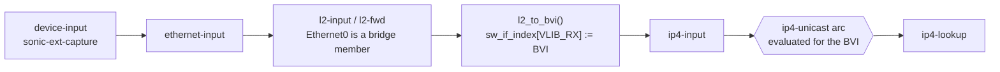

# Policy-Based Hashing (PBH) on the SONiC VPP Dataplane — High Level Design

## Table of Contents

1. [Revision History](#1-revision-history)
2. [Problem Statement](#2-problem-statement)
3. [SONiC Configuration Example and Corresponding SAI APIs](#3-sonic-configuration-example-and-corresponding-sai-apis)
4. [Design Principles](#4-design-principles)
5. [High Level Design](#5-high-level-design)
6. [Detailed Design](#6-detailed-design)
7. [Summary](#7-summary)
8. [Appendix A: File Change Summary](#appendix-a-file-change-summary)
9. [Appendix B: Why `ip.flow_hash` Cannot Carry the PBH Hashes](#appendix-b-why-ipflow_hash-cannot-carry-the-pbh-hashes)
10. [Appendix C: Can One Rule Drive Both Stages?](#appendix-c-can-one-rule-drive-both-stages)
11. [Appendix D: Sizing and Cache Behaviour of the Side-Band Table](#appendix-d-sizing-and-cache-behaviour-of-the-side-band-table)

---

## 1. Revision History

| Rev | Date | Author(s) | Changes |
|-----|------|-----------|---------|
| v0.1 | 09/24/2026 | Yue Gao (yuega2@cisco.com) | Initial draft. Plugin-based ECMP path (`pbh_plugin.so`, zero core patch); single small core patch `0019-sonic-pbh-lag-hash.patch` for the LAG path; new `pbh.api`; feature enabled by default and toggleable at three levels. |
| v0.2 | 10/01/2026 | Yue Gao (yuega2@cisco.com) | Reconciled with the implementation. PBH ships inside `sonic_ext` rather than a new plugin. Rule matching is a typed linear priority scan, not a `vnet_classify` chain (§6.5). Hash state corrected to Jenkins' three words — the one-variable `hash_v3_finalize32 (h, h, h)` of v0.1 returns 0 for every input (§6.4.1). Inner-header resolution split out, with VXLAN peeled by the plugin because `ip_inner_resolve()` cannot identify it (§6.4.2). ECMP steering restricted to `DPO_ADJACENCY` with an explicit `ip4-rewrite` next instead of `.sibling_of` (§6.6). Side-band moved to its own `sonic_ext_vnet_buf_main_t` and refcounted (§6.7.3). API indices allocated by VPP and returned (§6.3). LAG core patch renumbered `0019` → `0021`. |
| v0.3 | 10/02/2026 | Yue Gao (yuega2@cisco.com) | Added §6.10, support for PBH tables bound to ports that are L2 bridge members. `l2_to_bvi()` rewrites `sw_if_index[VLIB_RX]` to the BVI before `ip4-input`, so the arc armed in §6.6 on the member port is never evaluated; PBH now additionally arms a refcounted *shadow* attachment on the bridge domain's BVI (§6.10.2) and narrows it back to the bound ports in the dataplane using the `orig_rx_sw_if_index` capture cookie (§6.10.3). |
| v0.4 | 10/06/2026 | Yue Gao (yuega2@cisco.com) | Doc-only. Corrected the SAI binding description: `SAI_PORT_ATTR_INGRESS_ACL` / `SAI_LAG_ATTR_INGRESS_ACL` name an ACL *table group*, and the PBH table reaches an interface as a `SAI_ACL_TABLE_GROUP_MEMBER` (§3, §6.8.2); Appendix C.2 no longer claims `PbhOrch` creates no group. Corrected PBH table classification (§6.8.2) to match `isPbhTable()`: both `FIELD_GRE_KEY` and `FIELD_INNER_ETHER_TYPE` declared on the table, not an entry-action test. |
| v0.5 | 10/06/2026 | Yue Gao (yuega2@cisco.com) | PBH now applies to **recursive routes**. v0.2–v0.4 steered only `DPO_ADJACENCY` buckets and claimed a recursive route still picked up the PBH hash at the second level via `ip4-load-balance`; that was wrong, because the only path to that node is through `ip4-lookup`, which zeroes `ip.flow_hash` on entry, so the hash was lost at *every* level. The node now also accepts a `DPO_LOAD_BALANCE` bucket and dispatches it to `ip4-load-balance` / `ip6-load-balance` as a second declared next, with the hash in place (§5, §6.6). Counter accounting and the per-level `flow_hash >> 1` anti-polarisation shift are inherited unchanged from the core graph. Also doc-only in §6.5: the per-rule counter listing now shows the shipped code rather than the ACL plugin's variant, and discloses that a table replace resets the counters of *every* rule in the table — which any single PBH entry change triggers. |

---

## 2. Problem Statement

### 2.1 What PBH is

SONiC's **Policy-Based Hashing** feature lets an operator override the
switch-global ECMP / LAG hash **for a selected subset of traffic**, matched by
an ingress ACL-style rule. The canonical deployment is a Tier-1 / Tier-2
router carrying **NVGRE** and **VxLAN** transit tunnels:

* Thousands of distinct inner flows share **one** outer 5-tuple.
* The outer-only hash therefore maps all of them onto **one** ECMP next hop and
  **one** LAG member.
* Result: one link runs hot at line rate while its peers idle.

PBH says: *"for packets that look like NVGRE with GRE key `0x2500/24` and inner
ethertype IPv6, do not use the switch hash — use **this** hash profile, built
from the **inner** IPv6 5-tuple."*

Crucially PBH is an **override**, not a replacement. Non-matching traffic keeps
using the switch-global hash. This is why it is modelled in SAI as an ACL
*action* rather than a switch attribute.

### 2.2 What the VPP dataplane has today

| Capability | Status in SONiC-VPP today |
|---|---|
| Switch-global ECMP hash field selection | Partially — `flow_hash_config_t` bitmap per FIB, programmed by `vpp_ip_flow_hash_set()` |
| Inner-header hashing, switch-global | **Yes** — `0011-sonic-inner-aware-flow-hash.patch` adds `IP_FLOW_HASH_PEEK_INNER` (per-FIB) and `BOND_API_LB_ALGO_L34_INNER` (per-LAG) |
| Per-flow hash **override** driven by an ACL match | **No** |
| `SAI_OBJECT_TYPE_FINE_GRAINED_HASH_FIELD` | **No** — not implemented anywhere in `vslib/vpp/` |
| `SAI_ACL_ENTRY_ATTR_ACTION_SET_ECMP_HASH_ID` | **No** — silently unsupported |
| `SAI_ACL_ENTRY_ATTR_ACTION_SET_LAG_HASH_ID` | **No** — silently unsupported |

### 2.3 Relationship to patch 0011

Patch 0011 and PBH are **complementary layers of the same SAI model**, and both
must exist:

| | Patch 0011 | PBH (this document) |
|---|---|---|
| SAI surface | `SAI_SWITCH_ATTR_ECMP_HASH` / `LAG_HASH` + `SAI_HASH_ATTR_NATIVE_HASH_FIELD_LIST` | `SAI_ACL_ENTRY_ATTR_ACTION_SET_{ECMP,LAG}_HASH_ID` + `SAI_HASH_ATTR_FINE_GRAINED_HASH_FIELD_LIST` |
| Granularity | Per-FIB / per-VRF (ECMP), per-LAG (bond) | Per-interface, per-rule, per-flow |
| Field selection | Fixed order, no masks, coarse bitmap | Ordered groups, per-field masks |
| Scope | The **default** | The **override** on top of the default |

PBH therefore **does not subsume 0011** and 0011 is not removed. In fact the
PBH plugin *reuses* 0011's `src/vnet/ip/ip_inner_aware_hash.h` helpers
(`ip_inner_resolve()`, `ip_inner_v6_walk_ext_headers()`) for inner-header
parsing, which is an argument for keeping 0011 rather than dropping it.

### 2.4 The four concrete gaps

| # | Gap | Where |
|---|---|---|
| G1 | `ip4_lookup_inline` **unconditionally clobbers** `vnet_buffer(b)->ip.flow_hash` before computing the bucket, so no upstream node can pre-seed an ECMP hash | [ip4_forward.h](platform/vpp/vppbld/repo/src/vnet/ip/ip4_forward.h#L103-L111) |
| G2 | VPP has no notion of an **ordered, masked** hash field list — `flow_hash_config_t` is a flat bitmap with fixed field order and one all-or-nothing symmetry bit | [ip_flow_hash.h](platform/vpp/vppbld/repo/src/vnet/ip/ip_flow_hash.h) |
| G3 | The ACL plugin's `fa_5tuple_t` cannot express **GRE key** or **inner ethertype**, so `acl_plugin_match_5tuple_inline()` cannot implement a PBH rule | [types.h](platform/vpp/vppbld/repo/src/plugins/acl/types.h) |
| G4 | `bond_tx_hash()` hands the registered hash function `void **p` — **ethernet-header pointers only, no `vlib_buffer_t`** — so no upstream feature node can communicate a per-packet LAG decision to it | [device.c](platform/vpp/vppbld/repo/src/vnet/bonding/device.c#L205-L243) |

G1–G3 are solvable **entirely inside an out-of-tree plugin**. G4 is structural
and is the sole justification for the LAG core patch in §6.7.

---

## 3. SONiC Configuration Example and Corresponding SAI APIs

### 3.1 CONFIG\_DB

The example below is the canonical NVGRE + VxLAN configuration, taken verbatim
from the swss regression fixtures in
[test_pbh.py](src/sonic-swss/tests/test_pbh.py#L697-L910). Field names are
defined in [pbhschema.h](src/sonic-swss/orchagent/pbh/pbhschema.h#L5-L37).

```json
{
    "PBH_HASH_FIELD": {
        "inner_ip_proto":    { "hash_field": "INNER_IP_PROTOCOL",             "sequence_id": "1" },
        "inner_l4_dst_port": { "hash_field": "INNER_L4_DST_PORT",             "sequence_id": "2" },
        "inner_l4_src_port": { "hash_field": "INNER_L4_SRC_PORT",             "sequence_id": "2" },
        "inner_dst_ipv4":    { "hash_field": "INNER_DST_IPV4", "ip_mask": "255.0.0.0", "sequence_id": "3" },
        "inner_src_ipv4":    { "hash_field": "INNER_SRC_IPV4", "ip_mask": "0.0.0.255", "sequence_id": "3" },
        "inner_dst_ipv6":    { "hash_field": "INNER_DST_IPV6", "ip_mask": "ffff::",    "sequence_id": "4" },
        "inner_src_ipv6":    { "hash_field": "INNER_SRC_IPV6", "ip_mask": "::ffff",    "sequence_id": "4" }
    },

    "PBH_HASH": {
        "inner_v4_hash": {
            "hash_field_list": [ "inner_ip_proto", "inner_l4_dst_port",
                                 "inner_l4_src_port", "inner_dst_ipv4", "inner_src_ipv4" ]
        },
        "inner_v6_hash": {
            "hash_field_list": [ "inner_ip_proto", "inner_l4_dst_port",
                                 "inner_l4_src_port", "inner_dst_ipv6", "inner_src_ipv6" ]
        }
    },

    "PBH_TABLE": {
        "pbh_table": {
            "interface_list": [ "Ethernet0", "Ethernet4", "PortChannel0001", "PortChannel0002" ],
            "description": "NVGRE and VxLAN"
        }
    },

    "PBH_RULE": {
        "pbh_table|nvgre": {
            "priority":         "1",
            "ether_type":       "0x0800",
            "ip_protocol":      "0x2f",
            "gre_key":          "0x2500/0xffffff00",
            "inner_ether_type": "0x86dd",
            "hash":             "inner_v6_hash",
            "packet_action":    "SET_ECMP_HASH",
            "flow_counter":     "DISABLED"
        },
        "pbh_table|vxlan": {
            "priority":         "2",
            "ether_type":       "0x0800",
            "ip_protocol":      "0x11",
            "l4_dst_port":      "0x12b5",
            "inner_ether_type": "0x0800",
            "hash":             "inner_v4_hash",
            "packet_action":    "SET_LAG_HASH",
            "flow_counter":     "ENABLED"
        }
    }
}
```

Note that `PBH_TABLE.interface_list` mixes physical ports and PortChannels —
the SAI ACL table is created with **both** `SAI_ACL_BIND_POINT_TYPE_PORT` and
`SAI_ACL_BIND_POINT_TYPE_LAG`, see
[pbhorch.cpp](src/sonic-swss/orchagent/pbhorch.cpp#L243-L252).

### 3.2 Semantics of `sequence_id` and `ip_mask`

Both attributes exist because a fine-grained hash is defined as an **ordered
partition** of fields:

$$H \;=\; \mathrm{MIX}\Big(g_{s_1},\, g_{s_2},\, \ldots\Big), \qquad
g_s \;=\; \bigoplus_{i\,:\,\mathrm{seq}_i = s}\big(v_i \wedge M_i\big)$$

* **`sequence_id`** — fields are mixed in ascending `sequence_id`. Fields
  *sharing* a `sequence_id` form one group and are combined with a
  commutative, associative operator (XOR), so their relative order is
  irrelevant. `saihash.h` states this as *"defines in which fields should be
  associative for CRC with the same sequence ID"*. Giving `SRC` and `DST` the
  same `sequence_id` **and the same mask** yields a direction-**symmetric**
  hash; giving them complementary masks (as the fixture above does) yields an
  entropy-preserving but asymmetric hash.
* **`ip_mask`** — an AND mask applied to the address *before* it enters the
  group fold. `MANDATORY_ON_CREATE` only for the width-explicit
  `*_IPV4` / `*_IPV6` field variants; absent for `IP_PROTOCOL`,
  `L4_*_PORT`, etc. See
  [saihash.h](src/sonic-sairedis/SAI/inc/saihash.h#L202-L231).

Neither concept has any equivalent in VPP's `flow_hash_config_t` — this is
gap **G2**, and implementing it is the core of §6.4.

### 3.3 Corresponding SAI API calls

Order of operations as driven by `PbhOrch`:

```
1.  sai_hash_api->create_fine_grained_hash_field()      x7   (one per PBH_HASH_FIELD)
        SAI_FINE_GRAINED_HASH_FIELD_ATTR_NATIVE_HASH_FIELD  = SAI_NATIVE_HASH_FIELD_INNER_*
        SAI_FINE_GRAINED_HASH_FIELD_ATTR_IPV4_MASK          (v4 address fields only)
        SAI_FINE_GRAINED_HASH_FIELD_ATTR_IPV6_MASK          (v6 address fields only)
        SAI_FINE_GRAINED_HASH_FIELD_ATTR_SEQUENCE_ID

2.  sai_hash_api->create_hash()                         x2   (inner_v4_hash, inner_v6_hash)
        SAI_HASH_ATTR_FINE_GRAINED_HASH_FIELD_LIST      = { fg_field_oid, ... }

3.  sai_acl_api->create_acl_table_group()/create_acl_table()  (via AclOrch)
        SAI_ACL_TABLE_ATTR_ACL_STAGE                    = SAI_ACL_STAGE_INGRESS
        SAI_ACL_TABLE_ATTR_ACL_BIND_POINT_TYPE_LIST     = { PORT, LAG }
        SAI_ACL_TABLE_ATTR_FIELD_GRE_KEY
        SAI_ACL_TABLE_ATTR_FIELD_ETHER_TYPE
        SAI_ACL_TABLE_ATTR_FIELD_IP_PROTOCOL
        SAI_ACL_TABLE_ATTR_FIELD_IPV6_NEXT_HEADER
        SAI_ACL_TABLE_ATTR_FIELD_L4_DST_PORT
        SAI_ACL_TABLE_ATTR_FIELD_INNER_ETHER_TYPE

    sai_acl_api->create_acl_table_group_member()             (table joins the group)
        SAI_ACL_TABLE_GROUP_MEMBER_ATTR_ACL_TABLE_GROUP_ID
        SAI_ACL_TABLE_GROUP_MEMBER_ATTR_ACL_TABLE_ID
        SAI_ACL_TABLE_GROUP_MEMBER_ATTR_PRIORITY

4.  sai_acl_api->create_acl_counter()                        (flow_counter == ENABLED only)

5.  sai_acl_api->create_acl_entry()                     x2
        SAI_ACL_ENTRY_ATTR_TABLE_ID
        SAI_ACL_ENTRY_ATTR_PRIORITY
        SAI_ACL_ENTRY_ATTR_FIELD_ETHER_TYPE       / _IP_PROTOCOL / _IPV6_NEXT_HEADER
        SAI_ACL_ENTRY_ATTR_FIELD_GRE_KEY          / _L4_DST_PORT / _INNER_ETHER_TYPE
        SAI_ACL_ENTRY_ATTR_ACTION_SET_ECMP_HASH_ID = hash_oid    <-- the PBH action
     or SAI_ACL_ENTRY_ATTR_ACTION_SET_LAG_HASH_ID  = hash_oid
        SAI_ACL_ENTRY_ATTR_ACTION_COUNTER          = counter_oid

6.  sai_port_api->set_port_attribute(SAI_PORT_ATTR_INGRESS_ACL)  per interface
    sai_lag_api ->set_lag_attribute (SAI_LAG_ATTR_INGRESS_ACL)   per PortChannel
        = the ACL table *group* OID; the adapter walks its members to reach
          the PBH table
```

The two action attributes are mapped from the CONFIG\_DB strings in
[pbhmgr.cpp](src/sonic-swss/orchagent/pbh/pbhmgr.cpp#L24-L25); the fine-grained
field attribute assembly is at
[pbhorch.cpp](src/sonic-swss/orchagent/pbhorch.cpp#L1320-L1370).

---

## 4. Design Principles

### P1 — Plugin + feature arc over patching existing nodes

Every part of PBH that *can* live in an out-of-tree plugin *must*. Rationale:

* `platform/vpp/vppbld/Makefile` already copies `plugins/*` into
  `$(VPP_REPO_DIR)/src/plugins/`, so an out-of-tree plugin requires **zero**
  entries in `patches/series` and **zero** rebase burden at every VPP uprev.
* A feature-arc node is composable: it is only executed on interfaces where it
  has been explicitly enabled, and it yields to the rest of the arc via
  `vnet_feature_next()`. Patching `ip4_lookup_inline` would tax **every**
  packet on **every** interface whether PBH is configured or not.

The reference implementation to copy is VPP's own **ABF plugin**
([abf_itf_attach.c](platform/vpp/vppbld/repo/src/plugins/abf/abf_itf_attach.c#L540-L580)),
which solves exactly gap G1: rather than asking `ip4-lookup` to honour an
externally-supplied forwarding decision, it performs **its own** FIB lookup and
resolves the bucket itself.

This is not merely the tidier option, it is the only one that works. Setting
`vnet_buffer(b)->ip.flow_hash` before `ip4-lookup` has **no effect**:
`ip4_lookup_inline()` opens by discarding it
([ip4_forward.h](platform/vpp/vppbld/repo/src/vnet/ip/ip4_forward.h#L103)):

```c
  hash_c0 = vnet_buffer (b[0])->ip.flow_hash = 0;
```

and then recomputes the hash from the packet. Only the *recursive*
`ip4-load-balance` node honours a pre-set value
([ip4_forward.c](platform/vpp/vppbld/repo/src/vnet/ip/ip4_forward.c#L131)),
and a packet can only arrive there via `ip4-lookup`, which has already zeroed
it — so the first-level bucket is always chosen from the outer header unless
the lookup is bypassed entirely. `ip6_forward.c` behaves identically.

### P1b — Extend `sonic_ext`, do not add a plugin

PBH ships **inside the existing
[sonic_ext](platform/vpp/vppbld/plugins/sonic_ext) plugin**, not as a new
`pbh_plugin.so`. `sonic_ext` is already described as *"VPP extensions for SONiC
features"* and already bundles seven small SONiC-compliance behaviours behind
one shared object; PBH is the eighth.

What this avoids:

| Avoided | Because |
|---|---|
| A new `CMakeLists.txt` + `VLIB_PLUGIN_REGISTER` | `sonic_ext` already has one |
| A new `plugin pbh_plugin.so { enable }` line in **two** `startup.conf.tmpl` files | `sonic_ext_plugin.so` is already enabled in both |
| A second, divergent feature-toggle mechanism | PBH reuses the `sonic-ext { }` stanza (P4) verbatim |
| A second `.api` file, message-table registration and `vlibapi` boilerplate | messages are appended to `sonic_ext.api` |
| A second `show …` command family | `show sonic-ext` already reports every feature's toggle |

Consequences for the code:

* PBH state lives in its own `sonic_ext_pbh_main_t` in `pbh.h`. Only the
  feature toggle joins `sonic_ext_main_t`, via the
  `foreach_sonic_ext_feature` X-macro, alongside `punt_via_member`,
  `host_xc`, `ip2me` and friends. Keeping the pools, the attachment vector
  and the counters out of the shared struct is what lets PBH be a pure
  addition to the plugin rather than an edit of its core.
* API messages are named `sonic_ext_pbh_*` and live in `sonic_ext.api`.
* Node names keep the plugin's prefix convention:
  `sonic-ext-pbh-ip4` / `sonic-ext-pbh-ip6`, matching `sonic-ext-ip2me-ip4`,
  `sonic-ext-capture`, `sonic-ext-egress-mirror`.
* `FEATURE.yaml` gains two entries.

The one thing PBH does **not** inherit is `sonic_ext`'s `linux-cp` coupling:
the PBH nodes never touch `lcp_itf_pair`, so they are wired from the SAI-driven
attach API rather than from `sonic_ext_lcp_pair_add_cb()`.

### P2 — Own the matcher; never share

VPP does **not** merge classify tables. `vnet_classify` is a library, not a
service: a classify *hit* on a core node (`ip4-inacl`, `l2-input-classify`) is
terminal and dispatches to `hit_next_index` without re-entering the arc.
Composition is possible only via explicit `next_table_index` chaining by a
**single owner**.

Therefore PBH must not touch the core `input_acl` per-interface binding.
It follows the `tunterm_acl` house style of owning its matcher outright: its
own node and its own
`sonic_ext_pbh_main.table_index_by_sw_if_index[]` vector, with the rule
tables created implicitly by the API handler so SAI never sees a matcher
index.

It does **not**, however, use `vnet_classify` to do the matching. §6.5
explains why a typed linear scan in priority order is the better fit for
PBH's closed, variable-offset qualifier set. The ownership argument above is
unaffected — it is about not sharing a matcher, not about which matcher.

This also guarantees PBH coexists with the ACL plugin, `tunterm-acl` and the
core L2 punt classifiers — they operate on disjoint packet sets or at disjoint
arc positions.

### P3 — Declarative API, not incremental

`sonic_ext_pbh_table_add_replace` takes the **entire** ordered rule set for a
table in one message. Reasons:

* Rule priority maps to position in the ordered rule vector. An incremental
  `sonic_ext_pbh_rule_add_del` would force the plugin to re-sort and
  republish the table on every single rule, with a window of inconsistent
  forwarding.
* `PbhOrch` already re-evaluates the full table on any change.
* Matches the `tunterm_acl` precedent
  ([tunterm_acl_api.c](platform/vpp/vppbld/plugins/tunterm_acl/tunterm_acl_api.c#L51-L100)).

### P4 — Enabled by default, selectable per feature (per sonic-platform-vpp#291)

PBH reuses the `sonic_ext` feature-selection mechanism introduced by
[sonic-platform-vpp#291](https://github.com/sonic-net/sonic-platform-vpp/pull/291)
verbatim. No new toggle mechanism is invented.

**One new keyword, defaulting to on:**

```
sonic-ext {
    pbh  off
}
```

| Keyword | Governs | Family |
|---|---|---|
| `pbh` | The `sonic-ext-pbh-ip4` / `sonic-ext-pbh-ip6` feature nodes, the rule tables, both the `SET_ECMP_HASH` and `SET_LAG_HASH` actions, and whether the plugin registers `bond_main.lag_hash_override` — which is what activates the core patch of §6.7 | VPP-wired |

The keyword accepts `on | enable | off | disable`. An unrecognised keyword
returns a `clib_error_t`, so VPP fails at boot rather than running an
unintended configuration.

**Why one keyword and not two.** PBH's ECMP and LAG halves are two SAI actions
but a single operator-facing feature: `PbhOrch` drives both from the same
CONFIG_DB table, the same rule set, and the same hash profiles, and an operator
who wants inner-header-aware hashing wants it on both paths. Splitting the
switch would expose an implementation seam (which VPP node does the work) as a
configuration choice, which is exactly the coupling PR #291's keyword naming
avoids — `punt-via-member` likewise covers three nodes because they are one
behaviour. `pbh off` therefore also makes the core patch of §6.7 fully inert,
so the single switch is still the kill switch for the one part of this design
that touches VPP core.

**A disabled feature is never attached.** With `pbh off`,
`sonic_ext_pbh_interface_attach_detach()` returns without calling
`vnet_feature_enable_disable()`, so `sonic-ext-pbh-ip4` never appears in
`show interface features <if>`. The dispatch cost is reclaimed entirely rather
than paid and then short-circuited per packet. Same for the rule tables: a
disabled `pbh` means `sonic_ext_pbh_table_add_replace()` returns
`VNET_API_ERROR_FEATURE_DISABLED` and allocates nothing.

---

## 5. High Level Design

PBH adds **one feature-arc node per address family** — `sonic-ext-pbh-ip4` and
`sonic-ext-pbh-ip6` — to the `ip4-unicast` / `ip6-unicast` arcs, inside the
existing `sonic_ext` plugin. Each runs after the ACL plugin and after
`ip4-validate`, and before `ip4-lookup`.

For a packet arriving on an interface that has a PBH table bound, the node
walks that table's rule vector, which the plugin owns outright. The vector is
ordered by rule priority and the walk stops on first hit, so at most one rule
matches. §6.5 explains why this is a typed linear scan rather than a
`vnet_classify` chain: PBH's qualifier set is closed and enumerated, and two
of its qualifiers sit at offsets that move with IPv4 options and with the GRE
checksum bit, which a fixed-offset classify table cannot follow. Either way
the ACL plugin is bypassed rather than extended (gap **G3**).

A matching rule names up to two hash profiles, and the two are realised by
different mechanisms, because the two stages consume their hash in different
places:

* **ECMP (`SET_ECMP_HASH`).** The node computes the hash from the rule's
  profile and then does the forwarding decision itself: it calls
  `ip4_fib_forwarding_lookup()`, selects the load-balance bucket with that
  hash, writes the result into `adj_index[VLIB_TX]` and sends the packet
  straight to `ip4-rewrite`. `ip4-lookup` never runs for that packet,
  which is what sidesteps its unconditional overwrite of `ip.flow_hash`
  (gap **G1**). This is the ABF plugin's pattern, and it means **no core node
  is patched for the ECMP path at all**.

  A bucket that is itself a load balance (`DPO_LOAD_BALANCE`, i.e. a
  recursive route) is dispatched to `ip4-load-balance` instead, with the PBH
  hash left in `ip.flow_hash` for that node to consume. Anything else — a
  local or drop DPO, an unresolved adjacency, a tunnel midchain — falls
  through to the arc and reaches `ip4-lookup` normally. See §6.6 for why.

* **LAG (`SET_LAG_HASH`).** The member is not chosen until `bond_tx_hash()` on
  the TX side, long after the node has run, and the hash function invoked there
  is handed ethernet-header pointers with no access to the `vlib_buffer_t`
  (gap **G4**). The node therefore computes the hash and parks it in a
  plugin-private **side-band** table indexed by buffer; a small core hook then
  lets `sonic_ext` substitute that value for the stock hash immediately before
  member selection. The side-band exists so that neither a word nor a flag bit
  of the shared `vlib_buffer_t` metadata is consumed.

Packets that match no rule — and packets whose matching rule names no profile
for the stage in question — fall through untouched and keep the switch-global
hash. That is what makes PBH an *override* layered on top of patch 0011 rather
than a replacement for it.

The hash itself comes from a **fine-grained** profile: an ordered, per-field
masked field list, which VPP's flat `flow_hash_config_t` bitmap cannot express
(gap **G2**). §6.4 gives the computation.

### 5.1 Ingress — `ip4-unicast` feature arc

```mermaid
flowchart TD
    A["ip4-input"] --> B["ip4-sv-reassembly-feature"]
    B --> C["acl-plugin-in-ip4-fa"]
    C -->|deny| D["error-drop"]
    C -->|permit| E["tunterm-ip4-vxlan-bypass"]
    E -->|local VXLAN| F["tunterm-acl"] --> G["vxlan4-input"]
    G -.->|decapped inner pkt<br/>re-enters ip4-input| A
    E -->|not local VXLAN| H["ip4-validate"]
    H -->|bad| D
    H -->|ok| I["sonic-ext-pbh-ip4<br/><i>absent from the arc entirely<br/>when pbh is off</i>"]

    I --> J{"PBH table<br/>on rx intf?"}
    J -->|no| K["vnet_feature_next"]
    J -->|yes| L["scan rule vector<br/>(priority order)"]
    L -->|miss| K
    L -->|hit: rule r| M{"r.lag_profile<br/>!= ~0 ?"}
    M -->|yes| N["h = pbh_hash_inner(lag_prof)<br/>vnet_buf_claim(bi)-&gt;pbh_lag_hash = h<br/><i>plugin-private side-band</i>"]
    M -->|no| O
    N --> O{"r.ecmp_profile<br/>!= ~0 ?"}
    O -->|no| K
    O -->|yes| P["hc = pbh_hash_inner(ecmp_prof)"]
    P -->|hc == 0<br/>inner unparseable| K
    P -->|hc != 0| Q["set ip.fib_index<br/>lbi = ip4_fib_forwarding_lookup(fib, dst)<br/>dpo = bucket(lb, hc &amp; mask)"]
    Q -->|dpo is neither| K
    Q -->|dpo is DPO_ADJACENCY| Q2["adj_index&#91;VLIB_TX&#93; = dpo-&gt;dpoi_index<br/>increment LB counter"]
    Q -->|dpo is DPO_LOAD_BALANCE<br/>recursive route| Q3["adj_index&#91;VLIB_TX&#93; = dpo-&gt;dpoi_index<br/>ip.flow_hash = hc<br/>increment LB counter"]

    K --> R["ip4-lookup<br/>(switch-global hash)"]
    Q2 --> S["ip4-rewrite"]
    Q3 --> R2["ip4-load-balance<br/><i>reuses flow_hash &gt;&gt; 1</i>"]
    R2 --> S
    R --> S
    S --> T["interface-output"]
```



### 5.2 Egress — LAG member selection

```mermaid
flowchart TD
    A["ip4-rewrite"] --> B["BondEthernet&lt;n&gt;-tx"]
    B --> C["bond_tx_hash()"]
    C --> D["bif-&gt;hash_func(data, h, n)<br/><i>e.g. hash-eth-l34 — unchanged</i>"]
    D --> E{"bond_main.lag_hash_override<br/>registered ?"}
    E -->|no| F["h&#91;i&#93; unchanged"]
    E -->|yes| G["sonic_ext override:<br/>vnet_buf_find(b, PBH_LAG_HASH)"]
    G --> G2{"slot.valid &amp;<br/>PBH_LAG_HASH ?"}
    G2 -->|no: never tagged,<br/>or cleared when freed| F
    G2 -->|yes| G3["h&#91;i&#93; = slot.pbh_lag_hash<br/><i>field released</i>"]
    F --> H["member = h&#91;i&#93; &amp; (n_members - 1)"]
    G3 --> H
    H --> I["member interface tx"]
```



### 5.3 Worked example — NVGRE transit, `SET_ECMP_HASH`

| Step | What happens |
|---|---|
| 1 | Packet arrives on `Ethernet0`: `eth(0x0800) / ip4(proto=0x2f) / gre(key=0x25000001) / eth(0x86dd) / ip6(...) / tcp(...)` |
| 2 | ACL plugin permits; `tunterm-ip4-vxlan-bypass` does not match (not VXLAN); `ip4-validate` passes |
| 3 | `sonic-ext-pbh-ip4`: `sonic_ext_pbh_main.table_index_by_sw_if_index[Ethernet0]` is valid → rule vector scanned |
| 4 | Highest-priority rule is *priority 2* (`vxlan`, matches UDP) → miss. Next is *priority 1* (`nvgre`) → **hit** |
| 5 | That rule has `lag_profile == ~0`, `ecmp_profile == inner_v6_hash` |
| 6 | `sonic_ext_pbh_inner_resolve()` → `ip_inner_resolve()` walks GRE → inner ethertype 0x86dd → inner IPv6 header |
| 7 | `sonic_ext_pbh_hash_inner()`: group `seq=1` → inner `ip_protocol`; group `seq=2` → `l4_src_port ^ l4_dst_port`; group `seq=4` → `(dst6 & ffff::) ^ (src6 & ::ffff)`; mixed in that order |
| 8 | Own FIB lookup, bucket selected from the PBH hash, bucket is a `DPO_ADJACENCY`, `adj_index[VLIB_TX]` set, LB counter incremented |
| 9 | Go straight to `ip4-rewrite` — `ip4-lookup` is never executed, so the hash is never clobbered |
| 10 | Thousands of distinct inner flows now spread across all ECMP next hops |

### 5.4 Interaction matrix

| Other feature | Interaction | Outcome |
|---|---|---|
| ACL plugin (`acl-plugin-in-ip4-fa`) | PBH runs strictly after | Denied packets never reach PBH |
| `tunterm-acl` | Disjoint packet sets — tunterm diverts locally-terminating VXLAN, PBH acts on transit | No conflict; post-decap inner packets get PBH on their second arc traversal |
| `l2-input-classify` punt tables (`SwitchVppFdb.cpp`) | Different node, different arc, L2 vs L3 | No conflict |
| Patch 0011 `IP_FLOW_HASH_PEEK_INNER` | PBH takes precedence for matched packets; unmatched packets fall through to `ip4-lookup` and get the per-FIB config | Layered, as SAI intends |
| Patch 0011 `BOND_API_LB_ALGO_L34_INNER` | The configured algorithm still produces `h[]`; PBH overwrites only flagged entries | Layered |
| `ip_validate` plugin | PBH runs after; ordering now explicit | Also fixes the existing `ip4-validate` ↔ `tunterm-ip4-vxlan-bypass` ambiguity |
| Other `sonic_ext` features (`capture`, `ip2me`, `host-xc`, …) | Different arcs (`device-input`, `l2-input-classify`, `ip4-unicast` at a different position); PBH shares only the `sonic_ext_main_t` struct and the config stanza | No conflict; PBH adds no dependency on `linux-cp` |

---

## 6. Detailed Design

### 6.1 Component overview

| Component | Kind | New `.so`? | Core patch? |
|---|---|---|---|
| `plugins/sonic_ext/pbh*.{c,h}` + `sonic_ext.api` additions | **Extension of the existing plugin** | **No** | **No** |
| `0021-sonic-pbh-lag-hash.patch` | LAG hash override hook (~40 lines) | n/a | **Yes** |
| `vslib/vpp/SwitchVppHash.cpp` (new) | SAI fine-grained hash + hash objects | n/a | n/a |
| `vslib/vpp/SwitchVppAcl.cpp` (edit) | Recognise the two PBH actions | n/a | n/a |
| `vppxlate/SaiVppXlate.[ch]` (edit) | `vpp_pbh_*()` binary-API wrappers + `sonic_ext_feature_get` gate | n/a | n/a |
| `docker-*/conf/startup.conf.tmpl` (edit) | Document `pbh` in the commented `sonic-ext { }` stanza | n/a | n/a |

### 6.2 File layout inside `sonic_ext`

```
platform/vpp/vppbld/plugins/sonic_ext/
├── CMakeLists.txt        # + pbh.c pbh_node.c
│                         #   sonic_ext_vnet_buf.c          (3 lines)
├── FEATURE.yaml          # + pbh                          (1 line)
├── sonic_ext.api         # + sonic_ext_pbh_* messages     (§6.3)
├── sonic_ext.h           # + pbh in foreach_sonic_ext_feature
├── sonic_ext.c           # (no change: the X-macro supplies the keyword)
├── sonic_ext_api.c       # + the four sonic_ext_pbh_* message handlers
├── cli.c                 # + show sonic-ext pbh [profiles|tables|interfaces]
│
├── pbh.h                 # NEW  sonic_ext_pbh_profile_t, _rule_t, _table_t
├── pbh.c                 # NEW  profile/table pools, rule sort, arc attach
├── pbh_node.c            # NEW  sonic-ext-pbh-ip4 / -ip6 feature nodes
├── pbh_hash.h            # NEW  fine-grained hash computation (§6.4)
├── sonic_ext_vnet_buf.h  # NEW  plugin-private per-buffer side-band (§6.7.3)
├── sonic_ext_vnet_buf.c  # NEW  side-band table + buffer free callback
│
└── …                     # existing capture / ip2me / host-xc / … unchanged
```

Two placements are forced rather than chosen.

**The API handlers live in `sonic_ext_api.c`, not a `pbh_api.c`.** `vppapigen`
emits `sonic_ext.api.c` containing `setup_message_id_table()`, which registers
every message with `.handler = vl_api_<msg>_t_handler` — resolved **by name,
in whichever translation unit includes the generated file**. A separate
`pbh_api.c` would therefore not link. For the same reason the PBH `show`
command joins the existing `cli.c` rather than a new `pbh_cli.c`, for
consistency rather than necessity.

**No change is needed in `sonic_ext.c`.** Adding `pbh` to the
`foreach_sonic_ext_feature` X-macro in `sonic_ext.h` supplies the
`sonic-ext { pbh on|off }` keyword, the `show sonic-ext` row and the
`sonic_ext_feature_get("pbh")` answer for free.

PBH state lives in its own `sonic_ext_pbh_main_t` (§6.5) rather than in
`sonic_ext_main_t`; only the toggle is shared.

The only addition to `sonic_ext_main_t` is the toggle, supplied by the
`foreach_sonic_ext_feature` X-macro in `sonic_ext.h`:

```c
#define foreach_sonic_ext_feature                                             \
  _ (PUNT_VIA_MEMBER, punt_via_member, "punt-via-member", 1, VPP)             \
  _ (HOST_XC, host_xc, "host-xc", 1, VPP)                                     \
  …                                                                           \
+ _ (PBH, pbh, "pbh", 1, SAIVPP)
```

No latch is added — see §6.6 for why PBH does not need one.

Additions to `FEATURE.yaml`:

```yaml
features:
  - punt-via-member: redirect punted unicast/ARP over aggregated interface (BVI, Bond) to the original member tap
  - host-xc: bypass ethernet-input for packets injected from the linux-cp host tap
  - pbh: policy-based hashing — per-rule ECMP and LAG hash override driven by an ingress classifier (SAI SET_ECMP_HASH / SET_LAG_HASH)
```

### 6.3 New binary API — additions to `sonic_ext.api`

```c
/* ------------------------------------------------------------------
 * Policy-Based Hashing.  Gated by the "pbh" keyword of the sonic-ext
 * stanza; see sonic_ext_feature_get.
 * ------------------------------------------------------------------ */

/* One SAI_OBJECT_TYPE_FINE_GRAINED_HASH_FIELD.
 *
 * `field` is a sonic_ext_pbh_hash_field_id_t: INNER_IP_PROTOCOL,
 * INNER_L4_SRC_PORT, INNER_L4_DST_PORT, INNER_SRC_IPV4, INNER_DST_IPV4,
 * INNER_SRC_IPV6, INNER_DST_IPV6.  The C enum is generated from an X-macro
 * in pbh.h which also supplies the format function, so the two cannot
 * drift apart.
 *
 * The mask is 16 wire-order bytes whatever the address family, rather than
 * a vl_api_address_t: what is carried here is a bitmask, not an address,
 * and tagging it with an address family would invite a mask whose family
 * disagrees with the field it masks. */
typedef sonic_ext_pbh_hash_field
{
  u8  field;
  u32 sequence_id;    /* order + fold group; equal ids XOR-fold */
  u8  mask[16];
};

/* One SAI_OBJECT_TYPE_HASH. */
define sonic_ext_pbh_profile_add_del
{
  u32  client_index;
  u32  context;
  bool is_add;
  u32  profile_index;   /* on destroy only; ignored on add */
  u32  n_fields;
  vl_api_sonic_ext_pbh_hash_field_t fields[n_fields];
};

define sonic_ext_pbh_profile_add_del_reply
{
  u32 context;
  i32 retval;
  u32 profile_index;    /* VPP allocates; saivpp maps SAI OID -> this */
};

/* Which qualifiers of a rule are active: a bitmap of SONIC_EXT_PBH_Q_*,
 * likewise generated from an X-macro. */

/* One SAI_OBJECT_TYPE_ACL_ENTRY carrying a PBH action. */
typedef sonic_ext_pbh_rule
{
  u32 rule_id;        /* caller's id, echoed by show and the stats segment */
  u32 priority;       /* higher value wins; first match stops the walk */
  u32 qualifiers;     /* a clear bit matches anything */
  u16 ether_type;
  u16 inner_ether_type;
  u16 l4_dst_port;
  u8  ip_protocol;
  u8  ipv6_next_header;
  u32 gre_key;
  u32 gre_key_mask;
  u32 ecmp_profile;   /* ~0 => no SET_ECMP_HASH action */
  u32 lag_profile;    /* ~0 => no SET_LAG_HASH action */
  bool flow_counter;
};
```

Profile and table indices are **allocated by VPP and returned**, not chosen by
the caller. SAI OIDs are 64-bit and sparse while VPP pool indices are dense and
32-bit, and `libsaivs` already keeps an OID→index map for ACLs; letting the
caller pick would force either a sparse pool or a second map inside VPP.

Note: in theory, PBH rule can match on any ACL attributes. The intention is not to implement full parity with ACL using ABF. Only the attributes useful for PBH are supported today.

```c
/* Declarative: replaces the whole rule set of the table atomically. */
define sonic_ext_pbh_table_add_replace
{
  u32 client_index;
  u32 context;
  u32 table_index;    /* ~0 to create a new table */
  string name[64];    /* for `show` only */
  u32 n_rules;
  vl_api_sonic_ext_pbh_rule_t rules[n_rules];
};

define sonic_ext_pbh_table_add_replace_reply
{
  u32 context;
  i32 retval;
  u32 table_index;
};

autoreply define sonic_ext_pbh_table_del
{
  u32 client_index; u32 context; u32 table_index;
};

autoreply define sonic_ext_pbh_interface_attach_detach
{
  u32 client_index; u32 context;
  vl_api_interface_index_t sw_if_index;
  u32 table_index;
  bool is_attach;
};
```

The rule carries **no encapsulation field**. The handler derives it from the
qualifiers — UDP plus an `l4_dst_port` means VXLAN, GRE or IP-in-IP means the
`ip_inner_resolve()` path — so the caller cannot state an encapsulation that
contradicts the qualifiers it also stated. §6.4.2 explains why the
encapsulation has to be known at all.

There are deliberately **no** counter messages either. Per-rule packet and
byte counts are published into the VPP **stats segment** and read from shared
memory, exactly as the existing ACL counter path does — see §6.5. Polling a
counter therefore costs no API round trip and takes no worker barrier.

There is deliberately **no** `pbh_set_enable` message. Enable/disable is the
job of the `sonic-ext` stanza (P4); adding a runtime API toggle would
reintroduce the "attached but short-circuiting" cost that PR #291 removed, and
would give two sources of truth. The existing `sonic_ext_feature_get` covers
the read side:

```c
sonic_ext_feature_get (feature = "pbh")  ->  enabled
```

### 6.4 Fine-grained hash computation (gap G2)

`sonic_ext_pbh_profile_t` stores the field list **pre-sorted by `sequence_id`**
at configuration time so the datapath never sorts.

```c
typedef struct
{
  u8  field;                 /* sonic_ext_pbh_hash_field enum */
  u32 seq;
  union { ip4_address_t ip4; ip6_address_t ip6; } mask;
} sonic_ext_pbh_hash_field_t;

typedef struct
{
  sonic_ext_pbh_hash_field_t *fields;  /* sorted ascending by seq */
  u32                         n_groups;
} sonic_ext_pbh_profile_t;
```

#### 6.4.1 Hash computation

There is no per-stage salt — the ECMP and LAG stages hash different field
sets, so they are already decorrelated:

```c
static_always_inline u32
sonic_ext_pbh_hash_inner (const sonic_ext_pbh_profile_t *p,
                          const ip_inner_hdr_t *inner)
{
  /* Jenkins' lookup3 carries three words of state.  Seeding all three
     identically is fine; collapsing them is not — see the note below. */
  u32 a = 0x9e3779b9, b = 0x9e3779b9, c = 0x9e3779b9;
  u32 i = 0, n = vec_len (p->fields);

  while (i < n)
    {
      u32 group = 0, s = p->fields[i].seq;

      /* Same sequence_id => XOR-fold => order independent. */
      for (; i < n && p->fields[i].seq == s; i++)
        group ^= sonic_ext_pbh_field_value (&p->fields[i], inner);

      /* Distinct sequence_id => ordered mix.  Folding the sequence id in
         alongside the value is what makes the groups positional: two
         profiles that select the same values under different sequence ids
         hash differently. */
      a += group;
      b += s;
      hash_v3_mix32 (a, b, c);
    }
  hash_v3_finalize32 (a, b, c);

  /* 0 is the "unparseable" sentinel; never return it for a parsed packet. */
  return c | (c == 0);
}
```

The caller resolves the inner header once — see §6.4.2 — and passes it in,
because the matcher in §6.5 has already had to parse it to evaluate
`INNER_ETHER_TYPE`, and a rule may drive both the ECMP and the LAG profile
from the same packet. Resolving per profile would parse the same packet up to
three times.

> **Do not collapse the hash state.** `hash_v3_finalize32 (h, h, h)` — the
> obvious-looking one-variable form — returns **0 for every input**. The macro
> opens with `(c) ^= (b);`, which with all three arguments aliased to one
> lvalue is `h ^= h`, and every subsequent step propagates the zero. With the
> sentinel applied the function would return `1` for every packet and PBH
> would pin all traffic to a single ECMP bucket. The three-word form above
> was measured over 100k sequential inner source addresses — the adversarial
> low-entropy case, and exactly what the PTF test generates — and gives
> 12328–12674 packets per bucket across 8 ECMP buckets (ideal 12500) and a
> strict-avalanche score of 16.002 bits out of 32 (ideal 16.0).

#### 6.4.2 Inner-header resolution

Patch 0011's parser is reused, but its real signature takes the already-known
outer protocol and an explicit payload extent rather than a buffer
([ip_inner_aware_hash.h](platform/vpp/vppbld/repo/src/vnet/ip/ip_inner_aware_hash.h#L123-L144)):

```c
void ip_inner_resolve (u8 outer_protocol, const u8 *payload, u32 remaining,
                       ip_inner_hdr_t *out);
```

It handles `IP_IN_IP`, `IPV6` and `GRE`. It does **not** handle VXLAN, and
cannot: nothing in a VXLAN packet identifies it as VXLAN except the
destination port, which is policy, not encoding. PBH knows that policy —
it is the `l4_dst_port` qualifier — so the rule carries the encapsulation
shape it matched:

```c
typedef enum
{
  SONIC_EXT_PBH_ENCAP_NONE = 0,
  SONIC_EXT_PBH_ENCAP_VXLAN,
  SONIC_EXT_PBH_ENCAP_IP_GRE,
} sonic_ext_pbh_encap_t;
```

`sonic_ext_pbh_inner_resolve()` peels UDP, the 8-byte VXLAN header and the
inner Ethernet header itself for `ENCAP_VXLAN`, and delegates to
`ip_inner_resolve()` otherwise. The outer header's own length field bounds
the walk, so IPv4 options are handled and truncated or fragmented packets are
rejected rather than read past.

### 6.5 Rule matching (gap G3)

Rules are matched by a **typed linear scan in priority order**, not by
`vnet_classify`.

`vnet_classify` was the initial design, and it is the right tool when the
match is over arbitrary bytes at caller-chosen offsets — which is what the
ACL plugin needs. PBH is not that problem:

- **The qualifier set is closed.** SAI defines exactly six PBH qualifiers,
  and they are enumerated, not byte ranges. Classify's generality buys
  nothing and costs a mask-and-key marshalling layer on the control side.
- **Classify offsets are fixed; PBH's are not.** A classify table matches at
  a constant offset from a constant anchor. The GRE key sits at L3 + IHL×4 + 4,
  and the inner ethertype after that — both move with IPv4 options, and the
  GRE key's own offset moves with the GRE checksum bit. A fixed-offset table
  silently mismatches those packets. The scan reads every offset from the
  header's own length fields.
- **Rule counts are tiny.** `PbhOrch` emits on the order of one rule per
  encapsulation shape per inner address family — single digits — so a chain
  walk's constant factors dominate any hash-lookup advantage.
- **The dataplane here is a functional target.** It is exercised by PTF and by
  VPP's own test suite, not asked to hold line rate, so clarity and
  extensibility are worth more than a classify chain's throughput.

`sonic_ext_pbh_table_add_replace` therefore:

0. Returns `VNET_API_ERROR_FEATURE_DISABLED` if `sem->pbh == 0` — a disabled
   feature allocates nothing (P4).
1. Validates that every referenced hash profile exists, and that a rule with
   an action resolves to a real encapsulation shape.
2. Sorts the rules by **descending priority**, with `rule_id` as tiebreak so
   the order is deterministic across replaces.
3. Swaps the new rule vector in. Replace is atomic by construction: the vector
   is built to one side and swapped, so a packet in flight sees either the old
   rule set or the new one, never a partially rebuilt table.

The datapath walks that vector and stops at the first match — the same
first-match-wins semantics a descending-priority classify chain would give:

```c
vec_foreach (r, t->rules)
  if (sonic_ext_pbh_match_outer (&r->match, l3, is_ip6))
    { /* resolve inner once, check INNER_ETHER_TYPE, take the actions */ }
```

Worked example for the `nvgre` rule above (IPv4 / GRE):

| Qualifier | Where it is read from | Match |
|---|---|---|
| `ether_type` 0x0800 | implied by the node (ip4 vs ip6 arc) | `0800` |
| `ip_protocol` 0x2f | `ip4->protocol` | `2f` |
| `gre_key` 0x2500/24 | GRE header at `l3 + ip4_header_bytes (ip4)`, key offset depends on the C bit | `(key & ffffff00) == 25000000` |
| `inner_ether_type` 0x86dd | `inner.is_v6` after `sonic_ext_pbh_inner_resolve()` | v6 |

**Per-rule counters.** `PBH_RULE.flow_counter` becomes a SAI ACL counter whose
`SAI_ACL_COUNTER_ATTR_PACKETS` and `_BYTES` are read back from the VPP stats
segment. Each PBH table owns a `vlib_combined_counter_main_t` indexed by rule
position, incremented on each hit:

```c
if (PREDICT_FALSE (r0->flow_counter))
  vlib_increment_combined_counter (&t0->counters, thread_index,
                                   r0 - t0->rules, 1,
                                   vlib_buffer_length_in_chain (vm, b0));
```

A combined counter is per-thread internally, so this is a local increment with
no atomics, and packets and bytes cannot drift apart because both halves of the
SAI counter come from it.

Counters are allocated only for rules whose `flow_counter` is set, which
is why that flag rides in the rule message (§6.3) — in the canonical fixture
the `nvgre` rule has `flow_counter` `DISABLED` and only `vxlan` has it
`ENABLED`.

**Publication: the stats segment, not the binary API.** The counter is exported
by naming it before its first validate. That is the entire registration —
`vlib_validate_combined_counter()` allocates the backing store *inside* the
stats segment when `stat_segment_name` is set
([counter.c](platform/vpp/vppbld/repo/src/vlib/counter.c#L86-L106)):

```c
  if (cm->counters == 0)
    cm->stats_entry_index = vlib_stats_add_counter_pair_vector ("%s", name);

  vlib_stats_validate (cm->stats_entry_index, tm->n_vlib_mains - 1, index);
  cm->counters = vlib_stats_get_entry_data_pointer (cm->stats_entry_index);
```

So `sonic_ext_pbh_table_add_replace()` does what the ACL plugin does in
`validate_and_reset_acl_counters()`
([acl.c](platform/vpp/vppbld/repo/src/plugins/acl/acl.c#L261-L291))
([pbh.c](platform/vpp/vppbld/plugins/src/sonic_ext/pbh.c#L296-L304)):

```c
  if (t->counters.name == 0)
    t->counters.name = (char *) format (0, "/sonic-ext/pbh/%u/matches%c",
                                        *table_index, 0);
  vlib_validate_combined_counter (&t->counters,
                                  vec_len (rules) ? vec_len (rules) - 1 : 0);
  vlib_clear_combined_counters (&t->counters);
```

**A replace zeroes every rule's counter in the table, not only the rules that
changed.** The counter is indexed by *rule position* in the priority-sorted
vector, and a replace rebuilds that vector from scratch, so position *i* before
and after a replace need not denote the same rule. `vlib_clear_combined_counters()`
above is therefore unconditional. This is visible from SONiC because the adapter
reprograms the whole table on **any** entry change. So adding, removing or editing
one PBH rule resets the packet and byte counts of every other rule in the same table.
This is a limitation in the current implementation since we don't support update a
PBH table.

The path deliberately parallels the ACL plugin's `/acl/%d/matches`, and that
parallel is load-bearing: because both are `<prefix>/<table>/matches` over a
combined counter indexed by rule, libsaivs reads them with one generalised
function rather than two near-identical ones (§6.8.2). Table deletion calls
`vlib_free_combined_counter()` so the stats entry does not leak across a table
replace-with-fewer-rules or a teardown.

This is why §6.3 defines no counter messages. A flex counter polls every rule
on a fixed interval; routing that through the binary API would take the worker
barrier on each poll, whereas the stats segment is shared memory that workers
write to directly and readers snapshot without stopping them.

### 6.6 Feature-arc placement (gap G1)

```c
VNET_FEATURE_INIT (sonic_ext_pbh_ip4, static) = {
  .arc_name    = "ip4-unicast",
  .node_name   = "sonic-ext-pbh-ip4",
  .runs_after  = VNET_FEATURES ("acl-plugin-in-ip4-fa",
                                "tunterm-ip4-vxlan-bypass",
                                "ip4-validate",
                                "ip4-sv-reassembly-feature"),
  .runs_before = VNET_FEATURES ("ip4-lookup"),
};
```

with the IPv6 mirror on `ip6-unicast`. The arc is armed only from the SAI
attach API, and only when the feature survived the stanza:

```c
int
sonic_ext_pbh_interface_attach_detach (u32 sw_if_index, u32 table_index,
                                       int is_attach)
{
  /* PR #291 rule: a disabled feature is never attached, rather than
   * attached and short-circuiting per packet. */
  if (!sonic_ext_main.pbh)
    return VNET_API_ERROR_FEATURE_DISABLED;
  …
  vnet_feature_enable_disable ("ip4-unicast", "sonic-ext-pbh-ip4",
                               sw_if_index, is_attach, 0, 0);
}
```

No separate `pbh_enabled` latch is needed. The stanza is parsed by
`VLIB_CONFIG_FUNCTION` at boot, long before any SAI attach can arrive, so
`sonic_ext_main.pbh` is already final by the time this runs — and unlike the
features PR #291 had to latch, PBH has nothing to walk at apply time because
no interface has a PBH table until `saivpp` installs one.

An interface carries at most one table, because `SAI_PORT_ATTR_PBH_*` is a
single OID; attaching a second replaces the first.

Justification for each ordering constraint:

| Constraint | Why |
|---|---|
| after `acl-plugin-in-ip4-fa` | A denied packet must never be hashed or counted. |
| after `tunterm-ip4-vxlan-bypass` | Locally-terminating VXLAN is diverted to `tunterm-acl` and is not being ECMP'd. The **inner** packet re-enters `ip4-input` post-decap and traverses `ip4-unicast` a second time, where PBH correctly applies. |
| after `ip4-validate` | Do not spend a rule scan on a packet that is about to be dropped. |
| after `ip4-sv-reassembly-feature` | Inner-header parsing needs a reassembled (or at least shallow-virtual-reassembled) first fragment. |
| before `ip4-lookup` | The whole point: intercept before the hash is clobbered. |

Node body — the ABF pattern, replicating what `ip4_lookup_inline` does after
picking a bucket. Note there is no toggle test in the datapath: if `pbh` is off
the node is not on the arc at all (P4).

```c
static int
sonic_ext_pbh_steer_ip4 (vlib_main_t *vm, vlib_buffer_t *b,
                         const ip4_header_t *ip4, u32 hash, u32 *dpo_index,
                         u16 *steer_next)
{
  const dpo_id_t *dpo;
  const load_balance_t *lb;
  u32 lbi;

  /* ip.fib_index is normally set inside ip4-lookup, which runs after us. */
  ip_lookup_set_buffer_fib_index (ip4_main.fib_index_by_sw_if_index, b);

  lbi = ip4_fib_forwarding_lookup (vnet_buffer (b)->ip.fib_index,
                                   &ip4->dst_address);
  lb = load_balance_get (lbi);

  /* Nothing to steer: let ip4-lookup do its normal job. */
  if (lb->lb_n_buckets <= 1)
    return 0;

  dpo = load_balance_get_fwd_bucket (lb, hash & lb->lb_n_buckets_minus_1);

  /* A resolved next hop goes straight to rewrite; a recursive route is
   * handed to ip4-load-balance with the hash already in place.  Anything
   * else falls through to the arc. */
  if (dpo->dpoi_type == DPO_ADJACENCY)
    *steer_next = SONIC_EXT_PBH_NEXT_REWRITE;
  else if (dpo->dpoi_type == DPO_LOAD_BALANCE)
    *steer_next = SONIC_EXT_PBH_NEXT_LOAD_BALANCE;
  else
    return 0;

  vnet_buffer (b)->ip.adj_index[VLIB_TX] = dpo->dpoi_index;
  vnet_buffer (b)->ip.flow_hash = hash;

  vlib_increment_combined_counter (&load_balance_main.lbm_to_counters,
                                   vm->thread_index, lbi, 1,
                                   vlib_buffer_length_in_chain (vm, b));
  *dpo_index = dpo->dpoi_index;
  return 1;
}
```

Implementation notes:

* **`ip.fib_index` must be set by this node.** It is normally assigned inside
  `ip4-lookup` via `ip_lookup_set_buffer_fib_index()`
  ([lookup.h](platform/vpp/vppbld/repo/src/vnet/ip/lookup.h#L135)), which runs
  after us, so the buffer still holds a stale value when we arrive. Calling
  the same helper reproduces the core's exact VRF semantics — it prefers
  `sw_if_index[VLIB_TX]` when it is not `~0` and falls back to the RX
  interface's table. Getting this wrong silently breaks VRFs.
* **No `.sibling_of`.** The obvious move is `next = dpo->dpoi_next_node`, as
  ABF does, but `dpoi_next_node` is an index into **`ip4-lookup`'s** next
  vector, so using it requires `.sibling_of = "ip4-lookup"` — which conflicts
  with the feature arc's own management of next indices. Instead the node
  declares its two possible successors, `ip4-rewrite` and `ip4-load-balance`,
  as explicit nexts. Every other DPO type falls through to
  `vnet_feature_next()` and reaches `ip4-lookup` normally, which then
  dispatches it correctly.
* **Recursive routes are followed, not abandoned.** A `DPO_LOAD_BALANCE`
  bucket is a via-route whose real next hop is one level further down. If
  such a packet fell through to the arc it would reach `ip4-lookup`, which
  opens with an unconditional `vnet_buffer (b)->ip.flow_hash = 0`
  ([ip4_forward.h](platform/vpp/vppbld/repo/src/vnet/ip/ip4_forward.h#L103-L106)),
  so the PBH hash would be destroyed before `ip4-load-balance` ever saw it —
  every level of the recursion would hash on the outer header. The node
  therefore dispatches straight to `ip4-load-balance`, which needs only
  `ip.adj_index[VLIB_TX]` (read as the load-balance index) and the IP header,
  and which reuses a non-zero `ip.flow_hash` via `flow_hash >> 1`
  ([ip4_forward.c](platform/vpp/vppbld/repo/src/vnet/ip/ip4_forward.c#L187-L224)).
  Using that node rather than recursing inside PBH inherits the core's
  per-level shift — the mechanism that stops every level of the graph
  polarising on the same bucket — and handles arbitrary recursion depth for
  free. `ip6-load-balance` is the exact mirror.
* **Counter accounting splits along the same seam.** `ip4-lookup` charges the
  first-level load balance to `lbm_to_counters`
  ([ip4_forward.h](platform/vpp/vppbld/repo/src/vnet/ip/ip4_forward.h#L28)),
  while `ip4-load-balance` charges each level it resolves to
  `lbm_via_counters`
  ([ip4_forward.c](platform/vpp/vppbld/repo/src/vnet/ip/ip4_forward.c#L88)).
  PBH stands in for the former only, so its single `lbm_to_counters`
  increment is both necessary and sufficient; omitting it makes `show ip fib`
  / route flow counters under-report, and duplicating the via-counter would
  double-count.
* If `sonic_ext_pbh_hash_inner()` returns 0 (inner header not parseable —
  e.g. a non-first fragment), the node falls through to `vnet_feature_next()`
  and the packet gets the switch-global hash. Never a drop.

### 6.7 LAG: `0021-sonic-pbh-lag-hash.patch` (gap G4)

#### 6.7.1 Why a core patch is unavoidable

`bond_tx_hash()` materialises an array of `vlib_buffer_get_current(b)` pointers
and calls `bif->hash_func (ptd->data, h, n)`; the registered
`vnet_hash_fn_t` signature is `void (*)(void **p, u32 *h, u32 n)` — **no
`vlib_buffer_t`**. There is consequently no channel by which a feature-arc node
can hand a per-packet hash to the bond TX path. Registering a new hash function
does not help either: `bond_create_if()` resolves `hash_func` by hard-coded
name string per `bif->lb` enum
([cli.c](platform/vpp/vppbld/repo/src/vnet/bonding/cli.c#L501-L511)).

#### 6.7.2 Shape of the patch

Unlike 0011's LAG half — which adds a whole new *algorithm* — PBH needs an
*override* that preserves the configured algorithm as the fallback.

The patch deliberately carries **no per-packet payload**. `sonic_ext` is an
out-of-tree plugin, and `vlib_buffer_t` metadata is a shared, upstream-owned
resource: `vnet_buffer_opaque2_t.unused[]` and the `AVAIL1..AVAIL9` flag bits
are a common pool that upstream features consume over time. A plugin that
takes a *word* from that pool must re-litigate the claim at every VPP uprev, and
two features that pick the same slot corrupt each other. `sonic_ext` therefore
keeps its per-packet state in storage it owns outright (§6.7.3), and the core
patch reduces to a **registration hook**: one function pointer and one call
site. **2 files, ~15 lines, and `buffer.h` is untouched.**

The plugin does not take a **bit** from that pool either, and that is worth
stating up front because it is not obvious. The one thing side-band storage
cannot trivially supply for itself is *validity*: telling a value written for
**this** packet apart from one left behind by the previous tenant of the same
buffer index. The reflex is to borrow a flag bit, since `b->flags` is part of
`vlib_buffer_template_fields` and VPP zeroes it on every allocation
([buffer.h](platform/vpp/vppbld/repo/src/vlib/buffer.h#L150-L155)). But VPP
already exports a mechanism aimed squarely at this problem: a plugin may ask
to be told which buffer indices are being freed
([buffer.c](platform/vpp/vppbld/repo/src/vlib/buffer.c#L1002-L1013)). Clearing
slots there makes the side table self-resetting, so validity can live *inside*
the slot, and the shared metadata — word and bit alike — is left exactly as
found. §6.7.3 builds on that; §6.7.4 works through the alternatives.

**(a) `src/vnet/bonding/node.h` — one typedef and one field**

```diff
+/* Optional LAG-hash override.  A plugin that computes its own per-packet
+   member-selection hash may register here; NULL (the default) preserves
+   stock behaviour exactly. */
+typedef void (*bond_lag_hash_override_fn_t) (vlib_main_t *vm,
+					     vlib_buffer_t **b,
+					     u32 *h, u32 n);
+
 typedef struct
 {
   ...
+  bond_lag_hash_override_fn_t lag_hash_override;
 } bond_main_t;
```

The hook is a plain function pointer in `bond_main_t`, not an API message, so
`bond.api` and its CRC are untouched.

**(b) `src/vnet/bonding/device.c` — the call site**

```diff
 static_always_inline void
 bond_tx_hash (vlib_main_t *vm, bond_per_thread_data_t *ptd, bond_if_t *bif,
 	      vlib_buffer_t **b, u32 *h, u32 n_left)
 {
   u32 n_left_from = n_left;
   void **data;
+  vlib_buffer_t **b0 = b;

   ASSERT (bif->hash_func != 0);
@@
   bif->hash_func (ptd->data, h, n_left_from);
+
+  /* Let a registered plugin substitute per-packet hashes.  Inert unless
+     something registered: one predicted-false test per frame. */
+  if (PREDICT_FALSE (bond_main.lag_hash_override != 0))
+    bond_main.lag_hash_override (vm, b0, h, n_left_from);
+
   vec_reset_length (ptd->data);
 }
```

`b` is advanced by the gather loops, so the original base is saved as `b0`.
Note the guard is evaluated **once per frame**, not once per packet — strictly
cheaper than the per-packet flag test the buffer-metadata design required.

**Member state, LACP and failover are untouched.** The hook substitutes a `u32`
in `h[]`; it never names a member. Everything that resolves one runs downstream
and unmodified — `bond_tx_inline()` drops the frame if the bond is admin-down or
has no active member, snapshots `bif->active_members` under `bif->lockp`, and
sets `n_members` from that snapshot, after which `bond_hash_to_port()` reduces
`h %= n_members` and `bond_update_sw_if_index()` indexes `ptd->active_members`
([device.c](platform/vpp/vppbld/repo/src/vnet/bonding/device.c#L470-L556)). A
member that LACP has taken down is already out of that vector: SONiC runs the
bond in XOR mode with LACP in teamd, and
`vpp_set_lag_member_egress_disable()` detaches the member with
`delete_bond_member()` while leaving its link up so LACP PDUs keep flowing over
the LCP tap
([SwitchVppFdb.cpp](src/sonic-sairedis/vslib/vpp/SwitchVppFdb.cpp#L2344-L2356)).
PBH therefore cannot select an ineligible member, and failover needs nothing
from it. Two consequences worth stating: the override is never invoked for
active-backup, broadcast or round-robin bonds, nor when only one member is left,
because those paths bypass `bond_tx_hash()` entirely — the side-band slot is
then reclaimed by the buffer free callback rather than by the override (§6.7.3);
and because the reduction is `hash % n_active`, losing a member rehashes *all*
flows, which is stock VPP bonding behaviour that PBH neither causes nor repairs.

#### 6.7.3 The `sonic_ext`-private buffer side-band

The override callback receives `vlib_buffer_t **`, so the plugin can recover
each buffer's index and look up its own side table. The table is allocated,
owned and sized by `sonic_ext`; nothing about it is visible to core VPP.
Appendix B.2 covers why the existing `ip.flow_hash` word cannot serve instead.

PBH's LAG hash is the first user, but it is deliberately **not** the only one
the structure is designed for. The same problem — a node needs to hand a value
to a downstream node, and the shared `vlib_buffer_t` metadata is not ours to
spend (§6.7.2) — will recur for other `sonic_ext` features. So the type is
named and shaped as a general per-buffer side-band, `sonic_ext_vnet_buf_t`:
the plugin's own analogue of `vnet_buffer2()`, carrying a field per feature
rather than a single PBH tag.

```c
/* plugins/sonic_ext/sonic_ext_vnet_buf.h */

/* Plugin-private side-band metadata: one slot per buffer, exactly indexed.
   This is sonic_ext's analogue of vnet_buffer2() — a place to pass a value
   between nodes without spending a word, or a bit, of the shared,
   upstream-owned vlib_buffer_t metadata.

   INVARIANT: a slot is all-zero whenever its buffer index is free.  It is
   established at init and restored by the buffer free callback, so every
   freshly allocated buffer — including a clone, which gets a fresh index —
   starts from a clean slot.  `valid` is therefore a true per-incarnation
   witness, with no help needed from b->flags.  Every consumer must test its
   own bit before trusting the matching field. */

typedef enum
{
  SONIC_EXT_VNET_BUF_PBH_LAG_HASH = 1 << 0,	/* §6.7 */
  /* One bit per field below, up to 8 before `valid` must widen. */
} sonic_ext_vnet_buf_field_t;

typedef struct
{
  u32 pbh_lag_hash;		/* SONIC_EXT_VNET_BUF_PBH_LAG_HASH */
  u8 valid;			/* bitmap of sonic_ext_vnet_buf_field_t */
  /* Add feature fields here, and a bit above for each.  The table costs one
     struct per buffer position, so widening it is linear in the buffer
     count (Appendix D). */
} sonic_ext_vnet_buf_t;		/* 8 bytes with padding; 3 bytes spare */

/* Per-pool constants that turn a buffer index into a slot number (D.1). */
typedef struct
{
  u32 bi_base;			/* pool arena base, in buffer-index units */
  u32 stride;			/* bp->alloc_size >> CLIB_LOG2_CACHE_LINE_BYTES */
  u32 slot_base;		/* first slot belonging to this pool */
} sonic_ext_vnet_buf_pool_t;

/* The side-band owns its own state rather than living in sonic_ext_main_t.
   That is not tidiness: the accessors above are static inlines that the PBH
   node calls, so putting the table in sonic_ext_main_t would make this
   header depend on sonic_ext.h, which already includes the feature headers
   that will want to include this one. */
typedef struct
{
  sonic_ext_vnet_buf_t *slots;
  sonic_ext_vnet_buf_pool_t *pools;
  u32 refs;
} sonic_ext_vnet_buf_main_t;

extern sonic_ext_vnet_buf_main_t sonic_ext_vnet_buf_main;
```

A buffer index is owned by exactly one thread at a time, so no synchronisation
is needed even though the table is global — and global it must be, since a
packet may be handed off between the PBH node and the bond's TX. That
ownership property, not the struct's width, is what makes the slot safe, so
the structure can grow without acquiring a tearing hazard.

The accessors keep indexing and validity discipline in one place. The
index-based form is the primitive, because the free callback below is handed
buffer *indices* and a pool number and must never dereference the buffers:

```c
/* Buffer index bi in pool p satisfies bi = bi_base + pad + stride * j with
   0 <= pad < stride, so truncating division recovers j exactly (D.1). */
static_always_inline sonic_ext_vnet_buf_t *
sonic_ext_vnet_buf_by_index (u8 pool_index, u32 bi)
{
  sonic_ext_vnet_buf_main_t *vbm = &sonic_ext_vnet_buf_main;
  const sonic_ext_vnet_buf_pool_t *p = vbm->pools + pool_index;

  return vbm->slots + p->slot_base + (bi - p->bi_base) / p->stride;
}

static_always_inline sonic_ext_vnet_buf_t *
sonic_ext_vnet_buf_slot (vlib_main_t *vm, vlib_buffer_t *b)
{
  return sonic_ext_vnet_buf_by_index (b->buffer_pool_index,
				      vlib_get_buffer_index (vm, b));
}

/* Claim field f of b's slot.  No scrub and no conditional: the invariant
   guarantees the slot was zero when b was allocated, and any other bit that
   is set belongs to a feature that set it for this same packet. */
static_always_inline sonic_ext_vnet_buf_t *
sonic_ext_vnet_buf_claim (vlib_main_t *vm, vlib_buffer_t *b,
			  sonic_ext_vnet_buf_field_t f)
{
  sonic_ext_vnet_buf_t *sb = sonic_ext_vnet_buf_slot (vm, b);

  sb->valid |= (u8) f;
  return sb;
}

/* b's slot iff field f was written during b's current incarnation, else 0. */
static_always_inline sonic_ext_vnet_buf_t *
sonic_ext_vnet_buf_find (vlib_main_t *vm, vlib_buffer_t *b,
			 sonic_ext_vnet_buf_field_t f)
{
  sonic_ext_vnet_buf_t *sb = sonic_ext_vnet_buf_slot (vm, b);

  return (sb->valid & (u8) f) ? sb : 0;
}

/* Give a field up early, without waiting for the buffer to be freed. */
static_always_inline void
sonic_ext_vnet_buf_release (sonic_ext_vnet_buf_t *sb,
			    sonic_ext_vnet_buf_field_t f)
{
  sb->valid &= (u8) ~f;
}
```

Taking the field as an argument is what lets several features share one slot
safely. A per-slot "somebody wrote something" flag would not do: one feature
consuming its value and clearing that flag would silently invalidate every
other feature's field in the same slot. A bit per field makes each feature's
claim independent, and makes a field's absence distinguishable from a field
whose legitimate value happens to be zero — so a future field is not obliged
to reserve a sentinel the way §6.4.1's `return c | (c == 0)` does.

**Sizing and initialisation.** The table is one slot per buffer *position*, with
no rounding: $\sum \texttt{bp->size} / \texttt{bp->alloc\_size}$ over the pools,
which is the same quantity VPP itself uses to size `bp->buffers`
([buffer.c](platform/vpp/vppbld/repo/src/vlib/buffer.c#L516-L519)). Sizing on
`bp->n_buffers` instead looks equivalent and is not — D.1 explains why the
position count is the right one. Both SONiC templates leave `buffers-per-numa`
commented out, so VPP's default of 16384 applies
([buffer.c](platform/vpp/vppbld/repo/src/vlib/buffer.c#L20)), which carried
through the page arithmetic of D.1 gives about **16.8 K slots = 131 KiB** on a
single-NUMA switch.

```c
static int
sonic_ext_vnet_buf_alloc (vlib_main_t *vm)
{
  sonic_ext_vnet_buf_main_t *vbm = &sonic_ext_vnet_buf_main;
  vlib_buffer_main_t *bm = vm->buffer_main;
  vlib_buffer_pool_t *bp;
  u32 n_slots = 0;

  vec_validate (vbm->pools, vec_len (bm->buffer_pools) - 1);

  vec_foreach (bp, bm->buffer_pools)
    {
      sonic_ext_vnet_buf_pool_t *p = vbm->pools + bp->index;

      p->bi_base = (bp->start - bm->buffer_mem_start)
		   >> CLIB_LOG2_CACHE_LINE_BYTES;
      p->stride = bp->alloc_size >> CLIB_LOG2_CACHE_LINE_BYTES;
      p->slot_base = n_slots;

      /* Positions walked, not buffers kept — see D.1. */
      n_slots += bp->size / bp->alloc_size;
    }

  vec_validate_aligned (vbm->slots, n_slots - 1, CLIB_CACHE_LINE_BYTES);
  clib_memset (vbm->slots, 0, n_slots * sizeof (vbm->slots[0]));
  return 0;
}
```

The zero fill is what establishes the invariant; everything below is about
preserving it.
[Appendix D](#appendix-d-sizing-and-cache-behaviour-of-the-side-band-table)
carries the exactness proof, the scaling table, and the cache analysis behind
the prefetch in §6.7.5 — including what it costs to widen the struct.

**Keeping the table clean.** The invariant is preserved by one callback:

```c
/* plugins/sonic_ext/sonic_ext_vnet_buf.c */

/* Restore the invariant: a slot is zero whenever its index is free.  VPP
   calls this at the top of vlib_buffer_pool_put(), which is the sole funnel
   by which buffers return to a pool, and which is reached only once a
   buffer's refcount has fallen to zero.  Every index in a given call belongs
   to the pool named by pool_index, because the caller flushes its queue
   whenever the pool changes.

   Note what this does not do: touch b->flags, or the buffer at all.  By this
   point vlib_buffer_free_inline() has already reset each buffer's template
   fields, so the header is both cold and uninformative.  Indices are all we
   need, and all we use. */
static u32
sonic_ext_vnet_buf_free_cb (vlib_main_t *vm, u8 pool_index, u32 *buffers,
			    u32 n_buffers)
{
  for (u32 i = 0; i < n_buffers; i++)
    clib_memset (sonic_ext_vnet_buf_by_index (pool_index, buffers[i]), 0,
		 sizeof (sonic_ext_vnet_buf_t));

  return n_buffers;
}
```

The call sites are the top of `vlib_buffer_pool_put()`
([buffer_funcs.h](platform/vpp/vppbld/repo/src/vlib/buffer_funcs.h#L712-L718)),
reached from the batched fast path, the one-by-one path and the final flush of
`vlib_buffer_free_inline()`
([L1006-L1016](platform/vpp/vppbld/repo/src/vlib/buffer_funcs.h#L1006-L1016),
[L1055-L1064](platform/vpp/vppbld/repo/src/vlib/buffer_funcs.h#L1055-L1064),
[L1077-L1078](platform/vpp/vppbld/repo/src/vlib/buffer_funcs.h#L1077-L1078)),
and from the DPDK plugin's own free path, which routes through the same
function rather than around it
([buffer.c](platform/vpp/vppbld/repo/src/plugins/dpdk/buffer.c#L231-L260)).
Clearing the whole slot rather than just `valid` costs nothing — both are in
the same line — and leaves the table readable in a debugger.

**Lifecycle.** The table is **refcounted**, not initialised once. It is built
and the free callback installed on the transition from zero to one holder, and
released on the transition back; a PBH table that carries at least one
`SET_LAG_HASH` rule is one holder, and any future feature that needs the
sidecar is another. An install with no PBH LAG rules therefore pays nothing
beyond the per-frame NULL test of §6.7.2:

```c
int
sonic_ext_vnet_buf_ref (vlib_main_t *vm)
{
  sonic_ext_vnet_buf_main_t *vbm = &sonic_ext_vnet_buf_main;

  if (vbm->refs++ > 0)
    return 0;

  sonic_ext_vnet_buf_alloc (vm);

  if (vlib_buffer_set_alloc_free_callback (vm, 0,
					   sonic_ext_vnet_buf_free_cb))
    {
      /* Fail closed: without the callback the invariant does not hold, and
       * a stale slot is worse than no feature. */
      sonic_ext_vnet_buf_free ();
      vbm->refs = 0;
      return 1;
    }
  return 0;
}
```

The configuration that needed it is rejected when this fails, rather than
installed and left reading stale slots — `sonic_ext_pbh_table_add_replace()`
returns an error and the rules are not published.

VPP permits a single registrant and reports the conflict by returning 1
([buffer.c](platform/vpp/vppbld/repo/src/vlib/buffer.c#L1002-L1013)); the only
other claimant in tree is `bufmon`, which takes the hook from `set buffer
traces on`
([bufmon.c](platform/vpp/vppbld/repo/src/plugins/bufmon/bufmon.c#L163-L186)).
The core setter is all-or-nothing — it has no refcount of its own — which is
precisely why the refcount lives here: no other `sonic_ext` feature can be
holding a slot while `refs > 0`, so unregistering on the last release cannot
strand anyone.
The design **fails closed** on that conflict: without the callback the
invariant does not hold, and a silent correctness downgrade triggered by an
unrelated debug command is worse than a refused configuration. Teardown runs
in the reverse order — clear `bond_main.lag_hash_override`, then unregister —
so no override can ever run against an unmaintained table.
Current bufmon strips existing registered callback when it tries to register
the callbacks. This is not cooperative behaviour. We should not enable bufmon
when pbh, or future feature needs the sideband, is configured.

**Release, not consume-once.** On a hit the PBH consumer releases its own bit
and leaves every other feature's field and bit untouched, so a tag is applied
at most once. The stale `pbh_lag_hash` value it leaves behind is unreachable:
the bit is what gates the read. Unlike the earlier buffer-flag design this is
purely an optimisation — a tag that is never consumed, because the packet was
dropped or forwarded to a non-LAG next hop, is cleared by the free callback
anyway rather than left to be misread by the next tenant of the index.

#### 6.7.4 Why this is safe

* Zero footprint in shared buffer metadata: no `opaque2` word and no flag bit.
  `vnet_buffer_opaque2_t.unused[]` and `VNET_BUFFER_FLAGS_ALL_AVAIL` are left
  exactly as found, so nothing here has to be re-litigated at a VPP uprev, and
  no upstream feature that later claims either can collide with us.
* One predicted-false pointer test per *frame* on the LAG TX path, and nothing
  at all anywhere else in the graph.
* No API, no ABI, no CRC change — `bond.api` is untouched, in contrast to 0011.
* `hash-eth-l34` and every other registered hash function are byte-for-byte
  unchanged and still produce `h[]`; the override only replaces selected
  entries, and only for buffers whose slot carries a live
  `SONIC_EXT_VNET_BUF_PBH_LAG_HASH`.
* With `sonic_ext_plugin.so` unloaded the pointer is NULL and the call site is
  dead. With `pbh off` in the `sonic-ext { }` stanza the plugin never registers
  it — the `pbh` keyword of P4 is therefore also the operator-facing kill
  switch for the only core change here. `sonic_ext_apply_config()` must also
  clear `bond_main.lag_hash_override` on plugin teardown.
* **Clones and copies are covered, and this is the reason for the free
  callback.** A clone gets a fresh buffer index, so it reads its *own* slot —
  and by the invariant that slot was zeroed when the index was last freed, so
  it reads a clean miss and falls back to the configured hash function. Note
  that a flag bit could not have achieved this: `VLIB_BUFFER_COPY_CLONE_FLAGS_MASK`
  preserves everything outside `VLIB_BUFFER_FLAGS_ALL`, which is only the four
  generic bits, so every `AVAIL` bit is inherited verbatim by
  `vlib_buffer_copy` and `vlib_buffer_clone_255`
  ([buffer_funcs.h](platform/vpp/vppbld/repo/src/vlib/buffer_funcs.h#L1183-L1186)).
  A clone would have presented a set validity bit over a slot it never wrote.
  This matters because the window between `sonic-ext-pbh-ip4` and
  `bond_tx_hash()` contains several duplication sites —
  `span` ([node.c](platform/vpp/vppbld/repo/src/vnet/span/node.c#L89)),
  `l2-flood` ([l2_flood.c](platform/vpp/vppbld/repo/src/vnet/l2/l2_flood.c#L211)),
  and `bond_lb_broadcast` inside the bond itself
  ([device.c](platform/vpp/vppbld/repo/src/vnet/bonding/device.c#L183)).
  Storing the hash in `opaque2` would have been worse again: `vlib_buffer_copy`
  and `vlib_buffer_clone_255` propagate it verbatim
  ([L1219-L1225](platform/vpp/vppbld/repo/src/vlib/buffer_funcs.h#L1219-L1225),
  [L1370-L1374](platform/vpp/vppbld/repo/src/vlib/buffer_funcs.h#L1370-L1374)),
  so a mirrored copy would have inherited the original flow's LAG hash
  unconditionally and carried it onto an unrelated PortChannel.
* **Stranded tags cannot be misread.** A `SET_LAG_HASH` rule tags at ingress,
  *before* the next hop is known, so a packet that is dropped or forwarded to
  a non-LAG next hop leaves a value behind — and buffer indices are recycled
  LIFO, so the next tenant arrives quickly. The free callback clears the slot
  on the way back to the pool, which is precisely what an in-slot owner stamp
  could **not** have done: with an exact index map only buffer `bi` ever
  writes slot `bi`, so a stamp would match every time and carry no information
  at all. Space cannot distinguish incarnations; only the allocator can.
* The free callback's cost is bounded and gated. It runs on a batch of at most
  128 indices
  ([buffer_funcs.h](platform/vpp/vppbld/repo/src/vlib/buffer_funcs.h#L851-L858)),
  it dereferences no buffer headers, and it is not registered at all until the
  first `SET_LAG_HASH` rule exists.
* IP fragmentation after the PBH node
  ([ip_frag.c](platform/vpp/vppbld/repo/src/vnet/ip/ip_frag.c#L69)) builds
  fresh buffers with fresh indices, so fragments fall back to `hash-eth-l34`.
  A degradation, never a wrong read.

This is also where the intended scope of the feature is worth stating plainly.
The SONiC VPP dataplane is a functional and test target rather than a
line-rate one, so the side-band is tuned for clarity and extensibility over
absolute throughput: a general struct that other features can add fields to is
worth more here than a hand-packed `u64`.

**A note on the road not taken.** Should the validity test ever land on a hot
path, `VNET_BUFFER_F_AVAIL1` can be reintroduced — not as the validity witness
it was in an earlier draft, but as a cheap *claimed* filter in front of it:
set alongside the first `sonic_ext_vnet_buf_claim()` on a buffer, tested before
the side-band load, and allowing a consumer to skip the table entirely for the
overwhelming majority of packets that no `sonic_ext` feature ever tagged. That
trades one bit of shared metadata for one cache line not touched per packet.
It is sound *because* the free callback still owns correctness: the bit would
only ever be an over-approximation, and the clone inheritance that made it
unusable as a witness is harmless in a filter — a clone carrying a spurious
bit merely pays for a table lookup that then correctly misses. It is left out
for now because the override is the only consumer, it runs on the LAG TX path
alone, and unnecessary claims on shared metadata age badly.

**Possible migration of existing feature to the sidecar solution.** everflow
stores mirror session index in the vnet_buffer2 today for ingress ACL and
egress mirroring. This can be migrated to this solution too.

#### 6.7.5 Plugin side

For a rule carrying `SET_LAG_HASH` only, the PBH node does **no** FIB lookup —
it tags and yields:

```c
if (r0->lag_profile != ~0)
  {
    u32 lh0 = sonic_ext_pbh_hash_inner (lag_prof0, &inner0);
    sonic_ext_vnet_buf_claim (vm, b0, SONIC_EXT_VNET_BUF_PBH_LAG_HASH)
      ->pbh_lag_hash = lh0;
  }
```

The table backing that `claim` is guaranteed to exist because
`sonic_ext_pbh_table_add_replace()` takes a side-band reference whenever the
incoming rule set contains a `SET_LAG_HASH` action, and refuses the
configuration outright if the reference cannot be taken (§6.7.3). There is no
path by which this node reaches an unallocated slot.

The accessors take the buffer pointer rather than its index, because the slot
number depends on `b->buffer_pool_index` as well — and that field sits in the
first metadata cache line, which this node has already touched.

The consumer is the registered override, which runs inside `bond_tx_hash()`:

```c
static void
sonic_ext_pbh_lag_hash_override (vlib_main_t *vm, vlib_buffer_t **b,
                                 u32 *h, u32 n)
{
  for (u32 i = 0; i < n; i++)
    {
      sonic_ext_vnet_buf_t *sb;

      if (PREDICT_TRUE (i + 8 < n))
        clib_prefetch_load (sonic_ext_vnet_buf_slot (vm, b[i + 8]));

      sb = sonic_ext_vnet_buf_find (vm, b[i],
                                    SONIC_EXT_VNET_BUF_PBH_LAG_HASH);
      if (PREDICT_FALSE (sb != 0))
        {
          h[i] = sb->pbh_lag_hash;
          sonic_ext_vnet_buf_release (sb, SONIC_EXT_VNET_BUF_PBH_LAG_HASH);
        }
    }
}
```

Note that nothing here writes to `b[i]` at all — the consumer reads
`buffer_pool_index` to locate the slot and is otherwise read-only on the
buffer, which is why the override needs no more from the core patch than the
array it is already handed.

With `pbh off` the node never runs and the override is never registered, so
the core call site of §6.7.2 is a permanently predicted-false branch.

A rule carries `ecmp_profile` **and** `lag_profile`, so a single rule hit can
drive both stages, and the binary API and CLI allow it — though `PbhOrch`
cannot express it today. See
[Appendix C](#appendix-c-can-one-rule-drive-both-stages) for why the
fields are kept regardless, and for what happens when an operator tries to
express "both" as two rules.

### 6.8 libsaivs (`vslib/vpp/`) changes

#### 6.8.1 The feature gate

Following the PR #291 pattern for the saivpp-wired keywords, `libsaivs` asks
before it builds anything. The answer is cached once per process, at
switch-create:

```c
/* SwitchVpp.cpp, switch init */
m_pbh_supported = vpp_sonic_ext_feature_get ("pbh");
```

An unrecognised keyword replies *enabled*, so a newer `libsaivs` against a VPP
that predates this feature keeps today's behaviour; the subsequent
`vpp_pbh_*()` call then fails cleanly on the missing message rather than
silently mis-forwarding.

When `pbh` is off, `libsaivs`:

* rejects the PBH ACL table at `create_acl_table()` with
  `SAI_STATUS_NOT_SUPPORTED`, so `PbhOrch` reports a clear error at
  configuration time instead of appearing to succeed;
* returns `SAI_STATUS_NOT_SUPPORTED` for
  `SAI_ACL_ENTRY_ATTR_ACTION_SET_ECMP_HASH_ID` and `…_SET_LAG_HASH_ID`;
* never allocates a profile id and never calls `vpp_pbh_profile_add_del()` or
  `vpp_pbh_table_add_replace()`;
* logs one `SWSS_LOG_NOTICE` on the first refusal, so the log shows saivpp
  acted on the reply rather than silently falling back.

`SAI_HASH_ATTR_NATIVE_HASH_FIELD_LIST` is unaffected — the switch-global hash
configuration of patch 0011 keeps working.

#### 6.8.2 Object mapping

| SAI object / attribute | Handling |
|---|---|
| `create_fine_grained_hash_field()` | New `SwitchVppHash.cpp`. Stored in the object DB only; no VPP call. |
| `create_hash()` with `SAI_HASH_ATTR_FINE_GRAINED_HASH_FIELD_LIST` | Resolves each field OID, calls `vpp_pbh_profile_add_del()` and maps the SAI OID to the returned `profile_index`. |
| `create_hash()` with `SAI_HASH_ATTR_NATIVE_HASH_FIELD_LIST` | Unchanged — continues to drive `vpp_ip_flow_hash_set()` (patch 0011 path). |
| ACL table with PBH match fields | Recognised in `SwitchVppAcl.cpp`; routed to the PBH path instead of the ACL-plugin path. |
| `SAI_ACL_ENTRY_ATTR_ACTION_SET_ECMP_HASH_ID` | → `sonic_ext_pbh_rule.ecmp_profile` |
| `SAI_ACL_ENTRY_ATTR_ACTION_SET_LAG_HASH_ID` | → `sonic_ext_pbh_rule.lag_profile` |
| `SAI_PORT_ATTR_INGRESS_ACL` / `SAI_LAG_ATTR_INGRESS_ACL` | Names an ACL *table group*, not a table. `aclBindUnbindPort()` resolves each `SAI_ACL_TABLE_GROUP_MEMBER` to its table; PBH members go to `vpp_pbh_interface_attach_detach()` and are kept out of the priority-sorted ACL chain. |
| `SAI_ACL_COUNTER_ATTR_PACKETS` / `_BYTES` on a PBH entry | → `vpp_rule_stats_query(VPP_RULE_STATS_PBH, …)` against the stats segment, reached through a new branch in `SwitchVpp::get()` |

That last row needs one change outside the PBH-specific files. `SwitchVpp::get()`
currently routes **every** `SAI_OBJECT_TYPE_ACL_COUNTER` read into
`getAclEntryStats()`
([SwitchVpp.cpp](src/sonic-sairedis/vslib/vpp/SwitchVpp.cpp#L2291-L2298)),
which resolves the OID through `m_ace_cntr_info_map` and then reads the ACL
plugin's `/acl/<n>/matches` node from the VPP stats segment
([SaiAclStats.c](src/sonic-sairedis/vslib/vpp/vppxlate/SaiAclStats.c#L36-L45)).
A PBH table never reaches the ACL plugin (P2), so that stats node does not
exist for it and the lookup would fail. The dispatch has to consult the PBH
map first and fall through to the existing path otherwise:

```cpp
if (objectType == SAI_OBJECT_TYPE_ACL_COUNTER)
{
    sai_object_id_t object_id;

    sai_deserialize_object_id(serializedObjectId, object_id);

    if (m_pbh_supported && pbhIsCounterOid(object_id))
        return getPbhEntryStats(object_id, attr_count, attr_list);

    return getAclEntryStats(object_id, attr_count, attr_list);
}
```

An OID is only ever in one of the two maps, so the order is not ambiguous; PBH
is checked first only because `aclGetVppIndices()` logs a warning on a miss
([SwitchVppAcl.cpp](src/sonic-sairedis/vslib/vpp/SwitchVppAcl.cpp#L1528-L1533))
and there is no reason to generate one per poll.

Note also that the existing ACL path arms counting globally, once, with
`acl_stats_intf_counters_enable`
([SaiVppXlate.c](src/sonic-sairedis/vslib/vpp/vppxlate/SaiVppXlate.c#L3663-L3685)).
PBH needs no equivalent: its counters are allocated per rule at
`sonic_ext_pbh_table_add_replace()` time and are live from that moment.

**The reader is `SaiAclStats.[ch]`, generalised rather than duplicated.**
Because the ACL and PBH counters are both per-table combined-counter vectors
indexed by rule, the two readers would differ in exactly one thing — the
stats-segment prefix. `handle_stat_two()`, the index filter and
`vpp_ace_stats_t` are identical. A separate `SaiPbhStats.[ch]` would therefore
copy a whole file to change one string, which is the trap the sibling readers
have already fallen into: `SaiRouteStats.c` hand-rolls its own near-identical
`handle_stat_two()`
([SaiRouteStats.c](src/sonic-sairedis/vslib/vpp/vppxlate/SaiRouteStats.c#L34-L47)).

The existing file keeps its name and gains a type selector from which the path
is derived:

```c
/* SaiAclStats.h — vpp_ace_stats_t is unchanged. */

/* Selects the stats-segment subtree the rule counters live under.  Both
   flavours are per-table combined counters indexed by rule, so only the
   path prefix differs. */
typedef enum vpp_rule_stats_type_ {
    VPP_RULE_STATS_ACL = 0,     /* /acl/<acl_index>/matches          */
    VPP_RULE_STATS_PBH,         /* /sonic-ext/pbh/<table_id>/matches */
    VPP_RULE_STATS_MAX
} vpp_rule_stats_type_t;

int vpp_rule_stats_query(vpp_rule_stats_type_t type, uint32_t table_index,
                         uint32_t rule_index, vpp_ace_stats_t *stats);
```

```c
/* SaiAclStats.c — handle_stat_two() is untouched; only the entry point moves. */

static const char *const rule_stats_prefix[VPP_RULE_STATS_MAX] = {
    [VPP_RULE_STATS_ACL] = "/acl",
    [VPP_RULE_STATS_PBH] = "/sonic-ext/pbh",
};

int vpp_rule_stats_query (vpp_rule_stats_type_t type, uint32_t table_index,
                          uint32_t rule_index, vpp_ace_stats_t *stats)
{
    char pathbuf[256];

    if (type >= VPP_RULE_STATS_MAX) {
        return -EINVAL;
    }

    snprintf(pathbuf, sizeof(pathbuf), "%s/%u/matches",
             rule_stats_prefix[type], table_index);

    memset(stats, 0, sizeof(*stats));
    stats->ace_index = rule_index;

    return vpp_stats_dump(pathbuf, NULL, handle_stat_two, stats);
}
```

The prefix is passed as a `%s` **argument** rather than held as a table of
format strings, and that is a build requirement rather than a preference:
`vslib` compiles with `-Wformat-nonliteral` *and* `-Werror`
([Makefile.am](src/sonic-sairedis/vslib/Makefile.am#L7)), so the obvious
`snprintf(pathbuf, sizeof(pathbuf), fmt[type], table_index)` is a hard failure.
`-Wwrite-strings` is on in the same set, hence `const char *const`.

The only other churn is the single existing caller
([SwitchVppAcl.cpp](src/sonic-sairedis/vslib/vpp/SwitchVppAcl.cpp#L2511)),
which passes `VPP_RULE_STATS_ACL`. The old name is not retained as a wrapper:
there is exactly one call site, and `vpp_acl_ace_stats_query(VPP_RULE_STATS_PBH,
…)` would read as a contradiction. The file name stays `SaiAclStats.[ch]` — a
rename would have to be mirrored into the checked-in generated `Makefile.in`,
and `vppxlate` already carries a standing `# TODO: move vppxlate to proper lib
and namespaces` for that kind of tidy-up.

##### Two summations, of which PBH needs one

The `+=` in `handle_stat_two()`
([SaiAclStats.c](src/sonic-sairedis/vslib/vpp/vppxlate/SaiAclStats.c#L25-L33))
is not cosmetic. `vpp_stats_dump()` walks a combined-counter
vector shaped `[thread][index]` and fires the callback once per **(thread,
index)** pair, so the accumulation is what folds the per-worker counters
together. A combined counter is per-thread precisely so the datapath increment
takes no atomic (§6.5), and this is where that cost is paid back. PBH needs
this exactly as much as ACL does.

The **second** summation in `getAclEntryStats()` is the one PBH does not need
([SwitchVppAcl.cpp](src/sonic-sairedis/vslib/vpp/SwitchVppAcl.cpp#L2505-L2521)):

```cpp
        for (uint32_t rule_offset = 0; rule_offset < num_rules; rule_offset++) {
            vpp_ace_stats_t ace_stats;
            uint32_t rule_index = vpp_rule_base_index + rule_offset;

            if (vpp_rule_stats_query(VPP_RULE_STATS_ACL, acl_index,
                                     rule_index, &ace_stats) == 0) {
                total_packets += ace_stats.packets;
```

That loop exists because one SAI ACE can expand into several VPP ACL rules,
which is why `m_ace_cntr_info_map` has to carry the `{vpp_rule_base_index,
num_rules}` span at all. PBH has no such expansion: §6.5 keeps **one entry per
rule**, indexed by the rule's position in the table's ordered vector, and a
table is attached once per interface rather than split per address family. The
SAI entry to counter-index relation is therefore 1:1, so
`m_pbh_cntr_info_map` stores a bare `{table_id, rule_index}` and
`getPbhEntryStats()` issues a single query.

This is worth keeping 1:1 deliberately, because ACL's shape has a cost that is
easy to inherit by accident: `vpp_rule_stats_query()` performs a full
`stat_segment_connect_r` / `ls` / `dump` cycle on **every** call, so an ACE
spanning *n* rules re-walks the same counter vector *n* times to read *n*
numbers. With a 1:1 mapping PBH pays one walk per rule read. A flex counter
polling *R* PBH rules still costs *R* walks of an *R*-entry vector; at the
handful of rules a PBH table realistically holds that is not worth batching,
but it is the reason not to let one PBH rule fan out into many entries later.

New wrappers in `vppxlate/SaiVppXlate.[ch]`:

```c
/* profile_index / table_index are allocated by VPP and returned (§6.3). */
int vpp_pbh_profile_add_del (bool is_add, const vpp_pbh_hash_field_t *fields,
                             u32 n_fields, u32 *profile_index);
int vpp_pbh_table_add_replace (const char *name, const vpp_pbh_rule_t *rules,
                               u32 n_rules, u32 *table_index);
int vpp_pbh_table_del (u32 table_index);
int vpp_pbh_interface_attach_detach (u32 sw_if_index, u32 table_index,
                                     bool attach);
```

Note counters are absent from that list on purpose — they do not travel over
the binary API at all.

`vpp_sonic_ext_feature_get()` is **not** new — it is the wrapper added by the
companion sairedis change to
[sonic-platform-vpp#291](https://github.com/sonic-net/sonic-platform-vpp/pull/291)
([sonic-sairedis#2089](https://github.com/sonic-net/sonic-sairedis/pull/2089)).
PBH adds one keyword to its call sites, nothing more.

An ACL table is classified as a *PBH* table when it declares both
`SAI_ACL_TABLE_ATTR_FIELD_GRE_KEY` and
`SAI_ACL_TABLE_ATTR_FIELD_INNER_ETHER_TYPE` — the signature `PbhOrch`'s
`AclTableTypeBuilder` produces. The test is on declared fields rather than on
entry actions because the table is created and bound before any entry exists;
requiring both rather than either keeps a P4Orch table, which uses
`INNER_ETHER_TYPE` alone, out of this path.
This design narrowly targets towards how PbhOrch behaves today. A more general
solution is classifying a PBH table by action type, which is only available 
when a rule is added to the table. This lazy table creation requires major
surgery to current ACL implementation in vpp sai. Since PBH is primarily for
sonic-mgmt test coverage, the simpler solution is chosen.

### 6.9 CLI

No new command family. PBH folds into the existing `show sonic-ext` output,
which PR #291 already reshaped into *toggles* / *counters* sections:

```
vpp# show sonic-ext
sonic-ext state:
  punt-via-member   : on
  host-xc           : on
  drop-member-stats : on
  pbh               : on
  capture (derived) : on
  -- saivpp-wired --
  ip2me             : on
  l2-trap-fixup     : on
  l2-vlan-filter    : on
  -- counters --
  captures          : 128394
  …
  pbh ecmp hits     : 90412
  pbh lag hits      : 4118
  pbh inner unparse : 17
```

Per-object detail gets one sub-command, consistent with
`show sonic-ext <thing>`:

```
vpp# show sonic-ext pbh [profiles|tables|interfaces]
```

With no argument it prints all three sections plus the aggregate hit/miss
counters. Per-rule match counters are printed inline under each table.

As PR #291 states, `show sonic-ext` reports the **toggle**, not arc membership.
The authoritative check remains:

```
vpp# show interface features Ethernet0
  ip4-unicast:
    …
    sonic-ext-pbh-ip4
```

There is intentionally no `set sonic-ext pbh …` runtime toggle: per P4 the
whole point is that a disabled feature is never attached, and a CLI toggle can
only gate.

### 6.10 Bridged ports (VLAN members)

#### 6.10.1 Why §6.6 alone is not enough

`PbhOrch::createPbhTable()` declares the bind points as **PORT and LAG only**
([pbhorch.cpp](src/sonic-swss/orchagent/pbhorch.cpp#L243-L252)), so a PBH table
can never be bound to a VLAN. The sonic-mgmt PBH test nevertheless runs over a
topology where the bound ports are members of `Vlan1000`, which means the
`interface_list` names ports that VPP has configured as **L2 bridge members**,
not as L3 interfaces.

That combination defeats the arc placement of §6.6. When the bridge terminates
a frame into L3 — destination MAC equals the router MAC — `l2_to_bvi()` strips
the L2 header and **rewrites the RX interface** before jumping to `ip4-input`:

```c
  vnet_buffer (b0)->sw_if_index[VLIB_RX] = bvi_sw_if_index;
```
([l2_bvi.h](platform/vpp/vppbld/repo/src/vnet/l2/l2_bvi.h#L94))

By the time the `ip4-unicast` arc is evaluated, the buffer's RX interface is
the BVI (`loop0` / the VLAN's L3 interface), not the member port the table was
attached to. `vnet_feature_enable_disable()` on the member port therefore has
no observable effect: the arc is walked for the BVI, which has no PBH feature
on it, and the packet reaches `ip4-lookup` with the switch-global hash.



#### 6.10.2 Shadow attachment on the BVI

The arc must be armed on the interface the arc will actually be evaluated
against. When a table is attached to a port that is a bridge member, PBH
additionally arms the **BVI of that port's bridge domain** and records the same
`table_index` for it. This is called a *shadow* attachment.

Resolution is a direct read of the L2 input configuration, guarded at every
step so an interface that is not bridged, is itself the BVI, or sits in a
bridge domain without a BVI yields `~0`:

```c
static u32
sonic_ext_pbh_bvi_of (u32 sw_if_index)
{
  l2input_main_t *l2im = &l2input_main;
  …
  config = vec_elt_at_index (l2im->configs, sw_if_index);
  if (!l2_input_is_bridge (config) || l2_input_is_bvi (config))
    return ~0;
  bd = vec_elt_at_index (l2im->bd_configs, config->bd_index);
  if (!bd_is_valid (bd))
    return ~0;
  return bd->bvi_sw_if_index;
}
```
([pbh.c](platform/vpp/vppbld/plugins/sonic_ext/pbh.c#L320))

Because a PBH table is normally bound to *every* member of the VLAN, many
member attachments resolve to the same BVI. The shadow is therefore
**refcounted**, with two new vectors in `sonic_ext_pbh_main_t`
([pbh.h](platform/vpp/vppbld/plugins/sonic_ext/pbh.h#L202-L203)):

| Field | Indexed by | Meaning |
|---|---|---|
| `bvi_by_sw_if_index` | member port | which BVI this port's attachment pulled in, or `~0` |
| `bvi_refcount_by_sw_if_index` | BVI | how many member attachments currently hold the shadow |

`bvi_by_sw_if_index` exists so that detach releases **exactly the BVI the
attach took**, rather than re-deriving it. The port may have left the bridge
domain between the two calls, in which case a re-derivation would find nothing
and leak the shadow.

The shadow deliberately does **not** appear in `t->sw_if_indices` and does not
increment `t->n_attachments`. `sonic_ext_pbh_table_del()` drains
`t->sw_if_indices` calling detach on each entry; keeping BVIs out of that list
means each member's release naturally decrements the shadow refcount and the
drain loop stays correct, with the last member dropping the arc.

| Event | Action |
|---|---|
| attach to a bridge member | resolve BVI; if refcount was 0, arm the arc on the BVI and record its table; increment; record the BVI against the port |
| attach to a plain L3 port | `bvi_of()` returns `~0`; nothing extra happens |
| detach | look up the recorded BVI, clear it, decrement; on reaching 0 clear the BVI's table and disarm its arc |
| BVI deleted (`sw_interface_add_del`) | **zero** the refcount and clear the table wholesale, and return early — the shadow is not a normal attachment to unwind |
| a second table claims an already-shadowed BD | first wins; `clib_warning` and **no** reference is taken |

The BVI-deletion case zeroes rather than decrements because it is the BVI
itself that is dying, not one member. Decrementing would leave N−1 references
against a freed `sw_if_index` and the last member's detach would then call
`vnet_feature_enable_disable()` on it. Correspondingly,
`sonic_ext_pbh_bvi_detach()` treats a refcount of 0 as "already gone" and
returns, so the orphaned members' releases are no-ops.

The "first wins" rule for a second table is a consequence of the arc placement:
by the time `ip4-input` runs, traffic from two tables bound to disjoint members
of the *same* bridge domain is indistinguishable at the BVI. Silently
displacing the first owner would be worse than refusing and logging.

#### 6.10.3 Narrowing the shadow back to the bound ports

A shadow is bridge-domain-wide, but the binding it stands in for is per-port.
Without further work, a table bound to only some members of a VLAN would also
hash traffic arriving on the other members.

The dataplane narrows it again using the capture cookie. `sonic-ext-capture`
runs on the `device-input` arc, before `ethernet-input`, and stamps the real
ingress interface into `vnet_buffer2`:

```c
seb->orig_rx_sw_if_index = vnet_buffer (b[0])->sw_if_index[VLIB_RX];
```
([capture_node.c](platform/vpp/vppbld/plugins/sonic_ext/capture_node.c#L153-L157))

This lives in `sonic_ext_buffer_opaque_t` overlaid on `vnet_buffer2(b)->unused`
([sonic_ext.h](platform/vpp/vppbld/plugins/sonic_ext/sonic_ext.h#L94-L98)) and
is untouched by `l2_to_bvi()`, so it still names the member port after the
rewrite. The node consults it only for interfaces that actually carry a shadow:

```c
static_always_inline int
sonic_ext_pbh_shadow_admits (vlib_buffer_t *b, u32 rx_sw_if_index,
                             u32 table_index)
{
  if (PREDICT_TRUE (rx_sw_if_index >=
                      vec_len (pm->bvi_refcount_by_sw_if_index) ||
                    pm->bvi_refcount_by_sw_if_index[rx_sw_if_index] == 0))
    return 1;                      /* not a shadow: ordinary L3 port */

  seb = sonic_ext_buffer (b);
  if (seb->magic != SONIC_EXT_BUFFER_MAGIC)
    return 1;                      /* no cookie: fail open */

  orig = seb->orig_rx_sw_if_index;
  return orig < vec_len (pm->table_index_by_sw_if_index) &&
         pm->table_index_by_sw_if_index[orig] == table_index;
}
```
([pbh_node.c](platform/vpp/vppbld/plugins/sonic_ext/pbh_node.c#L365))

Three properties matter:

* **Cost on the normal path is one vector load.** An ordinary L3 port has a
  zero (or absent) shadow refcount and returns immediately without touching
  the cookie.
* **It fails open.** A missing or stale magic reproduces the un-narrowed
  behaviour rather than silently dropping the hash. This matters for packets
  already in flight when the first shadow is created.
* **Sub-interfaces compare equal.** `sonic_ext_capture_enable_disable()` skips
  sub-interfaces ([sonic_ext.c](platform/vpp/vppbld/plugins/sonic_ext/sonic_ext.c#L87)),
  so the cookie always carries the parent hardware interface — which is also
  what `saivpp` attaches the table to.

The cookie only exists if capture is running, and capture has no keyword of its
own: it is derived from its consumers. `sonic_ext_pbh_bvi_attach()` therefore
calls `sonic_ext_capture_enable_all()`
([sonic_ext.c](platform/vpp/vppbld/plugins/sonic_ext/sonic_ext.c#L356)) when it
creates the first shadow. That function is a one-way latch, and
`sonic_ext_lcp_pair_add_cb()` re-enables it for pairs created later, so a
single call at shadow-creation time is sufficient.

This is deliberately **not** implemented as a source-port qualifier on the PBH
rules. Ports are a table-bind property, not a rule property, so encoding them
in rules would require rewriting every rule whenever the bind set changes, for
a case that does not arise in practice: `sonic-mgmt` binds the table to all
members of the VLAN.

#### 6.10.4 Observability

`show sonic-ext pbh interfaces` distinguishes the two kinds of entry, so a
shadow is never mistaken for a real binding:

```
vpp# show sonic-ext pbh interfaces
interfaces:
  Ethernet0: table 0
  Ethernet4: table 0
  loop0: table 0 (bridge domain shadow, 2 members)
```

#### 6.10.5 Limitations

| Limitation | Consequence | Why it is acceptable |
|---|---|---|
| Bridge-domain membership is resolved **at attach time** | A port that joins a bridge domain *after* its table was attached gets no shadow | VPP exposes no bridge-membership callback; SONiC programs VLAN membership before PBH binds |
| **Tagged** members get no shadow | For a tagged member the *sub-interface* is the bridge port, so `bvi_of(parent)` finds no bridge domain | Narrowing still admits such a member correctly if some untagged member created the shadow; the tested topology is untagged |
| A deleted BVI's `sw_if_index` could be reused | A stale member's detach could decrement a new BVI's refcount | Cannot occur in SONiC, which removes members before removing the VLAN |
| Two tables on one bridge domain | Only the first takes effect, with a warning | Indistinguishable at the BVI by construction (§6.10.2) |

---

## 7. Summary

**What is being added**

1. PBH support **inside the existing `sonic_ext` plugin** — no new shared
   object. Two feature-arc nodes (`sonic-ext-pbh-ip4` / `-ip6`), a
   fine-grained hash profile engine implementing SAI `sequence_id` and
   `ip_mask` semantics, an owned `vnet_classify` chain for rule matching, and
   `sonic_ext_pbh_*` messages appended to `sonic_ext.api`.
2. One small core patch, `0021-sonic-pbh-lag-hash.patch` (2 files, ~15 lines),
   adding an optional `bond_main.lag_hash_override` function pointer and its
   call site in `bond_tx_hash()`. No `vlib_buffer_t` metadata is consumed.
3. One new default-on keyword `pbh` in the `sonic-ext { }` stanza, following
   [sonic-platform-vpp#291](https://github.com/sonic-net/sonic-platform-vpp/pull/291)
   exactly.
4. libsaivs support for `SAI_OBJECT_TYPE_FINE_GRAINED_HASH_FIELD`,
   `SAI_HASH_ATTR_FINE_GRAINED_HASH_FIELD_LIST`, and the two PBH ACL actions,
   gated on `sonic_ext_feature_get()`.

**How the design principles are honoured**

| Principle | Realisation |
|---|---|
| Plugin over patch | ECMP path is **100 % plugin** — zero entries added to `patches/series` for the entire ECMP feature. Only the structurally impossible LAG hook is patched, and it is 40 lines with no API/ABI change. |
| Extend `sonic_ext`, don't add one | No new `.so`, no new `CMakeLists.txt`, no new `plugin … { enable }` line, no second `.api` file, no second `show` family, no second toggle mechanism. |
| Feature arc over node patching | `VNET_FEATURE_INIT` on `ip4-unicast` / `ip6-unicast` with fully specified ordering; ABF pattern avoids touching `ip4_lookup_inline`. |
| Enabled by default, selectable | `pbh` defaults on; overridable from `startup.conf.tmpl` (image-wide) or `SONIC_EXT_CONFIG` (per switch); three-phase `init` → `config` → `apply` so a disabled feature is **never attached to its arc**, not attached-and-short-circuiting — which also means no toggle test in the datapath. |
| Zero regression when unconfigured | `IP_FLOW_HASH_DEFAULT`, `hash-eth-l34`, `ip4-lookup` and `ip4-load-balance` all untouched; with `pbh-lag off` the core patch is a permanently predicted-false branch. |

**Relationship to existing work**

Patch 0011 stays. It implements the switch-**global** inner-aware hash
(`SAI_SWITCH_ATTR_ECMP_HASH`, `BOND_API_LB_ALGO_L34_INNER`); PBH implements the
per-flow **override** (`SAI_ACL_ENTRY_ATTR_ACTION_SET_*_HASH_ID`) that SAI
specifies as layering *on top of* that default. PBH additionally consumes
0011's `ip_inner_aware_hash.h` parser, so the two are complementary by
construction rather than competing.

**Known open items**

* `SAI_HASH_ATTR_UDF_GROUP_LIST` is out of scope.
* A PBH rule shape whose qualifiers straddle variable-length IPv6 extension
  headers requires an offset-normalising pre-pass; it falls back to the
  switch-global hash in that case rather than mis-matching.
* Automated coverage — mirroring the follow-up listed on PR #291, a sonic-mgmt
  test gated to `t0-vpp` / `t1-lag-vpp` that asserts `pbh` defaults to on and
  that `sonic-ext-pbh-ip4` is genuinely absent from `show interface features`
  when turned off at boot.

---

## Appendix A: File Change Summary

### New files

| Path | Purpose |
|---|---|
| `platform/vpp/vppbld/plugins/sonic_ext/pbh.h` | `sonic_ext_pbh_profile_t`, `sonic_ext_pbh_rule_t`, `sonic_ext_pbh_table_t`, `sonic_ext_pbh_main_t` |
| `platform/vpp/vppbld/plugins/sonic_ext/pbh.c` | Pools, rule table lifecycle, arc attach |
| `platform/vpp/vppbld/plugins/sonic_ext/pbh_node.c` | `sonic-ext-pbh-ip4` / `-ip6` |
| `platform/vpp/vppbld/plugins/sonic_ext/pbh_hash.h` | Fine-grained hash (§6.4) |
| `platform/vpp/vppbld/plugins/sonic_ext/sonic_ext_vnet_buf.h` | Plugin-private per-buffer side-band: `sonic_ext_vnet_buf_t`, its field bitmap, and the exact-index accessors (§6.7.3) |
| `platform/vpp/vppbld/plugins/sonic_ext/sonic_ext_vnet_buf.c` | Side-band table sizing, refcounted ref/unref, plus the `vlib_buffer_set_alloc_free_callback()` free hook that keeps it clean (§6.7.3) |
| `0021-sonic-pbh-lag-hash.patch` | LAG hash override (§6.7) |
| `src/sonic-sairedis/vslib/vpp/SwitchVppHash.cpp` | SAI hash / fine-grained hash objects |

### Modified files

| Path | Change |
|---|---|
| `plugins/sonic_ext/CMakeLists.txt` | + `pbh.c pbh_node.c sonic_ext_vnet_buf.c` |
| `plugins/sonic_ext/FEATURE.yaml` | + `pbh` |
| `plugins/sonic_ext/sonic_ext.api` | + `sonic_ext_pbh_*` messages (§6.3) |
| `plugins/sonic_ext/sonic_ext.h` | + `pbh` entry in `foreach_sonic_ext_feature` |
| `plugins/sonic_ext/sonic_ext.c` | None — the X-macro supplies the keyword, the default and the `show` row |
| `plugins/sonic_ext/sonic_ext_api.c` | + the four `sonic_ext_pbh_*` message handlers (§6.2) |
| `plugins/sonic_ext/cli.c` | + `show sonic-ext pbh [profiles&#124;tables&#124;interfaces]` |
| `platform/vpp/vppbld/patches/series` | + `0021-sonic-pbh-lag-hash.patch` |
| `platform/vpp/docker-sonic-vpp/conf/startup.conf.tmpl` | + `# pbh off` in the commented `sonic-ext { }` stanza |
| `platform/vpp/docker-syncd-vpp/conf/startup.conf.tmpl` | same |
| `src/sonic-sairedis/vslib/vpp/SwitchVppAcl.cpp` | Recognise PBH table shape + the two PBH actions, gated on the cached feature answer; `getAclEntryStats()` call site moves to `vpp_rule_stats_query(VPP_RULE_STATS_ACL, …)` |
| `src/sonic-sairedis/vslib/vpp/vppxlate/SaiAclStats.h` | Generalised: `vpp_acl_ace_stats_query()` → `vpp_rule_stats_query()` with a `vpp_rule_stats_type_t` selector; file name retained (§6.8.2) |
| `src/sonic-sairedis/vslib/vpp/vppxlate/SaiAclStats.c` | Derive the stats-segment path from the type via a prefix table; `handle_stat_two()` unchanged (§6.8.2) |
| `src/sonic-sairedis/vslib/vpp/SwitchVpp.cpp` | Route hash-object CRUD to `SwitchVppHash.cpp`; cache `pbh` at switch create; branch `SAI_OBJECT_TYPE_ACL_COUNTER` reads to `getPbhEntryStats()` (§6.8.2) |
| `src/sonic-sairedis/vslib/vpp/vppxlate/SaiVppXlate.c` | `vpp_pbh_*()` wrappers |
| `src/sonic-sairedis/vslib/vpp/vppxlate/SaiVppXlate.h` | `vpp_pbh_*` types and prototypes |

Not modified: `vpp_init.sh` and `10-01-vpp-cfg-init` — the existing
`$SONIC_EXT_CONFIG` whitelist `^[a-z][a-z0-9-]*=(on|off|enable|disable)$`
already accepts `pbh`.

### Files inside `0021-sonic-pbh-lag-hash.patch`

| Path | Change |
|---|---|
| `src/vnet/bonding/node.h` | `bond_lag_hash_override_fn_t` typedef; `lag_hash_override` field in `bond_main_t` |
| `src/vnet/bonding/device.c` | Save `b0`; call `bond_main.lag_hash_override` after `bif->hash_func()` in `bond_tx_hash()` |
| `test/test_pbh_lag.py` | LAG override scenario |

---

## Appendix B: Why `ip.flow_hash` Cannot Carry the PBH Hashes

### B.1 The ECMP path cannot pre-seed it

`ip4_lookup_inline()` does this for every packet
([ip4_forward.h](platform/vpp/vppbld/repo/src/vnet/ip/ip4_forward.h#L103-L111)):

```c
vnet_buffer (b[0])->ip.flow_hash = 0;
...
if (PREDICT_FALSE (lb0->lb_n_buckets > 1))
  {
    flow_hash_config0 = lb0->lb_hash_config;
    hash_c0 = vnet_buffer (b[0])->ip.flow_hash =
        ip4_compute_flow_hash (ip0, flow_hash_config0);
    dpo0 = load_balance_get_fwd_bucket (lb0, hash_c0 & lb0->lb_n_buckets_minus_1);
  }
```

The zeroing is unconditional and happens *before* the bucket is selected.
Any value written by an upstream feature node is therefore discarded. The only
two ways around it are:

1. Patch `ip4_lookup_inline` to honour a flag — rejected by principle P1; it
   taxes every packet on every interface and must be re-based at every VPP
   uprev.
2. Perform the lookup in the plugin and jump directly to
   `dpo->dpoi_next_node` — the approach taken, and the one VPP's own ABF plugin
   uses.

Note the contrast with `ip4-load-balance`
([ip4_forward.c](platform/vpp/vppbld/repo/src/vnet/ip/ip4_forward.c#L118-L160)),
which **does** honour a non-zero incoming `ip.flow_hash` (shifting it right by
one for anti-polarisation) and only computes a fresh hash when it is zero.
This is why §6.6 still writes `vnet_buffer(b0)->ip.flow_hash` even after having
selected the bucket itself: it makes the PBH decision propagate through
recursive and via-FIB load-balance levels.

### B.2 And the LAG path cannot reuse it

`ip.flow_hash` is already a per-packet u32 in shared metadata, and §6.6 already
writes it, so it is a fair question why §6.7.3 builds a private side-band
instead of letting `bond_tx_hash()` read the same word. Four reasons, any one
of which is sufficient.

**It is zeroed before the bond ever sees it.** PBH takes over forwarding only
when the matched rule carries an ECMP profile; a `SET_LAG_HASH` rule leaves
`r0->ecmp_profile == ~0` and falls through to `vnet_feature_next()` (§6.6).
The packet therefore reaches `ip4_lookup_inline()`, which zeroes
`ip.flow_hash` unconditionally and then either leaves it at 0 for a
single-bucket route or overwrites it with `ip4_compute_flow_hash()`. Anything
the PBH node wrote is gone by the time the bond runs — B.1, applied to the
other stage.

**Bypassing the lookup to dodge that would corrupt ECMP.** If PBH performed its
own lookup for LAG rules too, purely so it could write `ip.flow_hash` past the
zeroing point, that value is exactly what `load_balance_get_fwd_bucket()` and
every recursive `ip4-load-balance` level then consume. A rule saying "use
profile X to pick a LAG member" would silently steer the next-hop choice with
profile X as well — the one-action-per-rule semantics of §6.4.1 would no longer
hold, and the polarization argument there would come back with it.

**The bond cannot tell an override from an ordinary hash.** `bond_tx_hash()`
would need to distinguish "this is a PBH LAG override" from "this is the stock
ECMP hash `ip4-lookup` just computed". Every ECMP'd packet arrives at TX with a
non-zero `ip.flow_hash`, so a `!= 0` test would hijack member selection for
**all** routed traffic, replacing `hash-eth-l34` with the ECMP hash —
reinstating §6.4.1's polarization globally, on traffic PBH was never configured
to touch. Distinguishing the two requires a per-packet witness — exactly what
the side-band's own `valid` bitmap provides — so this option buys nothing the
side-band does not, needs a witness of its own to be usable at all, and gives
up everything below.

**It is not `ip` for every packet that reaches a bond.** `ip`, `l2`,
`l2_classify`, `mpls`, `ipsec`, `snat` and the rest are members of a single
union in `vnet_buffer_opaque_t`
([buffer.h](platform/vpp/vppbld/repo/src/vnet/buffer.h#L131-L393)). A bridged
frame egressing the same bond never ran the IP path, so the word at
`ip.flow_hash` holds whatever the L2 path left in the overlapping member.
Reading it at TX means reading another feature's live state, with no way to
tell that is what you are doing. The side-band has its own storage and a bit
per field, so "is this value mine, and was it written for this packet?" has an
answer; a union member shared with five other features has neither.

---

## Appendix C: Can One Rule Drive Both Stages?

A packet may legitimately be subject to both hash overrides: the ECMP stage
selects a next hop that happens to be a PortChannel, and the LAG stage then
selects a member within it. In VPP these are two genuinely independent
decisions at two different graph positions:

| Stage | Where | Input | Consumer |
|---|---|---|---|
| ECMP | `sonic-ext-pbh-ip4`, before `ip4-lookup` | `vnet_buffer(b)->ip.flow_hash` | `load_balance_get_fwd_bucket()` |
| LAG | `bond_tx_hash()`, TX side | `sonic_ext_vnet_buf_t.pbh_lag_hash` (§6.7.3) | `bond_hash_to_port()` |

The two stages are independent decisions at independent graph positions. What
C.1 shows is that SONiC lets PBH override only **one** of them for any given
packet — which is why §6.4.1 needs no stage salt.

### C.1 SONiC cannot express it today

`PbhRule` ([pbhcnt.h](src/sonic-swss/orchagent/pbh/pbhcnt.h#L107-L121)) holds
exactly one `hash` and one `packet_action`; `parsePbhRulePacketAction()`
resolves that single string through `pbhRulePacketActionMap`
([pbhmgr.cpp](src/sonic-swss/orchagent/pbh/pbhmgr.cpp#L22-L26)) to *one* of
`SAI_ACL_ENTRY_ATTR_ACTION_SET_ECMP_HASH_ID` or `…_SET_LAG_HASH_ID`. One
PBH_RULE therefore yields one action and one hash object.

Expressing "both" would need two PBH_RULE entries with identical match
criteria, and the classify walk of §6.5 is **terminal on first hit**. The
outcome depends purely on which one the chain reaches first:

| Scan order | Hit | `ecmp_profile` | `lag_profile` | Result |
|---|---|---|---|---|
| ECMP rule at higher priority | ECMP rule | set | `~0` | ECMP hash overridden; LAG falls back to `hash-eth-l34` |
| LAG rule at higher priority | LAG rule | `~0` | set | LAG hash overridden; ECMP falls back to the switch-global hash |

The second rule is never evaluated. Half the operator's intent is silently
discarded, and which half depends on a `priority` value they probably chose
for unrelated reasons.

The canonical configuration never collides: in
[test_pbh.py](src/sonic-swss/tests/test_pbh.py#L783-L910) the `nvgre` rule
carries `SET_ECMP_HASH` and the `vxlan` rule carries `SET_LAG_HASH`, but their
match criteria are **disjoint** (GRE versus UDP/4789), so each applies to its
own flow class and neither shadows the other. That is the shape SONiC's PBH
model actually supports: *for this flow class, repair whichever hash is
broken*.

### C.2 Why the rules are not fused

Fusing them at `sonic_ext_pbh_table_add_replace()` time is mechanically easy —
P3 hands the plugin the entire ordered rule set in one message, so detecting
"same mask, same value, complementary actions" and emitting a single rule
carrying both profile ids is a few lines. It is nonetheless the wrong thing to
do here:

* SAI has no concept of a *terminal* action. Entry selection is not a walk that
  `SET_ECMP_HASH` halts; a single ACL table lookup is **defined** to yield one
  entry — the highest-priority match — and then apply all of that entry's
  actions. Nothing would make the lookup continue to a second entry, drop or
  forward action included.
* Accumulating actions from several matched entries *is* defined in SAI, but
  only **across tables**, via an ACL table group
  ([saiacl.h](src/sonic-sairedis/SAI/inc/saiacl.h#L390-L403)):

  > *Sequential* — All the ACL tables are looked up in a sequential order,
  > which is based on the ACL table priorities and **only one ACL entry is
  > matched** with its corresponding ACL entry action applied. […]
  > *Parallel* — All the ACL tables within the ACL table groups are looked up
  > in parallel and **non-conflicting actions are resolved and applied from
  > multiple matched ACL entries (each from different ACL tables of this
  > group)**.

  `SET_ECMP_HASH_ID` and `SET_LAG_HASH_ID` are distinct attributes and so are
  non-conflicting — two entries in two tables joined by a
  `SAI_ACL_TABLE_GROUP_TYPE_PARALLEL` group would legitimately apply both. But
  `PbhOrch` builds a **single** table
  ([pbhorch.cpp](src/sonic-swss/orchagent/pbhorch.cpp#L243-L252)), and AclOrch
  places it in a group of its own, so there is never a second table to
  accumulate actions from — that door is closed before the adapter sees it.
* `sonic-platform-vpp` is used as a reference and test dataplane. A divergence
  that makes a configuration *work* on VPP and silently under-perform on
  hardware is worse than one that fails on both, because CI would ratify it.

The classify chain of §6.5 is therefore not an approximation of ACL semantics —
it is exactly `SAI_ACL_TABLE_GROUP_TYPE_SEQUENTIAL`: tables consulted in
priority order, first match wins, one entry's actions applied.

### C.3 The shadowing is made loud instead

While building the chain, §6.5 already groups rules by shape; two rules in the
same shape group whose mask *and* value tuples are equal are a shadow pair. The
plugin emits one `SONIC_EXT_PBH_WARN_SHADOWED_RULE` log line naming both rule
indices and the action that was dropped, and `show sonic-ext pbh table` marks
the dead entry:

```
  rule  1  prio 2  nvgre-lag   [SHADOWED by rule 0 — SET_LAG_HASH not applied]
```

A rule shadowed by a strictly *broader* higher-priority rule is ordinary ACL
behaviour and is not flagged; only the exact-duplicate-match case is, because
that one is almost certainly a misunderstanding rather than a policy.

### C.4 The real fix is upstream

SAI offers two doors, neither of which `PbhOrch` currently opens:

| Upstream change | Mechanism | Cost to this dataplane |
|---|---|---|
| List-valued `packet_action` / `hash` in PBH_RULE | One ACL entry carries both `SET_ECMP_HASH_ID` and `SET_LAG_HASH_ID` — already legal SAI, since they are independent attributes of one entry | **None** |
| Two tables in a `SAI_ACL_TABLE_GROUP_TYPE_PARALLEL` group | Two matched entries, non-conflicting actions merged | Second classify chain per interface, plus merge logic in the node |

The first is strictly simpler and is the one to pursue: it needs no new SAI
object, only a SONiC schema change. And **this dataplane needs no change** for
it — the rule struct already holds both profile ids, §6.7.5 already tags the
LAG hash independently of the ECMP path, and §6.4.1 already decorrelates the
two. That is why both fields are kept even though `PbhOrch` can only ever
populate one of them today.

### C.5 A related misreading

`PBH_TABLE.interface_list` — which in
[test_pbh.py](src/sonic-swss/tests/test_pbh.py#L783-L800) includes
`PortChannel0001` and `PortChannel0002` — is an **ingress** binding. It states
where the classifier runs, and has nothing to do with which LAG a packet
eventually leaves by.

---

## Appendix D: Sizing and Cache Behaviour of the Side-Band Table

Supporting material for the `sonic_ext_vnet_buf_main.slots` array introduced in §6.7.3.

### D.1 Why the slot index is exact

A buffer index is not an ordinal. `vlib_get_buffer_index` returns the buffer's
byte offset from one global base, scaled by `CLIB_CACHE_LINE_BYTES`
([buffer_funcs.h](platform/vpp/vppbld/repo/src/vlib/buffer_funcs.h#L257-L265)),
so indices start well above zero and consecutive buffers are tens of units
apart. Indexing a table directly on `bi` would waste ~97 % of it; what makes a
compact table possible is that the sparsity is perfectly regular.

Pool creation lays buffers on a uniform grid. It aligns a cursor, skips one
slot so that index 0 is never valid, then walks `p += alloc_size` to the end of
the map ([buffer.c](platform/vpp/vppbld/repo/src/vlib/buffer.c#L523-L550)). So
position $j$ of pool $p$ has index

$$bi_j = \texttt{bi\_base} + \texttt{pad} + s\,j, \qquad 0 \le \texttt{pad} < s$$

where `bi_base` is the pool's arena base in index units, $s = \texttt{alloc\_size}/64$
is the stride, and `pad` is whatever the alignment and the wasted first buffer
consumed. Because $\texttt{pad} < s$, truncating division recovers $j$ with no
error at all:

$$\left\lfloor \frac{bi_j - \texttt{bi\_base}}{s} \right\rfloor = j$$

That is a perfect hash onto $\{0, 1, \dots, N-1\}$ — contiguous, order
preserving, and requiring no assumption about $s$ beyond it being the stride.
Adding the pool's `slot_base` makes it exact across pools too, so the
one-to-one property is global rather than per-pool. `b->buffer_pool_index`
selects the right constants and sits in the first metadata cache line, which
both the producer and `bond_tx_hash()` have already touched.

Concretely, with `PRE_DATA_SIZE` 128 giving `sizeof (vlib_buffer_t) == 256`:

| Build | `alloc_size` | Stride $s$ (cache lines) |
|---|---|---|
| Native | $0 + 256 + 2048 = 2304 \rightarrow 2368$ | 37 |
| DPDK (`rte_mbuf` external header) | $128 + 256 + 2048 = 2432 \rightarrow 2496$ | 39 |

The odd strides come from VPP padding each buffer by one extra cache line for
set-associativity reasons ([buffer.c](platform/vpp/vppbld/repo/src/vlib/buffer.c#L440-L450)).
An earlier draft of this design leaned on that parity to make `bi & mask`
collision-free. Exact division does not care, which is one reason to prefer
it: nothing here breaks if upstream ever drops that `|=`.

**The table is sized on positions, not on buffers.** The creation loop rejects
some of the positions it walks:

```c
      /* skip if buffer spans across page boundary */
      if (((uword) p & page_mask) != ((uword) (p + alloc_size) & page_mask))
	continue;
```
([buffer.c](platform/vpp/vppbld/repo/src/vlib/buffer.c#L541-L543))

Skipped positions simply leave holes in the slot range — they cannot alias
anything — but they do mean the range spans
$N = \texttt{bp->size} / \texttt{bp->alloc\_size}$ rather than `bp->n_buffers`.
Sizing on the buffer count would leave slots off the end of the table. The gap
is set by how badly `alloc_size` tiles the page:

| Backing | Buffers/page | Map | Positions $N$ | Live buffers $n$ |
|---|---|---|---|---|
| 2 MiB hugepages, `buffers-per-numa` 16384 | $\lfloor 2097152/2368 \rfloor = 885$ | 19 pages = 38 MiB | ~16 825 | ~16 806 |
| 4 KiB pages, unprivileged fallback, 8192 | 1 | 8192 pages = 32 MiB | ~14 169 | ~5 980 |

With hugepages a position straddles a boundary only $2368/2097152 \approx
0.11\%$ of the time, so $N$ and $n$ agree to within twenty. The second row is
where it bites: a 2368-byte buffer exceeds half a 4 KiB page, so VPP budgets
one buffer per page, and of the positions actually walked only
$(4096-2368)/4096 \approx 42\%$ fit inside a page. A table sized at $n \approx
5980$ would be indexed with values up to $N \approx 14169$ — a straightforward
out-of-bounds write. That fallback is not hypothetical:
`vlib_buffer_main_init_numa_node()` tries huge pages and, on failure, logs a
warning and retries unprivileged with 4 KiB pages
([buffer.c](platform/vpp/vppbld/repo/src/vlib/buffer.c#L706-L723)) — exactly
what happens in a container with none reserved. $N$ is also what VPP itself
uses to size `bp->buffers`
([buffer.c](platform/vpp/vppbld/repo/src/vlib/buffer.c#L516-L519)), so the rule
is not an invention.

**On the cost of the division.** `/` by a runtime `u32` compiles to a real
divide, tens of cycles. It can be replaced by a multiply with $s^{-1} \bmod
2^{32}$ — $s$ is odd, so the inverse exists, and four Newton steps compute it
at init — but only if $\texttt{pad} = 0$, because the inverse recovers an exact
quotient and nothing else. That means capturing `bp->buffers[0]` as the base
before any allocation has happened. Given this dataplane's scope, the division
is the better trade: it is correct regardless of when initialisation runs.

### D.2 Sizing and scaling

There is no power-of-two rounding and no headroom: the table is exactly $\sum_p
N_p$ slots, every one reachable, and the map is injective by construction. At
the stock `buffers-per-numa` that is about **16.8 K slots = 131 KiB**.

If an operator uncomments `buffers-per-numa 128000` the table follows to about
128 K slots. That is a supported configuration, not a default, but it is worth
knowing that the table scales linearly with the buffer count *and* with the
struct width, so the two multiply:

| `sizeof (sonic_ext_vnet_buf_t)` | ~16.8 K slots (default) | ~128 K slots (`buffers-per-numa 128000`) |
|---|---|---|
| 8 B (today) | 131 KiB | 1004 KiB |
| 16 B | 263 KiB | 1.96 MiB |
| 32 B | 525 KiB | 3.92 MiB |

Adding fields is therefore cheap at the default buffer count and not free at
the tuned one, where it starts to compete with a typical 1–2 MiB per-core L2.
Given that this dataplane is a functional and test target rather than a
line-rate one, the trade is worth making for features that need it; the table
above is simply the number to check first.

The table is zero-filled at init, and the free callback of §6.7.3 returns each
slot to zero as its buffer goes back to the pool. An all-zero slot therefore
means exactly what it says: nothing is claimed on this buffer index, and
nothing is in flight on it.

### D.3 Cache behaviour

The 131 KiB above is address space, not working set. Only slots belonging to
in-flight packets are ever hot, so a full 256-packet frame touches at most 256
slots — and rather fewer lines, because exact indexing preserves arena order:
buffers adjacent in the arena own adjacent slots, and at eight bytes a slot
eight consecutive buffers share one line. The map neither creates nor destroys
locality; whatever order the free list hands back is the order the table sees.
The same property bounds the free callback, which clears at most 128 indices
per call.

Because a line covers several slots regardless of how full each one is, a
*second* feature reading the same buffer's side-band is nearly free. The cost
is per line, not per field — the main argument for one shared struct over a
table per feature.

The exposure is the *gap* between producer and consumer: the slot is written in
`sonic-ext-pbh-ip4` at ingress and read in `bond_tx_hash()` at TX, with FIB
lookup, rewrite and `interface-output` in between. The line will usually have
fallen out of L1 by then but should still be in L2. §6.7.5 therefore prefetches
slots ahead of use, mirroring the buffer-header prefetch `bond_tx_hash()`
already performs
([device.c](platform/vpp/vppbld/repo/src/vnet/bonding/device.c#L215-L219)).
