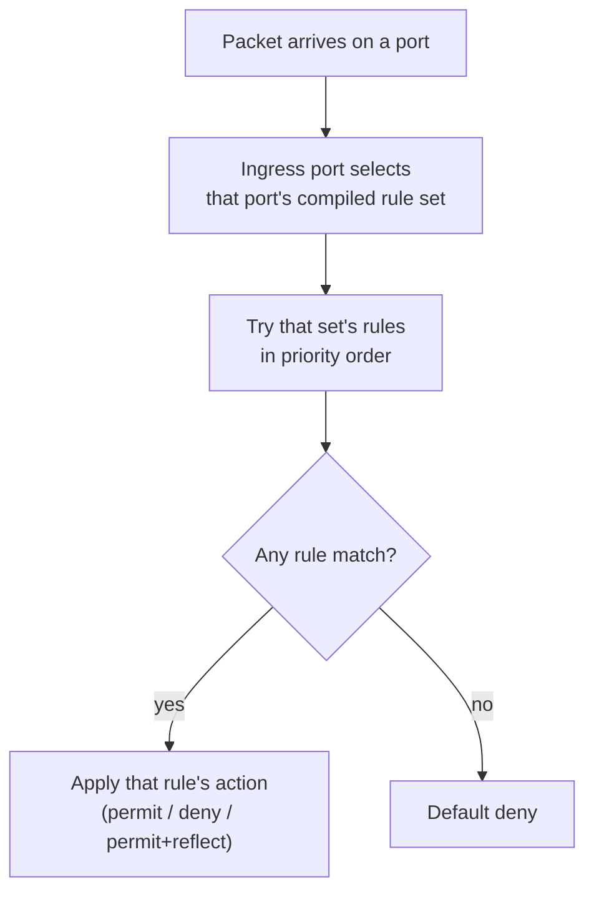
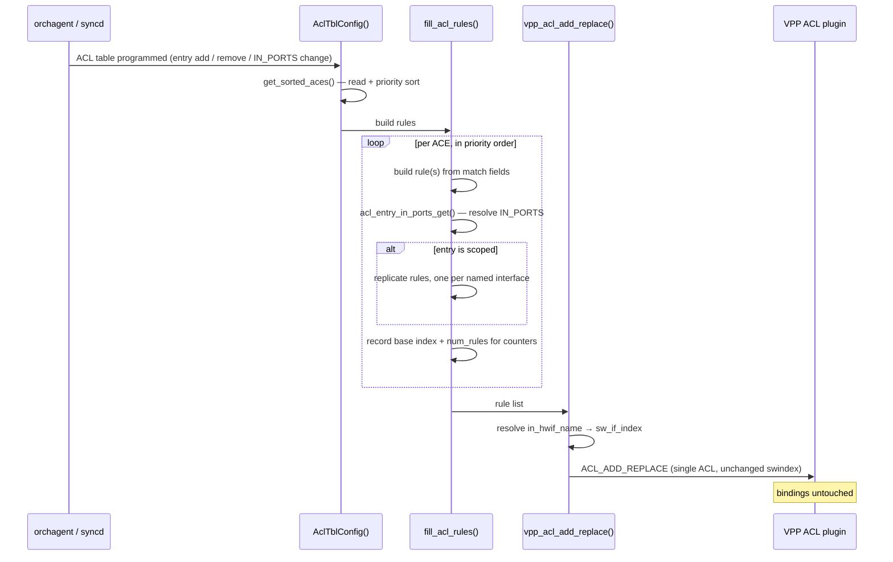

# SONiC VPP ACL Ingress Port Scoping (`IN_PORTS`) — HLD

## Table of Contents

- [SONiC VPP ACL Ingress Port Scoping (`IN_PORTS`) — HLD](#sonic-vpp-acl-ingress-port-scoping-in_ports--hld)
  - [Table of Contents](#table-of-contents)
  - [Revisions](#revisions)
  - [Definitions/Abbreviations](#definitionsabbreviations)
    - [General](#general)
    - [Introduced by This Design](#introduced-by-this-design)
  - [Background](#background)
    - [Observed Impact](#observed-impact)
  - [Requirement](#requirement)
  - [Feature Description](#feature-description)
    - [SONiC Control Plane Flow](#sonic-control-plane-flow)
    - [SONiC Database Schema](#sonic-database-schema)
      - [CONFIG\_DB](#config_db)
      - [ASIC\_DB](#asic_db)
    - [VPP Dataplane Counterpart](#vpp-dataplane-counterpart)
    - [How VPP Evaluates an ACL](#how-vpp-evaluates-an-acl)
    - [Consumers of `IN_PORTS` in SONiC](#consumers-of-in_ports-in-sonic)
  - [Design](#design)
    - [Two Ways to Express the Scope](#two-ways-to-express-the-scope)
    - [Matching the Ingress Interface in VPP](#matching-the-ingress-interface-in-vpp)
      - [The Interface Is Already in the Key](#the-interface-is-already-in-the-key)
      - [Why This Is Ingress-Only](#why-this-is-ingress-only)
      - [All Three Match Paths Must Agree](#all-three-match-paths-must-agree)
      - [Encoding and Its Limit](#encoding-and-its-limit)
    - [Fanning an Entry Out in saivpp](#fanning-an-entry-out-in-saivpp)
      - [Worked Example](#worked-example)
      - [Cases](#cases)
    - [Programming Flow](#programming-flow)
    - [Failure Handling](#failure-handling)
    - [Counters](#counters)
    - [Scaling](#scaling)
  - [Proposed Changes](#proposed-changes)
    - [VPP Changes](#vpp-changes)
    - [saivpp Changes](#saivpp-changes)
    - [Files Changed](#files-changed)
    - [Version and Merge Ordering](#version-and-merge-ordering)
  - [Restrictions and Limitations](#restrictions-and-limitations)
  - [Testing](#testing)
    - [Unit / Dataplane Verification](#unit--dataplane-verification)
    - [sonic-mgmt Coverage](#sonic-mgmt-coverage)
  - [References](#references)

---

## Revisions

| Rev | Date | Author(s) | Changes |
|-----|------|-----------|---------|
| v0.1 | 08/20/2026 | Longxiang Lyu (lolv@microsoft.com) | Initial Draft |
| v0.2 | 08/29/2026 | Longxiang Lyu (lolv@microsoft.com) | Reworked to match the implementation. Scope is now carried by a new per-rule ingress interface match in the VPP ACL plugin, with saivpp fanning each entry out into one rule per named port, replacing the binding-layer partitioning design of v0.1 |
| v0.3 | 09/01/2026 | Longxiang Lyu (lolv@microsoft.com) | Review feedback. Documented that the matched 5-tuple slot holds the TX interface on an outbound-bound ACL, so `IN_PORTS` in an egress table is now rejected at programming time instead of silently matching the egress port; explained `sw_if_index` pool recycling and the resulting bound on the 16-bit limit; separated the terms *bound* and *named* to keep binding distinct from matching |

---

## Definitions/Abbreviations

This section covers the abbreviations used in this high-level design document and their definitions.

### General

| Term | Meaning |
|------|---------|
| ACL | Access Control List. In SAI, an ACL **table** holds a set of entries and is bound to a set of ports |
| ACE | Access Control Entry. A single rule within an ACL table. Referred to as an ACL *entry* in SAI and as a *rule* in CONFIG_DB |
| SAI | Switch Abstraction Interface. The vendor-neutral API layer that orchagent programs |
| saivpp | The VPP-backed SAI implementation in `sonic-sairedis` (`vslib/vpp/`), the subject of this document |
| VPP | Vector Packet Processing. The userspace dataplane backing `saivpp` |
| `IN_PORTS` | `SAI_ACL_ENTRY_ATTR_FIELD_IN_PORTS`. A per-entry SAI match qualifier restricting an entry to a set of ingress ports |
| OID | SAI object ID, the handle identifying a SAI object such as a table, entry or port |
| ACL binding | The association between a VPP ACL and an interface. VPP evaluates an ACL on an interface only if it is bound to it |
| lookup context | VPP's name for a port's compiled, per-direction ACL match set. Selected by the ingress port **before** any rule is compared, which is why port scope is a binding-layer property in VPP |
| swindex | The VPP-assigned index of an ACL |
| hwif | VPP hardware interface name (e.g. `bobm1`), the VPP-side counterpart of a SONiC port name |

### Introduced by This Design

| Term | Meaning |
|------|---------|
| scoped entry | An ACL entry that carries `IN_PORTS`, so it applies only to the ingress ports it names |
| unscoped entry | An ACL entry with no `IN_PORTS`, so it applies to every port the table is bound to |
| fan-out | Expanding one scoped SAI entry into one VPP rule per interface it names, each rule matching that interface |
| **bound** (port ↔ ACL) | The VPP-level attachment of an ACL to an interface, via `vpp_acl_interface_bind()`. Decides **which ACL a packet is evaluated against**. Set by the table's port list, and **not changed by this design** |
| **named** (entry → port) | A port appearing in an entry's `IN_PORTS` list, which this design compiles into that rule's `in_sw_if_index` match. Decides **whether a rule matches** once the ACL is already being evaluated. Purely a match condition — it never attaches or detaches anything |
| 5-tuple | `fa_5tuple_t`, the per-packet key the ACL plugin builds once and matches every rule against |
| `in_sw_if_index` | The new per-rule field added to the VPP ACL rule by this design. Names the ingress interface a rule matches; 0 means any |
| `lsb_of_sw_if_index` | The low 16 bits of the ingress `sw_if_index`, already present in the 5-tuple's L4 key and previously always masked off during matching |

---

## Background

SONiC ACL entries may be scoped to a subset of ingress ports via the SAI qualifier `SAI_ACL_ENTRY_ATTR_FIELD_IN_PORTS`. The ACL table is bound to a broad set of ports, and each entry may narrow itself to specific ingress ports.

The VPP-based virtual switch (`saivpp`) does not honour this qualifier. Creating or updating an ACL entry's `IN_PORTS` is accepted and **reported as successful**, but the port scope is discarded and the entry is programmed as if the qualifier were absent.

The result is not an approximately-correct scope — it is the inverse of the intent. An entry meant to drop traffic on one port instead drops it on **every port the table is bound to**.

This is a day-1 gap rather than a regression: `IN_PORTS` has never been implemented in `saivpp`.

### Observed Impact

On a dual-ToR SONiC-VPP testbed, MuxOrch's drop ACL (`IngressTableDrop` / `mux_acl_rule`, action `DROP`) is scoped to the **standby** mux ports via `IN_PORTS`. With a single port in standby, the intent and the reality diverge as follows:

```
ASIC_DB intent:  SAI_ACL_ENTRY_ATTR_FIELD_IN_PORTS = 1:oid:0x1000000000033   (Ethernet4)
VPP reality:     acl-index 3 applied inbound on sw_if_index: 1 .. 32         (all front-panel ports)
```

`vppctl show acl-plugin interface` showed standby and active ports as byte-for-byte identical:

```
sw_if_index  2 (Ethernet4,  STANDBY):  input acl(s): 2, 3, 1
sw_if_index  3 (Ethernet8,  ACTIVE ):  input acl(s): 2, 3, 1     <-- identical
```

Since `acl-index 3` is `ipv4 deny any -> any` and `sonic_acl_default_permit` is bound behind it, all IPv4 ingress on all 32 front-panel ports was dropped. Non-IPv4 traffic was unaffected (ARP resolved normally), and BGP survived because uplinks are `Port::LAG` and are skipped by MuxOrch's `bindAllPorts()`, which links only `Port::PHY`.

The failure is **inverted and non-proportional**: zero standby ports behaves correctly (the rule is deleted), while *one* standby port produces a box-wide outage.

---

## Requirement

| # | Requirement |
|---|-------------|
| REQ-1 | An ACL entry carrying `SAI_ACL_ENTRY_ATTR_FIELD_IN_PORTS` must be enforced **only** on the ingress ports it names. |
| REQ-2 | An ACL entry without `IN_PORTS` must continue to be enforced on every port the table is bound to. |
| REQ-3 | Relative priority ordering between scoped and unscoped entries of the same table must be preserved on every port. |
| REQ-4 | Entries within one table carrying **different** `IN_PORTS` sets must each be honoured independently. |
| REQ-5 | Once a change to an entry's `IN_PORTS` (e.g. a mux state transition) has been applied, ACLs of other tables bound to the same port must be unchanged, and no other port may be touched. |
| REQ-6 | A failure to read `IN_PORTS` must not silently widen a scoped entry's scope. |
| REQ-7 | Per-entry ACL counters must remain correct when an entry is replicated into more than one VPP rule. |
| REQ-8 | Existing behaviour for tables without any `IN_PORTS` entries must be unchanged. |

---

## Feature Description

### SONiC Control Plane Flow

```
CONFIG_DB ACL_RULE with IN_PORTS  (or MuxOrch / PfcWdAclHandler programmatically)
  → AclOrch builds the ACL entry
    → SAI create/set with SAI_ACL_ENTRY_ATTR_FIELD_IN_PORTS
      → syncd writes ASIC_DB
        → saivpp translates to VPP ACL(s) and interface bindings
```

`IN_PORTS` is a *match qualifier* in SAI: conceptually "match this rule only if the packet arrived on one of these ports". SONiC's normal pattern is to bind the ACL table broadly and let `IN_PORTS` narrow individual entries.

MuxOrch relies on this explicitly. `MuxAclHandler::createMuxAclTable()` ends in `bindAllPorts()`, which links every `Port::PHY`, and keeps **one shared table with one shared rule** for all mux ports. A switchover is then a cheap rule edit — `RULE_OPER_ADD` / `RULE_OPER_DELETE` of a port OID on that single rule's `IN_PORTS` list — and never a table re-bind. The two mechanisms are therefore not redundant: `IN_PORTS` is the *only* thing narrowing the drop.

### SONiC Database Schema

No schema change is introduced by this feature. The existing objects are consumed as follows.

#### CONFIG_DB

Key: `ACL_RULE|<table_name>|<rule_name>`

| Field | Example Value | Description |
|-------|---------------|-------------|
| `IN_PORTS` | `Ethernet4,Ethernet8` | Comma-separated ingress ports the rule applies to |
| `PRIORITY` | `999` | Rule priority |
| `PACKET_ACTION` | `DROP` | Rule action |

`IN_PORTS` requires the table's type to declare the match, e.g. the built-in `DROP` type or a custom `ACL_TABLE_TYPE` listing `IN_PORTS` in `MATCHES`.

#### ASIC_DB

Key: `ASIC_STATE:SAI_OBJECT_TYPE_ACL_ENTRY:oid:<entry_oid>`

| Field | Example Value | Description |
|-------|---------------|-------------|
| `SAI_ACL_ENTRY_ATTR_TABLE_ID` | `oid:0x7000000000667` | Owning ACL table |
| `SAI_ACL_ENTRY_ATTR_FIELD_IN_PORTS` | `1:oid:0x1000000000033` | Ingress ports the entry is scoped to |
| `SAI_ACL_ENTRY_ATTR_ACTION_PACKET_ACTION` | `SAI_PACKET_ACTION_DROP` | Entry action |

### VPP Dataplane Counterpart

| VPP API | Purpose |
|---------|---------|
| `ACL_ADD_REPLACE` | Create an ACL, or replace the rules of an existing ACL in place (preserving its index) |
| `ACL_DEL` | Delete an ACL. Fails if the ACL is still bound to an interface |
| `ACL_INTERFACE_ADD_DEL` | Bind/unbind an ACL to/from an interface. **Appends** to the interface's ACL list |
| `ACL_INTERFACE_SET_ACL_LIST` | Replace an interface's entire ACL list atomically (not currently wrapped by saivpp) |

The decisive property is the shape of a VPP ACL rule (`vslib/vpp/vppxlate/SaiVppXlate.h`), shown here as it stood **before** this design:

```c
typedef struct _vpp_acl_rule {
    vpp_acl_action_e action;
    vpp_ip_addr_t src_prefix, src_prefix_mask;
    vpp_ip_addr_t dst_prefix, dst_prefix_mask;
    int proto;
    uint16_t srcport_or_icmptype_first, srcport_or_icmptype_last;
    uint16_t dstport_or_icmpcode_first, dstport_or_icmpcode_last;
    uint8_t tcp_flags_mask, tcp_flags_value;
} vpp_acl_rule_t;
```

There was **no interface member**, and this was not a saivpp omission — the struct is a 1:1 mirror of upstream VPP's wire format (`src/plugins/acl/acl_types.api`, `typedef acl_rule`). Stock VPP expresses ingress-port scoping solely by *which interfaces an ACL is bound to*.

This design changes that, by adding an ingress interface field to the VPP rule itself. The reasoning is in [Two Ways to Express the Scope](#two-ways-to-express-the-scope); the next section covers what the stock behaviour is and why the field is cheap to add.

### How VPP Evaluates an ACL

The claim above is the premise for the whole design, so it is worth spelling out in plain terms.

**Rules are compiled per port.** A VPP ACL is an ordered list of match rules and nothing more — it carries no notion of *where* it applies. Location is supplied separately, by binding the ACL to an interface. When bindings change, VPP does not leave the bound ACLs as a list to be walked at packet time; it **compiles** them. Every rule of every ACL bound to a port is flattened, in priority order, into one combined match structure, and the port itself becomes part of each compiled rule's identity.

The result behaves like an array indexed by port — each port owns a slot holding exactly the rules that apply to it, in the order they should be tried:

```
  port 1  ──▶ [ rule A, rule B, rule C ]     compiled from the ACLs bound to port 1
  port 2  ──▶ [ rule A, rule D ]             compiled from the ACLs bound to port 2
  port 3  ──▶ [ ]                            no ACLs bound — nothing to match
```

Note that rule A appears twice. The same rule reachable from two ports is compiled into two independent copies, one per port; ports never share compiled match state, even when their rule sets are identical. Equally, a rule can only enter a port's slot by being part of an ACL bound to that port — there is no other path in.

**Packets are evaluated per port.** At packet time the ingress port is resolved *first*, and it selects which slot to search. Only then are rules compared against the packet. The search is first-match: the highest-priority rule in that slot that matches supplies the verdict — permit, deny, or permit-with-reflection — and if nothing matches, the packet is denied by default.



**Why stock VPP has no per-rule port qualifier.** Port identity is consumed *before* rule matching begins: it selects the slot, and it is already compiled into the rules inside that slot. Every candidate rule in that slot is, by construction, one the port already selected, so upstream never had a reason to also compare the interface during the search. That is why the rule struct has no interface field — not because the information is unavailable at match time, but because it was redundant given how bindings work.

The information *is* available, though. As the next section shows, the ingress interface is already carried in the per-packet key the matcher uses; it was simply always masked off. That is what makes adding a per-rule qualifier cheap rather than structural.

### Consumers of `IN_PORTS` in SONiC

Multiple entries with *different* `IN_PORTS` in one table is a shipping configuration, not a hypothetical:

| Consumer | Table | Shape |
|----------|-------|-------|
| MuxOrch | `IngressTableDrop` | One rule, `IN_PORTS` = all standby mux ports, match any, `DROP` |
| PFC watchdog | `IngressTableDrop` (same table) | One rule **per queue id** (`Rule_PfcWdAclHandler_<qid>`), `IN_PORTS` = storming ports, match `TC=<qid>`, `DROP` |
| GCU dynamic ACL | `DYNAMIC_ACL_TABLE` | Three `DROP` rules naming three *different* ports, alongside unscoped `FORWARD` rules |

The built-in `DROP` table type declares exactly two match qualifiers — `SAI_ACL_TABLE_ATTR_FIELD_TC` and `SAI_ACL_TABLE_ATTR_FIELD_IN_PORTS` (`aclorch.cpp`) — which is what allows MuxOrch and the PFC watchdog to coexist in one table. `SAI_ACL_TABLE_ATTR_FIELD_IN_PORTS` is in fact a *mandatory* ingress match for this type, so an ingress `DROP` table always carries it. Two lossless queues storming on different ports likewise produce two rules with disjoint `IN_PORTS` — reachable on a box with no dual-ToR configuration at all.

---

## Design

### Two Ways to Express the Scope

The irreducible difficulty is a **cardinality mismatch**:

- SAI carries ingress-port scope **per entry**.
- Stock VPP carries it **per ACL** — every rule in an ACL shares one set of interface bindings.

"Per ACL" is deliberately not "per table". The two models do not have matching object graphs:

| SAI / SONiC | VPP counterpart | Consequence |
|-------------|-----------------|-------------|
| ACL entry — `SAI_OBJECT_TYPE_ACL_ENTRY`, CONFIG_DB `ACL_RULE` | ACL rule — `vpp_acl_rule_t` | Stock VPP's rule is match criteria and an action, nothing more |
| ACL table — `SAI_OBJECT_TYPE_ACL_TABLE`, CONFIG_DB `ACL_TABLE` | *none* | VPP has no table object. The closest thing is the VPP ACL, a different unit with different cardinality |
| — | VPP ACL — an ordered list of rules **plus the set of interfaces it is bound to** | Where port scope lives in stock VPP |
| Port bind — `SAI_PORT_ATTR_INGRESS_ACL` on a port | ACL binding — `ACL_INTERFACE_ADD_DEL` | Both sides associate a port with a ruleset here |
| `SAI_ACL_ENTRY_ATTR_FIELD_IN_PORTS` on one ACL entry | *none* in stock VPP | Must be given somewhere to live |

Baseline `saivpp` creates exactly one VPP ACL per SAI table (`m_acl_swindex_map`, keyed by table OID), which is why "per ACL" and "per table" look equivalent today.

There are two ways to close the gap, and they differ in *which* layer absorbs the mismatch.

**Option A — express the scope as a binding.** Keep VPP unchanged and split the table into several VPP ACLs: one per distinct set of entries applying to a port, each bound only to the ports that set belongs to. `IN_PORTS = {Ethernet4}` becomes "bind the ACL holding this entry to Ethernet4 and nothing else".

This works, but the cost is concentrated in the binding layer, and that layer is hostile:

- `ACL_INTERFACE_ADD_DEL` **appends**, so a newly bound ACL lands after `sonic_acl_default_permit` where it can never be reached.
- Unbind removes by value and fills the hole with the *last* element, so removing any non-final ACL **reorders** the survivors.

Together these mean a port cannot have one ACL swapped in place; the whole port must be unbound and rebound in priority order. That in turn opens a window in which the port enforces nothing, requires dirty-port tracking so a failed unbind is not mistaken for a no-op on the next pass, and makes the number of VPP ACLs a function of how the `IN_PORTS` sets overlap. None of this complexity is inherent to the feature — it is the cost of routing a per-entry concept through a per-ACL mechanism.

**Option B — express the scope as a match.** Give the VPP rule an ingress interface field, and have saivpp emit one rule per named port. The table keeps its single VPP ACL, bindings are untouched, and `IN_PORTS` stays a match qualifier on both sides of the translation.

**This design implements Option B.** The deciding factor is that the information Option B needs is *already in the dataplane*: the ingress interface is part of the per-packet key the matcher builds, and was simply never compared. Option A pays a permanent structural cost in the binding layer to avoid a change that turns out to be a few lines of match logic. Option B also leaves the binding layer, its ordering rules, and the ACL-per-table model exactly as they are, so nothing outside the ACL rule path has to reason about scoping at all.

The trade is that Option B requires patching VPP, so saivpp and the VPP package must move together. That is discussed in [Version and Merge Ordering](#version-and-merge-ordering).

### Matching the Ingress Interface in VPP

#### The Interface Is Already in the Key

The ACL plugin builds one `fa_5tuple_t` per packet and matches every candidate rule against it. Its L4 portion is a `u64` union (`src/plugins/acl/fa_node.h`):

```c
typedef union {
  u64 as_u64;
  struct {
    u16 port[2];
    union {
      struct {
        u8  proto;
        u8  l4_flags;
        u16 lsb_of_sw_if_index;
      };
      u32 non_port_l4_data;
    };
  };
} fa_session_l4_key_t;
```

`lsb_of_sw_if_index` is filled for every packet in `acl_fill_5tuple_l4_and_pkt_data()`, from `vnet_buffer(b)->sw_if_index[VLIB_RX]` on the input arc:

```c
fa_session_l4_key_t tmp_l4 = { .port = { ports[0], ports[1] },
                               .proto = proto,
                               .l4_flags = tmp_l4_flags,
                               .lsb_of_sw_if_index = sw_if_index0 & 0xffff };
```

The field exists for session handling, and rule matching always masked it off. Restricting a rule to an interface is therefore not a matter of collecting new per-packet state — it only requires *stopping* the mask from discarding what is already there. This is why the change is close to free at packet rate: no new field in the key, no extra load, no change to the key's size or hash.

#### Why This Is Ingress-Only

`sw_if_index0` above is not always the ingress interface. The ACL node picks it by direction (`src/plugins/acl/dataplane_node.c`):

```c
always_inline void
get_sw_if_index_xN (int vector_sz, int is_input, vlib_buffer_t ** b,
                    u32 * out_sw_if_index)
{
  for (ii = 0; ii < vector_sz; ii++)
    if (is_input)
      out_sw_if_index[ii] = vnet_buffer (b[ii])->sw_if_index[VLIB_RX];
    else
      out_sw_if_index[ii] = vnet_buffer (b[ii])->sw_if_index[VLIB_TX];
}
```

The same `lsb_of_sw_if_index` slot therefore carries the **RX** interface in an inbound-bound ACL and the **TX** interface in an outbound-bound one. The field this design matches on is only an *ingress* interface because of where the ACL is bound — nothing in the key itself distinguishes them.

That matters because an egress `IN_PORTS` entry is expressible. SAI does not restrict the qualifier to ingress: `SAI_ACL_TABLE_ATTR_FIELD_IN_PORTS` carries no stage constraint, and saivpp binds egress groups for real — `aclBindUnbindPort()` maps `SAI_ACL_STAGE_EGRESS` to `is_input = false` and calls `vpp_acl_interface_bind(..., is_input)`. So an entry naming `IN_PORTS` in an egress table would be fanned out and programmed exactly like an ingress one, and would then be evaluated against the **egress** interface.

The failure mode is the dangerous kind: not an error and not a no-op, but a rule that quietly enforces a different thing than it says. A rule meaning "drop what arrives on Ethernet4" would become "drop what leaves on Ethernet4" — plausible-looking, and wrong in a way no counter or dump would reveal, since the CLI would still print the interface the operator asked for.

The design therefore **rejects the combination at programming time rather than mis-programming it**, matching the treatment of an out-of-range index in [Encoding and Its Limit](#encoding-and-its-limit): where the scope cannot be represented faithfully, fail loudly instead of installing something that merely resembles the request. Silently dropping the scope instead was rejected because that reproduces the original bug this design exists to fix — an over-broad rule applying to every bound port.

Concretely, `fill_acl_rules()` resolves the table's stage (from `SAI_ACL_TABLE_GROUP_ATTR_ACL_STAGE`, as `aclBindUnbindPort()` already does) and fails the entry with a logged error when a table at `SAI_ACL_STAGE_EGRESS` carries an entry with `IN_PORTS` enabled. No SONiC consumer creates such a table today — every consumer in [Consumers of `IN_PORTS` in SONiC](#consumers-of-in_ports-in-sonic) is ingress — so this is a guard against a future or third-party configuration, not a path expected to be taken.

Supporting egress scoping properly would mean matching `OUT_PORTS` against the TX interface, which the same mechanism could carry. That is deliberately out of scope here; see [Restrictions and Limitations](#restrictions-and-limitations).

#### All Three Match Paths Must Agree

A rule reaches a verdict through more than one path, and a scope enforced on only some of them is worse than none at all — it would hold for ordinary traffic and lapse for the rest.

| Path | When it runs | Change |
|------|--------------|--------|
| Hash key construction — `make_mask_and_match_from_rule()` | Normal path. The rule's mask and match value are compiled into the bihash key | Unmask `l4.lsb_of_sw_if_index` and set the match value to `in_sw_if_index & 0xffff` |
| Collision re-check — `single_rule_match_5tuple()` | After a bihash hit, to confirm the rule really matches | Compare the interface explicitly |
| Linear match — `single_acl_match_5tuple()` | Non-first IP fragments, which bypass the hash entirely | Compare the interface explicitly |

The linear path is not an optimisation detail. `acl_plugin_match_5tuple_inline()` sends non-first fragments to `linear_multi_acl_match_5tuple()` because "tuplemerge does not take fragments into account". A scope applied only in the hash path would silently not apply to fragmented traffic.

The collision re-check matters for a subtler reason. VPP's tuplemerge (`am->use_tuple_merge`, on by default) may assign a rule to an existing, *less specific* mask type when `first_mask_contains_second_mask()` holds — and a mask with `l4 = 0` contains the in-port mask. A folded rule therefore has the interface zeroed out of its key on both sides, so the bihash still hits, but the key no longer proves the interface matched. Re-checking in `single_rule_match_5tuple()` makes the interface authoritative regardless of which mask type the rule ended up in. It cannot cause a missed match, because a folded rule's key is interface-agnostic by construction.

#### Encoding and Its Limit

`in_sw_if_index = 0` means **any interface**. This is safe because `sw_if_index 0` is `local0`, which is never a data-plane port, so no legitimate rule needs to name it. It follows the convention `proto = 0` already uses, and avoids spending a separate valid flag.

Only the low 16 bits take part in the match, since `lsb_of_sw_if_index` is a `u16` packed into the L4 `u64`. Widening it would mean growing `fa_session_l4_key_t` past the word it fits in, which is a far larger change than this feature warrants. An index above `0xffff` would otherwise be programmed as a *different* interface than the one named, with the CLI and API dump still reporting the interface the user asked for, so `acl_add_list()` rejects it with `VNET_API_ERROR_INVALID_SW_IF_INDEX` alongside the existing prefix and port-range validation. Both the binary API and the CLI go through that function, so neither path can install a rule whose scope is not representable. SONiC interface indices stay far below the limit, so this is a guard rather than an expected condition.

**Interface churn does not walk the index upward.** The 16-bit ceiling would be a much weaker guarantee if `sw_if_index` grew monotonically, because a long-lived box that repeatedly creates and deletes sub-interfaces or LAGs would eventually cross `0xffff` even while holding only a handful of interfaces at once. It does not. `sw_if_index` is a pool index, not a counter:

```c
/* src/vnet/interface.c — vnet_create_sw_interface_no_callbacks() */
pool_get (im->sw_interfaces, sw);
sw_if_index = sw - im->sw_interfaces;
```

Deleting an interface returns its slot with `pool_put()`, and `pool_get()` takes from the free list before it ever extends the vector (`src/vppinfra/pool.h`):

```c
uword n_free = vec_len (ph->free_indices);
if (n_free)
  {
    uword index = ph->free_indices[n_free - 1];   /* reuse, LIFO */
    ...
  }
/* Nothing on free list, make a new element and return it. */
```

So a freed index is reused — most-recently-freed first — and the pool only grows when every existing slot is occupied. The high-water mark is therefore the number of interfaces that exist **simultaneously**, not the number ever created. Delete/create cycles reuse the same small set of indices indefinitely, and reaching the limit would require 65 535 interfaces present at once, far beyond any SONiC configuration.

Reuse does raise a second question — whether a rule holding an index could outlive the interface it named and then silently apply to whatever later inherits that index. A rule stores the index resolved at programming time, and neither the VPP patch nor saivpp invalidates it on interface deletion. What makes this safe is the qualifier's object type rather than any cleanup logic: `SAI_ACL_ENTRY_ATTR_FIELD_IN_PORTS` is declared `@objects SAI_OBJECT_TYPE_PORT`, so it can only name front-panel ports, which VPP creates from the platform's hardware interfaces at startup and does not delete at runtime. The churn-prone objects — sub-interfaces, tunnels, LAGs — are exactly the ones that cannot appear in `IN_PORTS`. This is a property worth stating explicitly rather than assuming: it is listed under [Restrictions and Limitations](#restrictions-and-limitations), because it would need revisiting if `IN_PORTS` were ever extended to LAGs.

### Fanning an Entry Out in saivpp

A VPP rule names **one** interface, while a SAI entry may name several. saivpp closes that last gap by replication: an entry naming N interfaces becomes N rules, identical but for the interface.

This is not a new shape for this code. `fill_acl_rules()` already expands one entry into several rules when a port-based entry specifies no protocol, emitting a UDP rule and a TCP rule. Ingress scoping reuses that mechanism:

**Step 1 — resolve the scope.** `acl_entry_in_ports_get()` looks for `SAI_ACL_ENTRY_ATTR_FIELD_IN_PORTS` on the entry. Absent or disabled means unscoped. Otherwise the port OIDs are resolved to VPP interface names with `vpp_get_hwif_name()`.

The attribute has to be read twice. The cached copy was fetched with a zero-capacity object list, so it carries only the list's *count* and a null list pointer; the entry is read again with a correctly sized buffer to obtain the OIDs themselves.

**Step 2 — fan out.** The rules just generated for the entry are removed from the output list and re-added once per resolved interface, each carrying that interface's name:

```
base_rules = the rules generated for this entry
for each interface I in resolved_interfaces:
    for each rule R in base_rules:
        emit R with in_hwif_name = I
```

**Step 3 — resolve names late.** Rules carry `in_hwif_name`, not an index. `vpp_acl_add_replace()` translates the name to a `sw_if_index` when it builds the API message. The SAI layer therefore keeps working in interface names, exactly as it already does for binding, and nothing above the wire format has to track VPP indices.

Because the copies are appended consecutively, an entry's rules remain **contiguous** from `ace.vpp_rule_base_index`, which is what keeps counters working unchanged — see [Counters](#counters).

#### Worked Example

A table bound to five ports, with three entries:

| Entry | Priority | `IN_PORTS` | Action |
|-------|----------|------------|--------|
| E1 | 100 | Ethernet4, Ethernet8, Ethernet16 | `DROP` |
| E2 | 50 | *(unscoped)* | `FORWARD` |
| E3 | 10 | Ethernet8 | `DROP` |

The table is programmed as a single VPP ACL, in priority order:

| Rule | From | `in_sw_if_index` | Action |
|------|------|------------------|--------|
| 0 | E1 | Ethernet4 | `DROP` |
| 1 | E1 | Ethernet8 | `DROP` |
| 2 | E1 | Ethernet16 | `DROP` |
| 3 | E2 | 0 (any) | `FORWARD` |
| 4 | E3 | Ethernet8 | `DROP` |

The ACL stays bound to all five ports. E1's three rules occupy indices 0–2, so E1's counter sums that range; E3's single rule is index 4.

Priority is preserved because the fan-out is local: an entry's copies are emitted where the entry itself sat in the order. E2 remains between E1 and E3, so a packet arriving on Ethernet8 is tried against E1's copy for that port, then E2, then E3 — the table's order, unchanged.

Note that Ethernet0 and Ethernet12 appear in no entry's `IN_PORTS` list. They match only E2, because every other rule names an interface that is not theirs. No separate ACL is needed to arrange that, and their **binding is identical to every other port's** — all five ports are bound to this one ACL. The difference between a port that is named and one that is not is entirely in which rules match, never in what is attached to the port.

#### Cases

Throughout this table, "the ACL" is the table's single VPP ACL — the one every port the table covers is bound to. **No case below changes any binding**; the binding is fixed by the table's port list, and `IN_PORTS` only ever decides which rules match.

| Case | Example | Outcome |
|------|---------|---------|
| No entry carries `IN_PORTS` | Any ordinary L3 table | No fan-out; one rule per entry with `in_sw_if_index = 0`, exactly as before this design |
| Port named by no entry | Ethernet0 above | Stays bound to the table's ACL exactly as every other port does, and matches only the unscoped rules within it. Being unnamed is not a weaker binding — it simply means no scoped rule's `in_sw_if_index` equals this port |
| Ports with identical scopes | Two entries naming the same port | Each entry fans out independently; no deduplication is attempted or needed |
| Ports with different scopes | Ethernet8 versus Ethernet4 above | Distinct rules with distinct `in_sw_if_index`; independent by construction — REQ-4 |
| Every port named, same scope | All mux ports standby | One rule per standby port within the single ACL |
| Table with no unscoped entries | The mux drop table with a single scoped entry | Nothing special: the ACL holds only scoped rules. No placeholder is required |
| Entry fans out with protocol expansion | Port-based entry, no protocol, 2 named ports | 4 rules — the UDP/TCP expansion happens first, then each is replicated per port |
| `IN_PORTS` present but empty | Qualifier enabled with a zero-length port list | The entry names no interface, so no ingress interface can be a member and it matches nothing. No rule is emitted. Logged as a warning |

### Programming Flow



The flow is the pre-existing one with a replication step added. There is no second ACL, no binding change, and no reordering, so the steps carry no ordering constraints beyond those that already applied. A mux transition rewrites the rules of one ACL in place via `ACL_ADD_REPLACE`, which preserves the swindex, so the port's ACL vector is never touched and other tables bound to that port are undisturbed — REQ-5.

This is the main practical dividend over Option A. Because the scope lives in the rules rather than in the bindings, changing it never requires unbinding anything, so there is no window in which a port enforces nothing and no dirty-port bookkeeping to recover from a partially applied rebind.

### Failure Handling

Three distinct conditions can leave the resolved interface set empty, and they do not mean the same thing. Collapsing them would reintroduce the very defect this design fixes, so they are kept separate:

| Condition | Meaning | Behaviour |
|-----------|---------|-----------|
| Attribute absent or not enabled | Entry is unscoped | One rule, `in_sw_if_index = 0`, as before |
| Enabled but names no port | Entry matches nothing | Scoped, no rule emitted |
| Port list unreadable, or no named port resolves | Scope is **unknown** | Error; ACL programming fails |

The third row is the one REQ-6 turns on. When the scope cannot be determined, neither available fallback is safe: emitting the rule unscoped applies it to every bound port, which is exactly the outage described in [Observed Impact](#observed-impact), while emitting nothing silently drops an entry orchagent believes is installed. `fill_acl_rules()` therefore returns a failure, `CHECK_STATUS_ACLTBLCONFIG` cleans up, and the function returns **before** `vpp_acl_add_replace()` is reached — so the previously programmed ACL remains in force and the operation is reported as failed.

Partial resolution is tolerated: if some named ports resolve and others do not, the entry is scoped to those that did, and each failure is logged. Ports genuinely absent from VPP cannot carry traffic, so scoping to the resolvable subset is equivalent for matching purposes. Only *total* failure to resolve is treated as an error, since that is indistinguishable from a broken read.

The empty-list case is deliberately left as "matches nothing". No ingress interface can be a member of an empty list, so emitting no rule is the faithful translation of the SAI semantics. Treating it as unscoped would invert it into "match every bound port".

### Counters

An entry may now map to several VPP rules, but they are **contiguous** — the fan-out appends copies consecutively, so an entry occupies `[vpp_rule_base_index, vpp_rule_base_index + num_rules)` in one ACL.

This is the same representation the pre-existing UDP/TCP expansion already produced, so `getAclEntryStats()` needs no change: it walks `num_rules` from the base index and sums. `num_rules` is simply larger for a fanned-out entry.

Nothing accumulates across reprograms, because the rule list is rebuilt from scratch on each `AclTblConfig()` and the base indices are recomputed in the same pass. There is no separate placement state to clear and therefore no way for counts to double or to be dropped by a partially applied update — REQ-7 holds without qualification.

### Scaling

| Scenario | VPP ACLs | VPP rules for the entry |
|----------|----------|-------------------------|
| No entry carries `IN_PORTS` | 1 (unchanged) | 1 |
| Entry scoped to 1 port | 1 (unchanged) | 1 |
| Entry scoped to N ports | 1 (unchanged) | N |
| All 32 front-panel ports standby | 1 (unchanged) | 32 |

The ACL count never changes: a table is always one VPP ACL, as it is today. Cost moves to the rule count, which is linear in the number of named ports — an entry naming N ports costs N rules, and a table's total is the sum over its entries.

For the shipping consumers this is small. The mux drop table holds one entry scoped to the standby ports, so its rule count is the standby port count, bounded by the front-panel port count. The PFC watchdog adds one entry per storming queue, each scoped to the storming ports.

Two dataplane notes for larger scopes:

**Tuplemerge folding.** As described above, tuplemerge may fold the fanned-out copies into one less-specific mask type, since a wildcard `l4` mask contains the in-port mask. The copies then share a bihash key and sit on a single collision chain. `split_partition()` splits a chain along whichever of `SRC_ADDR`, `DST_ADDR`, `SRC_PORT`, `DST_PORT` or `PROTO` varies most — it has **no interface dimension**, so it cannot separate rules that differ only by ingress interface. A large fan-out of otherwise identical rules can therefore degrade toward linear scanning within that chain. Correctness is unaffected, because `single_rule_match_5tuple()` re-checks the interface on exactly that path.

**Rule count is not port count.** Only entries carrying `IN_PORTS` replicate. Unscoped entries stay at one rule each regardless of how many ports the table is bound to, so a table with no scoped entries is byte-for-byte what it is today — REQ-8.

---

## Proposed Changes

### VPP Changes

Carried as a patch in the `sonic-platform-vpp` VPP patch series (`vppbld/patches/0019-acl-match-on-ingress-interface.patch`).

| File | Change |
|------|--------|
| `src/plugins/acl/types.h` | `u32 in_sw_if_index` on `acl_rule_t` |
| `src/plugins/acl/acl_types.api` | `u32 in_sw_if_index` on `typedef acl_rule`, with the "0 means any" and 16-bit contract documented |
| `src/plugins/acl/acl.c` | API↔rule conversion in both directions; reject an index above `0xffff` in `acl_add_list()`; `in-port` CLI parser; show the interface in ACL display |
| `src/plugins/acl/hash_lookup.c` | `make_mask_and_match_from_rule()` unmasks `l4.lsb_of_sw_if_index` and sets the match value |
| `src/plugins/acl/public_inlines.h` | Interface comparison in `single_acl_match_5tuple()` (linear/fragment path) and `single_rule_match_5tuple()` (hash collision re-check) |

No new API message is introduced; the field is added to the existing `acl_rule` type.

### saivpp Changes

| File | Change |
|------|--------|
| `vslib/vpp/vppxlate/SaiVppXlate.h` | `char in_hwif_name[64]` on `vpp_acl_rule_t`; empty means any |
| `vslib/vpp/vppxlate/SaiVppXlate.c` | `vpp_acl_add_replace()` resolves `in_hwif_name` to a `sw_if_index` when building the message; unresolvable name fails the call |
| `vslib/vpp/SwitchVpp.h` | Declaration of `acl_entry_in_ports_get()` |
| `vslib/vpp/SwitchVppAcl.cpp` | `acl_entry_in_ports_get()`; fan-out in `fill_acl_rules()`; explicit `IN_PORTS` no-op case in `acl_rule_field_update()` |

New method:

| Method | Purpose |
|--------|---------|
| `acl_entry_in_ports_get()` | Resolve an entry's `IN_PORTS` to VPP interface names. Returns `sai_status_t` and reports scoping through a separate `scoped` out-parameter, so "is scoped" and "could be resolved" stay distinguishable |

Modified methods:

| Method | Change |
|--------|--------|
| `acl_rule_field_update()` | Explicit `IN_PORTS` case, replacing the `default:` fall-through that logged `Unhandled ACL entry attribute ID` and then programmed the entry unscoped |
| `fill_acl_rules()` | After generating an entry's rules, replicate them once per named interface. Reject an entry carrying `IN_PORTS` when the table's stage is `SAI_ACL_STAGE_EGRESS`, where the matched field would be the TX rather than the RX interface — see [Why This Is Ingress-Only](#why-this-is-ingress-only) |

`getAclEntryStats()`, `AclTblConfig()`, `AclTblRemove()` and the binding paths are **unchanged**, because the fan-out preserves the existing contiguous `(base_index, num_rules)` representation and does not alter bindings.

### Files Changed

| Repository | File | Change |
|------------|------|--------|
| `sonic-platform-vpp` | `vppbld/patches/0019-acl-match-on-ingress-interface.patch` | The VPP change above |
| `sonic-platform-vpp` | `vppbld/patches/series` | Register the patch |
| `sonic-platform-vpp` | `rules/vpp.mk` | `VPP_VERSION` `2606-0.5` → `2606-0.6` |
| `sonic-sairedis` | `vslib/vpp/SwitchVpp.h` | Declaration |
| `sonic-sairedis` | `vslib/vpp/SwitchVppAcl.cpp` | `IN_PORTS` read and rule fan-out |
| `sonic-sairedis` | `vslib/vpp/vppxlate/SaiVppXlate.{h,c}` | Rule field and name→index resolution |

### Version and Merge Ordering

Adding a field to `acl_rule` changes the layout of the `acl_add_replace` message and therefore its **CRC**, which VPP uses to detect API mismatch. A syncd built against one version cannot program ACLs on the other, so the two changes must merge together:

- `sonic-platform-vpp` and `sonic-sairedis` are a matched pair; neither is useful alone.
- `rules/vpp.mk` bumps `VPP_VERSION` to `2606-0.6`. This is required whenever the patch series changes, because the version string is the cache key for the prebuilt debs — without the bump, consumers keep downloading debs built from the old series, and the CRC drift appears as an ACL programming failure at runtime rather than as a build error.
- An unrelated patch in flight ([sonic-platform-vpp#280](https://github.com/sonic-net/sonic-platform-vpp/pull/280), which stops VPP counting ACL policy denies as interface drops) also takes `2606-0.6`, since either may merge first. Because both make the *identical* edit to that line, git auto-resolves `rules/vpp.mk` without flagging a conflict — only `vppbld/patches/series` conflicts. **Whoever merges second must bump `VPP_VERSION` to `2606-0.7` by hand** while resolving that conflict, or the published deb will carry a version minted for only one of the two patch series.

---

## Restrictions and Limitations

- **Only the low 16 bits of the interface index are matched.** `lsb_of_sw_if_index` is a `u16` inside the L4 key's `u64`, so an index above `0xffff` cannot be represented. Such an index is rejected at configuration time rather than mismatched, and SONiC indices stay far below the limit, but the ceiling is real and lifting it would mean growing the key.
- **Rule count grows with the scope.** An entry naming N ports costs N rules. The ACL count is unchanged, but a large fan-out of otherwise identical rules can be folded by tuplemerge onto one collision chain that `split_partition()` cannot split, since it has no interface dimension. Matching stays correct; the cost is lookup efficiency at large N.
- **Requires a patched VPP.** The field does not exist upstream, so `sonic-sairedis` and the `sonic-platform-vpp` VPP package must stay in step. Upstreaming the plugin change would remove this coupling.
- **ip2me state remains table-keyed.** `m_ip2me_drop_tables` is keyed by table, not by interface, so the ip2me bypass is enabled for a table if *any* of its rules contains a deny, regardless of which ports those rules name. Re-keying it per interface is out of scope.
- **`IN_PORTS` on an egress table is rejected, not honoured.** The 5-tuple slot this design matches on holds the TX interface when an ACL is bound outbound, so an ingress scope programmed into an egress table would silently match the *egress* port. Rather than mis-programme it, saivpp fails such an entry with a logged error — see [Why This Is Ingress-Only](#why-this-is-ingress-only). No SONiC consumer creates this configuration today.
- **`OUT_PORTS` is not implemented.** Egress scoping as a feature is untouched; `SAI_ACL_ENTRY_ATTR_FIELD_OUT_PORTS` remains unhandled and is still accepted-and-discarded, exactly as `IN_PORTS` was before this design. The same per-rule mechanism could carry it — matching the TX interface an outbound-bound ACL already puts in the key — but that is separate work with its own test surface.
- **A rule's interface index is resolved once, at programming time.** VPP recycles `sw_if_index` from a free list, and nothing here invalidates a rule's stored index if the interface it names is deleted. This is safe only because `IN_PORTS` is declared `@objects SAI_OBJECT_TYPE_PORT` and front-panel ports are created at startup and not deleted at runtime; it would need revisiting if the qualifier were ever extended to objects with runtime churn, such as LAGs. See [Encoding and Its Limit](#encoding-and-its-limit).

---

## Testing

### Unit / Dataplane Verification

On a `vms-kvm-dual-vpp-t0-1` dual-ToR testbed, the expected post-fix dataplane state is one deny rule per standby port inside the table's single ACL, with the ACL still bound to every front-panel port:

```
acl-index 3 (deny)  applied inbound on sw_if_index: 1 .. 32     <-- binding unchanged

acl-index 3:
  rule 0: ipv4 deny any -> any  in-port bobm2      <-- one rule per standby port
  rule 1: ipv4 deny any -> any  in-port bobm7
  ...

sw_if_index  2 (Ethernet4,  STANDBY):  input acl(s): 2, 3, 1
sw_if_index  3 (Ethernet8,  ACTIVE ):  input acl(s): 2, 3, 1    <-- same list, different verdict
```

The binding is deliberately identical on standby and active ports; the scope now comes from the rules, which is the whole point of the design.

**Verified on the testbed:**

| Check | Result |
|-------|--------|
| Rule count tracks the standby set | `vlab-vpp-03`: 18 standby ports → 18 ingress-scoped deny rules. `vlab-vpp-04`: 6 standby ports → 6 rules. Two ToRs with different mux distributions each matched their own standby set |
| Binding unchanged | ACL 3 remained bound to all 32 interfaces on both, confirming the scoping comes from the rules and not from the bindings |
| Complementary mux roles | The two ToRs held opposite mux states, as expected for the topology |

**Outstanding:**

| Check | Expectation |
|-------|-------------|
| Downstream forwarding under toggle | Standby → active → standby with traffic in each state; packets are dropped only on standby ports and forwarded on active ones — REQ-1, REQ-2 |
| Fragmented traffic | A scoped deny also drops non-first fragments on the named port, exercising the linear match path, and does not drop them elsewhere |
| Priority preserved | A scoped `DROP` and a higher-priority unscoped `FORWARD` in one table resolve in priority order on the named port — REQ-3 |
| Independent scopes | Two entries of one table scoped to *different* ports — the mux drop on one, a PFC watchdog rule on another — each drop only on the port its own entry names, and removing one entry leaves the other's port still dropping — REQ-4 |
| Other tables preserved | After a toggle, every other table bound to the transitioning port is still bound, with unchanged content and position — REQ-5 |
| Scoped read failure | A forced `IN_PORTS` read failure leaves the previous ACL in place and reports failure, rather than applying the entry everywhere — REQ-6 |
| Counter fan-out | An entry scoped to several ports reports the **sum** of the traffic hitting it on all of them, not one port's share — REQ-7 |
| Oversized index rejected | An `in_sw_if_index` above `0xffff` is refused by `acl_add_list()` on both the API and CLI paths rather than matching a different interface |
| Egress `IN_PORTS` rejected | An entry carrying `IN_PORTS` in a table at `SAI_ACL_STAGE_EGRESS` fails programming with a logged error, rather than being installed and matched against the TX interface. The check is that no rule reaches VPP — a test asserting only "traffic is not dropped" would pass for the wrong reason |
| No-`IN_PORTS` regression | A table with no scoped entries produces byte-for-byte the same ACL as before the change — REQ-8 |

### sonic-mgmt Coverage

| Test | Relevance |
|------|-----------|
| `tests/generic_config_updater/test_dynamic_acl.py::test_gcu_acl_drop_rule_removal` | Three `DROP` rules on three different ports in one table, one then removed — the closest existing analogue to REQ-4. **Partial:** it sends traffic only on the port whose rule was removed, asserting that it now forwards; it never re-tests the other two, so it would not catch a regression that dropped their scoping at the same time. The gap is covered by the *Independent scopes* dataplane check above rather than by extending this test |
| `tests/generic_config_updater/test_dynamic_acl.py::test_gcu_acl_forward_rule_priority_respected` | Scoped `DROP` alongside unscoped higher-priority `FORWARD` — covers REQ-3 |
| `tests/dualtor_mgmt` / mux switchover suites | Exercises REQ-1 and REQ-5 on the mux table |
| `tests/acl/test_acl.py` | Regression guard for REQ-8 (tables with no `IN_PORTS` entries) |

Rule-level state was verified on a live testbed as recorded above. The forwarding checks listed as outstanding have not been run yet, so the dataplane effect is currently evidenced by rule inspection rather than by packets.

---

## References

- SAI ACL attributes: `SAI/inc/saiacl.h` (`SAI_ACL_ENTRY_ATTR_FIELD_IN_PORTS`)
- VPP ACL plugin API: `vpp/src/plugins/acl/acl.api`, `acl_types.api`
- VPP ACL rule and key layout: `vpp/src/plugins/acl/types.h` (`acl_rule_t`), `fa_node.h` (`fa_5tuple_t`, `fa_session_l4_key_t`)
- VPP ACL evaluation: `vpp/src/plugins/acl/dataplane_node.c` (context selection), `public_inlines.h` (5-tuple construction, hash and linear matchers), `hash_lookup.c` (key construction, tuplemerge, `split_partition()`), `lookup_context.c` (context lifecycle)
- VPP lookup context rationale: `vpp/src/plugins/acl/acl_lookup_context.rst`, `acl_hash_lookup_doc.rst`
- SONiC ACL orchestration: `sonic-swss/orchagent/aclorch.cpp`
- MuxOrch ACL handling: `sonic-swss/orchagent/muxorch.cpp` (`MuxAclHandler`)
- PFC watchdog ACL handling: `sonic-swss/orchagent/pfcactionhandler.cpp` (`PfcWdAclHandler`)
- sonic-mgmt dynamic ACL tests: `tests/generic_config_updater/test_dynamic_acl.py`
- Implementation — VPP plugin patch: [sonic-net/sonic-platform-vpp#278](https://github.com/sonic-net/sonic-platform-vpp/pull/278)
- Implementation — saivpp fan-out: [sonic-net/sonic-sairedis#2064](https://github.com/sonic-net/sonic-sairedis/pull/2064)
