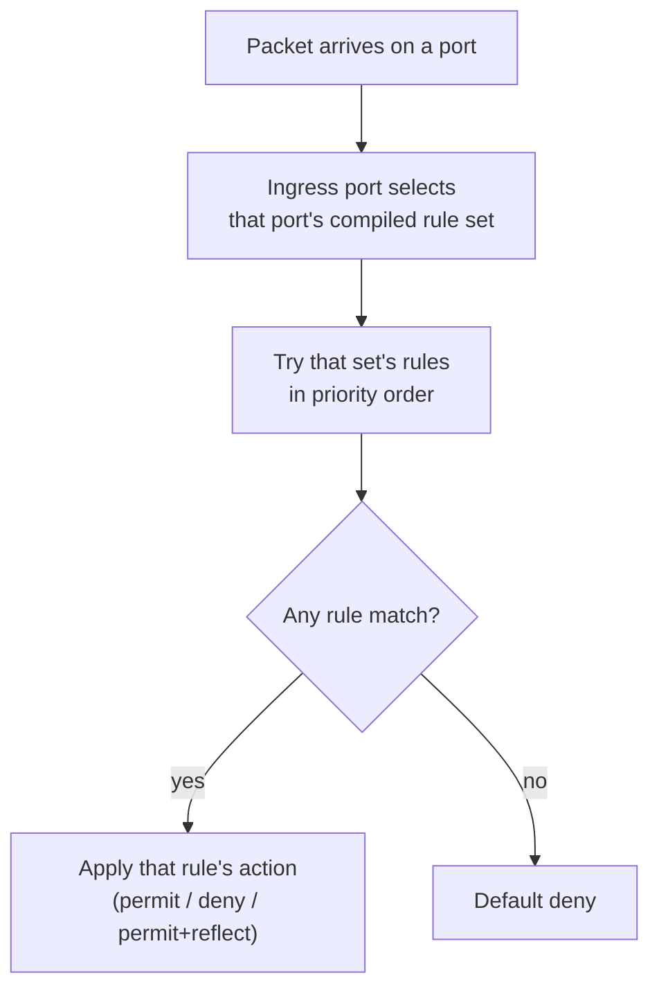
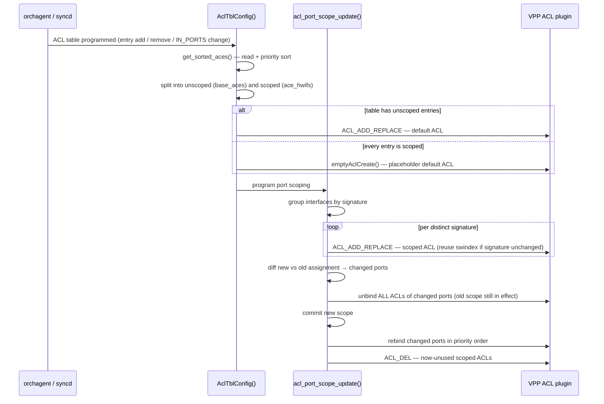

# SONiC VPP ACL Ingress Port Scoping (`IN_PORTS`) — HLD

## Table of Contents

- [SONiC VPP ACL Ingress Port Scoping (`IN_PORTS`) — HLD](#sonic-vpp-acl-ingress-port-scoping-in_ports--hld)
  - [Table of Contents](#table-of-contents)
  - [Revisions](#revisions)
  - [Definitions/Abbreviations](#definitionsabbreviations)
    - [General](#general)
    - [Introduced by This Design](#introduced-by-this-design)
  - [Background](#background)
    - [Observed Impact](#observed-impact)
  - [Requirement](#requirement)
  - [Feature Description](#feature-description)
    - [SONiC Control Plane Flow](#sonic-control-plane-flow)
    - [SONiC Database Schema](#sonic-database-schema)
      - [CONFIG\_DB](#config_db)
      - [ASIC\_DB](#asic_db)
    - [VPP Dataplane Counterpart](#vpp-dataplane-counterpart)
    - [How VPP Evaluates an ACL](#how-vpp-evaluates-an-acl)
    - [Consumers of `IN_PORTS` in SONiC](#consumers-of-in_ports-in-sonic)
  - [Design](#design)
    - [Why Scoping Must Live in the Binding Layer](#why-scoping-must-live-in-the-binding-layer)
    - [Partitioning Ports by Signature](#partitioning-ports-by-signature)
      - [Worked Example](#worked-example)
      - [Cases](#cases)
    - [Programming Flow](#programming-flow)
    - [Rebinding Must Replace the Whole Port](#rebinding-must-replace-the-whole-port)
      - [The Port's ACL List Is Ordered, and the Order Is Built by Position](#the-ports-acl-list-is-ordered-and-the-order-is-built-by-position)
      - [What the Naive Rebind Actually Does](#what-the-naive-rebind-actually-does)
      - [Rebind the Whole Port](#rebind-the-whole-port)
      - [Consequences and Costs](#consequences-and-costs)
      - [The Window in the Shipping Consumers](#the-window-in-the-shipping-consumers)
    - [Failure Handling and Dirty Ports](#failure-handling-and-dirty-ports)
    - [Counters](#counters)
    - [Scaling](#scaling)
  - [Proposed Changes](#proposed-changes)
    - [`SwitchVpp.h` Changes](#switchvpph-changes)
    - [`SwitchVppAcl.cpp` Changes](#switchvppaclcpp-changes)
    - [Files Changed](#files-changed)
  - [Restrictions and Limitations](#restrictions-and-limitations)
  - [Testing](#testing)
    - [Unit / Dataplane Verification](#unit--dataplane-verification)
    - [sonic-mgmt Coverage](#sonic-mgmt-coverage)
  - [References](#references)

---

## Revisions

| Rev | Date | Author(s) | Changes |
|-----|------|-----------|---------|
| v0.1 | 08/20/2026 | Longxiang Lyu (lolv@microsoft.com) | Initial Draft |

---

## Definitions/Abbreviations

This section covers the abbreviations used in this high-level design document and their definitions.

### General

| Term | Meaning |
|------|---------|
| ACL | Access Control List. In SAI, an ACL **table** holds a set of entries and is bound to a set of ports |
| ACE | Access Control Entry. A single rule within an ACL table. Referred to as an ACL *entry* in SAI and as a *rule* in CONFIG_DB |
| SAI | Switch Abstraction Interface. The vendor-neutral API layer that orchagent programs |
| saivpp | The VPP-backed SAI implementation in `sonic-sairedis` (`vslib/vpp/`), the subject of this document |
| VPP | Vector Packet Processing. The userspace dataplane backing `saivpp` |
| `IN_PORTS` | `SAI_ACL_ENTRY_ATTR_FIELD_IN_PORTS`. A per-entry SAI match qualifier restricting an entry to a set of ingress ports |
| OID | SAI object ID, the handle identifying a SAI object such as a table, entry or port |
| ACL binding | The association between a VPP ACL and an interface. VPP evaluates an ACL on an interface only if it is bound to it |
| lookup context | VPP's name for a port's compiled, per-direction ACL match set. Selected by the ingress port **before** any rule is compared, which is why port scope is a binding-layer property in VPP |
| swindex | The VPP-assigned index of an ACL |
| hwif | VPP hardware interface name (e.g. `bobm1`), the VPP-side counterpart of a SONiC port name |

### Introduced by This Design

| Term | Meaning |
|------|---------|
| scoped entry | An ACL entry that carries `IN_PORTS`, so it applies only to the ingress ports it names |
| unscoped entry | An ACL entry with no `IN_PORTS`, so it applies to every port the table is bound to |
| default ACL | The VPP ACL built from the unscoped entries alone. Bound to the ports of the table that no `IN_PORTS` names. Degrades to a placeholder holding one rule that cannot match legitimate traffic, when the table has no unscoped entries |
| scoped ACL | A VPP ACL built from the unscoped entries **plus** the scoped entries naming a given interface. Bound only to the interfaces it was built for, in place of the default ACL |
| applicable entry set | For one interface, the priority-ordered set of entries that apply to it: all unscoped entries plus the scoped entries naming that interface |
| signature | The ordered vector of ACE OIDs forming an applicable entry set — **including the unscoped entries**, interleaved at their priority positions. Identifies a scoped ACL, groups interfaces that can share one, and serves as the slot-reuse key across reprogramming |
| dirty port | A port whose VPP binding may not match the recorded scope, because a previous bind/unbind failed or its interface could not be resolved. Forced through unbind/rebind on the next reprogram |

---

## Background

SONiC ACL entries may be scoped to a subset of ingress ports via the SAI qualifier `SAI_ACL_ENTRY_ATTR_FIELD_IN_PORTS`. The ACL table is bound to a broad set of ports, and each entry may narrow itself to specific ingress ports.

The VPP-based virtual switch (`saivpp`) does not honour this qualifier. Creating or updating an ACL entry's `IN_PORTS` is accepted and **reported as successful**, but the port scope is discarded and the entry is programmed as if the qualifier were absent.

The result is not an approximately-correct scope — it is the inverse of the intent. An entry meant to drop traffic on one port instead drops it on **every port the table is bound to**.

This is a day-1 gap rather than a regression: `IN_PORTS` has never been implemented in `saivpp`.

### Observed Impact

On a dual-ToR SONiC-VPP testbed, MuxOrch's drop ACL (`IngressTableDrop` / `mux_acl_rule`, action `DROP`) is scoped to the **standby** mux ports via `IN_PORTS`. With a single port in standby, the intent and the reality diverge as follows:

```
ASIC_DB intent:  SAI_ACL_ENTRY_ATTR_FIELD_IN_PORTS = 1:oid:0x1000000000033   (Ethernet4)
VPP reality:     acl-index 3 applied inbound on sw_if_index: 1 .. 32         (all front-panel ports)
```

`vppctl show acl-plugin interface` showed standby and active ports as byte-for-byte identical:

```
sw_if_index  2 (Ethernet4,  STANDBY):  input acl(s): 2, 3, 1
sw_if_index  3 (Ethernet8,  ACTIVE ):  input acl(s): 2, 3, 1     <-- identical
```

Since `acl-index 3` is `ipv4 deny any -> any` and `sonic_acl_default_permit` is bound behind it, all IPv4 ingress on all 32 front-panel ports was dropped. Non-IPv4 traffic was unaffected (ARP resolved normally), and BGP survived because uplinks are `Port::LAG` and are skipped by MuxOrch's `bindAllPorts()`, which links only `Port::PHY`.

The failure is **inverted and non-proportional**: zero standby ports behaves correctly (the rule is deleted), while *one* standby port produces a box-wide outage.

---

## Requirement

| # | Requirement |
|---|-------------|
| REQ-1 | An ACL entry carrying `SAI_ACL_ENTRY_ATTR_FIELD_IN_PORTS` must be enforced **only** on the ingress ports it names. |
| REQ-2 | An ACL entry without `IN_PORTS` must continue to be enforced on every port the table is bound to. |
| REQ-3 | Relative priority ordering between scoped and unscoped entries of the same table must be preserved on every port. |
| REQ-4 | Entries within one table carrying **different** `IN_PORTS` sets must each be honoured independently. |
| REQ-5 | Once a change to an entry's `IN_PORTS` (e.g. a mux state transition) has been applied, ACLs of other tables bound to the same port must be unchanged, and no other port may be touched. A transient rebind window on the changed port is permitted. |
| REQ-6 | A failure to read `IN_PORTS` must not silently widen a scoped entry's scope. |
| REQ-7 | Per-entry ACL counters must remain correct when an entry is replicated into more than one VPP ACL. |
| REQ-8 | Existing behaviour for tables without any `IN_PORTS` entries must be unchanged. |

---

## Feature Description

### SONiC Control Plane Flow

```
CONFIG_DB ACL_RULE with IN_PORTS  (or MuxOrch / PfcWdAclHandler programmatically)
  → AclOrch builds the ACL entry
    → SAI create/set with SAI_ACL_ENTRY_ATTR_FIELD_IN_PORTS
      → syncd writes ASIC_DB
        → saivpp translates to VPP ACL(s) and interface bindings
```

`IN_PORTS` is a *match qualifier* in SAI: conceptually "match this rule only if the packet arrived on one of these ports". SONiC's normal pattern is to bind the ACL table broadly and let `IN_PORTS` narrow individual entries.

MuxOrch relies on this explicitly. `MuxAclHandler::createMuxAclTable()` ends in `bindAllPorts()`, which links every `Port::PHY`, and keeps **one shared table with one shared rule** for all mux ports. A switchover is then a cheap rule edit — `RULE_OPER_ADD` / `RULE_OPER_DELETE` of a port OID on that single rule's `IN_PORTS` list — and never a table re-bind. The two mechanisms are therefore not redundant: `IN_PORTS` is the *only* thing narrowing the drop.

### SONiC Database Schema

No schema change is introduced by this feature. The existing objects are consumed as follows.

#### CONFIG_DB

Key: `ACL_RULE|<table_name>|<rule_name>`

| Field | Example Value | Description |
|-------|---------------|-------------|
| `IN_PORTS` | `Ethernet4,Ethernet8` | Comma-separated ingress ports the rule applies to |
| `PRIORITY` | `999` | Rule priority |
| `PACKET_ACTION` | `DROP` | Rule action |

`IN_PORTS` requires the table's type to declare the match, e.g. the built-in `DROP` type or a custom `ACL_TABLE_TYPE` listing `IN_PORTS` in `MATCHES`.

#### ASIC_DB

Key: `ASIC_STATE:SAI_OBJECT_TYPE_ACL_ENTRY:oid:<entry_oid>`

| Field | Example Value | Description |
|-------|---------------|-------------|
| `SAI_ACL_ENTRY_ATTR_TABLE_ID` | `oid:0x7000000000667` | Owning ACL table |
| `SAI_ACL_ENTRY_ATTR_FIELD_IN_PORTS` | `1:oid:0x1000000000033` | Ingress ports the entry is scoped to |
| `SAI_ACL_ENTRY_ATTR_ACTION_PACKET_ACTION` | `SAI_PACKET_ACTION_DROP` | Entry action |

### VPP Dataplane Counterpart

| VPP API | Purpose |
|---------|---------|
| `ACL_ADD_REPLACE` | Create an ACL, or replace the rules of an existing ACL in place (preserving its index) |
| `ACL_DEL` | Delete an ACL. Fails if the ACL is still bound to an interface |
| `ACL_INTERFACE_ADD_DEL` | Bind/unbind an ACL to/from an interface. **Appends** to the interface's ACL list |
| `ACL_INTERFACE_SET_ACL_LIST` | Replace an interface's entire ACL list atomically (not currently wrapped by saivpp) |

The decisive property is the shape of a VPP ACL rule (`vslib/vpp/vppxlate/SaiVppXlate.h:86-99`):

```c
typedef struct _vpp_acl_rule {
    vpp_acl_action_e action;
    vpp_ip_addr_t src_prefix, src_prefix_mask;
    vpp_ip_addr_t dst_prefix, dst_prefix_mask;
    int proto;
    uint16_t srcport_or_icmptype_first, srcport_or_icmptype_last;
    uint16_t dstport_or_icmpcode_first, dstport_or_icmpcode_last;
    uint8_t tcp_flags_mask, tcp_flags_value;
} vpp_acl_rule_t;
```

There is **no interface member**, and this is not a saivpp omission — the struct is a 1:1 mirror of upstream VPP's wire format (`src/plugins/acl/acl_types.api`, `typedef acl_rule`). VPP expresses ingress-port scoping solely by *which interfaces an ACL is bound to*; the port is resolved before rule evaluation begins, as the next section describes.

### How VPP Evaluates an ACL

The claim above is the premise for the whole design, so it is worth spelling out in plain terms.

**Rules are compiled per port.** A VPP ACL is an ordered list of match rules and nothing more — it carries no notion of *where* it applies. Location is supplied separately, by binding the ACL to an interface. When bindings change, VPP does not leave the bound ACLs as a list to be walked at packet time; it **compiles** them. Every rule of every ACL bound to a port is flattened, in priority order, into one combined match structure, and the port itself becomes part of each compiled rule's identity.

The result behaves like an array indexed by port — each port owns a slot holding exactly the rules that apply to it, in the order they should be tried:

```
  port 1  ──▶ [ rule A, rule B, rule C ]     compiled from the ACLs bound to port 1
  port 2  ──▶ [ rule A, rule D ]             compiled from the ACLs bound to port 2
  port 3  ──▶ [ ]                            no ACLs bound — nothing to match
```

Note that rule A appears twice. The same rule reachable from two ports is compiled into two independent copies, one per port; ports never share compiled match state, even when their rule sets are identical. Equally, a rule can only enter a port's slot by being part of an ACL bound to that port — there is no other path in.

**Packets are evaluated per port.** At packet time the ingress port is resolved *first*, and it selects which slot to search. Only then are rules compared against the packet. The search is first-match: the highest-priority rule in that slot that matches supplies the verdict — permit, deny, or permit-with-reflection — and if nothing matches, the packet is denied by default.



**Why this forecloses a per-rule port qualifier.** Port identity is consumed *before* rule matching begins: it selects the slot, and it is already compiled into the rules inside that slot. It is never a field compared against the packet during the search. By the time any rule is examined, "which port" has been settled — every candidate rule in that slot is, by construction, one the port already selected. A per-entry `IN_PORTS` therefore has nowhere to live in this model. The only way to express "this rule applies to these ports and no others" is to control **which ports the ACL is bound to**, which is what the design below does.

### Consumers of `IN_PORTS` in SONiC

Multiple entries with *different* `IN_PORTS` in one table is a shipping configuration, not a hypothetical:

| Consumer | Table | Shape |
|----------|-------|-------|
| MuxOrch | `IngressTableDrop` | One rule, `IN_PORTS` = all standby mux ports, match any, `DROP` |
| PFC watchdog | `IngressTableDrop` (same table) | One rule **per queue id** (`Rule_PfcWdAclHandler_<qid>`), `IN_PORTS` = storming ports, match `TC=<qid>`, `DROP` |
| GCU dynamic ACL | `DYNAMIC_ACL_TABLE` | Three `DROP` rules naming three *different* ports, alongside unscoped `FORWARD` rules |

The built-in `DROP` table type declares exactly two match qualifiers — `SAI_ACL_TABLE_ATTR_FIELD_TC` and `SAI_ACL_TABLE_ATTR_FIELD_IN_PORTS` (`aclorch.cpp`) — which is what allows MuxOrch and the PFC watchdog to coexist in one table. `SAI_ACL_TABLE_ATTR_FIELD_IN_PORTS` is in fact a *mandatory* ingress match for this type, so an ingress `DROP` table always carries it. Two lossless queues storming on different ports likewise produce two rules with disjoint `IN_PORTS` — reachable on a box with no dual-ToR configuration at all.

---

## Design

### Why Scoping Must Live in the Binding Layer

The irreducible difficulty is a **cardinality mismatch**:

- SAI carries ingress-port scope **per entry**.
- VPP carries it **per ACL** — every rule in an ACL shares one set of interface bindings.

"Per ACL" is deliberately not "per table". The two models do not have matching object graphs:

| SAI / SONiC | VPP counterpart | Consequence |
|-------------|-----------------|-------------|
| ACL entry — `SAI_OBJECT_TYPE_ACL_ENTRY`, CONFIG_DB `ACL_RULE` | ACL rule — `vpp_acl_rule_t` | The VPP rule is match criteria and an action, nothing more. It has no port field, so a per-entry scope has nowhere to go |
| ACL table — `SAI_OBJECT_TYPE_ACL_TABLE`, CONFIG_DB `ACL_TABLE` | *none* | VPP has no table object. The closest thing is the VPP ACL, but that is a different unit with different cardinality |
| — | VPP ACL — an ordered list of rules **plus the set of interfaces it is bound to** | This is what owns port scope in VPP, and it is the only place scope can be expressed |
| Port bind — `SAI_PORT_ATTR_INGRESS_ACL` on a port, referencing an ACL table group whose members name tables | ACL binding — `ACL_INTERFACE_ADD_DEL` | Both sides associate a port with a ruleset here; this is the layer the design operates on |
| `SAI_ACL_ENTRY_ATTR_FIELD_IN_PORTS` on one ACL entry | *none* | Must be re-expressed as *which interfaces the ACL is bound to* |

Baseline `saivpp` creates exactly one VPP ACL per SAI table (`m_acl_swindex_map`, keyed by table OID), which is why "per ACL" and "per table" look equivalent today. That is an implementation choice, not a VPP constraint — and relaxing it, so one SAI table may map to several VPP ACLs, is what makes this design possible.

Two things follow. A table whose entries carry different `IN_PORTS` sets cannot be represented as one VPP ACL, however that ACL's rules are written. And the obvious fix — adding a `case SAI_ACL_ENTRY_ATTR_FIELD_IN_PORTS` to `acl_rule_field_update()` — cannot be written at all: that function's sole output is a `vpp_acl_rule_t`, so there is no field to assign. The qualifier is not missing from the switch by oversight; it has no representation at that layer.

It does have an exact equivalent one layer up. `IN_PORTS = {Ethernet4}` means "apply this entry only to traffic arriving on Ethernet4", and VPP states the same thing as "bind the ACL holding this entry to Ethernet4, and to nothing else". The design below is that translation — the scope is preserved, expressed as a binding rather than as a match.

### Partitioning Ports by Signature

Because scope can only be expressed as a binding, programming a table reduces to one question per port: **which VPP ACL does this port bind?** The answer is derived from the set of entries that apply to that port, and ports that agree on that set share an ACL.

**Step 1 — classify the entries.** Each entry's `IN_PORTS` is read once. An entry that carries the qualifier is *scoped* and records the interfaces it names; an entry without it is *unscoped*.

**Step 2 — collect the candidate interfaces.** The candidates are the union of every scoped entry's interfaces. Only a candidate can need anything other than the default ACL: a port no entry names sees exactly the unscoped entries, which is what the default ACL already holds.

**Step 3 — build each candidate's applicable set.** For one candidate interface, walk the table's priority-ordered entries once and keep every entry that applies to it — every unscoped entry, plus every scoped entry naming this interface:

```
for each candidate interface I:
    applicable(I) = [ e for e in entries_in_priority_order
                        if e is unscoped or I in e.IN_PORTS ]
```

Because the walk preserves the table's order, `applicable(I)` is a *subsequence* of the table's priority order — no two entries can end up reordered relative to how the table ranked them.

**Step 4 — take the signature.** The **signature** is the ordered vector of ACL entry OIDs in the applicable set. It is the identity of that set: two interfaces have equal signatures exactly when the same entries apply to them, in the same order.

**Step 5 — group and program.** Candidates are grouped by signature. Each distinct signature yields one VPP ACL, whose rules are built from that applicable set and which is bound to every interface in the group — **in place of** the default ACL, not in addition to it. The scoped ACL already contains the unscoped entries, so those are still enforced exactly once. Every non-candidate port binds the default ACL.

#### Worked Example

A table bound to five ports, with three entries:

| Entry | Priority | `IN_PORTS` | Action |
|-------|----------|------------|--------|
| E1 | 100 | Ethernet4, Ethernet8, Ethernet16 | `DROP` |
| E2 | 50 | *(unscoped)* | `FORWARD` |
| E3 | 10 | Ethernet8 | `DROP` |

The candidate set is `{Ethernet4, Ethernet8, Ethernet16}` — the union of E1's and E3's interfaces. Ethernet0 and Ethernet12 are named by nothing, so they are not candidates. Walking the entries for each candidate:

| Interface | E1 | E2 | E3 | Signature |
|-----------|----|----|----|-----------|
| Ethernet4 | kept — names it | kept — unscoped | skipped | `⟨E1, E2⟩` |
| Ethernet8 | kept — names it | kept — unscoped | kept — names it | `⟨E1, E2, E3⟩` |
| Ethernet16 | kept — names it | kept — unscoped | skipped | `⟨E1, E2⟩` |

Ethernet4 and Ethernet16 produce the same signature, so they group together. The table is programmed as three VPP ACLs:

| VPP ACL | Rules, in order | Bound to |
|---------|-----------------|----------|
| scoped #1 | E1, E2 | Ethernet4, Ethernet16 |
| scoped #2 | E1, E2, E3 | Ethernet8 |
| default | E2 | Ethernet0, Ethernet12 |

Note where E2 lands. It is unscoped, so it appears in all three ACLs — but at its *priority position* each time, between E1 and E3 in Ethernet8's ACL rather than appended to either end. That interleaving is what makes the port the unit of partitioning.

#### Cases

| Case | Example | Outcome |
|------|---------|---------|
| No entry carries `IN_PORTS` | Any ordinary L3 table | No partitioning is performed at all; every port binds the default ACL, exactly as before this design |
| Port named by no entry | Ethernet0 above | Binds the default ACL — the unscoped entries only |
| Ports with identical applicable sets | Ethernet4 and Ethernet16 above | Equal signatures, so one shared scoped ACL rather than a copy each |
| Ports with different applicable sets | Ethernet8 versus Ethernet4 above | Different signatures, so one scoped ACL each |
| Distinct entries that happen to match identically | Two `DROP any` entries, one naming Ethernet4 and one naming Ethernet8 | Signatures hold entry OIDs, not rule content, so these differ and produce two ACLs. Deduplication is never inferred from rule text |
| Every port named, with the same scope | All mux ports standby | One signature covering all of them, so one scoped ACL bound to every port |
| Table with no unscoped entries | The mux drop table with a single scoped entry | The default ACL has no rules to hold, so it degrades to the placeholder described below; ports that are not candidates bind that and match nothing in practice |
| `IN_PORTS` present but empty | Qualifier enabled with a zero-length port list | The entry names no interface, so it enters no signature, and being scoped it is excluded from the default ACL — it applies nowhere. Logged as a warning |

### Programming Flow



The default ACL keeps `m_acl_swindex_map[tbl_oid]`, and every port of the table that no `IN_PORTS` names resolves to it. A port that *is* named binds its scoped ACL **instead**: exactly one ACL of a table is ever bound to a given port, which is why the unscoped entries the scoped ACL carries are not enforced twice. When a table has **no** unscoped entries the default ACL degrades to the pre-existing `emptyAclCreate()` placeholder rather than ceasing to exist. This keeps the default ACL's identity independent of the data, which is what allows the existing tunterm, table-removal and binding paths to work unchanged.

The placeholder holds a single rule matching destination `0.0.0.0/32`, because VPP rejects a zero-rule ACL. That is not the same as a rule that can never match: `0.0.0.0` is never a valid unicast destination, so no legitimate packet carries it, but a crafted one can. Since a match ends evaluation of the interface's entire ACL list, a *permit* there would let such a packet bypass every lower-priority table bound to the port. The placeholder's action is therefore **deny**, which both closes that bypass and is the correct treatment for the destination. This matters more under this design than before it: previously the placeholder appeared only for a table with no entries at all, whereas now every non-candidate port of an all-scoped table binds one.

This placeholder path is on the critical path for the mux case, not an edge case: the mux table's only entry *is* the scoped one, so the unscoped set is empty on dual-ToR.

The step order in `acl_port_scope_update()` is load-bearing and must not be rearranged:

| Step | Reason |
|------|--------|
| 1. Program the default ACL (in `AclTblConfig`) | Bindings computed later must refer to swindexes that already exist |
| 2. Program/replace the scoped ACLs | Same |
| 3. Compute the new per-interface assignment | |
| 4. Diff against the old assignment | |
| 5. **Unbind** changed ports | Must run while the stored scope still describes what VPP has bound |
| 6. Commit the new scope | |
| 7. **Bind** changed ports | |
| 8. Delete unused scoped ACLs | `ACL_DEL` fails on an ACL that is still bound |

### Rebinding Must Replace the Whole Port

Changing a port's scoped ACL means changing which ACL it binds. The obvious way to do that — unbind the old swindex, bind the new one — is unsafe, because `ACL_INTERFACE_ADD_DEL` has no notion of position. Understanding why fixes the shape of the whole rebinding step.

#### The Port's ACL List Is Ordered, and the Order Is Built by Position

A port's bound ACLs form an ordered vector, evaluated first-match front to back. On a live system:

```
sw_if_index 25:  input acl(s): 2, 3, 1
```

`aclBindUnbindPort()` produces that order by *sequence of calls*: it sorts the table group's members by `SAI_ACL_TABLE_GROUP_MEMBER_ATTR_PRIORITY` descending and binds them in that order, then binds `sonic_acl_default_permit` — two `permit` rules, one `IPV4ANY` and one `IPV6ANY` — **last**. Position in the vector *is* the priority, and the trailing permit-any is the table group's terminal "allow whatever no table claimed".

Two properties of the VPP API follow from this, and both matter:

| Operation | Behaviour | Consequence |
|-----------|-----------|-------------|
| bind | Appends to the end of the vector | A newly bound ACL always lands **after** the permit-any, where it can never be reached |
| unbind | Removes by *value*, then fills the hole with the **last** element | Removing any ACL other than the last one **reorders** the survivors |

The second property is the one that is easy to miss. VPP's `vec_del1` does not shift the tail down; it copies the final element into the vacated slot and shrinks the vector by one. It is O(1) precisely because it does not preserve order.

#### What the Naive Rebind Actually Does

Take `[2, 3, 1]` — table ACL 2, table ACL 3, permit-any 1 — and rescope the table that owns ACL 2 to a new scoped ACL 4:

| Step | Vector | State |
|------|--------|-------|
| initial | `2, 3, 1` | Correct: both tables evaluated, permit-any last |
| unbind 2 | `1, 3` | **Permit-any is now first.** ACL 3 is already dead — before anything was rebound |
| bind 4 | `1, 3, 4` | Permit-any first; ACLs 3 and 4 are both unreachable |

Every packet now matches the permit-any and is forwarded. The port silently enforces nothing at all — not just the entry being rescoped, but *every* ACL table bound to that port, including ones this operation never touched. That is strictly worse than the bug being fixed: the original defect over-applies a drop, whereas this would un-apply every drop on the port, with no error anywhere, because both API calls returned success.

#### Rebind the Whole Port

`acl_port_scope_update()` therefore never manipulates individual entries in the vector. It calls the existing `aclBindUnbindPort()` twice for a changed port — once with `is_bind = false`, once with `true`:

- The unbind pass removes every ACL of the group **and** the trailing permit-any. SAI binds one ACL group per port per direction, so the vector drains to empty; whatever reordering `vec_del1` performs along the way is irrelevant because nothing survives to be misordered.
- The bind pass rebuilds the vector from scratch in priority order, permit-any last, using the *new* per-port swindexes from `acl_port_swindex_get()`.

The resulting order is correct by construction, and — importantly — it is produced by the same function that established the order originally, so scoping cannot drift from the ordering rules the rest of the ACL code assumes.

This is also why the step order in `acl_port_scope_update()` is load-bearing. The unbind pass must run while `m_acl_port_scope` still holds the *old* assignment, since `aclBindUnbindPort()` resolves the swindex to unbind through `acl_port_swindex_get()`. Committing the new scope first would make it unbind swindexes the port was never bound to, leaving the real ones in place.

#### Consequences and Costs

**A brief unfiltered window.** The unbind pass is itself a sequence of single removals, so partway through it the permit-any can transiently sit at the front; by the end the vector is empty, at which point VPP releases the interface's lookup context and disables ACL processing on it entirely. Either way traffic passes unfiltered until the bind pass completes — sub-millisecond, and accepted as benign relative to the outage being fixed. Closing it entirely needs atomic whole-list replacement, which VPP does offer as `acl_interface_set_acl_list`, but that requires a new API binding and is deferred.

**A failed unbind must suppress the rebind.** If the unbind pass fails, the port's vector was not drained, and binding onto it would append behind the permit-any — reproducing exactly the failure described above. Such a port is skipped in the bind pass and recorded in `m_acl_tbl_dirty_ports`, which forces a full unbind/rebind on the next reprogram even though its assignment will by then look unchanged.

**Rebinding is idempotent.** `vpp_acl_interface_bind()` maps `VNET_API_ERROR_ACL_IN_USE_INBOUND` (VPP's "already in this vector" rejection) to success, and the unbind path maps `NO_SUCH_ENTRY` the same way. A redundant bind is a genuine no-op in VPP — the duplicate is rejected before any vector mutation — so it cannot silently move an ACL to the end. This is what makes retrying a partially applied rescope safe.

**Ports that did not change are not touched.** Only ports whose swindex assignment actually differs, plus dirty ones, are rebound. A mux transition on one port does not disturb the ACL vector of any other.

#### The Window in the Shipping Consumers

Both consumers of `IN_PORTS` in `IngressTableDrop` represent their scope as **one entry with a growing port list**, not one entry per port — MuxOrch keeps a single `mux_acl_rule`, and the PFC watchdog keeps one `Rule_PfcWdAclHandler_<queue>` per queue id. Adding a port calls `updateAclRule(..., MATCH_IN_PORTS, ..., RULE_OPER_ADD)` on the entry that already exists.

This matters because a port is rebound only when *its own* applicable set changes. Extending an entry's `IN_PORTS` leaves the signature of every port already named by that entry byte-for-byte identical, so those ports reuse their scoped ACL slot and are never unbound.

**Mux toggle.** For a table whose only entry is the mux rule `M`:

| Transition | Ports rebound | Behaviour in the window | Net effect |
|------------|---------------|-------------------------|------------|
| First port → standby | that port | Forwards instead of dropping | Drop lands late on the transitioning port |
| Second port → standby | the new port only — the already-standby port keeps signature `⟨M⟩` and its slot | as above, on the new port | The first port's drop is **never** interrupted |
| Port → active, others still standby | that port | Forwards | Harmless for this table — forwarding *is* the target state |
| Last port → active | that port; entry deleted and the scoped ACL reaped | Forwards | Harmless, same reason |

**PFC watchdog.** The shape is identical, with storm-detected in place of standby:

| Transition | Ports rebound | Net effect |
|------------|---------------|------------|
| Storm detected on port P, queue q (first port for that queue) | P | The queue's traffic is undropped for the window; detection itself already took hundreds of milliseconds, so the added leak is negligible |
| Storm on a second port, same queue | the new port only | Ports already dropping are undisturbed |
| Second queue storms on the same port P | P — its signature grows from `⟨P_q1⟩` to `⟨P_q1, P_q2⟩` | Both queues' drops are briefly lifted together; same negligible magnitude |
| Storm clears | that port | Harmless — not dropping is the target state |

**The general rule:** Traffic always *passes* during the window, so the direction of the change decides whether that is wrong:

- Toward a **more** restrictive state (forwarding → dropping), the window still behaves like the state being left, so the change lands late and packets that should have been dropped are forwarded.
- Toward a **less** restrictive state (dropping → forwarding), the window already behaves like the state being entered, so the change merely lands a fraction of a millisecond early. No packet is treated in any way the finished transition would not also have produced.

### Failure Handling and Dirty Ports

Computing the changed-port set by diffing old versus new *intent* is not sufficient. If a rebind fails, the new scope is still committed; on the next reprogram old and new intent agree, the diff is empty, no rebind is attempted, and the operation reports success with the port left unbound.

A `m_acl_tbl_dirty_ports` set records every port whose bind/unbind failed or whose interface could not be resolved. A dirty port is forced through unbind/rebind on the next reprogram even when its assignment appears unchanged. A port whose *unbind* failed is additionally skipped in the bind loop, since binding onto an uncleared list would append out of order.

Marking the port dirty is necessary but not sufficient, because the retry also has to know *what to unbind*. Unbinding resolves the swindex through the stored scope, so committing the new assignment for a port whose unbind just failed would point the retry at an ACL that port was never bound to. VPP answers `NO_SUCH_ENTRY`, which is deliberately mapped to success, so the retry would report a clean unbind, bind the new ACL in front of the stale one, and leave the stale one bound — permanently, since an ACL that is still bound cannot be deleted either. For the mux table that is a port stuck on its previous verdict, which for a standby→active transition means a port that keeps dropping.

Such a port therefore **keeps its old assignment** when the new scope is committed, and its old swindex is excluded from the reap so it is not freed while still bound. If that swindex is a scoped ACL it is additionally carried under the empty signature, so it stays tracked and becomes reapable as soon as a later retry unbinds it. If instead the port was still on the **default** ACL, nothing is carried: that ACL is owned by `m_acl_swindex_map` for the table's lifetime, and adding it to the scoped set would expose it to the reap and leave that map holding a swindex VPP had released. Either way the next reconcile unbinds what VPP actually holds, and the port converges.

A scoped ACL that VPP refuses to delete is retained under an **empty signature**, which the grouping loop can never produce. It can therefore never be reused or rebound — only retried on a later pass.

### Counters

An ACE may now be replicated into several VPP ACLs, so per-entry counter tracking becomes a list. `vpp_ace_cntr_info_t` holds a vector of `vpp_ace_placement_t` (`acl_index`, `vpp_rule_base_index`, `num_rules`), and `getAclEntryStats()` sums across all placements. Placements accumulate, so `acl_ace_cntr_info_clear(tbl_oid)` is invoked before reprogramming a table to prevent double counting.

Because that clear happens before programming and programming is not staged, a reprogram that fails part way leaves some ACLs of the table still active with their placements already discarded. `getAclEntryStats()` then under-reports for those entries until the next successful reprogram rebuilds the list. Counts are not corrupted or double counted, but REQ-7 holds only in the steady state, not across a partial failure. Removing this needs the same transactional staging that the first restriction below defers.

### Scaling

| Scenario | VPP ACLs created |
|----------|------------------|
| No entry carries `IN_PORTS` | 1 (unchanged from today) |
| All mux ports standby | 1 scoped ACL bound to N interfaces, plus the default-ACL placeholder |
| Single mux port standby | 1 scoped ACL on 1 interface; all other ports sit on the placeholder |
| K distinct signatures among the candidate ports | K scoped ACLs, plus the default ACL |

The count tracks *distinct signatures*, not port count, because interfaces with identical applicable sets share one ACL. It is not the number of distinct `IN_PORTS` sets either: overlapping sets produce more signatures than sets, since a port named by two entries has a signature that neither entry's set produces on its own. Two entries scoped to `{A, B}` and `{B, C}` yield three signatures — `⟨E1⟩`, `⟨E1, E2⟩`, `⟨E2⟩` — from two sets. The default ACL is always present in addition, whether it holds the unscoped entries or degrades to the placeholder. Signature-keyed slot reuse means an unchanged scoped ACL keeps its swindex across a reprogram: its rules are replaced in place and the interfaces already bound to it are never disturbed.

Because a signature includes the unscoped entries, adding or removing an unscoped entry changes *every* signature in the table, so no slot is reused and all scoped ports are rebound. This is conservative but correct — those ACLs' contents genuinely did change. Scoped-only churn, such as a mux state transition, affects only the signatures that actually differ.

---

## Proposed Changes

### `SwitchVpp.h` Changes

| Addition | Purpose |
|----------|---------|
| `vpp_ace_placement_t` | One `(acl_index, vpp_rule_base_index, num_rules)` placement of an ACE |
| `vpp_ace_cntr_info_t::placements` | Vector of placements, replacing the previous flat scalars |
| `vpp_acl_port_scope_t` | `port_swindex` (interface → scoped ACL swindex) and `scoped_acls` (signature → swindex) |
| `m_acl_port_scope` | Table OID → port scoping currently programmed in VPP |
| `m_acl_tbl_dirty_ports` | Table OID → ports needing forced reconciliation |

### `SwitchVppAcl.cpp` Changes

New methods:

| Method | Purpose |
|--------|---------|
| `acl_entry_in_ports_get()` | Two-step `get()` of `IN_PORTS`; `ITEM_NOT_FOUND` means unscoped, all other statuses propagate |
| `acl_port_swindex_get()` | Resolve the swindex for one interface, falling back to the default ACL |
| `acl_tbl_port_bindings_get()` | Enumerate `(port_oid, tbl_grp_oid, is_input)` for a table |
| `acl_port_scope_update()` | Core: group, program, diff, unbind/rebind, reap |
| `acl_ace_cntr_info_update()` | Accumulate counter placements |
| `acl_ace_cntr_info_clear()` | Drop a table's placements before reprogramming |

Modified methods:

| Method | Change |
|--------|--------|
| `acl_rule_field_update()` | Explicit `IN_PORTS` case pointing at the binding layer, replacing the bogus error log |
| `AclTblConfig()` | Split ACEs into unscoped/scoped; `emptyAclCreate()` when all are scoped; call `acl_port_scope_update()` |
| `AclTblRemove()` | Clear counters and dirty ports; delete scoped ACLs; retain undeleted ones and propagate failure |
| `aclBindUnbindPort()` / `aclBindUnbindPorts()` | Resolve the swindex **per interface** |
| `getAclEntryStats()` | Sum counters across all placements |

### Files Changed

| File | Change |
|------|--------|
| `vslib/vpp/SwitchVpp.h` | Port-scope and counter-placement structures; new member maps |
| `vslib/vpp/SwitchVppAcl.cpp` | `IN_PORTS` read, port partitioning, scoped ACL programming, binding reconciliation, counter fan-out |

`vslib/vpp/SwitchVppAcl.h` is deliberately **unchanged** — the design avoids adding fields to `acl_tbl_entries_t` / `ordered_ace_list_t`. No VPP API extension is required.

---

## Restrictions and Limitations

- **No transactional staging.** Scoped ACLs are programmed in place rather than staged under fresh swindexes. If a scoped ACL fails after the default ACL has succeeded, some ports enforce new rules and others old until the next reprogram. Full staging would double peak ACL usage and is a substantially larger redesign.
- **Brief unbound window.** Because bindings are appended by VPP, a changed port is fully unbound and rebound, leaving a sub-millisecond window in which no ACL is enforced on that port. `acl_interface_set_acl_list` would remove this but requires a new VPP API binding.
- **ip2me state remains table-keyed.** `m_ip2me_drop_tables` is keyed by table, not by interface, so the ip2me bypass is enabled for a table if *any* of its ACLs — default or scoped — contains a deny. Re-keying it per interface is out of scope.
- **The empty-table placeholder is a real rule.** VPP forbids a zero-rule ACL, so the placeholder default ACL matches destination `0.0.0.0/32` and denies it. Nothing legitimate carries that destination, but the ACL is not literally inert, and this design binds it to many more ports than before.
- **Egress scoping is not addressed.** Only `SAI_ACL_ENTRY_ATTR_FIELD_IN_PORTS` is implemented; `OUT_PORTS` remains unhandled.

---

## Testing

### Unit / Dataplane Verification

On a `dualtor-vpp` topology testbed with `Ethernet4` in standby, the expected post-fix dataplane state is:

```
acl-index 3 (deny)  applied inbound on sw_if_index: 2          <-- Ethernet4 only

sw_if_index  2 (Ethernet4):    input acl(s): 2, 3, 1           <-- deny present, permit last
sw_if_index  3 (Ethernet8):    input acl(s): 2, <placeholder>, 1
sw_if_index 32 (Ethernet124):  input acl(s): <placeholder>, 1
```

| Check | Expectation |
|-------|-------------|
| Deny ACL binding | Bound to the standby port only, not all 32 |
| Bind order | `sonic_acl_default_permit` remains last on every port |
| IPv4 reachability | `ping` to a server behind an **active** mux port succeeds |
| Mux health | `show mux status` reports `HEALTH healthy` on active ports |
| Toggle | Repeated standby↔active transitions converge, with no ACL or swindex leak in `show acl-plugin acl` |
| All-active | ACL set matches the known-good all-active baseline |
| Independent scopes | Two entries of one table scoped to *different* ports — the mux drop on one, a PFC watchdog rule on another — each drop only on the port its own entry names, and removing one entry leaves the other's port still dropping — REQ-4 |
| Other tables preserved | After a toggle, every other table bound to the transitioning port is still bound, with unchanged content and position — REQ-5 |
| Scoped read failure | A forced `IN_PORTS` read failure leaves the entry out of the dataplane rather than applying it everywhere — REQ-6 |
| Counter fan-out | An unscoped entry replicated across several scoped ACLs reports the **sum** of the traffic hitting it on every port, not one port's share — REQ-7 |
| Counter stability across reprogram | After a reprogram that changes the signatures, the same entry's counters are neither doubled nor reset, i.e. placements are rebuilt exactly once — REQ-7 |

### sonic-mgmt Coverage

| Test | Relevance |
|------|-----------|
| `tests/generic_config_updater/test_dynamic_acl.py::test_gcu_acl_drop_rule_removal` | Three `DROP` rules on three different ports in one table, one then removed — the closest existing analogue to REQ-4. **Partial:** it sends traffic only on the port whose rule was removed, asserting that it now forwards; it never re-tests the other two, so it would not catch a regression that dropped their scoping at the same time. The gap is covered by the *Independent scopes* dataplane check above rather than by extending this test |
| `tests/generic_config_updater/test_dynamic_acl.py::test_gcu_acl_forward_rule_priority_respected` | Scoped `DROP` alongside unscoped higher-priority `FORWARD` — covers REQ-3 |
| `tests/dualtor_mgmt` / mux switchover suites | Exercises REQ-1 and REQ-5 on the mux table |
| `tests/acl/test_acl.py` | Regression guard for REQ-8 (tables with no `IN_PORTS` entries) |

The results of these checks are not yet recorded: the implementation has not been run on a testbed, and the sub-millisecond figure quoted for the rebind window is an estimate from the number of binary API calls involved, not a measurement.

---

## References

- SAI ACL attributes: `SAI/inc/saiacl.h` (`SAI_ACL_ENTRY_ATTR_FIELD_IN_PORTS`)
- VPP ACL plugin API: `vpp/src/plugins/acl/acl.api`, `acl_types.api`
- VPP ACL evaluation: `vpp/src/plugins/acl/dataplane_node.c` (context selection), `public_inlines.h` (hash and linear matchers), `hash_lookup.c` (key construction), `lookup_context.c` (context lifecycle)
- VPP lookup context rationale: `vpp/src/plugins/acl/acl_lookup_context.rst`, `acl_hash_lookup_doc.rst`
- SONiC ACL orchestration: `sonic-swss/orchagent/aclorch.cpp`
- MuxOrch ACL handling: `sonic-swss/orchagent/muxorch.cpp` (`MuxAclHandler`)
- PFC watchdog ACL handling: `sonic-swss/orchagent/pfcactionhandler.cpp` (`PfcWdAclHandler`)
- sonic-mgmt dynamic ACL tests: `tests/generic_config_updater/test_dynamic_acl.py`
