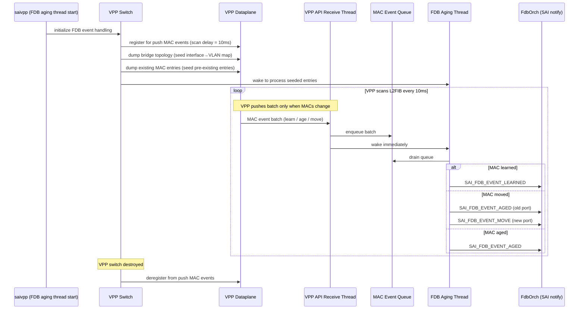

# SONiC VPP FDB Event Generation — HLD

## Table of Contents

- [Background](#background)
- [Requirement](#requirement)
- [Feature Description](#feature-description)
  - [SONiC Control Plane Flow](#sonic-control-plane-flow)
  - [SONiC Database Schema](#sonic-database-schema)
  - [VPP Dataplane Counterpart](#vpp-dataplane-counterpart)
- [Design](#design)
  - [Push-Based Event Flow](#push-based-event-flow)
  - [Port Resolution](#port-resolution)
  - [FDB Event Generation](#fdb-event-generation)
  - [FDB Flush](#fdb-flush)
- [Proposed Changes](#proposed-changes)
  - [VPP API Extensions](#vpp-api-extensions)
  - [SwitchStateBase.h Changes](#switchstatebaseh-changes)
  - [SaiFdbAging.cpp Changes](#saifdbagingcpp-changes)
  - [Files Changed](#files-changed)
- [Testing](#testing)
- [References](#references)

---

## Revisions

| Rev | Date | Author(s) | Changes |
|-----|------|-----------|---------|
| v0.1 | 06/08/2026 | Longxiang Lyu (lolv@microsoft.com) | Initial Draft |

---

## Background

The Forwarding Database (FDB) in SONiC stores dynamically-learned Layer-2 MAC address-to-port mappings. Orchagent programs static FDB entries via SAI and relies on the SAI implementation to notify it of dynamically-learned, aged, and moved MAC addresses via `SAI_SWITCH_ATTR_FDB_EVENT_NOTIFY` callbacks.

In the VPP-based virtual switch (`saivpp`), FDB programming was already partially implemented: flush operations and BVI interface management were supported. However, **FDB event generation** (LEARNED, AGED, MOVE) was not implemented — the aging callback was a no-op stub.

This document describes the design and implementation of FDB event generation in the VPP SAI virtual switch.

---

## Requirement

The VPP SAI virtual switch must implement FDB event generation with the following requirements:

| # | Requirement |
|---|-------------|
| REQ-1 | MAC addresses dynamically learned by VPP must be reported to SONiC orchagent via `SAI_FDB_EVENT_LEARNED` within **10 ms** of the hardware learn event. |
| REQ-2 | MAC addresses aged out by VPP must be reported via `SAI_FDB_EVENT_AGED` within **10 ms** of the age event. |
| REQ-3 | MAC addresses moved to a new port must be reported via `SAI_FDB_EVENT_MOVE` within **10 ms** of the move event. |
| REQ-4 | FDB flush operations must invalidate the local FDB snapshot so re-learned MACs trigger new `SAI_FDB_EVENT_LEARNED` notifications. |
| REQ-5 | The implementation must not block the VPP API receive thread; MAC events must be handed off via a thread-safe queue. |
| REQ-6 | On shutdown, the VPP MAC event callback must be deregistered before switch state is destroyed. |

---

## Feature Description

### SONiC Control Plane Flow

When a MAC is dynamically learned:

```
Hardware/VPP learns MAC
  → SAI fires SAI_FDB_EVENT_LEARNED notification
    → FdbOrch receives notification
      → Writes entry to STATE_DB FDB_TABLE
```

When a MAC ages out:

```
VPP ages out MAC
  → SAI fires SAI_FDB_EVENT_AGED notification
    → FdbOrch removes entry from STATE_DB FDB_TABLE
```

When a MAC moves to a new port:

```
Hardware/VPP detects MAC on new port
  → SAI fires SAI_FDB_EVENT_AGED notification (old port)
  → SAI fires SAI_FDB_EVENT_MOVE notification (new port)
    → FdbOrch updates entry in STATE_DB FDB_TABLE
```

The SAI implementation is responsible for detecting these events from the dataplane and calling `SAI_SWITCH_ATTR_FDB_EVENT_NOTIFY`.

---

### SONiC Database Schema

#### ASIC_DB

Key: `ASIC_STATE:SAI_OBJECT_TYPE_FDB_ENTRY:{"bvid":"<vlan_oid>","mac":"<mac>","switch_id":"<switch_oid>"}`

| Field | Example Value | Description |
|-------|---------------|-------------|
| `SAI_FDB_ENTRY_ATTR_TYPE` | `SAI_FDB_ENTRY_TYPE_DYNAMIC` | Entry type |
| `SAI_FDB_ENTRY_ATTR_BRIDGE_PORT_ID` | `oid:0x3a000000000633` | SAI bridge port OID |

Written by syncd when it receives a SAI FDB event notification.

#### STATE_DB

Key: `FDB_TABLE|Vlan<vlan_id>:<mac_address>`

| Field | Example Value | Description |
|-------|---------------|-------------|
| `port` | `Ethernet32` | Port name |
| `type` | `dynamic` | Entry type |

Written by FdbOrch on LEARNED/MOVE events. Deleted on AGED events.

---

### VPP Dataplane Counterpart

VPP's L2 forwarding database (`l2fib`) stores dynamically-learned MAC-to-interface mappings per bridge domain. VPP APIs relevant to FDB:

| VPP API | Purpose |
|---------|---------|
| `WANT_L2_MACS_EVENTS2` | Register for push MAC learn/age/move event batches |
| `L2FIB_SET_SCAN_DELAY` | Set VPP's internal L2FIB scan interval (units of 10 ms) |
| `BRIDGE_DOMAIN_DUMP` | Enumerate bridge domains and their interface memberships |
| `L2_FIB_TABLE_DUMP` | Dump existing dynamic MAC entries for a bridge domain |
| `L2FIB_FLUSH_ALL` | Flush all dynamic FDB entries |
| `L2FIB_FLUSH_BD` | Flush dynamic FDB entries for a bridge domain |
| `L2FIB_FLUSH_INT` | Flush dynamic FDB entries for an interface |

saivpp uses a **push-based approach**: it registers with VPP to receive batched MAC event notifications whenever MACs are learned, aged, or moved. This delivers events within ~10 ms of the VPP dataplane event with zero CPU cost when the FDB is stable.

---

## Design

### Push-Based Event Flow

saivpp uses VPP's push MAC event API to receive notifications within ~10 ms of the dataplane event. The design uses a two-thread handoff to avoid blocking the VPP API receive thread:



---

### Port Resolution

Since VPP's MAC events carry a VPP interface index rather than a SONiC port name, saivpp resolves the port in three steps:

1. VPP interface index → VPP hardware interface name (e.g. `bobm0`)
2. VPP interface name → Linux tap / SONiC port name (e.g. `Ethernet4`)
3. SONiC port name → SAI port OID

If any step fails (e.g. BVI or tunnel interfaces have no tap counterpart), the event is silently skipped.

---

### FDB Event Generation

For each drained MAC event the aging thread:

- **LEARNED**: creates a new SAI FDB entry and fires `SAI_FDB_EVENT_LEARNED`.
- **MOVE**: fires `SAI_FDB_EVENT_AGED` for the old port first, then updates the SAI FDB entry and fires `SAI_FDB_EVENT_MOVE`. AGED is always sent before MOVE so consumers see a clean remove-then-add.
- **AGED**: removes the SAI FDB entry and fires `SAI_FDB_EVENT_AGED`.

A local FDB snapshot is maintained to deduplicate redundant LEARNED events and detect port changes for MOVE.

---

### FDB Flush

When a flush is requested, saivpp:

1. Issues the appropriate VPP L2FIB flush call.
2. Clears the corresponding subset of the local FDB snapshot so that re-learned MACs generate new LEARNED notifications.

| Flush scope | VPP call | Snapshot action |
|-------------|----------|-----------------|
| All | `L2FIB_FLUSH_ALL` | Clear entire snapshot |
| By bridge domain | `L2FIB_FLUSH_BD` | Clear entries for that VLAN |
| By interface | `L2FIB_FLUSH_INT` | Clear entries for that port |

---

## Proposed Changes

### VPP API Extensions

The following new VPP API wrappers are added:

| Function | Purpose |
|----------|---------|
| Register for push MAC events | Receive batched MAC learn/age/move notifications from VPP. Each batch carries up to 100 MAC entries. |
| Set L2FIB scan delay | Configure VPP to scan its L2FIB every 10 ms, minimising notification latency. |
| Dump bridge topology | Enumerate all bridge domain members to build the interface→VLAN mapping on startup. |
| Dump existing MAC entries | Retrieve pre-existing dynamic MAC entries after registration to avoid missed events. |

The existing bridge domain details handler is updated to support the new dump context while preserving backward compatibility.

---

### `SwitchStateBase.h` Changes

- `findBridgeVlanForPortVlan()` is moved from `private` to `protected` so `SwitchVpp` can call it during FDB event generation.
- `initFdbEventHandling()` and `deinitFdbEventHandling()` are added as virtual no-ops. `SwitchVpp` overrides them to register/deregister VPP MAC events and seed the FDB snapshot.

---

### `SaiFdbAging.cpp` Changes

A wake event is added to the FDB aging thread's select loop. When VPP pushes a MAC event batch, the event handler notifies this wake event so the aging thread processes events immediately instead of waiting for the next polling tick.

---

### Files Changed

| File | Change |
|------|--------|
| `vslib/vpp/SwitchVpp.h` / `SwitchVpp.cpp` | Register for push MAC events on init; seed interface→VLAN map and pre-existing FDB entries; deregister on teardown; drain event queue in aging callback |
| `vslib/vpp/SwitchVppFdb.cpp` | FDB learned/move/aged event generation; flush snapshot invalidation; bridge member tracking |
| `vslib/SwitchStateBase.h` | Add `initFdbEventHandling()` / `deinitFdbEventHandling()` virtual methods; expose bridge VLAN lookup to subclass |
| `vslib/SaiFdbAging.cpp` | Add immediate wake event to FDB aging thread select loop |
| `vslib/VirtualSwitchSaiInterface.h` / `VirtualSwitchSaiInterfaceFdb.cpp` | Forward `initFdbEventHandling()` / `deinitFdbEventHandling()` to all switch instances |
| `vslib/vpp/vppxlate/SaiVppXlate.c` / `SaiVppXlate.h` | Add VPP MAC event handler and new VPP API wrapper functions |

---

## Testing

The implementation is validated by `tests/fdb/test_fdb.py` in `sonic-mgmt` on a `vms-kvm-vpp-t0` topology:

| Test case | Description |
|-----------|-------------|
| `test_fdb[ethernet]` | Send Ethernet frames with unique src MACs; verify entries appear in `show mac` and forwarding works |
| `test_fdb[arp_request]` | Same using ARP request frames |
| `test_fdb[arp_reply]` | Same using ARP reply frames |
| `test_fdb[cleanup]` | Final FDB flush and cleanup verification |

All four variants pass with 0 ERR syslog entries. A 10-iteration soak run (40 total test invocations) also passed with 0 failures.

---

## References

- VPP L2 FIB API: `vpp/src/vnet/l2/l2_fib.api`
- VPP L2 MAC events API: `vpp/src/vnet/l2/l2.api` (`want_l2_macs_events2`, `l2_macs_event`)
- VPP Bridge Domain API: `vpp/src/vnet/l2/l2_bd.api`
- SAI FDB attributes: `SAI/inc/saifdb.h`
- SAI switch FDB notification: `SAI/inc/saiswitch.h` (`SAI_SWITCH_ATTR_FDB_EVENT_NOTIFY`)
- sonic-mgmt FDB tests: `tests/fdb/test_fdb.py`
