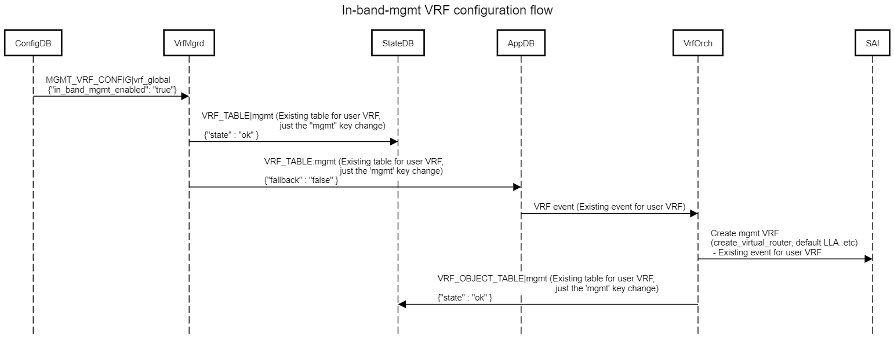

# Introduction

The scope of this document is to provide the requirements and a high-level design proposal for in-band management via mgmt VRF.

# Requirements

The following are the high level requirements for the in-band management via mgmt VRF.

1. Bind/Unbind L3 interface (e.g Phy/Port-channel/VLAN..etc) into mgmt VRF
2. Create/Delete mgmt VRF in HW to trap in-band management traffic to CPU
3. Add/Delete IP configured on the L3 interface into HW for ip2Me action even if the L3 interface is part of mgmt VRF.

# Design Proposal

The design is intended to have a generic approach for in-band management via mgmt VRF feature. A user can set an attribute "in_band_mgmt_enabled" to the config_db for MGMT_VRF_CONFIG table entry. The default value if not specified would be "false"

The schema change for in-band management is as below:

```
MGMT_VRF_CONFIG|vrf_global
    "mgmtVrfEnabled" : "true"
    "in_band_mgmt_enabled": "true"

```
```
; Defines management VRF table schema

key                   = MGMT_VRF_CONFIG|vrf_global         ; Same as existing
; field
mgmtVrfEnabled        = "true"/"false"              ; Same as existing
in_band_mgmt_enabled  = "true" / "false" ; Default "false" (Optional attribute), this field is active only when mgmtVrfEnabled is set to true.

```
```
key                  = VLAN_INTERFACE|{{intf_name}} ; Any L3 interface table entry e.g INTERFACE, PORTCHANNEL_INTERFACE..etc.
; field
"vrf_name"           = "mgmt" ; Existing field but accepts mgmt VRF name

```
# Flows

The following diagrams capture the kernel and SAI configuration flows.

## Mgmt VRF configuration flow



## L3 inteface to mgmt VRF bind flow


# Additional Notes
1. The user has to decide whether eth0 and L3 interface (e.g mgmt VLAN) can co-exist in the mgmt VRF, if yes, the corresponding configurations have to be taken care.
2. The user has to take care of configuring ACL to provide higher priority to mgmt traffic trapped from mgmt VRF, to avoid any potential drop in the NPU because of the data traffic.
3. User has to decide whether to use same data port for data & mgmt traffic or only for mgmt traffic based on the use-case.
4. The user has to make sure STP configurations are done such a way no impact to mgmt traffic via mgmt VLAN.
