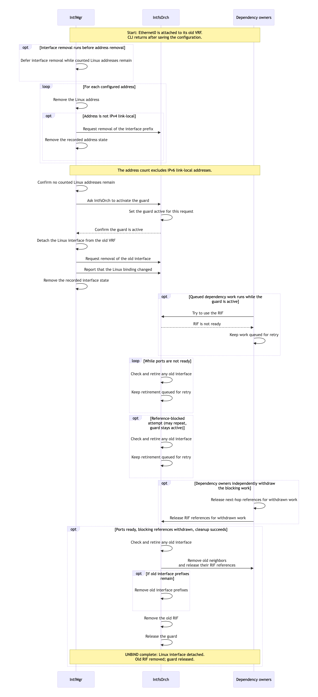
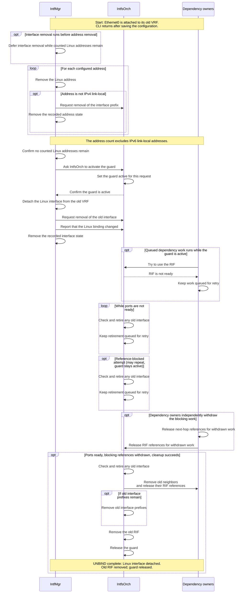
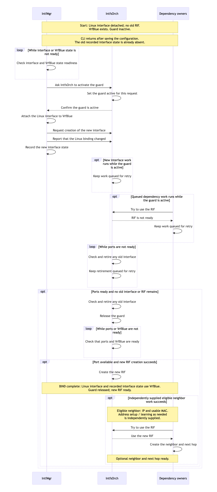
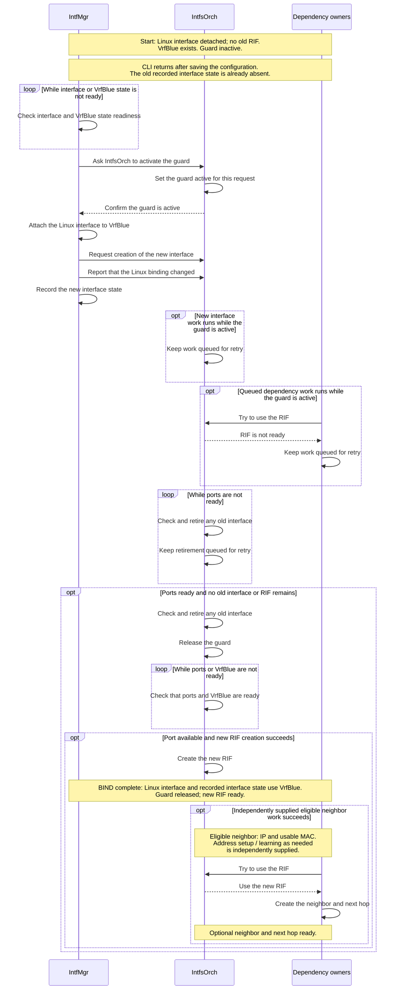
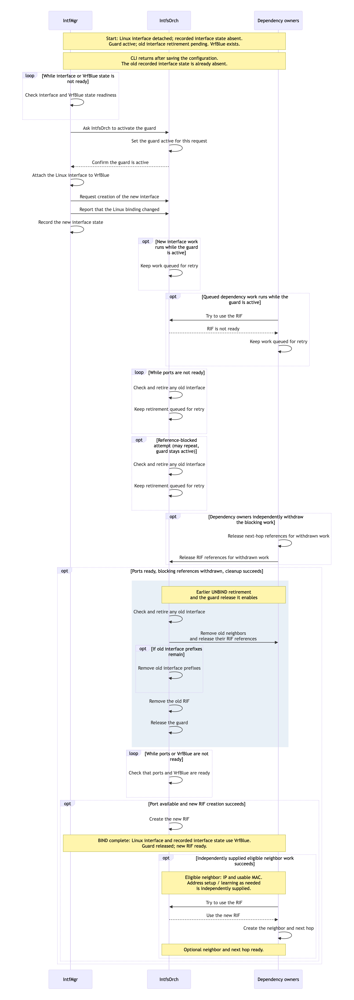
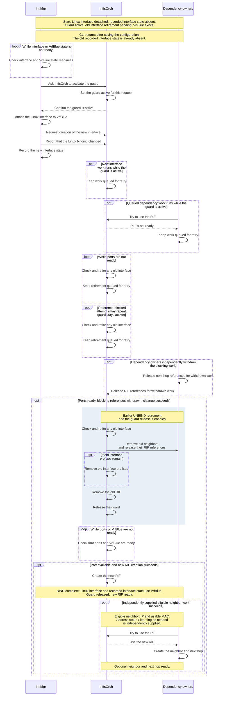

# SONiC VRF bind guard

## Revision history

| Rev | Date       | Author     | Change Description |
| --- | ---------- | ---------- | ------------------ |
| 0.1 | 2026-09-28 | Bojun-Feng | Initial draft. Describes the VRF bind guard and interface retirement approach. |

## Purpose

A Linux interface can enter a new virtual routing and forwarding instance (VRF) while orchagent still owns the old router interface (RIF). New route or neighbor work can then use the old RIF and add references that prevent its removal.

The guard separates the Linux binding change from RIF readiness. IntfMgr waits for IntfsOrch to confirm the guard is active before changing the Linux binding. While IntfsOrch retires the old interface, IntfsOrch keeps new interface work queued and dependency owners keep dependency work queued. After retirement, IntfsOrch releases the guard so ordinary processing can create the new RIF and use it for current desired work.

The design preserves the existing CLI and CONFIG_DB API. UNBIND and BIND remain separate operations, and UNBIND can finish without a later BIND. The guard is keyed by interface alias; steady-state route leaking continues to use the existing route and next-hop model.

## Ownership and completion

The Linux interface, recorded interface state, and RIF describe different parts of the lifecycle:

- **Linux interface**: the device whose VRF attachment IntfMgr changes with `master` or `nomaster`.
- **Recorded interface state**: IntfMgr's interface-level STATE_DB entry, including its `vrf` field. Address entries have separate recorded address state.
- **Interface prefixes**: address entries processed through APP_DB and tracked by IntfsOrch. An interface-level entry is distinct from its interface prefixes.
- **Old RIF / new RIF**: the orchagent objects for the old and new interface lifecycles.

| Owner | Responsibility |
| --- | --- |
| IntfMgr | Change the Linux binding, publish interface work to APP_DB, and update recorded interface state. |
| IntfsOrch | Maintain the guard, retire the old interface, and create the new RIF. |
| Dependency owners | RouteOrch, NeighOrch, and next-hop-group owners retain their object references and retry responsibilities. NeighOrch removes old neighbors during retirement. |

CLI return, recorded interface state, and RIF readiness are separate completion points. The charts' “CLI returns after saving the configuration” means CONFIG_DB updates have completed. IntfMgr updates recorded interface state without waiting for old RIF removal. The charts' “UNBIND complete” and “BIND complete” mark the later lifecycle endpoints shown, not the CLI return point.

“Old RIF removed”, “new RIF ready”, and the optional neighbor and next hop readiness describe orchagent object state after successful Switch Abstraction Interface (SAI)/API handling. Forwarding is a separate validation concern.

## Guard and retirement

The guard establishes two ordering rules: confirmation that the guard is active precedes the Linux binding change, and old interface retirement precedes new RIF creation. Confirmation means a matching acknowledgment in state `guarded` or `retired`; it does not require retirement to have finished.

While the guard is active, IntfsOrch keeps interface-level and interface-prefix SETs queued. Dependency owners check the guard before creating or reusing objects, including cached neighbors, next hops, and next-hop groups. In chart terms, “Try to use the RIF” yields “RIF is not ready”, so the caller must “Keep work queued for retry”. The guard check is separate from `getRouterIntfsId()`, which remains an inventory lookup available to withdrawal paths. Guard-blocked work stays with its retry owner rather than entering hardware programming or successful bulk accounting.

“Check and retire any old interface” is IntfsOrch's retirement operation. It first checks that all ports are ready, including when no old interface or RIF remains. For an old interface, it asks NeighOrch to “Remove old neighbors and release their RIF references”, then performs “Remove old interface prefixes” for any that remain, applicable proxy-ARP cleanup, and “Remove the old RIF”. Existing reference accounting determines when these operations can finish. Dependency owners independently “Release next-hop references for withdrawn work” and “Release RIF references for withdrawn work”; the binding operation does not generate those withdrawals.

When a retirement attempt returns incomplete, IntfsOrch must “Keep retirement queued for retry”. The guard remains active until retirement completes and the current request permits “Release the guard”. Cleanup follows the existing owners and SAI error handling, including terminal errors.

## Lifecycle examples

The three intent charts illustrate Ethernet0 UNBIND and named-VRF BIND lifecycles. These are representative interleavings of asynchronous consumers. A published APP_DB operation is processed asynchronously, and independent consumers can run between the steps shown. Linux operations and object changes are shown on their successful paths; readiness and reference waits can repeat. Successful endpoints are conditional on readiness, resolution of blocking references, and successful cleanup or creation.

### UNBIND

For Ethernet0, `config interface vrf unbind` removes the interface configuration and configured addresses. IntfMgr processes address removal and defers interface removal while counted Linux addresses remain. The address count excludes IPv6 link-local addresses. For addresses other than IPv4 link-local, IntfMgr also performs “Request removal of the interface prefix” and “Remove the recorded address state”; IPv4 link-local address removal is local to Linux in this path. IntfsOrch may consume interface-prefix removal before the guard is active or during retirement.

After “Confirm no counted Linux addresses remain” and “Confirm the guard is active”, IntfMgr can “Detach the Linux interface from the old VRF”. It then performs “Request removal of the old interface”, “Report that the Linux binding changed”, and “Remove the recorded interface state”. Applicable link-local neighbor cleanup is checked before these final publications; a failure leaves interface removal pending. IntfsOrch completes retirement asynchronously, subject to port readiness, blocking references, and successful cleanup. UNBIND requires no future target VRF or BIND request.

[UNBIND intent — full-size PNG](vrf-bind-guard/lifecycles/render/01-unbind-intent.png) · [SVG](vrf-bind-guard/lifecycles/render/01-unbind-intent.svg) · [Editable Mermaid](vrf-bind-guard/lifecycles/source/01-unbind-intent.mmd)

Mermaid source

Sub-port UNBIND removes configured addresses and the old interface configuration, waits for old recorded interface state to disappear, then recreates the sub-port configuration without the VRF field in the default VRF. The old RIF must still retire before new RIF creation; sub-port recreation and its final configuration are outside the Ethernet0 UNBIND endpoint shown.

### Clean BIND

A clean BIND starts with the Linux interface detached, recorded interface state absent, no old RIF, and the guard inactive. VrfBlue is the target VRF in the example. Before saving the new interface configuration, `config interface vrf bind` removes configured addresses and the old interface configuration, then waits for old recorded interface state to disappear, not for old RIF removal. IntfMgr must “Check interface and VrfBlue state readiness” before “Ask IntfsOrch to activate the guard”. After confirmation, it can “Attach the Linux interface to VrfBlue”, “Request creation of the new interface”, “Report that the Linux binding changed”, and “Record the new interface state”.

The guard still requires the retirement check: all ports must be ready before IntfsOrch can establish that no old interface or RIF remains and release the guard. Ordinary interface processing then performs “Check that ports and VrfBlue are ready” and, with the port available and successful SAI/API handling, “Create the new RIF”. This is the BIND endpoint.

Independently supplied eligible neighbor work is an optional continuation. With a valid neighbor IP, a usable MAC, and successful processing, NeighOrch can “Use the new RIF” and “Create the neighbor and next hop”. Address configuration and neighbor learning are supplied independently as needed; BIND itself supplies neither replacement addresses nor a neighbor request.

[Clean BIND intent — full-size PNG](vrf-bind-guard/lifecycles/render/02-clean-bind-intent.png) · [SVG](vrf-bind-guard/lifecycles/render/02-clean-bind-intent.svg) · [Editable Mermaid](vrf-bind-guard/lifecycles/source/02-clean-bind-intent.mmd)

Mermaid source

### BIND while earlier UNBIND retirement is pending

Here the Linux interface is already detached and recorded interface state is absent, but the guard is active and old interface retirement is pending. A new BIND request transfers the active guard to the current request without a gap. Once IntfMgr has the matching confirmation, Linux attachment to VrfBlue and recorded interface state can advance while old interface retirement remains pending. It is new RIF creation and dependency work that wait for retirement.

The colored band groups “Earlier UNBIND retirement and the guard release it enables”: the successful retirement attempt, removal of old neighbors, remaining old interface prefixes, and the old RIF, followed by guard release. Readiness waits and independent withdrawals are prerequisites outside the band. The old objects belong to the earlier lifecycle; guard release uses the validated current request. After the band, new RIF creation and the optional neighbor work follow the same conditions as clean BIND.

[BIND while earlier UNBIND retirement is pending — intent, full-size PNG](vrf-bind-guard/lifecycles/render/03-bind-waits-for-unbind-intent.png) · [SVG](vrf-bind-guard/lifecycles/render/03-bind-waits-for-unbind-intent.svg) · [Editable Mermaid](vrf-bind-guard/lifecycles/source/03-bind-waits-for-unbind-intent.mmd)

Mermaid source

## Request protocol

The guard uses internal APP_DB and STATE_DB tables. IntfMgr retains one current request per interface alias and allocates a monotonically increasing `request_id` from that record. It persists the request before publishing an APP_DB notification. IntfsOrch validates the notification's ID and action against the retained request before processing it.

| Record | Writer and contents |
| --- | --- |
| APP_DB `INTF_GUARD_TABLE:<alias>` | IntfMgr publishes `id` and `action`: `prepare`, `applied`, or `cancel`. |
| STATE_DB `INTERFACE_GUARD_TABLE\|<alias>` | IntfMgr writes `request_id`, `action`, `target_vrf`, `kernel_pending`, and `applied_id`. IntfsOrch writes acknowledgment `id` and `state`, plus `retired_id` after retirement. |
| STATE_DB notification `INTF_GUARD_ACK` | IntfsOrch wakes IntfMgr after writing the acknowledgment. The retained record supplies the ID and state that IntfMgr checks. |

The actions connect the lifecycle operations to the retained request:

- **`prepare`** implements “Ask IntfsOrch to activate the guard”. IntfsOrch validates the request, performs “Set the guard active for this request”, and reports its state. IntfMgr proceeds only with a matching `guarded` or `retired` acknowledgment.
- **`applied`** implements “Report that the Linux binding changed”. IntfMgr publishes ordinary interface work and records `applied_id`. IntfsOrch then completes retirement and releases the guard for the current request.
- **`cancel`** ends a prepare that did not change the Linux binding. Any earlier applied request's unfinished retirement still has to complete before guard release.

Acknowledgment states distinguish progress: `guarded` means the guard is active; `retired` means old interface retirement has completed but the guard is still active; `released` means the guard is inactive. A replacement request transfers the active guard without allowing new work between requests. The terminal request record remains so stale APP_DB notifications cannot act on a new RIF.

`target_vrf` describes the operation currently being executed: VrfBlue in the BIND examples, or empty for `nomaster`. IntfMgr sets `kernel_pending` before a guarded Linux binding operation and clears it after updating recorded interface state. If processing is interrupted or replaced, this field keeps unfinished Linux binding work guarded. Retries of the same prepare retain the request ID.

## Retained work and recovery

Retirement is retained separately from the ordinary interface queue. If an interface DEL and a later SET coalesce, `applied_id` still records the retirement obligation. IntfsOrch compares it with `retired_id`, including when a newer prepare is canceled. Canceling that newer request therefore preserves the earlier retirement obligation.

NeighOrch similarly separates desired neighbor input from its hardware cache. After successful old neighbor removal, it requeues a previously consumed desired SET if no newer SET or DEL is already pending. Desired SETs that are still pending remain queued while the guard is active. After guard release and new RIF creation, ordinary retries process current desired work.

With retained database state, IntfsOrch reconstructs active requests and terminal records during startup, before dependency work can use a RIF. IntfMgr reconciles retained prepares and unfinished Linux binding work with configuration and recorded interface state. It resumes a retained removal before processing a replacement request for a different VRF, recovering applicable link-local neighbor cleanup from the old APP_DB interface entry; an orphan prepare with no removal obligation can be canceled. This recovery scope assumes the retained request state is available.

`INTF_GUARD_ACK` prompts pending manager work to retry. IntfMgr also retries on timeout and after other events, so a lost notification or continuous input does not make notification delivery the sole progress mechanism.

## Compatibility and validation

The guard applies to non-loopback interface-level removal from a named VRF, creation attached to a named VRF, and retained unfinished Linux binding work. Removing an already-default interface does not use the guard when no unfinished Linux binding work is retained. Loopback processing remains separate. Physical ports, VLAN interfaces, LAG interfaces, and sub-ports retain their existing manager and orchestrator readiness requirements. The Linux binding operation remains `master` or `nomaster`.

Validation should compare guarded behavior with the existing behavior and check each completion point separately:

- Exercise default-to-named, named-to-default, and named-to-named changes, independent UNBIND, cancellation, and overlapping BIND across the supported interface types and both address families, including addressless and link-local configurations.
- Verify matching guard confirmation before the Linux binding change, old RIF removal before new RIF creation, and guard-blocked work retained for retry. Cover direct routes, gateway routes, equal-cost multipath (ECMP), fine-grained ECMP, cached object reuse, and steady-state route leaking.
- Force DEL-to-SET coalescing, stale requests and acknowledgments, command and SAI failures, both desired neighbor replay schedules, and supported reload/restart interleavings with retained state.
- Inspect Linux, FRRouting (FRR), APP_DB, STATE_DB, ASIC_DB, object identity and reference counts, and forwarding separately. Check that recorded interface state retains its asynchronous completion contract and that unrelated interfaces continue to progress.
