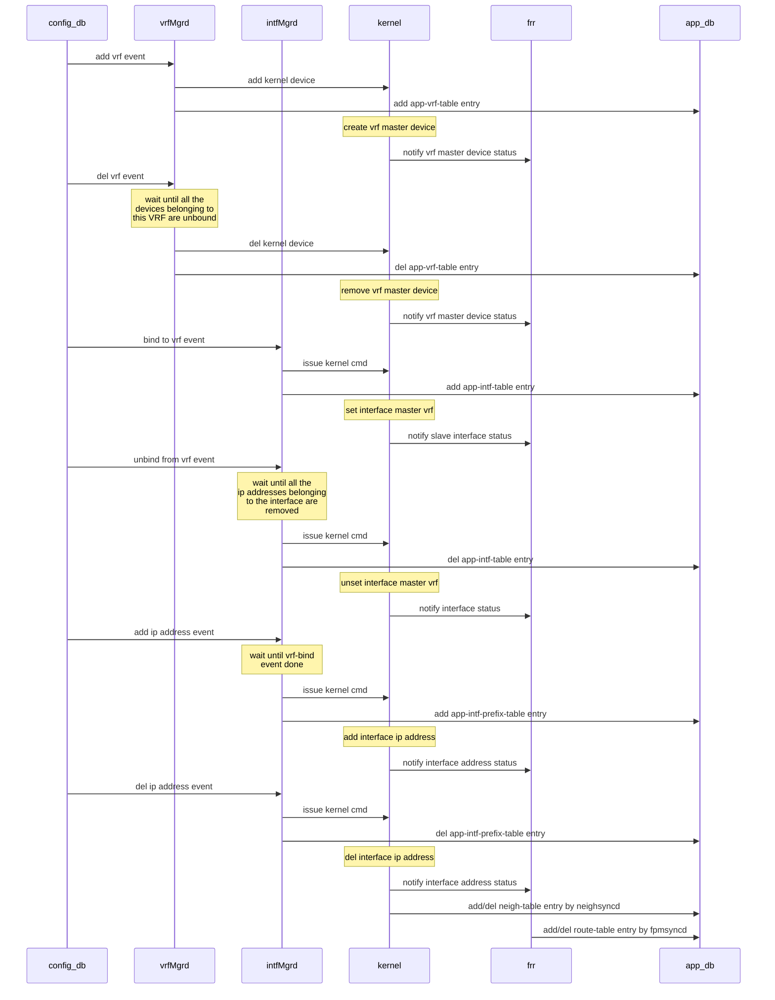
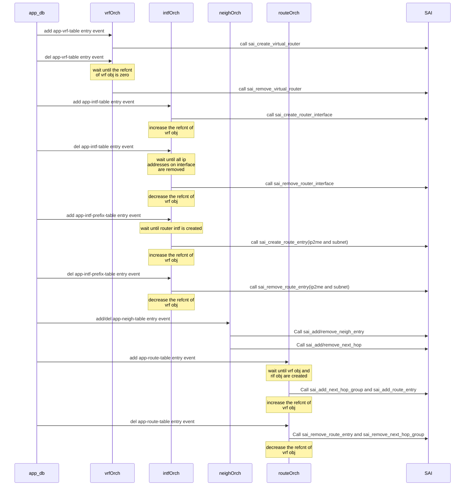

# SONiC VRF support design spec draft

Table of Contents
<!-- TOC -->

- [SONiC VRF support design spec draft](#SONiC-VRF-support-design-spec-draft)
  - [Document History](#Document-History)
  - [Abbreviations](#Abbreviations)
  - [VRF feature Requirement](#VRF-feature-Requirement)
  - [Functionality](#Functionality)
    - [Target Deployment Use Cases](#Target-Deployment-Use-Cases)
    - [Functional Description](#Functional-Description)
      - [VRF route leak support](#VRF-route-leak-support)
  - [Dependencies](#Dependencies)
  - [SONiC system diagram for VRF](#SONiC-system-diagram-for-VRF)
  - [The schema changes](#The-schema-changes)
    - [Add VRF related configuration in config_db.json](#Add-VRF-related-configuration-in-configdbjson)
      - [Add vrf-table in config_db](#Add-vrf-table-in-configdb)
      - [Add vrf-binding information in config_db.json file](#Add-vrf-binding-information-in-configdbjson-file)
      - [Add vrf information in the BGP configuration of config_db.json file](#Add-vrf-information-in-the-BGP-configuration-of-configdbjson-file)
      - [Add static route information in config_db.json file](#Add-static-route-information-in-configdbjson-file)
    - [Change redirect syntax in acl_rule_table of config_db.json](#Change-redirect-syntax-in-aclruletable-of-configdbjson)
    - [Add a VRF_TABLE in APP_DB](#Add-a-VRFTABLE-in-APPDB)
    - [Add 2-segment key entry support in APP-intf-table](#Add-2-segment-key-entry-support-in-APP-intf-table)
    - [Add VRF key to app-route-table key list](#Add-VRF-key-to-app-route-table-key-list)
  - [Event flow diagram](#Event-flow-diagram)
  - [Modules changes](#Modules-changes)
    - [Frr template changes](#Frr-template-changes)
    - [loopback interface consideration](#loopback-interface-consideration)
    - [vrfmgrd changes](#vrfmgrd-changes)
    - [intfsmgrd changes](#intfsmgrd-changes)
    - [nbrmgrd changes](#nbrmgrd-changes)
    - [fpmsyncd changes](#fpmsyncd-changes)
    - [vrforch changes](#vrforch-changes)
    - [intfsorch changes](#intfsorch-changes)
    - [routeorch changes](#routeorch-changes)
    - [neighorch changes](#neighorch-changes)
    - [aclorch changes](#aclorch-changes)
    - [warm-reboot consideration](#warm-reboot-consideration)
    - [TODO](#TODO)
  - [CLI](#CLI)
  - [Other Linux utilities](#Other-Linux-utilities)
  - [User scenarios](#User-scenarios)
    - [Configure ip address without vrf feature](#Configure-ip-address-without-vrf-feature)
    - [Add VRF and bind/unbind interfaces to this VRF](#Add-VRF-and-bindunbind-interfaces-to-this-VRF)
    - [Delete vrf](#Delete-vrf)
    - [Create a Loopback interface and bind it to a VRF](#Create-a-Loopback-interface-and-bind-it-to-a-VRF)
    - [Add IP address on Loopback interface](#Add-IP-address-on-Loopback-interface)
    - [Delete Loopback interface](#Delete-Loopback-interface)
    - [Static leak route configuration](#Static-leak-route-configuration)
  - [Impact to other service after import VRF feature](#Impact-to-other-service-after-import-VRF-feature)
  - [Test plan](#Test-plan)
  - [Appendix - An alternative proposal](#Appendix---An-alternative-proposal)
    - [vrf as the part of key](#vrf-as-the-part-of-key)
    - [intfsmgrd changes](#intfsmgrd-changes-1)
    - [intfsorch changes](#intfsorch-changes-1)

<!-- /TOC -->

## Document History

| Version | Date       | Author       | Description                                      |
|---------|------------|--------------|--------------------------------------------------|
| v.01    | 06/07/2018 | Shine Chen, Andrew Xu  | Initial version from Nephos                      |
| v.02    | 06/08/2018 | Shine Chen       | Revised per Guohan/Prince(MSFT)           |
| v.03    | 09/18/2018 | Guohan Lu (MSFT)      | Format document                                  |
| v.04    | 01/17/2019 | Shine Chen, Jeffrey Zeng| Update after Sonic community review              |
| v.05    | 04/17/2019 | Xin Liu, Prince Sunny (MSFT)  | Update the status                                |
| v.06    | 05/09/2019 | Shine Chen, Jeffrey Zeng, Tyler Li | Add Some description and format adjustment |
| v1.0    | 05/26/2019 | Shine Chen, Jeffrey Zeng, Tyler Li, Ryan Guo | After review, move proposal-2 in v0.6 to Appendix
| v1.1    | 06/04/2019 | Preetham Singh, Nikhil Kelapure, Utpal Kant Pintoo | Update on VRF Leak feature support |
| v1.2    | 07/21/2019 | Preetham Singh, Shine Chen | Update on loopback device/frr template for vrf and static route support |

## Abbreviations

| **Term** | **Definition**                                                                                                                                  |
|----------|-------------------------------------------------------------------------------------------------------------------------------------------------|
| VRF      | Virtual routing forwarding                                                                                                                      |
| FRR      | FRRouting is an IP routing protocol suite for Linux and Unix platforms which includes protocol daemons for BGP, IS-IS, LDP, OSPF, PIM, and RIP  |
| Quagga   | Open IP routing protocol suite                                                                                                                  |
| RIB      | Routing Information Base                                                                                                                        |
| PBR      | Policy based routing         |

## VRF feature Requirement

1. Add or Delete VRF instance
2. Bind L3 interface to a VRF.

    L3 interface includes port interface, vlan interface, LAG interface and loopback interface.
3. Static IP route with VRF
4. Enable BGP VRF aware in SONiC
5. Fallback lookup.

    The fallback feature which defined by RFC4364 is very useful for specified VRF user to access internet through global/main route. Some enterprise users still use this to access internet on vpn environment.

6. VRF route leaking between VRFs.
7. VRF Scalability: Currently VRF number can be supported up to 1000 after fixing a bug in FRR.
8. loopback devices with vrf.
   - Add/delete Loopback interfaces per VRF
   - Support to add IPv4 and IPv6 host address on these loopback interfaces
   - Support to use these loopback interfaces as source for various routing protocol control packet transmission. For instance in case of BGP multihop sessions source IP of the BGP packet will be outgoing interface IP which can change based on the interface status bringing down BGP session though there is alternate path to reach BGP neighbor. In case loopback interface is used as source BGP session would not flap.
   - These loopback interface IP address can be utilized for router-id generation on the VRF which could be utilized by routing protocols.
   - Support to use these interfaces as tunnel end points if required in future.
   - Support to use these interfaces as source for IP Unnumbered interface if required in future.

In this release, requirement 5) is not supported. See next section for details.

Note: linux kernel use VRF master device to support VRF and it supports admin up/down on VRF master device. But we don't plan to support VRF level up/down state on SONIC.

## Functionality

### Target Deployment Use Cases

Virtual Routing and Forwarding is used to achieve network virtualization and traffic separation over on a shared network infrastructure in Enterprise and DC delpoyments.


__Figure 1: Multi VRF Deployment use case__

In above customer deployment:
Customer A and Customer B in Site 1 or Site 2 are customer facing devices referred as Customer Edge routers.
Router-1 and Router-2 are routers which provide interconnectivity between customers across sites referred as Provider Edge Routers.

Above figure depicts typical customer deployment where multiple Customer facing devices are connected to Provider edge routers.
With such deployment Provider Edge routers associate each input interface with one VRF instance.

In Figure 1, All cutomer facing devices belonging to Customer-A irrespective of the site, will belong to VRF Green and those in Customer-B will belong to VRF Red.
With this deployment, isolation of traffic is achieved across customers maintaining connectivity within same customer sites.

Note that multiple input interfaces can be associated to a VRF instance. This input interface can be Physical interface, Port-channel or L3 Vlan interface.

### Functional Description

Multi-VRF is the ability to maintain multiple "Virtual Routing and Forwarding"(VRF) tables on the same Provider Edge router.
Multi-VRF aware routing protocol such as BGP is used to exchange routing information among peer Provider Edge routers.
The Multi-VRF capable Provider Edge router maps an input customer interface to a unique VRF instance. Provider Edge router maintains unique VRF table for each VRF instance on that Provider Edge router.

Multi-VRF routers communicate with one another by exchanging route information in the VRF table with the neighboring Provider Edge router.
This exchange of information among the Provider Edge routers is done using routing protocol like BGP.
Customers connect to Provider Edge routers in the network using Customer Edge routers as shown in Figure 1.

Due to this overlapping address spaces can be maintained among the different VRF instances.

FRR's BGP implementation is capable of running multiple autonomous systems (AS) at once. Each configured AS is associated with a VRF instance. The  SONiC VRF implementation will enable this capability of FRR BGP in SONiC.

#### VRF route leak support

Generally VRF route leak is a case where route and nexthops are in different VRF. VRF route leak for directly connected destinations in another VRF is also supported.

VRF route leak can be achieved via both Static or Dynamic approach.

In Static VRF route leak, FRR CLI can be used where user can specify nexthop IP along with nexthop VRF, where the nexthop IP is reachable through a nexthop VRF.

In Dynamic VRF route leak, Route maps can be used to import routes from other VRFs.
Prefix lists within route maps are used to match route prefixes in source VRF and various action can be applied on these matching prefixes.
If route map action is permit, these routes will be installed into destination VRF.

Leaked routes will be automatically deleted when corresponding routes are deleted in source VRF.

## Dependencies

VRF feature needs the following software package/upgrade

1. Linux kernel 4.9

    Linux Kernel 4.9 support generic IP VRF with L3 master net device. Every L3 master net device has its own FIB. The name of the master device is the VRF's name. Real network interface can join the VRF by becoming the slave of the master net device.

    Application can get creation or deletion event of VRF master device via RTNETLINK, as well as information about slave net device joining a VRF.

    Linux kernel supports VRF forwarding using PBR scheme. All route lookups will be performed on main routing table associated with the VRF. VRF also can have its own default network instruction in case route lookup fails.

2. FRRouting is needed to support BGP VRF aware routing.

3. IProute2 version should be ss161212 or later to support iproute2 CLIs to configure the switch.

Example of using iproute2:

```bash
setup VRF | name: vrf-blue fib-table-id: 10
$ ip link add name vrf-blue type vrf table 10

enable VRF
$ ip link set dev vrf-blue up

disable fallback lookup on vrf-blue
$ ip [-6] route add table 10 unreachable default

bind sw1p3 device to vrf-blue
$ ip link set dev sw1p3 master vrf-blue

descend local table pref
ip [-6] rule add pref 32765 table local && ip [-6] rule del pref 0
```

4. SAI VRF support

SAI right now does not seem to have VRF concept, it does have VR.

Hence in this implementation release we use VR object as VRF object.

Here are the new flags we propose to add in the SAI interface:

```json
/*
 * @brief if it is global vrf
 *
 * @type bool
 * @flags CREATE_AND_SET
 * @default true
 */
 SAI_VIRTUAL_ROUTER_ATTR_GLOBAL

/*
 * @brief continue to do global fib lookup while current vrf fib lookup
 *  missed
 *
 * @type bool
 * @flags CREATE_AND_SET
 * @default false
 */
 SAI_VIRTUAL_ROUTER_ATTR_FALLBACK
```

## SONiC system diagram for VRF

The following is high level diagram of modules with VRF support.


## The schema changes

### Add VRF related configuration in config_db.json

Note "fallback" keyword is not supported in this release.

#### Add vrf-table in config_db

```json
"VRF": {
    "Vrf-blue": {
        "fallback":"true" //enable global fib lookup while vrf fib lookup missed
    },
    "Vrf-red":{
        "fallback": "true"
    },
    "Vrf-yellow":{
        "fallback":"false" //disable global fib lookup while vrf fib lookup missed
    }
},

```

#### Add vrf-binding information in config_db.json file

```json

"INTERFACE":{
    "Ethernet0":{
        "vrf_name":"Vrf-blue"  // vrf_name must start with "Vrf" prefix
    },
    "Ethernet1":{
        "vrf_name":"Vrf-red"
    },
    "Ethernet2":{}, // it means this interface belongs to global vrf. It is necessary even user doesnt use vrf.
    "Ethernet0|11.11.11.1/24": {},
    "Ethernet0|12.12.12.1/24": {},
    "Ethernet1|12.12.12.1/24": {},
    "Ethernet2|13.13.13.1/24": {}
},

"LOOPBACK_INTERFACE":{
    "Loopback0":{
        "vrf_name":"Vrf-yellow"
    },
    "Loopback0|14.14.14.1/32":{}
},

"VLAN_INTERFACE": {
    "Vlan100":{
        "vrf_name":"Vrf-blue"
    },
    "Vlan100|15.15.15.1/24": {}
},

"PORTCHANNEL_INTERFACE":{
    "Portchannel0":{
        "vrf_name":"Vrf-yellow"
    },
    "Portchannel0|16.16.16.1/24":{}
}

```

With this approach, there is no redundant vrf info configured with an interface where multiple IP addresses are configured.

Logically IP address configuration must be processed after interface binding to vrf is processed. In intfmgrd/intfOrch process intf-bind-vrf event must be handled before IP address event. So interface-name entry in config_db.json is necessary even though user doesn't use VRF feature. e.g. `"Ethernet2":{}` in the above example configuration. For version upgrade compatibility we need to add a script, this script will convert old config_db.json to new config_db.json at bootup automatically, then the new config_db.json would contain the interface-name entry for interfaces associated in the global VRF table.

#### Add vrf information in the BGP configuration of config_db.json file

```json

"BGP_NEIGHBOR": {
    "Vrf-blue|10.0.0.49": {   // This neighbour belongs to Vrf-blue
        "name": "ARISTA09T0",
        "rrclient": "0",
        "local_addr": "10.0.0.48",
        "asn": "64009",
        "nhopself": "0"
    }
}

"BGP_PEER_RANGE": {
    "BGPSLBPassive": {        // This BGP_PEER_Group belong to Vrf-blue
        "name": "BGPSLBPassive",
        "vrf_name": "Vrf-blue",
        "src_address":"10.1.1.2",
        "ip_range": [
            "192.168.8.0/27"
        ]
    }
}

```

#### Add static route information in config_db.json file

```json

"STATIC_ROUTE": {
    "11.11.11.0/24": {
        "distance": "10",
        "nexthop": "1.1.1.1"
    },

    "Vrf-blue|22.11.11.0/24": {
        "distance": "10",
        "nexthop-vrf": "Vrf-red",
        "nexthop": "2.1.1.1"
    },

    "Vrf-red|11.11.11.0/24": {
        "nexthop": "1.1.1.1"
    }
}

```

### Change redirect syntax in acl_rule_table of config_db.json

The existing acl_rule_table definition is the following.

```json

"table1|rule1": {
    "L4_SRC_PORT": "99",
    "PACKET_ACTION": "REDIRECT:20.1.1.93,30.1.1.93"
},
"table1|rule2": {
    "L4_SRC_PORT": "100",
    "PACKET_ACTION": "REDIRECT:20.1.1.93"
},

```

To support vrf the nexthop key should change to `{IP,interface}` pair from single `{IP}`. For backward compatibilty nexthop key `{IP}` is also supported, it only works on global vrf. So new acl_rule_table should like the following. 

```json

"table1|rule1": {
    "L4_SRC_PORT": "99",
    "PACKET_ACTION": "REDIRECT:20.1.1.93|Ethernet10,30.1.1.93"
},
"table1|rule2": {
    "L4_SRC_PORT": "100",
    "PACKET_ACTION": "REDIRECT:20.1.1.93|Ethernet11, 30.1.1.93"
},

```

### Add a VRF_TABLE in APP_DB

```json
;defines virtual routing forward table
;
;Status: stable

key = VRF_TABLE:vrf_name ;
fallback = "true"/"false"
```

### Add 2-segment key entry support in APP-intf-table

There are two reasons why adding 2-segment key entry in interface table.

1. Multiple ip addresses can be configured on one interface. So we put common attribute of interface into app-intf-table and keep ip-prefix specific attribute on app-intf-prefix-table.
2. Interface can be put to specific VRF before ip address is configured on it.

app-intf-table is defined as the following:

```json
;defines logical network interfaces, an attachment to a PORT name
;
;Status: stable

key = INTF_TABLE:ifname
mtu = 1\*4DIGIT ; MTU for the interface
VRF_NAME = 1\*15VCHAR ;
```

app-intf-prefix-table is defined as the following corresponding to config_db definition.

```json
;defines logical network interfaces with IP-prefix, an attachment to a PORT and
list of 0 or more ip prefixes;

;Status: stable
key = INTF_TABLE:ifname:IPprefix ; an instance of this key will be repeated for each prefix
IPprefix = IPv4prefix / IPv6prefix ; an instance of this key/value pair will be repeated for each prefix
scope = "global" / "local" ; local is an interface visible on this localhost only
mtu = 1\*4DIGIT ; MTU for the interface  (move to INTF_TABLE:ifname table)
family = "IPv4" / "IPv6" ; address family
```

### Add VRF key to app-route-table key list

```json
;Stores a list of routes
;Status: Mandatory

key = ROUTE_TABLE:vrf_name:prefix ;
nexthop = \*prefix, ;IP addresses separated "," (empty indicates no gateway)
intf = ifindex? PORT_TABLE.key ; zero or more separated by "," (zero indicates no interface)
blackhole = BIT ; Set to 1 if this route is a blackhole (or null0)
```

Since global vrf name is null character string, the route key with global vrf will collapse to `ROUTE_TABLE:prefix`.
The non-global vrf_name must start with "Vrf" prefix. So it can differ from ipv6 address.

## Event flow diagram







## Modules changes

### Frr template changes

- FRR template must enhance to contain VRF related configuration and static route configuration.
- On startup `sonic-cfggen` will use `frr.conf.j2` to generate `frr.conf` file.

The generated frr.conf with vrf and static route feature is like the following:

```json

## static route configuration
!
ip route 11.11.11.0/24 1.1.1.1 10
!
vrf Vrf-red
## static leak route
  ip route 11.11.11.0/24 Vrf-blue 1.1.1.1
!
## bgp configuration with VRF
router bgp 64015 vrf Vrf-red
  bgp router-id 4.4.4.4
  network 4.4.4.4/32
  neighbor 10.0.0.49 remote-as 64009
  neighbor 10.0.0.49 description ARISTA09T0
  address-family ipv4
    neighbor 10.0.0.49 activate
    neighbor 10.0.0.49 soft-reconfiguration inbound
    maximum-paths 64
  exit-address-family
  neighbor PeerGroup peer-group
  neighbor PeerGroup passive
  neighbor PeerGroup remote-as 65432
  neighbor PeerGroup ebgp-multihop 255
  neighbor PeerGroup update-source 2.2.2.2
  bgp listen range 192.168.0.0/27 peer-group PeerGroup
  address-family ipv4
    neighbor PeerGroup activate
    neighbor PeerGroup soft-reconfiguration inbound
    neighbor PeerGroup route-map FROM_BGP_SPEAKER_V4 in
    neighbor PeerGroup route-map TO_BGP_SPEAKER_V4 out
    maximum-paths 64
  exit-address-family
!
router bgp 64015
  bgp router-id 3.3.3.3
.....
!
!
```

### loopback interface consideration

- Sonic must support multiple loopback interfaces and each loopback interface can belong to different vrf. Because linux kernel can only support one lo interface. We will use dummy interface instead of lo interface in linux kernel.

- The following is the example to configure new loopback interface by using dummy interface

    ```bash
    ip link add loopback1 type dummy
    ip link set loopback1 up
    ip link set dev loopback1 master Vrf_blue
    ip address add 10.0.2.2/32 dev loopback1
    ```

- In the existing implementation interface-config.service takes care of loopback configuration. IntfMgrd will take interface-config.service instead to handle it.

### vrfmgrd changes

- Listening to VRF creation/deletion configuration in config_db. Once detected,
update kernel using iproute2 CLIs and write VRF information to app-VRF-table.
- When vrfmgrd receives VRF delete event it wont process the event till all the devices belonging to this VRF are unbound from the VRF. Slave device information can be retrieved from kernel.
- vrfmgrd process will be placed in swss docker. In case of swss docker warm reboot, since VRF device is still retained in kernel, when vrfmgrd starts up it will recover the VRF system state from kernel.

### intfsmgrd changes

IP address event and VRF binding event need to be handled seperately. These two events has sequence dependency.

- Listening to interface binding to specific VRF configuration in config_db.
  - bind to VRF event:
    - bind kernel device to master VRF
    - add interface entry with VRF attribute to app-intf-table.
    - set intf-bind-vrf flag on STATE_DB
  - unbind from VRF event:
    - wait until all ip addresses associated with the interface is removed. Ip address infomation can be retrieved from kernel.
    - bind kernel device to global VRF
    - del interface entry with VRF attribute from app-intf-table
    - unset vrf-binding flag on STATE_DB
- Listening to interface ip address configuration in config_db.
  - add ip address event:
    - wait until intf-bind-vrf flag is set, set ip address on kernel device and add {interface_name:ip address} entry to app-intf-prefix-table
  - del ip address event:
    - unset ip address on kernel device
    - del {interface_name:ip address} entry from app-intf-prefix-table.

An ideal approach is to handle the two events similar to what Linux kernel is doing. e.g. if the IP address is configured in an interface first, it will be accepted. Later on when the interface is enslaved to a VRF, the IP address from the master FIB will be removed, and reprogrammed to the VRF table. But this approach is very complicated to support. e.g. it may have IP address conflict in the destination VRF, and the current SONiC infrastructure cannot detect and protect it. So this approach is not supported in this VRF release.

### nbrmgrd changes

- Listening to neighhor configuration on configdb, add neighbor entry to kernel only after the corresponding intf-bind-vrf event is processed. In the current implementation neighbor may be added to kernel before intf-bind-vrf event. After intf-bind-vrf event kernel will flush all neighbors associated with this interface, the neighbor configuration get lost.

### fpmsyncd changes

- fpmsyncd will add VRF support, it can use rtnl_route_get_table to get VRF table ID.
But with the current FRR implementation, this API returns the master devices' ifIndex for
this VRF. The VRF name of Prefix can be derived from ifindex.
- The key of app-route-table is "vrf_name:prefix".
- The route from FRR has nexthop information which contain nexthop_ipaddress and interface index. Nexthop interface contain vrf information. It is available for route-leak scenarios.

### vrforch changes

- Monitoring app-VRF-table, using sai_create_virtual_router_fn or
sai_remove_virtual_router_fn defined in saivirtualrouter.h to track (VR, VRF) creation/deletion and save (vrf_name, vrf-vid) pairs.
- When vrforch receives vrf-delete event for a given VRF, this VRF object should be deleted after routes and router interfaces related this VRF are removed. Neigh object related VRF is implicit guaranteed by router interface object related VRF.

### intfsorch changes

- add vrforch as a member of intfsorch
- intfsorch monitors app-intf-table and app-intf-prefix-table.
  - When app-intf-table change
    - bind to vrf event: create router interface with vrf attribute and increase refcnt of vrforch.
    - unbind from vrf event: wait until all ip addresses on interface is removed, then remove router interface with vrf attribute, decreasing refcnt of vrforch
  - When app-intf-prefix-table change
    - add ip address event: wait until route interface is created ,then set ip address on existing router interface.
    - del ip address event: unset ip address on existing router interface.
- Move add/del subnet-route code to routeorch. In existing implementation when route interface is down, subnet routes associated with the interface still exist. It could result in a stale state and correct route configured from fpmsyncd will be rejected by routeorch. It makes sense that fpmsyncd/routeorch handles all route configurations except ip2me route. Nephos has submit this PR to swss community(<https://github.com/sonic-net/sonic-swss/pull/878>). To support vrf these code will be refined to support vrf feature.

  This change is necessary for vrf route-leak scenarios too. For example, interface Ethernet1 currently belongs to Vrf_blue , its ip address is 10.1.1.1/24. Another vrf domain Vrf_red imports all Vrf_blue route. Then there is a route like "Vrf_red:10.1.1.0/24 Ethernet1" in BGP route. When fpmsyncd pushes this route to routeorch, routeorch will drop it silently.

### routeorch changes

- Add vrforch as a member of routeorch
- Once app-route-table has new udpate, get VRF object ID from vrforch by vrf_name.
- Nexthop key is changed to ``(ipaddress, intf_name)`` pair from ``ipaddress``.
- The key of Nexthop group is the set of nexthop key.
- The value of routetable is changed to the set of ``(ipaddress, intf_name)`` pair from ``ipaddresses``
- Expand single routetable to mutiple routetables with vrf ID as the key
- Update refcnt of vrforch
- handle the adding/deling of subnet-route

### neighorch changes

- the Key of Nexthop now is changed from only ipaddress to a pair of
    ``(ipaddress, intf_name)``.

### aclorch changes

- the Key of redirect-nexthop is changed from only ip address to a pair of
    ``(ipaddress, intf_name)``.

### warm-reboot consideration

- During warm-reboot, the syncd-docker uses heuristic algorithm to find vrf object in apply-view process. In some circumstance wrong vrf object may be chosen due to the algorithm imperfection. Then all routes and route interfaces belong to the vrf will been deleted and added in SAI. This will lead to traffic disrruption for quite a while. The improvement for heuristic algorithm is beyond this document scope.
- vrfmgrd process will be placed in swss docker. In case of swss docker warm reboot, since VRF device is still retained in kernel, when vrfmgrd starts up it will recover the VRF system state from kernel.

### TODO

- (Mirror,tunnel,PBR) to be designed in future.

## CLI

VRF configuration can be done via SONiC Click CLIs framework In this release, new CLIs are proposed as following:

```bash
//create a VRF:
$ config vrf add <vrf_name>

//remove a VRF
$ config vrf del <vrf_name>

//bind an interface to a VRF
$ config interface vrf bind <interface_name> <vrf_name>

//unbind an interface from a VRF
$ config interface vrf unbind <interface_name>

// create loopback device
$ config loopback add Loopback<0-999>

// delete loopback device
$ config loopback del Loopback<0-999>

// show attributes for a given vrf
$ show vrf [<vrf_name>]

//add IP address to an interface.  The command already exists in SONiC, but will be enhanced
$ config interface ip add <interface_name> <ip_addr/mask>

//remove an IP address from an interface. The command already exists in SONiC, but will be enhanced.
$ config interface ip del <interface_name> <ip_addr/mask>

//add a prefix to a VRF
$ config route add [vrf <vrf_name>] prefix <route_prefix/mask> nexthop <[vrf <vrf_name>] <ip> | dev <dev_name>>

//remove a prefix from a VRF
$ config route del [vrf <vrf_name>] prefix <route_prefix/mask> nexthop <[vrf <vrf_name>] <ip> | dev <dev_name>>

//show prefixes in a given VRF. The existing command is enhanced to take VRF as the key
$ show ip route [vrf < all | vrf_name>]

//show ip interface command updated to show VRF name to which interface is bound to
$ show ip interface

//show ipv6 interface command updated to show VRF name to which interface is bound to
$ show ipv6 interface
```

## Other Linux utilities

Standard linux ping, ping6 and traceroute commands can be used on VRF by explicitly specifying kernel VRF device.
Since Kernel device name is same as user configured VRF name, VRF name itself can be used as interface in below commands.

```bash
Ping/ping6:
ping [-I <vrf_name>] destination
ping6 [-I <vrf_name>] destination

traceroute:
traceroute [-i <vrf_name>] destination
traceroute6 [-i <vrf_name>] destination
```

## User scenarios

Here are some of the use cases and configuration steps.

### Configure ip address without vrf feature

If a user does not care about VRF configuration, it can simply use this command to configure the IP address of an interface. This IP address is attached to the main FIB table.

Lets use Ethernet0 as an example in this document.

```bash
$ config interface ip add Ethernet0 1.1.1.1/24
```

This command is enhanced to do the following:

- Read info from config_db
- Check if ```INTERFACE|Ethernet0``` entry exists in the db.
  - If not, create ```INTERFACE|Ethernet0``` entry with global vrf attribute on configdb. Then, add the corresponding IP address to config_db.
  - If yes, add the corresponding IP address to config_db.

To remove IP address from an interface:

```bash
$ config interface ip remove Ethernet0 1.1.1.1/24
```

This command is enhanced to do the following:

- Read info from config_db
- Remove IP address from config_db.
- Check other IP address(es) on Ethernet0.
  - If other IP addresses exist in db, no further action is taken.
  - If no other IP address exists and interface is belonging to global vrf, remove ```INTERFACE|Ethernet0``` entry on configdb.

### Add VRF and bind/unbind interfaces to this VRF

In this case, user wants to configure a VRF "Vrf-blue", with interfaces attached to this VRF. Following are the steps:

```bash
$ config vrf add Vrf-blue
$ config interface bind Ethernet0 Vrf-blue
```

The Bind command will do the following:

- Read info from config_db
- Check if IP addresses exists for Ethernet0. If yes, delete all IP addresses from the interface
- Bind the interface to Vrf-blue (it will eventually create Ethernet0 router interface)

```bash
$ config interface ip add Ethernet0 1.1.1.1/24
```

This command will do the following:

- add IP address to config_db

To unbind an interface from VRF:

```bash
$ config interface unbind Ethernet0
```

This command will do the following:

- Read config_db
- check if IP addresses exists. If yes, delete all IP addresses from the interface
- Delete all attributes, delete router interface(Ethernet0)

### Delete vrf

User wants to delete a VRF (Vrf-blue), here are the steps:
This set of commands will perform the work:

```bash
$ show vrf Vrf-blue
This will to get interface list belonging to Vrf-blue from app_db
$ config interface ip remove Ethernet0 1.1.1.1/24
This will remove all IP addresses from the interfaces belonging to the VRF.
$ config interface Ethernet0 vrf unbind
This will unbind all interfaces from this VRF
$ config vrf del Vrf-blue
This command will delete the VRF.
```

To simplify the user experience, we can combine the above commands to create one single command, similar to the iprotue2 command:`# ip link del Vrf-blue`
This is the current proposal:

```bash
$ config vrf del Vrf-blue
```

This command will do the following:

- get interface list belonging to Vrf-blue from app_db
- delete interface(s) IP addresses
- unbind interfaces(s) from Vrf-blue
- del Vrf-blue

### Create a Loopback interface and bind it to a VRF

In case, user wants to configure Loopback say Loopback10 in Vrf-blue following are the steps:

```bash
$ config loopback add Loopback10
$ config interface bind Loopback10 Vrf-blue
```

This command does following operations:

- Create loopback interface entry in LOOPBACK_INTERFACE in config_db
- vrf binding to Vrf-blue
- intfmgrd will create netdevice Loopback10 of type dummy and brings up the netdev.

    This will result in below sequence of netdev events in kernel from intfmgrd

    ```bash
    ip link add Loopback10 type dummy
    ip link set dev Loopback10 up
    ip link set Loopback10 master Vrf-blue
    ```

- intfsorch will store this interface-vrf binding in local cache of interface information

### Add IP address on Loopback interface

```bash
$ config interface ip add Loopback10 10.1.1.1/32
```

This command does following operations:

In intfmgr:

- When IP address add is received on these loopback interfaces, ip address will be applied on corresponding kernel loopback netdevice. Also add {interface_name:ip address} to app-intf-prefix-table.

In intforch

- When app-intf-prefix-table sees IP address add/delete for Loopback interface, vrf name is fetched from local interface cache to obtain VRF-ID and add IP2ME route with this VRF ID.

### Delete Loopback interface

```bash
$ config loopback del Loopback10
```

When user deletes loopback interface, first all IP configured on the interface will be removed from app-intf-prefix-table
Later interface itself will be deleted from INTERFACE table in config_db
In intfmgrd, this will flush all ip on netdev and deletes loopback netdev in kernel
Infrorchd will delete IP2ME routes from corresponding VRF and deletes local interface cache which holds vrf binding information.

### Static leak route configuration

User can configure static leak routes using below CLIs:

```bash
$ config route add vrf Vrf-red prefix 10.1.1.1/32 nexthop vrf Vrf-green 100.1.1.2
This installs route 10.1.1.1/32 in Vrf-red and with nexthop pointing to 100.1.1.2 in Vrf-green, provided below conditions are met:
  - Vrf-green is configured in kernel
  - 100.1.1.2 is reachable in Vrf-green

$ config route del vrf Vrf-red prefix 10.1.1.1/32 nexthop vrf Vrf-green 100.1.1.2
This deletes route 10.1.1.1/32 in Vrf-red.
```

Since FRR is used to manage Static route the converted frr command is issue to FRR suite by vtysh.

## Impact to other service after import VRF feature

For apps that don't care VRF they don't need to modify after sonic import VRF.

Linux supports "VRF-global" socket from kernel 4.5.  The socket listened by
service are VRF-global by default unless the VRF instance is specified. It
means the service can accept connection over all VRFs. Connected sockets are
bound to the VRF domain in which the connection originates.

Take teamd as an example. Teamd is layer2 apps and it doesn't care VRF
attribute. Sample Teamd code is shown below. It
uses VRF-global socket for every port-channel member port.

```c
{
    sock = socket(PF_PACKET, type, 0);
    err = attach_filter(sock, fprog, alt_fprog);
    memset(&ll_my, 0, sizeof(ll_my));
    ll_my.sll_family = AF_PACKET;
    ll_my.sll_ifindex = ifindex;
    ll_my.sll_protocol = family;
    ret = bind(sock, (struct sockaddr \*) &ll_my, sizeof(ll_my));
}
```

Put port-channel in different VRF instance doesn't affect vrf-global socket
to receive lacp protocol packet from member port. So teamd doesn't  need to
be modified or restarted for VRF binding event.

For layer 3 apps such as snmpd or ntpd they are using vrf-global socket too.
So they are vrf-transparent too.

## Test plan

A separate test plan document will be uploaded and reviewed by the community

## Appendix - An alternative proposal

The VRF binding and IP address configuration dependency can be solved in a different way. There are other areas to be considered as well to make the VRF feature support solid. A different proposal is also considered, discussed but rejected by the community. It's listed here for future reference.

Major areas to be addressed in the above chosen proposal are:

1) VRF bind and IP config message sequence dependency
2) Need INTERFACE|Ethernet0:{}, even if user does not use VRF config. Not compatible with JSON file.
3) Not compatible with the existing JSON file, need a script to convert
4) Warm reboot implementation become complicated
5) Unit test cases (swss and Ansible) are not compatible, need test case modification
6) Add more wait states in each daemon, may have performance impact

### vrf as the part of key

Using this syntax in the config_db.json can also solve the sequence dependency:

```json
"INTERFACE":{
    "Ethernet2|Vrf-blue|12.12.12.1/24": {}
    "Ethernet2|Vrf-blue|13.13.13.1/24": {}
    "Ethernet3|14.14.14.1/24": {}  // global vrf
},

....
```

Here "Vrf-blue" is part of the IP address configuration of the interface.

Since it is very complicated to carry IP addresses when an interface moves from one VRF to another VRF, the current implementation is when interface moves from one VRF to another VRF, the IP address will be deleted. Because of this, we can treat VRF as part of the key of interface entry, but not an attribute. This solution has following advantage:

- It can eliminate intf-bind-vrf event and ip-address event sequence dependency, intfMgrd/intfsorch implemetation is much easier. Simple is better.
- It is fully compatible with both old config file and existing ansible testcases.

app-intf-prefix-table can be defined as following. Vrf_name is part of the key.

```json
;defines logical network interfaces with IP-prefix, an attachment to a PORT and
list of 0 or more ip prefixes;

;Status: stable
key = INTF_TABLE:ifname:Vrf_name:IPprefix ; an instance of this key will be repeated for each prefix
IPprefix = IPv4prefix / IPv6prefix ; an instance of this key/value pair will be repeated for each prefix
scope = "global" / "local" ; local is an interface visible on this localhost only
mtu = 1\*4DIGIT ; MTU for the interface  (move to INTF_TABLE:ifname table)
family = "IPv4" / "IPv6" ; address family
```

Since global vrf name is null character string, the key of the interface belonging to global vrf will collapse to INTF_TABLE:ifname:IPprefix.

### intfsmgrd changes

With this proposal IP address event is arrived with vrf information. It eliminates sequency dependency between ip address event and vrf binding event.

- Listening to interface binding event in config_db. It is almost same as proposal 1 except no need to set vrf-binding flag
- listening to interface ip address configuration in config_db.
  - add ip address event:
    - if vrf_name is not global vrf, bind kernel device to master vrf
    - set ip address on kernel device
    - add {interface_name:vrf:ip address} entry to app-intf-vrf-prefix-table.
  - del ip address:
    - unset ip address on kernel device
    - del {interface_name:vrf:ip address} entry from app-intf-vrf-prefix-table.

### intfsorch changes

With this proposal, the following will be changed:

- add vrforch as a member of intfsorch
- intfsorch monitors app-intf-table and app-intf-vrf-prefix-table.
  - When app-intf-table change
    - bind to vrf event: if router interface is not existed, create router interface with vrf attribute and increase refcnt of vrforch.
    - unbind from vrf event: wait until all ip addresses on interface is removed, then remove router interface with vrf attribute and decrease refcnt of vrforch
  - When app-intf-vrf-prefix-table change.
    - add ip address event: If router interface is not existed , create router interface with vrf attribute and increase refcnt of vrforch. Then set ip address on existing router interface.
    - del ip address event: unset ip address on existing router interface. If all ip addresses is removed from interface and vrf_name is global vrf, remove router interface.
