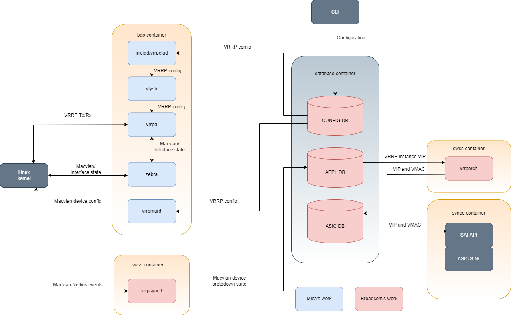
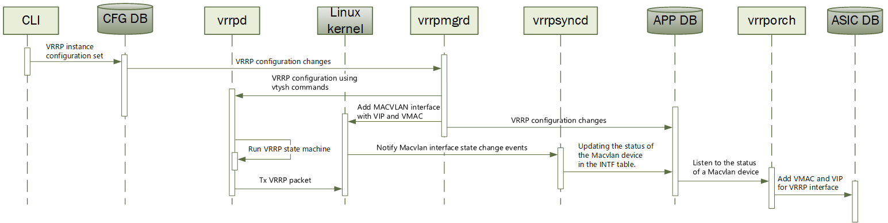
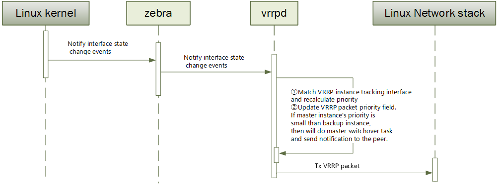

# Virtual Router Redundancy Protocol Adaptation HLD #

## Table of Content 

- [Virtual Router Redundancy Protocol Adaptation HLD](#virtual-router-redundancy-protocol-adaptation-hld)
  - [Table of Content](#table-of-content)
    - [Revision](#revision)
    - [Scope](#scope)
    - [Definitions/Abbreviations](#definitionsabbreviations)
    - [Overview](#overview)
	  - [Requirements](#requirements)
      - [Functional Requirements](#functional-requirements)
	  - [Feature Description](#feature-description)
      - [Functional Description](#functional-description)
        - [Protocol version selection](#protocol-version-selection)
        - [Pre-emption](#pre-emption)
        - [Virtual Router Owner](#virtual-router-owner)
        - [Virtual MAC Address](#virtual-mac-address)
        - [VRRP Advertisement Frame](#vrrp-advertisement-frame)
        - [Uplink Interface Tracking](#uplink-interface-tracking)
    - [Architecture Design](#architecture-design)
    - [High-Level Design](#high-level-design)
      - [Operating environment](#operating-environment)
      - [Scalability Requirements](#scalability-requirements)
      - [Container](#container)
        - [BGP container](#bgp-container)
        - [SWSS container](#swss-container)
      - [CoPP Configurations](#copp-configurations)
      - [DB changes](#db-changes)
        - [CONFIG_DB changes](#config_db-changes)
        - [APPL_DB changes](#appl_db-changes)
        - [ASIC_DB changes](#asic_db-changes)
      - [Modules Design and Flows](#modules-design-and-flows)
        - [ADD/DEL VRRP instance](#add/del-vrrp-instance)
        - [Tracking interface](#tracking-interface)
    - [SAI API](#sai-api)
    - [Configuration and management](#configuration-and-management)
      - [Manifest](#manifest)
      - [CLI/YANG Model Enhancements](#cliyang-model-enhancements)
        - [SNOiC VRRP YANG MODEL](#sonic-vrrp-yang-model)
		- [CLI](#cli)
          - [Config commands](#config-commands)
          - [Show commands](#show-commands)
    - [Warmboot and Fastboot Design Impact](#warmboot-and-fastboot-design-impact)
    - [Restrictions/Limitations](#restrictionslimitations)
    - [Testing Requirements/Design](#testing-requirementsdesign)
      - [Unit Test cases](#unit-test-cases)
    - [Open/Action items](#openaction-items)
 
### Revision  
|  Rev  |  Date           |  Author     | Change Description |
| :---  | :-------------- | :---------- | :----------------  |
|  0.1  |  Aug-16-2023    | Philo-micas | Initial version    |

### Scope  

This document describes the high level design of frr-vrrpd adaptation to SONiC.

### Definitions/Abbreviations 

Table 1: Abbreviations

| Abbreviation    | Description                                        |
| :----------     | :------------------------------------------------  |
| VRRP            | Virtual Router Redundency Protocol                 |
| ARP             | Address Resolution Protocol                        |
| FRR             | Free Range Routing Stack                           |
| CLI             | Command Line Interface                             |
| VMAC            | Virtual MAC address                                |
| VIP             | Virtual IP address                                 |
| VRID            | Virtual Router Identifier                          |
| VRRP Instance   | An instance of VRRP state machine on an interface. Multiple VRRP state machines can be configured on an interface.         |
| VRRP Owner      | VRRP owner (of a VRRP instance) is the router whose virtual IP address is the same as the real interface IP address        |

### Overview 
This document describes the high level design details of VRRP and its components. VRRP(Virtual Router Redundancy Protocol) specifies an election protocol that dynamically assigns responsibility for a virtual router to one of the VRRP routers on a LAN.
The election provides two basic functionality:
	support dynamic failover in the forwarding responsibility when the Master become unavailable.
	support load sharing among multiple routers by running multiple instances.


### Requirements

#### Functional Requirements

Following requirements are addressed by the design presented in this document:
  1. Support VRRPv2(IPv4) and VRRPv3(IPv4 and IPv6)
  2. Support VRRP on Ethernet, VLAN and PortChannel interfaces
  3. Support interface configuration of multiple VRRP instances.
  4. Support configurable priority for VRRP instance
  5. Support configurable preempt mode for VRRP instance
  6. Support uplink interface tracking feature

### Feature Description

FRR has already accomplished the VRRP protocol implementation. The implementation uses Linux macvlan devices to implement the shared virtual MAC feature of the protocol.Each interface on which VRRP will be enabled must have at least one Macvlan device configured with the virtual MAC and placed in the proper operation mode. The addresses backed up by VRRP are assigned to these interfaces.

Suppose you have an interface eth0 with the following configuration:
```
$ ip addr show eth0
2: eth0: <BROADCAST,MULTICAST,UP,LOWER_UP> mtu 1500 qdisc fq_codel state UP group default qlen 1000
    link/ether 02:17:45:00:aa:aa brd ff:ff:ff:ff:ff:ff
    inet 10.0.2.15/24 brd 10.0.2.255 scope global dynamic eth0
       valid_lft 72532sec preferred_lft 72532sec
    inet6 fe80::17:45ff:fe00:aaaa/64 scope link
       valid_lft forever preferred_lft forever
```
Suppose that the IPv4 and IPv6 addresses you want to back up are 10.0.2.16 and 2001:db8::370:7334, and that they will be managed by the virtual router with id 5. A Macvlan device with the appropriate MAC address must be created before VRRP can begin to operate.

If you are using iproute2, the configuration is as follows:
```
ip link add vrrp4-2-1 link eth0 addrgenmode random type macvlan mode bridge
ip link set dev vrrp4-2-1 address 00:00:5e:00:01:05
ip addr add 10.0.2.16/24 dev vrrp4-2-1
ip link set dev vrrp4-2-1 up

ip link add vrrp6-2-1 link eth0 addrgenmode random type macvlan mode bridge
ip link set dev vrrp6-2-1 address 00:00:5e:00:02:05
ip addr add 2001:db8::370:7334/64 dev vrrp6-2-1
ip link set dev vrrp6-2-1 up
```
The created interfaces will look like this:
```
$ ip addr show vrrp4-2-1
5: vrrp4-2-1@eth0: <BROADCAST,MULTICAST,UP,LOWER_UP> mtu 1500 qdisc noqueue state UP group default qlen 1000
    link/ether 00:00:5e:00:01:05 brd ff:ff:ff:ff:ff:ff
    inet 10.0.2.16/24 scope global vrrp4-2-1
       valid_lft forever preferred_lft forever
    inet6 fe80::dc56:d11a:e69d:ea72/64 scope link stable-privacy
       valid_lft forever preferred_lft forever

$ ip addr show vrrp6-2-1
8: vrrp6-2-1@eth0: <BROADCAST,MULTICAST,UP,LOWER_UP> mtu 1500 qdisc noqueue state UP group default qlen 1000
 link/ether 00:00:5e:00:02:05 brd ff:ff:ff:ff:ff:ff
 inet6 2001:db8::370:7334/64 scope global
    valid_lft forever preferred_lft forever
 inet6 fe80::f8b7:c9dd:a1e8:9844/64 scope link stable-privacy
    valid_lft forever preferred_lft forever
```
a few things to note about this interface:
- It is slaved to eth0; any packets transmitted on this interface will egress via eth0
- Its MAC address is set to the VRRP virtual MAC specified by the RFC for VRID 5
- The VIP address 10.0.2.16 must not be present on the parent interface eth0
- The link local address on the interface is not derived from the interface MAC

#### Functional Description

##### Protocol version selection

Optionally specify the protocol version(VRRPv2 or VRRPv3). If the protocol version is not specified, the default is VRRPv3. Note that VRRPv2 does not support IPv6, so any IPv6 configuration will be rejected by FRR when using VRRPv2.

##### Pre-emption

Toggle preempt mode. When enabled, preemption allows Backup routers with higher priority to take over Master status from the existing Master. Enabled by default.

##### Virtual Router Owner

VRRP instance whose virtual IP address (VIP) is same as real interface address is called the owner of virtual router and has the highest priority (255). VRRP owner is supported in SONIC's VRRP implementation. VRRP owner node will pre-empt the active master even when pre-emption is disabled for that particular VRRP instance.

##### Virtual MAC Address

Following virtual MAC address is used by the protocol (as per RFC 5798)

IPv4 case: 00-00-5e-00-01-{vrid}

IPv6 case: 00-00-5e-00-02-{vrid}

where, vrid is user configured 1-byte virtual router identifier. VRID has interface scope; that is, VRID has to be unique among the VRRP instances on an interface.

##### VRRP Advertisement Frame

VRRP control packets have IP protocol type as 112 (reserved for VRRP), for IPv4 network, are sent to VRRP multicast address 224.0.0.18, source MAC in VRRP control packets is virtual MAC address and source IP is interface IP (not the virtual IPv4 address). For IPv6 networks, the source address in the VRRPv6 header is the IPv6 link local address of the sending interface, and the destination address is the IPv6 multicast address FF02:: 02/64 assigned by IANA.

##### Uplink Interface Tracking

The fault point which VRRP safeguards against is the interface on which VRRP instance is present. Even if all of the connectivity of master to the external network fails, VRRP will still not trigger the failover to the backup gateway. Uplink interface tracking feature has been introduced to overcome this limitation.


As shown in the figure，Configure VRRP backup groups between RouterA and RouterB, Both RouterA and RouterB operate in preemptive mode. On RouterA, configure to monitor the uplink interface Interface1. When Interface1 fails, RouterA lowers its priority and, through packet negotiation, RouterB preempts and becomes the Master, ensuring that user traffic is forwarded normally.

### Architecture Design 

Below diagram illuminates the interactions between relevant components and the DB involved for VRRP support in SONiC architecture at a high level.



Diagram 1. VRRP components.

Significantly, This feature extends functionality implemented in [SONiC FRR-BGP Extended Unified Configuration Management Framework](https://github.com/sonic-net/SONiC/blob/master/doc/mgmt/SONiC_Design_Doc_Unified_FRR_Mgmt_Interface.md), Redis DB events will trigger frrcfgd when the field frr_mgmt_framework_config set to "true" in the DEVICE_METADATA table, otherwise will trigger vrrpcfgd, and then frrcfgd or vrrpcfgd will configure FRR-VRRP using FRR CLI commands.

### High-Level Design

#### Operating environment

Since support for placing macvlan devices into protodown was not added to Linux until version 5.1, the kernel version is required:
- Linux kernel version 5.1+

#### Scalability Requirements

- Max number of VRRP instances: 254

#### Container

##### BGP container

vrrpcfgd: 
  - Subscribes to CONFIG_DB tables, parsing configurations and passes to vrrpd by using FRR CLI commands. 

vrrpd: 
  - Responsible for all VRRP protocol related calculations. VRRP packets are sent and received in vrrpd and states are updated accordingly.

vrrpmgrd: 
  - Listens to VRRP create, delete and parameter change in CONFIG_DB. Complete the following tasks:
    - Add/del Linux Macvlan device to kernel
    - Config virtual MAC to Macvlan device;
    - Add/del VIP to Macvlan device;
    - Upadate VRRP instance configuration to the APPL DB.

vrrpsyncd: 
  - Complete the following tasks:
    - Listen for kernel Macvlan device and other interfaces protocol status change events
    - Update the kernel Macvlan device status to the APPL DB.
    - Match VRRP instance tracking interface and recalculate priority.
    - Update priority change to vrrpd by using FRR CLI commands.

##### SWSS container

vrrporch: 
  - Subscribes to APPL_DB tables, responsible for updating the ASIC DB. Creating/deleting Virtual RIF object via SAI API.


#### CoPP Configurations

CoPP will be extended as follows for trapping VRRPs:
```
  "trap.group.vrrp": {
    "cir":"300",
    "cbs":"300",
    "meter_type":"packets",
    "mode":"sr_tcm",
    "red_action":"drop",
    "trap_action":"trap",
    "trap_priority":"7",
    "queue": "7",
    "yellow_action":"drop"
  },
  "trap.group.vrrpv6": {
    "cir":"300",
    "cbs":"300",
    "meter_type":"packets",
    "mode":"sr_tcm",
    "red_action":"drop",
    "trap_action":"trap",
    "trap_priority":"7",
    "queue": "7",
    "yellow_action":"drop"
  }
  ...
  "vrrp": {
    "trap_ids": "vrrp",
    "trap_group": "trap.group.vrrp",
    "always_enabled": "true"
  },
  "vrrpv6": {
    "trap_ids": "vrrpv6",
    "trap_group": "trap.group.vrrpv6",
    "always_enabled": "true"
  }
```
#### DB Changes

##### CONFIG_DB changes

VRRP_TABLE

Producer: config manager

Consumer: vrrpmgrd and vrrpcfgd/frrcfgd

Description: New table that stores VRRP configuration for per interface + VRID.
```
;New table
;holds the VRRP configuration per interface and VRID
key             = VRRP:interface_name:vrid
                                                ; Interface name string. Vlan, Ethernet or PortChannel
                                                ; vrid is an integer
; field = value
vrid            = 3DIGIT                        ; VRRP Instance Identifier
vip             = ip_address                    ; Virtual IP address. This is a list of IP addresses
priority        = 3DIGIT                        ; Priority of VRRP instance
adv_interval    = 5DIGIT                        ; Advertisement interval for VRRP. Default = 1000ms
state           = vrrp_state                    ; String denoting the state of VRRP instance
version         = vrrp_version                  ; VRRP version. Value is 2 or 3. Default is 3
preempt         = "enabled"/"disabled"          ; VRRP pre-emption is enabled? Default is enabled
track_interface = interface_Name|weight_value   ;This is repeated for the configured tracking interfaces
```
Example:-
```
admin@sonic:~$ redis-cli -n 4 keys VRRP*

"VRRP|Ethernet8|8"
"VRRP|Ethernet1|1"
"VRRP|Vlan10|10"
"VRRP|Ethernet2|2"
"VRRP|Vlan4|4"

admin@sonic:~$ redis-cli -n 4 HGETALL " VRRP|Vlan10|10"

"vrid"
"10"
"vip"
"4.1.1.100/24,4.1.1.200/24,2000::50/64"
"priority"
"100"
"adv_interval"
"1000"
"state"
""
"version"
"3"
"preempt"
"enabled"
"track_interface"
"Ethernet5|10, Ethernet9|20"
```

#### APPL_DB Changes

VRRP_TABLE

Producer: vrrpmgrd and vrrpsyncd

Consumer: vrrporch

Description: This is a new table that contains VRRP state information. This entry will be added to APP_DB for each VRRP instance.
```
; New table
; holds the VRRP state and VMAC information

key         = VRRP_TABLE:interface_name:vrid:type
              interface_name        ; interface name as a string. Vlan, Ethernet or PortChannel
              vrid                  ; vrid is an integer
              type                  ; IP address type string. IPv4 or IPv6
    
; field = value
vmac        = virtual_mac_address   ; Virtual MAC address associated with VRRP instance
state       = "up" | "down"         ; Linux macvlan device protol state
priority    = vrrp_priority         ; Priority of VRRP instance
```
Example:-
```
admin@sonic:~$ redis-cli -n 0 HGETALL "VRRP_TABLE:Ethernet36:6:IPv4"
1) "vmac"
2) "00:00:5e:00:01:06"
3) "state"
4) "up"
5) "priority "
6) "100"
```

#### ASIC_DB Changes

Example:-
```
admin@sonic:~$ redis-cli -n 1 hgetall "ASIC_STATE:SAI_OBJECT_TYPE_ROUTER_INTERFACE:oid:0x6000000000a80"
 1) "SAI_ROUTER_INTERFACE_ATTR_VIRTUAL_ROUTER_ID"
 2) "oid:0x300000000003a"
 3) "SAI_ROUTER_INTERFACE_ATTR_SRC_MAC_ADDRESS"
 4) "00:00:5E:00:01:06"
 5) "SAI_ROUTER_INTERFACE_ATTR_TYPE"
 6) "SAI_ROUTER_INTERFACE_TYPE_PORT"
 7) "SAI_ROUTER_INTERFACE_ATTR_PORT_ID"
 8) "oid:0x1000000000025"
 9) "SAI_ROUTER_INTERFACE_ATTR_IS_VIRTUAL"
10) "true"
```

#### Modules Design and Flows

##### ADD/DEL VRRP instance



vrrpcfgd:
  - Listens to VRRP create, delete and parameter change in CONFIG DB
  - Update changes by using FRR CLI commands

vrrpd:
  - Listens to VRRP create, delete and parameter change in vrrpcfgd
  - Run VRRP state machine
    - For VRRP instances state transition to Master, set the Macvlan device into protodown off
    - For VRRP instances state transition to non-Master, set the Macvlan interface into protodown on

vrrpmgrd:
  - Listens to VRRP create, delete and parameter change in CONFIG DB
  - Upon change
    - Add/del VRRP instance corresponding Macvlan device to kernel with IPs and state. 
    - Updates VRRP instance configuration to the APPL DB, such as interface name, vrid, and IP address type.

vrrpsyncd:
  - Listens to Macvlan interface programming in kernel.
  - Update the kernel Macvlan device’s state to the VRRP table entry of APPL DB.

vrrporch:
  - Listens to VRRP_Table in APP_DB and adds/dels virtual MAC entries in ASIC_DB for VRRP instances

##### Uplink interface tracking



vrrpsyncd:
  - Listen for interfaces state change events notified by the kernel. 
  - Match VRRP instance tracking interface and recalculate priority
    - If track interface goes down, the priority of VRRP instance will be reduced by weight
    - If track interface goes up, the priority of VRRP instance will be added by weight
  - Update priority change by using FRR CLI commands

vrrpd:
  - Update VRRP packet priority field
  - Send VRRP packet to Linux Network stack

### SAI API 

VRRP virtual router interface can be created by setting the attribute “SAI_ROUTER_INTERFACE_ATTR_IS_VIRTUAL” with create_router_interface API.
```
 * @brief RIF creation is a virtual RIF.
 *
 * Create a Virtual RIF object, which only programs the ingress router MAC.
 * This simplifies the management of VRRP master router's configuration in
 * SAI adapter, as defined by RFC 5798 (or similar proprietary protocols).
 * Using a Virtual RIF allows SAI to optimize resources, so neighbor entries
 * cannot be learned on a Virtual RIF. On a virtual RIF following attributes
 * are invalid: ADMIN state, MTU size, packet action and multicast enable.
 * Alternatively VRRP can also be configured using native RIF objects without
 * using VIRTUAL attribute, with the expectation that SAI adapter will consume
 * resources that will not be used.
 *
 * @type bool
 * @flags CREATE_ONLY
 * @default false
 */

SAI_ROUTER_INTERFACE_ATTR_IS_VIRTUAL,

```

### Configuration and management 

#### Manifest

N/A

#### CLI/YANG Model Enhancements

##### SNOiC VRRP YANG MODEL

```yang
module sonic-vrrp {

    namespace "http://github.com/Azure/sonic-vrrp";
    prefix vrrp;

    import ietf-inet-types {
        prefix inet;
    }

    organization
        "SONiC";

    contact
        "SONiC";

    description "VRRP yang Module for SONiC OS";

    revision 2023-08-10 {
        description "add sonic-vrrp.yang";
    }

    container sonic-vrrp {

        container VRRP {

            description "VRRP part of configdb.json"

            list VRRP_LIST {

                key "interface_name vrid";

                leaf interface_name {
                    type union {
                        type string {
                            pattern "Ethernet([1-3][0-9]{3}|[1-9][0-9]{2}|[1-9][0-9]|[0-9])";
                        }
                        type string {
                            pattern "PortChannel[0-9]{1,4}";
                        }
                        type string {
                            pattern "Vlan(409[0-4]|40[0-8][0-9]|[1-3][0-9]{3}|[1-9][0-9]{2}|[1-9][0-9]|[1-9])";
                        }
                    } 
                }

                leaf vrid {
                    type uint8 {
                        range 1..255;
                    }
                }

                leaf-list vip {
                    type union {
                        type inet:ipv4-prefix;
                        type inet:ipv6-prefix;
                    }
                }

                leaf priority {
                    mandatory true;
                    type uint8 {
                        range 1..254;
                    }
                }

                leaf adv_interval {
                    type uint16 {
                        range 10..40950;
                    }
                    default 1000;
                }

                leaf state {
                    type enumeration {
                        enum up;
                        enum down;
                    }
                }

                leaf version {
                    type enumeration {
                        enum 2;
                        enum 3;
                    }
                    default 3；
                }

                leaf preempt {
                    type enumeration {
                        enum enabled;
                        enum disabled;
                    }
                }

                leaf-list track_interface {
                    description "track_interface is a list, base type will be like A|B,
                                A is interface name, which must be an Ethernet,
                                B is weight value, integer ranges from 10 to 50.
                                for example, track_interface could be: Ethernet1|30,Ethernet2|40";

                    type string;
                    max-elements 8;
                }

            } /* end of list VRRP  */

        } /* end of container VRRP */

    } /* end of container sonic-vrrp */

} /* end of module sonic-vrrp */
```
##### CLI

SONIC Click based configuration and monitoring CLIs have been introduced in SONIC for VRRP

###### Config commands

- config interface vrrp add/remove <interface_name> <vrrp_id>
  - This command adds/ removes a VRRP instance on an interface.
  - interface_name:name of interface (Ethernet/Vlan/PortChannel) over which VRRP is to be enabled.
  - vrrp_id:VRRP instance identifier.
- config interface vrrp backup_forward < interface_name > <vrrp_id> enabled|disabled
    - This command configures  enables/disables the VRRP instance to forward service traffic even if the VRRP instance in the backup state
    - interface_name:name of interface (Ethernet/Vlan/PortChannel) over which VRRP is to be enabled.
    - vrrp_id:VRRP instance identifier.
    - backup_forward: VRRP instance forwarding traffic in the backup state，can be enabled or disabeld. default is disabled.
- config interface vrrp vip add/remove <interface_name> <vrrp_id> <virtual_ip_address>
    - This command adds a virtual IP address for a VRRP instance on an interface.
    - interface_name:name of interface (Ethernet/Vlan/PortChannel) over which VRRP is to be enabled.
    - vrrp_id:VRRP instance identifier.
    - virtual_ip_address: VIP address in dotted decimal IPv4 or IPv6 address
- config interface vrrp priority <interface_name> <vrrp_id> <priority>
    - This command configures priority for a VRRP instance
    - interface_name:name of interface (Ethernet/Vlan/PortChannel) over which VRRP is to be enabled.
    - vrrp_id:VRRP instance identifier.
    - priority: VRRP instance priority, range from 1 to 254, default is 100
- config interface vrrp adv_interval <interface_name> <vrrp_id> <interval>
  - This command configures VRRP periodic advertisement interval for a VRRP instance
  - interface_name:name of interface (Ethernet/Vlan/PortChannel) over which VRRP is to be enabled.
  - vrrp_id:VRRP instance identifier.
  - Interval: VRRP instance packet sending interval, range from 10 to 40950, unit: ms, default is 1000
- config interface vrrp pre_empt enable/disable <interface_name> <vrrp_id>
    - This command enables pre-emption of a Master when a higher priority VRRP router arrives
    - interface_name:name of interface (Ethernet/Vlan/PortChannel) over which VRRP is to be enabled.
    - vrrp_id:VRRP instance identifier.
- config interface vrrp track_interface add <interface_name> <vrrp_id> <track_interface> <weight>
    - This command adds a track interface to a VRRP Instance. A maximum of 8 track interfaces can be added to a VRRP instance.
    - interface_name:name of interface (Ethernet/Vlan/PortChannel) over which VRRP is to be enabled.
    - vrrp_id:VRRP instance identifier.
    - track_interface: Interface to track. Interface can be Ethernet/Vlan/PortChannel
    - weight: weight or importance assigned to the track_interface. range from 10 to 50
- config interface vrrp track_interface remove <interface_name> <vrrp_id> <track_interface>
    - This command removes an already configured track interface from a VRRP Instance.
    - interface_name:name of interface (Ethernet/Vlan/PortChannel) over which VRRP is to be enabled.
    - vrrp_id:VRRP instance identifier.

###### Show commands
- show vrrp {interface <interface_name> } | <vrrp_id>
- show vrrp summary

```
admin@sonic:~$ show vrrp interface Ethernet50

 Virtual Router ID                    5                   
 Protocol Version                     3                   
 Autoconfigured                       No                  
 Shutdown                             No                  
 Interface                            Ethernet50          
 VRRP interface (v4)                  Vrrp4-5             
 VRRP interface (v6)                  None                
 Primary IP (v4)                      10.0.0.98           
 Primary IP (v6)                      ::                  
 Virtual MAC (v4)                     00:00:5e:00:01:05   
 Virtual MAC (v6)                     00:00:5e:00:02:05   
 Status (v4)                          Master              
 Status (v6)                          Initialize          
 Priority                             100                 
 Effective Priority (v4)              100                 
 Effective Priority (v6)              100                 
 Preempt Mode                         Yes                 
 Accept Mode                          Yes                 
 Advertisement Interval               1000 ms             
 Master Advertisement Interval (v4)   1000 ms             
 Master Advertisement Interval (v6)   0 ms                
 Advertisements Tx (v4)               95                  
 Advertisements Tx (v6)               0                   
 Advertisements Rx (v4)               0                   
 Advertisements Rx (v6)               0                   
 Gratuitous ARP Tx (v4)               1                   
 Neigh. Adverts Tx (v6)               0                   
 State transitions (v4)               2                   
 State transitions (v6)               0                   
 Skew Time (v4)                       600 ms              
 Skew Time (v6)                       0 ms                
 Master Down Interval (v4)            3600 ms             
 Master Down Interval (v6)            0 ms                
 IPv4 Addresses                       1                   
 ..................................   10.10.10.10         
 IPv6 Addresses                       0       

admin@sonic:~$ show vrrp summary 

 Interface    VRID   Priority   IPv4   IPv6   State (v4)   State (v6)   
 -----------------------------------------------------------------------
 Ethernet48   6      100        1      0      Backup       Backup       
 Ethernet50   5      100        1      0      Master       Backup    
```

### Warmboot and Fastboot Design Impact  

Warm boot will not be supported. The VRRPv2 (RFC 3768) and VRRPv3 (RFC 5798) standard of VRRP does not define a way to support it as this might cause data flow interruption in the network.

If a user tries to perform a warm boot while VRRP is enabled, an error message will be displayed. User will first need to disable VRRP so the VRRP topology to reelect the Master.

### Restrictions/Limitations

Currently, due to the limitations of FRR, the following functions are not supported:
  1. Virtual Router Owner
  2. Accept Mode configurable function

### Testing Requirements/Design  

#### Unit Test cases  

Unit test cases for this specification are as listed below:
|   Test Cases                  |  UT Action and observation                                                                              |  Remarks  |
| :---------------------------  | :------------------------------------------------------------------------------------                   | :------   |
|  Configuration                |                                                                                                         |           |
|                               |  Validate IPv4 VRRP config on Ethernet/Vlan/PortChannel Interface                                       |           |
|                               |  Validate IPv6 VRRP config on Ethernet/Vlan/PortChannel Interface                                       |           |
|                               |  Validate VRRP on more than one interface                                                               |           |
|                               |  Validate VRRP with more than one VIP per instance                                                      |           |
|                               |  Validate multiple VRRP instance per interface                                                          |           |
|                               |  Validate VMAC is programmed in FDB                                                                     |           |
|                               |  Validate macvlan device is configured in kernel                                                        |           |
|                               |  Validate that VMAC is generated based on VRID                                                          |           |
|                               |  Validate the VRRP packet version is the configuration version                                          | The default version is 3 |
|                               |  Validate the VRRP periodic advertisement interval is the configuration interval time                   | The default advertisement interval is 1000ms |
|  Ping to VIP                  |                                                                                                         |           |
|                               |  Validate ping to VRRP VIP from host, master & non vrrp router works                                    |           |
|  L3 Forwarding with VIP as GW |                                                                                                         |           |
|                               |  Validate that IPv4 traffic forwarding with VIP as gateway works from source to destination host        |           |
|                               |  Validate that IPv6 traffic forwarding with VIP as gateway works from source to destination host        |           |
|                               |  Perform VRRP master failover and check if traffic forwarding continues with new master                 |           |
|  Load Sharing                 |                                                                                                         |           |
|                               |  Perform multiple vrrp instances on one devices to do load sharing, all master can work independently   |           |
|  Uplink Interface Tracking    |                                                                                                         |           |
|                               |  Enable interface tracking in a VRRP group with priority, bring down the port and ensure VRRP session priority comes down and session transition from Master to Backup State    |  |
|                               |  Bring up the tracked interface and check if session priority gets restored and session becomes master  |           |

### Open/Action items

N/A
