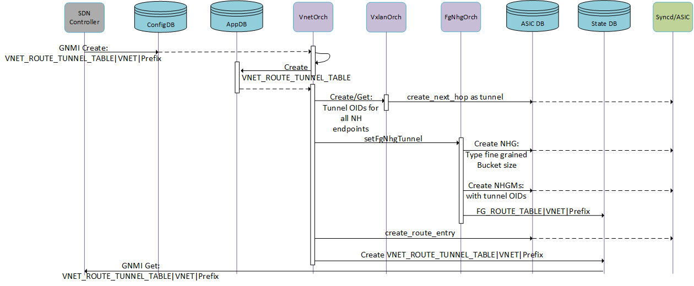
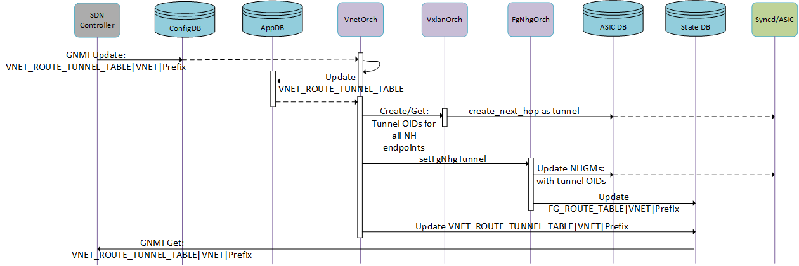

# Consistent ECMP for Vxlan Tunnels

# Table of Contents

- [Revision](#revision)
- [Scope](#scope)
- [Overview](#1-overview)
- [Schema Changes](#2-schema-changes)
    - [Config and APP DB](#21-config-and-appdb)
    - [STATE DB](#22-state-db)
    - [CLI](#23-cli)
- [Programming Flow](#3-programming-flow)
- [SWSS orchagent design](#4-swss-orchagent-design)
- [Test Plan](#5-test-plan)


# Revision

| Rev |     Date    |       Author       | Change Description                |
|:---:|:-----------:|:------------------:|-----------------------------------|
| 1.0 | 11/04/2025  |     Anish Narsian  | Added Consistent hashing support  |


# Scope

This document goes over an enhancement to VXLAN tunnel endpoint ECMP to add support for consistent hashing towards a group of tunnel endpoints that are nexthops for a given tunnel route. This is an extension to the existing VNET Vxlan support as defined in the [Vxlan HLD](https://github.com/sonic-net/SONiC/blob/master/doc/vxlan/Vxlan_hld.md)


# Abbreviations

|     Abbreviation         |    Meaning      |
|--------------------------|-----------------| 
| NH                       | Next hop        |
| NHG                      |  Next hop Group |
| NHGM                      |  Next hop Group Member |
| FG                       |  Fine Grained   |
| ECMP                     | Equal Cost MultiPath |

# 1 Overview
The details for enabling consistent hashing for Vxlan tunnel route(VNET_ROUTE_TUNNEL) are discussed in this document.

###### Use-case:
  Vxlan tunnel routes can contain a list of endpoints(next-hops) for overlay traffic to be routed to multiple underlay endpoints(next-hops). When there are multiple endpoints, ECMP is used to select the nexthop for this traffic to be encapsulated towards and sent out. This is primarily used in scenarios where  throughput needs to be scaled beyond what a single vxlan endpoint is capable of. When these endpoints hold flow state, endpoint modifications(next-hop addition/removal), will result in most flows being rehashed and sent to a different endpoint than what they were originally going to, resulting in connection restart whenever a endpoint modification is performed. To limit connection restarts during endpoint/next hop modifications, we will enable consistent hashing for tunnel nexthops.

###### Scale:
| Component                | Expected value              |
|--------------------------|-----------------------------|
| NHG size| 512 - 2048 next hop group members(NHGMs) |

# 2 Schema Changes

## 2.1 Config and APP DB

We modify Config DB's **VNET_ROUTE_TUNNEL** and correspondingly APP_DB's **VNET_ROUTE_TUNNEL_TABLE** to support consistent hashing, the schema can be found below:

The following new fields have been added the **VNET_ROUTE_TUNNEL_TABLE**
 - consistent_hashing_buckets

```

VNET_ROUTE_TUNNEL_TABLE:{{vnet_name}}:{{prefix}}  
    “endpoint”: {{ip_address1},{ip_address2},...} 
    “endpoint_monitor”: {{ip_address1},{ip_address2},...} (OPTIONAL) 
    “mac_address”: {{mac_address1},{mac_address2},...} (OPTIONAL) 
    “monitoring”: {{“custom”}} (OPTIONAL)                                  
    “vni”: {{vni1},{vni2},...} (OPTIONAL) 
    “weight”: {{w1},{w2},...} (OPTIONAL) 
    “profile”: {{profile_name}} (OPTIONAL) 
    “primary”: {{ip_address1}, {ip_address2}} (OPTIONAL)                      
    “profile”: {{profile_name}} (OPTIONAL)  
    “adv_prefix”: {{prefix}} (OPTIONAL)                                    
    “rx_monitor_timer”: {time in milliseconds} (OPTIONAL)           
    “tx_monitor_timer”: {time in milliseconds} (OPTIONAL)
    “check_directly_connected”: {{true|false}} (OPTIONAL)
    “consistent_hashing_buckets”: {{bucket_size}} (OPTIONAL)       -> newly introduced
```


```
consistent_hashing_buckets                  = DIGITS      ; if specified, consistent hashing will be used for nexthops to the vnet route tunnel, the bucket size should be determined by the caller based on # of nexthops and redundancy factor, which will define how many bucket entries each nexthop receives (Optional) 
```

## 2.2 STATE DB

The existing Fine grained ecmp state DB table will be modified to store a VRF/VNET name, so that IP space collisions across VRFs/VNETs can be supported

```
FG_ROUTE_TABLE|{{VRF/VNET-name}}|{{IPv4 OR IPv6 prefix}}:
    "0": {{next-hop-key}}
    "1": {{next-hop-key}}
    ...
    "{{hash_bucket_size -1}}": {{next-hop-key}}
```

## 2.3 CLI
*CLI command enhancement to be able to see consistent hashing buckets for a partricular VRF/VNET and prefix:*

```
show fgnhg hash-view <vnet/vrf name> <prefix name>
show fgnhg active-hops <vnet/vrf name> <prefix name>
```

*CLI output format: show fgnhg hash-view <vnet/vrf name> <prefix name>*
```
-----------+-----------------+--------------------+----------------+
| VNET/VRF | FG_NHG_PREFIX   | Next Hop           | Hash buckets   |
===========+=================+====================+================+
```

*CLI output format: show fgnhg hash-view <vnet/vrf name> <prefix name>*
```
-----------+-----------------+--------------------+
| VNET/VRF | FG_NHG_PREFIX   | Active Next Hops   |
===========+=================+====================+
```

# 3 Programming flow
*E2E creation flow for VNET_ROUTE_TUNNEL with consistent hashing*


*E2E flow for updating tunnel endpoints list with consistent hashing*


# 4 SWSS orchagent design
1. vnetorch will receive a call to create a VNET_ROUTE_TUNNEL_TABLE
2. vnetorch will check if consistent_hashing_buckets is set and if so call fgnhgorch to create internal FgNhgEntry with the following parameters:
2.a FGMatchMode will be PREFIX_BASED
2.b max_next_hops = configured_bucket_size = consistent_hashing_buckets
2.c The prefix for Fine grained behavior = prefix of the VNET_ROUTE_TUNNEL_TABLE
3. Next, vnetorch will call fgnhgorch to do the nexthop group creation with consistent hashing
4. For subsequent next-hop changes, vnetorch will continue calling fgnhgorch to handle the nexthop changes
5. At the time of VNET_ROUTE_TUNNEL_TABLE deletion, the nexthop and the internal FgNhgEntry will be deleted/cleaned up
6. For VNET_ROUTE_TUNNEL_TABLE modification where “consistent_hashing_buckets” is added for an existing tunnel route a transition from non fine grained to fine grained ecmp must occur and when “consistent_hashing_buckets” is removed then a transition from fine grained to non fine grained ecmp occurs. Both of these transitions result in a sai route update with new nexthop group/nexthop along with deleting any left over stale nexthop groups.


# 5 Test Plan for the enhacements
The following testing is planned for this feature:
- SWSS unit tests via virtual switch testing
- Data Plane tests via pytest + PTF


## SWSS unit tests:
1. Add VNET_ROUTE_TUNNEL_TABLE with consistent_hashing_buckets, and check that SAI objects are created for next-hop group and next-hop group member as fine grained ecmp
2. Remove endpoint in VNET_ROUTE_TUNNEL_TABLE, and ensure that only the next-hop group member associated with the removed endpoint is modified with another nexthop tunnel, and that the hash buckets are balanced
3. Add endpoint in VNET_ROUTE_TUNNEL_TABLE, and ensure that only total hash buckets/total endpoints buckets are impacted as a result of the change
4. Remove consistent_hashing_buckets paramater from VNET_ROUTE_TUNNEL_TABLE, and ensure that the fine grained next-hop group is cleaned up and a regular next-hop group is created, with the route pointing to the regular next-hop group
5. Add consistent_hashing_buckets paramater to VNET_ROUTE_TUNNEL_TABLE, and ensure that a fine grained next-hop group is created and the original regular next-hop group is cleaned up, with the route pointing to the fine grained next-hop group

## Dataplane tests:
1. Do a base setup with VXLAN_TUNNEL, VNET, interface binded to the vnet
2. Add VNET_ROUTE_TUNNEL_TABLE with consistent_hashing_buckets, with 10 endpoints
3. Send 1000 unique flows and check that the resultant packet which goes out of the DUT contains varying outer dst IPs, track the flow to outer dst IP
4. Modify VNET_ROUTE_TUNNEL_TABLE to remove 1 endpoint IP, check that the only flows impacted in the 1000 unique flow to outer dst IP mapping are the ones associated with the withdrawn endpoint
5. Modify VNET_ROUTE_TUNNEL_TABLE to add 1 endpoint IP, check that only a small % of flows, ie <10% are impacted by this endpoint addition. 
6. Validate that in all cases the flow distribution per endpoint is roughly equal