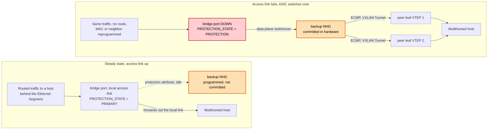
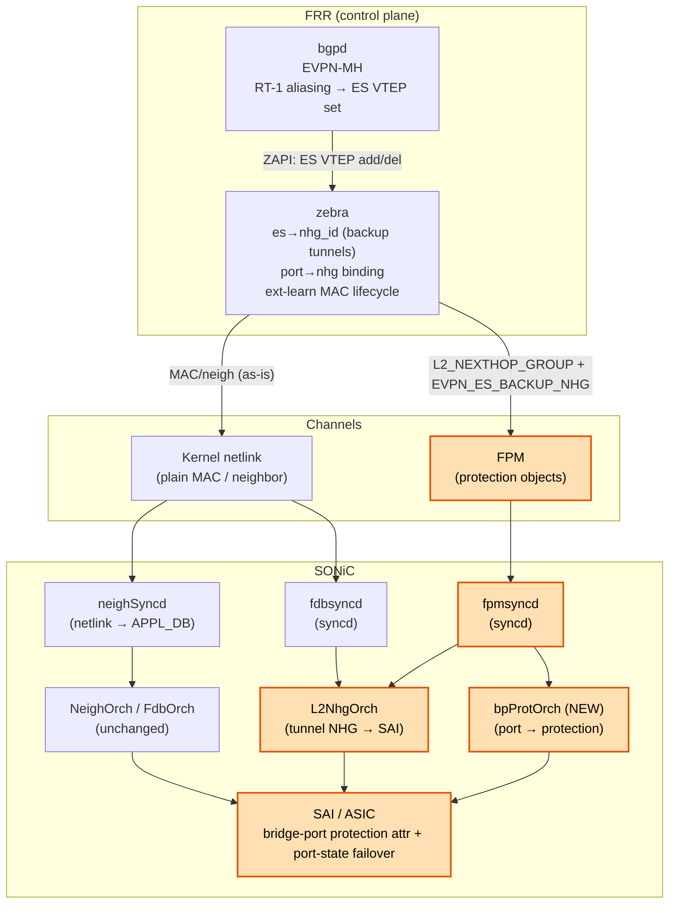
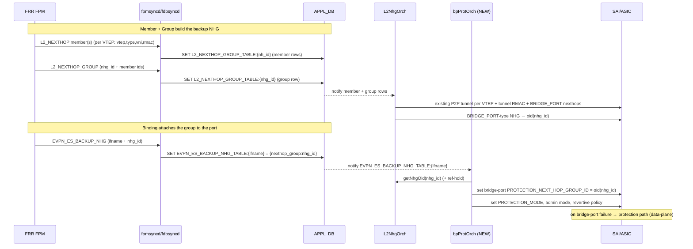
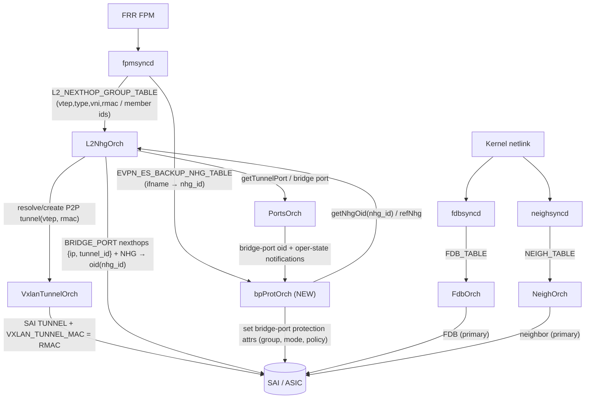
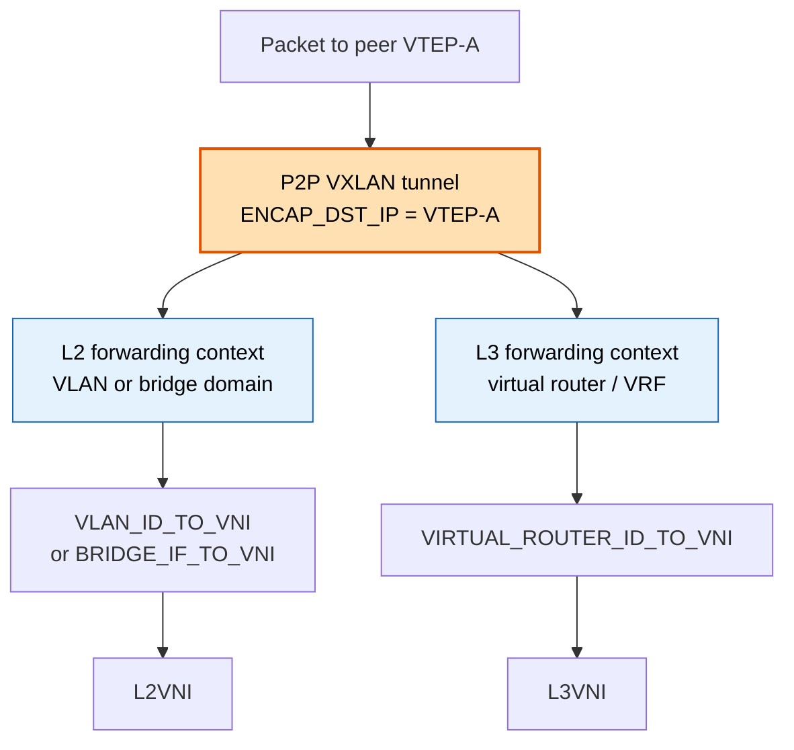
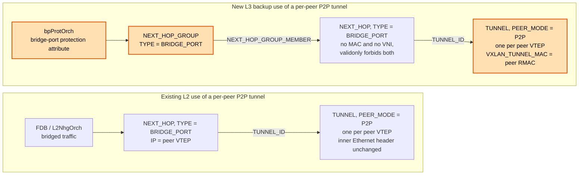
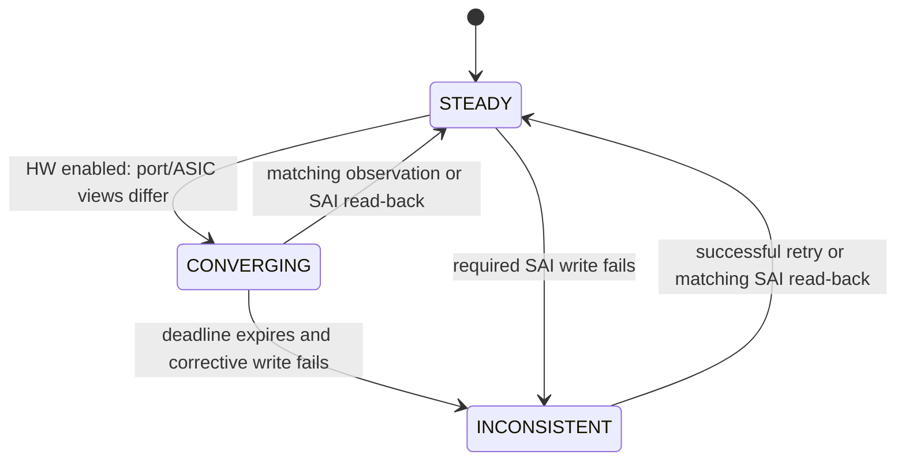
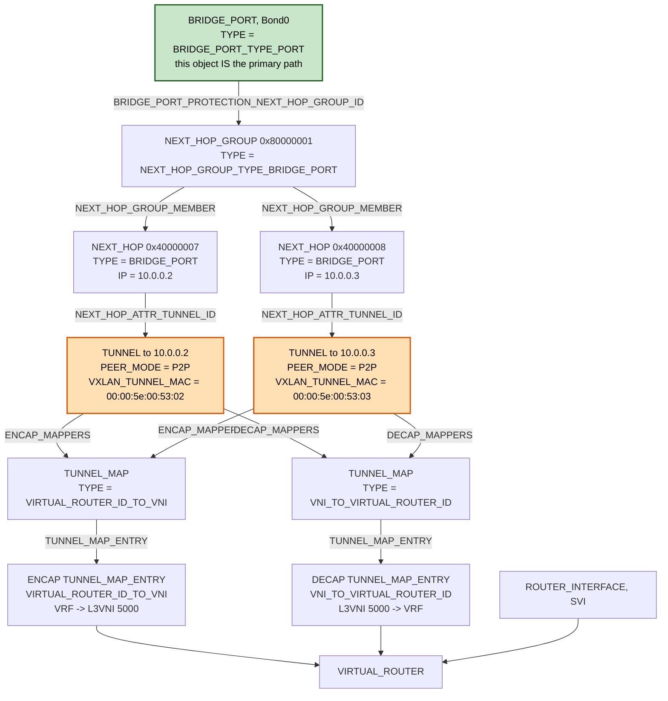

# Bridge-Port Protection (Primary/Backup) — SONiC High-Level Design

## Table of Contents

- [1. Revision](#1-revision)
- [2. Scope](#2-scope)
- [3. Definitions / Abbreviations](#3-definitions--abbreviations)
- [4. References](#4-references)
- [5. Overview](#5-overview)
- [6. Requirements](#6-requirements)
  - [6.1 Functional requirements](#61-functional-requirements)
  - [6.2 Configuration and management requirements](#62-configuration-and-management-requirements)
  - [6.3 Scalability requirements](#63-scalability-requirements)
  - [6.4 Warm boot requirements](#64-warm-boot-requirements)
- [7. Architecture Design](#7-architecture-design)
  - [7.1 High-level architecture](#71-high-level-architecture)
  - [7.2 New component — bpProtOrch](#72-new-component--bpprotorch)
  - [7.3 SONiC call flow (program)](#73-sonic-call-flow-program)
  - [7.4 Orchestration interaction summary](#74-orchestration-interaction-summary)
- [8. High-Level Design](#8-high-level-design)
  - [8.1 FPM messages](#81-fpm-messages)
  - [8.2 fpmsyncd changes](#82-fpmsyncd-changes)
  - [8.3 L2NhgOrch / VxlanTunnelOrch changes (backup group)](#83-l2nhgorch--vxlantunnelorch-changes-backup-group)
  - [8.4 bpProtOrch (new)](#84-bpprotorch-new)
  - [8.5 Cross-orch contract (L2NhgOrch ↔ bpProtOrch)](#85-cross-orch-contract-l2nhgorch--bpprotorch)
  - [8.6 DB schema changes](#86-db-schema-changes)
  - [8.7 Reconciliation model](#87-reconciliation-model)
  - [8.8 MAC, neighbor and FDB lifecycle constraints](#88-mac-neighbor-and-fdb-lifecycle-constraints)
- [9. SAI API](#9-sai-api)
- [10. Configuration and management](#10-configuration-and-management)
  - [10.1 Manifest (if the feature is an Application Extension)](#101-manifest-if-the-feature-is-an-application-extension)
  - [10.2 CLI / YANG model Enhancements](#102-cli--yang-model-enhancements)
  - [10.3 Config DB Enhancements](#103-config-db-enhancements)
- [11. Warmboot and Fastboot Design Impact](#11-warmboot-and-fastboot-design-impact)
- [12. Memory Consumption](#12-memory-consumption)
- [13. Restrictions / Limitations](#13-restrictions--limitations)
- [14. Testing Requirements / Design](#14-testing-requirements--design)
  - [14.1 Unit test cases](#141-unit-test-cases)
  - [14.2 System test cases](#142-system-test-cases)
- [15. Open / Action items](#15-open--action-items)

---

## 1. Revision

| Rev | Date | Author | Change Description |
|---|---|---|---|
| 1.0 | 2026-09-18 | Patrice Brissette - Cisco<br>Manas Kumar Mandal - Cisco | Initial draft |

---

## 2. Scope

This document describes the SONiC design for **primary/backup path protection per bridge port** for EVPN Layer-3 multihoming (L3MH). The protection object lives on a **bridge port** whose bridge has an **SVI attached to an IP table (VRF or GRT)** — hosts behind the port are reached by **L3 routing via the SVI**:

- **Primary** = the local bridge port (host reachable through the local access link).
- **Backup** = an **ECMP group of VXLAN L3 tunnels** to peer VTEPs, learned from **BGP EVPN RT-1 aliasing** and downloaded to SONiC over **FPM**.

On **local access-link failure**, the ASIC performs a **fast, data-plane switchover** from the primary bridge port to the backup tunnel NHG, with **no control-plane reconvergence** and **no change to the MAC/neighbor/route entries** — every adjacency resolving through the port inherits the protection.

The presence or absence of an **L2VNI must not matter** for the protection concept.

This HLD covers the SONiC components only (fpmsyncd, orchagent, SAI). The FRR/zebra/bgpd control-plane behavior is specified in the companion FRR design (see [References](#4-references)).

---

## 3. Definitions / Abbreviations

| Term | Definition |
|---|---|
| **ES / ESI** | Ethernet Segment / Ethernet Segment Identifier (EVPN multihoming) |
| **VTEP** | VXLAN Tunnel End Point |
| **VNI / L2VNI / L3VNI** | VXLAN Network Identifier; L2 (bridge) vs. L3 (routed/symmetric-IRB) VNI |
| **RMAC** | Router MAC — the remote leaf's router MAC used as the inner DMAC of a routed VXLAN packet. It may be common across VRFs on a peer; this design requires a common RMAC for all VRFs sharing the same peer P2P tunnel. |
| **RT-1 / RT-2 / RT-5** | EVPN route types: Ethernet Auto-Discovery (aliasing), MAC/IP, IP-Prefix |
| **Aliasing** | Reaching a multi-homed host via *any* leaf attached to its ES (draft-ietf-bess-evpn-ip-aliasing §10-13) |
| **NHG** | Next Hop Group |
| **FPM** | Forwarding Plane Manager channel (FRR → fpmsyncd) |
| **bpProtOrch** | The one new orch introduced by this design: it binds a backup NHG to a protected bridge port by setting the SAI bridge-port protection attributes (see [5. Overview](#5-overview)) |
| **L2NhgOrch** | Existing orch owning `L2_NEXTHOP_GROUP_TABLE` → SAI NHG |
| **Protection path** | The backup NHG a protected bridge port falls back to. The **primary path is the bridge port itself**, so it is never named as a group member |
| **SVI** | Switch Virtual Interface (`Vlan<x>` L3 interface) |

---

## 4. References
| Doc | Link |
|---|---|
| EVPN IP aliasing / backup path | draft-ietf-bess-evpn-ip-aliasing (§10-13) |
| EVPN L3MH |  [SONiC HLD](https://github.com/sonic-net/SONiC/pull/2543) |
| FRR EVPN-MH extern mode (ext-learn) | [FRRouting/frr PR #21863](https://github.com/FRRouting/frr/pull/21863) |
| **Authoritative SAI EVPN-MH model (pinned revision 0.4)** — defines the bridge-port protection NHG, software and hardware protection modes, committed-path state, recovery policy, notification, and `SAI_TUNNEL_ATTR_VXLAN_TUNNEL_MAC` | [SAI-Proposal-EVPN-Multihoming at commit 72c5aa0](https://github.com/manamand2020/SAI/blob/72c5aa0bc4a5b45ac3681b54d7f7e8a46d6747d0/doc/tunnel/SAI-Proposal-EVPN-Multihoming.md) |
| Related SAI protection proposals (next-hop-group based, different attach point) | [SAI-Proposal-FRR](https://github.com/opencomputeproject/SAI/blob/master/doc/SAI-Proposal-FRR.md), [SAI-Proposal-HW-FRR](https://github.com/opencomputeproject/SAI/blob/master/doc/SAI-Proposal-HW-FRR.md) |

---

## 5. Overview

### The problem, in plain terms

A leaf switch can reach a multi-homed host **two ways**: *directly*, over its own local access link, and *indirectly*, through the peer leaves that share the same Ethernet Segment. While the local link is up we want to use it; the instant it fails we want traffic to fall back — immediately — onto VXLAN tunnels to those peers, and to swing back when the link recovers.

The naive way to do this is to reprogram every affected route or MAC on failure. That does not scale: one access link can front thousands of hosts, so reacting per-entry is both slow and **O(routes)**.

### The idea: protect the port, not the routes

Rather than touch any route or MAC, we attach a single **protection object** to the **bridge port**:

> **primary = the local port · backup = an ECMP group of VXLAN tunnels to the peer leaves**

Every MAC, neighbor, and route that already resolves through that port **inherits** the backup automatically — none of those entries change. Protection state is therefore **O(ports)**, not O(routes), and failover becomes a single hardware action: when the port loses carrier, the ASIC swaps primary→backup **in the data plane**, with no control-plane reconvergence.

The two states look like this. Note what does **not** change between them: the traffic, the routes, the MACs, and the neighbor entries are all identical — the only thing that moves is which path the bridge port's protection attribute has committed in hardware.



Because the Linux kernel has no way to express "local port as primary, tunnel-ECMP as backup, for *routed* traffic," this protection lives entirely in SONiC and is carried **end-to-end over FPM → SONiC → SAI**. The kernel still gets the ordinary MAC/neighbor entries it always did (for local forwarding and learning); the protection object is the only new thing.

### What FRR hands to SONiC

FRR computes the backup set from BGP EVPN and sends **three small objects** down the FPM channel. SONiC stitches them together by id:

| # | Object | Meaning | APPL_DB |
|---|---|---|---|
| 1 | **Member** (per peer VTEP) | one VXLAN L3 tunnel endpoint (`type=l3` in this release) + `{ remote_vtep, type, vni, router_mac (RMAC) }`; `vni` is validation/diagnostic context only, while SAI selects the encapsulation L3VNI from the packet VRF through tunnel maps | `L2_NEXTHOP_GROUP_TABLE:<nh_id>` |
| 2 | **Group** (per Ethernet Segment) | the ECMP list of member ids | `L2_NEXTHOP_GROUP_TABLE:<nhg_id>` |
| 3 | **Binding** (per port) | "this bridge port's backup is that group" | `EVPN_ES_BACKUP_NHG_TABLE:<ifname>` |

### The two SONiC components

Two orchs do the work, and both are named throughout the rest of this document, so they are introduced here.

- **`L2NhgOrch`** is the **existing** orch that owns `L2_NEXTHOP_GROUP_TABLE`. It turns the **Members + Group** rows into one SAI next-hop-group and exposes that group's oid to other orchs. It already builds exactly the object this design needs — a group of type `SAI_NEXT_HOP_GROUP_TYPE_BRIDGE_PORT` whose members are `SAI_NEXT_HOP_TYPE_BRIDGE_PORT` next hops, each pointing at a peer VTEP's tunnel.
- **`bpProtOrch`** is the **one new orch** this design adds. It exists for a single job: to attach a backup group to a port. It reads the **Binding**, resolves that group's oid from `L2NhgOrch`, and sets `SAI_BRIDGE_PORT_ATTR_BRIDGE_PORT_PROTECTION_NEXT_HOP_GROUP_ID` on the protected bridge port, plus the switchover-mode and recovery-policy attributes that go with it. It holds a reference on the group so SAI keeps it instantiated even though no route points at it.

Protection is an **attribute on the bridge port**, not a two-member protection group. The primary path *is* the bridge port that carries the attribute, so only the backup needs naming — there is no enclosing group and no primary "member" to encode. The complete object model, including the switchover mode, committed-path state, recovery policy, hardware notification, and tunnel RMAC, is defined by the pinned [SAI EVPN-MH model](#4-references).

The protection capability has two operating models. In **software protection**, `bpProtOrch` observes bridge-port operational state from `PortsOrch`; on a qualified port failure it explicitly sets `SAI_BRIDGE_PORT_ATTR_BRIDGE_PORT_PROTECTION_ADMIN_MODE=PROTECTION`, and on recovery it applies the configured revertive/wait-to-restore policy before returning to `PRIMARY` and releasing the override to `AUTO`. In **hardware protection**, the ASIC performs the primary-to-backup transition autonomously and then reports the committed state to SONiC. Hardware protection is required for [R4](#61-functional-requirements); software protection is a functional fallback but does not claim the same failover time.

### Room to grow

The first release carries **L3 VXLAN** backups, but nothing in the plumbing is L3-only. Every Member is tagged with a `type` (`l3`/`l2`), and because both kinds build the *same* SAI member type, adding **L2 VXLAN** backups later ([R6](#61-functional-requirements)) can reuse the same bridge-port NH builder, with different tunnel setup requirements. A `type=l2` member simply skips the RMAC handling. The same messages, tables, and orchs are reused throughout.

More broadly, the SAI attach point sees only a next-hop-group oid; the encapsulation lives on the tunnel objects the members reference. Nothing in the protection mechanism is specific to VXLAN, or to EVPN.

---

## 6. Requirements

### 6.1 Functional requirements

| # | Requirement |
|---|---|
| R1 | Primary path is the **local adjacency** (host reachable through the local bridge port). |
| R2 | Backup path is a **list (ECMP) of VXLAN L3 tunnels** to peer VTEPs, learned from BGP EVPN RT-1 aliasing. |
| R3 | **All local adjacencies** resolved via a specific bridge port inherit that port's primary/backup protection. |
| R4 | **Switchover on link-failure detection** must be fast (data-plane, not control-plane reconvergence). |
| R5 | Program via the **FPM channel** for SONiC consumption. |
| R6 | Initial design uses **VXLAN L3** backup tunnels; must extend to **L2 VXLAN** tunnels later. |
| R7 | The presence or absence of an **L2VNI must not matter** for the protection concept. |
| R8 | The **MAC aging timer must exceed the ARP/ND refresh interval, with margin**, so a live host's MAC is never aged out from under a still-valid neighbor. |
| R9 | A neighbor is removed **only when ARP/ND resolution fails** — never as a side effect of MAC age-out or FDB flush. |
| R10 | A **protected bridge port must not trigger an FDB flush when it goes down**, in the same way an MLAG interface does not. |
| R11 | **FRRouting must preserve Member and Group IDs across warm restart/replay** for an unchanged protection topology. The FPM extensions must re-emit the same `nh_id` and `nhg_id`; SONiC does not allocate or renumber these IDs. A full FRR process restart requires an explicit ID-persistence mechanism before no-flap recovery can be claimed (see [O2](#15-open--action-items)). |

### 6.2 Configuration and management requirements

- The base feature is derived from existing EVPN-MH configuration (ESI on the access port, SVI in a VRF/GRT with an L3VNI) and from received EVPN routes. FRR/zebra owns the control plane and emits the protection objects over FPM.

A new FRR configuration knob is required to enable the feature on the ES/interface, and SONiC also requires a corresponding CONFIG_DB schema to manage and reconcile the protection object.

  * **FRR enablement:** enables bridge-port protection on the ES/interface. Example:

```text
interface PortChannel10
 evpn mh es-id 10
 evpn mh bridge-port-protection
```

The command is disabled by default. `no evpn mh bridge-port-protection` withdraws the Binding first, then the Group and any unreferenced Members. Enabling or disabling the command does not change EVPN route advertisement policy; it gates only construction and FPM emission of the protection objects.

  * **SONiC CONFIG_DB schema:** stores the bridge-port protection policy for the protected port, including protection mode, administrative override, recovery policy, and reconciliation parameters. The backup NHG identifier is not duplicated in CONFIG_DB; it remains FRR-owned state in `EVPN_ES_BACKUP_NHG_TABLE`.
    * **Per-bridge-port `convergence_mode`** (HW protection only). Controls whether `bpProtOrch` reconciles the ASIC switchover state against the software view for that protected bridge port. With `convergence: enabled` (default), `bpProtOrch` participates in the role decision and reconciles the two views. With `convergence: disabled`, `bpProtOrch` only observes the switchover notification and publishes state without attempting software/hardware convergence.
    * **Per-bridge-port `t_resync_period_ms`** (HW protection only). Sets the periodic check for that protected bridge port (default 30 s) that reads hardware state and maintains eventual consistency between software and hardware. This is helpful when notifications are lost. Set this field to `0` to disable the periodic check.

These opt-outs may be combined on the same bridge-port protection object. With `convergence: disabled` and `t_resync_period_ms = 0`, `bpProtOrch` performs no reconciliation and no periodic consistency check: the ASIC alone drives failover, there is no automatic recovery from a lost notification, and `forceAdminRole` is the only remaining software override.

### 6.3 Scalability requirements

- Protection state is **O(bridge ports / ESIs)**, independent of the number of MACs or host routes behind the port.
- Backup NHG membership is **O(ESIs)**; membership changes are **in-place NHG updates** (stable `nhg_id`/oid).

### 6.4 Warm boot requirements

- On fpmsyncd/orchagent restart while zebra remains alive, the protection objects and backup NHGs are **reconciled by id** from APPL_DB and replayed with no renumbering. Full zebra-restart stability depends on the ID-persistence mechanism in [O2](#15-open--action-items).

---

## 7. Architecture Design

FRR (top) computes the protection objects and sends them down **two independent channels**: the ordinary **kernel netlink** path — unchanged, this is the primary MAC/neighbor traffic — and the existing **FPM** path, extended with protection objects. Inside SONiC the FPM objects fan out to **two orchs**: `L2NhgOrch`, which builds the backup **tunnel group**, and the new `bpProtOrch`, which **binds that group to the port** as a protection object. Everything then lands in the ASIC. Only the **highlighted** boxes are new or change; the rest is existing EVPN/VXLAN plumbing reused as-is.

### 7.1 High-level architecture



| Layer | Module | Role | Change |
|---|---|---|---|
| FRR | **bgpd** | Receives EVPN **RT-1 aliasing** AD routes; builds the per-ES VTEP set for the IP-VRF/L3VNI; sends to zebra. | Scope aliasing set to L3VNI/IP-VRF |
| FRR | **zebra** | Owns the NHG; builds `es->nhg_id` (backup tunnels) from the VTEP list; binds it to the local bridge port; MAC lifecycle (ext-learn). | New **FPM emitters** for the objects; peer RMAC on routed members |
| Channel | **FPM** | Carries the protection objects (rich, kernel-independent). | New/extended messages |
| Channel | **Kernel netlink** | Carries **plain** local MAC / neighbor (for local forwarding + learning). | No change |
| SONiC | **fdbsyncd** | Kernel FDB → `FDB_TABLE` / `VXLAN_FDB_TABLE`; parses `NHA_FDB` groups → `L2_NEXTHOP_GROUP_TABLE` (`onMsgNhg`); handles `NDA_NH_ID`. | No change (primary path) |
| SONiC | **fpmsyncd** | FRR FPM → `ROUTE_TABLE` / `NEXTHOP_GROUP_TABLE`; already parses `RTM_FPM_*` EVPN-MH (SHL/DF/ES-backup-NHG) → `EVPN_ES_BACKUP_NHG_TABLE`. | New parsing for the tunnel NHG (Member/Group) over FPM |
| SONiC | **L2NhgOrch** | Consumes `L2_NEXTHOP_GROUP_TABLE`; builds SAI NHG + members (`createSaiNextHop(l2_nhg_id, tunnel_id, remote_vtep_ip)`, `createSaiNextHopGroup()`) — already **`BRIDGE_PORT` type**, which is what the attach point requires. | Resolve a P2P tunnel per peer VTEP carrying the RMAC; expose the NHG oid — see [8.3](#83-l2nhgorch--vxlantunnelorch-changes-backup-group) |
| SONiC | **NeighOrch** | Programs neighbor on the SVI RIF; observes **FdbOrch**; joins on **(VLAN, MAC)**; gates HW programming via `is_fdb_programmed_to_vxlan_tunnel()`. | No change (primary path) |
| SONiC | **FdbOrch** | FDB (MAC→port); notifies observers on learn/move/age/delete; supplies the bridge/VLAN the L2 NHG lacks. | No change (primary path) |
| SONiC | **bpProtOrch (NEW)** | Consume `EVPN_ES_BACKUP_NHG_TABLE`, resolve the NHG, set the bridge-port protection attributes on the protected port. | **New orch** |
| SONiC | **SAI / ASIC** | Bridge-port protection attach point; **port-state-driven** primary↔protection switchover. | Attributes from the pinned SAI model — see [§9](#9-sai-api) |

### 7.2 New component — `bpProtOrch`

- **Type:** an `Orch` and an **`Observer` of both L2NhgOrch and PortsOrch**, mirroring the existing observer patterns used by `MuxOrch`/`MirrorOrch`.
- **Consumes:** the FPM-derived `EVPN_ES_BACKUP_NHG_TABLE:<ifname> { nexthop_group: <id> }`, the per-port policy in `CONFIG_DB BRIDGE_PORT_PROTECTION|<ifname>`, and the SAI NHG oid produced by `L2NhgOrch` for `<id>`.
- **Programs:** the **SAI bridge-port protection attributes** on the protected port — the port is the primary path, the resolved NHG is the protection path.
- **Lifecycle:** must hold a **reference** on the backup NHG so it materializes in SAI even though **no route references it** (otherwise NhgOrch/L2NhgOrch may not instantiate it). In software mode it also consumes qualified bridge-port down/up notifications from PortsOrch and explicitly drives `PROTECTION_ADMIN_MODE`; hardware mode observes those events but leaves path selection to the ASIC.

At startup, `bpProtOrch` queries SAI attribute capability for `HARDWARE` bridge-port protection and caches the result in `STATE_DB SWITCH_CAPABILITY|switch` as `BRIDGE_PORT_HW_PROTECTION_CAPABLE=true|false`. A policy requesting `HARDWARE` is programmed in hardware mode when supported. Otherwise `bpProtOrch` logs the fallback, programs software mode, and publishes `protection_type=sw_protection` in the port's STATE_DB row. The fallback remains functional but does not satisfy the fast data-plane timing in [R4](#61-functional-requirements).

**The SAI object model is defined — `bpProtOrch` is a new SONiC consumer, not a new SAI object.** The attach point `SAI_BRIDGE_PORT_ATTR_BRIDGE_PORT_PROTECTION_NEXT_HOP_GROUP_ID` is defined in the pinned [SAI EVPN-MH model](#4-references) §3.2.4 for bridge ports of type `SAI_BRIDGE_PORT_TYPE_PORT`; §3.2.6 defines the surrounding control and observability surface:

| Attribute | Purpose here |
|---|---|
| `..._PROTECTION_MODE` | `SOFTWARE` (control plane decides) or `HARDWARE` (the adapter selects the protection path autonomously on a qualified bridge-port failure). **[R4](#61-functional-requirements)** wants `HARDWARE` |
| `..._PROTECTION_ADMIN_MODE` | Administrative override: `AUTO`, `PRIMARY` (pin to the port, lock protection out), `PROTECTION` (force onto the group). Supersedes the deprecated boolean `..._BRIDGE_PORT_SET_SWITCHOVER` |
| `..._PROTECTION_STATE` (read-only) | Which path is currently committed in hardware — the authoritative value `bpProtOrch` reconciles against |
| `..._PROTECTION_REVERTIVE` + `..._PROTECTION_WAIT_TO_RESTORE_TIME` | Hardware-mode recovery policy; these SAI attributes are valid only for hardware protection. In software mode `bpProtOrch` applies the equivalent CONFIG_DB policy itself. |
| `SAI_SWITCH_ATTR_BRIDGE_PORT_HW_PROTECTION_SWITCHOVER_NOTIFY` | Switch-level callback reporting each hardware-initiated switchover as `{ bridge_port_id, previous_state, current_state, reason }` |

Because the primary path is the bridge port itself, there is **no separate two-path protection-group object** in this design: no enclosing group containing primary and backup members, no per-member configured role, and no primary member to resolve. There is only the backup NHG referenced by the bridge-port protection attribute. That is what makes the attach point expressible — a bridge port oid is not a next-hop oid and could not be a next-hop-group member.

Notifications are **advisory**; `bpProtOrch` treats `..._PROTECTION_STATE` as authoritative and reconciles against it, so a dropped notification degrades to stale state rather than a wrong decision.

### 7.3 SONiC call flow (program)

Putting it together, here is the happy-path programming sequence — from the **three FPM messages** arriving (Member, Group, Binding) to a protection object sitting on the port. Note the two halves land **independently**: `L2NhgOrch` builds the tunnel group from the **Member + Group** messages, and `bpProtOrch` — driven by the **Binding** — resolves that group and applies it. After that, hardware mode leaves failover to the ASIC; software mode is driven by the PortsOrch notification path described below.



### 7.4 Orchestration interaction summary

The inter-orch **call graph** — who calls whom (method-level) — and the one genuinely new coupling. Module roles/changes are already in the [7.1 architecture table](#71-high-level-architecture); this focuses on the runtime interactions.



**Flow (the coupling that matters):**

1. **Population.** `fpmsyncd` writes the L3 **member rows** (`vtep,type=l3,vni,router_mac`) + **group row** to `L2_NEXTHOP_GROUP_TABLE`, and the **binding** (`ifname→nhg_id`) to `EVPN_ES_BACKUP_NHG_TABLE`. The member's `vni` records the L3VNI context used by FRR to qualify the peer and resolve the RMAC; SONiC uses it for validation and diagnostics, not as a SAI next-hop attribute.
2. **L2NhgOrch → VxlanTunnelOrch.** For each member, L2NhgOrch resolves (or creates) a `PEER_MODE_P2P` tunnel to that peer VTEP with `SAI_TUNNEL_ATTR_VXLAN_TUNNEL_MAC` = the member's RMAC, then builds a `SAI_NEXT_HOP_TYPE_BRIDGE_PORT` nexthop `{IP = vtep, TUNNEL_ID = that tunnel}` and assembles the members into a `BRIDGE_PORT`-type NHG → `oid(nhg_id)`.
3. **bpProtOrch → L2NhgOrch — the one new cross-orch link** (see [Cross-orch contract](#85-cross-orch-contract-l2nhgorch--bpprotorch)). bpProtOrch joins by `nhg_id`, calls `getNhgOid(nhg_id)` + `refNhg()` (pin — no route references it), then sets the bridge-port protection attributes on the protected port with that oid as the protection path.
   - **Ordering:** binding may arrive before the NHG → bpProtOrch **parks & retries** via the observer mechanism.
   - **Teardown:** the protection attribute is cleared first, then `unrefNhg()` — ref gates the SAI NHG delete.
   - **Membership churn:** L2NhgOrch mutates members in place; `nhg_id`/oid stable → bpProtOrch does nothing.
4. **FdbOrch / NeighOrch.** Program MAC / neighbor for the **primary** path exactly as today; they don't know about protection — it lives on the bridge port beneath them.

**Software-mode transition.** On a qualified protected-port failure, PortsOrch notifies `bpProtOrch`, which sets `PROTECTION_ADMIN_MODE=PROTECTION`. On recovery, `bpProtOrch` either remains on protection when `revertive=false`, or waits `wait_to_restore_time_ms`, sets `PRIMARY`, verifies the committed state, and returns the administrative mode to `AUTO`. Hardware mode does not execute this transition; it consumes the ASIC notification and reconciles against `PROTECTION_STATE`.

---

## 8. High-Level Design

This section **follows the data as it travels**, so it can be read straight through:

- **8.1 - 8.2** — the three messages FRR sends over FPM, and how fpmsyncd lands them in APPL_DB.
- **8.3 - 8.4** — how `L2NhgOrch` turns those rows into a SAI backup group, and how the new `bpProtOrch` attaches that group to the port.
- **8.5** — the one genuinely new handshake between those two orchs (and the races it has to survive).
- **8.6 - 8.7** — the APPL_DB schema, and how everything re-joins by id after a restart.
- **8.8** — the MAC / neighbor / FDB lifecycle rules the design depends on, and why a protected port must not flush its FDB.

#### A running example

To keep the rest of this section concrete, we thread a single scenario through it:

> This leaf protects bridge port **`Bond0`** (an all-active ES). Two peer leaves attach to the same ES, at VTEPs **`10.0.0.2`** and **`10.0.0.3`**, with router-MACs **`00:00:5e:00:53:02`** and **`00:00:5e:00:53:03`**. The protected routed traffic is in **L3VNI 5000**, selected from its VRF through the tunnel map. FRR allocates member ids **`0x40000007`** / **`0x40000008`** and group id **`0x80000001`**.

With those values, the three FPM objects become the three APPL_DB rows below, and `bpProtOrch` ends up setting `Bond0`'s bridge-port protection path to `nhg 0x80000001`:

```text
# Member rows — one per peer VTEP (8.1.3)
L2_NEXTHOP_GROUP_TABLE:0x40000007 = { remote_vtep:10.0.0.2, type:l3, vni:5000, router_mac:00:00:5e:00:53:02 }
L2_NEXTHOP_GROUP_TABLE:0x40000008 = { remote_vtep:10.0.0.3, type:l3, vni:5000, router_mac:00:00:5e:00:53:03 }
# Group row — the ECMP list (8.1.3)
L2_NEXTHOP_GROUP_TABLE:0x80000001 = { nexthop_group:"0x40000007,0x40000008" }
# Binding — port → backup group (8.1.2)
EVPN_ES_BACKUP_NHG_TABLE:Bond0    = { nexthop_group:0x80000001 }
```

Watch `Bond0`, the two VTEPs, and `nhg 0x80000001` reappear in the flows below.

### 8.1 FPM messages

FPM already carries a family of **private EVPN-MH messages** (`RTM_FPM_*`, raw-processed) in SONiC's `fpmsyncd/fpm/fpm.h`. This design reuses one (**Binding**) and adds two (**Member**, **Group**).

#### 8.1.1 The three FPM messages (summary)

| # | Message | Carries | SONiC table |
|---|---|---|---|
| 1 | **Member** (per VTEP) | `nh_id` + **{ `remote_vtep`, `type`, `vni`(validation context), `router_mac`(RMAC) }** | `L2_NEXTHOP_GROUP_TABLE:<nh_id>` |
| 2 | **Group** (per ES) | `nhg_id` + `{ nexthop_group: "nh_id,nh_id,…" }` | `L2_NEXTHOP_GROUP_TABLE:<nhg_id>` |
| 3 | **Binding** (per port) | `{ ifindex, backup_nhg_id }` (`evpn_backup_nhg_msg`) | `EVPN_ES_BACKUP_NHG_TABLE:<ifname>` |

- The **Member** message carries `remote_vtep`, `type` (l2\|l3), `vni`, and `router_mac` (RMAC), keyed by `nh_id`. FRR uses the L3VNI/IP-VRF context to select eligible peers and resolve the RMAC. Because `nh_id` is keyed by VTEP and may be shared by several VRFs, `vni` is a deterministic representative: the lowest numerical L3VNI among the current eligible IP-VRF contexts that share this member. FRR recomputes and re-emits it whenever that context set changes. SONiC range-checks the representative VNI and may verify that its tunnel-map entry exists, but it is diagnostic metadata only; it neither identifies the originating VRF nor selects forwarding behavior. SAI always selects the actual encapsulation L3VNI from the packet's VRF.
- The **Group** message carries **member ids only** (no RMAC — that lives on each member).
- The **Binding** message (existing `evpn_backup_nhg_msg`) is just `{ ifindex, backup_nhg_id }`.
- `vni` and `router_mac` are **mandatory for `type=l3`** members. `router_mac` becomes `SAI_TUNNEL_ATTR_VXLAN_TUNNEL_MAC`; `vni` is the deterministic representative described above and is never programmed as `SAI_NEXT_HOP_ATTR_TUNNEL_VNI`. For **`type=l2`** both are absent/zero and ignored. `type` remains on the wire mainly for **[R6](#61-functional-requirements)** (future L2).

#### 8.1.2 `EVPN_ES_BACKUP_NHG` — per-port binding (EXISTS on SONiC side)

```c
/* fpmsyncd/fpm/fpm.h */
struct evpn_backup_nhg_msg {
  int ebnm_ifindex;         /* the bridge-port interface (protected port) */
  int ebnm_backup_nhg_id;   /* the backup NHG id (tunnel/ECMP group)      */
};
/* message types */
RTM_FPM_ADD_EVPN_ES_BACKUP_NHG
RTM_FPM_DEL_EVPN_ES_BACKUP_NHG
```

- Fixed C-struct payload (no rtattr TLVs), raw-processed.
- fpmsyncd `RouteSync::onEvpnEsBackupNhgMsg` → writes `EVPN_ES_BACKUP_NHG_TABLE:<ifname>` with field `nexthop_group = <id>`.
- **Gap:** the **FRR side does not emit it today** (the FPM provider no-ops `DPLANE_OP_BR_PORT_UPDATE`). New FRR emitter required.
- **Limitation:** per-port only (no VLAN/MAC). Sibling `evpn_shl_msg`/`evpn_df_msg` carry a `vid` if per-BD granularity is ever needed.

#### 8.1.3 `L2_NEXTHOP_GROUP` messages — Member & Group (NEW over FPM)

Two **new** `RTM_FPM_*` messages feed the `L2_NEXTHOP_GROUP_TABLE` (the two row kinds of the [Reconciliation model](#87-reconciliation-model)). Like `EVPN_ES_BACKUP_NHG` (the binding above) they are **raw-processed C-struct payloads** (no rtattr TLVs). The **Member** message is **fixed-size**; the **Group** message is a **fixed header followed by a variable-length array** of member ids. The Member message is the only one carrying encap; the Group message references member ids only.

```c
/* fpmsyncd/fpm/fpm.h */

/* Message 1 — per-VTEP tunnel member (carries the encap) */
struct l2_nhg_member_msg {
  uint32_t l2nm_nh_id;             /* member id (nh_id) — table key             */
    uint32_t l2nm_vni;               /* lowest eligible L3VNI across shared contexts; diagnostic only */
  uint8_t  l2nm_type;              /* 0 = L2 (bridged backup), 1 = L3 (routed)  */
  uint8_t  l2nm_family;            /* AF_INET | AF_INET6 (remote_vtep family)   */
  union {
    struct in_addr  ip4;
    struct in6_addr ip6;
  } l2nm_remote_vtep;              /* peer VTEP IP                              */
  uint8_t  l2nm_router_mac[6];     /* RMAC  — set on the peer's P2P tunnel      */
};
/* message types */
RTM_FPM_ADD_L2_NEXTHOP
RTM_FPM_DEL_L2_NEXTHOP

/* Message 2 — per-ES group (references member ids only) */
struct l2_nhg_group_msg {
  uint32_t l2ng_nhg_id;            /* group id (nhg_id) — table key             */
  uint32_t l2ng_count;             /* number of members that follow             */
  uint32_t l2ng_nh_ids[];          /* member ids (each an l2nm_nh_id)           */
};
/* message types */
RTM_FPM_ADD_L2_NEXTHOP_GROUP
RTM_FPM_DEL_L2_NEXTHOP_GROUP
```

- **Message 1 (Member)** → fpmsyncd writes `L2_NEXTHOP_GROUP_TABLE:<nh_id>` = `{ remote_vtep, type` (+ `vni`, `router_mac` when `type=l3`) `}`. `router_mac` is programmed onto the peer's P2P tunnel. `vni` is the lowest eligible L3VNI across the contexts sharing the VTEP-keyed member and is retained for sanity checking and diagnostics only: SONiC validates its 24-bit range and may check for a matching configured VRF/VNI tunnel-map entry, but does not program it on the `BRIDGE_PORT` next hop. A map mismatch is logged as a control-plane consistency error; it does not make this field the source of VNI selection. `type` is on the wire mainly for **[R6](#61-functional-requirements)** (future L2).
- **Message 2 (Group)** → fpmsyncd writes `L2_NEXTHOP_GROUP_TABLE:<nhg_id>` = `{ nexthop_group: "<nh_id>,<nh_id>,…" }` by joining `l2ng_nh_ids[]`. **No** `router_mac` is carried on the group row because it is per member.
- Both are **new FRR emitters** (a dedicated `RTM_FPM_*` message rather than teaching fpmsyncd to sniff `NHA_FDB`) and **new fpmsyncd handlers** (`RouteSync::onL2NhgMemberMsg` / `onL2NhgGroupMsg`).
- **Framing & validation (Group is variable-length).** The payload is the `l2_nhg_group_msg` header followed by exactly `l2ng_count` member ids. fpmsyncd first bounds `l2ng_count` by `L2_NHG_MAX_MEMBERS`, then validates the exact payload length. This order prevents an unchecked socket-supplied count from overflowing the length calculation. Truncated, over-long, or out-of-range frames are dropped and logged; Member and Binding frames are fixed-size and length-checked the same way.
- **Idempotent by id:** re-send of the same `nh_id`/`nhg_id` overwrites the row; delete removes it. Group + member are reconciled by member id (see [Reconciliation model](#87-reconciliation-model)).

### 8.2 fpmsyncd changes

fpmsyncd is the **translator**: it turns the raw FPM messages above into APPL_DB rows and does nothing clever beyond that. Three thin handlers are added/used:

- New handlers `RouteSync::onL2NhgMemberMsg()` / `onL2NhgGroupMsg()` write the two `L2_NEXTHOP_GROUP_TABLE` row kinds.
- `RouteSync::onEvpnEsBackupNhgMsg()` (binding) writes `EVPN_ES_BACKUP_NHG_TABLE:<ifname>` with `nexthop_group = <id>`. (The struct exists today; the FRR emitter is new.)
- All are **idempotent by id**: re-send overwrites the row; delete removes it.

### 8.3 L2NhgOrch / VxlanTunnelOrch changes (backup group)

`L2NhgOrch` already builds the objects this attach point requires: a `SAI_NEXT_HOP_GROUP_TYPE_BRIDGE_PORT` group containing `SAI_NEXT_HOP_TYPE_BRIDGE_PORT` members with `IP` = VTEP and `TUNNEL_ID` = the peer P2P tunnel. No new member or group builder is needed. SAI permits `TUNNEL_MAC` and `TUNNEL_VNI` only on `TUNNEL_ENCAP` next hops, so a bridge-port next hop cannot carry either. The peer RMAC must therefore be programmed on the P2P tunnel and VRF/VNI selection must come from tunnel maps.

What changes is where the routed-encap information goes.

- **RMAC is programmed on the P2P tunnel.** `SAI_TUNNEL_ATTR_VXLAN_TUNNEL_MAC` supplies the inner DMAC for routed packets sent through that peer's tunnel. An RMAC update is a `set` on the existing tunnel, not a nexthop rebuild. A `type=l3` member without an RMAC is deferred, retried when the RMAC appears or changes, and withdrawn when the RMAC is removed.
- **L3VNI is selected by tunnel maps.** The Member `vni` is diagnostic only. On encap, `VIRTUAL_ROUTER_ID_TO_VNI` selects the L3VNI from the packet's VRF; on decap, `VNI_TO_VIRTUAL_ROUTER_ID` maps the received L3VNI back to the VRF ([row 3](#sai-row-3)). The per-peer P2P tunnel uses the common VLAN and VRF mapper sets, so it can serve multiple VRFs when their mappings exist and they share the same peer RMAC.
- **Members** are built by the existing path: `IP` = peer VTEP, `TUNNEL_ID` = that peer's P2P tunnel. Both are `MANDATORY_ON_CREATE` for `SAI_NEXT_HOP_TYPE_BRIDGE_PORT`.
- **Group** stays `SAI_NEXT_HOP_GROUP_TYPE_BRIDGE_PORT` with one member per peer, so traffic load-balances across the peers after switchover.
- Legacy `type=l2`/FDB members from fdbsyncd are unaffected — they already take this same path.

Because the member type is the same for `type=l2` and `type=l3`, the `type` field no longer selects a *builder*; it records whether the backup is bridged or routed and therefore whether a tunnel RMAC is required.

#### How one P2P tunnel selects an L2VNI or L3VNI

The tunnel identifies the **remote peer**, while the packet's forwarding context selects the VNI through the appropriate encap tunnel map. The hierarchy is:



Equivalently, the single per-peer tunnel owns both mapper families:

```text
P2P tunnel to VTEP-A
  ENCAP_DST_IP = VTEP-A
  ENCAP_MAPPERS:
    - VLAN/bridge domain -> L2VNI
    - virtual router/VRF -> L3VNI
```

`VxlanTunnel::createDynamicDIPTunnel()` creates one tunnel indexed by the remote DIP, enables both mapper families, and asks `createTunnelHw()` to use the common encap/decap maps (`orchagent/vxlanorch.cpp:1155`):

```cpp
TUNNELMAP_SET_VLAN(mapper_list);
TUNNELMAP_SET_VRF(mapper_list);
dip_tunnel->createTunnelHw(
    mapper_list,
    TUNNEL_MAP_USE_COMMON_ENCAP_DECAP,
    false);
```

In `VxlanTunnel::createTunnelHw()`, the common-map path resolves the selected VLAN mapper to `VLAN_ID_TO_VNI` and the selected VRF mapper to `VRID_TO_VNI` (`orchagent/vxlanorch.cpp:804`). The dynamic-DIP path currently selects the VLAN and VRF families; `BRIDGE_IF_TO_VNI` is the equivalent L2 mapping when the bridge mapper family is selected elsewhere. Thus L2 and L3 forwarding do **not** require separate P2P tunnels to the same peer.

#### Coexistence with the existing routed overlay path

The backup `BRIDGE_PORT` next hop uses the existing per-peer P2P tunnel returned by `getTunnelPort(<vtep_ip>)`. There is one such tunnel per remote VTEP, identified by its VXLAN/underlay/source/`ENCAP_DST_IP`/mapper configuration and referenced by OID from the next hop. This design adds the peer RMAC by setting the mutable `SAI_TUNNEL_ATTR_VXLAN_TUNNEL_MAC` attribute on that existing tunnel.

The sharing rules are:

- **Across VRFs:** tunnel maps select the L3VNI from the packet's VRF on encap and identify the VRF from the L3VNI on decap. One P2P tunnel can therefore serve several VRFs when the required maps exist and all use the same peer RMAC. Different RMACs for the same peer VTEP cannot share the tunnel; see [O1](#15-open--action-items).
- **Across protected VRFs on one port:** protection is attached to the bridge port, not to a VRF. Its backup NHG must therefore contain only peers valid for every protected VRF on that port. Different peer sets per VRF require a finer-grained SAI attachment point and are outside this release.
- **With existing L2 users:** `TUNNEL_USER_IMR`, `TUNNEL_USER_MAC`, and existing L2NhgOrch aliasing members continue to share and reference-count the tunnel. The RMAC applies only to routed encapsulation; bridged packets retain their original inner Ethernet header.

The two P2P uses are shown side by side. Both reference a per-peer tunnel; only the routed-backup path needs the peer RMAC.



The left column is unchanged L2 forwarding and the right column is the routed backup added by this design. The P2P tunnel is the common tunnel model; the peer RMAC is used only when that tunnel encapsulates routed traffic.

`L2NhgOrch` exposes a **resolve + reference API** for `bpProtOrch`:

```cpp
bool getNhgOid(uint32_t nhg_id, sai_object_id_t &oid); // true + oid on hit; false on miss
bool refNhg(uint32_t nhg_id);                          // pin: block delete while referenced
void unrefNhg(uint32_t nhg_id);                        // release
```

(`getNhgOid` returns **false on miss** so there is an explicit "not ready yet" signal; on a hit `oid ≠ SAI_NULL_OBJECT_ID`. This is what lets `bpProtOrch` park a binding whose group hasn't been built yet — see [8.5](#85-cross-orch-contract-l2nhgorch--bpprotorch).)

In the running example, this step produces **`nhg 0x80000001`** — a `BRIDGE_PORT`-type group of two members, one per peer VTEP (`10.0.0.2` and `10.0.0.3`), each referencing that peer's P2P tunnel with the peer's RMAC set on it — and `getNhgOid(0x80000001)` is exactly what `bpProtOrch` calls next.

### 8.4 bpProtOrch (new)

`bpProtOrch` consumes `EVPN_ES_BACKUP_NHG_TABLE`, resolves the group id to a SAI oid via `L2NhgOrch`, and sets the bridge-port protection attributes described in [§7.2](#72-new-component--bpprotorch) on the protected bridge-port. Its whole job is that binding, so it is deliberately small:

- **Attach:** set `SAI_BRIDGE_PORT_ATTR_BRIDGE_PORT_PROTECTION_NEXT_HOP_GROUP_ID` to the resolved oid, `..._PROTECTION_MODE` to `HARDWARE` where the platform supports it (**[R4](#61-functional-requirements)**), and the revertive/wait-to-restore policy.
- **Detach:** clear the attribute back to `SAI_NULL_OBJECT_ID` (it is `@allownull`), then release the reference on the group.
- **Observe:** register for `SAI_SWITCH_ATTR_BRIDGE_PORT_HW_PROTECTION_SWITCHOVER_NOTIFY`, and treat read-only `..._PROTECTION_STATE` as authoritative when reconciling.
- **Override:** expose `..._PROTECTION_ADMIN_MODE` for operator- or orch-driven pinning (drain, maintenance, or a software-decided switchover on a platform without `HARDWARE` mode).

#### 8.4.1 Hardware protection reconciliation state

This is not a forwarding or failover state machine: the ASIC selects `PRIMARY` or `PROTECTION`. It is a `bpProtOrch` health tracker used only to reconcile the ASIC's reported path with the path SONiC expects from policy and link state. `bpProtOrch` maintains one tracker per protected bridge port. The actual path is the read-only SAI `..._PROTECTION_STATE`; the expected path is calculated from the policy, the qualified `PortsOrch` link observation, and the last committed path:

- An explicit `ADMIN_MODE=PRIMARY` or `PROTECTION` is the expected path until the operator returns the mode to `AUTO`.
- A port-down observation expects `PROTECTION`.
- On port recovery, `revertive=true` requests `PRIMARY` after `wait_to_restore_time_ms`. With `revertive=false`, a port already committed to `PROTECTION` remains there; a port that has not switched over remains `PRIMARY`.

The tracker records whether a recovery transition is pending and the last committed path, so a PortsOrch up event alone never overrides valid non-revertive operation.

##### Hardware protection, with `convergence_mode=enabled`

Each port has three reconciliation states:

- `STEADY`: the SAI protection state agrees with the expected path; no reconciliation timer is armed.
- `CONVERGING`: the calculated expected path and the ASIC protection state disagree. `bpProtOrch` records both views and arms `t_reconcile_default_ms`.
- `INCONSISTENT`: the deadline expires without agreement, or a required SAI programming operation fails.

`bpProtOrch` reconciles a port as follows:

1. **Refresh the observed state.** Every ASIC notification updates the cached `PROTECTION_STATE`, the last committed path, and `last_cache_update_ts`. At a reconciliation deadline or `t_resync_period_ms` tick, `bpProtOrch` uses that cache only while it is no older than `t_cache_fresh_threshold_ms`; otherwise it reads `..._PROTECTION_STATE` with `sai_get`, refreshes the cache, and records whether the result came from the cache or SAI.
2. **Compare observed and expected paths.** If the observed state matches the expected path, `bpProtOrch` records `last_arbitration_outcome=matched` and returns to `STEADY`.
3. **Request correction when they differ.** If the states differ, `bpProtOrch` temporarily sets `ADMIN_MODE=PRIMARY` or `PROTECTION` to request the expected path, records `last_arbitration_outcome=corrective_override`, and remains `CONVERGING` while it waits for confirmation.
4. **Verify and release the temporary override.** Once an ASIC notification or read-back confirms the requested state, `bpProtOrch` restores `ADMIN_MODE=AUTO` and reads the protection state again. If it remains aligned with the expected path, the port returns to `STEADY`; otherwise a new `CONVERGING` cycle begins.
5. **Record failures.** A failed SAI read or corrective write records `last_arbitration_outcome=failed` and enters `INCONSISTENT`. A later matching notification or successful read-back clears `INCONSISTENT` and returns the port to `STEADY`.

An explicit operator-selected `ADMIN_MODE=PRIMARY` or `PROTECTION` is never cleared automatically.



##### Hardware protection, with `convergence_mode=disabled`

No reconciliation deadline is armed. ASIC notifications update `protection_state` directly in STATE_DB; `bpProtOrch` does not compare them with the PortsOrch observation. It still records SAI programming failures as `INCONSISTENT` and honors explicit administrative overrides.

##### Software protection

Software protection does not use reconciliation. It follows the `PortsOrch` event flow directly: a qualified port-down writes `ADMIN_MODE=PROTECTION`; on port-up, `revertive=true` waits for `wait_to_restore_time_ms`, writes `ADMIN_MODE=PRIMARY`, then returns to `AUTO`; with `revertive=false`, it leaves protection selected. `reconciliation_state` is only an operational status in this mode: `STEADY` means the last requested write succeeded and `INCONSISTENT` means it failed, to be retried on the next qualified port event. `CONVERGING`, arbitration, and cache read-back fields are `n/a`.

Proposed skeleton:

```cpp
class BpProtOrch : public Orch /*, public Observer */ {
public:
    BpProtOrch(DBConnector *appDb, DBConnector *configDb);
private:
    struct BpProtEntry {
        std::string     ifname;         /* protected bridge port           */
        uint32_t        nhg_id;         /* backup NHG id (join key)        */
        sai_object_id_t bridge_port_oid;/* the protected bridge port       */
        sai_object_id_t prot_nhg_oid;   /* protection path (L2NhgOrch NHG) */
        bool            nhg_ref_held;   /* ref-hold on the L2 NHG          */
    };
    std::map<std::string /*ifname*/, BpProtEntry> m_entries;

    void doTask(Consumer &consumer) override;    /* EVPN_ES_BACKUP_NHG_TABLE or BRIDGE_PORT_PROTECTION */
    bool resolveNhg(uint32_t nhg_id, sai_object_id_t &oid); /* via L2NhgOrch::getNhgOid; false on miss */
    bool attachProtection(BpProtEntry &e);       /* set bridge-port protection attrs */
    bool detachProtection(BpProtEntry &e);       /* clear attr, then unref           */
    void onHwSwitchover(const sai_bridge_port_hw_protection_switchover_notification_data_t &ev);
};
```

### 8.5 Cross-orch contract (L2NhgOrch ↔ bpProtOrch)

The two orchs own different halves of the same object: `L2NhgOrch` owns the **SAI NHG** (`m_nhg_nh[nhg_id] → oid`); `bpProtOrch` owns the **bridge-port protection attributes** that reference that oid. They are joined **by `nhg_id`** (the value in `EVPN_ES_BACKUP_NHG_TABLE:<ifname>.nexthop_group`).

1. **Resolve + ref.** `bpProtOrch::resolveNhg()` calls `getNhgOid()`; on success it `refNhg()` (the backup NHG has **no referencing route**, so without a pin SAI would not instantiate / would garbage-collect it).
2. **Ordering / race.** The binding (`EVPN_ES_BACKUP_NHG_TABLE`) and the NHG (`L2_NEXTHOP_GROUP_TABLE`) are independent APPL_DB streams. **Decided mechanism: `bpProtOrch` observes `L2NhgOrch`** (publish/observer, like `MuxOrch`/`NeighOrch`) and is woken on NHG create/delete. A pending binding is **parked and retried, never discarded**.
3. **Teardown ordering.** While `bpProtOrch` holds a ref, `L2NhgOrch` must not delete the SAI NHG. On binding delete (or ifname down), `bpProtOrch` clears the protection attribute **first**, then `unrefNhg()`.
4. **In-place membership updates are transparent.** When the peer set changes, `L2NhgOrch` mutates the NHG members **in place** — `nhg_id`/oid are stable — so `bpProtOrch` takes no action on membership churn.

### 8.6 DB schema changes

Protection remains an attribute of the bridge-port interface: `bpProtOrch` configures and reports the bridge-port protection attributes described in [§7.2](#72-new-component--bpprotorch). The backup NHG is separately owned by `L2NhgOrch` and referenced by the bridge port.

The management path is `CLI/YANG -> CONFIG_DB BRIDGE_PORT_PROTECTION -> bpProtOrch`. CONFIG_DB holds operator policy and is validated by the YANG model; FPM supplies only the FRR-owned backup-NHG binding.

```text
; CONFIG_DB — desired bridge-port protection policy for the protected port
BRIDGE_PORT_PROTECTION|{{ifname}}
    protection_mode          = STRING          ; HARDWARE | SOFTWARE; default: HARDWARE when supported, otherwise SOFTWARE
    convergence_mode         = STRING          ; enabled | disabled; default: enabled
    admin_mode               = STRING          ; AUTO | PRIMARY | PROTECTION; default: AUTO
    revertive                = BOOL            ; default: true
    wait_to_restore_time_ms  = INTEGER         ; default: 0 (ms)
    t_reconcile_default_ms   = INTEGER         ; default: 600; reconciliation deadline for hardware protection
    t_resync_period_ms       = INTEGER         ; default: 30000; 0 disables periodic resync
    t_cache_fresh_threshold_ms = INTEGER       ; default: 1200; maximum age of cached hardware state before SAI read-back
```
**CONFIG_DB field semantics:**

- `protection_mode` selects `HARDWARE`, where the ASIC performs link-failure switchover, or `SOFTWARE`, where `bpProtOrch` selects the path. `HARDWARE` is preferred when supported; otherwise the default is `SOFTWARE`.
- At startup, `bpProtOrch` probes and publishes `SWITCH_CAPABILITY|switch.BRIDGE_PORT_HW_PROTECTION_CAPABLE`. When a `HARDWARE` request is unsupported, it logs the condition and applies `SOFTWARE`; the resulting `protection_type` in STATE_DB is authoritative.
- `convergence_mode` controls whether `bpProtOrch` reconciles the software view with ASIC state for hardware protection. It is `enabled` by default and is not applicable to software protection.
- `admin_mode` is the requested bridge-port override: `AUTO` follows normal protection behavior, `PRIMARY` pins the local bridge port, and `PROTECTION` forces the backup NHG.
- `revertive` controls whether the bridge port returns to the local primary path after recovery. In hardware mode it is programmed into SAI; in software mode `bpProtOrch` enforces it locally. The default is `true`.
- `wait_to_restore_time_ms` delays a revertive transition after recovery. `0` means no delay. The SAI attribute is hardware-mode-only; the same CONFIG_DB value drives a software timer in software mode.
- `t_reconcile_default_ms` is the default time allowed for software and ASIC views to converge after a hardware-protection transition.
- `t_resync_period_ms` is the periodic hardware-state read interval. `0` disables periodic resynchronization, but not the startup read.
- `t_cache_fresh_threshold_ms` is the maximum age of cached ASIC state before reconciliation must read SAI again.
```text
; STATE_DB — live bridge-port protection state for the same object
BRIDGE_PORT_PROTECTION_STATE|{{ifname}}
    protection_state                = PRIMARY | PROTECTION
    protection_type                 = sw_protection | hw_protection
    convergence_mode                = enabled | disabled       ; hw_protection only; n/a otherwise
    reconciliation_state            = STEADY | CONVERGING | INCONSISTENT
    admin_mode                      = AUTO | PRIMARY | PROTECTION ; last programmed administrative override
    inconsistent                    = true | false
    t_reconcile_armed_at            = RFC3339 timestamp | empty ; hw_protection + convergence enabled only
    last_arbitration_outcome        = matched | corrective_override | failed | none ; hw_protection + convergence enabled only
    last_arbitration_source         = cache | sai_get | none    ; hw_protection + convergence enabled only
    last_arbitration_ts             = RFC3339 timestamp | empty ; hw_protection + convergence enabled only
    last_cache_update_ts            = RFC3339 timestamp | empty ; hw_protection only; see Section 8.4.1
    last_resync_ts                  = RFC3339 timestamp         ; startup sweep only when t_resync_period_ms = 0; otherwise advances per sweep
```
**STATE_DB field semantics:**

- `protection_state` is the authoritative read-only SAI result: `PRIMARY` means the ASIC uses the bridge port named by the row key; `PROTECTION` means it uses the attached backup NHG.
- `protection_type` reports the active protection implementation: software-controlled or ASIC-assisted.
- `reconciliation_state` reports reconciliation progress: `STEADY` when views agree, `CONVERGING` while a hardware transition is awaiting agreement, and `INCONSISTENT` after reconciliation or a required programming action fails.
- `admin_mode` in STATE_DB records the last effective administrative override applied to SAI.
- `inconsistent` is set when the requested or reconciled protection state could not be programmed; it clears after a successful reconciliation.
- `t_reconcile_armed_at`, `last_arbitration_outcome`, `last_arbitration_source`, and `last_arbitration_ts` are hardware-protection diagnostics for the most recent reconciliation attempt; they are `n/a` for software protection. `matched` means the observed ASIC state already matched the expected path; `corrective_override` means a temporary administrative override was applied and is awaiting confirmation; `failed` means a SAI read or corrective write failed.
- `last_cache_update_ts` records when cached hardware state was last refreshed from an ASIC notification or `sai_get`. Arbitration and periodic resync use the cache while it is no older than `t_cache_fresh_threshold_ms`; otherwise they refresh it with `sai_get`. `last_resync_ts` records the last per-port periodic or startup resynchronization.

One table is brand new to a consumer, one gains a few fields, and the rest are untouched. In full:

```text
; APPL_DB — NEW consumer needed; produced by fpmsyncd (RTM_FPM_*), consumed by bpProtOrch
EVPN_ES_BACKUP_NHG_TABLE:{{ifname}}
    nexthop_group = STRING     ; backup NHG id (= es->nhg_id)

; exists — producer fdbsyncd (kernel) [+ fpmsyncd NEW], consumer L2NhgOrch
; TWO row kinds keyed by id — a given row is EITHER a member OR a group, never both:

;  (1) MEMBER row — one per VTEP (keyed by a member nh_id)
L2_NEXTHOP_GROUP_TABLE:{{nh_id}}
    remote_vtep = IP           ; the VTEP endpoint (the member)
    type        = l2 | l3      ; [NEW] routed (l3) vs bridged (l2, R6) backup
    vni         = UINT         ; [NEW] L3VNI sanity/diagnostic context; not programmed on the SAI next hop
    router_mac  = MAC          ; [NEW] peer RMAC (type=l3) — set on the P2P tunnel

;  (2) GROUP row — one per ES (keyed by nhg_id); references member ids ONLY
L2_NEXTHOP_GROUP_TABLE:{{nhg_id}}
    nexthop_group = STRING     ; "nh_id,nh_id,..." member ids (no router_mac here)

; unchanged — VXLAN_FDB_TABLE, NEIGH_TABLE (primary path)
; NOT used — NEXTHOP_GROUP_TABLE (underlay L3 ECMP, no VXLAN encap)
```

The important distinction is:

- `BRIDGE_PORT_PROTECTION` owns the port-scoped configuration and policy knobs that correspond to the SAI bridge-port protection attributes in [§7.2](#72-new-component--bpprotorch). The backup NHG association remains in `EVPN_ES_BACKUP_NHG_TABLE`, so it has one source of truth.
- `protection_mode` selects `HARDWARE` (ASIC-initiated switchover) or `SOFTWARE` (SONiC-initiated switchover). For hardware protection, `t_reconcile_default_ms` bounds the reconciliation deadline and `t_cache_fresh_threshold_ms` controls when cached ASIC state must be refreshed with a SAI read-back.
- `BRIDGE_PORT_PROTECTION_STATE` reports the authoritative read-only SAI protection state for the bridge port.
- `EVPN_ES_BACKUP_NHG_TABLE` is only the input binding that tells `bpProtOrch` which backup NHG to attach to the port; it is not the object model for the protection itself.
- `L2_NEXTHOP_GROUP_TABLE` carries the Member and Group rows that `L2NhgOrch` uses to create and own the backup NHG.

This keeps the model aligned with the actual design: `L2NhgOrch` creates and owns the NHG, while `bpProtOrch` owns the bridge-port protection object that references it.

### 8.7 Reconciliation model

The three objects arrive on **independent streams** and are never assumed to be ordered — they simply **re-join by id**. That is the whole reconciliation story:

```text
L2_NEXTHOP_GROUP_TABLE:<nh_id>     = { remote_vtep, type=l3, vni, router_mac }      ┐ member rows
L2_NEXTHOP_GROUP_TABLE:<nhg_id>    = { nexthop_group: "<nh_id>,<nh_id>,…" }        ┘→ L2NhgOrch → SAI tunnel NHG
EVPN_ES_BACKUP_NHG_TABLE:<ifname>  = { nexthop_group: <nhg_id> }                    → bpProtOrch → SAI protection
                              └──────── join by <nhg_id> ────────┘
FDB_TABLE / NEIGH_TABLE            = unchanged (primary path)
```

- **Group** reconciled by **NHG id**; **binding** reconciled by **ifname**.
- Ids carry FRR type bits (`EVPN_NHG_ID_TYPE_BIT` / `EVPN_NH_ID_TYPE_BIT`) and **must be preserved bit-for-bit** between the FPM message and the APPL_DB key.
- **FRRouting ID persistence ([R11](#61-functional-requirements)).** FRR owns `nh_id` and `nhg_id`. Warm replay from a still-running zebra instance re-emits them unchanged. A full zebra restart currently cannot claim the same guarantee from runtime bitmap allocation alone; it requires the persistence mechanism tracked by [O2](#15-open--action-items). SONiC uses `nhg_id` only as a join key and never allocates or renumbers it.
- **MAC/neighbor** untouched; they inherit protection via the port.

In the running example, this is just: `EVPN_ES_BACKUP_NHG_TABLE:Bond0` and the group row `…:0x80000001` **meet on `0x80000001`**, whichever arrives first — so `bpProtOrch` can always end up with `Bond0`'s protection path set to `nhg 0x80000001` regardless of ordering or a restart.

### 8.8 MAC, neighbor and FDB lifecycle constraints

The protection object sits on the bridge port, but routed traffic only *reaches* that bridge port because a **neighbor** resolves to it. That indirection is what makes the design O(ports) instead of O(routes) — and it is also its most fragile assumption. Three lifecycle rules [R8-R10](#61-functional-requirements) have to hold, or routed traffic silently stops traversing the protected object and failover never engages.

#### Why routed traffic depends on the neighbor

The resolution chain for a routed packet to a host behind the ES is:

```text
host route / prefix  →  neighbor on the SVI  →  (VLAN, MAC)  →  FDB entry  →  bridge port  →  protection attribute
```

`NeighOrch` programs the neighbor on the SVI RIF and joins `FdbOrch` on **(VLAN, MAC)** (see the [7.1 architecture table](#71-high-level-architecture)), so the bridge port is reached *through* the FDB entry rather than named directly by the neighbor.

#### Received RT-2 MAC/IP import

An EVPN RT-2 can populate two independent things, based on its route targets:

- The **MAC-VRF/L2VNI RT** installs the MAC and its SVI ARP/ND entry. An RT-2 with no IP address installs only the MAC.
- The **IP-VRF/L3VNI RT** installs the IP as a `/32` or `/128` route in the tenant VRF. The route target selects the VRF.

For a local multihomed host, that MAC/neighbor resolves through the local ES bridge port, so the host route follows the protected primary path. A missing IP-VRF RT means there is no tenant-VRF host route, even if the MAC/neighbor was installed.

The protection dependency is simple: while the neighbor remains valid, its FDB entry must remain too. Without the `(VLAN, MAC)` FDB entry, the neighbor no longer resolves to the protected bridge port. On some platforms it instead resolves to the bridge flood destination, which bypasses protection and silently prevents failover.

#### R8 — MAC aging must outlive ARP/ND refresh

This requirement and the following ARP/ND-based lifecycle discussion apply only to **L3 tunnel protection**. L2 tunnel protection does not rely on ARP/ND neighbor resolution and is out of scope for this release.

The MAC aging timer is `fdb_aging_time` in the CONFIG_DB `SWITCH` table, which `SwitchOrch` maps to `SAI_SWITCH_ATTR_FDB_AGING_TIME`. It **must be longer than the ARP/ND refresh interval**, with margin, so that a neighbor refresh always re-learns the MAC before aging can remove it. Stated as an invariant: the **neighbor lifecycle drives the MAC lifecycle, never the reverse**.

A margin rather than a single tuned value is the right target, because ARP/ND refresh is kernel-driven and varies with `base_reachable_time`, per-address jitter, and `arp_update` behaviour. Sizing aging at a comfortable multiple of the worst-case refresh is more robust than matching a nominal figure.

For MACs on an Ethernet Segment, FRR owns the lifecycle through **ext-learn** (see the zebra row in [7.1](#71-high-level-architecture)), so those entries should not be subject to data-plane aging at all. Where the ext-learn origin makes an entry non-dynamic, aging is moot — but the invariant must still hold for any entry that remains dynamic, and the ext-learn/aging interaction should be confirmed per platform.

#### R9 — neighbors are removed only on ARP/ND failure

A MAC age-out or an FDB flush is **not** evidence that the host has gone away. Under EVPN multihoming the same host is reachable through the peer leaves as well, and its MAC may be present remotely via RT-2. Neighbor removal must therefore be gated on **actual ARP/ND probe failure** and nothing else.

Today's behaviour works against this and is worth being explicit about: `FdbOrch::updatePortOperState()` flushes the port's FDB entries and then raises `SUBJECT_TYPE_FDB_FLUSH_CHANGE`, which is consumed as an **ARP flush**. Port-down therefore cascades into neighbor teardown, which is precisely the outcome [R9](#61-functional-requirements) forbids for a protected port.

#### R10 — no FDB flush when a protected bridge port goes down

This is the concrete code change, and the precedent already exists. The current logic is:

```cpp
// FdbOrch::updatePortOperState(), on SAI_PORT_OPER_STATUS_DOWN
if (gMlagOrch->isMlagInterface(p.m_alias))
{
    SWSS_LOG_NOTICE("Ignoring fdb flush on MCLAG port:%s", p.m_alias.c_str());
    return;                                  // no flush, and no observer notify
}

if (p.m_bridge_port_id != SAI_NULL_OBJECT_ID)
{
    flushFDBEntries(p.m_bridge_port_id, SAI_NULL_OBJECT_ID);
}
// ... then, per VLAN, notifyObserversFDBFlush() -> ARP flush
```

MLAG takes the early return for exactly the reason that applies here: the MACs are still valid because the host remains reachable by another path. **A protected bridge port is the same situation** — the host is still reachable through the backup NHG — so it must take the same early return.

Two details matter. First, the early return must suppress **both** the flush and the observer notification; suppressing only `flushFDBEntries()` is insufficient, because it is the notification that drives the ARP flush and therefore the neighbor loss. Second, the predicate must be evaluated **at flush time** and re-evaluated when protection is withdrawn: if the Ethernet Segment or the binding is removed while the port is still down, the normal flush must then take place, or stale MACs persist indefinitely.

#### Identifying a protected bridge port

How `FdbOrch` learns that a port is protected is an open item ([O3](#15-open--action-items)). The natural shape mirrors MLAG — a predicate on the orch that owns the state, `gBpProtOrch->isProtectedBridgePort(alias)` sitting alongside `gMlagOrch->isMlagInterface(alias)`.

On the question of what drives it: the origin is **FRR**. The presence of `EVPN_ES_BACKUP_NHG_TABLE:<ifname>` is what declares a port protected, and `bpProtOrch` already consumes that table, so `bpProtOrch` is the natural in-orchagent authority and no new configuration or plumbing is required to answer the question. What needs resolving is the ordering: port-down arriving before the binding does, port-down after the binding is withdrawn, and warm-boot reconcile where the binding is restored after the port event has already been processed. A conservative default — suppress the flush when protection is present *or* pending, and flush on confirmed withdrawal — is the likely answer, but it should be settled before implementation.

---

## 9. SAI API

**No new SAI object is required beyond the pinned model.** The VXLAN tunnels, VRF, SVI and underlay routes are standard EVPN/VXLAN programming. The pinned [SAI EVPN-MH model](#4-references) defines `SAI_NEXT_HOP_GROUP_TYPE_BRIDGE_PORT` and `SAI_NEXT_HOP_TYPE_BRIDGE_PORT` in §3.2.1, the protection attach point in §3.2.4, and the software/hardware control, recovery, notification, and tunnel-RMAC attributes in §3.2.6. What is new in SONiC is a consumer and orchestration path for that surface.

Protection is an attribute on the bridge port: the **primary path is the bridge port that carries the attribute**, so only the protection path is named (see [§7.2](#72-new-component--bpprotorch)).

Objects programmed (dependency-ordered).

| # | SAI object / attribute | Orch | New? |
|---|---|---|---|
| 1 | `SAI_OBJECT_TYPE_VIRTUAL_ROUTER` | VRFOrch | reused |
| 2 | `SAI_OBJECT_TYPE_TUNNEL_MAP` pair: `VIRTUAL_ROUTER_ID_TO_VNI` for encap and `VNI_TO_VIRTUAL_ROUTER_ID` for decap | VxlanVrfMapOrch | reused |
| <a id="sai-row-3"></a>3 | `SAI_TUNNEL_MAP_ENTRY` pair: `VIRTUAL_ROUTER_ID_TO_VNI` for encap and `VNI_TO_VIRTUAL_ROUTER_ID` for decap | VxlanVrfMapOrch | reused |
| 4 | `SAI_OBJECT_TYPE_TUNNEL` per peer VTEP, `SAI_TUNNEL_PEER_MODE_P2P`; current `createDynamicDIPTunnel()` attaches the common VLAN and VRF encap/decap mapper sets | VxlanTunnelOrch | reused |
| 5 | `SAI_OBJECT_TYPE_ROUTER_INTERFACE` (SVI) and underlay routes to the VTEPs | IntfsOrch / RouteOrch | reused |
| <a id="sai-row-6"></a>6 | `SAI_TUNNEL_ATTR_VXLAN_TUNNEL_MAC` — peer RMAC, the inner DMAC for routed packets encapsulated by this P2P tunnel; defaults to `SAI_SWITCH_ATTR_VXLAN_DEFAULT_ROUTER_MAC` | VxlanTunnelOrch | **attribute from pinned SAI model** |
| <a id="sai-row-7"></a>7 | `SAI_NEXT_HOP_TYPE_BRIDGE_PORT` member — `SAI_NEXT_HOP_ATTR_IP` = peer VTEP, `SAI_NEXT_HOP_ATTR_TUNNEL_ID` = that peer's tunnel (both mandatory on create) | L2NhgOrch | reused |
| 8 | `SAI_OBJECT_TYPE_NEXT_HOP_GROUP` of type `SAI_NEXT_HOP_GROUP_TYPE_BRIDGE_PORT`, plus `SAI_OBJECT_TYPE_NEXT_HOP_GROUP_MEMBER` per peer, so traffic is load-balanced across the peers after switchover | L2NhgOrch | reused |
| 9 | `SAI_BRIDGE_PORT_ATTR_BRIDGE_PORT_PROTECTION_NEXT_HOP_GROUP_ID` on the protected bridge port (`SAI_BRIDGE_PORT_TYPE_PORT`, `@allownull`) — the protection path | **bpProtOrch** | **new consumer** |
| 10 | `..._PROTECTION_MODE`, `..._PROTECTION_ADMIN_MODE`, read-only `..._PROTECTION_STATE`, `..._PROTECTION_REVERTIVE`, `..._PROTECTION_WAIT_TO_RESTORE_TIME` | **bpProtOrch** | **attributes from pinned SAI model** |
| 11 | `SAI_SWITCH_ATTR_BRIDGE_PORT_HW_PROTECTION_SWITCHOVER_NOTIFY` and its notification handler | **bpProtOrch** | **attribute from pinned SAI model** |
| 12-16 | Bridge port, neighbor, FDB, host `/32` route, DF/non-DF | PortsOrch / NeighOrch / FdbOrch / RouteOrch / EvpnMhOrch | reused (primary path) |

Instantiated with the running example's values, that table is the following object graph. Every edge is an attribute, and the only edge `bpProtOrch` writes is the top one:



The tunnel-map entries are shared because they encode the VRF/L3VNI mapping, not the peer RMAC. The RMAC remains on each peer P2P tunnel ([row 6](#sai-row-6)). If multiple VRFs share one peer P2P tunnel, they share the same RMAC on that tunnel and differ by their VRF/L3VNI tunnel-map entries.

Note that nothing points *at* the bridge port to make it the primary — it is the primary by virtue of carrying the attribute, which is why the graph has a single root rather than a two-member protection group.

Two consequences worth noting. The RMAC rides on the **P2P tunnel** ([row 6](#sai-row-6)) rather than on the next hop — not by preference, but because `SAI_NEXT_HOP_ATTR_TUNNEL_MAC` and `SAI_NEXT_HOP_ATTR_TUNNEL_VNI` are both `@validonly` on `SAI_NEXT_HOP_TYPE_TUNNEL_ENCAP` and so are unavailable on the `BRIDGE_PORT` member the attach point requires. That is why one tunnel per peer VTEP is required, why the member next hop needs only `IP` + `TUNNEL_ID` ([row 7](#sai-row-7)), and why [row 6](#sai-row-6) is a new attribute at all. Because `SAI_NEXT_HOP_GROUP_ATTR_TYPE` is `CREATE_ONLY`, the switchover mode cannot be encoded as a group type; it is a settable attribute on the bridge port.

---

## 10. Configuration and management

The bridge-port protection binding is derived from FRR EVPN-MH state and delivered over FPM. SONiC exposes the protection policy and reconciliation tunables through CONFIG_DB and reports the resulting bridge-port state through STATE_DB (see [DB schema changes](#86-db-schema-changes)).

### 10.1 Manifest (if the feature is an Application Extension)

Not applicable — this is not an Application Extension.

### 10.2 CLI / YANG model Enhancements

A new `sonic-bridge-port-protection.yang` model validates the per-interface `BRIDGE_PORT_PROTECTION` configuration: `protection_mode`, `convergence_mode`, `admin_mode`, `revertive`, `wait_to_restore_time_ms`, `t_reconcile_default_ms`, `t_resync_period_ms`, and `t_cache_fresh_threshold_ms`. The model rejects unsupported enum values and negative timer values.

`show bridge-port-protection` displays one row per protected bridge port from `STATE_DB BRIDGE_PORT_PROTECTION_STATE`.

```text
$ show bridge-port-protection
INTERFACE      STATE        TYPE            CONVERGENCE  RECONCILIATION  ADMIN_MODE  INCONSISTENT  LAST_ARBITRATION                                  LAST_RESYNC
-------------  -----------  --------------  -----------  --------------  ----------  ------------  ------------------------------------------------  --------------------
PortChannel10  PRIMARY      hw_protection   enabled      STEADY          AUTO        false         none                                              2026-09-18T12:00:00Z
PortChannel20  PROTECTION   hw_protection   enabled      CONVERGING      AUTO        false         corrective_override (cache) @ 2026-09-18T12:01:02Z  2026-09-18T12:00:00Z
PortChannel30  PRIMARY      sw_protection   n/a          STEADY          AUTO        false         n/a                                               2026-09-18T12:00:00Z
```

```text
$ show bridge-port-protection PortChannel20 --verbose
INTERFACE      STATE       TYPE           CONVERGENCE  RECONCILIATION  T_RECONCILE_ARMED_AT   LAST_ARBITRATION_SOURCE  LAST_CACHE_UPDATE
-------------  ----------  -------------  -----------  --------------  ---------------------  -----------------------  ------------------------
PortChannel20  PROTECTION  hw_protection  enabled      CONVERGING      2026-09-18T12:01:00Z   cache                    2026-09-18T12:01:02Z
```

- `INTERFACE` is the protected bridge port. `STATE` is the authoritative SAI protection state: `PRIMARY` uses the bridge port and `PROTECTION` uses the backup NHG.
- `TYPE`, `CONVERGENCE`, `RECONCILIATION`, `ADMIN_MODE`, and `INCONSISTENT` report the corresponding STATE_DB fields.
- `LAST_ARBITRATION` is rendered as `<outcome> (<source>) @ <timestamp>`, for example `corrective_override (cache) @ 2026-09-18T12:01:02Z`. It displays `none` when no arbitration has run (`outcome=none`, source and timestamp empty), and `n/a` for software protection or hardware protection with `convergence_mode=disabled`.
- `LAST_RESYNC` reports `last_resync_ts`. `show bridge-port-protection --verbose` additionally displays `T_RECONCILE_ARMED_AT`, `LAST_ARBITRATION_SOURCE`, and `LAST_CACHE_UPDATE`.
- `show bridge-port-protection <interface>` limits the output to one protected bridge port.

### 10.3 Config DB Enhancements

For each protected interface, the operator configures `BRIDGE_PORT_PROTECTION|<ifname>` through the YANG/CLI path. This row tells `bpProtOrch` how to operate protection: hardware or software mode, recovery behavior, administrative override, and hardware reconciliation timers.

The operator does **not** configure the backup NHG. FRR derives it from EVPN state and sends the port-to-NHG association over FPM. fpmsyncd stores that association in `EVPN_ES_BACKUP_NHG_TABLE`, and `bpProtOrch` combines it with the per-port CONFIG_DB policy to program the bridge-port protection attributes. See [DB schema changes](#86-db-schema-changes) for the complete field list.

---

## 11. Warmboot and Fastboot Design Impact

- **Reconcile from APPL_DB.** Protection objects and backup NHGs are reconstructed from APPL_DB on SONiC restart and reconciled by bit-preserved ids. No primary flap is expected when zebra remains alive and replays the same ids. A simultaneous/full zebra restart cannot make that guarantee until [O2](#15-open--action-items) is resolved.
- **Ref-hold re-established.** `bpProtOrch` re-asserts its **ref-hold** on the backup NHG during reconciliation so the SAI NHG is not garbage-collected mid-warm-boot.
- **Stale rows.** APPL_DB is the source of truth across the reconcile: any `EVPN_ES_BACKUP_NHG_TABLE` / `L2_NEXTHOP_GROUP_TABLE` row **still present** is (re)programmed; a row that **FRR has since withdrawn** is pruned once re-sync completes. To avoid acting on a pre-restart snapshot, orchagent applies the usual **reconciliation barrier** — process the restored rows, take the fresh FRR replay, then prune what wasn't replayed.
- **FRR / fpmsyncd re-sync.** On fpmsyncd reconnect, a still-running zebra **replays** the current Member/Group/Binding set with unchanged ids; fpmsyncd rewrites the rows (idempotent by id) and deletes rows no longer replayed. A full zebra restart may allocate different runtime ids and must not be described as a no-op until ID persistence is implemented.
- **Binding-before-NHG during warm boot.** The same ordering tolerance as steady state applies: if a Binding is restored/replayed before its group, `bpProtOrch` **parks and retries via the observer** — it never drops the binding.
- **Primary path unchanged.** The FDB/neighbor primary path warm-boots exactly as today.

---

## 12. Memory Consumption

- Protection state is **O(bridge ports / ESIs)**, not O(MACs/routes).
- Member `l2_nh` objects are **shared per (VTEP, tunnel)** and ref-counted; the P2P tunnel objects they reference are shared per peer VTEP. Group `nhg_id` is stable for the ES lifetime with **in-place** membership updates.
- No measurable steady-state memory impact beyond the per-port protection entry and the backup NHG members.

---

## 13. Restrictions / Limitations

- Initial release supports **L3 VXLAN** backup tunnels only; **L2 VXLAN** members (`type=l2`) are deferred ([R6](#61-functional-requirements)).
- Protection granularity is **per bridge port**.
- Assumes **symmetric IRB** with (effectively) **1:1 VRF↔L3VNI**. Multiple VRFs may share the same peer P2P tunnel because tunnel maps provide VRF↔L3VNI selection, but they must use a common peer RMAC and the port-level backup NHG must use a peer set valid for every protected VRF on that port.
- The bridge-port protection attributes this design consumes are defined by the pinned revision 0.4 [SAI EVPN-MH model](#4-references), whose status is **In review** rather than merged into the upstream SAI specification.
- `SAI_BRIDGE_PORT_PROTECTION_MODE_HARDWARE` is **optional ASIC functionality**. On a platform that does not support it, the binding still programs but switchover falls back to `SOFTWARE` mode, which does not meet **[R4](#61-functional-requirements)**'s data-plane timing.
- Rerouting of **L3VNI-routed** traffic onto the protection group rests on requirement 9 of the [SAI EVPN-MH proposal](#4-references) and must be **confirmed per platform**; an implementation that reroutes only bridged traffic does not satisfy **[R4](#61-functional-requirements)** for routed flows.
- Protection applies only to bridge ports of type `SAI_BRIDGE_PORT_TYPE_PORT`.

---

## 14. Testing Requirements / Design

Testing splits cleanly along the same seam as the design: **unit tests** prove each orch does its job in isolation (parse a message, build a group, program a protection object), and **system tests** prove the behavior that actually matters to an operator — fast failover and clean recovery, with no collateral damage to the primary path.

### 14.1 Unit test cases

1. **fpmsyncd parsing** — `l2_nhg_member_msg` / `l2_nhg_group_msg` / `evpn_backup_nhg_msg` produce the correct `L2_NEXTHOP_GROUP_TABLE` member/group rows and `EVPN_ES_BACKUP_NHG_TABLE` rows; for `type=l3`, the member's `vni` is preserved, range-checked, and checked for presence in the configured VRF/VNI tunnel maps, but is never emitted as `SAI_NEXT_HOP_ATTR_TUNNEL_VNI`; add/update/delete are idempotent by id.
2. **L2NhgOrch / VxlanTunnelOrch builder** — a `type=l3` member resolves a `PEER_MODE_P2P` tunnel to the peer VTEP with `SAI_TUNNEL_ATTR_VXLAN_TUNNEL_MAC` = the member's RMAC, and produces a `SAI_NEXT_HOP_TYPE_BRIDGE_PORT` nexthop `{IP, TUNNEL_ID}`; the group is `SAI_NEXT_HOP_GROUP_TYPE_BRIDGE_PORT`; a second member to the same VTEP **reuses** the tunnel when the RMAC matches (refcount++), while a different RMAC is rejected/deferred until the design supports a separate tunnel context; an RMAC change is a `set` on the existing tunnel rather than a nexthop rebuild.
3. **L2NhgOrch resolve/ref API** — `getNhgOid`/`refNhg`/`unrefNhg` behave correctly; ref pin blocks NHG delete.
4. **bpProtOrch** — on `EVPN_ES_BACKUP_NHG_TABLE` set/del, resolves the NHG and sets/clears the bridge-port protection attributes; ordering race (binding before NHG) parks and retries via the observer; teardown clears the attribute before unref; a hardware switchover notification updates cached state and is reconciled against read-only `..._PROTECTION_STATE`; in software mode a PortsOrch down/up notification drives `PROTECTION` and the configured recovery sequence.
5. **Reconciliation** — id bit-preservation between message and APPL_DB key; join by `nhg_id`/`ifname`.
6. **Management and capability** — YANG validation populates `BRIDGE_PORT_PROTECTION`; `bpProtOrch` applies policy updates independently of FPM binding updates, publishes `BRIDGE_PORT_HW_PROTECTION_CAPABLE`, and falls back from an unsupported `HARDWARE` request to `SOFTWARE`.

### 14.2 System test cases

1. **Provisioning / steady state** — primary up, backup NHG programmed, traffic through the local port.
2. **(A) Local access-link down** — fast, data-plane switchover to the backup tunnel NHG; no control-plane reconvergence; MAC/neighbor/route entries unchanged.
3. **Revert** — access link up → revert to primary.
4. **(B) Remote leaf/member loss** — in-place NHG membership shrink; **no** primary switchover.
5. **Membership churn** — leaf joins/leaves the ES; `nhg_id`/oid stable; `bpProtOrch` takes no action.
6. **RMAC ordering** — RT-1 member arrives before RMAC (RT-5/RT-2): member deferred, installed on RMAC resolve.
7. **Scale** — many ESIs/ports with ECMP backup groups; convergence and memory targets.
8. **Warm boot** — SONiC reconciliation with zebra still running causes no primary flap and re-establishes the ref-hold; a separate test covers a full zebra restart and accepts object replacement until [O2](#15-open--action-items) is implemented.
9. **RT-2 import** — a MAC/IP route with matching MAC-VRF and IP-VRF RTs installs the synchronized MAC/neighbor and the tenant-VRF `/32` or `/128`; removing the IP-VRF RT suppresses the host route without changing the MAC-VRF import.
10. **Multiple VRFs on one protected port** — packets from two VRFs select different L3VNIs through `VR_ID_TO_VNI` while sharing the same peer P2P tunnel and RMAC; a peer not valid for every protected VRF is excluded from the port-level backup NHG.

---

## 15. Open / Action items

The SAI shape used here is the pinned revision 0.4 [SAI EVPN-MH model](#4-references) (see [§9](#9-sai-api)). What remains open, in priority order:

| # | Item | Notes |
|---|---|---|
| O1 | **Shared RMAC requirement** | Because the RMAC is now a **tunnel** attribute and not part of the base SAI P2P tunnel key, two VRFs reaching the same peer VTEP can share one P2P tunnel only when they use the same peer RMAC. If a deployment needs different RMACs for the same peer VTEP, this release must reject/defer the second member or add a separate tunnel context outside the current base SAI model. |
| O2 | **FRR ID persistence across full zebra restart** | Existing EVPN-MH `nh_id`/`nhg_id` values are runtime allocations. Define persistent restoration or another collision-safe stable mapping for `(ESI, peer VTEP)` Member ids and ESI Group ids before claiming no-flap recovery across a full zebra restart. Warm replay from a still-running zebra already preserves the ids. |
| O3 | **Identifying a protected bridge port in FdbOrch** | Needed for [R10](#61-functional-requirements). Shape mirrors MLAG: `gBpProtOrch->isProtectedBridgePort(alias)` next to `gMlagOrch->isMlagInterface(alias)`, sourced from `EVPN_ES_BACKUP_NHG_TABLE` (so FRR-driven, no new config). Resolve the ordering cases: port-down before the binding arrives, port-down after withdrawal, and warm-boot reconcile where the binding is restored after the port event. See [8.8](#88-mac-neighbor-and-fdb-lifecycle-constraints). |
