# VxLAN Data Center Interconnect (DCI) High-Level Design (HLD)

## Table of Content
1. Revision
2. Scope
3. Definitions/Abbreviations
4. Overview
5. Requirements
6. Architecture Design
7. High-Level Design
8. SAI API
9. Configuration and Management
10. Open/Action Items

### 1. Revision
| Rev  | Date       | Authors            | Change Description |
| ---- | ---------  | ------------------ | ------------------ |
| 1.0  | Dec-2025   | Patrice Brissette, Thushar Gowda, Yanjun Deng, Sudharsan Rajagopalan, Yucai Gu, Abhishek Ramamurthy, Sridhar Santhanam  | Multi-site document creation|


### 2. Scope
This document outlines the high-level design for VxLAN Data Center Interconnect (DCI) in SONiC, with a particular focus on enabling and managing multi-site connectivity. It details the architectural principles, functional requirements, and implementation considerations necessary to support seamless, scalable, and resilient interconnection of multiple data centers using VxLAN EVPN technology within the SONiC platform.

### 3. Definitions/Abbreviations
- AC:   Attachment Circuit - physical or logical port connecting hosts to the network
- AFI:  Address Family Identifier - identifies the network layer protocol (e.g., IPv4, IPv6)
- ASN:  Autonomous System Number - unique identifier for a routing domain in BGP
- BDS:  Bridge Domain Service - Layer 2 broadcast domain in EVPN
- BGP:  Border Gateway Protocol - routing protocol used for EVPN control plane
- BGW:  Border GateWay - node providing DCI functionality and its placement in the network
- BL:   Border Leaf - leaf switch at the edge of a data center fabric
- BUM:  Broadcast, Unknown unicast, Multicast - Layer 2 traffic types requiring flooding
- DC:   Data Center
- DCI:  Data Center Interconnect - functionality enabling multi-site connectivity
- DF:   Designated Forwarder - primary node for BUM traffic in EVPN multihoming
- eBGP: External BGP - BGP sessions between different autonomous systems
- ECMP: Equal-Cost Multi-Path - load balancing across multiple equal-cost paths
- ES:   Ethernet Segment - set of links connecting a multihomed device to PE nodes
- ESI:  Ethernet Segment Identifier - unique identifier for an Ethernet Segment
- EVPN: Ethernet VPN - BGP-based control plane for Layer 2/3 VPN services
- FRR:  Free Range Routing - open-source routing protocol suite used in SONiC
- HLD:  High-Level Design
- iBGP: Internal BGP - BGP sessions within the same autonomous system
- IP:   Internet Protocol
- IR:   Ingress Replication - method for BUM traffic replication in VXLAN
- IRO:  Ingress Route Optimization - feature enabling VM mobility with route re-origination
- L2VNI: Layer 2 VNI - VXLAN Network Identifier for Layer 2 services
- L3VNI: Layer 3 VNI - VXLAN Network Identifier for Layer 3 services (VRF)
- LAG:  Link Aggregation Group - bundle of physical links acting as a single logical link
- LACP: Link Aggregation Control Protocol - protocol for dynamic LAG formation
- MAC:  Media Access Control - Layer 2 address
- MH:   Multi-Homing - host connected to multiple PE nodes for redundancy
- NDF:  Non-Designated Forwarder - backup node in EVPN multihoming
- PIP:  Physical IP address - unique VTEP IP address in a network domain
- RD:   Route Distinguisher - unique identifier for EVPN routes in BGP
- RT:   Route Target - BGP extended community for route import/export filtering
- RT-1: EVPN Route Type 1 - Ethernet Auto-Discovery route (mass-withdraw, aliasing)
- RT-2: EVPN Route Type 2 - MAC/IP Advertisement route
- RT-3: EVPN Route Type 3 - Inclusive Multicast Ethernet Tag route (Ingress Replication)
- RT-4: EVPN Route Type 4 - Ethernet Segment route (multihoming)
- RT-5: EVPN Route Type 5 - IP Prefix route (IRB/subnet advertisement)
- SAFI: Subsequent Address Family Identifier - provides additional context within an AFI
- SAI:  Switch Abstraction Interface - standardized API for network hardware
- SH:   Single-Homed - host connected to only one PE node
- SVI:  Switch Virtual Interface - Layer 3 interface for a VLAN/bridge domain
- VIP:  Virtual IP address - anycast VTEP IP address shared across nodes
- VLAN: Virtual Local Area Network - Layer 2 broadcast domain
- VM:   Virtual Machine
- vMotion: VMware's live migration technology for moving VMs between hosts
- VNI:  VXLAN Network Identifier - 24-bit segment ID in VXLAN encapsulation
- VRF:  Virtual Routing and Forwarding - isolated routing instance
- VTEP: VXLAN Tunnel Endpoint - device that encapsulates/decapsulates VXLAN traffic
- VXLAN: Virtual Extensible LAN - network virtualization technology using MAC-in-UDP encapsulation
- WAN:  Wide Area Network - network connecting geographically dispersed data centers

### 4. Overview
The Data Center Interconnect (DCI) feature in SONiC provides robust, scalable, and secure connectivity across geographically dispersed data centers.

Key capabilities include:

- Automated control plane mechanisms supporting both MAC and IP mobility
- High availability and resiliency with built-in multi-site redundancy
- Seamless VM migration (vMotion) enabled by Inclusive Route Origination (IRO)
- Flexible policy enforcement through dynamic BGP Route Target (RT) translation
- Separation of control plane and data plane for optimized operations

DCI is purpose-built for the requirements of modern cloud and enterprise deployments, offering:

- Support for multi-tenancy and network segmentation
- Rapid convergence and reduced downtime during migration events
- Seamless integration with existing SONiC infrastructure and operational workflows

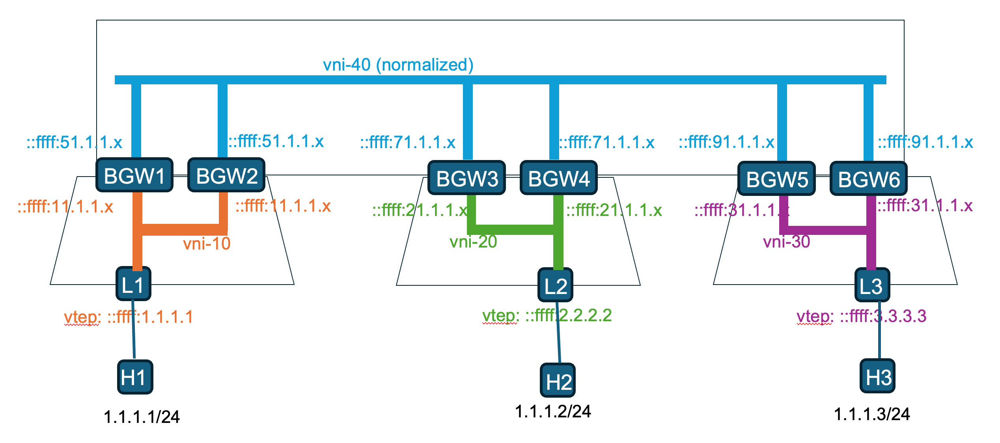
*Figure 1: DCI Architecture Overview*

The diagram illustrates three data centers interconnected over a WAN. Each data center connects to the WAN through a redundant pair of BGW nodes that provide DCI (Data Center Interconnect) functionality. Connectivity across the multi-site WAN is normalized between sites, and the WAN may optionally include a BGP route server.

Here's a detailed summary of the DCI (Data Center Interconnect) functionality:

* BGW Node Configuration
  - BGW nodes can be spine
  - BGW nodes may also run as separate nodes
  - BGW may have directly connected hosts or orphan ports
  - Pair of BGW nodes per data center
  - Normalized VNI – symmetric VNI across data centers
  - Full VXLAN tunnel termination, lookup and re-encapsulation at BGW
  - Support of L2 and L3 connectivity at the BGW node

* Network Design Simplifications
  - Presence of route reflector or route server within WAN and DC
  - May use AnyCast VTEP for overlay
    - No ESI (Ethernet Segment Interface) support
    - Simplified design by removing DF election and filtering
  - VTEP can either be IPv4 or IPv6

* Route Handling
  - Route targets rewrites based on source and destination data centers AS number and normalized-VNI value
  - End-to-end vMotion Sequence number handling
  - Ingress replication routes are locally significant to DC/WAN

* Policy and Advertisement
  - BGP Implicit and Exlicit route policy with route summarization
  - EVPN advertisement limited to:
    - Type 1 for mass-withdraw and aliasing
    - Type 2 for host advertisement; re-origination at BGW
    - Type 3 for ingress replication
    - Type 4 for Ethernet Segment and Multi-homing using per site-id
    - Type 5 for subnet advertisement; re-origination at BGW

The BGW / DCI solution plays an important role in data center deployment as a "swiss army" knife.
The main advantages are:

- Multi-hop native L2/L3 DC
  - Allow simple and easy DC extension for L2 and L3 services
- Scaling feature e.g., VTEPs, ingress replication endpoints, etc.
  - Allow to blast radius of some component to be small
  - Easy of hardware resources
- Ownership separation
  - Allow to extend DC across different owners
- Coexistence of different technology e.g., ACI, standalone, etc.
  - Allow to extend DC across different technologies
- Policy boundary
  - Allow route policy to control what is in/out from a specific DC
- Multi-VRF Northbound BGP / peering
  - Allow to extend DC to Northbound peer

For example, consider a customer who initially built a small data center with 2 spine switches and 4 leaf switches. As the customer looks to expand, the straightforward approach is to add more leaf switches and possibly additional spines. This expansion directly impacts the existing setup and configuration: it requires more VTEPs, additional tunnels, and larger ingress replication lists with more endpoints. The devices will also need increased hardware resources to accommodate the larger data center.

Using Data Center Interconnect (DCI) simplifies this process. Instead of significantly changing the existing configuration or upgrading hardware, the customer can expand by adding another similar data center (with 2 spines and 4 leafs) and interconnecting it. This allows for seamless growth without major configuration changes or hardware upgrades.

A second layer of spine switches (super-spine) can also be introduced, serving as Border Gateway (BGW) devices to connect with external WAN networks. If a tunneling technology such as IPsec is used for connectivity, the existing underlay encapsulation can remain unchanged. For example, the connection can be established using VXLAN over an IPsec tunnel.

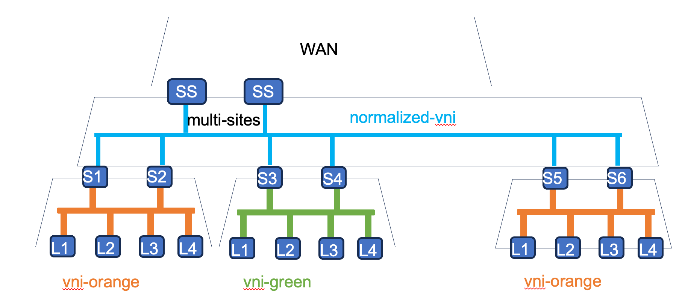
*Figure 2: DCI / Multi-site Advantages*

### 5. Requirements
DCI functionality delivers the core foundation Layer-2 services, Layer-3 services and multi-homing support for redundant BGW nodes.

#### Functional Requirements
The requirements are:

- Establish VxLAN EVPN-based DCI between multiple data centers using multi-site architecture as per IETF recommendation
- Node resiliency connecting DC to WAN
- Support for transparent Layer-2 extension
- L2VNI normalized across Multi-site
- Enable VM mobility with Inclusive Route Origination (IRO)
- vMotion capabilities have global scope
- Implement BGP Route Target (RT) translation for ingress/egress traffic
- VxLAN tunnels can be either IPv4 or IPv6 (VTEP)
- BGP policy over L2VNI is implicit
- Per tunnel traffic counters
- Ensure control plane and data plane separation
- Support multi-tenancy and scalable segmentation
- L3VNI tunnel termination facing DC into IPv4/IPv6 unicast towards Northbound customer
- Integrate with SONiC management interfaces (CLI, REST, SNMP)
- Support for Layer-3 segmentation and stitching
- Support of locally connected host and orphan port on DCI nodes
- Support of ESI and multi-homing machinery on DCI nodes
- Support the concept of site-id per Ethernet Segment
- vMotion capabilities with local scope
- Configuration of domain specific BGP route-target
- Explicit BGP policy over VNI

#### Non-Functional Requirements
- Fast convergence during migration and failover
- Minimal impact on existing SONiC boot and memory performance
- Backward compatibility with existing SONiC deployments

#### Interoperability Requirements
- Compliance with DCI, multi-site EVPN and anycast aliasing standards
- Interoperability with third-party EVPN/VxLAN implementations

#### Comparison to IETF Documents
The DCI requirements are mapped to the latest DCI, multi-site EVPN and anycast aliasing documents. Key matching features include:
- Route advertisement and aliasing for MAC/IP mobility
- Anycast IP in the overlay
- Control plane scalability and redundancy
- Policy enforcement via BGP RT translation

Documents are:
- https://datatracker.ietf.org/doc/html/rfc9014
- https://datatracker.ietf.org/doc/draft-rabnag-bess-evpn-anycast-aliasing/
- https://datatracker.ietf.org/doc/draft-sharma-bess-multi-site-evpn/


#### Scale Requirements
| Requirement                   | Comments                    |
|-------------------------------|-----------------------------|
| Pair of remote tunnels per DCI| 10 remote sites             |
| # of VTEPs per site           | 36                          |
| # of MAC per site             | 20K                         |
| # of L2VNI per site           | 256                         |
| # of L3VNI per site           | 10                          |
| # of Leaf per site            | 32                          |
| # of sites                    | 11                          |
| # of host                     | 20K / 40K with IRO          |
| # of redundant BGW per site   | 2 BGW per site              |


### 6. Architecture Design
The DCI architecture seamlessly integrates with existing SONiC infrastructure while extending capabilities to support multi-site connectivity, VM mobility, and advanced policy enforcement. The modular design enables phased implementation and future enhancements.

#### Domain
As part of DCI functionality, concept of domain is introduced at BGW nodes enabling granular control on network entity. For example, in the first picture, there are 4 different domains: 1 per DC and 1 for the WAN. BGW nodes support 2 domains; 1 domain for the connected data center and 1 domain for the WAN.

The domain concept significantly enhances the architecture by enabling a clear separation between the control plane and the data plane. Services are configured directly on the data plane side, such as a bridge domain with tunnel endpoints, where each tunnel connects to a different domain. Control plane establishment occurs on a per-domain basis, resulting in a more streamlined and cohesive architecture.

#### Site
A data center domain interconnects with a WAN domain via a pair of redundant BGW nodes where DCI functionality is provided. That pair of BGW nodes and its DC domain form a site. It is identified by defining a site-id. Both BGW node share that same site-id.

#### Ethernet Segment
In scenarios where there is no directly connected host or orphan ports on BGW nodes and with the usage of anycast VTEP per domain per site, the usage of Ethernet Segment is not required. BUM traffic always hits a side BGW node when ingress replication is performed.

When there are locally connected hosts, and/or when L3 services are enabled, an Ethernet Segment is required to identify the logical connectivity of the data center. The Ethernet Segment Identifier (ESI) is generated using a site identifier (site-id), with one assigned per pair of BGW node per connected data center domain. In this context, the data center is treated as an access network connected to the BGW, where loops must be avoided. As a result, VXLAN tunnels between peering BGWs are only established on either the DC or the WAN side; a configurable knob is used to determine the behavior. The WAN is chosen as default. Each multi-homed host also receives its own ESI, and the site-id is used to determine Designated and Non-Designated Forwarding towards the data center as if it is a connected access device. This approach aligns with best practices for loop-free access connectivity, often enforced by protocols such as STP.

As any typical VxLAN node handling multi-homing, local bias is performed on peering BGW during BUM traffic handling.
The following picture demonstration the logical representation of various Ethernet Segment at play.

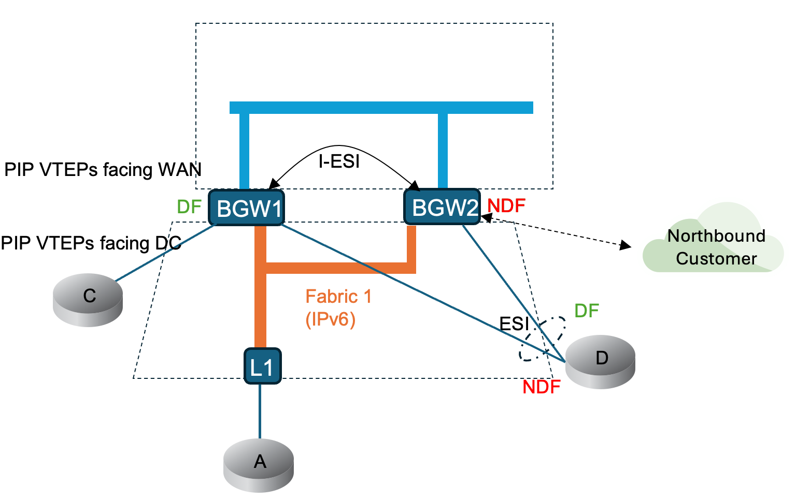
*Figure 3: Ethernet Segments*

#### Forwarding Paradigm
A BGW node performs simple operations to achieve DCI functionality. For each incoming packet from DC/WAN side, a full tunnel disposition chain is performed followed by a lookup based on the inner payload followed by a full tunnel imposition chain. For layer-2 connectivity, it looks like:

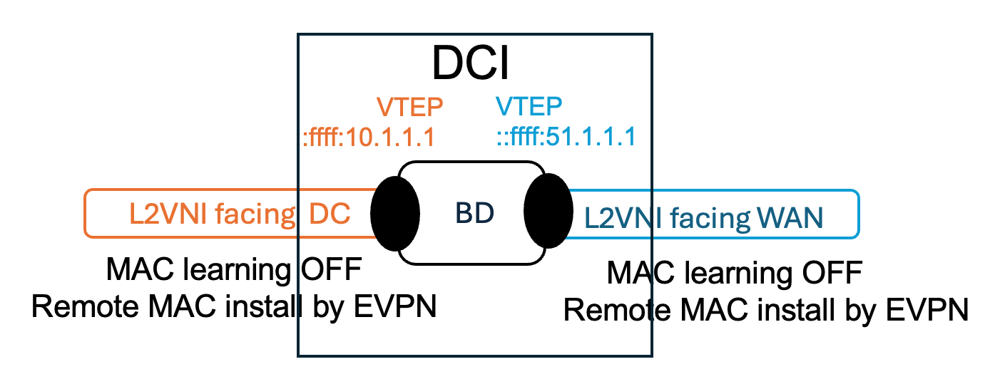
*Figure 4: L2 Forwarding Paradigm*
Dataplane MAC learning is disable on these tunnels / ports. All programmed MAC entries are coming from BGP-EVPN; remote MAC are installed with remote nexthop taken from EVPN RT-2. The same forwarding paradigm is used in both directions

Similarly, for layer-3 connectivity, the forwarding chain looks like:

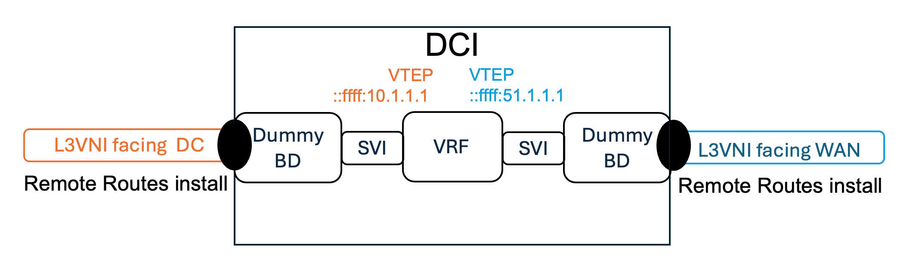
*Figure 5: L3 Forwarding Paradigm*

IP entries are installed in the VRF with remote nexthop taken from either the EVPN RT-2 IP portion or from EVPN RT-5.
Finally, to complete the picture, directly connected host may also be attached to the BGW node. In that case the forwarding chain looks like:

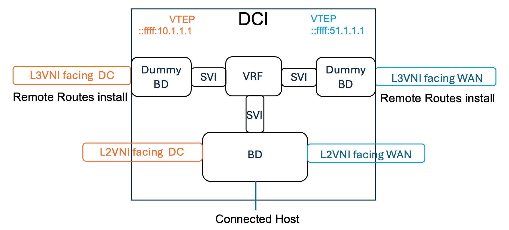
*Figure 6: DCI Forwarding Paradigm*

Since BGW comes generally in pair for redundancy, to support locally connected host on BGW, EVPN Ethernet Segment, DF election, local bias and carving are required. This is well describes in [Ethernet Segment](#ethernet-segment) and [Traffic Flows](#traffic-flows) sections.

Lastly, it may also be possible to run VRF-lite as described in section [Combining BL function with BGW](#combining-bl-function-with-bgw). This allows the BGW to send traffic to external northbound customer. 

#### Remote entries programming
The L2 DCI functionality is achieved by installing EVPN remote MAC received from DC & WAN domains. This allow the MAC lookup to be performed properly after tunnel termination. Similar approach is taken for IP payload where the lookup is performed within the appropriate VRF. EVPN installs remote MAC/IP received from DC & WAN domains.

#### Tunnel Establishment
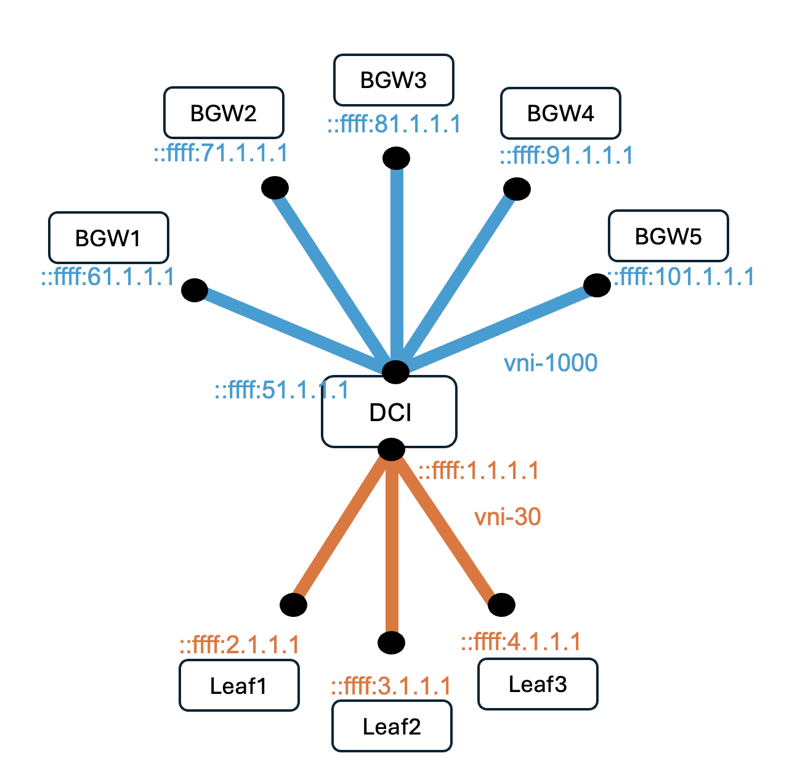
*Figure 7: Tunnels Establishment*

With VxLAN, tunnels are established per source and destination VTEP addresses. During imposition procedures, the association of the VNI value is done per destination VTEP address. In the example of a BGW node, the VNI value differ for each domain / destination. This allows the support of downstream assigned VNI used in a different context/scenario when required.

#### VNI assignment
The implementation is done using a normalized symmetric VNI approach in the WAN interconnecting various data centers.
This approach is geared towards greenfield or fully managed deployments. Main advantages are: simplicity in term of monitoring, statistic, debugability and consistency. This solution also scale much better; it avoid having VNI dependency on the nexthop object. The normalized VNI value must be globally unique across all domains (WAN and data centers).

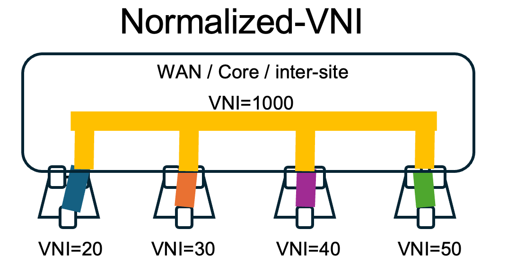
*Figure 8: Normalized-VNI Architecture*

Other NOS may use a difference approach where VNI being used are coming from BGP routes. That assymetric approach is refered as downstream-assign VNI. It is usually used in brownfield deployment where there are already an established WAN connecting data centers using different VNI values. The main advantage is to have a single VNI rewrite across the entire network (instead of two with normalized-vni approach). On the down side, the VNI value being imposed is now dependent of the remote nexthop.

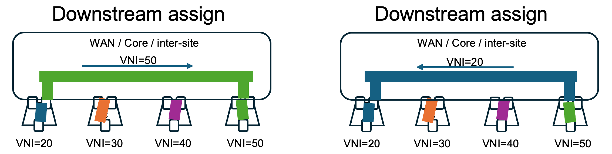
*Figure 9: Downstream-assign VNI Architecture*

##### Asymmetric L3VNI Routing

When Layer-3 services are required in a DCI deployment, an asymmetric L3VNI routing model can be employed. This approach is particularly useful in brownfield environments where different data centers use different L3VNI values for the same tenant VRF, while maintaining a normalized VNI across the WAN for consistency.

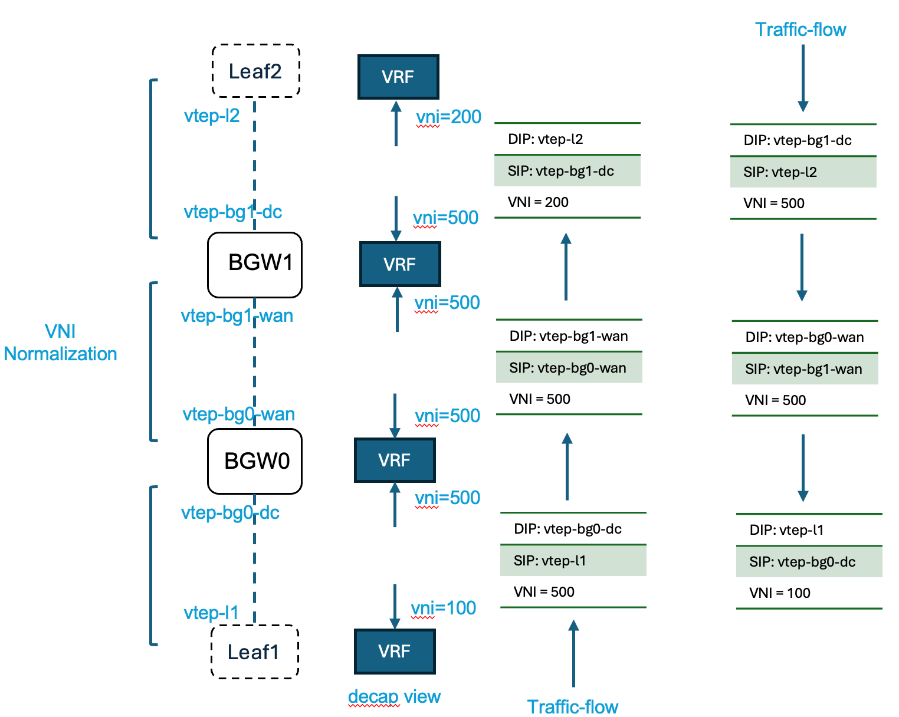
*Figure 10: Asymmetric L3VNI packet flow*

In the asymmetric L3VNI model, as illustrated in the diagram:

**Traffic Flow DC1 → DC2 (Leaf1 → BGW0 → BGW1 → Leaf2):**
- Traffic originates at **Leaf1** in DC1 using **L3VNI 500** (remote DC1 VRF value)
- **BGW0** receives VXLAN packet with VNI=500
- BGW1 performs decapsulation and L3 lookup in VRF
- BGW1 re-encapsulates with **normalized WAN VNI=500** and sends to **BGW1** 
- **BGW1** receives packet, decapsulates, performs L3 lookup
- BGW1 re-encapsulates with destination DC2's **L3VNI 200** and forwards to **Leaf2**

**Return Traffic Flow DC2 → DC1 (Leaf2 → BGW1 → BGW0 → Leaf1):**
- Traffic originates at **Leaf2** in DC2 using **L3VNI 500** (remote DC2 VRF value)
- **BGW1** receives packet with VNI=500
- BGW1 decapsulates, performs L3 lookup in VRF
- BGW1 re-encapsulates with **normalized WAN VNI=500** and sends to **BGW0** 
- **BGW0** receives packet, decapsulates, performs L3 lookup
- BGW0 re-encapsulates with destination DC1's **L3VNI 100** and forwards to **Leaf1**

**Key Characteristics:**
- **End-to-end asymmetric**: DC1 uses L3VNI 100, DC2 uses L3VNI 200 (different values per site)
- **WAN normalization**: BGW-to-BGW traffic uses normalized **VNI=500** in both directions
- **Single VNI translation per direction**: Each BGW translates once at the destination DC (WAN VNI → destination DC VNI)
- **VRF consistency**: Same VRF context maintained across all sites despite different VNI values
- **Per-domain VTEP addressing**: Separate VTEP IPs for DC-facing (vtep-bgX-dc) and WAN-facing (vtep-bgX-wan) interfaces
- **Routing lookups**: Performed at each BGW during VNI translation

This hybrid approach combines the benefits of:
- **Normalized WAN VNI** (VNI=500) for simplified WAN operations and monitoring
- **Site-specific DC VNIs** (VNI=100, 200) allowing brownfield integration and per-DC autonomy

The trade-off is increased complexity at the BGW nodes, which must maintain VNI mappings for both DC and WAN domains.

#### VTEP address
There is a design choice for the implementation regarding VTEP IP address assignment: using either a Physical IP address (PIP) or an Anycast virtual IP address (VIP). Originally, SONIC VxLAN implementation has been done using PIP approach. For leaf type of implementation, it generally works very well. EVPN multi-homing machinery was also developped around that concept.

In a Layer-2 only DCI usecase, when there is no requirement of support for orphan port and/or direclty connected host on BGW nodes, the usage of anycast VIP simplify greatly the solution. With anycast VIP, there is no need to support EVPN multi-homing between peering BGW nodes. L2 unicast and BUM traffic always hit a single BGW node from the data center and from the WAN side. There is no need for DF election and any blocking scheme regarding L2 BUM traffic coming in/out from DC/WAN to WAN/DC. VTEP addresses scope is per domain i.e., a different VTEP is used facing connected data center from the one used on the WAN side allowing tunnel separation per domain.

When locally connected hosts are present, anycast VTEP is no longer suitable. A physical VTEP (PIP) must be used to ensure proper connectivity and redundancy. Since the BGW operates as a redundant pair, host connectivity must survive failures on either BGW node or its peer, requiring EVPN multi-homing capabilities that depend on unique physical VTEP addresses.

Additionally, when L3 services are enabled, physical VTEP must be used. In some deployments, both anycast and physical VTEPs may operate together using the VIP for L2 services and the PIP for L3 services. The exact combination depends on the specific setup and supported features.

#### Forwarding Tables
When customers use anycast VTEP, it does not change how forwarding tables are built and how entries are resolved. For instance, there is no need for an extra recursion. The following pictures illustrate how FIB and FDB tables are built based on anycast VIP.
The first picture shows an example with separate Spine and BGW nodes.

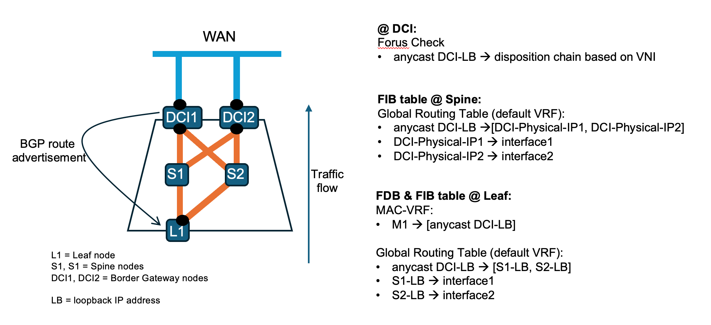
*Figure 11: Separate BGW and Spine nodes*

This second picture illustrates spine nodes playing also the role of BGW.

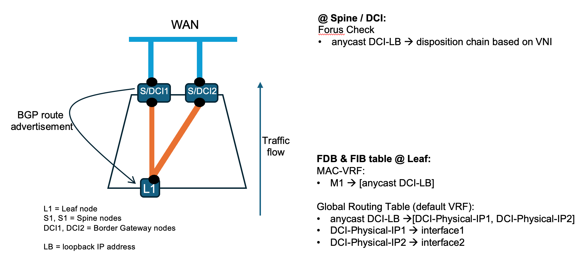
*Figure 12: Combine BGW and Spine nodes*

The usage of physical VTEP works in a very similar way; forwarding tables remains simple as illustrated above.

#### Traffic Flows
There are variant of the traffic flows for L2 connectivity. Following sub-sections are describing them:

##### Anycast VTEP - no directly connected host / orphan port
All packets, whether BUM or unicast, are handled similarly. With anycast VTEPs configured per domain on BGW nodes, traffic forwarding uses underlay ECMP, so a BGW pair appears as a single device to remote nodes. Upon reaching the destination data center, BUM traffic is distributed using ingress replication, while unicast traffic is typically forwarded via underlay ECMP or direct paths.

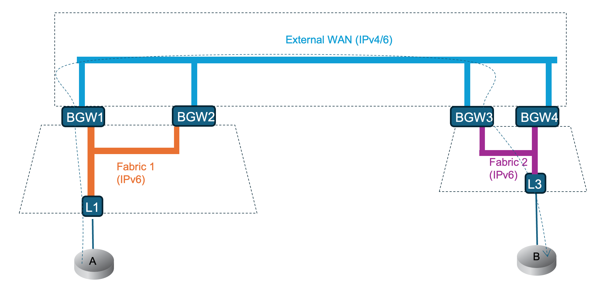
*Figure 13: Traffic flow - Anycast VIP, no orphan port*

##### Ethernet Segment - directly connected host / orphan port
Packet flows are different with the presence of locally connected host and/or orphan port. BUM packets coming from locally connected hosts are treated with local bias logic. The following picture shows the flow for BUM traffic coming from locally connected host at the BGW.

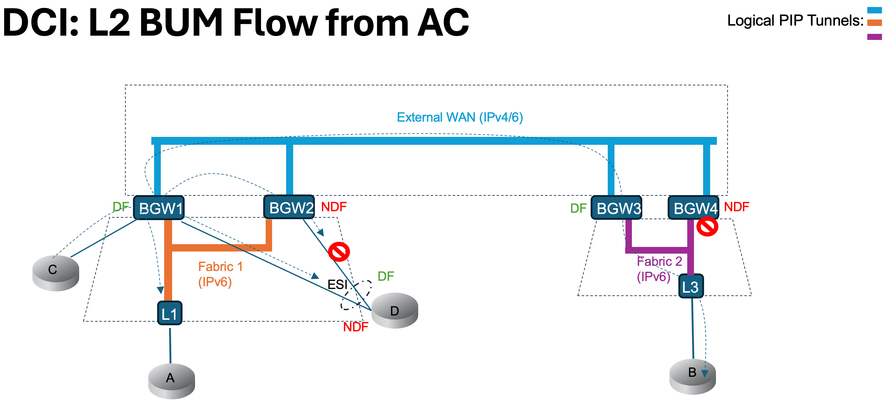
*Figure 14: Traffic flow - Connected Host*

First, local bias is performed on BGW1. Traffic is flooded to DC where ingress replication happens towards all leafs, to multi-homed H2 and to WAN side where ingress replication is also performed. BUM traffic is received on both BGW3 and BGW4 as well on peering BGW2. On BGW2, traffic is mainly dropped to all destinations. In a presence of a single-homed connected host, traffic will have been forwarded to that host.

The next pictures shows the flow for BUM traffic coming from remote BGW (WAN site).

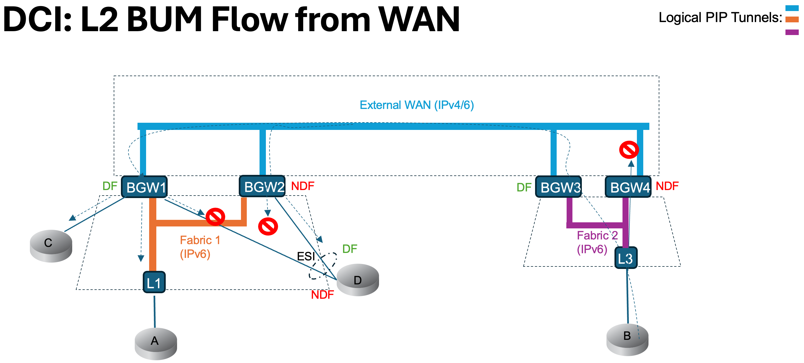
*Figure 15: Traffic flow - Connected Host (Remote)*

In this case, DF election filtering is applied over BUM traffic. Traffic is coming from BGW3 and is replicated to BGW1 and BGW2. On BGW1, traffic is forwarded to C and DC side (DF) where ingress replication happen. Traffic is not forwarded to D due to NDF. On BGW2, traffic is forwarded to since it is DF.

Finally, the next picture shows the flow for BUM traffic coming from DC side.


*Figure 16: Traffic flow - Connected Host (DC)*

BUM traffic originating from the data center is received by both BGW nodes. Standard VxLAN multi-homing DF election filtering rules apply. Traffic is forwarded to DF and dropped when DF.

#### Packet Flows
The image below illustrates the packet stack at each node as traffic traverses the multi-site network. The VXLAN header changes in each domain because it is fully terminated and originated at the BGW and leaf nodes. The example shown is for L2 unicast traffic from host A. The same principles apply to Layer-2 BUM (Broadcast, Unknown Unicast, and Multicast) traffic, except the destination MAC address is set to all F's (broadcast) instead of a specific MAC address.
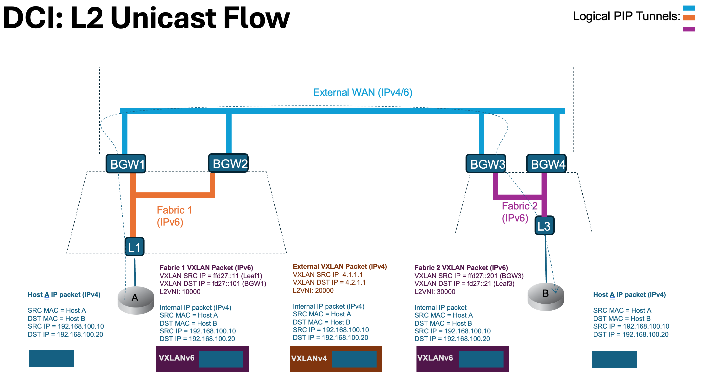
*Figure 17: Packet Flow - Layer-2*

Similarly, the packet flow for Layer-3 connectivity over L3VNI is shown here. The main difference resides on the inner Ethernet Header. As per VxLAN standard, source and destination router MACs are used for routing packets (inter-subnet forwarding).
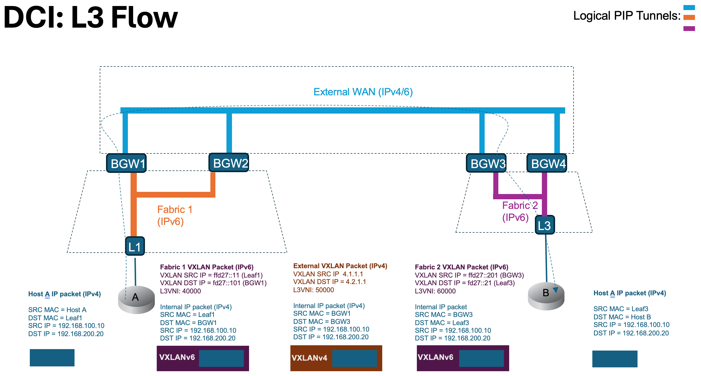
*Figure 18: Packet Flow - Layer-3*

#### Mobility 
VM mobility across sites is achieved via L2VNI connectivity across sites. Ingress Route Optimization (IRO) is provided to connect outside customer to a specific appliance within a data center. Connectivity is kept with IRO during motion.

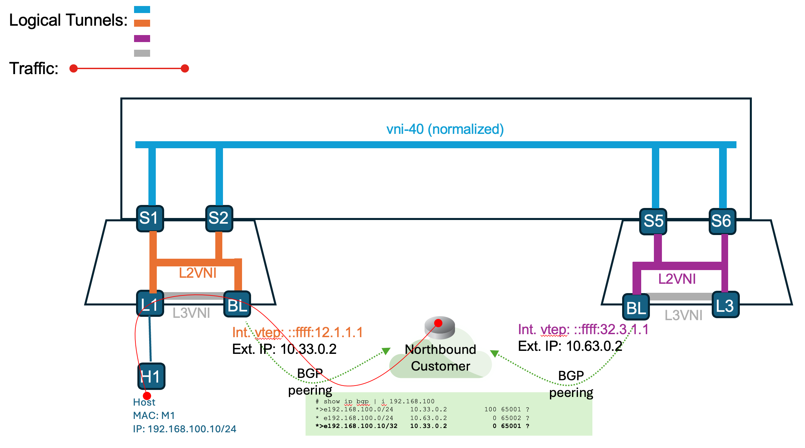
*Figure 19: VM mobility - Initially*

H1 has connectivity with a customer outside DC. That customer is connected via an IP network to a border leaf. VxLAN is not extended to that customer; it is purely IPv4/IPv6 in global routing table.
When H1 moves behind leaf-3, it must maintains it's connectivity. This is achieved by supporting MAC mobility and advertising proper host route to border leaf. Using BGP peering, forwarding tables are getting properly updated on all domains. Northbound customer still have optimized forwarding to H1 post-motion. 

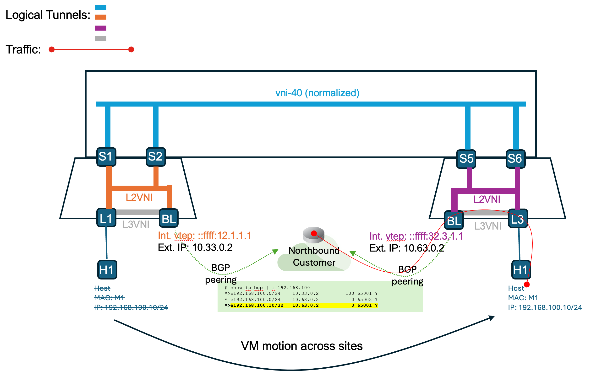
*Figure 20: VM mobility - Post Mobility*

EVPN mobility procedures are followed, with the scope of updates being either global (across multiple sites) or local to a specific site. For example, thew scope is global when a host moves within the same site, RT-2 updates with an incremented sequence number are sent to all remote leaf switches in every remote site. However, this broad update is technically unnecessary, since all remote leafs already have host reachability information pointing to the same site, and the site itself has not changed.

This process can be optimized to operate on a per-site basis. With this improvement, RT-2 updates for host moves within the same site is limited to the local site and does not affected all remote leaf switches. Only traffic arriving at the Border Gateway (BGW) node from the WAN is directed to the appropriate leaf.

The following picture describes the entire motion seen previously across datacenters with multi-site technology.
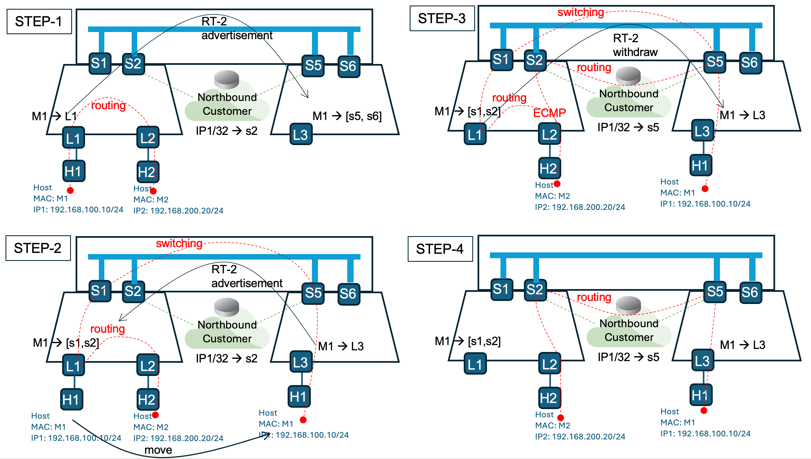

The diagram illustrates VM mobility across data centers with Ingress Route Optimization (IRO) enabling external northbound customer connectivity throughout the migration.

- **Step-1 (Initial state):** H1 (192.168.1.10/24) is connected to L1 in DC1. H2 (192.168.2.20/24) is connected to L2 in DC2. RT-2 MAC-only routes are advertised to remote DC sites. RT-2 MAC-IP routes and RT-5 prefix routes are advertised within the local DC. Inter-subnet traffic between H1 and H2 routes through L1 → S1/S2 → L2.

- **Step-2 (H1 moves to DC2):** H1 physically moves behind L3 in DC2. L3 advertises updated RT-2 MAC-only route to DC1 with increased mobility sequence number. RT-2 MAC-IP and RT-5 routes are advertised within DC2. L1 updates its forwarding table based on MAC mobility signaling. The Northbound Customer receives updated /32 host route from S5, pointing to the new location. Traffic from H2 to H1 now routes via L1 → [S1, S2] → WAN → [S5, S6] → L3.

- **Step-3 (Routing convergence):** All routing tables converge across both data centers and WAN. L1 withdraws its previous RT-2 and RT-5 advertisements for H1. Some return traffic from Northbound Customer may briefly transit through DC1 during convergence as BGP best path selection completes. The Northbound Customer's routing table now points exclusively to S5's advertised /32 host route for H1.

- **Step-4 (Optimal forwarding restored):** Forwarding tables stabilize with optimal paths. Traffic between H1 and H2 routes directly: H1 → L3 → S5 → Northbound Customer → S2 → L2. The Northbound Customer maintains uninterrupted connectivity to H1 via S5's /32 host route advertisement, demonstrating successful IRO-enabled mobility.

#### Mobility with L2VNI and L3VNI

Multi-site mobility is more commonly achieved by properly leveraging both L2VNI and L3VNI together. While using a backdoor link via a third-party network is sometimes considered, this approach is often not feasible or desirable. Instead, by fully utilizing EVPN RT-2 (MAC-IP) routes, routing reachability is established directly through the WAN, enabling seamless host mobility across data centers without requiring external connectivity paths.

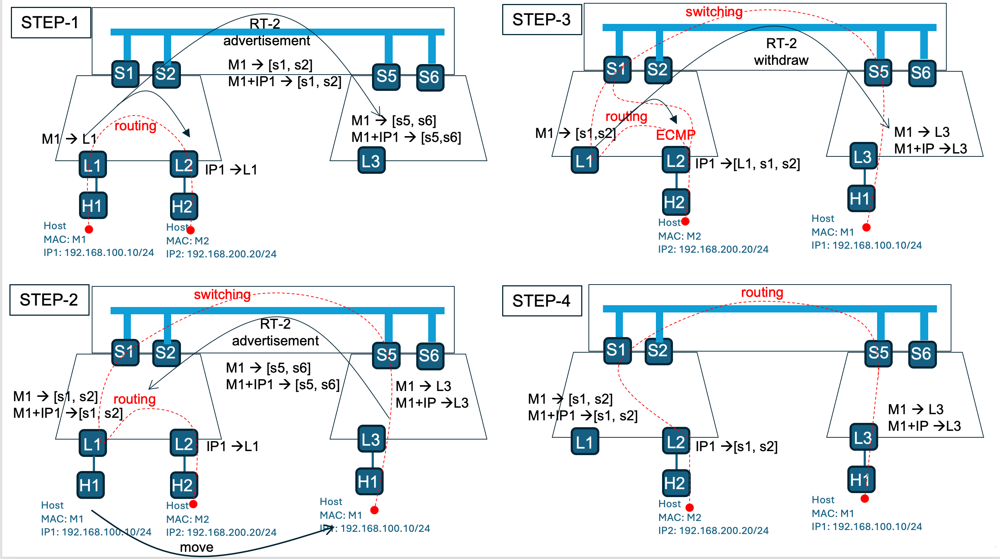

The diagram illustrates host mobility across data centers using both L2VNI (switching) and L3VNI (routing) connectivity.

- **Step-1 (Initial state):** H1 (MAC: M1, IP: 192.168.100.10/24) is connected to L1 in DC1. H2 (MAC: M2, IP: 192.168.200.20/24) is connected to L2 in DC2. RT-2 advertisements propagate M1 and M1+IP1 to spine switches [s1, s2] locally and [s5, s6] remotely. Inter-subnet traffic between H1 and H2 is routed through L1 → [s1, s2] → L2.

- **Step-2 (H1 moves to DC2):** H1 physically moves behind L3 in DC2. L3 advertises updated RT-2 routes with M1 → L3 and M1+IP1 → L3 with increased mobility sequence number. Route is re-originated by s5, s6 and s1, s2. L1 and L2 update their forwarding tables. Traffic from H1 now routes through L3 → [s5, s6] → WAN → [s1, s2] → L1 → L2.

- **Step-3 (Routing convergence):** All spine switches complete routing table updates. L1 withdraws its previous RT-2 advertisements for H1. Traffic briefly from H2 transitions through spines and still L1 as convergence completes. IP1 forwarding entry on L2 points to [L1, s1, s2] via ECMP.

- **Step-4 (Optimal forwarding restored):** Forwarding tables stabilize. Traffic between H1 and H2 now routes optimally: H1 → L3 (M1 → L3, M1+IP → L3) with direct Layer-3 routing between data centers.


#### Combining BL function with BGW
Extending connectivity to a northbound customer by adding a BL node can be costly or even unfeasible due to certain restrictions, which may lead customers to avoid this approach. Instead, the solution is to combine the BL functionality with the BGW node. The following diagram illustrates a combined BGW/BL node providing external connectivity.

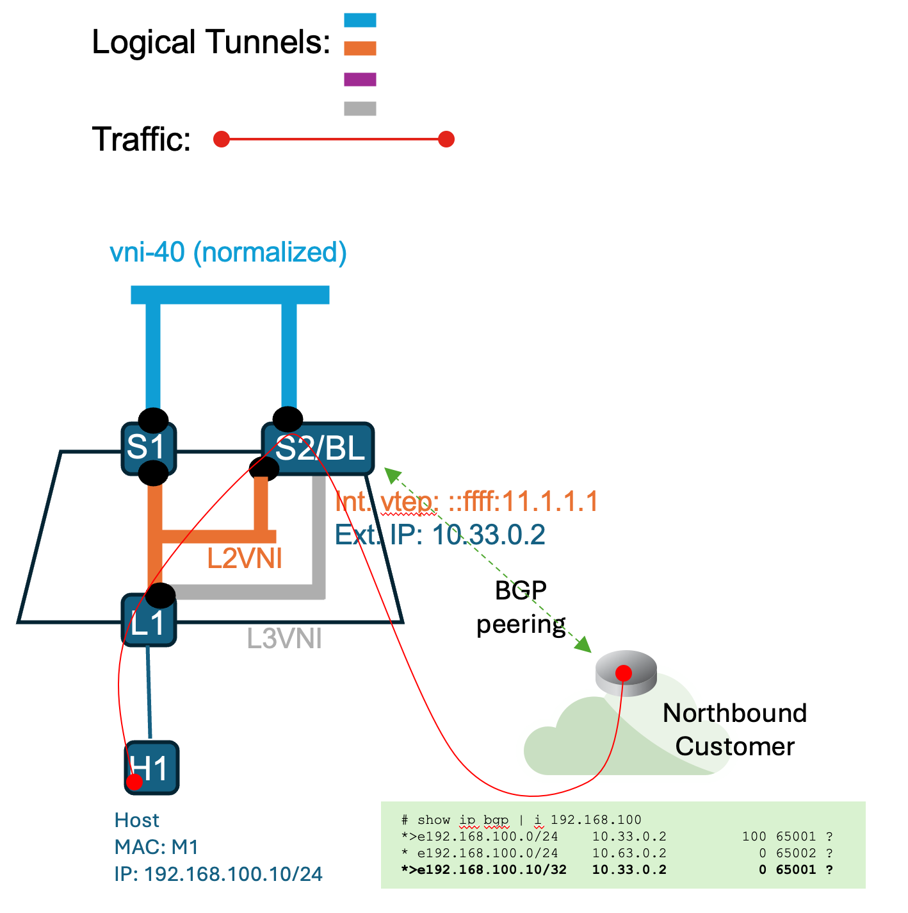
*Figure 21: Combined BGW / BL*

External connectivity in this scenario does not use a VxLAN tunnel; instead, it relies on standard IPv4 or IPv6 routing. The typical approach is VRF-lite. A physical VTEP is configured with an L3VNI to provide Layer-3 connectivity from the data center side. At the BGW, the Layer-3 VxLAN tunnel is removed, and an IP lookup is performed within the relevant VRF. Traffic is then forwarded northbound to the customer through a connected Layer-3 interface (such as Ethernet0).

The BGP peering session is established within the VRF using the IP address of this interface. Any routes advertised to northbound customer will use this IP address as the next hop. With VRF-lite, each VRF typically has its own local Layer-3 interface, but this can also be achieved using different sub-interfaces with separate VLANs.

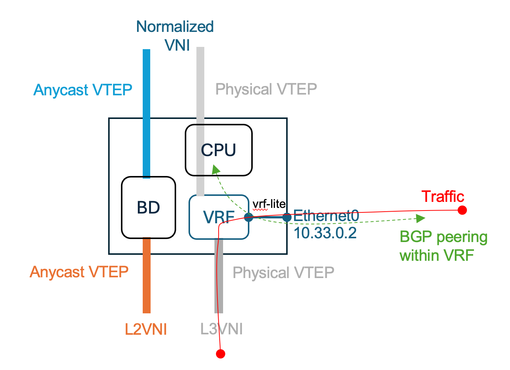
*Figure 22: VRF-lite on BGW*

#### Control Plane
BGP control plane is extended in multiple ways to support the new DCI functionality:

- The concept of domain is introduced in BGP. This provides future proof flexiblity to interconnect multiple domains together. Moreover, it provides a clear separation between control plane and data plane
- It maps domain configuration with per tunnel information coming from the linux kernel (given from SONiC)
- It maintains individual ingress replication list per domain for Layer-2 BUM traffic
- It manages the EVPN route redistribution across domains:
  - RT-1, RT-2 and RT-5 are redistributed
  - RT-3 are terminated per domain
  - RT-4 are exchanged between a pair of BGW via DC peering side
- It provides proper information for tunnel establishment
  - VxLAN tunnel between peering BGW from DC/WAN side is kept down
- Mobility across sites
- RT-translation across domains
- Policy enforcement and route summarization
- Supports dynamic import/export of route targets for flexible segmentation

##### Route Re-origination

When BGW provides Layer-2 only DCI functionality, only MAC route need to be re-originated. EVPN RT-2 carrying host information from DC are not fully re-originated; some fields are dropped to ensure proper functionality across multi-site. RT-2 MAC-only routes are re-originated with proper mobility BGP extended community. RT-2 MAC-IP routes and RT-5 are dropped. A new FRRouting configuration knob is provided to enable that under bgp. For instance:
```
router bgp 6543
   address-family l2vpn evpn
     advertise-mac-only      <-----NEW CLI----->
```

#### Failure Scenarios
When deploying a new solution, it is important to analyze five key types of failure, commonly referenced in engineering specifications as Types A, B, C, D, and E:

- Failure A: Local interface failure
- Failure B: Link failure (e.g., fiber cut)
- Failure C: Remote interface failure
- Failure D: Node down
- Failure E: Core/network isolation (access interfaces remain up, but the core-facing network is isolated)

##### Failure Scenarios and Recovery with Anycast VTEP
The following diagram illustrates each failure type and the corresponding recovery process when using anycast VTEP on Border Gateway (BGW) nodes.

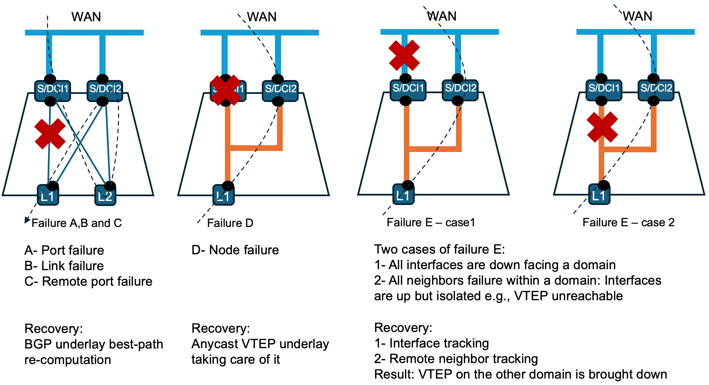
*Figure 23: Failure Scenarios with anycast VTEP*

- Failures A, B, and C (link/interface failures):
These events trigger the IGP (eBGP in this scenario) to recompute the best path and update forwarding chains. Alternate paths are available as the leaf VTEP loopback address remains reachable within the data center underlay. For example, if traffic from the WAN to DCI-1 is impacted, it can be rerouted via L2 and DCI-2 to reach L1, avoiding blackholing, although this is not the optimal route. With anycast VTEP, this non-optimal routing persists until the failure is resolved. The reverse traffic path is optimal, as Leaf1 can send traffic directly to DCI-2.

- Failure D (node down):
Anycast VTEP enables rapid convergence. When a BGW node’s anycast IP becomes unreachable in the underlay, its IP address/nexthop is automatically removed from forwarding tables on all other nodes.

- Failure E (core/network isolation):
This scenario is more complex and can show up in two forms:

  - All interfaces to a domain are down: The node still exists in the other domain and continues to attract traffic. Detection relies on interface tracking on the BGW node.
  - All interfaces to a domain are up, but all remote neighbors are unreachable: Neighbor tracking on all remote nodes within the domain is used for detection.
In both cases, the solution is to administratively remove the anycast VTEP from the remaining connected domains to prevent further traffic attraction.

##### Limitations and Future Improvements
Anycast VTEP provides excellent convergence for node failures (Type D) and partial protection for link/interface failures (Types A, B, and C). However, it also introduces some limitations:

- BGP route withdrawal does not always stop traffic attraction, as anycast IPs may continue to be advertised by peering BGW nodes.
- Establishing a backup tunnel between BGWs with the same anycast VTEP is not possible, preventing the use of fast reroute mechanisms.

A combination of anycast VTEP (VIP) and physical VTEP may be implemented to enhance resilience across all failure types.

Here is summary table of Failure Types:

| Failure Type | Description              | Detection Method           | Recovery Action                          |
|:------------:|:-------------------------|:---------------------------|:-----------------------------------------|
| A            | Local interface failure  | Link monitoring            | eBGP path re-computation                 |
| B            | Link (e.g., fiber cut)   | Link monitoring            | eBGP path re-computation                 |
| C            | Remote interface failure | Link monitoring            | eBGP path re-computation                 |
| D            | Node down                | Underlay reachability check| Remove anycast IP from routing tables    |
| E            | Core/network isolation   | Interface/neighbor tracking| Remove anycast VTEP from other domains   |


#### Peer Link and Isolation Behavior using physical VTEPs

The diagram illustrates the logical overlay architecture for a redundant BGW pair (DCI1 and DCI2) using physical VTEPs with multi-homing support.

**Key Components:**
- **BGW Nodes (DCI1 DF, DCI2 NDF):** Each BGW node terminates both DC-facing L2VNI and WAN-facing L2VNI' tunnels
- **Connected Hosts:** Single-homed host H1 connects to DCI1 only; Single-homed host H3 connects to DCI2 only; multi-homed host H2 connects to both DCI1 and DCI2 via ESI
- **Overlay VxLAN Tunnel:** DCI1 and DCI2 are interconnected via WAN-side overlay tunnel for peer communication
- **SVI Interfaces:** Each BGW operates a distributed anycast gateway using shared SVI configuration
- **Ethernet Segments:**
  - **I-ESI (Inter-chassis ESI):** Assigned to the BGW pair to determine DF/NDF roles for DC and WAN-facing traffic forwarding
  - **H2 ESI:** Separate multi-homing ESI for host H2's redundant connectivity to both BGWs
- **Traffic Domains:** Clear separation between DC domain (L2VNI) and WAN domain (L2VNI') with SVI providing Layer-3 gateway services
- **Underlay:** WAN and DC fabric may use different underlay (IPv4/IPv6) so their VTEPs

This architecture enables loop-free forwarding with DF/NDF election, local bias for locally connected hosts, and resilient connectivity through redundant BGW nodes.

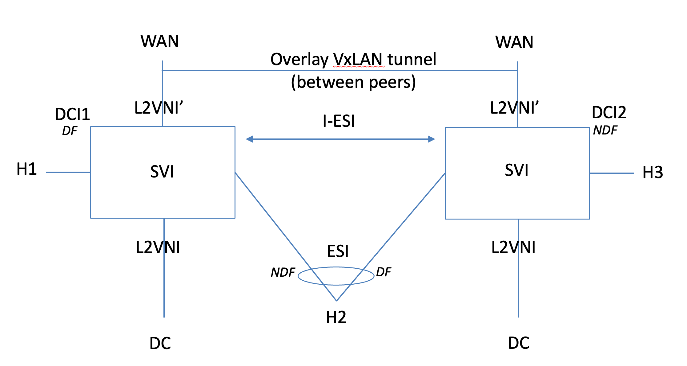

A primary objective is to maintain reachability and EVPN stability during partial isolation events where either WAN or DC connectivity is lost on a BGW node. As described in the split-horizon group section, specific forwarding rules handle BUM traffic in these scenarios. Reachability must be preserved between locally connected hosts and hosts within the local DC or remote sites.

Two fundamental approaches exist: extending EVPN overlay capabilities or relying on underlay routing. The underlay approach is preferred for its simplicity and stability where the overlay/EVPN control plane remains unaffected by isolation events.

For underlay-based recovery, two solutions are available:

1- Route leaking: Advertise DC VTEP loopbacks into WAN and vice versa. This works well in homogeneous environments but becomes problematic with mixed underlays. For example, when WAN uses IPv4 and DC uses IPv6, dual-stack support is required throughout both domains, which may not be feasible.

2- Peer link: Establish a dual-stack L3 link between BGW nodes that participates in both DC and WAN underlay routing. This is not a special L2 trunk or bridging mechanism; it functions as a standard routing hop. It enables WAN to reach VTEP_WAN(DCI1/2) via the peer DCI and DC to reach VTEP_DC(DCI1/2) via the same path when direct connectivity fails.

##### Peer Link Design: Underlay & eBGP

Underlay characteristics:
- Physical link (or LAG) between DCI1 and DCI2, configured as pure L3.
- Dual-stack addressing on the same link (IPv4 + IPv6).
- IPv4 participates in WAN underlay routing (IGP or eBGP).
- IPv6 participates in DC underlay routing (IGP or eBGP).

Routing / eBGP considerations:
- Run eBGP (or IGP) over IPv4 to advertise VTEP_WAN of both DCIs.
- Run eBGP (or IGP) over IPv6 to advertise VTEP_DC of both DCIs.
- Ensure next-hop and recursion let WAN → DCI2 → DCI1 and DC → DCI2 → DCI1 work cleanly for DCI1 WAN isolation (as example)
- Set metrics so this path is used only when direct fabric paths are lost.

##### WAN Isolation on DCI1
Failure: DCI1 loses its WAN underlay connectivity.
- WAN fabric cannot directly reach VTEP_WAN(DCI1).
- Because of the IPv4 peer link:
  - WAN routes to VTEP_WAN(DCI1) via DCI2 → DCI1.
  - EVPN sessions/RT-4 remain up (no control-plane flap).
  - H1 and other endpoints behind DCI1 remain reachable from WAN.

##### DC Isolation on DCI1
Failure: DCI1 loses its DC underlay connectivity.
- DC fabric cannot directly reach VTEP_DC(DCI1).
- Because of the IPv6 peer link:
  - DC routes to VTEP_DC(DCI1) via DCI2 → DCI1.
  - EVPN sessions/RT-4 remain up on DC side.
  - H1 and other endpoints behind DCI1 remain reachable from DC.

##### AC-originated BUM
AC-originated BUM (e.g., from H1 or H2):
  - Ingress DCI floods to DC, WAN, local ACs, and peer DCI (per design rules).
  - Peer DCI applies EVPN MH local bias:
      - Floods only to single-homed ACs + SVI.
      - Never floods to MH ACs (like H2).
      - Does not re-flood into DC or WAN fabrics.
This prevents loops and duplicate copies while keeping reachability.

### 7. High-Level Design

#### Feature Implementation
DCI is implemented as a built-in SONiC feature, with modular extensions for future enhancements (e.g., multi-site stitching, advanced segmentation).
The extension and modifications required to support DCI functionality are affecting both control plane and data plane.

#### Control Plane Modules
FRRouting BGPd and Zebra are modified:

- BGP configuration and show command
  - Add the support of the concept of domain and stitching across domains
  - Add the support for route-target stitching
  - Add the support of Multi-homing Ethernet Segment site-id
- Neighbor based domain support
- Allow Multiple VNI to map to the same BD
  - Extend access bridge to support a list of VNI and VxLAN tunnel
  - The Vlan ID is passed to BGP as bridge ID
  - BGP Used the bridge ID to stitch the VNIs
  - bgpevpn_bridge container will contain the stitched VNI list
- Allow Multiple VNI to map to the same dummy BD / VRF
- API extension to retrieve domain information from linux kernel
- Establish the association of BGP domain and its configuration with incoming per domain tunnel information from linux kernel. This allow the establishment of local associativity between VRF, VTEP, VNI and domains.
- EVPN route re-origination: RT-2 and RT-5 along with extended communities
- Extension to support per domain ingress replication list for BUM traffic
- Auto-generation of domain specific BGP route-target
- Sending the source VTEP as part of MAC and IP updates to Kernel and fpmsyncd

The linux kernel and iproute2 package are also extended to support the concept of domain per VTEP / VxLAN tunnel

#### Data Plane Modules
Various modules in SONiC are modified:

##### Database Schema

Few tables are updated to support DCI functionality.

**VXLAN_FDB_TABLE**

Add source_vtep in VXLAN_FDB_TABLE
```
VXLAN_FDB_TABLE: {
  ...
  "remote_vtep": "fd27::233:d0c6:fed5",
  "source_vtep": "vxlan_local",  // <-- NEW FIELD
  "type": "dynamic",
  ...
}
```

**VXLAN_REMOTE_VNI_TABLE**

Add source_vtep into key
```
"VXLAN_REMOTE_VNI_TABLE:vxlan-local:Vlan10:fd27::233:d0c6:fed5": // <-- vxlan-local added to key
{
  ...
}
```

**VXLAN_VRF_TABLE**

Vrf to VNI map is shared by multiple vteps, need replicate following table for both local and inter-DC VTEP according to vlan-vni map.
```
"VXLAN_VRF_TABLE:vxlan-l3:evpn_map_5030_Vrf01"// <-- vxlan-l3 added to key
{
  ...
}
```
**VXLAN_TUNNEL_TABLE**

Add source vtep info in key
```
"VXLAN_TUNNEL_TABLE|EVPN vxlan-local:fd27::233:d0c6:fed5" // <-- vxlan-local added to key
{
  ...
}
```

**ROUTE_TABLE**

Could not use vrf_id to get source vtep anymore​
```
ROUTE_TABLE:Vrf01:10.212.10.0/24":{
  "value": {
    ...
    "ifname": "Vlan30,Vlan30",
    "source-vtep": "vxlan-l3",  // <-- NEW FIELD
    ...
  }
}
```

##### ConfigMgr / VxLANMgr
Following are required:
- Add configuration support for domains
- Add configuration support for multiple VTEPs
- Add distinct tunnel maps per P2MP tunnels
- Add configuration support for multiple VNI per VRF
- Add configuration support to associate VRF/VNI map to tunnel
- Add support of domain names referencing instead of using VTEP names

##### SWSS
Orchagent is extended to support the following functions required to support DCI feature set.

- Support of multiple P2MP tunnels per bridge domain. SONiC allows only one tunnel configuration per bridge domain.
- Support of attaching distinct tunnel maps. All tunnels are currently assigned to same tunnel mapper.
- Support of multiple VNI map per VRF
- Support for multiple source VTEPs per MAC and IP updates
- Support for multiple source VTEPs per L2 nexthop groups

**FDBSYNCD**

Adding of source VTEP of IMET data into VXLAN_REMOTE_VNI_TABLE. It provides the ability to support multiple ingress replication list per bridge domain.

**VXLANORCH**

Currently, the source VTEP is managed as a single global object retrieved through the evpn_orch->getEVPNVtep() function. The source VTEP is obtained from the getVxlanTunnel(vtep-name) function, which provides both the source VTEP tunnel and the remote VTEP tunnels. That is required to differentiate different tunnels on the same bridge domain.

**ROUTEORCH AND NEIGHORCH**

Both agents must be updated to add the support of source-vtep to their respective tables.

#### Sequence Diagram
The following sequence diagram illustrates the operational flow for DCI service creation and notification to dataplane:

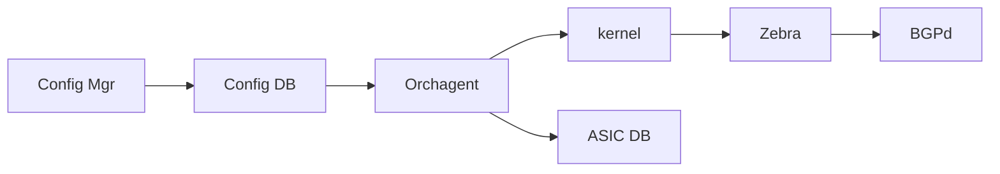
```mermaid
flowchart LR
    cfgmgr["Config Mgr"]
    ConfigDB["Config DB"]
    Orchagent["Orchagent"]
    kernel["kernel"]
    ASICDB["ASIC DB"]
    Zebra["Zebra"]
    bgpd["BGPd"]

    cfgmgr --> ConfigDB
    ConfigDB --> Orchagent
    Orchagent --> kernel
    kernel --> Zebra
    Zebra --> bgpd
    Orchagent --> ASICDB
```
*Figure 24: DCI Service Enablement Sequence Diagram*

The following sequence diagram illustrates the operational flow for remote MAC programming on the DCI:

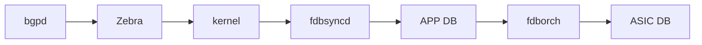
```mermaid
flowchart LR
    bgpd["bgpd"]
    Zebra["Zebra"]
    kernel["kernel"]
    fdbsyncd["fdbsyncd"]
    APPDB["APP DB"]
    fdborch["fdborch"]
    ASICDB["ASIC DB"]

    bgpd --> Zebra
    Zebra --> kernel
    kernel --> fdbsyncd
    fdbsyncd --> APPDB
    APPDB --> fdborch
    fdborch --> ASICDB
```
*Figure 25: Remote MAC programming Sequence Diagram*

### 8. SAI API

No changes are required in SAI to support DCI functionality


### 9. Configuration and Management
DCI requires new configuration to support the functionality on SONIC. The configuration comes in three parts: the new DCI service enablement using SONiC configuration, the extension to FRRouting BGP configuration and finally an extension to Linux Kernel iproute2 packages allowing the support of domain per VxLAN tunnel.

#### 9.1. Manifest (if the feature is an Application Extension)

N/A

#### 9.2. CLI/YANG model Enhancements

##### SONiC DCI Configuration
Service enablement is accomplished by adding a new VTEP and tunnel for each domain. In the example below, bridge domain 10 is configured with two VXLAN tunnels, using L2VNIs 5010 and 6010. The domain name for each VTEP is specified with the add command; in this case, the domain names are DC-SIDE and WAN-SIDE. These domain names must match those configured in FRRouting BGP. This method creates a direct association between the BGP control plane and the dataplane service configuration, ensuring a clear separation between control plane and dataplane.

```
sudo config interface ipv6 enable use-link-local-only Ethernet1_1
sudo config interface ipv6 enable use-link-local-only Ethernet1_2
sudo config interface ipv6 enable use-link-local-only Ethernet1_5
sudo config hostname SD1

sudo config interface ip add Loopback0 fd27::233:d0c6:fed1/128
sudo config interface ip add Loopback1 10.10.10.10/32

sudo config interface ip add Loopback10 fd27::233:d0c6:feda/128
sudo config vlan add 10

sudo config vxlan add DC-SIDE fd27::233:d0c6:feda
sudo config vxlan evpn_nvo_dc add NVO DC-SIDE
sudo config vxlan map add DC-SIDE 10 5010
sudo counterpoll tunnel enable
sudo counterpoll tunnel interval 2000

sudo config interface ip add Loopback11 101.101.101.101/32
sudo config vlan add 10
sudo config vxlan add WAN-SIDE 101.101.101.101
sudo config vxlan evpn_nvo_wan add NVO WAN-SIDE
sudo config vxlan map add WAN-SIDE 10 5011
sudo counterpoll tunnel enable
sudo counterpoll tunnel interval 2000
```

##### SONiC Show Commands
The VxLAN show command is extended to display all tunnels connected to a common VLAN.
```
admin@sonic:~$
admin@sonic:~$ show vxlan tunnel
vxlan tunnel name       source ip            destination ip    tunnel map name    tunnel map mapping(vni -> vlan)
-------------------  -------------------  ----------------  -----------------  ---------------------------------
DC-SIDE              fd27::2dc:c1c9:e17c                    map_5010_Vlan10    5010 -> Vlan10
WAN-SIDE             fd27::2dc:c1c9:e17d                    map_5020_Vlan20    5020 -> Vlan20

root@sonic:/home/cisco# show vxlan remotevtep
+--------------------+---------------------+-------------------+--------------+
| SIP                | DIP                 | Creation Source   | OperStatus   |
+====================+=====================+===================+==============+
| 20.200.200.200     | 20.200.200.201      | EVPN              | oper_up      |
+--------------------+---------------------+-------------------+--------------+
| fd27::280:10f1:25f | fd27::22d:b87f:214b | EVPN              | oper_up      |
+--------------------+---------------------+-------------------+--------------+
Total count : 2

root@sonic:/home/cisco# show vxlan counter
                   IFACE    RX_PKTS    RX_BYTES    RX_PPS    TX_PKTS    TX_BYTES    TX_PPS
------------------------  ---------  ----------  --------  ---------  ----------  --------
     EVPN_20.200.200.201          0           0    0.00/s          0           0    0.00/s
EVPN_fd27::22d:b87f:214b          0           0    0.00/s          0           0    0.00/s
                VXLAN-DC          0           0    0.00/s          0           0    0.00/s
               VXLAN-WAN          0           0    0.00/s          0           0    0.00/s
```
##### FRRouting BGP Configuration

```
configure terminal
router bgp 80
bgp router-id 100.100.100.1
no bgp ebgp-requires-policy
no bgp default ipv4-unicast
bgp disable-ebgp-connected-route-check
bgp bestpath as-path multipath-relax
neighbor TRANSIT_DC peer-group
neighbor TRANSIT_DC remote-as external
neighbor TRANSIT_DC ebgp-multihop 1

neighbor OVERLAY_DC peer-group
neighbor OVERLAY_DC remote-as external
neighbor OVERLAY_DC disable-connected-check
neighbor OVERLAY_DC ebgp-multihop 255
neighbor OVERLAY_DC update-source Loopback0
neighbor OVERLAY_DC domain DC-SIDE
neighbor OVERLAY_DC reoriginate WAN-SIDE

neighbor OVERLAY_WAN peer-group
neighbor OVERLAY_WAN remote-as external
neighbor OVERLAY_WAN disable-connected-check
neighbor OVERLAY_WAN ebgp-multihop 255
neighbor OVERLAY_WAN update-source Loopback1
neighbor OVERLAY_WAN domain WAN-SIDE
neighbor OVERLAY_WAN reoriginate DC-SIDE

neighbor TRANSIT_WAN peer-group
neighbor TRANSIT_WAN remote-as external
neighbor TRANSIT_WAN ebgp-multihop 1
neighbor fd27::233:d0c6:fed5 peer-group OVERLAY_DC
neighbor fd27::233:d0c6:fed6 peer-group OVERLAY_DC
neighbor 30.30.30.30 peer-group OVERLAY_WAN

neighbor Ethernet1_1 interface peer-group TRANSIT_DC
neighbor Ethernet1_2 interface peer-group TRANSIT_DC
neighbor Ethernet1_5 interface peer-group TRANSIT_DC
neighbor Ethernet1_6 interface peer-group TRANSIT_DC
address-family ipv4 unicast
redistribute connected
neighbor TRANSIT_WAN activate
exit-address-family
address-family ipv6 unicast
redistribute connected
neighbor TRANSIT_DC activate
exit-address-family
address-family l2vpn evpn
no use-es-l3nhg
neighbor OVERLAY_DC activate
neighbor OVERLAY_WAN activate
advertise-all-vni
advertise ipv4 unicast
advertise ipv6 unicast
exit-address-family
exit
```

##### FRRouting Show Commands 
The output of VxLAN command is extended to display the attached domain name.

```
VNI: 1001 (known to the kernel)
  Type: L2
  Domain: WAN-SIDE <--
  Tenant-Vrf: vrf500
  RD: 192.168.100.11:4
  Originator IP: 192.168.100.101
  Mcast group: 0.0.0.0
  Advertise-gw-macip : Disabled
  Advertise-svi-macip : Disabled
  SVI interface : br1000
  Import Route Target:
    65001:1001
  Export Route Target:
    65001:1001
  Other Stitched VPN Domains: <---
    VNI:1000 (DC-SIDE)  <--
---- VNI 1000 ---
VNI: 1000 (known to the kernel)
  Type: L2
  Domain: DC-SIDE <--
  Tenant-Vrf: vrf500
  RD: 192.168.100.11:3
  Originator IP: 192.168.100.100
  Mcast group: 0.0.0.0
  Advertise-gw-macip : Disabled
  Advertise-svi-macip : Disabled
  SVI interface : br1000
  Import Route Target:
    65001:1000
  Export Route Target:
    65001:1000
  Other Stitched VPN Domains: <---
    VNI:1001 (WAN-SIDE)  <--

Type 3 Advertisement:
    Network          Next Hop            Metric LocPrf Weight Path
Route Distinguisher: 192.168.100.11:4
 *> [3]:[0]:[32]:[192.168.100.101]
                    192.168.100.101(dci1)
                                                       32768 i
                    ET:8 RT:65001:1001
   Network          Next Hop            Metric LocPrf Weight Path
Route Distinguisher: 192.168.100.11:3
 *> [3]:[0]:[32]:[192.168.100.100]
                    192.168.100.100(dci1)
                                                       32768 i
                    ET:8 RT:65001:1000
```

##### IPROUTE2 Configuration
The ip link add command is extended to pass specific domain string:
```
 ip link add vxlan52 type vxlan id 52 dev eth0 local 172.0.2.10 dstport 4789 domain local-dc
```
In this example, "local-dc" domian string is added to ip link add command 

##### IPROUTE2 Show command
The corresponding show command output highlight the added **local-dc** domain:
```
admin@sonic:~$ ip -d link show vxlan52
50: vxlan52: <BROADCAST,MULTICAST> mtu 1450 qdisc noop state DOWN mode DEFAULT group default qlen 1000
    link/ether 2a:f9:23:01:d9:e5 brd ff:ff:ff:ff:ff:ff promiscuity 0  allmulti 0 minmtu 68 maxmtu 65535
    vxlan id 52 local 172.0.2.10 dev eth0 srcport 0 0 dstport 4789 ttl auto ageing 300 domain local-dc #<--- local-dc domain
    udpcsum noudp6zerocsumtx noudp6zerocsumrx addrgenmode eui64 numtxqueues 1 numrxqueues 1 gso_max_size 65536 gso_max_segs 65535 tso_max_size 65536 tso_max_segs 65535 gro_max_size 65536

```

#### 9.3. Config DB Enhancements

### 10. Warmboot and Fastboot Design Impact

### Warmboot and Fastboot Performance Impact
- No additional CPU/IO costs in critical boot chain
- Optimizations applied to minimize boot time impact
- TBD: some tables required migration during warm-reboot


### 11. Memory Consumption
- No memory consumption when DCI is disabled
- No growing memory usage when disabled by configuration

### 12. Restrictions/Limitations
- Normalized L2VNI value must be unique globally
- L3VNI stitching and other P2 features are documented for future work

### 13. Testing Requirements/Design
#### 13.1. Unit Test cases
- EVPN control plane: MAC/IP advertisement, withdrawal, redundancy
- VxLAN data plane: encapsulation, forwarding, segmentation
- BGP RT translation: import/export logic, policy enforcement
- VM mobility (IRO): route update, migration event handling
- Configuration / de-configuration of DCI FRR side
- Configuration / de-configuration of DCI SONIC side
- Send BUM traffic. Ensure it reaches all remote leafs in DC2 and DC3
- Send BUM traffic. Ensure it reaches all hosts connected to BGWs
- Ensure there is no loop happening while sending BUM traffic
- Mobility: move host from DC1 to DC2. Ensure traffic flow works. Ensure traffic is unicast.
- Failures: Single link shut, node failure, domain isolation
- Test with a minimum of 3xL2VNI 
- Test L3VNI termination and the communication with Northbound customer


#### 13.2 System Test Cases
- End-to-end DCI connectivity between multiple sites
- VM migration scenarios with IRO enabled
- BGP policy enforcement and RT translation validation
- Warmboot/fastboot validation: ensure no disruption during reboot
- Multi-tenancy and segmentation: verify isolation and scalability

##### Migration and Failover Testing
- Simulate VM migration events and validate route updates
- Test failover scenarios for EVPN/BGP sessions
- Validate operational flows for site addition/removal

##### Performance and Scalability Testing
- Measure convergence times during migration and failover
- Test scalability with increasing number of sites, tenants, and endpoints

##### Interoperability Testing
- Validate DCI operation with third-party EVPN/VxLAN implementations
- Ensure compliance with multi-site EVPN and anycast aliasing standards
