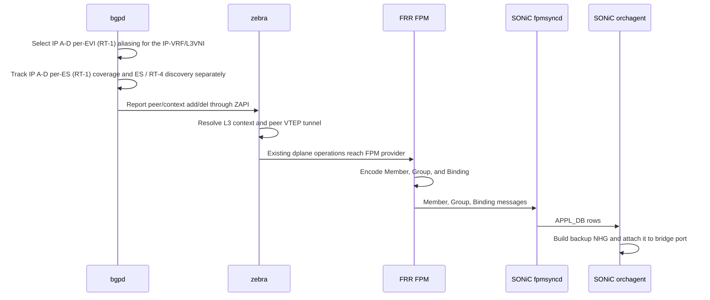

# EVPN Bridge-Port Protection Group: FRRouting High-Level Design

## Table of Contents

- [1. Revision](#1-revision)
- [2. Scope](#2-scope)
- [3. Definitions and abbreviations](#3-definitions-and-abbreviations)
- [4. References](#4-references)
- [5. Feature overview](#5-feature-overview)
- [6. Requirements](#6-requirements)
  - [6.1 Functional requirements](#61-functional-requirements)
  - [6.2 Configuration requirements](#62-configuration-requirements)
  - [6.3 Scale and restart requirements](#63-scale-and-restart-requirements)
- [7. Architecture](#7-architecture)
  - [7.1 Control-plane inputs](#71-control-plane-inputs)
  - [7.2 FRR ownership](#72-frr-ownership)
  - [7.3 Data flow](#73-data-flow)
  - [7.4 BGP extension](#74-bgp-extension)
  - [7.5 Zebra extension](#75-zebra-extension)
- [8. Zebra protection lifecycle](#8-zebra-protection-lifecycle)
  - [8.1 Protection state](#81-protection-state)
  - [8.2 BGP peer context in zebra](#82-bgp-peer-context-in-zebra)
  - [8.3 Member and group identifiers](#83-member-and-group-identifiers)
  - [8.4 Peer VTEP tunnel resolution](#84-peer-vtep-tunnel-resolution)
  - [8.5 Object consistency and safe deletion](#85-object-consistency-and-safe-deletion)
  - [8.6 Failure flows](#86-failure-flows)
  - [8.7 Kernel MAC and neighbor lifecycle](#87-kernel-mac-and-neighbor-lifecycle)
  - [8.8 Advertisement prerequisites](#88-advertisement-prerequisites)
- [9. FPM interface](#9-fpm-interface)
  - [9.1 Message model](#91-message-model)
  - [9.2 Database boundary](#92-database-boundary)
- [10. Configuration and operational visibility](#10-configuration-and-operational-visibility)
- [11. Restart and replay](#11-restart-and-replay)
- [12. Error handling](#12-error-handling)
- [13. Testing](#13-testing)
- [14. Limitations and open items](#14-limitations-and-open-items)

---

## 1. Revision

| Revision | Date | Author | Description |
|---|---|---|---|
| 1.0 | 2026-09-29 | Patrice Brissette | Initial FRR HLD |

---

## 2. Scope

An Ethernet Segment connects a host or downstream device to more than one leaf.
Under normal conditions, a leaf sends traffic to that device through its local
access port. If that port fails, the leaf must continue forwarding through one
of the other leaves attached to the same Ethernet Segment.

The problem is scale. A single access port can serve thousands of hosts. On a
failure, changing every route, neighbor, and MAC entry that points to the port
would be slow and disruptive. The bridge-port protection group solves this by
protecting the port itself:

```text
primary   = local bridge port
backup    = ECMP group of VXLAN tunnels to peer VTEPs
```

The backup group is programmed before a failure occurs. When the local port
goes down, SONiC applies its configured protection behavior to select the
backup group without waiting for route reconvergence and without changing the
host's existing MAC, neighbor, or route entries. FRR only maintains the backup
objects; it does not select the protection mode.

FRR builds the backup group from eligible EVPN peers for the Ethernet Segment.
It sends SONiC the peer tunnel Members, the Group containing those Members, and
the Binding that attaches the Group to the local bridge port. SONiC creates the
tunnels and next-hop group, then programs the protection attribute on the
bridge port. The FRR and SONiC responsibilities are therefore:

- **FRR:** discover eligible peers, track their EVPN reachability, resolve the
  peer tunnel context, maintain stable object identifiers, and export updates.
- **SONiC:** create the backup forwarding objects and attach the Group to the
  protected bridge ports. `bpProtOrch` owns the bridge-port protection
  attribute; FRR only supplies the backup forwarding objects.

This document covers the FRR side of that contract. The SONiC and SAI behavior
is described in the companion [Bridge-Port Protection Group HLD](https://github.com/sonic-net/SONiC/pull/2556).

The design is intended for routed VXLAN forwarding and is documented using
all-active L3MH as the primary deployment context. L3MH neighbor synchronization
is specified by the separate [L3MH Neighbor Synchronization HLD](../../../../l3mh_hld/doc/vxlan/EVPN/EVPN-L3MH-Neighbor-Sync.md). This HLD only consumes the forwarding state produced by that feature; it does not redefine neighbor synchronization.

### In scope

- Per-ES/interface enablement with `evpn mh bridge-port-protection`.
- EVPN peer discovery and eligibility for the backup group.
- Peer VTEP tunnel resolution, including L3VNI and RMAC dependencies.
- In-memory Member and Group identifier continuity while zebra stays alive
  (peer churn and FPM reconnect). Identifier persistence across a full zebra or
  FRR restart is out of scope; zebra allocates `nh_id`/`nhg_id` from a runtime
  bitmap and cannot make them persistent, so restart is handled by the
  reconciliation epoch instead.
- FPM emission of Member, Group, and bridge-port Binding objects.
- Peer changes, tunnel resolution changes, restart, and replay behavior.
- Interaction with existing EVPN MAC and neighbor state.

### Out of scope

- SONiC orchagent implementation and SAI adapter behavior.
- Per-host route, neighbor, or MAC reprogramming during failover.
- Single-active multihoming behavior.
- L2 VXLAN protection Members in the initial release.

---

## 3. Definitions and abbreviations

| Term | Meaning |
|---|---|
| **ES** | Ethernet Segment. The local multihomed attachment represented by an ESI. |
| **ESI** | Ethernet Segment Identifier. |
| **L3MH** | EVPN Layer-3 multihoming. |
| **RT-1** | EVPN Ethernet Auto-Discovery route; the base route for both terms below. |
| **IP A-D per-EVI (RT-1)** | Ethernet Auto-Discovery route scoped to an EVI, advertised into the IP-VRF to identify candidate peer VTEPs for the corresponding IP-VRF/L3VNI. |
| **IP A-D per-ES (RT-1)** | Ethernet Auto-Discovery route scoped to an Ethernet Segment, used for peer eligibility, fast convergence, and withdrawal. |
| **ES / RT-4** | Ethernet-Segment route used for ES-wide discovery and initial validation. |
| **RT-2** | EVPN MAC/IP route. |
| **RT-5** | EVPN IP Prefix route. |
| **EVPN IP route** | The reachability route being aliased: an EVPN MAC/IP route (RT-2) or EVPN IP Prefix route (RT-5) carrying the ES's ESI. |
| **VTEP** | VXLAN tunnel endpoint. |
| **L3VNI** | VXLAN identifier for an IP-VRF. |
| **Tunnel map** | SONiC/SAI VRF-to-VNI mapping that selects the VXLAN encapsulation VNI from the routed packet's VRF. A SONiC data-plane construct; FRR does not create or program it. |
| **RMAC** | Router MAC used as the inner destination MAC for routed VXLAN traffic. |
| **Bridge port** | The local access (sub-)interface where host MACs are learned; the protected object. In routed L3MH it is typically a VLAN sub-interface (e.g. `BE1.10`) whose SVI sits in one IP-VRF. |
| **SVI** | Switched Virtual Interface; the routed interface for a VLAN, placed in an IP-VRF. |
| **Member** | One peer-VTEP protection next hop. |
| **Group** | The ECMP set of Members (peer tunnels) inherited by the protected bridge ports under one parent interface. |
| **Binding** | Association between a local bridge-port (sub-)interface and its Group. |
| **FPM** | Forwarding Plane Manager protocol used to send forwarding objects from FRR to SONiC. |
| **ZAPI** | FRR's internal bgpd-to-zebra protocol. |
| **Ext-learn** | FRR-controlled kernel forwarding state that is not ordinary data-plane learning. |

---

## 4. References

| Reference | Purpose |
|---|---|
| [EVPN L3MH Neighbor Synchronization HLD](https://github.com/sonic-net/SONiC/pull/2543) | Neighbor synchronization for routed-only multihoming. |
| [Bridge-Port Protection Group SONiC HLD](https://github.com/sonic-net/SONiC/pull/2556) | SONiC, FPM consumer, orchagent, and SAI design. |
| [RFC 7432](https://datatracker.ietf.org/doc/html/rfc7432) | Base EVPN procedures. |
| [RFC 8365](https://datatracker.ietf.org/doc/html/rfc8365) | EVPN overlay operation over VXLAN. |
| [EVPN IP Aliasing draft -04](https://datatracker.ietf.org/doc/html/draft-ietf-bess-evpn-ip-aliasing-04) | EVPN aliasing and backup-path procedures in Sections 2–4. |
| [FRRouting EVPN-MH extern-mode work](https://github.com/FRRouting/frr/pull/21863) | Related FRR EVPN-MH external-learning behavior. |

---

## 5. Feature overview

The target deployment is a datacenter leaf-spine fabric. Servers and other
downstream systems may use LAGs to attach to two or more leaf switches, while
the fabric provides routed VXLAN connectivity between leafs. In this model,
the local leaf should use its directly attached link for normal traffic, but a
failure must not interrupt traffic while the peer leafs and the underlay remain
available.

This is especially important in routed-only fabrics, where the access VLAN may
not have an L2VNI. The protection group is still a forwarding-path mechanism:
it does not create a new host route, neighbor entry, or MAC entry. It gives the
existing forwarding state a prebuilt alternate path through the peer leafs.

A host behind an ES therefore has two forwarding choices: the local access
link and the peer leafs attached to the same ES. The local link is the preferred
path. If it fails, the peer path must already be available so traffic can move
without per-host route, neighbor, or MAC updates.

The protection group represents that relationship as one port-level object:

```text
local bridge port
  |
  | Binding: protected port -> Group ID
  v
Group: peer Member 1, peer Member 2, ...
  |
  +-- Member: peer VTEP tunnel + L3 context + tunnel attributes
```

SONiC attaches the Group to each inherited bridge port before traffic is
affected. When a port loses carrier, SONiC selects the backup Group according
to its configured protection mode. FRR does not perform a route-by-route
switchover; it only keeps the protection objects current as peer reachability
changes.

FRR and SONiC divide the work as follows:

- **FRR** discovers the peer leaves, determines which peer VTEP tunnels are
  usable, and sends Member, Group, and Binding updates over FPM.
- **SONiC** creates the tunnel next hops and ECMP Group, then attaches that
  Group to the bridge port and programs the ASIC protection behavior.

---

## 6. Requirements

### 6.1 Functional requirements

| ID | Requirement |
|---|---|
| R1 | FRR must derive the protection peer set from IP A-D per-EVI (RT-1) aliasing AND valid IP A-D per-ES (RT-1) coverage for the same ESI/IP-VRF/L3VNI. ES / RT-4 is used for ES discovery and initial validation. |
| R2 | The initial protection path must use VXLAN L3 Members for all-active L3MH only. Single-active operation is out of scope. |
| R3 | Protection is enabled on a parent interface. Every eligible bridge port/sub-interface under that interface inherits the same protection Group and receives a Binding. |
| R4 | Each L3 Member must identify its peer VTEP tunnel and its required tunnel attributes, including RMAC and diagnostic L3VNI context. |
| R5 | FRR must send a Binding that associates the protected bridge-port sub-interface with the Group. |
| R6 | Protection or ES teardown must publish deletes for the Binding, Group, and unreferenced Members; SONiC owns their dependency ordering. Peer churn updates the Group in place while at least one eligible Member remains; an empty Group withdraws the Binding and Group. |
| R7 | Membership changes must update the existing Group in place when possible. |
| R8 | Member and Group identifiers must remain stable across replay for an unchanged topology. |
| R9 | FPM updates must be idempotent and safe when duplicate or replayed messages are processed independently by SONiC. |
| R10 | The protection feature must not alter ordinary EVPN-MH route advertisement policy unless explicitly enabled. |

### 6.2 Configuration requirements

| Condition | FRR behavior |
|---|---|
| Feature not configured | Protection is disabled; no objects are exported. |
| Protection command configured before dependencies exist | Retain the intent in `PENDING`; export no partial Binding. |
| Local ES, bridge port, IP-VRF, and L3VNI become valid | Build and export the Group and Binding when at least one eligible Member exists. |
| Matching RT-1 context is unavailable | Keep the intent pending; export no backup objects. |
| Protection command removed | Delete the Binding, Group, and unreferenced Members. |

Configuration order is not significant. FRR reconciles the protection state
whenever one of its dependencies changes.

The FRR configuration is:

```text
router bgp <asn>
 address-family l2vpn evpn
  advertise-all-vni
 exit-address-family
!
interface PortChannel10
 evpn mh es-id 10
 evpn mh bridge-port-protection
```

`evpn mh es-id` and `evpn mh bridge-port-protection` are configured on the
parent interface that owns the ESI. Every bridge port or sub-interface below
that interface inherits the protection configuration. Zebra creates one
Binding per inherited bridge port; all Bindings reference the Group built from
the eligible peer set for the parent ES/VLAN. A bridge port becomes eligible when
its local IP-VRF/L3VNI context is valid. No separate protection command is
required on each sub-interface.

### 6.3 Scale and restart requirements

- Protection state is proportional to the number of protected parent interfaces,
  inherited bridge-port Bindings, and peer tunnel identities, not the number of
  hosts, MACs, or routes behind an ES.
- An FPM reconnect or replay while zebra stays alive must restore the current
  protection state without changing identifiers or causing a primary-path flap,
  because the objects and their IDs remain in zebra memory.
- A full zebra restart cannot preserve identifiers, and identifier persistence
  is out of scope for this project. Unchanged identifiers are therefore not
  promised across a full restart.

---

## 7. Architecture

### 7.1 Control-plane inputs

FRR builds protection state from existing EVPN control-plane and zebra state:

| Input | Owner | Use |
|---|---|---|
| Local interface and ESI | zebra | Identifies the protected parent interface, its inherited bridge ports, and the local ES. |
| Local ES operational state | zebra | Determines whether a Binding may be exported. |
| Remote IP A-D per-EVI (RT-1) routes | bgpd | Provides the aliasing candidate PE set for a specific ESI and IP-VRF/L3VNI; imported by the IP-VRF Route Target. |
| Remote IP A-D per-ES (RT-1) routes | bgpd | Provides fast-convergence eligibility and withdrawal for the same ESI/IP-VRF. A route withdrawal invalidates the corresponding peer, following the existing MAC-aliasing route handling. |
| Remote ES / RT-4 routes | bgpd | Provides ES-wide discovery and initial validation; not a substitute for IP A-D per-ES (RT-1). |
| IP-VRF and L3VNI | bgpd/zebra | Qualifies the routed protection context. |
| Peer VTEP tunnel and RMAC | bgpd/zebra EVPN state | Supplies the routed VXLAN tunnel and inner DMAC. |
| Eligible peer VTEP set | bgpd | Selects the active peer VTEPs for the ES/context from the EVPN aliasing state and sends the resulting peer-set changes to zebra. |
| `evpn mh bridge-port-protection` | zebra | Per-ES/interface protection-group gate. |

bgpd owns the EVPN route join and sends zebra the resulting peer/context state.
The detailed BGP extension and ZAPI contract are specified in
[Section 7.4](#74-bgp-extension). The protection-enable command remains a
zebra/local-interface control; it is not inferred from a BGP route.

### 7.2 FRR ownership

| Component | Responsibility |
|---|---|
| **bgpd** | Receives IP A-D per-EVI (RT-1) aliasing, IP A-D per-ES (RT-1), and ES / RT-4 routes, computes the eligible IP-VRF/L3VNI-scoped peer set, and sends the resulting peer-set changes to zebra through ZAPI. |
| **zebra** | Owns local interface state, peer VTEP tunnel objects, protection objects, identifiers, and dplane updates. |
| **EVPN data plane** | Maintains normal EVPN-MH MAC and neighbor state. Protection does not replace that state. |
| **dplane FPM provider** | Extends the existing dplane operation path to serialize Member, Group, and Binding changes. |
| **SONiC** | Translates FPM objects into APPL_DB and SAI objects. `bpProtOrch` owns the bridge-port protection attachment. |

The control-plane split is intentional. bgpd owns BGP route selection; zebra
owns the forwarding objects and their lifetime.

### 7.3 Data flow



The Member and Group describe the backup NHG. The Binding identifies which
local bridge port uses that Group. These objects are independent and are joined
by their FRR-owned identifiers.

### 7.4 BGP extension

bgpd owns the EVPN route join. It must maintain protection eligibility per
`(ESI, bridge-port ifindex, IP-VRF/L3VNI, peer VTEP)` and notify zebra whenever
that result changes.
bgpd does not allocate `nh_id`/`nhg_id` and does not emit FPM messages.

The eligibility rule is:

```text
eligible = valid IP A-D per-EVI (RT-1) aliasing
           AND valid IP A-D per-ES (RT-1) coverage
```

RT-4 provides ES discovery and initial validation. It is not the source of the
per-peer backup list. IP A-D per-EVI and IP A-D per-ES route state determines
whether a peer is valid. An RT-2 or RT-5 host withdrawal changes host
reachability, not protection membership.

The implementation extends the existing remote-ES-VTEP ZAPI path:

```text
ZEBRA_REMOTE_ES_VTEP_ADD
ZEBRA_REMOTE_ES_VTEP_DEL
```

The payload must carry the complete context:

```text
ifindex        protected local bridge port                # key
type           protection Member type: L2 or L3           # key
vtep_family    remote peer VTEP address family            # key
vtep_address   remote peer VTEP                           # key
esi[10]        parent Ethernet Segment Identifier         # value
vrf_id         protected IP-VRF (L3 context)              # value
vni            protected VNI (L3VNI now, L2VNI for future # value
               L2 protection)
```

The message key is `(ifindex, type, vtep_family, vtep_address)`; it identifies
one protected-context/peer eligibility entry. `type` distinguishes L3 protection
from future L2 protection for the same bridge port and peer. `esi`, `vrf_id`,
and `vni` are carried as value/context, not key: the `esi` is redundant with
`ifindex` (its parent interface owns exactly one ESI) and is carried for
validation and convenience; `vni` is functionally dependent on the protected
context and holds the L3VNI for L3 Members today and will hold the L2VNI for
future L2 Members; `vtep_family` is a key field only because it qualifies how
`vtep_address` is interpreted.

The message is scoped to one protected bridge-port context. The `ifindex` is
the local bridge port where the Binding will be installed; it is not a BGP
object identifier and is not used to allocate an `nh_id` or `nhg_id`. bgpd
maintains route-instance state internally and sends zebra the resulting
eligible/ineligible peer transition, rather than asking zebra to aggregate
individual route withdrawals.

The ZAPI service version must be updated with the payload. An incompatible
bgpd/zebra pair must reject the message rather than silently losing the VNI
context.

### 7.5 Zebra extension

Zebra owns the local protection objects and translates the BGP peer set into
FPM-ready objects. It performs the following work:

1. Accept and hold the protection command in a pending state when its ES or VRF
   dependencies are not yet available, and activate it automatically once they
   are.
2. Create a protection entry for a valid local bridge port.
3. Resolve each peer VTEP tunnel and peer RMAC.
4. Allocate or restore Member and Group identifiers.
5. Export the complete Member, Group, and Binding state through the dplane.

The initial routed Member is:

```text
nh_id          FRR-owned Member identifier                # key (allocated)
type           L3                                         # identity
family         peer VTEP address family                   # identity
remote_vtep    peer VTEP address                          # identity
router_mac     peer RMAC                                  # identity
vni            diagnostic L3VNI context                   # value
```

`nh_id` is the row key that FRR allocates and that SONiC uses as the FPM/APPL_DB
Member key. It is functionally dependent on the tunnel identity
`(type, family, remote_vtep, router_mac)`: zebra allocates exactly one `nh_id`
per distinct identity and reuses it while that identity is unchanged. `type` is
part of the identity so the same peer VTEP can hold two distinct Members — a
separate `nh_id` for an L2 Member and for an L3 Member. `family` is identity
only because it qualifies how `remote_vtep` is interpreted. The `vni` is context
and diagnostics only. SONiC obtains the actual encapsulation VNI from the VRF
tunnel map.

The Group contains a complete, sorted list of Member IDs. A Group update does
not change the Binding. The Binding contains the protected bridge-port ifindex
and the Group ID.

This section is the ownership boundary: BGP decides *which peers qualify*;
zebra decides *whether the forwarding objects are ready* and *how they are
exported*.

---

## 8. Zebra protection lifecycle

### 8.1 Protection state

Zebra keeps one protection entry per eligible **bridge port** — the access
sub-interface where host MACs are learned (e.g. `BE1.10`). Each entry inherits
the protection command and ESI from its parent interface and keeps its own
IP-VRF/L3VNI context. The entry is keyed by the bridge-port `ifindex`:

```text
BridgePortProtection
    ifindex            bridge-port sub-interface, e.g. BE1.10
    interface name     human-readable name of that sub-interface
    ESI                Ethernet Segment, inherited from the parent LAG (e.g. BE1)
    IP-VRF / L3VNI     the VRF context of this bridge port; L3VNI is diagnostic
    protection enabled inherited from the parent interface
    Group ID           nhg_id of the backup Group for this bridge port
    export state       DISABLED / PENDING / ACTIVE / DEGRADED / WITHDRAWING
```

FRR exports the Binding only when the local context is valid — the bridge port
and ES are usable, `evpn mh bridge-port-protection` is enabled, and the
IP-VRF/L3VNI is known — and at least one eligible Member exists. Before that
point, zebra keeps the entry pending and exports nothing. If the Group becomes
empty, FRR does not export/download an empty Group. It withdraws the Binding and
Group, and SONiC then knows that the interface has no protection path. The local
port remains the primary path while protection is available.

A Member is a peer tunnel identified by `(peer VTEP, address family, RMAC, type)`. The routed VXLAN
encapsulation VNI comes from SONiC's VRF tunnel map; it is not encoded as a
per-next-hop forwarding decision by FRR. The initial release creates one Group
and one Binding for each eligible bridge port under the protected parent
interface. The Group is referenced by those inherited Bindings.

### 8.2 BGP peer context in zebra

Peer eligibility is calculated by bgpd and delivered to zebra through ZAPI as
described in [Section 7.4](#74-bgp-extension). Zebra only adds local readiness
checks: the peer must have a usable VTEP tunnel and RMAC before its Member is
exported.

### 8.3 Member and group identifiers

FRR owns two identifier spaces:

- `nh_id` identifies one Member.
- `nhg_id` identifies one Group.

Both carry the existing EVPN-MH type bits in the FPM key and the SONiC APPL_DB
key, so they cannot be confused with unrelated next-hop objects. They must not
encode any route, MAC, or neighbor identity.

Object identity:

- One Member ID per `(peer VTEP, address family, RMAC, type)` tunnel identity,
  which is VRF-independent. The same Member may be shared by multiple Groups.
- One Group ID per protected parent interface and eligible peer set. Each
  inherited bridge-port Binding references that Group. A membership change
  updates the Group in place; it does not create a new Group for every
  peer-set variation.

Retirement:

- Do not recycle an ID while its object still exists in zebra's active database.
- An ID is released when zebra removes the object and queues its delete to the
  dplane provider. FPM gives no SONiC acknowledgement, so a released ID stays
  retired for the rest of the zebra lifetime.

### 8.4 Peer VTEP tunnel resolution

Each routed Member needs two resolved dependencies:

1. A VXLAN tunnel to the peer VTEP.
2. The peer RMAC used as the routed VXLAN inner destination MAC.

The RMAC is existing EVPN state. In L3MH the peer's SVI address for the IP-VRF
is always advertised as an RT-5 (and hosts as RT-2), so zebra already holds the
peer VTEP's per-L3VNI RMAC. The protection Member reuses that existing
per-(L3VNI, VTEP) RMAC; protection does not create a second RMAC database and
does not parse a separate RMAC from the aliasing route.

Until both dependencies resolve, the Member stays pending and is not exported.
RMAC loss and RMAC change are handled per the failure flows in
[Section 8.6](#86-failure-flows) and the swap ordering in
[Section 8.5](#85-object-consistency-and-safe-deletion).

### 8.5 Object consistency and safe deletion

Member, Group, and Binding messages are independent and idempotent, so the
protection state converges to the same result regardless of arrival order
(idempotent messages, per R9). SONiC parks any reference it
cannot resolve yet — for example a Binding received before its Group — and
reconciles it once the referenced object appears. Ordering is therefore not
required for correctness.

This section defines the producer-side rules that independence does not provide:
object self-consistency, safe deletion, and identifier reuse.

**Required rules**

- **Object self-consistency.** Never publish a Group that lists a Member FRR has
  already deleted, and never publish a Binding that names a Group FRR is tearing
  down. Each exported object must be well-formed on its own.
- **Detach before unreference (delete direction).** Withdraw in the order
  `Binding -> Group -> Member` so a live, referenced object is never deleted out
  from under its referrer. `bpProtOrch` clears the bridge-port protection
  attribute before `L2NhgOrch` removes the Group, and the Group drops a Member
  before that Member is deleted.
- **Identifier release timing.** Release an `nh_id`/`nhg_id` only after its
  delete has been queued to the dplane. FPM gives no SONiC acknowledgement, so a
  released ID stays retired for the rest of the zebra lifetime and is not reused
  early.
- **Complete-object updates.** Every message carries the complete current
  object, never a delta: a Group update lists the full sorted Member set (so an
  unchanged set causes no NHG churn), and a reconnect or replay re-emits the
  complete object set. This keeps the messages idempotent (R9).

**Best-effort ordering (optimization only)**

On creation FRR sends `Member -> Group -> Binding` to minimize the transient
window in which SONiC parks an unresolved reference. This is a convergence-time
optimization, not a correctness requirement; the parking behavior above handles
any other order.

**Event outlines**

- **Protection enable / peer addition:** export the Member(s), then the updated
  Group. The Binding is created once at enable and is unchanged for later peer
  churn.
- **Peer removal:** export the Group without the peer's Member, then delete the
  Member once it is unreferenced. If the Group empties, withdraw the Binding and
  Group; SONiC then reports no protection path and the local port stays primary.
- **Protection disable or ES removal:** withdraw `Binding -> Group -> Member`,
  releasing identifiers only after the sequence completes.

### 8.6 Failure flows

The local link failure and remote peer failure have different owners:

| Event | FRR action | Invariant / guarantee |
|---|---|---|
| Local bridge port loses carrier | No FRR route or host-state action. SONiC selects the programmed backup according to its protection mode. | Preserve host routes, neighbors, MACs, and EVPN routes unchanged. |
| Peer withdraws IP A-D per-EVI (RT-1) | Remove that peer's Member from the Group for this IP-VRF/L3VNI context. | The peer's other contexts and host reachability stay intact. |
| Peer withdraws IP A-D per-ES (RT-1) | Mass-withdrawal: invalidate that peer VTEP across every per-EVI (per-VRF/L3VNI) protection context under the ES, removing it from all affected Groups. Follows existing MAC-aliasing route handling. | Invalidate the peer immediately, even while a per-EVI or RT-4 route for it still remains. |
| Peer withdraws RT-4 | Clear only ES discovery state; leave per-EVI/per-ES-derived eligibility unchanged. RT-4 is discovery only here — its DF-election and single-active roles do not apply to all-active L3MH. | Keep the backup list driven only by the per-EVI/per-ES routes and treat RT-4 as discovery only. |
| Host RT-2 is withdrawn | Let normal EVPN processing handle the host. | Leave the protection Group unchanged. |
| Peer RMAC is lost | Remove the Member from the Group and hold it pending until the RMAC re-resolves. | A routed Member is never exported without a resolved RMAC. |
| Peer VTEP tunnel becomes unreachable | Remove the Member from the Group and hold it pending until the tunnel re-resolves. | The rest of the Group stays intact; underlay reachability remains the routing system's responsibility. |
| Peer RMAC changes | Export the new Member, update the Group, then delete the old Member when unreferenced. | Limit the change to the affected Member and leave unrelated Members untouched. |
| Group becomes empty | Delete the Binding and Group. SONiC reports that the interface has no protection path. | Keep the local primary path intact. |

### 8.7 Kernel MAC and neighbor lifecycle

L3MH neighbor synchronization is specified by the separate [L3MH Neighbor
Synchronization HLD](../../../../l3mh_hld/doc/vxlan/EVPN/EVPN-L3MH-Neighbor-Sync.md).
That feature supplies the host neighbor and local-ES forwarding state; this HLD
supplies the backup Group. FRR does not create, withdraw, or reprogram host
neighbors as part of a bridge-port failure.

The protection-specific rule is that a local carrier event does not change
EVPN host state. A peer route withdrawal changes Group membership, while a
local port failure is handled by SONiC using the already-exported backup
objects.

### 8.8 Advertisement prerequisites

The peer advertisements follow the
[EVPN IP Aliasing draft](https://datatracker.ietf.org/doc/html/draft-ietf-bess-evpn-ip-aliasing-04).
No new route type or BGP attribute is required. The following table maps the
draft procedures to FRR protection processing:

| Route | Required fields for this design | Protection use | Withdrawal effect |
|---|---|---|---|
| IP A-D per-EVI (RT-1) | IP-VRF RD, non-zero ESI, Ethernet Tag 0, IP-VRF export RTs, L3VNI/VNI label, and Layer-2 Attributes Extended Community with `P=1` for all-active | Supplies the aliasing candidate peer | The peer is invalid for the corresponding IP-VRF/protection context |
| IP A-D per-ES (RT-1) | ESI and IP-VRF RTs; multiple routes may be advertised when the RT set requires it | Supplies the fast-convergence eligibility for the ES | The corresponding peer is invalidated using the existing MAC-aliasing route handling |
| RT-2 / RT-5 host or prefix route | Non-zero ESI when the route is using this L3MH ES, plus the IP-VRF RT | Identifies the host or prefix that can resolve through the ES aliasing set, and supplies the peer VTEP's per-L3VNI RMAC used by the routed Member; it does not define the Group itself | Host or prefix reachability changes; the Group is not changed solely because one host route is withdrawn |
| RT-4 ES route | ES identity and the normal ES discovery attributes | Discovers and validates ES membership; it is not the backup-list source | Discovery state changes; peer eligibility follows the RT-1 routes |

FRR follows the draft's route roles and the existing MAC-aliasing state
machine. An IP A-D per-EVI and IP A-D per-ES route must both be valid for the
same ESI/IP-VRF/L3VNI context before a peer is exported. The peer VTEP's RMAC
comes from existing RT-2/RT-5 EVPN state — the per-L3VNI RMAC that zebra already
maintains. In L3MH the peer SVI is always advertised as RT-5, so this RMAC is
always available; the per-EVI A-D route's Router's MAC Extended Community, if
present, is not required and is not used as the RMAC source.

The per-ES A-D route may still carry the ESI Label Extended Community per
RFC 7432, but this routed design neither requires nor consumes it: there is no
BUM split-horizon label to program, and the all-active redundancy mode is
already conveyed by the per-EVI Layer-2 Attributes Extended Community (`P=1`).

---

## 9. FPM interface

### 9.1 Message model

The initial interface uses private raw-processed FPM messages.

```c
/* Shared by FRR and fpmsyncd. Do not redefine these structures independently. */
struct __attribute__((packed)) l2_nhg_member_msg {
  uint32_t l2nm_nh_id;
  uint32_t l2nm_vni;        /* diagnostic L3VNI */
  uint8_t  l2nm_type;       /* 0 = L2, 1 = L3 */
  uint8_t  l2nm_family;     /* AF_INET or AF_INET6 */
  union {
    struct in_addr  ip4;
    struct in6_addr ip6;
  } l2nm_remote_vtep;
  uint8_t  l2nm_router_mac[6]; /* peer RMAC */
};

struct __attribute__((packed)) l2_nhg_group_msg {
  uint32_t l2ng_nhg_id;
  uint32_t l2ng_count;
  uint32_t l2ng_nh_ids[];    /* exactly l2ng_count elements follow */
};

struct __attribute__((packed)) evpn_backup_nhg_msg {
  uint32_t ebnm_ifindex;
  uint32_t ebnm_backup_nhg_id;
};
```

The layout is a fixed, packed wire format; the shared header enforces the exact
size and field offsets with compile-time assertions so the FRR provider and
SONiC fpmsyncd cannot drift out of wire compatibility.

The corresponding message types are:

```text
RTM_FPM_ADD_L2_NEXTHOP
RTM_FPM_DEL_L2_NEXTHOP
RTM_FPM_ADD_L2_NEXTHOP_GROUP
RTM_FPM_DEL_L2_NEXTHOP_GROUP
RTM_FPM_ADD_EVPN_ES_BACKUP_NHG
RTM_FPM_DEL_EVPN_ES_BACKUP_NHG
```

The Binding structure already exists on the SONiC side. Zebra already creates
`DPLANE_OP_BR_PORT_UPDATE` with `backup_nhg_id`; the FPM provider must add its
encoder.

Member and Group messages use these dedicated queued dplane operations:

```text
DPLANE_OP_L2_NHG_MEMBER_UPDATE
DPLANE_OP_L2_NHG_GROUP_UPDATE
```

Each operation carries the complete object and an add/update or delete action.
All three object types use the existing dplane provider queue. No direct
zebra-to-fpmsyncd channel or SONiC-side FPM walk is introduced.

After reconnect, zebra queues the complete Member, Group, and Binding set under
a new reconciliation epoch.

---

## 10. Configuration and operational visibility

Configuration and dependency behavior are defined in [Section 6.2](#62-configuration-requirements).
The command gates only this protection feature; it does not change DF election
or ordinary EVPN-MH route advertisement.

SONiC's per-port policy controls how an exported Binding is attached and
whether hardware or software protection is used. It does not create the FRR
Group and cannot enable a port that FRR has not exported.

FRR should expose enough state to diagnose the feature without inspecting FPM
packets manually. At minimum, show output should identify:

- Interface and ESI.
- Protection enabled or disabled.
- Group ID.
- Each Member ID.
- Peer VTEP address.
- L3VNI for each Member identity.
- Peer VTEP tunnel, RMAC, and tunnel-resolution state.
- Eligible peer count and exported Member count.
- Member and Group export state.
- State reason for a PENDING or DEGRADED entry (the specific missing
  dependency).
- Last FPM update or error.

Useful operational states include:

```text
DISABLED       protection is not configured
PENDING        configured, but a dependency is not yet resolved and no objects
               are exported; the pending reason names the missing dependency
ACTIVE         Binding, Group, and every eligible peer's Member are exported
DEGRADED       Binding and Group are exported, but at least one eligible peer is
               held pending, so the Group has fewer Members than the eligible
               peer set; the degraded reason names the per-peer cause
WITHDRAWING    delete sequence is in progress
```

Each PENDING and DEGRADED entry carries a reason so the cause is visible
in show output without a packet capture:

```text
PENDING reason   no local ES / ES down | protection not enabled |
                 IP-VRF or L3VNI unknown | no eligible peer
DEGRADED reason  per peer: VTEP tunnel unresolved | RMAC unresolved
```

These are FRR control-plane states. SONiC's hardware protection state is
reported separately through its STATE_DB interface.

---

## 11. Restart and replay

### FRR FPM reconnect

When FPM reconnects, zebra replays the complete current state in this order:

1. Member objects.
2. Group objects.
3. Binding objects.

The replay must be idempotent. SONiC may receive the Binding before the Group
has been reconstructed; the SONiC consumer parks that Binding until the Group
appears.

The SONiC ownership contract is explicit:

- `L2NhgOrch` owns the backup NHG and its SAI object identifier.
- `bpProtOrch` resolves the Group ID to that SAI identifier and holds a
  reference while the Binding is installed.
- If the Binding arrives before the Group, `bpProtOrch` parks it and retries
  after `L2NhgOrch` publishes the Group. It must not discard the Binding.
- On detach, `bpProtOrch` clears the bridge-port protection attribute first and
  then releases its NHG reference. `L2NhgOrch` may delete the NHG only after
  that reference is released.
- Membership changes update the existing NHG in place; the Group ID and SAI
  object identifier remain stable, so `bpProtOrch` does not reattach the
  protection object for ordinary membership churn.

### Restart behavior at a glance

| Event | Identifier behavior today |
|---|---|
| FPM reconnect | Same IDs, because zebra retains the objects in memory. |
| fpmsyncd or SONiC restart | Same IDs after zebra replays its current state. |
| bgpd restart with zebra alive | Same IDs if objects are not withdrawn and recreated. |
| zebra restart | IDs are not guaranteed to be restored. |
| Full FRR restart | Same limitation as a zebra restart. |

### zebra restart and ID persistence

A still-running zebra preserves its in-memory IDs. This covers FPM/SONiC
restart and FPM reconnect, provided the FRR objects are not deleted and
recreated.

Today, zebra allocates `nh_id` and `nhg_id` from a runtime bitmap. The values
are stored in memory and released when their objects are deleted. The bitmap is
reinitialized after a zebra restart, so creation order can change the IDs.

Stale-kernel reservation prevents collisions with kernel objects during
startup. It does not restore the previous FRR-to-object mapping.

Persistent identifier restoration across a full restart is out of scope for
this project. zebra has no mechanism to make `nh_id`/`nhg_id` persistent, and
this design does not add one. After a full zebra or FRR restart the identifiers
may differ, so restart is handled entirely by the reconciliation epoch below
rather than by preserving the previous IDs.

Because IDs may change across a restart, FRR cannot reliably delete objects
owned by the previous zebra process. It therefore starts a new reconciliation
epoch and emits a complete snapshot. fpmsyncd/SONiC marks rows in the new epoch
as live and prunes rows from the previous epoch after the end marker.

The epoch markers are versioned FPM control messages:

```c
struct __attribute__((packed)) evpn_protection_epoch_msg {
  uint32_t epoch;
};
```

```text
RTM_FPM_EVPN_PROTECTION_SNAPSHOT_BEGIN { epoch }
RTM_FPM_EVPN_PROTECTION_SNAPSHOT_END   { epoch }
```

The provider emits `SNAPSHOT_BEGIN`, the complete sorted object set, and then
`SNAPSHOT_END` with the same epoch. SONiC prunes unseen rows only after
`SNAPSHOT_END`; no SONiC acknowledgement is required by FRR.

If the deployed fpmsyncd cannot provide epoch-based
pruning, full zebra restart is not implementation-ready; only replay from a
still-running zebra may claim no-flap behavior.

### Configuration replay

Configuration replay must not cause a transient Binding to be exported before
its local ES and peer context are valid. Replaying an interface, ESI, and the
protection-group command should converge to the same object set as a live
configuration.

---

## 12. Error handling

This section covers the local error, dependency, and transport conditions that
keep FRR from exporting a complete protection object — missing configuration or
context, invalid input, and FPM connection or serialization failures. It is
distinct from [Section 8.6](#86-failure-flows), which handles external
reachability events (link and route changes). The governing principle is
containment: an error leaves the affected object pending or degraded and is
reported through the state reason ([Section 10](#10-configuration-and-operational-visibility)); it never tears down the local
primary path or unrelated MAC, neighbor, or EVPN route state.

| Condition | FRR behavior |
|---|---|
| No local ESI | Keep protection disabled and do not export objects. |
| No eligible peer | Do not export/download a Group or Binding; withdraw any existing Binding and Group. SONiC knows that the interface has no protection path. |
| Missing L3VNI/IP-VRF context | Keep protection pending and report the missing dependency. |
| Invalid peer VTEP address | Reject the Member and log the peer and ESI. |
| FPM connection failure | Retain state and replay the complete object set after reconnect. |
| FPM serialization failure | Preserve the current object state, report the error, and retry. |
| Unsupported forwarding object type | Do not silently fall back to a different FRR object model; report the capability mismatch. |

---

## 13. Testing

### 13.1 Unit tests

- **Configuration:** Require per-interface `evpn mh bridge-port-protection`;
  reject protection state without a valid local ES; remove the interface
  command and verify independent deletes converge with SONiC's detach-before-
  unref ordering.
- **Aliasing and ES membership:** Add an IP A-D per-EVI (RT-1) and matching
  IP A-D per-ES (RT-1) state and create a Member; withdraw either route and
  invalidate the corresponding peer; ignore a peer belonging to a different
  ESI; handle multiple peers.
- **Route attributes and ordering:** Reject or defer an IP A-D per-EVI (RT-1)
  with an IP-VRF label/VNI mismatch; process
  IP A-D per-EVI (RT-1), IP A-D per-ES (RT-1), and ES / RT-4 arrival/withdrawal in
  different orders; verify that RT-4 only changes discovery state.
- **Context and peer-tunnel resolution:** Defer a Member until its peer VTEP
  tunnel and RMAC dependencies resolve;
  update a Member when the RMAC changes; retain a Member while another protected
  object references the same tunnel identity; verify new Member, Group update, old
  Member delete ordering for replacement.
- **Protected bridge-port scope:** Verify that every eligible bridge port under
  the configured parent interface receives one Binding to the parent Group, and
  that an interface outside the protected parent receives no protection
  objects.
- **ZAPI contract:** Verify exact ADD/DEL payloads for eligible-peer updates,
  including ESI, ifindex, VRF, L3VNI, VTEP address, and family, and that bgpd
  sends a peer only after its IP A-D per-EVI (RT-1) aliasing and IP A-D per-ES (RT-1) coverage agree.
- **Identifier lifecycle:** Reuse Member and Group IDs for unchanged state;
  preserve EVPN identifier type bits; do not reuse an ID before delete
  completion.
- **FPM serialization:** Validate fixed-size Member and Binding payloads;
  validate Group count and exact variable payload length; verify IPv4 and IPv6
  peer encoding; verify add, update, and delete messages; verify shared-header
  size/offset assertions and NHG type-bit preservation.
- **Replay:** Replay the complete object set after FPM reconnect; replay with
  unchanged identifiers while zebra remains alive; verify duplicate Adds are
  harmless.

### 13.2 Integration tests

1. **Steady state**: one local ES, two IP A-D per-EVI (RT-1) aliasing routes with matching
  IP A-D per-ES (RT-1) coverage and ES / RT-4 discovery, complete Member/Group/Binding
  export.
2. **Peer join**: add IP A-D per-EVI (RT-1) aliasing and IP A-D per-ES (RT-1) coverage and verify in-place
  Group expansion.
3. **Peer leave**: withdraw IP A-D per-ES (RT-1) coverage and verify the peer is
  removed immediately; retain the Binding only while the Group still has an
  eligible Member.
4. **Last peer leave**: withdraw the final eligible IP A-D per-ES (RT-1) route
  and verify that FRR deletes the Binding and Group.
5. **ES withdrawal**: withdraw ES / RT-4 while valid IP A-D per-ES (RT-1) coverage
  remains and verify discovery context is invalidated without removing the
  Member or treating ES / RT-4 as the fast-convergence withdrawal signal.
6. **RMAC ordering**: receive IP A-D per-EVI (RT-1) before RMAC and verify deferred Member export.
7. **RMAC replacement**: export the new Member, update the Group, remove the old
  Member from the Group, then delete the old Member after it is unreferenced.
8. **No-L2VNI operation**: verify protection works with L3VNI-only forwarding.
9. **L2VNI coexistence**: verify existing L2 EVPN processing is unchanged.
10. **Local link failure**: verify FRR does not withdraw valid host MAC or
   neighbor state solely because the primary link is down.
11. **FPM reconnect**: verify SONiC reconstructs the same protection objects.
12. **Warm restart**: verify identifiers and export order for a still-running
   zebra.
13. **Full restart:** verify the new reconciliation epoch prunes stale
  objects before old protection references are released.
14. **Identifier reuse:** verify retired IDs are not reused within a zebra
  lifetime and that a new epoch handles replacement IDs safely.
15. **Scale:** verify many protected ESs, multiple L3VNIs, multiple RMACs, and
  multiple peer Members per Group.

The FRR tests validate control-plane state and FPM output. SONiC system tests
must additionally validate ASIC failover, route continuity, and protection
state.

---

## 14. Limitations and open items

1. **L3 Members only in the initial release.** The wire model carries a type
   field so L2 Members can be added later, but L2 protection behavior is not
   defined here.
2. **Parent-interface granularity.** Protection is configured on the parent
   interface. Every eligible bridge-port sub-interface below it receives one
   Binding to the parent protection Group.
3. **Shared RMAC assumption.** The design assumes one peer RMAC per peer VTEP,
   shared across all of that VTEP's VRFs; only the L3VNI varies per VRF. A peer
   VTEP that used different RMACs per VRF is not supported.
4. **Stable IDs after full zebra restart.** Identifier persistence across a
   full restart is out of scope. zebra cannot make `nh_id`/`nhg_id` persistent,
   so no-flap full-restart behavior is not provided; a full restart relies on
   epoch-based stale-row pruning rather than preserving the previous IDs.
5. **FPM message versioning.** The private message family must remain compatible
   between the FRR provider and SONiC fpmsyncd. A capability or version check is
   needed before deployment with mixed software versions.
6. **SONiC protection capability.** The SONiC HLD owns the bridge-port
   protection mode and determines whether hardware or software protection is
   available. FRR exports the backup forwarding objects without selecting or
   depending on that mode.
7. **Peer reachability.** The protection Group describes peer paths; underlay
   reachability remains the responsibility of the normal routing system.
8. **Identifier format.** The FRR EVPN-MH source comment and value mask must be
   reconciled before the ID format is frozen as an FRR-to-SONiC contract. The
   practical allocator range and type-bit layout must be documented in the
   shared FPM header.

The implementation should resolve the FPM compatibility items before describing
the feature as warm-restart complete. Full-restart identifier continuity is out
of scope and is not a prerequisite for this feature.
