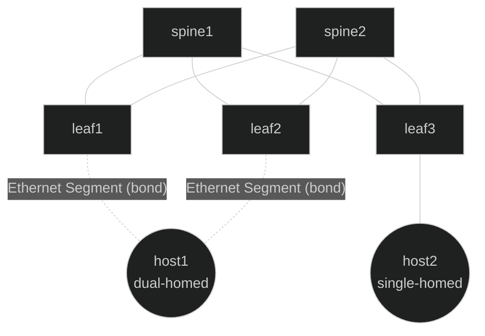
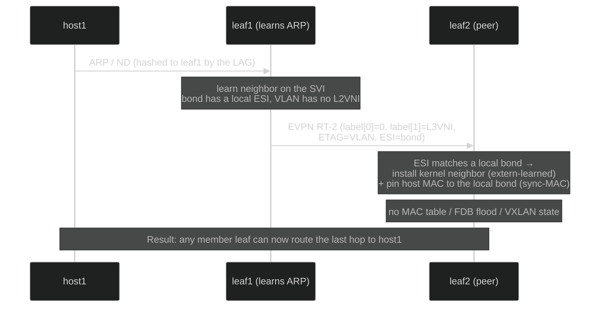

# EVPN Layer-3 Multihoming Neighbor Synchronization — SONiC High-Level Design

## Table of Contents

- [1. Revision](#1-revision)
- [2. Scope](#2-scope)
- [3. Definitions and Abbreviations](#3-definitions-and-abbreviations)
- [4. References](#4-references)
- [5. Overview](#5-overview)
- [6. Problem Statement](#6-problem-statement)
- [7. Solution](#7-solution)
  - [7.1 The idea](#71-the-idea)
  - [7.2 The wire signal](#72-the-wire-signal)
  - [7.3 What a receiver installs](#73-what-a-receiver-installs)
  - [7.4 The enable knob](#74-the-enable-knob)
- [8. Architecture](#8-architecture)
  - [8.1 Reference topology](#81-reference-topology)
  - [8.2 Data flow](#82-data-flow)
  - [8.3 Ownership model](#83-ownership-model)
  - [8.4 FRR data-model extensions](#84-frr-data-model-extensions)
  - [8.5 ZAPI messages (bgpd ↔ zebra)](#85-zapi-messages-bgpd--zebra)
- [9. Requirements](#9-requirements)
- [10. Configuration and Management](#10-configuration-and-management)
- [11. SAI / Data-Plane Impact](#11-sai--data-plane-impact)
- [12. Warm Boot / Fast Boot](#12-warm-boot--fast-boot)
- [13. Restrictions and Limitations](#13-restrictions-and-limitations)
- [14. Testing](#14-testing)

---

## 1. Revision

| Rev | Date | Author | Description |
|---|---|---|---|
| 0.1 | 2026-09-09 | Patrice Brissette (Cisco) | Initial HLD |

---

## 2. Scope

This document describes an EVPN control-plane enhancement that lets the leaf
switches that share a multihomed host keep the host's **ARP/ND (neighbor) entry
in sync** using EVPN Route Type 2 (RT-2) **even when the host's VLAN has no
L2VNI** — that is, in a **pure Layer-3 multihoming (L3MH)** fabric. The host may
be attached to **two or more** leaves (all members of the same Ethernet
Segment); the mechanism scales to any number of segment members.

The feature is realized in **FRRouting (FRR)**, the routing stack used by SONiC.
SONiC consumes the resulting kernel neighbor and FDB state through its existing
synchronization pipeline; there is no new SAI object and no ASIC-programming
change. This document explains **what** the feature does and **why**. 

---

## 3. Definitions and Abbreviations

| Term | Meaning |
|---|---|
| **EVPN** | Ethernet VPN — BGP control plane for overlay networks (RFC 7432). |
| **Multihoming (MH)** | A host attached to two (or more) leaf switches through one logical bond (LAG), for redundancy and load-sharing. |
| **ESI** | Ethernet Segment Identifier — the identity of that multihomed bond, shared by the leaves that connect to it. |
| **L2VNI** | A VXLAN VNI that carries one bridge domain (VLAN). Provides stretched Layer 2 across the fabric. |
| **L3VNI** | A VXLAN VNI that carries one routing domain (VRF). Used for routed (Layer-3) traffic. |
| **RT-2** | EVPN Route Type 2 — the MAC/IP advertisement (normally used to sync MAC + ARP/ND). |
| **SVI** | The Layer-3 interface (gateway) for a VLAN. |
| **Neighbor** | A host's ARP (IPv4) or ND (IPv6) entry: the IP↔MAC binding a router needs to forward the last hop to that host. |
| **L3MH** | Layer-3 multihoming: a multihomed host in a **routed-only** fabric (no stretched L2, no L2VNI). |

---

## 4. References

| Reference | Description |
|---|---|
| [draft-ietf-bess-evpn-l3mh-proto](https://datatracker.ietf.org/doc/draft-ietf-bess-evpn-l3mh-proto/) | **EVPN Layer-3 multihoming** — ARP/ND synchronization via RT-2. The IETF basis for this feature. |
| [RFC 7432](https://datatracker.ietf.org/doc/html/rfc7432) | BGP MPLS-Based Ethernet VPN (base EVPN). |
| [RFC 9135](https://datatracker.ietf.org/doc/html/rfc9135) | Integrated Routing and Bridging (IRB) in EVPN. |

---

## 5. Overview

Modern data-center fabrics increasingly run **routed-only** underlays: every leaf
is a Layer-3 gateway, and there is **no stretched Layer 2** between leaves and
therefore **no L2VNI**. At the same time, operators still want **server
redundancy**, so a server is multihomed to **two or more** leaves through a
single LAG — an EVPN **Ethernet Segment**.

These two goals collide on one small but important detail: **the host's ARP/ND
entry**. In a routed fabric, a leaf can only forward the final hop to a host if
it knows that host's IP↔MAC binding. When the host is multihomed, **any** of the
segment's member leaves may need to deliver that last hop — so **all** of them
must know the entry, even if only one actually learned it from the wire.

In a classic EVPN deployment this synchronization happens "for free" because the
host's VLAN has an L2VNI and the neighbor information rides along inside the
Layer-2 (MAC) machinery. **In an L3MH fabric there is no L2VNI, so that vehicle
does not exist.** This feature gives the neighbor entry its own ride.

---

## 6. Problem Statement

Consider a host **multihomed to leaf1, leaf2, … leafN** over one bond (one
Ethernet Segment), in a fabric with **no L2VNI** for the host's VLAN. (Two
members is the common case; the reasoning is identical for more.)

- The host sends its ARP once. Because of LAG hashing, that ARP is delivered to
  **only one** of the member leaves — say **leaf1**. leaf1 learns the neighbor
  (IP↔MAC) and can route to the host directly.
- **Every other member leaf** is an equally valid next hop for that host (same
  bond, same segment), but it **never saw the ARP**, so it has **no neighbor
  entry**.

The consequences when traffic arrives at one of those other leaves (or is hashed
to it by the fabric):

- **No reliable delivery.** That leaf cannot resolve the host's MAC, so it
  cannot build the last-hop rewrite. Its only recourse is to ARP/ND the host
  itself on the segment — but under LAG hashing the host's **reply can be
  delivered to a different member leaf**, so this self-resolution is unreliable.
  With no L2VNI there is also no flood domain to fall back on, so the packet is
  dropped until (if ever) the neighbor resolves.
- **Redundancy is degraded.** The whole point of multihoming is that **any**
  member leaf can serve the host. Without a synchronized neighbor, only the leaf
  that happened to learn the ARP works well.
- **The usual fix is unavailable.** In an L2VNI deployment the member leaves
  would converge the entry through the Layer-2 EVPN path. That path is absent by
  design in L3MH.

> **In one sentence:** in a routed-only multihoming fabric, the leaves that share
> a host have no standard way to agree on that host's ARP/ND entry, because the
> Layer-2 mechanism that normally carries it has been removed.

---

## 7. Solution

### 7.1 The idea

Reuse the EVPN route that already carries ARP/ND information — **RT-2** — but
**strip out everything Layer 2**. The result is a route that effectively says:

> *"Here is a host's ARP/ND entry. Install the neighbor. Do **not** touch any
> bridge, MAC table, or flood domain."*

A leaf that receives such a route and recognizes the host's Ethernet Segment as
**one of its own local bonds** installs **just the kernel neighbor entry** (plus
a small forwarding pin, see [§7.3](#73-what-a-receiver-installs)), and nothing
else. This is exactly the mechanism described in
[draft-ietf-bess-evpn-l3mh-proto](https://datatracker.ietf.org/doc/draft-ietf-bess-evpn-l3mh-proto/).

### 7.2 The wire signal

An RT-2 is marked as **"pure Layer-3 / neighbor-only"** by a single, unambiguous
signal: an MPLS **Explicit NULL** label in the first label slot.

| Field | Value | Meaning |
|---|---|---|
| **Label-1** (`label[0]`) | **0** (Explicit NULL) | *"install the neighbor, not the MAC"* — the one flag that distinguishes this route. |
| **Label-2** (`label[1]`) | **L3VNI** | the routing domain (VRF) the host belongs to. |
| **Ethernet Tag** | **VLAN ID** | identifies which SVI/subnet the neighbor lives on. |
| **Route Distinguisher** | **router-id : L3VNI** | standard EVPN uniqueness. |
| **Route Target** | **IP-VRF RT** | so the receiving VRF imports it. |
| **ESI** | the host's **bond identity** | how a receiver decides "this segment is local to me." |

Because the distinguishing signal is a normal EVPN field, the route rides the
**existing** BGP EVPN infrastructure — no new address family, no new attribute.

### 7.3 What a receiver installs

When a leaf receives a pure-L3 RT-2 whose **ESI matches one of its own local
bonds**, it programs:

1. **The kernel neighbor** (ARP/ND) on the SVI selected by the Ethernet Tag,
   marked as externally-learned. This is the entry that lets the leaf route the
   last hop to the host.
2. **A local forwarding pin (sync-MAC)** — the host's MAC pointed at the local
   bond in the bridge FDB. This is needed because LAG hashing can mean this leaf
   *never* sees the host's frames on its own link; without the pin, routed
   delivery would have nowhere to send the rewritten packet. The pin sends it
   straight out the correct bond.

Everything Layer-2 is **suppressed**: no VXLAN/remote-MAC state, no Inclusive
Multicast (RT-3), no flood list. If the receiver's ESI does **not** match a local
bond, it installs **nothing** — the route is simply not relevant to it.

### 7.4 The enable knob

The feature is turned on per box with a single EVPN sub-command,
**`advertise-l3vni-neigh`**, alongside the existing `advertise-all-vni`. It is a
**capability enable that gates both directions**:

- **Transmit:** authorizes originating the `label[0]=0` RT-2 for locally learned
  neighbors on no-L2VNI VLANs.
- **Receive:** authorizes *honoring* a received `label[0]=0` RT-2. This is
  required for standards-correct behavior — RFC 7432 treats the MAC/IP label as
  mandatory, so an Explicit-NULL label is a signal a receiver must be
  **explicitly enabled** to accept.

With the knob off, the box neither originates nor installs these routes, exactly
as a standard EVPN speaker would behave. This mirrors how `advertise-all-vni`
enables EVPN itself.

---

## 8. Architecture

### 8.1 Reference topology

A minimal L3MH fabric: two spines, three leaves, one dual-homed host on the
multihoming pair, and one single-homed control host.



- **leaf1 + leaf2** share the multihomed host over one Ethernet Segment. They
  originate and cross-sync the host's ARP/ND entry. The segment can have **more
  than two** member leaves; the behavior is identical for each additional member.
- **leaf3** is not a member of that segment; it imports nothing for it.
- The **spines** are pure Layer-3 transit. There is **no L2VNI** anywhere — only
  an **L3VNI per VRF**.

### 8.2 Data flow

The neighbor learned on one member leaf is advertised as a pure-L3 RT-2 and
installed as a synced neighbor on **every other member leaf** of the segment
(the flow below shows one peer for clarity).



Withdrawal is symmetric: when the neighbor is deleted or ages out on leaf1, the
RT-2 is withdrawn and leaf2 removes the synced neighbor and the sync-MAC pin.

### 8.3 Ownership model

| Layer | Responsibility |
|---|---|
| **FRR — bgpd** | Originate / receive the pure-L3 RT-2; decide "is this ESI local to me?"; drive the neighbor install/withdraw toward zebra. |
| **FRR — zebra** | Program the **kernel neighbor** (ARP/ND) and the **local-ES sync-MAC** into the bridge FDB via netlink. Suppress all Layer-2 (VXLAN/FDB-flood/RT-3) state. |
| **Linux kernel** | Hold the neighbor and FDB entries; **answer ARP/ND** from that state (FRR has no packet-level responder). |
| **SONiC** | Consume the kernel neighbor/FDB through the **existing** neighbor and FDB sync pipeline. **No new SAI object, no ASIC-programming change.** |

Answering ARP/ND for same-subnet hosts, when desired, remains an external kernel
/ orchestrator concern (`proxy_arp` / `proxy_ndp`), exactly as in EVPN today —
FRR does not toggle those sysctls.

### 8.4 FRR data-model extensions

The feature reuses existing FRR structures and adds only a few fields/flags. The
pure-L3 neighbor-sync container is an ordinary `zebra_evpn` instance **keyed on
the L3VNI** and shared by all no-L2VNI VLANs of that VRF; per-VLAN identity is
carried on each neighbor entry. Only one genuinely new table is introduced (a
small per-VLAN cache).

| Structure | Extension | Purpose |
|---|---|---|
| `zebra_evpn` (per-VNI EVPN instance) | new flag **`ZEVPN_L3_NEIGH_SYNC`** | Marks the L3VNI-keyed instance as the shared **pure-L3 neighbor-sync** container — no FDB, no flood, no VXLAN. |
| `zebra_neigh` (synced ARP/ND entry) | new fields **`eth_tag`** (owning VLAN/ETAG) and **`sync_mac_ifindex`** (local-ES pin) | Let one shared container serve many SVIs, and track the sync-MAC pin for cleanup. |
| `zebra_evpn_access_bd` (access VLAN/BD) | new **`l3_mac_es_table`** — hash of *host MAC → local access port* (**new table**) | On a no-L2VNI VLAN there is no MAC table; this cache records which local bond a host MAC sits behind, so the RT-2 carries the correct **ESI**. |
| `bgp` (per-VRF) and `zebra_vrf` | new **`advertise_l3vni_neigh`** flag | Stores the enable knob in bgpd and zebra. |

RT-2 origination in bgpd is sourced entirely from the existing per-VRF EVPN
instance — **no new bgpd EVPN instance is created**.

**Where the new table lives.** The one new table (`l3_mac_es_table`) hangs off
the existing access-VLAN object; the shared neighbor container is the reused
`zebra_evpn` keyed on the L3VNI. The trees below show the surrounding hierarchy
so the additions (**← NEW**) are easy to place in context.

```
zmh_info                               global EVPN-MH info (existing)
└─ evpn_vlan_table                     hash of all access VLANs/BDs (existing)
   └─ zebra_evpn_access_bd             one per (bridge, VLAN)        (existing)
      ├─ vid                           → Ethernet Tag
      ├─ vlan_zif                      → SVI (gateway) of the VLAN
      ├─ mbr_zifs                      → member bonds → local ESI
      └─ l3_mac_es_table   ← NEW       hash: host MAC → local access port
         └─ { macaddr (key), acc_ifindex }   ← NEW  one entry per learned host MAC

zebra_evpn                             reused instance, keyed on the L3VNI
│                                      flag ZEVPN_L3_NEIGH_SYNC  ← NEW
└─ neigh_table                         synced ARP/ND entries (existing hash, key = IP)
   └─ zebra_neigh { ip, mac,
                    eth_tag           ← NEW  owning VLAN/ETAG
                    sync_mac_ifindex  ← NEW  local-ES sync-MAC pin }
```

- The **`l3_mac_es_table`** is the join key for ESI resolution: the ARP/ND event
  gives *IP → MAC*, this cache gives *MAC → local port → ESI*. It is created
  lazily on the first bridge-FDB learn and freed when the VLAN/BD is torn down.
- The **`zebra_evpn`** singleton is not new — it is the normal per-VNI EVPN
  object, instantiated here on the **L3VNI** and shared by every no-L2VNI VLAN of
  the VRF. Each `zebra_neigh` carries its own `eth_tag`, so one shared container
  still serves many SVIs.

### 8.5 ZAPI messages (bgpd ↔ zebra)

ZAPI is the internal channel between bgpd and zebra. One new message is added and
the existing MAC/IP messages are extended with a flag and an Ethernet Tag.

| Message | Direction | Change |
|---|---|---|
| **`ZEBRA_ADVERTISE_L3VNI_NEIGH`** | bgpd → zebra | **New** — carries the enable knob (1-byte flag), mirroring `ZEBRA_ADVERTISE_ALL_VNI`. |
| `ZEBRA_MACIP_ADD` / `ZEBRA_MACIP_DEL` (local) | zebra → bgpd | **Extended** — new flag **`ZEBRA_MACIP_TYPE_L3_NEIGH_SYNC`** (`0x80`) marks the entry pure-L3; **Ethernet Tag** appended. |
| `ZEBRA_REMOTE_MACIP_ADD` / `ZEBRA_REMOTE_MACIP_DEL` | bgpd → zebra | **Extended** — same pure-L3 flag + **Ethernet Tag**; the **ESI** (already carried) drives the local-ES match on install. |

**Fields carried** (in wire order; new additions in **bold**):

| Message | Fields |
|---|---|
| `ZEBRA_ADVERTISE_L3VNI_NEIGH` | `enable` |
| `ZEBRA_MACIP_ADD` (local) | VNI, MAC, IP, **flags (0x80)**, seq, ESI, **eth_tag** |
| `ZEBRA_MACIP_DEL` (local) | VNI, MAC, IP, state, **eth_tag** |
| `ZEBRA_REMOTE_MACIP_ADD` | VNI, MAC, IP, VTEP-IP, **flags (0x80)**, seq, ESI, **eth_tag** |
| `ZEBRA_REMOTE_MACIP_DEL` | VNI, MAC, IP, VTEP-IP, **eth_tag** |

Here `VNI` is the **L3VNI** for a pure-L3 entry, the `flags` bit `0x80`
(`L3_NEIGH_SYNC`) marks the entry pure-L3, and `ESI` identifies the host's bond
for the local-segment match. DEL carries no `flags`, so a withdraw is resolved by
lookup (`VNI` + `eth_tag` pick the VLAN, `IP` is the key).

Because the MAC/IP encoding grows, the ZAPI version (`ZSERV_VERSION`) is bumped;
bgpd and zebra must run the same version, and a mismatch simply leaves the
feature inactive.

---

## 9. Requirements

**Functional**

1. On a leaf with `advertise-l3vni-neigh` set and **no L2VNI** for the host's
   VLAN, a locally learned ARP/ND entry is advertised as an RT-2 with
   `label[0]=0`, `label[1]=L3VNI`, Ethernet Tag = VLAN.
2. A received pure-L3 RT-2 whose **ESI is local** installs a kernel neighbor and,
   on a no-L2VNI VLAN, the local-ES sync-MAC pin.
3. A received pure-L3 RT-2 whose **ESI is not local** installs nothing.
4. Multiple SVIs sharing one L3VNI are distinguished on the wire by their
   **Ethernet Tag**.
5. **No** bridge/FDB flood, VXLAN, or remote-MAC state is created (the sole FDB
   entry is the local-ES sync-MAC of requirement 2).
6. `advertise-all-vni` alone (feature knob off) behaves exactly as before — no
   regression.

**Coexistence**

7. On a VLAN that **does** have an L2VNI, the L2VNI path wins: normal L2 EVPN
   origination is used, and a received pure-L3 RT-2 still installs the neighbor
   only (never a MAC/FDB entry from that route).

**Management**

8. The feature is enabled/disabled by a single, persistent EVPN sub-command that
   gates both transmit and receive.

---

## 10. Configuration and Management

Configuration is a single additive EVPN knob, mirroring `advertise-all-vni`:

```
router bgp <asn>
 address-family l2vpn evpn
  advertise-all-vni            ! master EVPN enable (required)
  advertise-l3vni-neigh        ! enable L3MH neighbor sync (this feature)
 exit-address-family
```

- Both knobs are required functionally: `advertise-all-vni` is the master EVPN
  gate; `advertise-l3vni-neigh` layers the L3MH neighbor-sync capability on top.
- The feature is **per box** (gates TX and RX); whether a given VLAN actually
  uses it is decided automatically by the **absence of an L2VNI** for that VLAN.
- State is visible through the existing EVPN show commands (the knob, and the
  RT-2's `Label-1: 0` / Ethernet Tag / IP-VRF RT / ESI).

No new SONiC CLI, YANG model, or Config DB table is required — the knob lives in
the FRR EVPN configuration that SONiC already renders.

---

## 11. SAI / Data-Plane Impact

**None.** This is a control-plane feature. Its output is ordinary kernel neighbor
(`RTM_NEWNEIGH`) and bridge FDB entries, which SONiC already synchronizes to the
ASIC through the existing neighbor/FDB pipeline. No new SAI attribute or object
is introduced.

---

## 12. Warm Boot / Fast Boot

No new warm-boot state is introduced. The synced neighbors and the sync-MAC pin
are re-derived from the BGP EVPN RIB on reconnect/replay, the same way EVPN
neighbor state is restored today. There is no additional persistent database.

---

## 13. Restrictions and Limitations

- **Neighbor sync only (this phase).** The feature programs the kernel neighbor
  and the local-ES sync-MAC. Importing the host's `/32` or `/128` as a RIB route,
  backup next-hop groups, and remote-VTEP multipath are **follow-up work** and
  are not part of this design.
- **FRR does not answer ARP/ND.** The kernel answers from the programmed
  neighbor; same-subnet ARP/ND suppression, if wanted, is an external
  `proxy_arp` / `proxy_ndp` prerequisite.
- **Import granularity.** Until the ES-Import RT optimization is added, RT-2s are
  imported at whole-VRF granularity and non-local ESIs are discarded after
  import — correct, but broader fan-out in large fabrics.
- **Mixed FRR versions.** Because the RT-2/ZAPI encoding is extended, both bgpd
  and zebra must run the feature-capable version; a version mismatch simply
  leaves the feature inactive.

---

## 14. Testing

Validation is done at the **control-plane and kernel-state** level in the FRR
EVPN multihoming test suite: the ES-peer leaf installs the synced neighbor and
sync-MAC, the non-member leaf installs nothing, and coexistence with an L2VNI
installs the neighbor without a MAC/FDB entry. Detailed test cases and the
implementation plan are tracked outside this document.
