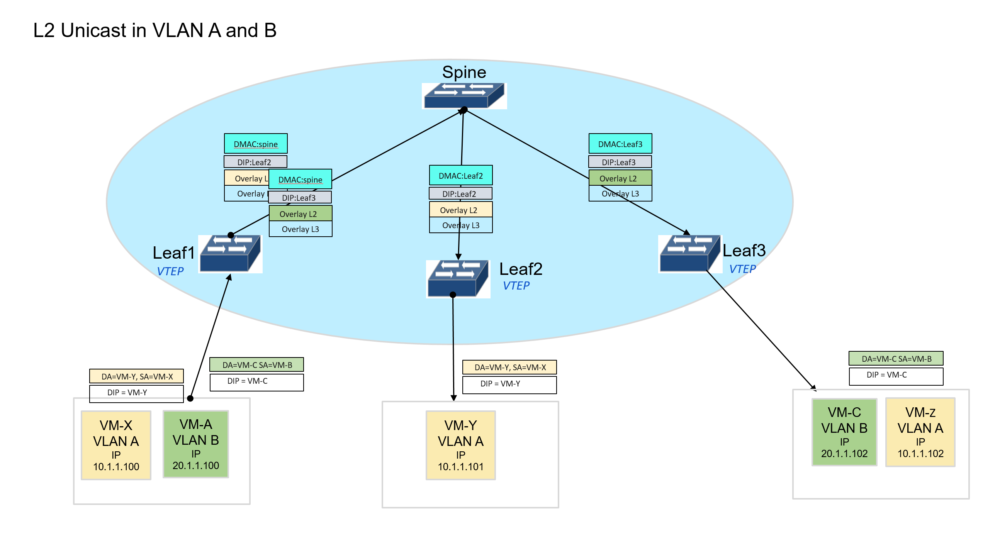
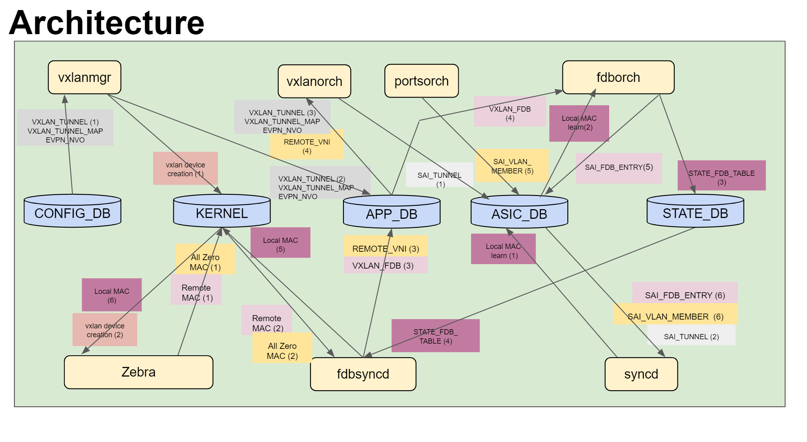
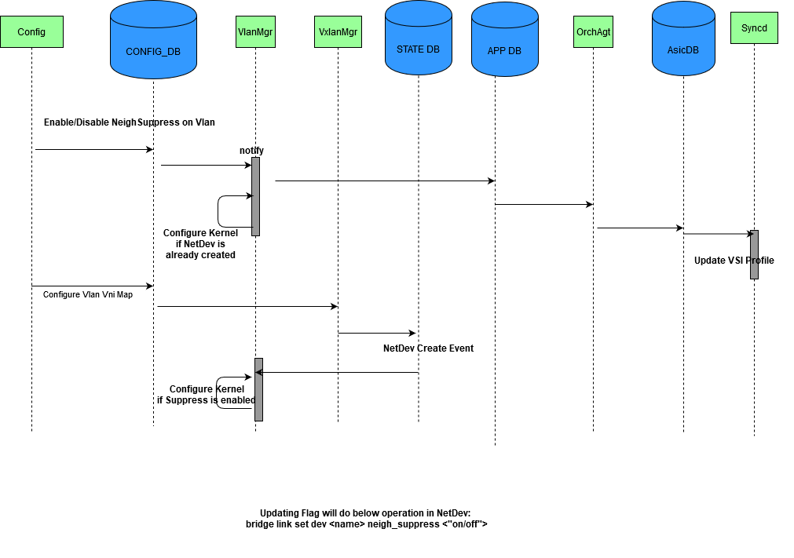
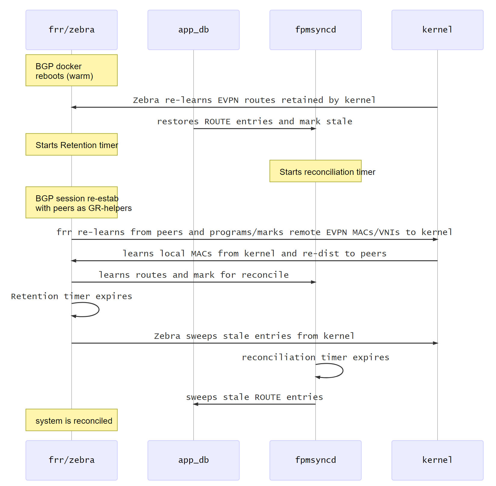

# EVPN VXLAN HLD

#### Rev 0.9

# Table of Contents

- [List of Tables](#list-of-tables)
- [Revision](#revision)
- [Definition/Abbreviation](#definitionabbreviation)
- [About This Manual](#about-this-manual)
- [1 Introduction and Scope](#1-introduction-and-scope)
- [2 Feature Requirements](#2-feature-requirements)
  - [2.1 Functional Requirements](#21-functional-requirements)
  - [2.2 Configuration and Management Requirements](#22-configuration-and-management-requirements)
  - [2.3 Scalability Requirements](#23-scalability-requirements)
  - [2.4 Warm Boot Requirements](#24-warm-boot-requirements)
- [3 Feature Description](#3-feature-description)
  - [3.1 Target Deployment Use Cases](#31-target-deployment-use-cases)
  - [3.2 Functional Description](#32-functional-description)
- [4 Feature Design](#4-feature-design)
  - [4.1 Overview](#41-design-overview)
  - [4.2 DB Changes](#42-db-changes)
    - [CONFIG DB](#config_db-changes)
    - [APP DB](#app_db-changes)
    - [STATE DB](#state_db-changes)
    - [COUNTER_DB](#counter_db-changes)
  - [4.3 Modules Design and Flows](#43-modules-design-and-flows)
    - [4.3.1 Tunnel Creation](#431-tunnel-auto-discovery-and-creation)
    - [4.3.2 Tunnel Deletion](#432-tunnel-deletion)
    - [4.3.3 Mapper Handling](#433-per-tunnel-mapper-handling)
    - [4.3.4 VXLAN State DB Changes](#434-vxlan-state-db-changes)
    - [4.3.5 Tunnel ECMP](#435-support-for-tunnel-ecmp)
    - [4.3.6 IMET Route Handling](#436-imet-route-handling)
    - [4.3.7 MAC Route Handling](#437-mac-route-handling)
    - [4.3.8 MACIP Route Handling](#438-mac-ip-route-handling)
    - [4.3.9 IP Prefix Route Handling](#439-ip-prefix-(type-5)-route-handling)
    - [4.3.10 ARP and ND Suppression](#4310-arp-and-nd-suppression)
    - [4.3.11 Tunnel Statistics](#4311-support-for-tunnel-statistics)
  - [4.4 Linux Kernel](#44-linux-kernel)
- [5 CLI](#5-cli)
  - [5.1 Click CLI](#51-click-based-cli)
    - [5.1.1 Configuration Commands](#511-configuration-commands)
    - [5.1.2 Show Commands](#512-show-commands)
  - [5.2 KLISH CLI](#52-klish-cli)
    - [5.2.1 Configuration Commands](#521-configuration-commands)
    - [5.2.2 Show Commands](#522-show-commands)
  - [5.3 CONFIG DB Examples](#53-config-db-examples)
  - [5.4 APP DB Examples](#54-app-db-examples)
- [6 Serviceability and Debug](#6-serviceability-and-debug)
- [7 Warm reboot Support](#7-warm-reboot-support)
- [8 Unit Test Cases ](#8-unit-test-cases)
- [9 References ](#9-references)

# List of Tables

[Table 1: Abbreviations](#table-1-abbreviations)

# Revision
| Rev  |    Date    |       Author        | Change Description                                           |
|:--:|:--------:|:-----------------:|:------------------------------------------------------------:|
| 0.1  |  |   Rajesh Sankaran   | Initial version                                              |
| 0.2  |  | Rajesh Pukhraj Jain | Added Warm boot requirement/design details. Added CLI, Functional, Scalability & Warm boot test cases |
| 0.3  |  |   Rajesh Sankaran   | Incorporated Review comments                                 |
| 0.4  |  | Tapash Das, Hasan Naqvi | Added L3 VXLAN details |
| 0.5  |  | Karthikeyan A | ARP and ND suppression |
| 0.6  |  | Kishore Kunal | Added Fdbsycnd details |
| 0.7  |  | Rajesh Sankaran | Click and SONiC CLI added |
| 0.8 | | Hasan Naqvi | Linux kernel section and fdbsyncd testcases added |
| 0.9 | | Nikhil Kelhapure | Warm Reboot Section added |

# Definition/Abbreviation

### Table 1: Abbreviations

| **Term** | **Meaning**                               |
| -------- | ----------------------------------------- |
| BGP      | Border Gateway Protocol                   |
| BUM      | Broadcast, Unknown unicast, and Multicast |
| EVPN     | Ethernet Virtual Private Network          |
| IMET     | Inclusive Multicast Ethernet Tag          |
| IRB      | Integrated Routing and Bridging           |
| L3GW     | Layer 3 Gateway                           |
| NVO      | Network Virtualization Overlay            |
| VNI      | VXLAN Network Identifier                  |
| VRF      | Virtual Routing and Forwarding            |
| VTEP     | VXLAN Tunnel End point                    |
| VXLAN    | Virtual Extended LAN                      |

# About this Manual

This document provides general information about the EVPN VXLAN feature implementation based on RFC 7432 and 8365 in SONiC. 
This feature is incremental to the SONiC.201911 release which is referred to as current implementation in this document.


# 1 Introduction and Scope

This document describes the Functionality and High level design of the EVPN VXLAN feature.

The following are the benefits of an EVPN approach for VXLAN.

 - Standards based and Interoperable solution.
 - Auto discovery of remote VTEPs, Auto provisioning of tunnels and VLANs over VXLAN tunnels.
 - Support for L2 and L3 VPN services.
 - Allows for dual homing support.
 - Control plane MAC learning and ARP suppression leads to reduced flooding over an EVPN network.
 - Eases planning and configuration when supporting downstream assigned VNI for DCI usecases.
 - Aids in VM mobility.

In the current implementation, there is support for L3 forwarding over VXLAN and EVPN Type 5 route support based on VNET constructs. 

This feature adds the following enhancements.

- EVPN Type 2, 3 routes support.
- VLAN extension over VXLAN tunnels.
- Flooding of L2 BUM (Broadcast, Unknown Unicast, and Multicast) traffic in and out of VXLAN tunnel.
- Forwarding of L2 unicast traffic in and out of VXLAN tunnel.
- EVPN Type 5 route support based on VRF construct.
- Routing of L3 (IPv4 and IPv6) traffic in and out of the VXLAN tunnel.
- Overlay ECMP support.
- EVPN ARP and ND suppression.

The following item will be added in the future. 
- Basic OAM support for tunnels -  tunnel operational status and statistics.


It is important to note that VNET and VRF constructs are different in SONiC. EVPN Type-5 route support presented later in this document is based on the VRF and not VNET. However, design considerations have been accounted for the co-existence of VNET and VRF; and both of the features will be present and may be enabled independently.

This document covers high level design and interaction aspects of the SONiC software components for L2 & L3 EVPN support, including Orchestration agent submodules (FdbOrch, VXLANOrch, VrfOrch, RouteOrch, etc.), SAI objects, SwSS managers (VXLAN, VRF managers), interactions with Linux kernel, FRR (BGP, Zebra), and syncd modules (fpmsyncd, fdbsyncd, neighsyncd). 


The following aspects are outside the scope of this document.

- Support for L2 multi-tenancy is not in scope. VLAN ids received on all the access ports are mapped to the same broadcast domain and hence the same VNI. 
- IPv6 addresses for VTEPs.
- Static VXLAN tunnels.
- Multi-homing support described in the EVPN RFCs.


# 2 Feature Requirements

## 2.1 Functional Requirements

Following requirements are addressed by the design presented in this document:

1. Support creation and deletion of BGP EVPN discovered VXLAN tunnels (IPv4 only) based on IMET, MAC and IP Prefix  routes.
2. Support origination and withdrawal of IMET routes. 
3. Support origination and withdrawal of dynamic & static MAC routes.
4. Support origination and withdrawal of MACIP routes (ARP, ND) 
5. Support IPv4 & IPv6 Prefix route origination and remote route handling in user VRFs.
6. Support Ingress Replication for L2 BUM traffic over VXLAN tunnels. Underlay IP Multicast is not supported.  
7. Support remote MAC programming over VXLAN tunnels.
8. Support MAC/MACIP move from local to remote, remote to local, remote to remote. 
9. Support Routing In and Out of VXLAN Tunnel (RIOT) (MP-BGP EVPN Based)
    - Support Asymmetric Integrated Routing and Bridging (Asymmetric IRB)
    - Support Symmetric Integrated Routing and Bridging (Symmetric IRB)
10. Support ARP/ND suppression.
11. Support Tunnel ECMP and underlay path failovers.
12. Support a common VLAN-VNI map for all the EVPN tunnels.
13. Support monitoring and display of tunnel operational status.


## 2.2 Configuration and Management Requirements

This feature will support CLI and other management interfaces supported 
in SONiC.

1. Support configuration of Source IP address of the VTEP. 
2. Support configuration of a global VLAN-VNI map.
3. Support configuration of L3VNI association with VRF. L3VNI can only be associated with non-default VRF.


FRR version 7.2, and later, is assumed here. FRR configuration is assumed in "split" configuration mode.
BGP EVPN configurations in FRR are referred wherever required in this document. However, this document does not serve as reference guide for the FRR configurations.


## 2.3 Scalability Requirements

1. Total Local VXLAN terminations (source VTEP) - 1.
2. Total Remote VTEPs (VXLAN destination tunnels) - 512.
3. Total L2 VNI per switch- 4K.
4. Total VNI per tunnel - 4K.
5. Total EVPN participating VRF per switch - 512

The numbers specified here serve as a general guideline. The actual scale numbers are dependent on the platform.

## 2.4 Warm Boot Requirements

Warm reboot is intended to be supported for the following cases:

- Planned system warm reboot. 
- Planned SwSS warm reboot.
- Planned FRR warm reboot.


# 3 Feature Description

## 3.1 Target Deployment use cases

The following are some of the deployment use cases for L2 and L3 VXLAN. 

- The Leaf nodes of the IP Fabric Leaf-Spine topology.
- The Aggregation or Core or collapsed Core-Aggregation nodes of the traditional Access, Aggregator, and Core topology.
- Multi tenant environments.
- VLAN extension over an IP WAN. 
- Datacenter Interconnect using L2 and L3 hand-off.


## 3.2 Functional Description

EVPN VXLAN feature supports L2 forwarding and L3 routing over VXLAN, dynamic creation and deletion of VXLAN tunnels, dynamic extension and removal of VLANs over the discovered tunnels based on BGP EVPN procedures described in RFC 7432 and 8365.

#### L2 forwarding over VXLAN

Traffic received from the access ports are L2 forwarded over VXLAN tunnels if the DMAC lookup result does not match the switch MAC. The frame format is as described in RFC 7348. The VNI is based on the configured global VLAN-VNI map. BUM traffic is ingress replicated to all the tunnels  which are part of the VLAN. The DIP of the BUM packets is the IP address of the remote VTEP. Traffic received from VXLAN tunnels are never forwarded onto another VXLAN tunnels.


__Figure 1a: L2 flooding packet flow__


__Figure 1b: L2 flooding packet flow__

L2 unicast traffic is forwarded to the tunnel to which the MAC points to. 
Traffic received from VXLAN tunnels are mapped to a VLAN based on the received VNI and the VNI-VLAN lookup. The received traffic can be L2 unicast or BUM depending on the inner MAC lookup. 


__Figure 1c: L2 forwarding unicast packet flow__


#### Symmetric and Asymmetric IRB

In the asymmetric IRB model, the inter-subnet routing functionality is performed by the ingress VTEP with the packet after the routing action being VXLAN bridged to the destination VTEP.

The egress VTEP removes the VXLAN header and forwards the packet onto the local Layer 2 domain based on the VNI to VLAN mapping. The same thing happens on the return path, with the packet routed by the ingress router and then overlay switched by the egress router. The overlay routing action occurs on a different router on the reverse path vs. the forward path, hence the term asymmetric IRB.


__Figure 2: Asymmetric IRB packet flow__

In the symmetric IRB model the VTEP is only configured with the subnets that are present on the directly attached hosts. Connectivity to non-local subnets on a remote VTEP is achieved through an intermediate IP-VRF.


The ingress VTEP routes the traffic between the local subnet and the IP-VRF, which both VTEPs are a member of, the egress VTEP then routes the frame from the IP-VRF to the destination subnet.  The forwarding model results in both VTEPs performing a routing function.


__Figure 3: Symmetric IRB packet flow__


Both asymmetric and symmetric IRB models will be supported in SONiC.


#### ARP and ND Suppression

EVPN Type-2 routes make remote MAC-IP binding available on local device. This allows any ARP/ND request originated by local hosts for the remote IP to be serviced locally using the MAC-IP binding. This reduces ARP flooding in the network.


# 4 Feature Design


## 4.1 Design Overview

### 4.1.1 Basic Approach

For control plane, MP-BGP with EVPN extension support is leveraged from FRR with changes in Zebra and Fpmsyncd to interact with SONiC SwSS. A new process Fdbsyncd is added in SwSS to sync MAC route with kernel.  

VXLAN orchagent and manager, FDB orchagent, VRF orchagent and manager, route orchagent   are enhanced to achieve this feature. 


### 4.1.2 Container

No new container is added. The changes are added to existing containers such as FRR, SwSS and Syncd. The details of the changes will be discussed in the Design section below.

### 4.1.3 SAI Overview

To support this feature, SAI will be extended as described in the SAI PRs below:

- [Support for MAC Move](https://github.com/opencomputeproject/SAI/pull/1024)
- [Support for L2VXLAN](https://github.com/opencomputeproject/SAI/pull/1025)
- [Support for ARP/ND Suppression](https://github.com/opencomputeproject/SAI/pull/1056)

## 4.2 DB Changes

At a high level below are some of the interactions between relevant components and the DB involved for EVPN L2 VXLAN support in SONiC architecture.


__Figure 4: EVPN L2 VXLAN DBs__

### 4.2.1 CONFIG_DB changes

**EVPN_NVO_TABLE**

Producer:  config manager 

Consumer: VxlanMgr

Description: This is a singleton configuration which holds the tunnel name specifying the VTEP source IP used for BGP-EVPN discovered tunnels. 

Schema:

```
;New table
;holds the tunnel name specifying the VTEP source IP used for BGP-EVPN discovered tunnels

key = VXLAN_EVPN_NVO|nvo_name
                          ; nvo or VTEP name as a string
; field = value
source_vtep = tunnel_name ; refers to the tunnel object created with SIP only.
```

**NEIGH_SUPPRESS_CFG_VLAN_TABLE**

Producer:  config manager

Consumer: VlanMgr

Description: New table that stores neighbor suppression per VLAN configuration.

Schema:

```
;New table
;Stores Neigh Suppress configuration per VLAN

key             = SUPPRESS_VLAN_NEIGH|"Vlan"vlanid       ; VLAN with prefix "NEIGH_SUPPRESS"
suppress_neigh  = "ON" / "OFF" ; Default "OFF"

```

**VRF_TABLE**

Producer:  config manager

Consumer: VrfMgr

Description: Updated existing table to store VNI associated with VRF.

Schema:

```
;Existing table
;defines virtual routing forward table. Updated to stores VNI associated with VRF
;
;Status: stable

key = VRF_TABLE:VRF_NAME ;
fallback = "true"/"false"
vni = 1*8DIGIT ; VNI associated with VRF

```

### 4.2.2 APP_DB Changes

**EVPN_NVO_TABLE**

Producer:  VxlanMgr 

Consumer: VxlanOrch

Description: This is a singleton configuration which holds the VTEP source IP used for BGP-EVPN discovered tunnels. 

Schema:

```
; New table
; holds the VTEP source IP used for BGP-EVPN discovered tunnels

key = VXLAN_EVPN_NVO_TABLE:nvo_name
                          ; nvo or VTEP name as a string
; field = value
source_vtep = tunnel_name ; refers to the VXLAN_TUNNEL object created with SIP only.
```

**VXLAN_REMOTE_VNI** 

Producer: fdbsyncd

Consumer: VxlanOrch

Description: This specifies the remote VNI to be extended over a tunnel. This is populated by fdbsyncd on receipt of a IMET route from the remote side. 

Schema:

```
; New table
; specifies the VLAN to be extended over a tunnel

key = VXLAN_REMOTE_VNI_TABLE:"Vlan"vlanid:remote_vtep_ip
                  ; Vlan ID and Remote VTEP IP 
; field = value
vni = 1*8DIGIT    ; vni to be used for this VLAN when sending traffic to the remote VTEP
```

**VXLAN_FDB_TABLE**

Producer: fdbsyncd

Consumer: fdborch

Description: This holds the MACs learnt over a VNI from the remote VTEP.  This is populated by fdbsyncd on receipt of a MAC route. 

Schema:

```
; New table
; specifies the MAC and VLAN to be programmed over a tunnel

key = VXLAN_FDB_TABLE:"Vlan"vlanid:mac_address
                          ;MAC Address and VLAN ID
;field = value
remote_vtep = ipv4
type          = "static" / "dynamic"  ; type of the entry.
vni         = 1*8DIGIT                ; vni to be used for this VLAN when sending traffic to the remote VTEP
```

**VRF_TABLE**

Producer: VrfMgr

Consumer: Vrforch

Description: Updated existing table to store VNI associated with VRF.

Schema:

```
;Existing table
;defines virtual routing forward table. Updated to stores VNI associated with VRF
;
;Status: stable

key = VRF_TABLE:VRF_NAME ;
fallback = "true"/"false"             ; default false
vni = 1*8DIGIT ; VNI assicated with the VRF

```

**VRF_ROUTE_TABLE**

Producer: fpmsyncd

Consumer: routeorch

Description: VRF Route Table is extended for Tunnel Nexthop. 

Schema:

```
;Stores a list of routes
;Status: Mandatory

key = ROUTE_TABLE:VRF_NAME:prefix ;
nexthop = prefix,              ; IP addresses separated ',' (empty indicates no gateway). May indicate VXLAN endpoint if vni_label is non zero.
intf = ifindex? PORT_TABLE.key ; zero or more separated by ',' (zero indicates no interface)
vni_label = VRF.vni            ; New Field. zero or more separated by ',' (empty value for non-vxlan next-hops). May carry MPLS label in future.
router_mac = mac_address       ; New Field. zero or more remote router MAC address separated by ',' (empty value for non-vxlan next-hops)
blackhole = BIT                ; Set to 1 if this route is a blackhole (or null0)

```

**NEIGH_SUPPRESS_APP_VLAN_TABLE**

Producer: VlanMgr

Consumer: VlanOrch

Description: New table for per VLAN neighbor suppression configuration.

Schema:

```
; New table
;Stores Neigh Suppress configuration per VLAN

key             = SUPPRESS_VLAN_NEIGH_TABLE:"Vlan"vlanid		; VLAN with prefix "NEIGH_SUPPRESS"
suppress_neigh  = "ON" / "OFF" ; Default "OFF"
```

### 4.2.3 STATE_DB changes

**STATE_VXLAN_TUNNEL_TABLE**

Producer: vxlanorch

Consumer: show scripts

Description: 

- Holds the created tunnels - static or dynamic. 
- There is a VXLAN Tunnel entry for every tunnel created. 
- The SIP and DIP are added for tunnels. 
- Tunnel Creation source is added. 

Schema:

```
; New table
; Defines schema for VXLAN State
key             = VXLAN_TUNNEL:name    ; tunnel name
; field         = value
SRC_IP          = ipv4                 ; tunnel sip
DST_IP          = ipv4                 ; tunnel dip 
tnl_src         = "CLI"/"EVPN"  
operstatus      = "oper_up"/"oper_down"  
```

### 4.2.4 COUNTER_DB changes

Producer: syncd

Consumer: show scripts

Description:

- Per Tunnel Rx/Tx packets and octet counters are added.
- Existing counters table is used to add the tunnel counters.

Schema:

```
; Existing table
key                           = COUNTERS:tunnel_vid   ; tunnel oid
; field                       = value
SAI_TUNNEL_STAT_IN_OCTETS     = number    ;uint64 
SAI_TUNNEL_STAT_IN_PACKETS    = number    ;uint32  
SAI_TUNNEL_STAT_OUT_OCTETS    = number    ;uint64 
SAI_TUNNEL_STAT_OUT_PACKETS   = number    ;uint32
```


## 4.3 Modules Design and Flows

#### EVPN Control Plane and configurations

FRR as EVPN control plane is assumed in this document. However, any BGP EVPN implementation can be used as control plane as long as it complies with the EVPN design proposed in this document.

Following configurations are common for enabling EVPN L2/L3 services:

- Configure VXLAN tunnel with SIP only representing the VTEP.
- Configure EVPN NVO instance.
- Configure BGP EVPN address-family and activate IPv4/IPv6 BGP neighbors.


The corresponding CONFIG_DB entries are as follows. 


```
VXLAN_TUNNEL_TABLE|{{source_vtep_name}}
    "src_ip" : {{ipv4_address}}
    
VXLAN_EVPN_NVO_TABLE|{{nvo_name}}
    "source_vtep" : {{source_vtep_name}}
```


Following configurations are required for enabling EVPN L3 service on SONiC device:

- Configure L3VNI-VLAN mapping for the given NVO.
- Configure L3VNI under the corresponding SONiC VRF config
- Configure L3VNI under the corresponding VRF config in FRR.
- Configure VRF on VLAN interface associated with the VLAN.


The corresponding CONFIG_DB entries are as follows. 
```
VLAN|Vlan{{vlan_id}}
    "vlanid" : {{vlan_id}}

VXLAN_TUNNEL_MAP|{{source_vtep_name}}|{{tunnel_map_name}}
    "vni" : {{vni_id}}
    "vlan" : {{vlan_id}}

VRF|{{vrf_name}}
    "vni" : {{vni_id}}

VLAN_INTERFACE|Vlan{{vlan_id}}
    "vrf-name" : {{vrf_name}}
```

 

Following configurations are required for enabling EVPN L2 service on SONiC device:

- Configure L2VNI-VLAN mapping for the given NVO (similar to L3 above)
- Configure control plane to advertise MAC-IP bindings.

The corresponding CONFIG_DB entries are as follows. 

```
VLAN|Vlan{{vlan_id}}
    "vlanid" : {{vlan_id}}

VXLAN_TUNNEL_MAP|{{source_vtep_name}}|{{tunnel_map_name}}
    "vni" : {{vni_id}}
    "vlan" : {{vlan_id}}
```


### 4.3.1 Tunnel Auto-discovery and Creation 

In the current implementation, Tunnel Creation handling in the VxlanMgr and VxlanOrch is as follows. 

1. An entry made in VXLAN_TUNNEL_TABLE  results in VxlanMgr populating an entry in the APP_DB which further is handled by VxlanOrch to create a **VxlanTunnel** Object. 
2. SAI_tunnel calls are made based on one of the following triggers.

- First VLAN VNI Map entry for that tunnel. (CFG_VXLAN_TUNNEL_MAP_TABLE)
- First VNET entry in CFG_VNET_TABLE.
- IP Route add over Tunnel. 

The VTEP is represented by a VxlanTunnel Object created as above with the DIP as 0.0.0.0 and 
SAI object type as TUNNEL. This SAI object is P2MP.

In this feature enhancement, the following events result in remote VTEP discovery and trigger tunnel creation. These tunnels are referred to as dynamic tunnels and are P2P.

- IMET route rx 
- IP Prefix route handled by VRF construct.

The dynamic tunnels created always have a SIP as well as a DIP. These dynamic tunnel objects are associated with the corresponding VTEP object. 

The dynamic tunnels are created when the first EVPN route is received and will be deleted when the last route withdrawn. To support this, refcounting per source - IMET, MAC, VNET/Prefix routes will be maintained to determine when to create/delete the tunnel. This is maintained in the VTEP VxlanTunnel Object.

The Tunnel Name for dynamic tunnels is auto-generated as EVPN_A.B.C.D where A.B.C.D is the DIP.

For every dynamic tunnel discovered, the following processing occurs. 
- SAI objects related to tunnel are created.
  - Tunnel SAI object is created with the mapper IDs created for the VTEP.
- BridgePort SAI object with the tunnel oid is created. Learning is disabled for EVPN tunnels.
- Port object of type Tunnel created in the portsorch. 

The creation sequence assuming only IMET rx is depicted in the diagram below.


__Figure 5: EVPN Tunnel Creation__

### 4.3.2 Tunnel Deletion

EVPN Tunnel Deletion happens when the refcnt goes down to zero. So depending on the last route being deleted (IMET, MAC or IP prefix) the tunnel is deleted. 

sai_tunnel_api remove calls are incompletely handled in the current implementation. 
The following will be added as part of tunnel deletion. 

- sai_tunnel_remove_map_entry when an entry from CFG_VXLAN_TUNNEL_MAP is removed.
- sai_tunnel_remove_map, sai_tunnel_remove_tunnel_termination, sai_tunnel_remove_tunnel when the tunnel is to be removed on account of the last entry being removed. 
- VxlanTunnel object will be deleted.

### 4.3.3 Per Tunnel Mapper handling

The SAI Tunnel interface requires encap and decap mapper id to be specified along with every sai tunnel create call. 

Current VxlanOrch implementation associates only one mapper type to a SAI tunnel object. The SAI API however allows for multiple mapper types to be associated with a tunnel. 

With EVPN VXLAN feature being added, the same tunnel can carry L2 as well as L3 traffic. Hence there is a need to support multiple mapper types (VLAN, VRF, BRIDGE to VNI mapping) per tunnel.

In addition, there is a need to support a Global VLAN VNI map common to all the Tunnels. This is achieved by reusing the same encap and decap mapper ids associated with the P2MP tunnel object for all the dynamic P2P tunnels.

VxlanOrch will be enhanced to support the above two requirements. 

### 4.3.4 VXLAN State DB changes

In the current implementation there is an entry for every tunnel in the STATE_VXLAN_TABLE. This is populated by the vxlanmgr when the necessary kernel programming is completed. This occurs when CFG_VNET_TABLE is populated with an entry. This entry reflects the kernel programming status and is typically associated with the VTEP (SIP only tunnel).

Since BGP EVPN tunnels are auto-discovered there needs to be a mechanism available to list all the auto-discovered tunnels. Multiple BGP EVPN tunnels are associated with the same VTEP (SIP only tunnel) which is not reflected in the current table.

In addition there is a need to display the operstatus of the tunnel.  The operstatus is reflective of the dataplane forwarding status of the tunnel. The operstatus can toggle depending on the dataplane state. 

A new table STATE_VXLAN_TUNNEL_TABLE is used for the above purposes.

A new field "tunnel source" - EVPN or CLI will be added to indicate the source of tunnel creation. 

The tunnel source (EVPN, CLI), SIP, DIP can be filled in during creation time. 

The operstatus of a tunnel  will be updated based on notification from SAI through a notification channel similar to port oper status. 

Applications within orchagent can subscribe to the operstatus changes of the tunnel through a subject/observer class model. 

### 4.3.5 Support for Tunnel ECMP

The Tunnel destination can be reachable by multiple underlay paths. L3 traffic and L2 Unicast traffic is typically load balanced.  L2 BUM traffic load balancing is dependent on the platform capabilities.  

The SONiC behavioral model assumes that the overlay bridging/routing component and the underlay routing component are separate components and connected by a certain underlay RIF.  This allows for BUM traffic to also be load-balanced. 

However not all hardware devices support separate overlay and underlay components and instead have a collapsed model wherein there is only an overlay lookup and the packet is encapsulated and sent out on a physical interface based on underlay routing decisions.  

It is proposed to handle these variances in the SAI implementation.

### 4.3.6 IMET route handling

The IMET route is used in EVPN to specify how BUM traffic is to be handled. This feature enhancement supports only ingress replication as the method to originate BUM traffic. 

The VLAN, Remote IP and VNI to be used is encoded in the IMET route. 

#### IMET route rx processing

The IMET rx processing sequence is depicted in the diagram below. 


__Figure 6: IMET route processing VLAN extension__

##### FRR processing
When remote IMET route is received, fdbsyncd will install entry in REMOTE_VNI_TABLE in APP_DB:

```
REMOTE_VNI_TABLE:{{vlan_id}}:{{remote_vtep}}
     "vni" : {{vni_id}}
```

The *vni_id* is remote VNI received in the IMET route, and *remote_vtep* is IPv4 next-hop of the IMET route.

##### VxlanOrch processing

- Create Tunnel if this is the first EVPN route to the remote VTEP. 
- Retrieve the bridgeport associated with the dynamic tunnel.
- create VlanMember of type tunnel and associate it to the vlanPort object in portsorch.
- call sai_vlan_api->create_member with vlanid and tunnel bridgeport. 


#### IMET route origination

The IMET route origination sequence is depicted in the diagram below. 


__Figure 7: IMET route origination__

Zebra triggers BGP to originate IMET route when the vni device is programmed in the kernel.

##### kernel programming vni device

Following Linux operations are performed by vxlanmgr when VXLAN_TUNNEL_MAP is configured with VNI 1000 mapped to VLAN 100:

```
ip link add vxlan-100 type vxlan id 1000 local <src_vtep_ip> nolearning dstport 4789

# Add VXLAN interface to Bridge and make it member of corresponding Vlan
ip link set dev vxlan-100 master Bridge
bridge vlan add vid 100 dev vxlan-1000
bridge vlan add vid 100 untagged pvid dev vxlan-100

ip link set up vxlan-100
```


Note that in case of L3VNI, FRR requires VRF to be configured with corresponding L3VNI, and also L3VNI is bound to VRF in Linux. Below Linux operation is performed by intfmgr when interface is bound to VRF.

```
ip link set dev Vlan100 master <vrf>
```

vni netdev creation will trigger the IMET route generation. 

Since this programming is dependent on VLAN to be present a check is being added as part of the CLI to ensure that VLAN is present before the map is configured.

The existing kernel programming sequence in VxlanMgr for tunnels triggered by CFG_VNET_TABLE entries is not altered.

##### FRR processing

VLAN creation and a VLAN-VNI mapping in Linux triggers origination of IMET route in BGP.  
FRR originates IMET routes based on kernel events listened to by zebra. 

##### VxlanOrch processing

In the current implementation, kernel programming for VXLAN devices is done by vxlanmgr only when CFG_VNET_TABLE entry is made. 

In this enhancement for BGP EVPN tunnels, VXLAN_TUNNEL_MAP entry addition along with presence of VLAN will trigger the kernel programming. 


### 4.3.7 MAC route handling


MAC addresses learnt in the forwarding plane are populated by fdborch in the FDB_TABLE in STATE_DB. The Linux FDB learns only those MAC addresses which are CPU bound (e.g. from ARP request/response). In order to provide EVPN L2 service, all of the MAC addresses learnt in the forwarding plane need to be advertised.

In order to achieve above, new process fdbsyncd is added in SwSS. Fdbsyncd would subscribe to FDB entries for a given VLAN once VLAN-VNI mapping is available. Fdbsyncd will maintain the VLAN subscription and send FDB events to Linux FDB.


__Figure 8: EVPN MAC route handling__


Zebra will install all of the remote MAC routes to kernel. All Remote MAC addresses will be available in VXLAN_FDB_TABLE in APP_DB via Fdbsynd.

```
VXLAN_FDB_TABLE:{{vlan}}:{{mac_address}}
    "remote_vtep" : {{ipv4_address}}
    "type"   : "static" / "dynamic"  ; type of the entry.
    "vni" : {{vni_id}}
```

In the case of MAC move from remote to local, remote MAC entry will be removed by Zebra from Linux FDB. Fdbsyncd will remove the remote mac from APP_VXLAN_FDB_TABLE when MAC moves.

#### 4.3.7.1 Local MAC handling

There is no change to fdborch wrt local MAC handling. 

Currently Local MACs learnt by the fdborch are written to the STATE_DB. 

Fdbsyncd listens to the above table and notifies Linux FDB which notifies to Zebra, Zebra to BGP and BGP originates the MAC route. 

The above is applicable for locally added static MACs also. 


__Figure 9: Local MAC handling__

#### 4.3.7.2 Remote MAC handling

Remote MACs learnt by BGP will be installed in Linux FDB via Zebra; Fdbsyncd will be listening to Linux FDB, MAC learned over Vxlan interface will be populated in APP_VXLAN_FDB_TABLE.

fdborch does the following on an entry add in APP_VXLAN_FDB_TABLE. 

- Store the Remote MAC in an internal cache. The internal cache used for local MACs will be used for storing remote MACs as well. 
- sai_fdb_entry_add called with the following attributes
  - SAI_FDB_ENTRY_ATTR_BRIDGE_PORT_ID with the bridge port id corresponding to the tunnel.
  - SAI_FDB_ENTRY_ATTR_ENDPOINT_IP with the tunnel DIP.
  - SAI_FDB_ENTRY_ATTR_TYPE with type SAI_FDB_ENTRY_TYPE_STATIC and SAI_FDB_ENTRY_ATTR_ALLOW_MAC_MOVE as true(corresponding to type dynamic in VXLAN_FDB_TABLE) or false (corresponding to type static in VXLAN_FDB_TABLE)  


__Figure 10: Remote MAC handling__


#### 4.3.7.3 MAC Move handling

##### Local to Local

There is no special handling by SwSS. 

Local to Local MAC moves will be identified by BGP and no MAC route will be re-originated. 

##### Remote to Local

For MAC move cases from remote to local, fdbsyncd removes the 
remote entry from VXLAN_FDB_TABLE. The fdborch should not delete the 
MAC from the internal cache and the hardware. 

##### Local to Remote

MAC move from local to remote tunnel is handled as follows.

- fdbsyncd adds the new remote MAC entry to the APP_VXLAN_FDB_TABLE.
- fdborch looks up internal cache to see if an entry exists. If it exists with a local port as the destination then the entry is deleted and the new entry populated.
- If the local MAC is configured as static then the received remote MAC will not be programmed and instead will be marked as pending. This will be programmed when the local static MAC is removed. 

##### Remote to Remote

MAC Move from remote tunnel-1 to remote tunnel-2 is handled as follows. 

- On identifying a MAC Move, BGP deletes the old entry from APP_VXLAN_FDB_TABLE and adds the new entry pointing to the tunnel-2.
- fdborch processing is same as for a regular remote MAC add/delete.  


### 4.3.8 MAC-IP route handling

Local MAC-IP bindings (ARP/ND entries) will be directly learnt by BGP (Zebra) from the IP stack.


__Figure 11: EVPN MAC-IP Route handling__

The remote MAC-IP routes will be installed by BGP (Zebra) in Linux neighbor table against Vlan netdevice. Neighsyncd subscribes to neighbor entries and will receive remote MAC-IP bindings as well. These entries will continue to go into NEIGH_TABLE in APP_DB, and neighorch will update SAI database.


### 4.3.9 IP Prefix (Type-5) route handling

BGP VRF routes will be exported into EVPN as IP prefix routes if corresponding VRF is configured with L3VNI and corresponding IRB VLAN is present and belongs to the corresponding VRF.  The remote EVPN IP prefix routes are imported into BGP VRF table and after path selection downloaded to Linux and Fpmsyncd.


__Figure 12: EVPN_Type5_Route__

#### VRF Route Table with Tunnel Nexthop

The connected prefixes bound to VNET go into VNET_ROUTE_TABLE, and remote prefixes are programmed in VNET_ROUTE_TUNNEL_TABLE.

In contrast to the above, VRF routes are programmed in ROUTE_TABLE:{{vrf_name}} table including local (connected, static) and remote (BGP, IGP) VRF-lite prefixes.

In order to program VRF routes imported from EVPN Type-5 prefix routes, <endpoint, router-MAC, and VNI> values are required along with the prefix in the route entry.

The ROUTE_TABLE will be enhanced to keep VXLAN endpoint specific fields in the next-hop. 

Changes to the ROUTE_TABLE App-DB schema are highlighted below.

```
;Stores a list of routes
;Status: Mandatory

key = ROUTE_TABLE:VRF_NAME:prefix ;
nexthop = prefix,              ; IP addresses separated ',' (empty indicates no gateway). May indicate VXLAN endpoint if vni_label is non zero.
intf = ifindex? PORT_TABLE.key ; zero or more separated by ',' (zero indicates no interface)
vni_label = VRF.vni            ; New Field. zero or more separated by ',' (empty value for non-vxlan next-hops). May carry MPLS label in future.
router_mac = mac_address       ; New Field. zero or more remote router MAC address separated by ',' (empty value for non-vxlan next-hops)
blackhole = BIT                ; Set to 1 if this route is a blackhole (or null0)

```

The VNET_ROUTE_TABLE and VNET_TUNNEL_ROUTE_TABLE will continue to exist for VNET. In fpmsyncd, routes coming from zebra with “Vnet-” master netdevice will go VNET route tables, and routes with VRF master netdevice will go into ROUTE_TABLE:{{vrf_name}} table.

Since VNET and VRF route-tables will be separate in FRR, there will be no coherency/consistency issues between VNET and VRF route-tables.

Note that FRR doesnot send remote VNI and remote routers MAC address in the VRF route message to fpm today. FRR changes will be required to carry these values along with the route in zebra and pass them on to fpm.

Following flow diagrams explains the prefix route over tunnel programing.
If APP VRF Route Table is updated with non-zero VNI, Nexthop IP is overlay nexthop and Tunnel Nexthop is created.

Tunnel encap mapper entry is created using the VRF and VNI from VRF route table.
Tunnel decap mapper entry is created using VNI from APP VRF Table. VRF to VNI mapping in this case is configured.


__Figure 13: EVPN_Type5_Route_Flow__


__Figure 14: Associate VRF with L3 VNI__

### 4.3.10 ARP and ND Suppression

When the VNI is configured to support ARP and ND Suppression, the node will start to act as proxy for the remote neigbours. Hence avoiding the Arp & ND traffic across the tunnels. This also helps in faster convergence.




__Figure 15: ARP and ND Suppression flow__

ARP and ND suppression functionality is achieved in Linux kernel by updating neighbour suppress flag in VXLAN netdevice. One netdevice is created per VNI.

In the above diagram, When updating the ARP/ND Suppresion per VLAN , VlanMgr will find the appropiate Netdevice for the configured VLAN. It will
update the corresponding Netdevice Flag.This information must be passed to SAI layer to make sure that ARP/ND packets are trapped instead of copy to cpu.
For few platforms, SAI might be required to program the ARP Suppress packets differently from Normal ARP. 
i.e. Special CPU Queue with more CIR (Commited Information Rate) as it is acting as Proxy.
For those cases, the ARP and ND Suppress information per VLAN will be sent to SAI layer. 

Since this feature is supported in kernel, it can scale for all 4k VLANs.

Kernel uses a single flag for both ARP & ND suppression, We support only one CLI for configuring both ARP & ND suppression per VLAN.

### 4.3.11 Support for Tunnel Statistics

With the L2 and L3 support over VXLAN it is useful to support tunnel statistics. 

#### 4.3.11.1 Counters supported. 

The Packets Rx/Tx and Octets Rx/Tx will be counted per tunnel.
These will be stored in the counters DB for each tunnel. 

####  4.3.11.2 Changes to SwSS

- Flexcounter group for tunnels added with poll interval of 1 second and stat mode being STAT_MODE_READ. This is called as part of VxlanOrch constructor.
- VxlanOrch adds and removes tunnels in the FLEX_COUNTER_DB when a tunnel gets created or destroyed. Addition to the FLEX_COUNTER_DB will be done after all the SAI calls to create the tunnel. Removal from the DB will be done before  SAI calls to delete the tunnel. 

#### 4.3.11.3 Changes to syncd

- Flex counter and Flex group counter processing to also include tunnels. 
- Include Tunnel counters as part of FlexCounter::collectCounters call. 

## 4.4 Linux Kernel

VxLAN netdevice is created in Linux kernel by vxlanmgr for each of the configured VNI with "<vxlan-tunnel-name>-<vlan-id>" name format. Sample dump of VxLAN netdevice (VLAN-VNI 100-1000) properties is pasted below.

```
ip -d link show dev vtep1-100

1535: vtep1-100: <BROADCAST,MULTICAST,UP,LOWER_UP> mtu 1500 qdisc noqueue master Bridge state UNKNOWN mode DEFAULT group default qlen 1000
    link/ether 3c:2c:99:8b:35:bc brd ff:ff:ff:ff:ff:ff promiscuity 1
    vxlan id 1000 local 10.0.0.10 srcport 0 0 dstport 4789 nolearning ageing 300 udpcsum noudp6zerocsumtx noudp6zerocsumrx
    bridge_slave state forwarding priority 4 cost 100 hairpin off guard off root_block off fastleave off learning off flood on port_id 0x81c9 port_no 0x1c9 designated_port 33225 designated_cost 0 designated_bridge 8000.3c:2c:99:8b:35:bc designated_root 8000.3c:2c:99:8b:35:bc hold_timer    0.00 message_age_timer    0.00 forward_delay_timer    0.00 topology_change_ack 0 config_pending 0 proxy_arp off proxy_arp_wifi off mcast_router 1 mcast_fast_leave off mcast_flood on addrgenmode eui64 numtxqueues 1 numrxqueues 1 gso_max_size 65536 gso_max_segs 65535
```

Each vxlan netdevice is member of the default "Bridge", and fdb learning is disabled for them.


Typical remote client MAC dynamically learnt and synced by BGP is shown below (bridge fdb show):

```
00:00:11:22:33:44 dev vtep1-100 vlan 100 offload master Bridge
00:00:11:22:33:44 dev vtep1-100 dst 10.0.0.11 self offload
```

Remote SVI MAC is installed by FRR as static entry if "advertise-default-gw" is configured (bridge fdb show):

```
b8:6a:97:e2:6f:9c dev vtep1-100 vlan 100 master Bridge static
b8:6a:97:e2:6f:9c dev vtep1-100 dst 10.0.0.11 self static
```

Remote IMET routes are installed by FRR with null mac and one entry exists for each of the remote VTEPs against the VxLAN/VNI netdevice (bridge fdb show):

```
00:00:00:00:00:00 dev vtep1-100 dst 10.0.0.11 self permanent
00:00:00:00:00:00 dev vtep1-100 dst 10.0.0.12 self permanent
```


Linux kernel version 4.9.x used in SONiC requires backport of a few patches to support EVPN. Some of them are listed below:

1. NTF_EXT_LEARNED (control plane) entries handling required in bridge and neighbor modules.
2. L3VNI IPv6 route installation with IPv4 mapped IPv6 address as next-hop requires backport.
3. Default max bridge ports in Linux is set to 1K. Port bitmap increase required.
4. Neighbor (arp/nd) move to a different MAC requires fix.
5. Other misc. fixes


## 5 CLI

### 5.1 Click based CLI

#### 5.1.1 Configuration Commands

```
1. VTEP Source IP configuration
   - config vxlan add <vtepname> <src_ipv4>
   - config vxlan del <vtepname>
   - vtepname is a string. 
   - src_ipv4 is an IPV4 address in dotted notation A.B.C.D
2. EVPN NVO configuration 
   - config vxlan evpn_nvo add <nvoname> <vtepname>
   - config vxlan evpn_nvo del <nvoname>
   - This configuration is specific to EVPN.
3. VLAN VNI Mapping configuration
   - config vxlan map add <vtepname> <vlanid> <vnid>
   - config vxlan map_range add <vtepname>  <vlanstart> <vlanend> <vnistart>
   - config vxlan map del <vtepname> <vlanid> <vnid>
   - config vxlan map_range del <vtepname>  <vlanstart> <vlanend> <vnistart>
4. VRF VNI Mapping configuration
   - config vrf add_vrf_vni_map <vrf-name> <vni>
   - config vrf del_vrf_vni_map  <vrf-name>
5. ARP suppression
   - config neigh-suppress vlan <vlan-id>  <"on"/"off">
   - vlanid represents the vlan_id and on/off is enabled or disabled. By default ARP/ND suppression is disabled. 

```

#### 5.1.2 Show Commands

```
1. show vxlan interface 
   - Displays the name, SIP, associated NVO name. 
   - Displays the loopback interface configured with the VTEP SIP. 

   VTEP Information:

           VTEP Name : VTEP1, SIP  : 4.4.4.4
           NVO Name  : nvo1,  VTEP : VTEP1
           Source interface  : Loopback33

2. show vxlan vlanvnimap 
   - Displays all the VLAN VNI mappings.

   +---------+-------+
   | VLAN    |   VNI |
   +=========+=======+
   | Vlan100 |   100 |
   +---------+-------+
   | Vlan101 |   101 |
   +---------+-------+
   Total count : 2


3. show vxlan vrfvnimap 
   - Displays all the VRF VNI mappings.

   +-------+-------+
   | VRF   |   VNI |
   +=======+=======+
   | Vrf-1 |   104 |
   +-------+-------+
   Total count : 1

4. show vxlan tunnel
   - lists all the discovered tunnels.  
   - SIP, DIP, Creation Source, OperStatus are the columns.

   +---------+---------+-------------------+--------------+
   | SIP     | DIP     | Creation Source   | OperStatus   |
   +=========+=========+===================+==============+
   | 2.2.2.2 | 4.4.4.4 | EVPN              | oper_up      |
   +---------+---------+-------------------+--------------+
   | 2.2.2.2 | 3.3.3.3 | EVPN              | oper_up      |
   +---------+---------+-------------------+--------------+
   Total count : 2

5. show vxlan remote_mac <remoteip/all> 
   - lists all the MACs learnt from the specified remote ip or all the remotes for all vlans. (APP DB view) 
   - VLAN, MAC, RemoteVTEP,  VNI,  Type are the columns.

   show vxlan remote_mac all
   +---------+-------------------+--------------+-------+--------+
   | VLAN    | MAC               | RemoteVTEP   |   VNI | Type   |
   +=========+===================+==============+=======+========+
   | Vlan101 | 00:00:00:00:00:01 | 4.4.4.4      |  1001 | dynamic|
   +---------+-------------------+--------------+-------+--------+
   | Vlan101 | 00:00:00:00:00:02 | 3.3.3.3      |  1001 | dynamic|
   +---------+-------------------+--------------+-------+--------+
   | Vlan101 | 00:00:00:00:00:03 | 4.4.4.4      |  1001 | dynamic|
   +---------+-------------------+--------------+-------+--------+
   | Vlan101 | 00:00:00:00:00:04 | 4.4.4.4      |  1001 | dynamic|
   +---------+-------------------+--------------+-------+--------+
   | Vlan101 | 00:00:00:00:00:05 | 4.4.4.4      |  1001 | dynamic|
   +---------+-------------------+--------------+-------+--------+
   | Vlan101 | 00:00:00:00:00:99 | 3.3.3.3      |  1001 | static |
   +---------+-------------------+--------------+-------+--------+
   Total count : 6
   
   show vxlan remote_mac 3.3.3.3
   +---------+-------------------+--------------+-------+--------+
   | VLAN    | MAC               | RemoteVTEP   |   VNI | Type   |
   +=========+===================+==============+=======+========+
   | Vlan101 | 00:00:00:00:00:02 | 3.3.3.3      |  1001 | dynamic|
   +---------+-------------------+--------------+-------+--------+
   | Vlan101 | 00:00:00:00:00:99 | 3.3.3.3      |  1001 | static |
   +---------+-------------------+--------------+-------+--------+
   Total count : 2


6. show vxlan remote_vni <remoteip/all> 
   - lists all the VLANs learnt from the specified remote ip or all the remotes.  (APP DB view) 
   - VLAN, RemoteVTEP, VNI are the columns

   show vxlan remote_vni all
   +---------+--------------+-------+
   | VLAN    | RemoteVTEP   |   VNI |
   +=========+==============+=======+
   | Vlan101 | 3.3.3.3      |  1001 |
   +---------+--------------+-------+
   | Vlan101 | 4.4.4.4      |  1001 |
   +---------+--------------+-------+
   Total count : 2
   
   show vxlan remote_vni 3.3.3.3
   +---------+--------------+-------+
   | VLAN    | RemoteVTEP   |   VNI |
   +=========+==============+=======+
   | Vlan101 | 3.3.3.3      |  1001 |
   +---------+--------------+-------+
   Total count : 1


```

### 5.2 KLISH CLI

#### 5.2.1 Configuration Commands

```
1. VTEP Source IP configuration
   - switch(config) interface vxlan <vtepname>
   - switch(config-if-vtep1) [no] source-ip  <src_ipv4>
   - <src_ipv4> is an IPV4 address in dotted notation A.B.C.D
2. VLAN VNI Mapping configuration
   - switch(config-if-vtep1) [no] map vlan <vidstart> vni <vnistart>  count <n>
   - <n> is the number of mappings being configured. 
   - <vidstart>, <vnistart> are the starting VID and VNID. 
   - count is optional and when specified maps contigous sets of VIDs to contigous VNIDs
4. VRF VNI Mapping configuration
   - switch(config-if-vtep1) [no] map vrf VRF-Blue vni 10001
5. Neighbor suppression
   - switch(config) interface Vlan <vlan-id-xxx>
   - switch(conf-if-vlanxxx)# [no] neigh-suppress
   - This command will suppress both ARP & ND flooding over the tunnel when Vlan is extended.

```

#### 5.2.2 Show Commands

     The show command outputs shall be from the exec mode of the KLISH shell and has the same
     content as the show commands in the Click show section. 
     In addition the following commands will be supported.

```
1. show vlan id and brief will be enhanced to display DIP. (tunnel members from  APP DB)

2. show mac /show mac -v will be enhanced for EVPN MACs.
   - Port column will display DIP. (ASIC DB view)
   - Type column will display EVPN_static/EVPN_dynamic

3. show NeighbourSuppressStatus to display Neighbor suppression status.

```

#### 5.2.3 Validations 

```
- VLAN to be configured before map vlan vni command is executed. 
- VLAN cannot be deleted if there is a vlan vni map. 
- source to be configured before  map vlan vni command is executed.
- source cannot be removed if there are mappings already present. 
- interface vxlan cannot be deleted if evpn nvo is configured. 
- VRF is already configured    
- VNI VLAN map should be configured prior to VRF VNI map configuration, since VNI should be both L2 and L3.
- VNI VLAN map cannot be deleted if there is corresponding VRF VNI map.

```

### 5.3 CONFIG DB examples

```
    "VXLAN_TUNNEL": {
        "vtep1": {
            "src_ip": "1.1.1.1"
        }
    }

    "VXLAN_EVPN_NVO": {
        "nvo1": {
            "source_vtep": "vtep1"
        }
    }


    "VXLAN_TUNNEL_MAP": {
        "vtep1|map_50_Vlan5": {
            "vlan": "Vlan5",
            "vni": "50"
        },
        "vtep1|map_60_Vlan6": {
            "vlan": "Vlan6",
            "vni": "60"
        }
    }

```

The VXLAN_TUNNEL and VXLAN_TUNNEL_MAP are existing tables and are shown here for completeness.
The VXLAN_EVPN_NVO table is being added as part of the EVPN VXLAN feature.

### 5.4 APP DB examples

```
"VXLAN_REMOTE_VNI_TABLE:Vlan5:2.2.2.2": {
"vni": "50"
}

"VXLAN_FDB_TABLE:Vlan5:00:00:00:00:00:03": {
"type": "dynamic",
"remote_vtep": "2.2.2.2",
"vni": "50"
}

```

## 6 Serviceability and Debug

The existing logging mechanisms shall be used. The show commands and the redis table
dumps can be used as debug aids.

## 7 Warm Reboot Support

Warm reboot will support below requirements

1. System Warm reboot for EVPN 
   The goal of the system warm reboot is to achieve system software reload without impacting the data plane and graceful restart of the control plane (BGP).


__Figure 16: System Warm reboot and reconciliation sequence__

During the system warm-reboot restoration/reconciliation, the fdbsyncd is dependent on Intf, Vlan, Vrf, Vxlan Mgrs to complete their data restoration to kernel. Before fdbsyncd can program the MACs to the kernel it needs to wait for these subsystems data replay to kernel. Without this the kernel programming for fdbsyncd will fail.  Subsequently if the FDB/VTEP info is not available in kernel/zebra for BGP to distribute to its peers, it will converge with premature info causing data-loss. To solve this dependency , we use a replay-done notification by each subsystem. The notification is passed between the subsystems by using the existing  WARM_RESTART_TABLE. A new state "replayed" in the data restoration flow  ( "state" = "replayed") is used by each subsystem to indicate it has replayed its data to kernel.

The dependent subsystems use the WARM_RESTART_TABLE table to wait before attempting to program their info to the kernel.   fdbsyncd replays its info to kernel only after the data is replayed for Intf, Vlan, Vxlan and Vrf Mgrs.  BGP starts the session establishment with peers only when FDB has replayed all its data to kernel. 

There is also a requirement that the app_db entries are not modified by *syncd subsystems until the orchagent has reconciled its data after warm-reboot. To achieve this dependency, the *syncd applications which write data to the app_db wait till orchagent reports "reconciled" status in the WARM_RESTART_TABLE.

fpmsyncd and fdbsyncd also need to wait for some time for the BGP protocol to converge and populate the routing info from peers, before they can reconcile their respective app_db entries. Hence they start a fixed 120 seconds timer once BGP is started. Once this timer expires and orchagent is reconciled, they start the app_db reconciliation process.


In summary -

Before BGP can start neighbor establishment it waits for below subsystems.

BGP			  :  depends on data replay from fdbsyncd to kernel   

fdbsyncd 	:  depends on data replay from intfMgr, vlanMgr, vxlanMgr, VrfMgr  to kernel

vxlan  		  :  depends on data replay from vlanMgr to kernel

Once BGP sessions are established,  fdbsyncd waits for its own reconciliation timer to expire and also for orchagent to reach reconciled state before it can sweep/update its own app_db tables to complete reconciliation process.

The below detailed sequence diagram explains the interaction during the restore, replay and reconcile phase.


__Figure 17: Warm reboot replay sequence__

**Note**: This dependence check is required for the EVPN warm-reboot processing. Hence the dependency check will be done only when EVPN is configured.

To achieve this dependency new states "replayed", "reconciled"  and "disabled" are added to the WARM_RESTART_TABLE  table in STATE_DB.  The value "disabled" is set when the subsystems perform a cold restart. The value "unknown" is returned as status for the subsystem when it has not read and initialized the warm-reboot status for self. This way the caller can know that the status is not set yet and it needs to retry before making any dependency decision.

Producer: multiple producers

Consumer: multiple consumers

Description:

- Value "unknown" "replayed" "reconciled"  and "disabled" are added to the existing "state" variable.

Schema:

```
; Existing table
key             = WARM_RESTART_TABLE|<application_name>   
; field         = value
restore_count   = number    ;uint32
state           = "unknown"/"restored"/"replayed"/"reconciled"/"disabled" 
```

Below are  two possible state transitions for subsystems based on if they restarted with cold or warm-reboot.

Cold reboot :   "unknown" >> "disabled"

Warm reboot : "unknown" >> "initialized" >> "restored" >> "replayed" >> "reconciled"

**Configuration for EVPN  Warm reboot** 

To support EVPN Warm reboot, system warm reboot must be enabled and BGP-GR must be configured for BGP on all the BGP peer nodes.

The BGP GR restart and stale-path timers have a default value of 120 seconds and 360 seconds respectively.  To scale the system higher and to handle the wait for EVPN dependency check , these values need to be increased when EVPN is configured.  The restart timer should be long enough for the system to warm reboot ,  the IP connectivity to be re-established in the control plane and the data replay of the subsystems to the kernel to be complete. 

```
BGP GR configuration for FRR
router bgp <AS-NUM>
 bgp graceful-restart
 bgp graceful-restart preserve-fw-state
 bgp graceful-restart stalepath-time 720 ( example)
 bgp graceful-restart restart-time 240 ( example)
```


2. BGP Docker Warm reboot for EVPN
   The goal of the BGP Docker warm reboot is to achieve BGP docker restart without impacting the dataplane. This is achieved with the help of graceful restart of the control plane (BGP).  As soon as BGP docker restarts, zebra re-learns the EVPN entries from kernel and marks them as stale. BGP protocol then re-learns the entries from the BGP peers and marks them for reconcile in zebra.  At the end of retention timer zebra  sweeps stale entries from the kernel. The remaining reconciliation sequence is same as the system warm-reboot, except that in this case only BGP docker and related tables are involved and data is already available in the DB and kernel. 

   
   
   __Figure 18: BGP Docker warm reboot sequence__
   
3. SWSS Docker Warm reboot for EVPN.
   The goal of the SWSS Docker warm reboot is to achieve SWSS docker restart without impacting the dataplane and control plane (BGP).   In this case too the data is already available in the DB and follows similar reconciliation sequence.

   

   __Figure 19: SWSS Docker warm reboot sequence__

To support warm boot, all the sai_objects must be uniquely identifiable based on the corresponding attribute list. New attributes will be added to sai objects if the existing attributes cannot uniquely identify corresponding sai object. SAI_TUNNEL_ATTR_DST_IP is added to sai_tunnel_attr_t to identify multiple evpn discovered tunnels.

## 8 Unit Test Cases

### 8.1 VxlanMgr and Orchagent 

1. Add VXLAN_TUNNEL table in CFG_DB. Verify that the VXLAN_TUNNEL_TABLE in App DB is added.
2. Add VXLAN_TUNNEL_MAP  table in CFG_DB. Verify the following tables.
   - VXLAN_TUNNEL_MAP table in APP_DB. 
   - verify kernel device created corresponding to the VNI. 
   - The following ASIC DB entries are created.
   - SAI_OBJECT_TYPE_TUNNEL_MAP entries for VLAN-VNI, VNI-VLAN, VRF-VNI, VNI-VRF are created.
   - SAI_OBJECT_TYPE_TUNNEL_MAP_ENTRY created corresponding to the first vlan vni map entry.
   - SAI_OBJECT_TYPE_TUNNEL with peer mode P2MP.
   - SAI_OBJECT_TYPE_TUNNEL_TERM_TABLE_ENTRY of type P2MP is created.
   - SAI_OBJECT_TYPE_BRIDGE_PORT pointing to the above created P2MP tunnel.
3. Add more VLAN-VNI mapping entries in addition to the first entry.
   - SAI_OBJECT_TYPE_TUNNEL_MAP_ENTRY created corresponding to the above entries.
   - verify kernel devices created corresponding to the VNI. 
4. Remove VLAN-VNI mapping entries except the last one. 
   - Verify that the SAI object and the kernel entry created in the above step are deleted.
5. Remove last mapping entry and VXLAN_TUNNEL table entry in the CFG_DB.
   - Verify that kernel device corresponding to this mapping entry is deleted.
   - Verify that the APP DB entries created in the above steps are deleted.
   - Verify that the ASIC DB entries created in the above steps are deleted.
6. Repeat creation of the VXLAN_TUNNEL and VXLAN_TUNNEL_MAP entries in the config db. In addition create the EVPN_NVO table entry in the config db and REMOTE_VNI table entry corresponding to the create map entries. 
   - Verify that the above mentioned kernel, APP DB, ASIC DB entries are created.
   - Verify that there is a SAI_OBJECT_TYPE_TUNNEL entry with peer mode P2P.
   - Verify that there is a SAI_OBJECT_TYPE_BRIDGE_PORT pointing to the above created P2P tunnel.
   - Verify that there is a SAI_OBJECT_TYPE_VLAN_MEMBER entry for the vlan corresponding to the VNI created and pointing to the above bridge port.
7. Add more REMOTE_VNI table entries to different Remote IP.
   - Verify that additional SAI_OBJECT_TYPE_TUNNEL, BRIDGEPORT and VLAN_MEMBER objects are created.
8. Add more REMOTE_VNI table entries to the same Remote IP.
   - Verify that additional SAI_OBJECT_TYPE_VLAN_MEMBER entries are created pointing to the already created BRIDGEPORT object per remote ip.
9. Remove the additional entries created above and verify that the created VLAN_MEMBER entries are deleted.
10. Remove the last REMOTE_VNI entry for a DIP and verify that the created VLAN_MEMBER, TUNNEL, BRIDGEPORT ports are deleted.

### 8.2 FdbOrch

1. Create a VXLAN_REMOTE_VNI entry to a remote destination IP.
2. Add VXLAN_REMOTE_MAC entry to the above remote IP and VLAN.
   
   - Verify ASIC DB table fdb entry is created with remote_ip and bridgeport information.
3. Remove the above MAC entry and verify that the corresponding ASIC DB entry is removed.
4. Repeat above steps for remote static MACs.
5. Add MAC in the ASIC DB and verify that the STATE_DB MAC_TABLE is updated.
6. Repeat above for configured static MAC.
7. MAC Move from Local to Remote. 
   - Create a Local MAC by adding an entry in the ASIC DB.
   - Add an entry in the VXLAN_REMOTE_MAC table with MAC address as in the above step.
   - Verify that the ASIC DB is now populated with the MAC pointing to the remote ip and the bridgeport corresponding to the tunnel.
   - Verify that the state DB does not have the entry corresponding to this MAC. 
8. MAC Move from Remote to Local
   - Create an entry in the VXLAN_REMOTE_MAC table.
   - Create an entry in the ASIC DB for the MAC entry.
   - Verify that the STATE DB has the MAC table entry added.
9. MAC Move from Remote to Remote 
   
   - Verify that the ASIC DB is updated with the new bridge port and remote IP.
   
     

### 8.3 Fdbsyncd

1. Add local MAC entry in STATE_FDB_TABLE and verify MAC is installed in Kernel. Delete Local MAC entry and verify MAC is uninstalled from Kernel.
2. Add local MAC entry in STATE_FDB_TABLE without config Vxlan NVO and verify MAC is not installed in Kernel.
3. Move STATE_FDB_TABLE entry to another port and verify MAC is updated in Kernel.
4. Add static MAC entry in STATE_FDB_TABLE and verify MAC is installed as static in Kernel. Delete static MAC entry in STATE_FDB_TABLE and verify MAC is uninstalled in Kernel. 
5. Add remote IMET route entry in Kernel and verify entry is present in VXLAN_REMOTE_VNI_TABLE. Delete remote IMET and verify entry is deleted from the VXLAN_REMOTE_VNI_TABLE.
6. Add remote MAC entry in Kernel and verify MAC is present in VXLAN_FDB_TABLE. Delete remote MAC entry in Kernel and verify MAC is removed from VXLAN_FDB_TABLE.
7. Move remote MAC to local by programming the same entry in STATE_FDB_TABLE and verify Kernel is updated.
8. Move local MAC entry to remote by replacing fdb entry in Kernel and verify VXLAN_FDB_TABLE is updated.

## 9 References

- [SONiC VXLAN HLD](https://github.com/Azure/SONiC/blob/master/doc/vxlan/Vxlan_hld.md)
- [RFC 7432](https://tools.ietf.org/html/rfc7432)
- [RFC 8365](https://tools.ietf.org/html/rfc8365)
