# EVPN VXLAN - Multihoming HLD

#### Rev 0.1

# Table of Contents
<!-- MarkdownTOC autoanchor="true" autolink="true" -->

- [EVPN VXLAN - Multihoming HLD](#evpn-vxlan---multihoming-hld)
      - [Rev 0.1](#rev-01)
- [Table of Contents](#table-of-contents)
- [List of Tables](#list-of-tables)
- [Revision](#revision)
- [Definition / Abbreviation](#definition--abbreviation)
    - [Table 1: Abbreviations](#table-1-abbreviations)
- [About this Manual](#about-this-manual)
- [1 Introduction and Scope](#1-introduction-and-scope)
  - [1.1 High-Level Requirements](#11-high-level-requirements)
  - [1.2 FRR Requirements](#12-frr-requirements)
  - [1.3 SONiC Requirements](#13-sonic-requirements)
  - [1.4 SAI/SDK Requirements](#14-saisdk-requirements)
  - [1.5 Concepts](#15-concepts)
    - [1.5.1 Supported Topology](#151-supported-topology)
    - [1.5.2 Split Horizon Filtering](#152-split-horizon-filtering)
    - [1.5.3 Designated Forwarder](#153-designated-forwarder)
    - [1.5.4 Unicast Flows](#154-unicast-flows)
- [2 - Support for Split Horizon List](#2---support-for-split-horizon-list)
  - [2.1 Feature Requirements](#21-feature-requirements)
    - [2.1.1 Configuration and Management Requirements](#211-configuration-and-management-requirements)
    - [2.1.2 Scalability Requirements](#212-scalability-requirements)
  - [2.2 Functional Description](#22-functional-description)
  - [2.3 Feature Design](#23-feature-design)
    - [2.3.1 Design Overview](#231-design-overview)
    - [2.3.2 Container](#232-container)
    - [2.3.3 SAI Overview](#233-sai-overview)
  - [2.4 DB Changes](#24-db-changes)
    - [2.4.1 CONFIG\_DB changes](#241-config_db-changes)
      - [2.4.1.1 ETHERNET\_SEGMENT\_TABLE](#2411-ethernet_segment_table)
    - [2.4.2 APP\_DB Changes](#242-app_db-changes)
      - [2.4.2.1 SPLIT\_HORIZON\_LIST\_TABLE](#2421-split_horizon_list_table)
      - [2.4.2.2 INTF\_TABLE Changes for SPLIT\_HORIZON\_LIST\_ID](#2422-intf_table-changes-for-split_horizon_list_id)
    - [2.4.3 SWSS Design](#243-swss-design)
  - [2.5 Modules Design and Flows](#25-modules-design-and-flows)
  - [2.6 CLI](#26-cli)
    - [2.6.1 Click based CLI](#261-click-based-cli)
    - [2.6.2 Show Commands](#262-show-commands)
  - [2.7 Database Examples](#27-database-examples)
    - [2.7.1 CONFIG DB examples](#271-config-db-examples)
    - [2.7.2 APP DB examples](#272-app-db-examples)
  - [2.8 Serviceability and Debug](#28-serviceability-and-debug)
  - [2.9 Limitations](#29-limitations)
  - [2.10 Unit Test Cases](#210-unit-test-cases)
- [3 - Support for DF Election Role Programming](#3---support-for-df-election-role-programming)
  - [3.1 Feature Requirements](#31-feature-requirements)
    - [3.1.1 Configuration and Management Requirements](#311-configuration-and-management-requirements)
    - [3.1.2 Scalability Requirements](#312-scalability-requirements)
  - [3.2 Functional Description](#32-functional-description)
    - [3.2.1 SAI Overview](#321-sai-overview)
- [4 - ARP/ND/FDB Table Syncronization](#4---arpndfdb-table-syncronization)
- [5 - DF Election Failure and Recovery Procedures](#5---df-election-failure-and-recovery-procedures)
- [6 - Support of Remote Multi-homed Hosts](#6---support-of-remote-multi-homed-hosts)
  - [6.1 Feature Requirements](#61-feature-requirements)
    - [6.1.1 Configuration and Management Requirements](#611-configuration-and-management-requirements)
    - [6.1.2 Scalability Requirements](#612-scalability-requirements)
  - [6.2 Functional Description](#62-functional-description)
  - [6.3 Feature Design](#63-feature-design)
    - [6.3.1 Design Overview](#631-design-overview)
    - [6.3.2 Containers](#632-containers)
    - [6.3.3 SAI Overview](#633-sai-overview)
  - [6.4 Database Changes](#64-database-changes)
    - [6.4.1 CONFIG\_DB Changes](#641-config_db-changes)
    - [6.4.2 APPL\_DB Changes](#642-appl_db-changes)
      - [6.4.2.1 VXLAN\_FDB\_TABLE](#6421-vxlan_fdb_table)
  - [6.5 Module Design and Flows](#65-module-design-and-flows)
  - [6.6 Linux Kernel](#66-linux-kernel)
  - [6.7 CLI](#67-cli)
    - [6.7.1 Configuration](#671-configuration)
    - [6.7.2 Show Commands](#672-show-commands)
      - [6.7.2.1 "show evpn es"](#6721-show-evpn-es)
      - [6.7.2.2 "show vxlan remotemac"](#6722-show-vxlan-remotemac)
    - [6.7.3 FRR (VTYSH) CLI](#673-frr-vtysh-cli)
  - [6.8 Database Examples](#68-database-examples)
    - [6.8.1 CONFIG\_DB Examples](#681-config_db-examples)
    - [6.8.2 APPL\_DB Examples](#682-appl_db-examples)
  - [6.9 Serviceability and Debug](#69-serviceability-and-debug)
  - [6.10 Limitations](#610-limitations)
  - [6.11 Unit Test Cases](#611-unit-test-cases)
    - [6.11.1 FRR/Kernel Testing](#6111-frrkernel-testing)
    - [6.11.2 fpmsyncd](#6112-fpmsyncd)
    - [6.11.3 fdbsyncd](#6113-fdbsyncd)
    - [6.11.4 SAI/SDK](#6114-saisdk)

<!-- /MarkdownTOC -->


<a id="list-of-tables"></a>
# List of Tables

[Table 1: Abbreviations](#table-1-abbreviations)

<a id="revision"></a>
# Revision
| Rev  |    Date    |       Author        | Change Description                                           |
|:--:|:--------:|:-----------------:|:------------------------------------------------------------:|
| 0.1  | February 2024 |   Mike Mallin, Patrice Brissette, Naveen Gamini   | Initial version                                              |

<a id="definitionabbreviation"></a>
# Definition / Abbreviation

<a id="table-1-abbreviations"></a>
### Table 1: Abbreviations

| **Term** | **Meaning**                               |
| -------- | ----------------------------------------- |
| BGP      | Border Gateway Protocol                   |
| BUM      | Broadcast, Unknown unicast, and Multicast |
| EVPN     | Ethernet Virtual Private Network          |
| IMET     | Inclusive Multicast Ethernet Tag          |
| IRB      | Integrated Routing and Bridging           |
| L3GW     | Layer 3 Gateway                           |
| (N)DF    | (Non-)Designated Forwarder                |
| NHG      | Next Hop Group                            |
| NVO      | Network Virtualization Overlay            |
| SVI      | Switch Virtual Interface                  |
| VNI      | VXLAN Network Identifier                  |
| VRF      | Virtual Routing and Forwarding            |
| VTEP     | VXLAN Tunnel End point                    |
| VXLAN    | Virtual Extended LAN                      |
| P2P      | Point to Point Tunnel                     |
| P2MP     | Point to MultiPoint Tunnel                |
| SHG      | Split Horizon Group                       |
| SHL      | Split Horizon List (List of VTEPs in this doc)|

<a id="about-this-manual"></a>
# About this Manual

This document provides general information about the Multihoming EVPN VXLAN feature implementation based on [RFC 7432](https://datatracker.ietf.org/doc/html/rfc7432) and [RFC 8365](https://datatracker.ietf.org/doc/html/rfc8365) in SONiC.
This feature is incremental to the SONiC.XXXXXX release which is referred to as current implementation in this document.


<a id="1-introduction-and-scope"></a>
# 1 Introduction and Scope

This document builds upon the existing EVPN VXLAN HLD to introduce multi-homing support for EVPN-VXLAN to SONiC.

It is assumed that the reader is already familiar with EVPN-VXLAN technologies and the [pre-existing EVPN-VXLAN HLD](https://github.com/sonic-net/SONiC/blob/master/doc/vxlan/EVPN/EVPN_VXLAN_HLD.md). Sections that appear in this document are either new or build on top of that in the previous EVPN-VXLAN HLD. Sections that do not appear here remain unchanged. EVPN multi-homing is a solution on its own and agnostic to underlay technologies, e.g. MPLS, VxLAN, SRv6, etc. However, the focus in this document is on VxLAN.

This document covers high level design and interaction aspects of the SONiC software components for L2 & L3 EVPN support, including Orchestration agent submodules (FdbOrch, VXLANOrch, VrfOrch, RouteOrch, etc.), SAI objects, SwSS managers (VXLAN, VRF managers), interactions with Linux kernel, FRR (BGP, Zebra), and syncd modules (fpmsyncd, fdbsyncd, neighsyncd, nhgsyncd).

The following aspects of multi-homing are outside the scope of this document.

- Support for single-active, port-active or single-flow-active EVPN services
- ESI Label/Argument based split horizon filtering for BUM traffic
- Support for DF election modes besides preference-based
- Asymmetric IRB support

This document has been structured such that each feature is documented in separate sections but in the same document. Implementation of all features is required to fully support EVPN-VXLAN Multihoming.

The high-level requirements for this solution are as follows:

<a id="11-high-level-requirements"></a>
## 1.1 High-Level Requirements

- Provide a replacement for MC-LAG and other legacy or proprietary multi-homing technologies
- Enable efficient use of core/fabric bandwidth through the use of all-active ECMP (as contrasted with single or port active MC-LAG)
- Perform traffic filtering to ensure that only one copy of a BUM packet reaches a given device
- Ensure adequate load-balancing of BUM traffic
- Enable symmetric IRB deployments for L3 traffic
- Support multi-homing over N devices (where N is >= 2)
- Warm reboot is intended to be supported for the following cases:
  - Planned system warm reboot.
  - Planned SwSS warm reboot.
  - Planned FRR warm reboot.

<a id="12-frr-requirements"></a>
## 1.2 FRR Requirements
- Advertise knowledge of local Ethernet-Segments to participating switches
- Calculate split horizon list per ES
- Manage DF failure and recovery per ES
- Calculate DF role per ES / port
- Perform route resolution to identify the current forwarding paths based on EAD and MAC/MAC-IP paths
- Support programming multi-homed hosts using next hop groups
- Manage host synchronization to enable aliasing for all-active services

<a id="13-sonic-requirements"></a>
## 1.3 SONiC Requirements
- Enable configuration of local ES and associated options
- Consume split horizon list information from fpm and push to databases
- Consume next hop group information from the Kernel and push to databases
- Consume DF role information from fpm and push to databases

<a id="14-saisdk-requirements"></a>
## 1.4 SAI/SDK Requirements
- Consume split horizon lists to program in forwarding
- Enable programming of DF state on a port
- Perform DF blocking for BUM traffic received from remote VTEPs
- Perform SHG blocking for BUM traffic received from peering VTEPs
- Consume L2 next hop groups to program in forwarding
- Perform local bias for BUM traffic received on local ports

<a id="15-concepts"></a>
## 1.5 Concepts

<a id="151-supported-topology"></a>
### 1.5.1 Supported Topology

This HLD builds on the existing single-homing support to enable multi-homing.
The following picture shows a typical multi-homing topology with single-homed
connected devices where H3 and H4 are single-homed to SW1 and SW2.
H1 and H2 are multi-homed to SW1 and SW2 represented respectively by ESI-A and ESI-B.
The number of peering devices may be greater than two as shown here. SW3 serves 
as a remote router where H5 is connected to.

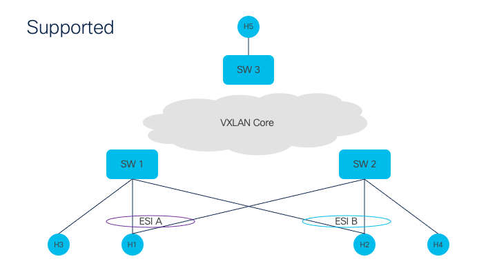

<a id="152-split-horizon-filtering"></a>
### 1.5.2 Split Horizon Filtering

In this scenario, H1 is attempting to ARP H5. H1 emits a broadcast ARP request which is hashed towards SW1. SW1 performs ingress replication to send a copy to SW2 and SW3. SW3 forwards the packet as-is to H5. SW2 compares the source IP to the split horizon list for ESI A and finds a match; this triggers a drop of the broadcast packet so it is not replicated back to the sender.

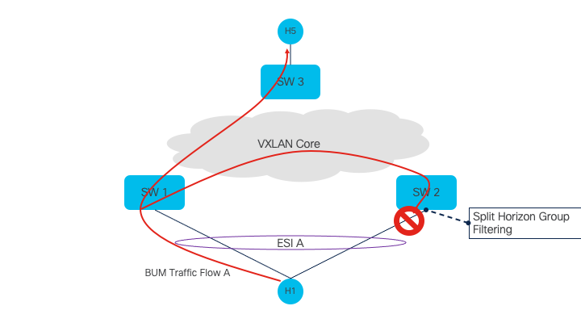

The scenario is now expanded to have multiple ethernet segments and single-homed devices. In this version, H3 is attempting to ARP H2. The broadcast ARP packet is received by SW1 and replicated to all locally attached ports. Local bias is used to bypass DF role and transit the packet to both H1 and H2. Ingress replication on SW1 also sends copies to SW3 (for receipt by H5) and SW2. SW2 checks the source VTEP address of the packet against the SHG lists in the VNI and finds match for both ESI A and ESI B; dropping those two copies. Finally, as there is a single-homed port in the bridge for H4, the last copy is sent there.

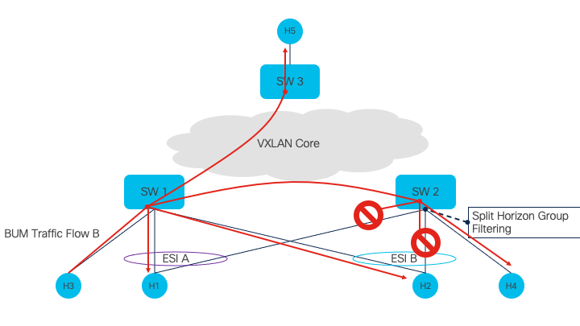

<a id="153-designated-forwarder"></a>
### 1.5.3 Designated Forwarder

In this scenario, H5 is attempting to ARP H1. H5 emits a broadcast ARP request which is ingress replicated towards both SW1 and SW2. As SW1 is the designated forwarder for ESI A, it forwards the packet along. The copy received by SW2 is dropped because it was not elected the DF for ESI A.

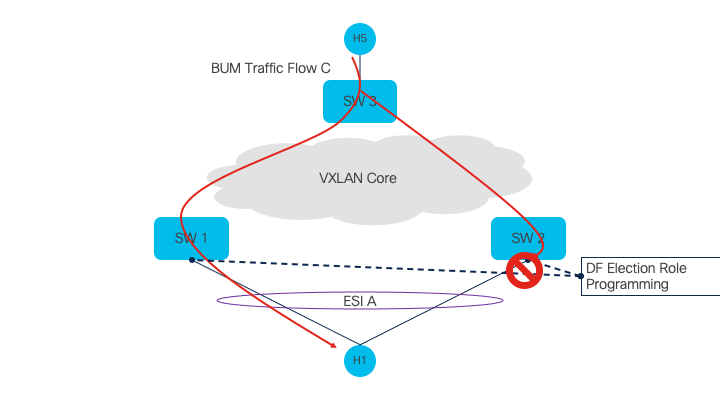


To expand on the previous scenario, H5 is attempting to ARP H1 and H2. SW1 has been chosen as the DF for ESI A, and SW2 is the DF for ESI B. The copies of both ARP packets are replicated to all switches. On each link:
- SW1 to H3 is forwarded as it is a single-homed port
- SW1 to H1 is forwarded because it is the DF for ESI A
- SW1 to H2 is dropped because it is not the DF for ESI B
- SW2 to H4 is forwarded because it is a single-homed port
- SW2 to H1 is dropped because it is not the DF for ESI A
- SW2 to H2 is forwarded because it is the DF for ESI B

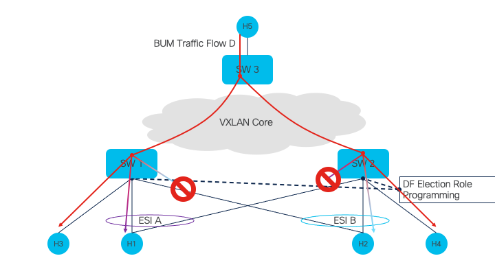

<a id="154-unicast-flows"></a>
### 1.5.4 Unicast Flows

This scenario describes assorted unicast traffic flows from H5 towards other hosts in the network. Different flows are load balanced over different overlay VTEPs based on packet hashing for ECMP.
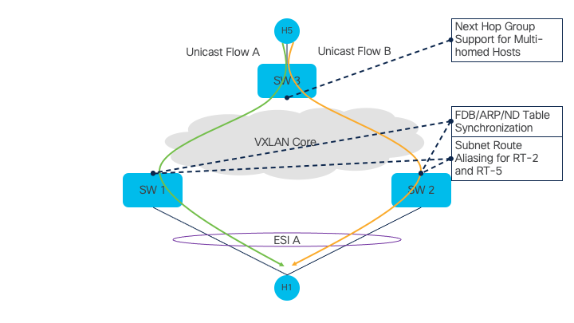

When more hosts are involved, H5 can send unicast traffic to any of them. Multi-homed hosts H1 and H2 will see that different flows are load-balanced across the different switches attached to them.
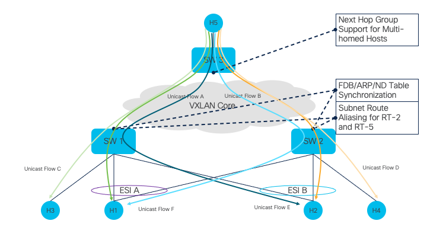

<a id="2---support-for-split-horizon-list"></a>
# 2 - Support for Split Horizon List
<a id="21-feature-requirements"></a>
## 2.1 Feature Requirements

The following requirement is addressed:

 - Support local-bias based split horizon filtering for multi-homed Ethernet-Segments

<a id="211-configuration-and-management-requirements"></a>
### 2.1.1 Configuration and Management Requirements

This feature will support CLI and other management interfaces supported in SONiC.

It is planned that Ethernet-Segment configuration added to SONiC will be pushed into FRR via the following SONiC CLI (further details in section 2.6.1):

```
# Type 0 (Manual) ESI Configuration
config evpn_es add <interface-name> <ESI 9-bytes value>

# With Preference-based DF election Configuration
config evpn_es add <interface-name> <ESI 9-bytes value> df-pref <2-bytes value>

# Type 3 (LACP) ESI Configuration
config evpn_es add <interface-name> <discriminator 3-bytes value> <ESI MAC-address value>

# With Preference-based DF election Configuration
config evpn_es add <interface-name> <discriminator 3-bytes value> <ESI MAC-address value> df-pref <2-bytes value>
```

<a id="212-scalability-requirements"></a>
### 2.1.2 Scalability Requirements

1. Total Local Ethernet-Segments - 16.
2. Total Number of peering switches per Ethernet-Segment - 4.

The numbers specified here serve as a general guideline. The actual scale numbers are dependent on the platform.

<a id="22-functional-description"></a>
## 2.2 Functional Description

Split horizon groups are utilized to prevent any BUM (broadcast, unicast, and multicast) traffic received from an access port, which is directed towards a multi-homed host or network, from being reflected back to the same Ethernet-Segment. This is achieved by identifying peering devices that share a common Ethernet-Segment. Each device maintains a list of peering IP addresses (referred to as VTEP in VxLAN) for each Ethernet-Segment. That list is known as the "Split Horizon List".

BUM traffic received from a local port is distributed to all locally connected ports within the bridge domain. For any multi-homed access ports, BUM traffic that originates within the bridge will be sent to the access, regardless of the DF (Designated Forwarder) election state. This is termed as "local bias".

When BUM traffic is received from a VXLAN tunnel, additional measures are taken to ensure that both the DF role is utilized to prevent BUM traffic from remote VTEPs, and the Split Horizon List is used to block BUM traffic from peering VTEPs.

<a id="23-feature-design"></a>
## 2.3 Feature Design

<a id="231-design-overview"></a>
### 2.3.1 Design Overview

There is currently no support today in the Linux Kernel for split horizon lists. FRR does support this through its existing Zebra Data plane API. (`dplane_ctx_get_br_port_sph_filters`/`dplane_ctx_get_br_port_sph_filter_cnt`)

There are two options on the table to provide this information to SONiC:
1. Push the lists through the linux kernel to also enable EVPN multihoming in the kernel
2. Bypass the kernel and notify fpmsyncd directly

Once the lists are available, the split horizon list ID can be attached to a given port for programming.

Option 2 is preferred in this case as the kernel is not used for forwarding BUM traffic in regular production traffic. This does mean the VS build of SONiC will not completely support EVPN multihoming as SHG implementation will not exist.

<a id="232-container"></a>
### 2.3.2 Container

No new container is added. The changes are added to existing containers such as FRR, SwSS and Syncd. The details of the changes will be discussed in the Design section below.

<a id="233-sai-overview"></a>
### 2.3.3 SAI Overview

Existing SAI object Isolation groups can be used for this functionality. Isolation groups are created per peer remote vtep to block the traffic to local Ethernet segments if the peer vtep is connected to same ethernet segment. Split Horizon list is created per Ethernet segment, and shlorch creates isolation group per each peer vtep. 

<a id="24-db-changes"></a>
## 2.4 DB Changes


<a id="241-config_db-changes"></a>
### 2.4.1 CONFIG_DB changes

<a id="2411-ethernet_segment_table"></a>
#### 2.4.1.1 ETHERNET_SEGMENT_TABLE

Producer: Configuration

Consumer: FRR

Description: Ethernet segments need to be tracked in order to be injected back into FRR configuration

Schema:

```
; New table
; Stores the Ethernet-Segment configuration for the specified interface

key = ETHERNET_SEGMENT_TABLE:"Interface"

;field = value
interface                 = string       ; Interface name
esi_type                  = 1*8DIGIT     ; Ethernet-Segment Identifier Type - 0/3 supported for now
type0_operator_config     = 18HEXDIG     ; 9-byte arbitrary ESI value for use with type 0 ESI
type3_system_mac          = 12HEXDIG     ; System MAC for use with ESI type 3
type3_local_discriminator = 6HEXDIG      ; Local Discriminator value for lower 3 bytes in a type 3 ESI
df-preference             = 4HEXDIG      ; Preference-DF weight - 2 bytes value

```

<a id="242-app_db-changes"></a>
### 2.4.2 APP_DB Changes

<a id="2421-split_horizon_list_table"></a>
#### 2.4.2.1 SPLIT_HORIZON_LIST_TABLE

Producer: fpmsyncd

Consumer: shlorch

Description: A new split horizon list table is needed to store the different possible split horizon lists. Interfaces will be augmented with an ID that points into the table to reference a given list.

```
; New table
; specifies the split horizon list for a given interface

key = SPLIT_HORIZON_LIST_TABLE:ifname ; ifname is the Portchannel name

;field = value
vteps = *prefix ; IP addresses separated by "," (need at least one)
```

<a id="243-swss-design"></a>
### 2.4.3 SWSS Design
A new orchestration agent "shlorch" will be written to consume SPLIT_HORIZON_LIST_TABLE changes and program them as ISOLATION_GROUP in SAI.

The shlorch will add a corresponding isolation group to ASIC_DB and then add a split horizon group member to ASIC_DB for every member of that group that is available to be used. Changes to the membership of the group will result in isolation group members being added to or removed from ASIC_DB. The shlorch will then maintain an association between the identifer of the group from APP_DB and the SAI identifier assigned to the split horizon group.

When the split horizon group is deleted, the shlorch will remove the isolation group from the ASIC_DB, and remove the association between the group identifier from APP_DB and the SAI identifier from ASIC_DB.  This will only happen once the split horizon group is no longer referenced by any ports - and so the split horizon group will maintain a reference count within orchagent to ensure this. If orchagent restarts before all referencing ports are updated/deleted, the remaining ports will simply be unable to be programmed into ASIC_DB after restart. This will just be a transient state until the ports are updated in the database.

Split Horizon list is created per Ethernet segment, and shlorch creates isolation group per each peer vtep. 

Following cases need to be handled by shlorch

1. Isolation group creation for the first time a peer vtep shows up in any split_horizon_list and adding that ethernet segment to isolation group
2. Adding of members to isolation group if peer vtep shows up in another ethernet segment's split_horizon_list
3. Deletion of members to isolation group if peer vtep is removed from ethernet segment's split_horizon_list
4. Deletion of isolation group when vtep is not peer anymore for any Ethernet segment


<a id="25-modules-design-and-flows"></a>
## 2.5 Modules Design and Flows

FRR as EVPN control plane is assumed in this document. However, any BGP EVPN implementation can be used as control plane as long as it complies with the EVPN design proposed in this document.

The SHL is built from the IP addresses of all VTEPs participating in the same, locally configured, Ethernet-Segment.

Upon receipt of an ES route for a local Ethernet-Segment, the SHL for that ES must be updated to contain the new entry.

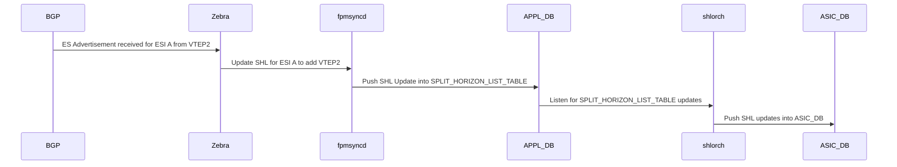
__Figure XX: Split Horizon List ES Update__

When a remote ES route for a local Ethernet-Segment is withdrawn, the split-horizon list for that ES must be updated to remove the withdrawn peer.

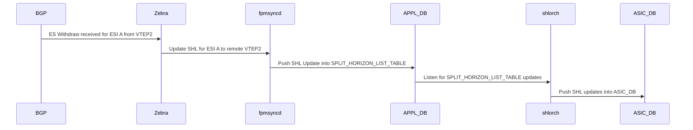
__Figure XX: Split Horizon List ES Withdraw__

<a id="26-cli"></a>
## 2.6 CLI

<a id="261-click-based-cli"></a>
### 2.6.1 Click based CLI

The following example shows the SONIC configuration and how it translates in FRR.
```
   - config evpn_es add PortChannel01 00:11:22:33:44:55:66:77:88:99 df-pref 123456
   - config evpn_es add PortChannel02 3 00:11:22:33:44:55 df-pref 123456
```

This expands to the following, equivalent, FRR CLI:

```
interface PortChannel01
  evpn mh es-id 00:11:22:33:44:55:66:77:88:99
     evpn mh es-df-pref 123456
interface PortChannel02
  evpn mh es-id 3
  evpn mh es-sys-mac 00:11:22:33:44:55
     evpn mh es-df-pref 123456
```

<a id="262-show-commands"></a>
### 2.6.2 Show Commands

The associated database can be displayed by using SONIC show command.
```
admin@LEAF01:~$ show evpn es
Type: L local, R remote, N non-DF
+-------------------------------+--------+----------------+----------+---------+
| ESI                           | Type   | ES Interface   | status   | Peers   |
+===============================+========+================+==========+=========+
| 03:00:11:22:33:44:55:00:00:1e | LR     | PortChannel01  | up       | 2.2.2.2 |
+-------------------------------+--------+----------------+----------+---------+
Total count : 1

admin@LEAF02:~$ show evpn es
Type: L local, R remote, N non-DF
+-------------------------------+--------+----------------+----------+---------+
| ESI                           | Type   | ES Interface   | status   | Peers   |
+===============================+========+================+==========+=========+
| 03:00:11:22:33:44:55:00:00:1e | LRN    | PortChannel01  | up       | 1.1.1.1 |
+-------------------------------+--------+----------------+----------+---------+
Total count : 1

```

As per configuration, there is an equivalent show command in FRR:

```
LEAF01# show interface PortChannel01
Interface PortChannel01 is up, line protocol is up
  Link ups:       1    last: 2022/01/24 15:00:18.22
  Link downs:     1    last: 2022/01/24 15:00:13.12
  vrf: default
  index 259 metric 0 mtu 9100 speed 0
  flags: <UP,BROADCAST,RUNNING,MULTICAST>
  Type: Ethernet
  HWaddr: 00:11:22:33:44:55
  Interface Type bond
  Interface Slave Type Bridge
  Master interface: Bridge
  EVPN-MH: ES id 3 ES sysmac 00:11:22:33:44:55
  protodown: off (n/a)
```

```
LEAF01# show evpn es detail
ESI: 03:00:11:22:33:44:55:00:00:03
 Type: Local,Remote
 Interface: PortChannel01
 State: up
 Bridge port: yes
 Ready for BGP: yes
 VNI Count: 1
 MAC Count: 1
 DF status: df
 DF preference: 32767
 Nexthop group: 536870913
 VTEPs:
     2.2.2.2 df_alg: preference df_pref: 32767 nh: 268435458
```

```
LEAF01# show evpn mac vni all

VNI 1000 #MACs (local and remote) 4

Flags: N=sync-neighs, I=local-inactive, P=peer-active, X=peer-proxy
MAC               Type   Flags Intf/Remote ES/VTEP            VLAN  Seq #'s
8c:ea:1b:30:d9:fc remote       3.3.3.3                              0/0
04:f8:f8:6b:3e:91 local        Vlan100                              0/0
8c:ea:1b:30:da:4f local  PI    PortChannel01                  100   0/0
04:f8:f8:8d:81:e1 remote       2.2.2.2                              1/0
```

No new extensions are required for FRR to display information about either the Ethernet-Segments or the remote MACs

<a id="27-database-examples"></a>
## 2.7 Database Examples

<a id="271-config-db-examples"></a>
### 2.7.1 CONFIG DB examples

The following CLI configuration becomes the entries in CONFIG DB below:

```
config evpn_es add PortChannel01 00:11:22:33:44:55:66:77:88:99
config evpn_es add PortChannel02 3 00:11:22:33:44:55
```

```
"ETHERNET_SEGMENT_TABLE:PortChannel01": {
  "interface"                 = "PortChannel01"
  "esi_type"                  = 0
  "type0_operator_config"     = 00:11:22:33:44:55:66:77:88:99
  "type3_system_mac"          = ""
  "type3_local_discriminator" = ""
  "df-preference              = ""
}
"ETHERNET_SEGMENT_TABLE:PortChannel02": {
  "interface"                 = "PortChannel02"
  "esi_type"                  = 3
  "type0_operator_config"     = ""
  "type3_system_mac"          = 00:11:22:33:44:55
  "type3_local_discriminator" = 3
  "df-preference              = ""
},
```

<a id="272-app-db-examples"></a>
### 2.7.2 APP DB examples

```
"SPLIT_HORIZON_LIST_TABLE:PortChannel01": {
  "vteps": "192.168.0.1,192.168.0.2",
}
```

<a id="28-serviceability-and-debug"></a>
## 2.8 Serviceability and Debug

The existing logging mechanisms shall be used. The show commands and the redis table dumps can be used as debug aids.

<a id="29-limitations"></a>
## 2.9 Limitations

- Split horizon list programming will not be supported on sonic-vs due to the lack of support of SHL by the Linux Kernel. That limitation may be removed when addressed properly.

<a id="210-unit-test-cases"></a>
## 2.10 Unit Test Cases

- Configure ES, verify SHL is programmed, verify interface points to the SHL created
- Add remote peer in ES, verify SHL is programmed
- Remove remote peer from ES, verify updated SHL is programmed
- Delete ES, verify interface no longer points to SHL and SHL is deleted

<a id="3---support-for-df-election-role-programming"></a>
# 3 - Support for DF Election Role Programming
<a id="31-feature-requirements"></a>
## 3.1 Feature Requirements

The following requirements are addressed:

1. Support designated forwarder programming
2. Support BUM traffic blocking based on DF state

<a id="311-configuration-and-management-requirements"></a>
### 3.1.1 Configuration and Management Requirements

There are no additional configuration and management requirements beyond those in section [2.1.1](#211-configuration-and-management-requirements).

<a id="312-scalability-requirements"></a>
### 3.1.2 Scalability Requirements

There are no additional scalability requirements beyond those in section 2.1.2.

<a id="313-sai-overview"></a>
### 3.1.3 SAI Overview

Add a new attribute "SAI_BRIDGE_PORT_ATTR_DF_BLOCK" in sai_bridge_port_attr_t to indicate that the bridge port is blocked to forward any BUM traffic received from the Tunnel. 

<a id="32-functional-description"></a>
## 3.2 Functional Description

Designated forwarder election is used to choose one of the N switches participating in an Ethernet-Segment as the one to forward BUM traffic. This is only applicable to traffic received from remote, non-peering devices; that is, devices which do not participate in the specific Ethernet-Segment.

The RFC standard method for choosing the DF for a given service is described in [RFC 7432 Section 8.5](https://www.rfc-editor.org/rfc/rfc7432.html#section-8.5). There are other methods for calculating the DF described in [RFC 8584](https://datatracker.ietf.org/doc/html/rfc8584). FRR defaults to Preference Based DF election as described in [draft-ietf-bess-evpn-pref-df](https://datatracker.ietf.org/doc/html/draft-ietf-bess-evpn-pref-df/).

DF election methods that are not currently supported by FRR are out-of-scope.

<a id="321-sai-overview"></a>
### 3.2.1 SAI Overview

Add a new attribute "SAI_VLAN_MEMBER_ATTR_DF_BLOCK" in sai_vlan_member_attr_t to indicate that the bridge port is blocked to forward any BUM traffic received from the Tunnel. more details will be given in SAI spec PR. https://github.com/opencomputeproject/SAI/pull/1965

<a id="4---arpndfdb-table-synchronization"></a>
# 4 - ARP/ND/FDB Table Syncronization

FRR currently handles ARP/ND/FDB table synchronization based on host information learned via the linux kernel.

<a id="5---df-election-failure-and-recovery-procedures"></a>
# 5 - DF Election Failure and Recovery Procedures
TBD

<a id="6---support-of-remote-multi-homed-hosts"></a>
# 6 - Support of Remote Multi-homed Hosts
<a id="61-feature-requirements"></a>
## 6.1 Feature Requirements

The following requirements are addressed:

1. Support creation and deletion of L2 Next Hop Groups based on discovered remote Ethernet-Segments
2. Support programming of remote MAC routes against a Next Hop Group over VXLAN tunnels
3. Support for Multi-homed L3 Hosts
4. Support for Multi-homed IP Prefixes (subnets)

<a id="611-configuration-and-management-requirements"></a>
### 6.1.1 Configuration and Management Requirements

This feature will support CLI and other management interfaces supported in SONiC. This feature will expose the following FRR configuration via SONiC:

```
router bgp 65002
 address-family l2vpn evpn
  disable-ead-evi-rx            # Activate PE on EAD-ES even if EAD-EVI is not received
  disable-ead-evi-tx            # Don't advertise EAD-EVI for local ESs
```

<a id="612-scalability-requirements"></a>
### 6.1.2 Scalability Requirements

1. Total Number of Next Hop Groups - 20.
    - This is based on the number of remote ESIs seen in a given datacenter
    - In a topology with 6 switches, and 5 ESIs spanning two switches each, the total number of NHGs on a single switch is expected to be 12.
    - 6 switches \* two switches per ES = 12 NHG
2. Total Number of remote paths per next hop group - 2
3. Total Number of FDB entries - ~4000.
    - No change to the total number of FDB entries is expected.

<a id="62-functional-description"></a>
## 6.2 Functional Description

EVPN VXLAN Multihoming enables switch-level redundancy to provide access to hosts while enabling efficient use of core bandwidth via flow-based load balancing over an ECMP set towards a given Ethernet-Segment.

Expanding on regular VXLAN forwarding, unicast traffic is forwarded using both the tunnel the assigned next hop group. This hashes the packet to pick an overlay path towards the destination access port.

Forwarding for unicast traffic received from a VXLAN tunnel remains unchanged.

<a id="63-feature-design"></a>
## 6.3 Feature Design

<a id="631-design-overview"></a>
### 6.3.1 Design Overview

Support for multihomed hosts builds upon the existing building blocks supported by both FRR and the Linux Kernel. The changes are focused around passing data that already exists in the Linux Kernel further southbound into SONiC and towards the hardware forwarding path.

Both FRR and the linux kernel already support VXLAN multihoming. When a multihomed MAC is installed into the kernel, it is programmed with a nexthop group:

```
cisco@LEAF0:~$ /sbin/bridge fdb show | grep 78:74:ad:46:50:00
78:74:ad:46:50:00 dev VXLAN-2 vlan 2 extern_learn master Bridge
78:74:ad:46:50:00 dev VXLAN-2 nhid 536870913 self extern_learn
cisco@LEAF0:~$ ip nexthop get id 536870913
id 536870913 group 268435458/268435459 fdb
cisco@LEAF0:~$ ip nexthop get id 268435458
id 268435458 via 10.200.200.201 scope link fdb
cisco@LEAF0:~$ ip nexthop get id 268435459
id 268435459 via 10.200.200.202 scope link fdb
```

To enable multihoming with SONiC, extensions to fpmsyncd, fdbsyncd, APPL_DB, fdborch, ASIC_DB and SAI are required.

<a id="632-containers"></a>
### 6.3.2 Containers

The changes are added to existing containers such as FRR, SwSS and Syncd. The details of the changes will be discussed in the Design section below.

<a id="633-sai-overview"></a>
### 6.3.3 SAI Overview

The following SAI changes are introduced to support forwarding to remote multihomed hosts:

Currently FDB entry has SAI attribute "SAI_FDB_ENTRY_ATTR_ENDPOINT_IP" for MAC entry. As FRR/Zebra is creating a NHGROUP, new MAC attribute "SAI_FDB_ENTRY_ATTR_L2_ECMP_GROUP" needs to be added. L2_ECMP_GROUP is new SAI object which contains members as Tunnel endpoints.

<a id="664-database-changes"></a>
## 6.4 Database Changes

<a id="641-config_db-changes"></a>
### 6.4.1 CONFIG_DB Changes

TBD

<a id="642-appl_db-changes"></a>
### 6.4.2 APPL_DB Changes

<a id="6421-vxlan_fdb_table"></a>
#### 6.4.2.1 VXLAN_FDB_TABLE

Producer: fdbsyncd

Consumer: fdborch

Description: The existing VXLAN_FDB_TABLE is extended with a new optional field to support next hop groups. Per `ip/next_hop_group_hld.md`, `nexthop_group` was added to the `ROUTE_TABLE` as an optional field.

Schema:

```
; Existing table
; specifies the MAC and VLAN to be programmed over a tunnel

key = VXLAN_FDB_TABLE:"Vlan"vlanid:mac_address
                          ;MAC Address and VLAN ID
;field = value
remote_vtep    = ipv4
nexthop_group  = string                   ; index within the NEXT_HOP_GROUP_TABLE, optionally used instead of remote_vtep
type           = "static" / "dynamic"     ; type of the entry.
vni            = 1*8DIGIT                 ; vni to be used for this VLAN when sending traffic to the remote VTEP
```

<a id="65-module-design-and-flows"></a>
## 6.5 Module Design and Flows

FRR as EVPN control plane is assumed in this document. However, any BGP EVPN implementation can be used as control plane as long as it complies with the EVPN design proposed in this document.

Regarding the next hop group handling, whenever adding or removing members from a next hop group, this should be a hitless action in hardware. If there are scenarios where a new NHG is to be used, the transition from one NHG to another must also be hitless. For implementations where single-path next hop groups re-use the same ID as the path itself, the transition from single to multi-path (and vice-versa) must be hitless.

Similar to the existing VXLAN support, remote MACs that have been learned by BGP will be installed in the linux FDB by Zebra. The rest of the programming chain remains unchanged from the existing VXLAN support. The main change is the type of nexthop the MAC points to. Instead of pointing towards a VTEP IPv4 address, it will point to a next hop group ID. This NHG may have 1 or more paths to load balance across. The following picture illustrate the flow: 

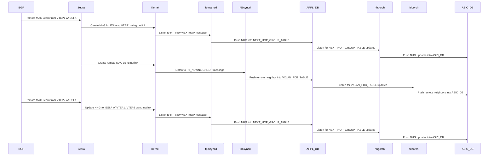
__Figure XX: Remote Multihomed MAC handling__

For remote multi-homed MACs, fdborch will program the FDB entry with *SAI_FDB_ENTRY_ATTR_NEXT_HOP_GROUP_ID* instead of SAI_FDB_ENTRY_ATTR_ENDPOINT_IP. All other attributes will be programmed the same.

The remote MAC-IP host handling differ from the MAC host handling. It follows the current FRR approach as described in [draft-rbickhart-evpn-ip-mac-proxy-adv](https://datatracker.ietf.org/doc/html/draft-rbickhart-evpn-ip-mac-proxy-adv/) draft. There is no change to this approach with the proposal described in this document.

Zebra performs MAC route resolution (per ES/EAD and MAC route). The outcome is the
NHG downloaded to Kernel as shown here. Optionally, the EVI/EAD route may be added to resolution algorithm achieving similar result.
The MAC route resolution is trigger upon reception of both ES/EAD and MAC as shown here:

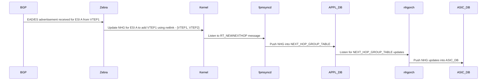
__Figure XX: Remote Multihomed MAC Resolution__

The downgrade of the number of paths may happens under two conditions: from ES/EAD route withdraw and/or from MAC withdraw.
The following diagram shows the flow for ES/EAD route withdraw. 

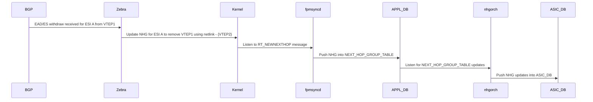
__Figure XX: Remote Multihomed ES/EAD Withdraw__

Similarly, in the following diagram, the mac MAC withdraw was received prior to the ES/EAD withdraw; otherwise the operation is considered as a noop.
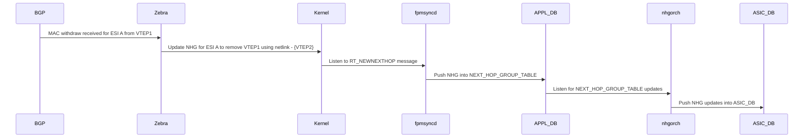
__Figure XX: Remote Multihomed MAC Withdraw__

<a id="66-linux-kernel"></a>
## 6.6 Linux Kernel

No changes are required to support this feature from the Linux Kernel.

<a id="67-cli"></a>
## 6.7 CLI

<a id="671-configuration"></a>
### 6.7.1 Configuration

No configuration CLIs are being introduced to support this feature.

<a id="672-show-commands"></a>
### 6.7.2 Show Commands

The following show commands will be extended to support this feature:

<a id="6721-show-evpn-es"></a>
#### 6.7.2.1 "show evpn es"

The command `show evpn es` will be introduced to display information about both local and remote Ethernet-Segments. In this feature, only support for remote Ethernet-Segments is required. This information will be gathered from the FRR vtysh command `show evpn es`.

The DF/NDF flag will not be shown for purely-remote ES (Ones which do not have a matching local configuration).

```
admin@LEAF03:~$ show evpn es
Type: L local, R remote, N non-DF
+-------------------------------+--------+----------------+----------+---------+
| ESI                           | Type   | ES Interface   | status   | Peers   |
+===============================+========+================+==========+=========+
| 03:00:11:22:33:44:55:00:00:1e | RN     |                |          | 2.2.2.2 |
|                               |        |                |          | 1.1.1.1 |
+-------------------------------+--------+----------------+----------+---------+
```

<a id="6722-show-vxlan-remotemac"></a>
#### 6.7.2.2 "show vxlan remotemac"

The existing command `show vxlan remotemac` will be extended to display the ESI (when applicable) for remote MACs.

```
show vxlan remote_mac <remoteip/all>
   - lists all the MACs learnt from the specified remote ip or all the remotes for all vlans. (APP DB view)
   - VLAN, MAC, RemoteVTEP, ESI, VNI, Type are the columns.


admin@LEAF01:~$ show vxlan remote_mac all
+---------+-------------------+--------------+-------------------------------+-------+---------+
| VLAN    | MAC               | RemoteVTEP   | ESI                           |   VNI | Type    |
+=========+===================+==============+===============================+=======+=========+
| Vlan100 | 00:11:22:33:44:55 |              | 03:00:11:22:33:44:55:00:00:03 |  1000 | dynamic |
+---------+-------------------+--------------+-------------------------------+-------+---------+
| Vlan100 | 04:f8:f8:8d:81:e1 | 2.2.2.2      |                               |  1000 | dynamic |
+---------+-------------------+--------------+-------------------------------+-------+---------+
| Vlan100 | 8c:ea:1b:30:d9:fc | 3.3.3.3      |                               |  1000 | dynamic |
+---------+-------------------+--------------+-------------------------------+-------+---------+
| Vlan100 | 8c:ea:1b:30:da:4f |              | 03:00:11:22:33:44:55:00:00:03 |  1000 | static  |
+---------+-------------------+--------------+-------------------------------+-------+---------+
Total count : 4
```

<a id="68-database-examples"></a>
## 6.8 Database Examples

<a id="681-config_db-examples"></a>
### 6.8.1 CONFIG_DB Examples
TBD

<a id="682-appl_db-examples"></a>
### 6.8.2 APPL_DB Examples

```
"VXLAN_FDB_TABLE:Vlan5:00:00:00:00:00:03": {
"type": "dynamic",
"remote_vtep": "0.0.0.0",
"next_hop_group": 536870913
"vni": "50"
}
```

<a id="69-serviceability-and-debug"></a>
## 6.9 Serviceability and Debug

The existing logging and debug mechanisms will be used. No new facilities will be added.

<a id="610-limitations"></a>
## 6.10 Limitations

Unchanged from EVPN_VXLAN_HLD.

<a id="611-unit-test-cases"></a>
## 6.11 Unit Test Cases

<a id="6111-frrkernel-testing"></a>
### 6.11.1 FRR/Kernel Testing
1. Verify a host received without an ESI still uses the VTEP IP for forwarding
2. Verify route resolution with the following permutations of EAD and MAC routes for a given ESI:

| EAD/ES Path List | EAD/EVI Path List | MAC Path List | Route Resolution Result |
| ---------------- | ----------------- | ------------- | ----------------------- |
| {} | {} | {} | NHG not allocated |
| {} | {} | {VTEP1} | NHG not allocated |
| {} | {} | {VTEP1, VTEP2} | NHG not allocated |
| {} | {VTEP1} | {} | NHG not allocated |
| {} | {VTEP1} | {VTEP1} | NHG not allocated |
| {} | {VTEP1} | {VTEP1, VTEP2} | NHG not allocated |
| {} | {VTEP1, VTEP2} | {} | NHG not allocated |
| {} | {VTEP1, VTEP2} | {VTEP1} | NHG not allocated |
| {} | {VTEP1, VTEP2} | {VTEP1, VTEP2} | NHG not allocated |
| {VTEP1} | {} | {} | NHG not allocated |
| {VTEP1} | {} | {VTEP1} | NHG allocated with path list {VTEP1} |
| {VTEP1} | {} | {VTEP1, VTEP2} | NHG allocated with path list {VTEP1} |
| {VTEP1} | {VTEP1} | {} | NHG allocated with path list {VTEP1} |
| {VTEP1} | {VTEP1} | {VTEP1} | NHG allocated with path list {VTEP1} |
| {VTEP1} | {VTEP1} | {VTEP1, VTEP2} | NHG allocated with path list {VTEP1} |
| {VTEP1} | {VTEP1, VTEP2} | {} | NHG allocated with path list {VTEP1} |
| {VTEP1} | {VTEP1, VTEP2} | {VTEP1} | NHG allocated with path list {VTEP1} |
| {VTEP1} | {VTEP1, VTEP2} | {VTEP1, VTEP2} | NHG allocated with path list {VTEP1} |
| {VTEP1, VTEP2} | {} | {} | NHG not allocated |
| {VTEP1, VTEP2} | {} | {VTEP1} | NHG allocated with path list {VTEP1} |
| {VTEP1, VTEP2} | {} | {VTEP1, VTEP2} | NHG allocated with path list {VTEP1, VTEP2} |
| {VTEP1, VTEP2} | {VTEP1} | {} | NHG allocated with path list {VTEP1} |
| {VTEP1, VTEP2} | {VTEP1} | {VTEP1} | NHG allocated with path list {VTEP1} |
| {VTEP1, VTEP2} | {VTEP1} | {VTEP1, VTEP2} | NHG allocated with path list {VTEP1} |
| {VTEP1, VTEP2} | {VTEP1, VTEP2} | {} | NHG allocated with path list {VTEP1, VTEP2} |
| {VTEP1, VTEP2} | {VTEP1, VTEP2} | {VTEP1} | NHG allocated with path list {VTEP1, VTEP2} |
| {VTEP1, VTEP2} | {VTEP1, VTEP2} | {VTEP1, VTEP2} | NHG allocated with path list {VTEP1, VTEP2} |

3. Shutdown the remote interface and verify that the NHG ID is unchanged when going from 2 paths to 1 path
  - This is expected to have some traffic loss
4. Bring up a remote interface and verify that the NHG IS is unchanged when going from 1 path to 2 paths
  - This should be a hitless operation

<a id="6112-fpmsyncd"></a>
### 6.11.2 fpmsyncd
1. Add remote multihomed hosts
  - Verify NHG is programmed in APPL_DB
2. Modify remote path list for multihomed host
  - Verify NHG members are updated to reflect those in FRR
3. Go from N paths to 1 path
  - Verify NHG is still there
4. Go from 1 path to N paths
  - Verify all paths exist in APPL_DB
5. Remove all remote hosts pointing to a given NHG
  - Verify the NHG is removed from APPL_DB

<a id="6113-fdbsyncd"></a>
### 6.11.3 fdbsyncd
1. Trigger a remote single-homed host learn
  - Verify it is still created with the correct remote_vtep in APPL_DB
2. Trigger a remote multi-homed host learn
  - Verify it is created using NHG ID and not remote_vtep address
  - Verify it coexists with single-homed hosts in the same remote VNI
3. Create remote multi-homed hosts with the same remote path list across ESIs
  - Verify NHG is shared? or should this be separate NHGs?

