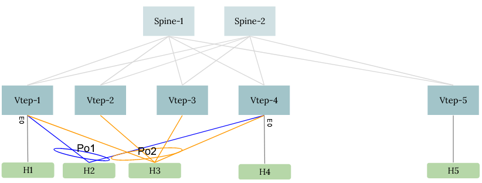
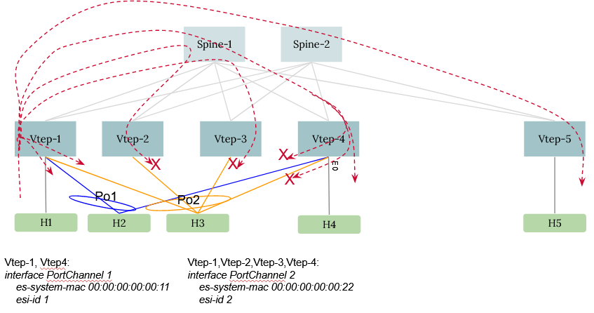
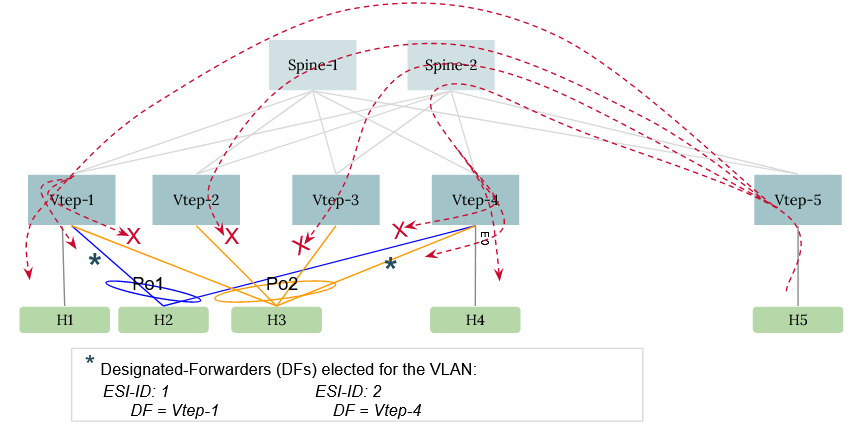
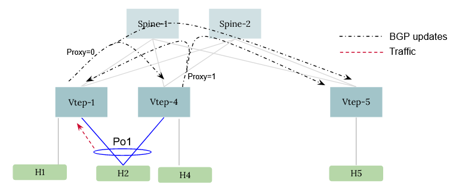
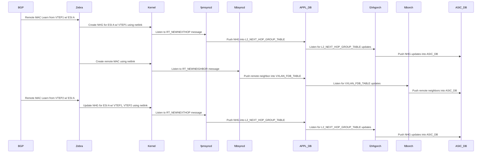
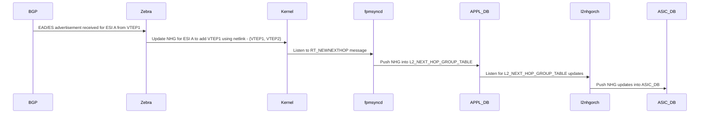
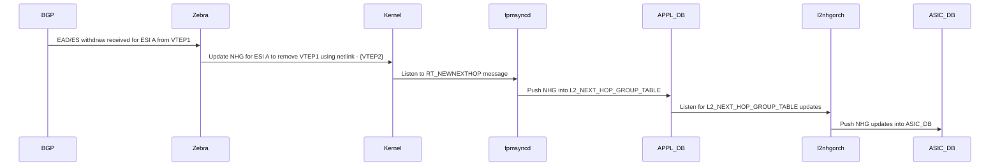
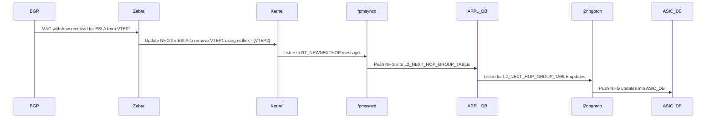
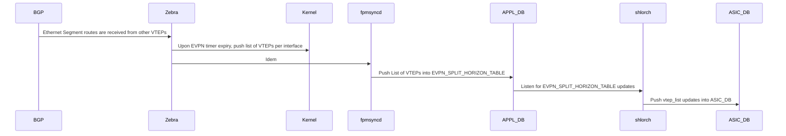
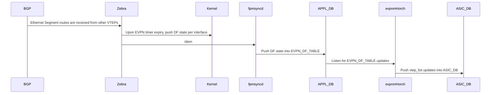

# EVPN VxLAN Multihoming

# High Level Design Document

Rev 1.4

# Table of Contents

- [EVPN VxLAN Multihoming](#EVPN-VxLAN-Multihoming)
- [High Level Design Document](#High-Level-Design-Document)
- [List of Tables](#List-of-Tables)
- [Revision](#Revision)
- [About this Manual](#About-this-Manual)
- [Scope](#Scope)
- [Definition/Abbreviation](#Definition/Abbreviation)
- [1 Feature Overview](#1-Feature-Overview)
  - [1.1 Requirements](#11-Requirements)
    - [1.1.1 Functional Requirements](#111-Functional-Requirements)
    - [1.1.2 Configuration and Management Requirements](#112-Configuration-and-Management-Requirements)
    - [1.1.3 Platform Requirements](#113-Platform-Requirements)
  - [1.2 Design Overview](#12-Design-Overview)
    - [1.2.1 Basic Approach](#121-Basic-Approach)
    - [1.2.2 Container](#122-Container)
    - [1.2.3 SAI Overview](#123-SAI-Overview)
- [2 Functionality](#2-Functionality)
  - [2.1 Target Deployment Use Cases](#21-Target-Deployment-Use-Cases)
  - [2.2 Functional Description](#22-Functional-Description)
    - [2.2.1 EVPN Multihoming configuration](#221-EVPN-Multihoming-configuration)
    - [2.2.2 EVPN Designated Forwarder Election](#222-EVPN-Designated-Forwarder-Election)
    - [2.2.3 Split Horizon Filtering](#223-Split-Horizon-Filtering)
    - [2.2.4 Linux Kernel support](#224-Linux-Kernel-Support)
    - [2.2.5 MAC learning, aging, and move handling](#225-MAC-learning-aging-and-move-handling)
    - [2.2.6 Static Anycast Gateway](#226-Static-Anycast-Gateway)
    - [2.2.7 Host Routing](#227-Host-Routing)
    - [2.2.8 Mutual exclusion: MCLAG and EVPN-MH](#228-Mutual-exclusion-MCLAG-and-EVPN-MH)
    - [2.2.9 ARP and ND suppression](#229-ARP-and-ND-suppression)
- [3 Design](#3-Design)
  - [3.1 Overview](#31-Overview)
  - [3.2 DB Changes](#32-DB-Changes)
    - [3.2.1 CONFIG DB](#321-CONFIG-DB)
    - [3.2.2 APP DB](#322-APP-DB)
    - [3.2.3 STATE DB](#323-STATE-DB)
    - [3.2.4 ASIC DB](#324-ASIC-DB)
    - [3.2.5 COUNTER DB](#325-COUNTER-DB)
  - [3.3 Impact to existing modules](#33-Impact-To-Existing-Modules)
    - [3.3.1 MCLAG Management Framework](#331-MCLAG-Management-Framework)
    - [3.3.2 TeamMgr](#332-TeamMgr)
    - [3.3.3 Zebra](#333-Zebra)
    - [3.3.4 Fpmsyncd](#334-Fpmsyncd)
    - [3.3.5 Fdbsyncd](#335-Fdbsyncd)
    - [3.3.6 Vxlanorch](#336-Vxlanorch)
    - [3.3.7 Fdborch](#337-Fdborch)
    - [3.3.8 L2nhgorch](#338-L2nhgorch)
    - [3.3.9 EvpnMhOrch](#339-EvpnMhOrch)
    - [3.3.10 ShlOrch](#3310-ShlOrch)
  - [3.4 SAI](#34-SAI)
    - [3.4.1 New SAI Objects](#341-new-sai-objects)
    - [3.4.2 Changes to Existing SAI Objects](#342-changes-to-existing-sai-objects)
    - [3.4.3 SAI Object Usage](#343-sai-object-usage)
  - [3.5 CLI](#35-CLI)
    - [3.5.1 Configuration Commands](#351-Configuration-Commands)
    - [3.5.2 Show Commands](#352-Show-Commands)
    - [3.5.3 Debug Commands](#353-Debug-Commands)
    - [3.5.4 REST API Support](#354-REST-API-Support)
- [4 Flow Diagrams](#4-Flow-Diagrams)
- [5 Error Handling](#5-Error-Handling)
- [6 Serviceability and Debug](#6-Serviceability-and-Debug)
- [7 Warm Boot Support](#7-Warm-Boot-Support)
- [8 Scalability](#8-Scalability)
- [9 Unit Test](#9-Unit-Test)
  - [9.1 Functional Test Cases](#91-Functional-Test-Cases)


# List of Tables

[Table 1: Abbreviations](#Table-1-abbreviations)

# Revision

| Rev  | Date       | Authors                                          | Change Description |
| ---- | ---------  | ------------------------------------------------ | ------------------ |
| 0.x  | Feb-2024   | Mike Mallin, Patrice Brissette, Naveen Gamini  | Cisco initial draft  |
| 0.x  | Feb-2024   | Syed Hasan Naqvi, Rajesh Sankaran, Kishore Kunal, Praveen Elagala  | Broadcom initial draft  |
| 1.0  | May-2024   | Syed Hasan Naqvi (Broadcom), Patrice Brissette (Cisco), Praveen Elagala (Broadcom), Rajesh Sankaran (Broadcom), Mike Mallin (Cisco), Kishore Kunal (Broadcom), Naveen Gamini (Cisco), Tapraj Singh (Cisco)   | Merged version   |
| 1.1  | Jul-2024   | Syed Hasan Naqvi (Broadcom) | Updated kernel, SAI, config, and design sections |
| 1.2  | Jul-2024   | Patrice Brissette (Cisco)   | Adding ShlOrchagent definition, addressing PR comments |
| 1.3  | Aug-2024   | Patrice Brissette (Cisco)   | Updated SAI examples |
| 1.4  | Nov-2024   | Syed Hasan Naqvi (Broadcom) | Addressed review comments. Updated/removed duplicate text in SAI sec. |

<a id="About-this-Manual"></a>
# About this Manual
This document provides general information of EVPN VxLAN Multihoming feature implementation in SONiC.

<a id="Scope"></a>
# Scope
This document describes the high level design and changes required for supporting Multihoming in EVPN VxLAN networks.
This feature will provide [RFC 7432](https://datatracker.ietf.org/doc/html/rfc7432) and [RFC 8365](https://datatracker.ietf.org/doc/html/rfc8365) based Multihoming solution in SONiC.
The ICCPd based MCLAG continue to co-exist as an alternate solution.

<a id="Definition/Abbreviation"></a>
# Definition/Abbreviation

## Table 1: Abbreviations

| Term     | Meaning                                   |
| -------- | ----------------------------------------- |
| (N)DF    | (Non-)Designated Forwarder                |
| IRB      | Integrated Routing and Bridging           |
| L3VNI    | (VxLAN) Layer3 Virtual Network Identifier |
| MHD, SHD | Multi-Homed Device, Single-Homed Device   |
| MCLAG    | Multi-Chassis LAG                         |
| NHG      | Next Hop Group                            |
| PIP, VIP | Primary IP Address, Virtual IP Address    |
| SHG      | Split Horizon Group                       |
| SHL      | Split Horizon List (List of VTEPs)        |
| SVI      | Switch Virtual Interface                  |
| VNI      | Virtual Network Identifier                |
| VTEP     | VXLAN Tunnel End point                    |

<a id="1-Feature-Overview"></a>
# 1 Feature Overview

<a id="11-Requirements"></a>
## 1.1 Requirements

<a id="111-Functional-Requirements"></a>
### 1.1.1 Functional Requirements
The following are functional requirements for EVPN VxLAN Multihoming:

1. Support EVPN based all-active access redundancy.
2. Support all of the routing and switching traffic flows currently supported on legacy MCLAG.
3. Support following features on EVPN MH:
	- Static Anycast Gateway
	- BGP-EVPN Multihomed Ethernet-Segment
	- ARP/ND suppression

4. Support for Type-0 (Operator configured) and Type-3 (System-MAC config based) Ethernet Segment IDs types.
5. SONiC currently supports EVPN Vlan-based service. No new service-types are introduced with this feature

The following are non-goals for the EVPN Multihoming feature:

1. Support of single-active, port-active or single-flow-active EVPN services
2. Support for DF election modes besides preference-based
3. Asymmetric IRB support
4. Support of VRRP over EVPN Multihoming. Static Anycast Gateway should be used instead.
5. EVPN Multihomed interface as router-port or routed sub-interface. EVPN Multihomed interface can only be a switchport.

<a id="112-Configuration-and-Management-Requirements"></a>
### 1.1.2 Configuration and Management Requirements
The following are configuration and management requirements for EVPN VxLAN Multihoming:

1. All of the configurations and show outputs should be available through SONiC yang - REST, gNMI.
2. All of the configurations and show outputs should be available through click/FRR-vtysh.

<a id="113-Platform-Requirements"></a>
### 1.1.3 Platform requirements
Support EVPN Multihoming on platforms having VxLAN capabilities.

<a id="12-Design-Overview"></a>
## 1.2 Design Overview
EVPN Multihoming feature provides [RFC 7432](https://datatracker.ietf.org/doc/html/rfc7432) and [RFC 8365](https://datatracker.ietf.org/doc/html/rfc8365) based solution for supporting all-active redundancy in EVPN VxLAN network. The all-active multihomed device(s) are required to be connected to the EVPN VxLAN network with Link-aggregation (LAG) running LACP protocol. Subsequent sub-sections below cover typical traffic forwarding cases.

<a id="121-Basic-Approach"></a>
### 1.2.1 Basic Approach
The diagram below shows a typical EVPN Multihoming network with Multihomed (MH)  and Single-homed (SH) devices connected to EVPN VxLAN VTEPs.



__Figure 1: Typical EVPN Multihoming network__

The devices H1, H4, and H5 are SH devices and connected to Vtep-1, Vtep-4, and Vtep-5 respectively. The devices H2 & H3 are multihomed and connected to EVPN VxLAN network with active-active redundancy using LAG. Device H2 is multihomed to Vtep-1 and Vtep-4 whereas device H3 is multihomed to Vtep-1, Vtep-2, Vtep-3, and Vtep-4.

In order to configure EVPN Multihoming for the LAGs connecting multihomed devices, Type-0 or Type-3 ESI is required to be configured on the LAG interfaces:
- *Type-0: Operator configured ESI*
- *Type-3: ESI automatically derived from configured LAG system-mac address*

For a given Multihomed Ethernet-Segment, the value of ES-ID should be same on all of the participating VTEPs.

For simplicity, assume Type-3 ESI is configured on the PortChannel interfaces shown in the above diagram. The Vtep-1 and Vtep-4 LAG configuration will look like this:

```
sudo config interface sys-mac add PortChannel1 00:00:00:00:11:11
sudo config interface evpn-esi add PortChannel1 auto-system-mac

sudo config interface sys-mac add PortChannel2 00:00:00:00:22:22
sudo config interface evpn-esi add PortChannel2 auto-system-mac
```

Whereas, on Vtep-2 and Vtep-3 only PortChannel2 config is required since only PortChannel2 is multihomed to these VTEPs.
```
sudo config interface sys-mac add PortChannel2 00:00:00:00:22:22
sudo config interface evpn-esi add PortChannel2 auto-system-mac
```
The Type-3 ESI value will be derived by combining the configured system-mac address on the PortChannel interface, and the PortChannel number. The system-mac is required to be same on all of the VTEPs multihoming a given LAG.

The above diagram and PortChannel configurations will be used in subsequent sub-sections to explain the traffic forwarding scenarios in EVPN Multihoming network.

#### 1.2.1.1 BUM forwarding in EVPN MH
The BUM (Broadcast, Unknown Unicast, and Multicast) traffic in EVPN Multihoming network requires different handling depending on whether BUM traffic is originated from VTEP participating or not participating in the EVPN Multihoming.

##### 1.2.1.1.1 Local-bias and split-horizon filtering
In multi-homed scenario, if the BUM traffic originates from a device attached to an EVPN Ethernet-Segment, local-bias procedure is applied and BUM traffic is flooded on all locally attached multi-homed and single-homed devices. The BUM traffic is also replicated to the remote VTEPs, and split-horizon filtering is applied such that traffic is not replicated to any of the devices that are attached to the shared EVPN Ethernet-Segment.

Local-bias procedure is described in EVPN VxLAN Overlay [RFC 8365](https://datatracker.ietf.org/doc/html/rfc8365). The behavior of local-bias is explained with the help of below diagram.



__Figure 2: Local Bias__

BUM traffic is originated from SHD H1 attached to Vtep-1. Due to local-bias, Vtep-1 floods this traffic to PortChannel1, PortChannel2, and to the remote VTEPs.

Once this traffic arrives on remote VTEP, say Vtep-4, it has to know that BUM traffic was originated at Vtep-1 and PortChannel1 & PortChannel2 are attached to Vtep-1 sharing a common EVPN Ethernet-Segment. Therefore, there is no need to forward BUM traffic to PortChannel1 and PortChannel2. However, Vtep-4 should forward this traffic to SHD H4. This filtering of BUM traffic by looking at the source VTEP of the VxLAN frame and the list of Multihomed egress interface sharing a common Ethernet-Segment is referred as split-horizon filtering.

##### 1.2.1.1.2 Designated-forwarder
The designated forwarder (DF) election is described in [RFC 7432](https://datatracker.ietf.org/doc/html/rfc7432), and is implemented to avoid BUM traffic duplication towards multi-homed  devices connected to the EVPN network. The purpose of DF election is to elect one of the VTEPs among the participating VTEPs for a given Multihomed Ethernet-segment that is responsible for forwarding the BUM traffic to the multihomed device. And rest of the participating VTEPs do not forward the BUM traffic to the multihomed device.



__Figure 3: Designated Forwarder__

The above diagram depicts a typical working of BUM forwarding by the elected DF. Assume that Vtep-1 is the elected DF for PortChannel1 (ES-ID 1), and Vtep-4 is the elected DF for PortChannel2 (ES-ID 2). The BUM traffic is originated at Vtep-5 and is replicated to all of the VxLAN tunnels member of the VLAN. In this case, all of the Vtep-1 to Vtep-4 receive the BUM traffic.
Each of these VTEPs attempt to flood the traffic on local access ports. However, for the multihomed ESs, only the DF forwards the BUM traffic and rest of the VTEPs refrain from forwarding.

Note: Local bias/Split-horizon rule supersedes DF/NDF rule.

#### 1.2.1.2 L2 Unicast forwarding in EVPN MH
The control-plane and forwarding-plane handling of MAC/ARP learnt on the Multihomed Ethernet-Segments significantly differs from the single homed Ethernet-Segments in the EVPN VxLAN network.

Each VTEP advertises EVPN Type-1 (AD-per-ES) route to advertise its association with each of the Multihomed ES connected to it. And the Type-2 route for the MAC/ARP learnt on Multihomed ES carry the corresponding 10-byte ES-ID.
The Type-1 route is used to identify all of the VTEPs that are member of a given Multihomed ES in the network. For each ES-ID, a unique L2 Next-hop group (NHG) is formed that contains the participating VTEPs.
Subsequently, when Type-2 route is processed that contains an ES-ID, the corresponding MAC/ARP is installed in the system pointing to the L2 NHG.

The L2 NHG serves two purposes. First, it allows load-balancing of L2 unicast flows among the participating VTEPs multihoming the ES. Second, it helps in faster-convergence of traffic in case of ES failure on one of the participating VTEPs.


__Figure 4: Unicast Forwarding__

In the diagram above, H2 host mac address H2-MAC is advertised by Vtep-1 and/or Vtep-4 in a EVPN Type-2 route that also carries Ethernet-Segment identifier (ES-ID) of PortChannel1. On Vtep-5, the H2-MAC processing undergoes special handling since the Type-2 route has an ES-ID. H2-MAC is installed against L2 NHG corresponding to that ES-ID. Even if Type-2 route for H2-MAC is received only from either Vtep-1 or Vtep-4, the traffic towards H2 will still be load-balanced between Vtep-1 and Vtep-4 (due to aliasing). Later, if PortChannel1 interface goes down, on say Vtep-1, Vtep-1 will withdraw the EVPN Type-1 (per ES/EAD) route. This results in Vtep-5 updating L2 NHG for the ES-ID. This re-balance of traffic will not wait for the individual MAC route updates to arrived and get processed. This update of L2 NHG on Multihomed ES link failures is referred as "Fast Convergence" using the mass-withdraw mechanism described in [RFC 7432](https://datatracker.ietf.org/doc/html/rfc7432).

#### 1.2.1.3 MAC Handling in SWSS
The following section describes handling in SWSS for mac learning, aging, and move scenarios of concern in the EVPN Multihoming network.

##### 1.2.1.3.1 Local MAC learning on Multihomed ES
MAC learned dynamically over an interface which is associated with a Ethernet-segment is considered as Local MAC address. Existing local MAC learning mechanism is used for the EVPN MH support and no additional changes are required.

##### 1.2.1.3.2 Local MAC ageing
FdbOrch agent is notified with age event when local MAC address aged out from the hardware. FdbOrch requires extension to re-program the MAC with L2 NHID if it still has active tunnel members. No changes are required to the current mechanism of MAC address being deleted from STATE_DB in order to notify the Fdbsyncd about the local ageing.

##### 1.2.1.3.3 Remote MAC learning on Multihomed ES
EVPN VxLAN remote MAC addresses are installed into Linux FDB by FRR and Fdbsyncd updates them into VXLAN_FDB_TABLE. The same VXLAN_FDB_TABLE is extended for installing MAC on the ES when the MAC update is received from EVPN MH ES peer; a new type is added to VXLAN_FDB_TABLE to handle synchronized entry.

**Remote MAC with local ESI presence**: A new "ifname" field is added to VXLAN_FDB_TABLE. The MAC updates received from ES peer is installed with ifname set to the interface associated with an ESI. Fdborch is enhanced to add the EVPN remote MAC against the local interface with aging disabled.

**Remote MAC with no local ESI:** MAC updates from remote EVPN MH is installed in VXLAN_FDB_TABLE with L2 NHID instead of a specific tunnel. FdbOrch is extended to program the MAC address against L2 NHID.

##### 1.2.1.3.4  Remote MAC aging
When MAC address gets aged on remote VTEP, it sends a withdrawal notification. FRR must do:
- Remove the MAC learn ownership from the corresponding remote VTEP.
- Check if the MAC address is learned locally or got advertised from any other remote VTEP nodes.
- If local or any other remote VTEP advertised the MAC with same ESI, no updates sent to Fdbsyncd/Orchagent. Else the MAC will be removed from VXLAN_FDB_TABLE, and FdbOrch will subsequently remove the MAC from hardware.

##### 1.2.1.3.5  Local Multihomed ES Link down
Upon access interface going operationally down, FdbOrch gets notified to flush the MAC addresses associated with the interface. Fdborch is extended  to check if the interface is associated with an Ethernet-Segment. If the interface is an orphan port then flush associated MAC addresses. If there is an Ethernet Segment associated with the interface, FdbOrch fetches the corresponding L2 NHID and re-program all (local and remote) MAC addresses pointing to L2 NHID associated with the local ESI. The MAC addresses are programmed with aging disabled.

##### 1.2.1.3.6  Local Multihomed ES Link up
Upon access interface going operationally up, new support is added in the Orchagent to move the MAC from L2 NHID to the corresponding interface which is associated with the Ethernet Segment. MAC addresses are programmed with aging disabled.

##### 1.2.1.3.7  Configure Interface with an Ethernet Segment
**Remote MAC Handling:** When an access interface is configured with an ESI, FRR updates all of the MAC addresses associated with the Ethernet Segment in the VXLAN_FDB_TABLE with the "ifname" of corresponding interface. FdbOrch is extended to reprogram the MAC addresses pointing to the interface.

**Local MAC handling:** No changes to existing Local MAC addresses as part of interface configured with an Ethernet Segment.

##### 1.2.1.3.8  Remove ES configuration under the Interface.

**Remote MAC Handling:** When ESI config is removed from the interface, FRR/Fdbsyncd will update the MAC addresses in the VXLAN_FDB_TABLE with L2 NHID. FdbOrch to reprogram the remote MAC entries with L2 NHID.

**Local MAC Handling:** Local MAC addresses remain unaffected.

##### 1.2.1.3.9  MAC move handling
Following MAC move scenarios is supported:
- **Local to Local MAC move:**  MAC address move between 2 local interfaces is supported. The interface can be of any type including PortChannel configured with ESI. No new change is required for this case.
- **Local to remote MAC move:** FRR/Fdbsyncd updates the MAC with remote tunnel/L2-NHID or with MH interface information.  FdbOrch is extended to move the MAC to program against, VxLAN tunnel/L2-NHID or associated MH interface correspondingly.
- **Remote to remote MAC move:** MAC address can be moved between the remote VTEP interfaces. FRR to update the remote MAC with new tunnel/L2-NHID or interface information. FdbOrch is extended to move the MAC to program against VxLAN tunnel/L2-NHID or associated PortMH interface correspondingly.
- **Remote to Local MAC move:** FdbOrch updates the existing remote MAC as part of the local learn event and update the STATE_FDB_TABLE with local interface information. The local port can be associated with MH interface or any type of the local Orphan port.

##### 1.2.1.4 Proxy advertisement of Type-2 routes
IETF draft [ip-mac-proxy-adv](https://datatracker.ietf.org/doc/html/draft-rbickhart-evpn-ip-mac-proxy-adv-02) introduces scheme of proxy advertisement of Type-2 routes useful for the EVPN Multihoming scenarios. The ARP/ND extended community is enhanced to advertise the proxy flag in the Type-2 route updates. The VTEPs, where the MAC address is locally learnt, advertise the Type-2 route without the proxy flag set. The remote VTEPs, which are connected to the same ES, on receiving the Type-2 routes install the MAC address on their local multihomed interface. These remote VTEPs immediately re-advertise (proxy) the same Type-2 route declaring reachability of the MAC address through them as well -- even though the MAC is not locally learnt. These Type-2 route updates are sent with proxy flag set to indicate that MAC is not locally learnt by these VTEPs.

The proxy advertisement is explained using the simplified topology below.


__Figure 5: Proxy Advertisement__

In this picture, only Vtep-1 learns the MAC address of H2 and advertises Type-2 route with Proxy=0. When Vtep-4 receives this update, it installs the MAC against Po1 but also advertises Type-2 route for the same MAC with Proxy=1.

This proxy advertisement avoids unnecessary MAC address flap in the network in case the original VTEP that had locally learnt the MAC address observes a fault (e.g. Multihomed ES link goes down, VTEP gets disconnected from spine, VTEP reboots, etc.) When the original router withdraws the Type-2 route, the other VTEPs do not remove the MAC and keep advertising the proxy Type-2 route. During this time, if the MAC is learnt locally, the proxy flag is reset in the route updates. Otherwise, the MAC address is flushed after a (configurable) hold timeout and Type-2 route is withdrawn. Similar approach is taken for the ARP/ND neigbhbor entries.

<a id="122-Container"></a>
### 1.2.2 Container Overview
No new container is added by this feature.

The following processes/submodules are added in the below containers:
* EvpnMhOrch submodule inside Orchagent in the SWSS docker
* L2nhgOrch submodule inside Orchagent in the SWSS docker
* ShlOrch submodule inside Orchagent in the SWSS docker

#### 1.2.2.1 EvpnMhOrch in SWSS docker
EvpnMhOrch is a submodule within Orchagent responsible for reading EVPN Multihoming DF election and writing corresponding entries in ASIC DB.

#### 1.2.2.2 L2nhgorch in SWSS docker
The L2nhgOrch is a submodule within Orchagent responsible for reading L2 ECMP table and writing corresponding entries in ASIC DB.
*It also listens to updates on the LAG oper-status to reprogram the L2 NHG.*

#### 1.2.2.3 Shlgorch in SWSS docker
The ShlOrch is a submodule within Orchagent responsible for reading EVPN Multihoming Split Horizon entries and writing corresponding entries in ASIC DB.

<a id="123-SAI-Overview"></a>
### 1.2.3 SAI Overview
Following new objects are added:
- L2 ECMP group for Known MAC.

New attributes are added to existing objects to associate with the above objects.

<a id="2-Functionality"></a>
# 2 Functionality

<a id="21-Target-Deployment-Use-Cases"></a>
## 2.1 Target Deployment Use Cases

All of the existing use-cases for ICCPd based MCLAG are applicable for EVPN Multihoming. No new deployment use-cases are introduced as part of this feature.

<a id="22-Functional-Description"></a>
## 2.2 Functional Description

<a id="221-EVPN-Multihoming-configuration"></a>
### 2.2.1 EVPN Multihoming configuration

### 2.2.1.1 EVPN Multihoming Global configuration
EVPN multihoming global configuration is for configuring MAC/Neighbor holdtime and startup-delay.
```
sudo config evpn-mh startup-delay (0-3600)
sudo config evpn-mh mac-holdtime (0-86400)
sudo config evpn-mh neigh-holdtime (0-86400)
```

As described in [Proxy advertisement of Type-2 routes](#111-Functional-Requirements) section, the MAC/Neighbor holdtime is the time after which proxy advertisement is withdrawn and MAC/Neighbor entries are flushed if the MAC/neighbor is not re-learnt.

Please note that MCLAG and EVPN MH global configurations are mutually exclusive. If MCLAG is configured, above configuration will not be successful. Similarly, if EVPN MH global configuration is present, MCLAG configuration will not be allowed.

### 2.2.1.2 EVPN Multihoming Ethernet Segment configuration
EVPN Ethernet-segment configurations for Type-0 and Type-3 ES-ID types are supported. Please refer to [RFC 7432](https://datatracker.ietf.org/doc/html/rfc7432)

The Type-0 ESI is an administrator configured 10-byte ESI value. Below is an example of configuring Type-0 ESI.
```
sudo config interface sys-mac add PortChannel1 00:00:00:0a:00:01
sudo config interface evpn-esi add PortChannel1 00:00:00:00:00:00:00:0a:00:01
```

The Type-3 ESI is generated using System MAC address and the PortChannel interface number. Below is an example of configuring Type-3 ESI.
```
sudo config interface sys-mac add PortChannel1 00:00:00:0a:00:01
sudo config interface evpn-esi add PortChannel1 auto-system-mac
```
The 10-byte ESI will be generated by concatenating 6-byte System MAC, 3-byte PortChannel number (i.e. 1 for PortChannel1,) and 1-byte Type=0x03.

*Please note that system-mac configuration is required for all of the ESI types and should be same on all of the participating VTEPs for a given ES.*

<a id="222-EVPN-Designated-Forwarder-Election"></a>
### 2.2.2 EVPN Designated Forwarder Election
The participating VTEPs for a given all-active ES agree on which VTEP is going to forward the BUM traffic to the ES. In absence of a designated forwarder (DF), the multihomed device receives duplicate packets from each of the multihoming VTEP. The procedure for electing the DF is explained in [RFC 7432](https://datatracker.ietf.org/doc/html/rfc7432), and referred to as the default procedure. [RFC 8584](https://datatracker.ietf.org/doc/html/rfc8584) introduces DF election extended community to implement non-default DF election algorithms and advertise the algorithm-id in the  BGP-EVPN Type-4 route. As per [RFC 8584](https://datatracker.ietf.org/doc/html/rfc8584), following are the algorithm assignments:

- Algo 0: [RFC 7432](https://datatracker.ietf.org/doc/html/rfc7432) modulo based scheme - (default)
- Algo 1: [RFC 8584](https://datatracker.ietf.org/doc/html/rfc8584) Highest Random Weigh (HRW) scheme
- Algo 2-30: Unassigned

### 2.2.2.1 Preference based DF election
IETF draf [pref-df](https://datatracker.ietf.org/doc/html/draft-ietf-bess-evpn-pref-df-13) extends [RFC 8584](https://datatracker.ietf.org/doc/html/rfc8584) and proposes preference based DF election scheme. The preference based DF election works on a simple principle of comparing the user configured preference values of each VTEP for a given ES. When preference values are same, VTEP with lowest Originator IP address is chosen as the DF.

The IETF draft [pref-df](https://datatracker.ietf.org/doc/html/draft-ietf-bess-evpn-pref-df-13) extends the DF election algorithm assignment as below:
- Algo 2 : Highest-Preference algorithm
- Algo TBD: Lowest-Preference algorithm

FRR 8.2 implements the highest preference based DF election algorithm. SONiC uses the same DF election algorithm.

DF election will be performed in FRR and **EVPN_DF_TABLE** will be populated in APP-DB by Fpmsyncd only if the local switch is the elected DF. If EVPN_DF_TABLE entry is not present, the switch will not forward any BUM traffic to the EVPN MH Ethernet segment.

**Note:** DF election timer value is set to 3 sec as per [RFC 7432](https://datatracker.ietf.org/doc/html/rfc7432), and is not configurable.

**Note:** As per the standard, if two routers do not agree on a given DF election algorithm, they should fallback on default modulo based scheme proposed in [RFC 7432](https://datatracker.ietf.org/doc/html/rfc7432). This fallback option is not supported and SONiC device does not own the DF role in such interop cases.

### 2.2.2.2 Interoperability between ES Multihoming VTEPs

SONIC solution is fully interopable with other device supporting EVPN MH standards.
Other device must support highest preference based DF election algorithm.

It is recommended that all of the VTEPs multihoming one or more common ES are SONiC devices.

<a id="223-Split-Horizon-Filtering"></a>
### 2.2.3 Split Horizon Filtering
Split Horizon filtering is achieved by identifying the set of VTEPs Multihoming in a given Ethernet Segment.

Using EVPN Type-4 route, FRR constructs list of participating VTEPs for each ESI. And Fpmsyncd installs EVPN_SPLIT_HORIZON_TABLE entry in APP-DB that contains list of remote VTEPs multihoming the given access interface.

The Isolation group SAI object used for achieving Local Bias and Split Horizon Filtering in the MCLAG will be reused for EVPN MH. In EVPN MH an Isolation group for every Peer Multihoming VTEP is created as opposed to a single group for MCLAG. The Isolation group members are populated based on the EVPN_SPLIT_HORIZON_TABLE APP-DB entry. Traffic received from the Tunnel towards the peer multihoming VTEP will not be forwarded to the members of the Isolation group.

<a id="224-Linux-Kernel-Support"></a>
### 2.2.4 Linux Kernel Support
SONiC is currently at Linux kernel v6.1.38.
EVPN Multihoming feature requires L2 next-hop group (NHG) support in the Linux kernel that is already available in v6.1.
However, BUM split-horizon filtering and backup nexthop group support required for EVPN Multihoming came in subsequent Linux kernel versions.

#### 2.2.4.1 L2 Next-hop Groups
Remote MAC addresses received via BGP EVPN Type-2 route updates having non-zero ESI will be installed in the Linux kernel fdb with L2 nhid as show below:
```
# bridge fdb show
00:00:0a:0b:00:03 dev vtep1-100 vlan 100 extern_learn master Bridge
00:00:0a:0b:00:03 dev vtep1-100 nhid 536870913 self extern_learn
```

The kernel nexthop table maintains the next-hop groups and member entries.
```
# ip nexthop show
id 268435458 via 1.1.1.1 scope link fdb
id 268435459 via 2.2.2.2 scope link fdb
id 536870913 group 268435458/268435459 fdb
```
In the example output, L2 NHID group 536870913 has two member nexthops - 268435458 and 268435459 - which resolve to single path VTEP nexthops.


#### 2.2.4.2 BUM traffic handling
Linux kernel v6.1 does not have support for split-horizon filtering and designated forwarder.
Support for Split-horizon filtering and filtering of BUM packets on a non-DF node came in kernel from versions 6.3 - 6.6.

https://git.kernel.org/pub/scm/linux/kernel/git/stable/linux.git/commit/?h=v6.7.5&id=e180a33cf4636721de9c3e694aaad31e77fcdeb1

Specific kernel and iproute2 patches will be required in SONiC for slow path handling of of split-horizon and DF role.


#### 2.2.4.3 FDB local and remote activity tracking
Linux kernel has a few enhancements for tracking local activity and remote learning of FDB entries. When the MAC address is learnt locally, as well as the advertisement is received from the EVPN MH peer VTEP, the FDB entry holds extra attributes to identify if the FDB entry has become inactive locally.

Changes in activity of the FDB entry is notified using netlink extended attribute *NDA_FDB_EXT_ATTRS* sent as part of AF_BRIDGE RTM_NEWNEIGH updates by the kernel. When the FDB entry ages out locally, the *FDB_NOTIFY_INACTIVE_BIT* flag is reset in the *NFEA_ACTIVITY_NOTIFY* nested netlink attribute.

Similarly, when installing the mac address received from EVPN MH peer, *NFEA_DONT_REFRESH* attribute is set by the application (FRR) to not reset aging timer (refresh) for the existing FDB entry in the kernel.

#### 2.2.4.4 Bridge port backup nexthop 
Backup nexthop for Bridge port is a useful feature to avoid traffic loss during local ES link down scenarios.

https://git.kernel.org/pub/scm/linux/kernel/git/stable/linux.git/commit/?h=v6.7.5&id=29cfb2aaa4425a608651a05b9b875bc445394443

The above patch was added in kernel v6.6. 


<a id="225-MAC-learning-aging-and-move-handling"></a>
### 2.2.5 MAC learning, aging, and move handling

The below steps explain the MAC learning and ageing scenario in the EVPN MH network. Please refer to diagram used in sec. 1.2.1.4 Proxy Advertisement of Type-2 routes.
1. MAC is learnt on Vtep-1:
	- (a) MAC is learnt in hardware on interface PortChannel1 and STATE_FDB_TABLE entry is populated (type=dynamic).
  - (b) Fdbsyncd installs MAC address into the kernel with state=NUD_REACHABLE, dev=PortChannel1.
	- (c) FRR advertises MAC in Type-2 update with Proxy = 0.

2. Type-2 update is received on Vtep-4:
	- (a) FRR installs MAC in kernel with dev=PortChannel1, state=NUD_NOARP
	- (b) Fdbsyncd listens to the above update from kernel and installs VXLAN_FDB_TABLE with type=controlPlane, ifname=PortChannel1, and state=remote. Note: A new FDB type is defined for synchronized entry. The type can be dataplane, controlplane or both.
	- (c) Fdborch installs the MAC in hardware with mesh-bit set to avoid ageing.
	- (d) FRR advertises Type-2 route with Proxy=1.

3. Type-2 proxy update is received on Vtep-1:
    - (a) Type-2 update from Vtep-4 is processed and FRR converts the FDB entry in kernel from NUD_REACHABLE to NUD_NOARP with NFEA_ACTIVITY_NOTIFY set.
    - (b) Fdbsyncd receives the state change event from kernel and populates VXLAN_FDB_TABLE with ifname=PortChannel1, type=dynamic+controlPlane.
    - (c) Fdborch observes that STATE_FDB_TABLE entry is already present. It updates the bitmap in the FDB cache as Local + Remote. The entry in the hardware is not updated and remains as dynamic.

4. MAC ages out on Vtep-1:
    - (a) L2 table update event from SAI is processed in Fdborch.
    - (b) Fdborch updates STATE_FBD_TABLE entry with type=controlPlane, and resets Local flag in FDB cache. It observes that Remote flag is set in FDB cache, so it updates MAC into the hardware with mesh bit set.
    - (c) Fdbsyncd receives STATE_FDB_TABLE updates event. It sees type=controlPlane. It removes FDB entry from the kernel (or resets activity bit, if possible.)
    - (d) FRR receives FDB notification with inactive_bit set. BGP withdraws Type-2 update.

5. Type-2 withdrawal is received on Vtep-4:
    - (a) FRR updates the kernel FDB entry with IN_TIMER flag and starts hold-timer.
    - (c) Fdbsyncd receives notification from kernel with IN_TIMER flag set, and it replaces the VXLAN_FDB_TABLE entry with ageing=enabled, type=none.
    - (d) Fdborch removes the mesh bit from the FDB entry in HW.
    - (e) MAC learn event is received from SAI if the traffic hits after mesh bit is removed.
    - (f) Fdborch populates STATE_FDB_TABLE table (type=dynamic) and Fdbsyncd installs local FDB entry into the kernel.
    - (g) FRR advertises Type-2 route with Proxy=0.
    - (h) At step (e) above, if there is no traffic, the MAC will be removed from kernel by FRR after the hold-timer expiry. Fdbsyncd will remove the VXLAN_FDB_TABLE entry and mac will be removed from HW.

<a id="226-Static-Anycast-Gateway"></a>
### 2.2.6 Static Anycast Gateway
Static Anycast Gateway (SAG) will be the primary and only mechanism for achieving all-active L3 gateway on the EVPN MH enabled VTEPs.

In contrast to MCLAG, SVI interface MAC addresses are not synced between EVPN MH VTEPs. In order to configure same SVI IP address on the EVPN MH VTEPs for all-active L3 gateway, SAG IP addresses are required to be configured.

<a id=""></a>
### 2.2.7 Host Routing
Host routing provides the capability to advertise a host address in BGP. Host routes are represented by the next biggest coherent summary which may lead to a full host route, i.e., /32 (IPv4) or by a /128 (IPv6).
Host Routing enables important multi-homing capabilities:
1. ARP / ND table synchronization: L2 multi-homing with single bundle-Ethernet interface at the host requires proper MAC, ARP & ND table synchronization between peering TORs. When host advertises itself (via GARP for example), the bundle-Ethernet interface load-balances the packet towards a single TOR. The peering TOR is not aware of the host yet. If a remote TOR happens to send traffic destined to the host via the peering TOR, that router won’t know where to forward and what adjacency to use. Under such conditions, the router installs a GLEAN adjacency and traffic is dropped until that adjacency is resolved which may never happen. A GLEAN adjacency is a temporary entry in the forwarding database allowing the router to probe towards the access for a certain host IP address. The objective is to receive a message from that unknown host with its adjacency information so the TOR can start transmitting traffic to the host with proper encapsulation.
Remember, any traffic sent by the host may end up on the other homing TOR based on the bundle-Ethernet interface hashing. This is where MAC, ARP and ND table synchronization come to play. All learned entries (local adjacencies) on a TOR are synchronized to all other peering TORs.
2. Inter-subnet communication: Host routing enables the inter-subnet / routing capability of a local host with remote host which are in a different subnet. By advertising a more specific prefix than usual gateway address (SVI-IP), remote TORs know exactly where a host resides on the network. Optimal forwarding can always be achieved.
FRR has the capability to synchronize MAC FDB and SVI-IP adjacency between peering PEs. ARP/ND adjacency prefixes are programmed in RIB/FIB on remote TOR.

<a id=""></a>
### 2.2.8 Mutual exclusion: MCLAG and EVPN MH
The MCLAG configuration will not be allowed if ESI is configured on one or more interface(s).

<a id=""></a>
### 2.2.9 ARP and ND suppression
ARP/ND suppression will be supported in EVPN Multihoming scenarios. The VTEP will respond to the ARP/ND requests received on local access ports only for the ARP/ND installed against remote VTEPs. ARP/ND response will not be generated by the VTEP if ARP/ND is synchronized and installed on the local Multihomed ES, even though the ARP/ND learning happened on the remote VTEP multihoming a given ES.

<a id="3-Design"></a>
# 3 Design

<a id="31-Overview"></a>
## 3.1 Overview
The diagram below shows the flow of various EVPN MH specific events and messages between the components in SONiC subsystem.


- The below diagram summarizes the BUM traffic handling for a given ES:
  


o EVPN_SPLIT_HORIZON_TABLE specifies the list of VTEPs for a given ES.

o EVPN_DF_TABLE specifies the DF role for a given ES.
<a id="32-DB-Changes"></a>
## 3.2 DB Changes

<a id="321-CONFIG-DB"></a>
### 3.2.1 CONFIG DB

**EVPN_ETHERNET_SEGMENT**

```
;New table
;Specifies EVPN Ethernet Segment interface
;
; Status: stable
key = EVPN_ETHERNET_SEGMENT|"ifname"if_id
; field = value
esi        = "AUTO"  or es_id
                ; es_id is 10 byte colon (:) separated string when type = "TYPE_0_OPERATOR_CONFIGURED".
                ; Otherwise, esi value should be "AUTO" falling back on ESI type 1 or 3.
type       = esi_type
                ; esi_type should be string with one of the below values:
                ; "TYPE_0_OPERATOR_CONFIGURED" for Type-0 ESI
                ; "TYPE_3_MAC_BASED" for Type-3 ESI
ifname     = "ifname"if_id
                ; if_id is the interface identifier. Same value as in the key.
                ; e.g., PortChannel1, where the ifname is PortChannel and the if_id is 1.
df_pref    = 1*5DIGIT
                ; Designated-Forwarder election preference for this router in (1..65535) range.
                ; Default=32767.
```

The notions in *esi_type* and *esi* fields are leveraged from openconfig yang and allow smoother translation from openconfig-yang to sonic-yang and config-db:
https://github.com/openconfig/public/blob/master/doc/evpn_use_cases.md

**PORTCHANNEL**
```
; Existing table
; Add system-id-mac field for PortChannel interfaces
;
; Status: stable
key = PORTCHANNEL|"PortChannel"po_id
; field = value
system_mac = mac_address
				; New field. 6-byte colon(:) separated LACP system mac address
```

**EVPN_MH_GLOBAL**

```
; New table
; Specifies EVPN Multihoming global parameters
;
; Status: stable
key = EVPN_MH_GLOBAL|default
; field = value
startup_delay  = 1*4DIGIT
				; Amount of time in secs (0..3600 range) to wait
				; before bringing up Multihomed ES. Default=300.
                                ; Value 0 means disabled.
mac_holdtime   = 1*5DIGIT
				; Amount of time in secs (0-86400 range) to wait
				; before aging out peer VTEPs MAC entry after it
				; has been withdrawn. Default=1080.
                                ; Value 0 means disabled.
neigh_holdtime = 1*5DIGIT
				; Amount of time in secs (0-86400 range) to wait
				; before aging out peer VTEPs ARP/ND entry after
				; it has been withdrawn. Default=1080.
                                ; Value 0 means disabled.
```

<a id="322-APP-DB"></a>
### 3.2.2 APP DB

**EVPN_SPLIT_HORIZON_TABLE**

```
; New table
; Specifies split-horizon filtering source VTEPs for EVPN Multihomed interface
; Producer: fpmsyncd
; Consumer: shlorch
; Status: stable
key               = EVPN_SPLIT_HORIZON_TABLE:"Vlan"vlan_id:"ifname"if_id
						; vlan_id is 1-4 DIGIT Vlan ID.
						; if_id is interface number
; field = value
vteps            = vtep_list
						; String of Comma(,) separated list of VTEP IP addresses.
```

**EVPN_DF_TABLE**
```
; New table
; Specifies designated-forwarder election for this router.
; Producer: fpmsyncd
; Consumer: evpnmhorch
; Status: stable
key               = EVPN_DF_TABLE:"Vlan"vlan_id:"ifname"pif_id
						; vlan_id is 1-4 DIGIT VLAN ID.
						; if_id is interface number
; field = value
df        = True

```

**EVPN_ES_BACKUP_NHG_TABLE**
```
; New table
; Specifies designated-forwarder election for this router.
; Producer: fpmsyncd
; Consumer: fdborch
; Status: stable
key               = EVPN_ES_BACKUP_NHG_TABLE:"ifname"if_id
						; vlan_id is 1-4 DIGIT VLAN ID.
						; if_id is interface number
; field = value
nexthop_group        = nexthop_group_value
            ; Backup nexthop group id for the given ES
						; Singular value.

```

**VXLAN_FDB_TABLE**

Producer:  Fdbsyncd

Consumer: FdbOrch

Description: Updated existing table to store next-hop group.

Schema:

```
; Existing table
; New field is added for L2 ECMP support

key = VXLAN_FDB_TABLE:"Vlan"vlanid:mac_address
                          ; MAC Address and VLAN ID
; field = value
remote_vtep   = IPv4/IPv6 address           (existing field)
nexthop_group = L2_NEXTHOP_GROUP_TABLE:key (new field)
				; index within the L2_NEXTHOP_GROUP_TABLE
				;
				used instead of remote_vtep field
vni           = 1*8DIGIT                    (existing field)
ifname        = STRING                      (new field)
				; Local interface name in case
				; mac is received with local ESI.
type          = "dynamic"/"static/dynamic_control_learn"  (existing field but new type)
```


**L2_NEXTHOP_GROUP_TABLE**

Producer:  Fdbsyncd

Consumer: L2NhgOrch

Description: L2 Next-Hop Group Table entry

Schema:

```
; New table
; Updated group to identify split horizon group the Next-hop group member belongs to.

key = L2_NEXTHOP_GROUP_TABLE:nhid
                  ; Nexthop group id
; field = value
remote_vtep   = IPv4/IPv6 address
nexthop_group = L2_NEXTHOP_GROUP_TABLE:key
				; index within the L2_NEXTHOP_GROUP_TABLE separated
				; by "," used for recursive/ECMP routes.
				; ( When this field is present, other fields will
				; not be present)
```

<a id="323-STATE-DB"></a>
### 3.2.3 STATE DB

No changes

<a id="324-ASIC-DB"></a>
### 3.2.4 ASIC DB

Refer to Section 3.4 for the new SAI objects and changes to existing SAI objects.
The ASIC DB changes will reflect the above.

#<a id="325-COUNTER-DB"></a>
## 3.2.5 COUNTER DB

No Changes

#<a id="33-Impact-To-Existing-Modules"></a>
# 3.3 Impact to existing modules

The following components will undergo changes to support EVPN Multihoming:

- TeamMgrd
- Zebra
- Fpmsyncd
- Fdbsyncd
- Fdborch
- VxlanOrch

No impact is anticipated to MCLAG and LAG modules, e.g.

- ICCPd
- mclagsyncd

<a id="331-MCLAG-Management-Framework"></a>
### 3.3.1 MCLAG Management Framework
Configuration handling of MCLAG should now be aware of EVPN Ethernet-Segment configurations and throw appropriate errors in order to achieve mutual-exclusion between EVPN Multihoming and MCLAG features.
OpenConfig evpn yang is imported into SONiC and ethernet-segment URIs are implemented.
OpenConfig LACP yang already has system-id-mac configuration and it will be implemented.
OpenConfig evpn yang will be extended for global non-standard parameter configurations (e.g. MAC/ARP hold-timer, etc.)

<a id="332-TeamMgr"></a>
### 3.3.2 TeamMgr
Existing TeamMgr will be extended to perform following activites

1. Subscribe to PORTCHANNEL_TABLE updates from config DB for the new system-id-mac configuration attribute under the Port Channel interface.
2. TeamMgr to update the APP_DB LAG_TABLE with the new system-id-mac.
3. TeamMgr to program the kernel with the new MAC address for the PortChannel interface and update the STATE_DB LAG_TABLE with the new system-id-mac address.

<a id="333-Zebra"></a>
### 3.3.3 Zebra
Zebra changes are required to send ES membership and DF election information to Fpmsyncd. Existing socket for zebra-Fpmsyncd communication is leveraged. For sending split-horizon and DF information to Fpmsyncd, NEXTHOP update messages will be used. Fpmsyncd will process raw netlink messages instead of using libnl3 APIs for decoding these messages.

Zebra changes will also be required to drive Linux kernel states for following:

- TC filter for split-horizon
- TC filter for non-DF
- Backup nexthop for local ES

<a id="334-Fpmsyncd"></a>
### 3.3.4 Fpmsyncd
Fpmsyncd changes are required to handle ES membership and DF election information from zebra and write EVPN_SPLIT_HORIZON_TABLE, EVPN_DF_TABLE, and EVPN_ES_BACKUP_NHG_TABLE APP-DB entries.

<a id="335-Fdbsyncd"></a>
### 3.3.5 Fdbsyncd
Fdbsyncd changes are required to handle the following:
1. Handling of L2-NHG netlink notifications and dump from kernel.
2. Programming of L2_NEXTHOP_GROUP_TABLE APP-DB entries based on kernel L2-NHG events.
3. Programming of VXLAN_FDB_TABLE APP-DB entries with L2-NHID.

<a id="336-Vxlanorch"></a>
### 3.3.6 Vxlanorch
- Require changes to maintain reference count of destination IP per L2 NHG.

<a id="337-Fdborch"></a>
### 3.3.7 Fdborch
- FdbOrch is enhanced to process EVPN MH remote MAC updates via existing VXLAN_FDB_TABLE.
- FdbOrch is extended to process new field "ifname" from VXLAN_FDB_TABLE entries.
- FdbOrch is extended to process new field "type" for possible local/remote from VXLAN_FDB_TABLE entries.
- FdbOrch is store and update MAC entries per access interface. This is to update the MAC entries when the associated access interface is going up/down.
- FdbOrch interacts with EvpnMhOrch to check if the given access interface is associated with ES or not, fetch the L2-NHID associated with access interface, etc.
- FdbOrch is extended to process FDB entries on local interface down and program then pointing to backup nexthop group using EVPN_ES_BACKUP_NHG_TABLE.

Fdborch to process the local interface down and up in a similar fashion as for MCLAG.

<a id="338-L2nhgorch"></a>
### 3.3.8 L2nhgorch
- New Orchagent class being introduced.
- Subscription to different tables
  - APP DB - L2_NEXTHOP_GROUP
- Subscription to L2_NEXTHOP_GROUP
  - Creates/deletes the NEXT_HOP_GROUP ASIC DB table.
  - Interacts with PortsOrch to create a bridge_port object of type next_hop_group and create a next_hop_group of type bridge_port.
- Subscription to L2_NEXTHOP_GROUP_MEMBER
  - Creates/deletes the next_hop of type bridge port on the next_hop_group entry.
  - Interacts with VxlanOrch to update the refcnt per remote VTEP.

<a id="339-EvpnMhOrch"></a>
### 3.3.9 EvpnMhOrch
A new EvpnMhOrch class will be introduced to perform following activities,

1. Subscribe to EVPN_MH_GLOBAL config table and set the SAI switch attribute.
2. Subscribe to EVPN_ETHERNET_SEGMENT config table updates and maintain internal cache.
3. Provide set of API to check if the given acces interface is ES associated or not.
4. Subscribe to LAG_TABLE oper status changes and trigger MAC update requests to FdbOrch.
5. Subscribe to EVPN_DF_TABLE from APP-DB and set the SAI bridge port attribute SAI_BRIDGE_PORT_ATTR_TUNNEL_TERM_BUM_TX_DROP to relevant Bridgeport.

<a id="3310-ShlOrch"></a>
### 3.3.10 ShlOrch
A new ShlOrch class will be introduced to perform following activities,

1. Subscribe to EVPN_SPLIT_HORIZON_TABLE from APP-DB.
2. Update ASIC-DB with corresponding list of VTEPs for specific MH access interface.
3. Handle interface add/removal.
4. Interact with EvpnMhOrch to check if the given access interface is associated with ES or not
4. Handle interface ES assignement and removal.

Following split-horizon handling and activities will also be performed by the EvpnMhOrch:
1. Subscribe to EVPN_SPLIT_HORIZON_TABLE and EVPN_DF_TABLE from APP-DB.
2. Update ASIC-DB with corresponding list of VTEPs for specific MH access interface.
3. Update ASIC-DB Bridge port with NON_DF attribute.


<a id="34-SAI"></a>
## 3.4 SAI

<a id="341-new-sai-objects"></a>
### 3.4.1 New SAI Objects 
No new SAI objects are introduced as part of this design.
For unicast traffic, existing L2NHG_GROUP and FDB are leverage whereas for BUM traffic, existing ISOLATION_GROUP and BRIDGE_PORT are used.
The L2NH group type is defined to support programming backup reachability.

<a id="342-changes-to-existing-sai-objects"></a>
### 3.4.2 Changes to Existing SAI Objects

**Layer2 ECMP support**

New Bridge-port of type next-hop group type is introduced for FDB entries to point to Layer2 ECMP (Bridge port.)
```
typedef enum _sai_bridge_port_type_t
...
    /** Bridge port next hop group */
    SAI_BRIDGE_PORT_TYPE_BRIDGE_PORT_NEXT_HOP_GROUP,
} sai_bridge_port_type_t;
```

The Bridge-port of type next-hop group should have next-hop group ID attribute set.
```
typedef enum _sai_bridge_port_attr_t
{
...
    /**
     * @brief Associated bridge port nexthop group id
     *
     * @type sai_object_id_t
     * @flags MANDATORY_ON_CREATE | CREATE_ONLY
     * @objects SAI_OBJECT_TYPE_NEXT_HOP_GROUP
     * @condition SAI_BRIDGE_PORT_ATTR_TYPE == SAI_BRIDGE_PORT_TYPE_BRIDGE_PORT_NEXT_HOP_GROUP
     */
    SAI_BRIDGE_PORT_ATTR_BRIDGE_PORT_NEXT_HOP_GROUP_ID,
...
}
```

The next-hop groups should be of L2 (Bridge port) type to distinguish from L3 next-hop groups.
The Bridge port next-hop groups do not rewrite MAC when switching.
```
typedef enum _sai_next_hop_group_type_t
...
    /** Next hop group is for bridge port */
    SAI_NEXT_HOP_GROUP_TYPE_BRIDGE_PORT,

} sai_next_hop_group_type_t;
```

The corresponding nexthop group members should also be of type Bridge-port.
```
typedef enum _sai_next_hop_type_t
...
    /** Next hop group is for bridge port */
    SAI_NEXT_HOP_TYPE_BRIDGE_PORT,
} sai_next_hop_type_t;
```

Tunnel-ID attribute will be set for Bridge-port nexthops.
```
typedef enum _sai_next_hop_attr_t
...
    /**
     * @brief Next hop entry tunnel-id
     *
     * @type sai_object_id_t
     * @flags MANDATORY_ON_CREATE | CREATE_ONLY
     * @objects SAI_OBJECT_TYPE_TUNNEL
     * @condition SAI_NEXT_HOP_ATTR_TYPE == SAI_NEXT_HOP_TYPE_TUNNEL_ENCAP or SAI_NEXT_HOP_ATTR_TYPE == SAI_NEXT_HOP_TYPE_SRV6_SIDLIST
     * @condition SAI_NEXT_HOP_ATTR_TYPE == SAI_NEXT_HOP_TYPE_TUNNEL_ENCAP or SAI_NEXT_HOP_ATTR_TYPE == SAI_NEXT_HOP_TYPE_SRV6_SIDLIST or SAI_NEXT_HOP_ATTR_TYPE == SAI_NEXT_HOP_TYPE_BRIDGE_PORT
     */
    SAI_NEXT_HOP_ATTR_TUNNEL_ID,
...
```

**BUM and Unicast Filtering**

New Bridge port attributes are defined to support:
  	- Non-Designated Forwarder BUM Filtering
  	- Unicast and BUM Filtering on Single Active Ethernet Segment

Note: Traffic dropped due to this should not be counted against SAI_PORT_STAT_IF_OUT_DISCARDS i.e Interface Tx drop counters.

```
typedef enum _sai_bridge_port_attr_t
{
...

    /**
     * @brief Indicates if the bridge port is set to drop the Tunnel Terminated broadcast, unknown unicast and multicast traffic
     * When set to true, egress BUM traffic will be dropped
     *
     * @type bool
     * @flags CREATE_AND_SET
     * @default false
     * @validonly SAI_BRIDGE_PORT_ATTR_TYPE == SAI_BRIDGE_PORT_TYPE_PORT or SAI_BRIDGE_PORT_ATTR_TYPE == SAI_BRIDGE_PORT_TYPE_SUB_PORT or SAI_BRIDGE_PORT_ATTR_TYPE == SAI_BRIDGE_PORT_TYPE_TUNNEL
     */
    SAI_BRIDGE_PORT_ATTR_TUNNEL_TERM_BUM_TX_DROP,

    /**
     * @brief Indicates if the bridge port is set to drop the ingress traffic
     * When set to true, all ingress traffic will be dropped
     *
     * @type bool
     * @flags CREATE_AND_SET
     * @default false
     * @validonly SAI_BRIDGE_PORT_ATTR_TYPE == SAI_BRIDGE_PORT_TYPE_PORT or SAI_BRIDGE_PORT_ATTR_TYPE == SAI_BRIDGE_PORT_TYPE_SUB_PORT or SAI_BRIDGE_PORT_ATTR_TYPE == SAI_BRIDGE_PORT_TYPE_TUNNEL
     */
    SAI_BRIDGE_PORT_ATTR_RX_DROP,

    /**
     * @brief Indicates if the bridge port is set to drop the egress traffic
     * When set to true, all egress traffic will be dropped
     *
     * @type bool
     * @flags CREATE_AND_SET
     * @default false
     * @validonly SAI_BRIDGE_PORT_ATTR_TYPE == SAI_BRIDGE_PORT_TYPE_PORT or SAI_BRIDGE_PORT_ATTR_TYPE == SAI_BRIDGE_PORT_TYPE_SUB_PORT or SAI_BRIDGE_PORT_ATTR_TYPE == SAI_BRIDGE_PORT_TYPE_TUNNEL
     */
    SAI_BRIDGE_PORT_ATTR_TX_DROP,
...
}
```
**Backup Nexthop Group support**

A new Bridge port attribute (for type PORT) is introduced to specify the protection nexthop group ID.
When the Bridge port is down, all of the traffic to the Bridge port is redirected to the protection nexthop.

```
typedef enum _sai_bridge_port_attr_t
{
...
    /**
     * @brief Associated protection bridge port nexthop group id
     *
     * @type sai_object_id_t
     * @flags CREATE_AND_SET
     * @objects SAI_OBJECT_TYPE_NEXT_HOP_GROUP
     * @allownull true
     * @default SAI_NULL_OBJECT_ID
     */
    SAI_BRIDGE_PORT_ATTR_BRIDGE_PORT_PROTECTION_NEXT_HOP_GROUP_ID,
...
}
```

**ISOLATION_GROUP**

  - There is no change to the Isolation group and group member definition.
  - Bridgeport of type TUNNEL will also now have the isolation group attribute set.
  - Multiple Tunnel bridgeports can have the isolation group attribute set.


[SAI PR 2058] (https://github.com/opencomputeproject/SAI/pull/2058) is raised for the above changes.


<a id="343-sai-object-usage"></a>
### 3.4.3 SAI Object usage

#### 3.4.3.1 Known MAC Handling
- Refer to Sec 1.2.1.2.
On remote Leaf5 where ECMP chains are built:
- At VTEP5 the following objects are created.
  - tnl_oid_1-tnl_oid_4 corresponding to tunnels created to VTEP1-VTEP4.
  - nh_bridgeport_oid_1 to nh_bridgeport_oid_4 for corresponding bridgeports of type tunnels (tnl_oid_1-tnl_oid_4)

  - nh_grp_bridgeport_oid_1 for ESI-1(H2)
  - nh_grp_bridgeport_oid_2 for ESI-2(H3)

  - nh_grp_bridgeport_oid_1 has members nh_bridgeport_oid_1 and nh_bridgeport_oid_4
  - nh_grp_bridgeport_oid_2 has members nh_bridgeport_oid_1 to nh_bridgeport_oid_4

  - bridgeport_oid_h2 of type nexthop group pointing to nh_grp_bridgeport_oid_1
  - bridgeport_oid_h3 of type nexthop group pointing to nh_grp_bridgeport_oid_2

  - mac_h2 pointing to bridgeport_oid_h2
  - mac_h3 pointing to bridgeport_oid_h3

- At VTEP1, the following objects are created.
  - tnl_oid_2-tnl_oid_5 corresponding to tunnels created to VTEP2-VTEP5.
  - nh_bridgeport_oid_2 to nh_bridgeport_oid_5 for corresponding bridgeports of type tunnels (tnl_oid_2-tnl_oid_5)

  - nh_bridgeport_oid6 to bridgeport Type Local (PortChannel1)
  - nh_bridgeport_oid7 to bridgeport Type Local (PortChannel2)

  - nh_grp_bridgeport_oid_1 for backup ESI-1(H2)
  - nh_grp_bridgeport_oid_2 for backup ESI-2(H3)

  - nh_grp_bridgeport_oid_1 has members nh_bridgeport_oid_4
  - nh_grp_bridgeport_oid_2 has members nh_bridgeport_oid_2 to nh_bridgeport_oid_4

  - nh_grp_protection_oid_1 for ESI-1(H2)
  - nh_grp_protection_oid_2 for ESI-2(H3)

  - nh_grp_protection_oid_1 has members nh_bridgeport_oid6 and nh_grp_bridgeport_oid_1 (primary preferred)
  - nh_grp_protection_oid_2 has members nh_bridgeport_oid7 and nh_grp_bridgeport_oid_2 (primary preferred)

  - bridgeport_oid_h6 of type Local pointing to nh_grp_protection_oid_1
  - bridgeport_oid_h7 of type local pointing to nh_grp_protection_oid_2

  - mac_h2 pointing to bridgeport_oid_h6
  - mac_h3 pointing to bridgeport_oid_h7

#### 3.4.3.2 BUM handling
- Refer to Sec 1.2.1.1
- DF settings
  - At VTEP1 bridgeport_oid for Po2 is marked as NON_DF.
  - At VTEP4 bridgeport_oid for Po1 is marked as NON_DF.
  - At VTEP2, VTEP3 bridgeport_oid for Po2 is marked as NON_DF.
- Isolation Group settings for Split Horizon and Local Bias
  - At VTEP1
    - tnl_oid_2-4 for tunnels towards the peer multihoming VTEP2-4
    - bridgeport_oid_2-4 corresponding to tunnels as above.
    - isogrp_oid_2-4 corresponding to tunnels as above.
    - bridgeport_oid_2-4 have isolation group attribute set as isogrp_oid_2-4.
    - isogrp_mbr_oid_21 corresponding to isogrp_oid_2+bridgeport_oid_po2
    - isogrp_mbr_oid_31 corresponding to isogrp_oid_3+bridgeport_oid_po2
    - isogrp_mbr_oid_41 corresponding to isogrp_oid_4+bridgeport_oid_po1
    - isogrp_mbr_oid_42 corresponding to isogrp_oid_4+bridgeport_oid_po2
  - At VTEP4
    - tnl_oid_1-3 for tunnels towards the peer multihoming VTEP1-3
    - bridgeport_oid_1-3 corresponding to tunnels as above.
    - isogrp_oid_1-3 corresponding to tunnels as above.
    - bridgeport_oid_1-3 have isolation group attribute set as isogrp_oid_1-3.
    - isogrp_mbr_oid_21 corresponding to isogrp_oid_2+bridgeport_oid_po2
    - isogrp_mbr_oid_31 corresponding to isogrp_oid_3+bridgeport_oid_po2
    - isogrp_mbr_oid_11 corresponding to isogrp_oid_1+bridgeport_oid_po1
    - isogrp_mbr_oid_12 corresponding to isogrp_oid_1+bridgeport_oid_po2
  - At VTEP2
    - tnl_oid_1,3,4 for tunnels towards the peer multihoming VTEP1,3,4
    - bridgeport_oid_1,3,4 corresponding to tunnels as above.
    - isogrp_oid_1,3,4 corresponding to tunnels as above.
    - bridgeport_oid_1,3,4 have isolation group attribute set as isogrp_oid_1,3,4.
    - isogrp_mbr_oid_11 corresponding to isogrp_oid_1+bridgeport_oid_po2
    - isogrp_mbr_oid_31 corresponding to isogrp_oid_3+bridgeport_oid_po2
    - isogrp_mbr_oid_41 corresponding to isogrp_oid_4+bridgeport_oid_po2
  - At VTEP3
    - tnl_oid_1,2,4 for tunnels towards the peer multihoming VTEP1,2,4
    - bridgeport_oid_1,2,4 corresponding to tunnels as above.
    - isogrp_oid_1,2,4 corresponding to tunnels as above.
    - bridgeport_oid_1,2,4 have isolation group attribute set as isogrp_oid_1,2,4
    - isogrp_mbr_oid_11 corresponding to isogrp_oid_1+bridgeport_oid_po2
    - isogrp_mbr_oid_21 corresponding to isogrp_oid_2+bridgeport_oid_po2
    - isogrp_mbr_oid_41 corresponding to isogrp_oid_4+bridgeport_oid_po2


<a id="35-CLI"></a>
## 3.5 CLI

<a id="351-Configuration-Commands"></a>
### 3.5.1 Configuration Commands

**Ethernet-segment config commands**
```
sudo config interface sys-mac {add | del} <interface name>  XX:XX:XX:XX:XX:XX
sudo config interface evpn-esi {add | del} PortChannel1 {XX:XX:XX:XX:XX:XX:XX:XX:XX:XX | auto-lacp | auto-system-mac}
sudo config interface evpn-df-pref {add | del} PortChannel1  (1-65535)
```

**EVPN Multihoming global commands**
```
sudo config evpn-mh startup-delay (0-3600)
sudo config evpn-mh mac-holdtime (0-86400)
sudo config evpn-mh neigh-holdtime (0-86400)
```

**Disable/Enable AD-per-EVI configuration**
```
sonic(config)# router bgp 10
sonic(config-router-bgp)# address-family l2vpn evpn
sonic(config-router-bgp-af)# [no] disable-ead-evi-rx
sonic(config-router-bgp-af)# [no] disable-ead-evi-tx
```
<a id="352-Show-Commands"></a>
### 3.5.2 Show Commands

##### 3.5.2.1 VxLAN show commands

**show vxlan ethernet-segment**
```
admin@sonic$ show vxlan ethernet-segment
+--------------+----------+-----+---------+-----+
| Interface    | VLAN     | DF  | Peers   | NHG |
+==============+==========+=====+=========+=====+
| PortChannel5 | Vlan200  | NDF | 2.2.2.2 | 10  |
|              |          |     | 4.5.6.7 |     |
+--------------+----------+-----+---------+-----+
| PortChannel0 | Vlan300  | DF  | 1.1.1.1 | 20  |
|              |          |     | 3.3.3.3 |     |
+--------------+----------+-----+---------+-----+

Description:

1. New CLI
2. Displays entries from the DF table, list of VTEPs and backup NH discovered.
3. Read from the APP_DB

```

**show vxlan l2-nexthop-group**
```
admin@sonic$ show vxlan l2-nexthop-group
+-------+-----------+----------------+
|   NHG | Tunnels   | LocalMembers   |
+=======+===========+================+
|    10 |           | 20,30,40       |
+-------+-----------+----------------+
|    20 | 2.3.4.5   | PortChannel5   |
+-------+-----------+----------------+
|    30 | 2.3.4.6   | PortChannel6   |
+-------+-----------+----------------+
|    40 | 2.3.4.7   | PortChannel7   |
+-------+-----------+----------------+

Description:

1. New CLI
2. Displays all the remote NHG discovered.
3. Read from the APP_DB
```

**show vxlan remotemac**

```
admin@sonic$ show vxlan remotemac
+---------+-------------------+----------------+-------+---------+
| VLAN    | MAC               | RemoteTunnel   |   VNI | Type    |
+=========+===================+================+=======+=========+
| Vlan100 | 00:02:00:00:47:ab | 2.3.4.5        |  1000 | dynamic |
|         |                   | 2.3.4.6        |       |         |
|         |                   | 2.3.4.7        |       |         |
+---------+-------------------+----------------+-------+---------+
| Vlan200 | 00:02:00:00:47:e2 | 2.2.2.2        |   200 | dynamic |
+---------+-------------------+----------------+-------+---------+
| Vlan200 | 00:02:00:00:47:e3 | 2.2.2.3        |   200 | dynamic |
+---------+-------------------+----------------+-------+---------+
Total count : 3

Description:

1. Existing CLI
2. Changed Tunnel Column to display all the tunnels.
3. Read from the APP_DB
```

##### 3.5.2.2 BGP EVPN show commands
List of FRR show commands relevent to EVPN Multihoming.

**show evpn es detail**
```
sonic# show evpn es detail
ESI: 03:00:00:00:11:22:33:00:00:01
 Type: Local,Remote
 Interface: PortChannel1
 State: up
 Bridge port: yes
 Ready for BGP: yes
 VNI Count: 2
 MAC Count: 1
 DF status: df
 DF preference: 32767
 Nexthop group: 536870913
 VTEPs:
     4.4.4.4 df_alg: preference df_pref: 32767 nh: 268435458

ESI: 03:00:00:00:11:22:33:00:00:02
 Type: Local,Remote
 Interface: PortChannel2
 State: up
 Bridge port: yes
 Ready for BGP: yes
 VNI Count: 2
 MAC Count: 1
 DF status: df
 DF preference: 32767
 Nexthop group: 536870914
 VTEPs:
     2.2.2.2 df_alg: preference df_pref: 32767 nh: 268435459
     3.3.3.3 df_alg: preference df_pref: 32767 nh: 268435460
     4.4.4.4 df_alg: preference df_pref: 32767 nh: 268435461
```

**show evpn es XX:XX:XX:XX:XX:XX:XX:XX:XX:XX**
```
sonic# show evpn es 03:00:00:00:11:22:33:00:00:02
ESI: 03:00:00:00:11:22:33:00:00:02
 Type: Local,Remote
 Interface: PortChannel2
 State: up
 Bridge port: yes
 Ready for BGP: yes
 VNI Count: 2
 MAC Count: 1
 DF status: df
 DF preference: 32767
 Nexthop group: 536870914
 VTEPs:
     2.2.2.2 df_alg: preference df_pref: 32767 nh: 268435459
     3.3.3.3 df_alg: preference df_pref: 32767 nh: 268435460
     4.4.4.4 df_alg: preference df_pref: 32767 nh: 268435461
```

**show evpn es-evi (1-16777215) detail**
```
sonic# show evpn es-evi detail
VNI 200 ESI: 03:00:00:00:11:22:33:00:00:01
 Type: L
 Ready for BGP: yes

VNI 100 ESI: 03:00:00:00:11:22:33:00:00:01
 Type: L
 Ready for BGP: yes

VNI 200 ESI: 03:00:00:00:11:22:33:00:00:02
 Type: L
 Ready for BGP: yes

VNI 100 ESI: 03:00:00:00:11:22:33:00:00:02
 Type: L
 Ready for BGP: yes

```

**show evpn es-evi (1-16777215)**
```
sonic# show evpn es-evi 100

VNI 100 ESI: 03:00:00:00:11:22:33:00:00:01
 Type: L
 Ready for BGP: yes

VNI 100 ESI: 03:00:00:00:11:22:33:00:00:02
 Type: L
 Ready for BGP: yes
```

**show evpn l2-nh**
```
sonic# show evpn l2-nh
VTEP          NH id      #ES
1.1.1.1       268435462  1
2.2.2.2       268435461  1
3.3.3.3       268435463  3
```

**show evpn**
```
sonic# show evpn
L2 VNIs: 6
L3 VNIs: 1
Advertise gateway mac-ip: No
Advertise svi mac-ip: No
Advertise svi mac: No
Duplicate address detection: Enable
  Detection max-moves 5, time 180
EVPN MH:
  mac-holdtime: 1080s, neigh-holdtime: 1080s
  startup-delay: 180s, start-delay-timer: --:--:--
  uplink-cfg-cnt: 0, uplink-active-cnt: 0
IPv4 Neigh Kernel threshold: 48000
IPv6 Neigh Kernel threshold: 48000
Total IPv4 neighbors: 2
Total IPv6 neighbors: 3
```

**show bgp l2vpn evpn es detail**
```
sonic# show bgp l2vpn evpn es detail
ESI: 03:00:00:00:11:22:33:00:00:01
 Type: LR
 RD: 1.1.1.1:3
 Originator-IP: 1.1.1.1
 Local ES DF preference: 32767
 VNI Count: 2
 Remote VNI Count: 2
 VRF Count: 1
 MACIP EVI Path Count: 2
 MACIP Global Path Count: 5
 Inconsistent VNI VTEP Count: 0
 Inconsistencies: -
 VTEPs:
  4.4.4.4 flags: EA df_alg: preference df_pref: 32767

ESI: 03:00:00:00:11:22:33:00:00:02
 Type: LR
 RD: 1.1.1.1:3
 Originator-IP: 1.1.1.1
 Local ES DF preference: 32767
 VNI Count: 2
 Remote VNI Count: 2
 VRF Count: 1
 MACIP EVI Path Count: 2
 MACIP Global Path Count: 5
 Inconsistent VNI VTEP Count: 0
 Inconsistencies: -
 VTEPs:
  2.2.2.2 flags: EA df_alg: preference df_pref: 32767
  3.3.3.3 flags: EA df_alg: preference df_pref: 32767
  4.4.4.4 flags: EA df_alg: preference df_pref: 32767
```

**show bgp l2vpn evpn es XX:XX:XX:XX:XX:XX:XX:XX:XX:XX**
```
sonic# show bgp l2vpn evpn es 03:00:00:00:11:22:33:00:00:01
ESI: 03:00:00:00:11:22:33:00:00:01
 Type: LR
 RD: 1.1.1.1:3
 Originator-IP: 1.1.1.1
 Local ES DF preference: 32767
 VNI Count: 2
 Remote VNI Count: 2
 VRF Count: 1
 MACIP EVI Path Count: 2
 MACIP Global Path Count: 5
 Inconsistent VNI VTEP Count: 0
 Inconsistencies: -
 VTEPs:
  2.2.2.2 flags: EA df_alg: preference df_pref: 32767

```

**show bgp l2vpn evpn es-evi detail**
```
sonic# show bgp l2vpn evpn es-evi detail
VNI: 100 ESI: 03:00:00:00:11:22:33:00:00:01
 Type: LR
 Inconsistencies: -
 VTEPs: 2.2.2.2(EV)

VNI: 200 ESI: 03:00:00:00:11:22:33:00:00:01
 Type: LR
 Inconsistencies: -
 VTEPs: 2.2.2.2(EV)

```

**show bgp l2vpn evpn es-evi vni (1-16777215)**
```
sonic# do show bgp l2vpn evpn es-evi vni 100
Flags: L local, R remote, I inconsistent
VTEP-Flags: E EAD-per-ES, V EAD-per-EVI
VNI      ESI                            Flags VTEPs
100      00:11:22:33:44:55:66:77:88:01  LR    4.1.1.1(EV)
100      01:b8:6a:97:e2:4c:9f:00:02:00  R     2.1.1.1(EV),3.1.1.1(EV)
100      03:00:00:11:22:33:03:00:00:03  LR    2.1.1.1(EV),3.1.1.1(EV),4.1.1.1(EV)

```

**show bgp l2vpn evpn es-vrf detail**
```
sonic# show bgp l2vpn evpn es-vrf detail
ES-VRF Flags: A Active
ESI                            VRF             Flags IPv4-NHG IPv6-NHG Ref
03:00:00:00:11:22:33:00:00:01  (null)          A     72580645 72580646 2
```

**show bgp l2vpn evpn next-hop**
```
sonic# show bgp l2vpn evpn next-hops
VRF             IP              RMAC              #Paths     Base Path
RED             10.10.10.3      44:38:39:22:01:bb 4          10.1.10.0/24
RED             10.10.10.4      44:38:39:22:01:c1 4          10.1.10.0/24
RED             10.10.10.2      44:38:39:22:01:af 4          10.1.10.0/24
BLUE            10.10.10.3      44:38:39:22:01:bb 2          10.1.30.0/24
BLUE            10.10.10.4      44:38:39:22:01:c1 2          10.1.30.0/24
BLUE            10.10.10.2      44:38:39:22:01:af 2          10.1.30.0/24
```

<a id="353-Debug-Commands"></a>
### 3.5.3 Debug Commands

Following FRR debug commands are available for EVPN VxLAN and Mulithoming debugging:

```
sonic(config)# log syslog debugging

sonic(config)# debug bgp evpn mh
  es     Ethernet Segment debugging
  route  Route debugging
sonic(config)# debug bgp zebra

sonic(config)# debug zebra evpn mh
  es     Ethernet Segment Debugging
  mac    MAC Debugging
  neigh  Neigh Debugging
  nh     Nexthop Debugging
sonic(config)# debug zebra vxlan
sonic(config)# debug zebra kernel
sonic(config)# debug zebra dplane
sonic(config)# debug zebra fpm

```
<a id="354-REST-API-Support"></a>
### 3.5.4 REST API Support

** Ethernet-segment configuration **
```
curl -X PATCH "https://SWITCH_IP:9090/restconf/data/openconfig-network-instance:network-instances/network-instance=default/evpn/ethernet-segments/ethernet-segment=PortChannel17" -H "accept: */*" -H "Content-Type: application/yang-data+json" -d "{\"openconfig-network-instance:ethernet-segment\":[{\"name\":\"PortChannel17\",\"config\":{\"esi-type\":\"TYPE_0_OPERATOR_CONFIGURED\",\"esi\":\"0017000000000000000a\"},\"df-election\":{\"config\":{\"preference\":201}}}]}"
```

** EVPN Multihoming global configuration **
```
curl -X PATCH "https://SWICH_IP:9090/restconf/data/openconfig-network-instance:network-instances/network-instance=default/evpn/evpn-mh/config" -H "accept: */*" -H "Content-Type: application/yang-data+json" -d "{\"openconfig-network-instance:config\":{\"startup-delay\":150,\"mac-holdtime\":200,\"neigh-holdtime\":250}}"
```
<a id="4-Flow-Diagrams"></a>
# 4 Flow Diagrams

As part of this document, next hop group handling is added as an important piece to improve performance and convergence. Whenever members are added or removed from a next hop group, it should be a hitless action in hardware. If there are scenarios where a new NHG is to be used, the transition from one NHG to another must also be hitless. For implementations where single-path next hop groups re-use the same ID as the path itself, the transition from single to multi-path (and vice-versa) must be hitless.

Similar to the existing VXLAN support, remote MACs that have been learned by BGP are installed in the linux FDB by Zebra. The rest of the programming chain remains unchanged from the existing VXLAN support. The main change is the type of nexthop the MAC points to. Instead of pointing towards a VTEP IPv4 address, it will point to a next hop group ID. This NHG may have 1 or more paths to load balance across. The following picture illustrate the flow:


__Figure 6: Remote Multihomed MAC handling__

For remote multi-homed MACs, fdborch will program the FDB entry with *SAI_FDB_ENTRY_ATTR_NEXT_HOP_GROUP_ID* instead of SAI_FDB_ENTRY_ATTR_ENDPOINT_IP. All other attributes will be programmed the same.

The remote MAC-IP host handling differ from the MAC host handling. It follows the current FRR approach as described in [ip-mac-proxy-adv](https://datatracker.ietf.org/doc/html/draft-rbickhart-evpn-ip-mac-proxy-adv/) draft.

Zebra performs MAC route resolution (per ES/EAD and MAC route). The outcome is the
NHG downloaded to Kernel as shown here. Optionally, the EVI/EAD route may be added to resolution algorithm achieving similar result.
The MAC route resolution is trigger upon reception of both ES/EAD and MAC as shown here:


__Figure 7: Remote Multihomed MAC Resolution__

The downgrade of the number of paths may happens under two conditions: from ES/EAD route withdraw and/or from MAC withdraw.
The following diagram shows the flow for ES/EAD route withdraw.


__Figure 8: Remote Multihomed ES/EAD Withdraw__

Similarly, in the following diagram, the MAC withdraw was received prior to the ES/EAD withdraw; otherwise the operation is considered as a noop.

__Figure 9: Remote Multihomed MAC Withdraw__

Regarding the programming of Split Horizon List, Zebra captures the list of VTEPs participating to specific Ethernet Segment. Once the EVPN peering timer expires, that list is provided to SONIC components:


__Figure 10: Split Horizon Group Programming__

The Designated Forwarder assignment and programming works similarly.

__Figure 11: Designated Forwarder Programming__

<a id="5-Error-Handling"></a>
# 5 Error Handling
No explicit error handling requirement introduced due to this feature.

<a id="6-Serviceability-and-Debug"></a>
# 6 Serviceability and Debug
Existing serviceability and debug applicable to this feature. No new debugging commands are added.

<a id="7-Warm-Boot-Support"></a>
# 7 Warm Boot Support
Warm reboot is not part of this design due to below dependencies at present:

- FRR currently does not support BGP GR for EVPN address-family
- NHID (L3) WB reconciliation currently does not exist

Once above dependencies are resolved, WB reconcilation of below objects will be required:

- L2 Nexthop groups
  Since there is no ESI-to-NHID mapping in the Linux kernel, the ESI-to-NHID mapping is required to be passed to fpmsyncd, preserved in APPL_DB, and passed back to zebra for the reconciliation.
- Split Horizon and Designated Forwarder data
  Fpmsyncd can indepedently reconcile these similar to ROUTE_TABLE reconciliation.
