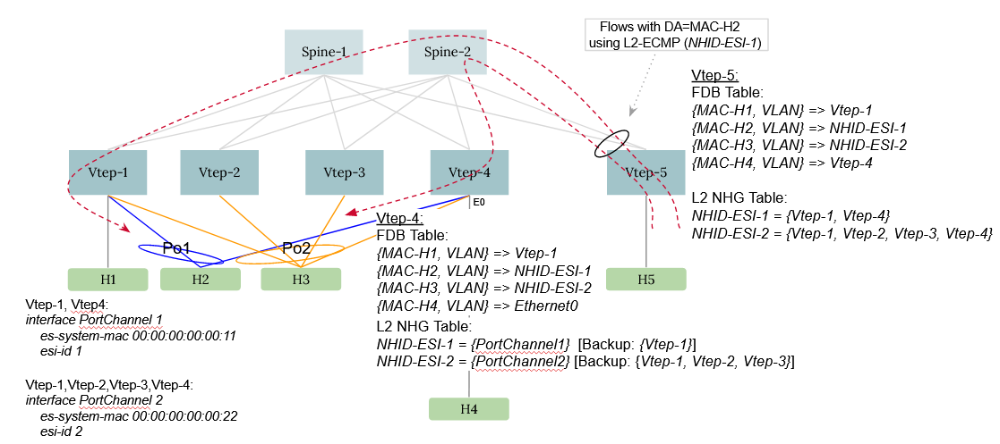

# EVPN VxLAN Multihoming

# High Level Design Document

Rev 0.2

# Table of Contents

- [EVPN VxLAN Multihoming](#EVPN-VxLAN-Multihoming)
- [High Level Design Document](#High-Level-Design-Document)
- [List of Tables](#List-of-Tables)
- [Revision](#Revision)
- [About this Manual](#About-this-Manual)
- [Scope](#Scope)
- [Definition/Abbreviation](#Definition/Abbreviation)
  - [Table 1: Abbreviations](#Table-1:-Abbreviations)
- [1 Feature Overview](#1-Feature-Overview)
  - [1.1 Requirements](#11-Requirements)
    - [1.1.1 Functional Requirements](#111-Functional-Requirements)
    - [1.1.2 Configuration and Management Requirements](#112-Configuration-and-Management-Requirements)
    - [1.1.3 Platform Requirements](#113-Platform-Requirements)
  - [1.2 Design Overview](#12-Design-Overview)
    - [1.2.1 Basic Approach](#121-Basic-Approach)
    - [1.2.2 Container](#122-Container)
    - [1.2.3 SAI Overview](#123-SAI-Overview)
- [2 Functionality](#2-Functionality)
  - [2.1 Target Deployment Use Cases](#21-Target-Deployment-Use-Cases)
  - [2.2 Functional Description](#22-Functional-Description)
- [3 Design](#3-Design)
  - [3.1 Overview](#31-Overview)
  - [3.2 DB Changes](#32-DB-Changes)
    - [3.2.1 CONFIG DB](#321-CONFIG-DB)
    - [3.2.2 APP DB](#322-APP-DB)
    - [3.2.3 STATE DB](#323-STATE-DB)
    - [3.2.4 ASIC DB](#324-ASIC-DB)
    - [3.2.5 COUNTER DB](#325-COUNTER-DB)
  - [3.3 Impact to existing modules](33-Impact-To-Existing-Modules)
  - [3.4 SAI](#34-SAI)
    - [3.4.1 New SAI Objects](#341-new-sai-objects)
    - [3.4.2 Changes to Existing SAI Objects](#342-changes-to-existing-sai-objects)
    - [3.4.3 SAI Object Usage](#343-sai-object-usage)
  - [3.5 CLI](#35-CLI)
    - [3.5.1 IS-CLI Compliance](#351-IS-CLI-Compliance)
    - [3.5.2 Data Models](#352-Data-Models)
    - [3.5.3 Configuration Commands](#353-Configuration-Commands)
    - [3.5.4 Show Commands](#354-Show-Commands)
    - [3.5.5 Debug Commands](#355-Debug-Commands)
    - [3.5.6 REST API Support](#356-REST-API-Support)
- [4 Flow Diagrams](#4-Flow-Diagrams)
- [5 Error Handling](#5-Error-Handling)
- [6 Serviceability and Debug](#6-Serviceability-and-Debug)
- [7 Warm Boot Support](#7-Warm-Boot-Support)

# List of Tables

[Table 1: Abbreviations](#Table-1-abbreviations)

# Revision

| Rev  | Date      | Author                                           | Change Description |
| ---- | --------- | ------------------------------------------------ | ------------------ |
| 0.1  | 2/22/2024 | Syed Hasan Naqvi, Rajesh Sankaran, Kishore Kunal, Praveen Elagala | Initial version    |
| 0.2  | 3/21/2024 | Syed Hasan Naqvi                                 | Addressed review comments, updated SAI section |

# About this Manual

This document provides general information of EVPN VxLAN Multihoming feature implementation in SONiC.


# Scope

This document describes the high level design and changes required for supporting Multihoming in EVPN VxLAN networks.
This feature will provide RFC 7432/8365 based Multihoming solution in SONiC.
The ICCPd based MCLAG will continue to co-exist as an alternate solution.


# Definition/Abbreviation

## Table 1: Abbreviations

| Term     | Meaning                                   |
| -------- | ----------------------------------------- |
| MCLAG    | Multi-Chassis LAG                         |
| LVTEP    | Logical VTEP                              |
| PIP, VIP | Primary IP Address, Virtual IP Address    |
| MHD, SHD | Multi-Homed Device, Single-Homed Device   |
| VNI      | (VxLAN) Virtual Network Identifier        |
| L3VNI    | (VxLAN) Layer3 Virtual Network Identifier |
| IRB VLAN | Integrated Routing and Bridging VLAN      |

# 1 Feature Overview


## 1.1 Requirements

### 1.1.1 Functional Requirements

The following are functional requirements for EVPN VxLAN Multihoming:

1. Support All-EVPN based active-active access redundancy with up to 4 VTEPs.
2. Support all of the routing and switching traffic flows currently supported on legacy MCLAG.
3. Support following features on EVPN MH:

	- Static Anycast Gateway
	- BGP over EVPN Multihomed Ethernet-Segment
	- ARP/ND suppression
4. Support for Type-0 (Operator configured), Type-1 (LACP based), and Type-3 (System-MAC config based) Ethernet Segment IDs types.

The following are non-goals for the EVPN Multihoming feature:

1. Formation of EVPN Active-Active redundancy with multiple vendor NOS. All of the VTEPs, which the hosts are Multihomed to, should be SONiC devices.
2. Single-Active redundancy for the multihomed device. Only active-active redundancy is supported.
3. Support of VRRP over EVPN Multihoming. Static Anycast Gateway should be used instead.
4. EVPN Multihomed interface as router-port or routed sub-interface. EVPN Multihomed interface can only be a switchport.

Special notes:
1. SONiC currently supports EVPN Vlan-based service. No new service-types are introduced with this feature. 


### 1.1.2 Configuration and Management Requirements

The following are configuration and management requirements for EVPN VxLAN Multihoming:

1. All of the configurations and show outputs should be available through SONiC yang - REST, gNMI.
2. All of the configurations and show outputs should be available through click/FRR-vtysh.

### 1.1.3 Platform requirements
Support EVPN Multihoming on platforms having VxLAN capabilities.


## 1.2 Design Overview
EVPN Multihoming feature provides RFC-7432 and RFC-8365 based solution for supporting all-active redundancy in EVPN VxLAN network. The all-active multihomed device(s) are required to be connected to the EVPN VxLAN network with Link-aggregation (LAG) running LACP protocol. Subsequent sub-sections below will cover typical traffic forwarding cases and use that to come up with the EVPN MH design.


### 1.2.1 Basic Approach


The diagram below shows a typical EVPN Multihoming network with Multihomed (MH)  and Single-homed (SH) devices connected to EVPN VxLAN VTEPs. The active-active redundancy with 4 VTEPs is shown. However, it is not required for the Multihomed devices to be connected to 4 VTEPs.


The devices H1, H4, and H5 are SH devices and connected to Vtep-1, Vtep-4, and Vtep-5 respectively. The devices H2 & H3 are multihomed and connected to to EVPN VxLAN network with active-active redundancy using LAG. Device H2 is multihomed to Vtep-1 and Vtep-4. Whereas device H3 is multihomed to Vtep-1, Vtep-2, Vtep-3, and Vtep-4.

In order to configure EVPN Multihoming for the LAGs connecting multihomed devices, Type-0, Type-1, or Type-3 ESI is required to be configured on the LAG interfaces:
*Type-0: Operator configured ESI*
*Type-1: ESI automatically derived from LACP partner MAC*
*Type-3: ESI automatically derived from configured LAG system-mac address*

For a given Multihomed Ethernet-Segment, the value of ES-ID should be same on all of the participating VTEPs.

For simplicity, assume Type-3 ESI is configured on the PortChannel interfaces shown in the above diagram. The Vtep-1 and Vtep-4 LAG configuration will look like this:

```
sudo config interface PortChannel1 sys-mac 00:00:00:00:11:11
sudo config interface PortChannel1 evpn-esi auto-system-mac

sudo config interface PortChannel2 system-mac 00:00:00:00:22:22
sudo config interface PortChannel2 evpn-esi auto-system-mac
```


Whereas, on Vtep-2 and Vtep-3 only PortChannel2 config is required since only PortChannel2 is multihomed to these VTEPs.
```
sudo config interface PortChannel2 system-mac 00:00:00:00:22:22
sudo config interface PortChannel2 evpn-esi auto-system-mac
```
The Type-3 ESI value will be derived by combining the configured system-mac address on the PortChannel interface, and the PortChannel number. The system-mac is required to be same on all of the VTEPs multihoming a given LAG.

The above diagram and PortChannel configurations will be used in subsequent sub-sections to explain the traffic forwarding scenarios in EVPN Multihoming network.


#### 1.2.1.1 BUM forwarding in EVPN MH
The BUM (Broadcast, Unknown Unicast, and Multicast) traffic in EVPN Multihoming network requires different handling depending on whether BUM traffic originated from VTEP participating or not participating in the EVPN Multihoming. 


##### 1.2.1.1.1 Local-bias and split-horizon filtering
If the BUM traffic originates from a device attached to EVPN Multihoming enabled VTEP, Local-bias procedure is applied and BUM traffic is flooded on all of the local MH and SH devices. The BUM traffic is also replicated to the remote VTEPs, and split-horizon filtering is applied such that traffic is not duplicated to any of the devices that are attached to the VTEPs.

Local-bias procedure is described in EVPN VxLAN Overlay RFC 8365. The behavior of local-bias is explained with the help of below diagram.


Here BUM traffic is originated from SHD H1 attached to Vtep-1. Due to local-bias, Vtep-1 floods this traffic to PortChannel1, PortChannel2, and to the remote VTEPs.

Once this traffic arrives on remote VTEP, say Vtep-4, it has to know that BUM traffic was originated at Vtep-1 and PortChannel1 & PortChannel2 are attached to Vtep-1. And therefore, there is no need to forward BUM traffic to PortChannel1 and PortChannel2. However, Vtep-4 should forward this traffic to SHD H4. This filtering of BUM traffic by looking at the source VTEP of the VxLAN frame and the Multihomed egress interface (Ethernet Segment) is referred as split-horizon filtering.


##### 1.2.1.1.2 Designated-forwarder
The designated forwarder (DF) election is described in RFC 7432, and is implemented to avoid BUM traffic duplication towards devices connected to the EVPN Multihoming network. The purpose of DF election is to elect one of the VTEPs among the participating VTEPs for a given Multihomed Ethernet-segment that is responsible for forwarding the BUM traffic to the multihomed device. And rest of the participating VTEPs do not forward the BUM traffic to the multihomed device.


The above diagram depicts a typical working of BUM forwarding by the elected DF. Assume that Vtep-1 is the elected DF for PortChannel1 (ES-ID 1), and Vtep-4 is the elected DF for PortChannel2 (ES-ID 2). The BUM traffic is originated at Vtep-5 and is replicated to all of the VxLAN tunnels member of the VLAN. In this case, all of the Vtep-1 to Vtep-4 receive the BUM traffic.
Each of these VTEPs attempt to flood the traffic on local access ports. However, for the multihomed ESs, only the DF forwards the BUM traffic and rest of the VTEPs refrain from forwarding.

#### 1.2.1.2 L2 Unicast forwarding in EVPN MH
The control-plane and forwarding-plane handling of MAC/ARP learnt on the Multihomed Ethernet-Segments significantly differs from the single homed Ethernet-Segments in the EVPN VxLAN network.

Each VTEP advertises EVPN Type-1 (AD-per-ES) route to advertise its association with each of the Multihomed ES connected to it. And the Type-2 route for the MAC/ARP learnt on Multihomed ES carry the corresponding 10-byte ES-ID. The Type-1 route is used to identify all of the VTEPs that are member of a given Multihomed ES in the network. For each ES-ID, a unique L2 Next-hop group (NHG) is formed that contains the participating VTEPs. Subsequently, when Type-2 route is processed that contains an ES-ID, the corresponding MAC/ARP is installed in the system pointing to the L2 NHG.

The L2 NHG serves two purposes. First, it allows load-balancing of L2 unicast flows among the participating VTEPs multihoming the ES. Second, it helps in faster-convergence of traffic in case of ES failure on one of the participating VTEPs.



In the diagram above, H2 host mac address H2-MAC is advertised by Vtep-1 and/or Vtep-4 in a EVPN Type-2 route that also carries Ethernet-Segment identifier (ES-ID) of PortChannel1. On Vtep-5, the H2-MAC processing undergoes special handling since the Type-2 route has ES-ID. And H2-MAC is installed against L2 NHG corresponding to the ES-ID. Even if Type-2 route for H2-MAC is received only from either Vtep-1 or Vtep-4, the traffic towards H2 will still be load-balanced between Vtep-1 and Vtep-4. Later, if PortChannel1 interface goes down, on say Vtep-1, Vtep-1 will withdraw the Type-1 (AD-per-ES) route and this will result in Vtep-5 updating L2 NHG for the ES-ID. This re-balance of traffic will not wait for the individual MAC route updates to arrived and get processed. This update of L2 NHG on Multihomed ES link failures is referred as "Fast Convergence" in RFC 7432.

#### 1.2.1.3 MAC Handling in Swss
The following section describes handling in swss for mac learning, aging, and move scenarios of concern in the EVPN Multihoming network.

##### 1.2.1.3.1 Local MAC learning on Multihomed ES
MAC learned dynamically over a Port-Channel interface which is associated with a Ethernet-segment is considered as Local MAC address. Existing local MAC learn mechanism will be reused for the EVPN MH support and no additional changes are required.

##### 1.2.1.3.2 Local MAC ageing
Local MAC address when gets aged out from the HW, FdbOrch will be notified with age event. FdbOrch is required to extend the support to re-program the MAC with L2 NHID if it has active tunnel members. No changes are required to the current mechanism of MAC address being deleted from STATE_DB in order to notify the Fdbsyncd about the local ageing. 

##### 1.2.1.3.3 Remote MAC learning on Multihomed ES
EVPN VxLAN remote MAC addresses are installed into Linux FDB by FRR and Fdbsyncd updates them into VXLAN_FDB_TABLE. The same VXLAN_FDB_TABLE is extended for installing MAC on the ES when the MAC update is received from EVPN MH ES peer.

**Remote MAC with local ESI presence**: A new "ifname" field is added to VXLAN_FDB_TABLE. The MAC updates received from ES peer will be installed with ifname set to PortChannel interface associated with an ESI. Fdborch to enhance to add the EVPN remote MAC against the local PortChannel interface with aging disabled. 

**Remote MAC with no local ESI:** MAC updates from remote EVPN MH will be installed in VXLAN_FDB_TABLE with L2 NHID instead of a specific tunnel. FdbOrch to extend the support to program the MAC address against L2 NHID.

##### 1.2.1.3.4  Remote MAC aging
When MAC address gets aged on remote VTEP and sends withdrawal notification, 
- FRR to remove the MAC learn ownership from the corresponding remote VTEP.  
- FRR to check if the MAC address is learned locally or got advertised from any other remote VTEP nodes as well. 
- If local or any other remote VTEP advertised the MAC with same ESI, no updates sent to Fdbsyncd/Orchagent. Else the MAC will be removed from VXLAN_FDB_TABLE, and FdbOrch will subsequently remove the MAC from HW.

##### 1.2.1.3.5  Local Multihomed ES Link down
As part of the PortChannel interface going operationally down, FdbOrch to get notified to flush the MAC addresses associated with the PortChannel interface. Fdborch to extend the support to check if the PortChannel is associated with an ES. If the PortChannel is orphan port then flush the MAC addresses. If there is an ES associated with the PortChannel, FdbOrch to fetch the corresponding L2 NHID and re-program all (local and remote) MAC addresses pointing to L2 NHID associated with the local ESI. The MAC addresses are programmed with aging disabled. 

##### 1.2.1.3.6  Local Multihomed ES Link up
As part of the PortChannel interface going operationally up, new support will be added in the Orchagent to move the MAC from L2 NHID to the corresponding PortChannel which is associated with the ES. MAC addresses are programmed with aging disabled. 

##### 1.2.1.3.7  Configure PortChannel as ES member
**Remote MAC Handling:** When a PortChannel interface is configured with an ESI, FRR to update all of the MAC addresses associated with the ES in the VXLAN_FDB_TABLE with the "ifname" of corresponding PortChannel interface. FdbOrch will be extended to reprogram the MAC addresses pointing to the PortChannel interface.

**Local MAC handling:** No changes to existing Local MAC addresses as part of PortChannel being configured with ESI. 

##### 1.2.1.3.8  Remove ES configuration under the PortChannel.

**Remote MAC Handling:** When ESI config is removed from the PortChannel interface, FRR/Fdbsyncd will update the MAC addresses in the VXLAN_FDB_TABLE with L2 NHID. FdbOrch to reprogram the remote MAC entries with L2 NHID. 

**Local MAC Handling:** Local MAC addresses will remain unaffected.

##### 1.2.1.3.9  MAC move handling
Following MAC move scenarios will be supported:
- **Local to Local MAC move:**  MAC address move between 2 local interfaces is supported. The interface can be of any type including PortChannel configured with ESI. No new changes required for this case.
- **Local to remote MAC move:** FRR/Fdbsyncd to update the MAC with remote tunnel/L2-NHID or ES associated PortChannel information.  FdbOrch will be extended to move the MAC to program against, VxLAN tunnel/L2-NHID or ES associated PortChannel correspondingly. 
- **Remote to remote MAC move:** MAC address can be moved between the remote VTEP interfaces. FRR to update the remote MAC with new tunnel/L2-NHID or PortChannel information. FdbOrch will be extended to move the MAC to program against VxLAN tunnel/L2-NHID or ES associated PortChannel correspondingly. 
- **Remote to Local MAC move:** FdbOrch to update the existing remote MAC as part of the local learn event and update the STATE_FDB_TABLE with local interface information. The local port can be ES associated PortChannel or any type of the local Orphan port. 

##### 1.2.1.4 Proxy advertisement of Type-2 routes
IETF draft draft-rbickhart-evpn-ip-mac-proxy-adv introduces scheme of proxy advertisement of Type-2 routes useful for the EVPN Multihoming scenarios. The ARP/ND extended community is enhanced to advertise the proxy flag in the Type-2 route updates. The VTEPs where the MAC address is locally learnt, the Type-2 route is advertised without the proxy flag set. The remote VTEPs, which are connected to the same ES, on receiving the Type-2 routes install the MAC address on their local PortChannel (multihomed) interface. However, these remote VTEPs immediately re-advertise (proxy) the same Type-2 route declaring reachability of the MAC address through them as well -- even though the MAC is not locally learnt. These Type-2 route updates are sent with proxy flag set to indicate that MAC is not locally learnt by these VTEPs.

The proxy advertisement is explained using the simplified topology below.

Here, only Vtep-1 learns the MAC address of H2 and advertises Type-2 route with Proxy=0. When Vtep-4 receives this update, it installs the MAC against Po1 but also advertises Type-2 route for the same MAC with Proxy=1.

This proxy advertisement avoids unnecessary MAC address flap in the network in case the original VTEP that had locally learnt the MAC address observes a fault (e.g. Multihomed ES link goes down, VTEP gets disconnected from spine, VTEP reboots, etc.) When the original router withdraws the Type-2 route, the other VTEPs do not remove the MAC and keep advertising the proxy Type-2 route. During this time, if the MAC is learnt locally, the proxy flag is reset in the route updates. Otherwise, the MAC address is flushed after a (configurable) hold timeout and Type-2 route is withdrawn. Similar approach is taken for the ARP/ND neigbhbor entries.

 
### 1.2.2 Container
No new container is added by this feature.

The following processes/submodules are added in the below containers:
* L2nhgorch submodule inside Orchagent in the swss docker
* EvpnMhOrch submodule inside Orchagent in the swss docker

#### 1.2.2.1 EvpnMhOrch in Swss docker
EvpnMhOrch is a submodule within Orchagent responsible for reading EVPN Multihoming DF election and Split Horizon entries and writing corresponding entries in ASIC DB.

#### 1.2.2.2 L2nhgorch in Swss docker
The L2nhgorch is a submodule within Orchagent responsible for reading L2 ECMP table and writing corresponding entries in ASIC DB.
*It also listens to updates on the LAG oper-status to reprogram the L2 NHG.*


### 1.2.3 SAI Overview
Following new objects are added:
- L2 ECMP group for Known MAC. 

New attributes are added to existing objects to associate with the above objects.


# 2 Functionality

## 2.1 Target Deployment Use Cases

All of the existing use-cases for ICCPd based MCLAG are applicable for EVPN Multihoming. No new deployment use-cases are introduced as part of this feature.


## 2.2 Functional Description

### 2.2.1 EVPN Multihoming configuration

### 2.2.1.1 EVPN Multihoming Global configuration
EVPN multihoming global configuration is for configuring MAC/Neighbor holdtime and startup-delay.
```
sudo config evpn-mh startup-delay (0-3600)
sudo config evpn-mh mac-holdtime (0-86400)
sudo config evpn-mh neigh-holdtime (0-86400)
```

As described in Sec. 1.2.1.4 (Proxy advertisement of Type-2 routes,) the MAC/Neighbor holdtime is the time after which proxy advertisement is withdrawn and MAC/Neighbor entries are flushed if the MAC/neighbor is not re-learnt.

Please note that MCLAG and EVPN MH global configurations are mutually exclusive. If MCLAG is configured, above configuration will not be successful. Similarly, if EVPN MH global configuration is present, MCLAG configuration will not be allowed.

### 2.2.1.2 EVPN Multihoming Ethernet Segment configuration
EVPN Ethernet-segment configurations for Type-0, Type-1, and Type-3 ES-ID types (please refer to RFC 7432) are supported.

The Type-0 ESI is an administrator configured 10-byte ESI value. Below is an example of configuring Type-0 ESI.
```
sudo config interface PortChannel1 sys-mac 00:00:00:0a:00:01
sudo config interface PortChannel1 evpn-esi 00:00:00:00:00:00:00:0a:00:01
```

The Type-1 ESI is automatically generated using LACP partner MAC address and the PortChannel interface number. Below is an example of configuring Type-1 ESI.
```
sudo config interface PortChannel1 sys-mac 00:00:00:0a:00:01
sudo config interface PortChannel1 evpn-esi auto-lacp
```

The Type-3 ESI is generated using System MAC address and the PortChannel interface number. Below is an example of configuring Type-3 ESI.
```
sudo config interface PortChannel1 sys-mac 00:00:00:0a:00:01
sudo config interface PortChannel1 evpn-esi auto-system-mac
```
The 10-byte ESI will be generated by concatenating 6-byte System MAC, 3-byte PortChannel number (i.e. 1 for PortChannel1,) and 1-byte Type=0x03.

Please note that system-mac configuration is required for all of the ESI types and should be same on all of the participating VTEPs for a given ES.

### 2.2.2 EVPN Designated Forwarder Election
The participating VTEPs for a given active-active ES should agree on which VTEP is going to forward the BUM traffic to the ES. In absence of a designated forwarder (DF), the multihomed device will receive duplicate packets from each of the multihoming VTEP. The procedure for electing the DF is explained in RFC 7432, and referred to as the default procedure. RFC 8584 introduces DF election extended community to implement non-default DF election algorithms and advertise the algorithm-id in the Type-4 BGP EVPN updates. As per RFC 8584, following are the algorithm assignments:

- Algo 0: RFC 7432 (default) modulo based scheme
- Algo 1: RFC 8584 Highest Random Weigh (HRW) scheme
- Algo 2-30: Unassigned

### 2.2.2.1 Preference based DF election
IETF draf draft-ietf-bess-evpn-pref-df extends RFC 8584 and proposes preference based DF election scheme. The preference based DF election works on a simple principle of comparing the user configured preference values of each VTEP for a given ES. When preference values are same, VTEP with lowest Originator IP address is chosen as the DF.

The above IETF draft extends the DF election algorithm assignment as below:
- Algo 2 : Highest-Preference algorithm
- Algo TBD: Lowest-Preference algorithm

FRR 8.2 implements the highest preference based DF election algorithm and advertises in the ES routes.
SONiC will use the same DF election algorithm.

DF election will be performed in FRR and **EVPN_DF_TABLE** will be populated in APP-DB by Fpmsyncd only if the local switch is the elected DF. If EVPN_DF_TABLE entry is not present, the switch will not forward any BUM traffic to the EVPN MH Ethernet segment.

**Note:** DF election timer value is set to 3 sec as per RFC 7432, and is not configurable.

**Note:** As per the standard, if two routers do not agree on a given DF election algorithm, they all should fallback on default modulo based scheme proposed in RFC 7432. This fallback option is not supported and SONiC device will not own the DF role in such interop cases.

### 2.2.2.2 Interoperability between ES Multihoming VTEPs
There are two types of interoperabilities in EVPN MH network:
- (a) Interoperability between VTEPs which are multihoming one or more common ES
- (b) Interoperability between VTEPs which are not multihoming any common ES

SONiC will support interoperability (b). 

SONiC will not be able to support interoperability (a) if the EVPN MH participating VTEP does not support highest preference based DF election algorithm.
It is recommended that all of the VTEPs multihoming one or more common ES are the SONiC devices.

### 2.2.3 Split Horizon Filtering
Split Horizon filtering is achieved by identifying the set of VTEPs Multihoming a given Ethernet Segment. 

Using AD-per-ES routes, FRR constructs list of participating VTEPs for each ESI. And Fpmsyncd installs EVPN_SPLIT_HORIZON_TABLE entry in APP-DB that contains list of remote VTEPs multihoming the given PortChannel interface.

The Isolation group SAI object used for achieving Local Bias and Split Horizon Filtering in the MCLAG will be reused for EVPN MH. In EVPN MH an Isolation group for every Peer Multihoming VTEP is created as opposed to a single group for MCLAG. The Isolation group members are populated based on the EVPN_SPLIT_HORIZON_TABLE APP-DB entry. Traffic received from the Tunnel towards the peer multihoming VTEP will not be forwarded to the members of the Isolation group.

### 2.2.4 Linux Kernel support for EVPN Multihoming
EVPN Multihoming feature requires L2 next-hop group (NHG) support in the Linux kernel that is available in v5.10.
EVPN Multihoming feature will not be supported in SONiC releases running 4.x kernel versions.

#### 2.2.4.1 L2 Next-hop Groups
Remote MAC addresses received via BGP EVPN Type-2 route updates having non-zero ESI will be installed in the Linux kernel fdb with L2 nhid as show below:
```
# bridge fdb show
00:00:0a:0b:00:03 dev vtep1-100 vlan 100 extern_learn master Bridge
00:00:0a:0b:00:03 dev vtep1-100 nhid 536870913 self extern_learn
```

The kernel nexthop table maintains the next-hop groups and member entries.
```
# ip nexthop show
id 268435458 via 1.1.1.1 scope link fdb
id 268435459 via 2.2.2.2 scope link fdb
id 536870913 group 268435458/268435459 fdb
```
In the example output, L2 NHID group 536870913 has two member nexthops - 268435458 and 268435459 - which resolve to single path VTEP nexthops.


#### 2.2.4.2 BUM traffic handling
Linux kernel v5.10 does not have support for split-horizon filtering. Kernel patches will be required in Linux bridge driver to achieve following:

- Each bridge-port in bridge driver will keep up to 4 VTEP addresses.
- Each bridge-port in bridge driver will have flag to indicate it is DF.
- SKB ingressing VxLAN netdevices and being flooded to a bridge-port (PortChannel interface), will undergo following checks:
	+ If source IP address in SKB matches one of the VTEPs on egress bridge-port, the packet will be dropped.
	+ Otherwise, packet will be forwarded if DF flag is set on the bridge-port.

Note: This section needs to be revisited in purview of below Linux kernel commit:
https://git.kernel.org/pub/scm/linux/kernel/git/stable/linux.git/commit/?h=v6.7.5&id=e180a33cf4636721de9c3e694aaad31e77fcdeb1

#### 2.2.4.3 FDB local and remote activity tracking
Linux kernel v5.10 has a few enhancements for tracking local activity and remote learning of FDB entries. When the MAC address is learnt locally, as well as the advertisement is received from the EVPN MH peer VTEP, the FDB entry holds extra attributes to identify if the FDB entry has become inactive locally.

Changes in activity of the FDB entry is notified using netlink extended attribute *NDA_FDB_EXT_ATTRS* sent as part of AF_BRIDGE RTM_NEWNEIGH updates by the kernel. When the FDB entry ages out locally, the *FDB_NOTIFY_INACTIVE_BIT* flag is reset in the *NFEA_ACTIVITY_NOTIFY* nested netlink attribute.

Similarly, when installing the mac address received from EVPN MH peer, *NFEA_DONT_REFRESH* attribute is set by the application (FRR) to not reset aging timer (refresh) for the existing FDB entry in the kernel.


### 2.2.5 MAC learning, aging, and move handling

The below steps explain the MAC learning and ageing scenario in the EVPN MH network. Please refer to diagram used in sec. 1.2.1.4 Proxy Advertisement of Type-2 routes.
1. MAC is learnt on Vtep-1:
	- (a) MAC is learnt in HW on PortChannel1 and STATE_FDB_TABLE entry is populated.
	- (b) Fdbsyncd installs MAC address into the kernel with state=NUD_REACHABLE, dev=PortChannel1.
	- (c) FRR advertises MAC in Type-2 update with Proxy = 0.
2. Type-2 update is received on Vtep-4:
	- (a) FRR installs MAC in kernel with dev=PortChannel1 and state=NUD_NOARP.
	- (b) Fdbsyncd listens to the above update from kernel and installs VXLAN_FDB_TABLE with type=dynamic, ifname=PortChannel1.
	- (c) Fdborch installs the MAC in HW as static with SAI_FDB_ENTRY_ATTR_ALLOW_MAC_MOVE flag to avoid ageing and allow move.
	- (d) FRR advertises Type-2 route with Proxy=1.
3. Type-2 proxy update is received on Vtep-1:
    - (a) Type-2 update from Vtep-4 is processed and FRR converts the FDB entry in kernel from NUD_REACHABLE to NUD_NOARP with NFEA_ACTIVITY_NOTIFY set.
    - (b) Fdbsyncd receives the state change event from kernel and populates VXLAN_FDB_TABLE with ifname=PortChannel1, type=dynamic.
    - (c) Fdborch observes that STATE_FDB_TABLE entry is already present. It updates the bitmap in the FDB cache as Local + Remote. And entry in the HW is not updated and remains as dynamic.
4. MAC ages out on Vtep-1:
    - (a) L2 table delete event from SAI is processed in Fdborch.
    - (b) Fdborch removes STATE_FBD_TABLE entry, and resets Local flag in FDB cache. It observes that Remote flag is set in FDB cache, so it installs MAC back into the HW as static with ALLOW_MAC_MOVE flag.
    - (c) Fdbsyncd receives STATE_FDB_TABLE delete event. It removes FDB entry from the kernel (or resets activity bit, if possible.)
    - (d) FRR receives delete FDB notification (or with inactive_bit set.) BGP withdraws Type-2 update.
5. Type-2 withdrawal is received on Vtep-4:
    - (a) FRR updates the kernel FDB entry with IN_TIMER flag and starts hold-timer.
    - (c) FRR should remove the FDB entry from the kernel for MAC to be learnt locally.
    - (d) Fdborch receives the FDB delete event from the kernel and removes MAC from VXLAN_FDB_TABLE.
6. MAC hold-timer expires on Vtep-4:
    - (a) If there is no traffic hitting neither Vtep-1 nor Vtep-4, the MAC hold-timer will expire on Vtep-4.
    - (b) FRR withdraws MAC advertisement with Proxy=1.
    - (c) Vtep-1 receives MAC withdrawal and removes MAC from the kernel.
    - (d) Fdbsyncd receives FDB delete event from the kernel and removes MAC from VXLAN_FDB_TABLE.
    - (e) MAC is removed from HW on Vtep-1.

### 2.2.6 Static Anycast Gateway
Static Anycast Gateway (SAG) will be the primary and only mechanism for achieving active-active L3 gateway on the EVPN MH enabled VTEPs.

In contrast to MCLAG, SVI interface MAC addresses are not synced between EVPN MH VTEPs. In order to configure same SVI IP address on the EVPN MH VTEPs for active-active L3 gateway, SAG IP addresses are required to be configured. However, if SVI interfaces on the EVPN MH VTEPs are required to have unique IP addresses (e.g. in case of BGP over EVPN MH), configure the unique SVI IP addresses on the EVPN MH VTEPs as usual.

### 2.2.7 Mutual exclusion of MCLAG and EVPN MH configurations
The MCLAG configuration will not be allowed if ESI is configured on one or more interface(s).

### 2.2.8 ARP/ND suppression
ARP/ND suppression will be supported in EVPN Multihoming scenarios. The VTEP will respond to the ARP/ND requests received on local access ports only for the ARP/ND installed against remote VTEPs. ARP/ND response will not be  generated by the VTEP if ARP/ND is installed on the local Multihomed ES, even though the ARP/ND learning happened on the remote VTEP multihoming a given ES.

### 2.2.9 BGP over EVPN MH
BGP sessions can be configured between VTEPs and host/client node over multihomed ES. Following are some of the requirements for the correct operation of BGP over MH:
1. The BGP session should be in a VLAN that the shared ES should be member of on all of the participating VTEPs and host/client.
2. The VLAN should be configured with a L2VNI on all of the participating VTEPs.
3. The VLAN should have unique IPv4/IPv6 address(es) on all of the participating VTEPs and the host/client.
4. The ebgp-multihop with value of at least 2 should be configured on all of the participating VTEPs and the host/client.
5. MTU of the SVIs on which BGP session is established should be adjusted to account for VxLAN encapsulation overheads. For the default MTU 9100 on SONiC switches, it is recommended to configure MTU 9000 on the corresponding SVIs on all of the participating VTEPs and the host/client.

# 3 Design

## 3.1 Overview


## 3.2 DB Changes

### 3.2.1 CONFIG DB


**EVPN_ETHERNET_SEGMENT**

```
;New table
;Specifies EVPN Ethernet Segment interface
;
; Status: stable
key = EVPN_ETHERNET_SEGMENT|"PortChannel"po_id
; field = value
esi        = "AUTO"  or es_id
                ; es_id is 10 byte colon (:) separated string when type = "TYPE_0_OPERATOR_CONFIGURED".
                ; Otherwise, esi value should be "AUTO". 
type       = esi_type
                ; esi_type should be string with one of the below values:
                ; "TYPE_0_OPERATOR_CONFIGURED" for Type-0 ESI
                ; "TYPE_1_LACP_BASED" for Type-1 ESI
                ; "TYPE_3_MAC_BASED" for Type-3 ESI
ifname     = "PortChannel"po_id
                ; po_id is port-channel identifier. Same value as in the key.
df_pref    = 1*5DIGIT
                ; Designated-Forwarder election preference for this router in (1..65535) range.
                ; Default=32767.
```


**PORTCHANNEL**
```
; Existing table
; Add system-id-mac field for PortChannel interfaces
;
; Status: stable
key = PORTCHANNEL|"PortChannel"po_id
; field = value
system_mac = mac_address
				; New field. 6-byte colon(:) separated LACP system mac address
```


**EVPN_MH_GLOBAL**

```
; New table
; Specifies EVPN Multihoming global parameters
;
; Status: stable
key = EVPN_MH_GLOBAL|default
; field = value
startup_delay  = 1*4DIGIT
				; Amount of time in secs (0..3600 range) to wait
				; before bringing up Multihomed ES. Default=300.
                                ; Value 0 means disabled.
mac_holdtime   = 1*5DIGIT
				; Amount of time in secs (0-86400 range) to wait
				; before aging out peer VTEPs MAC entry after it
				; has been withdrawn. Default=1080.
                                ; Value 0 means disabled.
neigh_holdtime = 1*5DIGIT
				; Amount of time in secs (0-86400 range) to wait
				; before aging out peer VTEPs ARP/ND entry after
				; it has been withdrawn. Default=1080.
                                ; Value 0 means disabled.
```


### 3.2.2 APP DB

**EVPN_SPLIT_HORIZON_TABLE**

```
; New table
; Specifies split-horizon filtering source VTEPs for EVPN Multihomed interface
; Producer: fpmsyncd
; Consumer: evpnmhorch
; Status: stable
key               = EVPN_SPLIT_HORIZON_TABLE:"Vlan"vlan_id:"PortChannel"po_id
						; vlan_id is 1-4 DIGIT Vlan ID.
						; po_id is PortChannel number
; field = value
vteps            = vtep_list
						; String of Comma(,) separated list of VTEP IP addresses.
```


**EVPN_DF_TABLE**
```
; New table
; Specifies designated-forwarder election for this router.
; Producer: fpmsyncd
; Consumer: evpnmhorch
; Status: stable
key               = EVPN_DF_TABLE:"Vlan"vlan_id:"PortChannel"po_id
						; vlan_id is 1-4 DIGIT VLAN ID.
						; po_id is PortChannel number
; field = value
df        = True

```

**EVPN_ES_BACKUP_NHG_TABLE**
```
; New table
; Specifies designated-forwarder election for this router.
; Producer: fpmsyncd
; Consumer: fdborch
; Status: stable
key               = EVPN_ES_BACKUP_NHG_TABLE:"PortChannel"po_id
						; po_id is PortChannel number
; field = value
nexthop_group        = nexthop_group_value
                                                ; Backup nexthop group id for the given ES
						; Singular value.

```


**VXLAN_FDB_TABLE**

Producer:  Fdbsyncd

Consumer: FdbOrch

Description: Updated existing table to store next-hop group.

Schema:

```
; Existing table
; New field is added for L2 ECMP support

key = VXLAN_FDB_TABLE:"Vlan"vlanid:mac_address
                          ; MAC Address and VLAN ID
; field = value
remote_vtep   = IPv4 address                (existing field)
nexthop_group = L2_NEXTHOP_GROUP_TABLE:key (new field)
				; index within the L2_NEXTHOP_GROUP_TABLE
				; 
				used instead of remote_vtep field
vni           = 1*8DIGIT                    (existing field)
ifname        = STRING                      (new field)
				; Local (PortChannel) interface name in case
				; mac is received with local ESI.
type          = "dynamic"/"static"          (existing field)
```


**L2_NEXTHOP_GROUP_TABLE**

Producer:  Fdbsyncd

Consumer: L2NhgOrch

Description: L2 Next-Hop Group Table entry

Schema:

```
; New table
; Updated group to identify split horizon group the Next-hop group member belongs to.

key = L2_NEXTHOP_GROUP_TABLE:nhid
                  ; Nexthop group id
; field = value
remote_vtep   = ipv4
nexthop_group = L2_NEXTHOP_GROUP_TABLE:key
				; index within the L2_NEXTHOP_GROUP_TABLE separated
				; by "," used for recursive/ECMP routes.
				; ( When this field is present, other fields will
				; not be present)
```


### 3.2.3 STATE DB

No changes

### 3.2.4 ASIC DB

Refer to Section 3.4 for the new SAI objects and changes to existing SAI objects. 
The ASIC DB changes will reflect the above.

### 3.2.5 COUNTER DB

No Changes


## 3.3 Impact to existing modules

The following components will undergo changes to support EVPN Multihoming:

- TeamMgrd
- Zebra
- Fpmsyncd
- Fdbsyncd
- Fdborch
- VxlanOrch
- LinkTrackOrch

No impact is anticipated to MCLAG and LAG modules, e.g.

- ICCPd
- mclagsyncd

### 3.3.1 MCLAG Management-framework transformer
Configuration handling of MCLAG should now be aware of EVPN Ethernet-Segment configurations and throw appropriate errors in order to achieve mutual-exclusion between EVPN Multihoming and MCLAG features.
OpenConfig evpn yang is imported into SONiC and ethernet-segment URIs are implemented.
OpenConfig LACP yang already has system-id-mac configuration and it will be implemented.
OpenConfig evpn yang will be extended for global non-standard parameter configurations (e.g. MAC/ARP hold-timer, etc.)

### 3.3.2 TeamMgr changes
Existing TeamMgr will be extended to perform following activites

1. Subscribe to PORTCHANNEL_TABLE updates from config DB for the new system-id-mac configuration attribute under the Port Channel interface.
2. TeamMgr to update the APP_DB LAB_TABLE with the new system-id-mac.
3. TeamMgr to program the kernel with the new MAC address for the PortChannel interface , once successful update the STATE_DB LAG_TABLE with the new system-id-mac address.

### 3.3.3 Zebra changes
Zebra changes are required to send ES membership and DF election information to Fpmsyncd. Existing socket for zebra-Fpmsyncd communication is leveraged. For sending split-horizon and DF information to Fpmsyncd, NEXTHOP update messages will be used. Fpmsyncd will process raw netlink messages instead of using libnl3 APIs for decoding these messages.

### 3.3.4 Fpmsyncd changes
Fpmsyncd changes are required to handle ES membership and DF election information from zebra and write EVPN_SPLIT_HORIZON_TABLE and EVPN_DF_TABLE APP-DB entries.

### 3.3.5 Fdbsyncd changes
Fdbsyncd changes are required to handle the following:
1. Handling of L2-NHG netlink notifications and dump from kernel.
2. Programming of L2_NEXTHOP_GROUP_TABLE APP-DB entries based on kernel L2-NHG events.
3. Programming of VXLAN_FDB_TABLE APP-DB entries with L2-NHID.
4. Warm-reboot reconciliation of L2_NEXTHOP_GROUP_TABLE and VXLAN_FDB_TABLE similar to ROUTE_TABLE/NEXTHOP_GROUP_TABLE reconciliation in Fpmsyncd.

### 3.3.6 Vxlanorch changes
- Changes required to maintain refcnt to a dip per L2 NHG.

### 3.3.7 Fdborch changes
- FdbOrch is enhanced to process EVPN MH remote MAC updates via existing VXLAN_FDB_TABLE.
- FdbOrch is extended to process new field "ifname" from VXLAN_FDB_TABLE entries.
- FdbOrch is extended to process new field "type" for possible local/remote from VXLAN_FDB_TABLE entries.
- FdbOrch is store and update MAC entries per ES associated PortChannel. This is to update the MAC entries when the associated PortChannel interface is going up/down. 
- FdbOrch is interact with EvpnMhOrch to check if the given PortChanenl is associated with ES or not, fetch the L2-NHID associated with PortChannel, etc.
- FdbOrch is extended to process FDB entries on local po down and program then pointing to backup nexthop group using EVPN_ES_BACKUP_NHG_TABLE.

Fdborch to process the local po down and up in a similar fashion as for MCLAG. 

### 3.3.8 L2nhgorch changes
- New Orchagent class being introduced.
- Subscription to different tables
  - APP DB - L2_NEXTHOP_GROUP, L2_NEXTHOP_GROUP_MEMBER
  - CONFIG DB - EVPN_ES_INTERFACE.
- Subscription to L2_NEXTHOP_GROUP
  - Creates/deletes the L2_ECMP_GROUP ASIC DB table. 
  - Interacts with PortsOrch to create a bridge-port object of type L2_ECMP_GROUP.
- Subscription to L2_NEXTHOP_GROUP_MEMBER
  - Creates/deletes the L2_ECMP_GROUP_MEMBER ASIC DB tables entries on the L2_NEXTHOP_GROUP APP DB table updates.
  - Interacts with VxlanOrch to update the refcnt per remote VTEP.
- Subscription to EVPN_ESI CONFIG_DB table 
  - Informs Fdborch of the ESI to PortChannel mapping.
  - Maintain a local cache of the mapping.
- Subscription to LAG oper-status updates from PortsOrch
- API 
  - L2 NHID to Bridgeport mapping.

### 3.3.9 EvpnMhOrch
A new EvpnMhOrch class will be introduced to perform following activities, 

1. Subscribe to EVPN_MH_GLOBAL config table and set the SAI switch attribute. 
2. Subscribe to EVPN_ES_INTERFACE config table updates and maintain internal cache.
3. Provide set of API to check if the given PortChannel is ES associated or not. 
4. Subscribe to LAG_TABLE oper status changes and trigger MAC update requests to FdbOrch.

## 3.4 SAI

### 3.4.1 New SAI Objects 
No new SAI objects are introduced as part of this design.


### 3.4.2 Changes to Existing SAI Objects

- **NEXT_HOP_TYPE_L2**
  - The nexthop type LAYER_2 is to be used for L2 ECMP nexthop group members.
```
/**
 * @brief Next hop type
 */
typedef enum _sai_next_hop_type_t
{
   ...
    /** Next hop group is for layer 2 bridging */
    SAI_NEXT_HOP_TYPE_LAYER_2,
} sai_next_hop_type_t;
```

- **NEXT_HOP_GROUP_TYPE_L2**
  - The nexthop group type LAYER_2 is to be used for MAC/FDB entries pointing to L2 ECMP nexthop group.
```
/**
 * @brief Next hop group type
 */
typedef enum _sai_next_hop_group_type_t
{
...
    /** Next hop group is for bridge port */
    SAI_NEXT_HOP_GROUP_TYPE_LAYER_2,

    /* Other types of next hop group to be defined in the future, e.g., WCMP */
} sai_next_hop_group_type_t;
```


- **BRIDGEPORT**
  - A new bridge-port type of type L2_NEXT_HOP_GROUP is to be used for installing MAC/FDB entries pointing to L2 ECMP group nexthop.
 
```
/**
 * @brief Attribute data for #SAI_BRIDGE_PORT_ATTR_TYPE
 */
typedef enum _sai_bridge_port_type_t
{
...
    /** Bridge layer 2 next hop group port */
    SAI_BRIDGE_PORT_TYPE_L2_NEXT_HOP_GROUP,

} sai_bridge_port_type_t; 
```

- L2 NHID attribute for bridge ports of type L2_NEXT_HOP_GROUP
    
```
/**
 * @brief SAI attributes for Bridge Port
 */
typedef enum _sai_bridge_port_attr_t
{
...
    /**
     * @brief Associated layer 2 nexthop group id
     *
     * @type sai_object_id_t
     * @flags MANDATORY_ON_CREATE | CREATE_ONLY
     * @objects SAI_OBJECT_TYPE_NEXT_HOP_GROUP
     * @condition SAI_BRIDGE_PORT_ATTR_TYPE == SAI_BRIDGE_PORT_TYPE_L2_NEXT_HOP_GROUP
     */
    SAI_BRIDGE_PORT_ATTR_L2_NEXT_HOP_GROUP_ID,
```

  - A new attribute NON_DF to drop BUM traffic .
    - Applicable to bridgeport type PORT.
    - When set, egress BUM traffic on this bridge port will be dropped.
    - Traffic dropped due to this should not be counted against SAI_PORT_STAT_IF_OUT_DISCARDS i.e Interface Tx drop counters.
```
    /**
     * @brief Indication if this bridge port is Not a Designated Forwarder
     * When set, egress BUM traffic on this bridge port will be dropped.
     *
     * @type bool
     * @flags CREATE_AND_SET
     * @default false
     * @validonly SAI_BRIDGE_PORT_ATTR_TYPE == SAI_BRIDGE_PORT_TYPE_PORT
     */
    SAI_BRIDGE_PORT_ATTR_NON_DF,

```

- **ISOLATION_GROUP**
  - There is no change to the Isolation group and group member definition. 
  - Bridgeport of type TUNNEL will also now have the isolation group attribute set.
  - Multiple Tunnel bridgeports can have the isolation group attribute set.
  
- Capabilities corresponding to the above new SAI attributes to be implemented.

### 3.4.3 SAI Object usage

#### 3.4.3.1 Known MAC Handling 
- Refer to Sec 1.2.1.2.
- At VTEP5 the following objects will be created.
  1. create l2 nexthop objects (tunnel id will be used to create these l2 nexthop objects) (input: tunnel object id, type layer 2; output: nexthop object id)
  2. create nexthop group members  (input: nexthop object id output: nexthop group member object id)
  3. create nexthop group (input: type layer 2; output nexthop group object id)
  4. create a bridgeport for l2 nexthop group (input; type layer 2, nexthop group object id; output: bridgeport object id of subtype layer 2 nexthop group)
  5. add/remove nexthop group members to nexthop group (as many as required)
  6. fdb will be created and point to the l2 nexthop group bridgeport id (created in step 4)


#### 3.4.3.2 BUM handling 
- Refer to Sec 1.2.1.1
- DF settings
  - At VTEP1 bridgeport_oid for Po2 is marked as NON_DF.
  - At VTEP4 bridgeport_oid for Po1 is marked as NON_DF.
  - At VTEP2, VTEP3 bridgeport_oid for Po2 is marked as NON_DF.
- Isolation Group settings for Split Horizon and Local Bias
  - At VTEP1 
    - tnl_oid_2-4 for tunnels towards the peer multihoming VTEP2-4
    - bridgeport_oid_2-4 corresponding to tunnels as above.
    - isogrp_oid_2-4 corresponding to tunnels as above. 
    - bridgeport_oid_2-4 have isolation group attribute set as isogrp_oid_2-4.  
    - isogrp_mbr_oid_21 corresponding to isogrp_oid_2+bridgeport_oid_po2
    - isogrp_mbr_oid_31 corresponding to isogrp_oid_3+bridgeport_oid_po2
    - isogrp_mbr_oid_41 corresponding to isogrp_oid_4+bridgeport_oid_po1
    - isogrp_mbr_oid_42 corresponding to isogrp_oid_4+bridgeport_oid_po2
  - At VTEP4 
    - tnl_oid_1-3 for tunnels towards the peer multihoming VTEP1-3
    - bridgeport_oid_1-3 corresponding to tunnels as above.
    - isogrp_oid_1-3 corresponding to tunnels as above. 
    - bridgeport_oid_1-3 have isolation group attribute set as isogrp_oid_1-3.  
    - isogrp_mbr_oid_21 corresponding to isogrp_oid_2+bridgeport_oid_po2
    - isogrp_mbr_oid_31 corresponding to isogrp_oid_3+bridgeport_oid_po2
    - isogrp_mbr_oid_11 corresponding to isogrp_oid_1+bridgeport_oid_po1
    - isogrp_mbr_oid_12 corresponding to isogrp_oid_1+bridgeport_oid_po2
  - At VTEP2 
    - tnl_oid_1,3,4 for tunnels towards the peer multihoming VTEP1,3,4
    - bridgeport_oid_1,3,4 corresponding to tunnels as above.
    - isogrp_oid_1,3,4 corresponding to tunnels as above. 
    - bridgeport_oid_1,3,4 have isolation group attribute set as isogrp_oid_1,3,4.
    - isogrp_mbr_oid_11 corresponding to isogrp_oid_1+bridgeport_oid_po2
    - isogrp_mbr_oid_31 corresponding to isogrp_oid_3+bridgeport_oid_po2
    - isogrp_mbr_oid_41 corresponding to isogrp_oid_4+bridgeport_oid_po2
  - At VTEP3 
    - tnl_oid_1,2,4 for tunnels towards the peer multihoming VTEP1,2,4
    - bridgeport_oid_1,2,4 corresponding to tunnels as above.
    - isogrp_oid_1,2,4 corresponding to tunnels as above.
    - bridgeport_oid_1,2,4 have isolation group attribute set as isogrp_oid_1,2,4 
    - isogrp_mbr_oid_11 corresponding to isogrp_oid_1+bridgeport_oid_po2
    - isogrp_mbr_oid_21 corresponding to isogrp_oid_2+bridgeport_oid_po2
    - isogrp_mbr_oid_41 corresponding to isogrp_oid_4+bridgeport_oid_po2
       
## 3.5 CLI

### 3.5.1 Configuration Commands

**Ethernet-segment config commands**
```
sudo config interface PortChannel1 sys-mac XX:XX:XX:XX:XX:XX
sudo config interface PortChannel1 evpn-esi {XX:XX:XX:XX:XX:XX:XX:XX:XX:XX | auto-lacp | auto-system-mac}
sudo config interface PortChannel1 evpn-df-pref (1-65535)
```

**EVPN Multihoming global commands**
```
sudo config evpn-mh startup-delay (0-3600)
sudo config evpn-mh mac-holdtime (0-86400)
sudo config evpn-mh neigh-holdtime (0-86400)
```

**Disable/Enable AD-per-EVI configuration**
```
sonic(config)# router bgp 10
sonic(config-router-bgp)# address-family l2vpn evpn
sonic(config-router-bgp-af)# [no] disable-ead-evi-rx
sonic(config-router-bgp-af)# [no] disable-ead-evi-tx
```

### 3.5.2 Show Commands

##### 3.5.2.1 VxLAN show commands
**show vxlan l2-nexthop-group**

```
admin@sonic$ show vxlan l2-nexthop-group
+-----+--------------+-----------------+
| NHG | Remote VTEPs | Local Members   |
+=====+==============+=================+
| 22  | 2.3.4.5      |                 |
|     | 3.4.5.6      |                 |
+-----+--------------+-----------------+
| 23  | 1.1.1.2      | PortChannel5    |
|     | 1.1.1.3      |                 |
+-----+--------------+-----------------+
```

Description:

1. New CLI
2. Displays all the remote NHG discovered. 
3. Read from the APP_DB


**show vxlan remotemac**

```
admin@sonic$ show vxlan remotemac

   +---------+-------------------+--------------+-------+---------+
   | VLAN    | MAC               | RemoteVTEP   |   VNI | Type    |
   +=========+===================+==============+=======+=========+
   | Vlan10  | 00:00:00:00:00:01 | 2.3.4.5      |  1001 | dynamic |
   |         |                   | 3.4.5.6      |       |         |
   +---------+-------------------+--------------+-------+---------+
   | Vlan10  | 00:00:00:00:00:02 | 2.3.4.5      |  1001 | dynamic |
   +---------+-------------------+--------------+-------+---------+
```

Description:

1. Existing CLI
2. Changed RemoteVTEP Column to display all the tunnels. 
3. Read from the APP_DB


##### 3.5.2.2 BGP EVPN show commands
List of FRR show commands relevent to EVPN Multihoming.

**show evpn es detail**
```
sonic# show evpn es detail
ESI: 03:00:00:00:11:22:33:00:00:01
 Type: Local,Remote
 Interface: PortChannel1
 State: up
 Bridge port: yes
 Ready for BGP: yes
 VNI Count: 2
 MAC Count: 1
 DF status: df
 DF preference: 32767
 Nexthop group: 536870913
 VTEPs:
     4.4.4.4 df_alg: preference df_pref: 32767 nh: 268435458
     
ESI: 03:00:00:00:11:22:33:00:00:02
 Type: Local,Remote
 Interface: PortChannel2
 State: up
 Bridge port: yes
 Ready for BGP: yes
 VNI Count: 2
 MAC Count: 1
 DF status: df
 DF preference: 32767
 Nexthop group: 536870914
 VTEPs:
     2.2.2.2 df_alg: preference df_pref: 32767 nh: 268435459
     3.3.3.3 df_alg: preference df_pref: 32767 nh: 268435460
     4.4.4.4 df_alg: preference df_pref: 32767 nh: 268435461
```

**show evpn es XX:XX:XX:XX:XX:XX:XX:XX:XX:XX**
```
sonic# show evpn es 03:00:00:00:11:22:33:00:00:02
ESI: 03:00:00:00:11:22:33:00:00:02
 Type: Local,Remote
 Interface: PortChannel2
 State: up
 Bridge port: yes
 Ready for BGP: yes
 VNI Count: 2
 MAC Count: 1
 DF status: df
 DF preference: 32767
 Nexthop group: 536870914
 VTEPs:
     2.2.2.2 df_alg: preference df_pref: 32767 nh: 268435459
     3.3.3.3 df_alg: preference df_pref: 32767 nh: 268435460
     4.4.4.4 df_alg: preference df_pref: 32767 nh: 268435461
```

**show evpn es-evi detail**
```
sonic# show evpn es-evi detail
VNI 200 ESI: 03:00:00:00:11:22:33:00:00:01
 Type: L
 Ready for BGP: yes

VNI 100 ESI: 03:00:00:00:11:22:33:00:00:01
 Type: L
 Ready for BGP: yes

VNI 200 ESI: 03:00:00:00:11:22:33:00:00:02
 Type: L
 Ready for BGP: yes

VNI 100 ESI: 03:00:00:00:11:22:33:00:00:02
 Type: L
 Ready for BGP: yes

```

**show evpn es-evi (1-16777215)**
```
sonic# show evpn es-evi 100

VNI 100 ESI: 03:00:00:00:11:22:33:00:00:01
 Type: L
 Ready for BGP: yes
 
VNI 100 ESI: 03:00:00:00:11:22:33:00:00:02
 Type: L
 Ready for BGP: yes
```

**show evpn l2-nh**
```
sonic# show evpn l2-nh
VTEP          NH id      #ES
1.1.1.1       268435462  1
2.2.2.2       268435461  1
3.3.3.3       268435463  3
```

**show evpn**
```
sonic# show evpn
L2 VNIs: 6
L3 VNIs: 1
Advertise gateway mac-ip: No
Advertise svi mac-ip: No
Advertise svi mac: No
Duplicate address detection: Enable
  Detection max-moves 5, time 180
EVPN MH:
  mac-holdtime: 1080s, neigh-holdtime: 1080s
  startup-delay: 180s, start-delay-timer: --:--:--
  uplink-cfg-cnt: 0, uplink-active-cnt: 0
IPv4 Neigh Kernel threshold: 48000
IPv6 Neigh Kernel threshold: 48000
Total IPv4 neighbors: 2
Total IPv6 neighbors: 3
```

**show bgp l2vpn evpn es detail**
```
sonic# show bgp l2vpn evpn es detail
ESI: 03:00:00:00:11:22:33:00:00:01
 Type: LR
 RD: 1.1.1.1:3
 Originator-IP: 1.1.1.1
 Local ES DF preference: 32767
 VNI Count: 2
 Remote VNI Count: 2
 VRF Count: 1
 MACIP EVI Path Count: 2
 MACIP Global Path Count: 5
 Inconsistent VNI VTEP Count: 0
 Inconsistencies: -
 VTEPs:
  4.4.4.4 flags: EA df_alg: preference df_pref: 32767

ESI: 03:00:00:00:11:22:33:00:00:02
 Type: LR
 RD: 1.1.1.1:3
 Originator-IP: 1.1.1.1
 Local ES DF preference: 32767
 VNI Count: 2
 Remote VNI Count: 2
 VRF Count: 1
 MACIP EVI Path Count: 2
 MACIP Global Path Count: 5
 Inconsistent VNI VTEP Count: 0
 Inconsistencies: -
 VTEPs:
  2.2.2.2 flags: EA df_alg: preference df_pref: 32767
  3.3.3.3 flags: EA df_alg: preference df_pref: 32767
  4.4.4.4 flags: EA df_alg: preference df_pref: 32767
```

**show bgp l2vpn evpn es XX:XX:XX:XX:XX:XX:XX:XX:XX:XX**
```
sonic# show bgp l2vpn evpn es 03:00:00:00:11:22:33:00:00:01
ESI: 03:00:00:00:11:22:33:00:00:01
 Type: LR
 RD: 1.1.1.1:3
 Originator-IP: 1.1.1.1
 Local ES DF preference: 32767
 VNI Count: 2
 Remote VNI Count: 2
 VRF Count: 1
 MACIP EVI Path Count: 2
 MACIP Global Path Count: 5
 Inconsistent VNI VTEP Count: 0
 Inconsistencies: -
 VTEPs:
  2.2.2.2 flags: EA df_alg: preference df_pref: 32767

```

**show bgp l2vpn evpn es-evi detail**
```
sonic# show bgp l2vpn evpn es-evi detail
VNI: 100 ESI: 03:00:00:00:11:22:33:00:00:01
 Type: LR
 Inconsistencies: -
 VTEPs: 2.2.2.2(EV)

VNI: 200 ESI: 03:00:00:00:11:22:33:00:00:01
 Type: LR
 Inconsistencies: -
 VTEPs: 2.2.2.2(EV)

```

**show bgp l2vpn evpn es-evi vni (1-16777215)**
```
sonic# do show bgp l2vpn evpn es-evi vni 100
Flags: L local, R remote, I inconsistent
VTEP-Flags: E EAD-per-ES, V EAD-per-EVI
VNI      ESI                            Flags VTEPs
100      00:11:22:33:44:55:66:77:88:01  LR    4.1.1.1(EV)
100      01:b8:6a:97:e2:4c:9f:00:02:00  R     2.1.1.1(EV),3.1.1.1(EV)
100      03:00:00:11:22:33:03:00:00:03  LR    2.1.1.1(EV),3.1.1.1(EV),4.1.1.1(EV)

```

**show bgp l2vpn evpn es-vrf detail**
```
sonic# show bgp l2vpn evpn es-vrf detail
ES-VRF Flags: A Active
ESI                            VRF             Flags IPv4-NHG IPv6-NHG Ref
03:00:00:00:11:22:33:00:00:01  (null)          A     72580645 72580646 2
```

**show bgp l2vpn evpn next-hop**
```
sonic# show bgp l2vpn evpn next-hops
VRF             IP              RMAC              #Paths     Base Path
RED             10.10.10.3      44:38:39:22:01:bb 4          10.1.10.0/24
RED             10.10.10.4      44:38:39:22:01:c1 4          10.1.10.0/24
RED             10.10.10.2      44:38:39:22:01:af 4          10.1.10.0/24
BLUE            10.10.10.3      44:38:39:22:01:bb 2          10.1.30.0/24
BLUE            10.10.10.4      44:38:39:22:01:c1 2          10.1.30.0/24
BLUE            10.10.10.2      44:38:39:22:01:af 2          10.1.30.0/24
```


### 3.5.5 Debug Commands

Following FRR debug commands are available for EVPN VxLAN and Mulithoming debugging:

```
sonic(config)# log syslog debugging

sonic(config)# debug bgp evpn mh
  es     Ethernet Segment debugging
  route  Route debugging
sonic(config)# debug bgp zebra

sonic(config)# debug zebra evpn mh
  es     Ethernet Segment Debugging
  mac    MAC Debugging
  neigh  Neigh Debugging
  nh     Nexthop Debugging
sonic(config)# debug zebra vxlan
sonic(config)# debug zebra kernel
sonic(config)# debug zebra dplane
sonic(config)# debug zebra fpm

```

### 3.5.6 REST API Support

** Ethernet-segment configuration **
```
curl -X PATCH "https://SWITCH_IP:9090/restconf/data/openconfig-network-instance:network-instances/network-instance=default/evpn/ethernet-segments/ethernet-segment=PortChannel17" -H "accept: */*" -H "Content-Type: application/yang-data+json" -d "{\"openconfig-network-instance:ethernet-segment\":[{\"name\":\"PortChannel17\",\"config\":{\"esi-type\":\"TYPE_0_OPERATOR_CONFIGURED\",\"esi\":\"0017000000000000000a\"},\"df-election\":{\"config\":{\"preference\":201}}}]}"
```

** EVPN Multihoming global configuration **
```
curl -X PATCH "https://SWICH_IP:9090/restconf/data/openconfig-network-instance:network-instances/network-instance=default/evpn/evpn-mh/config" -H "accept: */*" -H "Content-Type: application/yang-data+json" -d "{\"openconfig-network-instance:config\":{\"startup-delay\":150,\"mac-holdtime\":200,\"neigh-holdtime\":250}}" 
```


# 4 Flow Diagrams

-


# 5 Error Handling
No explicit error handling requirement introduced due to this feature.


# 6 Serviceability and Debug
Existing serviceability and debug applicable to this feature. No new debugging commands are added.


# 7 Warm Boot Support
Warm reboot for EVPN Multihoming feature will be supported on the platforms that support warm-boot. All of the newly added components and functionalities support warm-reboot processing.


