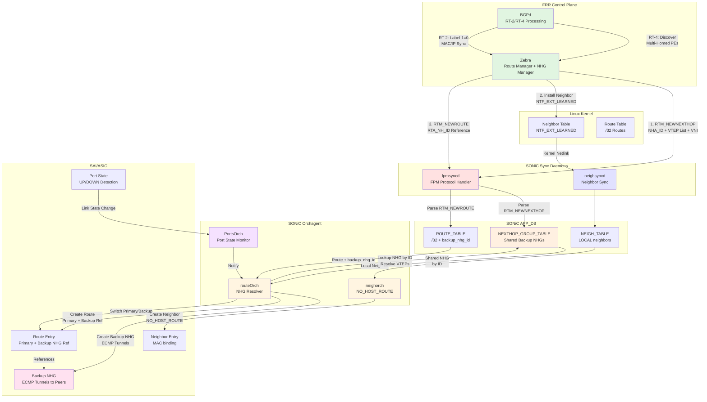

# L3MH support with Backup tunnel in IP-DC

**Version**: 1.0  
**Author**: FRR Development Team  
**Date**: April 21, 2026  
**Status**: Design Document  
**Reference**: [IETF draft-ietf-bess-evpn-l3mh-proto](https://datatracker.ietf.org/doc/draft-ietf-bess-evpn-l3mh-proto/)

---

## 1. Revision

| Version | Date | Author | Changes |
|---------|------|--------|---------|  
| 1.0 | April 21, 2026 | Patrice Brissette | Initial design document |

---

## 2. Scope

This HLD defines the FRR implementation for **EVPN VXLAN Layer-3 Multi-Homing** operating in the **global routing table** without L2VNI or VRF requirements, using **backup multi-ECMP tunnels** for automatic failover.

This document covers the following components and features:

**EVPN Control Plane**:
- RT-4 (Ethernet Segment routes) processing for multi-homing PE discovery
- RT-2 (MAC/IP routes with Label-1=0) for ARP/ND neighbor synchronization
- RD format: `router-id:L3VNI` for global routing table operation
- RT import/export using ESI-based route targets (Type 1)

**Data Plane**:
- Backup nexthop group (NHG) creation and management
- ECMP backup tunnel forwarding to multi-homed peer VTEPs
- Automatic failover using hardware-based backup NHG switching
- Proxy ARP/NDP for neighbor reachability across multi-homed PEs

**Multi-Homing Architecture**:
- All-active L3 multi-homing (no DF election required)
- Global L3VNI operation in default routing table
- ESI configuration on bond interfaces
- Multi-PE synchronization without L2 bridging

**Integration**:
- FRR BGP EVPN implementation (bgpd)
- SONiC FPM (Forwarding Plane Manager) protocol
- Kernel neighbor table management (neighsyncd)

---

## 3. Definitions/Abbreviations

| Term | Definition |
|------|------------|
| **RT-2** | EVPN Route Type 2 (MAC/IP Advertisement) |
| **RT-4** | EVPN Route Type 4 (Ethernet Segment Route) |
| **ESI** | Ethernet Segment Identifier (10-byte identifier for multi-homed segment) |
| **L3VNI** | Layer-3 VNI (VXLAN Network Identifier for L3 routing) |
| **L2VNI** | Layer-2 VNI (VXLAN Network Identifier for L2 bridging) |
| **NHG** | Nexthop Group (ECMP group for backup tunnels) |
| **VTEP** | VXLAN Tunnel Endpoint |
| **PE** | Provider Edge (leaf switch in multi-homing context) |
| **DF** | Designated Forwarder (not used in L3-only multi-homing) |
| **FPM** | Forwarding Plane Manager (FRR to SONiC communication protocol) |
| **RD** | Route Distinguisher (format: router-id:L3VNI for this design) |
| **IP-DC** | IP Data Center (pure Layer-3 environment) |
| **MH** | Multi-Homing |
| **Proxy ARP/NDP** | Kernel feature to respond to ARP/ND requests on behalf of neighbors |

---

## Table of Contents

1. [Revision](#1-revision)
2. [Scope](#2-scope)
3. [Definitions/Abbreviations](#3-definitionsabbreviations)
4. [Overview](#4-overview)
5. [Requirements](#5-requirements)
6. [Architecture Design](#6-architecture-design)
7. [High-Level Design](#7-high-level-design)
8. [Configuration](#8-configuration)
9. [Restrictions/Limitations](#9-restrictionslimitations)

---

## 4. Overview

This document defines the architecture and implementation for **EVPN VXLAN Multi-Homing (MH)** in FRR that operates in the **global routing table** without requiring:
- ❌ **L2VNI configuration** (no bridge VNI mapping)
- ❌ **VRF configuration** (operates in default/global routing table)

Instead, the design leverages:
- ✅ **Global L3VNI** - Single L3VNI in global routing table for all EVPN operations
- ✅ **RT-4 (Ethernet Segment Routes)** - For multi-homing PE discovery and synchronization
- ✅ **RT-2 (MAC/IP Routes)** - For neighbor state synchronization without L2 data plane
- ✅ **No VRF Complexity** - Operates in global routing table, no VRF/L2VNI overhead
- ✅ **Layer-3 Only** - Pure L3 multi-homing as per IETF draft-ietf-bess-evpn-l3mh-proto

---

### Problem Statement

**Traditional EVPN VXLAN Multi-Homing** requires:
- **L2VNI per VLAN** - Bridge VNI mapping, RT-3 (IMET) routes, L2 flooding domain
- **VRF per Tenant** - VRF configuration, L3VNI per VRF, route leaking complexity
- **Configuration Overhead** - ~30 lines vs ~15 lines for this design

**What IP-only Data Centers Need**:
- No L2 extension - pure L3 routing
- ARP/ND synchronization across multi-homed PEs
- Sub-second failover without control plane delay
- Single global routing table (no VRF overhead)
- Route separation: /24 prefixes via IPv4/IPv6 unicast, /32 via EVPN RT-2

**Solution**: RT-4 (multi-homing) + RT-2 (neighbor sync) in **global routing table** without L2VNI, with automatic backup nexthop groups.

---

### Target Use Case

**IP Data Center (IP-DC) with L3 Multi-Homing**

Modern data centers with pure Layer-3 connectivity where:
- **No L2 extension** - Each rack/pod is a distinct L3 boundary
- **L3 Multi-Homing** - Multi-homed servers/ToRs for high availability
- **IPv4/IPv6 unicast routing** - Standard BGP for prefix reachability (/24, /48)
- **ARP/ND synchronization** - RT-2 for neighbor state sync (/32, /128)
- **No tenant isolation** - Single routing domain (hyperscale DC model)

**Multi-Homing Model**:
- Hosts connected to multiple leaves in all-active mode
- Primary forwarding via local interface
- VXLAN backup tunnels activated only when local access fails
- Sub-second failover without control plane delay

---

### Implementation: Core Pillars

This design is built on **Five Key Pillars**:

1. **L2VNI Removal**:
   - RT-2 routes processed **without L2VNI context** (Label-1 = 0)
   - No bridge FDB entries created from EVPN
   - RT-2 neighbors: Installed as **IP neighbors** (L3 routing table), not as **FDB entries** (L2 bridge table)

2. **Multi-Homing with LOCAL Neighbors + Backup Paths**:
   - Neighbors programmed as **LOCAL** (not remote) - primary path to local interface
   - **Backup nexthop groups**: ECMP tunnels to peer VTEPs for automatic failover
   - **Sub-sec convergence**: Data plane failover without BGP control plane delay

3. **Neighbor + Route Separation**:
   - **Neighbor installation**: Via kernel path (zebra → kernel → neighsyncd)
     - FRR installs neighbors with `NTF_EXT_LEARNED` flag (kernel)
     - SONiC neighorch uses SAI `NO_HOST_ROUTE` attribute (prevents automatic /32 route)
   - **Route installation**: Via FPM path (zebra → fpmsyncd) with backup nexthop groups
   - **Independent processing**: Neighbor and route work together but installed separately

4. **SVI in Global Routing Table**:
   - SVIs operate in default VRF (no VRF binding)
   - Direct operation in global routing table
   - **Proxy ARP/ND on SVI**: Handles ARP requests for both local and peer-connected hosts
     - No L2VNI = no ARP flooding over VXLAN
     - SVI responds to ARP for all hosts in multi-homed segment
     - Configured via `sysctl` kernel parameters

5. **RT-4 Builds Multi-Homing Topology**:
   - RT-4 routes discover multi-homing peers (same ESI)
   - FRR embeds peer VTEP list in RT-2 routes
   - Split-horizon enforcement in FRR control plane
   - SONiC receives RT-2 with peer VTEP list for backup nexthop group creation

### Flow Comparison

**Global L3VNI (This Design) - Multi-Homing with Backup Paths**:
```
RT-2 (Label-1=0) → FRR → Zebra → ┬─→ Kernel (NTF_EXT_LEARNED) → neighsyncd → NEIGH_TABLE
                                 │                                                ↓
                                 │                                    neighorch (SAI NO_HOST_ROUTE)
                                 │
                                 └─→ FPM → fpmsyncd → ROUTE_TABLE (backup nexthops: peer VTEPs, backup_vni)
                                                            ↓
                                                       routeOrch (creates /32 route with backup NHG)
```

**Traditional EVPN (L2VNI) - Dual Path (L2 + L3)**:
```
RT-2 (Label-1=10100, Label-2=5000) → FRR → Zebra → FPM → fpmsyncd ┬→ VXLAN_FDB_TABLE → fdborch
                                                                    │         ↓
                                                                    │    L2 bridge FDB entry (MAC → tunnel)
                                                                    │
                                                                    └→ NEIGH_TABLE → neighorch
                                                                              ↓
                                                                         IP neighbor + /32 route
```

### Quick Comparison

| Aspect | Traditional EVPN MH | This Design |
|--------|---------------------|-------------|
| **VRF Required** | Yes (per tenant) | ❌ No (global table) |
| **L2VNI Required** | Yes (per VLAN) | ❌ No (L3 only) |
| **RT-2 Label-1** | L2VNI value | **0 (Explicit NULL)** |
| **Configuration** | ~30 lines | **~15 lines** |
| **Backup Failover** | Optional | ✅ Built-in (<500ms) |

---

## 5. Requirements

This section defines the **functional** and **non-functional requirements** for EVPN L3 Multi-Homing in the global routing table (per IETF draft-ietf-bess-evpn-l3mh-proto).

---

### Functional Requirements

#### FR1: Multi-Homing Support (RT-4)

**Description**: Support EVPN multi-homing without L2VNI using RT-4 (Ethernet Segment) routes.

**Details**:
- **RT-4 Advertisement**: When an interface with ESI is configured, advertise RT-4 route with ESI-based RT
- **RT-4 Reception**: Discover remote PEs attached to same Ethernet Segment
- **Split-Horizon**: Prevent proxy re-advertisement of routes from multi-homed peers (based on ESI)
- **Fast Convergence**: Detect PE failure via RT-4 withdrawal
- **All-Active**: All PEs advertise RT-2 routes (no DF election needed for L3-only)

**IETF Reference**: RFC 7432 Section 7.6 (ESI-based Route Target), RFC 8365 Section 8 (Ethernet Segment Route)

#### FR2: Neighbor Synchronization (RT-2)

**Description**: Synchronize ARP/ND entries across multi-homed PEs using RT-2 routes.

**Details**:
- **RT-2 Advertisement**: Advertise local ARP/ND entries as RT-2 routes
- **RT-2 Reception**: Install remote RT-2 routes into kernel neighbor table
- **MAC+IP Required**: Both MAC and IP address must be present
- **No L2 Data Plane**: RT-2 used for control plane sync only (Label-1 = Explicit NULL)
- **Per-VLAN Granularity**: Use ETAG field to represent VLAN ID
- **Dual Route Targets (L3MH)**:
  - **ESI-RT**: Auto-derived from ESI (RFC 7432 Section 7.6) for MH peer route exchange
  - **EVI-RT**: Configured AS:L3VNI for route distribution

**IETF Reference**: draft-ietf-bess-evpn-l3mh-proto Section 4.1, RFC 7432 Section 7.6

#### FR3: Global Routing Table Operation

**Description**: All EVPN operations occur in global routing table without VRF.

**Details**:
- **No VRF Configuration**: Eliminate `vrf <name>` requirement
- **Single L3VNI**: One global L3VNI for all EVPN operations
- **Route Installation**: RT-2/RT-4 routes installed in default table
- **VTEP in Global Table**: VTEP IP address reachable via global BGP
- **No Route Leaking**: Direct operation in global table (VRF ↔ GRT redistribution eliminated)
- **Routing Separation**:
  - **/24, /48 prefixes**: IPv4/IPv6 unicast BGP in GRT (actual traffic forwarding)
  - **/32, /128 host routes**: EVPN RT-2 in GRT (neighbor sync only, confined to EVPN peering)
  - **Memory benefit**: /32 routes only exist where BGP EVPN sessions established

#### FR4: No L2VNI Requirement

**Description**: Eliminate L2VNI configuration dependency for VXLAN.

**Details**:
- **No Bridge VNI Mapping**: No `bridge-vlan-vni-map` configuration for VXLAN
- **No RT-3 Routes**: No IMET route generation (control plane only)
- **No L2 VXLAN Data Plane**: No BUM traffic over VXLAN tunnels
- **RT-2 Without L2VNI**: Generate RT-2 routes without L2VNI context
- **Local Bridge Domain Still Exists**: Bridge domain present for local host connectivity
  - **SVI serves as gateway** for hosts (e.g., bond0 with IP address)
  - **ARP/ND Proxy**: Enable on SVI to answer ARP requests locally
  - **No L2 extension** across VXLAN tunnels (L3 routing only)
  - **All ARP/ND traffic** handled by local SVI (prevents flooding)
  - **Proxy ARP/ND Required**: SVI must have proxy ARP/NDP enabled (via sysctl) to respond to ARP requests for hosts on peer leafs

#### FR5: Simplified Configuration

**Description**: Minimal FRR configuration for EVPN MH enablement in global routing table.

**Details**:
- **Global Config**: Single FRR command `evpn global-vni <vni>` to enable EVPN
  - **CRITICAL - L3VNI COORDINATION**: VNI value must match SONiC's L3VNI configuration
    * **FRR role**: Control plane - BGP RT-2/RT-4 processing, route import/export
    * **SONiC role**: Data plane - VXLAN encap/decap, ASIC tunnel mapping  
    * **Example**: FRR `evpn global-vni 5000` MUST match SONiC `config vxlan map add vtep default 4000 5000` (VNI=5000)
    * **Mismatch consequence**: EVPN routing failures
  - **Dependency**: SONIC configures L3VNI at system level (VXLAN tunnel mapping)
  - **Validation**: FRR should validate VNI matches kernel/SONIC configuration
  
> **Note - SONiC Dummy VLAN**: SONiC requires a "dummy VLAN" for ASIC L3VNI decapsulation context (e.g., Vlan4000). This is a **SONiC/ASIC implementation detail** - FRR does not configure or know about this VLAN. User must create it in SONiC: `config vlan add 4000; config interface vlan add Vlan4000; config vxlan map add vtep default 4000 5000`.

- **Interface ESI**: Standard ESI configuration on physical/bond interfaces
- **Backward Compatible**: Coexist with traditional EVPN configurations

#### FR6: Memory and Route Efficiency

**Description**: Optimize memory usage by confining /32 host routes to EVPN domain.

**Details**:
- **Route Scope Separation**:
  - **/24, /48 subnet routes**: Advertised via IPv4/IPv6 unicast BGP to ALL peers
  - **/32, /128 host routes**: Advertised via EVPN RT-2 ONLY to BGP EVPN peers
- **Memory Benefit**: /32 routes only installed on PEs with active BGP EVPN sessions
- **No Route Leaking**: Eliminates VRF ↔ GRT redistribution overhead
- **Efficient Lookup**: /32 routes in kernel neighbor table, /24 routes in FIB

**Example**:
```
Pod-1 Subnet: 192.168.100.0/24
  - /24 route: Advertised to ALL BGP peers (IPv4 unicast)
  - Host-1: 192.168.100.10/32 → Advertised ONLY to EVPN peers (RT-2)
  - Host-2: 192.168.100.20/32 → Advertised ONLY to EVPN peers (RT-2)
  
Non-EVPN spines/routers:
  - Have: 192.168.100.0/24 route (for forwarding)
  - No: /32 host routes (not needed, saves memory)

EVPN-enabled leaves:
  - Have: 192.168.100.0/24 route (for forwarding)
  - Have: /32 host routes (for ARP/ND sync and fast failover)
```

### Non-Functional Requirements

#### NFR1: Performance

- **Route Scale**: Support 10K+ RT-2 routes (neighbor entries)
- **RT-4 Processing**: Sub-second ES discovery
- **Failover Time**: < 500ms for link failure (data plane backup path activation)
- **All-Active**: No DF election delay (all PEs active simultaneously)

#### NFR2: Interoperability

- **Standards Compliance**: Follow RFC 8365 (EVPN) and draft-ietf-bess-evpn-l3mh-proto
- **Vendor Interop**: Interoperate with Arista/Cisco/Juniper implementations

#### NFR3: Operational

- **Debuggability**: Clear logging and show commands
- **Monitoring**: Counters for RT-2/RT-4 routes
- **Configuration Validation**: Prevent invalid configurations

---

## 6. Architecture Design

### 6.1. Multi-Homing Architecture

This design implements **all-active Layer-3 multi-homing** (no DF election or L2 forwarding requirements).

### Conceptual Model

```
                         Spine Layer
                              │
         ┌────────────────────┼────────────────────┐────────────────────┐
         │                    │                    │                    |
      Leaf-1              Leaf-2              Leaf-3              Leaf-4
   10.0.0.1             10.0.0.2             10.0.0.3             10.0.0.4
   (Active)             (Active)             (Active)             (Active)
         │                    │                    │                    │
         └────────────────────┴────────────────────┴────────────────────┘
                                    │
                           ESI: 01:11:11:11:11:11:11:11:11:11
                                    │
                                  Host
                          192.168.100.10 (aa:bb:cc:dd:ee:ff)
```

**All-Active Characteristics**:
- All PEs connected to same host are active simultaneously
- Each PE advertises RT-2 routes independently
- **No DF election** - not needed (no BUM traffic in L3-only)
- Automatic failover via backup nexthop groups

### Backup Nexthop Groups

Each leaf programs the same neighbor with different backup paths:

| Leaf | Neighbor Entry | Primary Path | Backup Nexthop Group |
|------|----------------|--------------|----------------------|
| Leaf-1 | 192.168.100.10 → LOCAL | bond0 (direct) | ECMP: {Tunnel→Leaf2, Tunnel→Leaf3, Tunnel→Leaf4} |
| Leaf-2 | 192.168.100.10 → LOCAL | bond0 (direct) | ECMP: {Tunnel→Leaf1, Tunnel→Leaf3, Tunnel→Leaf4} |
| Leaf-3 | 192.168.100.10 → LOCAL | bond0 (direct) | ECMP: {Tunnel→Leaf1, Tunnel→Leaf2, Tunnel→Leaf4} |
| Leaf-4 | 192.168.100.10 → LOCAL | bond0 (direct) | ECMP: {Tunnel→Leaf1, Tunnel→Leaf2, Tunnel→Leaf3} |

**Key Mechanism**: RT-4 routes build ESI-to-VTEP mapping, creating one shared backup NHG per ESI. RT-2 routes reference this NHG by ID for efficient failover.

### Why No DF Election

| Aspect | L2 EVPN (Traditional) | L3 EVPN (This Design) |
|--------|----------------------|----------------------|
| **DF Election** | Required (BUM traffic) | Not needed (no BUM) |
| **Forwarding** | L2 bridging | L3 routing |
| **Active PEs** | Some active, some standby | All active |
| **Failover** | DF re-election (~1-2s) | Data plane (<500ms) |
| **Backup Paths** | Optional (with FRR) | Built-in (automatic) |

---

### 6.2. Architecture Overview

This design uses a **neighbor + route separation** architecture where:
- **Neighbor installation**: Via kernel path (zebra → kernel with NTF_EXT_LEARNED → neighsyncd)
  - SONiC neighorch applies SAI NO_HOST_ROUTE attribute to prevent automatic /32 route creation
- **Route installation**: Via FPM path (zebra → fpmsyncd) with backup nexthop groups
- **Port state monitoring**: ASIC detects link state, triggers primary/backup selection



**Four-Path Architecture**:

1. **PATH 1 (Red)** - NHG Creation (RTM_NEWNEXTHOP):
   - RT-4 routes discover multi-homed peers → Zebra builds VTEP list per ESI
   - Zebra → FPM: `RTM_NEWNEXTHOP` (NHA_ID, NHA_GROUP with VTEPs, NHA_ENCAP with VNI)
   - fpmsyncd → NEXTHOP_GROUP_TABLE (stores shared backup NHG by ID)
   - routeOrch → SAI: Creates backup NHG (ECMP tunnels to peer VTEPs)
   - **Frequency**: Once per ESI (shared by all routes for that ESI)
   - Result: Shared backup NHG created in hardware, ready for route references

2. **PATH 2 (Blue)** - Kernel/neighsyncd - Neighbor Installation:
   - FRR → Zebra → Linux kernel neighbor table (with `NTF_EXT_LEARNED` flag) → neighsyncd
   - neighsyncd → NEIGH_TABLE → neighorch → SAI neighbor entry
   - SAI attribute: `NO_HOST_ROUTE` = true (SONiC prevents automatic /32 route creation)
   - Result: Neighbor exists in hardware but **no /32 route created**

3. **PATH 3 (Red)** - FPM/fpmsyncd - Route Installation with NHG Reference:
   - FRR → Zebra → FPM: `RTM_NEWROUTE` (RTA_DST, RTA_OIF primary, RTA_NH_ID backup reference)
   - fpmsyncd → ROUTE_TABLE (with backup_nhg_id field referencing shared NHG)
   - routeOrch: Resolves NHG ID → Looks up NEXTHOP_GROUP_TABLE → Creates route with backup NHG reference
   - **Frequency**: Per host route (many routes share same NHG ID)
   - Result: /32 route with automatic failover to pre-created backup NHG

4. **PATH 4 (Purple)** - ASIC/PortsOrch - Interface State Changes:
   - ASIC detects physical port state change (link UP/DOWN)
   - SAI → syncd → PortsOrch notification
   - PortsOrch notifies routeOrch of port state change
   - Triggers: Primary vs backup path selection in hardware

5. **CONVERGENCE** - NHG + Neighbor + Route Work Together:
   - routeOrch creates shared backup NHG (PATH 1) - one per ESI
   - neighorch installs neighbor (PATH 2) - MAC binding only
   - routeOrch installs /32 route with primary + backup NHG reference (PATH 3)
   - PortsOrch monitors interface state (PATH 4)
   - Hardware automatically switches: Port UP → primary, Port DOWN → backup NHG

**Key Optimization**: NHG ID reference approach (section 6.4) provides O(ESIs) scalability instead of O(routes) - critical for thousands of hosts per Ethernet Segment.

---

#### 1. L3VNI in Global Routing Table - **NEW ENHANCEMENT**

**Existing Functionality**:
- L3VNI already supported in FRR (zebra + bgpd)
- Currently requires VRF configuration: `vrf <name>` + `vni <vni>`
- RT-2/RT-5 route generation for L3VNI context

**New Enhancement**: Support L3VNI in **global routing table**
- Add `evpn global-vni <vni>` CLI (zebra)
- Configure L3VNI without VRF requirement
- Maintain VTEP in global table
- Handle RT import/export with AS:VNI format

**Configuration**:
```bash
# NEW: Global command - no VRF needed
evpn global-vni 5000
  route-target both 65000:5000
```

**Note**: VTEP IP is automatically derived from the L3VNI VXLAN tunnel source interface (typically loopback).

**Impact**: 
- **Zebra**: Add global EVPN context (`struct zebra_evpn_global`)
- **BGPd**: Accept L3VNI without VRF binding

---

#### 2. EVPN Multi-Homing (Zebra EVPN MH) - **EXISTING, NO CHANGE**

**Existing Functionality**:
- ESI configuration: `evpn mh es-id <esi>`
- RT-4 route generation for ES discovery
- DF election algorithm (RFC 8584)
- Split-horizon filtering
- ES tracking and remote PE discovery

**Usage in This Design**: **Use as-is**
- Interface ESI configuration unchanged
- RT-4 processing works with global L3VNI
- DF election logic unchanged

**Configuration**:
```bash
interface bond0
  evpn mh es-id 01:11:11:11:11:11:11:11:11:11  # EXISTING CLI
  evpn mh es-sys-mac aa:bb:cc:00:00:01          # EXISTING CLI
```

**Impact**: **None** - Existing code supports this use case

---

#### 3. RT-2 Neighbor Synchronization (Zebra + BGPd) - **ENHANCEMENT REQUIRED**

**Existing Functionality**:
- RT-2 generation for MAC/IP (requires L2VNI context)
- Neighbor learning from kernel (netlink)
- RT-2 processing in BGPd (l2vpn evpn address-family)

**New Enhancement**: RT-2 **without L2VNI** for neighbor sync only
- Generate RT-2 with **Label-1 = 0** (Explicit NULL, no L2 data plane)
- Use global L3VNI as Label-2
- Extract VLAN ID from interface name for ETAG field
- Install remote RT-2 into kernel neighbor table (not bridge FDB)

**Processing Flow**:
```
Local Neighbor Learn:
  Kernel → Zebra → BGP → RT-2 Advertisement (Label-1=0, Label-2=L3VNI)
  
Remote Neighbor Learn:
  RT-2 Reception → BGP → Zebra → Kernel Neighbor Table (no FDB)
```

**Impact**: 
- **Zebra**: Modify RT-2 generation to support Label-1=0 mode
- **BGPd**: Accept RT-2 without L2VNI, install as neighbor entry (not FDB)

---

#### 4. VXLAN Data Plane (Linux Kernel) - **EXISTING, NO CHANGE**

**Existing Functionality**:
- VXLAN encap/decap with L3VNI (Linux kernel VXLAN driver)
- FRR already programs VXLAN tunnels via netlink
- L3VNI routing through SVI

**Usage in This Design**: **Use as-is**
- VXLAN encapsulation unchanged
- L3VNI routing works in global table
- No L2 VXLAN tunnels (no L2VNI)

**Impact**: **None** - Existing kernel VXLAN support sufficient

---

### Summary of Required Changes

| Component | Change Type | Effort |
|-----------|-------------|--------|
| **Zebra**: Global L3VNI config | New CLI + data structure | Medium |
| **Zebra**: RT-2 without L2VNI | Modify existing RT-2 generation | Medium |
| **BGPd**: Global L3VNI support | Modify existing L3VNI logic | Low |
| **BGPd**: RT-2 Label-1=0 handling | Modify existing RT-2 processing | Medium |
| **EVPN MH (ES/RT-4)** | **No change** | **None** |
| **VXLAN Data Plane** | **No change** | **None** |

**Key Insight**: Most EVPN infrastructure already exists. This design requires **targeted enhancements** to:
1. Decouple L3VNI from VRF (operate in global routing table)
2. Support RT-2 neighbor sync without L2VNI (Label-1=0)
3. Enable ECMP backup nexthop groups for automatic failover

---

### 6.3. EVPN Route Type Usage

### RT-4: Ethernet Segment Route

**Purpose**: Discover PEs attached to the same Ethernet Segment (multi-homing).

#### RT-4 Route Structure

```
EVPN Type-4 (Ethernet Segment) Route:
┌──────────────────────────────────────────────────────┐
│ 1. RD (Route Distinguisher):  <router-id>:0          │
│ 2. ESI (Ethernet Segment ID):  01:11:11:....:11      │
│ 3. Originating Router's IP:    <vtep-ip>             │
│ 4. Route Target:                ESI-based RT         │
└──────────────────────────────────────────────────────┘
```

#### Field Details

| Field | Value | Purpose |
|-------|-------|---------|
| **RD** | `<router-id>:0` | `<router-id>:0` format (0 = ES route, not tied to specific VNI) |
| **ESI** | `01:11:11:11:11:11:11:11:11:11` | Identifies the Ethernet Segment |
| **Originating Router IP** | `10.0.0.1` (VTEP) | Remote PE's VTEP address |
| **Route Target** | **ESI-derived** (RFC 7432) | Auto-generated from ESI |

**Note on RT-4 RD**: RT-4 uses `<router-id>:0` format because:
- RT-4 advertises **ES membership**, not specific routes in a VNI
- The `0` indicates this is an ES-level route (not VNI-specific)
- Different from RT-2 which uses `<router-id>:<L3VNI>` to correlate with EVPN instance

#### RT-4 Processing

**Purpose**: Discover remote PEs on same ES, create backup nexthop groups.

**Key Operations**:
- **Outbound**: Advertise local ES membership with VTEP IP
- **Inbound**: Build ESI-to-VTEP mapping, create shared backup NHG per ESI
- **Split-horizon**: Track MH peers to prevent RT-2 proxy re-advertisement

---

### RT-2: MAC/IP Advertisement Route (Without L2VNI)

**Purpose**: Synchronize neighbor state (ARP/ND) across multi-homed PEs without L2 data plane.

#### RT-2 Route Structure

```
EVPN Type-2 (MAC/IP Advertisement) Route:
┌──────────────────────────────────────────────────────┐
│ 1. RD (Route Distinguisher):  <router-id>:<L3VNI>    │
│ 2. ESI (Ethernet Segment ID):  <from interface>      │
│ 3. ETAG (Ethernet Tag):         <vlan-id>            │
│ 4. MAC Address Length:          48                   │
│ 5. MAC Address:                 aa:bb:cc:dd:ee:ff    │
│ 6. IP Address Length:           32 or 128            │
│ 7. IP Address:                  192.168.100.10       │
│ 8. MPLS Label1:                 0 (Explicit NULL)    │
│ 9. MPLS Label2:                 5000 (L3VNI)         │
│10. Route Targets (L3MH):                             │
│    - ESI-RT:                    ESI-derived          │
│    - EVI-RT:                    <AS>:<L3VNI>         │
└──────────────────────────────────────────────────────┘
```

#### Route Distinguisher (RD) Format

**Format**: `<router-id>:<L3VNI>`

**Purpose**: Makes each RT-2 route globally unique in the BGP EVPN address family.

**Construction**:
- **Router-ID**: BGP router-id of the advertising PE (e.g., `10.0.0.1`)
- **L3VNI**: Global L3VNI value (e.g., `5000`)
- **Result**: RD = `10.0.0.1:5000`

**Why This Format?**:

1. **Uniqueness Guarantee**: Even if multiple PEs advertise the same MAC/IP (multi-homed host), each route has a unique RD
   - Leaf-1: RD = `10.0.0.1:5000`
   - Leaf-2: RD = `10.0.0.2:5000`
   - Leaf-3: RD = `10.0.0.3:5000`
   - Same host, different RDs → BGP can maintain all paths

2. **L3VNI Correlation**: RD includes L3VNI, making it easy to identify which EVPN instance the route belongs to
   - All routes for Global L3VNI 5000 have `:5000` in RD
   - Simplifies troubleshooting and filtering

3. **BGP Best Path Selection**: Multiple paths for same MAC/IP can coexist in BGP RIB
   - BGP compares routes with different RDs
   - Enables ECMP for multi-homed hosts
   - Each PE's advertisement is visible and selectable

**Example**: Multi-homed host `192.168.100.10` attached to Leaf-1, Leaf-2, Leaf-3:
```
BGP RIB on Leaf-4:
  Route Distinguisher: 10.0.0.1:5000
    [2]:[01:11:11:11:11:11:11:11:11:11]:[100]:[48]:[aa:bb:cc:dd:ee:ff]:[32]:[192.168.100.10]
      Next-hop: 10.0.0.1 (Leaf-1 VTEP)
      
  Route Distinguisher: 10.0.0.2:5000
    [2]:[01:11:11:11:11:11:11:11:11:11]:[100]:[48]:[aa:bb:cc:dd:ee:ff]:[32]:[192.168.100.10]
      Next-hop: 10.0.0.2 (Leaf-2 VTEP)
      
  Route Distinguisher: 10.0.0.3:5000
    [2]:[01:11:11:11:11:11:11:11:11:11]:[100]:[48]:[aa:bb:cc:dd:ee:ff]:[32]:[192.168.100.10]
      Next-hop: 10.0.0.3 (Leaf-3 VTEP)
```

All three routes imported (via ESI-RT and EVI-RT), ECMP forwarding possible.

#### Field Details

| Field | Value | Purpose |
|-------|-------|---------|
| **RD** | `10.0.0.1:5000` | `<router-id>:<L3VNI>` - Ensures route uniqueness per PE, enables ECMP |
| **ESI** | `01:11:11:11:11:11:11:11:11:11` | Associates MAC/IP with ES |
| **ETAG** | `100` or `0` | VLAN ID (100) for multi-VLAN, or 0 for single-VLAN/untagged |
| **MAC** | `aa:bb:cc:dd:ee:ff` | Host MAC address |
| **IP** | `192.168.100.10` | Host IP address |
| **Label-1** | `0` | **Explicit NULL** (no L2 data plane) |
| **Label-2** | `5000` | Global L3VNI for routing |
| **ESI-RT** | ESI-derived (RFC 7432) | Ensures MH peers import routes for same ES |
| **EVI-RT** | `65000:5000` | Global L3VNI-based RT for EVPN domain |

#### Critical Design Choice: Label-1 = Explicit NULL

**Why Explicit NULL?**
- Signals **no L2VNI data plane** to receiving PE
- Prevents remote PE from attempting L2 forwarding
- Differentiates from traditional RT-2 (which uses L2VNI as Label-1)
- Indicates **control plane only** RT-2 for neighbor sync

#### Critical Design Choice: Dual Route Targets (ESI-RT + EVI-RT)

**Why Two Route Targets?**

Per draft-ietf-bess-evpn-l3mh-proto, RT-2 routes in L3MH scenarios carry **two Route Targets**:

1. **ESI-based Route Target (ESI-RT) / ES-Import RT**:
   - Auto-derived from ESI (RFC 7432 Section 7.6: ES-Import extended community, Type 0x06:0x02)
   - Encoding: Uses last 6 bytes of the 10-byte ESI as the 6-byte RT value
   - Example: ESI `01:11:11:11:11:11:11:11:11:11` → ES-Import RT `11:11:11:11:11:11`
   - Purpose: Ensures **RT-2 routes are exchanged** between multi-homed peers (leaves with same ESI)
   - Behavior: PEs with same ESI import these routes for local forwarding
   - Import: Yes - multi-homed PEs import each other's RT-2 routes via ESI-RT
   - Re-advertisement: No - split-horizon filter prevents proxy re-advertising (based on ESI match)

2. **EVI Route Target (EVI-RT)**:
   - Configured value: AS:L3VNI (e.g., 65000:5000)
   - Purpose: Ensures **route distribution** across entire EVPN domain
   - Behavior: Standard EVPN route import/export
   - Import: All PEs participating in the L3VNI

**Example**:
```
RT-2 for Host on ESI 01:11:11:11:11:11:11:11:11:11:
  Extended Communities:
    - ES-Import RT: 11:11:11:11:11:11 (derived from last 6 bytes of ESI per RFC 7432)
    - EVI-RT: 65000:5000 (configured L3VNI RT)
  
  Import Behavior:
    - All PEs import via EVI-RT (route distribution)
    - Multi-homed PEs also import via ESI-RT (ensures MH peers get each other's routes)
    - ESI-RT match confirms: "this route is for a host on my multi-homed ES"
  
  Re-advertisement Behavior:
    - Non-MH PEs: Re-advertise normally
    - Multi-homed PEs: DON'T proxy re-advertise (split-horizon via ESI match)
```

**Benefit**: This dual-RT approach provides both wide distribution (EVI-RT) and targeted MH peer exchange (ESI-RT) without additional configuration. ESI-RT ensures multi-homed leaves import each other's RT-2 routes for local forwarding, while split-horizon filter (based on ESI match) prevents proxy re-advertisement to other BGP peers.

#### RT-2 Processing

**Purpose**: Synchronize neighbor state across multi-homed PEs.

**Key Operations**:
- **Outbound**: Advertise local neighbors with Label-1=0 (no L2 data plane)
- **Inbound**: Install as neighbor (kernel path) + route with backup NHG (FPM path)
- **Split-horizon**: Don't proxy re-advertise routes from MH peers (same ESI)

**Neighbor + Route Separation**:
- PATH 1: Neighbor via kernel (neighsyncd → SAI NO_HOST_ROUTE)
- PATH 2: Route via FPM (routeOrch → backup NHG)

---

### 6.4. FPM Protocol Specification for Backup NHG

**Protocol: RTM_NEWNEXTHOP + RTM_NEWROUTE (Linux Kernel 5.3+)**

FRR zebra sends two netlink message types to SONiC via FPM for EVPN multi-homing:

#### Message Type 1: Create Shared Backup NHG (Once per ESI)

When RT-4 routes establish the multi-homed PE topology, FRR creates a shared backup nexthop group:

```
RTM_NEWNEXTHOP {
  NHA_ID = 100                    // Shared NHG identifier
  NHA_GROUP: [
    { nexthop=10.0.0.2, weight=1 }  // VTEP 1 (Leaf-2)
    { nexthop=10.0.0.3, weight=1 }  // VTEP 2 (Leaf-3)
    { nexthop=10.0.0.4, weight=1 }  // VTEP 3 (Leaf-4)
  ]
  NHA_GROUP_TYPE = 1              // Type: Protection/Backup group
  // Custom attribute for VXLAN encap:
  NHA_ENCAP = {
    type: VXLAN
    vni: 5000                     // L3VNI for tunnel encapsulation
  }
}
```

**Semantics**:
- **NHA_ID**: Unique identifier for this backup NHG (referenced by routes)
- **NHA_GROUP**: List of remote VTEP IPs (derived from RT-4 routes for same ESI)
- **NHA_GROUP_TYPE = 1**: Indicates backup/protection group (not standard ECMP)
- **NHA_ENCAP**: VXLAN metadata for tunnel nexthops (VNI must match L3VNI config)

**Frequency**: Sent once per ESI when first RT-4 route is received, updated when PE joins/leaves

#### Message Type 2: Install Route with Backup NHG Reference (Per Host)

When RT-2 routes arrive for multi-homed hosts, FRR installs /32 routes with backup:

```
RTM_NEWROUTE {
  RTA_DST = 192.168.100.10/32     // Host IP from RT-2
  RTA_OIF = bond0                 // Primary nexthop (local interface)
  RTA_NH_ID = 100                 // Reference to backup NHG created above
  // Flags indicate backup is available
}
```

**Semantics**:
- **RTA_DST**: Destination prefix (/32 for single-homed host)
- **RTA_OIF**: Primary nexthop interface (local multi-homed bond/LAG)
- **RTA_NH_ID**: Reference to shared backup NHG by ID (not inline VTEP list)
- **Implicit**: Route has primary (RTA_OIF) + backup (RTA_NH_ID) paths

**Frequency**: Sent for each host route learned via RT-2 (many routes, same NHG reference)

#### Scalability Comparison

**NHG ID Reference Approach** (Selected):
```
Topology: 1000 hosts on same ESI (4 multi-homed PEs)

FPM Messages Sent:
  1x RTM_NEWNEXTHOP { id=100, vteps=[10.0.0.2, 10.0.0.3, 10.0.0.4] }
  1000x RTM_NEWROUTE { prefix=X.X.X.X/32, backup_nhg_id=100 }

Total: 1001 messages
Data: 1 NHG object (~100 bytes) + 1000 route refs (~40 bytes each) = ~40KB
```

**Inline VTEP List Approach** (Rejected):
```
FPM Messages Sent:
  1000x RTM_NEWROUTE { 
    prefix=X.X.X.X/32, 
    backup_vteps=[10.0.0.2, 10.0.0.3, 10.0.0.4],
    vni=5000
  }

Total: 1000 messages
Data: 1000 × (prefix + VTEP list + VNI) = ~100KB
```

**Topology Update** (PE joins/leaves):
- **NHG approach**: Update 1 NHG, 1000 routes automatically use new topology
- **Inline approach**: Update all 1000 routes with new VTEP list

**Rationale**: O(ESIs) not O(routes) - critical for datacenter scale with thousands of hosts per Ethernet Segment.

#### SONiC Processing Pipeline

**fpmsyncd** receives both message types:
1. **RTM_NEWNEXTHOP** → Write to APP_DB.NEXTHOP_GROUP_TABLE
2. **RTM_NEWROUTE** → Write to APP_DB.ROUTE_TABLE with `backup_nhg_id` reference

**routeOrch** resolves references:
1. Read ROUTE_TABLE entry with `backup_nhg_id = "nhg_100"`
2. Lookup NHG-100 in NEXTHOP_GROUP_TABLE
3. Resolve VTEP IPs to tunnel nexthops
4. Program SAI route with primary + backup NHG

---

## 7. High-Level Design

### Data Structures

This design introduces one new data structure (`zebra_evpn_global`) and leverages existing EVPN MH structures (`zebra_evpn_es`, `zebra_evpn_es_pe`).

#### Global L3VNI Configuration - **NEW**

**Purpose**: Support L3VNI in global routing table without VRF dependency.

**Key Fields**:
- `l3vni` - Global L3VNI for all EVPN operations
- `rt` - Route Target for import/export (AS:VNI format)
- `vtep_ip` - VTEP source IP address (auto-derived from L3VNI tunnel source)
- `enabled` - Global EVPN enable/disable flag
- Statistics counters (RT-2/RT-4 TX/RX)
- `neigh_cache` - IP → MAC mapping cache
- `es_table` - Reference to existing ES infrastructure

#### Ethernet Segment Structures - **EXISTING**

**Status**: These structures already exist in FRR's EVPN MH implementation. No modifications required.

**Key Structures**:
- `zebra_evpn_es` - Ethernet Segment with ESI, local/remote PE lists, statistics
- `zebra_evpn_es_pe` - Remote PE information (VTEP IP, DF ordinal, last update time)

**Note**: DF-related fields (`is_df`, `df_pref`) are **not used** in this design (all-active L3-only mode).

#### ESI-to-NHG Mapping - **NEW (Minimal Addition)**

**Purpose**: Track backup nexthop group for each Ethernet Segment.

**Key Structure**:
```c
// bgpd/bgp_evpn_nhg.h - NEW FILE (~50 lines)
struct bgp_evpn_es_nhg {
    esi_t esi;           // Key: Ethernet Segment ID
    uint32_t nhg_id;     // Reference to zebra NHG (shared infrastructure)
    vni_t l3vni;         // L3VNI for VXLAN backup tunnels
    
    // No need to store VTEP list here!
    // Actual nexthop group stored in zebra's nhg_hash_entry
};

// Global hash table: ESI → NHG ID mapping
struct hash *bgp_es_nhg_table;
```

**Reuse of Existing FRR Infrastructure**:

FRR already has comprehensive nexthop group support that we **reuse** for backup NHGs:

| Component | Location | Status | Usage |
|-----------|----------|--------|-------|
| **Nexthop Group Structure** | `lib/nexthop_group.h` | ✅ Exists | REUSE `struct nexthop_group` |
| **Zebra NHG Manager** | `zebra/zebra_nhg.h` | ✅ Exists | REUSE `zebra_nhg_install()`, `zebra_nhg_delete()` |
| **NHG Type Enum** | `zebra/zebra_nhg.h` | ⚠️ Extend | ADD `NHG_TYPE_BACKUP` to existing enum |
| **Route with NHG Ref** | `zebra/zebra_rib.h` | ✅ Exists | REUSE `route_entry.nhe_id` |
| **ZAPI NHG Protocol** | `lib/zclient.h` | ✅ Exists | REUSE existing NHG messages |
| **FPM NHG Support** | `zebra/zebra_fpm_netlink.c` | ✅ Exists | REUSE netlink nexthop groups |

**New Fields Required** (minimal additions):

```c
// zebra/zebra_nhg.h - MODIFY existing enum
enum nhg_type {
    NHG_TYPE_STANDARD,      // Existing: Regular ECMP
    NHG_TYPE_RESILIENT,     // Existing: Resilient hashing
    NHG_TYPE_BACKUP,        // NEW: Backup/protection group for failover
};

// zebra/zebra_nhg.h - ADD to existing structure
struct nhg_hash_entry {
    // ... existing fields ...
    enum nhg_type type;      // Already exists, use NHG_TYPE_BACKUP
    
    // NEW: Metadata for backup NHG
    vni_t backup_vni;        // L3VNI for VXLAN encap (backup tunnels only)
    esi_t backup_esi;        // Which ESI this backs up (informational)
};

// zebra/zebra_rib.h - ADD to existing route structure
struct route_entry {
    // ... existing fields ...
    struct nexthop_group *ng;  // Primary nexthop (already exists)
    
    // NEW: Backup nexthop group reference
    uint32_t backup_nhg_id;    // Reference to backup NHG
    uint32_t flags;            // Already exists
#define ROUTE_ENTRY_HAS_BACKUP  (1 << 10)  // NEW flag bit
};
```

**Implementation Approach**:
- **~90% reuse**: Existing NHG infrastructure (creation, management, ZAPI, FPM)
- **~10% new**: ESI-NHG mapping table (~50 lines) + backup flag (~20 lines)
- **Total new code**: ~300-400 lines (mostly mapping logic + RT-4 hook)

---

### Configuration CLI

#### Global EVPN Configuration - **NEW CLI**

```bash
evpn global-vni <1-16777215>
  route-target both <AS:VNI>
```

**Example**:
```bash
evpn global-vni 5000
  route-target both 65000:5000
```

**Important Notes**:
- **VNI Matching**: The VNI value (5000) must match SONiC's L3VNI configuration
  - SONiC configures L3VNI: `config vlan add 4000; config interface vlan add Vlan4000; config vxlan map add vtep default 4000 5000`
  - VNI parameter (5000) must be identical in both FRR and SONiC
  - Misconfiguration will cause EVPN routes to fail
  - Consider adding runtime validation to detect mismatches
- **VTEP IP Derivation**: VTEP IP is automatically derived from the L3VNI VXLAN tunnel source interface (e.g., loopback used as tunnel source)

#### Ethernet Segment Configuration - **EXISTING CLI**

```bash
interface <ifname>
  evpn mh es-id <esi>
  evpn mh es-sys-mac <mac>
```

**Example**:
```bash
interface bond0
  evpn mh es-id 01:11:11:11:11:11:11:11:11:11
  evpn mh es-sys-mac aa:bb:cc:00:00:01
```

---

### Neighbor Processing Flow

**High-Level Flow**:

1. **Outbound (Local → RT-2 Advertisement)**:
   - Kernel neighbor update on ESI interface → Zebra detects
   - Zebra extracts: MAC, IP, VLAN ID, ESI from interface
   - Lookup backup NHG for this ESI: `nhg_id = lookup_esi_nhg(esi)`
   - Build RT-2 with Label-1=0 (Explicit NULL), Label-2=L3VNI
   - Send to BGP via ZAPI for advertisement

2. **Inbound (RT-2 Reception → Neighbor + Route Install)**:
   - BGP receives RT-2, checks Label-1==0 (neighbor sync mode)
   - Verify Label-2 matches global L3VNI
   - Extract MAC, IP, VLAN ID (from ETAG), ESI
   - Lookup backup NHG: `nhg_id = lookup_esi_nhg(esi)`
   - Send to Zebra via ZAPI for installation
   
   **Path 1: Neighbor Installation** (kernel path):
   - Zebra finds target interface by VLAN ID
   - Install neighbor into kernel with `NTF_EXT_LEARNED` flag
   - Skip bridge FDB install (no L2 data plane)
   - SONiC neighsyncd syncs to NEIGH_TABLE → neighorch (SAI NO_HOST_ROUTE)
   
   **Path 2: Route Installation with Backup** (FPM path):
   - Zebra installs /32 route with:
     * Primary nexthop: local interface (bond0)
     * Backup nexthop: NHG ID (reference, not embedded VTEP list)
     * Flag: `ROUTE_ENTRY_HAS_BACKUP`
   - FPM sends to SONiC: route + backup_nhg reference
   - SONiC routeOrch creates route with backup NHG
   
   **Split-horizon**: Verify ESI match (don't proxy re-advertise to BGP)

**Key Point**: Neighbor and route installed separately via different paths, both reference same shared backup NHG created by RT-4 processing.

### RT-4 Processing Flow

#### Outbound: ES Configuration → RT-4 Advertisement

**High-Level Flow**:

1. ESI configured on interface via CLI
2. Zebra creates or looks up Ethernet Segment structure
3. Adds interface to ES local interface list
4. Builds ESI-to-PE mapping for split-horizon
5. Generates RT-4 route:
   - RD: `<router-id>:0`
   - ESI: from configuration
   - Originating Router: local VTEP IP
   - Route Target: ESI-based (per RFC 7432)
6. Sends to BGP for advertisement

#### Inbound: RT-4 Reception → PE Discovery and NHG Creation

**High-Level Flow**:

1. Receive RT-4 route with ESI and remote VTEP IP
2. Create or lookup Ethernet Segment structure
3. Add remote PE to ES member list
4. Build ESI-to-PE mapping for split-horizon filtering
5. Create/update backup nexthop group:
   - Build NHG from ES remote PE list (exclude self)
   - Install NHG in zebra with type BACKUP
   - Store ESI → NHG ID mapping
   - Send NHG to SONiC via FPM protocol
6. No DF election (all-active L3 multi-homing)

---

### 7.1. Packet Flow and Forwarding

This section describes how traffic is forwarded to multi-homed hosts using the **primary + backup nexthop group** model.

#### Intra-Subnet Forwarding (Multi-Homed Hosts)

**Use Case**: Traffic to host in same subnet (e.g., Leaf-1 → 192.168.100.10 on same /24 subnet).

**Forwarding Behavior**:

1. **Lookup**: IP lookup matches /32 host route (RT-2 installed)
2. **Primary Path** (Local Link Up):
   - Nexthop: Local interface (e.g., bond0)
   - Action: Forward directly to host
   - No encapsulation (L2 forwarding on local link)
3. **Backup Path** (Local Link Down):
   - Hardware detects local link failure
   - Automatic switch to backup nexthop group
   - Nexthop: ECMP group of remote VTEPs (peers with same ESI)
   - Encapsulation: VXLAN (tunnel to peer leaf)
   - Convergence: <500ms (data plane only, no BGP wait)

**Key Mechanism**: Backup nexthop group is pre-programmed by FRR/SONiC when RT-4 routes are received. Hardware performs automatic failover without control plane involvement.

#### Inter-Subnet Forwarding (Different Subnets)

**Use Case**: Traffic between different subnets (e.g., 192.168.100.0/24 → 192.168.200.0/24).

**Forwarding Behavior**:

1. **Lookup**: IP lookup matches /24 subnet route (BGP IPv4 unicast)
2. **Nexthop**: Remote leaf (destination subnet's gateway)
3. **Encapsulation**: 
   - Underlay routing (if leaves have direct L3 connectivity)
   - OR VXLAN (if fabric design requires overlay)
4. **Final Delivery**: Destination leaf uses /32 host route for final hop

**Note**: Inter-subnet traffic uses standard routing, not multi-homing backup paths.

#### Summary: Forwarding Decision Table

| Traffic Type | Route Lookup | Primary Path | Backup Path | Encapsulation |
|--------------|--------------|--------------|-------------|---------------|
| **Intra-subnet, local link up** | /32 host route | Local interface (bond0) | N/A | None (L2 direct) |
| **Intra-subnet, local link down** | /32 host route | Remote VTEP (backup NHG) | ECMP tunnels to peers | VXLAN |
| **Inter-subnet** | /24 subnet route | Remote leaf (BGP next-hop) | Standard ECMP (if multiple paths) | Underlay or VXLAN |

**Example Flow** (Leaf-1 forwarding to 192.168.100.10):

```
Link Up:
  Leaf-1 → [IP Lookup: 192.168.100.10/32]
        → [Primary: bond0] → Host

Link Down:
  Leaf-1 → [IP Lookup: 192.168.100.10/32]
        → [Backup NHG: {VTEP-2, VTEP-3}] 
        → [VXLAN tunnel to Leaf-2]
        → [Leaf-2 bond0] → Host
```

---

### 7.2. Multi-Homing Synchronization

#### Split-Horizon Filtering (ESI-Based)

**Purpose**: Prevent EVPN proxy re-advertisement behavior for routes from multi-homed peers.

**Traditional EVPN Multi-Homing Behavior**: In traditional EVPN MH, when a multi-homed PE receives a RT-2 route from its MH peer (matching ESI), it **proxy re-advertises** that route to other BGP peers with the proxy bit set. This signals: "I can also reach this MAC/IP through my link to the shared host."

**Why Proxy Re-advertisement Exists**: In L2 EVPN, proxy advertisement enables:
- Optimal L2 forwarding decisions
- BUM traffic handling
- Aliasing support

**L3MH Simplification**: For Layer-3-only multi-homing:
- **Proxy re-advertisement not needed** (no L2 flooding, no aliasing required)
- **Split-horizon disables it**: Multi-homed PEs import routes from MH peers but don't proxy re-advertise them
- **Result**: Simpler BGP behavior, reduced route duplication

**Mechanism** (All-Active):

1. **Local Route Advertisement**:
   ```
   All PEs: RT-2 advertisement for local neighbors (allowed)
            Attach both ESI-RT and EVI-RT
   ```

2. **Remote Route Processing**:
   ```
   Step 1 - Import Decision:
     Rule: If RT-2 has matching RT (ESI-RT OR EVI-RT):
           → IMPORT the route
           → Install neighbor locally for forwarding
   
   Step 2 - Re-advertisement Decision (Split-Horizon):
     Rule: If RT-2 has ESI matching local interface ESI:
           → Do NOT proxy re-advertise to BGP peers
     
     Rule: If RT-2 has different/zero ESI:
           → Re-advertise normally (standard BGP behavior)
   ```

**Key Difference from Traditional EVPN**:
- **Traditional EVPN MH**: Proxy re-advertise routes from MH peers (with proxy bit)
- **L3MH (this design)**: Suppress proxy re-advertisement (split-horizon filter)

**Note on BGP Loops**: AS-PATH prevents BGP routing loops in the eBGP multi-hop topology. Split-horizon is specifically about disabling EVPN proxy re-advertisement, not about loop prevention.

**Note**: The route is IMPORTED and INSTALLED locally (for forwarding to the multi-homed host), but the split-horizon check prevents PROXY RE-ADVERTISING it to BGP peers.

**Note**: DF-related fields in existing `struct zebra_evpn_es` (`is_df`, `df_pref`) are **not used** in this design and can be ignored or repurposed for future extensions.

---

## 8. Configuration

### Minimal FRR Configuration

**Global EVPN** (no VRF needed):
```bash
evpn global-vni 5000
  route-target both 65000:5000
```

**Multi-Homing Interface**:
```bash
interface bond0
  ip address 192.168.100.1/24
  evpn mh es-id 01:11:11:11:11:11:11:11:11:11
  evpn mh es-sys-mac aa:bb:cc:00:00:01
```

**BGP EVPN Peering** (leaf-to-leaf):
```bash
router bgp 65001
  neighbor LEAFS peer-group
  neighbor LEAFS remote-as external
  neighbor LEAFS ebgp-multihop 2
  neighbor LEAFS update-source lo
  neighbor 10.0.0.2 peer-group LEAFS
  !
  address-family l2vpn evpn
    neighbor LEAFS activate
  exit-address-family
```

### Kernel Setup

**Proxy ARP/ND** (required - no L2VNI means no ARP flooding):
```bash
# Enable on each SVI
sysctl -w net.ipv4.conf.bond0.proxy_arp=1
sysctl -w net.ipv6.conf.bond0.proxy_ndp=1
```

**Make Persistent**:
```bash
cat > /etc/sysctl.d/99-evpn.conf << 'EOF'
net.ipv4.conf.bond0.proxy_arp = 1
net.ipv6.conf.bond0.proxy_ndp = 1
EOF
```

---

## 9. Restrictions/Limitations

### Known Limitations

#### L1: No L2 Data Plane

**Description**: This design intentionally omits L2 VXLAN data plane.

**Impact**:
- **No bridging** between hosts in different sites
- **No BUM handling** (broadcast, unknown unicast, multicast)
- **No RT-3 (IMET)** routes
- **MAC learning** via control plane only (RT-2)

**Workaround**: If L2 extension needed, use traditional EVPN with L2VNI.

#### L2: Single Global L3VNI

**Description**: Only one L3VNI supported in global routing table.

**Impact**:
- **No tenant isolation** via VNI
- **All hosts in same L3 domain**
- **Cannot mix different RTs** for different services

**Workaround**: Use traditional VRF-based EVPN for multi-tenancy.

#### L3: VLAN ID Encoding in ETAG

**Description**: ETAG field carries VLAN ID for multi-VLAN support per draft-ietf-bess-evpn-l3mh-proto.

**ETAG Usage Guidelines**:

| Scenario | ETAG Value | Notes |
|----------|------------|-------|
| **Single VLAN / Untagged** | `0` | Default for simple deployments |
| **802.1Q Tagged Traffic** | `<vlan-id>` | Actual VLAN ID (1-4094) |
| **Multi-VLAN per ES** | Different per VLAN | Each VLAN generates separate RT-2 |
| **No VLAN Awareness** | `0` | When bridge operates in VLAN-unaware mode |

**Impact**:
- **VLAN ID must match** across PEs for same segment
- **4K VLAN limit** (12-bit ETAG field)
- **Manual VLAN coordination** required
- **ETAG=0 semantics**: Indicates VLAN-unaware or single default VLAN

**Configuration Examples**:
```bash
# Untagged / ETAG=0
interface bond0
  ip address 192.168.100.1/24
  evpn mh es-id 01:11:11:11:11:11:11:11:11:11

# Tagged / ETAG=100
interface bond0.100
  ip address 192.168.100.1/24
  evpn mh es-id 01:11:11:11:11:11:11:11:11:11
```

**Operational Requirement**: Consistent VLAN planning across fabric.

---
