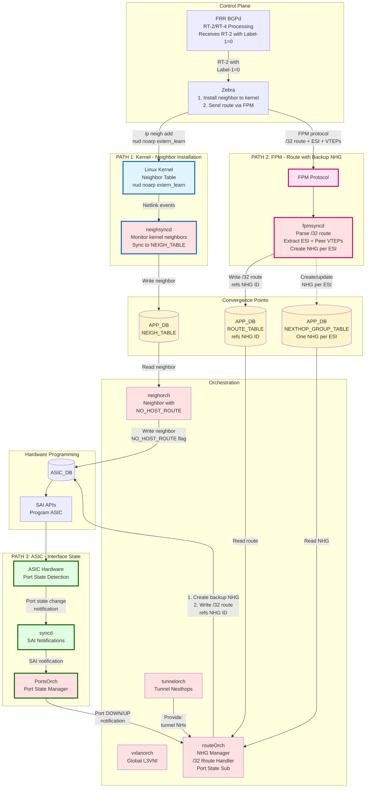
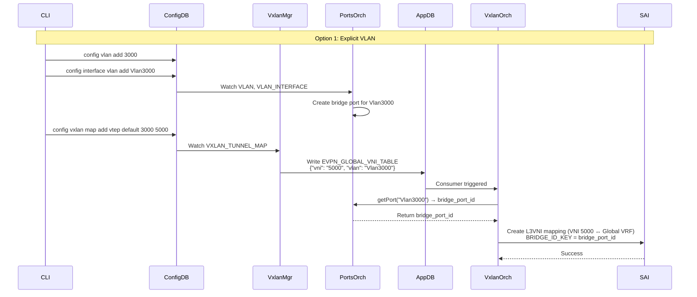
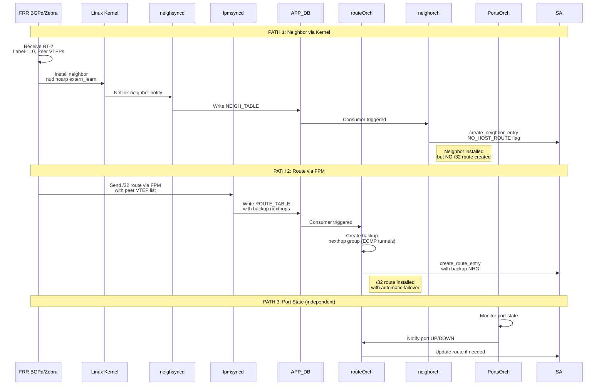

# L3 Multi-Homing with Backup Path Support for IP Data Centers

## High-Level Design Document

**Version**: 1.0  
**Author**: Patrice Brissette  
**Date**: April 21, 2026  
**Status**: Draft

---

## 1. Revision History

| Version | Date | Author | Description |
|---------|------|--------|-------------|
| 1.0 | April 21, 2026 | Patrice Brissette | Initial version |

---

## 2. Scope

### 2.1 In Scope
- Global L3VNI support in default VRF (VRF-less deployment)
- EVPN RT-2 neighbor synchronization with Label-1=0 (L3-only, no L2VNI)
- Neighbor and route separation (NO_HOST_ROUTE flag)
- Backup nexthop groups for automatic failover
- Multi-homing with all-active L3 forwarding
- Three-path architecture: kernel neighbor, FPM route, ASIC port state
- Configuration via CLI for global L3VNI
- Dummy VLAN/SVI for L3VNI decapsulation context

### 2.2 Out of Scope
- FRR BGP EVPN control plane changes (documented separately in FRR HLD)
- Traditional L2VNI-based EVPN (existing functionality unchanged)
- VRF-based L3VNI (existing functionality unchanged)
- DF (Designated Forwarder) election mechanisms (L2-only, not applicable to L3MH)
- Split-horizon enforcement (handled by FRR RT-4 processing)
- BUM traffic handling (L2 concern, not applicable to L3-only mode)

---

## 3. Definitions/Abbreviations

| Term | Definition |
|------|------------|
| **L3MH** | L3 Multi-Homing: Layer 3 based multi-homing without L2VNI dependency |
| **L2VNI** | Layer 2 VXLAN Network Identifier: VXLAN segment for L2 bridging |
| **L3VNI** | Layer 3 VXLAN Network Identifier: VXLAN segment for L3 routing |
| **RT-2** | EVPN Route Type 2: MAC-IP Advertisement route |
| **RT-4** | EVPN Route Type 4: Ethernet Segment route for multi-homing topology |
| **Label-1** | First MPLS label in RT-2 route: L2VNI in traditional EVPN, 0 (Explicit NULL) in L3MH |
| **Label-2** | Second MPLS label in RT-2 route: L3VNI for inter-subnet routing |
| **GRT** | Global Routing Table: Default VRF (VRF-less) |
| **VRF** | Virtual Routing and Forwarding: Isolated routing table instance |
| **VTEP** | VXLAN Tunnel Endpoint: Device that encapsulates/decapsulates VXLAN traffic |
| **FPM** | Forwarding Plane Manager: FRR protocol for sending routes to SONiC |
| **NHG** | Next Hop Group: SAI object representing ECMP or backup nexthop set |
| **NO_HOST_ROUTE** | SAI neighbor attribute: Prevents automatic /32 route creation |
| **DF** | Designated Forwarder: L2 multi-homing role (not used in L3MH) |
| **ESI** | Ethernet Segment Identifier: Multi-homing segment identifier (tracked by FRR) |
| **PIC** | Prefix Independent Convergence: Fast reroute mechanism |
| **SVI** | Switch Virtual Interface: Layer 3 interface for VLAN routing |

---

## Table of Contents

1. [Revision History](#1-revision-history)
2. [Scope](#2-scope)
   - 2.1 [In Scope](#21-in-scope)
   - 2.2 [Out of Scope](#22-out-of-scope)
3. [Definitions/Abbreviations](#3-definitionsabbreviations)
4. [Overview](#4-overview)
   - 4.1 [Feature Summary](#41-feature-summary)
   - 4.2 [Motivation](#42-motivation)
   - 4.3 [Design Principles](#43-design-principles)
5. [Requirements](#5-requirements)
   - 5.1 [Functional Requirements](#51-functional-requirements)
     - 5.1.1 [FR-1: Global L3VNI Support](#511-fr-1-global-l3vni-support)
     - 5.1.2 [FR-2: RT-2 Neighbor Synchronization](#512-fr-2-rt-2-neighbor-synchronization)
     - 5.1.3 [FR-3: Backup Nexthop Groups](#513-fr-3-backup-nexthop-groups)
     - 5.1.4 [FR-4: Three-Path Architecture](#514-fr-4-three-path-architecture)
     - 5.1.5 [FR-5: All-Active Multi-Homing](#515-fr-5-all-active-multi-homing)
   - 5.2 [Performance Requirements](#52-performance-requirements)
     - 5.2.1 [PR-1: Convergence](#521-pr-1-convergence)
     - 5.2.2 [PR-2: Scale](#522-pr-2-scale)
   - 5.3 [Configuration Requirements](#53-configuration-requirements)
     - 5.3.1 [CR-1: CLI Support](#531-cr-1-cli-support)
     - 5.3.2 [CR-2: Backward Compatibility](#532-cr-2-backward-compatibility)
6. [Architecture Design](#6-architecture-design)
   - 6.1 [System Architecture](#61-system-architecture)
   - 6.2 [Container Architecture](#62-container-architecture)
   - 6.3 [Database Schema Design](#63-database-schema-design)
     - 6.3.1 [New Tables](#631-new-tables)
     - 6.3.2 [Modified Tables](#632-modified-tables)
   - 6.4 [L3VNI and Dummy VLAN Coordination](#64-l3vni-and-dummy-vlan-coordination)
   - 6.5 [FPM Protocol Design Rationale](#65-fpm-protocol-design-rationale)
7. [High-Level Design](#7-high-level-design)
   - 7.1 [Component Design](#71-component-design)
     - 7.1.1 [vxlanmgr - Global L3VNI Configuration Manager](#711-vxlanmgr---global-l3vni-configuration-manager)
     - 7.1.2 [vxlanorch - Global L3VNI Tunnel Map Orchestration](#712-vxlanorch---global-l3vni-tunnel-map-orchestration)
     - 7.1.3 [fpmsyncd - FPM Message Processing](#713-fpmsyncd---fpm-message-processing-rtm_newnexthop--rtm_newroute)
     - 7.1.4 [neighorch - EVPN Neighbor with NO_HOST_ROUTE](#714-neighorch---evpn-neighbor-with-no_host_route)
     - 7.1.5 [routeOrch - Route Installation with NHG Resolution](#715-routeorch---route-installation-with-nhg-resolution)
     - 7.1.6 [PortsOrch - Port State Notification](#716-portsorch---port-state-notification)
     - 7.1.7 [fdborch - Skip L2 FDB for Label-1=0](#717-fdborch---skip-l2-fdb-for-label-10)
   - 7.2 [Data Flow Diagrams](#72-data-flow-diagrams)
     - 7.2.1 [Configuration Flow](#721-configuration-flow)
     - 7.2.2 [RT-2 Neighbor and Route Sync Flow](#722-rt-2-neighbor-and-route-sync-flow)
8. [SAI API](#8-sai-api)
   - 8.1 [SAI Objects Used](#81-sai-objects-used)
   - 8.2 [Critical SAI Attributes](#82-critical-sai-attributes)
     - 8.2.1 [NO_HOST_ROUTE Attribute](#821-no_host_route-attribute)
9. [Configuration and Management](#9-configuration-and-management)
   - 9.1 [CLI Commands](#91-cli-commands)
     - 9.1.1 [Add Global L3VNI](#911-add-global-l3vni)
     - 9.1.2 [Remove Global L3VNI](#912-remove-global-l3vni)
     - 9.1.3 [Show Commands](#913-show-commands)
     - 9.1.4 [Clear Commands](#914-clear-commands)
   - 9.2 [Configuration Files](#92-configuration-files)
     - 9.2.1 [CONFIG_DB Schema](#921-config_db-schema)
     - 9.2.2 [YANG Model Extension](#922-yang-model-extension)
   - 9.3 [YANG Model Updates](#93-yang-model-updates)
10. [Warmboot and Fastboot Design Impact](#10-warmboot-and-fastboot-design-impact)
    - 10.1 [Warmboot Support](#101-warmboot-support)
    - 10.2 [Fastboot Support](#102-fastboot-support)
11. [Restrictions/Limitations](#11-restrictionslimitations)
    - 11.1 [Current Limitations](#111-current-limitations)
    - 11.2 [Backward Compatibility](#112-backward-compatibility)
12. [Testing Requirements/Design](#12-testing-requirementsdesign)
    - 12.1 [Unit Testing](#121-unit-testing)
    - 12.2 [Integration Testing](#122-integration-testing)
    - 12.3 [System Testing](#123-system-testing)
13. [Implementation Plan](#13-implementation-plan)
    - 13.1 [Phase 1: Foundation - Global L3VNI Infrastructure](#131-phase-1-foundation---global-l3vni-infrastructure)
    - 13.2 [Phase 2: Data Path - Neighbor and Route Separation](#132-phase-2-data-path---neighbor-and-route-separation)
    - 13.3 [Phase 3: Multi-Homing Integration](#133-phase-3-multi-homing-integration)
    - 13.4 [Phase 4: Configuration, CLI, and Testing](#134-phase-4-configuration-cli-and-testing)
14. [Testing Strategy](#14-testing-strategy)
    - 14.1 [Unit Tests](#141-unit-tests)
    - 14.2 [Integration Tests](#142-integration-tests)
15. [Migration Considerations](#15-migration-considerations)
    - 15.1 [Backward Compatibility](#151-backward-compatibility)
    - 15.2 [Upgrade Path](#152-upgrade-path)
16. [Appendix: Code Examples](#16-appendix-code-examples)
    - [16.A vxlanmgr Implementation](#16a-vxlanmgr-implementation)
    - [16.B vxlanorch Implementation](#16b-vxlanorch-implementation)
    - [16.C SAI Tunnel Map Examples](#16c-sai-tunnel-map-examples)
    - [16.D fpmsyncd Implementation](#16d-fpmsyncd-implementation)
    - [16.E neighorch Implementation](#16e-neighorch-implementation)
    - [16.F fdborch Implementation](#16f-fdborch-implementation)
    - [16.G Testing Code](#16g-testing-code)
    - [16.H Additional Utility Code](#16h-additional-utility-code)

---

## 4. Overview

### 4.1 Feature Summary

This document specifies the SONiC-SWSS implementation for **L3 Multi-Homing (L3MH) with multi-ECMP Backup Path support for IP Data Centers**. This architecture eliminates Layer 2 VNI dependencies and VRF requirements, enabling all-active L3 multi-homing with sub-second automatic failover using a single global L3VNI in the default routing table.

### 4.2 Motivation

Traditional EVPN architectures require:
- L2VNI configuration for every VLAN
- VRF instances for L3VNI routing
- DF election for multi-homing (L2-based)
- Complex VRF route leaking when global routing table is configured

This design simplifies IP-DC deployments by:
- **Eliminating L2VNI**: RT-2 routes with Label-1=0 (no L2 bridge FDB)
- **VRF-less operation**: L3VNI in global routing table
- **All-active L3 multi-homing**: No DF election needed
- **Sub-sec failover**: Backup nexthop groups enable automatic data plane switchover

### 4.3 Design Principles

**Core Concepts**:

1. **L2VNI Removal**: RT-2 routes with Label-1=0 processed as IP neighbors (L3 routing table), not FDB entries (L2 bridge table)

2. **Neighbor + Route Separation**: Neighbors installed with NO_HOST_ROUTE flag (MAC binding only); /32 routes created independently with backup nexthop groups

3. **Three-Path Architecture**:
   - **Kernel path**: Neighbor installation via zebra → kernel → neighsyncd
   - **FPM path**: Route installation with backup nexthops via FPM → fpmsyncd
   - **ASIC path**: Port state monitoring via ASIC → syncd → PortsOrch

4. **Global L3VNI**: L3VNI operates in default VRF without VRF binding. Requires dummy VLAN/SVI for decapsulation context with bridge port binding.

5. **Automatic Failover**: Port UP → direct forwarding; Port DOWN → automatic switch to ECMP backup tunnels (sub-sec)

**Key Differences from Traditional EVPN**:

| Aspect | Traditional EVPN | L3MH with Backup Path |
|--------|------------------|-----------------------|
| **VRF** | VRF-based L3VNI | Global routing table (no VRF) |
| **L2 Path** | FDB entries for MAC switching | Skipped (no FDB) |
| **RT-2 Processing** | FPM → VXLAN_FDB_TABLE | Kernel → NEIGH_TABLE + FPM → ROUTE_TABLE |
| **Neighbor Type** | Remote (via tunnel) | LOCAL (with backup tunnels) |
| **Backup Path** | None | ECMP tunnels to peer VTEPs |
| **Failover** | BGP reconvergence required | Automatic (< sec) |

---

## 5. Requirements

### 5.1 Functional Requirements

#### 5.1.1 FR-1: Global L3VNI Support
- **FR-1.1**: System SHALL support L3VNI in global routing table (default VRF) without VRF binding
- **FR-1.2**: System SHALL create tunnel map entry mapping VNI to gVirtualRouterId
- **FR-1.3**: System SHALL support dummy VLAN/SVI for L3VNI decapsulation context

#### 5.1.2 FR-2: RT-2 Neighbor Synchronization
- **FR-2.1**: System SHALL process RT-2 routes with Label-1=0 (Explicit NULL)
- **FR-2.2**: System SHALL skip L2 bridge FDB creation for Label-1=0 RT-2 routes
- **FR-2.3**: System SHALL install neighbors from RT-2 as LOCAL neighbors (not remote)
- **FR-2.4**: System SHALL install neighbors with NO_HOST_ROUTE SAI attribute

#### 5.1.3 FR-3: Backup Nexthop Groups
- **FR-3.1**: System SHALL create backup nexthop groups with multi-ECMP tunnels to peer VTEPs
- **FR-3.2**: System SHALL install /32 routes with primary interface + backup NHG
- **FR-3.3**: System SHALL support automatic failover from primary to backup on link down

#### 5.1.4 FR-4: Three-Path Architecture
- **FR-4.1**: System SHALL support neighbor installation via kernel path (zebra → kernel → neighsyncd)
- **FR-4.2**: System SHALL support route installation via FPM path (zebra → FPM → fpmsyncd)
- **FR-4.3**: System SHALL support port state monitoring via ASIC path (ASIC → syncd → PortsOrch)
- **FR-4.4**: System SHALL coordinate neighbor, route, and port state paths independently

#### 5.1.5 FR-5: All-Active Multi-Homing
- **FR-5.1**: System SHALL support all-active L3 multi-homing (no DF election)
- **FR-5.2**: System SHALL support multiple peers advertising same RT-2 neighbor
- **FR-5.3**: System SHALL program identical neighbors on all multi-homed peers with different backup sets
- **FR-5.4**: System SHALL support ECMP load balancing across backup tunnels

### 5.2 Performance Requirements

#### 5.2.1 PR-1: Convergence
- **PR-1.1**: Link down detection to backup path activation: < 500ms
- **PR-1.2**: Neighbor installation latency: < 100ms
- **PR-1.3**: Route installation latency: < 100ms

#### 5.2.2 PR-2: Scale
- **PR-2.1**: Minimum 10,000 EVPN neighbors per switch
- **PR-2.2**: Minimum 8 peer VTEPs per multi-homed segment
- **PR-2.3**: Minimum 100 multi-homed segments per switch

### 5.3 Configuration Requirements

#### 5.3.1 CR-1: CLI Support
- **CR-1.1**: System SHALL provide `config vxlan map add vtep <vrf> <vlan> <vni>` command (use "default" for global L3VNI)
- **CR-1.2**: System SHALL validate VLAN exists before creating tunnel map
- **CR-1.3**: System SHALL extend `show vxlan tunnel` to display tunnel maps (VNI-VLAN-VRF mappings)

#### 5.3.2 CR-2: Backward Compatibility
- **CR-2.1**: System SHALL allow coexistence of L3MH and traditional EVPN modes

---

## 6. Architecture Design

### 6.1 System Architecture



**Key Architecture Points**:
- **NHG per ESI**: One NEXTHOP_GROUP per ESI, shared by all /32 routes on that ESI
- **Scalability**: 1000 routes on same ESI = 1 NHG + 1000 route references (not 1000 × VTEP list)
- **Topology Updates**: PE joins/leaves ES → update 1 NHG, all routes automatically use new topology
- Neighbor, route, and port state paths operate independently
- NO_HOST_ROUTE prevents automatic /32 route creation
- Port state changes trigger automatic failover without control plane
- Routes reference NHG by ID (not inline backup nexthops)

### 6.2 Container Architecture

This feature primarily impacts the **swss** container:

| Container | Components Modified | Purpose |
|-----------|---------------------|---------|
| **swss** | vxlanmgr, vxlanorch, neighorch, routeOrch, fpmsyncd, fdborch, portsorch | Core L3MH data plane implementation |
| **bgp** | FRR (out of scope) | RT-2/RT-4 control plane (documented separately) |
| **syncd** | No changes | Standard SAI notification delivery |
| **database** | Schema changes | New tables and fields |

### 6.3 Database Schema Design

#### 6.3.1 New Tables

##### CONFIG_DB.VXLAN_TUNNEL_MAP (Extended for Global L3VNI)

**Traditional VRF-Based L3VNI** (3-argument command):
```json
{
  "VXLAN_TUNNEL_MAP": {
    "vtep|Vrf1|Vlan100": {
      "vni": "5000"
    }
  }
}
```

**Global L3VNI** (uses "default" as VRF name):
```json
{
  "VXLAN_TUNNEL_MAP": {
    "vtep|default|Vlan4000": {
      "vni": "5000"
    }
  }
}
```

**Purpose**: User configuration for VXLAN tunnel maps (both VRF-based and global L3VNI)
**Key Format**: Always 3 components: `vtep|<VRF_NAME>|<VLAN>`
**Key Difference**: 
- **VRF-based**: VRF = custom VRF name (e.g., "Vrf1")
- **Global**: VRF = "default" (reserved keyword for global routing table)
- vxlanmgr detects global L3VNI by checking if VRF == "default"
**Command**: 
- `config vxlan map add vtep <VRF> <VLAN> <VNI>` → creates `vtep|<VRF>|<VLAN>` key
  - Use "default" for global L3VNI: `config vxlan map add vtep default 4000 5000`
  - Use custom VRF for VRF-based: `config vxlan map add vtep Vrf1 100 5000`  
**Consumer**: vxlanmgr

##### APP_DB.EVPN_GLOBAL_VNI_TABLE

```json
{
  "EVPN_GLOBAL_VNI_TABLE": {
    "global_l3vni": {
      "vni": "5000",
      "tunnel_name": "vtep",
      "vlan": "Vlan4000",
      "src_ip": "10.0.0.1"
    }
  }
}
```

**Purpose**: Global L3VNI operational state  
**Producer**: vxlanmgr  
**Consumer**: vxlanorch

##### APP_DB.NEXTHOP_GROUP_TABLE

```json
{
  "NEXTHOP_GROUP_TABLE": {
    "nhg_100": {
      "type": "backup",
      "nexthops": "10.0.0.2,10.0.0.3,10.0.0.4",
      "vni": "5000",
      "esi": "01:11:11:11:11:11:11:11:11:11"
    }
  }
}
```

**Fields**:
- **nhg_id**: Unique NHG identifier (key format: "nhg_{id}")
- **type**: "backup" for EVPN L3MH protection groups
- **nexthops**: Comma-separated peer VTEP IP list
- **vni**: L3VNI for tunnel encapsulation
- **esi**: ESI this NHG belongs to (for debugging)

**Purpose**: Shared backup NHG objects - one NHG referenced by many routes for scalability  
**Producer**: fpmsyncd (processes RTM_NEWNEXTHOP from FRR)  
**Consumer**: routeOrch

**Key Design**: Routes reference NHG by ID instead of embedding VTEP lists
- **Scalability**: 1000 hosts on same ESI = 1 NHG (not 1000 VTEP lists)
- **Efficiency**: Topology change updates 1 NHG, all referencing routes automatically use new topology

#### 6.3.2 Modified Tables

##### APP_DB.ROUTE_TABLE (Enhanced)

```
Before:
  ROUTE_TABLE:0:192.168.100.10/32
    "nexthop": "10.10.10.1"
    "ifname": "bond0"

After (Recommended - NHG ID Reference):
  ROUTE_TABLE:0:192.168.100.10/32
    "nexthop": "10.10.10.1"
    "ifname": "bond0"
    "backup_nhg_id": "nhg_100"                        # NEW: Reference to shared NHG

Alternative (Not Scalable - Inline VTEP List):
  ROUTE_TABLE:0:192.168.100.10/32
    "nexthop": "10.10.10.1"
    "ifname": "bond0"
    "backup_nexthops": "10.0.0.2,10.0.0.3,10.0.0.4"  # Embedded - O(routes) memory
    "backup_vni": "5000"
```

**Design Choice**: NHG ID Reference (Recommended)

| Aspect | NHG ID Reference | Inline VTEP List |
|--------|------------------|------------------|
| **Memory (1K routes, same ESI)** | 1 NHG + 1K refs | 1K × VTEP list |
| **Topology Update** | Update 1 NHG | Update 1K routes |
| **Scalability** | O(ESIs) | O(routes) |
| **Protocol** | RTM_NEWNEXTHOP (kernel 5.3+) | Custom inline format |
| **Alignment** | Matches FRR ESI-based design | Generic backup |

**Purpose**: /32 routes with backup nexthop groups  
**Producer**: fpmsyncd  
**Consumer**: routeOrch

### 6.4 L3VNI and Dummy VLAN Coordination

#### Purpose

**L3VNI** serves different roles in FRR vs SONiC:

| Component | Role | Purpose |
|-----------|------|----------|
| **FRR** | Control Plane | L3VNI for BGP route import/export, RT-2/RT-4 generation with Label-2 |
| **SONiC** | Data Plane | L3VNI for VXLAN encap/decap, ASIC tunnel map binding |

**Dummy VLAN** is SONiC-specific:
- Required for ASIC L3VNI decapsulation context
- Provides: Decap → Bridge Domain (dummy VLAN) → SVI → IP Routing (global table)
- **FRR does not need to know about dummy VLAN**

#### User Configuration Workflow

**User responsibilities** (manual coordination required):

1. **Choose L3VNI value** (e.g., 5000) - MUST be identical in both FRR and SONiC
2. **Choose dummy VLAN ID** (e.g., 4000) - SONiC-only, user's choice
3. **Create dummy VLAN in SONiC**:
   ```bash
   config vlan add 4000
   config interface vlan add Vlan4000
   ```
4. **Configure L3VNI in SONiC** with VXLAN tunnel map:
   ```bash
   config vxlan map add vtep default 4000 5000
   ```
5. **Configure L3VNI in FRR** (separate, BGP control plane):
   ```bash
   evpn global-l3vni 5000
     route-target both 65000:5000
   ```

#### Coordination Requirements

| Parameter | FRR | SONiC | Must Match? | Notes |
|-----------|-----|-------|-------------|-------|
| **L3VNI value** | ✅ 5000 | ✅ 5000 | **YES - CRITICAL** | BGP Label-2 must match ASIC tunnel VNI |
| **Route Target** | ✅ 65000:5000 | ✅ 65000:5000 | **YES** | For RT import/export filtering |
| **Dummy VLAN** | ❌ Not used | ✅ 4000 | **NO** | SONiC ASIC implementation detail |
| **VTEP IP** | ✅ Loopback | ✅ Derived | **YES** | Must match for tunnel establishment |

### 6.5 FPM Protocol Design Rationale

#### Why NHG ID References Instead of Inline VTEP Lists?

This design uses **NHG ID references** for backup nexthops instead of embedding VTEP lists in each route.

#### Design Options Comparison

**Option 1: NHG ID Reference** (Selected):
```
Step 1: Create shared NHG (once per ESI)
  RTM_NEWNEXTHOP { id=100, vteps=[10.0.0.2, 10.0.0.3, 10.0.0.4], vni=5000 }
  
Step 2: Routes reference NHG by ID (many routes)
  RTM_NEWROUTE { prefix=192.168.100.10/32, backup_nhg_id=100 }
  RTM_NEWROUTE { prefix=192.168.100.20/32, backup_nhg_id=100 }
  ...
  (1000 routes on same ESI all reference same NHG-100)
```

**Option 2: Inline VTEP List** (Rejected):
```
RTM_NEWROUTE { prefix=192.168.100.10/32, backup_vteps=[10.0.0.2, 10.0.0.3, 10.0.0.4], vni=5000 }
RTM_NEWROUTE { prefix=192.168.100.20/32, backup_vteps=[10.0.0.2, 10.0.0.3, 10.0.0.4], vni=5000 }
...
(VTEP list embedded in every route message)
```

---

## 7. High-Level Design

### 7.1 Component Design

#### 7.1.1 vxlanmgr - Global L3VNI Configuration Manager

**Purpose**: Process global L3VNI configuration and validate dummy VLAN

**Key Functions**:
- Monitor CONFIG_DB.VXLAN_TUNNEL_MAP table (detect vrf="default" for global L3VNI)
- Validate VLAN parameter
- Verify dummy VLAN exists in CONFIG_DB
- Write to APP_DB.EVPN_GLOBAL_VNI_TABLE

**Implementation Details**:
- User must create VLAN before configuring L3VNI
  - User creates: `config vlan add 4000; config interface vlan add Vlan4000`
  - User configures: `config vxlan map add vtep default 4000 5000`
  - vxlanmgr validates VLAN exists in CONFIG_DB before proceeding
  - Error if VLAN not found: "VLAN Vlan4000 not found in CONFIG_DB"
  - VRF = "default" = global L3VNI (uses gVirtualRouterId)

**Files Modified**:
- `cfgmgr/vxlanmgr.cpp` (~150 new lines, ~20 modified)
- `cfgmgr/vxlanmgr.h` (class definition updates)

**See Appendix**: [A. vxlanmgr Implementation](#16a-vxlanmgr-implementation)

---

#### 7.1.2 vxlanorch - Global L3VNI Tunnel Map Orchestration

**Purpose**: Create SAI tunnel map entries for global L3VNI with bridge port binding

**Key Functions**:
- Monitor APP_DB.EVPN_GLOBAL_VNI_TABLE
- Create tunnel map: VNI ↔ gVirtualRouterId
- Bind tunnel map entry to dummy VLAN bridge port
- Support both VRF-based and global L3VNI modes

**Files Modified**:
- `orchagent/vxlanorch.cpp` (~200 new lines, ~50 modified)
- `orchagent/vxlanorch.h` (GlobalL3VniConfig structure)

**See Appendix**: [B. vxlanorch Implementation](#16b-vxlanorch-implementation)

---

#### 7.1.3 fpmsyncd - FPM Message Processing (RTM_NEWNEXTHOP + RTM_NEWROUTE)

**Purpose**: Process FPM messages from FRR for shared NHG creation and route installation

**Key Functions**:
1. **RTM_NEWNEXTHOP handler**: Create/update shared backup NHG objects
2. **RTM_NEWROUTE handler**: Install routes with NHG ID references
3. **Label-1=0 detection**: Route EVPN RT-2 to appropriate path

**Processing Flow**:
- **Step 1**: Parse RTM_NEWNEXTHOP messages, extract NHG ID, VTEP list, and VNI
- **Step 2**: Write to NEXTHOP_GROUP_TABLE (one NHG per ESI)
- **Step 3**: Parse RTM_NEWROUTE messages, extract backup_nhg_id reference
- **Step 4**: Write routes to ROUTE_TABLE with NHG ID reference (not inline VTEP list)

**Files Modified**:
- `fpmsyncd/routesync.cpp` (~350 new lines, ~120 modified)
- `fpmsyncd/routesync.h` (~40 lines)
- `fpmsyncd/fpmlink.cpp` (MPLS label parsing, NHG message routing)

**See Appendix**: [D. fpmsyncd Implementation](#16d-fpmsyncd-implementation)

---

#### 7.1.4 neighorch - EVPN Neighbor with NO_HOST_ROUTE

**Purpose**: Install EVPN neighbors with NO_HOST_ROUTE flag to prevent automatic /32 route creation

**Key Functions**:
- Detect EVPN neighbors from kernel (NTF_EXT_LEARNED flag)
- Install neighbor with SAI_NEIGHBOR_ENTRY_ATTR_NO_HOST_ROUTE = true
- Prevent automatic /32 route creation (routeOrch handles routes)

**Files Modified**:
- `orchagent/neighorch.cpp` (~180 new lines, ~40 modified)
- `orchagent/neighorch.h` (addEvpnNeighbor method)

**See Appendix**: [E. neighorch Implementation](#16e-neighorch-implementation)

---

#### 7.1.5 routeOrch - Route Installation with NHG Resolution

**Purpose**: Install /32 routes by resolving NHG ID references to actual VTEP lists

**Key Functions**:
1. Subscribe to NEXTHOP_GROUP_TABLE for NHG updates
2. Parse backup_nhg_id from ROUTE_TABLE
3. Resolve NHG ID → VTEP list from cache
4. Create backup NHG in SAI
5. Install route with primary + backup NHG
6. Handle NHG updates (topology changes)
7. Subscribe to PortsOrch for port state notifications

**Files Modified**:
- `orchagent/routeorch.cpp` (~450 new lines, ~110 modified)
- `orchagent/routeorch.h` (~60 lines)

---

#### 7.1.6 PortsOrch - Port State Notification

**Purpose**: Notify routeOrch of port state changes for automatic failover

**Key Functions**:
- Detect port UP/DOWN events from SAI notifications
- Maintain subscriber list for port state changes
- Notify subscribers (routeOrch) on state transitions

**Files Modified**:
- `orchagent/portsorch.cpp` (~80 new lines)
- `orchagent/portsorch.h` (notification interface)

---

#### 7.1.7 fdborch - Skip L2 FDB for Label-1=0

**Purpose**: Defensive check to skip FDB processing for RT-2 with Label-1=0

**Key Functions**:
- Check origin field in VXLAN_FDB_TABLE entries
- Skip processing if origin=evpn (handled by neighorch/routeOrch)

**Files Modified**:
- `orchagent/fdborch.cpp` (~30 new lines)

**See Appendix**: [F. fdborch Implementation](#16f-fdborch-implementation)

---

### 7.2 Data Flow Diagrams

#### 7.2.1 Configuration Flow



#### 7.2.2 RT-2 Neighbor and Route Sync Flow



---

## 8. SAI API

### 8.1 SAI Objects Used

This feature utilizes standard SAI APIs without requiring new objects or attributes:

| SAI Object | Purpose | Attributes Used |
|------------|---------|-----------------|
| **SAI_OBJECT_TYPE_VIRTUAL_ROUTER** | Global routing table | gVirtualRouterId (existing) |
| **SAI_OBJECT_TYPE_TUNNEL_MAP** | VNI ↔ VRF mapping | SAI_TUNNEL_MAP_ATTR_TYPE |
| **SAI_OBJECT_TYPE_TUNNEL_MAP_ENTRY** | Specific VNI mapping | VIRTUAL_ROUTER_ID_KEY, VNI_ID_VALUE, **BRIDGE_ID_KEY** |
| **SAI_OBJECT_TYPE_NEIGHBOR_ENTRY** | Neighbor with NO_HOST_ROUTE | SAI_NEIGHBOR_ENTRY_ATTR_NO_HOST_ROUTE |
| **SAI_OBJECT_TYPE_ROUTE_ENTRY** | /32 route with backup | Standard route attributes |
| **SAI_OBJECT_TYPE_NEXT_HOP_GROUP** | Backup ECMP tunnels | SAI_NEXT_HOP_GROUP_TYPE_ECMP |
| **SAI_OBJECT_TYPE_NEXT_HOP** | Tunnel nexthops | SAI_NEXT_HOP_TYPE_TUNNEL_ENCAP |

### 8.2 Critical SAI Attributes

#### 8.2.1 NO_HOST_ROUTE Attribute

**Attribute**: `SAI_NEIGHBOR_ENTRY_ATTR_NO_HOST_ROUTE = true`  
**Purpose**: Prevents automatic /32 route creation when neighbor is installed

**Usage**:
```cpp
sai_attribute_t attr;
attr.id = SAI_NEIGHBOR_ENTRY_ATTR_NO_HOST_ROUTE;
attr.value.booldata = true;
```

---

## 9. Configuration and Management

### 9.1 CLI Commands

#### 9.1.1 Add Global L3VNI

**Syntax**: Uses existing `config vxlan map` command with "default" as VRF name for global L3VNI

```bash
# VRF-based L3VNI (custom VRF)
config vxlan map add vtep <VRF_NAME> <VLAN_ID> <VNI>

# Global L3VNI (use "default" as VRF name)
config vxlan map add vtep default <VLAN_ID> <VNI>
```

**Complete Workflow**:
```bash
# Step 1: Create dummy VLAN (USER RESPONSIBILITY - REQUIRED)
config vlan add 4000
config interface vlan add Vlan4000

# Step 2: Configure global L3VNI using VXLAN tunnel map
config vxlan map add vtep default 4000 5000
# Note: "default" is reserved keyword for global routing table (gVirtualRouterId)
```

**Command Behavior**:
- **VRF = "default"**: Global L3VNI mode → uses gVirtualRouterId
- **VRF = custom name**: VRF-based L3VNI → uses custom VRF
- Always 3 arguments for consistent parsing

> ⚠️ **CRITICAL - L3VNI COORDINATION**: The L3VNI value (5000) MUST match between:
>   - **FRR**: `evpn global-l3vni 5000` (BGP control plane - RT-2/RT-4 generation)
>   - **SONiC**: `config vxlan map add vtep default 4000 5000` (Data plane - ASIC tunnel mapping)
>   - Mismatch will cause EVPN routing failures


#### 9.1.2 Remove Global L3VNI
```bash
config vxlan map del vtep default 4000 5000
# Note: Must specify VRF, VLAN, and VNI to identify the map entry
```

#### 9.1.3 Show Commands
```bash
show vxlan tunnel  # Extended to display tunnel maps including global L3VNI
show evpn neighbors
```

**Example Output for `show vxlan tunnel`**:
```
VTEP Information:
  Source IP: 10.0.0.1
  
Tunnel Maps:
VNI     VLAN        VRF         Type    Status
------  ----------  ----------  ------  ------
5000    Vlan4000    (global)    L3      Active
5001    Vlan100     Vrf1        L3      Active
1000    Vlan200     -           L2      Active
```

#### 9.1.4 Clear Commands
```bash
clear evpn
```

### 9.2 Configuration Files

#### 9.2.1 CONFIG_DB Schema

```json
{
  "VXLAN_TUNNEL_MAP": {
    "vtep|default|Vlan4000": {
      "vni": "5000"
    }
  },
  "VXLAN_TUNNEL": {
    "vtep": {
      "src_ip": "10.0.0.1"
    }
  },
  "VLAN": {
    "Vlan4000": {},
    "Vlan100": {}
  },
  "VLAN_MEMBER": {
    "Vlan100|Ethernet0": {
      "tagging_mode": "untagged"
    }
  },
  "VLAN_INTERFACE": {
    "Vlan4000": {},
    "Vlan100": {},
    "Vlan100|192.168.100.1/24": {}
  }
}
```

### 9.3 YANG Model Updates

**New Module**: `sonic-evpn.yang`

```yang
module sonic-evpn {
    namespace "http://github.com/sonic-net/sonic-evpn";
    prefix sevpn;
    
#### 9.2.2 YANG Model Extension

**File**: `sonic-vxlan.yang` (extend existing)

```yang
    container sonic-vxlan {
        container VXLAN_TUNNEL_MAP {
            list VXLAN_TUNNEL_MAP_LIST {
                key "tunnel_name vrf vlan";
                
                leaf tunnel_name {
                    type string;
                    description "VXLAN tunnel name (e.g., vtep)";
                }
                
                leaf vrf {
                    type string;
                    description "VRF name (use 'default' for global L3VNI)";
                }
                
                leaf vlan {
                    type string;
                    description "VLAN for tunnel mapping";
                }
                
                leaf vni {
                    type uint32;
                    mandatory true;
                    description "VNI for VXLAN encapsulation";
                }
            }
        }
    }
}
```

**Notes**: 
- All keys have 3 components: `vtep|<VRF>|<VLAN>`
- Global L3VNI: `vtep|default|Vlan4000` (vrf = "default")
- VRF-based L3VNI: `vtep|Vrf1|Vlan100` (vrf = custom name)

---

## 10. Warmboot and Fastboot Design Impact

### 10.1 Warmboot Support

**Warmboot Compatibility**: ✅ **Supported**

**State Reconciliation**:

1. **Configuration**: CONFIG_DB.VXLAN_TUNNEL_MAP persists across warmboot. vxlanmgr recreates APP_DB state and SAI tunnel maps.

2. **Neighbors**: Kernel neighbor table persists. neighsyncd re-syncs on startup. neighorch recreates SAI neighbor entries with NO_HOST_ROUTE.

3. **Routes**: FRR sends full RIB via FPM on reconnect. fpmsyncd writes routes with backup nexthops. routeOrch recreates /32 routes with backup NHG.

4. **Port State**: PortsOrch queries current states from SAI. routeOrch resubscribes to notifications.

**Warmboot Flow**:
```
System Restart → Kernel intact → Services restart → 
neighsyncd/FRR resync → Orchagent recreates SAI → 
Traffic resumes (< 1s downtime)
```

### 10.2 Fastboot Support

**Fastboot Compatibility**: ✅ Supported. No impact on fastboot timing. L3VNI tunnel maps and neighbors/routes recreated in parallel during boot.

---

## 11. Restrictions/Limitations

### 11.1 Current Limitations

| ID | Limitation | Impact | Mitigation |
|----|-----------|--------|------------|
| **L-1** | Requires FRR with RT-4 support | Control plane dependency | Use compatible FRR version (documented separately) |
| **L-2** | Requires SAI NO_HOST_ROUTE attribute | Feature enablement | Validate vendor support in Phase 2 |
| **L-3** | Reserved VLAN range 4000-4094 (95 VLANs) recommended for global L3VNI | Best practice to avoid conflicts | Use any VLAN ID if needed, just create it |
| **L-4** | Backup NHG memory overhead | Scales with neighbors × peer VTEPs | Target: 10K neighbors × 4 VTEPs = 40K entries |

### 11.2 Backward Compatibility

**Coexistence**: L3MH (global L3VNI), traditional L2VNI EVPN, and VRF-based L3VNI can coexist on same switch.

**Example**:
- VLAN 100-200: Traditional L2VNI EVPN
- VLAN 300-400: L3MH with global L3VNI
- Both operate independently

---

## 12. Testing Requirements/Design

### 12.1 Unit Testing

| Test ID | Component | Verification |
|---------|-----------|-------------|
| **UT-1** | vxlanorch | Global L3VNI with bridge port binding |
| **UT-2** | neighorch | EVPN neighbor with NO_HOST_ROUTE flag |
| **UT-3** | routeOrch | /32 route with backup NHG |
| **UT-4** | fpmsyncd | Label-1=0 detection and ROUTE_TABLE write |

### 12.2 Integration Testing

| Test ID | Scenario | Expected Result |
|---------|----------|----------------|
| **IT-1** | Three-path convergence | Neighbor (kernel) + Route (FPM) + Port state (ASIC) work together |
| **IT-2** | Automatic failover | Port DOWN triggers backup tunnel within 500ms |
| **IT-3** | ECMP load balancing | Traffic distributed ~33% across 3 backup VTEPs |

### 12.3 System Testing

| Test ID | Scope | Targets |
|---------|-------|--------|
| **ST-1** | Full topology | 4 leafs, link failures, traffic validation |
| **ST-2** | Scale | 10K neighbors, 4 peer VTEPs, 100 segments |
| **ST-3** | Warmboot | Traffic downtime < 1s, all state restored |

---

## 13. Implementation Plan

### Overview

**Total Estimated Effort**: ~2560 lines of code (2010 new, 550 modified)

**Key Strategy**: This design leverages existing SONiC VXLAN and EVPN infrastructure. The core changes separate neighbor installation from route installation, enabling backup nexthop groups for automatic failover.

**Development Timeline**: 4-5 weeks (20-25 working days)

**Commit Count**: 11 commits in sonic-swss + 2 commits in sonic-utilities + 4 commits in FRRouting = 17 total commits

**Repository Breakdown**:
- **sonic-swss**: 11 commits, 2080 lines (1690 new, 390 modified)
- **sonic-utilities**: 2 commits, 160 lines (160 new, 0 modified)
- **FRRouting**: 4 commits, 320 lines (160 new, 160 modified)

### Phase 1: Foundation - Global L3VNI Infrastructure

**Objective**: Establish global L3VNI support without VRF binding, create database schema

**Duration**: 5-6 days

**Commits**: 2 commits (1 per sub-module)

---

#### Commit 1.1: vxlanmgr - Global L3VNI Configuration Processing

**Component**: cfgmgr/vxlanmgr

**Files**: vxlanmgr.cpp, vxlanmgr.h

**Size**: ~150 lines new, ~20 lines modified

**Changes**:
- Add EVPN_GLOBAL table consumer
- Process L3VNI with explicit --vlan parameter (current implementation)
- Validate VLAN exists
- Write to EVPN_GLOBAL_VNI_TABLE with user-specified VLAN
- **Future enhancement**: Implement dummy VLAN allocation from reserved range (4000-4094) when --vlan not specified
- **See**: [Appendix A.1 - VxlanMgr Class with Dummy VLAN Allocation](#16a1-vxlanmgr-class-with-dummy-vlan-allocation)

**Commit Message**:
```
[swss] vxlanmgr: Add global L3VNI support with VLAN binding

- Add EVPN_GLOBAL table consumer for global L3VNI configuration
- Process L3VNI with user-specified VLAN parameter
- Validate VLAN existence before creating global L3VNI
- Write configuration to EVPN_GLOBAL_VNI_TABLE
```

**Testing**: 
- Unit test: vxlanmgr config processing
- Verify EVPN_GLOBAL_VNI_TABLE population

---

#### Commit 1.2: vxlanorch - Global L3VNI Tunnel Map Creation

**Component**: orchagent/vxlanorch

**Files**: vxlanorch.cpp, vxlanorch.h

**Size**: ~200 lines new, ~50 lines modified

**Changes**:
- Accept empty VRF for global L3VNI (modify VRF validation logic)
- Add GlobalL3VniConfig structure to track global L3VNI state
- Implement EVPN_GLOBAL_VNI_TABLE consumer
- Create tunnel map with bridge port binding (critical for decap)
- Add createGlobalL3Vni() method
- **See**: [Appendix B.1 - GlobalL3VniConfig Structure](#16b1-globall3vniconfig-structure)
- **See**: [Appendix B.2 - vxlanorch doTask Implementation](#16b2-vxlanorch-dotask-implementation)
- **See**: [Appendix B.4 - createGlobalL3Vni with Bridge Port Binding](#16b4-creategloball3vni-with-bridge-port-binding)

**Commit Message**:
```
[swss] vxlanorch: Add global L3VNI tunnel map with bridge port binding

- Add EVPN_GLOBAL_VNI_TABLE consumer
- Support L3VNI in global routing table (no VRF binding)
- Create tunnel map with bridge port for decapsulation
- Add GlobalL3VniConfig structure for state tracking
- Implement createGlobalL3Vni() for tunnel map creation
```

**Testing**: 
- Unit tests for vxlanorch global L3VNI creation
- Verify SAI tunnel map with bridge port binding
- **See**: [Appendix G.1 - vxlanorch Unit Test](#16g1-vxlanorch-unit-test)

**Use CONFIG_DB.VXLAN_TUNNEL_MAP with "default" VRF for global L3VNI
- Extend CONFIG_DB.VXLAN_TUNNEL_MAP to support 2-component keys (global L3VNI)
- Define APP_DB.EVPN_GLOBAL_VNI_TABLE schema  
- Modify APP_DB.ROUTE_TABLE to add backup_nhg_id field (NHG ID reference)
- Add APP_DB.NEXTHOP_GROUP_TABLE for shared NHG storage

---

### Phase 2: Data Path - Neighbor and Route Separation

**Objective**: Implement three-path architecture: kernel neighbor path, FPM route path with backup nexthops, port state monitoring

**Duration**: 8-10 days

**Commits**: 4 commits (1 per sub-module)

---

#### Commit 2.1: fpmsyncd - RT-2 Label-1=0 Detection and Backup Nexthop Parsing

**Component**: fpmsyncd

**Files**: routesync.cpp, fpmlink.cpp

**Size**: ~250 lines new, ~80 lines modified

**Changes**:
- Add RTM_NEWNEXTHOP message handler for shared NHG creation (NEW)
- Add NEXTHOP_GROUP_TABLE producer (NEW)
- Detect RT-2 with Label-1=0 (neighbor sync mode)
- Parse RTA_NH_ID from RTM_NEWROUTE for NHG ID reference
- Write /32 route to ROUTE_TABLE with backup_nhg_id field (not VTEP list)
- Handle RTM_NEWNEXTHOP and RTM_NEWROUTE messages
- Handle route deletion for Label-1=0
- **See**: [Appendix D.1 - RT-2 Route Processing with Label-1 Detection](#16d1-rt-2-route-processing-with-label-1-detection)
- **See**: [Appendix D.2 - Write to Route Table](#16d2-write-to-route-table-with-nhg-reference)
- **See**: [Appendix D.3 - Route Deletion Handler](#16d3-route-deletion-handler)

**Commit Message**:
```
[swss] fpmsyncd: Add NHG and RT-2 Label-1=0 support for L3MH

- Add RTM_NEWNEXTHOP handler for shared backup NHG creation
- Write to NEXTHOP_GROUP_TABLE for NHG storage
- Detect RT-2 routes with Label-1=0 for L3MH mode
- Parse RTA_NH_ID for NHG reference from routes
- Write /32 routes to ROUTE_TABLE with backup_nhg_id field
- Handle NHG updates and route deletion for neighbor sync routes
```

**Testing**: 
- Unit test: RT-2 Label-1=0 detection logic
- Verify ROUTE_TABLE entries with backup nexthops
- Test peer VTEP list parsing

---

#### Commit 2.2: neighorch - EVPN Neighbor with NO_HOST_ROUTE

**Component**: orchagent/neighorch

**Files**: neighorch.cpp, neighorch.h

**Size**: ~180 lines new, ~40 lines modified

**Changes**:
- Check if kernel neighbor is EVPN (NTF_EXT_LEARNED flag)
- Add addEvpnNeighbor() method
- Set SAI_NEIGHBOR_ENTRY_ATTR_NO_HOST_ROUTE = true for EVPN neighbors
- Install neighbor MAC binding without creating /32 route
- **See**: [Appendix E.1 - neighorch doTask - Handle EVPN Neighbors from Kernel](#16e1-neighorch-dotask---handle-evpn-neighbors-from-kernel)
- **See**: [Appendix E.2 - addEvpnNeighbor with NO_HOST_ROUTE](#16e2-addevpnneighbor-with-no_host_route)

**Commit Message**:
```
[swss] neighorch: Add EVPN neighbor support with NO_HOST_ROUTE flag

- Detect EVPN neighbors from kernel (NTF_EXT_LEARNED flag)
- Add addEvpnNeighbor() method for EVPN-specific handling
- Set SAI_NEIGHBOR_ENTRY_ATTR_NO_HOST_ROUTE = true
- Install MAC binding without automatic /32 route creation
- Separate neighbor and route installation paths
```

**Testing**: 
- Unit test: EVPN neighbor installation with NO_HOST_ROUTE
- Verify SAI neighbor attributes
- Confirm no automatic /32 route created
- **See**: [Appendix G.2 - neighorch Unit Test](#16g2-neighorch-unit-test)

---

#### Commit 2.3: routeOrch - Backup Nexthop Group and Route Installation

**Component**: orchagent/routeorch

**Files**: routeorch.cpp, routeorch.h

**Size**: ~400 lines new, ~90 lines modified

**Changes**:
- Add NEXTHOP_GROUP_TABLE consumer (NEW)
- Add NHG cache for ID-to-VTEP resolution (NEW)
- Add ROUTE_TABLE consumer for backup_nhg_id field
- Parse backup_nhg_id from ROUTE_TABLE
- Resolve NHG ID to VTEP list from cache
- Create backup nexthop group from resolved VTEP list (ECMP tunnels to peer VTEPs)
- Install /32 route with primary + backup nexthops
- Implement PortsOrch subscriber interface for port state notifications
- Handle port state change notifications (interface UP/DOWN)
- Update route or trigger SAI automatic failover on port state change
- Add methods: resolveNhg(), createBackupNexthopGroup(), installRouteWithBackup(), onPortStateChange()

**Commit Message**:
```
[swss] routeOrch: Add NHG resolution and backup nexthop support

- Add NEXTHOP_GROUP_TABLE consumer for shared NHG
- Implement NHG cache and ID-to-VTEP resolution
- Parse backup_nhg_id from ROUTE_TABLE
- Resolve NHG ID to VTEP list
- Create backup nexthop group with ECMP tunnels to peer VTEPs
- Install /32 routes with primary interface + backup tunnels
- Implement PortsOrch subscriber interface
- Handle port state notifications for automatic failover
- Update routes on port DOWN/UP events
- Enable automatic failover to backup paths on link down
```

**Testing**: 
- Unit test: Backup NHG creation
- Verify /32 route with backup nexthops in ASIC
- Test route update on port state change
- Test subscriber interface and notification handling

---

#### Commit 2.4: tunnelorch - VNI-Aware Tunnel Nexthop Creation

**Component**: orchagent/tunnelorch

**Files**: tunnelorch.cpp, tunnelorch.h

**Size**: ~50 lines modified

**Changes**:
- Enhance getTunnelNexthop() to support VNI parameter
- Create tunnel nexthops for backup VTEPs with L3VNI
- Support global L3VNI in tunnel nexthop creation

**Commit Message**:
```
[swss] tunnelorch: Add VNI parameter support for tunnel nexthops

- Enhance getTunnelNexthop() to accept VNI parameter
- Support global L3VNI for backup tunnel nexthops
- Enable VNI-specific tunnel nexthop creation
```

**Testing**: 
- Unit test: Tunnel nexthop with VNI parameter
- Verify tunnel nexthop includes correct VNI

**Phase 2 Integration Testing**:
- Integration tests for neighbor+route separation, backup failover
- **See**: [Appendix G.3 - Integration Test Scenario](#16g3-integration-test-scenario)

---

### Phase 3: Multi-Homing Integration

**Objective**: Integrate port state monitoring, enable automatic failover to backup paths

**Duration**: 4-5 days

**Commits**: 3 commits (1 per sub-module)

---

#### Commit 3.1: portsorch - Port State Notification Mechanism

**Component**: orchagent/portsorch

**Files**: portsorch.cpp, portsorch.h

**Size**: ~80 lines new

**Changes**:
- Add port state notification mechanism to routeOrch
- Notify routeOrch when multi-homed interface goes UP/DOWN
- Track subscribers interested in specific ports
- Implement observer pattern for port state changes

**Commit Message**:
```
[swss] portsorch: Add port state notification mechanism for route updates

- Add notification interface for port state changes
- Implement observer pattern for port state subscribers
- Notify routeOrch on multi-homed interface UP/DOWN events
- Track port-specific subscribers for efficient notification
```

**Testing**: 
- Unit test: Port state notification delivery
- Verify subscriber registration and notification

---

#### Commit 3.2: fdborch - Skip FDB Processing for Global L3VNI Neighbors

**Component**: orchagent/fdborch

**Files**: fdborch.cpp

**Size**: ~30 lines new

**Changes**:
- Skip FDB processing for Label-1=0 RT-2 routes
- Add defensive check (fpmsyncd routes to ROUTE_TABLE, but safety net)
- **See**: [Appendix F.1 - Skip L2 FDB for EVPN Neighbors](#16f1-skip-l2-fdb-for-evpn-neighbors)

**Commit Message**:
```
[swss] fdborch: Skip FDB processing for global L3VNI neighbor routes

- Add check to skip FDB entries for RT-2 Label-1=0 routes
- Defensive logic as fpmsyncd routes to ROUTE_TABLE
- Prevent L2 FDB creation for L3-only EVPN neighbors
```

**Testing**: 
- Unit test: Verify FDB skip for Label-1=0 routes
- Confirm no FDB entries created for EVPN neighbors

---

#### Commit 3.3: evpnmhorch - Bypass L2 Multi-Homing for Global L3VNI

**Component**: orchagent/evpnmhorch

**Files**: evpnmhorch.cpp

**Size**: ~40 lines modified

**Changes**:
- Skip DF election for L3MH mode
- Bypass L2 multi-homing mechanisms (local bias, carving, split-horizon group)
- Keep ES tracking for informational purposes only
- **Note**: Most multi-homing logic stays in FRR (RT-4 processing, topology tracking)

**Commit Message**:
```
[swss] evpnmhorch: Bypass L2 multi-homing logic for L3MH mode

- Skip DF election when in L3MH mode
- Bypass L2 multi-homing mechanisms (local bias, split-horizon)
- Retain ES tracking for informational purposes
- Defer multi-homing logic to FRR for L3-based failover
```

**Testing**: 
- Unit test: Verify DF election bypass
- Confirm ES tracking without L2 logic

**Phase 3 System Testing**:
- System tests for automatic failover, port state integration
- Full topology test with link down scenarios

---

### Phase 4: Configuration, CLI, and Testing

**Objective**: Add CLI support, show commands, comprehensive testing

**Duration**: 4-5 days

**Commits**: 2 commits (sonic-utilities repository, 1 commit per functional area)

---

#### Commit 4.1: sonic-utilities - Configuration and Show Commands

**Component**: sonic-utilities (config + show)

**Files**: config/main.py, show/main.py
Extend `show vxlan tunnel` command to display tunnel map information
- Display: VNI, VLAN, VRF (or "global"), Type (L2/L3), Status
- Parse VXLAN_TUNNEL_MAP entries (vrf="default" = global, other = VRF-based)
- Read from CONFIG_DB.VXLAN_TUNNEL_MAP and APP_DB.EVPN_GLOBAL_VNI_TABLE
- **Show Output**: Unified table format showing all tunnel maps

**Commit Message**:
```
[utilities] Extend vxlan commands for global L3VNI support

- Extend 'config vxlan map add/del vtep' to support global L3VNI (2-arg mode)
- VRF parameter omitted = global L3VNI mode
- Extend 'show vxlan tunnel' to display all tunnel maps (L2/L3, VRF/global)
- Validate VNI range and VLAN exists before config
- Parse VXLAN_TUNNEL_MAP for 2-component vs 3, status
- Extend VXLAN_TUNNEL_MAP parser to detect 2-component keys (global L3VNI mode)
- Write to EVPN_GLOBAL_VNI_TABLE in APP_DB
```

**Show Output**: Unified table format showing all tunnel maps

**Testing**: 
- CLI test: Command syntax validation
- Verify CONFIG_DB writes
- Test show output formatting

---

#### Commit 4.2: sonic-utilities - Clear Commands and Statistics

**Component**: sonic-utilities (clear)

**Files**: clear/main.py

**Size**: ~20 lines new

**Changes**:
- Add `clear evpn` command for statistics
- **Optional**: Clear neighbor sync counters

**Commit Message**:
```
[utilities] Add clear commands for EVPN statistics

- Add 'clear evpn' command for statistics reset
- Support neighbor sync counter clearing
```

**Testing**: 
- CLI test: Clear command execution
- Verify statistics reset

---

### Phase 4 Testing Framework

**Note**: Testing code is typically committed separately or in the same commit as the feature it tests, depending on repository conventions.

**Testing Framework** (~400 lines new)

**Unit Tests** (~150 lines)
- **vxlanorch_ut.cpp**: Test global L3VNI creation, bridge port binding, cleanup
- **neighorch_ut.cpp**: Test EVPN neighbor with NO_HOST_ROUTE flag
- **routeorch_ut.cpp**: Test backup NHG creation, /32 route with backup
- **See**: [Appendix G.1 - vxlanorch Unit Test](#16g1-vxlanorch-unit-test)
- **See**: [Appendix G.2 - neighorch Unit Test](#16g2-neighorch-unit-test)

**Integration Tests** (~150 lines)
- Test three-path convergence (neighbor + route + port state)
- Verify FPM route with backup nexthops reaches routeOrch
- Confirm kernel neighbor reaches neighorch with NO_HOST_ROUTE
- Test VTEP list parsing and backup NHG creation
- **See**: [Appendix G.3 - Integration Test Scenario](#16g3-integration-tests-python)

**System Tests** (~100 lines - pytest)
- Full topology test: 4 leafs, multi-homed server
- Test automatic failover on link down
- Verify backup path selection (ECMP to peer VTEPs)
- Measure failover time (target: < 500ms)
- Test configuration persistence across reboot
- **Platform**: VS (Virtual Switch) for CI/CD

**Documentation** (~200 lines)
- Update SONiC EVPN documentation
- Add L3MH configuration guide
- Create troubleshooting section
- CLI command reference with examples

---

### Implementation Dependencies

```
Phase 1: Foundation (2 commits)
   Commit 1.1: vxlanmgr
   Commit 1.2: vxlanorch
   ↓
Phase 2: Data Path (4 commits) ← Phase 5: FRR (4 commits, parallel)
   Commit 2.1: fpmsyncd              Commit 5.1: zebra EVPN core
   Commit 2.2: neighorch             Commit 5.2: zebra EVPN MAC
   Commit 2.3: routeOrch             Commit 5.3: zebra FPM
   Commit 2.4: tunnelorch            Commit 5.4: bgpd EVPN
   ↓
Phase 3: Multi-Homing (3 commits)
   Commit 3.1: portsorch
   Commit 3.2: fdborch
   Commit 3.3: evpnmhorch
   ↓
Phase 4: CLI & Testing (2 commits)
   Commit 4.1: sonic-utilities (config + show)
   Commit 4.2: sonic-utilities (clear)
```

**Critical Path**: Phase 1 → Phase 2 → Phase 3 → Phase 4  

**Commit Dependencies**:
- **No dependency**: Commits within same phase can be developed in parallel
- **Sequential dependency**: Phases must complete in order (1→2→3→4)

### Commit Summary by Repository

#### sonic-swss Repository
**Total**: 11 commits

**Phase 1 - Foundation**: 2 commits
1. vxlanmgr: Global L3VNI configuration processing
2. vxlanorch: Global L3VNI tunnel map creation

**Phase 2 - Data Path**: 4 commits
3. fpmsyncd: RT-2 Label-1=0 detection and backup nexthop parsing
4. neighorch: EVPN neighbor with NO_HOST_ROUTE flag
5. routeOrch: Backup nexthop group and route installation
6. tunnelorch: VNI-aware tunnel nexthop creation

**Phase 3 - Multi-Homing**: 3 commits
7. portsorch: Port state notification mechanism
8. fdborch: Skip FDB processing for global L3VNI neighbors
9. evpnmhorch: Bypass L2 multi-homing for global L3VNI

**Phase 4 - Testing**: 2 commits (or included in feature commits)
10. Unit tests (potentially in feature commits)
11. Integration/system tests (separate test commit)

#### sonic-utilities Repository
**Total**: 2 commits

**Phase 4 - CLI**: 2 commits
1. config + show commands for global L3VNI
2. clear commands and statistics


**Grand Total**: 17 commits across 3 repositories

### Code Size Summary by Commit

#### sonic-swss (11 commits)

| Commit | Component | New Lines | Modified Lines | Total |
|--------|-----------|-----------|----------------|-------|
| **Phase 1 - Foundation** | | | | |
| 1.1 | vxlanmgr | 150 | 20 | 170 |
| 1.2 | vxlanorch | 200 | 50 | 250 |
| **Phase 2 - Data Path** | | | | |
| 2.1 | fpmsyncd | 250 | 80 | 330 |
| 2.2 | neighorch | 180 | 40 | 220 |
| 2.3 | routeOrch | 400 | 90 | 490 |
| 2.4 | tunnelorch | 0 | 50 | 50 |
| **Phase 3 - Multi-Homing** | | | | |
| 3.1 | portsorch | 80 | 10 | 90 |
| 3.2 | fdborch | 30 | 10 | 40 |
| 3.3 | evpnmhorch | 0 | 40 | 40 |
| **Phase 4 - Testing** | | | | |
| Tests | Unit/Integration/System | 400 | 0 | 400 |
| **sonic-swss Subtotal** | | **1690** | **390** | **2080** |

#### sonic-utilities (2 commits)

| Commit | Component | New Lines | Modified Lines | Total |
|--------|-----------|-----------|----------------|-------|
| **Phase 4 - CLI** | | | | |
| 4.1 | config + show | 140 | 0 | 140 |
| 4.2 | clear | 20 | 0 | 20 |
| **sonic-utilities Subtotal** | | **160** | **0** | **160** |

#### Grand Total (17 commits)

| Repository | New Lines | Modified Lines | Total |
|------------|-----------|----------------|-------|
| sonic-swss | 1690 | 390 | 2080 |
| sonic-utilities | 160 | 0 | 160 |
| FRRouting | 160 | 160 | 320 |
| **Grand Total** | **2010** | **550** | **2560** |

### Risk Assessment

**High Risk**:
- FRR FPM message format changes (requires coordination with FRR community)
- SAI support for NO_HOST_ROUTE attribute (vendor-specific behavior)
- Backup nexthop group automatic failover (ASIC implementation varies)

**Medium Risk**:
- Port state notification mechanism (new subscriber pattern in portsOrch)
- Dummy VLAN allocation conflicts with user VLANs
- ROUTE_TABLE schema changes (backward compatibility)

**Low Risk**:
- vxlanorch global L3VNI support (straightforward SAI API usage)
- neighorch NO_HOST_ROUTE flag (simple attribute addition)
- CLI commands (standard sonic-utilities pattern)

### Mitigation Strategies

1. **FRR Coordination**: Start early engagement with FRR community, propose netlink message format
2. **SAI Validation**: Test NO_HOST_ROUTE on multiple vendor ASICs early in Phase 2
3. **Incremental Testing**: Each phase has isolated tests before integration
4. **Fallback Plan**: If backup NHG not supported, fall back to route update on port down
5. **Reserved VLAN Range**: Document 4000-4094 as reserved, check for conflicts at config time

---

## 14. Testing Strategy

### 14.1 Unit Tests

**1. vxlanorch Tests**

**See**: [Appendix G.1 - vxlanorch Unit Test](#16g1-vxlanorch-unit-test)

**2. neighorch Tests**

**See**: [Appendix G.2 - neighorch Unit Test](#16g2-neighorch-unit-test)

### 14.2 Integration Tests

**Test Suite**: `tests/test_evpn_global_l3vni.py`


**Topology**:

```
  Spine
    |
  ------+------
    |           |
  Leaf1       Leaf2
   (VS)        (VS)
    |           |
  Host1       Host2
```

**Test Cases**:
4. **Local Forwarding**: Verify local host-to-host traffic (no VXLAN) when link UP
5. **Backup Forwarding**: Verify VXLAN encap to backup ECMP tunnels when local link DOWN
6. **Topology Discovery**: Verify RT-4 routes exchanged and peer VTEP lists built in FRR
7. **Split-Horizon**: Verify FRR prevents proxy re-advertisement to multi-homed peers
8. **Failover**: Verify <500ms convergence on link failure (data plane only, no BGP)
9. **Load Balancing**: Verify ECMP hash distribution across backup tunnels
10. **Multi-Homing Symmetry**: Verify all multi-homed peers program same neighbor with different backup sets

---

## 15. Migration Considerations

### 15.1 Backward Compatibility

**Requirement**: Support both traditional EVPN and L3MH modes.

**Detection Logic**:

**See**: [Appendix B - vxlanorch Implementation](#16b-vxlanorch-implementation) for mode detection code.

**Coexistence**:
- Traditional EVPN with L2VNI + VRF: Still works
- New L3MH mode: Enabled via `EVPN_GLOBAL` config
- Both can exist on same switch (different VLANs/interfaces)

### 15.2 Upgrade Path

**From Traditional EVPN to L3MH with Backup Path**:

1. **Pre-upgrade**: Backup config
2. **Remove VRF binding** from SVIs
3. **Remove L2VNI** mappings
4. **Configure L3MH**: `config vxlan map add vtep default 4000 5000` (global L3VNI)
5. **Restart bgpd**: Apply FRR config changes
6. **Verify**: Check neighbor sync, routing

**Downgrade**: Reverse steps

---

## 16. Appendix: Code Examples

This appendix contains detailed code implementations referenced throughout the document. Each code block is labeled and can be referenced directly from the main sections.

### 16.A vxlanmgr Implementation

#### 16.A.1 VxlanMgr Class with Dummy VLAN Allocation

[Referenced in: [Component-by-Component Implementation](#71-component-by-component-implementation)]

```cpp
// vxlanmgr.cpp
class VxlanMgr : public Orch
{
private:
    static const int DUMMY_VLAN_RANGE_START = 4000;
    static const int DUMMY_VLAN_RANGE_END = 4094;
    std::set<int> m_usedDummyVlans;
    
    int allocateDummyVlan()
    {
        for (int vlan_id = DUMMY_VLAN_RANGE_START; vlan_id <= DUMMY_VLAN_RANGE_END; vlan_id++) {
            if (m_usedDummyVlans.find(vlan_id) == m_usedDummyVlans.end()) {
                m_usedDummyVlans.insert(vlan_id);
                SWSS_LOG_NOTICE("Allocated dummy VLAN %d for global L3VNI", vlan_id);
                return vlan_id;
            }
        }
        SWSS_LOG_ERROR("No available dummy VLAN in reserved range");
        return -1;
    }
    
    bool createDummyVlan(int vlan_id)
    {
        string vlan_name = "Vlan" + to_string(vlan_id);
        
        // Create VLAN in CONFIG_DB
        vector<FieldValueTuple> vlan_fvs;
        m_cfgVlanTable.set(vlan_name, vlan_fvs);
        
        // Create VLAN_INTERFACE (SVI) in CONFIG_DB
        vector<FieldValueTuple> svi_fvs;
        m_cfgVlanIntfTable.set(vlan_name, svi_fvs);
        
        SWSS_LOG_NOTICE("Created dummy VLAN %s for L3VNI decap", vlan_name.c_str());
        return true;
    }
};

void VxlanMgr::doEvpnGlobalTask(Consumer &consumer)
{
    auto it = consumer.m_toSync.begin();
    while (it != consumer.m_toSync.end()) {
        KeyOpFieldsValuesTuple t = it->second;
        string key = kfvKey(t);
        string op = kfvOp(t);
        
        if (key == "global") {
            if (op == SET_COMMAND) {
                string l3vni, vlan, route_target;
                
                for (auto i : kfvFieldsValues(t)) {
                    if (fvField(i) == "l3vni") l3vni = fvValue(i);
                    else if (fvField(i) == "vlan") vlan = fvValue(i);
                    else if (fvField(i) == "route_target") route_target = fvValue(i);
                }
                
                // Check if user specified explicit VLAN
                if (vlan.empty()) {
                    // AUTO-GENERATE: Allocate dummy VLAN from reserved range
                    int vlan_id = allocateDummyVlan();
                    if (vlan_id < 0) {
                        SWSS_LOG_ERROR("Failed to allocate dummy VLAN for global L3VNI");
                        it++;
                        continue;
                    }
                    
                    vlan = "Vlan" + to_string(vlan_id);
                    
                    // Create dummy VLAN and SVI
                    if (!createDummyVlan(vlan_id)) {
                        SWSS_LOG_ERROR("Failed to create dummy VLAN %s", vlan.c_str());
                        it++;
                        continue;
                    }
                }
                // else: User specified explicit VLAN, verify it exists
                
                // Write to APP_DB with vlan field populated
                vector<FieldValueTuple> fvs;
                fvs.push_back({"vni", l3vni});
                fvs.push_back({"vlan", vlan});
                fvs.push_back({"tunnel_name", "vtep"});
                // ... other fields
                
                m_appEvpnGlobalVniTable.set("global_l3vni", fvs);
                
                SWSS_LOG_NOTICE("Global L3VNI %s configured with dummy VLAN %s", 
                               l3vni.c_str(), vlan.c_str());
            }
        }
        
        it = consumer.m_toSync.erase(it);
    }
}
```

### 16.B vxlanorch Implementation

#### 16.B.1 GlobalL3VniConfig Structure

[Referenced in: [Component-by-Component Implementation](#71-component-by-component-implementation)]

```cpp
// vxlanorch.h - Add new member
class VxlanTunnelOrch : public Orch
{
private:
    // Existing members...
    
    // NEW: Global L3VNI tracking
    struct GlobalL3VniConfig {
        uint32_t vni;
        string vlan;                         // Dummy VLAN name (e.g., "Vlan3000")
        sai_object_id_t tunnel_map_id;
        sai_object_id_t tunnel_map_entry_id;
        sai_object_id_t bridge_port_id;      // Bridge port for dummy VLAN
        bool configured;
    };
    
    GlobalL3VniConfig m_globalL3Vni;
    
public:
    bool isGlobalL3VniConfigured() const { return m_globalL3Vni.configured; }
    uint32_t getGlobalL3Vni() const { return m_globalL3Vni.vni; }
    string getGlobalL3VniVlan() const { return m_globalL3Vni.vlan; }
    // ...
};
```

#### 16.B.2 vxlanorch doTask Implementation

[Referenced in: [Component-by-Component Implementation](#71-component-by-component-implementation)]

```cpp
// vxlanorch.cpp - Support BOTH modes
void VxlanOrch::doTask(Consumer &consumer)
{
    auto it = consumer.m_toSync.begin();
    while (it != consumer.m_toSync.end()) {
        KeyOpFieldsValuesTuple t = it->second;
        string key = kfvKey(t);
        string op = kfvOp(t);
        
        // NEW: Global L3VNI configuration
        if (consumer.getTableName() == APP_EVPN_GLOBAL_VNI_TABLE_NAME) {
            if (key == "global_l3vni") {
                if (op == SET_COMMAND) {
                    string vni_str, tunnel_name, vlan_name;
                    
                    for (auto i : kfvFieldsValues(t)) {
                        if (fvField(i) == "vni") vni_str = fvValue(i);
                        else if (fvField(i) == "tunnel_name") tunnel_name = fvValue(i);
                        else if (fvField(i) == "vlan") vlan_name = fvValue(i);
                    }
                    
                    // ✅ Create L3VNI in global VRF (empty VRF name)
                    // The vlan_name specifies which dummy bridge/SVI to use for decap
                    if (!createGlobalL3Vni(vni_str, tunnel_name, vlan_name)) {
                        SWSS_LOG_ERROR("Failed to create global L3VNI %s", vni_str.c_str());
                        it++;
                        continue;
                    }
                    
                    m_globalL3Vni.vni = stoi(vni_str);
                    m_globalL3Vni.vlan = vlan_name;
                    m_globalL3Vni.configured = true;
                    
                    SWSS_LOG_NOTICE("Global L3VNI %s configured successfully with dummy VLAN %s", 
                                   vni_str.c_str(), vlan_name.c_str());
                }
                else if (op == DEL_COMMAND) {
                    deleteGlobalL3Vni();
                    m_globalL3Vni.configured = false;
                }
            }
        }
        // EXISTING: VRF-based L3VNI (unchanged)
        else if (consumer.getTableName() == APP_VXLAN_VRF_TABLE_NAME) {
            string vrf_name = key;
            // ... existing VRF-based L3VNI processing
            // Pass vrf_name to createVxlanTunnelMap()
        }
        
        it = consumer.m_toSync.erase(it);
    }
}
```

#### 16.B.3 Enhanced createVxlanTunnelMap

[Referenced in: [Component-by-Component Implementation](#71-component-by-component-implementation)]

```cpp
bool VxlanTunnelOrch::createVxlanTunnelMap(string tunnelName, 
                                            tunnel_map_type_t mapType,
                                            string vni, 
                                            string vrf_name)
{
    sai_object_id_t vrf_id;
    
    if (mapType == TUNNEL_MAP_T_VIRTUAL_ROUTER) {
        // Support BOTH global and VRF-based L3VNI
        if (vrf_name.empty()) {
            // NEW: Global L3VNI mode
            SWSS_LOG_NOTICE("Creating L3VNI %s in global routing table", vni.c_str());
            vrf_id = gVirtualRouterId;  // Use default/global VRF
        } 
        else {
            // EXISTING: Traditional VRF-based L3VNI
            SWSS_LOG_NOTICE("Creating L3VNI %s for VRF %s", vni.c_str(), vrf_name.c_str());
            vrf_id = gVrfOrch->getVrfId(vrf_name);
        }
    }
    
    // Common SAI tunnel map creation for both modes
    // Creates: VNI ↔ VRF mapping
}
```

#### 16.B.4 createGlobalL3Vni with Bridge Port Binding

[Referenced in: [Component-by-Component Implementation](#71-component-by-component-implementation)]

```cpp
bool VxlanTunnelOrch::createGlobalL3Vni(const string &vni_str, 
                                         const string &tunnel_name,
                                         const string &vlan_name)
{
    SWSS_LOG_ENTER();
    
    uint32_t vni = stoi(vni_str);
    
    // CRITICAL Step 1: Get bridge port ID for dummy VLAN
    // This is where decapsulated packets will be forwarded
    Port dummy_port;
    if (!gPortsOrch->getPort(vlan_name, dummy_port)) {
        SWSS_LOG_ERROR("Failed to get dummy VLAN port %s", vlan_name.c_str());
        return false;
    }
    
    if (dummy_port.m_bridge_port_id == SAI_NULL_OBJECT_ID) {
        SWSS_LOG_ERROR("Dummy VLAN %s has no bridge port", vlan_name.c_str());
        return false;
    }
    
    sai_object_id_t bridge_port_id = dummy_port.m_bridge_port_id;
    SWSS_LOG_NOTICE("Using bridge port 0x%lx for dummy VLAN %s", 
                    bridge_port_id, vlan_name.c_str());
    
    // Step 2: Create encap tunnel map (VRF → VNI)
    sai_attribute_t encap_map_attr;
    encap_map_attr.id = SAI_TUNNEL_MAP_ATTR_TYPE;
    encap_map_attr.value.s32 = SAI_TUNNEL_MAP_TYPE_VIRTUAL_ROUTER_ID_TO_VNI;
    
    sai_object_id_t encap_map_id;
    sai_status_t status = sai_tunnel_api->create_tunnel_map(&encap_map_id, gSwitchId, 
                                                              1, &encap_map_attr);
    if (status != SAI_STATUS_SUCCESS) {
        SWSS_LOG_ERROR("Failed to create encap tunnel map, status=%d", status);
        return false;
    }
    
    // Step 3: Create decap tunnel map (VNI → VRF)
    sai_attribute_t decap_map_attr;
    decap_map_attr.id = SAI_TUNNEL_MAP_ATTR_TYPE;
    decap_map_attr.value.s32 = SAI_TUNNEL_MAP_TYPE_VNI_TO_VIRTUAL_ROUTER_ID;
    
    sai_object_id_t decap_map_id;
    status = sai_tunnel_api->create_tunnel_map(&decap_map_id, gSwitchId, 
                                                1, &decap_map_attr);
    if (status != SAI_STATUS_SUCCESS) {
        SWSS_LOG_ERROR("Failed to create decap tunnel map, status=%d", status);
        sai_tunnel_api->remove_tunnel_map(encap_map_id);
        return false;
    }
    
    // Step 4: Create encap tunnel map entry (Global VRF → VNI 5000)
    sai_attribute_t encap_entry_attrs[4];
    
    encap_entry_attrs[0].id = SAI_TUNNEL_MAP_ENTRY_ATTR_TUNNEL_MAP_TYPE;
    encap_entry_attrs[0].value.s32 = SAI_TUNNEL_MAP_TYPE_VIRTUAL_ROUTER_ID_TO_VNI;
    
    encap_entry_attrs[1].id = SAI_TUNNEL_MAP_ENTRY_ATTR_TUNNEL_MAP;
    encap_entry_attrs[1].value.oid = encap_map_id;
    
    encap_entry_attrs[2].id = SAI_TUNNEL_MAP_ENTRY_ATTR_VIRTUAL_ROUTER_ID_KEY;
    encap_entry_attrs[2].value.oid = gVirtualRouterId;  // Global VRF
    
    encap_entry_attrs[3].id = SAI_TUNNEL_MAP_ENTRY_ATTR_VNI_ID_VALUE;
    encap_entry_attrs[3].value.u32 = vni;
    
    sai_object_id_t encap_entry_id;
    status = sai_tunnel_api->create_tunnel_map_entry(&encap_entry_id, gSwitchId, 
                                                      4, encap_entry_attrs);
    if (status != SAI_STATUS_SUCCESS) {
        SWSS_LOG_ERROR("Failed to create encap tunnel map entry, status=%d", status);
        sai_tunnel_api->remove_tunnel_map(decap_map_id);
        sai_tunnel_api->remove_tunnel_map(encap_map_id);
        return false;
    }
    
    // Step 5: Create decap tunnel map entry (VNI 5000 → Global VRF + Bridge Port)
    // ✅ CRITICAL: Include bridge port binding for packet forwarding after decap
    sai_attribute_t decap_entry_attrs[5];
    
    decap_entry_attrs[0].id = SAI_TUNNEL_MAP_ENTRY_ATTR_TUNNEL_MAP_TYPE;
    decap_entry_attrs[0].value.s32 = SAI_TUNNEL_MAP_TYPE_VNI_TO_VIRTUAL_ROUTER_ID;
    
    decap_entry_attrs[1].id = SAI_TUNNEL_MAP_ENTRY_ATTR_TUNNEL_MAP;
    decap_entry_attrs[1].value.oid = decap_map_id;
    
    decap_entry_attrs[2].id = SAI_TUNNEL_MAP_ENTRY_ATTR_VNI_ID_KEY;
    decap_entry_attrs[2].value.u32 = vni;
    
    decap_entry_attrs[3].id = SAI_TUNNEL_MAP_ENTRY_ATTR_VIRTUAL_ROUTER_ID_VALUE;
    decap_entry_attrs[3].value.oid = gVirtualRouterId;  // Global VRF
    
    decap_entry_attrs[4].id = SAI_TUNNEL_MAP_ENTRY_ATTR_BRIDGE_ID_KEY;
    decap_entry_attrs[4].value.oid = bridge_port_id;  // ✅ CRITICAL: Dummy VLAN bridge port
    
    sai_object_id_t decap_entry_id;
    status = sai_tunnel_api->create_tunnel_map_entry(&decap_entry_id, gSwitchId, 
                                                      5, decap_entry_attrs);
    if (status != SAI_STATUS_SUCCESS) {
        SWSS_LOG_ERROR("Failed to create decap tunnel map entry, status=%d", status);
        sai_tunnel_api->remove_tunnel_map_entry(encap_entry_id);
        sai_tunnel_api->remove_tunnel_map(decap_map_id);
        sai_tunnel_api->remove_tunnel_map(encap_map_id);
        return false;
    }
    
    // Step 6: Associate tunnel maps with VXLAN tunnel
    // (Update tunnel with encap/decap map IDs - existing code)
    // ...
    
    // Store state
    m_globalL3Vni.tunnel_map_id = encap_map_id;  // or both encap/decap
    m_globalL3Vni.tunnel_map_entry_id = encap_entry_id;  // or both
    m_globalL3Vni.bridge_port_id = bridge_port_id;
    
    SWSS_LOG_NOTICE("Global L3VNI %u created: VRF(global) ↔ VNI %u ↔ Bridge Port %s", 
                    vni, vni, vlan_name.c_str());
    
    return true;
}
```

### 16.C SAI Tunnel Map Examples

#### 16.C.1 Traditional VRF-based L3VNI SAI Calls

[Referenced in: [SAI API](#8-sai-api)]

```cpp
// Step 1: Create tunnel map for encap (VRF → VNI)
sai_attribute_t encap_map_attr;
encap_map_attr.id = SAI_TUNNEL_MAP_ATTR_TYPE;
encap_map_attr.value.s32 = SAI_TUNNEL_MAP_TYPE_VIRTUAL_ROUTER_ID_TO_VNI;

sai_object_id_t encap_map_id;
sai_tunnel_api->create_tunnel_map(&encap_map_id, gSwitchId, 1, &encap_map_attr);

// Step 2: Create tunnel map entry (VRF Vrf1 → VNI 5000)
sai_attribute_t encap_entry_attrs[4];

encap_entry_attrs[0].id = SAI_TUNNEL_MAP_ENTRY_ATTR_TUNNEL_MAP_TYPE;
encap_entry_attrs[0].value.s32 = SAI_TUNNEL_MAP_TYPE_VIRTUAL_ROUTER_ID_TO_VNI;

encap_entry_attrs[1].id = SAI_TUNNEL_MAP_ENTRY_ATTR_TUNNEL_MAP;
encap_entry_attrs[1].value.oid = encap_map_id;

encap_entry_attrs[2].id = SAI_TUNNEL_MAP_ENTRY_ATTR_VIRTUAL_ROUTER_ID_KEY;
encap_entry_attrs[2].value.oid = vrf1_id;  // Custom VRF object

encap_entry_attrs[3].id = SAI_TUNNEL_MAP_ENTRY_ATTR_VNI_ID_VALUE;
encap_entry_attrs[3].value.u32 = 5000;

sai_object_id_t encap_entry_id;
sai_tunnel_api->create_tunnel_map_entry(&encap_entry_id, gSwitchId, 4, encap_entry_attrs);

// Repeat for decap direction (VNI → VRF)
// ...
```

#### 16.C.2 Global L3VNI SAI Calls with Bridge Port

[Referenced in: [SAI API](#8-sai-api)]

```cpp
// CRITICAL: Must include bridge port binding for decap to work!

// Step 1: Get bridge port ID for dummy VLAN
sai_object_id_t bridge_port_id;
Port dummy_port;
if (!gPortsOrch->getPort(vlan_name, dummy_port)) {  // e.g., "Vlan4000"
    SWSS_LOG_ERROR("Failed to get dummy VLAN port %s", vlan_name.c_str());
    return false;
}
bridge_port_id = dummy_port.m_bridge_port_id;

// Step 2: Create tunnel map (same as VRF-based)
sai_attribute_t encap_map_attr;
encap_map_attr.id = SAI_TUNNEL_MAP_ATTR_TYPE;
encap_map_attr.value.s32 = SAI_TUNNEL_MAP_TYPE_VIRTUAL_ROUTER_ID_TO_VNI;

sai_object_id_t encap_map_id;
sai_tunnel_api->create_tunnel_map(&encap_map_id, gSwitchId, 1, &encap_map_attr);

// Step 3: Create decap tunnel map (VNI → VRF)
sai_attribute_t decap_map_attr;
decap_map_attr.id = SAI_TUNNEL_MAP_ATTR_TYPE;
decap_map_attr.value.s32 = SAI_TUNNEL_MAP_TYPE_VNI_TO_VIRTUAL_ROUTER_ID;

sai_object_id_t decap_map_id;
sai_tunnel_api->create_tunnel_map(&decap_map_id, gSwitchId, 1, &decap_map_attr);

// Step 4: Create encap tunnel map entry (VRF → VNI)
sai_attribute_t encap_entry_attrs[4];

encap_entry_attrs[0].id = SAI_TUNNEL_MAP_ENTRY_ATTR_TUNNEL_MAP_TYPE;
encap_entry_attrs[0].value.s32 = SAI_TUNNEL_MAP_TYPE_VIRTUAL_ROUTER_ID_TO_VNI;

encap_entry_attrs[1].id = SAI_TUNNEL_MAP_ENTRY_ATTR_TUNNEL_MAP;
encap_entry_attrs[1].value.oid = encap_map_id;

encap_entry_attrs[2].id = SAI_TUNNEL_MAP_ENTRY_ATTR_VIRTUAL_ROUTER_ID_KEY;
encap_entry_attrs[2].value.oid = gVirtualRouterId;  // ✅ GLOBAL VRF (default)

encap_entry_attrs[3].id = SAI_TUNNEL_MAP_ENTRY_ATTR_VNI_ID_VALUE;
encap_entry_attrs[3].value.u32 = 5000;

sai_object_id_t encap_entry_id;
sai_tunnel_api->create_tunnel_map_entry(&encap_entry_id, gSwitchId, 4, encap_entry_attrs);

// Step 5: Create decap tunnel map entry (VNI → VRF) - CRITICAL: Include bridge port!
sai_attribute_t decap_entry_attrs[5];

decap_entry_attrs[0].id = SAI_TUNNEL_MAP_ENTRY_ATTR_TUNNEL_MAP_TYPE;
decap_entry_attrs[0].value.s32 = SAI_TUNNEL_MAP_TYPE_VNI_TO_VIRTUAL_ROUTER_ID;

decap_entry_attrs[1].id = SAI_TUNNEL_MAP_ENTRY_ATTR_TUNNEL_MAP;
decap_entry_attrs[1].value.oid = decap_map_id;

decap_entry_attrs[2].id = SAI_TUNNEL_MAP_ENTRY_ATTR_VNI_ID_KEY;
decap_entry_attrs[2].value.u32 = 5000;

decap_entry_attrs[3].id = SAI_TUNNEL_MAP_ENTRY_ATTR_VIRTUAL_ROUTER_ID_VALUE;
decap_entry_attrs[3].value.oid = gVirtualRouterId;  // ✅ GLOBAL VRF (default)

// ✅ CRITICAL: Bind to dummy VLAN's bridge port for packet forwarding after decap
decap_entry_attrs[4].id = SAI_TUNNEL_MAP_ENTRY_ATTR_BRIDGE_ID_KEY;
decap_entry_attrs[4].value.oid = bridge_port_id;  // Dummy VLAN bridge port

sai_object_id_t decap_entry_id;
sai_tunnel_api->create_tunnel_map_entry(&decap_entry_id, gSwitchId, 5, decap_entry_attrs);

// Step 6: Attach tunnel maps to VXLAN tunnel
// (Existing tunnel attachment code...)
```

#### 16.C.3 gVirtualRouterId Initialization

[Referenced in: [SAI API](#8-sai-api)]

```cpp
// orchagent/orchdaemon.cpp - Initialized at startup
sai_object_id_t gVirtualRouterId;  // Global variable

void OrchDaemon::init()
{
    // Get default VRF created by SAI switch
    sai_attribute_t attr;
    attr.id = SAI_SWITCH_ATTR_DEFAULT_VIRTUAL_ROUTER_ID;
    
    sai_switch_api->get_switch_attribute(gSwitchId, 1, &attr);
    gVirtualRouterId = attr.value.oid;  // e.g., oid:0x3000000000001
    
    // This VRF is ALWAYS present - created by SAI during switch init
    // It represents the global/default routing table
    // The numeric VRF ID for this default VRF is 0
}
```

#### 16.C.4 Neighbor Comparison - Traditional vs Global L3VNI

[Referenced in: [Component-by-Component Implementation](#71-component-by-component-implementation)]

```cpp
// Traditional EVPN: Neighbor entry example
sai_neighbor_entry_t neighbor_entry;
neighbor_entry.rif_id = port.m_rif_id;
neighbor_entry.switch_id = gSwitchId;
copy(neighbor_entry.ip_address, ip_address);

vector<sai_attribute_t> neighbor_attrs;

// DST MAC
neighbor_attrs[0].id = SAI_NEIGHBOR_ENTRY_ATTR_DST_MAC_ADDRESS;
memcpy(neighbor_attrs[0].value.mac, mac_address.getMac(), sizeof(sai_mac_t));

// Create neighbor
sai_neighbor_api->create_neighbor_entry(&neighbor_entry, neighbor_attrs.size(), neighbor_attrs.data());

// Global L3VNI: What's different
bool VxlanOrch::createVxlanTunnelMap(...)
{
    sai_object_id_t vrf_id;
    
    if (mapType == TUNNEL_MAP_T_VIRTUAL_ROUTER) {
        // Support BOTH global and VRF-based L3VNI
        if (vrf_name.empty()) {
            vrf_id = gVirtualRouterId;  // Use global VRF
        } 
        else {
            vrf_id = getVrfId(vrf_name);
        }
    }
    
    // Map creation
    vector<sai_attribute_t> attrs;
    attrs[0].id = SAI_TUNNEL_MAP_ENTRY_ATTR_VIRTUAL_ROUTER_ID_KEY;
    attrs[1].id = SAI_TUNNEL_MAP_ENTRY_ATTR_VNI_ID_VALUE;
    attrs[2].id = SAI_TUNNEL_MAP_ENTRY_ATTR_TUNNEL_MAP_TYPE;
    attrs[0].value.oid = vrf_id;  // The ONLY difference!
    attrs[1].value.u32 = stoi(vni);
    attrs[2].value.s32 = mapType;
    
    return sai_tunnel_api->create_tunnel_map_entry(...);
}
```

### 16.D fpmsyncd Implementation

#### 16.D.1 RT-2 Route Processing with Label-1 Detection

[Referenced in: [Component-by-Component Implementation](#71-component-by-component-implementation)]

```cpp
void RouteSync::onEvpnRouteMsg(struct nlmsghdr *h, int len)
{
    struct rtmsg *rtm = (struct rtmsg *)NLMSG_DATA(h);
    struct rtattr *tb[RTA_MAX + 1];
    
    parse_rtattr(tb, RTA_MAX, RTM_RTA(rtm), len);
    
    // NEW: Check for MPLS label stack (EVPN RT-2 carries labels)
    uint32_t label1 = 0, label2 = 0;
    
    if (tb[RTA_ENCAP_TYPE] && *(uint16_t *)RTA_DATA(tb[RTA_ENCAP_TYPE]) == LWTUNNEL_ENCAP_MPLS) {
        struct rtattr *encap_tb[MPLS_IPTUNNEL_MAX + 1];
        parse_rtattr_nested(encap_tb, MPLS_IPTUNNEL_MAX, tb[RTA_ENCAP]);
        
        if (encap_tb[MPLS_IPTUNNEL_DST]) {
            // Extract label stack
            uint32_t *labels = (uint32_t *)RTA_DATA(encap_tb[MPLS_IPTUNNEL_DST]);
            int num_labels = RTA_PAYLOAD(encap_tb[MPLS_IPTUNNEL_DST]) / sizeof(uint32_t);
            
            if (num_labels >= 1) label1 = labels[0];
            if (num_labels >= 2) label2 = labels[1];
        }
    }
    
    // NEW: Route based on Label-1 value
    if (label1 == 0) {
        // ✅ Label-1=0 → Neighbor sync mode (L3 IP forwarding)
        // Neighbors will be installed to ASIC as IP neighbor entries (L3 routing)
        // NOT as L2 bridge FDB entries (L2 switching)
        handleEvpnNeighborRoute(tb, label2);
    } else {
        // Traditional RT-2 → FDB table (L2 bridge forwarding)
        handleEvpnFdbRoute(tb, label1, label2);
    }
}
```

#### 16.D.2 Write to Route Table with NHG Reference

[Referenced in: [Component-by-Component Implementation](#71-component-by-component-implementation)]

```cpp
void RouteSync::handleEvpnNeighborRoute(struct rtattr *tb[], uint32_t backup_nhg_id)
{
    // Extract IP and primary interface from FPM RT-2 route message
    string ip_addr;
    string primary_interface;
    
    // Parse IP address (destination prefix)
    if (tb[RTA_DST]) {
        struct in_addr *ip = (struct in_addr *)RTA_DATA(tb[RTA_DST]);
        ip_addr = inet_ntoa(*ip);
    }
    
    // Parse primary nexthop interface
    if (tb[RTA_OIF]) {
        int ifindex = *(int *)RTA_DATA(tb[RTA_OIF]);
        primary_interface = getInterfaceName(ifindex);
    }
    
    // ✅ Write to ROUTE_TABLE with NHG ID reference (not embedded VTEP list!)
    // Key format: "<vrf>:<prefix>" where vrf=0 for global routing table
    string key = "0:" + ip_addr + "/32";
    
    m_routeTable.set(key, {
        {"nexthop", ""},
        {"ifname", primary_interface},
        {"backup_nhg_id", "nhg_" + to_string(backup_nhg_id)}  // ✅ Reference by ID!
    });
    
    SWSS_LOG_INFO("EVPN /32 route: %s/32 via %s (Backup NHG: %u)",
                  ip_addr.c_str(), primary_interface.c_str(), backup_nhg_id);
}

// NEW: RTM_NEWNEXTHOP handler for shared NHG creation
void RouteSync::onNexthopGroupMsg(struct nlmsghdr *h, int len)
{
    struct nhmsg *nhm = (struct nhmsg *)NLMSG_DATA(h);
    struct rtattr *tb[NHA_MAX + 1];
    
    parse_rtattr(tb, NHA_MAX, RTM_NHA(nhm), len);
    
    // Extract NHG ID from FRR
    if (!tb[NHA_ID]) {
        SWSS_LOG_ERROR("RTM_NEWNEXTHOP missing NHA_ID");
        return;
    }
    uint32_t nhg_id = *(uint32_t *)RTA_DATA(tb[NHA_ID]);
    
    // Extract VTEP list from NHA_GROUP
    vector<string> vteps;
    if (tb[NHA_GROUP]) {
        struct rtattr *group_tb[NHA_MAX + 1];
        parse_rtattr_nested(group_tb, NHA_MAX, tb[NHA_GROUP]);
        
        // Parse each nexthop in the group
        for (auto &nh : parse_nexthop_list(group_tb)) {
            vteps.push_back(nh.gateway_ip);
        }
    }
    
    // Extract VNI from NHA_ENCAP (VXLAN tunnel attributes)
    uint32_t vni = 0;
    if (tb[NHA_ENCAP] && tb[NHA_ENCAP_TYPE]) {
        uint16_t encap_type = *(uint16_t *)RTA_DATA(tb[NHA_ENCAP_TYPE]);
        if (encap_type == LWTUNNEL_ENCAP_VXLAN) {
            vni = extract_vni_from_vxlan_encap(tb[NHA_ENCAP]);
        }
    }
    
    // Write to NEXTHOP_GROUP_TABLE
    string key = "nhg_" + to_string(nhg_id);
    m_nhgTable.set(key, {
        {"type", "backup"},
        {"nexthops", join(vteps, ",")},
        {"vni", to_string(vni)}
    });
    
    SWSS_LOG_INFO("Backup NHG %u created: VTEPs=[%s], VNI=%u",
                  nhg_id, join(vteps, ",").c_str(), vni);
}
```

**Key Points**:
- Routes reference NHG by ID (`backup_nhg_id`) instead of embedding VTEP list
- Shared NHG created once via RTM_NEWNEXTHOP, used by many routes
- Topology changes update NHG, all referencing routes automatically updated

#### 16.D.3 Route Deletion Handler

[Referenced in: [Component-by-Component Implementation](#71-component-by-component-implementation)]

```cpp
void RouteSync::onEvpnRouteDelMsg(struct nlmsghdr *h, int len)
{
    // Parse RT-2 withdrawal
    // ...
    
    if (label1 == 0) {
        // Neighbor sync mode - delete /32 route from ROUTE_TABLE
        string key = "0:" + ip_addr + "/32";
        m_routeTable.del(key);
        
        SWSS_LOG_INFO("EVPN /32 route withdrawn: %s/32", ip_addr.c_str());
    } else {
        // Traditional FDB deletion
        // ...
    }
}
```

### 16.E neighorch Implementation

#### 16.E.1 neighorch doTask - Handle EVPN Neighbors from Kernel

[Referenced in: [Component-by-Component Implementation](#71-component-by-component-implementation)]

```cpp
void NeighOrch::doTask(Consumer &consumer)
{
    auto it = consumer.m_toSync.begin();
    while (it != consumer.m_toSync.end()) {
        KeyOpFieldsValuesTuple t = it->second;
        string key = kfvKey(t);
        string op = kfvOp(t);
        
        // Parse interface and IP from key
        vector<string> keys = tokenize(key, ':');
        
        if (keys.size() != 2) {
            it = consumer.m_toSync.erase(it);
            continue;
        }
        
        string alias = keys[0];
        IpAddress ip_address(keys[1]);
        
        // Extract basic neighbor info (MAC address, family)
        MacAddress mac_address;
        string family;
        
        for (auto i : kfvFieldsValues(t)) {
            if (fvField(i) == "neigh") {
                mac_address = MacAddress(fvValue(i));
            }
            else if (fvField(i) == "family") {
                family = fvValue(i);
            }
        }
        
        if (op == SET_COMMAND) {
            // Check if this is an EVPN neighbor (NTF_EXT_LEARNED from kernel)
            // For EVPN neighbors, set NO_HOST_ROUTE flag
            bool is_evpn = isKernelNeighborExtLearned(alias, ip_address);
            
            if (is_evpn) {
                // ✅ EVPN neighbor - install with NO_HOST_ROUTE flag
                addEvpnNeighbor(alias, ip_address, mac_address);
            } else {
                // Regular neighbor (kernel-learned ARP/ND)
                addNeighbor(alias, ip_address, mac_address);
            }
        }
        else if (op == DEL_COMMAND) {
            removeNeighbor(alias, ip_address);
        }
        
        it = consumer.m_toSync.erase(it);
    }
}
```

#### 16.E.2 addEvpnNeighbor with NO_HOST_ROUTE

[Referenced in: [Component-by-Component Implementation](#71-component-by-component-implementation)]

```cpp
bool NeighOrch::addEvpnNeighbor(const string &alias, 
                                 const IpAddress &ip_address,
                                 const MacAddress &mac_address)
{
    SWSS_LOG_ENTER();
    
    Port port;
    if (!gPortsOrch->getPort(alias, port)) {
        SWSS_LOG_ERROR("Failed to locate interface %s", alias.c_str());
        return false;
    }
    
    // Create neighbor entry with NO_HOST_ROUTE flag
    // This installs the neighbor MAC binding WITHOUT creating a /32 route
    // The /32 route will be created by routeOrch with backup nexthops
    
    sai_neighbor_entry_t neighbor_entry;
    neighbor_entry.rif_id = port.m_rif_id;
    neighbor_entry.switch_id = gSwitchId;
    copy(neighbor_entry.ip_address, ip_address);
    
    // Set neighbor attributes
    vector<sai_attribute_t> neighbor_attrs;
    sai_attribute_t attr;
    
    // Attribute 1: Destination MAC
    attr.id = SAI_NEIGHBOR_ENTRY_ATTR_DST_MAC_ADDRESS;
    memcpy(attr.value.mac, mac_address.getMac(), sizeof(sai_mac_t));
    neighbor_attrs.push_back(attr);
    
    // Attribute 2: NO_HOST_ROUTE = true (CRITICAL)
    // This prevents SAI from automatically creating a /32 route
    // The /32 route will come from routeOrch with backup nexthops
    attr.id = SAI_NEIGHBOR_ENTRY_ATTR_NO_HOST_ROUTE;
    attr.value.booldata = true;
    neighbor_attrs.push_back(attr);
    
    // Create neighbor in ASIC
    sai_status_t status = sai_neighbor_api->create_neighbor_entry(
        &neighbor_entry,
        neighbor_attrs.size(),
        neighbor_attrs.data()
    );
    
    if (status != SAI_STATUS_SUCCESS) {
        SWSS_LOG_ERROR("Failed to create EVPN neighbor %s on %s: %d",
                      ip_address.to_string().c_str(), alias.c_str(), status);
        return false;
    }
    
    SWSS_LOG_NOTICE("Created EVPN neighbor %s -> %s on %s (NO_HOST_ROUTE)",
                   ip_address.to_string().c_str(),
                   mac_address.to_string().c_str(),
                   alias.c_str());
    
    return true;
}
```

### 16.F fdborch Implementation

#### 16.F.1 Skip L2 FDB for EVPN Neighbors

[Referenced in: [Component-by-Component Implementation](#71-component-by-component-implementation)]

```cpp
void FdbOrch::doTask(Consumer &consumer)
{
    auto it = consumer.m_toSync.begin();
    while (it != consumer.m_toSync.end()) {
        KeyOpFieldsValuesTuple t = it->second;
        
        string key = kfvKey(t);
        
        // Check if this is a neighbor sync RT-2 (not L2 FDB)
        // Key format: "Vlan100:aa:bb:cc:dd:ee:ff" for FDB
        // But if origin=evpn in fields, skip (handled by neighorch instead)
        
        bool is_evpn_neighbor = false;
        for (auto i : kfvFieldsValues(t)) {
            if (fvField(i) == "origin" && fvValue(i) == "evpn") {  // ✅ Matches fpmsyncd
                is_evpn_neighbor = true;
                break;
            }
        }
        
        if (is_evpn_neighbor) {
            // ✅ Skip L2 FDB processing - this goes to IP neighbor table instead
            // neighorch will install this as a neighbor entry in ASIC (for L3 routing)
            // NOT as a bridge FDB entry (which would be for L2 switching)
            SWSS_LOG_DEBUG("Skipping L2 FDB for EVPN neighbor sync: %s", key.c_str());
            it = consumer.m_toSync.erase(it);
            continue;
        }
        
        // Normal FDB processing...
        // ...
    }
}
```

### 16.G Testing Code

#### 16.G.1 vxlanorch Unit Test

[Referenced in: [Testing Requirements/Design](#12-testing-requirementsdesign)]

```cpp
TEST_F(VxlanOrchTest, GlobalL3VniWithDummyVlan)
{
    // Test creating L3VNI with dummy VLAN binding
    Table globalVniTable(m_app_db.get(), APP_EVPN_GLOBAL_VNI_TABLE_NAME);
    
    // Create dummy VLAN first (simulating vxlanmgr or manual config)
    Table vlanTable(m_config_db.get(), CFG_VLAN_TABLE_NAME);
    vlanTable.set("Vlan4000", {});
    
    Table vlanIntfTable(m_config_db.get(), CFG_VLAN_INTERFACE_TABLE_NAME);
    vlanIntfTable.set("Vlan4000", {});
    
    // Process VLAN creation
    static_cast<Orch *>(gPortsOrch)->doTask();
    
    // Verify dummy VLAN bridge port exists
    Port dummy_port;
    ASSERT_TRUE(gPortsOrch->getPort("Vlan4000", dummy_port));
    ASSERT_NE(dummy_port.m_bridge_port_id, SAI_NULL_OBJECT_ID);
    
    // Now create global L3VNI with VLAN binding
    globalVniTable.set("global_l3vni", {
        {"vni", "5000"},
        {"tunnel_name", "vtep"},
        {"vlan", "Vlan4000"}  // ✅ CRITICAL: Dummy VLAN binding
    });
    
    // Process
    static_cast<Orch *>(gVxlanOrch)->doTask();
    
    // Verify tunnel map created
    ASSERT_TRUE(gVxlanOrch->isGlobalL3VniConfigured());
    ASSERT_EQ(gVxlanOrch->getGlobalL3Vni(), 5000);
    
    // ✅ CRITICAL: Verify tunnel map entry includes bridge port binding
    sai_object_id_t tunnel_map_entry = gVxlanOrch->getGlobalL3VniTunnelMapEntry();
    vector<sai_attribute_t> attrs;
    
    // Check that tunnel map entry has bridge port reference
    sai_attribute_t attr;
    attr.id = SAI_TUNNEL_MAP_ENTRY_ATTR_BRIDGE_ID_KEY;
    ASSERT_EQ(sai_tunnel_api->get_tunnel_map_entry_attribute(tunnel_map_entry, 1, &attr), 
              SAI_STATUS_SUCCESS);
    ASSERT_EQ(attr.value.oid, dummy_port.m_bridge_port_id);
    
    SWSS_LOG_NOTICE("✅ Verified: Tunnel map entry bound to bridge port 0x%lx", 
                    dummy_port.m_bridge_port_id);
}

TEST_F(VxlanOrchTest, GlobalL3VniWithoutVrf)
{
    // Test creating L3VNI without VRF binding (uses global VRF)
    Table globalVniTable(m_app_db.get(), APP_EVPN_GLOBAL_VNI_TABLE_NAME);
    
    // Create dummy VLAN
    Table vlanTable(m_config_db.get(), CFG_VLAN_TABLE_NAME);
    vlanTable.set("Vlan4000", {});
    Table vlanIntfTable(m_config_db.get(), CFG_VLAN_INTERFACE_TABLE_NAME);
    vlanIntfTable.set("Vlan4000", {});
    static_cast<Orch *>(gPortsOrch)->doTask();
    
    globalVniTable.set("global_l3vni", {
        {"vni", "5000"},
        {"tunnel_name", "vtep"},
        {"vlan", "Vlan4000"}
    });
    
    // Process
    static_cast<Orch *>(gVxlanOrch)->doTask();
    
    // Verify tunnel map uses gVirtualRouterId (not a custom VRF)
    sai_object_id_t vrf_id = gVxlanOrch->getGlobalL3VniVrfId();
    ASSERT_EQ(vrf_id, gVirtualRouterId);
}
```

#### 16.G.2 neighorch Unit Test

[Referenced in: [Testing Requirements/Design](#12-testing-requirementsdesign)]

```cpp
TEST_F(NeighOrchTest, EvpnNeighborInstall)
{
    Table neighTable(m_app_db.get(), APP_NEIGH_TABLE_NAME);
    
    // Add EVPN neighbor with peer VTEPs for backup nexthop group
    neighTable.set("bond0:192.168.100.10", {
        {"neigh", "aa:bb:cc:dd:ee:ff"},
        {"family", "IPv4"},
        {"origin", "evpn"},
        {"remote_vteps", "10.0.0.2,10.0.0.3,10.0.0.4"},  // Peer VTEPs for backup
        {"l3vni", "5000"}
    });
    
    // Process
    static_cast<Orch *>(gNeighOrch)->doTask();
    
    // Verify neighbor created as LOCAL with backup nexthop group
    ASSERT_TRUE(isNeighborCreated("bond0", "192.168.100.10"));
    ASSERT_TRUE(hasAttribute(SAI_NEIGHBOR_ENTRY_ATTR_IS_LOCAL, true));
    ASSERT_TRUE(hasAttribute(SAI_NEIGHBOR_ENTRY_ATTR_NO_HOST_ROUTE, true));
    ASSERT_TRUE(hasBackupNexthopGroup());  // Verify ECMP tunnels created
}
```

#### 16.G.3 Integration Tests (Python)

[Referenced in: [Testing Requirements/Design](#12-testing-requirementsdesign)]

```python
class TestEvpnGlobalL3Vni:
    def test_global_l3vni_config(self, dvs):
        """Test global L3VNI configuration with dummy VLAN"""
        # Explicit dummy VLAN creation (user responsibility)
        dvs.runcmd("config vlan add 4000")
        dvs.runcmd("config interface vlan add Vlan4000")
        dvs.runcmd("config vxlan map add vtep default 4000 5000")
        
        # Verify CONFIG_DB
        config_db = dvs.get_config_db()
        tunnel_map = config_db.get_entry("VXLAN_TUNNEL_MAP", "vtep|default|Vlan4000")
        assert tunnel_map["vni"] == "5000"
        assert evpn_cfg["vlan"] == "Vlan4000"  # ✅ Verify VLAN binding
        
        # Verify dummy VLAN exists
        vlan_cfg = config_db.get_entry("VLAN", "Vlan4000")
        assert vlan_cfg is not None
        
        # Verify APP_DB
        app_db = dvs.get_app_db()
        keys = app_db.get_keys("EVPN_GLOBAL_VNI_TABLE")
        assert "global_l3vni" in keys
        
        global_vni = app_db.get_entry("EVPN_GLOBAL_VNI_TABLE", "global_l3vni")
        assert global_vni["vni"] == "5000"
        assert global_vni["vlan"] == "Vlan4000"  # ✅ Verify VLAN in APP_DB
        
        # ✅ CRITICAL: Verify ASIC_DB tunnel map has bridge port binding
        asic_db = dvs.get_asic_db()
        tunnel_map_entries = asic_db.get_keys("ASIC_STATE:SAI_OBJECT_TYPE_TUNNEL_MAP_ENTRY")
        
        # Find decap tunnel map entry (VNI → VRF)
        found_bridge_binding = False
        for entry_key in tunnel_map_entries:
            entry = asic_db.get_entry("ASIC_STATE:SAI_OBJECT_TYPE_TUNNEL_MAP_ENTRY", entry_key)
            if (entry.get("SAI_TUNNEL_MAP_ENTRY_ATTR_TUNNEL_MAP_TYPE") == 
                "SAI_TUNNEL_MAP_TYPE_VNI_TO_VIRTUAL_ROUTER_ID" and
                entry.get("SAI_TUNNEL_MAP_ENTRY_ATTR_VNI_ID_KEY") == "5000"):
                # ✅ This is the L3VNI decap map - verify bridge port binding
                assert "SAI_TUNNEL_MAP_ENTRY_ATTR_BRIDGE_ID_KEY" in entry
                bridge_port_oid = entry["SAI_TUNNEL_MAP_ENTRY_ATTR_BRIDGE_ID_KEY"]
                assert bridge_port_oid != "oid:0x0"
                found_bridge_binding = True
                print(f"✅ Verified: L3VNI 5000 decap bound to bridge port {bridge_port_oid}")
                break
        
        assert found_bridge_binding, "L3VNI tunnel map entry missing bridge port binding!"
    
    def test_global_l3vni_auto_vlan(self, dvs):
        """Test global L3VNI with auto-generated dummy VLAN"""
        # Future enhancement: Auto-generated dummy VLAN (not currently implemented)
        dvs.runcmd("config vxlan map add vtep default 4000 5000")
        
        time.sleep(2)  # Allow vxlanmgr to process
        
        # Verify vxlanmgr auto-created dummy VLAN in range 4000-4094
        config_db = dvs.get_config_db()
        evpn_cfg = config_db.get_entry("EVPN_GLOBAL", "")
        vlan_name = evpn_cfg.get("vlan")
        
        assert vlan_name is not None, "vxlanmgr should auto-generate dummy VLAN"
        vlan_id = int(vlan_name.replace("Vlan", ""))
        assert 4000 <= vlan_id <= 4094, f"Auto-generated VLAN {vlan_id} not in reserved range"
        
        # Verify dummy VLAN and SVI auto-created
        vlan_cfg = config_db.get_entry("VLAN", vlan_name)
        assert vlan_cfg is not None
        vlan_intf_cfg = config_db.get_entry("VLAN_INTERFACE", vlan_name)
        assert vlan_intf_cfg is not None
        
        print(f"✅ Verified: Auto-generated dummy VLAN {vlan_name}")
    
    def test_l3vni_decap_forwarding(self, dvs):
        """Test L3VNI decap packet forwarding through dummy VLAN"""
        # Setup: Configure global L3VNI with dummy VLAN
        dvs.setup_db()
        dvs.runcmd("config vlan add 4000")
        dvs.runcmd("config interface vlan add Vlan4000")
        dvs.runcmd("config vxlan map add vtep default 4000 5000")
        
        # Configure production VLAN for local hosts
        dvs.runcmd("config vlan add 100")
        dvs.runcmd("config vlan member add 100 Ethernet0")
        dvs.runcmd("config interface vlan add Vlan100")
        dvs.runcmd("config interface ip add Vlan100 192.168.100.1/24")
        
        time.sleep(2)
        
        # Simulate incoming VXLAN packet with VNI 5000
        ptf = dvs.get_ptf()
        
        # Build VXLAN encapsulated packet (remote host to local host)
        inner_pkt = simple_tcp_packet(
            eth_src="aa:bb:cc:dd:ee:ff",     # Remote host MAC
            eth_dst="11:22:33:44:55:66",     # Local host MAC (to be learned)
            ip_src="192.168.200.50",         # Remote host IP
            ip_dst="192.168.100.10"          # Local host IP
        )
        
        vxlan_pkt = simple_vxlan_packet(
            eth_src="00:00:00:00:00:02",     # Remote VTEP MAC
            eth_dst="00:00:00:00:00:01",     # Local VTEP MAC
            ip_src="10.0.0.2",               # Remote VTEP IP
            ip_dst="10.0.0.1",               # Local VTEP IP
            vxlan_vni=5000,                  # ✅ L3VNI
            inner_frame=inner_pkt
        )
        
        # Send VXLAN packet to DUT
        ptf.send_packet("vxlan_port", vxlan_pkt)
        
        # ✅ Expected flow:
        # 1. VXLAN decap: VNI 5000 → Global VRF
        # 2. Tunnel map: Forward to bridge port (Vlan4000)
        # 3. Dummy SVI (Vlan4000): IP lookup in global table
        # 4. Route: 192.168.100.0/24 → via Vlan100
        # 5. Forward to Vlan100 → Ethernet0
        
        # Verify inner packet forwarded to Ethernet0 (decapsulated)
        verify_packet(ptf, inner_pkt, "Ethernet0")
        print("✅ Verified: L3VNI decap forwarding through dummy VLAN works!")
    
    def test_evpn_neighbor_sync(self, dvs):
        """Test RT-2 neighbor synchronization with multi-homing"""
        # Simulate FRR sending RT-2 with Label-1=0 and peer VTEP list
        app_db = dvs.get_app_db()
        app_db.create_entry("NEIGH_TABLE", "bond0:192.168.100.10", {
            "neigh": "aa:bb:cc:dd:ee:ff",
            "family": "IPv4",
            "vrf_id": "0",  # ✅ Global VRF
            "origin": "evpn",
            "remote_vteps": "10.0.0.2,10.0.0.3,10.0.0.4",
            "l3vni": "5000"
        })
        
        # Verify ASIC_DB neighbor entry
        time.sleep(2)
        asic_db = dvs.get_asic_db()
        neighbors = asic_db.get_keys("ASIC_STATE:SAI_OBJECT_TYPE_NEIGHBOR_ENTRY")
        
        # Should have LOCAL neighbor with NO_HOST_ROUTE=true
        for neighbor in neighbors:
            entry = json.loads(neighbor)
            if entry["ip"] == "192.168.100.10":
                attrs = asic_db.get_entry("ASIC_STATE:SAI_OBJECT_TYPE_NEIGHBOR_ENTRY", neighbor)
                assert attrs["SAI_NEIGHBOR_ENTRY_ATTR_IS_LOCAL"] == "true"
                assert attrs["SAI_NEIGHBOR_ENTRY_ATTR_NO_HOST_ROUTE"] == "true"
                # Verify backup nexthop group exists
                assert "SAI_NEIGHBOR_ENTRY_ATTR_ENCAP_INDEX" in attrs
                return
        
        assert False, "EVPN neighbor not found in ASIC_DB"
    
    def test_multi_homing_failover(self, dvs):
        """Test failover from local to backup tunnel path"""
        # Setup: Configure EVPN neighbor with backup paths
        app_db = dvs.get_app_db()
        app_db.create_entry("NEIGH_TABLE", "bond0:192.168.100.10", {
            "neigh": "aa:bb:cc:dd:ee:ff",
            "family": "IPv4",
            "vrf_id": "0",
            "origin": "evpn",
            "remote_vteps": "10.0.0.2,10.0.0.3,10.0.0.4",
            "l3vni": "5000"
        })
        time.sleep(2)
        
        # Send packet destined to 192.168.100.10 with bond0 UP
        ptf = dvs.get_ptf()
        pkt = simple_tcp_packet(
            eth_dst="00:00:00:00:00:01",  # Gateway MAC
            ip_dst="192.168.100.10"
        )
        ptf.send_packet(0, pkt)
        
        # Verify packet forwarded to bond0 (local, no VXLAN)
        verify_packet(ptf, pkt, bond0_port)
        
        # Simulate bond0 link down
        dvs.runcmd("ip link set bond0 down")
        time.sleep(1)
        
        # Send same packet again
        ptf.send_packet(0, pkt)
        
        # Verify packet now VXLAN encapsulated to one of backup VTEPs
        verify_vxlan_packet_to_any_vtep(ptf, vni=5000, inner_pkt=pkt,
                                       vtep_list=["10.0.0.2", "10.0.0.3", "10.0.0.4"])
```

### 16.H Additional Utility Code

#### 16.H.1 orchdaemon.cpp - Database Fields

[Referenced in: [Component-by-Component Implementation](#71-component-by-component-implementation)]

```cpp
// Database field definitions
#define APP_NEIGH_TABLE_NAME "NEIGH_TABLE"
#define APP_EVPN_GLOBAL_VNI_TABLE_NAME "EVPN_GLOBAL_VNI_TABLE"
#define APP_VXLAN_VRF_TABLE_NAME "VXLAN_VRF_TABLE"

// NEIGH_TABLE schema
// Key: "<interface>:<ip>"
// Fields:
//   - "neigh": MAC address
//   - "family": "IPv4" | "IPv6"
//   - "vrf_id": VRF numeric ID (0 = global)
//   - "origin": "static" | "dynamic" | "evpn"
//   - "remote_vteps": Comma-separated VTEP IPs
//   - "l3vni": L3VNI value for tunnel encap
```

---

**End of Appendix**
