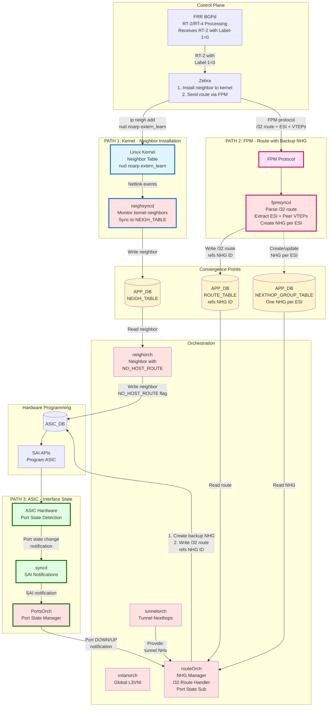
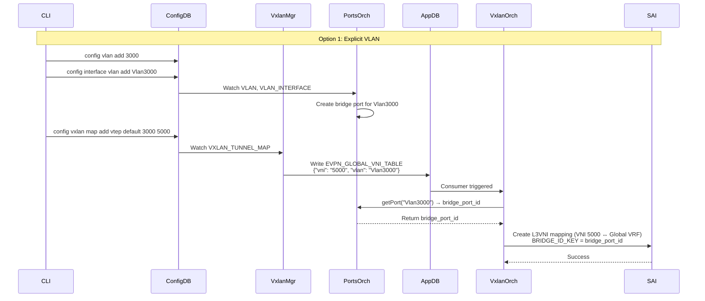
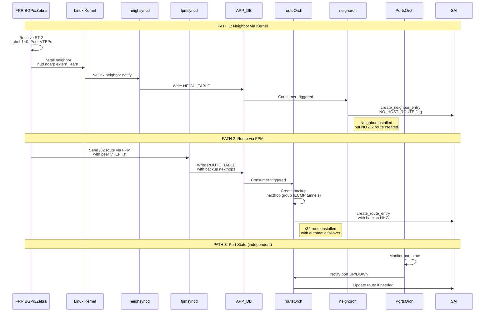

# L3 Multi-Homing with Backup Path Support for IP Data Centers

## High-Level Design Document

**Version**: 1.0  
**Author**: Patrice Brissette  
**Date**: May 12, 2026  
**Status**: Draft

---

## 1. Revision History

| Version | Date | Author | Description |
|---------|------|--------|-------------|
| 1.0 | May 12, 2026 | Patrice Brissette | Initial version |

---

## 2. Scope

### 2.1 In Scope
- Global L3VNI support in default VRF (VRF-less deployment)
- EVPN RT-2 neighbor synchronization with Label-1=0 (L3-only, no L2VNI)
- Neighbor and route separation (NO_HOST_ROUTE flag)
- Backup nexthop groups for automatic failover
- Multi-homing with all-active L3 forwarding
- Three-path architecture: kernel neighbor, FPM route, ASIC port state
- Configuration via CLI for global L3VNI
- Dummy VLAN/SVI for L3VNI decapsulation context

### 2.2 Out of Scope
- FRR BGP EVPN control plane changes (documented separately in FRR HLD)
- Traditional L2VNI-based EVPN (existing functionality unchanged)
- VRF-based L3VNI (existing functionality unchanged)
- DF (Designated Forwarder) election mechanisms (L2-only, not applicable to L3MH)
- Split-horizon enforcement (handled by FRR RT-4 processing)
- BUM traffic handling (L2 concern, not applicable to L3-only mode)

---

## 3. Definitions/Abbreviations

| Term | Definition |
|------|------------|
| **L3MH** | L3 Multi-Homing: Layer 3 based multi-homing without L2VNI dependency |
| **L2VNI** | Layer 2 VXLAN Network Identifier: VXLAN segment for L2 bridging |
| **L3VNI** | Layer 3 VXLAN Network Identifier: VXLAN segment for L3 routing |
| **RT-2** | EVPN Route Type 2: MAC-IP Advertisement route |
| **RT-4** | EVPN Route Type 4: Ethernet Segment route for multi-homing topology |
| **Label-1** | First MPLS label in RT-2 route: L2VNI in traditional EVPN, 0 (Explicit NULL) in L3MH |
| **Label-2** | Second MPLS label in RT-2 route: L3VNI for inter-subnet routing |
| **GRT** | Global Routing Table: Default VRF (VRF-less) |
| **VRF** | Virtual Routing and Forwarding: Isolated routing table instance |
| **VTEP** | VXLAN Tunnel Endpoint: Device that encapsulates/decapsulates VXLAN traffic |
| **FPM** | Forwarding Plane Manager: FRR protocol for sending routes to SONiC |
| **NHG** | Next Hop Group: SAI object representing ECMP or backup nexthop set |
| **NO_HOST_ROUTE** | SAI neighbor attribute: Prevents automatic /32 route creation |
| **DF** | Designated Forwarder: L2 multi-homing role (not used in L3MH) |
| **ESI** | Ethernet Segment Identifier: Multi-homing segment identifier (tracked by FRR) |
| **PIC** | Prefix Independent Convergence: Fast reroute mechanism |
| **SVI** | Switch Virtual Interface: Layer 3 interface for VLAN routing |

---

## Table of Contents

1. [Revision History](#1-revision-history)
2. [Scope](#2-scope)
   - 2.1 [In Scope](#21-in-scope)
   - 2.2 [Out of Scope](#22-out-of-scope)
3. [Definitions/Abbreviations](#3-definitionsabbreviations)
4. [Overview](#4-overview)
   - 4.1 [Feature Summary](#41-feature-summary)
   - 4.2 [Motivation](#42-motivation)
   - 4.3 [Design Principles](#43-design-principles)
5. [Requirements](#5-requirements)
   - 5.1 [Functional Requirements](#51-functional-requirements)
     - 5.1.1 [FR-1: Global L3VNI Support](#511-fr-1-global-l3vni-support)
     - 5.1.2 [FR-2: RT-2 Neighbor Synchronization](#512-fr-2-rt-2-neighbor-synchronization)
     - 5.1.3 [FR-3: Backup Nexthop Groups](#513-fr-3-backup-nexthop-groups)
     - 5.1.4 [FR-4: Three-Path Architecture](#514-fr-4-three-path-architecture)
     - 5.1.5 [FR-5: All-Active Multi-Homing](#515-fr-5-all-active-multi-homing)
   - 5.2 [Performance Requirements](#52-performance-requirements)
     - 5.2.1 [PR-1: Convergence](#521-pr-1-convergence)
     - 5.2.2 [PR-2: Scale](#522-pr-2-scale)
   - 5.3 [Configuration Requirements](#53-configuration-requirements)
     - 5.3.1 [CR-1: CLI Support](#531-cr-1-cli-support)
     - 5.3.2 [CR-2: Backward Compatibility](#532-cr-2-backward-compatibility)
6. [Architecture Design](#6-architecture-design)
   - 6.1 [System Architecture](#61-system-architecture)
   - 6.2 [Container Architecture](#62-container-architecture)
   - 6.3 [Database Schema Design](#63-database-schema-design)
     - 6.3.1 [New Tables](#631-new-tables)
     - 6.3.2 [Modified Tables](#632-modified-tables)
   - 6.4 [L3VNI and Dummy VLAN Coordination](#64-l3vni-and-dummy-vlan-coordination)
   - 6.5 [FPM Protocol Design Rationale](#65-fpm-protocol-design-rationale)
7. [High-Level Design](#7-high-level-design)
   - 7.1 [Component Design](#71-component-design)
     - 7.1.1 [vxlanmgr - Global L3VNI Configuration Manager](#711-vxlanmgr---global-l3vni-configuration-manager)
     - 7.1.2 [vxlanorch - Global L3VNI Tunnel Map Orchestration](#712-vxlanorch---global-l3vni-tunnel-map-orchestration)
     - 7.1.3 [fpmsyncd - FPM Message Processing](#713-fpmsyncd---fpm-message-processing-rtm_newnexthop--rtm_newroute)
     - 7.1.4 [neighorch - EVPN Neighbor with NO_HOST_ROUTE](#714-neighorch---evpn-neighbor-with-no_host_route)
     - 7.1.5 [routeOrch - Route Installation with NHG Resolution](#715-routeorch---route-installation-with-nhg-resolution)
     - 7.1.6 [PortsOrch - Port State Notification](#716-portsorch---port-state-notification)
     - 7.1.7 [fdborch - Skip L2 FDB for Label-1=0](#717-fdborch---skip-l2-fdb-for-label-10)
   - 7.2 [Data Flow Diagrams](#72-data-flow-diagrams)
     - 7.2.1 [Configuration Flow](#721-configuration-flow)
     - 7.2.2 [RT-2 Neighbor and Route Sync Flow](#722-rt-2-neighbor-and-route-sync-flow)
8. [SAI API](#8-sai-api)
   - 8.1 [SAI Objects Used](#81-sai-objects-used)
   - 8.2 [Critical SAI Attributes](#82-critical-sai-attributes)
     - 8.2.1 [NO_HOST_ROUTE Attribute](#821-no_host_route-attribute)
9. [Configuration and Management](#9-configuration-and-management)
   - 9.1 [CLI Commands](#91-cli-commands)
     - 9.1.1 [Add Global L3VNI](#911-add-global-l3vni)
     - 9.1.2 [Remove Global L3VNI](#912-remove-global-l3vni)
     - 9.1.3 [Show Commands](#913-show-commands)
     - 9.1.4 [Clear Commands](#914-clear-commands)
   - 9.2 [Configuration Files](#92-configuration-files)
     - 9.2.1 [CONFIG_DB Schema](#921-config_db-schema)
     - 9.2.2 [YANG Model Extension](#922-yang-model-extension)
   - 9.3 [YANG Model Updates](#93-yang-model-updates)
10. [Warmboot and Fastboot Design Impact](#10-warmboot-and-fastboot-design-impact)
    - 10.1 [Warmboot Support](#101-warmboot-support)
    - 10.2 [Fastboot Support](#102-fastboot-support)
11. [Restrictions/Limitations](#11-restrictionslimitations)
    - 11.1 [Current Limitations](#111-current-limitations)
    - 11.2 [Backward Compatibility](#112-backward-compatibility)
12. [Testing Requirements/Design](#12-testing-requirementsdesign)
    - 12.1 [Unit Testing](#121-unit-testing)
    - 12.2 [Integration Testing](#122-integration-testing)
    - 12.3 [System Testing](#123-system-testing)

---

## 4. Overview

### 4.1 Feature Summary

This document specifies the SONiC-SWSS implementation for **L3 Multi-Homing (L3MH) with multi-ECMP Backup Path support for IP Data Centers**. This architecture eliminates Layer 2 VNI dependencies and VRF requirements, enabling all-active L3 multi-homing with sub-second automatic failover using a single global L3VNI in the default routing table.

### 4.2 Motivation

Traditional EVPN architectures require:
- L2VNI configuration for every VLAN
- VRF instances for L3VNI routing
- DF election for multi-homing (L2-based)
- Complex VRF route leaking when global routing table is configured

This design simplifies IP-DC deployments by:
- **Eliminating L2VNI**: RT-2 routes with Label-1=0 (no L2 bridge FDB)
- **VRF-less operation**: L3VNI in global routing table
- **All-active L3 multi-homing**: No DF election needed
- **Sub-sec failover**: Backup nexthop groups enable automatic data plane switchover

### 4.3 Design Principles

**Core Concepts**:

1. **L2VNI Removal**: RT-2 routes with Label-1=0 processed as IP neighbors (L3 routing table), not FDB entries (L2 bridge table)

2. **Neighbor + Route Separation**: Neighbors installed with NO_HOST_ROUTE flag (MAC binding only); /32 routes created independently with backup nexthop groups

3. **Three-Path Architecture**:
   - **Kernel path**: Neighbor installation via zebra → kernel → neighsyncd
   - **FPM path**: Route installation with backup nexthops via FPM → fpmsyncd
   - **ASIC path**: Port state monitoring via ASIC → syncd → PortsOrch

4. **Global L3VNI**: L3VNI operates in default VRF without VRF binding. Requires dummy VLAN/SVI for decapsulation context with bridge port binding.

5. **Automatic Failover**: Port UP → direct forwarding; Port DOWN → automatic switch to ECMP backup tunnels (sub-sec)

**Key Differences from Traditional EVPN**:

| Aspect | Traditional EVPN | L3MH with Backup Path |
|--------|------------------|-----------------------|
| **VRF** | VRF-based L3VNI | Global routing table (no VRF) |
| **L2 Path** | FDB entries for MAC switching | Skipped (no FDB) |
| **RT-2 Processing** | FPM → VXLAN_FDB_TABLE | Kernel → NEIGH_TABLE + FPM → ROUTE_TABLE |
| **Neighbor Type** | Remote (via tunnel) | LOCAL (with backup tunnels) |
| **Backup Path** | None | ECMP tunnels to peer VTEPs |
| **Failover** | BGP reconvergence required | Automatic (< sec) |

---

## 5. Requirements

### 5.1 Functional Requirements

#### 5.1.1 FR-1: Global L3VNI Support
- **FR-1.1**: System SHALL support L3VNI in global routing table (default VRF) without VRF binding
- **FR-1.2**: System SHALL create tunnel map entry mapping VNI to gVirtualRouterId
- **FR-1.3**: System SHALL support dummy VLAN/SVI for L3VNI decapsulation context

#### 5.1.2 FR-2: RT-2 Neighbor Synchronization
- **FR-2.1**: System SHALL process RT-2 routes with Label-1=0 (Explicit NULL)
- **FR-2.2**: System SHALL skip L2 bridge FDB creation for Label-1=0 RT-2 routes
- **FR-2.3**: System SHALL install neighbors from RT-2 as LOCAL neighbors (not remote)
- **FR-2.4**: System SHALL install neighbors with NO_HOST_ROUTE SAI attribute

#### 5.1.3 FR-3: Backup Nexthop Groups
- **FR-3.1**: System SHALL create backup nexthop groups with multi-ECMP tunnels to peer VTEPs
- **FR-3.2**: System SHALL install /32 routes with primary interface + backup NHG
- **FR-3.3**: System SHALL support automatic failover from primary to backup on link down

#### 5.1.4 FR-4: Three-Path Architecture
- **FR-4.1**: System SHALL support neighbor installation via kernel path (zebra → kernel → neighsyncd)
- **FR-4.2**: System SHALL support route installation via FPM path (zebra → FPM → fpmsyncd)
- **FR-4.3**: System SHALL support port state monitoring via ASIC path (ASIC → syncd → PortsOrch)
- **FR-4.4**: System SHALL coordinate neighbor, route, and port state paths independently

#### 5.1.5 FR-5: All-Active Multi-Homing
- **FR-5.1**: System SHALL support all-active L3 multi-homing (no DF election)
- **FR-5.2**: System SHALL support multiple peers advertising same RT-2 neighbor
- **FR-5.3**: System SHALL program identical neighbors on all multi-homed peers with different backup sets
- **FR-5.4**: System SHALL support ECMP load balancing across backup tunnels

### 5.2 Performance Requirements

#### 5.2.1 PR-1: Convergence
- **PR-1.1**: Link down detection to backup path activation: < 500ms
- **PR-1.2**: Neighbor installation latency: < 100ms
- **PR-1.3**: Route installation latency: < 100ms

#### 5.2.2 PR-2: Scale
- **PR-2.1**: Minimum 10,000 EVPN neighbors per switch
- **PR-2.2**: Minimum 8 peer VTEPs per multi-homed segment
- **PR-2.3**: Minimum 100 multi-homed segments per switch

### 5.3 Configuration Requirements

#### 5.3.1 CR-1: CLI Support
- **CR-1.1**: System SHALL provide `config vxlan map add vtep <vrf> <vlan> <vni>` command (use "default" for global L3VNI)
- **CR-1.2**: System SHALL validate VLAN exists before creating tunnel map
- **CR-1.3**: System SHALL extend `show vxlan tunnel` to display tunnel maps (VNI-VLAN-VRF mappings)

#### 5.3.2 CR-2: Backward Compatibility
- **CR-2.1**: System SHALL allow coexistence of L3MH and traditional EVPN modes

---

## 6. Architecture Design

### 6.1 System Architecture



**Key Architecture Points**:
- **NHG per ESI**: One NEXTHOP_GROUP per ESI, shared by all /32 routes on that ESI
- **Scalability**: 1000 routes on same ESI = 1 NHG + 1000 route references (not 1000 × VTEP list)
- **Topology Updates**: PE joins/leaves ES → update 1 NHG, all routes automatically use new topology
- Neighbor, route, and port state paths operate independently
- NO_HOST_ROUTE prevents automatic /32 route creation
- Port state changes trigger automatic failover without control plane
- Routes reference NHG by ID (not inline backup nexthops)

### 6.2 Container Architecture

This feature primarily impacts the **swss** container:

| Container | Components Modified | Purpose |
|-----------|---------------------|---------|
| **swss** | vxlanmgr, vxlanorch, neighorch, routeOrch, fpmsyncd, fdborch, portsorch | Core L3MH data plane implementation |
| **bgp** | FRR (out of scope) | RT-2/RT-4 control plane (documented separately) |
| **syncd** | No changes | Standard SAI notification delivery |
| **database** | Schema changes | New tables and fields |

### 6.3 Database Schema Design

#### 6.3.1 New Tables

##### CONFIG_DB.VXLAN_TUNNEL_MAP (Extended for Global L3VNI)

**Traditional VRF-Based L3VNI** (3-argument command):
```json
{
  "VXLAN_TUNNEL_MAP": {
    "vtep|Vrf1|Vlan100": {
      "vni": "5000"
    }
  }
}
```

**Global L3VNI** (uses "default" as VRF name):
```json
{
  "VXLAN_TUNNEL_MAP": {
    "vtep|default|Vlan4000": {
      "vni": "5000"
    }
  }
}
```

**Purpose**: User configuration for VXLAN tunnel maps (both VRF-based and global L3VNI)
**Key Format**: Always 3 components: `vtep|<VRF_NAME>|<VLAN>`
**Key Difference**: 
- **VRF-based**: VRF = custom VRF name (e.g., "Vrf1")
- **Global**: VRF = "default" (reserved keyword for global routing table)
- vxlanmgr detects global L3VNI by checking if VRF == "default"
**Command**: 
- `config vxlan map add vtep <VRF> <VLAN> <VNI>` → creates `vtep|<VRF>|<VLAN>` key
  - Use "default" for global L3VNI: `config vxlan map add vtep default 4000 5000`
  - Use custom VRF for VRF-based: `config vxlan map add vtep Vrf1 100 5000`  
**Consumer**: vxlanmgr

##### APP_DB.EVPN_GLOBAL_VNI_TABLE

```json
{
  "EVPN_GLOBAL_VNI_TABLE": {
    "global_l3vni": {
      "vni": "5000",
      "tunnel_name": "vtep",
      "vlan": "Vlan4000",
      "src_ip": "10.0.0.1"
    }
  }
}
```

**Purpose**: Global L3VNI operational state  
**Producer**: vxlanmgr  
**Consumer**: vxlanorch

##### APP_DB.NEXTHOP_GROUP_TABLE

```json
{
  "NEXTHOP_GROUP_TABLE": {
    "nhg_100": {
      "type": "backup",
      "nexthops": "10.0.0.2,10.0.0.3,10.0.0.4",
      "vni": "5000",
      "esi": "01:11:11:11:11:11:11:11:11:11"
    }
  }
}
```

**Fields**:
- **nhg_id**: Unique NHG identifier (key format: "nhg_{id}")
- **type**: "backup" for EVPN L3MH protection groups
- **nexthops**: Comma-separated peer VTEP IP list
- **vni**: L3VNI for tunnel encapsulation
- **esi**: ESI this NHG belongs to (for debugging)

**Purpose**: Shared backup NHG objects - one NHG referenced by many routes for scalability  
**Producer**: fpmsyncd (processes RTM_NEWNEXTHOP from FRR)  
**Consumer**: routeOrch

**Key Design**: Routes reference NHG by ID instead of embedding VTEP lists
- **Scalability**: 1000 hosts on same ESI = 1 NHG (not 1000 VTEP lists)
- **Efficiency**: Topology change updates 1 NHG, all referencing routes automatically use new topology

#### 6.3.2 Modified Tables

##### APP_DB.ROUTE_TABLE (Enhanced)

```
Before:
  ROUTE_TABLE:0:192.168.100.10/32
    "nexthop": "10.10.10.1"
    "ifname": "bond0"

After (Recommended - NHG ID Reference):
  ROUTE_TABLE:0:192.168.100.10/32
    "nexthop": "10.10.10.1"
    "ifname": "bond0"
    "backup_nhg_id": "nhg_100"                        # NEW: Reference to shared NHG

Alternative (Not Scalable - Inline VTEP List):
  ROUTE_TABLE:0:192.168.100.10/32
    "nexthop": "10.10.10.1"
    "ifname": "bond0"
    "backup_nexthops": "10.0.0.2,10.0.0.3,10.0.0.4"  # Embedded - O(routes) memory
    "backup_vni": "5000"
```

**Design Choice**: NHG ID Reference (Recommended)

| Aspect | NHG ID Reference | Inline VTEP List |
|--------|------------------|------------------|
| **Memory (1K routes, same ESI)** | 1 NHG + 1K refs | 1K × VTEP list |
| **Topology Update** | Update 1 NHG | Update 1K routes |
| **Scalability** | O(ESIs) | O(routes) |
| **Protocol** | RTM_NEWNEXTHOP (kernel 5.3+) | Custom inline format |
| **Alignment** | Matches FRR ESI-based design | Generic backup |

**Purpose**: /32 routes with backup nexthop groups  
**Producer**: fpmsyncd  
**Consumer**: routeOrch

### 6.4 L3VNI and Dummy VLAN Coordination

#### Purpose

**L3VNI** serves different roles in FRR vs SONiC:

| Component | Role | Purpose |
|-----------|------|----------|
| **FRR** | Control Plane | L3VNI for BGP route import/export, RT-2/RT-4 generation with Label-2 |
| **SONiC** | Data Plane | L3VNI for VXLAN encap/decap, ASIC tunnel map binding |

**Dummy VLAN** is SONiC-specific:
- Required for ASIC L3VNI decapsulation context
- Provides: Decap → Bridge Domain (dummy VLAN) → SVI → IP Routing (global table)
- **FRR does not need to know about dummy VLAN**

#### User Configuration Workflow

**User responsibilities** (manual coordination required):

1. **Choose L3VNI value** (e.g., 5000) - MUST be identical in both FRR and SONiC
2. **Choose dummy VLAN ID** (e.g., 4000) - SONiC-only, user's choice
3. **Create dummy VLAN in SONiC**:
   ```bash
   config vlan add 4000
   config interface vlan add Vlan4000
   ```
4. **Configure L3VNI in SONiC** with VXLAN tunnel map:
   ```bash
   config vxlan map add vtep default 4000 5000
   ```
5. **Configure L3VNI in FRR** (separate, BGP control plane):
   ```bash
   evpn global-l3vni 5000
     route-target both 65000:5000
   ```

#### Coordination Requirements

| Parameter | FRR | SONiC | Must Match? | Notes |
|-----------|-----|-------|-------------|-------|
| **L3VNI value** | ✅ 5000 | ✅ 5000 | **YES - CRITICAL** | BGP Label-2 must match ASIC tunnel VNI |
| **Route Target** | ✅ 65000:5000 | ✅ 65000:5000 | **YES** | For RT import/export filtering |
| **Dummy VLAN** | ❌ Not used | ✅ 4000 | **NO** | SONiC ASIC implementation detail |
| **VTEP IP** | ✅ Loopback | ✅ Derived | **YES** | Must match for tunnel establishment |

### 6.5 FPM Protocol Design Rationale

#### Why NHG ID References Instead of Inline VTEP Lists?

This design uses **NHG ID references** for backup nexthops instead of embedding VTEP lists in each route.

#### Design Options Comparison

**Option 1: NHG ID Reference** (Selected):
```
Step 1: Create shared NHG (once per ESI)
  RTM_NEWNEXTHOP { id=100, vteps=[10.0.0.2, 10.0.0.3, 10.0.0.4], vni=5000 }
  
Step 2: Routes reference NHG by ID (many routes)
  RTM_NEWROUTE { prefix=192.168.100.10/32, backup_nhg_id=100 }
  RTM_NEWROUTE { prefix=192.168.100.20/32, backup_nhg_id=100 }
  ...
  (1000 routes on same ESI all reference same NHG-100)
```

**Option 2: Inline VTEP List** (Rejected):
```
RTM_NEWROUTE { prefix=192.168.100.10/32, backup_vteps=[10.0.0.2, 10.0.0.3, 10.0.0.4], vni=5000 }
RTM_NEWROUTE { prefix=192.168.100.20/32, backup_vteps=[10.0.0.2, 10.0.0.3, 10.0.0.4], vni=5000 }
...
(VTEP list embedded in every route message)
```

---

## 7. High-Level Design

### 7.1 Component Design

#### 7.1.1 vxlanmgr - Global L3VNI Configuration Manager

**Purpose**: Process global L3VNI configuration and validate dummy VLAN

**Key Functions**:
- Monitor CONFIG_DB.VXLAN_TUNNEL_MAP table (detect vrf="default" for global L3VNI)
- Validate VLAN parameter
- Verify dummy VLAN exists in CONFIG_DB
- Write to APP_DB.EVPN_GLOBAL_VNI_TABLE

**Implementation Details**:
- User must create VLAN before configuring L3VNI
  - User creates: `config vlan add 4000; config interface vlan add Vlan4000`
  - User configures: `config vxlan map add vtep default 4000 5000`
  - vxlanmgr validates VLAN exists in CONFIG_DB before proceeding
  - Error if VLAN not found: "VLAN Vlan4000 not found in CONFIG_DB"
  - VRF = "default" = global L3VNI (uses gVirtualRouterId)

**Files Modified**:
- `cfgmgr/vxlanmgr.cpp` (~150 new lines, ~20 modified)
- `cfgmgr/vxlanmgr.h` (class definition updates)

---

#### 7.1.2 vxlanorch - Global L3VNI Tunnel Map Orchestration

**Purpose**: Create SAI tunnel map entries for global L3VNI with bridge port binding

**Key Functions**:
- Monitor APP_DB.EVPN_GLOBAL_VNI_TABLE
- Create tunnel map: VNI ↔ gVirtualRouterId
- Bind tunnel map entry to dummy VLAN bridge port
- Support both VRF-based and global L3VNI modes

**Files Modified**:
- `orchagent/vxlanorch.cpp` (~200 new lines, ~50 modified)
- `orchagent/vxlanorch.h` (GlobalL3VniConfig structure)

---

#### 7.1.3 fpmsyncd - FPM Message Processing (RTM_NEWNEXTHOP + RTM_NEWROUTE)

**Purpose**: Process FPM messages from FRR for shared NHG creation and route installation

**Key Functions**:
1. **RTM_NEWNEXTHOP handler**: Create/update shared backup NHG objects
2. **RTM_NEWROUTE handler**: Install routes with NHG ID references
3. **Label-1=0 detection**: Route EVPN RT-2 to appropriate path

**Processing Flow**:
- **Step 1**: Parse RTM_NEWNEXTHOP messages, extract NHG ID, VTEP list, and VNI
- **Step 2**: Write to NEXTHOP_GROUP_TABLE (one NHG per ESI)
- **Step 3**: Parse RTM_NEWROUTE messages, extract backup_nhg_id reference
- **Step 4**: Write routes to ROUTE_TABLE with NHG ID reference (not inline VTEP list)

**Files Modified**:
- `fpmsyncd/routesync.cpp` (~350 new lines, ~120 modified)
- `fpmsyncd/routesync.h` (~40 lines)
- `fpmsyncd/fpmlink.cpp` (MPLS label parsing, NHG message routing)

---

#### 7.1.4 neighorch - EVPN Neighbor with NO_HOST_ROUTE

**Purpose**: Install EVPN neighbors with NO_HOST_ROUTE flag to prevent automatic /32 route creation

**Key Functions**:
- Detect EVPN neighbors from kernel (NTF_EXT_LEARNED flag)
- Install neighbor with SAI_NEIGHBOR_ENTRY_ATTR_NO_HOST_ROUTE = true
- Prevent automatic /32 route creation (routeOrch handles routes)

**Files Modified**:
- `orchagent/neighorch.cpp` (~180 new lines, ~40 modified)
- `orchagent/neighorch.h` (addEvpnNeighbor method)

---

#### 7.1.5 routeOrch - Route Installation with NHG Resolution

**Purpose**: Install /32 routes by resolving NHG ID references to actual VTEP lists

**Key Functions**:
1. Subscribe to NEXTHOP_GROUP_TABLE for NHG updates
2. Parse backup_nhg_id from ROUTE_TABLE
3. Resolve NHG ID → VTEP list from cache
4. Create backup NHG in SAI
5. Install route with primary + backup NHG
6. Handle NHG updates (topology changes)
7. Subscribe to PortsOrch for port state notifications

**Files Modified**:
- `orchagent/routeorch.cpp` (~450 new lines, ~110 modified)
- `orchagent/routeorch.h` (~60 lines)

---

#### 7.1.6 PortsOrch - Port State Notification

**Purpose**: Notify routeOrch of port state changes for automatic failover

**Key Functions**:
- Detect port UP/DOWN events from SAI notifications
- Maintain subscriber list for port state changes
- Notify subscribers (routeOrch) on state transitions

**Files Modified**:
- `orchagent/portsorch.cpp` (~80 new lines)
- `orchagent/portsorch.h` (notification interface)

---

#### 7.1.7 fdborch - Skip L2 FDB for Label-1=0

**Purpose**: Defensive check to skip FDB processing for RT-2 with Label-1=0

**Key Functions**:
- Check origin field in VXLAN_FDB_TABLE entries
- Skip processing if origin=evpn (handled by neighorch/routeOrch)

**Files Modified**:
- `orchagent/fdborch.cpp` (~30 new lines)

---

### 7.2 Data Flow Diagrams

#### 7.2.1 Configuration Flow



#### 7.2.2 RT-2 Neighbor and Route Sync Flow



---

## 8. SAI API

### 8.1 SAI Objects Used

This feature utilizes standard SAI APIs without requiring new objects or attributes:

| SAI Object | Purpose | Attributes Used |
|------------|---------|-----------------|
| **SAI_OBJECT_TYPE_VIRTUAL_ROUTER** | Global routing table | gVirtualRouterId (existing) |
| **SAI_OBJECT_TYPE_TUNNEL_MAP** | VNI ↔ VRF mapping | SAI_TUNNEL_MAP_ATTR_TYPE |
| **SAI_OBJECT_TYPE_TUNNEL_MAP_ENTRY** | Specific VNI mapping | VIRTUAL_ROUTER_ID_KEY, VNI_ID_VALUE, **BRIDGE_ID_KEY** |
| **SAI_OBJECT_TYPE_NEIGHBOR_ENTRY** | Neighbor with NO_HOST_ROUTE | SAI_NEIGHBOR_ENTRY_ATTR_NO_HOST_ROUTE |
| **SAI_OBJECT_TYPE_ROUTE_ENTRY** | /32 route with backup | Standard route attributes |
| **SAI_OBJECT_TYPE_NEXT_HOP_GROUP** | Backup ECMP tunnels | SAI_NEXT_HOP_GROUP_TYPE_ECMP |
| **SAI_OBJECT_TYPE_NEXT_HOP** | Tunnel nexthops | SAI_NEXT_HOP_TYPE_TUNNEL_ENCAP |

### 8.2 Critical SAI Attributes

#### 8.2.1 NO_HOST_ROUTE Attribute

**Attribute**: `SAI_NEIGHBOR_ENTRY_ATTR_NO_HOST_ROUTE = true`  
**Purpose**: Prevents automatic /32 route creation when neighbor is installed

**Usage**:
```cpp
sai_attribute_t attr;
attr.id = SAI_NEIGHBOR_ENTRY_ATTR_NO_HOST_ROUTE;
attr.value.booldata = true;
```

---

## 9. Configuration and Management

### 9.1 CLI Commands

#### 9.1.1 Add Global L3VNI

**Syntax**: Uses existing `config vxlan map` command with "default" as VRF name for global L3VNI

```bash
# VRF-based L3VNI (custom VRF)
config vxlan map add vtep <VRF_NAME> <VLAN_ID> <VNI>

# Global L3VNI (use "default" as VRF name)
config vxlan map add vtep default <VLAN_ID> <VNI>
```

**Complete Workflow**:
```bash
# Step 1: Create dummy VLAN (USER RESPONSIBILITY - REQUIRED)
config vlan add 4000
config interface vlan add Vlan4000

# Step 2: Configure global L3VNI using VXLAN tunnel map
config vxlan map add vtep default 4000 5000
# Note: "default" is reserved keyword for global routing table (gVirtualRouterId)
```

**Command Behavior**:
- **VRF = "default"**: Global L3VNI mode → uses gVirtualRouterId
- **VRF = custom name**: VRF-based L3VNI → uses custom VRF
- Always 3 arguments for consistent parsing

> ⚠️ **CRITICAL - L3VNI COORDINATION**: The L3VNI value (5000) MUST match between:
>   - **FRR**: `evpn global-l3vni 5000` (BGP control plane - RT-2/RT-4 generation)
>   - **SONiC**: `config vxlan map add vtep default 4000 5000` (Data plane - ASIC tunnel mapping)
>   - Mismatch will cause EVPN routing failures


#### 9.1.2 Remove Global L3VNI
```bash
config vxlan map del vtep default 4000 5000
# Note: Must specify VRF, VLAN, and VNI to identify the map entry
```

#### 9.1.3 Show Commands
```bash
show vxlan tunnel  # Extended to display tunnel maps including global L3VNI
show evpn neighbors
```

**Example Output for `show vxlan tunnel`**:
```
VTEP Information:
  Source IP: 10.0.0.1
  
Tunnel Maps:
VNI     VLAN        VRF         Type    Status
------  ----------  ----------  ------  ------
5000    Vlan4000    (global)    L3      Active
5001    Vlan100     Vrf1        L3      Active
1000    Vlan200     -           L2      Active
```

#### 9.1.4 Clear Commands
```bash
clear evpn
```

### 9.2 Configuration Files

#### 9.2.1 CONFIG_DB Schema

```json
{
  "VXLAN_TUNNEL_MAP": {
    "vtep|default|Vlan4000": {
      "vni": "5000"
    }
  },
  "VXLAN_TUNNEL": {
    "vtep": {
      "src_ip": "10.0.0.1"
    }
  },
  "VLAN": {
    "Vlan4000": {},
    "Vlan100": {}
  },
  "VLAN_MEMBER": {
    "Vlan100|Ethernet0": {
      "tagging_mode": "untagged"
    }
  },
  "VLAN_INTERFACE": {
    "Vlan4000": {},
    "Vlan100": {},
    "Vlan100|192.168.100.1/24": {}
  }
}
```

### 9.3 YANG Model Updates

**New Module**: `sonic-evpn.yang`

```yang
module sonic-evpn {
    namespace "http://github.com/sonic-net/sonic-evpn";
    prefix sevpn;
    
#### 9.2.2 YANG Model Extension

**File**: `sonic-vxlan.yang` (extend existing)

```yang
    container sonic-vxlan {
        container VXLAN_TUNNEL_MAP {
            list VXLAN_TUNNEL_MAP_LIST {
                key "tunnel_name vrf vlan";
                
                leaf tunnel_name {
                    type string;
                    description "VXLAN tunnel name (e.g., vtep)";
                }
                
                leaf vrf {
                    type string;
                    description "VRF name (use 'default' for global L3VNI)";
                }
                
                leaf vlan {
                    type string;
                    description "VLAN for tunnel mapping";
                }
                
                leaf vni {
                    type uint32;
                    mandatory true;
                    description "VNI for VXLAN encapsulation";
                }
            }
        }
    }
}
```

**Notes**: 
- All keys have 3 components: `vtep|<VRF>|<VLAN>`
- Global L3VNI: `vtep|default|Vlan4000` (vrf = "default")
- VRF-based L3VNI: `vtep|Vrf1|Vlan100` (vrf = custom name)

---

## 10. Warmboot and Fastboot Design Impact

### 10.1 Warmboot Support

**Warmboot Compatibility**: ✅ **Supported**

**State Reconciliation**:

1. **Configuration**: CONFIG_DB.VXLAN_TUNNEL_MAP persists across warmboot. vxlanmgr recreates APP_DB state and SAI tunnel maps.

2. **Neighbors**: Kernel neighbor table persists. neighsyncd re-syncs on startup. neighorch recreates SAI neighbor entries with NO_HOST_ROUTE.

3. **Routes**: FRR sends full RIB via FPM on reconnect. fpmsyncd writes routes with backup nexthops. routeOrch recreates /32 routes with backup NHG.

4. **Port State**: PortsOrch queries current states from SAI. routeOrch resubscribes to notifications.

**Warmboot Flow**:
```
System Restart → Kernel intact → Services restart → 
neighsyncd/FRR resync → Orchagent recreates SAI → 
Traffic resumes (< 1s downtime)
```

### 10.2 Fastboot Support

**Fastboot Compatibility**: ✅ Supported. No impact on fastboot timing. L3VNI tunnel maps and neighbors/routes recreated in parallel during boot.

---

## 11. Restrictions/Limitations

### 11.1 Current Limitations

| ID | Limitation | Impact | Mitigation |
|----|-----------|--------|------------|
| **L-1** | Requires FRR with RT-4 support | Control plane dependency | Use compatible FRR version (documented separately) |
| **L-2** | Requires SAI NO_HOST_ROUTE attribute | Feature enablement | Validate vendor support in Phase 2 |
| **L-3** | Reserved VLAN range 4000-4094 (95 VLANs) recommended for global L3VNI | Best practice to avoid conflicts | Use any VLAN ID if needed, just create it |
| **L-4** | Backup NHG memory overhead | Scales with neighbors × peer VTEPs | Target: 10K neighbors × 4 VTEPs = 40K entries |

### 11.2 Backward Compatibility

**Coexistence**: L3MH (global L3VNI), traditional L2VNI EVPN, and VRF-based L3VNI can coexist on same switch.

**Example**:
- VLAN 100-200: Traditional L2VNI EVPN
- VLAN 300-400: L3MH with global L3VNI
- Both operate independently

---

## 12. Testing Requirements/Design

### 12.1 Unit Testing

| Test ID | Component | Verification |
|---------|-----------|-------------|
| **UT-1** | vxlanorch | Global L3VNI with bridge port binding |
| **UT-2** | neighorch | EVPN neighbor with NO_HOST_ROUTE flag |
| **UT-3** | routeOrch | /32 route with backup NHG |
| **UT-4** | fpmsyncd | Label-1=0 detection and ROUTE_TABLE write |

### 12.2 Integration Testing

| Test ID | Scenario | Expected Result |
|---------|----------|----------------|
| **IT-1** | Three-path convergence | Neighbor (kernel) + Route (FPM) + Port state (ASIC) work together |
| **IT-2** | Automatic failover | Port DOWN triggers backup tunnel within 500ms |
| **IT-3** | ECMP load balancing | Traffic distributed ~33% across 3 backup VTEPs |

### 12.3 System Testing

| Test ID | Scope | Targets |
|---------|-------|--------|
| **ST-1** | Full topology | 4 leafs, link failures, traffic validation |
| **ST-2** | Scale | 10K neighbors, 4 peer VTEPs, 100 segments |
| **ST-3** | Warmboot | Traffic downtime < 1s, all state restored |

---
