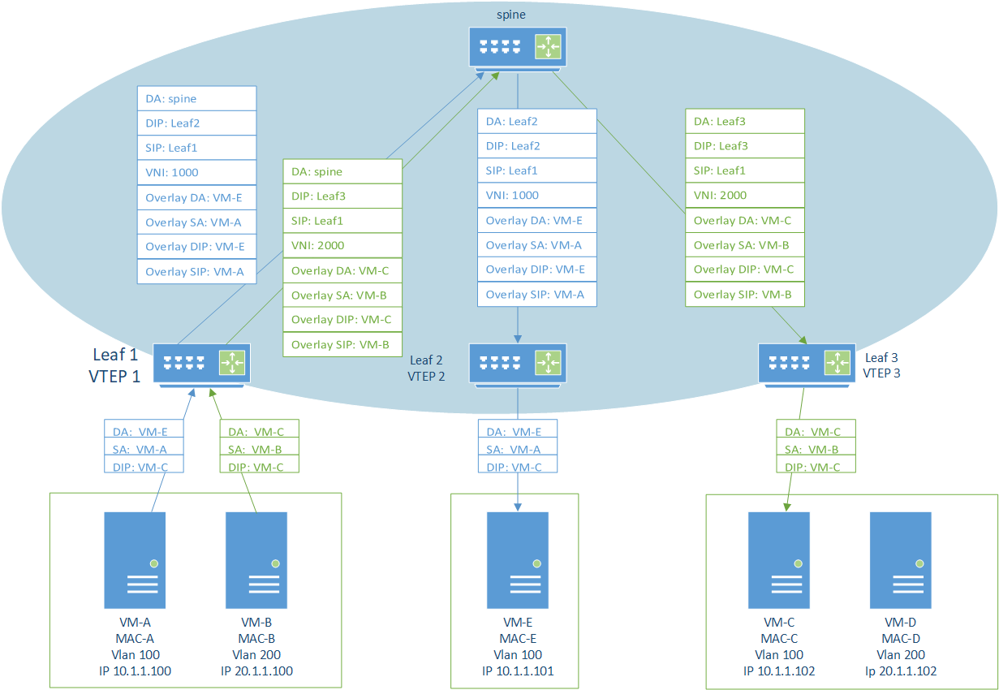
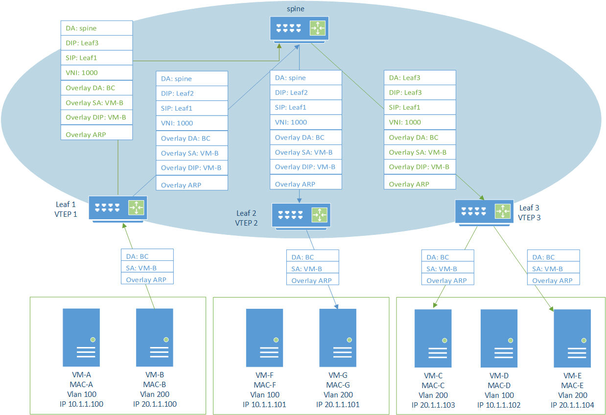
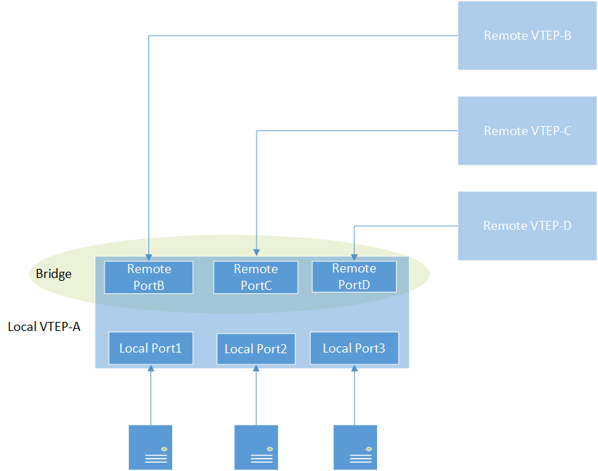
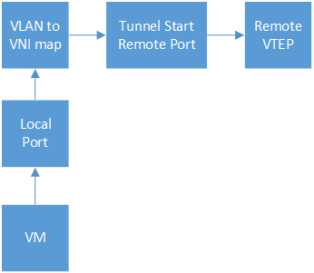
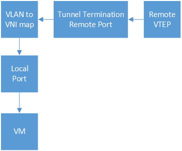
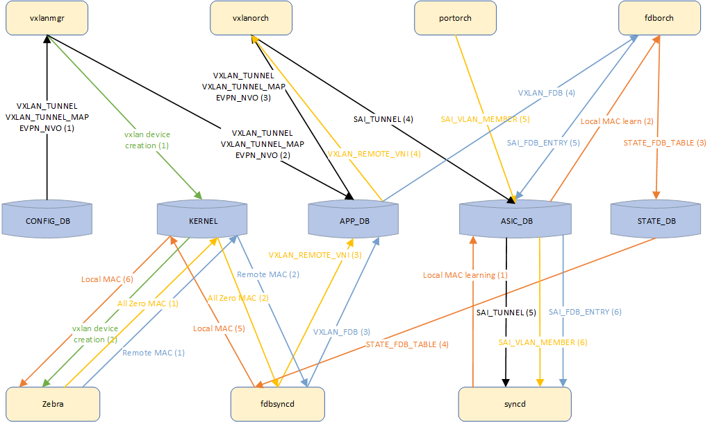
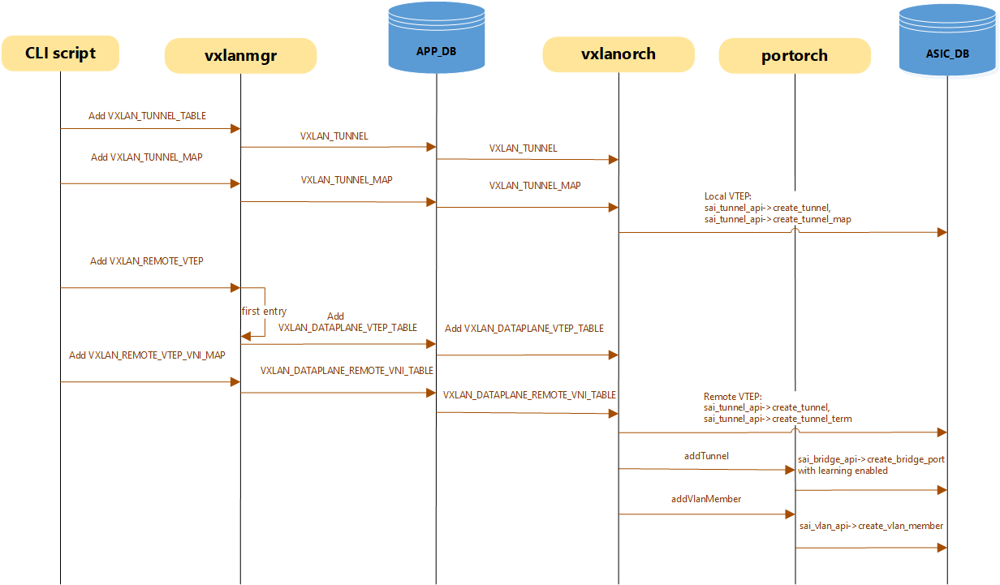
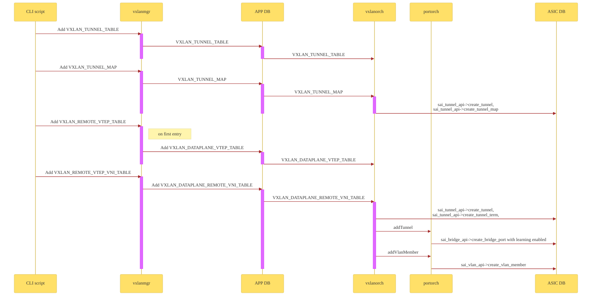
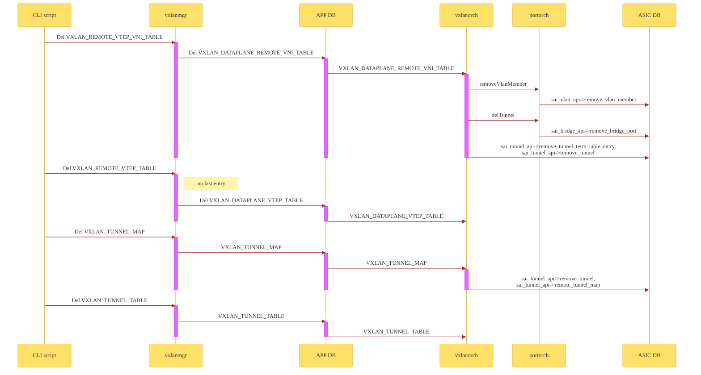
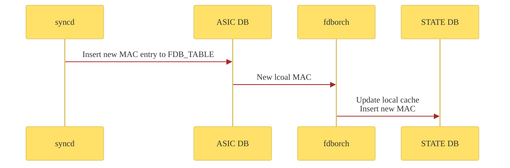

# DATA PLANE VXLAN HLD

## Table of Content

- [Revision](#revision)
- [Definition/Abbreviation](#definitionsabbreviations)
- [Overview](#overview)
- [Use case](#use-case)
- [Architecture](#architecture-design)
- [Configuration and management](#2-configuration-and-management)
- [Config DB Enhancements](#config-db-enhancements)
- [APP_DB Enhancements](#3-app_db-enhancements)
- [Modules Design and Flows](#4-modules-design-and-flows)
- [Tunnel creation](#43-tunnel-creation)
- [MAC learning flow](#figure-3-mac-learning-flow)

## Revision

|Rev | Date	 | Author       | Change Description |
|----|-------|--------------|--------------------|
|1.0 |       | Vladimir Kuk | Initial version    | 

### Scope

This document provides general information about the Data plane VXLAN feature implementation based on RFC 7348 in SONiC.
This document provides a high-level design (HLD) for supporting Data plane VXLAN configuration in SONiC. The aim is to enable users to manually configure VXLAN tunnels, bypassing the need for dynamic discovery protocols such as EVPN. This approach allows for simpler deployment scenarios and can be beneficial in environments where dynamic protocols are not preferred or supported.

### Definitions/Abbreviations

#### Table 1: Abbreviations

| Term  | Meaning                                   |
|-------|-------------------------------------------|
|VXLAN	|Virtual Extended LAN                       |
|VNI    |Vxlan Network Identifier                   |
|VTEP   |Vxlan Tunnel End Point                     |
|EVPN   |Ethernet Virtual Private Network           |
|NVO    |Network Virtualization Overlay             |
|VM     |Virtual Machine                            |
|BUM	|Broadcast, Unknown unicast and Multicast   |
|IMET	|Inclusive Multicast Ethernet Tag           |
|P2P	|Point to Point Tunnel                      |
|P2MP	|Point to MultiPoint Tunnel                 |
|BGP	|Border Gateway Protocol                    |

### Overview

Current SONiC implementation supports BGP-EVPN for VXLAN tunnel which provide auto-discovering of remote VTEPs, dynamic create and removal of tunnels, dynamic VLAN extensions, and so on. This however comes with complexity of setting BGP configuration, as well as high resource requirements, which are not necessarily warranted in smaller networks.

In order to simplify the configuration and reduce memory consumption, data plane L2 learning can be used instead.
The main differences between two approaches are that L2 learning is enabled on tunnel interface and all of the configuration is static.

### Requirements

* Static VXLAN Tunnel Configuration: Users should be able to manually specify VXLAN tunnel endpoints.
* VNI to VLAN Mapping: Users must be able to statically map VNIs to VLANs.
* L2 learning over local and remote VTEPs.
* L2 BUM traffic flooding over VNI.

##### Use case

Usually, VXLAN usage is based on BGP-EVPN deployement, which can be quite complex and heavy memory requirements.

In a controller-based VXLAN network, the configuration is static and distributed by the controller, while L2 forwarding relies on dynamic MAC learning. Examples of such edge datacenter providers include CISCO and VMware.

##### Limitations
* BGP EVPN and Data plane are mutually exclusive.
* P2MP tunnels are not supported

#### Configuration

Feature will support following configuration:
1. Remote VTEP name and IP address configuration.
2. Remote VTEP-VNI association.

##### Warm Boot Requirements
Warm reboot is intended to be supported for the following cases:

- Planned system warm reboot.
- Planned SwSS warm reboot.

### Functional description

##### L2 unicast forwarding over VXLAN
L2 unicast traffic is forwarded to the tunnel to which the MAC points to. Traffic received from VXLAN tunnels are mapped to a VLAN based on the received VNI and the VNI-VLAN lookup. The received traffic can be L2 unicast or BUM depending on the inner MAC lookup.

##### L2 flooding over VXLAN
Traffic received from the access ports are L2 forwarded over VXLAN tunnels if the DMAC lookup result does not match the switch MAC. The frame format is as described in RFC 7348. The VNI is based on the configured global VLAN-VNI map. BUM traffic is ingress replicated to all the tunnels which are part of the VLAN. The DIP of the BUM packets is the IP address of the remote VTEP. Traffic received from VXLAN tunnels are never forwarded onto another VXLAN tunnels.

##### Basic Approach

* Per each pair of Local VTEP-Remote VTEP, P2P tunnel is created.
* Each remote VTEP is represented by bridge port with MAC learning enabled.
* Per each remote VTEP - tunnel start and termination created.

Local traffic will be mapped accoding to VLAN-VNI configuration and send to port which represent correspong remote VTEP.

Traffic received on ports, that represent remote VTEPs, will be tunnel terminated, remote MAC will be learned on this remote port and traffic will be mapped according to VLAN-VNI map to local port.

### Architecture Design

No new blocks are required.

#### Container

No new container is added. The changes are added to existing container SwSS. The details of the changes will be discussed in the Design section below.

---
##### Figure 1. Current architecture

---

##### Figure 1. Dataplane architecture

---

#### SAI API
No changes to SAI APIs are required.

### 2. Configuration and management

#### CLI Enhancements

##### 5.1 Remote VTEP IP configuration

* Ability to add and remove remote VTEP
   - config vxlan remote add <vtepname> <ipv4-address>
   - config vxlan remote del <vtepname>
   - vtepname is a string. 
   - ipv4-address is an IPV4 address in dotted notation A.B.C.D

##### 5.2 Remote VTEP-VNI association configuration 

* Ability to add and remove remote VTEP assiciation to VNI
   - config vxlan remote map add <vtepname> <vni-id>
   - config vxlan remote map del <vtepname> <vni-id>
   - vtepname is a string. 
   - ipv4-address is an IPV4 address in dotted notation A.B.C.D

#### Yang Enhancements

##### VXLAN_REMOTE_VTEP

container VXLAN_REMOTE_VTEP {

    description "config db VXLAN_REMOTE_VTEP table";

    list VXLAN_REMOTE_VTEP_LIST {

        key "name";
        max-elements 1;

        leaf name {
        /* vni devices are created of the form 'name'-vlanid
            The kernel has a max limit of 15 chars for netdevices.
            keeping aside 5 chars for hyphen and vlanid the
            name should have a max of 10 chars */

            type string {
                length 1..10;
            }
        }

        leaf src_ip {
            type inet:ip-address;
        }
    }
}

##### VXLAN_REMOTE_VTEP_VNI

container VXLAN_REMOTE_VTEP_VNI {

    description "config db VXLAN_REMOTE_VTEP_VNI table";

    list VXLAN_REMOTE_VTEP_VNI_LIST {
        key "name mapname";

        leaf name {
            type leafref {
                path "/svxlan:sonic-vxlan/svxlan:VXLAN_REMOTE_VTEP_LIST/svxlan:VXLAN_REMOTE_VTEP_VNI_LIST/svxlan:name";
            }
        }

        leaf mapname {
            type string;
        }

        leaf vni {
            mandatory true;
            type stypes:vnid_type;
        }
    }
}

#### Config DB Enhancements

##### 2.1 VXLAN_REMOTE_VTEP_TABLE

Producer: config manager

Consumer: VxlanMgr

Description: This table holds the tunnel name specifying the VTEP remote IP used for data plane configured tunnels.

; New table

key = VXLAN_REMOTE_VTEP_TABLE|remote_vtep_name
                          ; VTEP name as a string
; field = value
remote_ip = ipv4_address ; Source Ipv4 address of the remote VTEP.

##### 2.2 VXLAN_REMOTE_VTEP_VNI_TABLE

Producer: config manager

Consumer: VxlanMgr

Description: This table specifies mapping of remote VTEP to VNI.

Schema:

; New table
; specifies mapping of remote VTEP to VNI

key = VXLAN_REMOTE_VTEP_VNI_TABLE|remote_vtep_name|tunnel_map_name
                  ; Remote VTEP name + tunnel map name
; field = value
vni = 1*8DIGIT    ; vni that remote VTEP is member of.

#### 3. APP_DB Enhancements

##### 3.1 VXLAN_DATAPLANE_VTEP_TABLE

Producer: config manager

Consumer: VxlanMgr

Description: This table holds the tunnel name specifying local VTEP's source IP used for Dataplane configured tunnels.

Schema:

;New table
;holds the tunnel name specifying the VTEP source IP used for Dataplane configured tunnels

key = VXLAN_DATAPLANE_VTEP:nvo_name
                          ; nvo or VTEP name as a string
; field = value
source_vtep = tunnel_name

##### 3.2 VXLAN_DATAPLANE_VTEP_VNI_TABLE

Producer: config manager

Consumer: VxlanMgr

Description: This specifies mapping of remote VTEP to VNI.

Schema:

; New table
; specifies mapping of remote VTEP to VNI

key = VXLAN_DATAPLANE_VTEP_VNI:remote_vtep_name:map_name
                  ; Remote VTEP name + map name
; field = value
vni = VNI id

### 4. Modules Design and Flows

Following configurations are required for enabling EVPN L2 service on SONiC device:

Create VXLAN data plane tunnel.
Configure L2VNI-VLAN mapping for the given NVO.
Configure control plane with remote VTEPS and bind them to the same vni as source VTEP.

#### 4.1 The corresponding CONFIG_DB entries are as follows

VLAN|Vlan{{vlan_id}}
    "vlanid" : {{vlan_id}}

VXLAN_TUNNEL_TABLE|{{source_vtep_name}}
    "src_ip" : {{ipv4_address}}

VXLAN_TUNNEL_MAP|{{source_vtep_name}}|{{tunnel_map_name}}
    "vni" : {{vni_id}}
    "vlan" : {{vlan_id}}

VXLAN_REMOTE_VTEP_TABLE|{{remote_vtep_name}}
    "src_ip" : {{ipv4_address}}

VXLAN_REMOTE_VTEP_VNI_TABLE|{{remote_vtep_name}}|{{tunnel_map_name}}
    "vni" : {{vni_id}}

#### 4.2 Example for CONFIG_DB configuration

VLAN|Vlan10
    "vlanid" : 10

VXLAN_TUNNEL_TABLE|vtep1
    "src_ip" : "1.1.1.1"

VXLAN_TUNNEL_MAP|{{source_vtep_name}}|{{tunnel_map_name}}
    "vni" : 1000
    "vlan" : 10

VXLAN_REMOTE_VTEP_TABLE|vtep2
    "remote_ip" : 1.1.1.2

VXLAN_REMOTE_VTEP_VNI_TABLE|vtep2|map_1000
    "vni" : 1000

### 4.3 Tunnel creation

Current implementation, supports both P2P and P2MP VXLAN tunnels for L2 scenarios.
    The difference between the two approaches is the way in which the remote end point flooding is done. In P2P tunnel based approach, for every end point, a P2P tunnel object is created in the hardware and the bridge port created with this tunnel object is added as a VLAN member to the VLAN. In P2MP tunnel based approach, for each remote end point, along with local P2MP tunnel bridge port is added as L2MC group member along for the L2MC group associated with the VLAN.

To correctly detect received packet's entry VXLAN tunnel source interface, P2P tunnel must be used, so Vendor's SAI implementation must support P2P.

Adding first entry to VXLAN_REMOTE_VTEP_TABLE will create in entry VXLAN_DATAPLANE_VTEP_TABLE using existing VXLAN tunnel source address.

#### 4.3.1 P2P Tunnel creation
   
   Currently created on :
   * IMET route rx
   * IP Prefix route handled by VRF construct.

   Will be also created on remote tunnel VTEP add.

  - Adding remote tunnel map entry will create entry in VXLAN_DATAPLANE_VTEP_VNI_TABLE (similar to IMET route Rx in EVPN).

- SAI objects related to tunnel are created.
    - Tunnel SAI object is created with the mapper IDs created for the VTEP.
- BridgePort SAI object with the tunnel oid is created. Learning is disabled for EVPN tunnels and enabled for data plane tunnels.
- Port object of type Tunnel created in the portsorch.

The data plane tunnels are created when the remote VTEP is added and will be deleted when the last remote VTEP is removed.

##### Figure 2. Dataplane tunnel creation

##### Figure 3. Dataplane tunnel removal

#### 4.3.2 P2MP Tunnel Creation
A P2MP tunnel uses a single tunnel termination. Because tunnel termination is utilized for MAC learning, supporting P2MP requires manual MAC configuration, which undermines the goal of dynamic learning.

#### 4.4 Fdborch
* FDB entries will be learned over tunnel interface and not configured via APP_VXLAN_FDB_TABLE_NAME(as in BGP-EVPN). So they will be handled as regular MAC entries.
* Enable learning of MAC entries received over tunnel interfaces. 

##### Figure 3. MAC learning flow

#### 4.5 Fdbsyncd
Fdbsync will subsribe to VXLAN_DATAPLANE_VTEP_TABLE and will ignore MAC entries on data plane interface.

#### 4.6 Warm Reboot Support
No changes are expected.

#### 4.7 ARP and ND Suppression
Not required nor supported for data plane tunnels.

