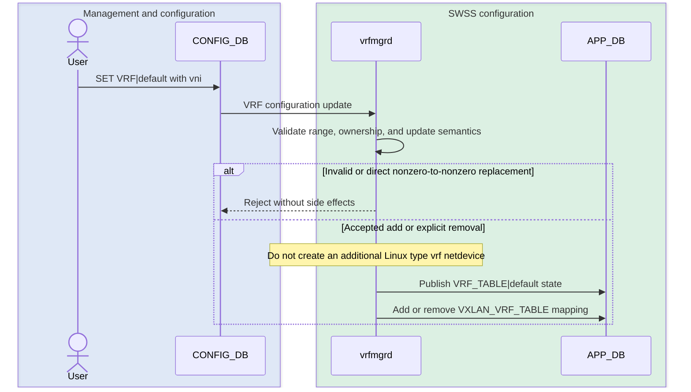
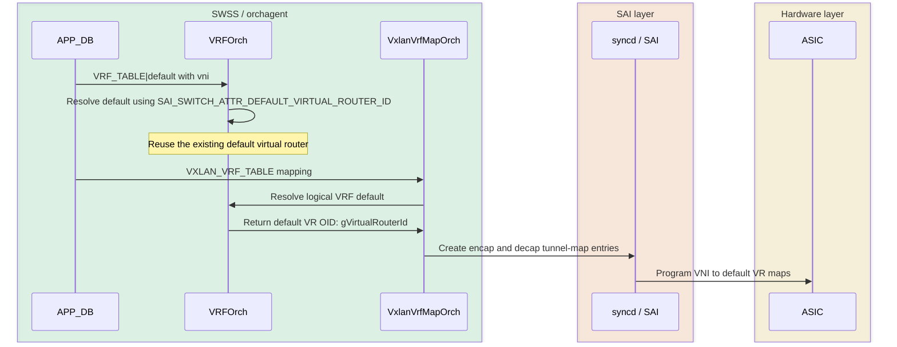
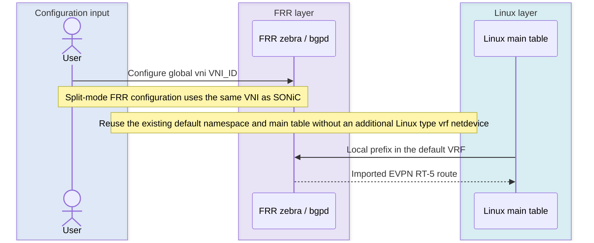
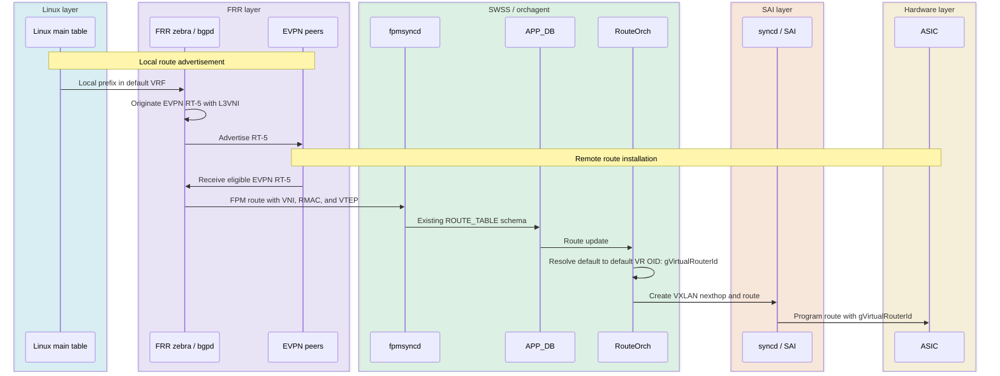

# L3VNI over Default VRF (Global Routing Table)

## Table of Contents

- [1. Revision](#1-revision)
- [2. Scope](#2-scope)
- [3. Definitions/Abbreviations](#3-definitionsabbreviations)
- [4. Overview](#4-overview)
- [5. Requirements](#5-requirements)
- [6. Architecture Design](#6-architecture-design)
- [7. High-Level Design](#7-high-level-design)
- [8. SAI API](#8-sai-api)
- [9. Configuration and Management](#9-configuration-and-management)
- [10. Warmboot and Fastboot Design Impact](#10-warmboot-and-fastboot-design-impact)
- [11. Memory Consumption](#11-memory-consumption)
- [12. Restrictions/Limitations](#12-restrictionslimitations)
- [13. Test Cases](#13-test-cases)
- [14. References](#14-references)

## 1. Revision

The document remains at revision 0.1 while the design is under community review.

| Revision | Date | Author | Description |
| --- | --- | --- | --- |
| 0.1 | 2026-09-08 | Nitin Kalavala | Initial version |

## 2. Scope

This document describes the SONiC changes required to associate one EVPN Layer-3 VNI (L3VNI) with the default VRF, also called the global routing table (GRT).

The design covers SONiC configuration and management, interaction with FRR's existing EVPN and FPM interfaces, SWSS orchestration, database interfaces, SAI programming, and configuration lifecycle.

The following are not introduced or supported by this design:

- It does not modify the EVPN protocol.
- It does not create an additional Linux VRF netdevice for the default VRF.
- It does not create an additional SAI virtual-router object for the default VRF.
- It does not support more than one L3VNI per VRF.

## 3. Definitions/Abbreviations

| Term | Definition |
| --- | --- |
| EVPN | Ethernet VPN. |
| FPM | Forwarding Plane Manager interface between FRR and SONiC. |
| GRT | Global routing table; the Linux main table and SONiC default VRF. |
| `gVirtualRouterId` | Orchagent variable that holds the default VR OID: an opaque SAI object ID assigned by SAI and returned through the switch attribute `SAI_SWITCH_ATTR_DEFAULT_VIRTUAL_ROUTER_ID`. |
| L3VNI | VXLAN Network Identifier used for Layer-3 overlay routing. |
| NVO | Network Virtualization Overlay identifying the source VTEP. |
| RMAC | Remote router MAC carried with an EVPN route or nexthop. |
| RT-2 | EVPN MAC/IP Advertisement route (route type 2). |
| RT-5 | EVPN IP Prefix route (route type 5). |
| SAI | Switch Abstraction Interface. |
| SVI | Switch Virtual Interface. |
| VTEP | VXLAN Tunnel Endpoint. |
| VRF | Virtual Routing and Forwarding instance. |

## 4. Overview

SONiC already maps an L3VNI to a named VRF through the `vni` field in `VRF` configuration. A named VRF is represented by a Linux `type vrf` netdevice and a SAI virtual-router object. The default VRF instead uses the existing default network namespace, Linux main routing table, and switch-owned SAI default virtual router. This feature must reuse those existing default-routing objects rather than create or delete replacements.

The proposed design treats `default` as a logical VRF for configuration and VNI bookkeeping. At the hardware boundary, it resolves `default` to the default VR OID (`gVirtualRouterId`). This is an opaque SAI object ID assigned by SAI and returned through the switch attribute `SAI_SWITCH_ATTR_DEFAULT_VIRTUAL_ROUTER_ID`; it has no fixed numeric value. Existing VXLAN tunnel maps, FPM route processing, RouteOrch, and SAI route programming are reused.

FRR already supports associating an L3VNI with the default VRF. Consistent with the existing EVPN VXLAN split-configuration model, the operator configures the same VNI separately in SONiC and FRR. The SONiC configuration programs the SWSS and SAI mapping; it does not automatically configure FRR.

### 4.1 Default-VRF representation by layer

Each layer continues to use its native representation of the default VRF. The integration translates between these representations at existing component boundaries.

| Layer or interface | Representation | Use and translation |
| --- | --- | --- |
| Configuration input | Name `default` | The operator uses `default` when configuring or displaying the mapping. |
| CONFIG_DB | Key `VRF\|default` | Stores the L3VNI intent under the reserved VRF name. |
| `vrfmgrd` and APP_DB | Name `default`; key `VRF_TABLE\|default` | Carries the logical VRF name into orchagent. |
| FRR configuration | Global `vni <vni>` or `vrf default` context | Configured separately by the operator using existing FRR syntax. The VNI must match the SONiC VRF-to-VNI mapping. |
| FRR internal state | `VRF_DEFAULT`, `vrf_id_t` value 0 | FRR's internal representation of the default VRF. |
| Linux kernel | Default network namespace and main routing table (normally 254) | Routes remain in the GRT; no additional Linux `type vrf` netdevice is created. |
| `VRFOrch` | Logical name `default` mapped to the default VR OID (`gVirtualRouterId`) | Converts the APP_DB name to the opaque SAI object ID returned through `SAI_SWITCH_ATTR_DEFAULT_VIRTUAL_ROUTER_ID`. |
| SAI and ASIC_DB | Default VR OID (`gVirtualRouterId`) | Used by tunnel-map and route objects programmed for the default VRF. |

## 5. Requirements

1. Configure one VNI in the range 1 through 16777215 on `VRF|default`.
2. Reuse the existing VXLAN tunnel, NVO, VLAN/VNI, EVPN, and route pipelines.
3. Originate local GRT prefixes and install imported RT-5 routes in the GRT.
4. Preserve existing RT-2 MAC/IP route processing for a VLAN SVI in the default VRF. The IP portion of an eligible imported RT-2 route must be installed in the GRT. SONiC must program the resulting host route and associated neighbor and FDB state through the existing pipelines, using the default VR OID (`gVirtualRouterId`) for VRF-qualified objects.
5. Program default-VRF remote routes using the default VR OID (`gVirtualRouterId`) while preserving the existing VXLAN nexthop attributes.
6. Do not create or delete an additional Linux `type vrf` netdevice for the default VRF. Do not create or delete the switch-owned SAI default virtual router.
7. Support add, delete, restart, reload, and supported reboot flows idempotently.
8. Preserve existing named-VRF behavior and configuration compatibility.
9. Reject an in-place change from one nonzero VNI to another. Updating the VNI requires removal of the existing mapping, completion of its dependent cleanup, and a fresh add, consistent with named-VRF behavior.
10. Support the default VRF and named tenant VRFs concurrently, using a distinct L3VNI for each VRF. Reject a request to associate a VNI that is already assigned to another VRF, leaving the existing mapping and operational state unchanged.

## 6. Architecture Design

### 6.1 Configuration manager layer



### 6.2 Orchagent and SAI mapping layer



### 6.3 FRR and Linux routing layer



### 6.4 Local and remote route programming layer



Across all four sequences, `default` is the logical management and orchestration name, the Linux main table is the routing-table representation, and the default VR OID (`gVirtualRouterId`) is the SAI and hardware representation. `gVirtualRouterId` is the opaque SAI object ID returned through `SAI_SWITCH_ATTR_DEFAULT_VIRTUAL_ROUTER_ID`. No additional Linux `type vrf` netdevice or SAI virtual-router object is created.

## 7. High-Level Design

### 7.1 Changes by layer

| Layer | Required change |
| --- | --- |
| Management and YANG | Accept `default` as the reserved VRF name for L3VNI configuration. `sonic-utilities` performs first-line validation of the VNI range, the VNI-to-VLAN prerequisite, and cross-VRF VNI uniqueness before updating CONFIG_DB. The existing `VRF` table schema is reused. |
| FRR configuration | No FRR daemon change or automatic SONiC-to-FRR VNI propagation is introduced. In split configuration mode, the operator separately configures the matching global `vni <vni>` in FRR and removes it separately when deleting or replacing the SONiC mapping. |
| `vrfmgrd` | Process the `vni` field for `default`, while skipping Linux `type vrf` netdevice creation and deletion for `default`. Reject a direct nonzero-to-nonzero VNI change and conflicting ownership before side effects. Accept `vni=0` from the delete CLI as an explicit mapping-removal indication. Publish the existing APP_DB VRF and VXLAN-VRF entries and reconcile dependency ordering. |
| `VRFOrch` | Register the logical name `default` with the default VR OID (`gVirtualRouterId`) obtained through `SAI_SWITCH_ATTR_DEFAULT_VIRTUAL_ROUTER_ID`. Apply the same replacement and ownership checks defensively, accept explicit mapping removal, and avoid creating/removing a SAI virtual router or duplicating default-VR link-local routes. |
| `VxlanVrfMapOrch` | Create and remove the existing VNI-to-VR and VR-to-VNI tunnel-map entries using the default VR OID (`gVirtualRouterId`). Reject duplicate default-VRF maps and cross-VRF VNI ownership before calling SAI. Track the logical VRF name explicitly for correct deletion. |
| `fpmsyncd` and `RouteOrch` | No new route format is required. Reuse existing VXLAN route and nexthop handling; unqualified routes resolve to the default VR OID (`gVirtualRouterId`). |
| Linux networking | Keep the SVI and routes in the default namespace and main routing table. Do not create an additional Linux `type vrf` netdevice named `default`. |
| SAI and syncd | No interface change. Program existing tunnel-map, tunnel-nexthop, and route-entry objects using the default VR OID (`gVirtualRouterId`). |

### 7.2 Configuration and add flow

1. The operator configures the VXLAN tunnel, NVO, VLAN/VNI mapping, and `VRF|default` with an L3VNI.
2. In the separate FRR split configuration, the operator configures the same L3VNI using the global `vni <vni>` command.
3. Before updating CONFIG_DB, `sonic-utilities` confirms that the VNI is valid, has the required VNI-to-VLAN mapping, and is not already assigned to another VRF.
4. `vrfmgrd` recognizes `default` as a logical entry. It does not call Linux `type vrf` link create/delete operations for `default`.
5. `vrfmgrd` publishes `VRF_TABLE|default` and the corresponding `VXLAN_VRF_TABLE` entry in APP_DB.
6. `VRFOrch` maps `default` to the default VR OID (`gVirtualRouterId`) obtained through `SAI_SWITCH_ATTR_DEFAULT_VIRTUAL_ROUTER_ID`, records the VNI, and applies the existing L3VNI VLAN state.
7. `VxlanVrfMapOrch` creates encap and decap tunnel-map entries between the VNI and the default VR OID (`gVirtualRouterId`).
8. After the required kernel VXLAN and SVI objects are available, Zebra associates the independently configured VNI with the default routing table.

Dependencies may arrive in any order. A mapping that cannot yet be completed remains pending and is reconciled when its tunnel, NVO, or VLAN/VNI dependency appears. Repeated SET operations must be idempotent.

The normal CLI path rejects a VNI already owned by another VRF before updating CONFIG_DB. `vrfmgrd`, `VRFOrch`, and `VxlanVrfMapOrch` repeat the ownership check as defensive boundaries for configuration introduced through other CONFIG_DB or APP_DB writers, configuration reload, and restart replay. A rejected update does not publish new operational state or disturb the existing mapping.

### 7.3 Remote route flow

1. BGP imports an eligible EVPN RT-5 route into the default VRF.
2. Zebra sends the route through FPM with the existing VNI, RMAC, and tunnel endpoint attributes.
3. `fpmsyncd` writes the existing APP_DB route representation.
4. RouteOrch creates or reuses the VXLAN tunnel nexthop and programs the route with the default VR OID (`gVirtualRouterId`) as `vr_id`.
5. syncd programs the route and nexthop through existing SAI APIs.

ECMP nexthops resolve through the same default-VRF L3VNI.

### 7.4 Local route flow

1. A local prefix is installed in the Linux main table and learned by FRR in the default VRF.
2. Existing BGP EVPN address-family policy selects the prefix for advertisement.
3. BGP originates an RT-5 route using the default-VRF L3VNI, route target, and configured or automatically derived route distinguisher.

The route distinguisher must be unique for the VTEP and may be explicitly configured or derived by the existing FRR logic.

### 7.5 Delete and re-add flow

The operator removes the SONiC VRF-to-VNI mapping through the supported CLI. SWSS reconciles the resulting APP_DB and ASIC state using dependency-safe, idempotent cleanup; the design does not require a specific delivery order among internal delete events. The VRF-to-VNI mapping must be removed before the operator deletes the VNI-to-VLAN map, NVO, or tunnel on which it depends.

The delete CLI writes `vni=0` to the CONFIG_DB VRF entry. The value `0` is the existing internal removal indication used by the named-VRF workflow and is outside the valid configured VNI range of 1 through 16777215. `vrfmgrd` removes the APP_DB VXLAN-VRF entry and publishes `vni=0` in the retained logical `VRF_TABLE|default` entry. `VRFOrch` interprets the update as removal of the L3VNI association and clears its L3VNI state without deleting the VRF. This design reuses that existing contract and does not introduce a separate deletion flag.

The delete flow removes the VNI-to-VRF and VRF-to-VNI tunnel-map entries and clears the L3VNI VLAN state and logical VNI bookkeeping. The Linux main table, SVI, switch-owned SAI default virtual router, and unrelated default-VR state remain present.

The independently managed FRR VNI configuration may be removed before or after the SONiC mapping. SONiC does not remove it automatically.

`vrfmgrd` shall retain the exact APP_DB keys it published so cleanup does not depend on configuration objects that may already have been removed. A SET that changes directly from one nonzero VNI to another is rejected and leaves the old mapping intact. To update the VNI, the operator deletes the `VRF|default` VNI mapping with `config vrf del_vrf_vni_map default`, waits for the logical L3VNI and tunnel-map cleanup to complete, and then adds `VRF|default` with the new VNI. This matches the named-VRF configuration workflow. For `default`, deletion applies only to SONiC's logical configuration and mapping state; the Linux global routing table and switch-owned SAI default virtual router remain present throughout.

### 7.6 Database interfaces

No new tables are introduced.

| Database | Entry | Purpose |
| --- | --- | --- |
| CONFIG_DB | `VRF\|default` with `vni` | Operator intent for the default-VRF L3VNI. |
| APP_DB | `VRF_TABLE\|default` with `vni` | Logical VRF-to-VNI input to `VRFOrch`. |
| APP_DB | `VXLAN_VRF_TABLE\|<tunnel>:<map>` | Existing VRF tunnel-map request. |
| STATE_DB | `VRF_OBJECT_TABLE\|default` | Logical readiness and manager/orch synchronization. |
| ASIC_DB | Existing tunnel-map and route objects | Hardware programming using the default VR OID (`gVirtualRouterId`). |

Example configuration:

```json
{
    "VRF": {
        "default": {
            "vni": "5000"
        }
    }
}
```

The configuration is rejected if VNI 5000 is already assigned as an L3VNI to another VRF.

The SONiC and FRR L3VNI configurations are independently managed and must specify the same VNI. SONiC configuration validation does not inspect FRR configuration, and FRR does not validate the SONiC VRF-to-VNI mapping. A mismatch is an operator configuration error that can cause the control-plane VNI and hardware tunnel mapping to diverge, resulting in loss of forwarding. This design does not automatically synchronize or correct the two configurations. Operators can compare the SONiC VRF-to-VNI show output with FRR EVPN VNI operational state when troubleshooting.

### 7.7 Failure handling and serviceability

- A missing dependency leaves the operation pending and identifies the missing object in logs.
- A partial tunnel-map failure rolls back objects created by that operation or retries from a consistent state.
- Show commands display the mapping as `default` and expose whether configuration is pending or operational.
- Counters and logs use the logical VRF name `default` and the configured VNI.

## 8. SAI API

No new SAI API or attribute is required. The design uses existing virtual-router, tunnel-map, tunnel-nexthop, and route-entry APIs. The default VRF is represented by the default VR OID (`gVirtualRouterId`), an opaque SAI object ID assigned by SAI and returned through `SAI_SWITCH_ATTR_DEFAULT_VIRTUAL_ROUTER_ID`.

## 9. Configuration and Management

The existing `VRF` table and `vni` field are reused. Configuration tools shall allow the reserved name `default`, validate dependencies and uniqueness, reject a direct nonzero-to-nonzero VNI change, and preserve the entry through save/reload. A VNI update is expressed as removal of the existing mapping followed by a fresh add.

The existing CLI commands shall accept `default` as `<vrf-name>`:

```text
config vrf add_vrf_vni_map default <vni>
config vrf del_vrf_vni_map default
```

These commands configure only the SONiC VRF-to-VNI mapping and its SWSS/SAI state. They do not add or remove the FRR `vni` configuration. In split configuration mode, the operator must separately configure the same nonzero VNI in FRR and remove that FRR configuration when deleting or replacing the SONiC mapping.

The add command writes the default-VRF mapping to CONFIG_DB, after which `vrfmgrd` publishes the corresponding APP_DB state. The delete command uses the existing `vni=0` removal indication; `vrfmgrd` and `VRFOrch` shall remove the L3VNI mapping while retaining the logical default VRF and its underlying Linux and SAI objects. A subsequent add may assign the new VNI.

`show vxlan vrfvnimap` shall include an active default-VRF mapping alongside named VRFs and shall not display the `vni=0` removal state. For example:

```text
+--------+---------+-------+
| VTEP   | VRF     |   VNI |
+========+=========+=======+
| vtep1  | default |  5000 |
+--------+---------+-------+
Total count : 1
```

The following existing VXLAN dependencies apply unchanged:

- Configure the VNI-to-VLAN map before configuring the VRF-to-VNI map because the VNI is used for both L2 and L3.
- If the operator attempts to delete a VNI-to-VLAN map while the VNI remains associated with the default or a named VRF, the supported CLI rejects the request and leaves the existing configuration and operational state unchanged. The operator must first remove the VRF-to-VNI mapping. SWSS shall defensively preserve the existing mapping when equivalent out-of-order events are received through configuration reload or another configuration producer, and reconcile the deletion after the dependency has been removed.

## 10. Warmboot and Fastboot Design Impact

Warm restart restores the logical `default` mapping from CONFIG_DB/APP_DB and reuses the existing Linux and SAI default-router objects. Reconciliation must avoid duplicate tunnel-map entries and must not attempt to recreate or remove the SAI default virtual-router object. FRR restores its independently maintained split configuration through existing FRR mechanisms; this design does not reconstruct it from CONFIG_DB. Fastboot and cold boot follow the normal VXLAN and route restoration ordering.

## 11. Memory Consumption

The feature adds one logical VRF record, existing tunnel-map entries, and normal route/nexthop state. No new persistent process or large data structure is introduced.

## 12. Restrictions/Limitations

- Only one L3VNI may be associated with the default VRF.
- One VNI may be owned by only one VRF. This applies equally when the tenant or default VRF is configured first.
- An active mapping cannot be changed directly from one nonzero VNI to another. Remove it with `config vrf del_vrf_vni_map default` and add the new VNI after cleanup completes; this does not delete the underlying default routing objects.
- The VNI must satisfy the existing SONiC VXLAN/NVO and VLAN/VNI requirements.
- This feature does not introduce new route-leaking behavior or policy. Existing explicitly configured route-leaking mechanisms remain unchanged and must not regress. A route installed in the GRT through an existing supported route-leaking mechanism is processed like any other GRT route and may be advertised through the default-VRF L3VNI subject to existing FRR policy. Automatic route leaking is not enabled by associating an L3VNI with the default VRF.
- Platform forwarding behavior remains subject to existing SAI capabilities and scale limits.
- The feature does not change non-`vni` attributes of the SAI default virtual router.

## 13. Test Cases

### 13.1 `vrfmgrd` tests

1. Add `VRF|default` with a valid VNI after its VNI-to-VLAN map and NVO exist; verify `VRF_TABLE|default` and the expected `VXLAN_VRF_TABLE` entry in APP_DB without creating an additional Linux `type vrf` netdevice for `default`.
2. Process `vni=0` from the delete CLI; verify the APP_DB VXLAN mapping is removed while the Linux main table remains.
3. Replay the same VNI and verify idempotency.
4. Reject an invalid VNI, a direct nonzero-to-nonzero replacement, and a VNI already owned by another VRF without partial APP_DB or STATE_DB state.
5. Exercise VRF, NVO, tunnel, and VNI-to-VLAN configuration in different orders and verify eventual convergence.

### 13.2 `VRFOrch` tests

1. Resolve `default` to the default VR OID (`gVirtualRouterId`) returned through `SAI_SWITCH_ATTR_DEFAULT_VIRTUAL_ROUTER_ID`, without creating or deleting a SAI virtual router.
2. Add, replay, remove, and re-add the default-VRF VNI while preserving the logical default VRF and its object ID.
3. Reject direct replacement and duplicate ownership from direct APP_DB input.
4. Verify pending operations, reference-counted deletion, warm-restart replay, and dependency recovery do not leave stale L3VNI state.
5. Run the existing named-VRF tests to verify no behavioral regression.

### 13.3 `VxlanVrfMapOrch` tests

1. Create one VNI-to-VRF and one VRF-to-VNI tunnel-map entry using the default VR OID (`gVirtualRouterId`).
2. Reject a second mapping for `default` and a VNI already mapped to another VRF before calling SAI.
3. Delete both directions cleanly and verify retry or rollback behavior for partial failures.
4. Verify the VNI-to-VLAN map cannot be removed while the VRF-to-VNI mapping depends on it.
5. Exercise NVO creation, tunnel-map creation, VRF mapping, deletion, and recreation in different orders.

### 13.4 `sonic-utilities` tests

1. Verify `config vrf add_vrf_vni_map default <vni>` accepts `default`, validates the VNI-to-VLAN prerequisite and uniqueness, and writes the expected CONFIG_DB state.
2. Verify `config vrf del_vrf_vni_map default` emits the existing `vni=0` removal indication and permits a subsequent add with another VNI.
3. Verify `show vxlan vrfvnimap` displays the active `default` mapping and excludes a removed `vni=0` mapping.
4. Verify named-VRF CLI and show behavior remains unchanged.
5. Attempt to delete a VNI-to-VLAN map while its VNI remains associated with the default or a named VRF; verify that the CLI rejects the request and leaves CONFIG_DB unchanged.

### 13.5 Cross-component race and negative tests

1. Permute the ordering of VNI-to-VLAN, NVO, tunnel, default-VRF mapping, and route updates; verify either a clean pending state or convergence when the dependency appears.
2. Attempt to remove the tunnel, NVO, or VNI-to-VLAN map while the default-VRF mapping is active; verify dependency enforcement and no partial cleanup.
3. Delete a pending mapping, replay stale events, and rapidly delete/re-add with another VNI; verify the final database and ASIC_DB state matches the latest valid configuration.
4. Configure duplicate ownership in both orders—tenant first and default first—and verify rejection at each defensive layer.

### 13.6 SpyTest scenarios

1. Configure and remove the default-VRF L3VNI with the supported SONiC CLI, configure the matching FRR global `vni <vni>` separately, and validate configuration, show output, CONFIG_DB, APP_DB, ASIC_DB, FRR, and kernel state.
2. Advertise local IPv4 and IPv6 prefixes as EVPN RT-5 routes and verify the expected L3VNI and route attributes on a remote node.
3. Receive remote IPv4 and IPv6 RT-5 routes, verify installation in the GRT, and validate bidirectional data traffic through the VXLAN overlay.
4. Remove and re-add the mapping with a different VNI and verify withdrawal, cleanup, reprovisioning, and restored traffic.
5. Validate negative dependency cases, including duplicate VNI ownership and attempted tunnel or VNI-to-VLAN deletion while referenced.
6. Validate cold reboot and warm restart with configuration persistence, route recovery, and no duplicate hardware objects.
7. Run named-VRF and L2 EVPN sanity coverage in the same topology to detect regressions.
8. Advertise locally learned IPv4 and IPv6 MAC/IP reachability as RT-2 routes from an L2VNI whose VLAN SVI is in the default VRF, and verify the expected route attributes on a remote node.
9. Receive eligible IPv4 and IPv6 MAC/IP RT-2 routes for an L2VNI whose VLAN SVI is in the default VRF. Verify that FRR installs the IP portions as `/32` and `/128` host reachability in the GRT and that SONiC programs the corresponding route, neighbor, and FDB state using the default VR OID (`gVirtualRouterId`) for VRF-qualified objects.
10. Withdraw and relearn the RT-2 routes and exercise MAC mobility. Verify that the GRT host routes and associated neighbor and FDB state converge without stale entries or traffic loss beyond normal convergence.
11. Exercise RT-2 host reachability and RT-5 prefix routing concurrently in the default VRF. Verify correct VNI selection, route isolation, and bidirectional IPv4 and IPv6 traffic, and confirm that existing named-VRF RT-2 behavior does not regress.
12. Configure different default-VRF L3VNIs in SONiC and FRR. Verify that the mismatch is visible by comparing SONiC VRF-to-VNI state with FRR EVPN VNI operational state, does not cause a process failure or stale state, and recovers after the operator restores matching configuration.
13. Configure an existing supported route-leaking policy between a named VRF and the GRT while the default-VRF L3VNI is active. Verify that explicitly leaked routes are installed in the intended routing table, follow the existing FRR EVPN advertisement policy, and forward without regressing route isolation for non-leaked prefixes.

## 14. References

- [SONiC HLD template](https://github.com/sonic-net/SONiC/blob/master/doc/guidelines/hld_template.md)
- [FRR PR #22343: EVPN default-VRF L3VNI functional coverage](https://github.com/FRRouting/frr/pull/22343)
- [SONiC VXLAN documentation](https://github.com/sonic-net/SONiC/tree/master/doc/vxlan)
