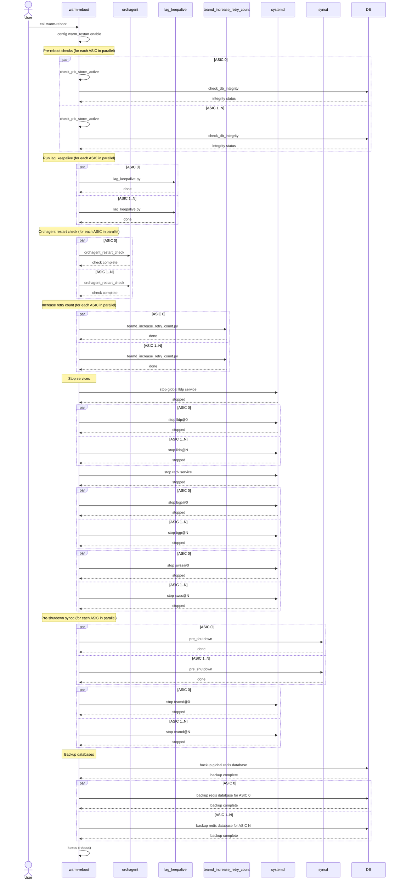
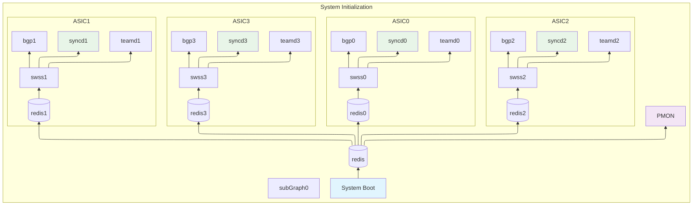
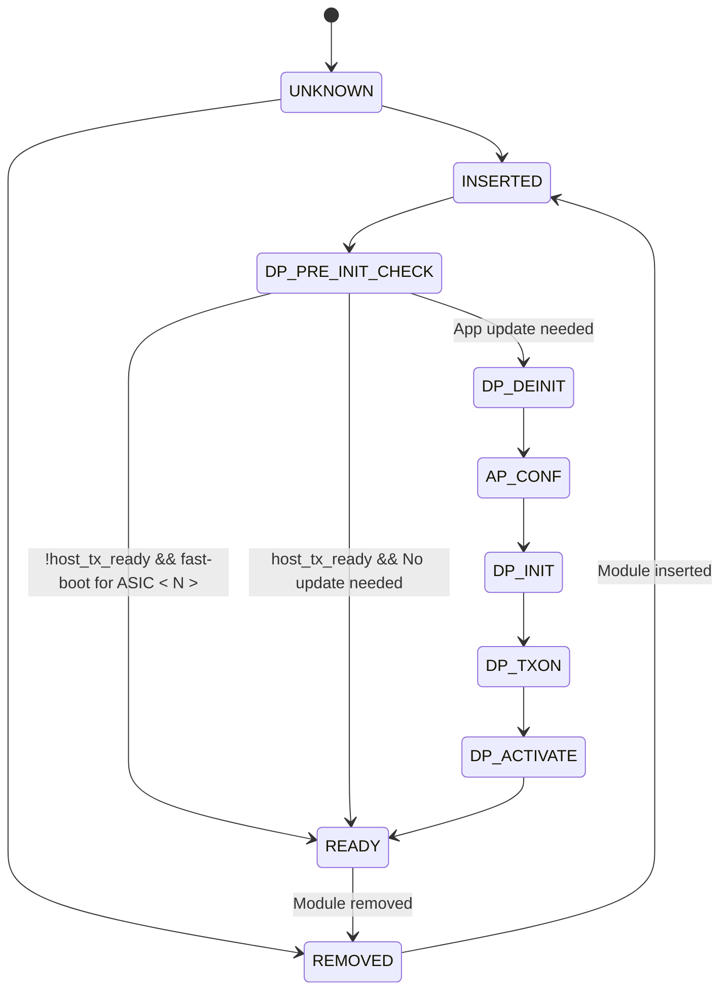
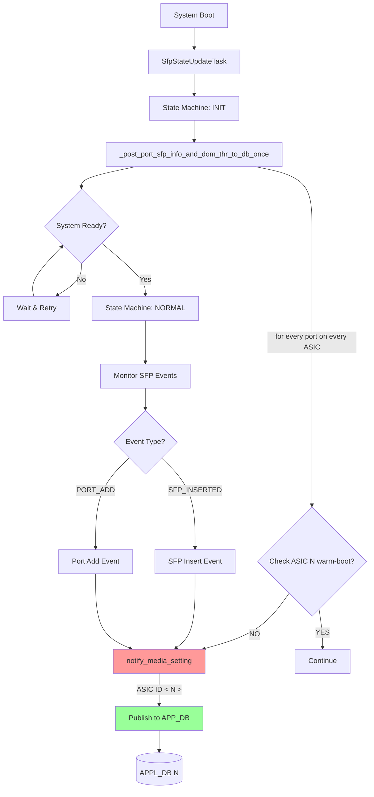
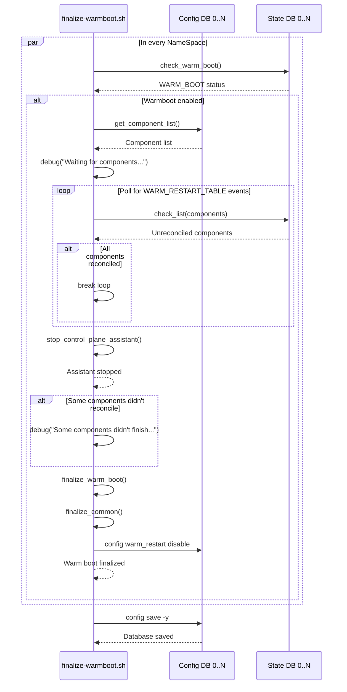

# Multi ASIC warm reboot

## Table of Content

- [Multi ASIC warm reboot](#multi-asic-warm-reboot)
	- [Table of Content](#table-of-content)
		- [1. Revision](#1-revision)
		- [2. Scope](#2-scope)
		- [3. Definitions/Abbreviations](#3-definitionsabbreviations)
		- [4. Overview](#4-overview)
		- [5. Requirements](#5-requirements)
		- [Restrictions/Limitations](#restrictionslimitations)
		- [6. Architecture Design](#6-architecture-design)
		- [7. High-Level Design](#7-high-level-design)
		- [Warm reboot state](#warm-reboot-state)
		- [CONFIG\_DB](#config_db)
			- [WARM\_RESTART](#warm_restart)
		- [STATE\_DB](#state_db)
			- [WARM\_RESTART\_ENABLE\_TABLE](#warm_restart_enable_table)
			- [WARM\_RESTART\_TABLE](#warm_restart_table)
		- [Warm shutdown](#warm-shutdown)
				- [Sequence diagram of warm-reboot](#sequence-diagram-of-warm-reboot)
			- [Failure handling](#failure-handling)
		- [Warm startup](#warm-startup)
			- [High-Level system boot flow for Multi-ASIC system](#high-level-system-boot-flow-for-multi-asic-system)
		- [Database](#database)
		- [SWSS](#swss)
		- [PMON](#pmon)
				- [Xcvrd CmisManagerTask](#xcvrd-cmismanagertask)
					- [CmisManagerTask CMIS state diagram:](#cmismanagertask-cmis-state-diagram)
				- [Xcvrd SfpStateUpdateTask](#xcvrd-sfpstateupdatetask)
					- [SfpStateUpdatTask flowchart:](#sfpstateupdattask-flowchart)
		- [Global services](#global-services)
		- [Warmboot finalizer](#warmboot-finalizer)
		- [8. SAI API](#8-sai-api)
		- [9. Configuration and management](#9-configuration-and-management)
			- [9.1. Manifest (if the feature is an Application Extension)](#91-manifest-if-the-feature-is-an-application-extension)
			- [9.2. CLI/YANG model Enhancements](#92-cliyang-model-enhancements)
			- [9.3. Config DB Enhancements](#93-config-db-enhancements)
		- [10. Warmboot and Fastboot Design Impact](#10-warmboot-and-fastboot-design-impact)
		- [Warmboot and Fastboot Performance Impact](#warmboot-and-fastboot-performance-impact)
		- [11. Memory Consumption](#11-memory-consumption)
		- [12. Testing Requirements/Design](#12-testing-requirementsdesign)
			- [12.1. Unit Test cases](#121-unit-test-cases)
			- [12.2. System Test cases](#122-system-test-cases)
		- [13. Open/Action items - if any](#13-openaction-items---if-any)


### 1. Revision  

| Revision | Author           |
| -------- | ---------------- |
| 1.0      | Stepan Blyshchak |

### 2. Scope  

This document covers warm-reboot support on Multi-ASIC devices.

### 3. Definitions/Abbreviations 

| Abbreviation | Definition                              |
| ------------ | --------------------------------------- |
| ASIC         | Application specific integrated cirtuit |
| FW           | Firmware                                |
| SDK          | Software Development Kit                |
| SAI          | Switch Abstraction Interface            |
| CPA          | Control plane assistant                 |


### 4. Overview 

High level overview of SONiC architecutre for Multi-ASIC devices:


### 5. Requirements

- All FW and software ASIC packages (SDK/SAI/syncd/orchagent) are of the same version accross all ASICs
- Warm-reboot process in SONiC remains the same from the perspective of single ASIC
- ASIC local failures should not block warm-rebooting healthy ASICs
- Control plane assistant is out of scope of this document 
- Single ASIC warm-reboot is out of scope

### Restrictions/Limitations  

- This design covers systems with all front-end ASICs

### 6. Architecture Design 

No SONiC architecture changes.

### 7. High-Level Design 

### Warm reboot state

To successfully perform a warm reboot, the switch must preserve certain pre-reboot state information. This includes a Redis database snapshot, LAG (Link Aggregation Group) states, saved PDUs, and other relevant data. All such information is stored under the `/host/warmboot/` directory.

In a multi-ASIC system, each namespace is responsible for saving its own warmboot state under `/host/warmboot$DEV`, where `$DEV` is either empty (for the global namespace) or set to the ASIC number for each ASIC-specific namespace. In single-ASIC systems, `$DEV` remains empty, so the path does not change.

To ensure that each container has access to the appropriate warmboot state, the host directory `/host/warmboot$DEV` is mounted into the container at `/var/warmboot/`. This approach allows each container to read and write its own warmboot namespace specific data independently.

The directory mapping is performed as follows:

```
  -v /host/warmboot$DEV:/var/warmboot/
```

As a result, each container operates within its designated ASIC-specific or global directory. Applications inside the container do not require any modifications, as they continue to access warmboot data through the `/var/warmboot/` alias.

Example:

```
/host/warmboot/
└── dump.rdb
/host/warmboot0/
├── dump.rdb
├── sai_warm_boot_dump
└── teamd
    ├── Ethernet0
    └── PortChannel101
/host/warmboot1/
├── dump.rdb
├── sai_warm_boot_dump
└── teamd
    ├── Ethernet512
    └── PortChannel102
...
```

**Affected components**:
  - sonic-buildimage: docker_image_ctl.j2

### CONFIG_DB

#### WARM_RESTART

This table defines configuration parameters for the warm reboot process, such as timers for neighsyncd, teamd, and BGP. During startup, the device may enter transitional states that do not reflect the final network state. Timers delay disruptive actions until the control plane has converged. When a timer expires, the corresponding application begins its reconciliation process, unless other conditions are met (e.g., BGP receives an EoR marker).

These parameters typically use default values in testing, but can be adjusted for specific network requirements. Each application reads its timer values from Redis within its own namespace. Because these settings are ASIC-specific, they are stored separately in each namespace database to ensure applications access the correct configuration.


In multi-ASIC systems, the CLI has been enhanced to automatically configure the CONFIG_DB within each ASIC namespace. This ensures that timer settings remain consistent across all ASICs, providing symmetric warm restart behavior throughout the device.

config command:
```
admin@dut:~# config warm_restart neighsyncd_timer 180
```

**NOTE**: If future requirements call for configuring warm restart timers on a per-ASIC basis, the CLI can be enhanced with a `-n` or `--namespace` option to support this functionality. At present, the recommended approach is to maintain symmetric timer settings across all ASICs for consistency.

### STATE_DB

#### WARM_RESTART_ENABLE_TABLE

The indicator for an ongoing warm reboot is stored in the `WARM_RESTART_ENABLE_TABLE` within the STATE_DB. Applications check this flag to determine whether the current boot mode is a warm boot. Since each application connects to the Redis database within its own namespace, the flag must be set individually for every namespace undergoing a warm reboot.

There are dedicated CLI commands—primarily intended for use by the `warm-reboot` script rather than direct user interaction—that read from and write to this table.

To support multi-ASIC systems, the CLI has been extended with `-n` or `--namespace` options, allowing operations to target a specific namespace.

config command:
```
admin@dut:~# config warm_restart enable -n asic0
```

show command:
```
admin@dut:~# show warm_restart config -n asic0
name    enable    timer_name    timer_duration    eoiu_enable
------  --------  ------------  ----------------  -------------
system  true      NULL          NULL              NULL
```

#### WARM_RESTART_TABLE

SONiC monitors the progress of warm restarts using the `WARM_RESTART_TABLE` in the STATE_DB. Each application that participates in warm restart registers itself in this table, storing its current restart count and the state of its warm boot state machine. Every entry in the table represents a specific application.

To provide better visibility in multi-ASIC systems, the CLI has to be enhanced with `-n` or `--namespace` options. This allows users to display warm restart information for a specific namespace, making it easier to monitor and troubleshoot warm restart status on a per-ASIC basis.

```
admin@sonic:~# show warm_restart state -n asic0
name          restore_count  state
----------  ---------------  --------
gearsyncd                 0
teammgrd                  0
buffermgrd                0  disabled
vrfmgrd                   0  disabled
bgp                       0  disabled
nbrmgrd                   0
orchagent                 0
syncd                     0
fdbsyncd                  0  disabled
coppmgrd                  0
neighsyncd                0
vlanmgrd                  0
teamsyncd                 0
tunnelmgrd                0
portsyncd                 0
intfmgrd                  0  disabled
vxlanmgrd                 0
```

By default, on a Multi-ASIC systems `show warm_restart` command displays all namespaces:

```
admin@sonic:~# show warm_restart state

For namespace global:

name    restore_count    state
------  ---------------  -------

For namespace asic0:

name         restore_count  state
---------  ---------------  ----------
orchagent                1  restored
syncd                    1  reconciled

For namespace asic1:

name         restore_count  state
---------  ---------------  ----------
orchagent                1  restored
syncd                    1  reconciled

For namespace asic2:

name         restore_count  state
---------  ---------------  ----------
orchagent                1  restored
syncd                    1  reconciled

For namespace asic3:

name         restore_count  state
---------  ---------------  ----------
orchagent                1  restored
syncd                    1  reconciled
```

**Affected components**:
  - sonic-utilities: show/config CLI update

### Warm shutdown

Entrypoint for warmboot is `warm-reboot` command.

`warm-reboot` script updates:

- Single ASIC shutdown sequence remains exactly the same
- Shutdown sequence from the perspective of a single ASIC in a Multi ASIC environment remains the same
- On a Mutli-ASIC device the `warm-reboot` script maintains a list of ASICs to operate on
- Every ASIC specific operation is executed for each ASIC in parallel:
  - e.g: ```docker exec -it swss$dev orchagent_restart_check``` 
- In case of ASIC failure (e.g: restart_check failure), that ASIC is removed from the list, ASIC is cold booted in startup path

##### Sequence diagram of warm-reboot



---
This is the expected output of warm-reboot command on Multi-ASIC device:

```
admin@sonic:~$ sudo warm-reboot -v
Fri Oct 24 01:29:24 PM UTC 2025 Starting warm-reboot
Fri Oct 24 01:29:25 PM UTC 2025 Saving counters folder before warmboot...
Fri Oct 24 01:29:26 PM UTC 2025 Pre-reboot checks on multi-ASIC devices are not yet implemented
Fri Oct 24 01:29:27 PM UTC 2025 Loading kernel without secure boot
Fri Oct 24 01:29:28 PM UTC 2025 Cleared reboot states
Fri Oct 24 01:29:28 PM UTC 2025 asic0: Cleared reboot states
Fri Oct 24 01:29:28 PM UTC 2025 asic1: Cleared reboot states
Fri Oct 24 01:29:28 PM UTC 2025 asic3: Cleared reboot states
Fri Oct 24 01:29:28 PM UTC 2025 asic2: Cleared reboot states
Fri Oct 24 01:29:28 PM UTC 2025 asic0: Pausing orchagent ...
Fri Oct 24 01:29:28 PM UTC 2025 asic1: Pausing orchagent ...
Fri Oct 24 01:29:28 PM UTC 2025 asic2: Pausing orchagent ...
Fri Oct 24 01:29:28 PM UTC 2025 asic3: Pausing orchagent ...
Fri Oct 24 01:29:28 PM UTC 2025 asic2: Orchagent paused successfully
Fri Oct 24 01:29:28 PM UTC 2025 asic1: Orchagent paused successfully
Fri Oct 24 01:29:28 PM UTC 2025 asic3: Orchagent paused successfully
Fri Oct 24 01:29:28 PM UTC 2025 asic0: Orchagent paused successfully
Fri Oct 24 01:29:28 PM UTC 2025 Collecting logs to check ssd health before warm-reboot...
Fri Oct 24 01:29:28 PM UTC 2025 Stopping lldp ...
Fri Oct 24 01:29:28 PM UTC 2025 Stopped lldp
Fri Oct 24 01:29:29 PM UTC 2025 asic0: Stopping lldp@0 ...
Fri Oct 24 01:29:29 PM UTC 2025 asic3: Stopping lldp@3 ...
Fri Oct 24 01:29:29 PM UTC 2025 asic2: Stopping lldp@2 ...
Fri Oct 24 01:29:29 PM UTC 2025 asic1: Stopping lldp@1 ...
Fri Oct 24 01:29:29 PM UTC 2025 asic2: Stopped lldp@2
Fri Oct 24 01:29:29 PM UTC 2025 asic3: Stopped lldp@3
Fri Oct 24 01:29:29 PM UTC 2025 asic0: Stopped lldp@0
Fri Oct 24 01:29:29 PM UTC 2025 asic1: Stopped lldp@1
Fri Oct 24 01:29:29 PM UTC 2025 Stopping radv ...
Fri Oct 24 01:29:30 PM UTC 2025 Stopped radv
Fri Oct 24 01:29:30 PM UTC 2025 asic0: Stopping bgp@0 ...
Fri Oct 24 01:29:30 PM UTC 2025 asic3: Stopping bgp@3 ...
Fri Oct 24 01:29:30 PM UTC 2025 asic1: Stopping bgp@1 ...
Fri Oct 24 01:29:30 PM UTC 2025 asic2: Stopping bgp@2 ...
Fri Oct 24 01:29:34 PM UTC 2025 asic1: Stopped bgp@1
Fri Oct 24 01:29:34 PM UTC 2025 asic2: Stopped bgp@2
Fri Oct 24 01:29:35 PM UTC 2025 asic3: Stopped bgp@3
Fri Oct 24 01:29:35 PM UTC 2025 asic0: Stopped bgp@0
Fri Oct 24 01:29:35 PM UTC 2025 asic3: Stopping swss@3 ...
Fri Oct 24 01:29:35 PM UTC 2025 asic2: Stopping swss@2 ...
Fri Oct 24 01:29:35 PM UTC 2025 asic1: Stopping swss@1 ...
Fri Oct 24 01:29:35 PM UTC 2025 asic0: Stopping swss@0 ...
Fri Oct 24 01:29:35 PM UTC 2025 asic1: Stopped swss@1
Fri Oct 24 01:29:35 PM UTC 2025 asic0: Stopped swss@0
Fri Oct 24 01:29:35 PM UTC 2025 asic3: Stopped swss@3
Fri Oct 24 01:29:35 PM UTC 2025 asic2: Stopped swss@2
Fri Oct 24 01:29:35 PM UTC 2025 asic0: Initialize pre-shutdown ...
Fri Oct 24 01:29:35 PM UTC 2025 asic2: Initialize pre-shutdown ...
Fri Oct 24 01:29:35 PM UTC 2025 asic3: Initialize pre-shutdown ...
Fri Oct 24 01:29:35 PM UTC 2025 asic1: Initialize pre-shutdown ...
Fri Oct 24 01:29:35 PM UTC 2025 asic0: Requesting pre-shutdown ...
Fri Oct 24 01:29:35 PM UTC 2025 asic2: Requesting pre-shutdown ...
Fri Oct 24 01:29:35 PM UTC 2025 asic3: Requesting pre-shutdown ...
Fri Oct 24 01:29:35 PM UTC 2025 asic1: Requesting pre-shutdown ...
Fri Oct 24 01:29:35 PM UTC 2025 asic2: Waiting for pre-shutdown ...
Fri Oct 24 01:29:35 PM UTC 2025 asic1: Waiting for pre-shutdown ...
Fri Oct 24 01:29:35 PM UTC 2025 asic3: Waiting for pre-shutdown ...
Fri Oct 24 01:29:35 PM UTC 2025 asic0: Waiting for pre-shutdown ...
Fri Oct 24 01:29:35 PM UTC 2025 asic2: Pre-shutdown succeeded, state: pre-shutdown-succeeded ...
Fri Oct 24 01:29:35 PM UTC 2025 asic1: Pre-shutdown succeeded, state: pre-shutdown-succeeded ...
Fri Oct 24 01:29:35 PM UTC 2025 asic3: Pre-shutdown succeeded, state: pre-shutdown-succeeded ...
Fri Oct 24 01:29:35 PM UTC 2025 asic0: Pre-shutdown succeeded, state: pre-shutdown-succeeded ...
Fri Oct 24 01:29:35 PM UTC 2025 asic0: Stopping teamd@0 ...
Fri Oct 24 01:29:35 PM UTC 2025 asic1: Stopping teamd@1 ...
Fri Oct 24 01:29:35 PM UTC 2025 asic3: Stopping teamd@3 ...
Fri Oct 24 01:29:35 PM UTC 2025 asic2: Stopping teamd@2 ...
Fri Oct 24 01:29:36 PM UTC 2025 asic1: Stopped teamd@1
Fri Oct 24 01:29:36 PM UTC 2025 asic3: Stopped teamd@3
Fri Oct 24 01:29:36 PM UTC 2025 asic0: Stopped teamd@0
Fri Oct 24 01:29:36 PM UTC 2025 asic2: Stopped teamd@2
Fri Oct 24 01:29:36 PM UTC 2025 asic0: Stopping syncd@0 ...
Fri Oct 24 01:29:36 PM UTC 2025 asic2: Stopping syncd@2 ...
Fri Oct 24 01:29:36 PM UTC 2025 asic1: Stopping syncd@1 ...
Fri Oct 24 01:29:36 PM UTC 2025 asic3: Stopping syncd@3 ...
Fri Oct 24 01:29:39 PM UTC 2025 asic2: Stopped syncd@2
Fri Oct 24 01:29:39 PM UTC 2025 asic0: Stopped syncd@0
Fri Oct 24 01:29:40 PM UTC 2025 asic1: Stopped syncd@1
Fri Oct 24 01:29:40 PM UTC 2025 asic3: Stopped syncd@3
Fri Oct 24 01:29:41 PM UTC 2025 asic0: Backing up database ...
Fri Oct 24 01:29:41 PM UTC 2025 asic3: Backing up database ...
Fri Oct 24 01:29:41 PM UTC 2025 asic2: Backing up database ...
Fri Oct 24 01:29:41 PM UTC 2025 asic1: Backing up database ...
Fri Oct 24 01:29:41 PM UTC 2025 Backing up database ...
Successfully copied 60.9kB to /host/warmboot2
Successfully copied 60.9kB to /host/warmboot3
Successfully copied 62kB to /host/warmboot0
Successfully copied 62.5kB to /host/warmboot1
Successfully copied 15.4kB to /host/warmboot
Warning: Stopping docker.service, but it can still be activated by:
  docker.socket
Fri Oct 24 01:29:56 PM UTC 2025 Enabling Watchdog before warm-reboot
Fri Oct 24 01:29:56 PM UTC 2025 Rebooting with /sbin/kexec -e to SONiC-OS-master.0-87f0a41a4 ..
```

#### Failure handling

If failures occur before the point of no return, the system design allows either:
  - Aborting the entire operation
  - Proceeding by cold booting just the affected ASICs

The current behavior is to cold boot only the failed ASICs while continuing the warm boot process on the remaining healthy ASICs.

The table below summarizes default failure handling for key operations with respect to ASIC failure:

| ASIC Operation                  | Single-ASIC Handling | Multi-ASIC Handling      |
| ------------------------------- | -------------------- | ------------------------ |
| Pre-reboot checks               | Abort operation      | Cold reboot failing ASIC |
| Orchagent Restart Check         | Abort operation      | Cold reboot failing ASIC |
| Syncd Pre-shutdown (ISSU Start) | Failure is ignored   | Failure is ignored       |

If all ASICs fail during the process, the failure handling procedure is identical to that of a single-ASIC system.

**Affected components**:
  - sonic-utilities scripts:
    - warm-reboot
    - check_db_integrity
    - lag_keepalive
    - sonic-db-dump
    - centralize_database
    - teamd_increase_retry_count

### Warm startup

#### High-Level system boot flow for Multi-ASIC system



### Database

- During system boot, each database instance restores its state by loading the corresponding `/host/warmboot$DEV/dump.rdb`. 
- After loading the snapshot, the `db_migrator.py` script runs for each database instance to update the schema as needed.
- The restored data includes the `WARM_RESTART_ENABLE_TABLE` and `WARM_RESTART_TABLE` from STATE_DB, allowing every application within its namespace to detect warm boot mode and access the preserved state required for a successful warm boot.
- ##### Failure handling
  - If the `dump.rdb` file is missing, an empty file is generated and loaded, resulting in an empty database for that ASIC namespace
  - Consequently, the affected ASIC and its applications will perform a cold boot.

### SWSS

- Followed by database instance for that namespace, SWSS, syncd, teamd and bgp containers start.
- The start flows of the ASIC services in isolation are exactly the same as in a single ASIC scenario when viewed from the perspective of that ASIC.
- No ASIC interdependencies exist. 
- Each application performs it's own logc within it's working namespace without knowledge of other ASICs or any synchronization.

- ##### Failure handling
  - Failures do not impact the operation of other ASICs.
  - Error handling for these scenarios is identical to that of a single-ASIC system or health event handling described previously
  - The affected application will crash or exit, and if automatic restart is enabled (which is the default), the ASIC services stack will be restarted independently for that ASIC.

**Affected components**:
  - No changes required in sonic-swss/sonic-sairedis

### PMON

PMON operates as a single instance container in a multi-ASIC environment. It manages 
- Power supply units (PSUs), fans, LEDs, sensors. (Global resources)
- Transceivers connected to the ASICs. (per ASIC resources)

##### Xcvrd CmisManagerTask

In a warm-boot scenario, the module initializes in a ready state with the DataPath already activated. The lower layer keeps host TX readiness at this point. Under these conditions, the state machine transitions directly to the READY state without requiring a re-init.

###### CmisManagerTask CMIS state diagram:



##### Xcvrd SfpStateUpdateTask

ASIC-side Signal Integrity (SI) configuration is managed by the SfpStateUpdateTask component. 

The `notify_media_setting` function is triggered during two scenarios: 
- During xcvrd initialization 
- SFP insertion event
- New ports are added to the `PORT_TABLE` as in DPB case.

During warm boot scenarios, SFP insertion events and port table updates are not anticipated, which means SI configuration is exclusively handled during SfpStateUpdateTask initialization. 

To prevent port flapping, the initialization code path includes a warm boot check for each ASIC <N>. When an ASIC is detected to be in warm boot state, the system avoids overriding existing SI parameters, maintaining link stability during the warm boot process.

###### SfpStateUpdatTask flowchart:



**Affected components**:
  - Update xcvrd's SfpStateUpdateTask to check per-ASIC warm restart flag instead of global

### Global services

All remaining system services are started in the same manner as on a single-ASIC system. No modifications or special handling are necessary for these services in the multi-ASIC environment.

**Affected components**:
  - No changes required 
  
### Warmboot finalizer


- The `warmboot-finalizer.service` is responsible for performing all necessary cleanup actions related to warm boot once the process is complete.
- This service monitors the `WARM_RESTART_TABLE` in the STATE_DB of every namespace, waiting until all participating daemons have reached the `reconciled` state.
- Once reconciliation is confirmed, it proceeds to disable warm boot by updating the `WARM_RESTART_ENABLE_TABLE` and performs any additional cleanup tasks required to restore the system to its normal operational state. Finally it saves in-memory config on all namespaces.




**Affected components**:
  - sonic-buildimage: warmboot-finalizer.sh

### 8. SAI API 

N/A

### 9. Configuration and management 

#### 9.1. Manifest (if the feature is an Application Extension)

N/A

#### 9.2. CLI/YANG model Enhancements 

N/A

#### 9.3. Config DB Enhancements  

N/A
		
### 10. Warmboot and Fastboot Design Impact  

### Warmboot and Fastboot Performance Impact

- CPU performance is critical for warm boot operations. Faster warm boot completion results in reduced control plane downtime.

- Most of the ASIC software stack and configuration pipeline in SONiC is heavily single-threaded. 

- In a Multi-ASIC environment, however, each ASIC-related software stack runs in parallel, so ideally for N ASICs we should have N times the CPU cores for optimal CPU load distribution.

- The single-instanced `xcvrd` should not significantly impact warm boot restore time since it is minimally involved in the process. Most of what `xcvrd` needs to do during warm boot is verify that modules are already in a ready state and that SI parameters are already published.


### 11. Memory Consumption

N/A

### 12. Testing Requirements/Design  

TBD

#### 12.1. Unit Test cases  

#### 12.2. System Test cases

### 13. Open/Action items - if any 
