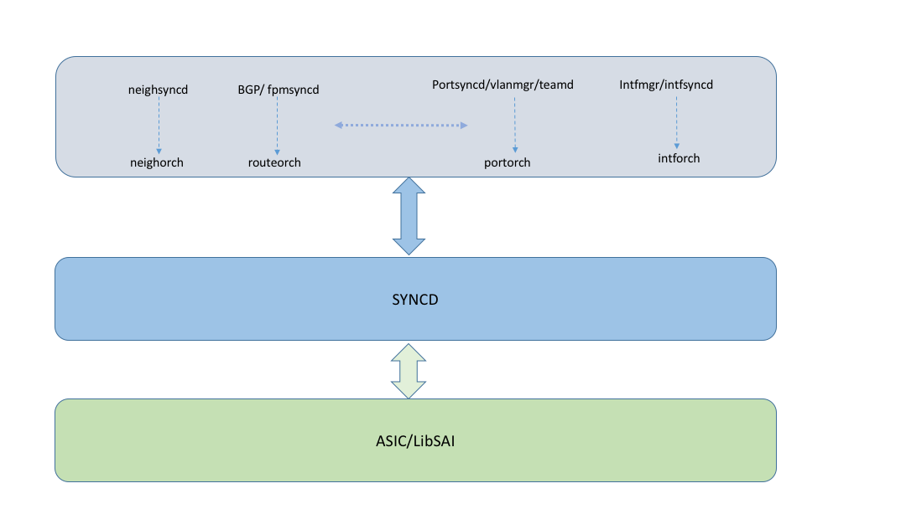

# SONiC Warm Reboot

Table of Contents
=================
* [Overview](#overview)
* [Use cases](#use-cases)
  * [In\-Service restart](#in-service-restart)
    * [Un\-Planned restart](#un-planned-restart)
    * [BGP docker restart](#bgp-docker-restart)
    * [SWSS docker restart](#swss-docker-restart)
    * [Syncd docker restart](#syncd-docker-restart)
    * [Teamd docker restart](#teamd-docker-restart)
  * [In\-Service upgrade](#in-service-upgrade)
    * [Case 1: without SAI api call change](#case-1-without-sai-api-call-change)
    * [Case 2: with SAI api call change](#case-2-with-sai-api-call-change)
      * [Case 2\.1 attribute change with SET](#case-21-attribute-change-with-set)
      * [Case 2\.2 Object change with REMOVE](#case-22-object-change-with-remove)
      * [Case 2\.3 Object change with CREATE](#case-23-object-change-with-create)
        * [case 2\.3\.1 New SAI object](#case-231-new-sai-object)
        * [case 2\.3\.2 Old object in previous version to be replaced with new object in new software version](#case-232-old-object-in-previous-version-to-be-replaced-with-new-object-in-new-software-version)
  * [Cold restart fallback](#cold-restart-fallback)
* [Proposal 1: Reconciliation at Orchagent](#proposal-1-reconciliation-at-orchagent)
  * [Key steps](#key-steps)
    * [Restore to original state](#restore-to-original-state)
    * [Remove stale date and perform new update](#remove-stale-date-and-perform-new-update)
    * [States of ASIC/LibSAI, syncd, orchagent and applications become consistent and up to date\.](#states-of-asiclibsai-syncd-orchagent-and-applications-become-consistent-and-up-to-date)
  * [Questions](#questions)
    * [How syncd restores to the state of pre\-shutdown](#how-syncd-restores-to-the-state-of-pre-shutdown)
    * [How Orchagent manages data dependencies during state restore](#how-orchagent-manages-data-dependencies-during-state-restore)
    * [What is missing in Orchagent for it to restore to the state of pre\-shutdown](#what-is-missing-in-orchagent-for-it-to-restore-to-the-state-of-pre-shutdown)
    * [How Orchagent gets the OID information](#how-orchagent-gets-the-oid-information)
    * [How to handle the cases of SAI api call change during restore phase\.](#how-to-handle-the-cases-of-sai-api-call-change-during-restore-phase)
    * [How to deal with the missing notification during the reboot/restart window](#how-to-deal-with-the-missing-notification-during-the-rebootrestart-window)
  * [Requirements on LibSAI and ASIC](#requirements-on-libsai-and-asic)
  * [Requirements on syncd](#requirements-on-syncd)
  * [Requirement on network applications and orch data](#requirement-on-network-applications-and-orch-data)
    * [General requirements](#general-requirements)
    * [Port](#port)
    * [Lag/teamd](#lagteamd)
    * [Interface](#interface)
    * [Fdb](#fdb)
    * [Arp](#arp)
    * [Route](#route)
    * [Acl](#acl)
    * [Buffer](#buffer)
    * [Qos](#qos)
  * [Summary](#summary)
  * [Approach evaluation](#approach-evaluation)
    * [Advantages](#advantages)
    * [Concerns/Issues with this approach](#concernsissues-with-this-approach)
* [Proposal 2: Reconciliation at syncd](#proposal-2-reconciliation-at-syncd)
  * [The existing syncd INIT/APPLY view framework](#the-existing-syncd-initapply-view-framework)
    * [Invariants for view comparison](#invariants-for-view-comparison)
      * [Switch internal objects discovered vis SAI get operation\.](#switch-internal-objects-discovered-vis-sai-get-operation)
      * [Configured attribute values like VLAN id, interface IP and etc\.](#configured-attribute-values-like-vlan-id-interface-ip-and-etc)
    * [View comparison logic](#view-comparison-logic)
  * [Orchagent and network application layer processing](#orchagent-and-network-application-layer-processing)
  * [Approach evaluation](#approach-evaluation-1)
    * [Advantages](#advantages-1)
    * [Concerns/Issues with this approach](#concernsissues-with-this-approach-1)
* [Open issues](#open-issues)
  * [How to do version control for software upgrade at docker level?](#how-to-do-version-control-for-software-upgrade-at-docker-level)
  * [Rollback support in SONiC](#rollback-support-in-sonic)
  * [What is the requirement on control plane down time?](#what-is-the-requirement-on-control-plane-down-time)
  * [Upgrade path with warm reboot support](#upgrade-path-with-warm-reboot-support)
  * [Latency requirement on LibSAI/SDK warm restart](#latency-requirement-on-libsaisdk-warm-restart)
  * [Backward compatibility requirement on SAI/LibSAI/SDK?](#backward-compatibility-requirement-on-sailibsaisdk)
  * [What is the requirment on LibSAI/SDK with regards to data plane traffic during warm reboot? Could FDB be flushed?](#what-is-the-requirment-on-libsaisdk-with-regards-to-data-plane-traffic-during-warm-reboot-could-fdb-be-flushed)
  * [What are the the principles of warm reboot support for SONiC?](#what-are-the-the-principles-of-warm-reboot-support-for-sonic)
* [References](#references)


# Overview
The goal of SONiC warm reboot is to be able restart and upgrade SONiC software without impacting the data plane.
Warm restart of each individual process/docker is also part of the goal. Except for syncd and database docker, it is desired for all other network applications and dockers to support un-planned warm restart.

For restart processing, SONiC may be roughly divided into three layers:

__Network applications and Orchagent__: Each application will experience similar processing flow. Application and corresponding orchagent sub modules need to work together to restore the orginal data and populate the delta for warm start. Take route as example, upon restart operation, network application BGP performs graceful restart and gets synchronized with the latest routing state via talking with peers, fpmsyncd uses the input from BGP to program appDB and it also deals with any stale/new routes besides those routes without change.  RouteOrch responds to the operation requests from fpmsyncd and propagates any change down to syncd.

__Syncd__:  syncd should dump ASICDB before restart, and restore to the same state as pre-reboot.  The restore of SONiC syncd itself should not disturb the state of ASIC.  It takes changes from Orchagent and pass them down to LibSAI/ASIC after necessary transformation.

__LibSAI/ASIC__:  ASIC vendor needs to ensure the state of ASIC and libSAI restores to the same state as pre-reboot.



# Use cases

## In-Service restart
The mechanism of restarting a component without impact to service. This assumes that the software version of the component has not changed after the restart.
There could be data changes like new/stale route, port state change, fdb change during restart window.

Component here could be the whole SONiC system or just one or multiple of the dockers running in SONiC.

###	Un-Planned restart
It is desired for all network applications and orchagent to be able to handle unplanned restart, and restore gracefully.  It is not a requirement on syncd and ASIC/LibSAI due to dependency on ASIC processing.

###	BGP docker restart
After BGP docker restart, new routes may be learned from BGP peers and some routes which had been pushed down to APPDB and ASIC may be gone. The system should be able to clear the stale route from APPDB down to ASIC and program the new route.

###	SWSS docker restart
After swss docker restart,  all the port/LAG, vlan, interface, arp and route data should be restored from configDB, APPDB, Linux Kernel and other reliable sources.
There could be port state, ARP, FDB changes during the restart window, proper sync processing should be performed.

###	Syncd docker restart
The restart of syncd docker should leave data plane intact. After restart, syncd resumes control of ASIC/LibSAI and communication with swss docker.  All other functions which run in syncd docker should be restored too like flexcounter processing.

### Teamd docker restart
The restart of teamd docker should not cause link flapping or any traffic loss. All lags at data plane should remain the same.

## In-Service upgrade
The mechanism of upgrading to a newer version of a component without impacting service.

Component here could be the whole SONiC system or just one or multiple of the dockers running in SONiC.

### Case 1: without SAI api call change
There are software changes in network applications like BGP, neighsyncd, portsyncd and even orchagent, but the changes don’t have impact on the interface with syncd as to the organization of existing data (meta data and dependency graph).
There could be data changes like new/stale route, port state change, fdb change during restart window.

All the processing for [In-Service Restart](#in-service-restart) applies here too.

### Case 2: with SAI api call change
#### Case 2.1 attribute change with SET
New version of orchagent may cause SET api to use a different value for certain attribute compared with previous version.  Or a new attribute SET will be called.
#### Case 2.2 Object change with REMOVE
Object that existed in previous version may be deleted by default in new software version.
#### Case 2.3 Object change with CREATE
Two scenarios:
##### case 2.3.1 New SAI object
This is the new object defined at SAI layer and CREATE call is triggered at orchagent in new version of software.

##### case 2.3.2 Old object in previous version to be replaced with new object in new software version
Ex. Object will be created with more or less attributes or different attribute value, or multiple instance objects will be replaced with an aggregated object.
This is the most complex scenario, all other objects which have dependency on the old object should be cleaned up properly if the old object is not a leaf object.

## Cold restart fallback
An option to do cold restart or warm restart through configuration for swss, syncd and teamd dockers should be provided.
Upon failure of warm restart, fallback mechanism to cold restart should be available.


# Proposal 1: Reconciliation at Orchagent
## Key steps
###	Restore to original state
`a.` LibSAI/ASIC is able to restore to the state of pre-reboot without interrupting upper layer.
`b.` Syncd is able to restore to the state of pre-reboot without interrupting ASIC and upper layer.
`c.` Syncd state is driven by Orchagent (with exception of FDB), once it is restored, no need to perform reconciliation by itself.

###	Remove stale date and perform new update

`a.`	Based on the individual behavior of each network application, it either reads data from configDB, or get data from other sources like Linux kernel( ex. for port, ARP) and BGP protocal, then programs APPDB again. It keeps track of any stale data for removal.
Orchagent consumes the request from APPDB.

`b.` Orchagent restores data from APPDB for applications running in other dockers like BGP and teamd to be able to handle the case of swss only restart, and ACL data from configDB. Orchagent ensures idempotent operation at LibSaiRedis interface via not passing down any create/remove/set operations on objects that had been performed before.

Please note that, to reduce the dependency wait time in orchagent, loose order control is helpful. Ex. the restore of route may be done after port, lag, interface and ARP data is (mostly) processed.

Each application is responsible for gathering any delta between pre and after restart, and performs create(new object), set, or remove(stale object) operations for the delta data.

`c.`	Syncd processes the request from Orchagent as in normal boot.
###	States of ASIC/LibSAI, syncd, orchagent and applications become consistent and up to date.


##	Questions
###	How syncd restores to the state of pre-shutdown
In this approach syncd only needs to save and restore the mapping between object RID and VID.

###	How Orchagent manages data dependencies during state restore
The constructor of each orchagent subroutine may work as normal startup.

Each application reads configDB data or restores data from Linux kernel or re-populate data via network protocols uppon restart, and progams appDB accordingly. Each network application and orchagent subroutine handle the dependency accordingly, which means some operation may be delayed until all required objects are ready. The dependency check has been part of existing implementation in orchagent, but new issues may pop up with this new scenario.

To be able to handle the case of swss only restart, orchagent also restores route (for BGP docker) and portchannel data (for teamd docker) from APPDB directly besides subscribing to appDB consumer channnel. Loose order control for the data restore helps speed up the processing.

###	What is missing in Orchagent for it to restore to the state of pre-shutdown
Orchagent and application may get data from configDB and APPDB as normal startup, but to be able to in sync and communicate with syncd, it also needs OID for each object with key type of sai_object_id_t.

```
typedef struct _sai_object_key_t
{
    union _object_key {
        sai_object_id_t           object_id;
        sai_fdb_entry_t           fdb_entry;
        sai_neighbor_entry_t      neighbor_entry;
        sai_route_entry_t         route_entry;
        sai_mcast_fdb_entry_t     mcast_fdb_entry;
        sai_l2mc_entry_t          l2mc_entry;
        sai_ipmc_entry_t          ipmc_entry;
        sai_inseg_entry_t         inseg_entry;
    } key;
} sai_object_key_t;
```

###	How Orchagent gets the OID information
For SAI redis create operation of those objects with object key type of sai_object_id_t,  Orchagent must be able to use the exact same OID as before shutdown, otherwise it will be out of sync with syncd. But current Orchagent implementation save OID in running time data struct only.

For object ID previously fetched via sai redis get operation, the same method still works.

One possible solution is to save the mapping between OID and attr_list at redis_generic_create(). This assumes that during restore, exact same attr_list will be used for object create, so same OID may be found and returned.

When there is attribute change for the first time, the original default mapping could be saved in DEFAULT_ATTR2OID_ and DEFAULT_OID2ATTR_ tables. This is because during restore, object create may use the default attributes instead of current attribues.

All new changes will be applied on the regular ATTR2OID_ and OID2ATTR_ mapping tables.

For the case of multiple objects created for the same set of attributes, an extra owner identifier may be assigned for the mapping from attributes to OID, so each object is uniquely identifieable based on the owner context. One prominent example is using lag_alias as the lag owner so each lag may retrieve the the same OID during restart though NULL attribute is provided for lag create.

```
+    SET_OBJ_OWNER(lag_alias);
     sai_status_t status = sai_lag_api->create_lag(&lag_id, gSwitchId, 0, NULL);
+    UNSET_OBJ_OWNER();
```

Virtual OID should not be necessary in this solution.  But it doesn’t hurt either if the virtual OID layer is kept.

Idempotency is required for LibSaiRedis interface.

### How to handle the cases of SAI api call change during restore phase.
[Case 2\.1 attribute change with SET](#case-21-attribute-change-with-set) : at the sai_redis_generic_set layer, based on the object key, compare attribute value and apply the change directly down to syncd/libsai/ASIC.

[Case 2\.2 Object change with REMOVE](#case-22-object-change-with-remove): at the sai_redis_gereric_remove layer, if the object key found in restoreDB, apply remove SAI api call directly down to syncd/libsai/ASIC.  Dependency has been guaranteed at orchagent.

[Case 2\.3 Object change with CREATE](#case-23-object-change-with-create):

[case 2\.3\.1 New SAI object](#case-231-new-sai-object):  Just apply the SAI API create operation down to syncd/libsai/ASIC. Dependency has been guaranteed at orchagent.  But if it is not a leaf object, there will be cascading effect on other objects which has dependency on it when being created, which will be handled in next used case scenario. If the new SAI object is only used as an attribute in SET call for other objects, it could be handled in Case 2.1 attribute change with SET.

[case 2\.3\.2 Old object in previous version to be replaced with new object in new software version](#case-232-old-object-in-previous-version-to-be-replaced-with-new-object-in-new-software-version):  If this is a leaf object like route entry, neighbor entry, or fdb entry, just add version specific logic to remove it and create the new one.
Otherwise if there are other objects which have to use this object as one of the attributes during create call, those objects should be deleted first before deleting this old object.  Version specific logic is needed here.

###	How to deal with the missing notification during the reboot/restart window
Port/fdb may have new state notification during reboot window?   Probably the corresponding orchagent subroutine should perform get operation for the objects?

## Requirements on LibSAI and ASIC
LibSAI and ASIC should be able to save all necessary state upon shutdown request with warm restart option.
Upon create_switch() request,  LibSAI/ASIC should restore to the exact state of pre-shutdown.
Data plane should not be affected during the whole restore process.
Once restore is finished, LibSAI/ASIC works in normal operation state, they are agnostic of any warm restart processing happening in upper layer.
It is desired to support idempotency for create/remove/set in LibSAI, but may not be absolutely necessary for warm reboot solution.

##	Requirements on syncd
Syncd should be able to save all necessary state upon shutdown request with warm restart option.
At the restart syncd should restore to the exact state of pre-shutdown.
Once restore is finished, syncd works in normal operation state, it is agnostic of any warm restart processing happening in upper layer.

##	Requirement on network applications and orch data
###	General requirements

Each application should be able to restore to the state of pre-shutdown.

Orchagent must be able to save and restore OID for objects created by Orchagent and with object key type of sai_object_id_t.  Other objects not created by Orchagent may restore OID via get operation of libsairedis interfaces.

The orchagent sub-routine of each application could use existing normal constructor and producerstate/consumerstate handling flow to ensure dependency and populate internal data structure.

In case docker restart of swss only, it should be able to restore route and lag data from appDB directly since bgp docker and teamd docker wouldn't provision the whole set of data again to appDB in this scenario.

After state restore, each application should be able to remove any stale object/state and perform any needed create/set, orchagent process the request as normal.

###	Port
###	Lag/teamd
### Interface
### Fdb
### Arp
### Route
### Acl
### Buffer
### Qos
###	…

## Summary

| Layer	               |   Restore	|Reconciliation	|Idempotency                 |Dependency management
| ----                 |   ----     | ----          | ----                       |  ---- |
| Application/Orchagent|	Y	    |       Y    	|Y for LibSaiRedis interface | Y
| Syncd	               |    Y       |       N	    |Good to have                |Good to have
| LibSAI/ASIC          |	Y       |	    N	    |Good to have	             |Good to have


##	Approach evaluation
###	Advantages
* straightforward logic, simple to implement for most upgrade/restart cases.
* Layer/applications decoupled, easy to divide and conquer.
* Each docker self contained, is prepared for unplanned warm restart of swss process and other network applications.

###	Concerns/Issues with this approach
*	Orchagent software upgrade could be handy, especially for the cases of SAI object replace which requires Orchagent to have use-once code to handle them for in service upgrade.

#	Proposal 2: Reconciliation at syncd
##	The existing syncd INIT/APPLY view framework
Essentially there will be two views created for warm restart. The current view represents the ASIC state before shutdown, temp view represents the new intended ASIC state after restart.
Based on the SAI object data model, each view is a directed acyclic graph, all(?) objects are linked together.
###	Invariants for view comparison
####	Switch internal objects discovered vis SAI get operation.
They include SAI_OBJECT_TYPE_PORT, SAI_OBJECT_TYPE_QUEUE, SAI_OBJECT_TYPE_SCHEDULER_GROUP, SAI_OBJECT_TYPE_SCHEDULER_GROUP and a few more.
It is assumed that the RID/VID for those objects keep the same.
`Question 1`: what if there is change with those discovered object after version change?

`Question 2`: what if some of the discovered objects got changed? Like dynamic port breakout case.

####	Configured attribute values like VLAN id, interface IP and etc.
 There could be change to the configured value, those not being changed may work as invariants.
`Question 3`:  could some virtual OIDs for created objects in tmp view coincidently match with object in current view, but the objects are different?  matchOids().

###	View comparison logic
Utilizing the meta data of object, with those invariants as anchor points, for each object in temp view, it starts as root of a tree and go down to all layer of children node until leaf to find best match.
If no match is found, the object in temp view should be created, it is object CREATE operation.
If best match is found, but there is attributes different between the object in temp view and current view, SET operation should be performed.
Exact match yields Temp VID to Current VID translation, which also paves the way for upper layer comparison.
All objects in current VIEW which have reference count 0 at the end should be deleted, REMOVE operation.

`Question 4`:  how to handle two objects with exactly same attributes?   Example: overlay loopback RIF and underlay loopback RIF.   VRF and possibly some other object in same situation?

`Question 5`:  New version of software call create() API with one extra attribute,  how will that be handled?  Old way of create() plus set() for the extra attribute, or delete the existing object then create a brand new one?

`Question 6`: findCurrentBestMatchForGenericObject(),  the method looks dynamic.  What we need is deterministic processing which matches exactly what orchagent will do (if same operation is to be done there instead), no new unnecessary REMOVE/SET/CREATE, how to guarantee that?

## Orchagent and network application layer processing
Except for the idempotency support of create/set/remove operation at libsairedis interface, this proposal requires the same processing as in proposal 1, like original data restore and appDB stale data removal by each individual applications as needed.

One possible but kind of extreme solution is: Always flush all related appDB tables or even the whole appDB when there is application restart, and let each application re-populate new data from scratch.  The new set of data is then pushed down to syncd. syncd does the comparison logic between the old data and new data.

##	Approach evaluation
###	Advantages
* Generic processing based on SAI object model.
* No change to libsairedis library implementation, no need to restore OID at orchagent layer.

###	Concerns/Issues with this approach
* Highly complex logic in syncd
* Warm restart of upper layer applications closely coupled with syncd.
* Various corner cases from SAI object model and changes in SAI object model itself have to be handled.

# Open issues

## How to do version control for software upgrade at docker level?

`Show version` command is able to retrieve the version data for each docker.  Furher extention may be based on that.

```
root@PSW-A2-16-A02.NA62:/home/admin# show version
SONiC Software Version: SONiC.130-14f14a1
Distribution: Debian 8.1
Kernel: 3.16.0-4-amd64
Build commit: 14f14a1
Build date: Wed May 23 09:12:22 UTC 2018
Built by: jipan@ubuntu01

Docker images:
REPOSITORY                 TAG                 IMAGE ID            SIZE
docker-fpm-quagga          latest              0f631e0fb8d0        390.4 MB
docker-syncd-brcm          130-14f14a1         4941b40cc8e7        444.4 MB
docker-syncd-brcm          latest              4941b40cc8e7        444.4 MB
docker-orchagent-brcm      130-14f14a1         40d4a1c08480        386.6 MB
docker-orchagent-brcm      latest              40d4a1c08480        386.6 MB
docker-lldp-sv2            130-14f14a1         f32d15dd4b77        382.7 MB
docker-lldp-sv2            latest              f32d15dd4b77        382.7 MB
docker-dhcp-relay          130-14f14a1         df7afef22fa0        378.2 MB
docker-dhcp-relay          latest              df7afef22fa0        378.2 MB
docker-database            130-14f14a1         a4a6ba6874c7        377.7 MB
docker-database            latest              a4a6ba6874c7        377.7 MB
docker-snmp-sv2            130-14f14a1         89d249faf6c4        444 MB
docker-snmp-sv2            latest              89d249faf6c4        444 MB
docker-teamd               130-14f14a1         b127b2dd582d        382.8 MB
docker-teamd               latest              b127b2dd582d        382.8 MB
docker-sonic-telemetry     130-14f14a1         89f4e1bb1ede        396.1 MB
docker-sonic-telemetry     latest              89f4e1bb1ede        396.1 MB
docker-router-advertiser   130-14f14a1         6c90b2951c2c        375.4 MB
docker-router-advertiser   latest              6c90b2951c2c        375.4 MB
docker-platform-monitor    130-14f14a1         29ef746feb5a        397 MB
docker-platform-monitor    latest              29ef746feb5a        397 MB
docker-fpm-quagga          130-14f14a1         5e87d0ae9190        389.4 MB
```
## Rollback support in SONiC
This is a general requirement not limited to warm reboot. Probably a separate design document should be prepared for this topic.

## What is the requirement on control plane down time?
Currently there is no hard requirement on the down time of control plane during warm reboot. An appropriate number should be agreed on.

## Upgrade path with warm reboot support
No clear requirement available yet. The general idea is to support warm reboot between consecutive SONiC releases.

## Latency requirement on LibSAI/SDK warm restart
No strict requuirment on this layer yet.  Probably in the order of seconds, say, 10 seconds?

## Backward compatibility requirement on SAI/LibSAI/SDK?
Yes, Backward compatibility is mandatory for warm reboot support.

## What is the requirment on LibSAI/SDK with regards to data plane traffic during warm reboot? Could FDB be flushed?
No packet loss at data plane for existing data flow.  In general, FDB flush should be triggered by NOS instread of LibSAI/SDK.

## What are the the principles of warm reboot support for SONiC?
One of the priciples talked about is have warm restart support at each layer/module/docker, each layer/module/docker is self contained as to warm restart.

# References
* [SAI Warmboot spec](https://github.com/opencomputeproject/SAI/blob/master/doc/SAI_Proposal_Warmboot.docx?raw=true)

