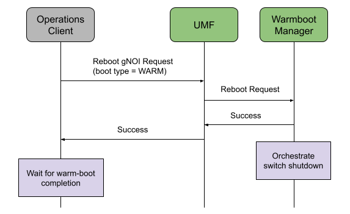
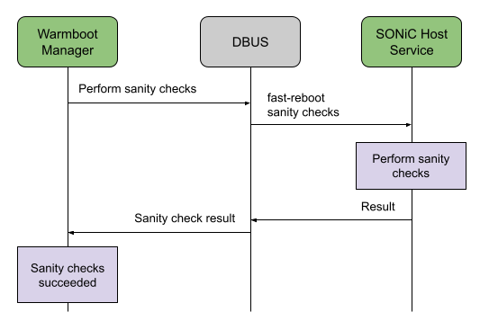
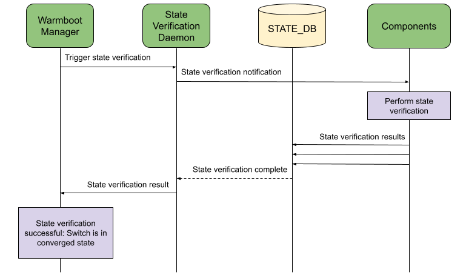
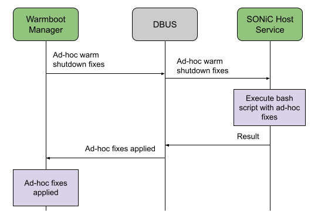
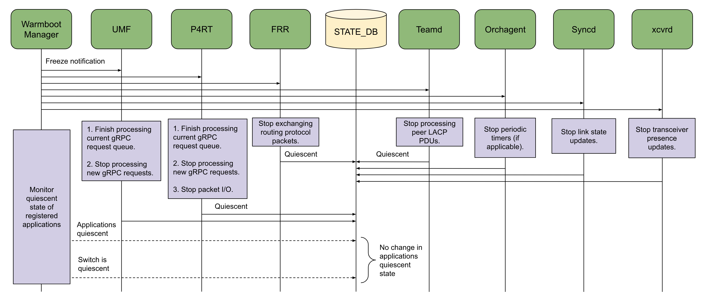
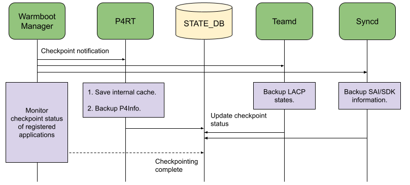
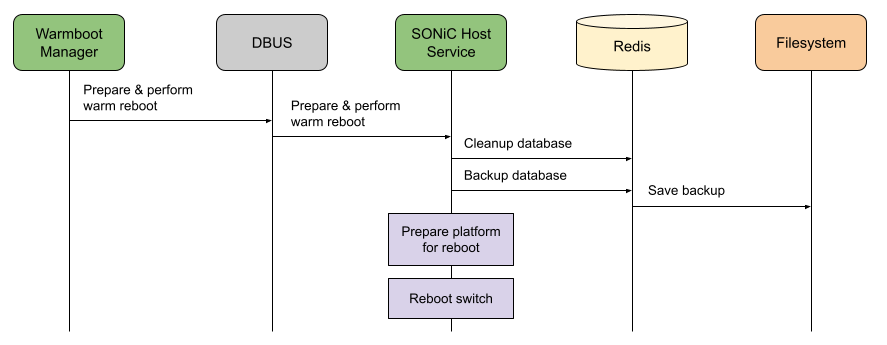
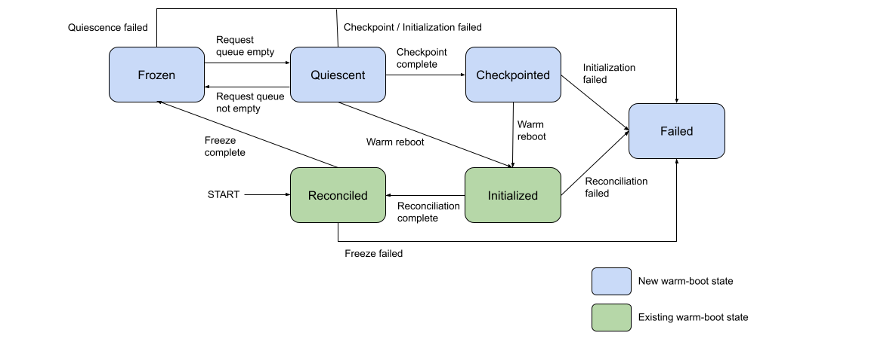
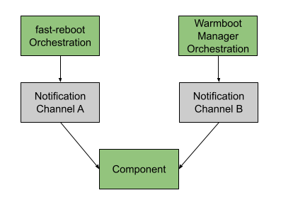

# Warmboot Manager HLD


## Table of Content


- [Revision](#revision)
- [Scope](#scope)
- [Definitions/Abbreviations](#definitions-abbreviations)
- [Overview](#overview)
- [Requirements](#requirements)
- [Architecture Design](#architecture-design)
- [High-Level Design](#high-level-design)
  * [Warmboot Details Registration](#warmboot-details-registration)
  * [Shutdown Orchestration](#shutdown-orchestration)
    + [Phase 1: Sanity Checks](#phase-1--sanity-checks)
      - [Hotplugging Shutdown Fixes](#hotplugging-shutdown-fixes)
    + [Phase 2: Freeze Components And Wait for Switch Quiescence](#phase-2--freeze-components-and-wait-for-switch-quiescence)
      - [Unfreeze on Failure](#unfreeze-on-failure)
      - [Quiescence Timer](#quiescence-timer)
    + [Phase 3: Trigger Checkpointing](#phase-3--trigger-checkpointing)
    + [Phase 4: Prepare and Perform Reboot](#phase-4--prepare-and-perform-reboot)
      - [Removing Container Shutdown Ordering Dependency](#removing-container-shutdown-ordering-dependency)
    + [Application Shutdown Optimization](#application-shutdown-optimization)
  * [Reconciliation Monitoring](#reconciliation-monitoring)
  * [Component Warmboot States](#component-warmboot-states)
  * [Handling Race Conditions](#handling-race-conditions)
- [Reference Design Changes in Critical Containers](#reference-design-changes-in-critical-containers)
  * [Orchagent](#orchagent)
  * [Syncd](#syncd)
  * [Teamd](#teamd)
  * [Transceiver Daemon](#transceiver-daemon)
  * [Database](#database)
- [Backward Compatibility](#backward-compatibility)
- [SAI API](#sai-api)
- [Configuration and management](#configuration-and-management)
- [Restrictions/Limitations](#restrictions-limitations)
- [Testing Requirements/Design](#testing-requirements-design)
- [Open/Action items - if any](#open-action-items---if-any)


### Revision


<table>
  <tr>
   <td>Rev
   </td>
   <td>Rev Date
   </td>
   <td>Author(s)
   </td>
   <td>Change Description
   </td>
  </tr>
  <tr>
   <td>v0.1
   </td>
   <td>9/28/2023
   </td>
   <td>Google
   </td>
   <td>Initial version
   </td>
  </tr>
</table>


### Scope

This document captures the high-level design for Warmboot Manager - a new daemon that is responsible for shutdown orchestration and reconciliation monitoring during warm reboot, and the location of this daemon in SONiC.


### Definitions/Abbreviations


<table>
  <tr>
   <td><strong>Applications</strong>
   </td>
   <td>Higher-layer components that may or may not be running depending on the switch role e.g. Teamd, BGP, P4RT etc.
   </td>
  </tr>
  <tr>
   <td><strong>Infrastructure Components</strong>
   </td>
   <td>Switch stack components that are essential for switch operation irrespective of switch role e.g. Orchagent, Syncd and transceiver daemon
   </td>
  </tr>
</table>


### Overview

SONiC uses [fast-reboot](https://github.com/sonic-net/sonic-utilities/blob/master/scripts/fast-reboot) and [finalize\_warmboot.sh](https://github.com/sonic-net/sonic-buildimage/blob/master/files/image_config/warmboot-finalizer/finalize-warmboot.sh) scripts for warm reboot reconciliation. The former script is responsible for preparing the platform and database for reboot and orchestrating switch shutdown. The latter script is responsible for monitoring the reconciliation status of a fixed set of switch stack components and eventually removing the warm-boot flag from Redis DB. There are a few areas of improvement in the current warm-boot orchestration framework:


*   Eliminating sysctl shutdown dependencies: The current shutdown algorithm relies on the container shutdown ordering. It shuts down each container sequentially in a pre-defined order and each container shutdown might invoke warm shutdown logic for the applications inside that container. This slows down the warm shutdown performance.
*   Unified shutdown notifications: The current warm shutdown algorithm sends custom warm shutdown related notifications to different components. For example:
    + Orchagent uses _freeze_ notification and notifies its ready status via notification channel. 
    + Syncd uses _pre-shutdown_ and _shutdown_ notifications and notifies its status via Redis DB.
    + Some components rely on the container shutdown script or Linux signals (SIGTERM, SIGUSR1 etc.) to perform shutdown related tasks.


The proposal is to introduce a new component called Warmboot Manager that will be responsible for both shutdown orchestration and reconciliation monitoring during warm reboot. It will leverage Redis DB features provided by swss-common to create a common framework for warm-boot orchestration. As a result, there will be a unified framework for warm-boot orchestration for all switch stack components. The new warm-boot orchestration will eliminate the container shutdown ordering dependencies, thereby improving warm reboot performance. Warmboot Manager will be an alternative to the existing SONiC warm-boot orchestation scripts and thus both these orchestration frameworks will co-exist in SONiC. More details about this are described in the [Backward Compatibility](#backward-compatibility) section.


### Requirements

The current design covers warm reboot orchestration daemon that mainly impacts the **warm shutdown sequence** of the switch stack components; there is no impact to their warm-bootup sequence. It also covers the additional warmboot states introduced due to the warm shutdown sequence. It does not cover fast reboot.


### Architecture Design


Warmboot Manager will run as a part of the Reboot Backend daemon inside a new _Framework_ docker. The high-level design of this daemon is specified [here](https://github.com/sonic-net/SONiC/pull/1489). Since Warmboot Manager will run inside a docker, it will communicate with processes in other dockers using notification channel and Redis DB, and will perform host actions using DBUS.


### High-Level Design





Warmboot Manager will be an alternative to the existing [fast-reboot](https://github.com/sonic-net/sonic-utilities/blob/master/scripts/fast-reboot) and [finalize\_warmboot.sh](https://github.com/sonic-net/sonic-buildimage/blob/master/files/image_config/warmboot-finalizer/finalize-warmboot.sh) scripts to perform shutdown orchestration and reconciliation monitoring during warm reboot. It will mainly impact the warm shutdown sequence of the switch stack components and will have no impact their warm bootup sequence. It will use a registration based mechanism to determine the switch stack components that need to perform an orchestrated shutdown and bootup. This ensures that the Warmboot Manager design is generic, flexible and also avoids any hardcoding of component information in Warmboot Manager.


#### Warmboot Details Registration


```
Component = <name>
Docker = <name>
Freeze = <True>/<False>
Checkpoint = <True>/<False>
Reconciliation = <True>/<False>
```


Components that want to participate in warm-boot orchestration need to register the above details with Warmboot Manager. Warmboot Manager will use these registration details to determine the components that are going to participate in the orchestrated shutdown sequence and monitor reconciliation statuses during bootup. If a component doesn’t register with the Warmboot Manager then it will continue to operate normally until it is shutdown in [Phase 4](#phase-4-prepare-and-perform-reboot). Components that modify the switch state should register with Warmboot Manager because they can change the state of other components (such as Orchagent, Syncd etc.) that participate in the warm reboot orchestration and thus they can impact the warm reboot process.

Components that want to participate in an orchestrated shutdown during warm reboot need to set _freeze = true_. Warmboot Manager will wait for the quiescence (more details [here](#phase-2-freeze-components-and-wait-for-switch-quiescence)) of all components that have _freeze = true_ in their registration. If _checkpoint = True_ only then will Warmboot Manager wait for the component to complete checkpointing. Components that want Warmboot Manager to monitor their reconciliation status need to set _reconciliation = true_.


#### Shutdown Orchestration

During warm reboot, Warmboot Manager will orchestrate switch shutdown in a multi-phased approach that ensures that the switch stack is in a stable state before the intent/state is saved. It will perform shutdown in the following phases:


*   Phase 1: Sanity Checks
*   Phase 2: Freeze components & wait for switch quiescence
*   Phase 3: Trigger checkpointing
*   Phase 4: Prepare and perform reboot


##### Phase 1: Sanity Checks




Warmboot Manager will start warm-boot orchestration by performing sanity checks that are similar to the current [fast-reboot prechecks](https://github.com/sonic-net/sonic-utilities/blob/master/scripts/fast-reboot#L383-L426). These include:


* Critical containers are running
* File system is readable
* Check DB integrity
* Filesystem has sufficient space for warm reboot related files
* Verify next image by sonic-installer
* ASIC configuration hasn't changed between images

The existing fast-reboot script will be enhanced such that individual methods defined in this script can be triggered using SONiC host service via DBUS.




In addition these sanity checks, it will optionally trigger state verification to ensure that the switch is in a consistent state. Reconciling from an inconsistent state might cause traffic loss and thus it is important to ensure that the switch is in a consistent state before warm rebooting. An additional flag will be added in Redis DB which will be used Warmboot Manager to determine whether state verification should be triggered or not during this phase. Warmboot Manager will abort warm reboot operation if any of the sanity checks fail.

###### Hotplugging Shutdown Fixes





Warmboot Manager will be provide a plugin via SONiC host service that can be used to hotplug fixes during warm shutdown. The host service will call a bash script in which ad-hoc fixes can be added during warm shutdown. This script can be updated before iniating warm reboot and will be called by Warmboot Manager after performing the sanity checks. Currently, such fixes are added in the fast-reboot script which is then updated on the switch. This framework enables Warmboot Manager to allow hotplugging fixes during warm shutdown before switch stack components start their warm shutdown routines. Additionally, fixes can be hotplugged in [Phase 4](#phase-4-prepare-and-perform-reboot) after the components have completed their warm shutdown routines. This is because [Phase 4](#phase-4-prepare-and-perform-reboot) also uses SONiC host service to prepare the switch for reboot and perform the reboot operation, and thus fixes can be added to that host service.

##### Phase 2: Freeze Components And Wait for Switch Quiescence




Warmboot Manager will send freeze notification to all registered components and will wait for the quiescence of only those components that have set _freeze = true_. Upon receiving the freeze notification, the component will complete processing the current request queue and stop generating new self-sourced intents. This connotes that boundary components should stop processing requests from external components (external events) and all components should stop triggers that generate new requests (internal events) such as stop periodic timers/threads etc. The goal is to stop generating events that might break quiescence of other switch stack components. For example:


*   UMF will stop listening to new gRPC requests from the controller.
*   P4RT will stop listening to new gRPC requests from the controller and stop packet I/O.
*   xcvrd will stop listening to transceiver updates such as module presence.
*   Syncd will stop listening to link state events from the vendor chip.
*   Orchagent will stop periodic internal timers.
*   Teamd will stop processing any changes in the peer PDUs but continue exchanging LACP PDUs.

However, all components will continue to process requests received by them from other switch stack components. This connotes that each component will stop generating events for which it is the source, but will continue to process request from other components. After all components have been freezed, the switch would eventually reach a state wherein each component stops generating new events and thus the switch becomes quiescent. This is because:

*   Switch boundaries that generate new events have been stopped.
*   All timers/threads that generate new events have been stopped.
*   All components have completed processing their pending requests and thus there are no in-flight messages.

After receiving the freeze notification, the components will update their quiescent state in STATE DB when they receive a new request (i.e. they are no longer quiescent) and when they complete processing their current request queue (i.e. they become quiescent). Warmboot Manager will monitor the quiescent state of all components in STATE DB to determine that the switch has become quiescent and thus further state changes won’t occur in the switch. If all components are in quiescent state then Warmboot Manager will declare that the switch has become quiescent and thus the switch has attained its final state. 

###### Unfreeze on Failure


Warmboot Manager will wait for a period of time for the switch to become quiescent after which it will determine that this phase failed and abort the warm reboot operation. Additionally, it will unfreeze the switch stack on such failures by sending unfreeze notification to all the registered components. As a result, all components will resume their normal operations and start generating new external and internal events. This ensures that the switch continues to operate normally as it did before the start of the warm reboot operation.

###### Quiescence Timer

As indicated in the above sections, Warmboot Manager consists of 2 timers in this phase:

* Quiescence Time: Amount of time that Warmboot Manager will wait after all components are quiescent to determine that the switch is quiescent.
* Overall Phase Timeout: Amount of time for the switch to become quiescent after which Warmboot Manager will determine that this phase failed.

These timers might be platform dependent since some platforms might take more time than others due to software/hardware constraints. Therefore, these timers will be configurable via CONFIG DB to allow setting appropriate timeouts for different platforms.


##### Phase 3: Trigger Checkpointing




Warmboot Manager will send checkpoint notification to all registered components and wait for only to those components that set _checkpoint = true_ to trigger checkpointing i.e. save internal states to either the DB or persistent file system. Warmboot Manager will wait for a period of time for the components to update STATE DB with their checkpointing status. All registered components should ignore any requests after completing checkpointing because they aren't expected to receive new requests since the switch is quiescent.

This phase is the point of no return. This is because some components such as Syncd will gracefully disconnect from the ASIC and exit after completing checkpointing. There is no way to recover from this stage unless the switch stack is rebooted.


##### Phase 4: Prepare and Perform Reboot




When this phase is reached, the switch stack components have stopped generating new requests and have saved their internal states. At this point, the DB will be backed up, the platform will be prepared for reboot and the switch will be rebooted. The platform preparation for reboot will be similar to the current fast-reboot script [operations](https://github.com/sonic-net/sonic-utilities/blob/master/scripts/fast-reboot#L791-L839) that are performed after the DB is backed-up. Since these steps will be executed using SONiC host service via DBUS, any platform-specific preparation steps and reboot method can be added to this host service.


###### Removing Container Shutdown Ordering Dependency

[Phase 2](#phase-2-freeze-components-and-wait-for-switch-quiescence) ensures that switch stack components stop generating new events for which they are the source, but they continue to process requests received from other components. For example, Syncd will stop generating link events but will continue to process requests from Orchagent. The switch becomes quiescent after a period of time since all components stop generating events. At this point, all containers are running in an idle state since they are quiescent. [Phase 3](#phase-3-trigger-checkpointing) ensures that these quiescent components save their internal states. Therefore, there is no longer a requirement to shutdown the containers in a particular order since they are idle and not interacting with each other. As a result, the switch can directly be shutdown using _kexec_, thereby eliminating the need to perform container shutdown and improving the warm shutdown performance. Thus, this warm-boot orchestration framework removes one of the big performance bottlenecks during warm shutdown.


##### Application Shutdown Optimization


Higher layer applications are generally independent and their shutdown is not dependent on quiescence of other switch stack components. For example, upon receiving a freeze notification P4RT can stop processing controller requests and checkpoint the P4Info i.e. transition from Phase 2 to Phase 3 without waiting for Warmboot Manager to send further notifications. The design allows applications to transition through these phases independently as long as they continue to update their warmboot state in STATE DB. Warmboot Manager will monitor these states and will handle the applications’ phase transitions. In such a scenario, applications need to set _freeze = true_ and _checkpoint = false_ and thus the freeze notification will result in the application to transition from Phase 2 to Phase 3. 


#### Reconciliation Monitoring


Upon bootup, components will detect warm-boot flag in STATE DB and reconcile to the state before reboot. Components that registered _reconciliation = true_ will update their warm-boot state = RECONCILED in STATE DB after they have completed reconciliation. Warmboot Manager will monitor the reconciliation status of these registered components during warm bootup. Subsequently, the components will start their normal operation and listen to new requests. The proposed reconciliation monitoring mechanism is similar to the existing mechanism except that components being monitored are based on the warm-boot details registration as opposed to hardcoded list of components.


#### Component Warmboot States

Based on the shutdown and reconciliation sequence mentioned above, a component will transition through the following states during warm reboot:


*   Frozen (warm shutdown)
*   Quiescent (warm shutdown)
*   Checkpointed (optional, warm shutdown)
*   Initialized (warm bootup)
*   Reconciled (warm bootup)
*   Failed (warm shutdown or bootup)




Upon receiving a freeze notification, a component will transition to _frozen_ state when it has stopped generating new intents for which it is the source. Subsequently, it will transition to _quiescent_ state when it has completed processing all requests. It might transition between _frozen_ and _quiescent_ states when it receives a new request from some other switch component and after it has completed processing all requests i.e. a component might transition between _frozen_ and _quiescent_ states if it processes an intent in freeze mode. If a component fails to perform its freeze routine i.e. fails to stop generating new intents for which it is the source then it will transition to _failed_ state. Upon receiving a checkpoint notification, a component will transition to _checkpointed_ state after it has completed checkpointing or to _failed_ state if checkpointing failed.

After warm reboot, a component will transition to _initialized_ state after it has completed its initialization routine. It will transition to _reconciled_ state after it has completed reconciliation. It will transition to _failed_ state if its initialization or reconciliation fails.

Components will update their state in STATE DB using [setWarmStartState()](https://github.com/sonic-net/sonic-swss-common/blob/master/common/warm_restart.cpp#L223) API during the different warm reboot stages. Warmboot Manager will monitor these warm-boot states in STATE DB to determine whether it needs to proceed with the next phase of the warm-boot orchestration or not.

#### Handling Race Conditions

[Phase 2](#phase-2-freeze-components-and-wait-for-switch-quiescence) ensures that switch stack components stop generating new events for which they are the source, but they continue to process requests received from other components. The components update their warm-boot state to _frozen_ if they are processing a request and update it to _quiescent_ if their request queue is empty. Therefore, if there are any in-flight requests then at least one component will not be in _quiescent_ state. Eventually, all components will be in _quiescent_ state when there are no in-flight requests and there would be no in-flight requests after a period of time since all components stop generating new events. Warmboot Manager will wait for all components to be in _quiescent_ state for a period of time (configurable timer) before proceeding to the next phase. As a result, this design handles race conditions that may occur due to requests that are in-flight during warm shutdown.


### Reference Design Changes in Critical Containers

This section provides a reference for the design changes in critical containers due to this warm-boot orchestration framework. The actual design change details are out of scope of this document.

#### Orchagent

Orchagent will register the following details with Warmboot Manager:

```
Component = orchagent
Docker = swss
Freeze = True
Checkpoint = True
Reconciliation = True
```

Upon receiving the freeze notification, Orchagent will stop the periodic timers in all the Orchs since those are the events that are originated from Orchagent. It will update its warm-boot state to _frozen_ when it receives a new request from other switch stack components and update the warm-boot state to _quiescent_ when the request queues for all the Orchs are empty.

Upon receiving the checkpoint notification, Orchagent will save some internal state to STATE DB such as label to key mapping (used by P4Orch) and update its warm-boot state to _checkpointed_. Subsequently, it will ignore any new request if received from other switch stack components.

#### Syncd

Syncd will register the following details with Warmboot Manager:

```
Component = syncd
Docker = syncd
Freeze = True
Checkpoint = True
Reconciliation = True
```

Upon receiving the freeze notification, Syncd will stop listening to port link events since those are the events that are originated from Syncd. Subsequently, Syncd will not generate any events from the ASIC that can alter the state of other components. It will update its warm-boot state to _frozen_ when it receives a new request from other switch stack components and update the warm-boot state to _quiescent_ when its request queue is empty.

Upon receiving the checkpoint notification, Syncd will take the following actions:

* Set [pre-shutdown](https://github.com/opencomputeproject/SAI/blob/master/inc/saiswitch.h#L2233) and enable [warm-start](https://github.com/opencomputeproject/SAI/blob/master/inc/saiswitch.h#L1292) in SAI.
* Save Syncd/SAI/SDK internal states in the DB and filesystem.
* Stop all SAI/SDK threads.
* Gracefully disconnect from the ASIC.

After completing the above checkpointing operations, Syncd will update its warm-boot state to _checkpointed_ and exit.

#### Teamd

Teamd will register the following details with Warmboot Manager:

```
Component = teamd
Docker = teamd
Freeze = True
Checkpoint = True
Reconciliation = True
```

Upon receiving the freeze notification, Teamd will stop processing peer LACP PDUs but will continue sending LACP PDUs to the peer. This ensures that there are no state changes in the system due to LACP PDU exchanges and LACP PDUs are continuously sent to the peer until the switch is rebooted. Therefore, the peer only stops receiving LACP PDUs when the CPU is rebooted, thereby improving the odds of meeting the 90 seconds LACP timeout during warm reboot. It will update its warm-boot state to _frozen_ when it receives a new request from other switch stack components and update the warm-boot state to _quiescent_ when its request queue is empty.

Upon receiving the checkpoint notification, Teamd will save the internal LACP states in the filesystem and update its warm-boot state to _checkpointed_. Subsequently, it will ignore any new request if received from other switch stack components.

#### Transceiver Daemon

xcvrd will register the following details with Warmboot Manager:

```
Component = xcvrd
Docker = pmon
Freeze = True
Checkpoint = False
Reconciliation = True
```

Upon receiving the freeze notification, xcvrd will stop listenining to module insertion and deletion events since those are the events that are originated from xcvrd. It will update its warm-boot state to _frozen_ when it receives a new request from other switch stack components and update the warm-boot state to _quiescent_ when its request queues are empty.

xcvrd will ignore checkpoint notifications since it doesn't need to save any internal states for reconciliation. The information in the restored Redis DB will be sufficient for xcvrd to reconcile after warm reboot.

#### Database

There are no design changes in the database container. Warmboot Manager will take similar actions as the ones defined in [backup_database()](https://github.com/sonic-net/sonic-utilities/blob/master/scripts/fast-reboot#L243-L273) method in fast-reboot script.


### Backward Compatibility



Warmboot Manager and the existing warm-boot orchestration scripts will co-exist in SONiC. Warmboot Manager will use different notification channels than the existing scripts to send warm-boot related notifications to the switch components. Components will identify the warm-boot orchestrator based on the notification channel and take actions accordingly. This will only impact the shutdown path of the components since the two orchestrations differ only during warm shutdown i.e. the proposed design doesn't impact the warm bootup path of the components. Therefore, the transition of components from existing to the proposed warm-boot orchestration involves registering warm-boot details with Warmboot Manager during initialization and adding support for Warmboot Manager notifications while maintaining support for existing warm-boot notifications.

### SAI API

There are no SAI changes required to support this new warm-boot orchestration framework. Syncd will continue to use the existing SAI APIs to perform freeze and checkpointing operations.


### Configuration and management

_NA_


### Restrictions/Limitations


### Testing Requirements/Design

Warmboot Manager will have unit and component tests to verify shutdown orchestration and reconciliation monitoring functionality. Unit/Component tests will be added to all switch stack components that will register with Warmboot Manager to ensure that they process notifications from Warmboot Manager and update STATE DB correctly.

Integration tests will be added to verify the end-to-end functionality of this new warm-boot orchestration framework. At a high-level, the integration test will trigger warm reboot using Warmboot Manager and will verify that the switch warm reboots with 0 packet loss. The detailed test plan is out of scope of this design and will be shared separately.

Warmboot Manager is independent of the underlying forwarding ASIC and thus it will support all NPU types. The above integration test can be used to verify warm-boot orchestration on the different NPU types.

### Open/Action items - if any

NOTE: All the sections and sub-sections given above are mandatory in the design document. Users can add additional sections/sub-sections if required.
