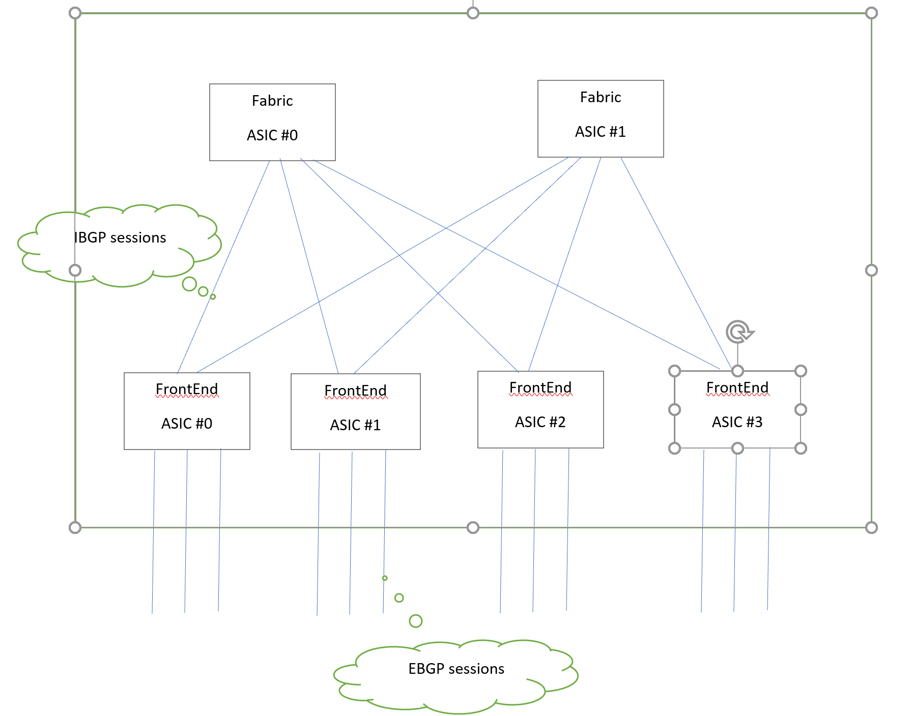

# Approch note for Warmboot in multi-asic platforms.

This design note details the warm boot approach in fixed format SKU's with multiple AISCs handling the data path traffic.
In the multi-asic platforms these are the notable changes that needs to be considered.


- the following services viz databse, swss, syncd, teamd, bgp, lldp are replicated and one instance per ASIC that is present in the platform.
- each of these above set of services run in their own linux network namespace.
- there are port channel interfaces present between the ASIC's. These interfaces are allways up and bundled with backplane interfaces.
- there are IBGP sessions between the BGP instances running in various ASIC namespace.

## Warm boot sequence

### For single ASIC platform.

  These are the steps when the system goes down on warm reboot 

  * Pausing orchagent 
  
  * Stopping radv
   
  * Stopping bgp 
    
  * Syncd pre-shutdown 
      
  * Backing up database
       
  * Stopping teamd 
        
  * Stopping syncd 
         
  * Stopping all remaining containers 
          
  * kexec to reboot with the added kernel parameters
 
 
 
### The design changes for multi-ASIC platform.

The following are the main thoughts into the warm boot design approach for multi-asic.

#### 1. Introduce a warm restart state table in the StateDB

This table will store the warm restart lifecycle state for that asic instance.

```
WARM_RESTART_STATE_TABLE
;Stores warm-reboot lifecycle state for that asic_instance


key             = WARM_RESTART_STATE_TABLE|asic_instance        ; asic_instance is a unique ID or name to identify
                                                                ; the instance of set of services <database, swss
                                                                ; syncd, teamd, bgp, lldp> running in a namespace

state           = "db_save_start/end" / bgp_start/end" / "swss_start/end" / "syncd_start/end" / "teamd_start/end" / "database_start/end"
                                                                ; FSM state of the services bound to a particular 
                                                                ; asic_instance.
```


#### 2. Approach to control the warm restart lifecycle with multiple instances

Enhance the existing script to watch the warm boot sequence per "asic_instance".
- The script will spawn multilple threads each doing warm restart per asic instance.
- The threads communicate using Pub/Sub model by updating the WARM_RESTART_STATE_TABLE defined each database instance.
- The parent process would control the warm restart lifecycle in every asic instance, by 
    - writing the "state_start"
    - waiting for "state_end" from each of the asic instances 
    - Proceed to next state if we get state_end from all the instances.
    
#### 3 Warm-boot sequence and Failure scenarios

   In case of Multi-asic we do the warm boot of each ASIC in parallel. 
   
   The idea is to do the "more failure prone activities" at begining of the warm reboot lifecycle after pre-check and be able to revert ( if possible ) the system to a good state in case of failure in any one of the ASIC threads.
   
   The most critical activities where a failure could result in the warm-reboot fail are **Pausing orchagent** and **Syncd pre-shutdown**.The Syncd pre-shutdown is where the SAI_SWITCH_ATTR_PRE_SHUTDOWN attribute is send to let SAI/SDK do save the state, shutdown most functions. The CPU port will remain active so that packets could be send out from control plane.

   The following sequence is proposed in each of the thread handling warm reboot lifecycle per asic.
   
   *  Pausing orchagent  < check failure, if failure in any ASIC, can we unpause and recover > 
   *  Syncd pre-shutdown   < check failure, if failure in any exit, ask user to do cold reboot > 
    
   --------- From here on no looking back -------- 
    
   *  Stopping radv
      
   *  Stopping bgp 
   
   *  Backing up database
       
   *  Stopping teamd 
        
   *  Stopping syncd 
         
   *  Stopping all remaining containers 
   
   
#### 4. LAG Convergence
The teamd dockers will go down at the same time after sending the LACP frames to increase the link aggregation timers in the peers.
On the way up after warm boot, the teamd dockers will come up together and establish all the internal LAGs along with the external LAGs.

#### 5. BGP Convergence 


In the multi-asic platforms,

* the BGP instance running in the front end ASIC's will do a **redistribute** routes to the fabric ASIC's
* the BGP instance running in the fabric ASIC's will do a **route-reflector** of the routes to the front-end ASIC's 

When the warm restart is initiated, the BGP instances running in each namespace, can go down at the same time - after sending the graceful restart message to the internal/external peers.

On the way up, the following is the approach in **single ASIC** platforms,
  * The routes saved when the switch when down will be populated in the AppDB,
  * Start a wr timer of 120 sec.
  * Till the timer expires the fpmsyncd internally stores the routes 
  * When the times expires after 120sec, the reconcilation is done.
  
For the **multi-asic** platforms, 
  * Instead of a fixed timer of 120 sec - the reconcilation in front-end ASICs should be dependent on the convergence in fabric ASIC's.
    [TODO] 

#### 6. Save the Redis DB in each ASIC instance

[TODO]
  


#### 7. Save the SAI states in each ASIC instance

[TODO]


## Steps done when the device comes back up after warm boot

On the way up after warm reboot, the sequence could be same as what we do for a single ASIC platform. The design change would be related to 
  - restore from different redis database saved file per ASIC instance
  - restore from different sai warboot saved files per ASIC instance.
  


## Updates for fast-reboot

[TODO]

 
