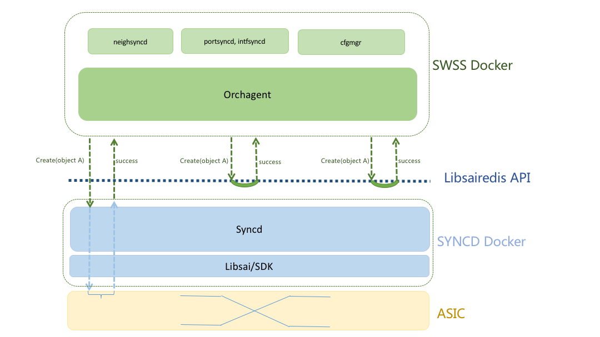

# SONiC libsairedis API idempotence support

Table of Contents
=================

* [Overview](#overview)
* [Libsairedis API operations](#libsairedis-api-operations)
* [Cache of operation data](#cache-of-operation-data)
  * [Attributes to OID mapping](#attributes-to-oid-mapping)
    * [Current attributes to OID mapping](#current-attributes-to-oid-mapping)
    * [Default attributes to OID mapping](#default-attributes-to-oid-mapping)
  * [OID to attributes mapping](#oid-to-attributes-mapping)
  * [Default objects mapping](#default-objects-mapping)
* [Performance tunning](#performance-tunning)
  * [In memory cache of the mapping](#in-memory-cache-of-the-mapping)
  * [Optimize current producer/consumer channel](#optimize-current-producerconsumer-channel)
  * [Multiple redis instance support](#multiple-redis-instance-support)
  * [Serialization/deserialization](#serializationdeserialization)


# Overview
Libsairedis API interface is used by orchagent to interact with syncd for ASIC programing and data retrieval.  To support warm restart of swss docker, making the libsairedis API call idempotent will greatly facilitate the state restore of orchagent.


# Libsairedis API operations
There are four types of operations: create, set, remove and get.

Ideally the operations at libsai/sdk layer are idempotent, orchagent can make the same call repeatedlly without disrupting data plane services. While that will put strict requirement on libsai/sdk implementation and may not be possible in the near future, we'd like to restrain any duplicate create, set and remove operation from being pushed down to syncd/libsai/ASIC. In the perspective of orchagent, the libsairedis API is idempotent. Get operation towards libsai/ASIC is treated as harmless and duplicate get operation may pass through.

Below is an example of idempotent libsairedis create operation:




# Cache of operation data
In order to avoid propagating duplicate create/set/remove operations down to syncd, libsairedis needs to cache the very first operation data and filter out the following duplicates. Also to support warm restart, the cache is to be saved in redis db.

There are five types of cache to support idempotent operations at libsairedis layer.

## Attributes to OID mapping
Each sai object has a key to be uniquely identified. For objects which are created by orchagent and have key type of sai_object_id_t, we need to ensure that same set of attributes will yield the same OID at libsairedis create API call.

### Current attributes to OID mapping
```
#define ATTR2OID_PREFIX    ("ATTR2OID_" + (g_objectOwner))
```
ATTR2OID_PREFIX is the prefix for mapping from attributes to OID. When a create request for oject key type of sai_object_id_t reaches libsairedis layer, the attributes provided will put together in order and a lookup key is formed using ATTR2OID_PREFIX as prefix. If there is an entry existing for the lookup key, corresponding OID value is returned directly without going down further.

Note that g_objectOwner is a string value set by some application to distinguish objects which are created with same attributes.

Ex. for underlay and overlay router interfaces created by orchagent, both of them use the same loopback router interface and virtural router as attributes, different owners are set so they may retrieve the original OIDs without confusing each other.

In the example below, the owner of underlay router interface is "UNDERLAY_INTERFACE_" and it has OID of 0x6000000000939. While for overlay router interface, it is owned by "OVERLAY_INTERFACE_" and its OID is 0x6000000000996.

```
127.0.0.1:6379[7]> keys ATTR2OID_*LAY_INTERFACE_*
1) "ATTR2OID_OVERLAY_INTERFACE_SAI_ROUTER_INTERFACE_ATTR_TYPE=SAI_ROUTER_INTERFACE_TYPE_LOOPBACK|SAI_ROUTER_INTERFACE_ATTR_VIRTUAL_ROUTER_ID=oid:0x300000000003a"
2) "ATTR2OID_UNDERLAY_INTERFACE_SAI_ROUTER_INTERFACE_ATTR_TYPE=SAI_ROUTER_INTERFACE_TYPE_LOOPBACK|SAI_ROUTER_INTERFACE_ATTR_VIRTUAL_ROUTER_ID=oid:0x300000000003a"

127.0.0.1:6379[7]>
127.0.0.1:6379[7]> hgetall "ATTR2OID_OVERLAY_INTERFACE_SAI_ROUTER_INTERFACE_ATTR_TYPE=SAI_ROUTER_INTERFACE_TYPE_LOOPBACK|SAI_ROUTER_INTERFACE_ATTR_VIRTUAL_ROUTER_ID=oid:0x300000000003a"
1) "SAI_OBJECT_TYPE_ROUTER_INTERFACE:oid:0x6000000000996"
2) "NULL"
127.0.0.1:6379[7]> hgetall "ATTR2OID_UNDERLAY_INTERFACE_SAI_ROUTER_INTERFACE_ATTR_TYPE=SAI_ROUTER_INTERFACE_TYPE_LOOPBACK|SAI_ROUTER_INTERFACE_ATTR_VIRTUAL_ROUTER_ID=oid:0x300000000003a"
1) "SAI_OBJECT_TYPE_ROUTER_INTERFACE:oid:0x6000000000939"
2) "NULL"
```

### Default attributes to OID mapping
```
#define DEFAULT_ATTR2OID_PREFIX    ("DEFAULT_ATTR2OID_" + (g_objectOwner))
#define DEFAULT_OID2ATTR_PREFIX    "DEFAULT_OID2ATTR_"
```
After an object with key type of sai_object_id_t is created, the attributes for it may be changed later. The current attributes to OID mapping will be updated to reflect this changes. For warm restart, the same original default attributes list may be used when the object is created again. To be able to handle such cases, whenever a new SET request which will cause the orginial default attributes list changed, a separate default attributes to OID mapping will be created. This happens up to one time for each object, any more attributes SET change will just update the current attributes to OID mapping, this is ensured by checking the existence "DEFAULT_OID2ATTR_" mapping using OID as lookup key.

Take hostif object as example, hostif Ethernet18 was originally created with attributes SAI_HOSTIF_ATTR_NAME, SAI_HOSTIF_ATTR_OBJ_ID and SAI_HOSTIF_ATTR_TYPE. After vlan provisioning on Ethernet18, SAI_HOSTIF_ATTR_VLAN_TAG is set, a new default attributes to OID mapping is created to save the original mapping while current attributes to OID mapping will be updated to include SAI_HOSTIF_ATTR_VLAN_TAG attribute.

During warm restart, if the lookup failed with the current attributes to OID mapping, default attributes to OID mapping will be checked then.

```
127.0.0.1:6379[7]> hgetall "DEFAULT_ATTR2OID_SAI_HOSTIF_ATTR_NAME=Ethernet18|SAI_HOSTIF_ATTR_OBJ_ID=oid:0x1000000000014|SAI_HOSTIF_ATTR_TYPE=SAI_HOSTIF_TYPE_NETDEV"
1) "SAI_OBJECT_TYPE_HOSTIF:oid:0xd000000000952"
2) "NULL"

127.0.0.1:6379[7]> hgetall DEFAULT_OID2ATTR_SAI_OBJECT_TYPE_HOSTIF:oid:0xd000000000952
1) "SAI_HOSTIF_ATTR_NAME"
2) "Ethernet18"
3) "SAI_HOSTIF_ATTR_OBJ_ID"
4) "oid:0x1000000000014"
5) "SAI_HOSTIF_ATTR_TYPE"
6) "SAI_HOSTIF_TYPE_NETDEV"

127.0.0.1:6379[7]> hgetall "ATTR2OID_SAI_HOSTIF_ATTR_NAME=Ethernet18|SAI_HOSTIF_ATTR_OBJ_ID=oid:0x1000000000014|SAI_HOSTIF_ATTR_TYPE=SAI_HOSTIF_TYPE_NETDEV|SAI_HOSTIF_ATTR_VLAN_TAG=SAI_HOSTIF_VLAN_TAG_KEEP"
1) "SAI_OBJECT_TYPE_HOSTIF:oid:0xd000000000952"
2) "NULL"
```

## OID to attributes mapping
```
#define OID2ATTR_PREFIX    "OID2ATTR_"
```
For SET and REMOVE operations, the OID to attributes mapping is used to find the existing data for the object. If no change is found, then it is a duplicate operation, just return success.

Objects with key type of non sai_object_id_t like route entry, neighbor and fdb only have entries in this mapping.

## Default objects mapping
There are default objects created by libsai/SDK. Orchagent may change the attributes for them. The default objects mapping will save the mapping from object key to latest attributes. During warm restart, the same attributes SET on default objects return directly.
```
/*
 * For objects created by asic SDK/Libsai and changed by orchagent.
 */
#define DEFAULT_OBJ_PREFIX    "DEFAULT_OBJ_"
```

# Performance tunning

(TODO:)

## In memory cache of the mapping
To speed up the lookup performance of the mapping tables, an in memory cache may be implemented to avoid redis hget operation.

## Optimize current producer/consumer channel

Based on the redis benchmark data shown below, with one redis client, the number of write operations per second is around 10k.
Current implementation of multiple LPUSH/LRANGE/LRIM for key, op, value may be combined into one LPUSH/LRANGE/LRIM.
It is expected that with this change, the performance of libsairedis API may be better though redis pipeline already reduced the cost of single operation.

```
root@sonic:/# /etc/sonic/redis-benchmark -q -n 100000 -c 1
PING_INLINE: 10279.61 requests per second
PING_BULK: 10702.05 requests per second
SET: 9086.78 requests per second
GET: 10779.35 requests per second
INCR: 9184.42 requests per second
LPUSH: 9257.54 requests per second
RPUSH: 9433.07 requests per second
LPOP: 8948.55 requests per second
RPOP: 9074.41 requests per second
SADD: 10519.67 requests per second
SPOP: 11586.14 requests per second
LPUSH (needed to benchmark LRANGE): 9450.90 requests per second
LRANGE_100 (first 100 elements): 4533.91 requests per second
LRANGE_300 (first 300 elements): 2608.14
LRANGE_300 (first 300 elements): 2584.91 requests per second
LRANGE_500 (first 450 elements): 1850.24 requests per second
LRANGE_600 (first 600 elements): 1493.65 requests per second
MSET (10 keys): 4951.97 requests per second

root@sonic:/# lscpu
Architecture:          x86_64
CPU op-mode(s):        32-bit, 64-bit
Byte Order:            Little Endian
CPU(s):                4
On-line CPU(s) list:   0-3
Thread(s) per core:    1
Core(s) per socket:    4
Socket(s):             1
NUMA node(s):          1
Vendor ID:             GenuineIntel
CPU family:            6
Model:                 77
Model name:            Intel(R) Atom(TM) CPU  C2558  @ 2.40GHz
Stepping:              8
CPU MHz:               1200.000
CPU max MHz:           2400.0000
CPU min MHz:           1200.0000
BogoMIPS:              4787.75
Virtualization:        VT-x
L1d cache:             24K
L1i cache:             32K
L2 cache:              1024K
NUMA node0 CPU(s):     0-3
```

## Multiple redis instance support
Considering the benchmark data, single redis instance may not sustain the extreme scenario like route flapping. For DB like countersDB, it should be better to run in a separate redis instance.

All the mapping for libsairedis API idempotence will be located in restoreDB. If multiple redis instances is supported and in memory cache is ready, we may consider making the mapping DB write asynchronous so separate redis instance could be better utilized for this use case.
```
#define RESTORE_DB      7
```

## Serialization/deserialization
It looks a lot of resource has been consumed by the serialization/deserialization processing.  There might be room for optimization in this area.


