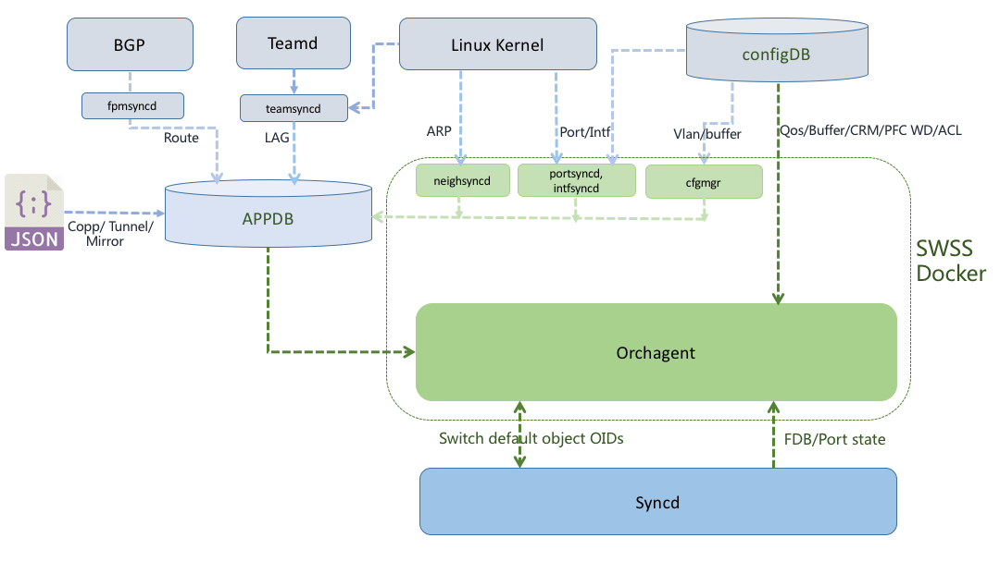

# SONiC SWSS docker warm restart

Table of Contents
=================

* [Overview](#overview)
* [Input Data for swss](#input-data-for-swss)
  * [configDB](#configdb)
  * [Linux Kernel](#linux-kernel)
  * [Teamd and teamsyncd](#teamd-and-teamsyncd)
  * [BGP and fpmsyncd](#bgp-and-fpmsyncd)
  * [JSON files](#json-files)
  * [Syncd](#syncd)
* [SWSS state restore](#swss-state-restore)
  * [PORT, VLAN and INTF](#port-vlan-and-intf)
  * [ARP, LAG and route data in orchagent](#arp-lag-and-route-data-in-orchagent)
  * [QoS, Buffer, CRM, PFC WD and ACL data in orchagent](#qos-buffer-crm-pfc-wd-and-acl-data-in-orchagent)
  * [COPP, Tunnel and Mirror data in orchagent](#copp-tunnel-and-mirror-data-in-orchagent)
  * [FDB and port state in orchagent](#fdb-and-port-state-in-orchagent)
  * [OID for switch default objects in orchagent\.](#oid-for-switch-default-objects-in-orchagent)
* [SWSS state consistency validation](#swss-state-consistency-validation)
  * [Pre\-restart state validation](#pre-restart-state-validation)
  * [Post\-restore state validation](#post-restore-state-validation)
* [SWSS state sync up](#swss-state-sync-up)
  * [ARP sync up](#arp-sync-up)
  * [port state sync up](#port-state-sync-up)
  * [FDB sync up](#fdb-sync-up)
  * [LAG sync up](#lag-sync-up)
  * [Route sync up](#route-sync-up)
* [SWSS docker warm restart](#swss-docker-warm-restart)
  * [Separate syncd docker from swss docker service](#separate-syncd-docker-from-swss-docker-service)
  * [Manual switch between warm and cold start](#manual-switch-between-warm-and-cold-start)
  * [Automatic fallback to system cold restart upon warm start failure](#automatic-fallback-to-system-cold-restart-upon-warm-start-failure)
* [Open issues](#open-issues)
  * [How to handle those dockers which has dependency on swss docker in systemd service?](#how-to-handle-those-dockers-which-has-dependency-on-swss-docker-in-systemd-service)
  * [APPDB data restore during system warm restart](#appdb-data-restore-during-system-warm-restart)
  * [Should stateDB be flushed for warm restart?](#should-statedb-be-flushed-for-warm-restart)

# Overview
The goal of SONiC swss docker warm restart is to be able restart and upgrade swss docker software without impacting the data plane.

The swss docker warm restart should restore all necessary control plane data and get synchronized with current network and switch states. As the single point of interface with lower layer syncd, the state processing of orchagent is the key for swss docker warm restart.

# Input Data for swss

The state of swss is driven by data from multiple sources.

## configDB
configDB and together with fixed config files port_config.ini and pg_lookup.ini form the basic data source for port, VLAN, VLAN interface, buffer, QoS, CRM, PFC watchdog and ACL. Certain data will be consumed by orchagent directly like QoS, CRM, and ACL configurations.

## Linux Kernel
The initial port config is parsed by portsyncd and passed down to orchagent, that again will trigger SAI api call to ask ASIC SDK to create host netdev interface on Linux.  Portsyncd watches the kernel RTNLGRP_LINK netlink notification about host interface creation, then signals PortInitDone to Orchagent via APPDB so the other processing in Orchagent may proceed.

Intfsyncd listens on RTNLGRP_IPV4_IFADDR and RTNLGRP_IPV6_IFADDR netlink groups, it sets appDB INTF_TABLE with the data.

Neighsyncd gets ARP netlink notification from Linux kernel, the data will be used by Orchagent to populate neighbor and nexthop objects.

teamsyncd runs in teamd docker, it also listens on both RTNLGRP_LINK netlink group for LAG related notification and teamd lag member state messages. The data will be used to program APPDB lag and lagmember tables.

## Teamd and teamsyncd
Teamd is the ultimate source of LAG related state including those kernel lag message. Teamsyncd takes instructions from both teamd and Linux kernel.

## BGP and fpmsyncd

All the APPDB ROUTE_TABLE data is from BGP docker. fpmsyncd which programs APPDB ROUTE_TABLE directly runs in BGP docker.

## JSON files
For copp, tunnel and mirror related configurations,  they are loaded from json files to corresponding APPDB tables.

## Syncd
FDB and Port state notifications come from ASIC, syncd relays the data to orchagent.
Orchagent also gets info for the objects created by ASIC by default, ex. the port list, hw lanes and queues.

# SWSS state restore
During swss warm restart, the state of swss should be restored. It is assumed that all data in APPDB has either been restored or been kept intact.

## PORT, VLAN and INTF
Portsyncd has some internal state processing as to PortConfigDone and PortInitDone. We don't restore port data from APPDB directly, but rely on port config and linux RTM_GETLINK dump to populate port data again.

VLAN also needs to set up Linux host environment for vlan aware bridge. But for swss docker restart, the previous bridge setup is kept by Linux, vlanmgrd should avoid deleting and creating the bridge again.

For APP INTF, netlink.dumpRequest(RTM_GETADDR) in intfsyncd will populate interface IP from Linux.

## ARP, LAG and route data in orchagent
These data will be restored from APPDB directly by orchagent.

## QoS, Buffer, CRM, PFC WD and ACL data in orchagent
Orchagent fetch the existing data from configDB at startup.

## COPP, Tunnel and Mirror data in orchagent
These configuration will be loaded to APPDB from JSON files then received by orchagent at startup.

## FDB and port state in orchagent
Both the FDB and port state data is restored from APPDB by orchagent.

## OID for switch default objects in orchagent.
Orchagent relies on SAI get api to fetch the OID data from syncd for switch default objects.

# SWSS state consistency validation
After swss state restore, the state of each swss processes especially orchagent should be consistent with the state before restart.
For now, it is assumed that no configDB change during the whole warm restart window. Then the state of orchagent is mainly driven by APPDB data changes.  Following basic pre-restart and post-restore validation could be applied.

## Pre-restart state validation
A "restart prepare" request is sent to orchagent, if there no pending data in SyncMap (m_toSync) of all application consumers in orchagent, OrchDaemon will set a flag to stop processing any further APPDB data change and return success for the "restart prepare"
request. Otherwise failure should be returned for the request to indicate that there is un-fullfilled dependency in orchagent which is not ready to do warm restart.

The existing ProducerStateTable/ConsumerStateTable implementation should be updated so that only consumer side modify the actual table.

## Post-restore state validation
After swss state restore, same as that in pre-restart phase, no pending data in SyncMap (m_toSync) of all application consumers should exist. This should be done before swss state sync up.

 *More exhaustive validation beyond this is to be designed and implemented.*

# SWSS state sync up
During the restart window, dynamic data like ARP, port state, FDB, LAG and route may be changed. Orchagent needs to sync up with the latest network state.

It is assumed that no configDB data change happened.

## ARP sync up
At startup of neighsyncd, netlink.dumpRequest(RTM_GETNEIGH) has been called. But there may be stale entries in APPDB NEIGH_TABLE and they should be removed.

For the warm restart of whole system, the Linux arp data is gone too. All the neighbors should be pinged again to get their mac info.

## port state sync up
Physical state of port may change during swss restart, orchagent should fetch the latest port state or syncd should queue all the unproccessed port state notification for orchagent to pick up.

## FDB sync up
FDB entries may change during swss restart, orchagent should fetch the latest FDB entries and remove stale ones, or syncd should queue all the unproccessed FDB notification for orchagent to pick up.

## LAG sync up
Upon swss restart, teamsyncd should have queued all the LAG changes in APPDB, orchagent may process those changes after restart.  In case teamd docker restarted too, it is responsible for getting LAG_TABLE and LAG_MEMBER_TABLE up to date in APPDB.

## Route sync up
Upon swss restart, fpmsyncd should have queued all the route changes in APPDB, orchagent may process those changes after restart.  In case bgp docker restarted too, it is responsible for getting ROUTE_TABLE up to date in APPDB, which includes removing stale route entries and add new route entries.

# SWSS docker warm restart
## Separate syncd docker from swss docker service
Syncd docker restart should not be triggered by swss docker restart. A systemd syncd service should be created independent of swss service.

## Manual switch between warm and cold start
Upon detecting the existence of certain folder, ex. /etc/sonic/warm_restart, swss docker will assume warm restart has been requested. Otherwise swss will flush db and perform cold start.
A CLI and function in configDB enforcer should be implemented for enabling/disabling warm restart.

## Automatic fallback to system cold restart upon warm start failure
Mechanism should be available to automatically fall back to system cold restart upon failure of warm start.

# Open issues

## How to handle those dockers which has dependency on swss docker in systemd service?
dhcp_relay, snmp and radv dockers will be restart too because of their systemd dependency on swss docker when swss docker is restarted with systemctl.

## APPDB data restore during system warm restart
How to restore all APPDB data after system restart, is there tools available for dump and restore whole redis DB?

## Should stateDB be flushed for warm restart?
For swss docker warm restart, keep stateDB. For system restart, since Linux host environment should be restored in this case, the stateDB needs to be flushed and populated again with Ethernet, LAG and VLAN data.

