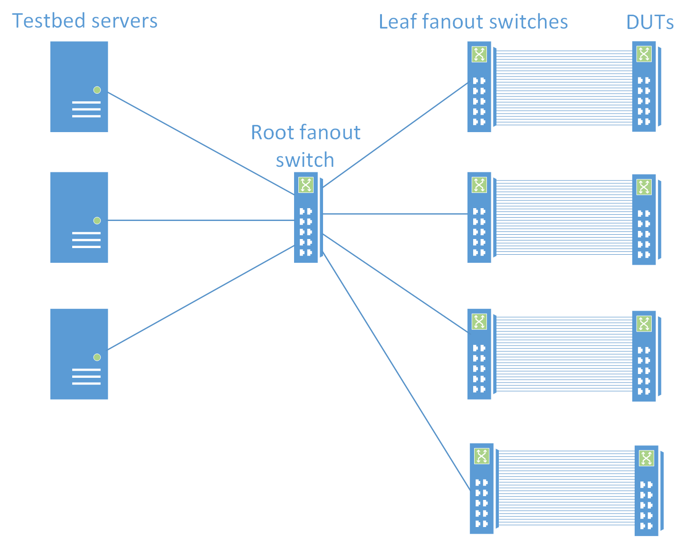
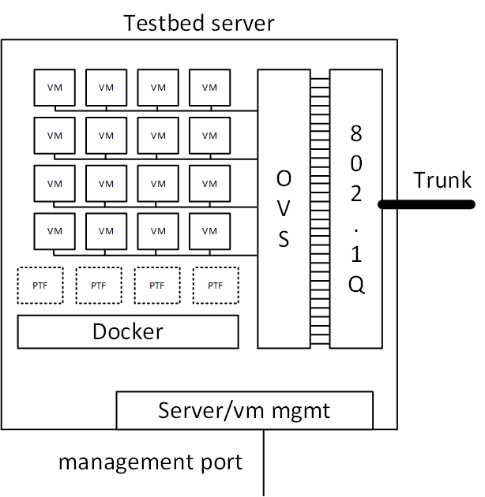

# System-wide Warmboot

# going down path

- stop bgp docker 
  - enable bgp graceful restart
  - same as fast-reboot
- stop teamd docker
  - stop teamd gracefully to allow teamd to send last valid update to be sure we'll have 90 seconds reboot time available.
- stop swss docker
  - disable mac learning and aging
  - freeze orchagent
  - set redis flag WARM_RESTART_TABLE:system
  - kill swss dockers
- save the appdb and asic db into the files.
  - <del>save applDB db in ```/host/warmboot/appl_db.json```</del> 
  - <del>save configDB db in ```/host/warmboot/config_db.json```</del> 
  - <del>save stateDB db (only FDB and WARM_RESTART_TABLE) in ```/host/warmboot/state_db.json``` </del> 
  - <del>save asicDB in ```/host/warmboot/asic_db.json```</del> 
  - save the whole Redis databse into ```/host/warmboot/dump.rdb```
- stop syncd docker
  - warm shutdown
  - save the SAI states in ```/host/warmboot/sai-warmboot.bin```
  - kill syncd docker
- stop database
- use kexec to reboot, plus one extra kernel argument

Plan to re-use fast-reboot script. Improve the fast-reboot to handle warm-reboot scenario, have a symbol link to warm-reboot. 
The script detects the name, and call corresponding reboot.

## Details of kernel arguments
In fast-reboot or warm-reboot, we will use kernel argument to indicate the whole system reboot type for the next boot up. The argument format is ```SONIC_BOOT_TYPE=[fast-reboot|warm|cold]```. Benefits:
1. not possible to set both fast and warm
2. less conflict with vanilla linux kernel arguments
3. all existing checker for ```*fast-reboot*``` still work

Later if we improve the consistency ```SONIC_BOOT_TYPE=[fast|warm|cold]```, this way the production image upgrading process will be smooth (no disruptive change)

## SAI expectations for warm shutdown
- Application (e.g. SONiC) sets switch attribute SAI_SWITCH_ATTR_RESTART_WARM to true before calling remove_switch().
  - Note that this attribute doesn't have to be set at switch_create() time. This is a dynamic decision, setting before calling remove_switch() is sufficient.
- Application sets profile attribute SAI_KEY_WARM_BOOT_WRITE_FILE to a valid path/filename where the SAI data will be saved during upcoming warm shutdown.
  - Depending on the SAI implementation, this value might have been read by SAI at switch_create() time only. It is recommended to set this value before calling create_switch().

# going up path

- Use kernel argument ```SONIC_BOOT_TYPE=warm``` to determine in warm starting mode
- start database
  - recover redis from ```/host/warmboot/*.json```
  - implemented in database system service
- start syncd docker
  - implemented inside syncd docker
  - recover SAI state from ```/host/warmboot/sai-warmboot.bin``` 
  - the host interface will be also recovered.
- start swss docker
  - orchagent will wait till syncd has been started to do init view.
  - will read from APP DB and do comparsion logic.
- start teamd docker
  - at the same time as swss docker. swss will not read teamd app db until it finishes the comparison logic.
- start bgp docker
  - at the same time as swss docker. swss will not read bgp route table until it finishes the comparison logic.

## SAI expectations for warm recovery
- Application sets profile value SAI_KEY_BOOT_TYPE to 1 to indicate WARM BOOT. (0: cold boot, 2: fast boot)
- Application sets profile value SAI_KEY_WARM_BOOT_READ_FILE to the SAI data file from previous warm shutdown.
- Note: Switch attribute SAI_SWITCH_ATTR_WARM_RECOVER is not required by SAI.
- Application calls create_switch with 1 attribute: SAI_SWITCH_ATTR_INIT_SWITCH set to true. SAI shall recover other attributes programmed before.
- Application re-register all callbacks/notificaions. These function points are not retained by SAI across warm boot.

# Design of test
Assumptions:
1. DUT is T0 topology
2. Focus on whole system reboot, in future will extend it to container level warm restart
3. Focus on one image warm reboot, and version upgrading warm reboot. No version downgrading warm reboot.

Structure of testbed: [design doc](https://github.com/sonic-net/sonic-mgmt/blob/master/docs/testbed/README.testbed.Overview.md#sonic-testbed-overview)



Architect:
  - Both warm-reboot and fast-reboot are written in ansible playbook [advanced-reboot.yml](https://github.com/sonic-net/sonic-mgmt/blob/master/ansible/roles/test/tasks/advanced-reboot.yml)
  - The playbook will deploy a master python script [advanced-reboot.py](https://github.com/sonic-net/sonic-mgmt/blob/master/ansible/roles/test/files/ptftests/advanced-reboot.py) to PTF docker container and all the steps are running there
  - The master python script will
    - ssh into DUT to execute reboot command
    - ssh into Arist EOS VM to observe and operate port, port channel and BGP sessions
    - operate VLAN ports
    - store and analysis data

Steps:
1. Prepare environment
   - Enable link state propagation
     - [ ] Propagate VEOS port oper down to Fanout switch
     - [x] Propagete Fanout switch port oper down to VEOS
   - [ ] Enable NTP service in DUT, Arista EOS VMs, PTF docker

2. Prepare DUT with user specified states `pre_reboot_vector`
   - [ ] DUT port down
   - [ ] DUT LAG down
   - [ ] DUT LAG member down
   - [ ] DUT BGP session down
   - [ ] Neigh port down
   - [ ] Neigh LAG remove member
   - [ ] Neigh LAG admin down
   - [ ] Neigh LAG member admin down
   - [ ] Neigh BGP session admin down
   
3. Pre-warm-reboot status check
   - [ ] VM: Port.lastStatusChangeTimestamp
   - [x] VM: PortChannel.lastStatusChangeTimestamp
   - [x] VM: monitor how many routes received from DUT
   - [ ] DUT: console connect and keep measure meaningful events such as shutdown and bootup
   - [ ] Observe no packet drop
     - current implementation of advanced-reboot waits for ping down, which is not working for warm-reboot
     - if any packet drop, test fails
     - how to know warm-shutdown and warm-bootup timestamp?
   - [ ] CRM usage snapshot: the gold here is make sure no usage increase for no sad injected case

4. During-warm-reboot sad vector injection `during_reboot_vector`
   - [ ] Neigh port down
   - [ ] Neigh LAG remove member
   - [ ] Neigh LAG admin down
   - [ ] Neigh LAG member admin down
   - [ ] Neigh BGP session admin down
   - [ ] Neigh route change
   - [ ] Neigh MAC change
   - [ ] Neigh VLAN member port admin down (some or all)
   
   And conduct some measurement:
   - [x] Ping DUT loopback IP from a downlink port
   - [ ] Ping from one DUT port to another (may choose some pairs or fullmesh)
     - [ ] measure how many times disrupted
       - fastfast reboot will expect once
       - normal warm reboot will expect none
       - fast reboot will expect once
     - [ ] measure how long the longest dirutpive time
     
    
5. Post-warm-reboot status check
   - [ ] Generate expected\_results based on `pre_reboot_vector` + `during_reboot_vector`
   - [ ] VM: Port.lastStatusChangeTimestamp
   - [x] VM: PortChannel.lastStatusChangeTimestamp
   - [x] VM: monitor how many routes received from DUT
   - [ ] DUT: check the image version as expected
   - [x] Observe no packet drop: current implementation of advanced-reboot waits for ping recover, which is not working for warm-reboot
   - [ ] CRM is not increasing for happy path during warm reboot
   
5. Clean-up
   - Disable link state propagation
   - Recover environment
     - [ ] DUT reload minigraph
     - [ ] Neigh copy startup-config to running-config

# Manual test cases

| DUT | Description |
| ------------ | ------------- |
| Platform | x86_64-arista_7060_cx32s |
| HwSKU | Arista-7060CX-32S-D48C8 |
| ASIC | broadcom |
| Topology | T0 (4 LAG up, one port per LAG) |

Steps:
1. Enable link state propagation (Propagete Fanout switch port oper down to VEOS)
```
ansible-playbook -i linkstate/testbed_inv.py -e target_host=<VMS> --vault-password-file=password.txt linkstate/up.yml
```

2. Run warm-reboot playbook once so PTF server will have latest code and data files
```
ansible-playbook test_sonic.yml -i str --limit <DUT> --vault-password-file password.txt -e testbed_name=<VMS> -e testcase_name=warm-reboot
```

3. Before warm-reboot happen, create one of the below sad situation on DUT

   - Shutdown a downlink port. Remove the port name from /tmp/vlan_interfaces.json (if the post reboot status should keep down, below are the same)
   - Shutdown a up link port. Remove the LAG node from /tmp/portchannel_interfaces.json
   - Shutdown a up link LAG. Remove the LAG node from /tmp/portchannel_interfaces.json

   Before warm-reboot happen, create one of the below sad situation on EOS VM (T1). All the up/down are relative to DUT.
   
   - Shutdown a up link LAG. Remove the DUT LAG node from /tmp/portchannel_interfaces.json

   Before warm-reboot happen, create one of the below sad situation on fanout switch. All the up/down are relative to DUT.
   
   - Shutdown a downlink port. Remove the port name from /tmp/vlan_interfaces.json
   - Shutdown a up link port. Remove the DUT LAG node from /tmp/portchannel_interfaces.json

6. Run the PTF command line on PTF server.
   - You can find the command in playbook output in Step 2 with below section
   ```
   TASK [test : PTF Test - Advanced-reboot test]
   ```
   ```
   ptf --test-dir ptftests advanced-reboot.ReloadTest  --qlen=1000   --platform-dir ptftests  --platform remote  -t "verbose=True;dut_username=\"admin\";dut_hostname=\"<DUTIP>\";reboot_limit_in_seconds=30;reboot_type=\"warm-reboot\";portchannel_ports_file=\"/tmp/portchannel_interfaces.json\";vlan_ports_file=\"/tmp/vlan_interfaces.json\";ports_file=\"/tmp/ports.json\";dut_mac='<MAC>';dut_vlan_ip='192.168.0.1';default_ip_range='192.168.0.0/16';vlan_ip_range=\"192.168.0.0/21\";lo_v6_prefix=\"fc00:1::/64\";arista_vms=\"['10.64.247.135','10.64.247.134','10.64.247.132']\""
   ```
   - You can also find the PTF server IP one section below
   ```
   TASK [test : command]
   Thursday 30 May 2019  12:45:19 +0000 (0:00:00.172)       0:00:21.280 ********** 
   changed: [<DUT> -> <PTF_IP>]   
   ```


7. Carefully observe command output and seek for message like "Dut reboots: reboot start", switch to DUT ssh connection immediately and try hit enter keys several times. The ssh connnection will be no response after about 5 seconds. That's the time of shutdown.

8. During reboot happen, create one of the transition situations. You should do it quickly after above step.
    - Shutdown a downlink port.
    - Shutdown a up link port.
    - Shutdown a up link LAG.
    - Startup a downlink port. 
    - Startup a up link port.
    - Startup a up link LAG.

9. Keep observe 'ptf' command until it finish with 'OK' result
10. After warm-reboot, create one of the below sad situation on EOS VM (T1). All the up/down are relative to DUT.

    - Shutdown a up link LAG. Remove the DUT LAG node from /tmp/portchannel_interfaces.json
     
    After warm-reboot, create one of the below sad situation on fanout switch. All the up/down are relative to DUT.
    
    - Shutdown a downlink port. Remove the port name from /tmp/vlan_interfaces.json
    - Shutdown a up link port. Remove the DUT LAG node from /tmp/portchannel_interfaces.json
