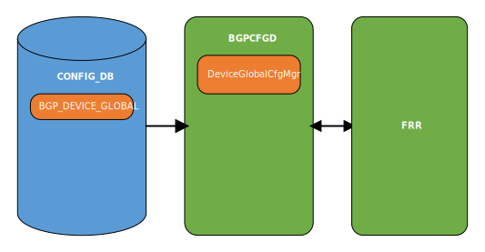

# SONiC Weighted ECMP

## High Level Design document

## Table of contents

- [Revision](#revision)
- [About this manual](#about-this-manual)
- [Scope](#scope)
- [Abbreviations](#abbreviations)
- [1 Introduction](#1-introduction)
    - [1.1 Feature overview](#11-feature-overview)
    - [1.2 Requirements](#12-requirements)
        - [1.2.1 Functionality](#121-functionality)
        - [1.2.2 Command interface](#122-command-interface)
        - [1.2.3 Error handling](#123-error-handling)
            - [1.2.3.1 Frontend](#1231-frontend)
            - [1.2.3.2 Backend](#1232-backend)
        - [1.2.4 Event logging](#124-event-logging)
            - [1.2.4.1 Frontend](#1241-frontend)
            - [1.2.4.2 Backend](#1242-backend)
- [2 Design](#2-design)
    - [2.1 Overview](#21-overview)
    - [2.2 FRR WCMP configuration](#22-frr-wcmp-configuration)
        - [2.2.1 L3 network](#221-l3-network)
        - [2.2.2 EVPN network](#222-evpn-network)
    - [2.3 Configuration daemon](#23-configuration-daemon)
        - [2.3.1 Overview](#231-overview)
        - [2.3.2 SWSS OA](#232-swss-oa)
        - [2.3.3 BGP daemon](#233-bgp-daemon)
        - [2.3.4 FRR configuration templates](#234-frr-configuration-templates)
    - [2.4 DB schema](#24-db-schema)
        - [2.4.1 Config DB](#241-config-db)
        - [2.4.2 Data sample](#242-data-sample)
        - [2.4.3 Configuration sample](#243-configuration-sample)
        - [2.4.4 Initial configuration](#244-initial-configuration)
    - [2.5 Flows](#25-flows)
        - [2.5.1 Config section](#251-config-section)
            - [2.5.1.1 WCMP update](#2511-wcmp-update)
        - [2.5.2 Show section](#252-show-section)
            - [2.5.2.1 WCMP show](#2521-wcmp-show)
    - [2.6 CLI](#26-cli)
        - [2.6.1 Command structure](#261-command-structure)
        - [2.6.2 Usage examples](#262-usage-examples)
            - [2.6.2.1 Config command group](#2621-config-command-group)
            - [2.6.2.2 Show command group](#2622-show-command-group)
    - [2.7 YANG model](#27-yang-model)
    - [2.8 Warm/Fast boot](#28-warmfast-boot)
- [3 Test plan](#3-test-plan)
    - [3.1 Unit tests via PYTEST](#31-unit-tests-via-pytest)
    - [3.2 Unit tests via VS](#32-unit-tests-via-vs)
    - [3.3 Data plane tests via PTF](#33-data-plane-tests-via-ptf)

## Revision

| Rev | Date       | Author         | Description     |
|:---:|:----------:|:--------------:|:----------------|
| 0.1 | 24/01/2024 | Nazarii Hnydyn | Initial version |

## About this manual

This document provides general information about WCMP implementation in SONiC

## Scope

This document describes the high level design of WCMP feature in SONiC

**In scope:**  
1. WCMP L3 configuration

**Out of scope:**  
1. WCMP EVPN Type-5 configuration

## Abbreviations

| Term   | Meaning                                   |
|:-------|:------------------------------------------|
| SONiC  | Software for Open Networking in the Cloud |
| WCMP   | Weighted-Cost Multi-Path                  |
| ECMP   | Equal-Cost Multi-Path                     |
| UCMP   | Unequal-Cost Multi-Path                   |
| EVPN   | Ethernet Virtual Private Network          |
| FRR    | Free Range Routing                        |
| BGP    | Border Gateway Protocol                   |
| IP     | Internet Protocol                         |
| L3     | Layer 3                                   |
| OA     | Orchestration Agent                       |
| DB     | Database                                  |
| NH     | Next Hop                                  |
| NHG    | Next Hop Group                            |
| ToR    | Top-Of-Rack                               |
| API    | Application Programming Interface         |
| SAI    | Switch Abstraction Interface              |
| ASIC   | Application-Specific Integrated Circuit   |
| SWSS   | Switch State Service                      |
| CLI    | Сommand-line Interface                    |
| JSON   | JavaScript Object Notation                |
| YANG   | Yet Another Next Generation               |
| PYTEST | Python Testing Framework                  |
| VS     | Virtual Switch                            |
| PTF    | Packet Test Framework                     |

## List of figures

[Figure 1: WCMP design](#figure-1-wcmp-design)  
[Figure 2: WCMP daemon design](#figure-2-wcmp-daemon-design)  
[Figure 3: WCMP update flow](#figure-3-wcmp-update-flow)  
[Figure 4: WCMP show flow](#figure-4-wcmp-show-flow)

## List of tables

[Table 1: Frontend event logging](#table-1-frontend-event-logging)  
[Table 2: Backend event logging](#table-2-backend-event-logging)

# 1 Introduction

## 1.1 Feature overview

In normal ECMP, the route to a destination has multiple next hops and traffic is expected to be equally distributed  
across these next hops. In practice, flow-based hashing is used so that all traffic associated with a particular flow  
uses the same next hop, and by extension, the same path across the network.

Weighted ECMP using BGP link bandwidth introduces support for network-wide UCMP to an IP destination.  
The unequal cost load balancing is implemented by the forwarding plane based on the weights associated  
with the next hops of the IP prefix. These weights are computed based on the bandwidths of the corresponding  
multipaths which are encoded in the BGP link bandwidth extended community. Exchange of an appropriate  
BGP link bandwidth value for a prefix across the network results in network-wide unequal cost multipathing.

WCMP is applicable in a pure L3 network as well as in a EVPN network.

## 1.2 Requirements

### 1.2.1 Functionality

**This feature will support the following functionality:**
1. WCMP BGP device global configuration
2. Warm/Fast reboot

### 1.2.2 Command interface

**This feature will support the following commands:**
1. config: set switch WCMP global configuration
2. show: display switch WCMP global configuration

### 1.2.3 Error handling

#### 1.2.3.1 Frontend

**This feature will provide error handling for the next situations:**
1. Missing parameter value
2. Invalid parameter value

#### 1.2.3.2 Backend

**This feature will provide error handling for the next situations:**
1. Invalid parameter value

### 1.2.4 Event logging

#### 1.2.4.1 Frontend

**This feature will provide event logging for the next situations:**
1. Configuration update

###### Table 1: Frontend event logging

| Event                         | Severity |
|:------------------------------|:---------|
| Configuration update: success | NOTICE   |
| Configuration update: error   | ERROR    |

#### 1.2.4.2 Backend

**This feature will provide event logging for the next situations:**
1. Invalid parameter value
2. Parameter removal
3. Configuration removal
4. Configuration update

###### Table 2: Backend event logging

| Event                         | Severity |
|:------------------------------|:---------|
| Invalid parameter value       | ERROR    |
| Parameter removal             | NOTICE   |
| Configuration removal         | NOTICE   |
| Configuration update: success | NOTICE   |
| Configuration update: error   | ERROR    |

# 2 Design

## 2.1 Overview


###### Figure 1: WCMP design

A network fabric is a type of network topology where all nodes, in this case switches and endpoints,  
are interconnected to all other nodes. In such a topology, full bisection bandwidth is often expected.  
The full bisection bandwidth allows one half of the network nodes to communicate simultaneously  
with the other half of the nodes.

When a link fails, it is important not only for routing topology to converge quickly, but also converge  
in a way that can maintain the best performance possible. For example, with multiple links connecting  
each ToR and Spine, one link failing does not change reachability, but has big implications  
in terms of performance due to reduced capacity.

Weighted-Equal Cost-Multipath (W-ECMP) offers a solution to this problem in which the relative link weight  
reflecting the available capacity is distributed using the BGP bandwidth community attribute.

Dataplane configuration flow:
* The BGP link bandwidth extended community carries information about the available link capacity for the route  
prefixes through the network, which gets mapped to the weight of the corresponding next hop. The mapping  
factors the bandwidth value of a particular path against the total bandwidth values of all possible paths,  
normalized to the range 1 to 255
* FRR converts the incoming BGP link bandwidth extended community values into proportionated weight  
among the ecmp members in such a way that the cumulative value of individual weights is normalized to 255
* BGP gets notified about the weight change for the prefixes towards the switch that experienced the failure  
of the link connecting the Spine and the remote ToR
* FRR/Zebra recalculates the weight and makes a new NHG
* NH weights on routes are reported to `fpmsyncd` and further via Redis DB to Route OA
* Route OA programs weight values to `syncd` via SAI Redis
* ASIC is provisioned with weight values by `syncd` via SAI API

The NHG member weights can be used by a dataplane to do better forwarding decisions.

## 2.2 FRR WCMP configuration

The configuration for weighted ECMP using BGP link bandwidth requires using a route-map to inject  
the link bandwidth extended community.

There is no configuration necessary to process received link bandwidth and translate it into the weight  
associated with the corresponding next hop; that happens by default. If some of the multipaths do not have  
the link bandwidth extended community, the default behavior is to revert to normal ECMP.

At the entry point router that is injecting the prefix to which weighted load balancing must be performed,  
a route-map must be configured to attach the link bandwidth extended community.

For the use case of providing weighted load balancing for an anycast service, this configuration will typically  
need to be applied at the ToR or Leaf router that is connected to servers which provide the anycast service  
and the bandwidth would be based on the number of multipaths for the destination.

**Note:** FRR documentation at [FRR BGP manual](https://docs.frrouting.org/en/latest/bgp.html)

### 2.2.1 L3 network

**Skeleton code:**
```vtysh
!
route-map wcmp-map permit 100
  set extcommunity bandwidth num-multipaths
exit
!
router bgp 65100
  neighbor SPINE peer-group
  neighbor 1.1.1.1 peer-group SPINE
  neighbor 1.1.1.1 remote-as 65200
  neighbor 2.2.2.2 peer-group SPINE
  neighbor 2.2.2.2 remote-as 65200
  !
  address-family ipv4 unicast
    neighbor SPINE route-map wcmp-map out
    neighbor SPINE activate
  exit-address-family
  !
end
```

### 2.2.2 EVPN network

**Skeleton code:**
```vtysh
!
route-map wcmp-map permit 100
  set extcommunity bandwidth num-multipaths
exit
!
router bgp 65100 vrf vrf1
  neighbor SPINE peer-group
  neighbor 1.1.1.1 peer-group SPINE
  neighbor 1.1.1.1 remote-as 65200
  neighbor 2.2.2.2 peer-group SPINE
  neighbor 2.2.2.2 remote-as 65200
  !
  address-family l2vpn evpn
    advertise ipv4 unicast route-map wcmp-map
    neighbor SPINE activate
  exit-address-family
  !
end
```

**Note:** EVPN configuration is only relevant when `docker_routing_config_mode` is either `split` or `split-unified`

## 2.3 Configuration daemon

### 2.3.1 Overview



###### Figure 2: WCMP daemon design

The existing `DeviceGlobalCfgMgr` class will be extended with a new APIs to implement WCMP feature.  
Configuration daemon will be extended with a new WCMP Config DB schema and set/unset template support.  
WCMP updates will be processed by configuration daemon based on Config DB changes.  
Some updates will be handled and some will be considered as invalid.

### 2.3.2 SWSS OA

NHG member weight support is already part of SWSS.  
No further modifications are required.

**Note:** HLD link is [WCMP SWSS HLD](https://github.com/sonic-net/SONiC/pull/738)

### 2.3.3 BGP daemon

Class `DeviceGlobalCfgMgr` holds a set of methods matching generic `Manager` class pattern to handle  
Config DB updates. For that purpose a `SubscriberStateTable` mechanism (implemented in `sonic-swss-common`)  
is used. Method `DeviceGlobalCfgMgr::handler` will be called on WCMP update. It will distribute handling  
of DB updates between other handlers based on the table key updated (Redis Keyspace Notifications).

This class is responsible for:
1. Processing updates of WCMP
2. Partial input data validation
3. Replicating data from Config DB to FRR configuration
4. Caching objects in order to handle updates

WCMP object is stored under `BGP_DEVICE_GLOBAL|STATE` key in Config DB. On `BGP_DEVICE_GLOBAL` update,  
method `DeviceGlobalCfgMgr::set_wcmp` will be called to process the change.  
Regular WCMP update will refresh the internal class structures and appropriate FRR objects.

**Skeleton code:**
```python
class DeviceGlobalCfgMgr(Manager):
    """ This class responds to change in device-specific state """

    def __init__(self, common_objs, db, table):
        """
        Initialize the object
        :param common_objs: common object dictionary
        :param db: name of the db
        :param table: name of the table in the db
        """
        ...

        self.wcmp_template = common_objs['tf'].from_file("bgpd/wcmp/bgpd.wcmp.conf.j2")

    def set_handler(self, key, data):
        """ Handle device TSA/WCMP state change """
        ...

        self.configure_tsa(data)
        self.configure_wcmp(data)

        return True

    def del_handler(self, key):
        """ Handle device TSA/WCMP state remove """
        ...

        self.configure_tsa()
        self.configure_wcmp()

        return True

    def is_update_required(self, key, value):
        """ API to check if configuration update required """
        ...

    def configure_tsa(self, data=None):
        """ Configure TSA feature"""
        ...

    def configure_wcmp(self, data=None):
        """ Configure WCMP feature"""
        ...
```

**Note:** WCMP BGP configuration via FRR management framework is not considered

### 2.3.4 FRR configuration templates

BGP daemon uses `policies.conf.j2` at `sonic-buildimage/dockers/docker-fpm-frr/frr/bgpd/templates/general`  
in order to generate relevant route-map infrastructure.

WCMP BGP requires using an outbound route-map to inject the link bandwidth extended community.  
For this purpose, the next definitions will be used:
* TO_BGP_PEER_V4
* TO_BGP_PEER_V6

BGP daemon will use `bgpd.wcmp.conf.j2` at `sonic-buildimage/dockers/docker-fpm-frr/frr/bgpd/wcmp` to enable/disable WCMP.

**Skeleton code:**
```jinja
!
! template: bgpd/wcmp/bgpd.wcmp.conf.j2
!
route-map TO_BGP_PEER_V4 permit 100

  set extcommunity bandwidth num-multipaths

  no set extcommunity bandwidth

exit
!
route-map TO_BGP_PEER_V6 permit 100

  set extcommunity bandwidth num-multipaths

  no set extcommunity bandwidth

exit
!
! end of template: bgpd/wcmp/bgpd.wcmp.conf.j2
!
```

## 2.4 DB schema

### 2.4.1 Config DB

```abnf
; defines schema for WCMP configuration attributes
key = BGP_DEVICE_GLOBAL|STATE ; device global state. Must be unique

; field      = value
wcmp_enabled = wcmp-state ; enable/disable WCMP using BGP link bandwidth

; value annotations
wcmp-state = "true" / "false"
```

### 2.4.2 Data sample

**Config DB:**
```bash
redis-cli -n 4 HGETALL 'BGP_DEVICE_GLOBAL|STATE'
1) "wcmp_enabled"
2) "true"
```

### 2.4.3 Configuration sample

**WCMP configuration:**
```json
{
    "BGP_DEVICE_GLOBAL": {
        "STATE": {
            "wcmp_enabled": "true"
        }
    }
}
```

### 2.4.4 Initial configuration

WCMP initial configuration will be updated at `sonic-buildimage/files/build_templates/init_cfg.json.j2`  
in order to expose the default state.

**Skeleton code:**
```jinja
{
    ...

    "BGP_DEVICE_GLOBAL": {
        "STATE": {
            "wcmp_enabled": "false"
        }
    },

    ...
}
```

## 2.5 Flows

### 2.5.1 Config section

### 2.5.1.1 WCMP update


###### Figure 3: WCMP update flow

### 2.5.2 Show section

#### 2.5.2.1 WCMP show


###### Figure 4: WCMP show flow

## 2.6 CLI

### 2.6.1 Command structure

**User interface**:
```
config
|--- bgp
     |--- device-global
          |--- wcmp <ARG>

show
|--- bgp
     |--- device-global OPTIONS
```

**Arguments:**

_config bgp device-global wcmp_
1. `enabled|disabled` - enable/disable WCMP using BGP link bandwidth

**Options:**

_show bgp device-global_
1. `-j|--json` - display in JSON format

### 2.6.2 Usage examples

#### 2.6.2.1 Config command group

**The following command updates WCMP configuration:**
```bash
config bgp device-global wcmp enabled
```

#### 2.6.2.2 Show command group

**The following command shows WCMP configuration:**
```bash
show bgp device-global
TSA        WCMP
---------  --------
Disabled   Enabled

show bgp device-global --json
{
    "tsa": "disabled",
    "wcmp": "enabled"
}
```

## 2.7 YANG model

Existing YANG model `sonic-bgp-device-global.yang` at `sonic-buildimage/src/sonic-yang-models/yang-models`  
will be extended with a new schema in order to provide support for WCMP.

**Skeleton code:**
```yang
module sonic-bgp-device-global {
    yang-version 1.1;

    namespace "http://github.com/sonic-net/sonic-bgp-device-global";
    prefix bgp_device_global;

    organization "SONiC";
    contact "SONiC";
    description "SONIC Device-specific BGP global data";

    revision 2024-01-28 {
        description "Add Weighted ECMP using BGP link bandwidth";
    }

    revision 2022-06-26 {
        description "Initial revision";
    }

    container sonic-bgp-device-global {

        container BGP_DEVICE_GLOBAL {

            container STATE {

                ...

                leaf wcmp_enabled {
                    description "Enables/Disables Weighted-Equal Cost-Multipath using BGP link bandwidth";
                    type boolean;
                    default "false";
                }

            }
            /* end of STATE container */
        }
        /* end of BGP_DEVICE_GLOBAL container */
    }
    /* end of sonic-bgp-device-global container */
}
/* end of module sonic-bgp-device-global */
```

## 2.8 Warm/Fast boot

No special handling is required

# 3 Test plan

## 3.1 Unit tests via PYTEST

WCMP basic configuration test:
1. Verify FRR route-map is generated properly after WCMP config update

## 3.2 Unit tests via VS

TBD

## 3.3 Data plane tests via PTF

TBD
