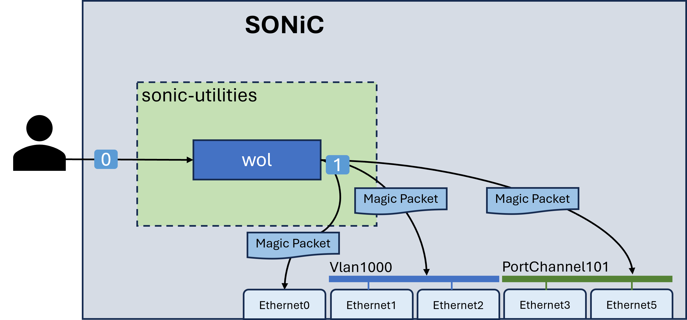

# Wake-on-LAN in SONiC

## Table of Content

- [Overview](#overview)
- [Background](#background)
- [Components](#components)
- [Magic Packet](#magic-packet)
- [CLI Design](#cli-design)
- [gNOI Design](#gnoi-design)
- [Test Plan](#test-plan)
- [Reference](#reference)

## Revision

| Revision | Date       | Author     | Change Description |
| -------- | ---------- | ---------- | ------------------ |
| 1.0      | Nov 7 2023 | Zhijian Li | Initial proposal   |

## Definitions/Abbreviations 

| Abbreviation | Definition                                        |
|--------------|---------------------------------------------------|
| WoL          | **W**ake-**o**n-**L**AN                           |
| gNOI         | **g**RPC **N**etwork **O**perations **I**nterface |
| NIC          | **N**etwork **I**nterface **C**ontroller          |

## Overview

**Wake-on-LAN** (**WoL** or **WOL**) is an Ethernet or Token Ring computer networking standard that allows a computer to be turned on or awakened from sleep mode by a network message[^1]. This document describes the Wake-on-LAN feature design in SONiC.

## Background

Below diagram describes a common usage of WoL on SONiC switch, this HLD will focus on the green part:


## Components

### `wol` CLI script in sonic-utilities

A `wol` script will be introduced in [sonic-utilities](https://github.com/sonic-net/sonic-utilities). The workflow of command line utility `wol` is:

0. User login to the SONiC switch and enter the `wol` command.
1. The `wol` script send magic packet to specific interface, VLAN or port-channel.



### gNOI service

A new gNOI service `SONiCWolService` will be implemented in sonic-gnmi container. The workflow is:

0. User initialize a gNOI Client to communicate with gNOI server.
1. The gNOI Client call the RPC function `SONiCWolService.Wol`.
2. The gNOI server send a D-Bus request to sonic-host-service[^2].
3. sonic-host-service call `wol` CLI to send the magic packet.


## Magic Packet

**Magic Packet** is a Ethernet frame with structure:

* **Ethernet Frame Header**:
  * **Destination MAC address**: broadcast MAC address (ff:ff:ff:ff:ff:ff) or target device's MAC address. [6 bytes]
  * **Source MAC address**. [6 bytes]
  * **EtherType**: `0x0842`. [2 bytes]
* **Ethernet Frame Payload**:
  * Six bytes of all `0xff`. [6 bytes]
  * Sixteen repetitions of the target device's MAC address. [96 bytes]
  * (Optional) A four or six byte password. [4 or 6 bytes]

```
Byte     |
Offset   |0     |1     |2     |3     |4     |5     |
---------+------+------+------+------+------+------+
       0 |             Destination MAC             |
         +------+------+------+------+------+------+        ETHERNET FRAME
       6 |               Source MAC                |           HEADER
         +------+------+---------------------------+
      12 | 0x08 | 0x42 |   \      \      \      \
         +------+------+------+------+------+------+------------------------------
      14 | 0xFF | 0xFF | 0xFF | 0xFF | 0xFF | 0xFF |
         +------+------+------+------+------+------+        ETHERNET FRAME
      20 | Target MAC (repeat 16 times, 96 bytes)  |           PAYLOAD
         +-----------------------------------------+
     116 |    Password (optional, 4 or 6 bytes)    |
         +-----------------------------------------+
```

## CLI Design

The `wol` command is used to send magic packet to target device.

### Usage

```
wol <interface> <target_mac> [-b] [-p password] [-c count] [-i interval]
```

- `interface`: SONiC interface name.
- `target_mac`: a list of target devices' MAC address, separated by comma.
- `-b`: Use broadcast MAC address instead of target device's MAC address as **Destination MAC Address in Ethernet Frame Header**.
- `-p password`: An optional 4 or 6 byte password, in ethernet hex format or quad-dotted decimal[^3].
- `-c count`: For each target MAC address, the `count` of magic packets to send. `count` must between 1 and 5. Default value is 1. This param must use with `-i`.
- `-i interval`: Wait `interval` milliseconds between sending each magic packet. `interval` must between 0 and 2000. Default value is 0. This param must use with `-c`.

### Example

```
admin@sonic:~$ wol Ethernet10 00:11:22:33:44:55
admin@sonic:~$ wol Ethernet10 00:11:22:33:44:55 -b
admin@sonic:~$ wol Vlan1000 00:11:22:33:44:55,11:33:55:77:99:bb -p 00:22:44:66:88:aa
admin@sonic:~$ wol Vlan1000 00:11:22:33:44:55,11:33:55:77:99:bb -p 192.168.1.1 -c 3 -i 2000
```

For the 4th example, it specifise 2 target MAC addresses and `count` is 3. So it'll send 6 magic packets in total.

## gNOI Design

The gNOI service `SONiCWolService` will provide a `Wol` interface to user, which can be called to send magic packet to target device:

```proto
syntax = "proto3";

package gnoi.sonic_wol;

//option (types.gnoi_version) = "0.1.0";
import "github.com/gogo/protobuf/gogoproto/gogo.proto";

option (gogoproto.marshaler_all) = true;
option (gogoproto.unmarshaler_all) = true;

service SonicWolService {
  rpc Wol(WolRequest) returns (WolResponse) {}
}

message WolRequest {
  string interface = 1;           // SONiC interface name
  repeated string target_mac = 2; // Target device's MAC addresses
  optional bool broadcast = 3;    // Default false
  optional string password = 4;   // In ethernet hex format or quad-dotted decimal
  optional int32 count = 5;       // For each target MAC address, the count of magic packets to send. Must use with interval together.
  optional int32 interval = 6;    // Wait interval milliseconds between sending each magic packet. Must use with count together.
}

message WolResponse {
  SonicOutput output = 1;
}
```

## Test Plan

### Unit Tests for `wol` CLI
| Case Description | Expected Result |
| :- | :- |
| Input a valid SONiC interface name. | Parameter validation pass, send magic packet |
| Input an invalid SONiC interface name. | Parameter validation Fail |
| Input a valid SONiC interface name, but the interface status is not `up`. | Return `Error: interface not up` |
| Input `target_mac` or `password` with invalid format | Parameter validation Fail |
| Input valid `count` and `interval`. | Parameter validation pass, send magic packet |
| Input value of `count` or `interval` is out of range. | Parameter validation Fail |
| Param `count` and `interval` not appear in input together. | Parameter validation Fail |
| Mock a send magic packet failure (e.g., socket error) | Return user friendly error message |

### Functional Test

Functional test plan will be published in [sonic-net/sonic-mgmt](https://github.com/sonic-net/sonic-mgmt).

## Reference

[^1]: [Wake-on-LAN - Wikipedia](https://en.wikipedia.org/wiki/Wake-on-LAN)
[^2]: [Docker to Host communication.md - sonic-net/SONiC](https://github.com/sonic-net/SONiC/blob/master/doc/mgmt/Docker%20to%20Host%20communication.md)
[^3]: [Dot-decimal notation - Wikipedia](https://en.wikipedia.org/wiki/Dot-decimal_notation)
