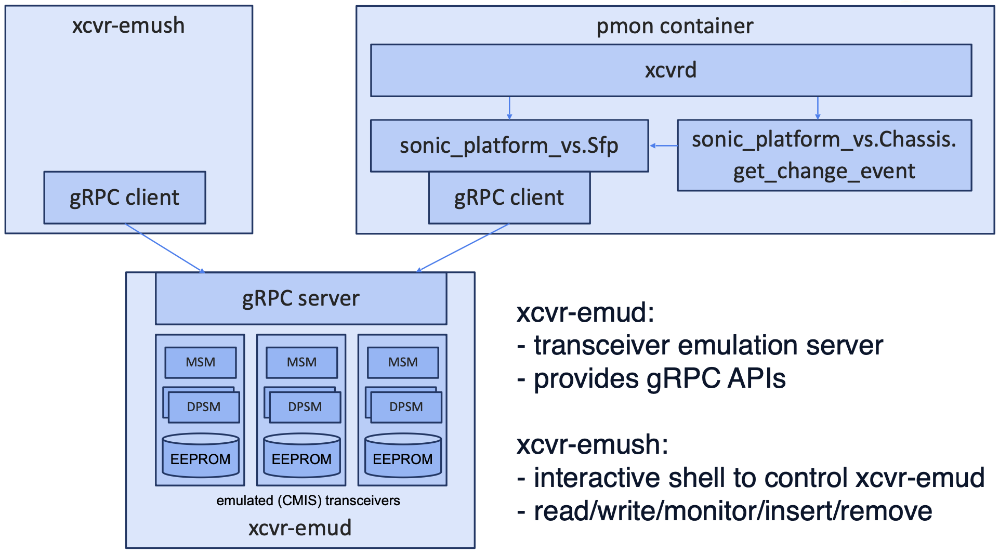

# Transceiver Emulation (xcvr-emu)

## Table of Content

## 1. Revision

 | Rev |     Date    |       Author       | Change Description                |
 |:---:|:-----------:|:------------------:|-----------------------------------|
 | 0.1 | Nov 2024    |  Wataru Ishida     | Initial version                   |

## 2. Scope  

This document describes the transceiver emulation (`xcvr-emu`) functionality in the virtual switch(vs) environment.

## 3. Overview

The development of `xcvr-emu` was motivated by the increasing complexity of controlling transceivers and the need to support various capabilities of transceivers.
Testing whether `xcvrd` operates as expected has become increasingly difficult over the years due to the existence of transceivers with various capabilities.

`xcvr-emu` is designed to emulate CMIS transceivers in the VS environment. By utilizing `xcvr-emu`, `xcvrd` can run on the virtual switch without any modifications. This allows for the emulation of various transceiver behaviors without the need for physical hardware, enabling thorough testing of `xcvrd` functionality.

Furthermore, `xcvr-emu` is valuable in scenarios where new control mechanisms need to be developed for `xcvrd` to support emerging transceiver technologies, such as CPO. It provides a platform for exploring and evaluating these mechanisms without requiring physical transceivers.

## 4. Architecture

Below is the architecture of `xcvr-emu`. `xcvr-emu` consists of the following three components:

1. `xcvr-emud`
2. `sonic_platform_vs.Sfp` module
3. `xcvr-emush`

`xcvr-emud` is a server that performs transceiver emulation. It provides APIs to clients using gRPC for tasks such as register access of the transceiver. It implements a CMIS state machine emulator, behaving like a CMIS transceiver through register access from the client.

`sonic_platform_vs.Sfp` is part of the Platform API module for the VS environment. This module is used by `xcvrd` to access the transceiver. By calling the gRPC API of `xcvr-emud` within `sonic_platform_vs.Sfp`, it accesses the emulated transceiver.

`xcvr-emush` is an interactive shell mainly used for debugging. By calling the gRPC API of `xcvr-emud`, you can check the contents of the emulated transceiver's registers and change the insertion/removal status. It can also monitor the register access to the emulated transceivers.



## 5. Enabling `xcvrd` in the vs environment

Currently, `xcvrd` is not enabled in the VS environment. The following modifications are required to enable it.

- update `pmon_daemon_control.json` (set `skip_xcvrd` to false)
- implement `platform/plugins/sfputil.py` and `sonic_platform/sfp.py`
- update vslib to support `SAI_PORT_ATTR_HOST_TX_READY_STATUS`
    - `xcvrd` uses this attribute to trigger the CMIS transceiver initialization

Although it is not essential to run `xcvrd` in the VS environment, migrating the port configuration method from `port_config.ini` to `platform.json` allows testing of the part where `xcvrd` controls the transceiver according to the dynamic port breakout (DPB) settings. For more details, refer to the DPB documentation:

https://github.com/sonic-net/SONiC/blob/master/doc/dynamic-port-breakout/sonic-dynamic-port-breakout-HLD.md#platform-capability-design

Additionally, in the VS environment, SAI vslib is used, but vslib requires the pre-existence of netdev devices linked to TAP devices it creates. This configuration is done in `lanemap.ini`, where combinations of netdev device names and lane configurations are specified. Since DPB allows various lane configurations for ports, you must prepare a `lanemap.ini` file that accommodates this. An example `lanemap.ini` for a DPB-compliant environment with a single 8-lane port is as follows:

```ini
swp1:1,2,3,4,5,6,7,8
swp1:1,2,3,4
swp5:5,6,7,8
swp1:1,2
swp3:3,4
swp5:5,6
swp7:7,8
swp1:1
swp2:2
swp3:3
swp4:4
swp5:5
swp6:6
swp7:7
swp8:8
```

By preparing such a `lanemap.ini` file and pre-creating swp1-8, it becomes possible to configure four types of DPB settings—1x800G, 2x400G, 4x200G, and 8x100G—in the VS environment. If you want swp1-8 to communicate with the outside of the VM, it needs to be set up during the VM creation. However, since the primary purpose of running DPB in the VS environment is for testing, configuring the VM is often unnecessary. Instead, you can simply pre-create virtual netdev interfaces like veth.

For example, you can run the following script before starting syncd:

```bash
#!/bin/sh

for i in `seq 8`;
do
        ip li add swp$i type veth peer name swp${i}p || true
        ip li set up dev swp${i}p
done
```

## 6. `xcvr-emud` gRPC API

The gRPC APIs provided by `xcvr-emud` are defined as follows:

```protobuf
service SfpEmulatorService {
  rpc Read(ReadRequest) returns (ReadResponse) {}
  rpc Write(WriteRequest) returns (WriteResponse) {}
  rpc GetInfo(GetInfoRequest) returns (GetInfoResponse) {}
  rpc UpdateInfo(UpdateInfoRequest) returns (UpdateInfoResponse) {}
  rpc Monitor(MonitorRequest) returns (stream MonitorResponse) {}
  rpc List(ListRequest) returns (ListResponse) {}
}
```

Below is an explanation of each API

### Read

Read the EEPROM of an emulated transceiver.

Specify the transceiver with `index` and the register address with `bank`, `page`, and `offset`. `length` is the size to read, and `force` is used for debugging purposes to read the register value even if the transceiver is not inserted into the device. If `force=false` and the transceiver is not inserted, a zero array is returned.

```protobuf
// ReadRequest
message ReadRequest {
  uint32 index = 1;
  uint32 bank = 2;
  uint32 page = 3;
  uint32 offset = 4;
  uint32 length = 5;

  bool force = 6; // return value even if not present
}

// ReadResponse
message ReadResponse {
  // Data
  bytes data = 1;
}
```

### Write

Write to the EEPROM of an emulated transceiver.

Specify the transceiver with `index` and the register address with `bank`, `page`, and `offset`. `data` is the data to be written, and `length` is the size of the data to be written.

```protobuf
// WriteRequest
message WriteRequest {
  uint32 index = 1;
  uint32 bank = 2;
  uint32 page = 3;
  uint32 offset = 4;

  // Data
  bytes data = 5;
  uint32 length = 6;
}

// WriteResponse
message WriteResponse {
}
```

### GetInfo

Retrieve the state of an emulated transceiver.

Specify the transceiver with `index`. The `present` in the response indicates the insertion/removal state. `msm` represents the ModuleState, and `dpsms` is an array of DataPathStateMachine (DPSM). You can check the state of the DPSM and the selected AppSel.

```protobuf
message GetInfoRequest {
  uint32 index = 1;
}

message DataPathStateMachine {
  uint32 dpid = 1;
  uint32 appsel = 2;
  string state = 3;
}

message ModuleState {
  string state = 1;
  string vendor_name = 2;
}

message GetInfoResponse {
  bool present = 1;
  uint32 index = 2;
  ModuleState msm = 3;
  repeated DataPathStateMachine dpsms = 4;
}
```

### UpdateInfo

Change the insertion/removal state of an emulated transceiver.

Specify the transceiver with `index` and the insertion/removal state to update with `present`.

```protobuf
message UpdateInfoRequest {
  uint32 index = 1;
  bool present = 2;
}

message UpdateInfoResponse {
}
```

### Monitor

Monitor register access to emulated transceivers.

Specify the transceiver with `index`. If `0` is specified, monitor register access for all existing transceivers. The response is returned as a gRPC stream, allowing you to obtain information about the accessed register addresses and their data.

```protobuf
message MonitorRequest {
  uint32 index = 1; // 0 to monitor all
}

message MonitorResponse {
  uint32 index = 1;
  uint32 bank = 2;
  uint32 page = 3;
  uint32 offset = 4;
  bytes data = 5;
  uint32 length = 6;
  bool present = 7;
  bool write = 8; // true: write, false: read
}
```

### List

Retrieve the list of emulated transceivers.

In xcvr-emu, when a register access is performed via Read or Write on a non-existent transceiver, a virtual transceiver is automatically created at the specified index. The List API allows you to retrieve the list of transceivers created in this manner. Currently, there is no way to delete a transceiver once it has been created. (However, the insertion/removal state can be changed with UpdateInfo)

```protobuf
message ListRequest {
}

message ListResponse {
  repeated GetInfoResponse infos = 1;
}
```

## 7. `sonic_platform_vs.Sfp` module

Here is an excerpt of the `sonic_platform_vs.Sfp` code. `xcvrd` indirectly accesses the transceiver registers by calling the `read_eeprom`/`write_eeprom` methods of the Sfp class. The implementation of `read_eeprom`/`write_eeprom` calls the gRPC API provided by `xcvr-emud` to access the registers of the emulated transceiver. Additionally, `get_presence` is implemented using the `GetInfo` API.

```python
class Sfp(SfpBase):
    def __init__(self, index):
        self.index = index
        super().__init__()
        channel = grpc.insecure_channel("localhost:50051")
        self.stub = emulator_pb2_grpc.SfpEmulatorServiceStub(channel)

    def get_presence(self):
        try:
            info = self.stub.GetInfo(GetInfoRequest(index=self.index))
        except grpc.RpcError:
            return False
        return info.present

    def read_eeprom(self, offset, num_bytes):
        if not self.get_presence():
            return None
        # convert optoe offset to SFF page and offset
        # optoe maps the SFF 2D address to a linear address
        page = offset // 128
        if page > 0:
            page = page - 1

        if offset > 128:
            offset = (offset % 128) + 128

        return self.stub.Read(
            ReadRequest(offset=offset, page=page, length=num_bytes)
        ).data

    def write_eeprom(self, offset, num_bytes, write_buffer):
        assert len(write_buffer) <= num_bytes
        # convert optoe offset to SFF page and offset
        # optoe maps the SFF 2D address to a linear address
        page = offset // 128
        if page > 0:
            page = page - 1

        if offset > 128:
            offset = (offset % 128) + 128

        return self.stub.Write(
            WriteRequest(
                page=page, offset=offset, length=num_bytes, data=bytes(write_buffer)
            )
        )
```

## 8. `xcvr-emush`

`xcvr-emush` is an interactive shell for easily operating the `xcvr-emud` API. Below is an example of its usage.

```bash
$ xcvr-emush
> ?
quit, exit, list, transceiver
> list
0: present: True
> transceiver 0
transceiver(0)> read ActiveAppSelCode
read: index; 0, bank: 0, page: 11h, offset: 206, length: 8, data: b'\x10\x10\x10\x10\x00\x00\x00\x00'
ActiveAppSelCode:
  ActiveAppSelLane1: 1
  ActiveAppSelLane2: 1
  ActiveAppSelLane3: 1
  ActiveAppSelLane4: 1
  ActiveAppSelLane5: 0
  ActiveAppSelLane6: 0
  ActiveAppSelLane7: 0
  ActiveAppSelLane8: 0
transceiver(0)> info
Transceiver(0):
  present: True
  DPSM:
    DPID: 0, Active AppSel: 1, State: State.Initialized
transceiver(0)> remove
transceiver(0)> insert
transceiver(0)> ?
quit, exit, read, read-raw, write, remove, insert, info
transceiver(0)>
```

To support the operation of multiple transceivers, you need to select a transceiver before performing any operations on it. You can find the selectable transceivers using the `list` command. Select a transceiver with the `transceiver <index>` command. When a transceiver is selected, the prompt changes, making it easy to see which transceiver is selected. In this state, you can operate the transceiver using commands such as `read`, `write`, `remove`, `insert`, and `info`.

`xcvr-emush` is implemented using the Python library [`prompt-toolkit`](https://github.com/prompt-toolkit/python-prompt-toolkit) and supports tab completion for commands and register names.