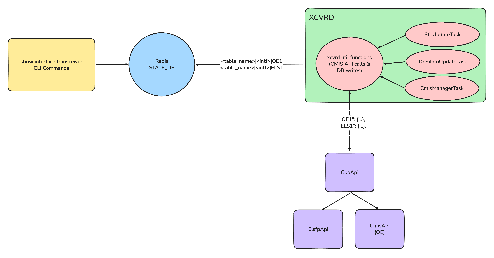

# CPO DOM Monitoring HLD #

## Table of Content

- [1. Revision](#1-revision)
- [2. Scope](#2-scope)
- [3. Definitions/Abbreviations](#3-definitionsabbreviations)
- [4. Overview](#4-overview)
- [5. Requirements](#5-requirements)
- [6. Architecture Design](#6-architecture-design)
- [7. High-Level Design](#7-high-level-design)
- [8. SAI API](#8-sai-api)
- [9. Configuration and Management](#9-configuration-and-management)
- [10. Warmboot and Fastboot Design Impact](#10-warmboot-and-fastboot-design-impact)
- [11. Memory Consumption](#11-memory-consumption)
- [12. Restrictions/Limitations](#12-restrictionslimitations)
- [13. Testing Requirements/Design](#13-testing-requirementsdesign)
- [14. Open/Action Items](#14-openaction-items)

---

### 1. Revision

| Rev | Date       | Author          | Change Description |
|:---:|:----------:|:---------------:|--------------------|
| 0.1 | 2026-04-06 | Brian Gallagher | Initial version    |

---

### 2. Scope

This document describes the high-level design for Digital Optical Monitoring (DOM) support for Co-Packaged Optics (CPO) hardware in SONiC.

CPO hardware differs from conventional pluggable transceiver hardware in that a single logical port may be driven by multiple physical devices: an optical engine (OE) and one or more External Laser Source FP modules (ELSFPs). These devices are accessed via i2c and may be shared across multiple interfaces.

This HLD covers:
- The new per-device STATE_DB schema for CPO DOM tables and new fields required for ELSFP modules.
- The CPO-specific changes required in xcvrd to add DOM support.
- The CLI changes required to display per-device DOM information.

This HLD does **not** cover:
- CMIS state machine management or link bring-up sequencing for CPO hardware.
- Firmware upgrade flows for CPO devices.

---

### 3. Definitions/Abbreviations

| Term        | Definition                                                                                  |
|-------------|---------------------------------------------------------------------------------------------|
| CPO         | Co-Packaged Optics — an optical transceiver solution where the optical engine is co-packaged with the switching ASIC on the same board. |
| DOM         | Digital Optical Monitoring — real-time diagnostic data (temperature, voltage, optical power, bias current, etc.) reported by an optical module via its EEPROM. |
| OE          | Optical Engine — the photonic integrated circuit that performs the optical signal conversion in CPO hardware. Fully CMIS 5.3-compliant, treated as a conventional transceiver for DOM purposes. |
| ELSFP       | External Laser Source FP — a small form-factor pluggable laser module that provides the optical carrier for the optical engine. Compliant with CMIS as a "Resource Module." |
| ELS         | External Laser Source — the laser function provided by an ELSFP.                            |
| CMIS        | Common Management Interface Specification — the management protocol used to communicate with optical modules. |
| VDM         | Versatile Diagnostics Monitoring — an optional CMIS feature providing vendor-defined diagnostic observables. |
| xcvrd       | The SONiC transceiver daemon, running in the `pmon` container, responsible for polling and publishing transceiver diagnostic data to STATE_DB. |
| pmon        | Platform Monitor — the SONiC Docker container that hosts xcvrd and other hardware monitoring daemons. |
| STATE_DB    | The SONiC Redis database used to store dynamic operational state, including transceiver diagnostic information. |

---

### 4. Overview

In traditional hardware platforms, each network interface is associated with a single pluggable transceiver. xcvrd models this as a one-to-one mapping: a single set of `TRANSCEIVER_*` STATE_DB tables is maintained per interface, keyed by the interface name (e.g., `TRANSCEIVER_DOM_SENSOR|Ethernet0`).

CPO hardware breaks this assumption. A single logical interface may be associated with several physically distinct devices:

- An **optical engine (OE)** that performs optical signal conversion. The OE is a fully CMIS-compliant module.
- One or more **ELSFPs** that supply laser power for the optical engine. ELSFPs are CMIS "Resource Modules" and expose new diagnostic fields to be monitored.

Additionally, a single physical i2c managed device (such as an OE or ELSFP) may be **shared** across multiple interfaces. Each interface is assigned a separate CMIS bank within the shared device. Non-banked device information (e.g., module temperature, supply voltage) is common to all interfaces sharing the device, while banked information (e.g., per-lane laser bias, optical power) is specific to each interface.

This design introduces:

1. A **new per-device DB key structure** for CPO transceiver tables, extending the existing key from `TRANSCEIVER_DOM_SENSOR|<ifname>` to `TRANSCEIVER_DOM_SENSOR|<ifname>|<device>`.
2. **New ELSFP-specific DB fields** within the existing `TRANSCEIVER_*` table family.
3. **Multi-device result support in xcvrd's utility methods**, allowing `CpoApi` to return per-device data that xcvrd publishes to compound DB keys without any task-level changes to `DomInfoUpdateTask`, `SfpStateUpdateTask`, or `CmisManagerTask`.
4. **CLI updates** to display per-device DOM data for CPO interfaces.

---

### 5. Requirements

**Functional Requirements:**

- The proposed approach for DOM monitoring CPO hardware should support both separate mode (both the OE and ELSFP devices are independently accessible via i2c) and joint mode (both the OE and ELSFP devices are accessed via a single unified i2c interface).
- `xvrd` must be able to publish telemetry about all CPO devices (OEs, ELSFPs) associated with an interface.
- The proposed approach establishes a precedent that future non-CPO hardware platforms utilizing multiple i2c devices per port/interface can follow to add DOM support.

**Non-Functional Requirements:**

- DOM monitoring in xcvrd must remain backward-compatible. Non-CPO platforms must observe no change in behavior.

---

### 6. Architecture Design

The following diagram shows the information flow between the CLI, Redis, xcvrd, and the CPO hardware devices:



---

### 7. High-Level Design

#### 7.1 Repositories Modified

| Repository               | Component                              |
|--------------------------|----------------------------------------|
| `sonic-platform-common`  | `CpoApi`, `ElsfpApi`, `CpoSfpBase`, `MultiDeviceResult` |
| `sonic-platform-daemons` | `xcvrd` DB utility methods             |
| `sonic-utilities`        | CLI show commands                      |

#### 7.2 Database Schema Changes (STATE_DB)

##### 7.2.1 Composite Key Structure

For CPO interfaces, the following `TRANSCEIVER_*` STATE_DB tables use a compound key that includes both the interface name and the device name:

```
TRANSCEIVER_DOM_SENSOR|<ifname>|<device>
TRANSCEIVER_DOM_THRESHOLD|<ifname>|<device>
TRANSCEIVER_DOM_FLAG|<ifname>|<device>
TRANSCEIVER_STATUS|<ifname>|<device>
TRANSCEIVER_STATUS_FLAG|<ifname>|<device>
TRANSCEIVER_FIRMWARE_INFO|<ifname>|<device>
TRANSCEIVER_VDM_*|<ifname>|<device>
```

**Exception — TRANSCEIVER_INFO:** The `TRANSCEIVER_INFO` table retains the original flat key format (`TRANSCEIVER_INFO|<ifname>`) on CPO platforms. Downstream consumers such as `orchagent` subscribe to this table and use the key to look up ports in their internal port registries (see `PortsOrch::doTransceiverPresenceCheck`). Compound keys would not match any known port and would cause silent failures. Instead, ELSFP-specific fields are merged into the existing flat entry with an `elsfp_` prefix (see Section 7.2.2).

The `<device>` component identifies the physical device. Device names use a type prefix and a **global** index (not per-interface). The naming scheme for devices is decided by the [CPO Port Mapping HLD](https://github.com/sonic-net/SONiC/pull/2211) -- i.e it is up to the network switch vendor to decide the scheme.

| Device Type    | Key Component | Example       | Description                          |
|----------------|---------------|---------------|--------------------------------------|
| Optical Engine | `OE<n>`       | `OE1`         | First optical engine on the system.  |
| ELSFP          | `ELS<n>`      | `ELS1`        | First ELSFP on the system.           |

Example keys for interface `Ethernet0`:

```
TRANSCEIVER_DOM_SENSOR|Ethernet0|OE1
TRANSCEIVER_DOM_SENSOR|Ethernet0|ELS1
```

If OE1 and ELS1 were shared by two interfaces, then you could also expect to see table names such as below:
```
TRANSCEIVER_DOM_SENSOR|Ethernet8|OE1
TRANSCEIVER_DOM_SENSOR|Ethernet8|ELS1
```

**Backward compatibility:** Existing non-CPO platforms continue to use the original key format (e.g., `TRANSCEIVER_DOM_SENSOR|Ethernet0`). No migration of existing data is required.

##### 7.2.2 New ELSFP Database Fields

###### TRANSCEIVER_INFO

Because `TRANSCEIVER_INFO` uses the flat key format (see Section 7.2.1), OE and ELSFP data coexist in a single entry per interface. Existing OE/transceiver fields (`type`, `manufacturer`, `serial`, etc.) are retained without modification. The following ELSFP-specific fields are added with an `elsfp_` prefix to avoid name collisions:

| Field Name | Type | Description |
|---|---|---|
| `elsfp_module_function_type` | STRING | Module function type, e.g. "Resource Module" |
| `elsfp_lane_count` | INTEGER | Number of optical lanes supported by the ELSFP |
| `elsfp_control_mode` | STRING | Laser control mode: "APC" or "ACC" |
| `elsfp_max_optical_power` | FLOAT | Maximum supported output optical power (dBm) |
| `elsfp_min_optical_power` | FLOAT | Minimum supported output optical power (dBm) |
| `elsfp_max_laser_bias` | FLOAT | Maximum laser bias current (mA) |
| `elsfp_min_laser_bias` | FLOAT | Minimum laser bias current (mA) |
| `elsfp_lane_to_fiber_mapping` | STRING | Mapping of lane index to fiber index |
| `elsfp_lane_frequency` | FLOAT | Nominal per-lane optical frequency (THz) |
| Existing fields prefixed with `elsfp_` | - | Any common CMIS fields reported by OE and ELSFP will be prefixed to avoid name collisions |

###### TRANSCEIVER_DOM_SENSOR

The following fields are added to `TRANSCEIVER_DOM_SENSOR` for ELSFP entries. The existing `temperature` and `voltage` fields are retained.

| Field Name | Type | Description |
|---|---|---|
| `voltage_laneN` | FLOAT | Per-lane supply voltage (V); N = 1..lane_count |
| `laser_bias_current_laneN` | FLOAT | Per-lane laser bias current (mA); N = 1..lane_count |
| `optical_power_laneN` | FLOAT | Per-lane output optical power (dBm); N = 1..lane_count |
| `icc_monitor` | FLOAT | Integrated coherent controller monitor value |
| `tec_current` | FLOAT | TEC drive current (mA); optional, present only if vendor supports aux monitor |
| `laser_temperature` | FLOAT | Laser junction temperature (°C); optional, present only if vendor supports aux monitor |

###### TRANSCEIVER_DOM_THRESHOLD

The following per-lane threshold fields are added for ELSFP entries:

| Field Name | Type | Description |
|---|---|---|
| `bias_alarm_high_laneN` | FLOAT | Laser bias high alarm threshold (mA) |
| `bias_alarm_low_laneN` | FLOAT | Laser bias low alarm threshold (mA) |
| `bias_warn_high_laneN` | FLOAT | Laser bias high warning threshold (mA) |
| `bias_warn_low_laneN` | FLOAT | Laser bias low warning threshold (mA) |
| `optical_power_alarm_high_laneN` | FLOAT | Optical power high alarm threshold (dBm) |
| `optical_power_alarm_low_laneN` | FLOAT | Optical power low alarm threshold (dBm) |
| `optical_power_warn_high_laneN` | FLOAT | Optical power high warning threshold (dBm) |
| `optical_power_warn_low_laneN` | FLOAT | Optical power low warning threshold (dBm) |
| `tec_current_alarm_high` | FLOAT | TEC current high alarm threshold (mA); optional, present only if vendor supports aux monitor |
| `tec_current_alarm_low` | FLOAT | TEC current low alarm threshold (mA); optional |
| `tec_current_warn_high` | FLOAT | TEC current high warning threshold (mA); optional |
| `tec_current_warn_low` | FLOAT | TEC current low warning threshold (mA); optional |
| `laser_temperature_alarm_high` | FLOAT | Laser temperature high alarm threshold (°C); optional, present only if vendor supports aux monitor |
| `laser_temperature_alarm_low` | FLOAT | Laser temperature low alarm threshold (°C); optional |
| `laser_temperature_warn_high` | FLOAT | Laser temperature high warning threshold (°C); optional |
| `laser_temperature_warn_low` | FLOAT | Laser temperature low warning threshold (°C); optional |

###### TRANSCEIVER_DOM_FLAG

| Field Name | Type | Description |
|---|---|---|
| `laser_bias_alarm_high_laneN` | BOOLEAN | Laser bias high alarm flag |
| `laser_bias_alarm_low_laneN` | BOOLEAN | Laser bias low alarm flag |
| `laser_bias_warn_high_laneN` | BOOLEAN | Laser bias high warning flag |
| `laser_bias_warn_low_laneN` | BOOLEAN | Laser bias low warning flag |
| `optical_power_alarm_high_laneN` | BOOLEAN | Optical power high alarm flag |
| `optical_power_alarm_low_laneN` | BOOLEAN | Optical power low alarm flag |
| `optical_power_warn_high_laneN` | BOOLEAN | Optical power high warning flag |
| `optical_power_warn_low_laneN` | BOOLEAN | Optical power low warning flag |
| `tec_current_alarm_high` | BOOLEAN | TEC current high alarm flag; optional, present only if vendor supports aux monitor |
| `tec_current_alarm_low` | BOOLEAN | TEC current low alarm flag; optional |
| `tec_current_warn_high` | BOOLEAN | TEC current high warning flag; optional |
| `tec_current_warn_low` | BOOLEAN | TEC current low warning flag; optional |
| `laser_temperature_alarm_high` | BOOLEAN | Laser temperature high alarm flag; optional, present only if vendor supports aux monitor |
| `laser_temperature_alarm_low` | BOOLEAN | Laser temperature low alarm flag; optional |
| `laser_temperature_warn_high` | BOOLEAN | Laser temperature high warning flag; optional |
| `laser_temperature_warn_low` | BOOLEAN | Laser temperature low warning flag; optional |
| `active_alarm_laneN` | BOOLEAN | True if any alarm is active for lane N |
| `active_warning_laneN` | BOOLEAN | True if any warning is active for lane N |

###### TRANSCEIVER_STATUS

| Field Name | Type | Description |
|---|---|---|
| `module_state` | STRING | CMIS module state |
| `module_fault_cause` | STRING | Fault cause if module_state is Fault |
| `enable_laneN` | BOOLEAN | Whether lane N is enabled |
| `state_laneN` | STRING | Per-lane state: "Lane Output off" \| "Lane Output ramping" \| "Lane Output on" |
| `output_fiber_checked_laneN` | BOOLEAN | Whether output fiber check has completed for lane N |

Fields that are specific to datapath-capable modules (e.g., `dpinit_pending_hostlane1-8`, TX/RX output status) are **not** written for ELSFP entries.

###### TRANSCEIVER_STATUS_FLAG

| Field Name | Type | Description |
|---|---|---|
| `lane_summary_fault` | BOOLEAN | True if any lane has an active fault |
| `lane_summary_warning` | BOOLEAN | True if any lane has an active warning |
| `alarm_code_laneN` | STRING | Per-lane alarm code |
| `warn_code_laneN` | STRING | Per-lane warning code |
| `active_alarm` | BOOLEAN | Lane summary active alarm flag |
| `active_warn` | BOOLEAN | Lane summary active warning flag |

###### TRANSCEIVER_VDM_*

VDM content for ELSFP entries is vendor-defined, following the same structure as for conventional CMIS modules. The exact fields depend on what the vendor chooses to expose via VDM.

###### TRANSCEIVER_FIRMWARE_INFO

No new fields are added for ELSFP entries.

##### 7.2.3 Shared Devices and Data Duplication

When a physical i2c device (OE or ELSFP) is shared across multiple interfaces via CMIS bank switching, xcvrd publishes a full set of `TRANSCEIVER_*` records for each interface independently. Non-banked fields (e.g., module temperature, supply voltage, firmware version) are duplicated across the per-interface tables for that device. Banked fields (e.g., per-lane laser bias and optical power) will differ across records, reflecting each interface's assigned bank.

This approach is chosen for its simplicity. There are two potential negative downsides to this approach:
- We will use more memory when duplicating information. However, the memory impact is bounded and negligible (see [Section 11](#11-memory-consumption)).
- i2c read traffic will be increased since we will read the same information from hardware up to 4x times as often. Future optimizations are possible to mitigate this concern (read caching, cross-interface data sharing within xcvrd) but are deferred until there is empirical evidence they are required.

#### 7.3 xcvrd Design

##### 7.3.1 Design Goals

The design avoids introducing any CPO-specific task or subclass in xcvrd. Instead, CPO DOM monitoring is achieved by:

1. Having `CpoApi` override standard DOM query methods to return **multi-device results** — a dict-of-dicts keyed by device ID (e.g., `{"OE1": {...}, "ELS1": {...}}`).
2. Having `ElsfpApi` implement the standard DOM interface methods (`get_transceiver_dom_real_value()`, `get_transceiver_dom_flags()`, etc.) so that ELSFP data can be queried through the same interface as OE data.
3. Teaching the existing utility functions in xcvrd that write to STATE_DB to detect multi-device results and write compound DB keys.

No task-level logic (`DomInfoUpdateTask`, `SfpStateUpdateTask`, `CmisManagerTask`) requires modification. All changes are confined to the utility/library methods that perform platform API calls and DB writes. Non-CPO platforms observe no change in behavior.

##### 7.3.2 Multi-Device Results

A new `MultiDeviceResult` class (a thin `dict` subclass) is introduced in `sonic-platform-common` to mark return values as device-scoped:

```python
# sonic-platform-common/sonic_platform_base/sonic_xcvr/multi_device_result.py

class MultiDeviceResult(dict):
    """A dict subclass indicating that values are sub-dicts keyed by device scope ID.

    Example:
        MultiDeviceResult({
            "OE1": {"temperature": 45.0, "voltage": 3.3, ...},
            "ELS1": {"temperature": 30.0, "voltage": 3.6, ...},
        })
    """
    pass
```

Using a dedicated type (rather than duck-typing on dict structure) provides an explicit, unambiguous detection mechanism: `isinstance(result, MultiDeviceResult)`. Because `MultiDeviceResult` is a `dict`, it passes all existing `if result is not None` and `if not result` checks unchanged.

##### 7.3.3 CpoApi Overrides

`CpoApi` overrides each standard DOM query method to call both the optical engine and ELSFP APIs, then return a `MultiDeviceResult` wrapping both:

```python
class CpoApi(CmisApi):
    def get_transceiver_dom_real_value(self):
        oe_result = self.optical_engine_xcvr_api.get_transceiver_dom_real_value()
        els_result = self.external_laser_source_xcvr_api.get_transceiver_dom_real_value()
        scoped = MultiDeviceResult()
        if oe_result:
            scoped[self.oe_device_id] = oe_result
        if els_result:
            scoped[self.els_device_id] = els_result
        return scoped

    # Same pattern for:
    #   get_transceiver_dom_flags()
    #   get_transceiver_threshold_info()
    #   get_transceiver_status()
    #   get_transceiver_status_flags()
```

The device IDs (e.g., `"OE1"`, `"ELS1"`) are dictated by the naming scheme defined in the [CPO Port Mapping HLD](https://github.com/sonic-net/SONiC/pull/2211) (i.e the vendor decides the naming scheme).

**Exception — `get_transceiver_info()`:** As described in Section 7.2.1, `TRANSCEIVER_INFO` is exempt from compound keys. `CpoApi` overrides `get_transceiver_info()` to return a single flat dict (not a `MultiDeviceResult`) that merges OE and ELSFP info. ELSFP fields are prefixed with `elsfp_` to avoid name collisions:

```python
    def get_transceiver_info(self):
        oe_info = self.optical_engine_xcvr_api.get_transceiver_info()
        els_info = self.external_laser_source_xcvr_api.get_transceiver_info()
        if oe_info is None:
            return None
        result = dict(oe_info)
        if els_info:
            for key, value in els_info.items():
                result[f"elsfp_{key}"] = value
        return result
```

Because this returns a plain dict, `post_port_sfp_info_to_db()` writes it to the flat key `TRANSCEIVER_INFO|<ifname>` with no code changes required.

##### 7.3.4 ElsfpApi Standard Methods

`ElsfpApi` implements the standard DOM interface methods by translating its existing ELSFP-specific primitives into the standard dict formats:

| Method | ELSFP Data Sources |
|---|---|
| `get_transceiver_dom_real_value()` | `get_module_temperature()`, `get_voltage()`, `get_per_lane_bias_current_monitor()`, `get_per_lane_opt_power_monitor()`, `get_icc_monitor()` |
| `get_transceiver_dom_flags()` | `get_per_lane_high_bias_alarms()`, `get_per_lane_low_bias_alarms()`, `get_per_lane_high_power_alarms()`, `get_per_lane_low_power_alarms()`, and corresponding warning methods |
| `get_transceiver_threshold_info()` | `get_laser_bias_high_alarm()`, `get_laser_bias_low_alarm()`, `get_optical_power_high_alarm()`, `get_optical_power_low_alarm()`, and corresponding warning methods |
| `get_transceiver_status()` | `get_module_state()` (inherited, uses lower memory), `get_per_lane_enable()`, `get_per_lane_state()` |
| `get_transceiver_status_flags()` | `get_lane_summary_fault()`, `get_lane_summary_warning()`, `get_per_lane_fault_flags()`, `get_per_lane_warn_flags()` |

Since scoping places OE and ELSFP data under separate DB keys, field names within each scope do not collide. ELSFP methods use standard CMIS field naming conventions where applicable (e.g., `tx1bias`, `tx1power`) so that existing xcvrd beautification logic works without modification.

##### 7.3.5 Multi-Device-Aware DB Writes

The existing utility functions in xcvrd that write to STATE_DB are modified to detect `MultiDeviceResult` and write compound keys. The changes are confined to the utility/library layer — no task-level logic is modified.

**`post_diagnostic_values_to_db()`** (the generic helper used by most post methods):

```python
def post_diagnostic_values_to_db(self, logical_port_name, table, get_values_func, ...):
    # ... existing validation and cache logic ...
    diagnostic_values_dict = get_values_func(physical_port)

    if isinstance(diagnostic_values_dict, MultiDeviceResult):
        for scope_id, scope_dict in diagnostic_values_dict.items():
            if not scope_dict:
                continue
            (beautify_func or self.beautify_info_dict)(scope_dict)
            fvs = swsscommon.FieldValuePairs(
                [(k, v) for k, v in scope_dict.items()] +
                [("last_update_time", self.get_current_time())]
            )
            table.set(f"{logical_port_name}|{scope_id}", fvs)
    else:
        # Existing flat write logic, unchanged
        ...
```

**Flag methods** (`post_port_dom_flags_to_db()`, `post_port_transceiver_hw_status_flags_to_db()`): these have custom logic for flag metadata tracking (change counts, set/clear timestamps). They are updated to iterate over devices when a `MultiDeviceResult` is detected, calling the existing metadata-tracking logic with the compound key for each scope. The metadata tables (e.g., `TRANSCEIVER_DOM_FLAG_CHANGE_COUNT`) naturally acquire compound keys, ensuring per-device flag tracking.

**Non-CPO behavior**: Non-CPO platform APIs return flat dicts. Since a flat dict is not a `MultiDeviceResult`, the `isinstance` check is `False` and all existing code paths execute unchanged.

**Table LifeCycle**: `xcvrd` will be updated to be aware that it must delete all device-specific tables for an interface upon port removal.

##### 7.3.6 SfpStateUpdateTask and CmisManagerTask

`DomInfoUpdateTask` is not the only xcvrd task that writes to STATE_DB transceiver tables. `SfpStateUpdateTask` writes `TRANSCEIVER_INFO` and `TRANSCEIVER_DOM_THRESHOLD` at transceiver insertion time, and `CmisManagerTask` updates the active ApSel field in `TRANSCEIVER_INFO`. Since CPO hardware does not have a traditional pluggable transceiver, the ELSFP insertion event serves as the trigger for these writes. The same principle applies: all changes are confined to utility functions, no task-level logic is modified.

**TRANSCEIVER_DOM_THRESHOLD (SfpStateUpdateTask):** `SfpStateUpdateTask` writes DOM thresholds once at transceiver insertion via `DOMDBUtils.post_port_dom_thresholds_to_db()`, which delegates to `post_diagnostic_values_to_db()`. Because `CpoApi.get_transceiver_threshold_info()` returns a `MultiDeviceResult`, this table acquires compound keys automatically through the changes described in Section 7.3.5. No additional work is required.

**TRANSCEIVER_INFO (SfpStateUpdateTask and CmisManagerTask):** As described in Section 7.2.1 and Section 7.3.3, `TRANSCEIVER_INFO` is exempt from compound keys. `CpoApi.get_transceiver_info()` returns a flat merged dict with `elsfp_`-prefixed fields, so `post_port_sfp_info_to_db()` writes to the standard flat key without any code changes. Similarly, `CmisManagerTask`'s `update_active_apsel_in_info_table()` continues to update the flat key — ApSel is an OE-only concept and the OE fields are not prefixed, so the existing update logic works unchanged.

##### 7.3.7 Sequence Diagram

```
DomInfoUpdateTask    post_*_to_db utils    CpoApi              OE (i2c)     ELSFP (i2c)    STATE_DB
  |                      |                    |                    |              |              |
  |-- post_dom_sensor -->|                    |                    |              |              |
  |   (logical_port)     |-- get_dom_real --->|                    |              |              |
  |                      |    _value()        |-- read DOM ------->|              |              |
  |                      |                    |<-- OE DOM data ----|              |              |
  |                      |                    |-- read DOM ---------------------->|              |
  |                      |                    |<-- ELS DOM data ------------------|              |
  |                      |                    |                    |              |              |
  |                      |<-- MultiDeviceResult ---|                    |              |              |
  |                      |    {"OE1":{...},   |                    |              |              |
  |                      |     "ELS1":{...}}  |                    |              |              |
  |                      |                    |                    |              |              |
  |                      |-- set(Eth0|OE1, OE data) -------------------------------------->|
  |                      |-- set(Eth0|ELS1, ELS data) ------------------------------------->|
  |                      |                    |                    |              |              |
```

#### 7.4 Scalability and Performance

- All existing xcvrd tasks (`DomInfoUpdateTask`, `SfpStateUpdateTask`, `CmisManagerTask`) are used as-is, so the polling cadence and insertion-time behavior remain the same. The time to process each interface may be slightly increased, since more information must be read from the hardware by necessity.
- For shared devices, the same OE/ELSFP i2c registers are read once per interface that shares the device (once per bank). Future optimization via caching and/or adding xcvrd awareness of shared devices is possible but not required for initial implementation.

#### 7.6 Platform Dependency

This feature assumes that the CpoCmisApi composite SFP interface introduced in the [CPO Port Mapping HLD](https://github.com/sonic-net/SONiC/pull/2211) will be used.

---

### 8. SAI API

No SAI API changes are required for this feature.

---

### 9. Configuration and Management

#### 9.1 CLI/YANG Model Enhancements

This section describes the changes required to the `show interfaces transceiver` command family in `sonic-utilities` so that CPO interfaces — which are backed by multiple physical devices per logical port — can be inspected by a network operator. The scope covers the seven existing subcommands: `eeprom`, `error-status`, `info`, `lpmode`, `pm`, `presence`, and `status`.

##### 9.1.1 Design Principles

1. **Extend in place.** The existing `show interfaces transceiver ...` commands are extended rather than adding a parallel `... transceiver cpo ...` tree. Operators are already familiar with these commands, and the STATE_DB key schema described in Section 7.2 is strictly additive.
2. **Reuse OE rendering.** Optical engines are fully CMIS 5.3-compliant. The CLI treats an OE device as a conventional transceiver and reuses the existing CMIS rendering logic without modification. OE output is simply nested under a per-device subsection.
3. **Dedicated ELSFP rendering.** ELSFPs expose new fields (per-lane bias, per-lane optical power, ICC monitor, lane-to-fiber mapping, etc., as defined in Section 7.2.2). A new renderer path is introduced for ELSFPs, invoked based on the database table containing an ELSFP-specific CMIS revision.
4. **Backward compatibility.** If the CLI discovers no compound keys for an interface (no `TRANSCEIVER_INFO|<ifname>|*` match), it falls back to the legacy flat-key path and emits byte-identical output to today. Non-CPO platforms never enter the new code paths.

##### 9.1.2 Common CLI Surface Additions

Each subcommand gains a single new option:

| Option | Meaning |
|---|---|
| `--device <name>` | Restrict output to a single device (e.g., `OE1`, `ELS1`). Ignored on interfaces without compound keys. |

Existing options (`-p/--port`, `-n/--namespace`, `--verbose`, and subcommand-specific flags such as `eeprom -d/--dom`) are unchanged. Only the long form `--device` is added to avoid colliding with the existing `-d/--dom` short flag on `eeprom`.

##### 9.1.3 Per-Subcommand Proposals

For each command, the proposal below shows the current output and the new CPO output assuming one OE and one ELSFP backing `Ethernet0`.

###### `show interfaces transceiver eeprom [-p IFNAME] [--dom] [--device DEVICE]`

For CPO interfaces, a `Device:` subheader precedes each nested device block:

```
Ethernet0: SFP EEPROM detected
    Device: OE1
        (existing CMIS EEPROM rendering, unchanged)
    Device: ELS1
        CMIS Rev: ELSFP-1.0
        Module Function Type: Resource Module
        Vendor Name: <vendor>
        Vendor PN: <pn>
        Vendor SN: <sn>
        Lane Count: 8
        Control Mode: APC
        Max Optical Power: 13.0 dBm
        Min Optical Power: 1.0 dBm
        Max Laser Bias: 350.0 mA
        Min Laser Bias: 50.0 mA
        Lane-to-Fiber Mapping: {1: 1, 2: 2, 3: 3, 4: 4}
        Lane Frequency: 193.1 THz
        (DOM section, if --dom, with per-lane sub-blocks)
```

Non-CPO interfaces retain today's output, with no `Device:` subheader.

###### `show interfaces transceiver info [-p IFNAME] [--device DEVICE]`

Identical `Device:`-subheader treatment as `eeprom`. For ELSFP devices, the CLI renders from the new `TRANSCEIVER_INFO` fields documented in Section 7.2.2.

###### `show interfaces transceiver status [-p IFNAME] [--device DEVICE]`

Per-device block rendering. OE devices use the existing CMIS status rendering unchanged. ELSFP devices render the new fields from `TRANSCEIVER_STATUS` and `TRANSCEIVER_STATUS_FLAG`.

```
Ethernet0:
    Device: OE1
        (existing CMIS status rendering — module_state, dpinit_pending_hostlane*, etc.)
    Device: ELS1
        Module state: ModuleReady
        Module fault cause: (none)
        Lane summary fault: False
        Lane summary warning: False
        TEC current high alarm flag: False          # only if vendor exposes this via aux monitor
        TEC current low alarm flag: False           # only if vendor exposes this via aux monitor
        Laser temperature high alarm flag: False    # only if vendor exposes this via aux monitor
        Laser temperature low alarm flag: False     # only if vendor exposes this via aux monitor
        Lane enabled on lane 1: True
        Lane enabled on lane 2: True
        Lane enabled on lane 3: True
        Lane enabled on lane 4: True
        Lane state on lane 1: Lane Output on
        Lane state on lane 2: Lane Output on
        Lane state on lane 3: Lane Output on
        Lane state on lane 4: Lane Output on
        Output fiber checked on lane 1: True
        ...
        Output fiber checked on lane 4: True
        Alarm code on lane 1: (none)
        ...
        Alarm code on lane 4: (none)
        Warning code on lane 1: (none)
        ...
        Warning code on lane 4: (none)
        Active alarm on lane 1: False
        ...
        Active alarm on lane 4: False
        Active warning on lane 1: False
        ...
        Active warning on lane 4: False
        Laser bias high alarm flag on lane 1: False
        ...
        Laser bias high alarm flag on lane 4: False
        Laser bias low alarm flag on lane 1: False
        ...
        Laser bias low alarm flag on lane 4: False
        Laser bias high warning flag on lane 1: False
        ...
        Laser bias low warning flag on lane 4: False
        Optical power high alarm flag on lane 1: False
        ...
        Optical power high alarm flag on lane 4: False
        Optical power low alarm flag on lane 1: False
        ...
        Optical power low alarm flag on lane 4: False
        Optical power high warning flag on lane 1: False
        ...
        Optical power low warning flag on lane 4: False
```

###### `show interfaces transceiver pm [-p IFNAME] [--device DEVICE]`

Performance monitoring is a coherent-optics (ZR) concept, CPO support is not expected to be required for this command. 
Non-CPO interfaces are unchanged.

###### `show interfaces transceiver presence [-p IFNAME] [--device DEVICE]`

Per-device rows with a new `Device` column:

```
Port        Device  Presence
----------  ------  -----------
Ethernet0   OE1     Present
Ethernet0   ELS1    Present
Ethernet16  -       Present
Ethernet32  OE2     Not present
```

For existing non-CPO hardware, the Device column will not be rendered and command output will remain unchanged.
For non-CPO interfaces on a switch with at least 1 other CPO interface, the `Device` column will be rendered as '-'.

###### `show interfaces transceiver lpmode [-p IFNAME] [--device DEVICE]`

Per-device rows.

```
Port        Device  Low-power Mode
----------  ------  --------------
Ethernet0   OE1     Off
Ethernet0   ELS1    Off
Ethernet16  -       Off
```

###### `show interfaces transceiver error-status [-p IFNAME] [--device DEVICE] [-hw]`

Per-device rows. Error status is today sourced from `TRANSCEIVER_STATUS_SW|<ifname>` (software-detected) or from the platform API with `-hw`. The CPO extension is:

- **SW error status**: `TRANSCEIVER_STATUS_SW` uses the compound key form `TRANSCEIVER_STATUS_SW|<ifname>|<device>` on CPO platforms, matching the other tables in Section 7.2.1. Non-CPO platforms keep the flat key.
- **HW error status** (`-hw`): the platform API gains a per-device variant; the CLI invokes it once per (ifname, device) pair on CPO platforms. The non-CPO path is unchanged.

##### 9.1.5 YANG Model

No YANG model changes are required. All additions introduced by this HLD are to STATE_DB (operational/diagnostic data); SONiC YANG models cover CONFIG_DB configuration, which is untouched by this design.

---

### 10. Warmboot and Fastboot Design Impact

This HLD has no implication for warmboot/fastboot.

---

### 11. Memory Consumption

The primary memory increase is the STATE_DB storage for per-device, per-interface TRANSCEIVER_* records, particularly for duplicated information published when interfaces share an underlying device.

**Duplication analysis for shared devices:**

A CMIS EEPROM memory size is in the order of kilobytes. As a result, publishing duplicated information about a shared device to multiple per-interface tables will only increase memory consumption by hundreds of kilobytes in the worst case, which should be an acceptable increase.

---

### 12. Restrictions/Limitations

TODO

---

### 13. Testing Requirements/Design

#### 13.1 Unit Test Cases

TODO

#### 13.2 System Test Cases

TODO
