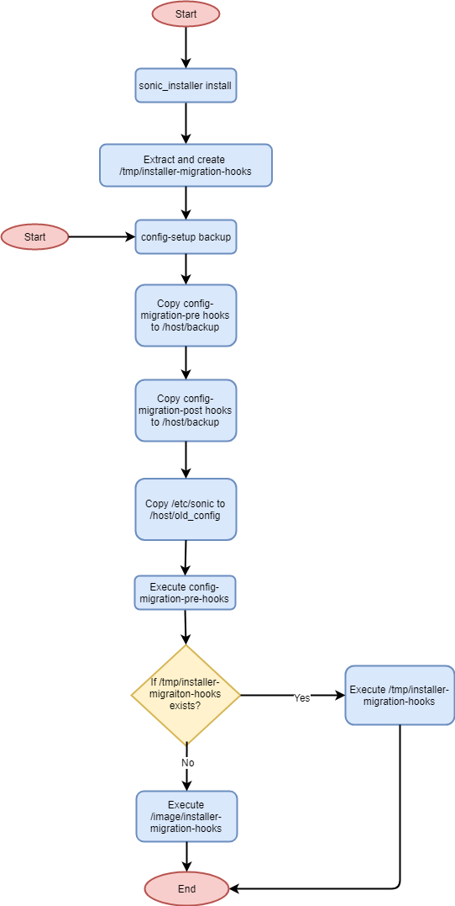

# SONiC Configuration Setup Service

# High Level Design Document
#### Rev 0.4

# Table of Contents
  * [List of Tables](#list-of-tables)
  * [Revision](#revision)
  * [About This Manual](#about-this-manual)
  * [Scope](#scope)
  * [Definitions](#definitions)
  * [1. Feature Overview](#1-feature-overview)
    * [1.1 Requirements](#11-requirements)
    * [1.2 Design Overview](#12-design-overview)
  * [2. Functionality](#2-functionality)
    * [2.1 Target Use Cases](#21-target-deployment-use-cases)
    * [2.2 Functional Description](#22-functional-description)
    * [2.3 CLI](#23-cli)
  * [3. Unit Tests](#3-unit-tests)
  * [4. Appendix](#4-appendix)


# List of Tables
[Table 1: Definitions](#table-1-definitions)

# Revision
| Rev |     Date    |       Author       | Change Description                |
|:---:|:-----------:|:------------------:|-----------------------------------|
| 0.1 | 07/16/2019  |   Rajendra Dendukuri      | Initial version                   |
| 0.2 | 07/22/2019 | Rajendra Dendukuri | Update Test plan, fixed review comments |
| 0.3 | 10/16/2019 | Rajendra Dendukuri | Added an example usecase of password migration |
| 0.4 | 02/25/2020 | Rajendra Dendukuri | Added:<BR>    Installer migration hooks capability<BR>    Automatic backup and restore of migration hooks|

# About this Manual
This document provides details about how the switch configuration is handled on a SONiC device.

# Scope
This document describes functional behavior of the proposed config-setup service. It also explains the dependency between various other SWSS services and the config-setup service.

# Definitions
### Table 1: Definitions
| **Term**       | **Definition**               |
| -------------- | ---------------------------- |
| Config DB      | SONiC Configuration Database |
| config-setup   | Configuration Setup          |
| startup-config | /etc/sonic/config_db.json    |
| ZTP            | Zero Touch Provisioning      |

# 1 Feature Overview

SONiC switch configuration is stored in a Redis database instance called Config DB. The contents of Config DB reflect most of the configuration of a SONiC switch. The contents of Config DB can be saved in a file */etc/sonic/config_db.json* using the *config save* CLI command. During switch bootup, Config DB is populated with the intended configuration present in the file */etc/sonic/config_db.json*.  Through out this document the term startup-config is used to refer to */etc/sonic/config_db.json*.


When a new SONiC firmware version is installed from ONIE, the newly installed image does not include a *startup-config*. A  startup-config has to be created on first boot. Also when the user upgrades from firmware version A to version B, the startup-config needs to be migrated to the new version B.


SONiC is a collection of various switch applications whose configuration is not always stored in Config DB and hence not present in the startup-config file. First boot configuration creation and configuration migration for these applications also needs to be handled so that all applications in a SONiC switch provide their intended functionalities.


A new service, ***config-setup***, is being proposed to take care of all of the above described activities. Some of the functions provided by the config-setup service are already being handled by *updategraph* service.  As part of proposed changes, functionality dealing with configuration management is moved from *updategraph* to   *config-setup* service. In future, the *updategraph* service can be removed all together and config-setup can be the single place where SONiC configuration files are managed.


## 1.1 Requirements


### 1.1.1 Functional Requirements

1. The config-setup service must provide the ability to generate a configuration when there is none present.

2. The config-setup service must be extensible enough so that any additions to it can be done without requiring any changes to the core service script.

3. It must be backward compatible with the current SONiC configuration generation scheme which makes use of t1/l2/empty config presets.

4. It must support configuration of components beyond the *startup-config* (*/etc/sonic/config_db.json*) file.  Example frr configuration.

5. It should support intermediate reboots during config initialization process. For example, some changes to switch SDK files may require a reboot to get applied to hardware.

6. It must provide infrastructure to support config migration when the user installs a new SONiC firmware version and reboots to switch to the newly installed version.

7. The config-setup service must also take into consideration of other methods of configuring the switch. e.g  ZTP, updategraph.


### 1.1.2 Configuration and Management Requirements
*config-setup* service provides a command line tool */usr/bin/config-setup* which should provide following functionality:

1. Create factory default configuration on first boot
2. Create factory default configuration on demand
3. Take backup of configuration files when a new SONiC firmware version is installed
4. Restore backed up configuration files and apply when user switches from SONiC firmware version A to version B

### 1.1.3 Warm Boot Requirements

When the switch reboots in warm boot mode, *config-setup* service must ensure that config migration steps do not affect warm boot functionality.


## 1.2 Design Overview

### 1.2.1 Basic Approach
*config-setup* service is heavily inspired by the functionality provided by the existing *updategraph* service. config_migration and config_initialization sections of updategraph have been migrated to the new *config-setup* service. Core logic is kept intact and some additional enhancements have been made to consider the case when the ZTP feature is available and if it is administratively enabled or disabled.


In addition to this borrowed functionality, few provisions for user defined extensions (hooks) have been added to perform customizations which are implementation based.


### 1.2.2 Systemd service dependencies
The *config-setup.service* runs after *rc-local.service* and *database.service.* It requires *database.service*. The *updategraph.service* requires *config-setup.service* and runs only after *config-setup.service*. In the future when the *updategraph.service* is removed from SONiC, all systemd services which have dependency on *updategraph.service* will be modified to depend on the *config-setup.service*.


# 2 Functionality
## 2.1 Target Deployment Use Cases
The *config-setup* service is used to perform the following functions:

1. Switch boots a SONiC image which was installed on an empty storage device

2. A new SONiC firmware image is installed and user switches to the newly installed image

3. SONiC switch boots without a startup-config file present


## 2.2 Functional Description

### 2.2.1 Config Setup Hooks

To extend the functionality of the *config-setup* script, users are not expected to modify this script directly. Instead users are required to place executable *hook* scripts in corresponding hooks directory which extend the config-setup script's capability. All executable scripts in the hooks directory are invoked inline using the Bourne shell '.' command. The hook scripts are invoked in lexicographical order of their filenames. The exit status of the hook script is captured in the shell variable *exit_status*. Before each hook is executed,  the shell variable *exit_status* is set to zero. If the hook script succeeded at the task for which it was invoked, the value remains as zero. The hook scripts can modify the value of exit_status to indicate the exit status if any error is encountered.


If required, within a hook script a system reboot operation can be performed. If such an event occurs, the config-setup service will resume executing hooks from the beginning of the hook where reboot was issued. Any hooks previously executed will not be executed again. The satisfying condition for initiating a reboot and the reboot operation itself is not implemented in the config-setup service. Instead this logic needs to be implemented as part of the hook script.


In the following sections, supported hooks for including user extensions are described.


### 2.2.1 Config Initialization

When a SONiC switch boots, the config-setup service starts after the database service exits. It detects if the switch is booting for the first time by checking for existence of the */tmp/pending_config_initialization* file.

At this point if ZTP is enabled, config-setup service loads the ZTP configuration into Config DB and continues the rest of the boot process. ZTP service will then perform provisioning data discovery and download the configuration for the switch. If updategraph is enabled, *config-setup* services exits and lets updategraph handle the rest of config initialization steps.


If both ZTP and updategraph are not enabled, config-setup service is responsible to create a factory default startup-config for the switch and load it to Config DB.


#### Factory Default Config Hooks

Hooks Directory: */etc/config-setup/factory-default-hooks.d*

If defined by the user these are executed during factory default config creation step of *config-setup* service. User can choose to create the startup-config file, frr configuration files and any other files using pre-defined logic. Various application packages can install hooks with logic to create their own factory default configuration, config-setup service will execute these recipes.


Below is an example hook to generate a config_db.json using a pre-defined factory default template file.

*/etc/config-setup/factory-default-hooks.d/10-02-render-config-db-json*

```bash
#Render the config_db.json.j2 template if defined
CONFIG_DB_TEMPLATE=/usr/share/sonic/templates/config_db.json.j2

PLATFORM=sonic-cfggen -H -v DEVICE_METADATA.localhost.platform
PRESET=(head -n 1 /usr/share/sonic/device/$PLATFORM/default_sku)
HW_KEY=${PRESET[0]}

if [ -f ${CONFIG_DB_TEMPLATE} ] && [ "${HW_KEY}" != "" ]; then
    sonic-cfggen -H -k ${HW_KEY} -p -t ${CONFIG_DB_TEMPLATE} > /etc/sonic/config_db.json
    exit_status=$rv
fi
```


#### Preset Configuration

If a startup-config was not created by the factory default hooks, config-setup service uses the config preset defined in the /usr/share/sonic/device/*$platform*/*default_sku* file. This is the current observed functionality provided by the updategraph service.


### 2.2.2 Config Migration

The user can use the *sonic_installer* utility to install a new version of SONiC firmware. As part of this procedure, sonic_installer takes a backup of all files in the directory */etc/sonic* and copies them as */host/old_config*. The *config-migration-pre-hooks* and the *config-migration-post-hooks.d* which are described in the subsequent sections are also backed up as part of this action.

Later when the switch boots into the newly installed image, a file */tmp/pending_config_migration* is created by rc.local service and config-setup service detects its presence and starts the configuration migration action. The backed up files in /host/old_config are then restored to /etc/sonic directory and the restored startup-config file is loaded to Config DB. The *config-migration-pre-hooks* and the *config-migration-post-hooks.d* are also restored to the newly installed image from their backed up copies. If the new image contains files in the migration hooks directories with the same filename as the backed up files, they are not overwritten and instead the files in the newly installed image will be used for configuration migration. This allows the newer version images to provide updated migration logic and deprecate the older (possibly incorrect) implementations.


#### Config migration Hooks - Pre (Take Backup)

Hooks Directory: */etc/config-setup/config-migration-pre-hooks.d*

Config migration hooks provides various applications the ability to extend their config migration step and define their own backup scripts that are invoked when */etc/sonic* is backed up by the *sonic_installer install* command. Based on the specific requirement of an application, the corresponding config-migration-pre-hook  for the application implements the appropriate recipe. These hooks can also be invoked by using the "config-setup backup" command. After the *sonic_installer install* command is executed, the *config-setup backup* command is automatically invoked which in turn executes the *Config migration Hooks - Pre* scripts. 


Below is an example hook to take a copy of the known ssh hosts file.

*/etc/config-setup/config-migration-pre-hooks.d/backup-known-ssh-hosts*

```bash
#Take a backup of known_hosts file for all users
mkdir -p /host/ssh_config
for user in $(ls -1 /home); do
    if [ -e /home/${user}/.ssh/known_hosts ]; then
        cp /home/${user}/.ssh/known_hosts /host/ssh_config/${user}_known_hosts
    fi
done
```

The *Config migration Hooks - Pre* are intended solely for the end user to add their own scripts as part of post deployment provisioning; these scripts are not to be included as part of the  SONiC installer image, *sonic-xxx.bin*. Instead, it is encouraged to use the *installer migration hooks* described in the next section to be part of the SONiC installer image, *sonic-xxx.bin*.

#### Installer migration Hooks - Pre (Take Backup)

Hooks Directory: */var/run/config-setup/installer-migration-hooks*

The functionality of installer migration hooks is similar to the Config migration Hooks - Pre. These hooks are also used to perform configuration backup actions and are executed
by the *config-setup backup* command after executing the hooks defined in */etc/config-setup/config-migration-pre-hooks.d*. These hooks are packaged as part of the SONiC installer image, *sonic-xxx.bin*, and are copied to the */var/run/config-setup/* as part of the SONiC installer image extraction step. As the installer migration hooks are part of the newly installed image, they are easier to provide new configuration backup functionality and fix any migration issues exposed by the hooks defined in * Config migration Hooks - Pre*.


The installer migration hooks corresponding to an installed SONiC image are available in the directory */host/image-<build_version>/installer-migration-hooks*. If the *config-setup backup* is executed explicitly by the user and the  */var/run/config-setup/installer-migration-hooks* directory is not present, the hooks present in the directory */host/image-<build_version>/installer-migration-hooks* of the current active image are executed. This allows the user to perform manual config backup and restore operation on the current active image. If the  */var/run/config-setup/installer-migration-hooks* directory  exists, it will take precedence as it indicates that the user has just installed a new image and is preparing to boot into the newly installed image.


#### Configuration Backup Flowchart




#### Config migration Hooks - Post (Restore Backup)

Hooks Directory: */etc/config-setup/config-migration-post-hooks.d*

These hooks are executed by the config-setup service when switch boots into a newly installed image and also a snapshot of backed up configuration files are found in /host/old_config directory. Applications can install corresponding hooks in the *config-migration-post-hooks.d* directory, which restore the files that were backed up in the *config-migration-pre-hooks*.


Below is an example hook to restore known ssh hosts file from a backed up files.

*/etc/config-setup/config-migration-post-hooks.d/restore-ssh-known-hosts*

```bash
#Restore known_hosts file for all users
if [ -d /host/ssh_config ]; then
    for user in $(ls -1 /home); do
        if [ -e /host/ssh_config/${user}_known_hosts ]; then
            cp -f /host/ssh_config/${user}_known_hosts /home/${user}/.ssh/known_hosts
        fi
    done
fi
# Remove the copy
rm -rf /host/ssh_config/*_known_hosts
```


#### Configuration Restore  Flowchart


### 2.2.3 Config Detection

On every switch bootup, the config-setup service starts and detects if a startup-config file is present or not. If startup-config does not exist, config Initialization action is performed. Please refer to the section 2.2.1 for more details.


## 2.3 CLI
Following are the commands supported by the config-setup tool. These are Linux shell commands.


***config-setup factory***

This command is executed to create factory default configuration. Please refer to the section 2.2.1 for more details. Note that this command simply creates a configuration and does not load it into Config DB. It is up to the calling entity to execute either 'config reload' or switch reboot for the configuration to take effect.


***config-setup backup***

This command is executed to take a backup copy of SONiC configuration files that need to be migrated over when a new firmware image is  installed and booted in to. Please refer to section 2.2.2 for more details.


***config-setup boot***

This command is executed as part of system bootup by the config-setup service. Users must not execute this command on Linux shell even though it is possible to. The actions performed  by this command are described in section 2.2.


# 3 Unit Tests

1. Install SONiC firmware image on an empty disk using ONIE or similar bare metal provisioning tool. Verify that a factory default configuration is created.
2. Delete startup-config and reboot the switch. Verify that a factory default configuration is created.
3. Install a new SONiC firmware image using the "sonic_installer install" command and reboot the switch to boot into the newly installed image. Verify that the startup-config file used in the old SONiC firmware is restored to be used by the new image.
4. When ZTP is enabled, verify that the ZTP configuration is loaded when the SONiC switch boots without a startup-config. Factory default config does not get created in this case.
5. Verify that the updategraph service takes over the config creation role if it is enabled and SONiC switch boots without a startup-config.
6. Verify that the user specified config-setup-factory hooks are executed when the switch boots without a startup-config.
7. Verify that the user specified config-migration-pre hooks are executed when a new SONiC firmware image is installed.
8. Verify that when the switch boots into a newly installed SONiC image, the user specified config-migration-post hooks are executed.
9. Verify that the exit status of the user defined hooks is correctly read and reported by the config-setup service in syslog. If the hook script is syntactically incorrect, it will be reported with failed exit status.
10. When the switch boots with a saved startup-config, verify that the config-setup service does not perform any additional actions.
11. Verify that the user can execute the "config-setup factory" command manually without requiring a switch reboot.
12. Verify that the user can execute the "config-setup backup" command multiple times so that any new configuration file changes are picked up again.
13. Verify that when a config-setup hook script issues a switch reboot, all the hook scripts previously executed are not executed again upon subsequent  switch boot.
14. Verify that config-migration hook scripts are executed even when the switch boots in warm boot mode. This will allow scripts to perform any actions required for some applications which are not covered by the warm boot functionality.
15. Verify that config-setup-factory hook scripts are not executed when switch boots in warm boot mode.
16. Verify that the config-migration-pre and config-migration-post hook scripts are automatically migrated to the newly installed image.
17. Verify that the config-migration-pre and config-migration-post hook scripts migrated to the newly installed image do not overwrite hook scripts with same name in the newly installed image.
18. Verify that the installer migration scripts provided as part of the SONiC installer image are executed after the executing the hooks defined in config-migration-pre. This action is performed by the *config-setup backup* command.

# 4 Appendix

This section provides example extensions of the Configuration Setup service to perform configuration migration in a SONiC switch.

## Linux Users, Groups and Passwords Migration

When a new SONIC image is installed, a new Linux root filesystem is created. As a result, any changes made in the Linux root filesystem are not carried forward to the newly installed image. Only specific contents in the /etc/sonic directory (e.g config_db.json, frr config) are migrated to the new image as part of config migration. Simple changes in Linux, such as change of admin user password or Unix group membership, are not transferred over as part of config migration.

The config-setup migration hooks infrastructure can be used to migrate following information from existing image to newly installed image:
1. Newly created non-system users (GID >= 1000)
2. Password for the newly created users and the admin user
3. Newly created user groups
4. /home directory which has all user home directories
5. User email 

When a new SONiC switch image is installed using the "sonic_installer install" command, the /var/lib/config-setup/installer-migration-hooks/01-local-users-pre script extracted from the new SONiC image is executed. It takes a backup copy of all of the files listed below and copies them to /host/backup/users_info directory.

```
/etc/passwd
/etc/group
/etc/shadow
/etc/gshadow
/home/*
/var/spool/mail
```

After the SONiC switch is rebooted to boot into the newly installed image, the /etc/config-setup/config-migration-post-hooks.d/01-local-users-post script is executed which reads the files in /host/backup/users_info directory and migrates contents of the backed up data to the Linux root filesystem of newly installed user. After migrating the user data, the directory /host/backup/users_info is removed.
