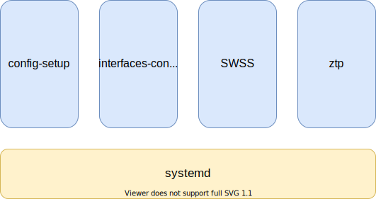
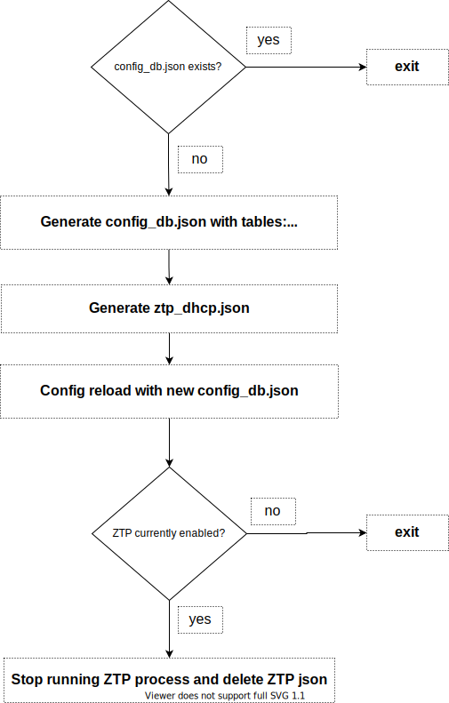
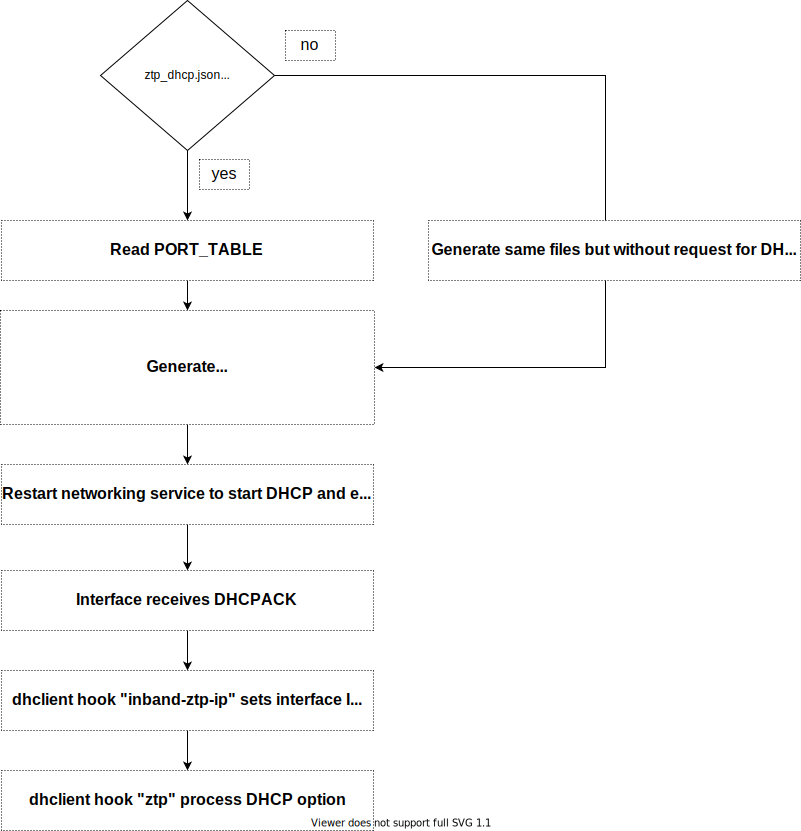
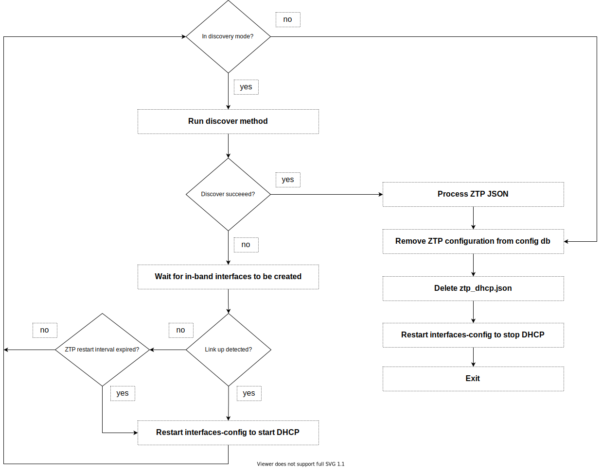

# In-Band ZTP HLD

# High Level Design Document

#### Rev 0.1

# Table of Contents
- [Revision](#revision)
- [Scope](#scope)
- [Definitions/Abbreviation](#definitionsabbreviation)
- [1 Overview](#1-overview)
- [2 Requirements](#2-requirements)
  - [2.1 Functional requirements](#21-functional-requirements)
  - [2.2 Configuration and Management Requirements](#22-configuration-and-management-requirements)
- [3 Modules design](#3-modules-design)
  - [3.1 ZTP provision over in-band network on init](#31-ZTP-provision-over-in-band-network-on-init)
    - [3.1.1 config-setup service](#311-config-setup-service)
    - [3.1.2 interfaces-config service](#312-interfaces-config-service)
    - [3.1.3 ZTP service](#313-ztp-service)
    - [3.1.4 SWSS COPP](#314-swss-copp)
  - [3.2 ZTP provision over in-band network on runtime](#31-ZTP-provision-over-in-band-network-on-runtime)

# Revision
| Rev | Date     | Author          | Change Description                 |
|:---:|:--------:|:---------------:|------------------------------------|
| 0.1 | 03/07/22 | Lior Avramov    | Initial version                    |

# Scope
This document describes the high level design of the in-band ZTP feature in SONiC.

# Definitions/Abbreviation
| Abbreviation  | Description                               |
|---------------|-------------------------------------------|
| ZTP           | Zero-touch provisioning                   |
| DHCP          | Dynamic host configuration protocol       |


# 1 Overview
When a newly deployed SONiC switch boots for the first time, it should allow automatic setup of the switch without user intervention. This framework is called ZTP.
ZTP allows switch that boots from factory default to communicate with remote provisioning server (DHCP server), download a file called ZTP json and perform the configuration tasks listed in it. Configuration tasks are defined with the corresponding plugin executable that should be applied by ZTP. Plugins can be config_db.json to apply, SW image to install, SNMP community string or graphservice provided with minigraph xml and ACL json . ZTP allow to perform one or more configuration tasks. It also allow ordering of these tasks as defined in the ZTP json. DHCP option 67 (59 for DHCPv6) in the DHCP offer contains the url to the JSON file. This allows ZTP to download the ZTP json, process it and execute the configuration tasks listed in it.
Alternitively, ZTP can download a provisioning script and execute it. DHCP option 239 (239 for DHCPv6) in the DHCP offer contains the url to the script.

# 2 Requirements

## 2.1 Functional requirements
In-band ZTP feature in SONiC should meet the following requirements:
- ZTP should be able to provision the switch over in-band network in addition to the out-of-band network.
- DHCP discovery should be performed on all in-band interfaces.
- The first interface to provide provisioning data will be used and any provisioning data provided by other interfaces is ignored.

## 2.2 Configuration and management requirements
- Provisioning over in-band network is enabled by default when the ZTP package is included.
- There is no CLI command to disable in-band ZTP, however, user can add "feat-inband" : false in /host/ztp/ztp_cfg.json to disable in-band ZTP.
- DHCP_L2 and DHCPV6_L2 traps should be enabled using COPP manager for in-band ZTP.

# 3 Modules design



Services config-setup and interface-config perform the groundwork for ZTP service and copp manager in SWSS is registering the required trap.

## 3.1 ZTP provision over in-band network on init

### 3.1.1 config-setup service
First service to run is config-setup, it performs the following:



- Create the following files using sonic-cfggen:
1. config_db.json (using ztp-config.j2) with 3 tables: DEVICE_METADATA, ZTP and PORT
DEVICE_METADATA table data (product name, serial number) are being read using decode-syseeprom command.
ZTP table data (ZTP_INBAND, ZTP_IPV4, ZTP_IPV6) are being read from file called defaults.py, this file holds ZTP defines (sub features admin state, helper files location, etc.).
PORT table data (alias, lanes, admin_status etc.) are being read from platfrom.json by HWSKU (if ZTP_INBAND is disabled, ports admin state is set to down).
2. /etc/network/ifupdown2/policy.d/ztp_dhcp.json (using ifupdown2_dhcp_policy.j2): this file contains DHCPv6 related configuration (e.g. DUID:DHCP unique identifier type).

- Run config reload to load the newly created config_db.json, then it stops ZTP process if running and delete ZTP json to prepare for a new ZTP session.

### 3.1.2 interfaces-config service
After config reload, service interfaces-config runs and perfrom the following:



Check if file ztp_dhcp.json exist, if so:
- Read interfaces data from PORT_TABLE in app DB (alias, speed, oper_status etc.)
- Use sonic-cfggen to create the following files (use interface data as data source):
1. /etc/network/interfaces file (using interfaces.j2). This file contains network interface configuration like static IP address, network netmask, DHCP enable etc.
2. /etc/dhcp/dhclient.conf file (using dhclient.conf.j2). This file defines the DHCP information provided to the client by the server (DHCP options and requests).
3. /etc/sysctl.d/90-dhcp6-systcl.conf (using 90-dhcp6-systcl.conf.j2). This file contains DHCPv6 related configuration, accept_ra (accept router advertisements) and accept_ra_defrtr (learn default router in router advertisement).
- Restart networking service, this will start DHCP discovery on the managment interface (at this phase, in-band interfaces still not created).


### 3.1.3 ZTP service
ZTP service perform the following:



- Run discovery method in which we determine ZTP mode. Whether we work with local ZTP json, ZTP json, simple provisioning script or minigraph. See below order of precedence:
1. ZTP json file specified in pre-defined location as part of the image
2. ZTP json file downloaded using URL specified in DHCP Option-67
3. ZTP json file downloaded using URL specified in DHCPv6 Option-59
4. Simple provisioning script downloaded using URL specified in DHCP Option-239
5. Simple provisioning script downloaded using URL specified in DHCPv6 Option-239
6. Minigraph xml and ACL json downloaded using URL specified in DHCP Option 225 and 226 respectively

For each option mentioned above, there is a predefined path to a file on the filesystem. When the correspnding option will arrive in the DHCP packet, we will parse it and write to this file.
We determine ZTP mode by checking if the file exist, if it does, we read the URL from it, and use it to download the ZTP json/provisioning script.

- If none of the files exist (discovery failed), wait for in-band interfaces to be created (read interfaces from config DB and poll for existance of /sys/class/net/${PORT}), then check for oper state change in one on of the in-band interfaces and if there is such, perform restart to interfaces-config service, this will start DHCP discovery on all in-band interfaces.
- In the case where discovery failed and no link up detected, we keep a timer to restart interfaces-config service periodically every 300 seconds.
- DHCP process starts, server sends offer, client sends request, server sends ack with the IP address and the required DHCP option.
- DHCP hook /etc/dhcp/dhclient-enter-hooks.d/inband-ztp-ip sets the offered IP address on the in-band interface.
- Another hook /etc/dhcp/dhclient-exit-hooks.d/ztp reads the received option and write it to a file in predefined location on the filesystem.
- Go back to discovery mode, this time, one of the files will exist and ZTP json file will be downloaded.
- Process the configuration sections appear in ZTP json. Each section contains plugin to execute. There are several plugin types:
1. configdb-json - the plugin is used to download ConfigDB json file and apply the configuration. A config reload is performed during which various SWSS services may restart.
2. firmware - this plugin is used for image management on a switch. It can be used to install, remove and boot selection of images. sonic_installer utility is used by this plugin to perform the supported functions.
3. connectivity-check - this plugin is used to ping a remote host and verify if the switch is able to reach the remote host.
4. snmp - this plugin is used to configure SNMP community string on SONiC switch.
5. graphservice: the plugin is used to provide minigraph xml and ACL json file to be used by SONiC switch.

In the below example, there are 3 sections to process:
```
{
  "ztp": {
		"01-configdb-json": {
			"url": {
				"source": "http://192.168.0.1/ZTP/config_db.json",
				"destination": "/etc/sonic/config_db.json"
			}
		},
		"02-configdb-json": {
			"url": {
				"source": "http://192.168.0.1/ZTP/config_db-FEATURE.json",
				"destination": "/etc/sonic/config_db.json"
			},
			"dynamic-url": {
				"source": {
					"prefix": "http://192.168.0.1/ZTP/",
					"identifier": "hostname",
					"suffix": "_config_db.json"
				},
				"destination": "/etc/sonic/config_db.json"
			}
		},
		"03-script": {
			"plugin": {
				"url": {
					"source": "http://192.168.0.1/ZTP/03-script.sh"
				}
			},
			"reboot-on-failure": "true"
		}
	}
}
```
- Last step is to clear ZTP configuration from the switch, we do the following:
1. Clear ZTP section from config DB using sonic-db-cli.
2. Clear ZTP section from config_db.json.
3. Delete file ztp_dhcp.json and restart interfaces-config service. When ztp_dhcp.json does not exist, interfaces-config service will create dhclient.conf without request of ZTP options.

### 3.1.4 SWSS COPP
To make DHCP packets arrive to CPU, need to register the following traps:
- SAI_HOSTIF_TRAP_TYPE_DHCP_L2
- SAI_HOSTIF_TRAP_TYPE_DHCPV6_L2

Service config-setup creates new config_db.json during init and performs config relaod to load it. We will add the following to this config_db.json:
```
COPP_TRAP|dhcpl2
  always_enabled:true
```
ZTP engine will delete this table from config DB when ZTP finishes its work.

COPP manager listens to changes in COPP_TRAP table, therefore will handle and register the traps.
When COPP manger handles changes in COPP_TRAP table it uses static data that is being read in init and kept in the cache, this data is generated from copp_cfg.j2.
We will add the following to copp_cfg.j2:
```
"l2dhcp": {
  "trap_ids": "l2dhcp,l2dhcpv6",
  "trap_group": "queue4_group4"
},
```
```
"queue4_group4": {
  "trap_action":"trap",
  "trap_priority":"4",
  "queue": "4",
  "meter_type":"packets",
  "mode":"sr_tcm",
  "cir":"600",
  "cbs":"600",
  "red_action":"drop"
}
```
And extend trap_id_map with:
```
static map<string, sai_hostif_trap_type_t> trap_id_map = {
  {"l2dhcp", SAI_HOSTIF_TRAP_TYPE_DHCP_L2},
  {"l2dhcpv6", SAI_HOSTIF_TRAP_TYPE_DHCPV6_L2}
};
```

## 3.2 ZTP provision over in-band network on runtime
User can force ZTP service to run using CLI command "ztp run", this will restart ZTP operation.
In this scenario, ztp-engine performs the following:
1. Verify all ZTP sub features (inband, ipv4, ipv6) are enabled in config DB. If not, create config_db.json and ztp_dhcp.json (same as config-setup does on init) and perfrom config reload to load the newly created config_db.json.
2. Rest of the flow is as described in [3.1.3 ZTP service](#313-ztp-service)