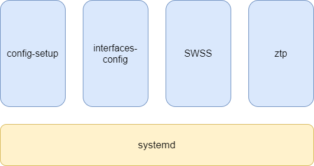
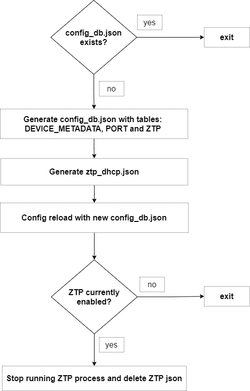
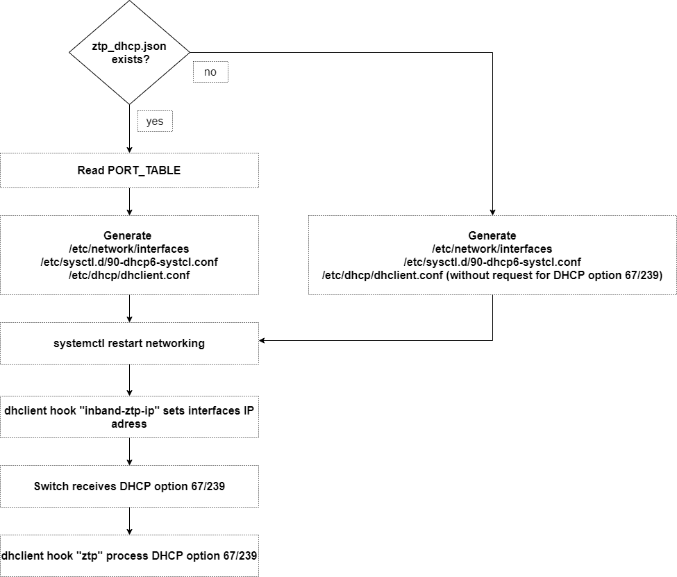
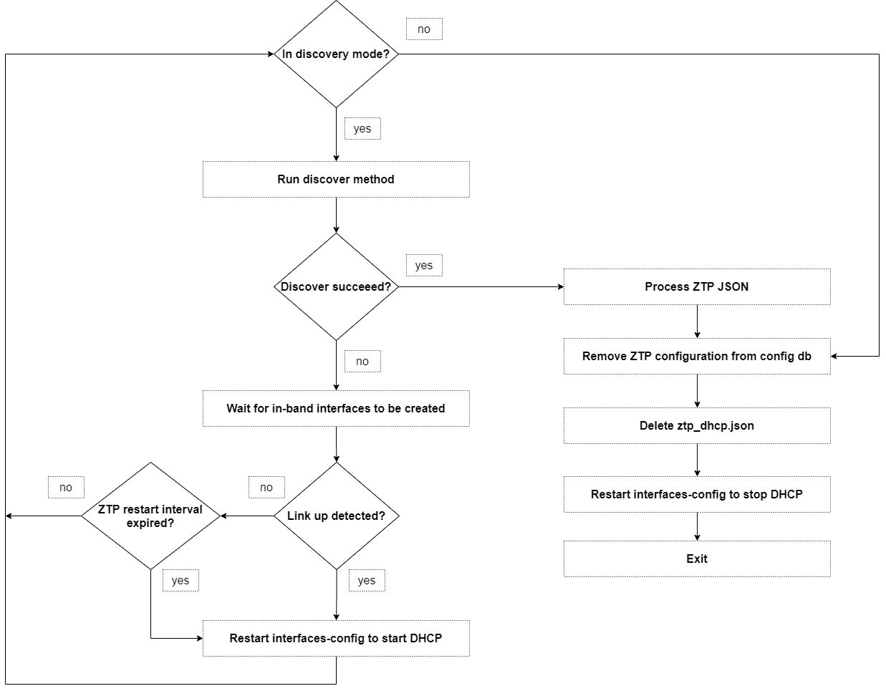

# In-Band ZTP HLD

# High Level Design Document

#### Rev 0.1

# Table of Contents
- [Revision](#revision)
- [About this Manual](#about-this-manual)
- [Scope](#scope)
- [Definitions/Abbreviation](#definitionsabbreviation)
- [1 Overview](#1-overview)
- [2 Requirements](#2-requirements)
  - [2.1 Functional requirements](#21-functional-requirements)
  - [2.2 Configuration and Management Requirements](#22-configuration-and-management-requirements)
- [3 Modules design](#3-modules-design)
  - [3.1 ZTP provision over in-band network on init](#31-ZTP-provision-over-in-band-network-on-init)
    - [3.1.1 config-setup service](#311-config-setup-service)
    - [3.1.2 interfaces-config service](#312-interfaces-config-service)
    - [3.1.3 ZTP service](#313-ztp-service)

# Revision
| Rev | Date     | Author          | Change Description                 |
|:---:|:--------:|:---------------:|------------------------------------|
| 0.1 | 03/07/22 | Lior Avramov    | Initial version                    |

# About this Manual
This document provides an overview of the implementation and integration of inband ZTP feature in SONiC.

# Scope
This document describes the high level design of the inband ZTP feature in SONiC.

# Definitions/Abbreviation
| Abbreviation  | Description                               |
|---------------|-------------------------------------------|
| ZTP           | Zero-touch provisioning                   |

# 1 Overview
When a newly deployed SONiC switch boots for the first time, it should allow automatic setup of the switch without user intervention. This framework is called ZTP.
ZTP allows switch that boots from factory default to communicate with remote provisioning server (DHCP server), download a file called ZTP json and perform the configuration tasks listed in it. Configuration tasks are defined with the corresponding plugin executable that should be applied by ZTP. Plugins can be config_db.json to apply, FW image to install, snmp configuration to apply, graphservice provided with minigraph xml and ACL json to apply. ZTP allow to perform one or more configuration tasks. It must also allow ordering of these tasks as defined in ZTP json. DHCP option 67 (59 for DHCPv6) in the DHCP offer contains the url to the JSON file. This allows ZTP to download and process the data to execute the described configuration tasks.
Alternitively, ZTP can download a simple script (called provisioning script) and execute it. DHCP option 239 (239 for DHCPv6) in the DHCP offer contains the url to the script. This allows ZTP to download and execute it.

# 2 Requirements

## 2.1 Functional Requirements
In band ZTP feature in SONiC should meet the following high-level functional requirements:
- ZTP must be able to provision the switch over in-band network in addition to the out-of-band network.
- DHCP discovery should be performed on all in-band interfaces.
- The first interface to provide provisioning data will be used and any provisioning data provided by other interfaces is ignored.

## 2.2 Configuration and Management Requirements
- Provisioning over in-band network is enabled by default when the ZTP package is included.
- There is no CLI command to disable in-band ZTP.
- DHCP_L2 and DHCPV6_L2 traps should be enabled using COPP manager for in-band ZTP.
- A configuration option is provided in the ZTP configuration file ztp_cfg.json to enable or disable in-band provisioning feature. Use "feat-inband" : false in /host/ztp/ztp_cfg.json to disable ZTP in-band provisioning. 

# 3 Modules design

## 3.1 ZTP provision over in-band network on init
Services config-setup and interface-config perform the groundwork for ZTP service. 

### 3.1.1 config-setup service
First service to run is config-setup, it does the following:

- Create the following files using sonic-cfggen:
1. config_db.json (using ztp-config.j2) with 3 tables: DEVICE_METADATA, ZTP and PORT
DEVICE_METADATA table data (product name, serial number) are being read using decode-syseeprom command.
ZTP table data (ZTP_INBAND, ZTP_IPV4, ZTP_IPV6) are being read from file called defaults.py, this file holds all ZTP defines (sub features admin state, helper files location, etc.).
PORT table data (alias, lanes, admin_status etc.) are being read from platfrom.json by HWSKU (if ZTP_INBAND is disabled, ports admin state is set to down).

2. /etc/network/ifupdown2/policy.d/ztp_dhcp.json (using ifupdown2_dhcp_policy.j2): this file contains DHCPv6 related configuration (e.g. DUID:DHCP unique identifier type) 

- Run config reload to load the newly created config_db.json, then it stops ZTP process if running and delete ZTP session data to prepare for a new ZTP session.

### 3.1.2 interfaces-config service
After config reload, service interfaces-config runs and perfrom the following:

Check if file ztp_dhcp.json exist, if so:
- Read interfaces data from PORT_TABLE in App DB (alias, speed, oper_status etc.)
- Use sonic-cfggen to create the following files (supply interface data as input):
1. /etc/network/interfaces file (using interfaces.j2). This file contains network interface configuration like static IP address, network netmask, enable DHCP etc.
2. /etc/dhcp/dhclient.conf file (using dhclient.conf.j2). This file defines the DHCP information provided to the client by the server (DHCP options and requests).
3. /etc/sysctl.d/90-dhcp6-systcl.conf (using 90-dhcp6-systcl.conf.j2). This file contains DHCPv6 related configuration accept_ra (accept router advertisements) and accept_ra_defrtr (learn default router in router advertisement).

### 3.1.3 ZTP service
ZTP service perform the following:

- Run discovery method in which we determine ZTP mode. Whether we work with local ZTP json, ZTP json, simple provisioning script or minigraph. See below order of precedence:
1. ZTP JSON file specified in pre-defined location as part of the image
2. ZTP JSON URL specified via DHCP Option-67
3. ZTP JSON URL specified via DHCPv6 Option-59
4. Simple provisioning script URL specified via DHCP Option-239
5. Simple provisioning script URL specified via DHCPv6 Option-239
6. Minigraph URL and ACL URL specified via DHCP Option 225, 226

For each option mentioned above, there is a predefined path to a file on the filesystem. When the correspnding option will arrive in the DHCP packet we will parse it and write to this file.
We determine ZTP mode by checking if the file exist If it does, we read the URL and use it to download the ZTP JSON/provisioning script.

- If none of the files exist, we perform restart to the networking service, this will start DHCP discovery on all in-band interfaces.
- DHCP process starts, server sends offer, client sends request, server sends ack with the IP address and the required DHCP option.
- DHCP hook /etc/dhcp/dhclient-enter-hooks.d/inband-ztp-ip sets the offered IP address on the in-band interface.
- Another hook /etc/dhcp/dhclient-exit-hooks.d/ztp reads the received option and write it to a file in predefined location on the filesystem.
- Go back to discovery mode, this time, one of the files will exist and discover will succeed.
- Process the available configuration sections in ZTP JSON 

