# Trusted Zero Touch Provisioning (Trusted ZTP) for SONiC

## High Level Design Document

**Feature:** Trusted Zero Touch Provisioning (Trusted ZTP) for SONiC

**Version:** 1.0

**Status:** Draft — submitted for SONiC community HLD review

**Target release:** To be assigned by the SONiC TSC

---

## Table of Contents

1. [Revision History](#1-revision-history)
2. [About This Document](#2-about-this-document)
3. [Scope](#3-scope)
4. [Definitions and Abbreviations](#4-definitions-and-abbreviations)
5. [Overview](#5-overview)
6. [Requirements](#6-requirements)
7. [Architecture](#7-architecture)
8. [High-Level Design](#8-high-level-design)
9. [SAI API](#9-sai-api)
10. [Implementation Phasing](#10-implementation-phasing)
11. [Configuration and Management](#11-configuration-and-management)
12. [Warmboot and Fastboot Design Impact](#12-warmboot-and-fastboot-design-impact)
13. [Restrictions/Limitations](#14-restrictions-/-limitations)
14. [Testing Requirements](#15-testing-requirements)
15. [Appendix A](#16-appendix-a-the-core-concept-of-trusted-ztp-Device-Identity-=-Serial-Number-Embedded-in-a-Certificate)
16. [Appendix B](#17-appendix-b-pki-trust-hierarchy)
17. [Appendix C](#18-appendix-c-how-phase1-works-without-a-TPM)
18. [Appendix D](#19-appendix-d-device-configuration-using-voucher-anchor-mode)
19. [Appendix E](#20-appendix-e-device-configuration-using-trusted-server-mode)

---

### 1. Revision History  

| Version | Date | Author | Description |
|:-------:|:-----|:-------|:------------|
| 1.0 | 2026-08-06 | T Keerthi Kumar, Sandeep K | Initial draft. |

---

### 2. About This Document  

This High-Level Design introduces **Trusted Zero Touch Provisioning (tZTP)**, a standards-based, cryptographically secure onboarding solution for SONiC, built on **RFC 8572** Secure Zero Touch Provisioning. The design follows a simple approach that prioritizes security, maintainability, and backward compatibility.

Key design principles include:
- **Augmentation rather than replacement**: Trusted ZTP builds upon the existing sonic-ztp service instead of introducing an entirely new onboarding framework.
- **Reuse of proven technology**: The design leverages a mature, existing, and permissively licensed RFC 8572 implementation rather than developing a new security-sensitive provisioning protocol from scratch.
- **Standards-based onboarding**: Device onboarding, ownership validation, and secure configuration delivery adhere to the **RFC 8572** specification.
- **Backward compatibility**: Existing SONiC ZTP deployments continue to operate without modification.
- **Secure-by-option deployment**: Trusted ZTP is disabled by default and must be explicitly enabled.

---

### 3. Scope  

This document describes **Phase 1** of **Trusted Zero Touch Provisioning (tZTP)** for SONiC NOS. It extends the existing `sonic-ztp` with cryptographic security with full backward compatibility support.

**In Scope — Phase 1(this document):**
- RFC 8572 based secure bootstrapping (i.e. process of bringing a bare-metal "white box" switch from its factory default state into a fully operational network node) support for a SONiC device.
- Verification of bootstrap server ownership (for example, using operator certificates or ownership vouchers) and validation of onboarding payload integrity before applying any configuration to the device
- Seamless integration with the existing `sonic-ztp` engine and plugin framework, enabling validated payloads to be applied through the established provisioning workflow.
- A secure enforcement mode that disables legacy insecure discovery and communication methods. Along with full backward compatibility with existing ZTP deployments.
- Operational visibility through STATE_DB, with audit logs and CLI support.
- Support for file-based device certificates on devices without a hardware TPM (interim solution in Phase1).


**In Scope — Phase 2:**
Design interfaces are defined in this HLD. Detailed design will be covered in a future HLD.
- Support for hardware-based device identity using TPM 2.0 and IEEE 802.1AR (IDevID/LDevID).
- Certificate enrollment and renewal for device identities.


**Out of Scope:**
- Implementation of the external secure bootstrap server.
- Security of NOS image downloads during the ONIE installation stage. 
 
---

### 4. Definitions/Abbreviations 

| Term | Definition |
|------|-----------|
| **tZTP** | Trusted Zero Touch Provisioning — this feature |
| **ZTP** | Zero Touch Provisioning — existing SONiC mechanism |
| **SZTP** | Secure Zero Touch Provisioning — RFC 8572 standard that tZTP implements |
| **IDevID** | Initial Device Identifier — factory-installed |
| **mTLS** | Mutual TLS — TLS with both client and server certificate verification |
| **CMS** | Cryptographic Message Syntax - RFC 5652 - a standard structure used to digitally sign, authenticate, encrypt, or digest arbitrary message data |
| **TPM** | Trusted Platform Module 2.0 — hardware security element |
| **ONIE** | Open Network Install Environment — bare-metal switch bootloader |
| **PKI** | Public Key Infrastructure |
| **CA** | Certificate Authority |
| **RFC 8572** | Secure Zero Touch Provisioning |
| **RFC 5652** | Cryptographic Message Syntax |
| **RFC 8366** | Voucher Artifact for Bootstrapping Protocols |
| **Pledge** | The device being provisioned — here, the SONiC switch |
| **Bootstrap server** | The RFC 8572 server that returns redirect or onboarding information to the pledge |
| **Onboarding information** | The signed payload delivered to the pledge: boot image reference, configuration, and optional scripts |
| **Trusted-server model** | RFC 8572 trust where the pledge already holds the owner/CA trust anchor |
| **Voucher-anchored model** | RFC 8572 trust where the server is verified *after* connecting, by validating the voucher |
| **Ownership voucher** | A signed artifact (RFC 8366) that binds a device to its owner |
| **Owner Certificate** | A X.509 certificate that binds an owner identity to a public key, which a device can use to validate a signature over the conveyed information artifact |
| **pinned-domain-cert** | The certificate pinned inside the ownership voucher (RFC 8366) that identifies the owner, the device must trust. |
| **Manufacturer anchor** | The manufacturer signing trust anchor, baked in at the factory, used to verify the ownership voucher. |
| **Canonical Architecture** | An architecture that uses a single, standard, and shared model for data or design. |

---

### 5. Overview 

### 5.1 Current SONiC-ZTP Overview

SONiC's existing Zero Touch Provisioning (ZTP) automates the initial configuration of bare-metal switches. A factory-fresh SONiC switch can be deployed with minimal operator involvement: once the device is racked, connected, and powered on, it uses DHCP to locate its provisioning information, downloads a ZTP configuration file, and executes a series of provisioning steps. These steps may include installing firmware, loading a config_db.json file or minigraph, configuring SNMP, and running custom scripts. After provisioning is complete, control is handed over to the final device configuration.

A key design principle of SONiC ZTP is that it serves as a temporary bootstrap mechanism. The system first applies a minimal "ZTP profile" configuration, sufficient to bring up network connectivity and obtain DHCP information. After provisioning tasks are completed, this temporary configuration is removed and replaced with the intended operational configuration.

SONiC ZTP is widely used in data center deployments because it simplifies large-scale device onboarding and reduces manual configuration effort. However, as SONiC adoption expands into enterprise, edge, and regulated environments, stronger security guarantees have become necessary. 

### 5.2 Motivation: Security Gaps in Today's SONiC-ZTP

The current ZTP implementation relies on unauthenticated discovery and configuration delivery mechanisms, and it does not provide cryptographic verification of the provisioning source or payloads. As a result, it is not suitable for security-sensitive deployments that require authenticated device onboarding, verified ownership, and tamper-resistant configuration delivery. The existing ZTP flow is functional but **insecure by default**.

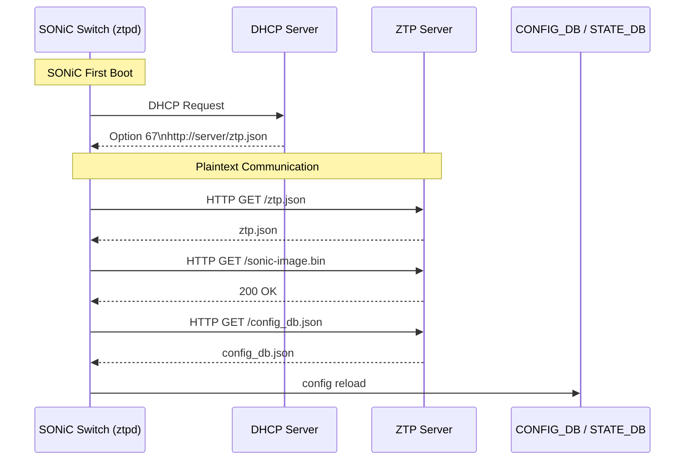
*Figure 1 — Current SONiC-ZTP Provisioning Sequence*

Current SONiC ZTP supports few security features, but it does not provide a standards-based mechanism for establishing trust between a factory-fresh device and the provisioning server. Because a factory-fresh device has no built-in mechanism to verify the identity of the provisioning server or confirm that the received payload is intended for it, onboarding remains vulnerable to man-in-the-middle and rogue-server attacks. 

**Security-Gaps/Trust-Challenges in existing ZTP**

- **Threat 1: Rogue Server :** The device trusts the provisioning server provided through DHCP. A malicious server can supply unauthorized software or configuration, potentially compromising the device before it becomes operational.

- **Threat 2: Rogue Device :** The provisioning server may provide onboarding information to any device that requests it. Unauthorized, stolen, or counterfeit devices could obtain sensitive firmware, configurations, or other provisioning data.

- **Threat 3: No payload integrity :** Files and provisioning artifacts are applied as received, without a standards-based mechanism to verify that the onboarding payload originates from an authorized source and has not been tampered with.

- **Threat 4: Insecure Discovery :** The current ZTP discovery process relies on DHCP options (such as Option 67) to provide the location of provisioning files. The device downloads and applies the referenced configuration or script files without a standards-based mechanism to authenticate the source or verify ownership. As a result, a malicious DHCP or provisioning server could redirect the device to unauthorized onboarding content.

and many more. An attacker with access to the provisioning network could potentially deliver unauthorized software or configuration during the device's initial boot process. 

Current protections include **AES encryption**, **RSA/SHA-512 digital signatures**, and **optional HTTPS certificate verification**. While these features provide basic protection, they do not offer standards-based device authentication, server ownership validation, or secure onboarding trust required for modern deployments.

### 5.3 Solution: How tZTP Addresses Existing ZTP Security Gaps and Trust Challenges

- **Threat 1: Rogue Server** : **How tZTP Addresses It:**
 tZTP uses mutual TLS (mTLS), server certificate validation, and RFC 8572 ownership validation to verify the identity of the bootstrap server before accepting any onboarding information. The device only trusts servers that can prove they belong to the authorized operator.

 - **Threat 2: Rogue Device** : **How tZTP Addresses It:**
 tZTP introduces device identity verification using device certificates (IDevId). During initial authentication, the server validates the device's identity before providing onboarding information, ensuring that only authorized devices can receive provisioning data.

- **Threat 3: No Payload Integrity Verification** : **How tZTP Addresses It:**
 tZTP leverages RFC 8572 conveyed information, including CMS-signed onboarding payloads and ownership vouchers, to verify that onboarding information originates from an authorized source and has not been modified before any configuration or software is applied.

- **Threat 4: Insecure Discovery** : **How tZTP Addresses It:**
tZTP treats DHCP as an untrusted discovery mechanism. DHCP provides only a bootstrap-server reference, while actual trust is established through RFC 8572 authentication, mTLS, certificate validation, and ownership verification before onboarding content is accepted.

**In summary,**
Trusted ZTP transforms the onboarding process from:

_"DHCP tells me where to download files, and I trust them."_

to:

_"DHCP provides a pointer, but I verify the server, verify the device, validate the ownership chain, and verify the signed onboarding payload before applying anything."_

This establishes a cryptographically verifiable trust relationship between the device, the operator, and the provisioning infrastructure.

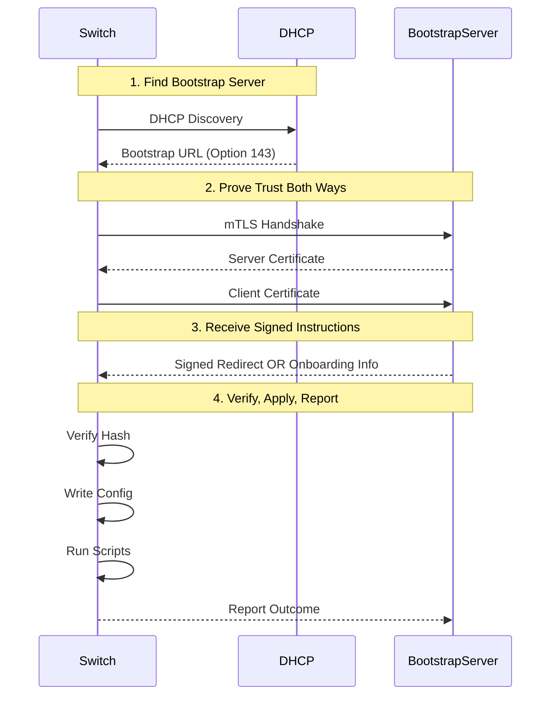
*Figure 2 : RFC 8572 Secure ZTP Provisioning Sequence*

The sequence follows,
- Find the bootstrap server
- Prove trust both ways (Device <--> Bootstrap Server)
- Receive signed instructions (redirect or onboarding information)
- Verify, apply, report

**Players of Secure Zero Touch Provisioning Architecture**
```text
                          ┌──────────────────────────────────────────────┐
                          │            THE "NETWORK" (owner side)        │
                          │                                              │
    ┌──────────┐  DHCP    │  ┌────────────┐   ┌──────────────┐           │
    │  DEVICE  │◄────────►│  │ DHCP Server│   │ Redirect     │           │
    │          │ option143│  │  (dhcpd)   │   │ Server       │──┐        │
    │          │          │  └────────────┘   │(sztpd:8080)  │  │        │
    │          │          │                   └──────────────┘  │        │
    │ runs     │ mutual   │                   ┌──────────────┐◄─┘        │
    │ sZTP     │◄─TLS────►│                   │ Bootstrap    │           │
    │ AGENT    │ RFC8572  │                   │ Server       │           │
    │  (Go)    │          │                   │(sztpd:9090)  │           │
    └────┬─────┘          │                   └──────┬───────┘           │
         │                │                          │ points to         │
         │ HTTPS download │                   ┌──────▼───────┐           │
         └───────────────►│                   │ File Server  │           │
          boot image,     │                   │ Apache TLS   │           │
          config,scripts  │                   │    :443      │           │
                          │                   └──────────────┘           │
                          │                                              │
                          └──────────────────────────────────────────────┘
```
*Figure 3 : The Big Picture — The Players of Secure Zero Touch Provisioning Architecture*

#### Naming — tZTP vs sZTP

The feature is named **tZTP (Trusted ZTP)** rather than **sZTP (secure ZTP)** to emphasize that here primary contribution is not merely securing the communication channel, but establishing an end-to-end trust framework for device onboarding. Trusted ZTP introduces device identity verification, operator ownership validation, and cryptographically verifiable onboarding information, creating a chain of trust from the device manufacturer through the network operator to the provisioned device.

In this context, "secure" describes the protection of the communication channel, while "trusted" describes confidence in the entire onboarding process, including the identities of participating entities, the ownership relationship, and the authenticity and integrity of the provisioning data.

---

### 6. Requirements

### 6.1 Functional Requirements

| # | Requirement | Priority |
|:--|:------------|:--------:|
| FR-1 | Trusted ZTP should be fully backward compatible. When disabled (trusted_mode=false, the default), the system follows the existing SONiC ZTP provisioning process with no functional or operational changes. | Must |
| FR-2 | The device shall perform RFC 8572 secure bootstrapping against bootstrap servers. | Must |
| FR-3 | The device shall be identifiable to the bootstrap server through its Device Certificate — it shall be presented for TLS client authentication. | Must |
| FR-4 | The bootstrap server shall be authenticated either by validating its certificate against a pinned trust anchor (trusted-server model) or by validating the ownership voucher  (voucher-anchored model). | Must |
| FR-5 | The device shall validate the ownership voucher, the owner certificate, and the CMS signature over the onboarding information before applying any part of the payload. | Must |
| FR-6 | On any trust-validation failure, the device shall apply no configuration, image, or script (fail-closed). | Must |
| FR-7 | The device shall support RFC 8572 redirects and follow authorized bootstrap server references, while enforcing limits to prevent redirect loops. | Must |
| FR-8 | The device shall send RFC 8572 progress reports to a **trusted** bootstrap server (report-progress is defined only over the authenticated connection to a trusted server; it is not available on the voucher anchor model). | Must |
| FR-9 | Validated onboarding information shall be applied through the existing `sonic-ztp` engine and plugins, with configuration backup and rollback on failure. | Must |
| FR-10 | In enforced mode, the SZTP URL shall be accepted only from DHCP option 143/136; legacy option 67/239 discovery shall be rejected. | Must |
| FR-11 | The device shall read its initial trust configuration from a read-only bootstrap.json during first boot. | Must |
| FR-12 | The device shall establish a trusted time reference during first boot. If the real-time clock is not valid, the voucher created-on timestamp shall be used as the initial trust anchor. | Must |
| FR-13 | TLS 1.3 shall be the minimum negotiated version; TLS 1.2 and below shall be rejected. | Must |
| FR-14 | All SONiC modules shall interact with the RFC 8572 client only through a single adapter, so that the client can be replaced without changes elsewhere. | Must |
| FR-15 | Trusted ZTP status, trust validation results, and audit records shall be published to STATE_DB, persistently logged in the system log, and exposed through the CLI. | Must |
| FR-16 | (Phase 2) The device shall support TPM-resident IDevID identity and LDevID enrollment/renewal via EST. | Should |
| FR-17 | Any additional files delivered with the onboarding information shall be covered by the same CMS signature over the conveyed information and shall be rejected if that signature does not verify. | Should |
| FR-18 | Network-facing functions such as TLS, voucher processing, CMS validation, and JSON parsing shall run with reduced privileges and be isolated from the root-level configuration engine. | Must |

### 6.2 Non-Functional Requirements

| # | Requirement | Target |
|:--|:------------|:-------|
| NFR-1 | Backward compatibility with existing deployments | 100% |
| NFR-2 | All new source is Apache-2.0 (or compatible permissive) and free of GPL or proprietary entanglement | Required |
| NFR-3 | No component that cannot be shipped upstream is required on the device | Required |
| NFR-4 | The reused client is vendored at a pinned version; its transitive-dependency licenses are audited in CI | Required |
| NFR-5 | Phase 1 functions on hardware without a TPM or factory IDevID | Required |
| NFR-6 | The feature is unit-testable without a live TPM, network, or bootstrap server (adapter mocked) | Required |
| NFR-7 | End-to-end provisioning completes within a typical maintenance window | < 5 minutes |

---

### 7. Trusted ZTP Architecture Overview

Trusted ZTP is an additive management-plane feature that enhances SONiC's existing ZTP framework with secure onboarding capabilities. This section describes how Trusted ZTP fits into the SONiC architecture and introduces the key components and secure data flows involved in the solution.

Trusted ZTP operates entirely within the SONiC management plane. It does not interact with the ASIC, SAI, orchagent, or syncd. Instead, it:
- Reads and writes configuration and operational state through CONFIG_DB and STATE_DB.
- Reads trust material, such as certificates and vouchers, from the local filesystem.
- Uses TPM-based device identity in Phase 2.
- Establishes outbound TLS connections to authorized bootstrap servers.

As Trusted ZTP processes information received from external networks during initial device onboarding, security and isolation are key design considerations.

**Secure Execution Model:**

To reduce the risk associated with processing untrusted network data:

- Network-facing data is processed in a sandboxed, reduced-privilege environment.
- Bootstrap, TLS, voucher-validation, CMS-validation, and parsing functions are isolated from critical system functions.
- The privileged configuration engine that applies configurations remains separate from network-facing components.
- Any vulnerability in the onboarding or parsing process is contained by sandbox and privilege boundaries.
- This minimizes the risk of unauthorized access to the underlying operating system during the provisioning phase.

### 7.1 Footprint on the SONiC Architecture

The SONiC architecture is built around application services that communicate through a centralized Redis database, above the SWSS, syncd, SAI, and ASIC layers.

Trusted ZTP has a deliberately small architectural footprint. The solution:

- Extends the existing native sonic-ztp host service.
- Adds Trusted ZTP management and monitoring commands to the CLI.
- Introduces configuration and operational state tables in CONFIG_DB and STATE_DB.
- Reuses the existing SONiC provisioning workflow and plugin framework.

No changes are required to:
- SWSS
- syncd
- SAI
- ASIC hardware and forwarding pipeline

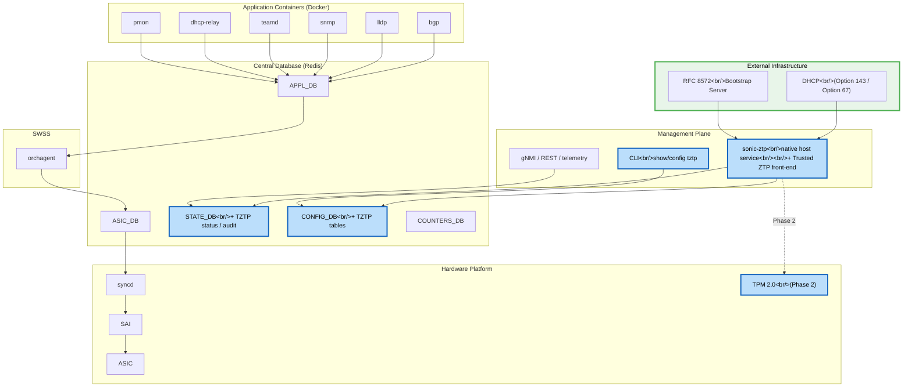
*Figure 4 : Trusted ZTP SONiC Architecture (green - external components, blue - modified SONiC NOS components, grey - no changes)*

---

### 8. High-Level Design 

Trusted ZTP extends the existing sonic-ztp service with a secure onboarding framework. The key architectural principle is that, **Trusted ZTP** establishes **trust**, while the **existing SONiC ZTP** framework performs **provisioning**. Once onboarding information has been authenticated and validated, it is handed to the existing ztp-engine.py and plugin framework without modifying the provisioning workflow. This approach minimizes changes to SONiC while adding standards-based secure onboarding capabilities. 

The design introduces a set of modular components, each responsible for a specific function. This separation of responsibilities improves maintainability, security, and flexibility. It reuses the RFC 8572 Secure Zero Touch Provisioning client (sztp-agent) and encapsulates it behind a dedicated adapter layer. This abstraction allows the underlying SZTP client to be upgraded, modified, or replaced without impacting the rest of the Trusted ZTP framework.

### 8.1 Trusted ZTP Components Overview

Trusted ZTP enhances the existing SONiC ZTP service by introducing a small set of lightweight components that add secure onboarding capabilities while preserving the existing provisioning workflow.

**Components include**,

1. TrustBootstrap
2. Discovery
3. SztpClientAdapter
4. TimeAnchor
5. PayloadMapper
6. AuditSink
7. IdentityManager
8. sztp-agent (reused - 3rd party)
9. ztp-engine.py and existing plugins (reused - SONiC NOS)

The seven new modules provide trust establishment, identity management, validation, auditing, and integration functions, while the reused components continue to perform RFC 8572 processing and provisioning execution.

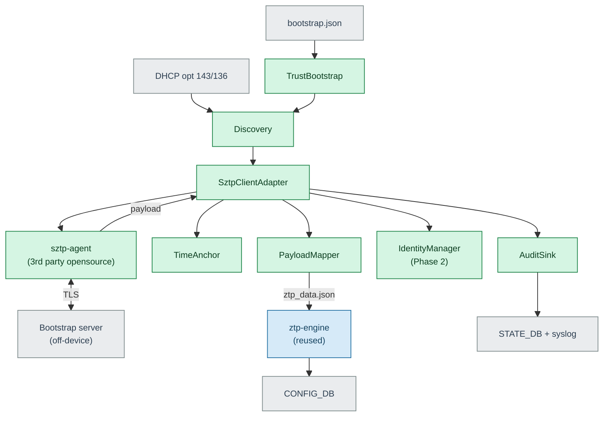
*Figure 5 : Trusted ZTP internal components Overview*
*The reused client (blue) is isolated behind `SztpClientAdapter`; the new modules (green) establish trust and hand a validated payload to the reused engine, which applies it. External inputs and databases are grey.*

- The device reads its trust posture from **bootstrap.json** and obtains SZTP discovery information through **DHCP options 143/136**.
- **Discovery** and **TrustBootstrap** initialize the trusted onboarding workflow.
- The **SztpClientAdapter** acts as the single integration point between SONiC and the external RFC 8572 client.
- The **sztp-agent** establishes an **mTLS** connection with the operator-owned **Bootstrap Server**, validates vouchers and CMS-signed onboarding information, and retrieves the onboarding payload.
- The validated payload is returned to the adapter, which:
   1. Anchors trusted time using **TimeAnchor**.
   2. Maps onboarding data into SONiC-native structures using **PayloadMapper**.
   3. Manages device identity functions through **IdentityManager** (Phase 2).
   4. Publishes trust and audit information through **AuditSink**.
- The resulting **ztp_data.json** is passed to the existing **ztp-engine**, preserving SONiC's current provisioning workflow.
- The reused ZTP engine applies configuration through **CONFIG_DB**.
- Trust status, validation results, and onboarding audit records are published to **STATE_DB** and persisted in **syslog**.


**Component Responsibilities,**

**1. TrustBootstrap**

Loads and validates the initial trust configuration from bootstrap.json during first boot. It establishes the device's trust posture, trust model, operational mode, and trust anchors before onboarding begins.

`bootstrap.json` is a small, **read-only** file placed on the switch at the factory or during staging, `/etc/sonic/tztp/bootstrap.json`, only `TrustBootstrap` module reads this file.

Example format:
```json
{
  "tztp_bootstrap": {
    "schema_version": "1.0",
    "trusted_mode": true,
    "enforce": true,
    "discovery": ["dhcp-opt143", "dhcp-opt136", "static"],
    "trust_model": "voucher-anchored", /* OR trusted-server */
    "identity_source": "file",
    "device_cert": "/etc/sonic/tztp/device.crt",
    "device_key": "/etc/sonic/tztp/device.key",
    "trust_anchors_path": "/etc/sonic/tztp/trust/",
    "sztp_client": "sztp-agent",
    "sztp_client_version_range": ">=0.2.0,<0.3.0"
  }
}
```

**2. Discovery**

Obtains bootstrap-server information through DHCP and initiates the secure onboarding workflow. DHCP-provided data is treated as untrusted and used only as a discovery mechanism.

Supported DHCP Options,
```text
Option Code: 143/136
Purpose: Carries the SZTP bootstrap server information (typically a list of HTTPS URLs).
Transport: DHCPv4/DHCPv6
Format: Encoded as a DHCP option payload containing one or more bootstrap server URIs as defined by RFC 8572 implementations.
```

**3. SztpClientAdapter**

Provides a stable abstraction layer between SONiC and the RFC 8572 client (sztp-agent). This adapter isolates implementation-specific details and allows the underlying SZTP client to be upgraded or replaced with minimal impact on the rest of the system.

SztpClientAdapter executes the `sztp-agent` client and translates the results into existing SONiC provisioning outcomes, so the existing handling simply works:

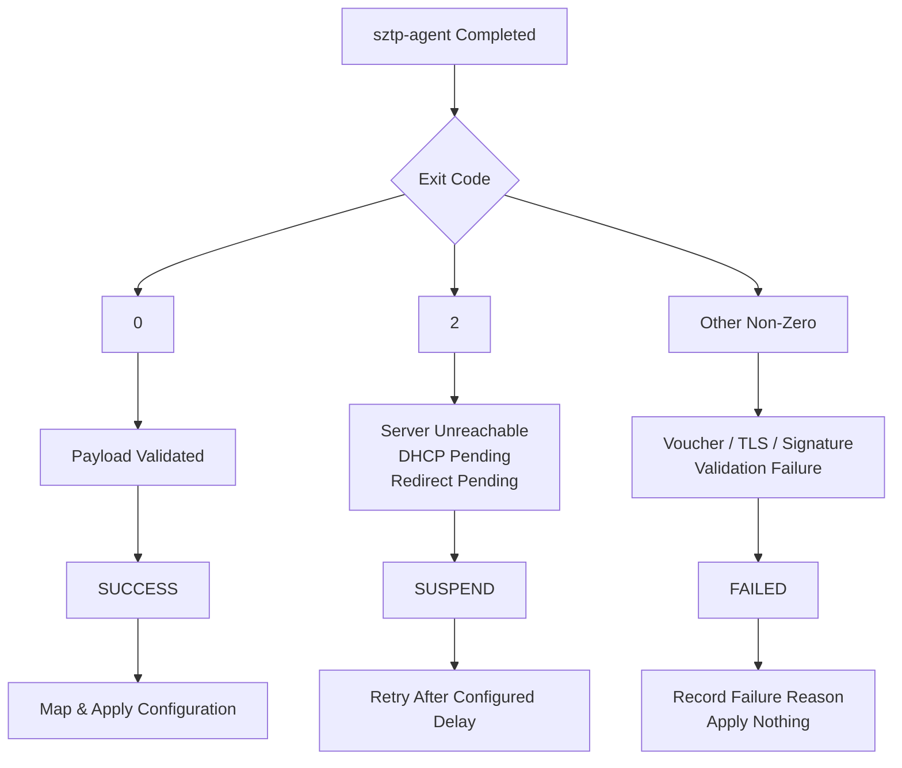
*Figure 6 : SztpClientAdapter Exit Code Handling*

**4. TimeAnchor**

The timeanchor module in Trusted ZTP (tZTP) provides a trusted baseline system clock for a factory-fresh or unprovisioned switch whose real-time clock (RTC) is unset, zeroed, or out of sync.

Because X.509 certificate validation and Cryptographic Message Syntax (CMS) verification depend on valid time windows (`notBefore` and `notAfter`), a zeroed clock would cause cryptographic validation to fail. The timeanchor module solves this problem by establishing a safe lower time bound using authenticated metadata without requiring access to an unauthenticated NTP server first.

**How It Works Across Operational Modes,**

**In Voucher-Anchored Mode:**
 
   Mechanism: Uses the MASA-signed Ownership Voucher (RFC 8366).
 
   Workflow:
   - The initial device connection to the bootstrap server is established using factory manufacturer trust anchors with relaxed initial time checks.
   - The pledge receives the ownership voucher signed by the Manufacturer Authorized Signing Authority (MASA).
   - The timeanchor module parses the tamper-proof `created-on` timestamp (e.g., 2026-08-29T08:30:00Z) from the verified voucher payload.
   - It ratchets the system clock forward to this timestamp, providing a trusted reference time to strictly validate subsequent operator certificates, CMS signatures, and onboarding scripts.

  **Example of voucher with `created-on' field:**
```text
{
  "ietf-voucher:voucher": {
    "created-on": "2026-08-29T08:30:00Z",
    "assertion": "verified",
    "serial-number": "JADA123456789",
    "pinned-domain-cert": "MIIB... (Base64 DER Encoded Certificate) ...",
    "domain-cert-revocation-checks": false
  }
}
```

  Detailed flow is explained as below,
```text
[ Unset / Zeroed RTC Clock (1970-01-01) ]
          │
          ▼
1. Initial TLS Handshake Attempt
   ├── Connect to Bootstrap Server via mTLS
   ├── Server presents TLS certificate signed by Operator / Owner CA
   └── Time checks (notBefore / notAfter) are temporarily relaxed 
       (because RTC is unset and pledge lacks Operator Root CA)
          │
          ▼
2. Transport Channel Established (Provisional / Unauthenticated)
          │
          ▼
3. Server Delivers Signed Onboarding Artifact
   └── Contains MASA-Signed Ownership Voucher + CMS-Signed Onboarding Payload
          │
          ▼
4. Manufacturer CA Verification of Voucher
   └── Pledge verifies MASA digital signature over voucher using factory Manufacturer Trust Anchor
          │
          ▼
5. timeanchor Module Processes 'created-on'
   ├── Extracts tamper-proof 'created-on' timestamp (ISO 8601/RFC 3339) from validated voucher
   └── Updates local system clock to 'created-on' (Establishes Trusted Lower Bound)
          │
          ▼
6. Domain Certificate Pinning & Payload Authentication
   ├── Extracts 'pinned-domain-cert' (Operator CA) from verified voucher
   └── Validates CMS signature on onboarding payload using the pinned Operator CA
          │
          ▼
7. Strict PKI & Execution Mode Enforced
   ├── Re-enables strict certificate lifetime checks for subsequent TLS/download operations
   └── Hands off authenticated configuration / scripts to sonic-ztp engine
```

**In Trusted-Server Mode:**

   Mechanism: Uses local trust anchors and authenticated server payload metadata.
   
   Workflow:
   - Ownership vouchers are optional and typically omitted because the switch already holds the operator's pinned root/CA trust anchors.
   - If the local RTC is unset, timeanchor reads/extracts the authenticated `signingTime` from the operator's CMS-signed onboarding payload.
   - Once the CMS signature over the onboarding payload is verified against the pinned local trust anchor, timeanchor updates the system clock using this authenticated timestamp to validate short-lived artifacts and maintain system audit logs.

   **Example of CMS-signed payload with `signingTime' field:**     
```text
CMS_ContentInfo:
   contentType: pkcs7-signedData (1.2.840.113549.1.7.2)
   d.signedData:
	  signerInfos:
         signerInfo:
            signedAttrs:
			  object: **signingTime** (1.2.840.113549.1.9.5)
				set:
				  UTCTIME: Oct 28 14:30:00 2026 GMT
```

  Detailed flow is explained as below,
```text
[ Unset RTC Clock (1970) ]
          │
          ▼
1. TLS Handshake Attempt
   ├── Validate Server Cert against pinned root/CA trust anchors (Signature OK)
   └── Bypass notBefore/notAfter checks due to uninitialized local clock
          │
          ▼
2. Secure TLS Channel Established (Transport Established)
          │
          ▼
3. Server Delivers CMS-Signed Onboarding Payload
          │
          ▼
4. timeanchor Module Processes Payload
   ├── Verifies CMS signature using local trust anchor
   └── Extracts authenticated 'signingTime' attribute from CMS payload
          │
          ▼
5. Clock Ratcheted Forward
   └── Local RTC updated to 'signingTime' (Time Anchor Established)
          │
          ▼
6. Strict PKI & Execution Mode
   ├── Full time-range checks re-enabled
   └── Provisioning script / Config applied via sonic-ztp engine
```


**5. PayloadMapper**

Converts validated RFC 8572 onboarding information into the format expected by the existing SONiC ZTP framework, enabling seamless reuse of current provisioning logic. The RFC 8572 client (sztp-agent) securely downloads onboarding artifacts and validates their integrity using the hashes provided in the onboarding information. Before any provisioning data is generated, all referenced artifacts, such as software images, configuration files, and scripts, must be downloaded and successfully verified. 

The PayloadMapper then translates the validated onboarding payload into a standard SONiC ztp_data.json file. Instead of referencing remote URLs, the generated provisioning data references only locally downloaded artifacts using file:// paths.

**Responsibilities,**
- Consume Validated Onboarding Information
- Reference Verified Local Artifacts
- Generate SONiC Provisioning Data
- Maintain Provisioning Compatibility

**Example RFC 8572 Onboarding Information Payload**
```json
{
  "ietf-sztp-conveyed-info:onboarding-information": {
    "boot-image": {
      "os-name": "VendorOS",
      "os-version": "17.2R1.6",
      "download-uri": [
        "https://example.com/path/to/image/file"
      ],
      "image-verification": [
        {
          "hash-algorithm": "ietf-sztp-conveyed-info:sha-256",
          "hash-value": "ba:ec:cf:a5:67:82:b4:10:77:c6:67:a6:22:ab:7d:50:04:a7:8b:8f:0e:db:02:8b:f4:75:55:fb:c1:13:b2:33"
        }
      ]
    },
    "configuration-handling": "merge",
    "pre-configuration-script": "base64encodedscript==",
    "configuration": "base64encodedconfig==",
    "post-configuration-script": "base64encodedscript=="
  }
}
```

**Example Generated SONiC ZTP Information Payload**
```json
{
  "ztp": {
    "restart-ztp-no-config": false,
    "restart-ztp-on-failure": false,
    "halt-on-failure": true,
    "ignore-result": false,

    "00-tztp-pre-script": {
      "plugin": { "name": "provisioning-script" },
      "ignore-section-data": true,
      "provisioning-script": {
        "url": { "source": "file:///var/lib/ztp/tztp/artifacts/pre.sh" }
      }
    },
    "01-tztp-firmware": {
      "install": {
        "url": { "source": "file:///var/lib/ztp/tztp/artifacts/sonic.bin" },
        "set-default": true
      },
      "reboot-on-success": true
    },
    "02-tztp-config": {
      "clear-config": true,
      "save-config": true,
      "url": { "source": "file:///var/lib/ztp/tztp/artifacts/config_db.json" }
    },
    "99-tztp-post-script": {
      "plugin": { "name": "provisioning-script" },
      "ignore-section-data": true,
      "provisioning-script": {
        "url": { "source": "file:///var/lib/ztp/tztp/artifacts/post.sh" }
      }
    }
  }
}
```

**High-Level Functional Mapping:**
```text
RFC 8572 Onboarding Information
│
├── boot-image.download-uri
│      └── SONiC firmware installer section
│
├── boot-image.image-verification
│      └── Verified by tZTP before ZTP generation
│
├── pre-configuration-script
│      └── 00-tztp-pre-script
│
├── configuration
│      └── 02-tztp-config
│
├── configuration-handling
│      └── clear-config true/false
│
└── post-configuration-script
       └── 99-tztp-post-script
```
	   
**6. AuditSink**

Records onboarding events, trust-validation outcomes, and operational status. Information is published to STATE_DB, persisted in system logs, and exposed through the CLI.

**7. IdentityManager**

Manages device identity and authentication credentials. In Phase 1, it supports file-based device certificates. In Phase 2, it integrates with TPM-based IDevID/LDevID identities.

**8. sztp-agent (Reused)**

The RFC 8572 Secure Zero Touch Provisioning client (sztp-agent) is a reused open-source component responsible for the standards-based secure onboarding functions used by Trusted ZTP.

Rather than implementing a new provisioning protocol, Trusted ZTP leverages the mature RFC 8572 implementation provided by sztp-agent to perform the security-critical operations required during device onboarding. To maintain architectural flexibility, **sztp-agent** is accessed through the **SztpClientAdapter** rather than directly by SONiC components. This abstraction allows the RFC 8572 client implementation to be upgraded, customized, or replaced with minimal impact on the rest of the system.

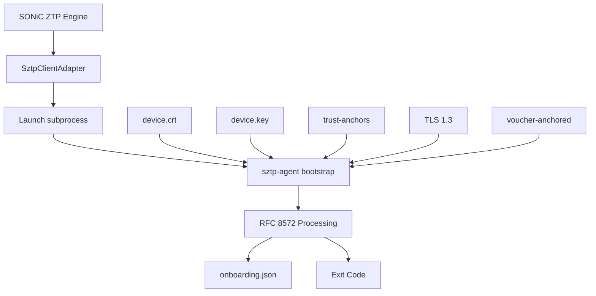
*Figure 7 : RFC 8572 SZTP-Agent Security Processing Architecture*

**Responsibilities,**
Within the Trusted ZTP architecture, sztp-agent serves as the security-processing engine responsible for trust establishment and onboarding validation. It performs the cryptographic and protocol-specific operations required by RFC 8572, including:

- Server authentication.
- Device authentication.
- Ownership validation.
- Payload authenticity verification.
- Payload integrity verification.
- Secure onboarding information retrieval.

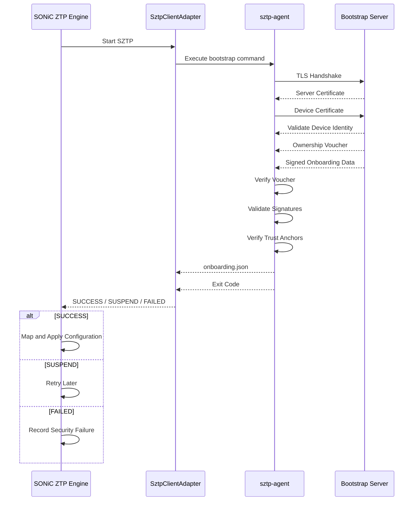

*Figure 8 : Trusted ZTP Provisioning Sequence with 'sztp-agent'*


**9. ztp-engine.py and Existing Plugins (Reused)**

The existing SONiC provisioning engine and plugin framework that perform software installation, configuration deployment, script execution, and other provisioning tasks after onboarding information has been validated.

**Role in Trusted ZTP,**

Trusted ZTP does not modify the existing provisioning engine. Instead, once onboarding information has been authenticated, validated, and converted into SONiC's native ztp_data.json format, the resulting provisioning data is handed to the existing ZTP engine for execution.

This allows Trusted ZTP to reuse SONiC's proven provisioning framework while limiting new functionality to trust establishment, validation, and payload preparation. As a result, no functional changes are required in the existing SONiC provisioning framework.


### 8.2 Mode Selection Design 

Trusted ZTP is **disabled by default** and must be explicitly enabled. At the start of the provisioning process, the device determines whether to use the **Trusted ZTP** workflow or the existing **legacy ZTP** workflow. This decision is critical to ensure that devices that have not opted into Trusted ZTP continue to behave exactly as they do today.

**Determining the Operating Mode,**
The device reads the `trusted_mode` and `enforce` settings from the trust configuration:

- `bootstrap.json` during initial onboarding of a factory-fresh device.
- `CONFIG_DB` on an already provisioned device.

If `trusted_mode` is not configured, it defaults to **false**.

Based on the values of trusted_mode and enforce, the device operates in one of three modes.
| `trusted_mode` | `enforce` | Behaviour |
|:--------------:|:---------:|:----------|
| false | — | **Default.** Legacy ZTP only; no change from today. |
| true | false | **Transition mode.** Try Trusted ZTP first; fall back to legacy ZTP only if the secure path cannot even be started. For staged rollout; *not fully secure*. |
| true | true | **Secure-only.** Legacy option-67/239 discovery and unauthenticated transports are switched off; any missing trust material or failed check stops provisioning. Blocks downgrade attacks. |

The full start-up decision — including both the default and the transition-mode fallback — is shown below.

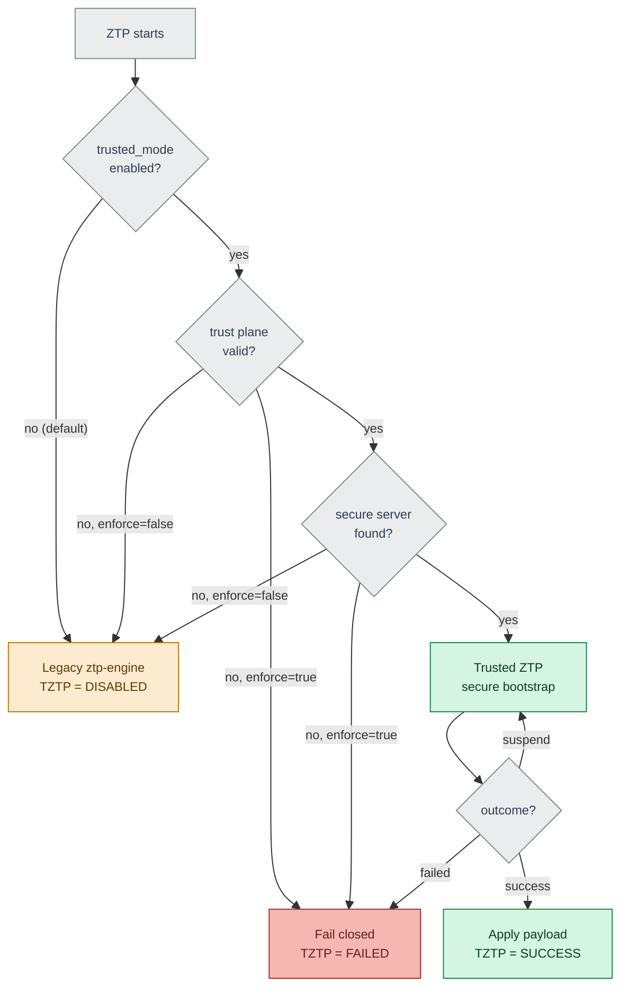

*Figure 9 : Start-up mode selection. Green = secure path, amber = legacy path, red = fail-closed, grey = decision points. The default (`trusted_mode=false`) and the transition-mode fallback both route to the unchanged legacy engine; an active trust-validation failure never falls back to legacy*


### 8.3 Impacted SONiC Repositories
The impact per repository and data store is summarised below.

| SONiC component | Impact | What changes |
|:----------------|:-------|:-------------|
| `sonic-ztp` | New modules; existing engine unchanged | A secure front-end (seven new modules) runs ahead of the existing engine |
| `sonic-buildimage` | Modified | Vendors the `sztp-agent` `.deb`, adds the DHCP option-143 configuration, and (Phase 2) the TPM userspace stack |
| `sonic-yang-models` | New model | `sonic-tztp.yang` with the security constraints |
| `sonic-utilities` | New CLI | `show` / `config tztp` commands |
| `sonic-mgmt` | New tests | Trusted ZTP test plan |
| SAI / orchagent / syncd / ASIC | **None** | No data-plane or hardware-abstraction impact |


### 8.4 Provisioning Workflow

#### 8.4.1 Successful Bootstrap (Voucher-Anchored)

The following sequence shows a successful secure provisioning using the recommended voucher-anchored model.

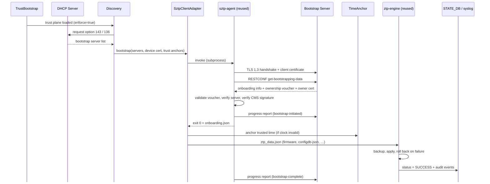
*Figure 10 : Successful voucher-anchored provisioning*

**Step by step:**

1. **Trust posture loaded** — `TrustBootstrap` reads `bootstrap.json` (here `enforce=true`) and starts `Discovery`.
2. **Secure discovery** — `Discovery` requests DHCP option 143/136 and receives the bootstrap-server list (legacy option 67 is never consulted).
3. **Hand to the adapter** — `Discovery` calls `SztpClientAdapter` with the server list, the device certificate, and the trust anchors.
4. **Invoke the client** — the adapter runs `sztp-agent` as a subprocess.
5. **Connect and request** — `sztp-agent` opens TLS 1.3 to the server (presenting the client certificate where available) and calls `get-bootstrapping-data`.
6. **Receive artifacts** — the server returns the onboarding information, the ownership voucher, and the owner certificate.
7. **Validate trust** — `sztp-agent` runs the five-link chain: voucher signature and freshness → owner pinned by the voucher → CMS signer *is* that owner → serial matches this switch.
8. **Report progress** — the agent sends a `bootstrap-initiated` report to the server.
9. **Return the payload** — on success the agent exits `0` and writes `onboarding.json`.
10. **Anchor time** — the adapter sets trusted time from the voucher (only if the clock was invalid).
11. **Apply** — the adapter passes `ztp_data.json` to the engine, which backs up, applies atomically, and rolls back on any failure.
12. **Record and finish** — the engine writes `status = SUCCESS` with audit events, and the agent sends `bootstrap-complete`.


#### 8.4.2 Trust-Validation Failure (Fail-Closed)

If any trust check fails, the device stops and applies nothing. In enforced mode there is no fallback to the legacy path.

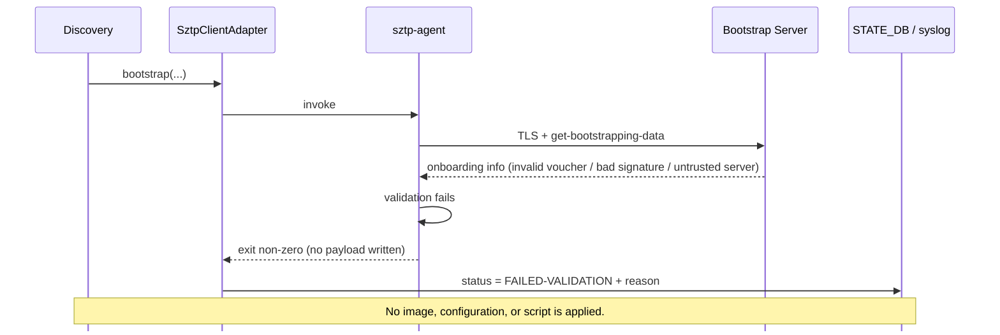
*Figure 11 : Fail-closed behaviour on any trust failure*

**Step by step:**

1. **Bootstrap invoked** — `Discovery` → `SztpClientAdapter` → `sztp-agent`, exactly as in the success flow.
2. **Connect and request** — `sztp-agent` opens TLS and calls `get-bootstrapping-data`.
3. **Bad artifact returned** — the server responds with data that fails a check: an invalid or expired voucher, a bad CMS signature, or an untrusted server.
4. **Validation fails** — one of the five trust-chain links does not hold, so the agent rejects the data.
5. **No payload** — the agent exits non-zero and writes **no** `onboarding.json`.
6. **Record the failure** — the adapter writes `status = FAILED-VALIDATION` with the reason.
7. **Fail closed** — nothing (image, configuration, or script) is applied; in enforced mode there is **no** fallback to the legacy path.


#### 8.4.3 Legacy Provisioning (Secure Option Disabled)

When Trusted ZTP is not opted in — `trusted_mode = false` (the default), or a transition-mode fallback because no secure server was offered — the switch runs the existing ZTP flow unchanged. It is shown here for contrast: it carries today's weak security posture, which Trusted ZTP is designed to replace.

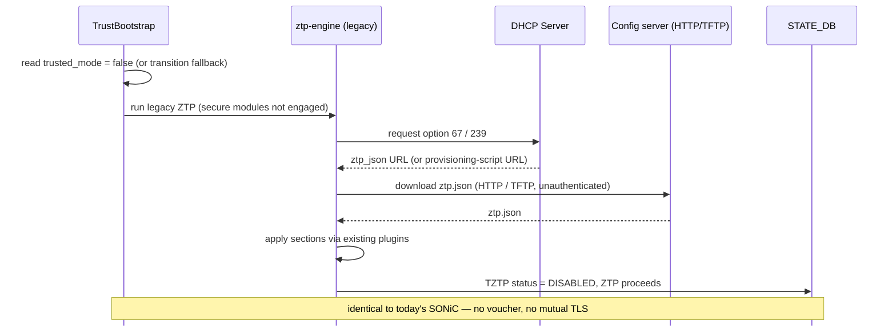
*Figure 12 : Legacy provisioning when the secure option is disabled*

**Step by step:**

1. **Posture check** — `TrustBootstrap` reads `trusted_mode = false` (the default), or falls back here in transition mode because no secure server was offered.
2. **Route to legacy** — control passes to the existing `ztp-engine`; the Trusted ZTP modules never start, and STATE_DB shows `TZTP status = DISABLED`.
3. **Legacy discovery** — the engine requests DHCP option 67 (ZTP-JSON URL) / 239 (provisioning-script URL), exactly as today.
4. **Download** — the engine fetches `ztp.json` over HTTP/TFTP/FTP — **unauthenticated** (no voucher, no mutual TLS).
5. **Apply** — the engine runs the provisioning sections through the existing plugins.
6. **Record** — normal ZTP status is reported; behaviour is bit-for-bit identical to today's SONiC.

---

### 9. SAI API 

No SAI API changes are required. Trusted ZTP operates wholly within the SONiC management plane and does not interact with the ASIC, `orchagent`, `syncd`, or SAI.

---

### 10. Implementation Phasing
The work is delivered in phases so that Phase 1 provides real security on today's hardware without waiting for hardware-dependent capabilities.

| Phase | Objective | Trust depth | Hardware requirement | Where specified |
|:-----:|:----------|:------------|:---------------------|:----------------|
| **1** | Trusted ZTP in SONiC userspace | Voucher and certificate (file-based identity) | None — runs today | This HLD |
| **2** | Hardware-rooted identity | TPM 2.0 and IEEE 802.1AR IDevID/LDevID with EST | TPM and factory IDevID | Follow-up HLD |
| **Out Of Scope** | Close the ONIE image-download window | Authenticated NOS image retrieval | ONIE support | Future (opencomputeproject/onie) |

---

### 11. Configuration and management 

#### 11.1.  Runtime Configuration

Trusted ZTP runtime configuration extends the first-boot trust configuration and adds operational controls that can be managed after deployment. The final storage location is still under discussion and may either use a dedicated `TZTP` table or extend the existing ZTP configuration framework.

##### Example Configuration

```json
{
  "tztp": {
    "trusted_mode": true,
    "enforce": true,
    "trust_model": "trusted-server",
    "tls_supported_version": "TLSv1.3",
    "identity_source": "file"
  }
}
```

#### 11.2. Config DB Enhancements : The complete field set (CONFIG_DB TZTP|global):

| Parameter | Default Value | Description |
|------------|---------------|-------------|
| `trusted_mode` | `false` | Master switch for Trusted ZTP. When disabled, the device operates using legacy SONiC ZTP only. |
| `enforce` | `false` | Enables secure-only onboarding. When enabled, legacy discovery methods and insecure transports are disabled, and onboarding follows a fail-closed model. |
| `trust_model` | `trusted-server` | Defines the trust establishment mechanism. Supported values are `voucher-anchored` and `trusted-server`. |
| `dhcp_option_source` | `option_143` | Specifies the DHCP option used for bootstrap server discovery. `option_67` is not allowed when Trusted ZTP is enabled. |
| `tls_supported_version` | `TLSv1.3` | Defines the minimum TLS version permitted for secure communications. TLS 1.2 and earlier versions are rejected. |
| `identity_source` | `file` | Specifies the source of device identity credentials. Supported values are `file` (Phase 1) and `tpm` (Phase 2). |
| `allow_file_based_idevid` | `true` | Determines whether file-based IDevID credentials are allowed. Set to `false` to require TPM-backed device identity. |
| `enrollment_retry_count` | `3` | Maximum number of retries for onboarding operations that return a retryable (`SUSPEND`) status. |
| `enrollment_retry_delay_sec` | `30` | Delay, in seconds, between enrollment retry attempts. |
| `allow_onboarding_scripts` | `false` | Controls execution of RFC 8572 onboarding scripts. When disabled, onboarding is limited to configuration-only operations. |
| `discovery_interfaces` | `auto` | Defines the interfaces used for bootstrap server discovery. If not specified, interfaces are selected automatically. |

##### Configuration Source of Truth and Precedence

Trusted ZTP configuration can originate from two sources:

| Source | Purpose |
|----------|----------|
| `bootstrap.json` (Factory Trust Plane) | Loaded during first boot before `CONFIG_DB` exists. Defines the device's initial trust posture and security controls. |
| `CONFIG_DB` | Runtime configuration used after onboarding. |


#### 11.3 YANG model Enhancements 

The yang model `sonic-tztp.yang` is detailed below and it describes the CONFIG_DB `TZTP|global` contents. 

```yang
module sonic-tztp {

    yang-version 1.1;
    namespace "http://github.com/sonic-net/sonic-tztp";
    prefix tztp;

    organization "SONiC";
    contact      "SONiC ZTP / Security Working Group";

    description
      "Trusted ZTP (RFC 8572 Secure Zero Touch Provisioning) configuration for
       SONiC. Models the CONFIG_DB TZTP|global table. The 'must' constraints make
       an insecure configuration unrepresentable while trusted_mode is enabled.";

    revision 2026-08-06 {
        description "Initial revision.";
        reference  "RFC 8572; RFC 8366; RFC 7030; IEEE 802.1AR.";
    }

    /* ------------------------------- typedefs ------------------------------- */

    typedef tpm-handle {
        type string {
            pattern '0x[0-9A-Fa-f]{8}';
        }
        description "A TPM 2.0 persistent object handle, e.g. 0x81010001.";
    }

    typedef https-uri {
        type string {
            length  "1..1024";
            pattern 'https://.*';
        }
        description "An https:// URL. Non-TLS schemes are not permitted.";
    }

    /* --------------------------------- data --------------------------------- */

    container sonic-tztp {
      container TZTP {
        container global {

          description
            "Global Trusted ZTP configuration (CONFIG_DB key TZTP|global).";

          /* ----- master switches ----- */

          leaf trusted_mode {
              type boolean;
              default false;
              description
                "Master switch. When false (default) the device runs the existing
                 legacy ZTP unchanged.";
          }

          leaf enforce {
              type boolean;
              default false;
              description
                "When true, secure-only: legacy option-67/239 discovery and
                 unauthenticated transports are disabled and any missing trust
                 material or failed check fails closed. When false (transition mode)
                 the device may fall back to legacy ZTP if the secure path cannot be
                 attempted.";
          }

          /* ----- trust model ----- */

          leaf trust_model {
              type enumeration {
                  enum "trusted-server";
                  enum "voucher-anchored";
              }
              default "voucher-anchored";
              description
                "RFC 8572 trust model. 'trusted-server' validates the server
                 certificate against a factory-pinned CA; 'voucher-anchored'
                 (RFC 8572 section 5.4) verifies the server via the ownership voucher.";
          }

          /* ----- discovery and transport ----- */

          leaf dhcp_option_source {
              type enumeration {
                  enum "option_143";   // DHCPv4 SZTP redirect
                  enum "option_136";   // DHCPv6 SZTP redirect
                  enum "option_67";    // legacy DHCPv4 config URL
              }
              default "option_143";
              must "not(. = 'option_67' and ../trusted_mode = 'true')" {
                  error-message
                    "option_67 is not permitted while trusted_mode is true";
              }
              description "Where the bootstrap-server / redirect URI is read from.";
          }

          leaf tls_supported_version {
              type enumeration {
                  enum "TLSv1.3";
              }
              default "TLSv1.3";
              description "Minimum TLS version; lower versions are rejected.";
          }

          /* ----- device identity ----- */

          leaf identity_source {
              type enumeration {
                  enum "file";   // Phase 1
                  enum "tpm";    // Phase 2
              }
              default "file";
              description "Source of the device client certificate and key.";
          }

          leaf allow_file_based_idevid {
              type boolean;
              default true;
              must "not(. = 'false' and ../identity_source = 'file')" {
                  error-message
                    "identity_source must be 'tpm' when allow_file_based_idevid is false";
              }
              description
                "When false, forbids file-based identity (identity_source must be
                 'tpm'). Operators on TPM-capable hardware set this false to require
                 the hardware-rooted identity.";
          }

          /* ----- retry policy ----- */

          leaf enrollment_retry_count {
              type uint8 { range "1..10"; }
              default 3;
              description "Attempts for a retryable (SUSPEND) outcome.";
          }

          leaf enrollment_retry_delay_sec {
              type uint32 { range "5..300"; }
              default 30;
              description "Delay between retries, in seconds.";
          }

          /* ----- trust material ----- */

          leaf vendor_ca_bundle {
              type string { length "1..256"; }
              default "/etc/sonic/tztp/trust/vendor-ca.pem";
              description "Vendor CA bundle used to validate the ownership voucher.";
          }

          leaf operator_ca_bundle {
              type string { length "1..256"; }
              default "/etc/sonic/tztp/trust/operator-ca.pem";
              description
                "Operator CA bundle used to validate the server (trusted-server model).";
          }

          /* ----- reused client pin ----- */

          leaf sztp_client {
              type string { length "1..64"; }
              default "sztp-agent";
              description "Name of the packaged RFC 8572 client.";
          }

          leaf sztp_client_version_range {
              type string { length "1..64"; }
              description
                "Accepted client version range, e.g. '>=0.2.0,<0.3.0'. A client outside
                 this range fails the session (CLIENT_VERSION_MISMATCH).";
          }

          /* ----- Phase 2: TPM-backed identity ----- */

          leaf tpm_idevid_handle {
              when "../identity_source = 'tpm'";
              type tpm-handle;
              default "0x81010001";
              description "Phase 2. Persistent TPM handle for the IDevID key.";
          }

          leaf tpm_ldevid_handle {
              when "../identity_source = 'tpm'";
              type tpm-handle;
              default "0x81010002";
              description "Phase 2. Active LDevID key handle.";
          }

          leaf tpm_ldevid_staging_handle {
              when "../identity_source = 'tpm'";
              type tpm-handle;
              default "0x81010003";
              description "Phase 2. Staging handle for crash-safe LDevID renewal.";
          }

          leaf ldevid_renewal_before_expiry_days {
              type uint16 { range "1..365"; }
              default 90;
              description "Phase 2. Renew the LDevID this many days before expiry.";
          }

          leaf allow_onboarding_scripts {
              type boolean;
              default false;
              description
                "Permit execution of RFC 8572 pre/post-configuration scripts, which
                 run with root privilege. When false, only configuration is applied.";
          }
        }
      }
    }
}
```

#### 11.4. Operational State DB Enhancements (STATE_DB)  

Operational visibility is provided by a new STATE_DB table, `TZTP|status`, which does not exist for legacy ZTP:

| Field | Description |
|:------|:------------|
| `state` | `IN-PROGRESS`, `SUCCESS`, `FAILED-VALIDATION`, `SUSPEND`, or `DISABLED` |
| `trust_model` | `trusted-server` or `voucher-anchored` |
| `bootstrap_server` | The server that provided the onboarding information |
| `voucher_valid` | Whether the ownership voucher validated |
| `server_verified` | Whether the server was authenticated |
| `owner_subject` | Subject of the validated owner certificate |
| `sztp_client` / `sztp_client_version` | The reused client and its version |
| `client_provision_result` | `OK`, or the typed error (`MTLS_FAIL`, `VOUCHER_FAIL`, `CMS_FAIL`, `VERSION_MISMATCH`) |
| `ldevid_issued` | (Phase 2) whether an LDevID was enrolled |
| `ldevid_expiry` | (Phase 2) LDevID expiry, ISO-8601 |
| `last_error` | Populated on failure |
| `timestamp` | ISO-8601 time of the last transition |

* The ISO-8601 standard formats date and time from largest to smallest units, using a 24-hour clock and a "T" separator
* Example: 2026-08-20T10:30:00Z, where Z means UTC

**Durable Audit Trail**

Each phase transition writes both a STATE_DB audit entry (`TZTP_AUDIT|{timestamp}|{event}`) and a system-log record tagged `tztp`. 

The main events would be:
| Event | Trigger |
|:------|:--------|
| `MTLS_HANDSHAKE_OK` / `FAIL` | TLS mutual-authentication result |
| `VOUCHER_VERIFY_OK` / `FAIL` | Ownership-voucher (RFC 8366) validation result |
| `CMS_VERIFY_OK` / `FAIL` | Payload signature validation result |
| `EST_ENROLL_OK` / `FAIL` | (Phase 2) LDevID enrollment via EST |
| `CONFIG_APPLY_OK` / `FAIL` | Configuration apply / rollback result |
| `TRUST_FALLBACK_LEGACY` | Transition-mode fallback to legacy taken  |
| `TRUST_DOWNGRADE_BLOCKED` | Enforced mode blocked a legacy fallback |

---

#### 11.5. CLI

Trusted ZTP adds commands to SONiC's standard Click-based CLI, provided by `sonic-utilities`. The **`show tztp *`** commands are read-only, read from STATE_DB and are available to any user. All commands are no-ops when the feature is compiled out.

#### Command List:

| Command | Type | Purpose |
|:--------|:-----|:--------|
| `show tztp status` | show | Current provisioning status and trust results |
| `show tztp audit [--last <n>]` | show | Recent audit events |

##### `show tztp status`

**Description.** Displays the current Trusted ZTP state — the mode, the trust model in use, the bootstrap server contacted, the outcome of voucher and server validation, the reused client version, and the overall result. Reads `STATE_DB TZTP|status`.

**Example.**
```
admin@sonic:~$ show tztp status
Trusted ZTP      : enabled (enforce = true)
Trust model      : voucher-anchored
Bootstrap server : https://bootstrap.example.net
Voucher valid    : true
Server verified  : true
Owner            : CN=example-owner
SZTP client      : sztp-agent 0.2.0  (pinned >=0.2.0,<0.3.0, OK)
Status           : SUCCESS
```

##### `show tztp audit [--last <n>]`

**Description.** Displays the durable Trusted ZTP audit trail from `STATE_DB TZTP_AUDIT|*`, newest last. Each row is one phase transition. This is the first place to look when diagnosing a failed or fallen-back provisioning attempt.

**Options.** `--last <n>` — limit the output to the most recent `n` events (default: all events for the current session).

**Example.**
```
admin@sonic:~$ show tztp audit --last 5
TIMESTAMP             EVENT                DETAIL
2026-08-01T10:15:02Z  MTLS_HANDSHAKE_OK    bootstrap.example.net
2026-08-01T10:15:03Z  VOUCHER_VERIFY_OK    owner CN=example-owner
2026-08-01T10:15:03Z  CMS_VERIFY_OK        -
2026-08-01T10:15:07Z  CONFIG_APPLY_OK      -
2026-08-01T10:15:07Z  STATUS               SUCCESS
```
---

### 12. Warmboot and Fastboot Design Impact  

Trusted ZTP runs only during initial provisioning (factory default or an explicit `ztp run`) and is not part of the warm or fast reboot data path. The reused client performs no background processing and holds no state outside a single bootstrap invocation, so warm-reboot compatibility is inherited automatically.

| Event | Behaviour |
|:------|:----------|
| Warm reboot | The engine reads STATE_DB; if provisioning is complete it enters renewal-monitor mode (Phase 2). The client is not invoked. |
| Fast reboot | Identical to warm reboot. |
| Factory reset | STATE_DB is cleared and any LDevID is deleted (Phase 2); the IDevID and TPM state persist. Trusted ZTP re-runs on the next boot. |
| Power loss during bootstrap | Because the design is fail-closed, nothing has been applied. On the next boot the reconciler (Phase 2) repairs any partial identity state and provisioning is retried. |
| Reboot to install a boot image (during provisioning) | **Not** a warm/fast reboot. The secure-ZTP session is marked in-progress in `/host/ztp`, and on the next boot bootstrapping **restarts** on the new image and applies the configuration (§11.4). |

---

### 13. Restrictions/Limitations  

- **Requires a bootstrap server.** The mature server (Watsen) is proprietary; `google/open-sztp` is the open-source candidate but is young and needs an interoperability gate.
- **Phase 1 device identity is file-based.** It relies on a pre-installed device certificate and operator-provisioned trust anchors; it does not establish identity from a hardware root of trust until Phase 2.
- **DHCPv6-only networks.** If only option 136 is available, client support must be confirmed; otherwise enforced mode may be restricted to dual-stack in Phase 1 .
- **Reused client is written in Go.** SONiC invokes it as a subprocess, which adds a Go build and runtime artifact to the image.
- **Phase-1 identity and trust plane are software-strength** — a per-unit file certificate and filesystem-protected trust plane. Hardware-rooted identity and a measured trust plane are Phase 2.
- **Multi-ASIC and modular-chassis** provisioning (supervisor + line cards, per-ASIC namespaces) is not yet specified.
- **Trust-anchor rotation** (expired or compromised vendor/operator CA) is not yet specified.
- **Feature across image upgrade** — behaviour when a Trusted-ZTP-provisioned device is upgraded to an image without the feature (or vice-versa) is not yet specified.

---

### 14. Testing Requirements/Design  

#### 14.1. Unit Test cases  
Unit tests run with the client mocked, so they require no live TPM, network, or bootstrap server (NFR-6).

| ID | Area | Verifies |
|:---|:-----|:---------|
| UT-1 | TrustBootstrap | Missing or invalid `bootstrap.json` with `enforce=true` fails closed; legacy ZTP is not started |
| UT-2 | Discovery | Option 143/136 parsed correctly; option 67 rejected in enforced mode |
| UT-3 | SztpClientAdapter | Exit codes 0/2/other map to SUCCESS/SUSPEND/FAILED; typed errors surfaced |
| UT-4 | SztpClientAdapter | A client version outside the pinned range halts with `CLIENT_VERSION_MISMATCH` |
| UT-5 | PayloadMapper | Onboarding payload maps to the correct provisioning sections |
| UT-6 | TimeAnchor | An invalid clock is anchored to the voucher `created-on` timestamp |
| UT-7 | Config apply | An apply failure restores the backup |
| UT-8 | AuditSink | Each outcome writes both a STATE_DB entry and a system-log record |
| UT-9 | YANG | Insecure configuration combinations are rejected by the model |


#### 14.2. Functional and Integration Test cases

| ID | Scenario | Expected outcome |
|:---|:---------|:-----------------|
| FT-1 | Valid voucher and configuration (both trust models) | SUCCESS; configuration applied |
| FT-2 | Invalid or expired voucher | FAILED; nothing applied |
| FT-3 | Incorrect owner certificate | FAILED |
| FT-4 | Tampered CMS signature | FAILED; existing configuration preserved |
| FT-5 | Server certificate not chaining to the trust anchor (trusted-server model) | Aborts at TLS; FAILED |
| FT-6 | Redirect chain (server A → server B) | Redirect followed; SUCCESS |
| FT-7 | Bootstrap server temporarily unreachable | SUSPEND, then SUCCESS on recovery |
| FT-8 | Enforced mode with a legacy option-67 offer present | Legacy ignored; secure path only |
| FT-9 | `trusted_mode=false` | Legacy ZTP unchanged (regression guard) |
| FT-10 | Clock-less boot (invalid RTC) | Time anchored; validation succeeds |
| FT-11 | Server offering only TLS 1.2 | Rejected; FAILED |
| FT-12 | Payload names a new boot image | Image installed, device reboots, bootstrapping restarts and applies config (§11.4) |
| FT-13 | Replayed or expired voucher (valid signature, stale nonce/`expires-on`) | FAILED; nothing applied |
| FT-14 | Malformed or oversized voucher/payload | Rejected cleanly; FAILED; no crash |
| FT-15 | Clock-less boot in voucher-anchored mode (server cert `notBefore` in the past) | TLS proceeds with relaxed expiry, voucher validated, time anchored; SUCCESS |

---

### 15. Appendix A: The Core Concept of Trusted ZTP : Device Identity = Serial Number Embedded in a Certificate

>
> **A device's identity is its serial number, stored inside a unique device certificate.**

Rather than identifying devices using IP addresses, hostnames, or manually maintained inventories, Trusted ZTP uses a cryptographic identity. Each switch receives its own certificate containing the device serial number, and that certificate becomes the device's identity during onboarding.

#### How It Works

1. Each switch is provisioned with a unique device certificate (DevID).
2. The device serial number is embedded in the certificate's Subject or Subject Alternative Name (SAN).
3. During onboarding, the switch connects to the bootstrap server using mutual TLS (mTLS).
4. The bootstrap server extracts the serial number directly from the certificate.
5. The serial number is used to locate the onboarding profile assigned to that device.
6. The server returns the correct onboarding information for that specific switch.

#### Device Certificate Example

```text
┌──────── Device Certificate (DevID) ─────────┐
│ Subject:                                    │
│    serialNumber = first-serial-number       │
│                                             │
│ Signed By: Device Identity CA               │
└─────────────────────────────────────────────┘
```

The serial number embedded in the certificate is the device's identity.

#### Bootstrap Server Mapping

The bootstrap server is configured to extract the serial number from the client certificate and use it as a lookup key.

```text
┌──────── Bootstrap Server (SZTP) ────────────────────────┐
│ Serial Number Extraction:                               │
│   wn-x509-c2n:serial-number                             │
│                                                         │
│ Device Mapping:                                         │
│                                                         │
│ first-serial-number  → first-onboarding-profile         │
│ second-serial-number → second-onboarding-profile        │
│ third-serial-number  → third-onboarding-profile         │
└─────────────────────────────────────────────────────────┘
```

#### End-to-End Flow

```text
┌───────────────────┐
│ Device Certificate│
│ Serial: Device123 │
└─────────┬─────────┘
          │
          │ Mutual TLS
          ▼
┌───────────────────┐
│ Bootstrap Server  │
│ Extract Serial    │
│ = Device123       │
└─────────┬─────────┘
          │
          │ Lookup Device123
          ▼
┌───────────────────┐
│ Onboarding Profile│
└─────────┬─────────┘
          │
          ▼
   Boot Image
   Configuration
   Pre-Script
   Post-Script
```

#### Phase 1 vs Phase 2
The onboarding logic remains exactly the same in both phases.

| Phase 1 | Phase 2 |
|----------|----------|
| Serial number stored in a file-based device certificate | Serial number stored in an IEEE 802.1AR TPM-backed IDevID |
| Private key stored on disk | Private key stored inside TPM |
| Software-strength identity | Hardware-rooted identity |
| Same serial lookup process | Same serial lookup process |

The only change is where the private key is stored. The identity model and trust flow remain unchanged.

Trusted ZTP identifies a switch by reading the serial number embedded inside its device certificate. During mutual TLS onboarding, the bootstrap server extracts this serial number and uses it to retrieve the correct onboarding profile, including the boot image, configuration, and scripts assigned to that switch. 
**This serial-number-based identity model is the foundation of the entire Trusted ZTP design and works consistently across both file-based (Phase 1) and TPM-backed (Phase 2) implementations.**

---

### 16. Appendix B : PKI Trust Hierarchy

Trusted ZTP relies on a Public Key Infrastructure (PKI) consisting of two Certificate Authorities (CAs): a **Vendor CA** owned by the hardware manufacturer and an **Operator CA** owned by the network operator. Understanding which CA signs which artifacts makes the trust model straightforward.

### Certificate Authorities

#### Vendor CA

The Vendor CA is typically kept offline and protected within a secure signing environment.

Responsibilities:

- Signs per-device identities (IDevID) in Phase 2.
- Signs RFC 8366 ownership vouchers.
- Acts as the root of trust for device ownership validation.

Every switch ships with the Vendor CA certificate pre-installed, enabling it to verify ownership vouchers immediately during onboarding.

#### Operator CA

The Operator CA is managed by the organization that owns and operates the network.

Responsibilities:

- Signs bootstrap server TLS certificates.
- Issues operational device certificates (LDevID).
- Supports enrollment and renewal workflows.

The device learns to trust the Operator CA through one of two trust models:

- **Trusted-Server Model**: Operator CA is pre-installed during manufacturing.
- **Voucher-Anchored Model**: The ownership voucher authorizes establishment of trust in the Operator CA.

### Device Certificates

Trusted ZTP uses two device identities.

| Certificate | Purpose | Lifetime | Owner |
|-------------|----------|----------|--------|
| **IDevID** | Permanent factory identity | Long-lived | Hardware manufacturer |
| **LDevID** | Operational identity used after onboarding | Renewable | Network operator |

#### IDevID (Initial Device Identity)

- Permanent device identity.
- Unique per switch.
- Factory installed.
- TPM-protected in Phase 2.
- Used to establish device authenticity.

#### LDevID (Local Device Identity)

- Issued during onboarding.
- Represents current device ownership.
- Used for day-to-day authentication.
- Renewable throughout device lifecycle.

---

### 17. Appendix C : How Phase1 works without a TPM

Most current whitebox platforms do not provide a factory-installed TPM-backed IDevID. To enable secure onboarding on existing hardware, Phase 1 introduces a file-based identity model that provides equivalent functionality.


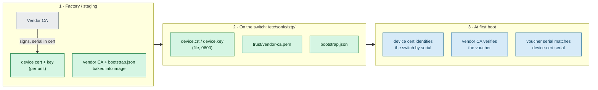
*Figure 13 : Phase-1 realization: a per-unit device certificate and CA files stand in for the TPM.*

#### Step 1: Factory or Staging Provisioning

During manufacturing or staging:

- A unique certificate and private key are generated for each switch.
- The device serial number is embedded into the certificate Subject or SAN.
- The certificate is signed by the Vendor CA.
- The SONiC image is prepared with:
  - Vendor CA certificate
  - Optional Operator CA certificate
  - `bootstrap.json` trust plane

#### Step 2: Files Installed on the Device

The device receives the following files:

```text
/etc/sonic/tztp/
├── device.crt
├── device.key
├── trust/
│   └── vendor-ca.pem
└── bootstrap.json
```

##### File Security
```text
device.key
Owner: root
Permissions: 0600
```

This ensures only privileged processes can access the private key.

#### Step 3: First Boot Validation

During onboarding:

1. The device certificate identifies the switch.
2. The Vendor CA validates the ownership voucher.
3. The voucher contains the expected device serial number.
4. The switch verifies that:
   - Voucher serial number matches device certificate serial number.
5. Secure onboarding proceeds only if validation succeeds.


**Phase 1 Trust Flow**

```text
Factory / Staging
-----------------
Vendor CA
     |
     +--> Signs Device Certificate
     |
     +--> Vendor CA + bootstrap.json
          embedded into image


Device Files
------------
device.crt
device.key
vendor-ca.pem
bootstrap.json


First Boot
----------
device certificate identifies switch
           |
vendor-ca verifies ownership voucher
           |
voucher serial matches device serial
           |
secure onboarding continues
```
---

### 18. Appendix D : Device Configuration using Voucher Anchor Mode

#### Overview
In RFC 8572 (Secure Zero Touch Provisioning / SZTP), the Voucher-anchor trust mode is one of the method a brand-new network device uses to trust an on-premise Bootstrap Server. This mode is designed for "blind deployment" scenarios, where the network device has never met its owner's server before. Instead of relying on pre-installed server certificates, the device relies on a Voucher signed by the manufacturer to establish a dynamic chain of trust.

#### How it works
When a device boots up in a factory-default state, it has no idea who its owner is. It cannot verify the local Bootstrap Server's standard SSL/TLS certificate because it does not possess the owner’s root CA. To solve this, trust is proxied through the device Manufacturer. Switch uses a mix of hardware identities and manufacturer-signed digital tickets called Vouchers to prove ownership, by following below steps.

##### Step 1: The Hardware Identity (IDevID)
When a switch leaves the factory, the manufacturer burns a unique identity directly into the TPM 2.0 silicon. 
- This identity includes a Private Key (locked inside the TPM chip) and a matching Public Key Certificate.
- This is called the Initial Device Identifier (IDevID).
- It includes the switch’s exact Serial Number and is signed by the manufacturer's global root certificate authority (CA).

##### Step 2: The Owner Claims the Switch (Offline Setup)
When user purchase the switch, the manufacturer registers its serial number to user's account on their portal. 
- User shall provide the manufacturer with their company's public certificate, called the Pinned-Domain Certificate (PDC). 
- The manufacturer creates a digital file called an Ownership Voucher (OV). 
- Inside this voucher, the manufacturer states: "We built switch serial #12345, and it now officially belongs to Company XYZ's public key." 
- The manufacturer cryptographically signs this voucher using their own private key and gives it to user. User shall place it on their Bootstrap server.

##### Step 3: The Cryptographic Handshake (During Boot)
When the switch boots up empty in user's data centre, it performs a 4-step validation sequence to establish total trust:


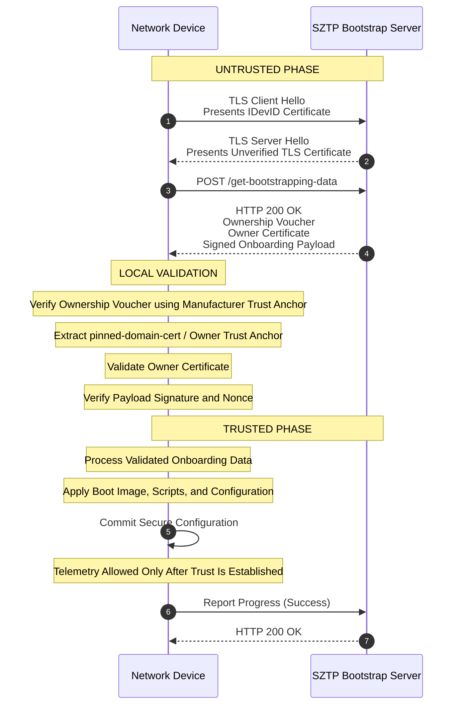
*Figure 14 : Untrusted-to-Trusted SZTP Bootstrap Workflow*

**Step 1 & 2: The Initial Untrusted TLS Session**
- The switch boots, receives Option 143 via DHCP, and opens a connection to user's central Bootstrap server. 
- The device sends a TLS Client Hello presenting its hardware-baked IDevID certificate (signed by the TPM).
- The Bootstrap server verifies that the certificate is legitimate and then responds with its TLS certificate. At this moment, the device cannot verify this server certificate. However, the protocol allows the device to provisionally proceed with the TLS session anyway to fetch the necessary trust artifacts.

**Step 3 & 4: Fetching the Bootstrapping Artifacts**
- Operating over this provisionally encrypted, yet unverified TLS connection, the device sends a RESTCONF POST request to the /get-bootstrapping-data endpoint.
- The Bootstrap Server responds with an ietf-sztp-bootstrap-server container containing three tightly linked components:
  	- The Ownership Voucher: Signed by the manufacturer. 
  	- The Owner Certificate: The server's identity certificate.
  	- The Onboarding Information: The encrypted configuration files and scripts.
  	- How They Work Together During Bootstrapping:
  	  	1. The Ownership Voucher tells the switch: "_The manufacturer confirms that Public Key X belongs to user's rightful owner._"
  	  	2. The Owner Certificate tells the switch: "_Here is the full X.509 certificate for Public Key X so user can verify the signature over the onboarding payload._"
  	  	3. The Onboarding Data Signature proves to the switch: "_The entity holding the private key corresponding to Public Key X created this configuration payload._"

**Step 5: Chain of Trust Validation (Inside the Switch)**
The switch receives this payload and must validate it without relying on external internet connections:
- Validation A (Trusting the Voucher): The switch’s local OS contains an immutable public key for its own manufacturer. It checks the signature on the Ownership Voucher. Because it matches the manufacturer, the switch instantly trusts the voucher.
- Validation B (Learning the Owner): The switch reads the trusted voucher. It finds the Pinned-Domain Certificate inside it. The switch now thinks: "Ah! The manufacturer says I belong to Company XYZ. This is their public key."
- Validation C (Trusting the Configuration): The switch uses this newly acquired Company XYZ public key to verify the signature on your Config JSON/Scripts.

If all cryptographic checks pass, the session transitions into the **Trusted Phase**.

**Step 6: Execution and Progress Reporting**
- Now that the server is authenticated, the device trusts the Onboarding Information payload.
- The device processes the configuration, executes scripts, and installs required OS images.
- Finally, it uses the secure channel to send a formal progress report back to the server, confirming the setup succeeded.


### Stakeholder (Switch, Vendor/Manufacturer, Operator) Security Artifacts:

In voucher-anchor mode, transport-level security alone is insufficient (e.g., the bootstrap server uses an operator domain CA not trusted by the switch, or data is delivered via untrusted channels/redirects). Trust is established at the payload level using an Ownership Voucher signed by the manufacturer's signing authority (MASA).

**Switch (Device):**
- IDevID Certificate & Private Key: Used for mTLS client authentication and to identify its unique serial number.
- Manufacturer / MASA Trust Anchor: Pre-installed root CA certificate used specifically to cryptographically verify the Ownership Voucher issued by the manufacturer.

**Manufacturer (MASA - Manufacturer Authorized Signing Authority):**
- MASA Private Key & Certificate: Used to sign generated RFC 8366 Ownership Vouchers for devices.
- Device Sales/Ownership Records: Maps physical device serial numbers / IDevID details to specific customer orders.

**Operator:**
- Ownership Voucher: Signed by the MASA, linking the specific switch serial number to the operator's Pinned Domain Certificate (PDC).
- Owner Certificate & Private Key: Issued by the operator's internal domain CA, matching the PDC pinned inside the ownership voucher.
- Signed Conveyed Information (Payload): The onboarding payload (configurations, scripts, image paths) wrapped in a Cryptographic Message Syntax (CMS) signature created using the operator's Owner Private Key.
- Server TLS Certificate & Private Key: Standard server certificate used to encrypt the RESTCONF transport stream (does not need to be trusted by the switch beforehand in this mode).

---

### 19. Appendix E : Device Configuration using Trusted Server Mode

#### Overview
The below sequence illustrates how a network device securely onboards through **RFC 8572 Secure Zero Touch Provisioning (SZTP)** by establishing mutual trust with a Trusted Bootstrap Server, retrieving onboarding information, executing provisioning tasks, and reporting progress throughout the process in Trusted Server (Direct) mode.

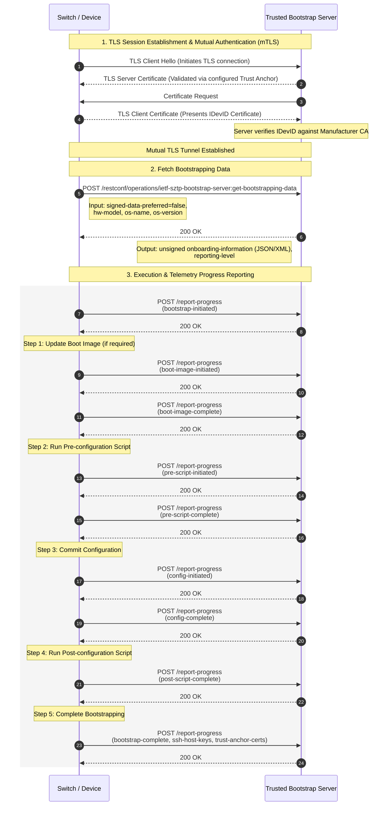
*Figure 15 : Trusted Bootstrap Server Onboarding Workflow (mTLS-Based)*
	
#### 1. TLS Session Establishment and Mutual Authentication (mTLS)
Before any provisioning data is exchanged, both the device and the bootstrap server authenticate each other using certificates.

##### Sequence
1. Device initiates a TLS connection (`Client Hello`).
2. Bootstrap Server presents its TLS server certificate.
3. Device validates the server certificate using a trusted CA anchor.
4. Server requests a client certificate.
5. Device presents its **IDevID (Initial Device Identity)** certificate.
6. Bootstrap Server validates the IDevID against the manufacturer CA.
7. A secure **Mutual TLS (mTLS)** tunnel is established.

##### Security Objective
- Authenticate the bootstrap server.
- Authenticate the device using hardware-bound identity.
- Protect all subsequent provisioning traffic with encryption and integrity.

#### 2. Fetch Bootstrapping Data
Once the secure channel is established, the device requests onboarding information.

##### Device Request
The device sends a:
```text
get-bootstrapping-data
```
Including:
- Hardware model
- Operating system name
- Operating system version
- Provisioning preferences

##### Server Response
The Bootstrap Server returns:
- Onboarding information
- Provisioning instructions
- Reporting parameters

##### Security Objective
- Deliver authenticated provisioning data.
- Ensure bootstrap information is exchanged only over the trusted mTLS channel.

#### 3. Provisioning Execution and Telemetry Reporting
The device executes the onboarding workflow while continuously reporting progress to the Bootstrap Server.

##### Bootstrap Initiation
```text
report-progress
bootstrap-initiated
```
##### Step 1: Update Boot Image (Optional)
The device updates its software image if required.

##### Progress Events
```text
boot-image-initiated
boot-image-complete
```

##### Purpose
- Install or upgrade the required NOS image.
- Ensure the device runs the expected software version.

##### Step 2: Run Pre-Configuration Script
The device executes any prerequisite setup actions.

#### Progress Events
```text
pre-script-initiated
pre-script-complete
```

##### Purpose
- Perform preparatory tasks.
- Configure dependencies before applying the main configuration.

##### Step 3: Commit Configuration
The device applies the intended operational configuration.

##### Progress Events
```text
config-initiated
config-complete
```

##### Purpose
- Configure interfaces, protocols, credentials, and services.
- Bring the device into the desired operational state.

##### Step 4: Run Post-Configuration Script
Additional deployment actions are executed after configuration is applied.

##### Progress Events
```text
post-script-complete
```

##### Purpose
- Perform validation checks.
- Execute post-deployment customization tasks.

##### Step 5: Complete Bootstrapping
The device reports successful completion of provisioning.

##### Final Progress Report
```text
bootstrap-complete
ssh-host-keys
trust-anchor-certs
```
##### Purpose
- Confirm successful onboarding.
- Provide operational trust information to the Bootstrap Server.

### Stakeholder (Switch, Vendor/Manufacturer, Operator) Security Artifacts:
In trusted-server mode, the switch relies directly on transport-layer security (TLS mTLS authentication). The switch trusts the bootstrap server because the server's TLS certificate is signed by a CA that the switch already trusts (typically the manufacturer's CA or a pre-configured CA trust anchor).

**Switch (Device):**
- IDevID Certificate & Private Key: Initial Device Identifier (factory-installed X.509 certificate and private key, typically protected by a TPM/Secure Element) used to authenticate itself to the bootstrap server via mTLS.
- Manufacturer Trust Anchor (CA Certificate): Pre-installed root/intermediate CA certificate(s) used to authenticate the TLS certificate presented by the manufacturer's or operator's bootstrap server.

**Manufacturer:**
- Manufacturer CA (Root/Intermediate): Private key and public certificate used to issue IDevID certificates for devices and to issue/sign server TLS certificates for trusted bootstrap servers.

**Operator:**
- Server TLS Certificate & Private Key: Issued by a CA chain that resolves back to the manufacturer's trust anchor stored on the switch.
- Bootstrapping Data / Conveyed Information: The unsigned payload containing onboarding instructions (boot image download URIs, hashes, pre/post-configuration scripts, initial NOS configuration).
- Device Identity Records: List of allowed serial numbers / IDevID identities for mTLS client authorization.

---
