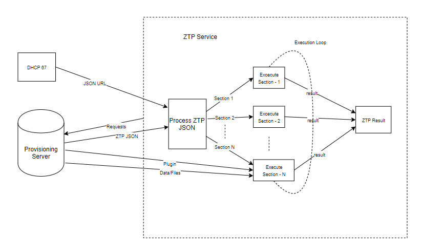
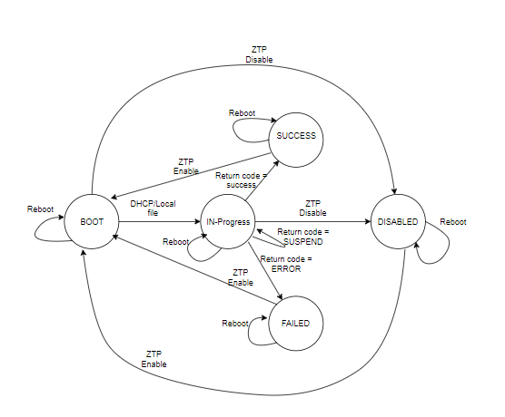
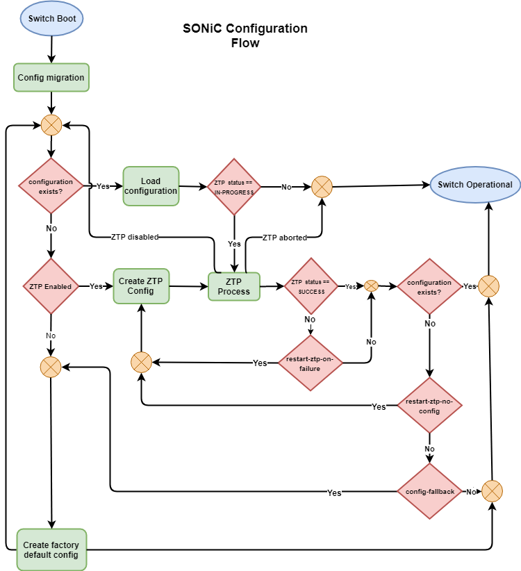

# Zero Touch Provisioning (ZTP)

### Rev 0.9

## Table of Contents
- [1. Revision](#1-revision)
- [2. Requirements](#2-requirements)
- [3. Functional Description](#3-functional-description)
  - [3.1 ZTP JSON](#31-ztp-json)
  - [3.2 ZTP Plugins](#32-ztp-plugins)
  - [3.3 Dynamic Content](#33-dynamic-content)
  - [3.4 DHCP Options](#34-dhcp-options)
  - [3.5 ZTP Service](#35-ztp-service)
  - [3.6 Start and exit conditions](#36-start-and-exit-conditions)
  - [3.7 Provisioning over in-band network](#37-provisioning-over-in-band-network)
  - [3.8 Component Interactions](#38-components-interactions)
- [4. Chronology of Events](#4-chronology-of-events)
  - [4.1 SONiC ZTP Flow Diagram](#41-sonic-ztp-flow-diagram)
- [5. Security Considerations](#5-security-considerations)
- [6. Configuring ZTP](#6-configuring-ztp)
  - [6.1 Show Commands](#61-show-commands)
  - [6.2 Configuration Commands](#62-configuration-commands)
- [7. Code Structure](#7-code-structure)
- [8. Logging](#8-logging)
- [9. Debug](#9-debug)
- [10. Examples](#10-examples)
- [11. Future](#11-future)
- [12. ZTP Test Suite](#12-ztp-feature-test-suite)

## 1. Revision
| Rev | Date     |  Author       | Change Description                |
|:---:|:------------:|:------------------:|-----------------------------------|
| v0.1 |   03/06/2019   |   Rajendra Dendukuri   | Initial version                   |
| v0.2 | 04/17/2019 | Rajendra Dendukuri | Added: suspend-exit-code, in-band provisioning, interaction with updategraph, Test plan |
| v0.9 | 09/17/2019 | Rajendra Dendukuri | Update the design document as per the ZTP code |


## 2. Requirements
1. When a newly deployed SONiC switch boots for the first time, it must allow automatic setup of the switch without any user intervention. This framework is called  as Zero Touch Provisioning or in short ZTP.
2. DHCP offer sent to a SONiC switch will kickstart ZTP. Unless ZTP is disabled by user, it must wait forever till provisioning of the switch is completed. 
3. ZTP must allow users to perform one or more configuration tasks. Data and logic used for these configuration task can be defined by the user. It must also allow ordering of these configuration tasks as defined by the user. This information is represented as in JSON format. DHCP option (67) in the DHCP offer contains the url to the  JSON file. This allows ZTP to download and process the data to execute the described configuration tasks. 
4. ZTP should allow users to suspend a configuration task and move on to the next one. ZTP resumes the incomplete task later after finishing rest of the tasks in the order of execution. The *suspend-exit-code* object is used to for this feature.
5. Switch reboots during ZTP must be supported. ZTP should resume from where it had left prior to reboot.
6. Configuration tasks must be completely user defined. Few predefined tasks shall be provided as part of default switch image. However, user must be able to override the logic of predefined tasks with user supplied logic (script).
7. Pre-defined configuration tasks to download and apply Config DB JSON, SNMP community string, download, validate and install/remove of a SONiC firmware image must be included as part of ZTP.
8. ZTP should allow user to download and execute a single provisioning script as a secondary alternative to defining a workflow using  a JSON file.  A different DHCP option (239) should be used to specify the url string for the provisioning script.
9. ZTP must be backward compatible with the legacy SONiC provisioning solution using updategraph service. It must provide a provision to download and apply minigraph.xml and acl.json.
10. ZTP service must not block other switch applications from continuing to boot. As part of configuration tasks appropriate action (e.g restart service)  is taken to apply the configuration required by switch applications.
11. ZTP must include switch information while requesting for files from a remote provisioning server. This allows remote server to provide switch specific files at runtime. The information must include switch Product-Name, switch Serial-Number, SONiC software version running on the switch and Base-MAC-Address. HTTP headers are used to send this information.
12. While specifying url strings to files that can be downloaded from a remote server, ZTP must allow options to construct url string at runtime using switch information. This allows a switch to request for a file that is appropriate for it from the remote provisioning server. The information used to construct the url string includes switch Product-Name, switch Serial-Number, SONiC software version running on the switch and Base-MAC-Address. The *dynamic-url* object is used to satisfy this requirement.
13. ZTP must support HTTP, HTTPS, TFTP, FTP and scp protocols over IPv4 and IPv6 transport to request files from a remote provisioning server. This includes JSON file and provisioning scripts.
14. ZTP output and result must be logged through syslog and a local file. User must be able to configure ZTP in debug mode to see more verbose output of ZTP process.
15. ZTP is expected to run to completion only after all the configuration tasks are completed. Result is either SUCCESS/FAILED. At this point ZTP exits and does not run again. It requires user intervention to re-enable ZTP.
16. ZTP must provide an option to user to ignore result of configuration tasks to determine the result (SUCCESS/FAILED) of ZTP. The *ignore-result* object is used to specify this option.
17. ZTP should provide an option to user to reboot the switch when a configuration task succeeds or fails. The *reboot-on-success* and *reboot-on-failure* objects are used to specify this option.
18. When an error is encountered in a configuration task, ZTP must provide an option to the user to stop execution of more configuration tasks.  User intervention is required to inspect and re-start ZTP.  The *halt-on-failure* object is used to specify this option.
19. Manual interruption of ZTP service must be allowed. It must result in ZTP to be disabled and user intervention is needed to re-enable it. The commands ztp enable/ztp disable/ztp run are used to perform this operation.
20. ZTP status command issue by user must include completion status of each configuration task and ZTP completion status as a whole. A date/timestamp is also recorded when each configuration tasks status has changed.
21. All files created during a ZTP session must be stored in a persistent location for user to inspect. When a new ZTP session is started, this data is deleted. */var/lib/ztp* is the location where this data is stored.
22. ZTP feature must be a build time selection option. By default it is not included in the image.
23. Provide optional security features to allow encryption and authentication while exchanging sensitive information between the switch and remote provisioning server.
24. ZTP must be able to provisioning the switch over in-band network in addition to out-of-band management network. The first interface to provide provisioning data will be used and any provisioning data provided by other interfaces is ignored. 
25. Both IPv4 and IPv6 DHCP discovery and ZTP provisioning should be supported.

## 3. Functional Description

Zero Touch Provisioning (ZTP) service can be used by users to configure a fleet of switches using common configuration templates. Switches booting from factory default state should be able to communicate with remote provisioning server and download  relevant configuration files and scripts to kick start more complex configuration steps. ZTP service takes user input in JSON format.

## 3.1 ZTP JSON

SONiC consists of many pre-installed software modules that are part of default image. Some of these modules are network protocol applications (e.g FRR) and some provide support services (e.g syslog, DNS). Data and logic to configure various SONiC modules is encoded in a user defined input file in JSON format. This data file is referred to as ZTP JSON.

When SONiC switch boots for first time, ZTP service checks if there is an existing ZTP JSON file. If no such file exists, DHCP Option 67 value is used to obtain the URL of ZTP JSON file. ZTP service then downloads the ZTP JSON file and processes the file. If DHCP Option 67 value is not available, ZTP service waits forever till it is provided by the DHCP server. Other switch services include SWSS continue to boot.

If a ZTP JSON file is already present on the switch,  ZTP service uses it to perform next steps.

Typically in a ZTP JSON file multiple configuration sections are defined by user. They are all enclosed within ztp object. Below example has four configuration sections *snmp*, *firmware*, *provisioning-script* and *configdb-json* which are included as value of *ztp* object. The overarching ztp object also has *status* and *timestamp* objects which specify the progress of whole ZTP service. It is mandatory to have *ztp* object defined as the first object and rest of the objects are nested under it. ZTP service will not parse the JSON data if *ztp* object is not found.

```json
{
  "ztp": {
    "snmp": {
	
	},
    "firmware": {
	
	},
    "provisioning-script": {
	
	},
    "configdb-json": {
	
	}
  }
}
```

Below is an example configuration section  used for configuring SNMP community string on the switch.

```json
  "snmp": {
    "ignore-result": false,
    "community-ro":  "public",
    "snmp-location": "ny-t32-r02"
  }
```

Each section has a unique name, *snmp* in above example. It provides sufficient data to configure a single or a set of modules on the switch. In the *snmp* example, the read write SNMP community string and SNMP location are provided as values of the  *community-ro* and *snmp-location* objects. ZTP service invokes the logic which takes these values and adds them to "/etc/sonic/snmp.yml" file and restarts SNMP daemon.

Also each configuration section of ZTP JSON includes some common objects that are used to influence its execution. They also help track progress of individual section and the entire ZTP activity.

- **status** : Describes the state of configuration of the section.

  - BOOT   - Provided configuration is not yet applied
  - IN-PROGRESS  - Provided configuration is currently being applied by the ZTP service
  - SUCCESS - Provided configuration is successfully applied by the ZTP service
  - FAILED - ZTP service encountered an error and failed to apply provided configuration
  - SUSPEND - Provided configuration is currently suspended and will retried by the ZTP service later
  - DISABLED - ZTP service will not apply provided configuration in this section

  Default value assumed to be BOOT if the object is not present. ZTP service adds this object to the ZTP JSON file if not found.

- **description**: Optional free from textual string used to describe a configuration section defined in the ZTP JSON file.
  
- **exit-code**: Indicates the program exit code obtained after processing the configuration section.
  
- **ignore-result** :
  
  - false  - ZTP service marks status as FAILED if an error is encountered while processing this individual section
- true   - ZTP service marks status as SUCCESS even if an error is encountered while processing this individual section
  

Default value is assumed to be *false* if the object is not present.

- **start-timestamp** : Specifies the time and date when ZTP service began processing the configuration section. This object is also available for the top level ztp section and it indicates the time and date when ZTP service started. This object is used to calculate the processing time. ZTP service adds this object to the ZTP JSON file 

- **timestamp** : Specifies the time and date when the *status* variable of a section is modified.

  ZTP service adds this object to the ZTP JSON file and it need not be added by user.

- **suspend-exit-code**: Specifies the program exit code value to indicate that configuration section can be placed in suspended mode and retried later. See [*Plugin Exit Code*](#322-plugin-exit-code) for additional information

  This object is optional for a configuration section. Possible values are non-zero positive integers. If any other values specified are treated as the case where object is not specified.

- **reboot-on-success** :

  - true  - If configuration section result is  SUCCESS, ZTP service reboots the switch
  - false - ZTP services moves on to next configuration section

  Default value is assumed to be *false* if the object is not present.

- **reboot-on-failure** :
  - true  - If configuration section result is FAILURE, ZTP service reboots the switch
  - false - ZTP services moves on to next configuration section

  Default value is assumed to be *false* if the object is not present.

- **halt-on-failure** :
  - true  - If configuration section result is FAILED, ZTP service stops and exits immediately marking *ztp.status* as FAILED. No other configuration sections are processed. User intervention is needed to restart ZTP.
  - false - ZTP services moves on to next configuration section

  Default value is assumed to be *false* if the object is not present.

- **restart-ztp-on-failure**:

  - true - ZTP procedure is restarted if the result of ZTP is FAILED after processing all of the configuration sections defined in the ZTP JSON file.
- false - ZTP service exits after processing all of the configuration sections defined in the ZTP JSON file.
  
  Default value is assumed to be false if the object is not present.
  
  This object is applicable only for the top level *ztp* object in the ZTP JSON file.
  
- **restart-ztp-no-config**:

  - true - ZTP procedure is restarted if the configuration file */etc/sonic/config_db.json* is not present after the completion of processing the configuration sections defined in the ZTP JSON file.
  - false - ZTP service exits after processing all of the configuration sections defined in the ZTP JSON file even if the configuration file  */etc/sonic/config_db.json* is not present.

  Default value is assumed to be true if the object is not present.

  This object is applicable only for the top level *ztp* object in the ZTP JSON file.

- **config-fallback**:

  - true - Factory default configuration is generated if the configuration file */etc/sonic/config_db.json* is not present after the completion of processing the configuration sections defined in the ZTP JSON file.
- false - ZTP service takes action based on the value of the object *restart-ztp-no-config*.
  
  Default value is assumed to be false if the object is not present.
  
  This object is applicable only for the top level *ztp* object in the ZTP JSON file.
  
- **ztp-json-version**: This object defines the version of the ZTP JSON file. This object can be used in future to perform ZTP JSON data migration between different old and newer versions of sonic-ztp package. If not set by the user, the ZTP service assigns a value to it specifying the version number that is compliant with the current version of the ZTP service. This object is applicable only for the top level *ztp* object in the ZTP JSON file.

- **ztp-json-source** : This object defines the source from which the ZTP JSON file was downloaded from. It also indicates the interface from which ZTP JSON file URL was learnt. This object is applicable only for the top level *ztp* object in the ZTP JSON file. The following are the possible values this object can have:

  - dhcp-opt67  - ZTP service downloaded the ZTP JSON file using the URL specified in the DHCP option 67 received by the switch when it obtained an IP address. 

  - dhcp6-opt59 - ZTP service downloaded the ZTP JSON file using the URL specified in the DHCPv6 option 59 received by the switch when it obtained an IPv6 address.  
  
  - dhcp-opt239 - ZTP service downloaded the provisioning script using the URL specified in the DHCP option 239 received by the switch when it obtained an IP address.
  
  - dhcp6-opt239 - ZTP service downloaded the provisioning script using the URL specified in the DHCPv6 option 239 received by the switch when it obtained an IPv6 address.
  
  - dhcp-opt225-graph-url - ZTP service downloaded the minigraph.xml file using the URL specified in the DHCP option 225 received by the switch when it obtained an IPv6 address.
  
  - local-fs - This value indicates that the ZTP JSON file has been included in the  SONiC image as part of the build. This option can be used in scenarios where a DHCP server is not present and initial configuration steps need to be performed on the switch on boot.
  
    


Configuration sections in ZTP JSON are processed by ZTP service in lexical order of section names. In order to force execution order, names in xxx-name format (e.g 001-firmware) can be used. For predefined plugins leading sequence number is stripped off to find appropriate plugin. So 001-firmware configuration section will be processed internally using firmware plugin. More on plugins in the [*ZTP plugins*](#32-ztp-plugins) section.

ZTP service exits and marks the status as FAILED if any errors are encountered while parsing the ZTP JSON file. It is encouraged to check for any JSON format correctness before rolling out the ZTP JSON file for use. When processing a configuration section, If provided data is found to be insufficient, it is marked as failed and ZTP moves on to next section.

## 3.2 ZTP Plugins

Each section of ZTP JSON data is processed by corresponding handler which can understand the objects/values of that section using a predefined logic. This handler is referred to as a plugin. Plugins are executable files, mostly scripts, which take  objects/values described in corresponding configuration section as input. For e.g the "snmp" section is processed by the snmp plugin provided by SONiC-ZTP package. For plugins provided by SONiC-ZTP package, it is mandatory that the name of the configuration section matches the plugin file name. Predefined plugins can be found in the directory "/usr/lib/ztp/plugins".

### 3.2.1 User Defined Plugins

SONiC ZTP allows users to specify custom configuration sections and provide corresponding plugin executable. ZTP service downloads the plugin and uses it to process objects/values specified in the configuration section. This allows users to extend ZTP functionality in ways that suit their environment and deployment needs. For better compatibility with input data, users are encouraged to use executables which can process JSON formatted data.

Below is an example section of ZTP JSON data which is used to configure SNMP communities on a switch. The *plugin* object defines the usage of user defined plugin. In this example, user provided *my-snmp.py* file is downloaded using the url indicated by the *plugin.url.source* field. The plugin is copied locally as the file "/var/run/ztp/plugins/my-snmp" on SONiC switch and executed by ZTP service. If *plugin.url.destination* is not provided, the downloaded plugin is saved as */var/lib/ztp/sections/'section-name'/plugin*.

```json
  "snmp": {
    "ignore-result": false,
    "plugin": {
      "url": {
        "source": "http://192.168.1.1:8080/my-snmp.py",
        "destination": "/var/run/ztp/plugins/my-snmp"
      }
    },
    "community-ro": [
      "public",
      "local"
    ],
    "community-rw": [
      "private"
    ]
  }
```
User defined plugins are downloaded only once during a ZTP service. If the destination file already exists locally, the plugin is not downloaded again. It is recommended to not use *plugin.url.destination* and allow ZTP to download a plugin file to temporary storage. The temporary storage is cleared when a new ZTP session starts and is also guaranteed not to conflict with plugins used in other configuration sections.

### 3.2.2 Plugin Exit Code

Both predefined and user-defined plugins are executed as a sub process by the ZTP service. The exit code of the executed plugin is used by ZTP service to determine next steps. The value of *suspend-exit-code* is specified in configuration section's data. 

|Exit Code |  Description         | Action                                       |
|:------------|:-------------------|:-------------------------------------------------|
|   0      | SUCCESS     | Plugin completed intended operation successfully. *status* of the configuration section is set to value SUCCESS.  |
|   *suspend-exit-code*   | SUSPEND     | Plugin exited after partial execution. *status* of the configuration section is set as SUSPEND |
|   > 0 and !=*suspend-exit-code*   | FAILED     | An error was encountered while executing the plugin. *status* of the configuration section is set to value FAILED.  |

When using *suspend-exit-code*, the corresponding plugin should ensure that when ZTP service comes back to execute the plugin again, appropriate logic is implemented within the plugin to resume from where it had left earlier. If *suspend-exit-code* is not specified, suspend and resume feature for the plugin is not supported.

### 3.2.3 Available Plugins and Configuration Sections

More information on supported configuration sections of ZTP JSON file and plugins used to process it can be obtained in this section.

#### url object

This object is used to describe a file that can be downloaded from a remote location. The source URL is provided by the *url.source* object value. Full path of file name on the switch where it is intended to be copied to is specified in *url.destination* object value. When *url.destination* is specified, all directories in the file path are also created. *url.source* field is mandatory and rest of them are optional.

```json
  "url": {
    "source": "http://192.168.1.1:8080/spine01_config_db.json",
    "destination": "/etc/sonic/config_db.json",
    "secure": false
  }
```

When *url.destination* is not specified, the destination location and filename are determined by the plugin which is processing the url object.

Curl application is used to download the file. Please refer to [curl manual](https://curl.haxx.se/docs/manual.html "curl manual") for supported protocols.

It is to be noted that the *source* string defined in the url object is a static string. When this object is processed, the same file is downloaded for all switches using the same ZTP JSON data. It may not be ideal for files which are intended to be unique for a particular switch, e.g config_db.json. Please refer to section [3.3 Dynamic Content](#33-dynamic-content)  for more information on how this problem is solved.

Following is the list of objects supported by url object. Also provided is brief description of their usage, values that can be assigned and the default value assumed when the object is not used.

|  Object |Usage   |Supported Values| Default Value|
| ------------ | ------------ | ------------ | ------------ |
| source  | Define the URL string from where file has to be downloaded  |Syntactically valid URL|N/A|
|  destination | Destination file on switch  | Unix file name | Resolved by plugin|
| secure  | Use insecure mode. This can be used to skip security checks when using HTTPS transport.  | false <br> true| true|
|  curl-arguments | Arguments to curl command used to download the url  | Refer to [curl manual](https://curl.haxx.se/docs/manual.html "curl manual"). | Null string |
|  encrypted | Indicates the file being downloaded in encrypted format.  | Refer to [Encryption](#511-encryption-and-authentication). | No encryption |
|  include-http-headers | To enable/disable sending of switch information as part of [HTTP Headers](#331-http-headers).   | true<br>false | true |
| timeout              | Maximum number of seconds allowed for curl to establish a connection | Valid non-zero integer | 30s |

In case there are no additional fields to be defined in *url* object and only *source* is being defined, *url* can be specified in short hand notation.

  "url": {
    "source": "http://192.168.1.1:8080/spine01_config_db.json"
  }

can also be specified as

 "url": "http://192.168.1.1:8080/spine01_config_db.json"

In general url object is used with other objects and not as an individual configuration section.

#### plugin object

The plugin object is used to describe a user-defined plugin that needs to be used to process a configuration section.

In below example, SONiC ZTP package provided *config-db-json* plugin is being used by the *initial-config* section to download and apply initial configuration.

```json
  "initial-config": {
    "plugin": {
      "name": "config-db-json"
    },
    "url": {
      "source": "http://192.168.1.1:8080/spine01_first_boot_config.json",
      "destination": "/etc/sonic/config_db.json",
      "secure": false
    }
  }
```

Following is the list of objects supported by plugin object. Also provided is brief description of their usage, values that can be assigned and the default value assumed when the object is not used.

|  Object |Usage   |Supported Values| Default Value|
| :----------- | ------------ | ------------ | ------------ |
| url  | Define the URL string from where plugin has to be downloaded in the form of url object  |Refer to [url object](#url-object)  |Name of enclosing object |
| dynamic-url  | Define the URL string from where plugin has to be downloaded in the form of url object  |Refer to [dynamic-url object](#332-dynamic-url-object)  |Name of enclosing object |
|  name | Use a predefined plugin available as part of SONiC ZTP package  | Predefined plugins | Name of enclosing object|
| shell | Use this to specify if the plugin has to be executed through the shell. For more information refer to the shell option of python [subprocess](https://docs.python.org/3/library/subprocess.html) library. | true <br>false | false |
| ignore-section-data | Use this to specify if section data read from the configuration section of the plugin should not be passed as the first argument to plugin command | true<br>false | false |
| args | Defines argument string that can be passed as an argument to the plugin command. The *ignore-section-data* object needs to be set to true if the plugin command is expecting only the argument string as part of the command. | Valid command arguments                                | Null string |

*plugin.dyrnamic-url* takes precedence over *plugin.url* over *plugin.name* if multiple definitions are defined.

A short hand notation is possible using 'plugin': 'name' which is equivalent of defining *name* objected nested inside *plugin* object.

```json
    "plugin": {
      "name": "configdb-json"
    }
```
can be written in short hand notation as

```json
    "plugin": "configdb-json"
```

#### configdb-json

The *configdb-json* plugin is used to download ConfigDB JSON file and apply the configuration. A *config reload* is performed during which various SWSS services may restart.

```json
  "configdb-json": {
    "url": {
      "source": "http://192.168.1.1:8080/spine01_config_db.json",
      "destination": "/etc/sonic/config_db.json"
    }
  }
```


Following is the list of objects supported by the configdb-json object. Also provided is brief description of their usage, values that can be assigned and the default value assumed when the object is not used.

| Object       | Usage                                                        | Supported Values                                       | Default Value |
| :----------- | ------------------------------------------------------------ | ------------------------------------------------------ | ------------- |
| url          | Define the URL string from where the config_db.json file has to be downloaded in the form of url object | Refer to [url object](#url-object)                     | N/A           |
| dynamic-url  | Define the URL string from where the config_db.json file has to be downloaded in the form of dynamic-url object | Refer to [dynamic-url object](#332-dynamic-url-object) | N/A           |
| clear-config | Use this to specify if the existing configuration has to be cleared before loading the download config_db.json file content to the Config DB. When set to true, *config reload* command is executed. When set to false, *config load* command is executed. | true<br>false                                          | true          |
| save-config  | Use this to perform a *config save* command after loading the downloaded config_db.json file. | true<br>false                                          | false         |

It is mandatory that either one of the *url* or *dynamic-url* objects are defined in configuration section. 

When configdb-json plugin is executed, the DHCP address assigned during ZTP discovery is released. So it is important that interface IP address assignment is performed as part of the provided *config_db.json* file.


#### firmware

The *firmware* plugin is used for image management on a switch. It can be used to install, remove and boot selection of images. sonic_installer utility is used by this plugin to perform the supported functions.

Example to install a new image and boot into it.

```json
  "firmware": {
    "install": {
      "url": "http://192.168.1.1:8080/broadcom-sonic-v1.0.bin",
      "set-default": true
    },
    "reboot-on-success": true
  }
```

Example to uninstall a SONiC image from the switch.

```json
  "firmware": {
    "remove": {
      "version": "SONiC-OS-brcm_xlr_gts.0-dirty-20190304.154831"
    }
  }
```

Example to install a new image only if it satisfies the pre-install verify check script provided by user.

```json
  "firmware": {
    "install": {
      "url": "http://192.168.1.1:8080/broadcom-sonic-v1.0.bin",
      "pre-check": {
        "url": {
          "source": "http://192.168.1.1:8080/firmware_check.sh",
          "destination": "/tmp/firmware_check.sh"
        }
      },
      "set-default": true
    },
    "reboot-on-success": true
  }
```


Following is the  list of objects supported by the *firmware* plugin. Also provided is brief description of their usage, values that can be assigned and the default value assumed when the object is not used.


|  Object |Usage   |Supported Values| Default Value|
| ------------ | ------------ | ------------ | ------------ |
| **install** | Used to install an image using URL |  ||
| url<br>dynamic-url | Specifies the URL string from where the firmware image file has to be downloaded in the form of url or dynamic-url object | url](#url-object) <br/>[dynamic-url](#332-dynamic-url) ||
| version | Specifies the version of the SONiC image being installed. This object is optional. | SONiC version string |N/A|
| set-default | Specifies that the firmware image being installed is selected as the default image to boot the switch from. | true<br>false |true|
| set-next-boot | Specifies that the firmware image being installed is selected as the image to boot the switch from only for one time on next reboot. | true<br/>false |false|
| skip-reboot | Specifies if a switch reboot operation is performed immediately after installing a new switch firmware image. | true<br/>false |false|
| pre-check | Specifies the URL of a user provided script to be executed before installing  the downloaded switch firmware image. The firmware installation is performed only if pre-check script result is success. | [url](#url-object) <br>[dynamic-url](#332-dynamic-url) |               |
| **remove** | Used to uninstall an existing image on the disk |  ||
| version | Specifies the version of the SONiC image to be removed. This object is mandatory. | SONiC version string |N/A|
| pre-check | Specifies the URL of a user provided script to be executed before removing the specified switch firmware image version for the disk. The firmware removal is performed only if pre-check script result is success. | [url](#url-object) <br/>[dynamic-url](#332-dynamic-url) |N/A|
| **upgrade-docker** | Used install a docker image on the SONiC switch |  |    |
| url<br>dynamic-url | Specifies the URL string from where the docker image file has to be downloaded in the form of url or dynamic-url object | [url](#url-object)<br/>[dynamic-url](#332-dynamic-url) | |
| container-name | Name of the docker image being upgrade | Supported docker container names (e.g swss) |  |
| cleanup-image | Clean up old docker image while installing new docker image | true<br>false | false |
| enforce-check | Enforce pending task check for docker upgrade | true<br>false | false |
| tag | Specify a tag to the newly installed docker image | Valid string | Null string |
| pre-check | Specifies the URL of a user provided script to be executed before installing the specified docker container. The docker image installation is performed only if pre-check script result is success. | [url](#url-object) <br/>[dynamic-url](#332-dynamic-url) | N/A |

The *pre-check* object is used to specify a user provided script to be executed. If the result of the script is successful, the action (install/remove) is performed. Its value is a *url object*.

*firmware.remove* is first processed followed by *firmware.install* if both are defined.

#### connectivity-check

The *connectivity-check* plugin is used to ping a remote host and verify if the switch is able to reach the remote host. It is possible to ping multiple hosts and the plugin result is marked as failed even if ping to one of the specified host fails.


```json
     "connectivity-check" : {
      "ping-hosts" : [ "192.168.1.1", "172.10.1.1" ]
     }
```


Following is the list of objects supported by the connectivity-check plugin. Also provided is brief description of their usage, values that can be assigned and the default value assumed when the object is not used.


| Object         | Usage                                                        | Supported Values             | Default Value |
| :------------- | ------------------------------------------------------------ | ---------------------------- | ------------- |
| ping-hosts     | List of IPv4 hosts to ping                                   | N/A                          | N/A           |
| ping6-hosts    | List of IPv6 hosts to ping                                   | N/A                          | N/A           |
| retry-interval | Specify a timeout, in seconds, before retrying ping to a host. | Valid non-zero integer value | 5 seconds     |
| retry-count    | Stop ping to a ping host and move on to the next host specified in the list. | Valid non-zero integer value | 12            |
| ping-count     | Stop after sending *count* ECHO_REQUEST packets. With *deadline* option, ping waits for *count* ECHO_REPLY packets, until the timeout expires. | Valid non-zero integer value | 3             |
| deadline       | Specify a timeout, in seconds, before ping exits regardless of how many packets have been sent or received. In this case ping does not stop after *count* packet are sent, it waits either for *deadline* expire or until *count* probes are answered or for some error notification from network. | Valid non-zero integer value | N/A           |
| timeout        | Time to wait for a response, in seconds. The option affects only timeout in absense of any responses, otherwise ping waits for two RTTs. | Valid non-zero integer value | N/A           |


#### snmp

The *snmp* plugin is used to configure SNMP community string on SONiC switch. This plugin is provided as an alternative for soon to be deprecated privately used DHCP options 224 used by SONiC.

```json
  "snmp": {
    "community-ro": "public",
    "snmp-location": "dnv-r10-t01"
  }
```

Following is the  list of objects supported by the *snmp* plugin. Also provided is brief description of their usage, values that can be assigned and the default value assumed when the object is not used. The snmp plugin also restarts snmp agent daemon.

|  Object |Usage   |Supported Values| Default Value|
| ------------ | ------------ | ------------ | ------------ |
|  community-ro | SNMP read only community string | Syntactically valid SNMP community string  |Null string|
| snmp-location | SNMP location string |  Syntactically valid SNMP location string  | Null string|
| restart-agent | Restart snmp service after setting specified SNMP parameters | true <br>false | true  |

#### graphservice

The *graphservice* plugin is used to provide minigraph xml and ACL json file to be used by the SONiC switch. This plugin is provided as an alternative for soon to be deprecated privately used DHCP options 225 and 226 used by SONiC.

Example usage.

```json
  "graphservice": {
    "minigraph-url": {
      "url": "http://192.168.1.1:8080/minigraph.xml"
    },
    "acl-url": {
      "dynamic-url": {
        "source": {
          "prefix": "http://192.168.1.1:8080/acl_",
          "identifier": "hostname-fqdn",
          "sufix": ".json"
        }
      }
    }
  }
```
### 3.3 Dynamic Content

When a switch requests for a file specified by a url, it is expected that the server which is handling the request knows which file to be returned. For e.g when a switch requests for configuration file, the server needs to be able to give out configuration file for the requesting switch. This selection of the file can be done in two ways:

1. Server side - [HTTP Headers](#331-http-headers)
2. Client side - [dynamic-url](#332-dynamic-url)

#### 3.3.1 HTTP Headers

For a server to make the decision on which file to serve out, it requires uniquely identifiable information about the requesting switch.  Then, appropriate logic can be implemented at the server side to porcess the provided information, identify and give out the requested file.

All HTTP/HTTPS requests made during ZTP contain switch identification information as part of HTTP headers. Below is the information that is included.

| Header | Value          | Example                                        |
|:-----------:|:-------------------|:-------------------------------------------------|
|   User-Agent      |  SONiC-ZTP/0.1   | |
|    PRODUCT-NAME      |  *String specifying the switch model*    | E1031|
|    SERIAL-NUMBER      |   *String specifying the manufacture provided serial number*    | E1031B2F035A17GD020|
|    BASE-MAC-ADDRESS      | *Ethernet MAC Address assigned to the switch by the manufacturer*     | 00&#58;E0&#58;EC&#58;38&#58;50&#58;FB|
| SONiC-VERSION | *Version string as seen in 'show version' command* | SONiC.201811.0-20190315.181511 |

#### 3.3.2 dynamic-url

*dynamic-url* object is used in ZTP JSON to allow the url path to be constructed at runtime. This allows switch to request appropriate file instead of relying the server to interpret HTTP headers. Also since other protocol's like scp/TFTP/FTP are also supported, use of HTTP headers may not be valid.

*dynamic-url.source* field consists of three subj-obects whose values are used to construct a url string at runtime. The *identifier*  subobject is mandatory. The prefix and suffix subobjects are optional.

 - prefix  - Specifies a static string which forms the leading part of the url. This typically specifies the transfer protcol and server address. e.g http://192.168.1.1:8080/
 - identifier - Specifies the runtime logic to be used to generate the filename of the resource to be downloaded.
 - suffix - Specifies any filename extension that needs to be added for convenience.

The *prefix*, *identifier* and *suffix* are concatenated to form the url which is specific to the requesting switch.

##### identifier subobject
This subobject is used to specify the logic that is executed on the switch to determine the variable portion of the url. Some pre-defined generally used logic are provided. There is also a possibility to provide user-defined logic.

"identifier": "hostname"
"identifier": "hostname-fqdn"

Hostname of the switch is used to the identifier. Switches are assigned unique hostnames by the DHCP server. It can be used while naming files corresponding to a particular switch.

In below example all the switch configuration files are stored at the remote server using long hostname of each switch as part of filename. The long hostname of the switch where ZTP is underway is  *tor-05-pod-10.azure.us.microsoft.com*. When this object is processed by ZTP, the url string is evaluated as http://192.168.1.1:8080/configs/tor-05-pod-10.azure.us.microsoft.com_config_db.json"

```json
    "dynamic-url": {
      "source": {
        "prefix": "http://192.168.1.1:8080/configs/",
        "identifier": "hostname-fqdn",
        "suffix": "_config_db.json"
      },
      "destination": "/etc/sonic/config_db.json"
    }
```
"identifier": "serial-number"

```json
    "dynamic-url": {
      "source": {
        "prefix": "http://192.168.1.1:8080/configs/",
        "identifier": "serial-number",
        "suffix": "_config_db.json"
      },
      "destination": "/etc/sonic/config_db.json"
    }
```
"identifier": "product-name"

In below example switch model string is used to identify the image that needs to be downloaded.

```json
    "dynamic-url": {
      "source": {
        "prefix": "http://192.168.1.1:8080/images/sonic-",
        "identifier": "product-name",
        "suffix": ".bin"
      },
    }
```

"identifier": "url"
It is not possible to pre-determine the file naming convention using at the server. So a provision for running user-defined logic can be supplied as a url object. In below example user provides a script *config_filename_eval.sh* which is downloaded and executed. The output string returned by the user provided script is used as the switch's configuration file name.

```json
    "dynamic-url": {
      "source": {
        "prefix": "http://192.168.1.1:8080/configs/",
        "identifier": {
          "url": "http://192.168.1.1:8080/config_filename_eval.sh"
        },
        "suffix": ".json"
      },
      "destination": "/etc/sonic/config_db.json"
    }
```
Following is the list of objects supported by the *dynamic-url* object. Also provided is brief description of their usage, values that can be assigned and the default value assumed when the object is not used.

|  Object |Usage   |Supported Values| Default Value|
| ------------ | ------------ | ------------ | ------------ |
| source.prefix  |Leading part of url string |Syntactically valid URL|Null string|
| source.suffix  |Trailing part of url string |Acceptable characters in a syntactically valid URL|Null string|
| source.identifier  | Runtime generated string that can uniquely identify a switch  |hostname<br>hostname-fqdn<br>serial-number<br>product-name<br>sonic-version<br>[url](#url-object) |N/A|
|  destination | Destination file on switch  | Unix file name | Resolved by plugin|
| secure  | Use insecure mode. This can be used to skip security checks when using HTTPS transport.  | false <br> true| true|
|  curl-arguments | Arguments to curl command used to download the url  | Refer to [curl manual](https://curl.haxx.se/docs/manual.html "curl manual"). | Null string |
|  encrypted | Indicates the file being downloaded in encrypted format.  | Refer to [Encryption](#511-encryption-and-authentication). | No encryption |
|  include-http-headers | To enable/disable sending of switch information as part of [HTTP Headers](#331-http-headers).   | true<br>false | true |
| timeout | Maximum number of seconds allowed for curl to establish a connection | Valid non-zero integer | 30s |

### 3.4 DHCP Options
The following are the DHCP options used by the SONiC switch to receive input provisioning data for ZTP service and graphservice.

| DHCP Option | Name         | Description                                       |
|:-----------:|:-------------------|:-------------------------------------------------|
| 61 | dhcp-client-identifier | Used to uniquely identify the switch initiating DHCP request. SONiC switches set this value to "SONiC##*product-name*##*serial-no*". |
| 66 | tftp-server | TFTP-Server address |
|    67      | ztp_json_url    | URL to download the ZTP JSON file. It can also specify the ZTP JSON file path on tftp server. |
| 77 | user-class | Used to optionally identify the type or category of user or    applications it represents. SONiC switches set this value to "SONiC-ZTP". |
|     224     | snmp_community              | snmpcommunity DHCP hook updates /etc/sonic/snmp.yml file with  provided value |
|     225     | minigraph_url               | graphserviceurl DHCP hook updates the file /tmp/dhcp_graph_url with the provided url. updategraph service processes uses it for further processing. |
|     226     | acl_url                     | graphserviceurl DHCP hook updates the file /tmp/dhcp_acl_url with the provided url. updategraph service processes uses it for further processing. |
|    239      | ztp_provisioning_script_url    | URL for a script which needs to be downloaded and executed by ZTP service on the switch. |


The following are the DHCPv6 options used by the SONiC switch to receive input provisioning data for ZTP service.

| DHCPv6 Option | Name         | Description                                       |
|:-----------:|:-------------------|:-------------------------------------------------|
| 15 | user-class | Used to optionally identify the type or category of user or    applications it represents. SONiC switches set this value to  "SONiC-ZTP". |
|    59    | boot-file-url | URL to download the ZTP JSON file. |
|    239      | ztp_provisioning_script_url    | URL for a script which needs to be downloaded and executed by ZTP service on the switch. |


The use of following DHCP options will be deprecated in future releases of SONiC as its values can be included in the ZTP JSON file whose URL can be obtained via DHCP option 67.

| Deprecated <br />  DHCP Options | Name         |
|:-----------:|:-------------------|
|    224      | snmp_community     |
|    225      | minigraph_url     |
|    226      | acl_url           |

It is recommended to use either ztp_provisioning_script_url or ztp_json_url but not both. Provisioning script can be defined with in ZTP JSON file as a user defined plugin thus not requiring the need for ztp_provisioning_script_url to be used. Similarly, user can opt not to use ztp_json file and use custom scripts to perform all configuration activities. If  both options are part of DHCP offer message, ztp_json_url file shall be used and ztp_provisioning_script_url is ignored.

DHCP hook script */etc/dhcp/dhclient-exit-hooks.d/ztp*  is used to process DHCP option 67 and 239. This script is provided as part of SONiC-ZTP package.


## 3.5 ZTP Service





The ZTP service is defined as a systemd service running on native SONiC O/S. It does not run inside a container.  ZTP service starts after the *interfaces-config.service*, *rc-local.service* and *database.service*. If ZTP is not administratively enabled, the service exits and does not run again until next boot or if user intervenes. No services are not blocked for ztp.service to start or exit.


The switch tries to obtain management connectivity after it has boot up and all the connected ports are linked up. DHCP discovery is performed on all the connected in-band interfaces and the out-of-band management interface. Also, both DHCPv4 and DHCPv6 address discovery is performed. Which ever interface receives the first DHCP offer, is used as primary management interface to obtain user provided provisioning data. 


When a management interface obtains IP address via DHCP, a URL pointing to ZTP JSON file is provided as a value of the DHCP option 67. When the ZTP service starts, it first checks if there already exists a ZTP JSON file locally and if found loads it. If *ztp.status* field of local file is either SUCCESS, FAILED or DISABLED, ZTP service exits. If *ztp.status* field of local ZTP JSON file is  IN-PROGRESS or BOOT, local file is used for further processing. If no local ZTP JSON file is found, the ZTP service downloads the ZTP JSON file using the URL provided by the DHCP Option 67 and starts processing it.


If user defines the DHCP option 239 in the DHCP offer, the ZTP service downloads the provisioning script indicated in the URL and executes it. The exit code returned by the provisioning script is used to indicate whether ZTP has succeeded or failed. Exit code 0 indicates successful execution and any other value is treated as failure.  The ZTP service exits and does not run again unless user enables it again manually. When DHCP Option 239 based provisioning script is used, ZTP service does not restart automatically even if the startup configuration file */etc/sonic/config_db.json* is not created by the user as part of the provisioning script.


It is to be noted that DHCP option 67 takes precedence over DHCP option 239.  Also in the case of IPv6 based network, DHCPv6 option 59 is used to provide the ZTP JSON file URL.  


The ZTP service parses the ZTP JSON file and processes individual configuration sections in lexical order of their names. Any missing objects are added after assigning default values to them. A local copy of ZTP JSON file is maintained as the file */host/ztp/ztp_data.json*. Individual configuration sections are identified and split into individual files as */var/lib/ztp/sections/section-name/input.json*. The *ztp_data.json* file continues to hold all sections as defined by the user and is used by the ZTP service.


This *ztp_data.json* file is constantly updated with any changes made during the processing of loaded ZTP data. To begin with *ztp.status* is set to IN-PROGRESS and individual sections are processed in the order of their names. The  *status* object of the configuration section being processed is set to IN-PROGRESS and corresponding plugin is executed.  Each section whose *status* value is BOOT or IN-PROGRESS  is processed in order. Corresponding plugin is called with */var/lib/ztp/sections/section-name/input.json* as argument to it. Exit code of plugin is used to determine the configuration sections *status* as explained in the [*Plugin Exit Code*](#322-plugin-exit-code) section of this document.


When all the sections have been processed, *ztp.status* field is updated taking into consideration the result of all individual sections. Sections with disabled *status* and *ignore-status: true* are not considered. *ztp.status* is marked as SUCCESS only if *status* field of all rest of the sections is SUCCESS. ZTP service exits and does not run again unless user enables it again.


If user does not provide both DHCP option 67 or DHCP option 239, ZTP service continues to run and wait forever until one of these values is provided to it.


Following is the order in which DHCP options are processed:

1. The ZTP JSON file specified in pre-defined location as part of the image Local file on disk */host/ztp/ztp_local_data.json*.
2. ZTP JSON URL specified via DHCP Option-67
3. ZTP JSON URL constructed using  DHCP Option-66 TFTP server name, DHCP Option-67 file path on TFTP server
4. ZTP JSON URL specified via DHCPv6 Option-59
5. A provisioning script URL specified via DHCP Option-239
6. A provisioning script URL specified via DHCPv6 Option-239
7.  Minigraph URL and ACL URL specified via DHCP Option 225, 226


### 3.6 Start and exit conditions

On a switch bootup, the ZTP service starts and checks for the presence of the startup configuration file */etc/sonic/config_db.json*.  Only if the startup configuration file is not found, the ZTP service starts and performs DHCP discovery to receive information about the location of the ZTP JSON file. If the ZTP admin mode is disabled, the ZTP service exits and the switch proceeds to boot with factory default configuration.


If a ZTP JSON file is already present on the switch,  the ZTP service continues to process it and does not download a new ZTP JSON. This allows the ZTP service to perform configuration steps which may involve multiple switch reboots.


The SONiC ZTP service exits only after a ZTP JSON file is downloaded and processed by it. After processing the ZTP JSON file, if the startup configuration file  */etc/sonic/config_db.json* is not found, the ZTP service restarts DHCP discovery again to obtain a new ZTP JSON file and start processing it.


At any given point of time, user can choose to stop a SONiC ZTP service by executing the *config ztp disable* command. The disable action creates a factory default configuration and saves it as the switch startup configuration.  The switch continues to operate with the loaded factory default configuration.


There are multiple configuration options available in the ZTP JSON file for the user to influence the exit criteria of the ZTP service. They are defined in the [*ZTP JSON*](#31-ztp-json) section and can also be viewed in the [*SONiC ZTP Flow Diagram*](#41-sonic-ztp-flow-diagram).


### 3.7 Provisioning over in-band network

If there is no startup configuration file */etc/sonic/config_db.json* , the ZTP service creates a configuration using the ztp config template */usr/lib/ztp/templates/ztp-config.j2*. The *ztp-config.j2* defines a configuration with the PORT table and the DEVICE_METADATA table populated. In addition to this, the */etc/network/interfaces* file creates defines interfaces and dhcp address configuration  for all  the ports in the PORT table and the out of band interface, eth0. The *intefaces-config.service*  is used to dynamically generate the */etc/network/interfaces* file, corresponding */etc/dhcp/dhclient.conf* with appropriate ZTP related DHCP options and then restarts *networking.service* to kick start DHCP on all the interfaces. This starts DHCP discovery on all in-band interfaces and the out of band interface. A dhcp-enter-hook */etc/dhcp/dhclient-enter-hooks.d/inband-ztp-ip(6)* is installed which is used to set the offered IP address in Config DB using the *"config interface interface-name ip  add"* command. At this point, the switch receives DHCP option 67 ZTP JSON and is ready to communicate with remote hosts. The ZTP JSON file is downloaded and ZTP service start performing configuration tasks described in the ZTP JSON. 

Since DHCP discovery is performed on all in-band interfaces, there can be a condition where multiple interfaces can get an IP address. Only the first port receiving the DHCP offer along with DHCP Option 67 or/and DHCP Option 239 will be processed. So, care should be taken by the administrator to ensure that only one and also the same DHCP server responds to the DHCP discovery initiated by ZTP.

If ZTP is in completed state or in administratively disabled state, it will not create ZTP configuration. Instead, switch will create a factory default configuration and proceed to boot with it. To re-run ZTP user will have to login via console and issue 'ztp enable' and 'ztp run' command. 


SONiC ZTP supports reboot and resume while a ZTP session is in progress. To handle these scenarios appropriately, it is recommended that the plugins used for configuration tasks, use sufficient checks to determine that switch is communicating to external devices before executing provisioning steps. Since SONiC ZTP is a framework and does not have knowledge on making a decision on reachability, connectivity checks or sufficient retries need to be included in the plugins scripts as part of the defined workflow. This may not be applicable in the case of first run of ZTP since the ZTP JSON URL is obtained only after establishing connectivity. ZTP service can safely assume connectivity and proceed without any issues. To summarize, when there is a reboot step involved, the configuration section plugins should take care that there may be instances where there can be connectivity loss. Same is the case when a config_db.json file is downloaded and applied to the switch.


A configuration option is provided in the ZTP configuration file *ztp_cfg.json* to enable or disable in-band provisioning feature. Use *"feat-inband" : false* in */host/ztp/ztp_cfg.json* to disable ZTP in-band provisioning. Provisioning over in-band network is enabled by default when the ZTP package is included.


### 3.8 Component Interactions

##### updategraph

ZTP and updategraph can co-exist in the same SONiC image. However, for updategraph to operate ZTP has to be disbaled. If ZTP is enabled, updategraph gracefully exits and depends on ZTP to process the values of *graph_url* and *acl_url.* The ZTP service processes the DHCP response and downloads the *minigraph.xml* and the *acl.json* files and places them in the */etc/sonic* directory. The *config load_minigraph*  command is then executed to process the downloaded *minigraph.xml* and *acl.json* files.


**Image Upgrade**

When a new SONiC image is installed, contents of */etc/sonic* directory are migrated to the newly installed directory. ZTP JSON and ZTP configuration files are also available to the new image as they are stored in */host/ztp* directory. If the image upgrade happened as part of a ZTP session in progress, after booting the new image, ZTP resumes from the point where it left of prior to image switchover. ZTP service waits for configuration migration to complete before taking any action. If after configuration migration, if */etc/sonic/config_db.json* file is not found, ZTP service creates a ZTP configuration that enables all in-band interfaces and performs DHCP discovery on them to obtain connectivity and resume processing the ZTP JSON file. This establishes connectivity to external hosts for provisioning to be completed. 

There can also be a scenario where on a switch a ZTP is in completed (SUCCESS/FAILED) state. A new SONiC image is installed using *sonic_installer* upgrade tool and the user reboots the switch to boot into new image. In this scenario, contents of */host/ztp* and thus ZTP JSON, ZTP configuration file are accessible to the newly installed image. Since ZTP is in completed state, it will not run again. Only if */etc/sonic/config_db.json* file does not exist, ZTP service creates a ZTP configuration and starts the ZTP procedure afresh. It is up to the user to install configuration migration hooks to migrate changes to new image. More information is available in the [SONiC Configuration Setup Service](https://github.com/rajendra-dendukuri/SONiC/blob/config_setup/doc/ztp/SONiC-config-setup.md) design document.


 ### 3.9 ZTP State Transition Diagram

Below figure explains the events and its effect on ZTP state.



## 4. Chronology of Events

User is expected to use supported installation methods by SONiC to install image. One such tool is ONIE on supported switches. Installation of SONiC on to the switch for the first time is out of scope of SONiC ZTP framework.

Below is sequence of events that happen in a simple workflow.

1.  The SONiC switch boots and theZTP service starts if there is no startup configuration file */etc/sonic/config_db.json*
2.  The DHCP server provides IP connectivity to the management interface along with the DHCP Option 67 which provides URL to the ZTP JSON file
3. The ZTP service downloads the ZTP JSON file and processes all of the individual configuration sections in the lexical sorted order of their names, one after the other.
4. The plugin scripts for each configuration section are executed. If it is a user-defined, the plugin is downloaded and then executed.
   - If plugin exits with success (= 0), the configuration section is marked SUCCESS and not executed again.
   - If plugin exits with failure (> 0), the configuration section is marked FAILED and not executed again.
   - If plugin exits with *suspend-exit-code* , the configuration section is marked SUSPEND and executed again in next cycle.
5. ZTP service cycles through all configuration sections multiple times until each and every configuration section is either in SUCCESS or FAILED state. This is to address sections that have returned with (-1) return code.
6. ZTP result is evaluation based on the result of each configuration section and ZTP service exits and does not run again.

All possible scenarios are not described here and they have been explained further in the [ZTP Service](#35-ztp-service) section.


### 4.1 SONiC ZTP Flow Diagram


Below flow diagram pictorially explains in detail the sequence of events performed by a SONiC switch up on bootup.




## 5. Security Considerations

### 5.1 Secure Communication

SONiC ZTP framework requires some data exchanged between the remote provisioning server and SONiC switch. Some of this data can be viewed by a hacker by snooping the contents of packets in the network. For example, the ZTP JSON data can be obtained by looking into DHCP packets on the network. A hacker can then use the ZTP JSON contents to determine the configuration deployed on the switch. Similarly, a hacker can spoof the data exchanged between switch and the server.

To solve this problem, couple of options are provided by the SONiC ZTP framework.
- File encryption and authentication
- Use Secure communication protocol

#### 5.1.1 Encryption and Authentication

The data that is exposed to network during ZTP process is following:

- ZTP JSON file
- Plugin files downloaded
- Any other files downloaded during ZTP in unencrypted mode (HTTP, FTP, TFTP)

SONiC ZTP provides basic elementary framework to establish encrypted communication which can also be authenticated at the switch. AES encryption is used to encrypt files stored on the provisioning server. Then RSA key pair with SHA-512 hash algorithm is used to generate a digital signature to authenticate the decrypted content after it has been downloaded. All URL's used in ZTP JSON are encoded as URL objects. An additional object "encrypted" is added to URL object to indicate that the contents of the file downloaded needs to be decrypted and authenticated on the switch.

In below example configuration section, Config DB JSON file is being pushed to the switch. It is stored as an encrypted file using an AES key.

```json
  "configdb-json": {
    "url": {
      "source": "http://192.168.1.1:8080/spine01_config_db_encrypted.json",
      "destination": "/etc/sonic/config_db.json",
      "encrypted": {
        "fingerprint": "xxxxxxxxxxxxxxxxxxx",
        "fingerprint-hash-algorithm": "SHA-512"
      }
    }
  }
```

When ZTP service is processing the *url*  object, it checks if *url.encrypted* object is present. It then downloads the file and uses the same AES key stored in the SONiC switch to decrypt the downloaded file. If decryption procedure succeeds, the contents of the file are used to generate a fingerprint and matched against the value defined *url.encrypted.fingerprint*. Only if fingerprint matches, the file is placed in intended destination. Any errors encountered during this process are thus identified by the plugin processing the *url* object and corrective actions are taken.

Similarly, ZTP JSON can also be supplied in encrypted format. Below is the initial ZTP JSON file which is first downloaded as pointed by the URL in DHCP Option 67. ZTP service then downloads, decrypts and authenticates the encrypted version of ZTP JSON. The final ZTP JSON is then processed.

```json
{
  "ztp": {
    "url": {
      "source": "http://192.168.1.1:8080/ztp_encrypted.json",
      "destination": "/var/lib/dhcp/ztp.json",
      "encrypted": {
        "fingerprint": "xxxxYYYYxxxZZZZxxxx",
        "fingerprint-hash-algorithm": "SHA-512"
      }
    }
  }
}
```

Files downloaded inside of user defined plugins need to use their own security methods. They will not be automatically handled by the ZTP service.

#####  Installing Keys
User is required to generate one symmetric key (AES) and an asymmetric key pair (RSA). The symmetric key is used for encryption and decryption of files. The private key of the RSA key pair is used to generate a fingerprint hash. The public key of the RSA key pair is used to verify the fingerprint hash.

The RSA public key and AES key need to be included in SONiC switch image at build time as */usr/lib/ztp/keys/fingerprint_key.pub* and */usr/lib/ztp/keys/decryption_key*. The inclusion of the keys in the build image can be done using organizational extensions or by placing them in the appropriate place in the SONiC ZTP package source directory.

#### 5.1.2 Secure Medium
The security concerns can be solved by using a secure protocol like HTTPS for downloading the contents. Users use https URLs and ZTP service verifies the server certificate against known trusted CA certificates on the switch. Thus a trusted and secure communication is established.

#####  Installing Certificates
In case of HTTPS URL's, the certificate issuing authority's certificate which issued the server's SSL certificate needs to be installed on the switch as part of default image at build time. */etc/ssl/certs* is the directory to install these certificates. This can be done using organizational extensions or by placing them in the */usr/lib/ztp/certs*  directory inside SONiC ZTP package source code directory.

### 5.2 File Permissions

Only *root* user is allowed to read and modify the files created by ZTP service. This includes all downloaded files and generated temporary files during ZTP activity.

## 6. Configuring ZTP

This section explains all the Zero Touch Provisioning commands that are supported in SONiC.

### 6.1 Show commands 

**show ztp status**

This command displays the current ZTP configuration of the switch. It also displays detailed information about current state of a ZTP session. It displays information related to all configuration sections as defined in the switch provisioning information discovered in a particular ZTP session.

- Usage:  
  show ztp status

  show ztp status --verbose

- Example:

```
root@B1-SP1-7712:/home/admin# show ztp status
ZTP Admin Mode : True
ZTP Service    : Inactive
ZTP Status     : SUCCESS
ZTP Source     : dhcp-opt67 (eth0)
Runtime        : 05m 31s
Timestamp      : 2019-09-11 19:12:24 UTC

ZTP Service is not running

01-configdb-json: SUCCESS
02-connectivity-check: SUCCESS
```

Use the verbose option to display more detailed information.

```
root@B1-SP1-7712:/home/admin# show ztp status --verbose
Command: ztp status --verbose
========================================
ZTP
========================================
ZTP Admin Mode : True
ZTP Service    : Inactive
ZTP Status     : SUCCESS
ZTP Source     : dhcp-opt67 (eth0)
Runtime        : 05m 31s
Timestamp      : 2019-09-11 19:12:16 UTC
ZTP JSON Version : 1.0

ZTP Service is not running

----------------------------------------
01-configdb-json
----------------------------------------
Status          : SUCCESS
Runtime         : 02m 48s
Timestamp       : 2019-09-11 19:11:55 UTC
Exit Code       : 0
Ignore Result   : False

----------------------------------------
02-connectivity-check
----------------------------------------
Status          : SUCCESS
Runtime         : 04s
Timestamp       : 2019-09-11 19:12:16 UTC
Exit Code       : 0
Ignore Result   : False
```

- Description
  - **ZTP Admin Mode** - Displays if the ZTP feature is administratively enabled or disabled. Possible values are True or False. This value is configurable using "config ztp enabled" and "config ztp disable" commands.
  - **ZTP Service** - Displays the ZTP service status. The following are possible values this field can display:
    - *Active Discovery*: ZTP service is operational and is performing DHCP discovery to learn switch provisioning information
    - *Processing*: ZTP service has discovered switch provisioning information and is processing it
  - **ZTP Status** - Displays the current state and result of ZTP session. The following are possible values this field can display:
    - *IN-PROGRESS*: ZTP session is currently in progress. ZTP service is processing switch provisioning information.
    - *SUCCESS*: ZTP service has successfully processed the switch provisioning information.
    - *FAILED*:  ZTP service has failed to process the switch provisioning information.
    - *Not Started*: ZTP service has not started processing the discovered switch provisioning information.
  - **ZTP Source** - Displays the DHCP option and then interface name from which switch provisioning information has been discovered.
  - **Runtime** - Displays the time taken for ZTP process to complete from start to finish. For individual configuration sections it indicates the time taken to process the associated configuration section.
  - **Timestamp** - Displays the date/time stamp when the status field has last changed.
  - **ZTP JSON Version** - Version of ZTP JSON file used for describing switch provisioning information.
  - **Status** - Displays the current state and result of a configuration section. The following are possible values this field can display:
    - *IN-PROGRESS*: Corresponding configuration section is currently being processed.
    - *SUCCESS*: Corresponding configuration section was processed successfully.
    - *FAILED*:  Corresponding configuration section failed to execute successfully.
    - *Not Started*: ZTP service has not started processing the corresponding configuration section.
    - *DISABLED*: Corresponding configuration section has been marked as disabled and will not be processed.
  - **Exit Code** - Displays the program exit code of the configuration section executed. Non-zero exit code indicates that the configuration section has failed to execute successfully.
  - **Ignore Result** - If this value is True, the result of the corresponding configuration section is ignored and not used to evaluate the overall ZTP result.
  - **Activity String** - In addition to above information an activity string is displayed indicating the current action being performed by the ZTP service and how much time it has been performing the mentioned activity. Below is an example.
    - (04m 12s) Discovering provisioning data

### 6.2 Configuration commands 

This sub-section explains the list of the configuration options available for ZTP.  Following are the supported ZTP configuration commands. All configurable parameters are found in the *ztp_cfg.json*.  The ZTP service reads the configuration file during initialization.


**config ztp enable**

The *config ztp enable* command is used to administratively enable ZTP. When ZTP feature is included as a build option, ZTP service is configured to be enabled by default. This command is used to re-enable ZTP after it has been disabled by user. It is to be noted that this command will only modify the ZTP configuration file and does not perform any other actions.


- Usage:

  config ztp enable

  ztp enable

  

- Example:

```
root@sonic:/home/admin# config ztp enable
Running command: ztp enable
```


**config ztp disable**

The *config ztp disable* command is used to stop and disable the ZTP service. If the ZTP service is in progress, it is aborted and ZTP status is set to disable in configuration file.  SIGTERM is sent to ZTP service and its sub processes currently under execution. *systemd* defined default time of 90 seconds is provided for them to handle the SIGTERM and take appropriate action and gracefully exit. It is the responsibility of plugins to handle SIGTERM to perform any necessary cleanup or save actions. If the process is still running after 90s,  the process is killed.  After disable ztp mode, if there is no startup configuration file, a factory default switch configuration is created and loaded.


The ZTP service does not run if it is disabled even after reboot or if startup configuration file is not present. User will have to use *ztp enable* for it to enable it administratively again.  

- Usage:
  config ztp disable

  config ztp disable -y

  ztp disable

  ztp disable -y

- Example:

```
root@sonic:/home/admin# config ztp disable
Active ZTP session will be stopped and disabled, continue? [y/N]: y
Running command: ztp disable -y
```


**config ztp run**

Use this command to manually restart a new ZTP session.  This command deletes the existing */etc/sonic/config_db.json* file and stats ZTP service. It also erases the previous ZTP session data. The ZTP configuration is loaded on to the switch and ZTP discovery is performed. This command is useful to restart ZTP after it has failed or has been disabled by user.

- Usage:
  config ztp run

  config ztp run -y

  ztp run

  ztp run -y

- Example:

```
root@sonic:/home/admin# config ztp run
ZTP will be restarted. You may lose switch data and connectivity, continue? [y/N]: y
Running command: ztp run -y
```


##  7. Code Structure

Code related to ZTP framework is included in the [azure/sonic-ztp](azure/sonic-ztp) github repository. The compiled package is named as sonic-ztp_version_all.deb.


Top level code structure.


```
|-- LICENSE
|-- Makefile
|-- README.md >> Very brief ZTP user guide
|-- debian    >> sonic-ztp debian package definitions
|-- doc       >> doxygen configuration file
|-- src       >> Source code of ZTP feature
`-- tests     >> pytest based unit testcases


src/usr/lib/ztp/
|-- dhcp            >> DHCP hooks used by ztp
|-- plugins         >> Location for pre-defined plugins
|-- sonic-ztp       >> sonic-ztp service launcher file
|-- templates       >> Jinja2 templates used to create ZTP configuration profile at run time
|-- ztp-engine.py   >> Core ZTP service execution loop
`-- ztp-profile.sh  >> Helper script to create/remove ZTP configuration profile


src/usr/lib/python3/dist-packages/ztp/
|-- DecodeSysEeprom.py      >> Helper class to read Syseeprom contents
|-- Downloader.py           >> Helper class used to download a file from remote host
|-- JsonReader.py           >> Helper class used to read contents of a JSON file as a python dictionary and
|                              then  write back changes to the JSON file
|-- Logger.py               >> Logger API to generate syslogs and console logs at each step of the ZTP service
|                              execution
|-- ZTPCfg.py               >> Helper class to access contents of the ZTP configuration file */host/ztp/ztp_cfg.json*
|-- ZTPLib.py               >> Helper API's used across ZTP libs, ZTP engine and ztp command utility
|-- ZTPObjects.py           >> Class which defiles URL, DynamicURL, Identifier and other ojects used in ZTP JSON
|-- ZTPSections.py          >> Class to process ZTP JSON and the Configuration Sections which are part of it
`-- defaults.py             >> Factory default values of all variables and constants. These values can be
                               overridden by defining them in the ZTP configuration file */host/ztp/ztp_cfg.json*

src/usr/bin/ztp   >>  ZTP command line utility to interface with the ZTP service
```

## 8. Logging
All output generated by ZTP service are logged to local syslog and stdout of the service. The *stdout* and *stderr* of executed plugins are are also redirected to syslog and stdout of ZTP service. In addition to this, logs are are also sent to */var/log/ztp.log* file. User can modify */host/ztp/ztp_cfg.json* to increase or decrease logging priority level. User can also disable logging to file */var/log/ztp.log* or change to which file logs can be written to. Default logging level is assumed to be of level INFO. All messages with severity of INFO or greater are logged.


## 9. Debug
ZTP service can be started in optional debug mode providing more verbose information on steps being performed by the service. Set logging level in */host/ztp/ztp_cfg.json* to 'DEBUG'.


## 10. Examples

### Example #1

1. Use below example ZTP JSON file, the following steps are performed on first boot:
   1. Install SONiC firmware image on to the switch and reboot to start the newly installed image
   2. Download config_db.json associated with the switch. The file name of the config_db.json associated with the switch is stored as *$hostname_config_db.json* at the webroot of the HTTP server with address 192.168.1.1.
   3. Download and run post-provisioning script post_install.sh. The switch is rebooted if post_install.sh script exits with successful exit code 0.
   4. Post boot, connectivity check is performed by pinging hosts 10.1.1.1 and yahoo.com to verify connectivity


```json
{
  "ztp": {
    "01-firmware": {
      "install": {
        "url": "http://192.168.1.1/broadcom-sonic-v1.0.bin"
      }
    },
    "02-configdb-json": {
      "dynamic-url": {
        "source": {
          "prefix": "http://192.168.1.1/",
          "identifier": "hostname",
          "suffix": "_config_db.json"
        }
      }
    },
    "03-provisioning-script": {
      "plugin": {
        "url":"http://192.168.1.1/post_install.sh"
      },
      "reboot-on-success": true
    },
    "04-connectivity-check": {
      "ping-hosts": [ "10.1.1.1", "yahoo.com" ]
    }
  }
}
```

## 11. Future

- More predefined plugins can be added as deemed appropriate by wider audience.
- Automatic port break out of in-band interfaces to detect an active link while performing ZTP discovery.


## 12. ZTP Feature Test Suite

### 12.1 Overview

This test plan describes tests to exercise various capabilities of Zero Touch Provisioning (ZTP). The scope of these tests is limited to testing ZTP and not SONiC protocol applications functionality. Certain central features like loading a switch configuration and applying them on the switch, installing new switch image are also part of this test plan.


### 12.2 Unit Test Suite

To execute ZTP unit tests which are part of the ZTP source tree, use following instructions

Install pytest on a SONiC switch.

```
apt-get install -y python3-pytest
```


Run unit test suite on the SONiC switch

```
cd /usr/lib/ztp/tests
pytest-3 -v
```


Run unit test suite with code coverage

```
# Install code coverage tool
apt-get install python3-coverage

# Install depdenent libraries for coverage
apt-get install -y libjs-jquery libjs-jquery-isonscreen \
              libjs-jquery-tablesorter libjs-jquery-throttle-debounce \
              libjs-jquery-hotkeys


# Run code coverage using pytest module
cd /usr/lib/ztp/tests
python3-coverage run --append -m pytest -v

# Generate code coverage report
python3-coverage report
python3-coverage html
```


Code coverage of the ZTP service code by starting the ZTP service with coverage enabled. Modify /etc/default/ztp to set COVERAGE="yes".


Below are instructions to generate a combined coverage report of unit tests and the ZTP service

```
cd /home/admin

# Coverage information for the ZTP service
cp /.coverage .coverage.service

# Coverage information from ZTP unit tests
cp /usr/lib/ztp/tests/.coverage .coverage.pytest

# Combine both covreage information and generate a report
python3-coverage combine

python3-coverage report --omit="*_pytest*,*test_*,*pkg_resources*,*dist-packages/py/*,*dist-packages/pytest.py,*__init__.py,*testlib.py,testlib.py"

python3-coverage html --omit="*_pytest*,*test_*,*pkg_resources*,*dist-packages/py/*,*dist-packages/pytest.py,*__init__.py,*testlib.py,testlib.py"
```


### 12.3 Test setup

- Out-of-band Provisioning
  - DHCP server to assign IP address to management interface (eth0)
  - Web server to host scripts and other relevant files needed for provisioning
  
- In-band Provisioning
  - DHCP server to assign IP address to front-panel ports. Ensure that the DHCP server is one hop away and there is a DHCP relay agent to ensure DHCP requests/response are forwarded to next hop.
    - DHCP server <-----> [DHCP Relay agent] <-------------> [DUT] 
  - Web server to host scripts and other relevant files needed for provisioning reachable over front panel interfaces. 
  
- Test ZTP JSON files as per test case

- Plugin scripts for processing ZTP JSON

- Switch configuration files (config_db.json, minigraph.xml, acl.json)

- Few different versions of switch firmware images

  

## 12.4 Test Cases Summary

1. Verify that ZTP can be initiated using ZTP JSON URL provided as part of DHCP Option 67 using out-of-band management network.

2. Verify that ZTP can be initiated using ZTP JSON URL provided as part of DHCP Option 67 using front panel ports

3. Use IPv6 transport for provisioning

4. Define and perform multiple configuration tasks as part of ZTP. 

5. Verify support for reboot and resume in the middle of execution of a configuration section in the middle of ZTP process.

6. Verify ZTP feature to reboot the switch when a configuration section was executed with/with out any errors.

7. Verify ZTP feature to ignore the failed result of executing an individual configuration section and determine ZTP result as success

8. Verify that a configuration section can be suspended and retried by exiting with a specific program exit code.

9. Verify processing of configuration sections with user-defined plugins using URL object

10. Verify processing of configuration sections with user-defined plugins using dynamic URL object

11. Verify installation of new SONiC firmware image using pre-defined firmware plugin

12. Verify uninstalling an installed SONiC firmware from a switch using pre-defined firmware plugin

13. Verify installation of a docker package using pre-defined firmware plugin

14. Verify deployment of a config_db.json file using pre-defined config-db-json plugin

15. Verify deployment of minigraph.xml and acl.json using pre-defined graphservice plugin

16. Verify configuration of SNMP community string using pre-defined snmp plugin

17. Verify use of a simple executable script using DHCP option 239 as an alternative to ZTP JSON

18. Verify that ZTP is executed to completion (success/failed) only once. After completion, even a reboots should cause ZTP to execute again

19. Verify that ZTP can be disabled by using 'ztp disable' and 'ztp run' command

20. Verify that 'systemctl stop ztp' command stops an in-progress ZTP session and 'systemctl start ztp' resumes the service from where it has left off

21. Verify that 'ztp status' command displays information about an in-progress ZTP session or last completed session

22. Verify that DHCP Option 67 is given precedence over DHCP Option 239 when both of them are provided by the DHCP response. DHCP Option 239 is ignored

23. Verify that ZTP service exits with a failure when ZTP configuration file*/host/ztp/ztp_cfg.json* is not present or contains incorrect data

24. Verify behavior when a ZTP session is in progress and as part of ZTP, install a new SONiC switch image and reboot to newly installed image

25. Verify behavior when a ZTP session has completed (FAILED/SUCCESS) and a new SONiC image is installed, switch reboots into the newly installed image

26. Verify behavior of ZTP when */etc/sonic/config_db.json* file is not found during switch bootup

27. Verify that ZTP service can be re-enabled and restarted using 'ztp enable' and 'ztp run' command

28. Verify that all files downloaded and created by ztp service in */var/lib/ztp* directory cannot be read by regular users. Only root privileged users can read them

29. Verify behavior of ZTP service when DHCP Options 225-minigraph_url, 226-acl_url and 67 - ZTP JSON file are all sent by the DHCP server

30. Verify logging of ZTP service

    

### 12.5 Test Cases

### Test Case #1

**Objective:** Verify that ZTP can be initiated using ZTP JSON URL provided as part of DHCP Option 67 using out-of-band management network.

**Test Steps:**

- Define a simple ztp_data.json file and place it on a reachable web server over eth0
- Configure DHCP server to assign IP address to the eth0 and also send DHCP Option 67 with value = <web url to ztp_data.json>
- Install SONiC switch image from ONIE prompt

**Expected Result:**

- When SONiC switch boots and eth0 gets ip address, ztp service identifies the ztp json url from DHCP Option 67
- ZTP service successfully downloads the ztp json file and processes it.

**Additional Tests:**

- File without JSON content or  with JSON content but incorrect format
  - ZTP service exits and logs an error.
- Syntactically valid URL string but not working
  - ZTP service keeps retrying to download the URL
- Syntactically invalid URL string
  - ZTP service exits and logs an error
- DHCP Option 67 is not specified
  - ZTP service remains active and continues to wait till a DHCP offer with Option 67 value set is provided

### Test Case #2

**Objective:** Verify that ZTP can be initiated using ZTP JSON URL provided as part of DHCP Option 67 using front panel ports

**Test Steps:**

- Define a simple ztp_data.json file and place it on a reachable web server over front panel interface
- Configure DHCP server to assign IP address and also send DHCP Option 67 with value = <web url to ztp_data.json>
- Install SONiC switch image from ONIE prompt using a USB media or over out-of-band management network

**Expected Result:**

- When SONiC switch boots, ZTP service enables all front panel ports and starts DHCP on every single port including eth0
- One of the interface where the working DHCP server is connected to, receives IP address.
- ztp service identifies the ztp json url from DHCP Option 67
- ZTP service successfully downloads the ztp json file and processes it.

**Additional Tests:**

- More than one DHCP servers are connected	
  - DHCP information received from first interface with DHCP Option 67 is processed 
- No DHCP server is connected to in-band network for a very long time
  - Switch continues to try DHCP on in-band interfaces until a DHCP response is received
- After a long wait time a DHCP server is connected to Out of band network instead of in-band-network
  - ZTP continues using DHCP assignment received from out-of-band network 

### Test Case #3

**Objective:** Use IPv6 transport for provisioning

**Test Steps:**

- Use DHCPv6 server and repeat TestCase #1 and TestCase #2

### Test Case #4

**Objective:** Define and perform multiple configuration tasks as part of ZTP. 

**Test Steps:**

- Define ZTP JSON with 4 configuration sections each performing different tasks
- Define sections using names '03-conf-task', '01-conf-task-1',  '04-end-step', '02-conf-task'
- Define user-defined plugin's for each configuration section using URL object 
- Use steps defined in *Test Case #1* to initiate ZTP

**Expected Result:**

- Tasks are performed in sorted order of their names even though they are defined out of order in the ZTP JSON file -  '01-conf-task-1',  '02-conf-task', '03-conf-task', '04-end-step'
- Result of ZTP is success only if all configuration task's results are success

**Additional Tests:**

- Define just one configuration section
  - The defined configuration section is executed
- Do not define any configuration sections but have only top level ztp section
  - ZTP is marked as complete and successful as there are not configuration sections to be processed
- Define ZTP JSON file without top level ztp section
  - ZTP service exits and logs an error

### Test Case #5

**Objective:** Verify support for reboot and resume in the middle of execution of a configuration section in the middle of ZTP process.

**Test Steps:**

- Use steps defined in *Test Case #4* to initiate ZTP and perform configuration tasks
- Inside the plugin script of 3rd task, ''03-conf-task', issue a reboot command and let switch restart

**Expected Result:**

- After reboot ZTP **will not** execute 01-config-task-1 and 02-conf-task2.
- ZTP executes *03-conf-task* and *03-end-step* in order
- Result of ZTP is success only if all configuration task's results are success

### Test Case #6

**Objective:** Verify ZTP feature to reboot the switch when a configuration section was executed with/with out any errors.

**Test Steps:**

- Use steps defined in *Test Case #4* to initiate ZTP and perform configuration tasks
- In ZTP JSON, for configuration section '03-conf-task', include "reboot-on-success: true"

**Expected Result:**

- ZTP  executes '01-config-task-1', '02-conf-task2' and '03-conf-task' to completion.
- ZTP reboots the switch
- After reboot ZTP continues to execute '04-end-step' after which marks ZTP as completed

**Additional Tests:**

- Modify  '03-conf-task' plugin script to return failure
  - ZTP does not reboot the switch and continues to execute '04-end-step' after which ZTP is marked as completed.
- reboot-on-success: false
  - ZTP does not reboot the switch and continues to execute '04-end-step' after which ZTP is marked as completed.
- An invalid value is specified for reboot-on-success field. e.g 'reboot-on-success: "foo"' instead of true/false
  - reboot-on-success field is ignored and, ZTP does not reboot the switch and continues to execute '04-end-step' after which ZTP is marked as completed.
- Include 'reboot-on-failure: true' and modify  '03-conf-task' plugin script to return failure
  - switch reboots after executing '03-conf-task'.
- Include 'halt-on-failure' : 'true' for '03-conf-task' and modify plugin script to return failure
  - '01-config-task-1', '02-conf-task2' and '03-conf-task' are executed and ZTP stops.  '04-end-step' is not executed.

### Test Case #7

**Objective:** Verify ZTP feature to ignore the failed result of executing an individual configuration section and determine ZTP result as success.

**Test Steps:**

- Use steps defined in *Test Case #4* to initiate ZTP and perform configuration tasks

- In ZTP JSON, for configuration section '03-conf-task', include "ignore-result: true"

- Modify  '03-conf-task' plugin script to return failure

  

**Expected Result:**

- ZTP  executes all tasks to completion.
- Even though '03-conf-task' status is FAILED, since ignore-result is set, overall ZTP result is considered as SUCCESS

**Additional Tests:**

- An invalid value is specified for ignore-result field. e.g 'ignore-result: "foo"' instead of true/false
  - ignore-result field is ignored and, ZTP considers failure of '03-conf-task' as reason for marking ZTP result as FAILED.
- ignore-result: false
  - ZTP considers failure of '03-conf-task' as reason for marking ZTP result as FAILED.

### Test Case #8

**Objective:** Verify that a configuration section can be suspended and retried by exiting with a specific program exit code.

**Test Steps:**

- Use steps defined in *Test Case #4* to initiate ZTP and perform configuration tasks

- In ZTP JSON, for configuration section  '02-conf-task2' , '03-conf-task', include "suspend-exit-code: 2"

- Modify  '02-conf-task2' plugin script to return exit code 2 for three successive executions after which return exit code 0. Implement logic in the plugin script to keep track how many times the plugin script is executed.

- Modify  '02-conf-task2' plugin script to return exit code 2 for five successive executions after which return exit code 0. Implement logic in the plugin script to keep track how many times the plugin script is executed.

  

**Expected Result:**

- ZTP starts executing all tasks in the order  '01-conf-task-1',  '02-conf-task', '03-conf-task', '04-end-step'
- After first cycle, since  '02-conf-task' and '03-conf-task' have returned with error code equal to suspend-exit-code, they are executed again
- Execution sequence looks like this
  - Cycle 1 - '01-conf-task-1',  '02-conf-task', '03-conf-task', '04-end-step'
  - Cycle 2 - '02-conf-task', '03-conf-task'
  - Cycle 3 -'02-conf-task', '03-conf-task'
  - Cycle 4 -'03-conf-task'
  - Cycle 5 -'03-conf-task'
- ZTP result is marked as success

**Additional Tests:**

- An invalid value is specified for suspend-exit-code. e.g 'suspend-exit-code: "foo"' or suspend-exit-code: 0 instead of a valid integer > 0
  - suspend-exit-code field is ignored and ZTP does not execute the configuration section again
- Use value of suspend-exit-code: 1 while the script returns exit code 2
  - ZTP considers  02-conf-task and 03-conf-task result as failed and does not execute them again

### Test Case #9

**Objective:** Verify processing of configuration sections with user-defined plugins using URL object

**Test Steps:**

- Use steps defined in *Test Case #4* to initiate ZTP and perform configuration tasks
- url object is used to define user-defined plugins for the configuration tasks in ZTP JSON

**Expected Result:**

- Plugins for each configuration task are downloaded and executed
- All configuration sections are executed in order and ZTP is marked as complete
- File download requests include http headers. Check using wireshark or at http server end
  - User-Agent
  - PRODUCT-NAME
  - SERIAL-NUMBER
  - BASE-MAC-ADDRESS
  - SONiC-VERSION

**Additional Tests:**

- *destination* is not defined as part of URL object

  - Destination file name is resolved using the filename extracted from the URL source

- *source*  is not defined as part of URL object

  - Configuration section is marked as FAILED and not executed again

- Invalid data type value is assigned to URL object (e.g url : true)

  - Configuration section is marked as FAILED and not executed again

- Incorrectly formatted URL string is used as source

  - Configuration section is marked as FAILED and not executed again

- For an HTTPS URL that requires certificate checking use secure: false

  - Download operation fails
  - Configuration section is marked as FAILED and not executed again

- include-http-headers:false

  - Observe that http headers are not included in the http request sent by the switch

- "url": "source-string"

  - Using shorthand notation of url object uses its value as source string and does not look for sub objects

- Use FTP url string to download plugin stored on an FTP server

  - All configuration sections are executed in order and ZTP is marked as complete

- Use TFTP url string to download plugin stored on an TFTP server

  - All configuration sections are executed in order and ZTP is marked as complete

- Use SFTP/scp url string to download plugin stored on an SFTP/scp server

  - All configuration sections are executed in order and ZTP is marked as complete

  

### Test Case #10

**Objective:** Verify processing of configuration sections with user-defined plugins using dynamic URL object

**Test Steps:**

- Use steps defined in *Test Case #4* to initiate ZTP and perform configuration tasks
- Also set the hostname of switch as host777 as part of DHCP response
- dynamic-url object is used to define user-defined plugins for the configuration tasks in ZTP JSON
- Store the plugin script as *file_host777_setup.sh*
- Inside dynamic-url, define:
  - prefix: 'http://192.168.1.1:8080/plugins/file_'
  - identifier: 'hostname'
  - suffix: '_setup.sh'

**Expected Result:**

- Plugins URL's for each configuration task are constructed at runtime, downloaded and executed. 
- The source.identifier field is used to construct the url source as prefix + hostname + suffx =  'http://192.168.1.1:8080/plugins/file_host777_setup.sh'
- All configuration sections are executed in order and ZTP is marked as complete
- File download requests include http headers. Check using wireshark or at http server end
  - User-Agent
  - PRODUCT-NAME
  - SERIAL-NUMBER
  - BASE-MAC-ADDRESS

**Additional Tests:**

- Use different values for source.identifier and filename on the server

  - hostname-fqdn
  - serial-number
  - product-name
  - sonic-version

- *destination* is not defined as part of URL object

  - Destination file name is resolved using the filename extracted from the URL source or assigned a unique file by ZTP

- User provided script to evaluate the identifier string.  'identifier: url'

  - The script specified is downloaded and executed. Output of the script is used for constructing the url source string

- User provided script to evaluate the identifier string.  'identifier: url' with script which fails during execution

  - Configuration section is marked as FAILED and not executed again

- User provided script to evaluate the identifier string.  'identifier: url' which is incorrectly formatted or not working

  - Download operation fails
  - Configuration section is marked as FAILED and not executed again

- *source*  is not defined as part of dynamic-url object

  - Configuration section is marked as FAILED and not executed again

- source.prefix is not defined, source.identifier and source.suffix are defined

  - url string is constructed as value of identifier + suffix

- source.prefix is defined or source.identifier and source.suffix is not defined

  - url string is constructed as prefix + value of identifier

- source.identifier is not defined

  - url string is constructed as value of identifier

- source.identifier is not defined

  - Configuration section is marked as FAILED and not executed again

- For an HTTPS url that requires certificate checking use secure: false

  - Download operation fails
  - Configuration section is marked as FAILED and not executed again

- include-http-headers:false

  - Observe that http headers are not included in the http request sent by the switch

- Invalid data type value is assigned to dynamic-url object (e.g 'dynamic-url' : 'foo')

  - Configuration section is marked as FAILED and not executed again

  

### Test Case #11

**Objective:** Verify installation of new SONiC firmware image using pre-defined firmware plugin

**Test Steps:**

- Define a ZTP JSON file with configuration section 'firmware'
- Define install section within firmware using url object to specify the link to download a SONiC image

**Expected Result:**

- SONiC image is download and installed
- Use 'sonic_installer list' command to view if the new image has been installed

**Additional Tests:**

- Use dynamic-url to specify the link to download source code of the switch from
  - SONiC image is download and installed
- Invalid image file is provided
  - Download of file succeeds but sonic_install of the downloaded file fails
  - Configuration section is marked as failed and ZTP is marked as failed
- Invalid url/dynamic-url data is provided
  - Configuration section is marked as failed and ZTP is marked as failed
- url/dynamic-url objects are not defined
  - Configuration section is marked as failed and ZTP is marked as failed
- set_default: true
  - After downloading and installing the firmware image, the image is set as the image switch is going to boot on next reboot and every reboot after that unless modified
  - Verify using 'sonic_installer list' command
- set_next_boot: true 
  - After downloading and installing the firmware image, the image is set as the image switch is going to boot on next reboot. This is only for next reboot.
  - Verify using 'sonic_installer list' command
- pre-check script is used 
  - The pre-check script is downloaded and executed. If the program exit code is 0, download and install of firmware is performed. If the exit code is non-zero, download/install of firmware image is not performed
  - Configuration section result is marked as SUCCESS.
- url provided by pre-check cannot be downloaded or invalid data is provided
  - The pre-check step is determined as failed and download/install of the image is not performed.
  - Configuration section result is marked as FAILED

### Test Case #12

**Objective:** Verify uninstalling an installed SONiC firmware from a switch using pre-defined firmware plugin

**Test Steps:**

- Define a ZTP JSON file with configuration section 'firmware'
- Define remove section within firmware
- Specify version of the installed image you wish to remove

**Expected Result:**

- SONiC image with specified version is removed
- Use 'sonic_installer list' command to view if the new image version has been removed

**Additional Tests:**

- A non-existent version is specified
  - Configuration section is marked as failed and ZTP is marked as failed
- Version object is not specified
  - Configuration section is marked as failed and ZTP is marked as failed
- pre-check script is used 
  - The pre-check script is downloaded and executed. If the program exit code is 0, removal of specified version is performed. If the exit code is non-zero, removal of the image is not performed.
  - Configuration section result is marked as SUCCESS.
- url provided by pre-check cannot be downloaded or invalid data is provided
  - The pre-check step is determined as failed and image removal is not performed
  - Configuration section result is marked as FAILED
- Both install and remove sections are defined in firmware
  - remove section is processed first, then install section is processed.


### Test Case #13

**Objective:** Verify installation of a docker package using pre-defined firmware plugin

**Test Steps:**

- Define a ZTP JSON file with configuration section 'firmware'
- Define upgrade_docker section within firmware using url object to specify the link to download the docker image

**Expected Result:**

- Docker package is download and installed
- Use 'docker images' command to view if the new image has been installed

**Additional Tests:**

- Use dynamic-url to specify the link to download source code of the switch from

  - Docker image is download and installed

- Invalid image file is provided

  - Download of file succeeds but sonic_install of the downloaded file fails
  - Configuration section is marked as failed and ZTP is marked as failed

- Invalid url/dynamic-url data is provided

  - Configuration section is marked as failed and ZTP is marked as failed

- url/dynamic-url objects are not defined

  - Configuration section is marked as failed and ZTP is marked as failed

- pre-check script is used 

  - The pre-check script is downloaded and executed. If the program exit code is 0, download and install of docker image is performed. If the exit code is non-zero, download/install of docker image is not performed
  - Configuration section result is marked as SUCCESS.

- url provided by pre-check cannot be downloaded or invalid data is provided

  - The pre-check step is determined as failed and download/install of the docker image is not performed.
  - Configuration section result is marked as FAILED

  

### Test Case #14

**Objective:** Verify deployment of a config_db.json file using pre-defined config-db-json plugin

**Test Steps:**

- Define a ZTP JSON file with configuration section 'config-db-json'
- Include url object to specify the link to download config_db.json for the file
- destination field is not specified in url

**Expected Result:**

- Config JSON file is downloaded and placed in location ''/etc/sonic/config_db.json'
- Configuration is applied to the switch

**Additional Tests:**

- dynamic-url object is used instead of url object
  - Configuration is downloaded and applied to the switch
- Invalid or no url/dynamic-url object is specified
  - Configuration section is marked as failed and ZTP is marked as failed
- Both dynamic-url and url objects are defined
  - dynamic-url is used
- destination is specified in url/dynamic-url
  - Configuration file is download as specified in destination file
  - Downloaded configuration file is applied to the switch
- Invalid config json file is used
  - Configuration section is marked as failed and ZTP is marked as failed

### Test Case #15

**Objective:** Verify deployment of minigraph.xml and acl.json using pre-defined graphservice plugin

**Test Steps:**.

- Define a ZTP JSON file with configuration section 'graphservice'
- Include minigraph_url to specify the url object for the link to download minigraph.xml file
- Include acl_url to specify the url object for the link to download acl.json file

**Expected Result:**

- minigraph.xml is downloaded and updategraph service uses its value to process and load it into config db
- acl.json file is downloaded and updategraph service processes it

**Additional Tests:**

- Use dynamic-url instead of url object
  - minigraph.xml and acl.json are downloaded and processed
- Invalid or unreachable url/dynamic-url object is specified
  - Configuration section is marked as FAILED and ZTP is marked as FAILED
- Only acl_url / minigraph_url is specified
  - Appropriate file is downloaded and processed
- No acl_url or minigraph_url is specified
  - Configuration section is marked as FAILED and ZTP is marked as FAILED
- In acl_url /minigraph_url both url and dynamic-url are mentioned
  - URL string specified by dynamic-url is used and url object is ignored

### Test Case #16

**Objective:** Verify configuration of SNMP community string using pre-defined snmp plugin

**Test Steps:**

- Define a ZTP JSON file with configuration section 'snmp'
- Include "community-ro" and "community-rw" with appropriate values specifying the community string

**Expected Result:**

- SNMP agent is configured with user provided community string
- SNMP agent is restarted after setting the community string

**Additional Tests:**

- Set restart_agent : false
  - SNMP agent is configured with user provided community string
  - SNMP agent is not restarted after setting the community string
- Invalid value is provided as values for  "community-ro" 
  - Configuration section is marked as FAILED and ZTP is marked as failed
- Invalid value is provided as values for  "community-rw" 
  - Configuration section is marked as FAILED and ZTP is marked as failed
- Only "community-ro" or "community-rw" values are specified
  - Appropriate community string is configured with SNMP agent
- Invalid value is specified for restart_agent
  - Presence of the field is ignored and SNMP agent is restarted when a valid community string is set
- Both "community-ro" and "community-rw" are not specified
  - Configuration section is marked as FAILED and ZTP is marked as failed
- A list of community strings is configured
  - SNMP agent should be configured with the full list of community strings provided


### Test Case #17

**Objective:** Verify use of a simple executable script using DHCP option 239 as an alternative to ZTP JSON

**Test Steps:**

- Configure DHCP server to send url of an executable script as part of DHCP Option 239 
- Install SONiC image from ONIE prompt
- Boot SONiC switch boots for the first time and let it obtain IP address via DHCP

**Expected Result:**

- ZTP service downloads the script from the url link provided by DHCP option239
- Downloaded script is executed
- ZTP is marked as SUCCESS if the script returns exit code 0
- ZTP is marked as FAILED if the script returns exit code > 0

**Additional Tests:**

- Invalid or not working URL is provided
  - ZTP continues to try to download the file every 30 seconds
- Include a REBOOT inside the provisioning script
  - When switch boots, ZTP downloads the provisioning script again and starts execution again from the begining

### Test Case #18

**Objective:** Verify that ZTP is executed to completion (success/failed) only once. After completion, even a reboots should cause ZTP to execute again.

**Test Steps:**

- Follow steps defined Test case #1 and complete a ZTP session with SUCCESS status
- Reboot the switch manually after ZTP service exits

**Expected Result:**

- ZTP process is not executed once again even if DHCP server provides Option 67 / Option 239

**Additional Tests:**

- ZTP completed with FAILED status and switch is rebooted
  - ZTP process is not executed once again even if DHCP server provides Option 67 / Option 239
- ZTP completed with FAILED/SUCCESS status and ztp service is restarted using 'systemctl start ztp'
  - ZTP process is not executed once again. It exits without throwing any error.

### Test Case #19

**Objective:** Verify that ZTP can be disabled by using 'ztp disable' command.

**Test Steps:**

- Initiate a ZTP session using test steps described in Test Case #1
- Make sure that the scripts executed take sufficiently long time to execute. Use sleep or loop statements
- While the ZTP session is in progress issue 'ztp disable' command

**Expected Result:**

- ZTP session is aborted and all the processes spawned by ZTP are also killed and there are no zombie processes performing provisioning steps 

**Additional Tests:**

- Restart ZTP service using 'systemctl start ztp'
  - ZTP is administratively disabled and thus even when ztp service is restarted systemctl command or switch reboots, it simply exits without performing any provisioning tasks	
- Reboot the switch after performing 'ztp disable'
  - ZTP session does not start
- Issue 'ztp disable' after ZTP session has completed
  - ZTP is administratively disabled in ztp_cfg.json
  - User has to issue 'ztp enable' for ZTP to be enabled again.

### Test Case #20

**Objective:** Verify that 'systemctl stop ztp' command stops an in-progress ZTP session and 'systemctl start ztp' resumes the service from where it has left off.

**Test Steps:**

- Initiate a ZTP session using test steps described in Test Case #1
- Make sure that the scripts executed take sufficiently long time to execute. Use sleep or loop statements
- While the ZTP session is in progress issue 'systemctl stop ztp' command
- Restart ZTP service using 'systemctl start ztp'

**Expected Result:**

- Observe that completed configuration tasks are not executed again
- ZTP session resumes from the configuration task which was interrupted
- All processes spawned during the previous interrupted ZTP session are not executing

**Additional Tests:**

- Issue 'systemctl restart ztp'
  - Same as expected results

### Test Case #21

**Objective:** Verify that 'ztp status' command displays information about an in-progress ZTP session or last completed session

- Overall ZTP status (FAILED / SUCCESS / IN-PROGRESS)
- Date/time of ZTP status
- Individual configuration task  status (FAILED / SUCCESS / IN-PROGRESS / SUSPEND)
- Date/time of individual configuration task status

**Test Steps:**

- Initiate a ZTP session using test steps described in Test Case #8
- Just before ZTP session starts issue 'ztp status' command
- While ZTP session in progress issue 'ztp status' command
- After ZTP session has finished issue 'ztp status' command

**Expected Result:**

- ZTP status and individual configuration section results are displayed along with their date/time stamps

### Test Case #22

**Objective:** Verify that DHCP Option 67 is given precedence over DHCP Option 239 when both of them are provided by the DHCP response. DHCP Option 239 is ignored.

**Test Steps:**

- Configure DHCP server to send url of an executable script as part of DHCP Option 239  and link to ZTP JSON file using DHCP Option 67
- Install SONiC image from ONIE prompt
- Boot SONiC switch boots for the first time and let it obtain IP address via DHCP

**Expected Result:**

- ZTP service starts and ignores DHCP option 239 and uses ZTP JSON file using the URL provided in Option 67

**Additional Tests:**

- Include a non-working URL for DHCP Option 67
  - ZTP service will still try to download the ZTP JSON url instead of using DHCP Option 239 URL
- Reboot the switch after ZTP session is complete
  - ZTP service will not use DHCP Option 239 as it has been marked as complete
- Use just DHCP Option 239 and complete a ZTP session followed by reboot. This time DHCP Option 67 is sent unlike in previous case
  - ZTP service will not start processing ZTP JSON as ZTP is already in completed state by processing the DHCP Option 239

### Test Case #23

**Objective:** Verify that ZTP service exits with a failure when ZTP configuration file */host/ztp/ztp_cfg.json* is not present or contains incorrect data

**Test Steps:**

- Modfy contents with invalid values, incorrect JSON format or delete the file /host/ztp/ztp_cfg.json
- Start ztp service

**Expected Results:**

- ZTP service exits with a failure and log message indicating error reading the ZTP configuration file

### Test Case #24

**Objective:** Verify behavior when a ZTP session is in progress and as part of ZTP, install a new SONiC switch image and reboot to newly installed image

**Test Steps:**

- Define a ZTP JSON file with multiple configuration sections
- Include a firmware configuration task which installs a new SONiC image version and also set_default : true
- Include reboot-on-success flag for the firmware task so that switch reboots after successful installation of the image

**Expected Results:**

- When sonic_installer installs the new firmware on the switch,  it creates a backup copy of existing configuration files on the switch intended to be migrated when it boots into new image on reboot
- ZTP JSON file is also backed up along with these files
- Switch boots into new image and ZTP resumes provisioning from the configuration task after firmware installation.
- ZTP runs to completion
- It is expected that a valid /etc/sonic/config_db.json file is created prior to installing firmware image and this provides connectivity to external entities for provisioning to proceed

**Additional Tests:**

- When the newly installed image is booted, there is no */etc/sonic/config_db.json*.

  - ZTP creates a preset config and enables all in-band interfaces and performs DHCP discovery
  - After that ZTP proceeds to resume processing of the ZTP JSON file which has been migrated

  

### Test Case #25

**Objective:** Verify behavior when a ZTP session has completed (FAILED/SUCCESS) and a new SONiC image is installed, switch reboots into the newly installed image

**Test Steps:**

- Initiate a ZTP session and run to completion
- Install a new firmware image using 'sonic_installer' command line utility and set the switch to boot into this newly installed image on reboot
- Reboot the switch

**Expected Results:**

- When sonic_installer installs the new firmware on the switch,  it creates a backup copy of existing configuration files on the switch intended to be migrated when it boots into new image on reboot
- ZTP JSON file is also backed up along with these files and migrated to new image.
- Switch boots into new image and restarts ZTP using the ZTP JSON file that has been migrated.
- It is expected that a valid /etc/sonic/config_db.json file is created prior to installing firmware image and this provides connectivity to external entities for provisioning to proceed

**Additional Tests:**

- When the newly installed image is booted, there is no */etc/sonic/config_db.json*.
  - ZTP creates a preset config and enables all in-band interfaces and performs DHCP discovery
  - After that ZTP proceeds to resume processing of the ZTP JSON file which has been migrated


### Test Case #26

**Objective:** Verify behavior of ZTP when */etc/sonic/config_db.json* file is not found during switch bootup

**Test Steps:**

- Initiate a ZTP session and let it complete
- Delete /etc/sonic/config_db.json file 
- Reboot the switch

**Expected Results:**

- ZTP is initiated.


### Test Case #27

**Objective:** Verify that ZTP service can be re-enabled and restarted using 'ztp enable' and 'ztp run' command

**Test Steps:**

- Follow test steps described in test case #19
- Issue 'ztp enable' command

**Expected Results:**

- ZTP is now re-enabled administratively but is not executed again.

**Additional Tests:**

- Issue 'ztp run' command 

  - All in-band interfaces are but in ztp preset config mode and  DHCP discovery is performed on all interfaces, a new ZTP JSON URL is obtained and ZTP is performed

    

### Test Case #28

**Objective:** Verify that all files downloaded and created by ztp service in */var/lib/ztp* directory cannot be read by regular users. Only root privileged users can read them.

**Test Steps:**

- Initiate a ZTP session and let it complete
- Login as user 'admin' and try to read files created in */var/lib/ztp* directory

**Expected Results:**

- Observe that all files created by ZTP service cannot be read

**Additional Tests:**

- Use sudo command to read the contents of /var/lib/ztp directory

  - User should be able to read the contents of the files created

    

### Test Case #29

**Objective:** Verify behavior of ZTP service when DHCP Options 225-minigraph_url, 226-acl_url and 67 - ZTP JSON file are all sent by the DHCP server

**Test Steps:**

- Configure DHCP server to send  DHCP Options 225-minigraph_url, 226-acl_url and 67 - ZTP JSON file URL options as part of IP address assignment
- Install a new SONiC image from ONIE prompt
- Boot into SONiC for the first time

**Expected Results:**

- ZTP service processes the values of minigraph_url and acl_url provided by DHCP server
- ZTP service provides these values as input to updategraph service and allows it to process them
- ZTP service then proceeds to process ZTP JSON file

**Additional Tests:**

- DHCP option 239 is also included in the provisioning data sent by DHCP server

  - DHCP option 239 is ignored as DHCP Option 67 takes priority over it
- graphservice configuration task is defined in ZTP JSON
  - ZTP service assigns the values provided by graphservice JSON data and allows updategraph service to process it

  - This is in addition to providing updategraph service the information learnt from DHCP Option 225, 226

    

### Test Case #30

**Objective:** Verify logging of ZTP service

**Test Steps:**

- Initiate a ZTP session and let it run to completion

**Expected Results:**

- Check file ''/var/log/ztp.log' and /var/log/syslog. Observe that all messages with INFO or higher severity are seen in the log files
- All output generated by configuration tasks and written to stdout is also sent to /var/log/syslog and /var/log/ztp.log

**Additional Tests:**

- Use various levels of severity to log-level-stdout field in /host/ztp/ztp_cfg.json file
  - Messages with severity level equal to or higher than set level show up in /var/log/syslog
- Use various levels of severity to log-level-file field in /host/ztp/ztp_cfg.json file
  - Messages with severity level equal to or higher than set level show up in /var/log/ztp.log
- Use different logging priority level values for log-level-stdout  and  log-level-file
  - Observe that log contents are different based on their set values
- User invalid logging level string
  - Observe that logging is performed assuming default level as INFO and ignoring the invalid value provided by user
- Remove "log-level-file" field from /host/ztp/ztp_cfg.json
  - Observe that no logs are generated to file ''/var/log/ztp.log'
- Remove "log-level-stdout" or "log-level-file" fields from /host/ztp/ztp_cfg.json
  - Observe that logging is performed assuming default level as INFO
- Issue 'systemctl status -l' command
  - Contents of output are same as the ZTP logs sent to syslog
- Create a configuration task which generates a huge volume of output continuously and does not exit for a very long time, may be days
  - Ensure that all the volumes of data is logged to /var/log/ztp.log and /var/log/syslog without any interruption to ztp process
  - Run these tests continuously and use logrotate to truncate the log files so that switch does not run out of disk space

