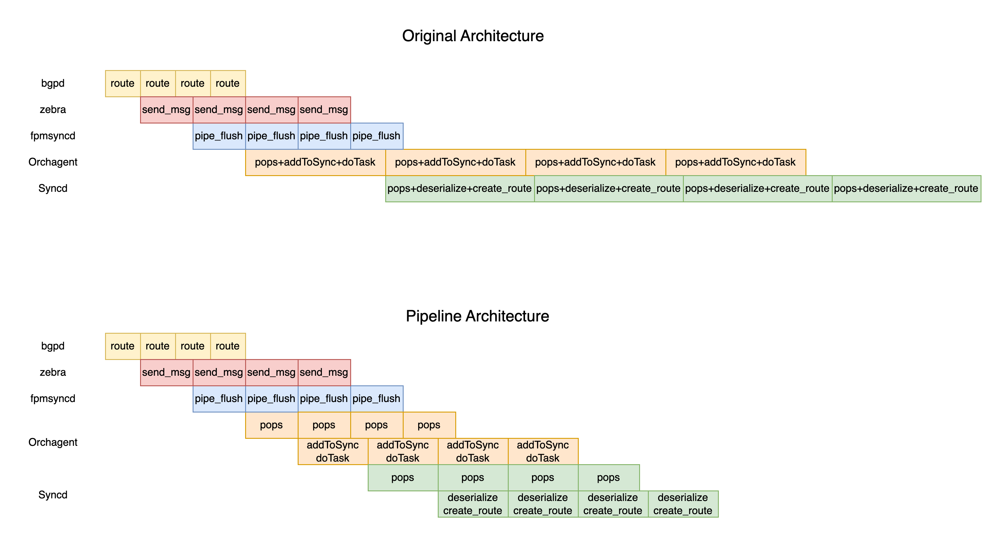

<!-- omit in toc -->
# SONiC Routing Loading Time Enhancement
<!-- omit in toc -->
## High Level Design Document
<!-- omit in toc -->
### Rev 0.1

<!-- omit in toc -->
## Table of Content

- [1. Scope](#1-scope)
- [2. Definitions/Abbreviations](#2-definitionsabbreviations)
- [3. Overview and Bottleneck](#3-overview-and-bottleneck)
  - [3.1 Bottleneck in orchagent](#31-bottleneck-in-orchagent)
  - [3.2 Bottleneck in syncd](#32-bottleneck-in-syncd)
  - [3.3 Bottleneck in APPL\_DB/Redis](#33-bottleneck-in-appl_dbredis)
  - [3.4 Bottleneck in zebra](#34-bottleneck-in-zebra)
- [4. Requirements](#4-requirements)
- [5. Architecture Design](#5-architecture-design)
- [6. High-Level Design](#6-high-level-design)
  - [6.1. Fpmsyncd](#61-fpmsyncd)
  - [6.2. Orchagent](#62-orchagent)
  - [6.3. Syncd](#63-syncd)
  - [6.4. APPL\_DB/Redis](#64-appl_dbredis)
    - [6.4.1 Producerstatetable](#641-producerstatetable)
    - [6.4.2 Consumerstatetable](#642-consumerstatetable)
  - [6.5. Zebra](#65-zebra)
- [7. WarmRestart Design Impact](#7-warmrestart-design-impact)
- [8. Restrictions/Limitations](#8-restrictionslimitations)
- [9. Testing Requirements/Design](#9-testing-requirementsdesign)
  - [9.1 System test](#91-system-test)
  - [9.2 Performance measurements](#92-performance-measurements)

<!-- omit in toc -->
### Revision
| Rev |     Date    |       Author       | Change Description                |
|:---:|:-----------:|:------------------:|-----------------------------------|
| 0.1 | Aug 16 2023 |   Yang FengSheng   | Initial Draft                     |

<!-- omit in toc -->
## About this Manual
This document provides general information about the routing loading time enhancement in SONiC.

## 1. Scope
This document describes end to end optimization to speed up BGP loading time.   

## 2. Definitions/Abbreviations

| Definitions/Abbreviation | Description                             |
| ------------------------ | --------------------------------------- |
| ASIC                     | Application specific integrated circuit |
| BGP                      | Border Gateway Protocol                 |
| SWSS                     | Switch state service                    |
| SYNCD                    | ASIC synchronization service            |
| FPM                      | Forwarding Plane Manager                |
| SAI                      | Switch Abstraction Interface            |
| HW                       | Hardware                                |
| SW                       | Software                                |

## 3. Overview and Bottleneck

With the growth of network scale, the routing loading time of SONiC also increases. For small-scale routing, the routing loading time of tens of seconds is acceptable. However, when the routing scale increases further, it is necessary to optimize the routing loading performance. The following figure shows the sonic route loading workflow using BGP as an example.

<!-- omit in toc -->
##### Figure 1. SONiC route loading workflow

<p align=center>

</p>

1. Bgpd recieves and parses the new packet from bgp's socket, process the bgp-update and notifies zebra of the existence of this new prefix and its associated protocol next-hop.
2. Zebra decodes the message from bgpd, and delivers this netlink-route message to fpmsyncd.
3. Fpmsyncd processes the netlink message and pushes this state into APPL_DB.
4. Being orchagent an APPL_DB subscriber, it consumes the routing information pushed to APPL_DB.
5. After processing the received information, orchagent will invoke sairedis APIs to push the route information into ASIC_DB.
6. Being syncd an ASIC_DB subscriber, it will receive the new state generated by orchagent.
7. Syncd will process the information and invoke SAI APIs to inject this state into the corresponding asic-driver. Finally new route is pushed to ASIC.

**NOTE**: This is not the [whole workflow for routing](https://github.com/sonic-net/SONiC/wiki/Architecture#routing-state-interactions), we ignore the kernel part since we only focus on sonic's side performance enhancement.

We have measured the end to end BGP loading performance on Alibaba platform. 
<!-- <style>
table{
  margin:auto;
}
</style> -->
| Module                   |  Speed(kilo-routes per second) |
| ------------------------ | -------------------------------|
| Zebra                    |  <center>17k/s                 |
| Fpmsyncd                 |  <center>17k/s                 |
| Orchagent                |  <center>10.5k/s               |
| Syncd                    |  <center>10.5k/s               |
| Total                    |  <center>10.5k/s               |

The total speed for end to end process is 10.5k/s now due to the bottleneck in orchagent as shown in the table. 

### 3.1 Bottleneck in orchagent

Orchagent performs a series of operations in *process 5*, as show in figure 2.
<!-- omit in toc -->
##### Figure 2. Orchagent workflow
<p align=center>

</p>

0. RouteOrch create a ConsumerStateTable to subscribe to the ROUTE_TABLE_CHANNEL event. When fpmsyncd publish route channel, select is triggered.
1. Orchagent call pops function to fetch data from APPL_DB including the following operations:
  - Pop prefix from ROUTE_TABLE_SET 
  - Traverse these prefixes and retrieve the temporary key data of _ROUTE_TABLE corresponding to the prefix.
  - set key in ROUTE_TABLE 
  - delete temporary key in _ROUTE_TABLE
2. Orchagent call addToSync function to record the data to a local file swss.rec.
3. Orchagent call doTask function to parse data one by one to create routes. Routes are temporarily recorded in the EntityBulker. After parsing all the routes, doTask function flush the EntityBulker and push the routes to ASIC_DB. 


These three main process in orchagent are running in serial, which will consume a lot of time, since the routes are processed one by one.  This is the main problem which causes low performance in loading routes.

### 3.2 Bottleneck in syncd
<!-- omit in toc -->
##### Figure 3. Syncd workflow
<p align=center>

</p>

Same scenario happens in syncd, when syncd pops routes from ASIC_DB and install routes to ASIC through SAI. 

### 3.3 Bottleneck in APPL_DB/Redis
Sonic uses redis to deliver data between modules. When the routing loading performance is improved, redis performance will also need improvement. Redis will become the bottleneck if there are too many redis I/O operations, since fpmsyncd and orchagent are working busily on APPL_DB at the same time.


The lua script for orchagent to pop data from APPL_DB not only do pop operations but also deletes and sets some keys in the table. The delete and set operations in orchagent won't contribute to route loading process but take extra time and slow down fpmsyncd's redis operations in return.

Redis operations in fpmsyncd also need optimization. Fpmsyncd flushes its redis pipeline every time it receives a message from zebra to make sure no data is left in pipeline; and it will publish ROUTE_TABLE_CHANNEL for every single piece of data pushed to APPL_DB. In a word, fpmsyncd flushes redis pipeline too often and publishes redis channel for too many times which will also cause low performance in both redis and orchagent.

### 3.4 Bottleneck in zebra
<!-- omit in toc -->
##### Figure 4. Zebra flame graph
<p align=center>

</p>
Zebra receive message from bgpd and send route information to kernel and fpmsyncd. Bottleneck has been observed in zapi_route_decode function, which causes slow start for zebra. Also zebra master thread will process route install result from kernel which will effect the performance of sending routes to fpmsyncd in the same thread.

## 4. Requirements

High level requirements:

- Alleviate the bottleneck in orchagent
- Alleviate the bottleneck in syncd
- Alleviate the bottleneck caused by redis flush in fpmsyncd 
- Alleviate the bottleneck caused by redis I/O operations in APPL_DB
- Alleviate the bottleneck in zebra (TBD)
- All modifications should maintain the time sequence of route loading
- All modules should support the warm restart operations after modified
- After optimization, end to end BGP loading performance should be improved

Restrictions/Limitations:

- SAI/ASIC performance is out of scope of this HLD document.

## 5. Architecture Design

<!-- omit in toc -->
##### Figure 5. Pipeline architecture
The figure below shows the high level architecture of software pipeline enhancement.
<p align=center>

</p>

- Add flush_timer in fpmsyncd to flush routes in bigger size.
- Add pipeline architecture in Orchagent and Syncd to process route in parallel.
- Use ring buffer to deliver message between threads. Ring buffer is better than mutex buffer in performance, since switching between kernel state and user state is not needed.
<!-- omit in toc -->
##### Figure 6. Pipeline timeline
The figure below shows the high level architecture of software pipeline enhancement.
comparing to the original architecture:

<p align=center>

</p>

Using pipeline inside orchagent and syncd can theoretically double the routing loading performance, if redis I/O speed can keep up with overall routing loading speed.

## 6. High-Level Design

### 6.1. Fpmsyncd
Fpmsyncd needs a timer thread to flush pipeline. *FLUSH_INTERVAL* controls the interval between two flush operations. An appropriate *FLUSH_INTERVAL* should be set to ensure route is buffered in redis pipeline and is not delayed for too long. The original flush operations in the main loop may not be needed any more. Since timer thread and main thread both operate on the same redis pipeline object, a mutex lock is needed here. 

Since data are now buffered in redis pipeline, we need to set a larger size for redis pipeline rather than 128 as default value. Redis pipeline will flush itself when it's full, so a larger size may also reduce redis I/O pressure. *10000* to *15000* is an appropriate size range in our use case. 

*FLUSH_INTERVAL* and *REDIS_PIPELINE_SIZE* should be configured by user for different use case.

### 6.2. Orchagent

The three main jobs ```table->pops(entries)```、```Consumer->addToSync(entries)```、```Consumer->drain()``` should work in parallel.
- ```table->pops(entries)``` should be called by the master thread to maintain the time sequence. 
- A new thread is added to call ```Consumer->addToSync(entries)``` and ```Consumer->drain()```.
- A ring buffer is used here to deliver ```entries``` popped by main thread to the new thread. 

**NOTE:** ```Consumer->addToSync(entries)``` can be called in master thread or the new thread depending on the ```pops()``` and ```doTask()``` performance. 

The ring buffer is not only used to deliver data, but also to buffer data. Since SAI doesn't work well on small piece of data, the new thread should check data size in ring buffer before it calls ```Consumer->addToSync(entries)```. Routes will still be cached in *Consumer->m_toSync* rather than ring buffer if routeorch fails to push route to ASIC_DB. 

A new Consumer class is defined to work in pipeline architecture.
```c++
class Consumer_pipeline : public Consumer {
  public:
    /**
     * Table->pops() should be in execute(). 
     * Called by master thread to maintain time sequence.
     */
    void execute() override;  
    /**
     * Main function for the new thread.
     */
    void drain() override;    
    /**
     * Need modified to support warm restart
     */
    void dumpPendingTasks(std::vector<std::string> &ts) override;
    size_t refillToSync(swss::Table* table) override;
    /**
     * Dump task to ringbuffer and load task from ring buffer
     */
    void dumptask(std::deque<swss::KeyOpFieldsValuesTuple> &entries);
    void loadtask(std::deque<swss::KeyOpFieldsValuesTuple> &entries);
  private:
    /**
     * Use ring buffer to deliver/buffer data
     */
    RingBuffer<swss::KeyOpFieldsValuesTuple> task_RingBuffer;
    /**
     * New thread for drain
     */
    std::thread m_thread_drain;
}
```
Routeorch should be initialized with the new class ```Consumer_pipeline``` in orchdaemon. 

### 6.3. Syncd
Function ```processBulkEntry``` should be running in a new thread, since this function consumes most of the time. A ring buffer is used here to deliver route from main thread to the new thread.

### 6.4. APPL_DB/Redis
#### 6.4.1 Producerstatetable
Lua script in producerstatetable for set operation should be modified to:
```lua
local added = redis.call('SADD', KEYS[2], ARGV[2])
for i = 0, #KEYS - 3 do
    redis.call('HSET', KEYS[3 + i], ARGV[3 + i * 2], ARGV[4 + i * 2])
end
```
Same modification should be add to *luaDel*. Redis operation *SET/DEL* is separated from *PUBLISH*. *PUBLISH* should be bound with redis pipeline flush rather than *SET* or *DEL*. At the same time *PUBLISH* should be added to ```RedisPipeline->flush()```.

**NOTE:** The original lua script works fine for other modules, we can add a new Producerstatetable class and a new ```RedisPipeline->flush()``` function for fpmsyncd. 

#### 6.4.2 Consumerstatetable
Lua script for *Table->pops()* for route should change to the following script:
```lua
redis.replicate_commands()
local ret = {}
local tablename = KEYS[2]
local stateprefix = ARGV[2]
local keys = redis.call('SPOP', KEYS[1], ARGV[1])
local n = table.getn(keys)
for i = 1, n do
   local key = keys[i]
   local fieldvalues = redis.call('HGETALL', stateprefix..tablename..key)
   table.insert(ret, {key, fieldvalues})
end
return ret
```
Removing the *DEL* and *HSET* operations can significantly improve redis performance. We have observed nearly 100% speed improvement in *Table->pops()* function call, 10% speed improvement in transferring routes through APPL_DB between fpmsyncd and orchagent.

**NOTE:** The original lua script works fine for other modules, we can add a new ```pops()``` function for routeorch using the new lua script. 

### 6.5. Zebra
TBD

## 7. WarmRestart Design Impact
The pipeline architecture should support WarmRestart. When WarmRestart, the threads we added should be blocked till restart procedure ends. Take orchagent for example, we need to make sure ring buffer is empty and the new thread is waiting for restart before we call ```dumpPendingTasks()```. 

## 8. Restrictions/Limitations
We have already observed bottleneck in *libsai*. Since it varies depending on the hardware, SAI/ASIC performance is out of scope of this HLD document.


## 9. Testing Requirements/Design
### 9.1 System test
- All modules should maintain the time sequence of route loading.
- All modules should support WarmRestart.
- No routes should remain in redis pipeline longer than configured interval.
- No data should remain in ring buffer when system finishes routing loading.
- System should be able to install/remove/set routes (faster than before).

### 9.2 Performance measurements
<!-- omit in toc -->
##### Figure 7. Current performance
The figure below shows current performance on Alibaba's platform in an end to end process.
<p align=center>

</p>

- Time zebra uses to receive 500k routes from bgpd and send to fpmsyncd, while other modules takes no action.
- Time fpmsyncd uses to receive 500k routes from zebra and push to APPL_DB, while other modules takes no action.
- Time orchagent uses to pops 500k routes from APPL_DB and push to ASIC_DB, while other modules takes no action.
- Time Syncd uses to pops 500k routes from ASIC_DB and install to ASIC, while other modules takes no action.
- Time the whole system uses to loading 500k routes from another bgp peer.