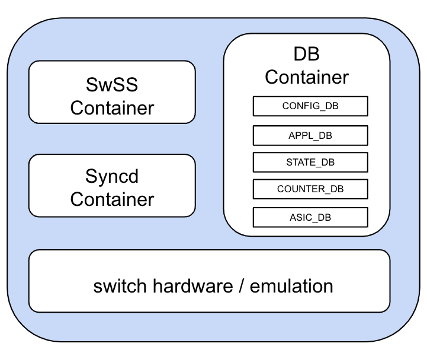

# SONiC Conformance Guideline

## 1. Overview 

SONiC is an open source network OS project hosted under the Linux Foundation. The SONiC hardware abstraction design enables the network OS to run seamlessly on a wide range of network switches from various platform and ASIC vendors. The system's well-defined software architecture provides flexibility to support diverse networking solutions. With the support of a vibrant ecosystem and active community, SONiC has been successfully adopted into many use cases like AI/ML networking, Smart NICs, enterprise networks, campus environments, SDN, and more. 

While SONiC continues to evolve, the LFX SONiC governing board and technical steering committee recognize the importance of establishing a clear and consistent definition for SONiC, which will help safeguard the integrity and direction of the project.

This document outlines a set of conformance guidelines for SONiC distributions to adhere to. It defines the core essentials of SONiC to preserve the integrity of the project, while maintaining flexibility to encourage innovation and ongoing evolution.

## 2. Defining SONiC 

A SONiC distribution must adhere to key system architecture requirements, including the necessary Docker containers and databases as outlined below:

### 2.1. Key System Architecture 

#### 2.1.1. Container Based Application 

A SONiC distribution must follow a container-based architecture. This modular design relies on Docker containers, with each functional module running independently in its own container, where containers are organized based on functional cohesion.

#### 2.1.2. Switch State Service Database

A SONiC distribution must utilize a switch state service database to store and manage subsystem state information.

Application publishes and subscribes to relevant dataset allowing modules to operate independently, meanwhile, maintaining layer abstraction. The switch state stored in the database will help provisioning in-service software upgrade. 

#### 2.1.3. OS Kernel 

A SONiC distribution must have a Debian Linux kernel.

#### 2.1.4. Hardware abstraction

##### 2.1.4.1. SAI 

A SONiC distribution must use SAI APIs to program switch commands to the underlying layer. SONiC must use the SAI header definitions provided by OCP SAI community.  

SONiC application is agnostic to network processor vendors, if a SONiC distribution is used for hardware switching and forwarding, the vendor SAI implementation must comply with the SAI header version in SONiC. 

On the other hand, if the SONiC distribution is intended for softswitch, the softswitch SAI implementation will program the switching commands coherent to the relevant switch environment. 

##### 2.1.4.2. PMON

A SONiC distribution that intends to run on bare metal must use PMON for platform management. PMON provides platform abstraction, enabling the management of platform devices and allowing direct access to platform sensors and controls.

### 2.2. Essential Docker Container 

A SONiC distribution must have the following 3 containers

#### 2.2.1. Switch State Service Container 

The Switch State Service (SwSS) container comprises a collection of processes to allow effective communication among SONiC modules. The Orchagent within the SwSS container receives and processes state information from corresponding syncd daemons, publishes state information into ASIC_DB for syncd container. SwSS facilitates the exchange of state information between application and data plane layers.  

#### 2.2.2. Switch State Service Database Container 

A SONiC distribution must have a switch state service database container. The database engine enables the exchange of subsystem state information, application publish and subscribe on relevant dataset to allow modules to operate independently for layer abstraction. 

The data stored in the database can be used for record-keeping and to support ISSU.

#### 2.2.3. Syncd Container

The Syncd container is responsible for synchronizing the SONiC network state with the data forwarding module, regardless of whether the data plane uses physical network silicon or a softswitch. Syncd is responsible for initializing the forwarding layer. Syncd is a subscriber of ASIC_DB.  

### 2.3. Databases

A SONiC distribution must have the following databases within the Switch State Service Database container

#### 2.3.1. APPL_DB

APPL_DB stores state information generated by application containers. It serves as an entry point for applications to interact with the lower layers. 

#### 2.3.2. CONFIG_DB

CONFIG_DB holds configuration information for applications, enabling the management and adjustment of application settings.

#### 2.3.3. STATE_DB

STATE_DB stores key operational states for entities configured in the system. It holds the state information required to resolve dependencies between different functional modules.

#### 2.3.4. ASIC_DB

ASIC_DB stores the necessary state for data plane operations

#### 2.3.5. COUNTERS_DB

COUNTERS_DB stores counters and statistics associated with the system. This state can be utilized to satisfy CLI requests or feed telemetry channels for monitoring.

## 3. Conformance Verification  

TBD

## 4. Reference 

https://github.com/sonic-net/SONiC/wiki/Architecture

