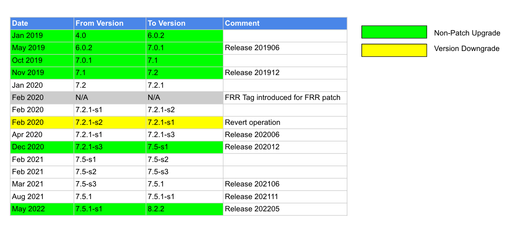

# **SONiC Community FRR Upgrade Work Flow**

The current SONiC release program handles FRR upgrades and patching on an as-needed basis. This proposed FRR upgrade workflow aims to establish a formalized cadence and process for FRR upgrades in future SONiC releases. Any changes or updates to this workflow must first be discussed and agreed upon by the Routing Working Group to reach consensus.

# SONiC FRR Maintainers
## 6 month cadence on FRR version evalutation

Before 202511 release, the role of SONiC FRR Maintainer rotates among Broadcom, Microsoft, Alibaba, NVIDIA, and Dell, with each term lasting 12 months. Recent FRR upgrades include:

* Broadcom upgraded FRR to 8.2.2 in the 202205 release
* Nvidia upgraded FRR to 8.5.1 in the 202311 release
* Nvidia upgraded FRR to 8.5.4 in the 202405 release
* Broadcom upgraded FRR to 10.0.1 in the 202411 release
* Cisco upgraded FRR to 10.3 in the 202505 release

Given that FRR releases a new version approximately every four months and the SONiC community aims to incorporate more FRR features, we propose shortening the FRR Maintainer term to six months. This change would allow for more frequent evaluations of whether an FRR upgrade should be included in each 6-month SONiC release cycle.

## FRR maintainers and onboard schedule
We expand the list of FRR Maintainers to include Cisco and Nexthop.AI. We also welcome other companies to reach out TSC if they are interested in becoming a FRR Maintainer.

The proposed maintainer assignments for the next three SONiC releases are as follows:

* 202511 release: Alibaba (primary), shadowed by Nexthop.AI
* 202605 release: Microsoft
* 202611 release: Dell
* 202705 release: Nvidia
* 202711 release: Broadcom
* 202805 release: Cisco
* ... (Defer this list to the routing WG to decide the next assignment based on rotation record.) ...

If there is a large feature / commits from a member company, it is better to swap the FRR release maintainer duty to make FRR maintaining more smooth. This transition must be approved by Routing Workgroup and announce to community to avoid confusion.

## FRR maintainers' duties
The assigned FRR Maintainer is responsible for the following tasks:
* Default 6 months assignment
* If applicable, select an FRR release to align with the SONiC release (e.g., SONiC 202511 uses FRR 10.4.1).
* Release maintainer to subscribe to FRR project, and be the FRR Point-of-Contact on behalf of SONiC
* Lead SONiC FRR issue triage in routing working group.  Fix may come from SONiC contributors or from FRR community, maintainer is responsible to drive the fix to unblock SONiC community
	-   Submit fixes to FRR project, submit new FRR topo test to FRR project if there is a gap
* Bring in FRR vulnerabilities and critical patches to SONiC
    - The FRR maintainer for the current SONiC release is responsible for monitoring the corresponding FRR release branch (e.g., the 10.4 branch for SONiC 202511) and cherry-picking any critical patches into both the SONiC release branch (202511) and the master branch.
    - Additionally, the maintainer must also monitor the FRR branch selected for the previous SONiC release (e.g., FRR 10.3 for SONiC 202505) and apply any critical patches from that branch to the prior SONiC release branch (e.g., 202505).

Note:
1. Currently, SONiC FRR maintainers are NOT responsible for cherry-picking patches across different SONiC releases. For example, applying critical patches from the FRR 10.4 branch to the SONiC 202505 branch. Such patches must first be merged upstream into FRR.

# FRR version in SONiC Releases
## FRR Project Release Cadence
-  FRR release numbering scheme x.y.z-s#
-  New FRR releases roughly every 4 months. FRR release information could be found from https://frrouting.org/release/
-  SONiC to stay out from major/minor releases (x.y) and use patch release (.z) for stability (eg, FRR 8.3.1 instead of 8.3 if it is for 202211 release). Another example, at the time of SONiC FRR upgrade, the following FRR versions are avaialble 9.0.1, 8.5.3, 9.0, the guidance is to upgrade with the latest patch release 9.0.1
-  For every sonic release, the recommendation is to update FRR to last stable minor release by default. If there is a need to change this guidance, the request needs to be discussed and approved in Routing Working Group.

## SONiC Release and FRR version Mapping
| SONiC Release | FRR Version | FRR Maintainer |
---------------|-------------|--------------|
| 202205 | 8.2.2 | Broadcom |
| 202311 | 8.5.1 | Nvidia |
| 202405 | 8.5.4 | Nvidia |
| 202411 | 10.0.1 | Broadcom |
| 202505 | 10.3.0 | Cisco |
| 202511 | 10.4.1 | Alibaba, with help from Cisco and Nexthop.AI |

# FRR Patches
Regarding FRR patches, whenever a patch is introduced based on a fix from FRR, there should be a clearly defined timeline for its removal to prevent the accumulation of excessive patches in SONiC. Such patches should remain only for a maximum of two upgrade cycles. If a patch cannot be removed within this timeframe, explicit approval must be obtained from the Routing Working Group.

## PPatch Naming Convention
We will adopt the following format for patch filenames:

```
<patch_id>_<patch_type>_<patch_name>
```

### Patch ID
Each patch begins with a unique numeric ID (e.g., 0025, 0055). To support long-term traceability, the Routing Working Group has agreed to preserve this ID even if the patch is later removed during an FRR upgrade. This ensures consistent identification and simplifies historical tracking.

### Patch Type
By default, this field is left empty. However, if a patch is SONiC-specific and not intended for upstream submission to FRR, the type should be set to SONiC-ONLY. This clearly signals that the patch is meant to remain in SONiC indefinitely.

### Patch Name
Use a descriptive name that clearly conveys the purpose or scope of the patch.

### Examples
* The patch 0055-zebra-Add-nexthop-group-id-to-route-dump.patch will remain unchanged, because it has already been committed upstream to FRR. This name gives a hint that this patch will be removed later and this fix will be included in the next FRR upgrade cycle.
* The patch 0025-Fpm-problems.patch will be renamed to 0025-SONiC-ONLY-Fpm-problems.patch to indicate it is a long-lived, SONiC-specific patch that will not be upstreamed to FRR.

## SONiC FRR vulnerability and patch upgrade in between SONiC releases

-   FRR CVE Fixes
	-   Reference nvd.nist.gov cvss v3.x [rating](https://nvd.nist.gov/vuln-metrics/cvss#)
	-   Bring in Critical and High FRR CVE patches into SONiC
	-   Sample of [Critical](https://nvd.nist.gov/vuln/search/results?form_type=Advanced&results_type=overview&search_type=all&isCpeNameSearch=false&cpe_vendor=cpe%3A%2F%3Afrrouting&cpe_product=cpe%3A%2F%3A%3Afrrouting&cvss_version=3&cvss_v3_severity=CRITICAL), sample of [High](https://nvd.nist.gov/vuln/search/results?form_type=Advanced&results_type=overview&search_type=all&isCpeNameSearch=false&cpe_vendor=cpe%3A%2F%3Afrrouting&cpe_product=cpe%3A%2F%3A%3Afrrouting&cvss_version=3&cvss_v3_severity=HIGH)
	-   There are regular security scan in Azure pipeline, CVEs will be filed to sonic-buildimage/issues
	-   SONiC FRR release maintainer should subscribe to nvd.nist.gov for FRR alerts
	-   Need a process to bring in CVEs to earlier SONiC releases too (open to suggestions)

-   Patch FRR Bug Fixes
	-  Each FRR release branch will be supported for one year. The first six months will be managed by the current release manager, and the subsequent six months will be overseen by the next release manager.
	-  Each FRR release maintainer is responsible for tracking critical fixes across two FRR release branches: the current branch and the previous branch they were assigned to maintain.
	-  The SONiC FRR release maintainer should subscribe to the FRR project to identify and incorporate critical patches relevant to SONiC from the monitored branches. It is recommended to monitor the two active FRR release branches on a monthly basis. If there is uncertainty about whether a fix qualifies as critical, this issue would be discussed in the Routing Working Group. Only critical fixes will be backported to the SONiC FRR release to ensure code stability.
	-
# SONiC Release FRR Upgrade
-   SONiC default to rebase FRR in every SONiC community release
-   SONiC FRR upgrade test requirements
	-   MANDATORY: Discuss with FRR community or review release notes about what is new and What are the highlight? Adjust additional test cases to add/or execute if needed.
	-   MANDATORY: Pass all Azure pipeline build test and LGTM as required by the standard code PR merge process
  	-   OPTIONAL: Additional tests in respect to specific changeset in the upgrade as deem necessary, manual tests should be automated and submitted to improve future test coverage

## SONiC FRR Upgrade Steps
-   Create sonic-frr branch for the target FRR version
	-   Contact release manager
-   Find new package dependencies
	-   Upload newly required packages to a common location (Azure)
-   Submodule update to new FRR commit id
-   Code changes
    -   Version change in Makefiles
    -   New Makefiles for new packages (if any)
    -   Port patches
	-   Evaluate whether existing FRR patches still applicable to new FRR version
	-   Apply the old patches into new FRR version, and generate new patch files. Keep original credentials
	-   If the changes are already present in new FRR version, discard the old patch file
	-   If the patch does not apply, manually merge the changes and resolve any conflicts
    -    Review the existing FRR commands in SONiC techsupport. Add, Remove or modify the FRR commands in the generate_dump script based on the new FRR version. https://github.com/sonic-net/sonic-utilities/blob/master/scripts/generate_dump
    -    Build and verify
	    -   Use PTF on local server, – or –
	    -   Manually verify BGP, VRF, IPv4, IPv6 (on sonic-vs.)
    -   Create PR with the following template
		- [https://github.com/sonic-net/sonic-buildimage/pull/15965](https://github.com/sonic-net/sonic-buildimage/pull/15965)
-   FRR upgrade PRs for reference
    - [https://github.com/sonic-net/sonic-buildimage/pull/15965](https://github.com/sonic-net/sonic-buildimage/pull/15965)
    - [https://github.com/sonic-net/sonic-buildimage/pull/10691](https://github.com/sonic-net/sonic-buildimage/pull/10691)
    - [https://github.com/sonic-net/sonic-buildimage/pull/11502](https://github.com/sonic-net/sonic-buildimage/pull/11502)
    - [https://github.com/sonic-net/sonic-buildimage/pull/10947](https://github.com/sonic-net/sonic-buildimage/pull/10947)

## Logivity Test for each SONiC FRR release
Besides the regular sonic-mgmt test cases in PR, we need run the following cases as longevity:

1. bgp/test_bgp_stress_link_flap.py — please run with --completeness_level=thorough. Based on Chun'ang Li's comments, SONiC repo PR test pipelines will run bgp/test_bgp_stress_link_flap.py.
2. bgp/test_bgp_suppress_fib.py — please run with --completeness_level=thorough

Note:
1. Currently, we don't have Azure pipelines to run these two sanity checks. Need to ask Microsoft team's help to run it manually. This issue will bring up to TSC for allocate resources for setting up sanity check pipelines.
2. Based on some Microsoft team's comments, race condition issues typically surface on lower-performance platforms. We need TSC to allocate some budget to build a dedicated lab for this purpose. The budget and decision for setting up additional testbed is not in the scope of this document. This needs to be brought up to TSC and board for discussion.

# Backups
## SONiC FRR Version Upgrade History

<p align=center>

</p>
